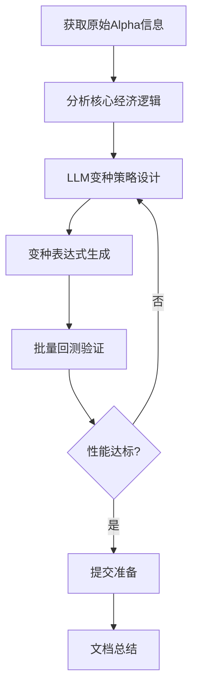

# 顾问 MZ45384 (Rank 51) 技术答疑与对话录 (Technical Conversations)

> 本文档为顾问 MZ45384 (Rank 51) 参与论坛技术讨论的对话上下文，以 Q&A 问答形式展现其指导思路。已进行脱敏与图片 OCR 解析。

### 技术对话片段 1 (原帖: PnL = ∑(Robustness * Creativity))
- **原帖链接**: https://support.worldquantbrain.com[Commented] 16815刀季度奖经验分享-小虎经验分享_38980270292631.md
- **时间**: 3个月前

**提问/主帖背景 (SD17531)**:
大家好，我是SD7531，顾问朋友们都很nice，一般喊我小虎哥。

我从 2024 年 12 月 13 日开始提交顾问 Alpha，近三次定级都很幸运地保住了 GM。我本科专业是公共管理，代码一般是现学现用。 我的背景在顾问里也算和量化最不相关的之一，不过反过来说，我这样的背景都能做到 GM，相信绝大多数顾问朋友，只要愿意付出时间和精力，都能冲刺 GM。
下面附上我的季度奖和一路熬过来的每日 base，希望能给大家一些鼓励：只要不放弃，收益终究会一柱擎天。
 
> [!NOTE] [图片 OCR 识别内容]
> Other Payment
> For attending the offline meetup at BJISHIGZin Dec 2024
> 02/07/2025
> US$137.00
> 202501 Payment
> 05/22/2025
> 05$112.73
> Value Factor Improvement Program Rewards
> 06/25/2025
> 0S$200.00
> Referral
> 07/13/2025
> 0S$200.00
> 2025 Q2 Payment
> 08/17/2025
> 0S$322.73
> Research Award August
> 09/01/2025
> 05$28.00
> Research Award
> 09/11/2025
> US$14.00
> Research Award
> 09/25/2025
> 0S$28.00
> 2025 Q3 Payment
> 11/24/2025
> US$8,065.01
> Referral
> 12/26/2025
> US$200.00
> Power Pool Alphas Monthly Competition December 2025
> ASI D1
> 01/01/2026
> US$500.00
> 2025Q4 Payment
> 02/21/2026
> US$16,815.45
> 11/18/2024
> Total
> 05$26,622.92
> 03/10/2026
  
> [!NOTE] [图片 OCR 识别内容]
> Base Payment
> 02/20/2026
> Regular:
> 57.93
> Super:
> 55.58
> Total:
> 113.50999999999999
> 75
> 50
> 25
> Mar
> May
> May
> Mar
 
关于季度奖，顾问 YX23928 (Rank 8)和
顾问 SJ65808 (Rank 20)两位大佬都有分享。帖子分别如下： [[Commented] 一个非科班选手的量化打怪升级路季度奖突破万刀必读_38628691756695.md]([Commented] 一个非科班选手的量化打怪升级路季度奖突破万刀必读_38628691756695.md)  

 [[Commented] 2025年度收入回顾经验分享_38623022786839.md]([Commented] 2025年度收入回顾经验分享_38623022786839.md)  

两位大佬讲的很详细了，我听了也获益良多。

先分享一下我自己的数据：
第一次季度奖，VF分别是0.70-0.85-0.82，weight增加值大概是9，对应的季度奖是8065刀。
第二次季度奖，VF分别是0.87-0.90-0.98，weight增加值大概是15，对应的季度奖是16815刀。

从这两次季度奖的情况来看，我个人认为季度奖的核心影响因素是该季度第三个月的 VF 值 —— 这个 VF 值恰好核算的是当季所有提交 Alpha 的质量。和其他顾问交流后也能明显感受到，最后一个月 VF 低于 0.9，大多只能拿到保底季度奖。

那么如何获取更高的季度奖， 其实也可以转化为如何获得更高的VF。我来分享一下我自己的提交数据，希望对大家有所启发。我将所有历史提交的RA和SA的数据下载下来，让AI帮忙绘制了月度Alpha平均指标和三月滚动的alpha平均指标（correlation）的图片。
 
> [!NOTE] [图片 OCR 识别内容]
> Monthly Combo Bars
> Lines (Baseline-Relative) (2025-03 to 2025-12)
> 文
> 111
> 65
> 114
> 85
> 30
> 20
> 10
> {}:$
> 吕@员:岛芒思
> @3&8@3
> 恩
> 总@@寰@
> &38838@
> 38号
> 李e38
> }a:黑
> 88g8品&
> 8军$8}&
> 38 $@ $寺
> 8
> O 寸
> C C
> R
> O I R
> i
> @
>  「
> &
> M 
> Se
> 寸卉
> O M
> S83
> CC
> 385
> U m
> m m
> SSaw
> mni
> SRo
> 10
> 20
> Metrics (bars & lines)
> sharpe
> margin
> prodcorrelation
> 30
> fitness
> turnover
> selfCorrelation
> returns
> 8
> 2025-03
> 2025-04
> 2025-05
> 2025-07
> 2025-08
> 2025-09
> 2025-10
> 2025-11
> 2025-12
> 2025-C
 
 
> [!NOTE] [图片 OCR 识别内容]
> Rolling 3M Combo Bars + Lines (Baseline-Relative) (2025-06 to 2025-12)
> 30
> 20
> 10
> & 守835苎%
> 总v8怠畏莴舄
> `:
> 8@@S$
> 莴营s~
> 总&盒窝@密忿
> 8品 @@%@品
> @$ &
> 品
> @R &
> @
> 88Rg孚8 &
> @%38w& @
> SO
> 8
> R~ &
> R
>  e只~
> M M
> S9a m
> qm
> 9896
> SR Sw
> mm
> 58
> OUm
> 10
> -20
> Metrics (bars
> lines)
> Sharpe
> margin
> prodCorrelation
> fitness
> turnoVer
> selfCorrelation
> 30
> returns
> @%5
> 9e6
> 1品
> 2025-03
> 2025-04
> 2025-05
> 2025-06
> 2025-07
> 2025-08
> 2025-09
> 2025-10
> 2025-11
> 2025-12
 我个人的 VF 近几个月呈缓慢增长趋势，波动幅度并不大。VF 的计算公式在论坛中就能找到。从我的数据来看，VF受影响确实是多个维度综合产生的，提交数量、prod_correlation、其他顾问的提交质量等都会对VF产生影响。可以从图片中看到我每个月的数据情况，大家有需要的话可以根据我的VF波动去评估该月份涨跌的主要原因。值得一提的是，我 10-12 月每月提交的因子数量相差不大，且呈 85-91-92 的递增趋势，prodCorrelation 表现也比 7-9 月好不少；而 7-9 月的提交量则是 114-111-71 的骤降趋势，这或许是我第四季度 VF 优于第三季度的原因之一。

然后打铁还需自身硬，老生常谈的diversity也是必须安排上的。我的策略，主要是在同一个region多做不同类型的因子，但是不做太多不同的region。
 
> [!NOTE] [图片 OCR 识别内容]
> Pyramid alpha distribution
> 2025-04, October 1st, 2025
> December 31st, 2025
> Category
> USA
> GLB
> EUR
> ASI
> CHN
> KOR
> TN
> HKG
> JPN
> AMR
> IND
> Analyst
> 16
> Broker
> Earnings
> Fundamental
> Imbalance
> Insiders
> Institutions
> MaCro
> Model
> 15
> News
> Option
> Other
> Price Volume
> Risk
> Sentiment
> Short Interest
> Social Media
 因子方面，我优先做多操作符少的 Atom，同时尽量使用不同的操作符来保证多样性。
 
> [!NOTE] [图片 OCR 识别内容]
> Tie breaker criteria
> 2025-04, October 1st, 2025
> December 31st, 2025
> Operators per Alpha
> Operators used
> Fields per Alpha
> 4.19
> 167
> 1.39
> Fields used
> Community activity
> Max simulation streak
> 223
> 44.7
> 387
 
非常建议大家用代码分析自己每月的提交数据，我把 AI 写的代码附在文末，抛砖引玉。大家可以结合 Region、Delay、月度、三月周期做更深度的分析，再和自己的历史 VF 数据对比，相信会有不少收获。

最后，一路走来，我感觉我的运气还是非常不错的，运气最好的地方就是认识了这么多优秀的顾问朋友。感谢课代表，游戏王，橘子姐，毛老师，MG哥，老虎哥，大角羊，文姐，孙哥，强哥（排名不分先后），太多需要感谢的，就不一一列举了。希望后面能跟大家继续一起进步。

大佬们，请继续教我本领！！！

代码：

import os

import json

import math

import logging

from pathlib import Path

from datetime import datetime, timezone

from typing import Any, Dict, List, Optional, Tuple

import requests

import pandas as pd

import numpy as np

import matplotlib.pyplot as plt

import seaborn as sns

LOG_NAME = Path(__file__).stem

BASE_DIR = Path(__file__).resolve().parent

LOG_DIR = BASE_DIR / "logs"

OUTPUT_DIR = BASE_DIR / "outputs"

CHART_DIR = OUTPUT_DIR / "charts"

def _ensure_dirs() -> None:

LOG_DIR.mkdir(parents=True, exist_ok=True)

OUTPUT_DIR.mkdir(parents=True, exist_ok=True)

CHART_DIR.mkdir(parents=True, exist_ok=True)

def _setup_logger() -> logging.Logger:

_ensure_dirs()

logger = logging.getLogger(LOG_NAME)

if not logger.handlers:

logger.setLevel(logging.INFO)

fh = logging.FileHandler(LOG_DIR / f"{LOG_NAME}.log", encoding="utf-8")

fmt = logging.Formatter("[%(asctime)s] %(levelname)s %(message)s")

fh.setFormatter(fmt)

logger.addHandler(fh)

return logger

logger = _setup_logger()

def print_exec_timestamp() -> None:

ts = datetime.now().strftime("%Y-%m-%d %H:%M:%S")

print(f"[EXECUTION START] {ts}")

logger.info(f"Execution started at {ts}")

def get_session() -> requests.Session:

try:

# 优先使用现成的已登录会话

from machine_lib import s as session  # type: ignore

if isinstance(session, requests.Session):

logger.info("Using session 's' from machine_lib")

return session

except Exception:

pass

try:

from machine_lib import login  # type: ignore

logger.info("Creating session via machine_lib.login()")

session = login()

if isinstance(session, requests.Session):

return session

except Exception as e:

logger.info(f"machine_lib.login() not available or failed: {e}")

logger.info("Fallback to anonymous requests.Session (may not work without auth)")

return requests.Session()

def _iso_with_tz(dt: datetime) -> str:

if dt.tzinfo is None:

dt = dt.replace(tzinfo=timezone.utc)

return dt.astimezone().isoformat(timespec="seconds")

def fetch_alphas_since(

session: requests.Session,

start_submitted_dt: datetime,

limit: int = 100,

) -> List[Dict[str, Any]]:

logger.info(f"Fetching alphas since submission time: {start_submitted_dt.isoformat()}")

results: List[Dict[str, Any]] = []

base = " [[链接已屏蔽]) "

start_str = _iso_with_tz(start_submitted_dt)

offset = 0

while True:

url = (

f"{base}?limit={limit}&offset={offset}"

f"&dateSubmitted%3E={requests.utils.quote(start_str, safe='')}"

f"&hidden=false"

f"&status!=UNSUBMITTED%1FIS-FAIL"

f"&order=-dateSubmitted"

)

try:

resp = session.get(url)

if resp.status_code != 200:

logger.info(f"Fetch error: status={resp.status_code}, text={resp.text[:300]}")

break

data = resp.json()

page = data.get("results", [])

results.extend(page)

count = int(data.get("count", 0))

logger.info(f"Fetched {len(page)} items at offset {offset}, total so far {len(results)}/{count}")

if offset + len(page) >= count or len(page) < limit:

break

offset += limit

except Exception as e:

logger.info(f"Exception during fetch: {e}")

break

logger.info(f"Total fetched records: {len(results)}")

return results

def _safe_get(d: Dict[str, Any], *keys: str, default: Any = None) -> Any:

cur: Any = d

for k in keys:

if not isinstance(cur, dict) or k not in cur:

return default

cur = cur[k]

return cur

def normalize_alpha_record(rec: Dict[str, Any]) -> Dict[str, Any]:

is_data = rec.get("is", {}) or {}

risk_neu = is_data.get("riskNeutralized", {}) or rec.get("riskNeutralized", {}) or {}

settings = rec.get("settings", {}) or {}

norm = {

"id": rec.get("id"),

"type": rec.get("type"),

"name": rec.get("name"),

"dateCreated": rec.get("dateCreated"),

"dateSubmitted": rec.get("dateSubmitted"),

"settings": {

"region": settings.get("region"),

"universe": settings.get("universe"),

"delay": settings.get("delay"),

"decay": settings.get("decay"),

"neutralization": settings.get("neutralization"),

"truncation": settings.get("truncation"),

"pasteurization": settings.get("pasteurization"),

"unitHandling": settings.get("unitHandling"),

"visualization": settings.get("visualization"),

},

"is": {

"fitness": is_data.get("fitness"),

"longCount": is_data.get("longCount"),

"shortCount": is_data.get("shortCount"),

"turnover": is_data.get("turnover"),

"returns": is_data.get("returns"),

"drawdown": is_data.get("drawdown"),

"margin": is_data.get("margin"),

"sharpe": is_data.get("sharpe"),

"prodCorrelation": is_data.get("prodCorrelation"),

"selfCorrelation": is_data.get("selfCorrelation"),

},

"riskNeutralized": {

"pnl": risk_neu.get("pnl"),

"bookSize": risk_neu.get("bookSize"),

"longCount": risk_neu.get("longCount"),

"shortCount": risk_neu.get("shortCount"),

"turnover": risk_neu.get("turnover"),

"returns": risk_neu.get("returns"),

"drawdown": risk_neu.get("drawdown"),

"margin": risk_neu.get("margin"),

"fitness": risk_neu.get("fitness"),

"sharpe": risk_neu.get("sharpe"),

},

"checks": rec.get("is", {}).get("checks", []) or rec.get("checks", []),

}

if "regular" in rec and isinstance(rec["regular"], dict):

norm["regular"] = {"code": rec["regular"].get("code")}

if "combo" in rec:

norm["combo"] = rec.get("combo")

if "selection" in rec:

norm["selection"] = rec.get("selection")

return norm

def save_json(data: List[Dict[str, Any]], path: Path) -> None:

_ensure_dirs()

with path.open("w", encoding="utf-8") as f:

json.dump(data, f, ensure_ascii=False, indent=2)

logger.info(f"Saved JSON data to {path}")

def load_json(path: Path) -> List[Dict[str, Any]]:

with path.open("r", encoding="utf-8") as f:

data = json.load(f)

logger.info(f"Loaded JSON data from {path}")

return data

def _parse_month(s: Optional[str]) -> Optional[str]:

if not s:

return None

try:

dt = datetime.fromisoformat(s.replace("Z", "+00:00"))

return dt.strftime("%Y-%m")

except Exception:

return None

def _to_frame(records: List[Dict[str, Any]]) -> pd.DataFrame:

rows = []

for r in records:

isd = r.get("is", {}) or {}

st = r.get("settings", {}) or {}

rows.append(

{

"id": r.get("id"),

"type": r.get("type"),

"name": r.get("name"),

"dateSubmitted": r.get("dateSubmitted"),

"submitMonth": _parse_month(r.get("dateSubmitted")),

"region": st.get("region"),

"delay": st.get("delay"),

"turnover": isd.get("turnover"),

"fitness": isd.get("fitness"),

"returns": isd.get("returns"),

"drawdown": isd.get("drawdown"),

"margin": isd.get("margin"),

"sharpe": isd.get("sharpe"),

"prodCorrelation": isd.get("prodCorrelation"),

"selfCorrelation": isd.get("selfCorrelation"),

}

)

df = pd.DataFrame(rows)

return df

def compute_monthly_stats(records: List[Dict[str, Any]]) -> pd.DataFrame:

df = _to_frame(records)

df = df.dropna(subset=["submitMonth", "region", "delay"])

metrics = ["sharpe", "fitness", "returns", "drawdown", "margin", "turnover", "prodCorrelation", "selfCorrelation"]

agg_map = {m: "mean" for m in metrics}

grp = df.groupby(["submitMonth", "region", "delay"], dropna=False)

stats = grp.agg(agg_map).reset_index()

cnt_total = grp.size().reset_index(name="count")

cnt_regular = grp.apply(lambda g: (g["type"] == "REGULAR").sum()).reset_index(name="count_regular")

cnt_super = grp.apply(lambda g: (g["type"] == "SUPER").sum()).reset_index(name="count_super")

out = stats.merge(cnt_total, on=["submitMonth", "region", "delay"], how="left")

out = out.merge(cnt_regular, on=["submitMonth", "region", "delay"], how="left")

out = out.merge(cnt_super, on=["submitMonth", "region", "delay"], how="left")

return out

def export_table(df: pd.DataFrame, name: str) -> Tuple[Path, Path]:

_ensure_dirs()

csv_path = OUTPUT_DIR / f"{name}.csv"

xlsx_path = OUTPUT_DIR / f"{name}.xlsx"

try:

df.to_csv(csv_path, index=False, encoding="utf-8-sig")

with pd.ExcelWriter(xlsx_path, engine="xlsxwriter") as writer:

df.to_excel(writer, index=False, sheet_name="data")

logger.info(f"Exported tables: {csv_path.name}, {xlsx_path.name}")

return csv_path, xlsx_path

except PermissionError:

ts = datetime.now().strftime("%Y%m%d_%H%M%S")

csv_alt = OUTPUT_DIR / f"{name}_{ts}.csv"

xlsx_alt = OUTPUT_DIR / f"{name}_{ts}.xlsx"

df.to_csv(csv_alt, index=False, encoding="utf-8-sig")

with pd.ExcelWriter(xlsx_alt, engine="xlsxwriter") as writer:

df.to_excel(writer, index=False, sheet_name="data")

logger.info(f"Target locked, exported tables to: {csv_alt.name}, {xlsx_alt.name}")

return csv_alt, xlsx_alt

def _line_trend(df: pd.DataFrame, metric: str, title: str, fname: str) -> None:

tmp = df.groupby("submitMonth")[metric].mean().reset_index()

tmp = tmp.sort_values("submitMonth")

plt.figure(figsize=(10, 4))

sns.lineplot(data=tmp, x="submitMonth", y=metric, marker="o")

plt.title(title)

plt.xticks(rotation=45, ha="right")

plt.tight_layout()

out_path = CHART_DIR / fname

plt.savefig(out_path, dpi=150)

plt.close()

logger.info(f"Saved chart: {out_path.name}")

def _heatmap_region_delay(df: pd.DataFrame, metric: str, title: str, fname: str) -> None:

tmp = df.groupby(["region", "delay"])[metric].mean().reset_index()

pivot = tmp.pivot(index="region", columns="delay", values=metric)

plt.figure(figsize=(10, 6))

sns.heatmap(pivot, annot=True, fmt=".3f", cmap="Blues")

plt.title(title)

plt.tight_layout()

out_path = CHART_DIR / fname

plt.savefig(out_path, dpi=150)

plt.close()

logger.info(f"Saved chart: {out_path.name}")

def _bar_latest_month(df: pd.DataFrame, metric: str, title: str, fname: str) -> None:

if "submitMonth" not in df.columns or df["submitMonth"].dropna().empty:

return

latest = sorted(m for m in df["submitMonth"].dropna().unique())[-1]

tmp = df[df["submitMonth"] == latest].groupby(["region", "delay"])[metric].mean().reset_index()

plt.figure(figsize=(12, 5))

sns.barplot(data=tmp, x="region", y=metric, hue="delay")

plt.title(f"{title} (Latest: {latest})")

plt.tight_layout()

out_path = CHART_DIR / fname

plt.savefig(out_path, dpi=150)

plt.close()

logger.info(f"Saved chart: {out_path.name}")

def generate_monthly_charts(df: pd.DataFrame) -> None:

metrics = [

("sharpe", "Average Sharpe Ratio"),

("fitness", "Average Fitness"),

("returns", "Average Return"),

("drawdown", "Average Drawdown"),

("margin", "Average Margin"),

("turnover", "Average Turnover"),

("prodCorrelation", "Average Prod Correlation"),

("selfCorrelation", "Average Self Correlation"),

]

for col, title in metrics:

_line_trend(df, col, f"{title} - Monthly Trend", f"monthly_trend_{col}.png")

_heatmap_region_delay(df, col, f"{title} by Region x Delay", f"heatmap_region_delay_{col}.png")

_bar_latest_month(df, col, f"{title} Region/Delay", f"bar_latest_{col}.png")

def compute_custom_periods(

records: List[Dict[str, Any]],

periods: List[Tuple[str, datetime, datetime]],

) -> pd.DataFrame:

df = _to_frame(records)

df = df.dropna(subset=["dateSubmitted", "region", "delay"])

def within(dts: str, start: datetime, end: datetime) -> bool:

try:

dt = datetime.fromisoformat(dts.replace("Z", "+00:00"))

return start <= dt <= end

except Exception:

return False

rows = []

for label, start, end in periods:

mask = df["dateSubmitted"].apply(lambda s: within(s, start, end))

sub = df[mask].copy()

if sub.empty:

continue

metrics = ["sharpe", "fitness", "returns", "drawdown", "margin", "turnover", "prodCorrelation", "selfCorrelation"]

grp = sub.groupby(["region", "delay"], dropna=False)

stats = grp[metrics].mean().reset_index()

stats.insert(0, "period", label)

cnt_total = grp.size().reset_index(name="count")

cnt_regular = grp.apply(lambda g: (g["type"] == "REGULAR").sum()).reset_index(name="count_regular")

cnt_super = grp.apply(lambda g: (g["type"] == "SUPER").sum()).reset_index(name="count_super")

st = stats.merge(cnt_total, on=["region", "delay"], how="left")

st = st.merge(cnt_regular, on=["region", "delay"], how="left")

st = st.merge(cnt_super, on=["region", "delay"], how="left")

rows.append(st)

if not rows:

return pd.DataFrame(

columns=[

"period", "region", "delay",

"sharpe", "fitness", "returns", "drawdown", "margin", "prodCorrelation", "selfCorrelation",

"count", "count_regular", "count_super",

]

)

return pd.concat(rows, ignore_index=True)

def generate_custom_period_charts(df: pd.DataFrame, period_label: str) -> None:

metrics = [

("sharpe", "Average Sharpe Ratio"),

("fitness", "Average Fitness"),

("returns", "Average Return"),

("drawdown", "Average Drawdown"),

("margin", "Average Margin"),

("turnover", "Average Turnover"),

("prodCorrelation", "Average Prod Correlation"),

("selfCorrelation", "Average Self Correlation"),

]

for col, title in metrics:

tmp = df.groupby("region")[col].mean().reset_index()

plt.figure(figsize=(10, 4))

sns.barplot(data=tmp, x="region", y=col)

plt.title(f"{title} by Region - {period_label}")

plt.tight_layout()

out_path = CHART_DIR / f"{period_label}_region_{col}.png"

plt.savefig(out_path, dpi=150)

plt.close()

logger.info(f"Saved chart: {out_path.name}")

plt.figure(figsize=(10, 5))

sns.boxplot(data=df, x="delay", y=col)

plt.title(f"{title} Distribution by Delay - {period_label}")

plt.tight_layout()

out_path = CHART_DIR / f"{period_label}_delay_box_{col}.png"

plt.savefig(out_path, dpi=150)

plt.close()

logger.info(f"Saved chart: {out_path.name}")

def _scale_for_display(df: pd.DataFrame, cols: List[str]) -> pd.DataFrame:

scaled = df.copy()

if "returns" in cols and "returns" in scaled.columns:

scaled["returns"] = scaled["returns"] * 100.0

if "turnover" in cols and "turnover" in scaled.columns:

scaled["turnover"] = scaled["turnover"] * 100.0

if "margin" in cols and "margin" in scaled.columns:

scaled["margin"] = scaled["margin"] * 10000.0

if "prodCorrelation" in cols and "prodCorrelation" in scaled.columns:

scaled["prodCorrelation"] = scaled["prodCorrelation"] * 10.0

if "selfCorrelation" in cols and "selfCorrelation" in scaled.columns:

scaled["selfCorrelation"] = scaled["selfCorrelation"] * 10.0

return scaled

def _barline_unified(months: List[str], values: List[float], title: str, y_label: str, out_name: str, y_lim: Tuple[float, float], counts: Optional[List[float]] = None) -> None:

x = np.arange(len(months))

plt.figure(figsize=(12, 5))

bars = plt.bar(x, values, color="#4c72b0", alpha=0.6)

plt.plot(x, values, color="#c44e52", marker="o", linewidth=2)

plt.xticks(ticks=x, labels=months, rotation=45, ha="right")

plt.ylabel(y_label)

plt.title(title)

plt.ylim(y_lim)

y_base = 0.0

y_off = (y_lim[1] - y_lim[0]) * 0.03

y_text = max(y_lim[0] + y_off * 0.2, y_base - y_off)

for rect, v in zip(bars, values):

plt.text(rect.get_x() + rect.get_width() / 2, y_text, f"{v:.2f}", ha="center", va="center", fontsize=8, rotation=90)

if counts is not None and len(counts) == len(x):

y_top = y_lim[1] - (y_lim[1] - y_lim[0]) * 0.02

for xi, c in zip(x, counts):

plt.text(xi, y_top, f"n={int(c)}", ha="center", va="top", fontsize=8, color="#333333")

plt.tight_layout()

out_path = CHART_DIR / out_name

plt.savefig(out_path, dpi=150)

plt.close()

logger.info(f"Saved chart: {out_path.name}")

def generate_monthly_barline_unified(monthly_df: pd.DataFrame, year: int = 2025, start_month: int = 6, end_month: int = 12) -> None:

metrics = ["sharpe", "fitness", "returns", "drawdown", "margin", "turnover", "prodCorrelation", "selfCorrelation"]

tmp = monthly_df.groupby("submitMonth")[metrics + ["count"]].agg({**{m: "mean" for m in metrics}, "count": "sum"}).reset_index()

months = [f"{year}-{m:02d}" for m in range(start_month, end_month + 1)]

tmp = tmp[tmp["submitMonth"].isin(months)].copy()

tmp = tmp.sort_values("submitMonth")

tmp_scaled = _scale_for_display(tmp, metrics)

y_max = 0.0

for c in metrics:

if c in tmp_scaled.columns:

vals = tmp_scaled[c].dropna().values

if len(vals):

y_max = max(y_max, float(np.nanpercentile(np.abs(vals), 95)))

if y_max == 0.0:

y_max = 1.0

y_lim = (-y_max * 1.1, y_max * 1.1)

title_map = {

"sharpe": "Average Sharpe (Monthly)",

"fitness": "Average Fitness (Monthly)",

"returns": "Average Return % (Monthly)",

"drawdown": "Average Drawdown (Monthly)",

"margin": "Average Margin ×1e4 (Monthly)",

"turnover": "Average Turnover % (Monthly)",

"prodCorrelation": "Average Prod Correlation (Monthly)",

"selfCorrelation": "Average Self Correlation (Monthly)",

}

y_label_map = {

"returns": "%",

"turnover": "%",

"margin": "×1e4",

}

# 月度 alpha 数量（按 submitMonth 聚合求和），用于叠加显示

cnt_series = monthly_df.groupby("submitMonth")["count"].sum().reindex(tmp_scaled["submitMonth"]).fillna(0)

cnt_list = cnt_series.tolist()

for c in metrics:

if c not in tmp_scaled.columns:

continue

vals = tmp_scaled[c].tolist()

_barline_unified(

months=[m for m in tmp_scaled["submitMonth"]],

values=vals,

title=title_map.get(c, c),

y_label=y_label_map.get(c, ""),

out_name=f"barline_monthly_{c}_{year}-{start_month:02d}_to_{year}-{end_month:02d}.png",

y_lim=y_lim,

counts=cnt_list,

)

# 额外输出 alpha 数量（月度总数，求和）

cnt = monthly_df.groupby("submitMonth")["count"].sum().reindex(months).fillna(0)

if not cnt.empty:

cnt_vals = cnt.tolist()

cnt_ymax = max(abs(v) for v in cnt_vals) if cnt_vals else 1.0

if cnt_ymax == 0:

cnt_ymax = 1.0

cnt_ylim = (0, cnt_ymax * 1.15)

_barline_unified(

months=months,

values=cnt_vals,

title="Alpha Count (Monthly)",

y_label="count",

out_name=f"barline_monthly_count_{year}-{start_month:02d}_to_{year}-{end_month:02d}.png",

y_lim=cnt_ylim,

)

def generate_rolling3_barline_unified(monthly_df: pd.DataFrame, year: int = 2025, start_month: int = 6, end_month: int = 12) -> None:

metrics = ["sharpe", "fitness", "returns", "drawdown", "margin", "turnover", "prodCorrelation", "selfCorrelation"]

tmp = monthly_df.groupby("submitMonth")[metrics + ["count"]].agg({**{m: "mean" for m in metrics}, "count": "sum"}).reset_index()

months = [f"{year}-{m:02d}" for m in range(start_month, end_month + 1)]

tmp = tmp[tmp["submitMonth"].isin(months)].copy().sort_values("submitMonth")

tmp_scaled = _scale_for_display(tmp, metrics)

seq = months

tmp_scaled = tmp_scaled.set_index("submitMonth").reindex(seq)

roll = tmp_scaled[metrics].rolling(window=3, min_periods=1).mean().reset_index()

y_max = 0.0

for c in metrics:

vals = roll[c].dropna().values

if len(vals):

y_max = max(y_max, float(np.nanpercentile(np.abs(vals), 95)))

if y_max == 0.0:

y_max = 1.0

y_lim = (-y_max * 1.1, y_max * 1.1)

title_map = {

"sharpe": "Average Sharpe (Rolling 3M)",

"fitness": "Average Fitness (Rolling 3M)",

"returns": "Average Return % (Rolling 3M)",

"drawdown": "Average Drawdown (Rolling 3M)",

"margin": "Average Margin ×1e4 (Rolling 3M)",

"turnover": "Average Turnover % (Rolling 3M)",

"prodCorrelation": "Average Prod Correlation (Rolling 3M)",

"selfCorrelation": "Average Self Correlation (Rolling 3M)",

}

y_label_map = {

"returns": "%",

"turnover": "%",

"margin": "×1e4",

}

for c in metrics:

vals = roll[c].tolist()

_barline_unified(

months=roll["submitMonth"].tolist(),

values=vals,

title=title_map.get(c, c),

y_label=y_label_map.get(c, ""),

out_name=f"barline_rolling3_{c}_{year}-{start_month:02d}_to_{year}-{end_month:02d}.png",

y_lim=y_lim,

counts=cnt_vals,

)

# 额外输出 alpha 数量（3M滚动总数，按月度 count 求和后再滚动求和）

cnt_month = monthly_df.groupby("submitMonth")["count"].sum().reindex(seq).fillna(0).astype(float)

cnt_roll = cnt_month.rolling(window=3, min_periods=1).sum()

cnt_vals = cnt_roll.tolist()

cnt_ymax = max(abs(v) for v in cnt_vals) if cnt_vals else 1.0

if cnt_ymax == 0:

cnt_ymax = 1.0

cnt_ylim = (0, cnt_ymax * 1.15)

_barline_unified(

months=cnt_roll.index.tolist(),

values=cnt_vals,

title="Alpha Count (Rolling 3M)",

y_label="count",

out_name=f"barline_rolling3_count_{year}-{start_month:02d}_to_{year}-{end_month:02d}.png",

y_lim=cnt_ylim,

)

def _combo_positions(n_months: int, n_bars: int) -> Tuple[List[np.ndarray], float]:

x = np.arange(n_months)

total = 0.8

w = total / max(n_bars, 1)

w = min(max(w, 0.05), 0.15)  # 瘦长柱：限制在 [0.05, 0.15]

gap = (total - w * n_bars) / 2.0

offs = []

for i in range(n_bars):

offs.append(x - total / 2 + gap + (i + 0.5) * w + i * (0))

return offs, w

def generate_monthly_combo_barline(monthly_df: pd.DataFrame, year: int = 2025, metrics: Optional[List[str]] = None, baseline_map: Optional[Dict[str, float]] = None, start_month: int = 6, end_month: int = 12) -> None:

if metrics is None:

metrics = ["sharpe", "fitness", "returns", "margin", "turnover", "prodCorrelation", "selfCorrelation"]

if baseline_map is None:

baseline_map = {

"sharpe": 1.0, "fitness": 0.0, "returns": 0.0, "margin": 0.0,

"turnover": 0.0, "prodCorrelation": 0.0, "selfCorrelation": 0.0

}

tmp = monthly_df.groupby("submitMonth")[metrics + ["count"]].agg({**{m: "mean" for m in metrics}, "count": "sum"}).reset_index()

months = [f"{year}-{m:02d}" for m in range(start_month, end_month + 1)]

tmp = tmp[tmp["submitMonth"].isin(months)].copy().sort_values("submitMonth")

tmp = _scale_for_display(tmp, metrics)

# 计算以基线为参考的增量，用于放大差异

deltas = {}

y_max = 0.0

for c in metrics:

if c not in tmp.columns:

continue

base = baseline_map.get(c, 0.0)

vals = (tmp[c] - base).astype(float)

deltas[c] = vals

if len(vals):

y_max = max(y_max, float(np.nanpercentile(np.abs(vals), 95)))

if y_max == 0.0:

y_max = 1.0

y_lim = (-y_max * 1.1, y_max * 1.1)

x = np.arange(len(tmp))

pos, bar_w = _combo_positions(len(tmp), len(metrics))

colors = ["#4c72b0", "#55a868", "#c44e52", "#8172b2", "#ccb974", "#64b5cd", "#e17c05", "#76b7b2"]

plt.figure(figsize=(14, 6))

for i, m in enumerate(metrics):

if m not in tmp.columns:

continue

p = pos[i] if i < len(pos) else x

bars = plt.bar(p, deltas[m].tolist(), width=bar_w, color=colors[i % len(colors)], alpha=0.85, label=m, linewidth=0)

plt.plot(x, deltas[m].tolist(), color=colors[i % len(colors)], marker="o", linewidth=1.6)

y_base = 0.0

y_off = (y_lim[1] - y_lim[0]) * 0.03

y_text = max(y_lim[0] + y_off * 0.2, y_base - y_off)

for j, rect in enumerate(bars):

val = float(deltas[m].iloc[j] + baseline_map.get(m, 0.0))

plt.text(rect.get_x() + rect.get_width() / 2, y_text, f"{val:.2f}", ha="center", va="center", fontsize=7, color=colors[i % len(colors)], rotation=90)

plt.xticks(ticks=x, labels=tmp["submitMonth"].tolist(), rotation=45, ha="right")

plt.ylim(y_lim)

plt.axhline(0, color="#999999", linewidth=1, linestyle="--")

plt.title(f"Rolling 3M Combo Bars + Lines (Baseline-Relative) ({year}-{start_month:02d} to {year}-{end_month:02d})")

plt.legend(ncol=3, fontsize=9, title="Metrics (bars & lines)")

# 顶部标注 3M 滚动 alpha 数量（按月滚动求和）

cnt_month = monthly_df.groupby("submitMonth")["count"].sum().reindex(months).fillna(0).astype(float)

cnt_roll = cnt_month.rolling(window=3, min_periods=1).sum().tolist()

for idx, month in enumerate(months):

plt.text(idx, y_lim[1] * 0.95, f"{int(cnt_roll[idx])}", ha="center", va="top", fontsize=7, color="#333333")

# 在顶部右侧标注每月 alpha 数量

for idx, month in enumerate(months):

total_cnt = int(tmp.loc[tmp["submitMonth"] == month, "count"].sum())

plt.text(idx, y_lim[1] * 0.95, f"{total_cnt}", ha="center", va="top", fontsize=7, color="#333333")

plt.tight_layout()

out_path = CHART_DIR / f"combo_monthly_{year}-{start_month:02d}_to_{year}-{end_month:02d}.png"

plt.savefig(out_path, dpi=150)

plt.close()

logger.info(f"Saved chart: {out_path.name}")

def generate_rolling3_combo_barline(monthly_df: pd.DataFrame, year: int = 2025, metrics: Optional[List[str]] = None, baseline_map: Optional[Dict[str, float]] = None, start_month: int = 6, end_month: int = 12) -> None:

if metrics is None:

metrics = ["sharpe", "fitness", "returns", "margin", "turnover", "prodCorrelation", "selfCorrelation"]

if baseline_map is None:

baseline_map = {

"sharpe": 1.0, "fitness": 0.0, "returns": 0.0, "margin": 0.0,

"turnover": 0.0, "prodCorrelation": 0.0, "selfCorrelation": 0.0

}

tmp = monthly_df.groupby("submitMonth")[metrics + ["count"]].agg({**{m: "mean" for m in metrics}, "count": "sum"}).reset_index()

months = [f"{year}-{m:02d}" for m in range(start_month, end_month + 1)]

tmp = tmp[tmp["submitMonth"].isin(months)].copy().sort_values("submitMonth")

tmp = _scale_for_display(tmp, metrics)

seq = months

tmp = tmp.set_index("submitMonth").reindex(seq)

roll = tmp[metrics].rolling(window=3, min_periods=1).mean().reset_index()

# 基于基线的增量

deltas = {}

y_max = 0.0

for c in metrics:

if c not in roll.columns:

continue

base = baseline_map.get(c, 0.0)

vals = (roll[c] - base).astype(float)

deltas[c] = vals

if len(vals):

y_max = max(y_max, float(np.nanpercentile(np.abs(vals), 95)))

if y_max == 0.0:

y_max = 1.0

y_lim = (-y_max * 1.1, y_max * 1.1)

x = np.arange(len(roll))

pos, bar_w = _combo_positions(len(roll), len(metrics))

colors = ["#4c72b0", "#55a868", "#c44e52", "#8172b2", "#ccb974", "#64b5cd", "#e17c05", "#76b7b2"]

plt.figure(figsize=(14, 6))

for i, m in enumerate(metrics):

if m not in deltas:

continue

p = pos[i] if i < len(pos) else x

bars = plt.bar(p, deltas[m].tolist(), width=bar_w, color=colors[i % len(colors)], alpha=0.85, label=m, linewidth=0)

plt.plot(x, deltas[m].tolist(), color=colors[i % len(colors)], marker="o", linewidth=1.6)

y_base = 0.0

y_off = (y_lim[1] - y_lim[0]) * 0.03

y_text = max(y_lim[0] + y_off * 0.2, y_base - y_off)

for j, rect in enumerate(bars):

val = float(deltas[m].iloc[j] + baseline_map.get(m, 0.0))

plt.text(rect.get_x() + rect.get_width() / 2, y_text, f"{val:.2f}", ha="center", va="center", fontsize=7, color=colors[i % len(colors)], rotation=90)

plt.xticks(ticks=x, labels=roll["submitMonth"].tolist(), rotation=45, ha="right")

plt.ylim(y_lim)

plt.axhline(0, color="#999999", linewidth=1, linestyle="--")

plt.title(f"Rolling 3M Combo Bars + Lines (Baseline-Relative) ({year}-06 to {year}-12)")

plt.legend(ncol=3, fontsize=9, title="Metrics (bars & lines)")

plt.tight_layout()

out_path = CHART_DIR / f"combo_rolling3_{year}-{start_month:02d}_to_{year}-{end_month:02d}.png"

plt.savefig(out_path, dpi=150)

plt.close()

logger.info(f"Saved chart: {out_path.name}")

def generate_rolling3_combo_windows(monthly_df: pd.DataFrame, year: int = 2025, metrics: Optional[List[str]] = None, baseline_map: Optional[Dict[str, float]] = None, start_month: int = 6, end_month: int = 12) -> None:

if metrics is None:

metrics = ["sharpe", "fitness", "returns", "margin", "turnover", "prodCorrelation", "selfCorrelation"]

if baseline_map is None:

baseline_map = {"sharpe": 1.0, "fitness": 0.0, "returns": 0.0, "margin": 0.0, "turnover": 0.0, "prodCorrelation": 0.0, "selfCorrelation": 0.0}

tmp = monthly_df.groupby("submitMonth")[metrics].mean().reset_index()

months = [f"{year}-{m:02d}" for m in range(start_month, end_month + 1)]

tmp = tmp[tmp["submitMonth"].isin(months)].copy().sort_values("submitMonth")

tmp = _scale_for_display(tmp, metrics)

seq = months

tmp = tmp.set_index("submitMonth").reindex(seq)

roll = tmp[metrics].rolling(window=3, min_periods=1).mean().reset_index()

for i in range(2, len(seq)):

start = seq[i - 2]

end = seq[i]

vals = []

deltas = []

labels = []

for m in metrics:

v = roll.loc[i, m]

if pd.isna(v):

continue

vals.append(float(v))

deltas.append(float(v - baseline_map.get(m, 0.0)))

labels.append(m)

if not vals:

continue

y_max = max(abs(x) for x in deltas) if deltas else 1.0

if y_max == 0.0:

y_max = 1.0

y_lim = (-y_max * 1.2, y_max * 1.2)

x = np.arange(len(labels))

plt.figure(figsize=(10, 5))

colors = ["#4c72b0", "#55a868", "#c44e52", "#8172b2", "#ccb974", "#64b5cd", "#e17c05", "#76b7b2"]

bar_colors = [colors[j % len(colors)] for j in range(len(labels))]

bars = plt.bar(x, deltas, width=0.35, color=bar_colors, alpha=0.9)

y_base = 0.0

y_off = (y_lim[1] - y_lim[0]) * 0.04

y_text = max(y_lim[0] + y_off * 0.2, y_base - y_off)

for j, rect in enumerate(bars):

plt.text(rect.get_x() + rect.get_width() / 2, y_text, f"{vals[j]:.2f}", ha="center", va="center", fontsize=9, rotation=90)

plt.axhline(0, color="#999999", linewidth=1, linestyle="--")

plt.xticks(ticks=x, labels=labels, rotation=30, ha="right")

plt.ylim(y_lim)

plt.title(f"Rolling 3M Window {start} to {end} (Baseline-Relative)")

plt.tight_layout()

out_path = CHART_DIR / f"combo_rolling3_window_{start}_to_{end}.png"

plt.savefig(out_path, dpi=150)

plt.close()

logger.info(f"Saved chart: {out_path.name}")

def run_pipeline_default() -> None:

print_exec_timestamp()

force_download = False

start_dt = datetime(2024, 12, 1, tzinfo=timezone.utc)

json_path = OUTPUT_DIR / "alphas_since_2024-12.json"

if force_download:

session = get_session()

raw = fetch_alphas_since(session, start_dt, limit=100)

data = [normalize_alpha_record(r) for r in raw]

save_json(data, json_path)

else:

if json_path.exists():

data = load_json(json_path)

else:

session = get_session()

raw = fetch_alphas_since(session, start_dt, limit=100)

data = [normalize_alpha_record(r) for r in raw]

save_json(data, json_path)

monthly_df = compute_monthly_stats(data)

export_table(monthly_df, "monthly_stats")

generate_monthly_charts(monthly_df)

generate_monthly_barline_unified(monthly_df, year=2025, start_month=3, end_month=12)

generate_rolling3_barline_unified(monthly_df, year=2025, start_month=3, end_month=12)

generate_monthly_combo_barline(

monthly_df,

year=2025,

metrics=["sharpe", "fitness", "returns", "margin", "turnover", "prodCorrelation", "selfCorrelation"],

baseline_map={"sharpe": 1.0, "fitness": 0.0, "returns": 0.0, "margin": 0.0, "turnover": 0.0, "prodCorrelation": 0.0, "selfCorrelation": 0.0},

start_month=3,

end_month=12,

)

generate_rolling3_combo_barline(

monthly_df,

year=2025,

metrics=["sharpe", "fitness", "returns", "margin", "turnover", "prodCorrelation", "selfCorrelation"],

baseline_map={"sharpe": 1.0, "fitness": 0.0, "returns": 0.0, "margin": 0.0, "turnover": 0.0, "prodCorrelation": 0.0, "selfCorrelation": 0.0},

start_month=3,

end_month=12,

)

generate_rolling3_combo_windows(

monthly_df,

year=2025,

metrics=["sharpe", "fitness", "returns", "margin", "turnover", "prodCorrelation", "selfCorrelation"],

baseline_map={"sharpe": 1.0, "fitness": 0.0, "returns": 0.0, "margin": 0.0, "turnover": 0.0, "prodCorrelation": 0.0, "selfCorrelation": 0.0},

start_month=3,

end_month=12,

)

p_start = datetime(2025, 3, 1, tzinfo=timezone.utc)

p_end = datetime(2025, 5, 31, 23, 59, 59, tzinfo=timezone.utc)

custom_df = compute_custom_periods(

data,

periods=[("2025-03_to_2025-05", p_start, p_end)],

)

export_table(custom_df, "custom_period_stats_2025-03_to_2025-05")

if not custom_df.empty:

generate_custom_period_charts(custom_df, "2025-03_to_2025-05")

logger.info("Pipeline finished")

if __name__ == "__main__":

run_pipeline_default()

**顾问 MZ45384 (Rank 51) 的解答与建议**:
虎哥太给力了，不论是vf, wf，还是六维（operator count和field count拉满了），都是顶级啊。太强了！！！（再三感叹），希望能像虎哥一样成长。

======================================================================================
知难上，戒骄狂，常自省，穷途明。“寻找可以重复数千次的东西。”——吉姆·西蒙斯（量化投资之王、文艺复兴科技创始人）
# Alpha∞ Engine Status: ONLINE [♦♦♦♦♦♦♦♦♦♦] 100%
# sys.setrecursionlimit(α∞) 
# PnL = ∑(Robustness * Creativity)
#无限探索、鲁棒性优先，创新性增值 
#Where there is a will, there is a way. 路漫漫其修远兮，吾将上下而求索。
======================================================================================


---

### 技术对话片段 2 (原帖: PnL = ∑(Robustness * Creativity))
- **原帖链接**: [Commented] 2025年Q4 Genus升级失败小结.md
- **时间**: 4个月前

**提问/主帖背景 (LL61351)**:
今天收到“Genius Levels Refreshed!”的通知，点到genus页面查看一下，怎么还是三个五角星？


> [!NOTE] [图片 OCR 识别内容]
> Genius level: Gold
> Best level: Gold
> Current quarter end: March 31st, 2026
> GOLD


我有点不敢相信自己的眼睛，因为上赛季我可是点了58个塔，提交了219个因子，我本以为可以拿下Master可以自由组Super Alpha的！！！

我赶紧在培训群中问了一下，得到小伙伴的确认后，我再也不能克服自己的情绪！为什么这样？为什么连Expert都不是，我止不住的问自己。

这是我的combine alpha performance:


> [!NOTE] [图片 OCR 识别内容]
> Eligibility Criteria
> 2025-04, October 1st, 2025
> December 31st, 2025
> Gold
> Expert
> Master
> Grandmaster
> Signals
> 219
> more to Grandmaster
> 20
> 120
> 220
> Pyramids Completed
> 58
> 2 more to Grandmaster
> 10
> 30
> 60
> Combined Alpha Performance
> 2.53
> Reached Grandmaster
> 0.5
> Combined Selected Alpha Performance
> No matching Alphas; refreshed monthly
> Combined Power Pool Alpha Performance
> -2.78


这是我的点塔情况：


> [!NOTE] [图片 OCR 识别内容]
> Pyramid alpha distribution
> 2025-04, October
> 2025
> December31st 2025
>  Category
> USA
> GL
> EUR
> ASI
> CHN
> IND
> Analyst
> 10
> Droker
> Earnings
> Fundamental
> 12
> Imbalance
> Inslders
> Insttutons
> Macro
> Moael
> 14
> News
> Opton
> Other
> Price Volume
> 14
> 19
> 12
> 33
> Risk
> Senrmenr
> ShortInterest
> Social Media
> 1st


...............................................此处省略N字.............................................................................

好吧，事已至此，也只能好好总结一下问题，亡羊补牢。

首先，我推测在每一个级别的定级算法上，应该是先圈中所有达到这个级别的顾问（点塔是基本的入围标准，包括上一级别未被选中的），再根据提交的因子performance及六维累计排名得分计入最终获奖名单。我12月combine alpha performance为2.08，1月份更新后是不是2.53，这个没问题。

根本的问题出在六维上，看一下排名：


> [!NOTE] [图片 OCR 识别内容]
> Minimum 排名:
> Maximum 排名:
> 10
> entries per page
> Search:
> 下载原始JSON
> 显示/隐藏列
> 排名
> 用户ID
> 仨
> 当前等级
> 仨 三
> 达成等级
> 仨
> 三
> 最终等级
> 仨
> 三
> 国家/地区
> 1L61351
> X []
> [
> [
> [
> [
> 1077
> 1L61351
> GOLD
> master
> expert
> CN
> Consultant 基本信息
> RA Count: 274
> RA Prod Corr: 0.6043
> RA Self Corr: 0.3082
> SA Count: 1
> SA Prod Corr: 0.6031
> SA Self Corr: 0.4839
> University: Jiangxi University Of Finance And Economic
> Value Factor: 0.94
> Weight Factor: 0
> 基础信息
> Signals: 219
> Pyramids: 58
> Combined Alpha Performance: 2.53
> Combined Selected Alpha Performance: 0
> Combined Power Pool Alpha Performance: -2.78
> 六维
> Operators used: 74
> Operator AVg: 6.82
> Fields used: 282
> Field
> 2.58
> Community Activity: 0.4
> Max Simulation Streak: 133
> Gold 排名总和: 14585
> Gold Operator Count Rank: 484
> Gold Operator AVg Rank: 4485
> Gold Field Count Rank: 408
> Gold Field AVg Rank: 4105
> Gold Community Activity Rank: 3444
> Gold Max Simulation Streak Rank: 1658
> Expert 排名总和:5771
> Expert Operator Count Rank: 439
> Expert Operator
> Rank: 1454
> Expert Field Count Rank: 215
> Expert Field
> Rank:
> 290
> Expert Community Activity Rank: 1377
> Expert Max Simulation Streak Rank: 995
> Master 排名总和:2707
> Master Operator Count Rank: 350
> Master Operator
> Rank: 592
> Master Field Count Rank: 132
> Master Field Avg Rank: 540
> Master Community Activity Rank: 585
> Master Max Simulation Streak Rank: 507
> Showing
> to 1of1
> entry (filtered from 5,845 total entries)
> AVg:
> AVg
> AVS
> AVg


相比较第1个Master的排名：


> [!NOTE] [图片 OCR 识别内容]
> Consultant 基本信息
> RA Count: 1196
> RA Prod Corr: 0.5571
> RA Self Corr: 0.3382
> SA Count: 345
> SA Prod Corr: 0.5856
> SA Self Corr: 0.5402
> University: null
> Value Factor: 0.8
> Weight Factor: 22.89
> 基础信息
> Signals: 460
> Pyramids: 64
> Combined Alpha Performance: 1.83
> Combined Selected Alpha Performance: 1.56
> Combined Power Pool Alpha Performance: 1.61
> 六维
> Operators used: 155
> Operator AVg: 2.85
> Fields used: 294
> Field
> 1.11
> Community Activity: 34.1
> Max Simulation Streak: 281
> Gold 排名总和:2370
> Gold Operator Count Rank: 37
> Gold Operator
> Rank: 497
> Gold Field Count Rank: 377
> Gold Field AVg Rank: 702
> Gold Community Activity Rank: 278
> Gold Max Simulation Streak Rank: 478
> Expert 排名总和: 1096
> Expert Operator Count Rank: 37
> Expert Operator AVg Rank: 113
> Expert Field Count Rank: 195
> Expert Field
> Rank: 138
> Expert Community Activity Rank: 240
> Expert Max Simulation Streak Rank: 372
> Master 排名总和:700
> Master Operator Count Rank: 37
> Master Operator AVg Rank: 51
> Master Field Count Rank: 119
> Master Field AVg Rank: 64
> Master Community Activity Rank: 190
> Master Max Simulation Streak Rank: 238
> 76
> 5C87308
> GRANDMASTER
> master
> master
> IN
> 77
> 0P72475
> GRANDMASTER
> master
> master
> CN
> 78
> J71699
> GRANDMASTER
> master
> master
> CN
> 79
> DN41247
> MASTER
> master
> master
> VN
> 80
> AK44462
> MASTER
> master
> master
> IN
> Showing 71 to 80 of 5,845 entries
> 8
> 585
> AVg:
> AVg
> AVg


最后一个Master的排名：


> [!NOTE] [图片 OCR 识别内容]
> Consultant 基本信息
> RA Count: 1024
> RA Prod Corr: 0.6279
> RA Self Corr: 0.3863
> SA Count: 319
> SA Prod Corr: 0.6347
> SA Self Corr: 0.5524
> University: CHUKA university
> Value Factor: 0.5
> Weight Factor: 18.13
> 基础信息
> Signals: 408
> Pyramids: 80
> Combined Alpha Performance: 1.53
> Combined Selected Alpha Performance: 2.22
> Combined Power Pool Alpha Performance: 1.13
> 六维
> Operators used: 57
> Operator
> 5.3
> Fields used: 222
> Field
> 1.47
> Community Activity: 19.7
> Max Simulation Streak: 395
> Gold 排名总和:7401
> Gold Operator Count Rank: 987
> Gold Operator
> Rank: 3066
> Gold Field Count Rank: 706
> Gold Field
> Rank: 1596
> Gold Community Activity Rank: 850
> Gold Max Simulation Streak Rank: 195
> Expert 排名总和:3415
> Expert Operator Count Rank: 650
> Expert Operator Avg Rank: 1029
> Expert Field Count Rank: 423
> Expert Field
> Rank: 520
> Expert Community Activity Rank: 636
> Expert Max Simulation Streak Rank: 156
> Master 排名总和: 1969
> Master Operator Count Rank: 450
> Master Operator
> Rank: 497
> Master Field Count Rank: 261
> Master Field AVg Rank: 244
> Master Community Activity Rank: 414
> Master Max Simulation Streak Rank: 102
> Grandmaster 排名总和: 402
> Grandmaster Operator Count Rank: 89
> Grandmaster Operator
> Rank: 83
> Grandmaster Field Count Rank: 62
> Grandmaster Field
> Rank: 51
> Grandmaster Community Activity Rank: 87
> Grandmaster Max Simulation Streak Rank: 29
> AVg:
> AVg:
> AVg
> AVg
> AVg
> AVg
> AVg
> AVg


看到这些数字，我大概明白了，分指标细化总结一下：

1.Operator Count，我授予了79个operator，用了74个，下一次应该全用上。不过个Gold是比较吃亏的，因为授予operator比较少。

2.Operator Avg、Field Avg这两个指标可以合在一起，我在9月过了新人期后，PPA因子被限制了，只能一天提交一个Risk neutralization下的因子，因此，后面提交的大部份是RA，而组RA由于2 year sharpe、相关性等限制原因必然会跑二阶、三阶，导致单Alpha的Operator Avg、Field Avg增加，从而导致Rank排名较大。跑二阶、三阶引发的另一个问题是使用了太多PV数据集字段，相关数据集亮起了红灯，针对这各情况，后继的改进方案:

- 能用PPA点塔就用PPA，特别较小字段的数据集，尽量用较少的操作符和字段点塔，
- 三阶中需要增加非PV数据集字段的条件，减少PV数据集字段条件的使用。
- 为了补足Alpha数量，自有Super Alpha需要组起来。

3.Community Activity，这是个可以较快改进的问题，多参加培训，多写贴子，多跟贴！

4.Field Count Rank，没问题，注意少用重复字段点塔。

5.Max Simulation Streak，保持每天回测。

另外一个小问题，我一开始也百思不得其解，我最新的Combined Power Pool Alpha Performance: -2.78，这个同Combine Alpha Performance 2.58相差好大。


> [!NOTE] [图片 OCR 识别内容]
> Properties
> Last saved Sat, 01/10/2026,12:03 AM
> Name
> Category
> anl4_afv4_eps_high
> Analyst
> Tags
> Color
> RA &
> PowerPoolSelected %
> None
> Osmosis Points
> 1-100000
> Description
> 636/100 character minimum
> Power Pool Alpha
> Use the template
> In orderto submit this alpha, you have to add an alpha description following the given template。
> Idea: Exploits earnings expectations by ranking EPS forecasts Within sector groups, adjusting for market cap exposure through
> regression residual。
> Rationale for data used: Uses anl4_afv4_eps_high (highest EPS estimation) to capture analyst expectations; sector grouping for industry


直到昨天，无意中培训群中小伙伴指出了我的问题，原来我自己在提交Alpha时，按RA、ATOM、PPA打标，将PowerPoolSelected标签去除了，导致没有一个PPA被选中导致的。我重新将需要放入池中计算产出的PPA打标，相信下个月会更新为正数（所以说，没知识，多可怕！！）。

将这些小结写出来，内心也逐渐恢复平静，Gold又怎么样，收入是少了一块，想想这几个月收获的知识和方法，值得！

**顾问 MZ45384 (Rank 51) 的解答与建议**:
大佬，你这个是真的冤，我也被六维坑了一把。但是看你的CAP就知道你后面至少是个master。

======================================================================================
知难上，戒骄狂，常自省，穷途明。“寻找可以重复数千次的东西。”——吉姆·西蒙斯（量化投资之王、文艺复兴科技创始人）
# Alpha∞ Engine Status: ONLINE [♦♦♦♦♦♦♦♦♦♦] 100%
# sys.setrecursionlimit(α∞) 
# PnL = ∑(Robustness * Creativity)
#无限探索、鲁棒性优先，创新性增值 
#Where there is a will, there is a way. 路漫漫其修远兮，吾将上下而求索。
======================================================================================


---

### 技术对话片段 3 (原帖: PnL = ∑(Robustness * Creativity))
- **原帖链接**: https://support.worldquantbrain.com[Commented] 2025年Q4 Genus升级失败小结_37581803221143.md
- **时间**: 4个月前

**提问/主帖背景 (LL61351)**:
今天收到“Genius Levels Refreshed!”的通知，点到genus页面查看一下，怎么还是三个五角星？


> [!NOTE] [图片 OCR 识别内容]
> Genius level: Gold
> Best level: Gold
> Current quarter end: March 31st, 2026
> GOLD


我有点不敢相信自己的眼睛，因为上赛季我可是点了58个塔，提交了219个因子，我本以为可以拿下Master可以自由组Super Alpha的！！！

我赶紧在培训群中问了一下，得到小伙伴的确认后，我再也不能克服自己的情绪！为什么这样？为什么连Expert都不是，我止不住的问自己。

这是我的combine alpha performance:


> [!NOTE] [图片 OCR 识别内容]
> Eligibility Criteria
> 2025-04, October 1st, 2025
> December 31st, 2025
> Gold
> Expert
> Master
> Grandmaster
> Signals
> 219
> more to Grandmaster
> 20
> 120
> 220
> Pyramids Completed
> 58
> 2 more to Grandmaster
> 10
> 30
> 60
> Combined Alpha Performance
> 2.53
> Reached Grandmaster
> 0.5
> Combined Selected Alpha Performance
> No matching Alphas; refreshed monthly
> Combined Power Pool Alpha Performance
> -2.78


这是我的点塔情况：


> [!NOTE] [图片 OCR 识别内容]
> Pyramid alpha distribution
> 2025-04, October
> 2025
> December31st 2025
>  Category
> USA
> GL
> EUR
> ASI
> CHN
> IND
> Analyst
> 10
> Droker
> Earnings
> Fundamental
> 12
> Imbalance
> Inslders
> Insttutons
> Macro
> Moael
> 14
> News
> Opton
> Other
> Price Volume
> 14
> 19
> 12
> 33
> Risk
> Senrmenr
> ShortInterest
> Social Media
> 1st


...............................................此处省略N字.............................................................................

好吧，事已至此，也只能好好总结一下问题，亡羊补牢。

首先，我推测在每一个级别的定级算法上，应该是先圈中所有达到这个级别的顾问（点塔是基本的入围标准，包括上一级别未被选中的），再根据提交的因子performance及六维累计排名得分计入最终获奖名单。我12月combine alpha performance为2.08，1月份更新后是不是2.53，这个没问题。

根本的问题出在六维上，看一下排名：


> [!NOTE] [图片 OCR 识别内容]
> Minimum 排名:
> Maximum 排名:
> 10
> entries per page
> Search:
> 下载原始JSON
> 显示/隐藏列
> 排名
> 用户ID
> 仨
> 当前等级
> 仨 三
> 达成等级
> 仨
> 三
> 最终等级
> 仨
> 三
> 国家/地区
> 1L61351
> X []
> [
> [
> [
> [
> 1077
> 1L61351
> GOLD
> master
> expert
> CN
> Consultant 基本信息
> RA Count: 274
> RA Prod Corr: 0.6043
> RA Self Corr: 0.3082
> SA Count: 1
> SA Prod Corr: 0.6031
> SA Self Corr: 0.4839
> University: Jiangxi University Of Finance And Economic
> Value Factor: 0.94
> Weight Factor: 0
> 基础信息
> Signals: 219
> Pyramids: 58
> Combined Alpha Performance: 2.53
> Combined Selected Alpha Performance: 0
> Combined Power Pool Alpha Performance: -2.78
> 六维
> Operators used: 74
> Operator AVg: 6.82
> Fields used: 282
> Field
> 2.58
> Community Activity: 0.4
> Max Simulation Streak: 133
> Gold 排名总和: 14585
> Gold Operator Count Rank: 484
> Gold Operator AVg Rank: 4485
> Gold Field Count Rank: 408
> Gold Field AVg Rank: 4105
> Gold Community Activity Rank: 3444
> Gold Max Simulation Streak Rank: 1658
> Expert 排名总和:5771
> Expert Operator Count Rank: 439
> Expert Operator
> Rank: 1454
> Expert Field Count Rank: 215
> Expert Field
> Rank:
> 290
> Expert Community Activity Rank: 1377
> Expert Max Simulation Streak Rank: 995
> Master 排名总和:2707
> Master Operator Count Rank: 350
> Master Operator
> Rank: 592
> Master Field Count Rank: 132
> Master Field Avg Rank: 540
> Master Community Activity Rank: 585
> Master Max Simulation Streak Rank: 507
> Showing
> to 1of1
> entry (filtered from 5,845 total entries)
> AVg:
> AVg
> AVS
> AVg


相比较第1个Master的排名：


> [!NOTE] [图片 OCR 识别内容]
> Consultant 基本信息
> RA Count: 1196
> RA Prod Corr: 0.5571
> RA Self Corr: 0.3382
> SA Count: 345
> SA Prod Corr: 0.5856
> SA Self Corr: 0.5402
> University: null
> Value Factor: 0.8
> Weight Factor: 22.89
> 基础信息
> Signals: 460
> Pyramids: 64
> Combined Alpha Performance: 1.83
> Combined Selected Alpha Performance: 1.56
> Combined Power Pool Alpha Performance: 1.61
> 六维
> Operators used: 155
> Operator AVg: 2.85
> Fields used: 294
> Field
> 1.11
> Community Activity: 34.1
> Max Simulation Streak: 281
> Gold 排名总和:2370
> Gold Operator Count Rank: 37
> Gold Operator
> Rank: 497
> Gold Field Count Rank: 377
> Gold Field AVg Rank: 702
> Gold Community Activity Rank: 278
> Gold Max Simulation Streak Rank: 478
> Expert 排名总和: 1096
> Expert Operator Count Rank: 37
> Expert Operator AVg Rank: 113
> Expert Field Count Rank: 195
> Expert Field
> Rank: 138
> Expert Community Activity Rank: 240
> Expert Max Simulation Streak Rank: 372
> Master 排名总和:700
> Master Operator Count Rank: 37
> Master Operator AVg Rank: 51
> Master Field Count Rank: 119
> Master Field AVg Rank: 64
> Master Community Activity Rank: 190
> Master Max Simulation Streak Rank: 238
> 76
> 5C87308
> GRANDMASTER
> master
> master
> IN
> 77
> 0P72475
> GRANDMASTER
> master
> master
> CN
> 78
> J71699
> GRANDMASTER
> master
> master
> CN
> 79
> DN41247
> MASTER
> master
> master
> VN
> 80
> AK44462
> MASTER
> master
> master
> IN
> Showing 71 to 80 of 5,845 entries
> 8
> 585
> AVg:
> AVg
> AVg


最后一个Master的排名：


> [!NOTE] [图片 OCR 识别内容]
> Consultant 基本信息
> RA Count: 1024
> RA Prod Corr: 0.6279
> RA Self Corr: 0.3863
> SA Count: 319
> SA Prod Corr: 0.6347
> SA Self Corr: 0.5524
> University: CHUKA university
> Value Factor: 0.5
> Weight Factor: 18.13
> 基础信息
> Signals: 408
> Pyramids: 80
> Combined Alpha Performance: 1.53
> Combined Selected Alpha Performance: 2.22
> Combined Power Pool Alpha Performance: 1.13
> 六维
> Operators used: 57
> Operator
> 5.3
> Fields used: 222
> Field
> 1.47
> Community Activity: 19.7
> Max Simulation Streak: 395
> Gold 排名总和:7401
> Gold Operator Count Rank: 987
> Gold Operator
> Rank: 3066
> Gold Field Count Rank: 706
> Gold Field
> Rank: 1596
> Gold Community Activity Rank: 850
> Gold Max Simulation Streak Rank: 195
> Expert 排名总和:3415
> Expert Operator Count Rank: 650
> Expert Operator Avg Rank: 1029
> Expert Field Count Rank: 423
> Expert Field
> Rank: 520
> Expert Community Activity Rank: 636
> Expert Max Simulation Streak Rank: 156
> Master 排名总和: 1969
> Master Operator Count Rank: 450
> Master Operator
> Rank: 497
> Master Field Count Rank: 261
> Master Field AVg Rank: 244
> Master Community Activity Rank: 414
> Master Max Simulation Streak Rank: 102
> Grandmaster 排名总和: 402
> Grandmaster Operator Count Rank: 89
> Grandmaster Operator
> Rank: 83
> Grandmaster Field Count Rank: 62
> Grandmaster Field
> Rank: 51
> Grandmaster Community Activity Rank: 87
> Grandmaster Max Simulation Streak Rank: 29
> AVg:
> AVg:
> AVg
> AVg
> AVg
> AVg
> AVg
> AVg


看到这些数字，我大概明白了，分指标细化总结一下：

1.Operator Count，我授予了79个operator，用了74个，下一次应该全用上。不过个Gold是比较吃亏的，因为授予operator比较少。

2.Operator Avg、Field Avg这两个指标可以合在一起，我在9月过了新人期后，PPA因子被限制了，只能一天提交一个Risk neutralization下的因子，因此，后面提交的大部份是RA，而组RA由于2 year sharpe、相关性等限制原因必然会跑二阶、三阶，导致单Alpha的Operator Avg、Field Avg增加，从而导致Rank排名较大。跑二阶、三阶引发的另一个问题是使用了太多PV数据集字段，相关数据集亮起了红灯，针对这各情况，后继的改进方案:

- 能用PPA点塔就用PPA，特别较小字段的数据集，尽量用较少的操作符和字段点塔，
- 三阶中需要增加非PV数据集字段的条件，减少PV数据集字段条件的使用。
- 为了补足Alpha数量，自有Super Alpha需要组起来。

3.Community Activity，这是个可以较快改进的问题，多参加培训，多写贴子，多跟贴！

4.Field Count Rank，没问题，注意少用重复字段点塔。

5.Max Simulation Streak，保持每天回测。

另外一个小问题，我一开始也百思不得其解，我最新的Combined Power Pool Alpha Performance: -2.78，这个同Combine Alpha Performance 2.58相差好大。


> [!NOTE] [图片 OCR 识别内容]
> Properties
> Last saved Sat, 01/10/2026,12:03 AM
> Name
> Category
> anl4_afv4_eps_high
> Analyst
> Tags
> Color
> RA &
> PowerPoolSelected %
> None
> Osmosis Points
> 1-100000
> Description
> 636/100 character minimum
> Power Pool Alpha
> Use the template
> In orderto submit this alpha, you have to add an alpha description following the given template。
> Idea: Exploits earnings expectations by ranking EPS forecasts Within sector groups, adjusting for market cap exposure through
> regression residual。
> Rationale for data used: Uses anl4_afv4_eps_high (highest EPS estimation) to capture analyst expectations; sector grouping for industry


直到昨天，无意中培训群中小伙伴指出了我的问题，原来我自己在提交Alpha时，按RA、ATOM、PPA打标，将PowerPoolSelected标签去除了，导致没有一个PPA被选中导致的。我重新将需要放入池中计算产出的PPA打标，相信下个月会更新为正数（所以说，没知识，多可怕！！）。

将这些小结写出来，内心也逐渐恢复平静，Gold又怎么样，收入是少了一块，想想这几个月收获的知识和方法，值得！

**顾问 MZ45384 (Rank 51) 的解答与建议**:
大佬，你这个是真的冤，我也被六维坑了一把。但是看你的CAP就知道你后面至少是个master。

======================================================================================
知难上，戒骄狂，常自省，穷途明。“寻找可以重复数千次的东西。”——吉姆·西蒙斯（量化投资之王、文艺复兴科技创始人）
# Alpha∞ Engine Status: ONLINE [♦♦♦♦♦♦♦♦♦♦] 100%
# sys.setrecursionlimit(α∞) 
# PnL = ∑(Robustness * Creativity)
#无限探索、鲁棒性优先，创新性增值 
#Where there is a will, there is a way. 路漫漫其修远兮，吾将上下而求索。
======================================================================================


---

### 技术对话片段 4 (原帖: PnL = ∑(Robustness * Creativity))
- **原帖链接**: [Commented] 260419 新顾问培训AI打工人安装 codebuddy配置版.md
- **时间**: 1个月前

**提问/主帖背景 (QX52484)**:
由于周六突发疑似claude官方导致的问题. 在安装AI打工人后遇到该报错的同学建议尝试codebuddy CLI


> [!NOTE] [图片 OCR 识别内容]
> 不持的 16 位应用裎序
> 由于与64位版本的 Windows 不蒹容。此程序或功能
> I?AC:(UserslAdminlAppDatalRoaminglnpmlnode_modulesl@anthropic-aiclau
> de-codelbinlclaude.exe 无法启动或运行。请联系软件供应商询问足否有与64位
> Windows 莱容的版本。
> 磔定


请务必完整搜索codebuddy CLI 避免误安装IDE


> [!NOTE] [图片 OCR 识别内容]
> codebuddy cli
> 0
> 网页
> u
> 视频
> 词典
> 地囝
> 币多
> 约91,600 个结果
> Workbuddy
> WWcodebuddycn
> CodeBuddy Code- 专业工程师的A1 CLI工具
> CodeBuddy Code 通过自然语言命令自动完成炱杂的编程任务,实现极致自动化效率捉升;终端原生,无缝集


打开网页找到npm install -g @tencent-ai/codebuddy-code 输入cmd进行安装 为避免安装时权限不足 建议按管理员权限打开.


> [!NOTE] [图片 OCR 识别内容]
> 终端原生
> cmd
> 自动化构建部署
> 全部
> 应用
> 文档
> Hy
> 文件夹
> 照片
> 22160 *
> 最佳匹配
> 在熟悉的终端环境,直接获得 Al 辅助,无需切换开发工具。全仓目
> 命令捉示符
> 知。内置完整工具链。用自然语言驱动开发运维全流程自动化
> 系坑
> 应用
> 命令提示符
> Nodejs command prompt
> $ npm install
> 9 @tencent-ai/codebuddy-code
> Install Additional Tools for Nodejs
> 打开
> Git CMD
> 以臂理员y#运行
> 打开爻件血五
> 搜索网页 11+
> 固定到~开蛄~氐'
> 查看更多溲泰结果
> 囹定到任务栏
> Cmd管理员身份运行 命令
> cmd 命令大全
> cmd怎么打开
> cmd
> 文档
> Cmd py
> Cmd


由于我已安装过 下载内容较少.


> [!NOTE] [图片 OCR 识别内容]
> 6 选绎 npm view @tencent-ailcodebuddy-code@latest version
> Ticrosoft Vindos [舨本
> 10.026200.80371
> C〉 Icrosoft Corporatior。
> 保留斯有权利
> Iindows   Systen32>IpU install
> 『telcent-ai ! codebuddy-code
> changed
> packages in Ils
> Iindows  System32>codebuday
> CodeBuddy Code 42.91
> for getting started
> Press
> USe
> Commuldz
> to nelitioli files。
> Ruu
> fterminal-setup
> configure newline
> binding for
> Yollr terminal
> Press Ctrl
> to paste URLs;
> file paths。
> imaaes
> Recent actirity
> Lecelit  actiyity
> http; 11127.0.0.1:58503
> ?sessionld=c9217.71-66+5-433-8af0-642958acaac0
> Ilinilfax-I[2, 7-highspeed
> internal [Jsage Billina
> Windows   System32
> Hodls SessionStart
> 前下支持 『indois 系统
> 靖使髑emcbs"荻
> IcDS 或 Lin
> Iips
> Ley


切换到安装AI打工人的untracked目录 构建一个.mcp.json文件


> [!NOTE] [图片 OCR 识别内容]
> 此电脑
> Data [D:)
> code
> Python
> Lib
> site-packages
> cnhkmcp
> Unzrazked
> N 排序 
> 三  查
> 修改日期
> 类型
> reter
> 2026/4/17 15:20
> 文件夹
> SECrets
> 2026/3/3116;00
> 文件买
> skills
> 2026/3/2916;47
> 文件买
> sUpEr_alpha
> 2026/4/19 9;48
> 文件买
> brain_credentials
> 2026/4/517:35
> BRAIN_CREDEN
> 'mcpijson
> 2026/4/19 9;51
> JSON 源文件


.mcp.json配置内容 安装个人情况自行修改 如果改不来,可以启动codebuddy 让AI自己改. 启动方式见下文

```
{  "mcpServers": {    "worldquant-brain-platform": {      "type": "stdio",      "command": "D:/code/python/python.exe",      "args": [        "D:/code/python/Lib/site-packages/cnhkmcp/untracked/platform_functions.py"      ],      "env": {        "PYTHONUNBUFFERED": "1"      },      "description": "WorldQuant BRAIN Platform MCP Server - Comprehensive trading platform integration with simulation management, alpha operations, and authentication.",      "excludeTools": ["submit_alpha", "check_correlation", "create_simulation"],      "autoApprove": true    }  }}
```

在untracked目录 空白处右键 点击在终端中打开. 实现在当前目录下启动cmd 输入codebuddy


> [!NOTE] [图片 OCR 识别内容]
> npm list
> Ps
> 0: Icode Ipython ILiblsite-packages Icnhkmcpluntracked> codebuddy
> CodeBuddy Code
> V2.91.0
> P5
> for getting
> started
> Run /init
> Create
> CODEBUDDY .md
> Or
> AGENTS
> md file
> With
> instruction。
> Press
> to
> use Commands
> @ to mention files
> Open
> Web UI
> browser for
> richer interactive experience
> Recent
> activity
> 凹
> lgent
> browser:install
> /model
> um://12?.@:@:!:6@454/?点ssnIdsegfsfhze-@?@-4@f-点燃-!@58?J
> GLI-5.1
> internal Usage Billing
> d: Icode lpython lLiblsite-packages |cnhkmcp luntracked
> Hook Sessionstart
> agent-browser 目前不支持
> Windows 系统
> 请使用
> macOs 或
> Linux
> bypass permissions
> Calttm
> to
>  cycle)


左下角的alt+m 模式为yolo模式 不想被多次询问则进行开启.

在配置完mcp.json后 在codebuddy中输入/mcp 检查是否正常运行


> [!NOTE] [图片 OCR 识别内容]
> !1点点!』点』点』.
> #点烹点烹
> !
> 
> !
> GLN- 5.1
> internal Usage Billing
> 4: Icode
> IpythonlLiblsite
> packages Icnhkmcp luntracked
> ~ Hook
> Sessionstart
> agent-browser 目前不支持
> Windows 系统
> 请使用
> macOs 或
> Linux
> /mcp
> Manage MCP
> SerVers
> SerVer
> Project MCPs Cd: Icode lpythonlLiblsite-packages Icnhkmcp luntracked l.mcp.json)
> Worldquant
> brain-platform
> Connected
> For help configuring MCP
> SerVers
> see: https: /
> ' /copilot .tencent
> Com/docs /cli/mcp
> to navigate
> Enter to
> Confirm
> Esc
> to cancel


输入/model 修改模型 本次课程建议使用GLM5.1或GLM 5.0 (5.1效果较好但请求高峰问题严重)


> [!NOTE] [图片 OCR 识别内容]
> /model
> Select Model
> Select
> model
> for this
> conVersation
> and future
> Sessions
> GLN- 5.1
> [9lm-5.1]
> Cxl.06 credits)
> GLM-5
> 9lm-5.01
> Cx0 . 80 credits)
> GLI-5.0-Turbo
> [9lm-5.0-turbo]
> CxO.95 credits)
> GLMI-SV-Turbo
> [9lm-Sv-turbo]
> Cx0 . 95
> credits)
> GLI-4 .7
> [9lm-4.7]
> Cx0.21
> credits)
> MiniMax-M2.7
> [minimax "2.7]
> Cx0.26 credits]
> Minilax M2.5
> [minimax-m2.5]
> Cx0.18 credits)
> Kimi K2. 5
> kimi-kz. 5]
> Cx0.45 credits)
> DeepSeek-V3.2
> deepseek-V3-2-Volc]
> Cx0.29
> credits)
> Hunyuan-2. 0-Thinking
> [hunyuan-2.O-thinking]
> Cxo
> 04 credits)
> Enter
> confirm
> t for this session
> Esc
> to
> exit
> only


模型消耗codybuddy端额度,在官网个人页面中进行查询额度 [[链接已屏蔽])

目前注册有赠送.(到此疑似超图片上传额度详见评论区)

**顾问 MZ45384 (Rank 51) 的解答与建议**:
大佬太强了。新工具源源不断，希望alpha也能源源不断。

======================================================================================
知难上，戒骄狂，常自省，穷途明。“寻找可以重复数千次的东西。”——吉姆·西蒙斯（量化投资之王、文艺复兴科技创始人）
# Alpha∞ Engine Status: ONLINE [♦♦♦♦♦♦♦♦♦♦] 100%
# sys.setrecursionlimit(α∞) 
# PnL = ∑(Robustness * Creativity)
#无限探索、鲁棒性优先，创新性增值 
#Where there is a will, there is a way. 路漫漫其修远兮，吾将上下而求索。
======================================================================================


---

### 技术对话片段 5 (原帖: PnL = ∑(Robustness * Creativity))
- **原帖链接**: https://support.worldquantbrain.com[Commented] 260419 新顾问培训AI打工人安装 codebuddy配置版_39854742805271.md
- **时间**: 1个月前

**提问/主帖背景 (QX52484)**:
由于周六突发疑似claude官方导致的问题. 在安装AI打工人后遇到该报错的同学建议尝试codebuddy CLI


> [!NOTE] [图片 OCR 识别内容]
> 不持的 16 位应用裎序
> 由于与64位版本的 Windows 不蒹容。此程序或功能
> I?AC:(UserslAdminlAppDatalRoaminglnpmlnode_modulesl@anthropic-aiclau
> de-codelbinlclaude.exe 无法启动或运行。请联系软件供应商询问足否有与64位
> Windows 莱容的版本。
> 磔定


请务必完整搜索codebuddy CLI 避免误安装IDE


> [!NOTE] [图片 OCR 识别内容]
> codebuddy cli
> 0
> 网页
> u
> 视频
> 词典
> 地囝
> 币多
> 约91,600 个结果
> Workbuddy
> WWcodebuddycn
> CodeBuddy Code- 专业工程师的A1 CLI工具
> CodeBuddy Code 通过自然语言命令自动完成炱杂的编程任务,实现极致自动化效率捉升;终端原生,无缝集


打开网页找到npm install -g @tencent-ai/codebuddy-code 输入cmd进行安装 为避免安装时权限不足 建议按管理员权限打开.


> [!NOTE] [图片 OCR 识别内容]
> 终端原生
> cmd
> 自动化构建部署
> 全部
> 应用
> 文档
> Hy
> 文件夹
> 照片
> 22160 *
> 最佳匹配
> 在熟悉的终端环境,直接获得 Al 辅助,无需切换开发工具。全仓目
> 命令捉示符
> 知。内置完整工具链。用自然语言驱动开发运维全流程自动化
> 系坑
> 应用
> 命令提示符
> Nodejs command prompt
> $ npm install
> 9 @tencent-ai/codebuddy-code
> Install Additional Tools for Nodejs
> 打开
> Git CMD
> 以臂理员y#运行
> 打开爻件血五
> 搜索网页 11+
> 固定到~开蛄~氐'
> 查看更多溲泰结果
> 囹定到任务栏
> Cmd管理员身份运行 命令
> cmd 命令大全
> cmd怎么打开
> cmd
> 文档
> Cmd py
> Cmd


由于我已安装过 下载内容较少.


> [!NOTE] [图片 OCR 识别内容]
> 6 选绎 npm view @tencent-ailcodebuddy-code@latest version
> Ticrosoft Vindos [舨本
> 10.026200.80371
> C〉 Icrosoft Corporatior。
> 保留斯有权利
> Iindows   Systen32>IpU install
> 『telcent-ai ! codebuddy-code
> changed
> packages in Ils
> Iindows  System32>codebuday
> CodeBuddy Code 42.91
> for getting started
> Press
> USe
> Commuldz
> to nelitioli files。
> Ruu
> fterminal-setup
> configure newline
> binding for
> Yollr terminal
> Press Ctrl
> to paste URLs;
> file paths。
> imaaes
> Recent actirity
> Lecelit  actiyity
> http; 11127.0.0.1:58503
> ?sessionld=c9217.71-66+5-433-8af0-642958acaac0
> Ilinilfax-I[2, 7-highspeed
> internal [Jsage Billina
> Windows   System32
> Hodls SessionStart
> 前下支持 『indois 系统
> 靖使髑emcbs"荻
> IcDS 或 Lin
> Iips
> Ley


切换到安装AI打工人的untracked目录 构建一个.mcp.json文件


> [!NOTE] [图片 OCR 识别内容]
> 此电脑
> Data [D:)
> code
> Python
> Lib
> site-packages
> cnhkmcp
> Unzrazked
> N 排序 
> 三  查
> 修改日期
> 类型
> reter
> 2026/4/17 15:20
> 文件夹
> SECrets
> 2026/3/3116;00
> 文件买
> skills
> 2026/3/2916;47
> 文件买
> sUpEr_alpha
> 2026/4/19 9;48
> 文件买
> brain_credentials
> 2026/4/517:35
> BRAIN_CREDEN
> 'mcpijson
> 2026/4/19 9;51
> JSON 源文件


.mcp.json配置内容 安装个人情况自行修改 如果改不来,可以启动codebuddy 让AI自己改. 启动方式见下文

```
{  "mcpServers": {    "worldquant-brain-platform": {      "type": "stdio",      "command": "D:/code/python/python.exe",      "args": [        "D:/code/python/Lib/site-packages/cnhkmcp/untracked/platform_functions.py"      ],      "env": {        "PYTHONUNBUFFERED": "1"      },      "description": "WorldQuant BRAIN Platform MCP Server - Comprehensive trading platform integration with simulation management, alpha operations, and authentication.",      "excludeTools": ["submit_alpha", "check_correlation", "create_simulation"],      "autoApprove": true    }  }}
```

在untracked目录 空白处右键 点击在终端中打开. 实现在当前目录下启动cmd 输入codebuddy


> [!NOTE] [图片 OCR 识别内容]
> npm list
> Ps
> 0: Icode Ipython ILiblsite-packages Icnhkmcpluntracked> codebuddy
> CodeBuddy Code
> V2.91.0
> P5
> for getting
> started
> Run /init
> Create
> CODEBUDDY .md
> Or
> AGENTS
> md file
> With
> instruction。
> Press
> to
> use Commands
> @ to mention files
> Open
> Web UI
> browser for
> richer interactive experience
> Recent
> activity
> 凹
> lgent
> browser:install
> /model
> um://12?.@:@:!:6@454/?点ssnIdsegfsfhze-@?@-4@f-点燃-!@58?J
> GLI-5.1
> internal Usage Billing
> d: Icode lpython lLiblsite-packages |cnhkmcp luntracked
> Hook Sessionstart
> agent-browser 目前不支持
> Windows 系统
> 请使用
> macOs 或
> Linux
> bypass permissions
> Calttm
> to
>  cycle)


左下角的alt+m 模式为yolo模式 不想被多次询问则进行开启.

在配置完mcp.json后 在codebuddy中输入/mcp 检查是否正常运行


> [!NOTE] [图片 OCR 识别内容]
> !1点点!』点』点』.
> #点烹点烹
> !
> 
> !
> GLN- 5.1
> internal Usage Billing
> 4: Icode
> IpythonlLiblsite
> packages Icnhkmcp luntracked
> ~ Hook
> Sessionstart
> agent-browser 目前不支持
> Windows 系统
> 请使用
> macOs 或
> Linux
> /mcp
> Manage MCP
> SerVers
> SerVer
> Project MCPs Cd: Icode lpythonlLiblsite-packages Icnhkmcp luntracked l.mcp.json)
> Worldquant
> brain-platform
> Connected
> For help configuring MCP
> SerVers
> see: https: /
> ' /copilot .tencent
> Com/docs /cli/mcp
> to navigate
> Enter to
> Confirm
> Esc
> to cancel


输入/model 修改模型 本次课程建议使用GLM5.1或GLM 5.0 (5.1效果较好但请求高峰问题严重)


> [!NOTE] [图片 OCR 识别内容]
> /model
> Select Model
> Select
> model
> for this
> conVersation
> and future
> Sessions
> GLN- 5.1
> [9lm-5.1]
> Cxl.06 credits)
> GLM-5
> 9lm-5.01
> Cx0 . 80 credits)
> GLI-5.0-Turbo
> [9lm-5.0-turbo]
> CxO.95 credits)
> GLMI-SV-Turbo
> [9lm-Sv-turbo]
> Cx0 . 95
> credits)
> GLI-4 .7
> [9lm-4.7]
> Cx0.21
> credits)
> MiniMax-M2.7
> [minimax "2.7]
> Cx0.26 credits]
> Minilax M2.5
> [minimax-m2.5]
> Cx0.18 credits)
> Kimi K2. 5
> kimi-kz. 5]
> Cx0.45 credits)
> DeepSeek-V3.2
> deepseek-V3-2-Volc]
> Cx0.29
> credits)
> Hunyuan-2. 0-Thinking
> [hunyuan-2.O-thinking]
> Cxo
> 04 credits)
> Enter
> confirm
> t for this session
> Esc
> to
> exit
> only


模型消耗codybuddy端额度,在官网个人页面中进行查询额度 [[链接已屏蔽])

目前注册有赠送.(到此疑似超图片上传额度详见评论区)

**顾问 MZ45384 (Rank 51) 的解答与建议**:
大佬太强了。新工具源源不断，希望alpha也能源源不断。

======================================================================================
知难上，戒骄狂，常自省，穷途明。“寻找可以重复数千次的东西。”——吉姆·西蒙斯（量化投资之王、文艺复兴科技创始人）
# Alpha∞ Engine Status: ONLINE [♦♦♦♦♦♦♦♦♦♦] 100%
# sys.setrecursionlimit(α∞) 
# PnL = ∑(Robustness * Creativity)
#无限探索、鲁棒性优先，创新性增值 
#Where there is a will, there is a way. 路漫漫其修远兮，吾将上下而求索。
======================================================================================


---

### 技术对话片段 6 (原帖: PnL = ∑(Robustness * Creativity))
- **原帖链接**: [Commented] 26年Q1 Genius定级已更新Q2赛季加油.md
- **时间**: 2个月前

**提问/主帖背景 (KH94146)**:

> [!NOTE] [图片 OCR 识别内容]
> Ganius
> 3喜报
> 2026年01季度 Genius项目定级
> 困
> 区荣誉榜
> Grand Master 级别
> Master 级别
> Expert 级别
> GRAND
> MASTER
> MASTER
> EXPERT
> 49人
> 131人
> 326人
> 获得
> 获得
> 获得
> 季度奖金:
> 季度奖金:
> 季度奖金:
> 8000
> 2000
> 200
> 25000
> 8000
> 2000
> USD
> USD
> USD
> Gonius
> Genius 定级,荣耀共享


**顾问 MZ45384 (Rank 51) 的解答与建议**:
热烈恭喜！！！

======================================================================================
知难上，戒骄狂，常自省，穷途明。“寻找可以重复数千次的东西。”——吉姆·西蒙斯（量化投资之王、文艺复兴科技创始人）
# Alpha∞ Engine Status: ONLINE [♦♦♦♦♦♦♦♦♦♦] 100%
# sys.setrecursionlimit(α∞) 
# PnL = ∑(Robustness * Creativity)
#无限探索、鲁棒性优先，创新性增值 
#Where there is a will, there is a way. 路漫漫其修远兮，吾将上下而求索。
======================================================================================


---

### 技术对话片段 7 (原帖: PnL = ∑(Robustness * Creativity))
- **原帖链接**: https://support.worldquantbrain.com[Commented] 26年Q1 Genius定级已更新Q2赛季加油_39728814444695.md
- **时间**: 2个月前

**提问/主帖背景 (KH94146)**:

> [!NOTE] [图片 OCR 识别内容]
> Ganius
> 3喜报
> 2026年01季度 Genius项目定级
> 困
> 区荣誉榜
> Grand Master 级别
> Master 级别
> Expert 级别
> GRAND
> MASTER
> MASTER
> EXPERT
> 49人
> 131人
> 326人
> 获得
> 获得
> 获得
> 季度奖金:
> 季度奖金:
> 季度奖金:
> 8000
> 2000
> 200
> 25000
> 8000
> 2000
> USD
> USD
> USD
> Gonius
> Genius 定级,荣耀共享


**顾问 MZ45384 (Rank 51) 的解答与建议**:
热烈恭喜！！！

======================================================================================
知难上，戒骄狂，常自省，穷途明。“寻找可以重复数千次的东西。”——吉姆·西蒙斯（量化投资之王、文艺复兴科技创始人）
# Alpha∞ Engine Status: ONLINE [♦♦♦♦♦♦♦♦♦♦] 100%
# sys.setrecursionlimit(α∞) 
# PnL = ∑(Robustness * Creativity)
#无限探索、鲁棒性优先，创新性增值 
#Where there is a will, there is a way. 路漫漫其修远兮，吾将上下而求索。
======================================================================================


---

### 技术对话片段 8 (原帖: PnL = ∑(Robustness * Creativity))
- **原帖链接**: [Commented] agent时代对expression ast的一个大更新.md
- **时间**: 4个月前

**提问/主帖背景 (WL27618)**:
虽然单用agent做长流程的任务非常不可靠, 但是的确为一次性的任务提供了很多便捷. 有了agent后, 我的工作流程也从 手动(一次性任务) | 写代码(重复任务) 的两个选项, 变成了 手动(一次性任务) | agent(一次性简单任务) | 写代码(重复任务) 的三个选项, 这日子是越过越好了.

关于验证表达式合法性, 尤其是参数个数和参数类型匹配, 本来只有两种处理方法:

1. 我自己手动写了一些规则, 比如vector, group的用法(难以周全难以维护)

2. 从平台的文档中提取每个operator的参数用法(文档不完善不可靠)

但是因为有了agent, 现在有了第三种方法

3.  **通过平台feedback更新一份完善的包含所有operator参数规则的文档(容易维护, 完美的方案)**

**
> [!NOTE] [图片 OCR 识别内容]
> # Generated
> struct With detailed argument
> info
> OPERATOR METADATA
> abs
> args
> [
> default'
> None,
> mandatory
> Truey
> name
> X'
> type
> MATRIX'}]
> category
> Arithmetic'
> is_variadic': Falsey
> max_args
> 1 
> min_args
> 1,
> return_type
> 'MATRIX
> add'
> args'
> default '
> None
> mandatory
> True,
> name
> X'
> type
> MATRIX'},
> default' :
> None
> mandatory
> True,
> name
> y'
> type
> MATRIX'},
> default'
> false
> mandatory'
> False
> name
> filter
> type
> SCALAR'}]
> category
> 'Arithmetic'
> is_variadic' :
> False,
> 'max_args
> 3,
**

首先, 我们规定一份文档的格式(几个position args, 几个keyword args, 返回类型, 参数类型, 是否强制输入, etc. )


> [!NOTE] [图片 OCR 识别内容]
> get_tosk progress (quont-night MCP Server) {"task_id": "08682061-4476-456f-4924-22744793448c"}
> status
> finished"
> 
> result"
> {
> E"status'
> :
> "failed" ,的格式(几个position args; 几个 keyword args; 返回类型;参数类型;是
> 'progress_url
> "https: / /api.worldquantbrain . com/simulations /ZghXlv3Q94GaaEEJwBXdGSG" =
> error
> 'Required attribute
> 'target_tvn
> must have
> Value


> [!NOTE] [图片 OCR 识别内容]
> "id":
> 'EWwGtdHUSaygaFleiszcNrz" 然后;应用mcp在平台L对operator 的用法迸行 回测 > feedback
> 修改文档  这套流程:(比如图示显示target_tVr
> }
> 
> 是必要参数 )
> ]
> error"
> "Batch failed:InCode:
> ts_decay_linear(close
> 10)
> CANCELLED:
> NonelnCode:
> ts_rankCclose,
> 10)
> >
> CANCELLED:
> NonelnCode: winsorize(close)
> CANCELLED:
> NonelnCode:
> pasteurize(close)
> >
> CANCELLED:
> NonelnCode: regression_neut(close, close)
> CANCELLED: NoneInCode
> ts_regression(close, close,
> 10)
> >
> CANCELLED: NonelnCode:
> ts_decay_exp_windowCclose, 10)
> >
> CANCELLED: NonelnCode:
> keep(close, 1)
> >
> CANCELLED:
> NonenCode:
> jump_decay(close,
> 10)
> >
> ERROR:
> Required attribute
> "sensitivity
> Iust
> have
> a ValuelnCode
> inst_tvr(close,
> 10)
> >
> CANCELLED:
> None
> }
> 
> 丰颞


然后, 应用mcp在平台上自主对operator的用法进行 回测 -> feedback -> 修改文档 这套流程. (比如图示显示target_tvr是必要参数.sensitivity对jump decay是必要参数)

最后得到包含所有合法性检验信息的本地文件.

即使平台之后对某些operator的规则改变, 也只需通过这套流程修改一下规则文件即可.

顺便宣传一下我的其他相关帖子:

[用ast生成super alpha中的combo表达式](../顾问 WL27618 (Rank 97)/用ast生成super alpha中的combo表达式代码优化.md)

[用python ast unparse修改表达式细节](../顾问 WL27618 (Rank 97)/用python ast unparse修改表达式细节代码优化.md)

[记录一下ast在代码中的用法](/hc/zh-cn/community/posts/35565539058967-%E8%AE%B0%E5%BD%95%E4%B8%80%E4%B8%8Bast%E5%9C%A8%E4%BB%A3%E7%A0%81%E4%B8%AD%E7%9A%84%E7%94%A8%E6%B3%95)

[super alpha combo中operator的使用心得](../顾问 WL27618 (Rank 97)/super alpha combo中operator的使用心得.md)

**顾问 MZ45384 (Rank 51) 的解答与建议**:
很有用的规范，之前不管怎么多次强调要结合操作符定义来正确使用，ai还是忘记地飞快，时不时报CANCEL错误。有了这个规范，应该能帮助不少。

======================================================================================
知难上，戒骄狂，常自省，穷途明。“寻找可以重复数千次的东西。”——吉姆·西蒙斯（量化投资之王、文艺复兴科技创始人）
# Alpha∞ Engine Status: ONLINE [♦♦♦♦♦♦♦♦♦♦] 100%
# sys.setrecursionlimit(α∞) 
# PnL = ∑(Robustness * Creativity)
#无限探索、鲁棒性优先，创新性增值 
#Where there is a will, there is a way. 路漫漫其修远兮，吾将上下而求索。
======================================================================================


---

### 技术对话片段 9 (原帖: PnL = ∑(Robustness * Creativity))
- **原帖链接**: https://support.worldquantbrain.com[Commented] agent时代对expression ast的一个大更新_38291391911575.md
- **时间**: 4 months ago

**提问/主帖背景 (WL27618)**:
虽然单用agent做长流程的任务非常不可靠, 但是的确为一次性的任务提供了很多便捷. 有了agent后, 我的工作流程也从 手动(一次性任务) | 写代码(重复任务) 的两个选项, 变成了 手动(一次性任务) | agent(一次性简单任务) | 写代码(重复任务) 的三个选项, 这日子是越过越好了.

关于验证表达式合法性, 尤其是参数个数和参数类型匹配, 本来只有两种处理方法:

1. 我自己手动写了一些规则, 比如vector, group的用法(难以周全难以维护)

2. 从平台的文档中提取每个operator的参数用法(文档不完善不可靠)

但是因为有了agent, 现在有了第三种方法

3.  **通过平台feedback更新一份完善的包含所有operator参数规则的文档(容易维护, 完美的方案)**

**
> [!NOTE] [图片 OCR 识别内容]
> # Generated
> struct With detailed argument
> info
> OPERATOR METADATA
> abs
> args
> [
> default'
> None,
> mandatory
> Truey
> name
> X'
> type
> MATRIX'}]
> category
> Arithmetic'
> is_variadic': Falsey
> max_args
> 1 
> min_args
> 1,
> return_type
> 'MATRIX
> add'
> args'
> default '
> None
> mandatory
> True,
> name
> X'
> type
> MATRIX'},
> default' :
> None
> mandatory
> True,
> name
> y'
> type
> MATRIX'},
> default'
> false
> mandatory'
> False
> name
> filter
> type
> SCALAR'}]
> category
> 'Arithmetic'
> is_variadic' :
> False,
> 'max_args
> 3,
**

首先, 我们规定一份文档的格式(几个position args, 几个keyword args, 返回类型, 参数类型, 是否强制输入, etc. )


> [!NOTE] [图片 OCR 识别内容]
> get_tosk progress (quont-night MCP Server) {"task_id": "08682061-4476-456f-4924-22744793448c"}
> status
> finished"
> 
> result"
> {
> E"status'
> :
> "failed" ,的格式(几个position args; 几个 keyword args; 返回类型;参数类型;是
> 'progress_url
> "https: / /api.worldquantbrain . com/simulations /ZghXlv3Q94GaaEEJwBXdGSG" =
> error
> 'Required attribute
> 'target_tvn
> must have
> Value


> [!NOTE] [图片 OCR 识别内容]
> "id":
> 'EWwGtdHUSaygaFleiszcNrz" 然后;应用mcp在平台L对operator 的用法迸行 回测 > feedback
> 修改文档  这套流程:(比如图示显示target_tVr
> }
> 
> 是必要参数 )
> ]
> error"
> "Batch failed:InCode:
> ts_decay_linear(close
> 10)
> CANCELLED:
> NonelnCode:
> ts_rankCclose,
> 10)
> >
> CANCELLED:
> NonelnCode: winsorize(close)
> CANCELLED:
> NonelnCode:
> pasteurize(close)
> >
> CANCELLED:
> NonelnCode: regression_neut(close, close)
> CANCELLED: NoneInCode
> ts_regression(close, close,
> 10)
> >
> CANCELLED: NonelnCode:
> ts_decay_exp_windowCclose, 10)
> >
> CANCELLED: NonelnCode:
> keep(close, 1)
> >
> CANCELLED:
> NonenCode:
> jump_decay(close,
> 10)
> >
> ERROR:
> Required attribute
> "sensitivity
> Iust
> have
> a ValuelnCode
> inst_tvr(close,
> 10)
> >
> CANCELLED:
> None
> }
> 
> 丰颞


然后, 应用mcp在平台上自主对operator的用法进行 回测 -> feedback -> 修改文档 这套流程. (比如图示显示target_tvr是必要参数.sensitivity对jump decay是必要参数)

最后得到包含所有合法性检验信息的本地文件.

即使平台之后对某些operator的规则改变, 也只需通过这套流程修改一下规则文件即可.

顺便宣传一下我的其他相关帖子:

[用ast生成super alpha中的combo表达式]([L2] 用ast生成super alpha中的combo表达式代码优化_32726278113687.md)

[用python ast unparse修改表达式细节]([L2] 用python ast unparse修改表达式细节代码优化_33892557730455.md)

[记录一下ast在代码中的用法](/hc/zh-cn/community/posts/35565539058967-%E8%AE%B0%E5%BD%95%E4%B8%80%E4%B8%8Bast%E5%9C%A8%E4%BB%A3%E7%A0%81%E4%B8%AD%E7%9A%84%E7%94%A8%E6%B3%95)

[super alpha combo中operator的使用心得]([L2] super alpha combo中operator的使用心得_32194005946775.md)

**顾问 MZ45384 (Rank 51) 的解答与建议**:
很有用的规范，之前不管怎么多次强调要结合操作符定义来正确使用，ai还是忘记地飞快，时不时报CANCEL错误。有了这个规范，应该能帮助不少。

======================================================================================
知难上，戒骄狂，常自省，穷途明。“寻找可以重复数千次的东西。”——吉姆·西蒙斯（量化投资之王、文艺复兴科技创始人）
# Alpha∞ Engine Status: ONLINE [♦♦♦♦♦♦♦♦♦♦] 100%
# sys.setrecursionlimit(α∞) 
# PnL = ∑(Robustness * Creativity)
#无限探索、鲁棒性优先，创新性增值 
#Where there is a will, there is a way. 路漫漫其修远兮，吾将上下而求索。
======================================================================================


---

### 技术对话片段 10 (原帖: PnL = ∑(Robustness * Creativity))
- **原帖链接**: [Commented] AIAC 比赛用模板Alpha Template.md
- **时间**: 3个月前

**提问/主帖背景 (SJ65808)**:
给大家分享一个我在AIAC比赛期间用AI发现的一个模板，模板如下：

```
ts_rank(ts_max({data},d1),d2),d1,d2可以取(60,250)或者(20,120)
```

经济学解释:当d1,d2 = (60,250)时该模板衡量当前季度的峰值在过去一年中处于什么位置。

- **高分值信号（接近 1.0）** ：表示当前的季度最高值是过去一年中所有季度最高价里最高的。这通常对应着 **年度级别的向上突破** ，代表了极强的动能和市场共识。
- **低分值信号（接近 0.0）** ：表示当前的季度最高点甚至比过去一年中任何时候的季度最高点都要低。这通常反映了 **长期的阴跌趋势** ，即每一次反弹的高点都在不断下移。

效果展示(EUR地区出货较多):

analyst:


> [!NOTE] [图片 OCR 识别内容]
> Broup_neutralize (ts_rank (ts_Oax (VeC_aVB(anllo
> Broup_cartesian_product (coun
> Sin1111atnI
> Settinas
> Intrment Ty
> Reylon
> Uolerse
> Language
> Dcay
> Dlay
> Tmncation
> Mltalat
> Pasturtallon
> NaN Handllng
> Uot Hanlng
> Va Tad 
> MaxRos
> Equty
> TOP SOD
> Fas Exorsssior
> 0.2
> Fast Tactors
> Vrin
> Clone Alpha
> IS Summary
> Tarint
> . Sirele Data Set Aphs
> A Reaular Alpha
> Pramia theme: EURDIIANALYSTA -
> ABaregate
> Uata
> UUAC
> OLUPTO'
> 017
> 1.87
> 5.12%
> 1.UU
> 3.59%
> 2.0896
> 14.039600
> Vear
> Tuwmver
> Fh
> Returs
>  Orawdow
> Margln
> Long Count
> Short Comt
> 201-
> 5.235
> 5
> 205
> 3
> 1311
> 12
> 2015
> 23
> 5.135
> 35
> 7.305
> 1415
> 1413
> 11
> 2015
> 2.0
> 5.29
> 1.13
> 35
> D0S
> 14E
> 12
> 2017
> 2.5
> 5.125
> 404沾
> 7.75
> 1 ?
> 137
> 2013
> 一 V
> 063
> 24586
> 335
> 1-
> 2019
> 0.91
> 1.915
> .33
> 5
> 50S
> _
> 1T
> 2020
> 1.5
> 5.175
> 089
> 11
> 2015
> 三
> 2.4
> 1.705
> 1-3
> ~
> TTFC
> 1-
> 1
> 2022
> 5.025
> 7.73
> 33
> 9-5
> 1_1
> 1393
> 1515
> 2023
> 7
> C 
> 5
> 1.935
> 21.745
> 1313
> 1L3
> Sla


model:


> [!NOTE] [图片 OCR 识别内容]
> Broup_neutralize (ts_rank (ts_wax(ts_backfill(
> Broup_cartesian_product
> Simulation Settinas
> Instrument TyI
> Reglon
> Unerse
> Language
> Dlay
> TN71
> Neutralzato
> Pasteurtatlon
> NaN Handtng
> Unt Handllng
> Vax Trade
> VaxRos
> Equity
> TOP_SOO
> Has EMTEEIUT
> 0.3
> R- {
> VTI;
> Clone Alpha
> IS Summary
> Period
> 眺 Sirzle Data Set Nphs
> Powver Pool Hphs
> 酣 Resular Alpha
> Pramid theme: EURIDIIMODEL *I _
> 4831e2ate
> Data
> TurIO
> FIIeS
> Reuuli
> DrJwUo
> 1.94
> 3.94%
> 1.11
> 4.10%
> 3.4696
> 20.8
> 9oo
> Vear
> Salp
> TONeT
> Ftness
> Reur
> ILa
> Nalgln
> Long Count
> Short Cot
> 201-
> -3
> 1.355
> 7-
> 7.745
> 3-
> 15
> 2015
> -1
> 1.105
> 3-5
> 878
> 1.155
> 425
> 15
> 2016
> 0.32
> 一 U
> 0.75
> C
> 
> 13
> 2017
> 595
> 一-
> -h
> Z
> 1493
> 1451
> 2013
> 3T
> 5
> 1.125
> 5
> 143
> 2019
> 3.315
> 2355
> 2735
> ?
> 15-3
> 2020
> 1.135
> 728
> 775
> 3-5
> 58o
> 1
> 23
> 3.77
> 453
> L02
> ZSC。
> 145
> 202
> 105
> 5
> 275
> 1.715
> 11
> 2023
> 3.11
> 3.555
> 213
> 5.76沾
> 7.305
> a
> 1-59
> 131
> Oco


pv:


> [!NOTE] [图片 OCR 识别内容]
> BrOUP_ZSCOre(
> Broup_neutralize (ts_rank ts
> 
> idustry),exchange
> 3101U1at101
> Settinas
> Instrument TyI
> Reglon
> Unerse
> Language
> Dlay
> TN71
> Neutralzato
>  Pasteurtatlon
> NaN Handtng
> Unt Handllng
> Vax Trade
> VaxRos
> ETU
> TOP_SOO
> Fast Ersssion
> VTI;
> Clone Alpha
> IS Summary
> Period
> 眺 Sirzle Data Set Nphs
> 眙 Power Pool Npha
> 眺 Rezular Mlpha
> Pramio theme: EURDTIPV31.1
> 82ate
> Data
> TurIO'
> FIIeS
> Reuurn
> DrJwUo
> MJi
> 89
> 3.70%
> 1.04
> 3.80%
> 2.6696
> 20.499600
> Salp
> JITO
> Ftness
> JT
> Ia
> Nalgln
> Long Count
> Short Cot
> 201-
> 1.17
> 95
> 17
> 05
> 2
> 1255
> 1
> 2015
> 3.53
> 1.3-5
> 728
> 7.315
> 3E
> 1132
> 2016
> 0.-1
> .5
> 03
> 35
> SZs
> 1332
> 132
> 2017
> .39
> 1
> 195
> 115
> 1363
> 2013
> 1.525
> 4653
> 7.705
> 2_1
> 1533
> 123
> 2019
> 3.63
> 3.575
> 617
> 7.795
> 34SESo
> 12
> 2020
> 90
> 273
> 423
> 110e
> 17
> 13-9
> 1417
> 2021
> .475
> 7.01
> -014
> 2669;
> ~7518
> 1476
> 143
> 202
> 1.53
> 3.525
> 12
> 995
> 卫1
> 1619
> 123
> 2023
> 3.0
> 1.415
> 5353
> 3.5-5
> 313
> 143-
> 17
> Oco


fundamental:


> [!NOTE] [图片 OCR 识别内容]
> Broup_scale( -Eroup_neutralize (ts_rank(ts_max(ts_backfill
> industry ),warket)
> Sin1111atnI
> Settings
> Intrment Ty
> Reglon
> Uolerse
> Language
> Dcay
> Dlay
> Tncato
> Mltalat
> Pasturtallon
> NaN Handlm
> Uot Hanlng
> Va Tad 
> Tao
> Equty
> TOP SOD
> Fas Exorsssior
> 0.2
> R- {
> Vris
> Clone Alpha
> IS Summary
> Tarint
> . Single Data Set Nphs
> A Resular Jlpha
> Pramia themE
> EURDTIFUNDANENTAL  1.1
> ABaregate
> Uata
> UUA
> OLUTC
> FPUITT
> 1.85
> 3.20%
> 1.01
> 3.76%
> 4.01%6
> 23.489600
> Tover
> Fh
> Returs
> Drawdow
> Margln
> Long Count
> Short Comt
> 2011
> .71
> 1.27
> 2
> 7.995
> 1575
> 1239
> 2015
> 3.32
> .063
> 745
> 7.305
> 4 3
> 1333
> 1
> 2015
> 1.125
> JOD
> 072
> 3-5
> J11
> 1253
> J
> 2017
> 2
> 3.0-5
> 350
> 3.555
> 3E
> 1403
> 2013
> 11
> 3.115
> 5
> 7.755
> 25
> 14
> 2019
> 2.915
> 077
> 2778
> 035
> T
> 2020
> 3.235
> 545
> 1.815
> 375
> 1ss
> 2021
> 0.93
> 3.155
> 0-3
> 2
> 2-7
> 147
> 1-77
> 1123
> 2022
> 0.25
> 3.075
> 7.08
> 03
> 101
> SEo
> 1
> 2023
> 3.93
> 3.065
> 309
> 752治
> 3.745
> U
> e
> Sw


**顾问 MZ45384 (Rank 51) 的解答与建议**:
template captured:

ts_rank(ts_max(<field/>, <d1/>), <d2/>), d1,d2可以取(60,250)或者(20,120)

从展示的结果看，可以在不少category中都产出ra，但是returns看起来不是很高。

======================================================================================
知难上，戒骄狂，常自省，穷途明。“寻找可以重复数千次的东西。”——吉姆·西蒙斯（量化投资之王、文艺复兴科技创始人）
# Alpha∞ Engine Status: ONLINE [♦♦♦♦♦♦♦♦♦♦] 100%
# sys.setrecursionlimit(α∞) 
# PnL = ∑(Robustness * Creativity)
#无限探索、鲁棒性优先，创新性增值 
#Where there is a will, there is a way. 路漫漫其修远兮，吾将上下而求索。
======================================================================================


---

### 技术对话片段 11 (原帖: PnL = ∑(Robustness * Creativity))
- **原帖链接**: https://support.worldquantbrain.com[Commented] AIAC 比赛用模板Alpha Template_38654934214423.md
- **时间**: 3个月前

**提问/主帖背景 (SJ65808)**:
给大家分享一个我在AIAC比赛期间用AI发现的一个模板，模板如下：

```
ts_rank(ts_max({data},d1),d2),d1,d2可以取(60,250)或者(20,120)
```

经济学解释:当d1,d2 = (60,250)时该模板衡量当前季度的峰值在过去一年中处于什么位置。

- **高分值信号（接近 1.0）** ：表示当前的季度最高值是过去一年中所有季度最高价里最高的。这通常对应着 **年度级别的向上突破** ，代表了极强的动能和市场共识。
- **低分值信号（接近 0.0）** ：表示当前的季度最高点甚至比过去一年中任何时候的季度最高点都要低。这通常反映了 **长期的阴跌趋势** ，即每一次反弹的高点都在不断下移。

效果展示(EUR地区出货较多):

analyst:


> [!NOTE] [图片 OCR 识别内容]
> Broup_neutralize (ts_rank (ts_Oax (VeC_aVB(anllo
> Broup_cartesian_product (coun
> Sin1111atnI
> Settinas
> Intrment Ty
> Reylon
> Uolerse
> Language
> Dcay
> Dlay
> Tmncation
> Mltalat
> Pasturtallon
> NaN Handllng
> Uot Hanlng
> Va Tad 
> MaxRos
> Equty
> TOP SOD
> Fas Exorsssior
> 0.2
> Fast Tactors
> Vrin
> Clone Alpha
> IS Summary
> Tarint
> . Sirele Data Set Aphs
> A Reaular Alpha
> Pramia theme: EURDIIANALYSTA -
> ABaregate
> Uata
> UUAC
> OLUPTO'
> 017
> 1.87
> 5.12%
> 1.UU
> 3.59%
> 2.0896
> 14.039600
> Vear
> Tuwmver
> Fh
> Returs
>  Orawdow
> Margln
> Long Count
> Short Comt
> 201-
> 5.235
> 5
> 205
> 3
> 1311
> 12
> 2015
> 23
> 5.135
> 35
> 7.305
> 1415
> 1413
> 11
> 2015
> 2.0
> 5.29
> 1.13
> 35
> D0S
> 14E
> 12
> 2017
> 2.5
> 5.125
> 404沾
> 7.75
> 1 ?
> 137
> 2013
> 一 V
> 063
> 24586
> 335
> 1-
> 2019
> 0.91
> 1.915
> .33
> 5
> 50S
> _
> 1T
> 2020
> 1.5
> 5.175
> 089
> 11
> 2015
> 三
> 2.4
> 1.705
> 1-3
> ~
> TTFC
> 1-
> 1
> 2022
> 5.025
> 7.73
> 33
> 9-5
> 1_1
> 1393
> 1515
> 2023
> 7
> C 
> 5
> 1.935
> 21.745
> 1313
> 1L3
> Sla


model:


> [!NOTE] [图片 OCR 识别内容]
> Broup_neutralize (ts_rank (ts_wax(ts_backfill(
> Broup_cartesian_product
> Simulation Settinas
> Instrument TyI
> Reglon
> Unerse
> Language
> Dlay
> TN71
> Neutralzato
> Pasteurtatlon
> NaN Handtng
> Unt Handllng
> Vax Trade
> VaxRos
> Equity
> TOP_SOO
> Has EMTEEIUT
> 0.3
> R- {
> VTI;
> Clone Alpha
> IS Summary
> Period
> 眺 Sirzle Data Set Nphs
> Powver Pool Hphs
> 酣 Resular Alpha
> Pramid theme: EURIDIIMODEL *I _
> 4831e2ate
> Data
> TurIO
> FIIeS
> Reuuli
> DrJwUo
> 1.94
> 3.94%
> 1.11
> 4.10%
> 3.4696
> 20.8
> 9oo
> Vear
> Salp
> TONeT
> Ftness
> Reur
> ILa
> Nalgln
> Long Count
> Short Cot
> 201-
> -3
> 1.355
> 7-
> 7.745
> 3-
> 15
> 2015
> -1
> 1.105
> 3-5
> 878
> 1.155
> 425
> 15
> 2016
> 0.32
> 一 U
> 0.75
> C
> 
> 13
> 2017
> 595
> 一-
> -h
> Z
> 1493
> 1451
> 2013
> 3T
> 5
> 1.125
> 5
> 143
> 2019
> 3.315
> 2355
> 2735
> ?
> 15-3
> 2020
> 1.135
> 728
> 775
> 3-5
> 58o
> 1
> 23
> 3.77
> 453
> L02
> ZSC。
> 145
> 202
> 105
> 5
> 275
> 1.715
> 11
> 2023
> 3.11
> 3.555
> 213
> 5.76沾
> 7.305
> a
> 1-59
> 131
> Oco


pv:


> [!NOTE] [图片 OCR 识别内容]
> BrOUP_ZSCOre(
> Broup_neutralize (ts_rank ts
> 
> idustry),exchange
> 3101U1at101
> Settinas
> Instrument TyI
> Reglon
> Unerse
> Language
> Dlay
> TN71
> Neutralzato
>  Pasteurtatlon
> NaN Handtng
> Unt Handllng
> Vax Trade
> VaxRos
> ETU
> TOP_SOO
> Fast Ersssion
> VTI;
> Clone Alpha
> IS Summary
> Period
> 眺 Sirzle Data Set Nphs
> 眙 Power Pool Npha
> 眺 Rezular Mlpha
> Pramio theme: EURDTIPV31.1
> 82ate
> Data
> TurIO'
> FIIeS
> Reuurn
> DrJwUo
> MJi
> 89
> 3.70%
> 1.04
> 3.80%
> 2.6696
> 20.499600
> Salp
> JITO
> Ftness
> JT
> Ia
> Nalgln
> Long Count
> Short Cot
> 201-
> 1.17
> 95
> 17
> 05
> 2
> 1255
> 1
> 2015
> 3.53
> 1.3-5
> 728
> 7.315
> 3E
> 1132
> 2016
> 0.-1
> .5
> 03
> 35
> SZs
> 1332
> 132
> 2017
> .39
> 1
> 195
> 115
> 1363
> 2013
> 1.525
> 4653
> 7.705
> 2_1
> 1533
> 123
> 2019
> 3.63
> 3.575
> 617
> 7.795
> 34SESo
> 12
> 2020
> 90
> 273
> 423
> 110e
> 17
> 13-9
> 1417
> 2021
> .475
> 7.01
> -014
> 2669;
> ~7518
> 1476
> 143
> 202
> 1.53
> 3.525
> 12
> 995
> 卫1
> 1619
> 123
> 2023
> 3.0
> 1.415
> 5353
> 3.5-5
> 313
> 143-
> 17
> Oco


fundamental:


> [!NOTE] [图片 OCR 识别内容]
> Broup_scale( -Eroup_neutralize (ts_rank(ts_max(ts_backfill
> industry ),warket)
> Sin1111atnI
> Settings
> Intrment Ty
> Reglon
> Uolerse
> Language
> Dcay
> Dlay
> Tncato
> Mltalat
> Pasturtallon
> NaN Handlm
> Uot Hanlng
> Va Tad 
> Tao
> Equty
> TOP SOD
> Fas Exorsssior
> 0.2
> R- {
> Vris
> Clone Alpha
> IS Summary
> Tarint
> . Single Data Set Nphs
> A Resular Jlpha
> Pramia themE
> EURDTIFUNDANENTAL  1.1
> ABaregate
> Uata
> UUA
> OLUTC
> FPUITT
> 1.85
> 3.20%
> 1.01
> 3.76%
> 4.01%6
> 23.489600
> Tover
> Fh
> Returs
> Drawdow
> Margln
> Long Count
> Short Comt
> 2011
> .71
> 1.27
> 2
> 7.995
> 1575
> 1239
> 2015
> 3.32
> .063
> 745
> 7.305
> 4 3
> 1333
> 1
> 2015
> 1.125
> JOD
> 072
> 3-5
> J11
> 1253
> J
> 2017
> 2
> 3.0-5
> 350
> 3.555
> 3E
> 1403
> 2013
> 11
> 3.115
> 5
> 7.755
> 25
> 14
> 2019
> 2.915
> 077
> 2778
> 035
> T
> 2020
> 3.235
> 545
> 1.815
> 375
> 1ss
> 2021
> 0.93
> 3.155
> 0-3
> 2
> 2-7
> 147
> 1-77
> 1123
> 2022
> 0.25
> 3.075
> 7.08
> 03
> 101
> SEo
> 1
> 2023
> 3.93
> 3.065
> 309
> 752治
> 3.745
> U
> e
> Sw


**顾问 MZ45384 (Rank 51) 的解答与建议**:
template captured:

ts_rank(ts_max(<field/>, <d1/>), <d2/>), d1,d2可以取(60,250)或者(20,120)

从展示的结果看，可以在不少category中都产出ra，但是returns看起来不是很高。

======================================================================================
知难上，戒骄狂，常自省，穷途明。“寻找可以重复数千次的东西。”——吉姆·西蒙斯（量化投资之王、文艺复兴科技创始人）
# Alpha∞ Engine Status: ONLINE [♦♦♦♦♦♦♦♦♦♦] 100%
# sys.setrecursionlimit(α∞) 
# PnL = ∑(Robustness * Creativity)
#无限探索、鲁棒性优先，创新性增值 
#Where there is a will, there is a way. 路漫漫其修远兮，吾将上下而求索。
======================================================================================


---

### 技术对话片段 12 (原帖: PnL = ∑(Robustness * Creativity))
- **原帖链接**: https://support.worldquantbrain.com[Commented] AI小白10分钟学会Gemini Chrome 插件的配置和使用_38254706003607.md
- **时间**: 4个月前

**提问/主帖背景 (LL61351)**:
众所周知，Gemini 3.0非常聪明（模型强大，Token支持百万级），不过直接开通服务，一方面要完成支付认证，另一方面Gemini 3.0每月124.99美刀，估计劝退了不少小伙伴。国区的很多同学使用Gemini cli，具体可以安装使用可以参考OB53521同学的贴子： [[Commented] 【Community Leader - 因子构造】AI从0到1全自动探索α工作流技巧思路工作流经验分享_36802364159255.md]([Commented] 【Community Leader - 因子构造】AI从0到1全自动探索α工作流技巧思路工作流经验分享_36802364159255.md)

除了Gemini cli，现在还有一种更简单且免费使用Gemini方案，即Gemini chrome插件。费话不多说，直接上图：

**1.解释数据集及字段**


> [!NOTE] [图片 OCR 识别内容]
> OerfrgTCe
> UEI/12
> UITIIOJTRRMIN
> 6a29e正~上线Gemini In Ch
> gemln 眨务干
> 561h
> :39封私仨
> 条消恩1 Ceml
> Gemini
> platformworldquantbrain comdataldata-setsjanalystl0?delay=l&instrumentType=EQUITY&limit- ZOSoffsetsO&region=AS&uniyersesMINVOLTN
> BRAII
> ST ILOI
> Rllus
> L3
> Cula
> Cebs
> UUIU
> Minkabu 用户预则敫据字段辉折
> 区
> Region
> Delay
> Unirerse
> 0ara
> Datasets
> Performance -Weighted Analyst Estimates
> 说朋页而中的哉坼朱及子段亨:
> MICLIW
> Fields
> Description
> 抿捱燕捋 !的页面仨点
> -敛沿乐冬卞 Berlormanee-Walghed Amalyal Etlmats
> SPJTUI
> Themc
> Coyerage
> Dale LUeraee
> L e
> Aprls
> 于分忻]历灾丧玑扣[的J;毁.忌案。该故坼黛应用于 ASI (亚洲1
> t区
> 适月干 MINVOLI 赆
> TIC
> JesCTHIUI
> IOJ
> Clear
> 票业
> 具右
> 天的延迟 {Delay}.
> 以下足该贝倒显示的字[爸义及兵类
> Fnrii
> Field
> Tasrnr
> CJeragE
> Qaie
> ylhas
> 每殷账面价值 (BPSI 相关字段
> Uer
> 这组宇殷豆殃?-木厅对怂习t股张亘 #
> IBocr Halu? Fer Sharel
> 的预训洋情:
> l Uspasl :5elasl
> HIIal
> 1TU VeI: AY STI1 
> T4ITI
> 旦@ QsRast get aay WQ6: 捉供 EPs ;分柠帅旧。
> Ll@ Dru gaL etyalye 卫亟; 85 [具:4#蜇佰
> 3T14_bpspast-e_anntime_3?
> snnoy-?Teror Sock '3ly2pershare CJTate:
> Nm
> anl10
> bpspast_det_anntime_ 7313: 该顽@公布豹具谇时
> anll0
> Dpapast_det_estage 7I0: 预浏抿告正
> 当前的天贷
> {顽b效性
> 1
> C
>  ?L 'UIUCr +r IirrIl
> al@ bpspast_det_indlcator ZSOO: !扌麇片期拦示符。
> 冠寸 ASCII a区允 !妒54代去巢
> [9,
> 代表弟
> 财=f |
> 3MTbpspast-e
> 331!
> 0713E
> f35for :r 'blue per 573 *E
> ~3
> 2.资本支出 {CPXI 相关字段
> 这进宁殷芙注分芥I对公可未买贪本投入 !Capital ExparJturesi
> 的|射
> nhppn: rshilur ?
> Ftml
> HuI
> MHT[
> Tr
> ql@ Cppy de ays g「; 控#污本
> 虫v]的分扩师 |
> a10
> Cpxpastdet_cstyaluo_ 5553:资本支出的且庀cC佰。
> 3I bpspast
> exclay 7511
> Ercluslon Hasfr Lzc< value per shale estllnates
> Il
> 'J5
> alo
> cpxpast_det_estaq旦 6549: 资本支恝〈为:效 !天欤1
> hnrmmt
>  I-Tnr 3
> Indisalr f` Isral perinos in sSCIIwlues !53f41,
> r
> 3,每股股息
> (DPSI
> 创新修正字段
> -rq。
> h1u Cl e _ ST'
> 这邹分敛: Igrix 类型
> 脔显?分f历刈股预浏豹"创新性"佟正方回:
> TTII
> anllo
> UDsInnoyatlop
> 5core_f1_7059: .策一年 {FyI; 的段怠剑舒纾分
> 计箅方!为:
> IT
> rIt_Het_unolysl_648
> NTIlyyl
> CNIIFHPTIILICG
> ur
> 上^预的分扩师^毖去卜词的人郑
> Sl@
> Opsimnoyate Inerease IyL7054: 俄出刳斯性上<焱息预』-弁析师^歆。
> 3/1
> OJ Uel
> SIII1TE
> SNIIU M2rul SI32CS-es ETare
> H
> ulo dpslmnoyate_Scrgae_Iy1_70趄:儆出创新性
> L)息5;的分扩! 。敛。
> Srarim "Frfarmara Vaighted &13151 Estimales
> TOTISUaTt 8SJK '
> t1 rnzTst frt nrle !
> AResfsapialpxpenditrcs Fsnnlrs
> anr
> Tpc
> losskaboll
> [
> 31 LOLA[VLl
> Sstllay 6550
> Erl
> SRILeKSIIJ'e
> '
> 135
> erUU
> C


**2.生成因子**


> [!NOTE] [图片 OCR 识别内容]
> VerlzTTTar?C
> Nelqhlac
> Lnal
> WrdOusn BRAIN
> Google正 式上娑Geminn Cm
> geminih 卉赀
> Soarch
> 139打私佑
> 40籴省息! Gemlr
> Gemini
> platform.worldquantbraln.cordataldata-setslanalySt1O ?delay=lainstrumentType=EQUITYglimt= 2O&offset-OgregionzaSl&universe=MINVOLTN
> 8
> 鬯
> simllate
> Cslphas
> Sa
> Data
> Jahs
> Genls
> Minkobu 用户和测数据字段解折
> Region
> Delay
> Unierse
> Dala
> Dalasels
> Performance Welghted Analyst Estimates
> MNIOLIW
> F据对/据杂理解。生成右经淬学含义的困子 :协可以供
> Fields
> Dcscription
> Hhttos:io atorm'orldquartbrair.ccmilearnooerator.
> Search
> Theme
> Cocrage;
> Date ~Oyerage
> Tyce
> Mphas
> 分
> OEsCnP-ICn
> Cleaf
> 棂据您捉供N Fefrformance Waightedaral:e estmatas 数揭祟佗怠=
> 该数据杰: :左于分析师对基
> 本面指标 {BP5
> CPx
> Dps
> 的加权顶剩及g正
> LTEIIU
> Darr
> 以下岂为您设计的具乍明确绎济学穹义6 Alpha 因子思路
> 井结令了&耻凶娈远愆愆 计行逻氽
> U"IHOT
> L NM
> ORIIU!
> Jh;
> TTIFANE
> 杰达:
> Iplla
> TIITI UNsDt I2aI
> Anaistl f book V
> C; shar? PtIII725
> KeCtI
> TUII 
> TUII 
> 股息创新共识因子 (Dividend Innovation Consensus)
> 经济学穹义
> #于信号传G瑾论
> 当太宁贫F忻朱体出玑"例新性_
> "腔忌7刃时;
> 诋穷充
> unlto_HIIlul_dst_innlin:_ ?313
> NIIUIIICeITI
> ' MlI
> rl:
> LUT
> 1
> TII
> 末公司现釜沉前悬远超市场此前预期
> 因子构迨思踣:
> 刘用al dpsirnoyation_Se@V fl Tosg {刨新得分
> 上词人兢
> 311111
> Upspast d3c_EstaSE TSl
> O! MIMP GersM3 esVITSs
> ZLTI
> T
> U
> 笈:。
> 黍达式逻鞯:
> ITFIIT
> Hnsnnny in
> 5Ca
> Tyl 75
> 252;
> 1?{迹忑
> 弁中-
> 忌!诱昂s8~点
> Mnn_hppasinrsth7r_734
> lirt: HT |
> ' MllIr
> THTF
> CTOT
> TII
> Tne
> 分析师预测时效性因子 (Estimate Recency Bias)
> AIIII
> UUSNaTu
> ESt3  点 775
> Esllte '9/2 i buuk 〈3
> Ser ShIe
> LIuI
> IOI
> III
> 经济学笞义:
> 冶点H有腔沃性
> 的5# !Age 剡:
> 诋带包兰生及时
> 虫准碍的市3仨
> 因子构迨思骼:
> 纬 uMC_Op58
> det_estace_7310 !瓴;天旗;  5预sO
> anlln_bpspest_d2r_Cxcag 7311
> Ex-uslon 1a
> book valuE pE' share
> SITA25
> IFTT
> TyIS
> TIIII
> 表达式逻『:
> OFOIP
> DSPOs
> ]
> 1;
> LJ;1 !
> 10113
> FM
> Tstnnr
> 39
> !痧毖密价位n8迸:行凼绯多
> 并乌诧R 24荜安
> UUo
> TIUIAIUII
> 7.
> TIINIAII
> MC'IUI:
> IIUIL:
> IS4-lal。
> FLTII
> IIIC
> 11
> h岙贡蕊a
> 532 43sfyl. SIty2far ?5k yalu
> TrT 1
> Ss[lItes
> 资本支出扩张动能 (CAPEX Expansion Momentum)
> JIIII
> CUDJSL  
> ET 1'sl
> snast I3 I' Caplts
> DCTUILUI ZIIIT
> LCOI
> IOI
> 100
> 经济学含义:
> 辰哄企业没谛总|
> 分扩!对 aWO CRit ?己
> Etyl
> 蚯m |菏本古出1
> 5的辽轾
> 诃带3示万公习外二扩张压邶或对行业-
> 岳M弯有好
> anllypxpast_Jesanntlme 5551
> unnnlnre Tme fr
> PRPNHIIC: RTIC:
> IrI[
> IVIS
> TVUS
> 罔子s迄思臀:
> 计c资本支4M伯的岳化幸
> Pertarincc-VciohtsJsnal'sl Estimtcs
> Nrldwunt ORSIN
> JrIIO Lipasl ereslge .5-5
> N'LaMLOLeUeIIUILU' c SsCITIal':
> TJLTU
> TI
> 1
> Fype
> +31911
> J1T CpTst TEL estll? Ll
> SIIIt? TeTr LPIIL
> E;pENUIUIE
> ertII
> TUIII ?
> TUII ?
> 1Tpe
> Fl
> sig


**3.因子优化**


> [!NOTE] [图片 OCR 识别内容]
> 因孓改迮;  捉升 Sharpe Ratio
> 205
> 201?
> 2019
> 221
> 223
> Investability constrained
> 读歌这^囚孑佗总
> 思去刘何改芒这个达于的"2ear Sharpe cf
> 0,63
> FIII. 升
> cf155,
> 问忽?
> HSBregaCE
> 03+
> SIAI::
> IIe
> Td
> PIL
> 2.3516.92%1.25 4.78%2.60%  5.6590
> Rsk NeJtr-lize? Frl
> Inestblloy Constrolned Pnl
> 抿挺你捉沣杓贝囱佗总
> 该团亍杓孩::公式是
> TCFFIITb
> TCnTC
> 2521
> 匝用十 JPN {8
> 末场内 TOPIBOO 拌-;卫
> 医 Correlation
> 目莉该冈子豹主娈问恐茌于性舵袤$
> 2014-2018年表巩竣佳
> CIIL
> 4.0 I', 但。220
> 乒开[显菩恶化
> 2322 2023 年的 Ssharpe 分刽仅为0.71和0.53
> 迹低于系说垂求的
> 58 阂伯
> 11TIT
> TII|C
> COrTelatIOT
> 以下足驼捉升滚困千近两年 Sharpe Rario 的几个e进方向:
> IS Testing Status
> DFTTITI
> POyyer POOI
> IITUI
> IITLT
> 忧化信号的"平涓度"与"记忆力"
> CorrtltIOT
> 当莉臼
> LLUTE
> 付刀的足252天
> !约一三} }回定函
> 对JE_市豸
> 市!恋
> 旋化莪
> ? PASS
> 逑设尝浅:
> WNARNINC
> 缩钽对间苗0:
> 尝试将 252 改为吏钜杓周期 !妒
> f !。使传号对近悲市函娈化臾
> Prod
> T
> 'IIII
> f慝
> ieightis
> t0 strcngly sonceTtrated ortc3 fins rments are a55l2
> Weleh
> CIelation
> 使用戛诚杈):
> 使用
> UeCU !
> 1二 |
> -1 =
> 进行处理后丙计
> Sc_
> 或旮
> 2yar sharpecf 0.63
> belo -Utoffof 1. 58。
> 且接女用
> TIh
> 亲坩弦佗号对异常芒剂啻控性
> TllbDF
> UT'
> JT TI TJ I
> IHese thEmes 03 ICT IatCI Ith the TIlNHC ITUITILIIa s: IPN Oatasel
> 忑# 码:
> nri|十
> Jrcn
> TLM「R
> 2;
> Utilization Thrme
> ALIR Dataser Utilization Theme
> KOR Datasct
> UTIIITatnI ThPITTE
> 0at3cor LFIIITATIII ThPI
> HhG Dataset
> UtIllatlon ThCIe
> GLB/D1 TOPDIV3000 Power Pool Feh 26
> Performance Comparison
> 2.引入波动率调节
> (Risk Scalingl
> 因孑 Sharpe 较低通C足囡刿女益的不愆定或左迟动烈府9 贝不住
> PENDING
> TST LLT :
> d动宰倒数加权:
> 左计芽氙恣 Nlpha 前;
> 隐^该膜杓近射$动乎
> 迓,:
> 51h
> TIIaa-IT5
> 垂斩怊带旧:
> 页而显示目莉6 Truncalian -
> 0.C1, 可以尝讨讶 矢孕
> 或岩在代码中
> 朔
> Wiiy:i
> 处理
> Ior 
> 钓原^犄入
> Properties
> 7+7 SIIn
> Re;
> 条件触发与过滤 {Filtering)
> Namc
> Category
> 如果该苫号 Imb5_score}
> 在某些市场环境下失.
> 可引入逻箔过v:
> 市伫过谑:
> 日末!+
> 某些忒量或非平1类因孑在不司市#体量的汞贝异巨大。可尝
> Currertl anonymols
> MHe
> 讨妆仨号与市位
> 进行交豆
> Tag5
> Color
> SHaIIIC
> VlaUUalt BRIN"
> SelETI?r !剌
> None
> Tycz
> ask sbcut
> Description
> 1OU Charactcr minimum
> C


**4.模型选择**


> [!NOTE] [图片 OCR 识别内容]
> 状态与互动字段
> bLk1actiye: 预测/股价状态向量。
> Gemini 3
> brkLprediction_statys: 预测状态|
> Auto
> 止
> Adapts to your needs
> bLk1 numberOf comments: 该笔:
> brk1 prediction reason: 支持该预
> Fast
> Answers quickly
> 提示:
> 该数据集的字段类型多为 Vector
> Thinking
> 45%左右。
> 其中
> brkl
> sell_flag
> 是
> Thinks through complex topics
> Alpha 使用)
> Pro
> Sharing "Performance-Weighted Analyst
> Thinks longer for advanced math & code
> AII models support Chrome auto browse
> Type
> to ask about a tab
> Fast
> buy _


至于生成因子说明这种，太easy，就不一一演示了，Gemini Chrome还有好多功能有待进一步探索～～

不过，目前Gemini chrome 插件仅在大美丽国上线，国内chrome版本不修改一下配置，暂时还不能使用，下面说明一下配置过程。

**第一步：升级Chrome**

确保是最新版本。打开 chrome://settings/help，让它自动更新到最新。


> [!NOTE] [图片 OCR 识别内容]
> Settings
> Se3Tn StIIl
> Youand Google
> JhOIL Chroe
> Autofilland passwyords
> Google Chrome
> Priacy and security
> Perlorriance
> TLFTTP
> 03Te
> NeFsI6n
> 144.0,3559,133 (Official Fuild; I86_54
> Alinnovations
> Gethelp witn Chrore
> APpcarancc
> Search engine
> epcrt
> issUe
> Default brOWseT
> OIHC
> On startup
> Languages
> Googl
> h「Ie
> Copyrlght 2025 Googlo LLC.Alrights [CSCICC
> Downloads
> Trnme
> 1139三
> possibla by the
> ThFTTIITT
> SUITL C
> praject and cthe
> Ter SCUTCs
> Scfware-
> Accessibility
> Terms
> Seryee
> System
> Reset settings
> EYtenslons
> About Chrome
> DJC


**第二步：改系统地区**

打开chrome设置，把语言设置成美国。（界面语言也必须是english（美国），否则不会展现）


> [!NOTE] [图片 OCR 识别内容]
> Settings
> Srarsh settings
> Youand Google
> Prcferrcd Ian3Uagcs
> Autofill and passwiords
> IRUstes
> TUJI
> HIUIIAURS
> PrIa C
> 300 SeCUrit
> Let WcbsIte3
> NTOII
> languages yOU spcak. They'Il shoiw contentIn
> 300U39es
> languages
> I'
> possible。
> VertgFITNCC
> ENIsT 'Unter Statesi
> ITOL3IOr'
> (Simplifed;
> LDDEATATCE
> Thls IargU?gc
> Uscd Whontranslating
> Scarch cnginc
> Detault browser
> Spell check
> Onstartup
> Cleck
> Sbellng errors thon YCU
> LOULUHt O ICL UalU
> Languages
> Bssiz spell check
> Cnhaney SOeII2hek
> UOVTIOaUS
> Uses the sams sPe
> ChECLSr thas ICe
> Gocgle
> 79111
> Text IOU tpe
> inte RoWsEF
> sent
> Google;
> AcCessibility
> System
> Google Translate
> Reset settings
> STOUIL
> TJS/21
> Whenon
> Google Trarslsle Will oller
> Iasl YIoaIIIO KLT
> prelerred languaga
> Tar30
> Extcnslons
> autumabCall' translat
> Sltes
> NhOU
> Throme
> Translste irto this language
> Chinese Isimpliedl
> 中立 !?
> NItomatirall
> tr3nslate
> these languages
> Addlanguages
> 1angua325 addeo
> Neveroffer
> tr3n3late tnesE
> 30gU3Cec
> languages
> qe
> thosc
> Cincse
> Dgo


注意，Mac中可能还需要在系统设置中，将chrome改为英文。


> [!NOTE] [图片 OCR 识别内容]
> 语言与地区
> 搜索
> 首选语言
> 简体中文
> 简体中文一首选
> 开始使用iCloud
> 有软件更新可用
> Wi-Fi
> 2026年2月8日星期日 GMT+8 23:19:06
> 蓝牙
> 2026/2/823:19
> 半12,345.67
> 4,567.89
> 网络
> 地区
> 中国大陆
> VPN
> 电池
> 历法
> 公历
> 通用
> 温度
> 摄氏度 (%C)
> 华氏度 (咋)
> 辅助功能
> 聚焦
> 计量系统
> 公制
> 美制
> 英制
> 控制中心
> 每周第-天
> 星期日
> 屏幕保护程序
> 墙纸
> 日期格式
> 2026/8/19
> 外观
> 数字格式
> 1,234,567.89
> 显示器
> 桌面与程序坞
> 列表排列顺序
> 中文 (拼音排序)
> Siri
> 实况文本
> 通知
> 选择图像中的文本以拷贝或迸行操作。
> 声音
> 专注模式
> 应用程序
> 为下列应用程序自定义语言设置:
> 屏幕使用时间
> Google Chrome
> English
> 
> 英语
> 锁定屏幕
> 隐私与安全性
> 触控 I0与密码
> 用户与群组
> 翻译语言


**第三步：关闭Chrome**

完全关闭。Windows去任务管理器里确认没有chrome.exe在后台跑着。

**第四步：改配置文件**

这是关键步骤。先备份！

找到这个文件：

Windows：C:\Users\你的用户名\AppData\Local\Google\Chrome\User Data\Local State

Mac为：~/Library/Application Support/Google/Chrome/Local State

复制一份存好，然后用记事本打开原文件，找到这三个字段并修改：

"is_glic_eligible": true

"variations_country": "us"

// 注意这一项不是把值完全改成us，是把国家简称改成us

"variations_permanent_consistency_country": "us"

保存，关闭。

**第五步：重启Chrome**

重新打开浏览器，右上角应该就能看到Gemini图标了。

如果改完Chrome打不开，说明JSON格式写坏了，把备份的文件恢复回去重来。

最后，使用Gemini Chrome一样要科学上网啊，这个没办法。

**顾问 MZ45384 (Rank 51) 的解答与建议**:
学到了，这个是不是就相当于edge浏览器中的copilot。可以在这个上面使用mcp, skills吗?

======================================================================================
知难上，戒骄狂，常自省，穷途明。“寻找可以重复数千次的东西。”——吉姆·西蒙斯（量化投资之王、文艺复兴科技创始人）
# Alpha∞ Engine Status: ONLINE [♦♦♦♦♦♦♦♦♦♦] 100%
# sys.setrecursionlimit(α∞) 
# PnL = ∑(Robustness * Creativity)
#无限探索、鲁棒性优先，创新性增值 
#Where there is a will, there is a way. 路漫漫其修远兮，吾将上下而求索。
======================================================================================


---

### 技术对话片段 13 (原帖: Autocorrelation, Autocovariance functions and Autoregressive processes)
- **原帖链接**: [Commented] Autocorrelation Autocovariance functions and Autoregressive processes.md
- **时间**: 5个月前

**提问/主帖背景 (AS75199)**:
The relationship between input's current and past values is a temporal (⏳) dependence structure. This dependence makes prediction, filtering and control possible.

This article elaborates on modeling dependence through autocorrelation, autocovariance functions and autoregressive processes. Definitions and brief theoretical background are provided 📖.

These concepts can be used for creating alphas given the available operators.

**Briefly About Stochastic Processes**

A stochastic process is a sequence of random variables (🎲) indexed by time. A time series is an observed sequence of a stochastic process.

A few examples of stochastic processes

- White noise: A random signal whose values at different times have no correlation (are orthogonal) and behave statistically same at every time step, so the past values give no information about the future (pure white noise: No information → No predictability → No alpha)
- Random walk: A process that evolves step by step by adding a new random change to its current value, so each position is the accumulation of all past random steps
- Autoregressive(AR), Moving Average(MA), Autoregressive Moving Average(ARMA) processes: linear stochastic processes widely used in econometrics
- Brownian motion: a continuous-time stochastic process with independent Gaussian increments
- Poisson process: a counting process modeling the random occurrence of events over time ⏱️

**Autocorrelation Function**

The autocorrelation function measures the linear dependence between values of a stochastic process at different time instants, normalized by variance.

**
> [!NOTE] [图片 OCR 识别内容]
> Let (yn) be a stochastic process with constant mean
> M = B[y];
> 卫[&]
> O
> The autocorrelation function at 1ag Tis defined
> a8
> Cov(?mtT; Im _
> 卫 [(UntT
> J) (yn
> 八)]
> p(T)
> Var(yn)
> 区 [(ym
> 小)2]
> If the Process has zero
> mean (儿 = 0), this simplifies to
> FntTynl
> p(T)
> 卫[骊]
**

***Definition via convolution 📚***


> [!NOTE] [图片 OCR 识别内容]
> For a ID discrete-time process ?[n], autocorrelation can be defined as
> a cOnVolution Vith
> a
> time-reversed version Of the signal。
> Then the altocorrelation of ?[n] is
> racc [k]
> ?[n]a[n -k
> 几二一


We can start with the following alpha structure

```
ts_corr(x, ts_delay(x,tau), days) # tau = lag 
```

**Autocovariance Function**

The autocovariance function measures how strongly a stochastic process~(or time series) relates to a time-shifted version of itself.


> [!NOTE] [图片 OCR 识别内容]
> Let (yn) be a stochastic Process with constant mean
> 从 =
> 卫[y],
> 卫[侃]
> The autocovariance function at
> T is defined as
> Y(T)
> Cov(?ntT; Yn)
> 二
> 巫 [(IntT
> J)(yn -N)]
> If the Process has cero
> mean (从 = 0), this simplifies to
> Y(T)
> 卫[IntT?m].
> 188


***Definition via convolution 📚***


> [!NOTE] [图片 OCR 识别内容]
> For
> 8
> ID discrete-time input ?[n], altocovariance
> Can
> be defined
> 88
> a conVolution Of the
> mean-removed signal with its time reversal。
> Y32[k]
> (c[r - M)(a[n -k -卜)
> 几二一


We can start with the following alpha structure

```
 ts_covariance (x , ts_delay (x , tau ) , days ) # tau = lag
```

**Autoregressive Processes 🔄**

An autoregressive process models time series as a linear combination of its past values and an innovation term. It captures temporal dependence with finite memory.


> [!NOTE] [图片 OCR 识别内容]
> A_
> discrete-time stochastic process
> (yn) is called
> an
> autoregressive Process Of order 卫;
> denoted by AR(P), i让 satisfies
> ym
> Q1ym-l 十 Q2ym-2 十
> 十 apym-p 十 em
> Uhere
> ,ap E 尽 are fixed coefficients;
> (e) is
> a White noise (orthogonal) process satisfying
>  [en] = 0,
> 卫[enem]
> 0
> fOr n 牛 m.
> 01'


We can start with the following alpha structure

```
ts_regression(input_process, input_process, days, lag = tau, rettype = 3) # 3 for predicting the input process based on its lagged values (lagged by tau days)
```

**顾问 MZ45384 (Rank 51) 的解答与建议**:
Interesting templates.  I can't stop trying.


---

### 技术对话片段 14 (原帖: Autocorrelation, Autocovariance functions and Autoregressive processes)
- **原帖链接**: https://support.worldquantbrain.com[Commented] Autocorrelation Autocovariance functions and Autoregressive processes_37880201991831.md
- **时间**: 5个月前

**提问/主帖背景 (AS75199)**:
The relationship between input's current and past values is a temporal (⏳) dependence structure. This dependence makes prediction, filtering and control possible.

This article elaborates on modeling dependence through autocorrelation, autocovariance functions and autoregressive processes. Definitions and brief theoretical background are provided 📖.

These concepts can be used for creating alphas given the available operators.

**Briefly About Stochastic Processes**

A stochastic process is a sequence of random variables (🎲) indexed by time. A time series is an observed sequence of a stochastic process.

A few examples of stochastic processes

- White noise: A random signal whose values at different times have no correlation (are orthogonal) and behave statistically same at every time step, so the past values give no information about the future (pure white noise: No information → No predictability → No alpha)
- Random walk: A process that evolves step by step by adding a new random change to its current value, so each position is the accumulation of all past random steps
- Autoregressive(AR), Moving Average(MA), Autoregressive Moving Average(ARMA) processes: linear stochastic processes widely used in econometrics
- Brownian motion: a continuous-time stochastic process with independent Gaussian increments
- Poisson process: a counting process modeling the random occurrence of events over time ⏱️

**Autocorrelation Function**

The autocorrelation function measures the linear dependence between values of a stochastic process at different time instants, normalized by variance.

**
> [!NOTE] [图片 OCR 识别内容]
> Let (yn) be a stochastic process with constant mean
> M = B[y];
> 卫[&]
> O
> The autocorrelation function at 1ag Tis defined
> a8
> Cov(?mtT; Im _
> 卫 [(UntT
> J) (yn
> 八)]
> p(T)
> Var(yn)
> 区 [(ym
> 小)2]
> If the Process has zero
> mean (儿 = 0), this simplifies to
> FntTynl
> p(T)
> 卫[骊]
**

***Definition via convolution 📚***


> [!NOTE] [图片 OCR 识别内容]
> For a ID discrete-time process ?[n], autocorrelation can be defined as
> a cOnVolution Vith
> a
> time-reversed version Of the signal。
> Then the altocorrelation of ?[n] is
> racc [k]
> ?[n]a[n -k
> 几二一


We can start with the following alpha structure

```
ts_corr(x, ts_delay(x,tau), days) # tau = lag 
```

**Autocovariance Function**

The autocovariance function measures how strongly a stochastic process~(or time series) relates to a time-shifted version of itself.


> [!NOTE] [图片 OCR 识别内容]
> Let (yn) be a stochastic Process with constant mean
> 从 =
> 卫[y],
> 卫[侃]
> The autocovariance function at
> T is defined as
> Y(T)
> Cov(?ntT; Yn)
> 二
> 巫 [(IntT
> J)(yn -N)]
> If the Process has cero
> mean (从 = 0), this simplifies to
> Y(T)
> 卫[IntT?m].
> 188


***Definition via convolution 📚***


> [!NOTE] [图片 OCR 识别内容]
> For
> 8
> ID discrete-time input ?[n], altocovariance
> Can
> be defined
> 88
> a conVolution Of the
> mean-removed signal with its time reversal。
> Y32[k]
> (c[r - M)(a[n -k -卜)
> 几二一


We can start with the following alpha structure

```
 ts_covariance (x , ts_delay (x , tau ) , days ) # tau = lag
```

**Autoregressive Processes 🔄**

An autoregressive process models time series as a linear combination of its past values and an innovation term. It captures temporal dependence with finite memory.


> [!NOTE] [图片 OCR 识别内容]
> A_
> discrete-time stochastic process
> (yn) is called
> an
> autoregressive Process Of order 卫;
> denoted by AR(P), i让 satisfies
> ym
> Q1ym-l 十 Q2ym-2 十
> 十 apym-p 十 em
> Uhere
> ,ap E 尽 are fixed coefficients;
> (e) is
> a White noise (orthogonal) process satisfying
>  [en] = 0,
> 卫[enem]
> 0
> fOr n 牛 m.
> 01'


We can start with the following alpha structure

```
ts_regression(input_process, input_process, days, lag = tau, rettype = 3) # 3 for predicting the input process based on its lagged values (lagged by tau days)
```

**顾问 MZ45384 (Rank 51) 的解答与建议**:
Interesting templates.  I can't stop trying.


---

### 技术对话片段 15 (原帖: PnL = ∑(Robustness * Creativity))
- **原帖链接**: [Commented] cnhkmcp中的报错修复及pipeline不能启动的修复.md
- **时间**: 3个月前

**提问/主帖背景 (YQ83381)**:
cnhkmcp，最近3.1.5以后的版本，运行的时候总是启动不了，发现一个报错，不知道有没有同学也遇到了同样问题。ace_lib.py脚本中有一处报错：

```
if parsed["remaining_minute"] <= 1:    # logger.info(f"Rate limit {parsed["limit_minute"]} reached (per minute). Sleeping for a minute...")    time.sleep(60)
```

那么，我们只要在1184行这里，给他注释掉就可以了。
同样的问题，也出现在pipeline，上面的ace_lib.py脚本是在APP的根目录，而这个脚本位置是在：APP\trailSomeAlphas\skills\brain-feature-implementation\scripts\ace_lib.py
也就是Skill中的脚本中，也是在1184行，给他注释掉，pipeline就能正常启动了。
PS：不知道是不是只有我才有这个问题，如果是通用问题，麻烦作者大大、把这行删掉吧，否则每次获取新版本都要去注释下。

**顾问 MZ45384 (Rank 51) 的解答与建议**:
感谢提醒，我这就去cnhkmcp里的APP\trailSomeAlphas\skills\brain-feature-implementation\scripts\ace_lib.py注释掉1184这一行。

======================================================================================
知难上，戒骄狂，常自省，穷途明。“寻找可以重复数千次的东西。”——吉姆·西蒙斯（量化投资之王、文艺复兴科技创始人）
# Alpha∞ Engine Status: ONLINE [♦♦♦♦♦♦♦♦♦♦] 100%
# sys.setrecursionlimit(α∞) 
# PnL = ∑(Robustness * Creativity)
#无限探索、鲁棒性优先，创新性增值 
#Where there is a will, there is a way. 路漫漫其修远兮，吾将上下而求索。
======================================================================================


---

### 技术对话片段 16 (原帖: PnL = ∑(Robustness * Creativity))
- **原帖链接**: https://support.worldquantbrain.com[Commented] cnhkmcp中的报错修复及pipeline不能启动的修复_39117486836375.md
- **时间**: 3个月前

**提问/主帖背景 (YQ83381)**:
cnhkmcp，最近3.1.5以后的版本，运行的时候总是启动不了，发现一个报错，不知道有没有同学也遇到了同样问题。ace_lib.py脚本中有一处报错：

```
if parsed["remaining_minute"] <= 1:    # logger.info(f"Rate limit {parsed["limit_minute"]} reached (per minute). Sleeping for a minute...")    time.sleep(60)
```

那么，我们只要在1184行这里，给他注释掉就可以了。
同样的问题，也出现在pipeline，上面的ace_lib.py脚本是在APP的根目录，而这个脚本位置是在：APP\trailSomeAlphas\skills\brain-feature-implementation\scripts\ace_lib.py
也就是Skill中的脚本中，也是在1184行，给他注释掉，pipeline就能正常启动了。
PS：不知道是不是只有我才有这个问题，如果是通用问题，麻烦作者大大、把这行删掉吧，否则每次获取新版本都要去注释下。

**顾问 MZ45384 (Rank 51) 的解答与建议**:
感谢提醒，我这就去cnhkmcp里的APP\trailSomeAlphas\skills\brain-feature-implementation\scripts\ace_lib.py注释掉1184这一行。

======================================================================================
知难上，戒骄狂，常自省，穷途明。“寻找可以重复数千次的东西。”——吉姆·西蒙斯（量化投资之王、文艺复兴科技创始人）
# Alpha∞ Engine Status: ONLINE [♦♦♦♦♦♦♦♦♦♦] 100%
# sys.setrecursionlimit(α∞) 
# PnL = ∑(Robustness * Creativity)
#无限探索、鲁棒性优先，创新性增值 
#Where there is a will, there is a way. 路漫漫其修远兮，吾将上下而求索。
======================================================================================


---

### 技术对话片段 17 (原帖: Combined Selected Alpha Performance and Weight Factor)
- **原帖链接**: [Commented] Combined Selected Alpha Performance and Weight Factor.md
- **时间**: 4个月前

**提问/主帖背景 (MY82844)**:
Is Combined Selected Alpha Performance being above a certain threshold (e.g. 1) a necessary condition for earning the first weight factor? Any insights into how these two are related?

**顾问 MZ45384 (Rank 51) 的解答与建议**:
Good question, I wanna know this too.


---

### 技术对话片段 18 (原帖: Combined Selected Alpha Performance and Weight Factor)
- **原帖链接**: https://support.worldquantbrain.com[Commented] Combined Selected Alpha Performance and Weight Factor_38623951955863.md
- **时间**: 4个月前

**提问/主帖背景 (MY82844)**:
Is Combined Selected Alpha Performance being above a certain threshold (e.g. 1) a necessary condition for earning the first weight factor? Any insights into how these two are related?

**顾问 MZ45384 (Rank 51) 的解答与建议**:
Good question, I wanna know this too.


---

### 技术对话片段 19 (原帖: PnL = ∑(Robustness * Creativity))
- **原帖链接**: [Commented] data存储与主题数据高效获取方法代码优化.md
- **时间**: 3个月前

**提问/主帖背景 (JL71699)**:
目前的很多主题活动都会限制活动数据集，但是每一次都去通知里面找起来一个一个修改很麻烦，所以本人分享自己存储数据集与应用数据集的一个好方法

首先第一步，先获取所有能用到的dataset

url = brain_api_url + "/data-sets?" +\

f"instrumentType={instrument_type}&region={region}&delay={str(delay)}&universe={universe}"

这个url可以获得所有能用上的dataset

然后通过下面这个url获取所有datafield

url_template = (" [[链接已屏蔽]) ?"

f"instrumentType={instrument_type}&region={region}&delay={delay}"

f"&universe={universe}&dataset.id={dataset_id}&limit=50&offset={{x}}")

然后对matrix数据和vec数据做相应操作，

本人对vec操作是遍历自己有的所有vec操作符，

最后以dataframe的格式作为储存，如下图所示


> [!NOTE] [图片 OCR 识别内容]
> Py
> dataset
> datafields
> USA/DIIIMBALANCE
> imbalancel
> [imbl_datatime; imbl_imbalance; imbl_value]
> USA/DIIIMBALANCE
> imbalances
> [imb5_mktcap; imb5_score]
> 2
> USA/DIIINSIDERS
> insiders1
> [buy_to
> amount_ratio_Imo;
> to_
> amo。
> 3
> USA/DIIINSIDERS
> insiders3
> [insd3_1Ok_freq_
> insd3_1Ok_freq_latest_fi._
> USA/DI/INSIDERS
> insiders4
> [vec_avg(insd4_bonus); vec_stddev(insd4_bonus)
> 56
> USA/DI/SOCIALMEDIA
> socialmedia3g
> [Vec
> avg(scl3g_top5_people_also_watch_ticker_i
> 57
> USA/DI/SOCIALMEDIA
> socialmedia4
> [vec_avg(scl4_actions_per_post_fb); Vec_stddev。
> 58
> USA/DI/SOCIALMEDIA
> socialmedias
> [vec_avg(scl5_createdts_time); Vec_stddev(scls。
> 59
> USA/DI/SOCIALMEDIA
> socialmedia8
> [snt_social_value; snt_social_volume]
> 60
> USA/DI/SOCIALMEDIA
> socialmediag
> [vec_avg(sclg_dispersion), vec_stddev(sclg_dis._
> _Sell
> buy_t
> _sell
> flag;


然后是筛选主题数据

url=f' [[链接已屏蔽]) '

通过这个url可以得到所有的活动数据

然后做一个简单判断就能得到活动数据就ok了

同理，用这种数据储存结构也能做到定向点塔

希望这个方法能对大家对数据处理有新的帮助

**顾问 MZ45384 (Rank 51) 的解答与建议**:
重点：

[[链接已屏蔽])

======================================================================================
知难上，戒骄狂，常自省，穷途明。“寻找可以重复数千次的东西。”——吉姆·西蒙斯（量化投资之王、文艺复兴科技创始人）
# Alpha∞ Engine Status: ONLINE [♦♦♦♦♦♦♦♦♦♦] 100%
# sys.setrecursionlimit(α∞) 
# PnL = ∑(Robustness * Creativity)
#无限探索、鲁棒性优先，创新性增值 
#Where there is a will, there is a way. 路漫漫其修远兮，吾将上下而求索。
======================================================================================


---

### 技术对话片段 20 (原帖: PnL = ∑(Robustness * Creativity))
- **原帖链接**: https://support.worldquantbrain.com[Commented] data存储与主题数据高效获取方法代码优化_38187278934551.md
- **时间**: 3个月前

**提问/主帖背景 (JL71699)**:
目前的很多主题活动都会限制活动数据集，但是每一次都去通知里面找起来一个一个修改很麻烦，所以本人分享自己存储数据集与应用数据集的一个好方法

首先第一步，先获取所有能用到的dataset

url = brain_api_url + "/data-sets?" +\

f"instrumentType={instrument_type}&region={region}&delay={str(delay)}&universe={universe}"

这个url可以获得所有能用上的dataset

然后通过下面这个url获取所有datafield

url_template = (" [[链接已屏蔽]) ?"

f"instrumentType={instrument_type}&region={region}&delay={delay}"

f"&universe={universe}&dataset.id={dataset_id}&limit=50&offset={{x}}")

然后对matrix数据和vec数据做相应操作，

本人对vec操作是遍历自己有的所有vec操作符，

最后以dataframe的格式作为储存，如下图所示


> [!NOTE] [图片 OCR 识别内容]
> Py
> dataset
> datafields
> USA/DIIIMBALANCE
> imbalancel
> [imbl_datatime; imbl_imbalance; imbl_value]
> USA/DIIIMBALANCE
> imbalances
> [imb5_mktcap; imb5_score]
> 2
> USA/DIIINSIDERS
> insiders1
> [buy_to
> amount_ratio_Imo;
> to_
> amo。
> 3
> USA/DIIINSIDERS
> insiders3
> [insd3_1Ok_freq_
> insd3_1Ok_freq_latest_fi._
> USA/DI/INSIDERS
> insiders4
> [vec_avg(insd4_bonus); vec_stddev(insd4_bonus)
> 56
> USA/DI/SOCIALMEDIA
> socialmedia3g
> [Vec
> avg(scl3g_top5_people_also_watch_ticker_i
> 57
> USA/DI/SOCIALMEDIA
> socialmedia4
> [vec_avg(scl4_actions_per_post_fb); Vec_stddev。
> 58
> USA/DI/SOCIALMEDIA
> socialmedias
> [vec_avg(scl5_createdts_time); Vec_stddev(scls。
> 59
> USA/DI/SOCIALMEDIA
> socialmedia8
> [snt_social_value; snt_social_volume]
> 60
> USA/DI/SOCIALMEDIA
> socialmediag
> [vec_avg(sclg_dispersion), vec_stddev(sclg_dis._
> _Sell
> buy_t
> _sell
> flag;


然后是筛选主题数据

url=f' [[链接已屏蔽]) '

通过这个url可以得到所有的活动数据

然后做一个简单判断就能得到活动数据就ok了

同理，用这种数据储存结构也能做到定向点塔

希望这个方法能对大家对数据处理有新的帮助

**顾问 MZ45384 (Rank 51) 的解答与建议**:
重点：

[[链接已屏蔽])

======================================================================================
知难上，戒骄狂，常自省，穷途明。“寻找可以重复数千次的东西。”——吉姆·西蒙斯（量化投资之王、文艺复兴科技创始人）
# Alpha∞ Engine Status: ONLINE [♦♦♦♦♦♦♦♦♦♦] 100%
# sys.setrecursionlimit(α∞) 
# PnL = ∑(Robustness * Creativity)
#无限探索、鲁棒性优先，创新性增值 
#Where there is a will, there is a way. 路漫漫其修远兮，吾将上下而求索。
======================================================================================


---

### 技术对话片段 21 (原帖: PnL = ∑(Robustness * Creativity))
- **原帖链接**: [Commented] EUR TOPCS1600的经验解决Robust universe Sharpe  Sub-universe Sharpe  Weight concentration 问题经验分享.md
- **时间**: 3个月前

**提问/主帖背景 (XW90844)**:
EUR TOPCS1600是最近新开放的炙手可热的universe。然而回测中经常遇到几个典型的问题：

- Robust universe Sharpe of 0.xx is below cutoff of 0.70.
- Sub-universe Sharpe of xx is below cutoff of 1.xx.
- Weight concentration xx% is above cutoff of 10% on mm/dd/yyyy.

尤其对新顾问，如果只看官方文档的解释和建议，更是一头雾水。但很多做过IND region的老顾问都明白，这是由于新区的数据覆盖率不足导致的，这次的TOPCS1600也是同理。这类问题很多靠ts_backfill和group_backfill就能解决。关键是 **分清到底是数据在哪个维度上覆盖率不足** 。

## **1. Date Coverage不足：用ts_backfill解决**

举例，imb5_score这个字段，Coverage 55%，Date coverage 100%，回测有warning “Weight is too strongly concentrated or too few instruments are assigned weight.”，表面看似乎是股票数量覆盖率不足。

但打开Visualization Chart中的Coverage Of Universe，可以看到实际覆盖率并不低（每天都在1300只股票以上），而是有特定的几天覆盖率为0。 
> [!NOTE] [图片 OCR 识别内容]
> Code
> imb5
> SCOre
> Simulation Settings
> Instrument Type
> Region
> Universe
> Language
> Decay
> Truncation
> Neutralization
> Pasteurization
> NaN Handling
> Unit Handling
> Max Trade
> Max Position
> Equity
> EUR
> TOPCSIG00
> Fast
> Expression
> 0.02
> Fast Factors
> On
> Off
> Verify
> Off
> OFF
> Clone Alpha 
> Chart
> Coverage Of Universe
> 1,000
> 500
>  Jul '14
> Jan '15
> Jul'15
> Jan '16
> Jul'16
> Jan '17
>  Jul '17
> Jan '18
> Jul '18
> Jan '19
> Jul '19
> Jan '20
> Jul '20
> Jan '21
> Jul '21
> Jan '22
> Jul '22
> Jan '23
>  Jul '23
> Jan '24
> IS Testing Status
> Period
> 15
> Os
> 8 PASS
> 5WARNING
> Weight is too strongly concentrated ortoo few instruments are assigned weight。
> Delay


这种情况，简单的ts_backfill就能解决这个问题：


> [!NOTE] [图片 OCR 识别内容]
> Code
> ts_backfill
> imb5_score,
> 63)
> Simulation Settings
> Instrument Type
> Region
> Universe
> Language
> Decay
> Delay
> Truncation
> Neutralization
> Pasteurization
> NaN Handling
> Unit Handling
> Max Trade
> Max Position
> Equity
> EUR
> TOPCSIG00
> Fast Expression
> 0.02
> Fast Factors
> On
> Off
> Verify
> Off
> OFF
> Clone Alpha 
> N Chart
> Coverage Of Universe
> 1,500
> 1,400
> 1,300
> Jul'14
> Jan '15
> Jul '15
> Jan '16
> Jul '16
> Jan '17
> JUl'17
> Jan '18
> Jul '18
> Jan '19
> Jul '19
> Jan '20
> Jul'20
> Jan '21
> Jul '21
> Jan '22
> JUl '22
> Jan '23
> Jul '23
> Jan '24


## **2. 股票数量Coverage不足：用group_backfill解决**

这是另一个基本面字段组合，回测报Robust universe Sharpe和特定日期Weight concentration问题。用同样的方法检查，发现时间序列上覆盖率没明显问题，但整体股票数量覆盖率较低（每天在800~1200只之间）。 
> [!NOTE] [图片 OCR 识别内容]
> reverse(ts
> std
> de
> Single Data Set Alpha
> Aggregate Data
> Sharpe
> TUPIOIP|
> Ftness
> Returns
> OraMIdoINn
> Margin
> Simulation Settings
> 1.14
> 1.499
> 1.63
> 25.41 %
> 26.159
> 340.31%00
> Instrument Type
> Region
> Universe
> Language
> Decay
> Delay
> Truncation
> Neutralization
> Pasteurization
> NaN Handling
> Unit Handling
> Max Trade
> Max Position
> Equity
> EUR
> TOPCSIG0O
> Fast Expression
> 0.05
> Market
> On
> Off
> Verify
> On
> OFF
> Year
> Sharpe
> Turnover
> Fitness
> Returns
> Drawdown
> Margin
> Long Count
> Short Count
> 2014
> 2.80
> 2.4396
> 5.58
> 49.6796
> 9.959
> 408.0096o
> 796
> 2015
> 1.79
> 1.19%
> 3.19
> 39.81%
> 12.20%6
> 667.149600
> 774
> 107
> Clone Alpha
> 2016
> 0.72
> 9896
> 0.82
> 16.1096
> 19.4490
> 162.339600
> 757
> 141
> 2017
> 68
> 1.0296
> 2.31
> 23.5596
> 9.159
> 459.639600
> 865
> 143
> 2018
> -0.97
> 8796
> '23
> -20.0796
> 25.73%
> 214.999600
> 872
> 165
> Chart
> Coverage Of Universe
> 2019
> 1.71
> 1.3796
> 80
> 33.5096
> 12.5096
> 487.519600
> 829
> 148
> 2020
> -016
> 0.849
> 10
> -5.0990
> 20.0796
> -121.119600
> 927
> 2021
> 49
> 0.6096
> 2.47
> 34.2496
> 13.5096
> 1,137
> 69600
> 954
> 24
> 2022
> 2.19
> 2.16%
> 09
> 67.56%
> 13.83%
> 626.759600
> 870
> 159
> 000
> 2023
> 0.92
> 1.4196
> 0.92
> 12.3996
> 14.989
> 176.239600
> 786
> 239
> 950
> Risk neutralized
> 900
> Aggregate Data
> Sharpe
> TITnOIe
> Fitnesc
> Retlrns
> OrlNdOWI
> Margin
> 0.60
> 1.499
> 0.58
> 11.849
> 28.239
> 158.549600
> 850
> Jul'14
> Jan '15
> Jul '15
> Jan '16
> '16
> Jan '17
> Jul '17
> Jan '18
> Jul '18
> Jan '19
> Jul '19
> Jan '20
> Jul '20
> Jan '21
> Jul '21
> Jan '22
> 22
> Jan '23
> Jul '23  Jan '24
> Correlation
> Self Correlation
> Maximum
> Minimum
> Last Run:
> Power Pool Correlation
> Maximum
> Minimum
> Last Run:
> IS Testing Status
> Period
> IS
> 05
> Prod Correlation
> Maximum
> Minimum
> Last Run:
> 7 PASS
> 1 FAIL
> Robust universe Sharpe of 0.49 is below cUtoff of 0.70
> 5 WARNING
> Performance Comparison
> Sharpe of 1.14is below cutoff of 1.58.
> Weight concentration 36.81%
> above cUtoff of 10% on 4/12/2016.
> Rrln
> UVuAM
> Jul"


尝试应用ts_backfill后，也发现并不能增加覆盖率，Robust universe Sharpe也未改善。这就需要group_backfill了。

group_backfill(alpha, country, 126)，这种方式对覆盖率提升最多，但这种回填方式较糙，未解决Robust问题：


> [!NOTE] [图片 OCR 识别内容]
> Code
> IS Summary
> Period
> IS
> 0S
> reverse(ts
> std
> deV
> group_backfill
> ts_backfill
> 126), country,
> 126 )
> 252)
> Single Data Set Alpha
> Aggregate Data
> Sharpe
> TITnOVe
> Fitness
> Returns
> OraMdOINI
> Margin
> Simulation
> Settings
> 1.14
> 1.349
> 1.46
> 20.639
> 29.699
> 308.739600
> Instrument Type
> Region
> Universe
> Language
> Decay
> Delay
> Truncation
> Neutralization
> Pasteurization
> NaN Handling
> Unit Handling
> Max Trade
> Max Position
> Equity
> EUR
> TOPCSIG00
> Fast Expression
> 0.05
> Market
> On
> Off
> Verify
> On
> OFF
> Year
> Sharpe
> Turnover
> Fitness
> Returns
> Drawdown
> Margin
> Count
> Short Count
> 2014
> 2.70
> 2.4896
> 80
> 39.489
> 8.0996
> 318.249600
> 1097
> 256
> 2015
> 1.97
> 1.1396
> 3.14
> 31.699
> 9.1196
> 559.409600
> 1023
> 337
> Clone Alpha
> 2016
> 0.52
> 1.4190
> 0.35
> 5.5396
> 10.30%
> 78.759600
> 1062
> 315
> 2017
> 55
> 0.919
> 83
> 17.3896
> 8.439
> 381.309600
> 1214
> 290
> 2018
> 0.04
> 1.42%
> 0.01
> 0.70%
> 14.79%
> 889600
> 1318
> 228
> N Chart
> Coverage Of Universe
> 2019
> 66
> 1.1696
> 2.44
> 27.0696
> 8.6596
> 467.549600
> 1236
> 293
> 2020
> 42
> 1.15%
> 42
> 12.259
> 21.15%
> -213.929600
> 1315
> 248
> 2021
> 1.32
> 0.5596
> 2.06
> 30.3096
> 12.3896
> 1,096.429600
> 1505
> 88
> 2022
> 2.55
> 1.8196
> 58
> 59.769
> 7.8196
> 66
> 069600
> 1312
> 269
> 500
> 2023
> 0.33
> 3390
> 0.19
> 4.0290
> 18.3196
> 60.329600
> 1262
> 310
> 400
> Risk neutralized
> Aggregate Data
> Sharpe
> Trnowe
> Fitness
> RotIrn
> DraiNdoir
> Margin
> 0.55
> 1.349
> 0.46
> 8.58%
> 26.229
> 128.379600
> 300
> Jul '14
> Jan '15
> Jul '15
> Jan '16
> Jul '16
> Jan '17
> Jul '17
> Jan '18
> Jul '18
> Jan '19
> Jul '19
> Jan '20
> Jul '20
> Jan '21
> Jul '21
> Jan '22
> Jul '22
> Jan '23
> Jul '23
> Jan '24
> 医 Correlation
> Self Correlation
> Maximum
> Minimum
> Last Run: -
> Power Pool Correlation
> Maximum
> Minimum
> Last Run: -
> IS Testing Status
> Period
> IS
> Os
> Prod Correlation
> Maximum
> Minimum
> Last Run: -
> 7 PASS
> 1FAIL
> Robust universe Sharpe of 0.56 is below cutoff of 0.70
> Long


group_backfill(alpha, subindustry, 126)，覆盖率中等提升，但这种基本面数据按照行业均值回填明显比按country回填更合理，成功解决了Robust问题：


> [!NOTE] [图片 OCR 识别内容]
> Code
> IS Summary
> Period
> IS
> 0S
> reverse(ts_std_dev
> Eroup_
> backfill (ts
> backfill
> 126), subindustry,
> 126) ,
> 252)
> Single Data Set Alpha
> Aggregate Data
> Sharpe
> Turnove
> Returns
> Drawdowr
> Margin
> Simulation Settings
> 1.45
> 1.2496
> 1.89
> 21.209
> 20.699
> 341.619600
> Instrument Type
> Region
> Universe
> Language
> Decay
> Delay
> Truncation
> Neutralization
> Pasteurization
> NaN Handling
> Unit Handling
> Max Trade
> Max Position
> Equity
> EUR
> TOPCS1G00
> Fast Expression
> 0.05
> Market
> On
> Off
> Verify
> On
> OFF
> Year
> Sharpe
> Turnover
> Fitness
> Returns
> Drawdown
> Margin
> Long Count
> Short Count
> 2014
> 2.50
> 2.5096
> 4.36
> 37.94%
> 9.2296
> 303.719600
> 981
> 148
> 2015
> 00
> 1.1696
> 2.96
> 27.30%
> 8.2696
> 469.739600
> 1014
> 147
> Clone Alpha
> 2016
> 0.78
> 1.449
> 0.69
> 9.73%
> 11.5596
> 135.269600
> 972
> 195
> 2017
> 80
> 0596
> 2.49
> 23.95%
> 6.7396
> 455.589600
> 1130
> 168
> 2018
> 0.17
> 1.1096
> -0.08
> -2.61%
> 18.3596
> -47.599600
> 1281
> N Chart
> Coverage Of Universe
> 2019
> 2.87
> 02%6
> 98
> 37.66%
> 6.81%
> 738.029600
> 1281
> 90
> 2020
> 0.45
> 0.8596
> 0.35
> 7.55%
> 5596
> 177.659600
> 1269
> 94
> 2021
> 62
> 0.6796
> 2.42
> 27.99%
> 80%6
> 830.179600
> 1349
> 55
> 2022
> 99
> 5896
> 3.15
> 31.31%
> 11.1496
> 395.639600
> 1261
> 121
> 300
> 2023
> 0.81
> .0196
> 0.73
> 10.16%
> 16.939
> 20
> 0096oo
> 1244
> 128
> 200
> Risk neutralized
> Aggregate Data
> Sharpe
> TUTIOVeI
> Fitness
> Returns
> DrawdOWn
> Margin
> 0.74
> 1.249
> 0.62
> 8.679
> 19.639
> 139.739600
> 1,100
> JUl'14
> Jan '15
> Jul '15
> Jan '16
> Jul '16
> Jan '17
> Jul'17
> Jan '18
> Jul '18
> Jan '19
> Jul '19
> Jan '20
> Jul '20
> Jan '21
> Jul '21
> Jan '22
> Jul '22
> Jan '23
> Jul'23 Jan '24
> Correlation
> Self Correlation
> MaYimIm
> NIinimrm
> 13c+
> Prn
> Power Pool Correlation
> Maximum
> Minimum
> Last Run:
> IS Testing Status
> Period
> IS
> 0S
> Prod Correlation
> Maximum
> Minimum
> Last Run:
> 7 PASS
> Fitness of
> 89 is above cUtoff of
> Turnoverof
> .24%
> above cUtoff of 1 %
> Turnoverof
> .249
> below cUtOff of 709.
> Sub-universe Sharpe of 1.19 is above CUtOff of 0.77.
> Robust universe Sharpe of 0.79 is above Cutoff of 0.70.
> Fitnes


最后应用group_backfill(alpha, group_cartesian_product(country, subindustry), 126)，取得最佳效果： 
> [!NOTE] [图片 OCR 识别内容]
> Code
> IS Summary
> Period
> IS
> Os
> reVerse(ts
> std_deV
> Broup_backfill(ts_backfill
> 126)
> group
> cartesian_product (country,
> subindus
> 目
> Single Data Set Alpha
> Aggregate Data
> Sharpe
> TUTnOVer
> Fitness
> Returns
> DrawdOWI
> Margin
> Simulation Settings
> 1.45
> 1.339
> 2.15
> 27.499
> 41.009
> 412.659600
> Instrument Type
> Region
> Universe
> Language
> Decay
> Delay
> Truncation
> Neutralization
> Pasteurization
> NaN Handling
> Unit Handling
> Max Trade
> Max Position
> Equity
> EUR
> TOPCSIG0O
> Fast Expression
> 0.05
> Market
> On
> Off
> Verify
> On
> OFF
> Year
> Sharpe
> Turnover
> Fitness
> Returns
> Drawdown
> Margin
> Count
> Short Count
> 2014
> 2.25
> 64%6
> 4.10
> 41.43%
> 9.44%6
> 314.439600
> 898
> 137
> 2015
> 2.28
> 0.8796
> 67
> 32.309
> 10.769
> 738.519600
> 939
> 84
> Clone Alpha
> 2016
> 38
> 51%
> 1.74
> 19.9196
> 8.79%6
> 262.919600
> 844
> 195
> 2017
> 1.46
> 0.6996
> 2.13
> 26.6496
> 8.0396
> 774.909600
> 1046
> 119
> 2018
> 06
> 16%
> .37
> 20.86%
> 9.75%
> 358.649600
> 1143
> N Chart
> Coverage Of Universe
> 2019
> 2.67
> 0696
> 4.97
> 43.2996
> 9.3596
> 818.869600
> 1085
> 94
> 2020
> 1.12
> 0996
> 62
> 26.2996
> 33.209
> -48
> 879600
> 1149
> 2021
> 93
> 5396
> .38
> 38.2996
> 11.2796
> 1,444.509600
> 1211
> 26
> 2022
> 2.43
> 2.4796
> 5.22
> 57.7296
> 9.4696
> 466.629600
> 990
> 252
> 2023
> 0.89
> .2896
> 02
> 16.4996
> 23.889
> 257.429600
> 1065
> 176
> 100
> Risk neutralized
> Aggregate Data
> Sharpe
> Turnove
> Fitness
> Returns
> DrawgOWn
> Margin
> 0.80
> 1.339
> 0.80
> 12.639
> 29.099
> 189.549600
> 000
> Jul '14
> Jan '15
> Jul '15
> Jan '16
> Jul '16
> Jan "17
> Jul '17
> Jan '18
> Jul '18
> Jan '19
> Jul '19
> Jan '20
> Jul '20
> Jan '21
> Jul '21
> Jan '22
> Jul '22
> Jan '23
> Jul '23 Jan '24
> 医 Correlation
> Self Correlation
> Maximum
> Minimum
> Last Run:
> Power Pool Correlation
> Maximum
> Minimum
> Last Run:
> o
> IS Testing Status
> Period
> IS
> 0S
> Prod Correlation
> Maximum
> Minimum
> Last Run: Fri, 02/27/2026,2:32 AW
> 8 PASS
> Fitness of 2.15 is aboVe cUtoff of
> 0.7002
> -0.3901
> Turnover of
> .339is above cUtoff Of 1%.
> Turnoverof-
> .33%
> below cUtoff of 70%
> Sub-universe Sharpe of 1.35
> aboVe cutoff of 0.77 _
> Robust universe Sharpe of 0.82 is above cutoff of 0.70.
> Long


有兴趣的还可以看Coverage by Industry图，限于篇幅就不细说了。总的来说，建议大家对某个idea大规模回测之前，先把各种group fields都用group_backfill试一下，找到最合适的回填方式，再大规模回测。

**顾问 MZ45384 (Rank 51) 的解答与建议**:
虽然早就在用group_backfill了，但发现还是大佬经验丰厚，总结地周到：

Date Coverage不足：用ts_backfill解决。股票数量Coverage不足：用group_backfill解决。

感谢大佬！祝大佬VF1.

======================================================================================
知难上，戒骄狂，常自省，穷途明。“寻找可以重复数千次的东西。”——吉姆·西蒙斯（量化投资之王、文艺复兴科技创始人）
# Alpha∞ Engine Status: ONLINE [♦♦♦♦♦♦♦♦♦♦] 100%
# sys.setrecursionlimit(α∞) 
# PnL = ∑(Robustness * Creativity)
#无限探索、鲁棒性优先，创新性增值 
#Where there is a will, there is a way. 路漫漫其修远兮，吾将上下而求索。
======================================================================================


---

### 技术对话片段 22 (原帖: PnL = ∑(Robustness * Creativity))
- **原帖链接**: https://support.worldquantbrain.com[Commented] EUR TOPCS1600的经验解决Robust universe Sharpe  Sub-universe Sharpe  Weight concentration 问题经验分享_38669179039255.md
- **时间**: 3个月前

**提问/主帖背景 (XW90844)**:
EUR TOPCS1600是最近新开放的炙手可热的universe。然而回测中经常遇到几个典型的问题：

- Robust universe Sharpe of 0.xx is below cutoff of 0.70.
- Sub-universe Sharpe of xx is below cutoff of 1.xx.
- Weight concentration xx% is above cutoff of 10% on mm/dd/yyyy.

尤其对新顾问，如果只看官方文档的解释和建议，更是一头雾水。但很多做过IND region的老顾问都明白，这是由于新区的数据覆盖率不足导致的，这次的TOPCS1600也是同理。这类问题很多靠ts_backfill和group_backfill就能解决。关键是 **分清到底是数据在哪个维度上覆盖率不足** 。

## **1. Date Coverage不足：用ts_backfill解决**

举例，imb5_score这个字段，Coverage 55%，Date coverage 100%，回测有warning “Weight is too strongly concentrated or too few instruments are assigned weight.”，表面看似乎是股票数量覆盖率不足。

但打开Visualization Chart中的Coverage Of Universe，可以看到实际覆盖率并不低（每天都在1300只股票以上），而是有特定的几天覆盖率为0。 
> [!NOTE] [图片 OCR 识别内容]
> Code
> imb5
> SCOre
> Simulation Settings
> Instrument Type
> Region
> Universe
> Language
> Decay
> Truncation
> Neutralization
> Pasteurization
> NaN Handling
> Unit Handling
> Max Trade
> Max Position
> Equity
> EUR
> TOPCSIG00
> Fast
> Expression
> 0.02
> Fast Factors
> On
> Off
> Verify
> Off
> OFF
> Clone Alpha 
> Chart
> Coverage Of Universe
> 1,000
> 500
>  Jul '14
> Jan '15
> Jul'15
> Jan '16
> Jul'16
> Jan '17
>  Jul '17
> Jan '18
> Jul '18
> Jan '19
> Jul '19
> Jan '20
> Jul '20
> Jan '21
> Jul '21
> Jan '22
> Jul '22
> Jan '23
>  Jul '23
> Jan '24
> IS Testing Status
> Period
> 15
> Os
> 8 PASS
> 5WARNING
> Weight is too strongly concentrated ortoo few instruments are assigned weight。
> Delay


这种情况，简单的ts_backfill就能解决这个问题：


> [!NOTE] [图片 OCR 识别内容]
> Code
> ts_backfill
> imb5_score,
> 63)
> Simulation Settings
> Instrument Type
> Region
> Universe
> Language
> Decay
> Delay
> Truncation
> Neutralization
> Pasteurization
> NaN Handling
> Unit Handling
> Max Trade
> Max Position
> Equity
> EUR
> TOPCSIG00
> Fast Expression
> 0.02
> Fast Factors
> On
> Off
> Verify
> Off
> OFF
> Clone Alpha 
> N Chart
> Coverage Of Universe
> 1,500
> 1,400
> 1,300
> Jul'14
> Jan '15
> Jul '15
> Jan '16
> Jul '16
> Jan '17
> JUl'17
> Jan '18
> Jul '18
> Jan '19
> Jul '19
> Jan '20
> Jul'20
> Jan '21
> Jul '21
> Jan '22
> JUl '22
> Jan '23
> Jul '23
> Jan '24


## **2. 股票数量Coverage不足：用group_backfill解决**

这是另一个基本面字段组合，回测报Robust universe Sharpe和特定日期Weight concentration问题。用同样的方法检查，发现时间序列上覆盖率没明显问题，但整体股票数量覆盖率较低（每天在800~1200只之间）。 
> [!NOTE] [图片 OCR 识别内容]
> reverse(ts
> std
> de
> Single Data Set Alpha
> Aggregate Data
> Sharpe
> TUPIOIP|
> Ftness
> Returns
> OraMIdoINn
> Margin
> Simulation Settings
> 1.14
> 1.499
> 1.63
> 25.41 %
> 26.159
> 340.31%00
> Instrument Type
> Region
> Universe
> Language
> Decay
> Delay
> Truncation
> Neutralization
> Pasteurization
> NaN Handling
> Unit Handling
> Max Trade
> Max Position
> Equity
> EUR
> TOPCSIG0O
> Fast Expression
> 0.05
> Market
> On
> Off
> Verify
> On
> OFF
> Year
> Sharpe
> Turnover
> Fitness
> Returns
> Drawdown
> Margin
> Long Count
> Short Count
> 2014
> 2.80
> 2.4396
> 5.58
> 49.6796
> 9.959
> 408.0096o
> 796
> 2015
> 1.79
> 1.19%
> 3.19
> 39.81%
> 12.20%6
> 667.149600
> 774
> 107
> Clone Alpha
> 2016
> 0.72
> 9896
> 0.82
> 16.1096
> 19.4490
> 162.339600
> 757
> 141
> 2017
> 68
> 1.0296
> 2.31
> 23.5596
> 9.159
> 459.639600
> 865
> 143
> 2018
> -0.97
> 8796
> '23
> -20.0796
> 25.73%
> 214.999600
> 872
> 165
> Chart
> Coverage Of Universe
> 2019
> 1.71
> 1.3796
> 80
> 33.5096
> 12.5096
> 487.519600
> 829
> 148
> 2020
> -016
> 0.849
> 10
> -5.0990
> 20.0796
> -121.119600
> 927
> 2021
> 49
> 0.6096
> 2.47
> 34.2496
> 13.5096
> 1,137
> 69600
> 954
> 24
> 2022
> 2.19
> 2.16%
> 09
> 67.56%
> 13.83%
> 626.759600
> 870
> 159
> 000
> 2023
> 0.92
> 1.4196
> 0.92
> 12.3996
> 14.989
> 176.239600
> 786
> 239
> 950
> Risk neutralized
> 900
> Aggregate Data
> Sharpe
> TITnOIe
> Fitnesc
> Retlrns
> OrlNdOWI
> Margin
> 0.60
> 1.499
> 0.58
> 11.849
> 28.239
> 158.549600
> 850
> Jul'14
> Jan '15
> Jul '15
> Jan '16
> '16
> Jan '17
> Jul '17
> Jan '18
> Jul '18
> Jan '19
> Jul '19
> Jan '20
> Jul '20
> Jan '21
> Jul '21
> Jan '22
> 22
> Jan '23
> Jul '23  Jan '24
> Correlation
> Self Correlation
> Maximum
> Minimum
> Last Run:
> Power Pool Correlation
> Maximum
> Minimum
> Last Run:
> IS Testing Status
> Period
> IS
> 05
> Prod Correlation
> Maximum
> Minimum
> Last Run:
> 7 PASS
> 1 FAIL
> Robust universe Sharpe of 0.49 is below cUtoff of 0.70
> 5 WARNING
> Performance Comparison
> Sharpe of 1.14is below cutoff of 1.58.
> Weight concentration 36.81%
> above cUtoff of 10% on 4/12/2016.
> Rrln
> UVuAM
> Jul"


尝试应用ts_backfill后，也发现并不能增加覆盖率，Robust universe Sharpe也未改善。这就需要group_backfill了。

group_backfill(alpha, country, 126)，这种方式对覆盖率提升最多，但这种回填方式较糙，未解决Robust问题：


> [!NOTE] [图片 OCR 识别内容]
> Code
> IS Summary
> Period
> IS
> 0S
> reverse(ts
> std
> deV
> group_backfill
> ts_backfill
> 126), country,
> 126 )
> 252)
> Single Data Set Alpha
> Aggregate Data
> Sharpe
> TITnOVe
> Fitness
> Returns
> OraMdOINI
> Margin
> Simulation
> Settings
> 1.14
> 1.349
> 1.46
> 20.639
> 29.699
> 308.739600
> Instrument Type
> Region
> Universe
> Language
> Decay
> Delay
> Truncation
> Neutralization
> Pasteurization
> NaN Handling
> Unit Handling
> Max Trade
> Max Position
> Equity
> EUR
> TOPCSIG00
> Fast Expression
> 0.05
> Market
> On
> Off
> Verify
> On
> OFF
> Year
> Sharpe
> Turnover
> Fitness
> Returns
> Drawdown
> Margin
> Count
> Short Count
> 2014
> 2.70
> 2.4896
> 80
> 39.489
> 8.0996
> 318.249600
> 1097
> 256
> 2015
> 1.97
> 1.1396
> 3.14
> 31.699
> 9.1196
> 559.409600
> 1023
> 337
> Clone Alpha
> 2016
> 0.52
> 1.4190
> 0.35
> 5.5396
> 10.30%
> 78.759600
> 1062
> 315
> 2017
> 55
> 0.919
> 83
> 17.3896
> 8.439
> 381.309600
> 1214
> 290
> 2018
> 0.04
> 1.42%
> 0.01
> 0.70%
> 14.79%
> 889600
> 1318
> 228
> N Chart
> Coverage Of Universe
> 2019
> 66
> 1.1696
> 2.44
> 27.0696
> 8.6596
> 467.549600
> 1236
> 293
> 2020
> 42
> 1.15%
> 42
> 12.259
> 21.15%
> -213.929600
> 1315
> 248
> 2021
> 1.32
> 0.5596
> 2.06
> 30.3096
> 12.3896
> 1,096.429600
> 1505
> 88
> 2022
> 2.55
> 1.8196
> 58
> 59.769
> 7.8196
> 66
> 069600
> 1312
> 269
> 500
> 2023
> 0.33
> 3390
> 0.19
> 4.0290
> 18.3196
> 60.329600
> 1262
> 310
> 400
> Risk neutralized
> Aggregate Data
> Sharpe
> Trnowe
> Fitness
> RotIrn
> DraiNdoir
> Margin
> 0.55
> 1.349
> 0.46
> 8.58%
> 26.229
> 128.379600
> 300
> Jul '14
> Jan '15
> Jul '15
> Jan '16
> Jul '16
> Jan '17
> Jul '17
> Jan '18
> Jul '18
> Jan '19
> Jul '19
> Jan '20
> Jul '20
> Jan '21
> Jul '21
> Jan '22
> Jul '22
> Jan '23
> Jul '23
> Jan '24
> 医 Correlation
> Self Correlation
> Maximum
> Minimum
> Last Run: -
> Power Pool Correlation
> Maximum
> Minimum
> Last Run: -
> IS Testing Status
> Period
> IS
> Os
> Prod Correlation
> Maximum
> Minimum
> Last Run: -
> 7 PASS
> 1FAIL
> Robust universe Sharpe of 0.56 is below cutoff of 0.70
> Long


group_backfill(alpha, subindustry, 126)，覆盖率中等提升，但这种基本面数据按照行业均值回填明显比按country回填更合理，成功解决了Robust问题：


> [!NOTE] [图片 OCR 识别内容]
> Code
> IS Summary
> Period
> IS
> 0S
> reverse(ts_std_dev
> Eroup_
> backfill (ts
> backfill
> 126), subindustry,
> 126) ,
> 252)
> Single Data Set Alpha
> Aggregate Data
> Sharpe
> Turnove
> Returns
> Drawdowr
> Margin
> Simulation Settings
> 1.45
> 1.2496
> 1.89
> 21.209
> 20.699
> 341.619600
> Instrument Type
> Region
> Universe
> Language
> Decay
> Delay
> Truncation
> Neutralization
> Pasteurization
> NaN Handling
> Unit Handling
> Max Trade
> Max Position
> Equity
> EUR
> TOPCS1G00
> Fast Expression
> 0.05
> Market
> On
> Off
> Verify
> On
> OFF
> Year
> Sharpe
> Turnover
> Fitness
> Returns
> Drawdown
> Margin
> Long Count
> Short Count
> 2014
> 2.50
> 2.5096
> 4.36
> 37.94%
> 9.2296
> 303.719600
> 981
> 148
> 2015
> 00
> 1.1696
> 2.96
> 27.30%
> 8.2696
> 469.739600
> 1014
> 147
> Clone Alpha
> 2016
> 0.78
> 1.449
> 0.69
> 9.73%
> 11.5596
> 135.269600
> 972
> 195
> 2017
> 80
> 0596
> 2.49
> 23.95%
> 6.7396
> 455.589600
> 1130
> 168
> 2018
> 0.17
> 1.1096
> -0.08
> -2.61%
> 18.3596
> -47.599600
> 1281
> N Chart
> Coverage Of Universe
> 2019
> 2.87
> 02%6
> 98
> 37.66%
> 6.81%
> 738.029600
> 1281
> 90
> 2020
> 0.45
> 0.8596
> 0.35
> 7.55%
> 5596
> 177.659600
> 1269
> 94
> 2021
> 62
> 0.6796
> 2.42
> 27.99%
> 80%6
> 830.179600
> 1349
> 55
> 2022
> 99
> 5896
> 3.15
> 31.31%
> 11.1496
> 395.639600
> 1261
> 121
> 300
> 2023
> 0.81
> .0196
> 0.73
> 10.16%
> 16.939
> 20
> 0096oo
> 1244
> 128
> 200
> Risk neutralized
> Aggregate Data
> Sharpe
> TUTIOVeI
> Fitness
> Returns
> DrawdOWn
> Margin
> 0.74
> 1.249
> 0.62
> 8.679
> 19.639
> 139.739600
> 1,100
> JUl'14
> Jan '15
> Jul '15
> Jan '16
> Jul '16
> Jan '17
> Jul'17
> Jan '18
> Jul '18
> Jan '19
> Jul '19
> Jan '20
> Jul '20
> Jan '21
> Jul '21
> Jan '22
> Jul '22
> Jan '23
> Jul'23 Jan '24
> Correlation
> Self Correlation
> MaYimIm
> NIinimrm
> 13c+
> Prn
> Power Pool Correlation
> Maximum
> Minimum
> Last Run:
> IS Testing Status
> Period
> IS
> 0S
> Prod Correlation
> Maximum
> Minimum
> Last Run:
> 7 PASS
> Fitness of
> 89 is above cUtoff of
> Turnoverof
> .24%
> above cUtoff of 1 %
> Turnoverof
> .249
> below cUtOff of 709.
> Sub-universe Sharpe of 1.19 is above CUtOff of 0.77.
> Robust universe Sharpe of 0.79 is above Cutoff of 0.70.
> Fitnes


最后应用group_backfill(alpha, group_cartesian_product(country, subindustry), 126)，取得最佳效果： 
> [!NOTE] [图片 OCR 识别内容]
> Code
> IS Summary
> Period
> IS
> Os
> reVerse(ts
> std_deV
> Broup_backfill(ts_backfill
> 126)
> group
> cartesian_product (country,
> subindus
> 目
> Single Data Set Alpha
> Aggregate Data
> Sharpe
> TUTnOVer
> Fitness
> Returns
> DrawdOWI
> Margin
> Simulation Settings
> 1.45
> 1.339
> 2.15
> 27.499
> 41.009
> 412.659600
> Instrument Type
> Region
> Universe
> Language
> Decay
> Delay
> Truncation
> Neutralization
> Pasteurization
> NaN Handling
> Unit Handling
> Max Trade
> Max Position
> Equity
> EUR
> TOPCSIG0O
> Fast Expression
> 0.05
> Market
> On
> Off
> Verify
> On
> OFF
> Year
> Sharpe
> Turnover
> Fitness
> Returns
> Drawdown
> Margin
> Count
> Short Count
> 2014
> 2.25
> 64%6
> 4.10
> 41.43%
> 9.44%6
> 314.439600
> 898
> 137
> 2015
> 2.28
> 0.8796
> 67
> 32.309
> 10.769
> 738.519600
> 939
> 84
> Clone Alpha
> 2016
> 38
> 51%
> 1.74
> 19.9196
> 8.79%6
> 262.919600
> 844
> 195
> 2017
> 1.46
> 0.6996
> 2.13
> 26.6496
> 8.0396
> 774.909600
> 1046
> 119
> 2018
> 06
> 16%
> .37
> 20.86%
> 9.75%
> 358.649600
> 1143
> N Chart
> Coverage Of Universe
> 2019
> 2.67
> 0696
> 4.97
> 43.2996
> 9.3596
> 818.869600
> 1085
> 94
> 2020
> 1.12
> 0996
> 62
> 26.2996
> 33.209
> -48
> 879600
> 1149
> 2021
> 93
> 5396
> .38
> 38.2996
> 11.2796
> 1,444.509600
> 1211
> 26
> 2022
> 2.43
> 2.4796
> 5.22
> 57.7296
> 9.4696
> 466.629600
> 990
> 252
> 2023
> 0.89
> .2896
> 02
> 16.4996
> 23.889
> 257.429600
> 1065
> 176
> 100
> Risk neutralized
> Aggregate Data
> Sharpe
> Turnove
> Fitness
> Returns
> DrawgOWn
> Margin
> 0.80
> 1.339
> 0.80
> 12.639
> 29.099
> 189.549600
> 000
> Jul '14
> Jan '15
> Jul '15
> Jan '16
> Jul '16
> Jan "17
> Jul '17
> Jan '18
> Jul '18
> Jan '19
> Jul '19
> Jan '20
> Jul '20
> Jan '21
> Jul '21
> Jan '22
> Jul '22
> Jan '23
> Jul '23 Jan '24
> 医 Correlation
> Self Correlation
> Maximum
> Minimum
> Last Run:
> Power Pool Correlation
> Maximum
> Minimum
> Last Run:
> o
> IS Testing Status
> Period
> IS
> 0S
> Prod Correlation
> Maximum
> Minimum
> Last Run: Fri, 02/27/2026,2:32 AW
> 8 PASS
> Fitness of 2.15 is aboVe cUtoff of
> 0.7002
> -0.3901
> Turnover of
> .339is above cUtoff Of 1%.
> Turnoverof-
> .33%
> below cUtoff of 70%
> Sub-universe Sharpe of 1.35
> aboVe cutoff of 0.77 _
> Robust universe Sharpe of 0.82 is above cutoff of 0.70.
> Long


有兴趣的还可以看Coverage by Industry图，限于篇幅就不细说了。总的来说，建议大家对某个idea大规模回测之前，先把各种group fields都用group_backfill试一下，找到最合适的回填方式，再大规模回测。

**顾问 MZ45384 (Rank 51) 的解答与建议**:
虽然早就在用group_backfill了，但发现还是大佬经验丰厚，总结地周到：

Date Coverage不足：用ts_backfill解决。股票数量Coverage不足：用group_backfill解决。

感谢大佬！祝大佬VF1.

======================================================================================
知难上，戒骄狂，常自省，穷途明。“寻找可以重复数千次的东西。”——吉姆·西蒙斯（量化投资之王、文艺复兴科技创始人）
# Alpha∞ Engine Status: ONLINE [♦♦♦♦♦♦♦♦♦♦] 100%
# sys.setrecursionlimit(α∞) 
# PnL = ∑(Robustness * Creativity)
#无限探索、鲁棒性优先，创新性增值 
#Where there is a will, there is a way. 路漫漫其修远兮，吾将上下而求索。
======================================================================================


---

### 技术对话片段 23 (原帖: PnL = ∑(Robustness * Creativity))
- **原帖链接**: [Commented] Gemini cli如何使用cnhkmcp中的Skills经验分享.md
- **时间**: 5个月前

**提问/主帖背景 (PP26750)**:
最近cnhkmcp更新了个好东西Skills，有了它我们就可以将自己摸索出来的或者大佬分享的 **"方法论"全部告诉ai，再配合Gemini 3 pro这个最强大脑真的是当之无愧的好东西**

**不过现在Gemini cli默认无法使用skills，需要进行一些配置**

**关于cnhkmcp的更新这里就不再讲解了，更新完成后会多一个skills文件夹，你需要在你的项目文件夹下新建.gemini文件夹然后将cnhkmcp中的skills文件夹复制到.gemini文件夹中。**

**第一步需要在终端运行更新，让你的Gemini cli到最新的预览版**

```
npm install -g @google/gemini-cli@preview
```

更新完成后再输入

```
gemini --version
```


> [!NOTE] [图片 OCR 识别内容]
> PS 0: |量化 IAIKnowledgeBase> gemini
> C-Version
> 0.24.0-preview . 2


如图所示如果显示0.24.0-preview.2就表示成功了，我们再用gemini进入

在对话框中输入/settings进入设置模式


> [!NOTE] [图片 OCR 识别内容]
> Settings
> Bearch
> to
> filter
> Preview Features Ce.9.
> models)
> truex
> Enable preview features
> preview models)
> Vim Mode
> false
> Enable
> Vim keybindings
> Disable Auto Update
> false
> Disable
> automatic updates
> Apply
> To
> User
> Settings
> Workspace Settings
> System Settings
> (Use
> Enter to select,
> Tab to change focus
> Esc
> to close)
> Ce.9.


第一个 Preview Features (e.g., models)推荐打开，也就是右边显示为true*

然后再在上方的搜索框中输入skills，按回车将Agent Skills设置为true*如图所示


> [!NOTE] [图片 OCR 识别内容]
> Settings
> skill
> Agent Skills
> tPuex
> Enable Agent
> Skills Cexperimental)
> Apply
> To
> User Settings
> Workspace Settings
> System Settings
> (Use
> Enter
> to
> select
> Tab
> to change focus
> Esc
> to
> Close)


这时候我们退出再重新进入，在对话框中输入/skills列出所有的技能，如图所示就表示成功了，有一点需要注意你启动Gemini的目录中需要有~/.gemini/skills/ 
> [!NOTE] [图片 OCR 识别内容]
> /skills
> Available Agent
> Skills
> brain-Calculate-alpha-selfcorrQuick
> Calculates
> self-correlation
> and
> PPAC (Power Pool Alpha
> correlations
> checks
> PPAC
> brain-datafield-exploration-general
> Provides
> 6 proVen
> methods
> to
> eValuate
> new datasets
> 00
> t
> Use
> When
> the
> USer Wants
> to
> understand
> specific datafie
> brain-dataset-exploration-general
> Provides
> comprehensive Workflow for deep-diving
> into
> research
> Use
> When
> the
> user Wants
> to
> audit
> dataset"
> brain-explain-alphas
> Provides
> step-by-step Workflow for analyzing
> and explz
> operators
> Work together
> Includes
> steps
> for data
> field
> brain-how-to-pass-AlphaTest
> Provides
> detailed requirements
> thresholds
> and improver
> When the
> User asks
> about alpha submission
> failures
> how


**顾问 MZ45384 (Rank 51) 的解答与建议**:
学习了，不知道跟mcp使用起来体感有何不同

======================================================================================
知难上，戒骄狂，常自省，穷途明。“寻找可以重复数千次的东西。”——吉姆·西蒙斯（量化投资之王、文艺复兴科技创始人）
# Alpha∞ Engine Status: ONLINE [♦♦♦♦♦♦♦♦♦♦] 100%
# sys.setrecursionlimit(α∞) 
# PnL = ∑(Robustness * Creativity)
#无限探索、鲁棒性优先，创新性增值 
#Where there is a will, there is a way. 路漫漫其修远兮，吾将上下而求索。
======================================================================================


---

### 技术对话片段 24 (原帖: PnL = ∑(Robustness * Creativity))
- **原帖链接**: https://support.worldquantbrain.com[Commented] Gemini cli如何使用cnhkmcp中的Skills经验分享_37661413598231.md
- **时间**: 5个月前

**提问/主帖背景 (PP26750)**:
最近cnhkmcp更新了个好东西Skills，有了它我们就可以将自己摸索出来的或者大佬分享的 **"方法论"全部告诉ai，再配合Gemini 3 pro这个最强大脑真的是当之无愧的好东西**

**不过现在Gemini cli默认无法使用skills，需要进行一些配置**

**关于cnhkmcp的更新这里就不再讲解了，更新完成后会多一个skills文件夹，你需要在你的项目文件夹下新建.gemini文件夹然后将cnhkmcp中的skills文件夹复制到.gemini文件夹中。**

**第一步需要在终端运行更新，让你的Gemini cli到最新的预览版**

```
npm install -g @google/gemini-cli@preview
```

更新完成后再输入

```
gemini --version
```


> [!NOTE] [图片 OCR 识别内容]
> PS 0: |量化 IAIKnowledgeBase> gemini
> C-Version
> 0.24.0-preview . 2


如图所示如果显示0.24.0-preview.2就表示成功了，我们再用gemini进入

在对话框中输入/settings进入设置模式


> [!NOTE] [图片 OCR 识别内容]
> Settings
> Bearch
> to
> filter
> Preview Features Ce.9.
> models)
> truex
> Enable preview features
> preview models)
> Vim Mode
> false
> Enable
> Vim keybindings
> Disable Auto Update
> false
> Disable
> automatic updates
> Apply
> To
> User
> Settings
> Workspace Settings
> System Settings
> (Use
> Enter to select,
> Tab to change focus
> Esc
> to close)
> Ce.9.


第一个 Preview Features (e.g., models)推荐打开，也就是右边显示为true*

然后再在上方的搜索框中输入skills，按回车将Agent Skills设置为true*如图所示


> [!NOTE] [图片 OCR 识别内容]
> Settings
> skill
> Agent Skills
> tPuex
> Enable Agent
> Skills Cexperimental)
> Apply
> To
> User Settings
> Workspace Settings
> System Settings
> (Use
> Enter
> to
> select
> Tab
> to change focus
> Esc
> to
> Close)


这时候我们退出再重新进入，在对话框中输入/skills列出所有的技能，如图所示就表示成功了，有一点需要注意你启动Gemini的目录中需要有~/.gemini/skills/ 
> [!NOTE] [图片 OCR 识别内容]
> /skills
> Available Agent
> Skills
> brain-Calculate-alpha-selfcorrQuick
> Calculates
> self-correlation
> and
> PPAC (Power Pool Alpha
> correlations
> checks
> PPAC
> brain-datafield-exploration-general
> Provides
> 6 proVen
> methods
> to
> eValuate
> new datasets
> 00
> t
> Use
> When
> the
> USer Wants
> to
> understand
> specific datafie
> brain-dataset-exploration-general
> Provides
> comprehensive Workflow for deep-diving
> into
> research
> Use
> When
> the
> user Wants
> to
> audit
> dataset"
> brain-explain-alphas
> Provides
> step-by-step Workflow for analyzing
> and explz
> operators
> Work together
> Includes
> steps
> for data
> field
> brain-how-to-pass-AlphaTest
> Provides
> detailed requirements
> thresholds
> and improver
> When the
> User asks
> about alpha submission
> failures
> how


**顾问 MZ45384 (Rank 51) 的解答与建议**:
学习了，不知道跟mcp使用起来体感有何不同

======================================================================================
知难上，戒骄狂，常自省，穷途明。“寻找可以重复数千次的东西。”——吉姆·西蒙斯（量化投资之王、文艺复兴科技创始人）
# Alpha∞ Engine Status: ONLINE [♦♦♦♦♦♦♦♦♦♦] 100%
# sys.setrecursionlimit(α∞) 
# PnL = ∑(Robustness * Creativity)
#无限探索、鲁棒性优先，创新性增值 
#Where there is a will, there is a way. 路漫漫其修远兮，吾将上下而求索。
======================================================================================


---

### 技术对话片段 25 (原帖: PnL = ∑(Robustness * Creativity))
- **原帖链接**: [Commented] Gemini cli运行MCP工作流  从入门到入土问题解决经验分享.md
- **时间**: 6个月前

**提问/主帖背景 (TL53163)**:
在拜读了OB53521大佬的 ***AI自动探索Alpha*** 文章后，我大受震撼，500-800次回测出3个Ra有图有真像，简直在告诉我抄作业就能过上每天都有Ra交的日子。回头再看自己还在每天往ppa池子里投毒，让我下定决心要把这个工作流跑起来。下面是我从零搭建跑起来该工作流的流程和遇到的问题，希望能帮到大家。

**重点** ：

1. 获取一个Gemini学生认证的Google账号 ✨
2. 安装并运行Gemini Cli
3. 使用cnhkmcp执行OB大佬的工作流

### **一、获取一个Gemini学生认证的Google账号** ✨

学生认证非常重要，我一下午消耗了上千万token，但这是免费的

**途径1： [[Commented] 【Community Leader - 工具配置】一文讲完用Gemini 3 Pro进行无限Alpha探索附学生优惠方法提示词在服务器中使用经验分享.md]([Commented] 【Community Leader - 工具配置】一文讲完用Gemini 3 Pro进行无限Alpha探索附学生优惠方法提示词在服务器中使用经验分享.md)**

阅读此文章的 **学生优惠** 部分，花20￥左右即可弄到    ***麻烦程度：高***

**途径2:**  某鱼直接搜索 `gemini学生认证成品号`，花不到100￥买一个认证过的Google账号         ***麻烦程度：低***

**问题1** ：途径1访问失败，显示 ` ***This offer is not available*** `

**答** ：1.切换Google Play的地区为 ***美区，*** 可以搜到ChatGpt就改成功了。

2.使用所有你可用的USA节点尝试访问认证页面

3.尝试换Google账号、换梯子

如果仍不能解决，使用途径2，简单方便，就是有跑路风险

### **二、安装并运行Gemini Cli 💫**

安装，运行教程依旧参考OB的文章，推荐使用 **命令行**


> [!NOTE] [图片 OCR 识别内容]
> Cemini CLI Installation
> 首先进行CeminicLl的下载: https:llgeminiclicoml
> 或者通过命令进行全局安装
> Ipm 1nsta11
> -S @google/gemini-cli
> 安装完成后。在终端运行
> gemini
> TeISIOI
> 如果出现
> >=0.18.4  的版本号就说明成功了
> 切换到项目所在文件夹;
> 以我自己为例
> CodeProject
> COIISUIITaI
> 然后输入
> gemini
> 回车就可以启动Cemini CIi了
> 进入后运行
> settings
> 出现如图界面


**问题1** ：安装完成，输入gemini命令后选择Google账号登录，网页认证失败如图


> [!NOTE] [图片 OCR 识别内容]
> 古页 。产品
> Gemimi Code Assisl
> 登录失败
> _误:  身份婴证末成功完戌
> 以下产品尚未获得访问忘账号的授放:
> CemlCodeASlsl
> 庾田Gemmcodeusslst BClwdcod?
> GemnlCLI


**答** ：1. 使用命令  set HTTP_PROXY= [[链接已屏蔽])

set HTTPS_PROXY= [[链接已屏蔽])

***7890*** 是你梯子软件的端口，Clash默认是7980。命令行输入这两条后再次访问即可成功登录，但是 **仅                限当前窗口生效** ，关闭重开得再设置。

2.Win+S搜索`编辑系统环境变量` -> `环境变量` ，在用户变量或系统变量中添加两条即可


> [!NOTE] [图片 OCR 识别内容]
> Armrr干-51
> LTTD Pa
> hoTLTeg
> WTPs POly
> IO;TZTONTRC
> Ints
> Cotutnte
> JICE 20231bin;
> VrTT
> rc「
> IdministstcrOreDms
> OrCDICLONLTT
> CUerstdministaln OrDTie
> UororoUrCA'APDCoUoW CMUAONIrle An
> TFIIP
> C;iUyers Administater NppDatollocahTemp
> #T丛
> LSF
> 鄢回
> 扌5


### **三、使用cnhkmcp执行OB大佬的工作流 🎯**

**问题1** ：如何安装和使用cnhkmcp

**答** ：1.在cli中对话发送pip insall cnhkmcp，它会帮你安装。如果想更新，使用pip install --upgrade cnhkmcp。

2.修改gemini的settings.json配置,目录一般是C:\Users\Administrator\.gemini。如果找不到，cli问一下它装在哪里了。Settings.json内容如下，python地址替换成自己的，如果找不到地址可以让gemini帮你找。

```
 {   "ide": {     "hasSeenNudge": true   },  "mcpServers": {    "worldquant-brain-platform": {      "command": "D:\\python\\python.exe",      "args": [        "D:\\python\\Lib\\site-packages\\cnhkmcp\\untracked\\platform_functions.py"      ],      "description": "WorldQuant BRAIN Platform MCP Server - Comprehensive trading platform integration with simulation management, alpha operations, and authentication. Credentials are stored in user_config.json in the same directory. Provides tools for creating simulations, checking status, managing alphas, and accessing platform features."    }  },   "security": {     "auth": {       "selectedType": "oauth-personal"     }   },   "ui": {     "theme": "Atom One"   },   "general": {     "previewFeatures": true   } }
```

3.对话输入`测试worldquant-brain-platform连接`，它会调用mcp的登录，如果显示成功，mcp功能正常。


> [!NOTE] [图片 OCR 识别内容]
> 5+315
> authenticatad"
> Telmi s310s
> Tear
> ite
> Te3sa6
> Wuthentication successful
> STS
> 301,
> has_jt
> t1112
> Jnthentication
> Ss8S
> How
> bel 'ou?
> Usine
> TICF
> 
> Tpe
> 
> L
> epatbto_ile
> eelluni
> Sldbo  Lsee
> Sods


**问题2** ：工作流如何使用

**答** ：1.将OB帖子内的工作流保存为md文件，相较于直接对话发送工作流，更利于AI读取和理解。

2.使用`@workflow.md 尝试帮我点亮GLB的anl，delay：1.......` 这样的方式，可以选择工作流文件，                    后面再跟上自己的定制要求。

***注意*** ：@默认读取的是当前工作目录(打开命令行的目录)，最好建一个专门的文件夹存放各种供                       gemini使用的文件。

OB大佬的工作流很有用，我跑了一下午虽然没跑出Ra，但也出了不少高质量的ppa。需要注意的是工作流中很多地方让ai读取本地文件(如官方的Getting started with xxx dataset文档，论坛的各种alpha提升技巧等)，需要自己找并存起来，当ai的 **知识库** ，这样才能更大程度发挥工作流的作用。

如果对此工作流有什么优化的建议，可以访问

[[链接已屏蔽])

希望大家都能解放双手，过上每天都有RA交的日子！

**顾问 MZ45384 (Rank 51) 的解答与建议**:
大佬总结的很全面，进一步了解了具体操作步骤，请问目前在IND有成效吗

======================================================================================
知难上，戒骄狂，常自省，穷途明。“寻找可以重复数千次的东西。”——吉姆·西蒙斯（量化投资之王、文艺复兴科技创始人）
# Alpha∞ Engine Status: ONLINE [♦♦♦♦♦♦♦♦♦♦] 100%
# sys.setrecursionlimit(α∞) 
# PnL = ∑(Robustness * Creativity)
#无限探索、鲁棒性优先，创新性增值 Where there is a will, there is a way.
======================================================================================


---

### 技术对话片段 26 (原帖: PnL = ∑(Robustness * Creativity))
- **原帖链接**: https://support.worldquantbrain.com[Commented] Gemini cli运行MCP工作流  从入门到入土问题解决经验分享_36946833823895.md
- **时间**: 6 months ago

**提问/主帖背景 (TL53163)**:
在拜读了OB53521大佬的 ***AI自动探索Alpha*** 文章后，我大受震撼，500-800次回测出3个Ra有图有真像，简直在告诉我抄作业就能过上每天都有Ra交的日子。回头再看自己还在每天往ppa池子里投毒，让我下定决心要把这个工作流跑起来。下面是我从零搭建跑起来该工作流的流程和遇到的问题，希望能帮到大家。

**重点** ：

1. 获取一个Gemini学生认证的Google账号 ✨
2. 安装并运行Gemini Cli
3. 使用cnhkmcp执行OB大佬的工作流

### **一、获取一个Gemini学生认证的Google账号** ✨

学生认证非常重要，我一下午消耗了上千万token，但这是免费的

**途径1： [[Commented] 【Community Leader - 工具配置】一文讲完用Gemini 3 Pro进行无限Alpha探索附学生优惠方法提示词在服务器中使用经验分享_36634788057367.md]([Commented] 【Community Leader - 工具配置】一文讲完用Gemini 3 Pro进行无限Alpha探索附学生优惠方法提示词在服务器中使用经验分享_36634788057367.md)**

阅读此文章的 **学生优惠** 部分，花20￥左右即可弄到    ***麻烦程度：高***

**途径2:**  某鱼直接搜索 `gemini学生认证成品号`，花不到100￥买一个认证过的Google账号         ***麻烦程度：低***

**问题1** ：途径1访问失败，显示 ` ***This offer is not available*** `

**答** ：1.切换Google Play的地区为 ***美区，*** 可以搜到ChatGpt就改成功了。

2.使用所有你可用的USA节点尝试访问认证页面

3.尝试换Google账号、换梯子

如果仍不能解决，使用途径2，简单方便，就是有跑路风险

### **二、安装并运行Gemini Cli 💫**

安装，运行教程依旧参考OB的文章，推荐使用 **命令行**


> [!NOTE] [图片 OCR 识别内容]
> Cemini CLI Installation
> 首先进行CeminicLl的下载: https:llgeminiclicoml
> 或者通过命令进行全局安装
> Ipm 1nsta11
> -S @google/gemini-cli
> 安装完成后。在终端运行
> gemini
> TeISIOI
> 如果出现
> >=0.18.4  的版本号就说明成功了
> 切换到项目所在文件夹;
> 以我自己为例
> CodeProject
> COIISUIITaI
> 然后输入
> gemini
> 回车就可以启动Cemini CIi了
> 进入后运行
> settings
> 出现如图界面


**问题1** ：安装完成，输入gemini命令后选择Google账号登录，网页认证失败如图


> [!NOTE] [图片 OCR 识别内容]
> 古页 。产品
> Gemimi Code Assisl
> 登录失败
> _误:  身份婴证末成功完戌
> 以下产品尚未获得访问忘账号的授放:
> CemlCodeASlsl
> 庾田Gemmcodeusslst BClwdcod?
> GemnlCLI


**答** ：1. 使用命令  set HTTP_PROXY= [[链接已屏蔽])

set HTTPS_PROXY= [[链接已屏蔽])

***7890*** 是你梯子软件的端口，Clash默认是7980。命令行输入这两条后再次访问即可成功登录，但是 **仅                限当前窗口生效** ，关闭重开得再设置。

2.Win+S搜索`编辑系统环境变量` -> `环境变量` ，在用户变量或系统变量中添加两条即可


> [!NOTE] [图片 OCR 识别内容]
> Armrr干-51
> LTTD Pa
> hoTLTeg
> WTPs POly
> IO;TZTONTRC
> Ints
> Cotutnte
> JICE 20231bin;
> VrTT
> rc「
> IdministstcrOreDms
> OrCDICLONLTT
> CUerstdministaln OrDTie
> UororoUrCA'APDCoUoW CMUAONIrle An
> TFIIP
> C;iUyers Administater NppDatollocahTemp
> #T丛
> LSF
> 鄢回
> 扌5


### **三、使用cnhkmcp执行OB大佬的工作流 🎯**

**问题1** ：如何安装和使用cnhkmcp

**答** ：1.在cli中对话发送pip insall cnhkmcp，它会帮你安装。如果想更新，使用pip install --upgrade cnhkmcp。

2.修改gemini的settings.json配置,目录一般是C:\Users\Administrator\.gemini。如果找不到，cli问一下它装在哪里了。Settings.json内容如下，python地址替换成自己的，如果找不到地址可以让gemini帮你找。

```
 {   "ide": {     "hasSeenNudge": true   },  "mcpServers": {    "worldquant-brain-platform": {      "command": "D:\\python\\python.exe",      "args": [        "D:\\python\\Lib\\site-packages\\cnhkmcp\\untracked\\platform_functions.py"      ],      "description": "WorldQuant BRAIN Platform MCP Server - Comprehensive trading platform integration with simulation management, alpha operations, and authentication. Credentials are stored in user_config.json in the same directory. Provides tools for creating simulations, checking status, managing alphas, and accessing platform features."    }  },   "security": {     "auth": {       "selectedType": "oauth-personal"     }   },   "ui": {     "theme": "Atom One"   },   "general": {     "previewFeatures": true   } }
```

3.对话输入`测试worldquant-brain-platform连接`，它会调用mcp的登录，如果显示成功，mcp功能正常。


> [!NOTE] [图片 OCR 识别内容]
> 5+315
> authenticatad"
> Telmi s310s
> Tear
> ite
> Te3sa6
> Wuthentication successful
> STS
> 301,
> has_jt
> t1112
> Jnthentication
> Ss8S
> How
> bel 'ou?
> Usine
> TICF
> 
> Tpe
> 
> L
> epatbto_ile
> eelluni
> Sldbo  Lsee
> Sods


**问题2** ：工作流如何使用

**答** ：1.将OB帖子内的工作流保存为md文件，相较于直接对话发送工作流，更利于AI读取和理解。

2.使用`@workflow.md 尝试帮我点亮GLB的anl，delay：1.......` 这样的方式，可以选择工作流文件，                    后面再跟上自己的定制要求。

***注意*** ：@默认读取的是当前工作目录(打开命令行的目录)，最好建一个专门的文件夹存放各种供                       gemini使用的文件。

OB大佬的工作流很有用，我跑了一下午虽然没跑出Ra，但也出了不少高质量的ppa。需要注意的是工作流中很多地方让ai读取本地文件(如官方的Getting started with xxx dataset文档，论坛的各种alpha提升技巧等)，需要自己找并存起来，当ai的 **知识库** ，这样才能更大程度发挥工作流的作用。

如果对此工作流有什么优化的建议，可以访问

[[链接已屏蔽])

希望大家都能解放双手，过上每天都有RA交的日子！

**顾问 MZ45384 (Rank 51) 的解答与建议**:
大佬总结的很全面，进一步了解了具体操作步骤，请问目前在IND有成效吗

======================================================================================
知难上，戒骄狂，常自省，穷途明。“寻找可以重复数千次的东西。”——吉姆·西蒙斯（量化投资之王、文艺复兴科技创始人）
# Alpha∞ Engine Status: ONLINE [♦♦♦♦♦♦♦♦♦♦] 100%
# sys.setrecursionlimit(α∞) 
# PnL = ∑(Robustness * Creativity)
#无限探索、鲁棒性优先，创新性增值 Where there is a will, there is a way.
======================================================================================


---

### 技术对话片段 27 (原帖: PnL = ∑(Robustness * Creativity))
- **原帖链接**: [Commented] gemini-cli使用技巧.md
- **时间**: 6个月前

**提问/主帖背景 (JW52291)**:
**最近频繁使用gemini-cli，总结了一份进阶使用技巧** ，可以帮你把这个工具的效率发挥到极致：

### 1.  **核心技巧：精准投喂上下文 (@ 和 /init)**

这是最能提升 AI 回答质量的功能。

- **定向引用文件 (@)** ：不要只问“怎么改这个 bug”，而是输入 怎么修改 @src/utils/api.ts 中的错误？。
  - **技巧** ：如果你不确定文件在哪，结合 !ls 或 !find 先看目录结构。
- **项目级调教 (/init)** ：
  - **必做** ：在项目根目录运行一次 /init。它会生成一个 GEMINI.md 文件。
  - **技巧** ：去编辑这个文件！在里面写下你的 **项目规范** （例如：“总是使用 TypeScript”，“使用 Tailwind CSS”，“代码风格参考 Google 规范”）。这样你以后每次提问，AI 都会自动遵守这些规则，不用重复啰嗦。

### 2.  **工作流技巧：不离开终端 (! 和 Ctrl+X)**

- **直接执行命令 (!)** ：
  - **场景** ：让 AI 写完代码后，不要切换窗口，直接运行 !npm run test 或 !git status。
  - **连招** ：你可以直接对 AI 说：“帮我写一个测试文件，然后运行它”。如果开启了 Auto-execute (或者 YOLO 模式)，它可能会全自动完成。
- **在大编辑器里写 Prompt (Ctrl+X)** ：
  - **痛点** ：在命令行里写长篇大论的 Prompt 很难受，不好修改。
  - **技巧** ：按下 Ctrl+X，它会打开你默认的编辑器（如 Vim, Nano 或 VS Code）。你在那里从容地写完复杂的 Prompt，保存并关闭，内容会自动填入 CLI。

### 3.  **省钱与长文本处理 (/compress 和 /chat)**

- **压缩上下文 (/compress)** ：
  - **场景** ：聊久了之后，Token 消耗会变大，而且 AI 可能会因为上下文太长而“注意力涣散”。
  - **技巧** ：当你觉得当前任务告一段落，但又不想完全清空记忆时，输入 /compress。它会把之前的对话总结成摘要。既省 Token，又能保持 AI 不“失忆”。
- **存档与回溯 (/chat save/resume)** ：
  - **场景** ：当你正在修 Bug A，突然需要去开发 Feature B。
  - **技巧** ：/chat save bug_fix_a -> /clear -> 开发 Feature B -> /chat resume bug_fix_a。这就像游戏的“存档/读档”，非常适合多任务并行。

### 4.  **高阶玩法：扩展能力 (/mcp 和 /setup-github)**

- **MCP (Model Context Protocol)** ：
  - 这是一个非常新的协议。如果配置得当，你可以让这个 CLI 连接到你的 **本地数据库** 、 **Notion**  或  **Slack** 。
  - **技巧** ：查看 /mcp list。如果你能配置 MCP server，你就可以直接问 AI：“@postgres 帮我查一下最近注册的用户”，它能直接操作数据库。
- **GitHub 集成 (/setup-github)** ：
  - 如果你配置了这个，理论上你可以让 AI 直接帮你分析 PR 或者生成 GitHub Actions 配置文件。

### 5.  **快捷键与模式 (Ctrl+Y 和 Shift+Tab)**

- **YOLO 模式 (Ctrl+Y)** ：
  - 注意安全：YOLO = "You Only Live Once"。通常在 AI CLI 中，这意味着**“自动执行模式”**。
  - **技巧** ：当你非常信任 AI（比如只是写简单的脚本）且不想每次都按 y 确认命令时，开启这个模式。AI 会疯狂输出并执行代码。 **修改关键文件时慎用** 。
- **多行输入 (Ctrl+Enter vs Enter)** ：
  - 新手常犯的错误是还没写完就按了 Enter 发送了。记住用 Ctrl+Enter 换行。

### **总结推荐的工作流：**

1. 进入项目，先运行 /init 建立规则。
2. 用 @ 选中相关代码文件。
3. 按 Ctrl+X 在编辑器里写清楚需求。
4. AI 生成代码后，用 !npm start 验证。
5. 如果对话太长，用 /compress 瘦身。
6. 收工前用 /stats model 看看花了多少钱（Token）。

亲测 **YOLO 模式好用**


> [!NOTE] [图片 OCR 识别内容]
> ReadFile rule. md
> Codebase
> Investigator Agent Running subagent
> codebase_investigator
> With inputs:
> { objective:
> Understand
> the
> CUlr
> Deconstructing
> the Placeholder
> Decoding
> Rule
> Constraints
> Cesc
> to
> Cancel
> 295]
> Using
> GEMINI . md
> file
> MCP
> SerVer
> YOLO mode Cctrl
> to toggle)
> Type
> JOUI message
> 0I
> @path /to/file
> 0: Ipyt |
> Igemini_search_alpha
> Cdevx)
> 00
> sandbox
> (see
> /docs ]
> Pro


**顾问 MZ45384 (Rank 51) 的解答与建议**:
非常全面且具体的快捷命令总结，一直在使用Gemini，不过大佬一直都是直接用的cli吗，没有使用其它插件比如roocoder,cline,costrict之类的插件吗。

======================================================================================
知难上，戒骄狂，常自省，穷途明。“寻找可以重复数千次的东西。”——吉姆·西蒙斯（量化投资之王、文艺复兴科技创始人）
# Alpha∞ Engine Status: ONLINE [♦♦♦♦♦♦♦♦♦♦] 100%
# sys.setrecursionlimit(α∞) 
# PnL = ∑(Robustness * Creativity)
#无限探索、鲁棒性优先，创新性增值 Where there is a will, there is a way.
======================================================================================


---

### 技术对话片段 28 (原帖: PnL = ∑(Robustness * Creativity))
- **原帖链接**: https://support.worldquantbrain.com[Commented] gemini-cli使用技巧_37050166172567.md
- **时间**: 6个月前

**提问/主帖背景 (JW52291)**:
**最近频繁使用gemini-cli，总结了一份进阶使用技巧** ，可以帮你把这个工具的效率发挥到极致：

### 1.  **核心技巧：精准投喂上下文 (@ 和 /init)**

这是最能提升 AI 回答质量的功能。

- **定向引用文件 (@)** ：不要只问“怎么改这个 bug”，而是输入 怎么修改 @src/utils/api.ts 中的错误？。
  - **技巧** ：如果你不确定文件在哪，结合 !ls 或 !find 先看目录结构。
- **项目级调教 (/init)** ：
  - **必做** ：在项目根目录运行一次 /init。它会生成一个 GEMINI.md 文件。
  - **技巧** ：去编辑这个文件！在里面写下你的 **项目规范** （例如：“总是使用 TypeScript”，“使用 Tailwind CSS”，“代码风格参考 Google 规范”）。这样你以后每次提问，AI 都会自动遵守这些规则，不用重复啰嗦。

### 2.  **工作流技巧：不离开终端 (! 和 Ctrl+X)**

- **直接执行命令 (!)** ：
  - **场景** ：让 AI 写完代码后，不要切换窗口，直接运行 !npm run test 或 !git status。
  - **连招** ：你可以直接对 AI 说：“帮我写一个测试文件，然后运行它”。如果开启了 Auto-execute (或者 YOLO 模式)，它可能会全自动完成。
- **在大编辑器里写 Prompt (Ctrl+X)** ：
  - **痛点** ：在命令行里写长篇大论的 Prompt 很难受，不好修改。
  - **技巧** ：按下 Ctrl+X，它会打开你默认的编辑器（如 Vim, Nano 或 VS Code）。你在那里从容地写完复杂的 Prompt，保存并关闭，内容会自动填入 CLI。

### 3.  **省钱与长文本处理 (/compress 和 /chat)**

- **压缩上下文 (/compress)** ：
  - **场景** ：聊久了之后，Token 消耗会变大，而且 AI 可能会因为上下文太长而“注意力涣散”。
  - **技巧** ：当你觉得当前任务告一段落，但又不想完全清空记忆时，输入 /compress。它会把之前的对话总结成摘要。既省 Token，又能保持 AI 不“失忆”。
- **存档与回溯 (/chat save/resume)** ：
  - **场景** ：当你正在修 Bug A，突然需要去开发 Feature B。
  - **技巧** ：/chat save bug_fix_a -> /clear -> 开发 Feature B -> /chat resume bug_fix_a。这就像游戏的“存档/读档”，非常适合多任务并行。

### 4.  **高阶玩法：扩展能力 (/mcp 和 /setup-github)**

- **MCP (Model Context Protocol)** ：
  - 这是一个非常新的协议。如果配置得当，你可以让这个 CLI 连接到你的 **本地数据库** 、 **Notion**  或  **Slack** 。
  - **技巧** ：查看 /mcp list。如果你能配置 MCP server，你就可以直接问 AI：“@postgres 帮我查一下最近注册的用户”，它能直接操作数据库。
- **GitHub 集成 (/setup-github)** ：
  - 如果你配置了这个，理论上你可以让 AI 直接帮你分析 PR 或者生成 GitHub Actions 配置文件。

### 5.  **快捷键与模式 (Ctrl+Y 和 Shift+Tab)**

- **YOLO 模式 (Ctrl+Y)** ：
  - 注意安全：YOLO = "You Only Live Once"。通常在 AI CLI 中，这意味着**“自动执行模式”**。
  - **技巧** ：当你非常信任 AI（比如只是写简单的脚本）且不想每次都按 y 确认命令时，开启这个模式。AI 会疯狂输出并执行代码。 **修改关键文件时慎用** 。
- **多行输入 (Ctrl+Enter vs Enter)** ：
  - 新手常犯的错误是还没写完就按了 Enter 发送了。记住用 Ctrl+Enter 换行。

### **总结推荐的工作流：**

1. 进入项目，先运行 /init 建立规则。
2. 用 @ 选中相关代码文件。
3. 按 Ctrl+X 在编辑器里写清楚需求。
4. AI 生成代码后，用 !npm start 验证。
5. 如果对话太长，用 /compress 瘦身。
6. 收工前用 /stats model 看看花了多少钱（Token）。

亲测 **YOLO 模式好用**


> [!NOTE] [图片 OCR 识别内容]
> ReadFile rule. md
> Codebase
> Investigator Agent Running subagent
> codebase_investigator
> With inputs:
> { objective:
> Understand
> the
> CUlr
> Deconstructing
> the Placeholder
> Decoding
> Rule
> Constraints
> Cesc
> to
> Cancel
> 295]
> Using
> GEMINI . md
> file
> MCP
> SerVer
> YOLO mode Cctrl
> to toggle)
> Type
> JOUI message
> 0I
> @path /to/file
> 0: Ipyt |
> Igemini_search_alpha
> Cdevx)
> 00
> sandbox
> (see
> /docs ]
> Pro


**顾问 MZ45384 (Rank 51) 的解答与建议**:
非常全面且具体的快捷命令总结，一直在使用Gemini，不过大佬一直都是直接用的cli吗，没有使用其它插件比如roocoder,cline,costrict之类的插件吗。

======================================================================================
知难上，戒骄狂，常自省，穷途明。“寻找可以重复数千次的东西。”——吉姆·西蒙斯（量化投资之王、文艺复兴科技创始人）
# Alpha∞ Engine Status: ONLINE [♦♦♦♦♦♦♦♦♦♦] 100%
# sys.setrecursionlimit(α∞) 
# PnL = ∑(Robustness * Creativity)
#无限探索、鲁棒性优先，创新性增值 Where there is a will, there is a way.
======================================================================================


---

### 技术对话片段 29 (原帖: PnL = ∑(Robustness * Creativity))
- **原帖链接**: [Commented] GLB区域使用ppa点塔经验分享.md
- **时间**: 4个月前

**提问/主帖背景 (YB44630)**:
jump_decay(ts_delta(x, 5), 3, sensitivity = 0.3, force = 0.05)

这个表达式通常用于 **策略信号的预处理** 或 **技术指标的平滑优化** ，举两个具体例子：

1. 股票趋势跟踪策略：先计算收盘价的 5 周期差值（判断 5 天内涨跌幅度），再用  `jump_decay`  过滤因跳空高开 / 低开导致的异常差值，避免策略因单日跳空而提前买入 / 卖出。
2. 成交量异动策略：先计算成交量的 5 周期差值（判断 5 天内成交量变动），再平滑修正突发的巨量 / 地量（如单日解禁导致的巨量），让策略更聚焦于 “持续的成交量异动”（而非单日偶然事件）。

该表达式核心是 “先算 5 周期差值，再温和平滑差值的异常跳变”，核心目的是过滤量化数据噪声，提升后续策略的稳定性。
     关键参数特性：sensitivity=0.3（低敏感度，仅过滤大幅跳变）、force=0.05（弱衰减，保留核心趋势），属于 “保守型” 数据预处理配置。
     底层逻辑：量化策略中 “有效趋势” 比 “突发噪声” 更有价值，该表达式是实现 “保留有效趋势、过滤无效噪声” 的典型组合。


> [!NOTE] [图片 OCR 识别内容]
> ts
> sum(jump_decay (ts_delta
> VeC_max(mdl138_Iongsimeq_3idpc), 5),
> 3, sensitivity
> Simulation Settings
> Instrument Type
> Region
> Universe
> Language
> Decay
> Delay
> Truncation
> Neutralization
> Pasteurization
> NaN
> Equity
> GL3
> MINVOLIM
> Fast Expression
> 0.08
> Crowding Facors
> On
> Clone Alpha 
> N Chart
> Pnl
> 3,00OK
> 20OOK
> OOOK
> 2014
> 2015
> 2016
> 2017
> 2018
> 2019
> 2020
> 2021
> 2022
> 2023
  
> [!NOTE] [图片 OCR 识别内容]
> Theme: Power Pool GLB Dataset Utilization Theme X1
> Single Data Set Alpha
> Power Pool Alpha
> Pyramid theme: GLB/DIIMODEL *1.3
> Aggregate Data
> Sharpe
> Turnover
> Fitness
> Returns
> Drawcown
> Margin
> 2.32
> 4.659
> 1.25
> 3.649
> 2.1796
> 15.659600
> Year
> Sharpe
> Turnover
> Fitness
> Returns
> Drawdown
> Margin
> Count
> Short Count
> 2014
> 2.90
> 4.97%6
> 1.57
> 3.6595
> 80%
> 14.68Xo
> 2129
> 3909
> 2015
> 2.59
> 4.5496
> 1.45
> 3.919
> 8396
> 16.88350
> 4321
> 4051
> 2016
> 2.82
> 4.5396
> .63
> 1795
> 7890
> 17.98950
> 2180
> 3901
> 2017
> 2.08
> 4.7896
> 2.58
> 4.9895
> 4290
> 20.84930
> 4348
> 4027
> 2018
> 2.12
> 4.78%
> 3.1395
> 13.0870
> 636
> 4433
> 2019
> 0.97
> 4.73%
> 0.33
> 1.41%
> 959
> 5.97930
> 2209
> 4205
> 2020
> .63
> 4.5596
> 0.13
> 1.1395
> 1.4790
> 4.87930
> 4485
> 4253
> 2021
> 2.52
> 4.5696
> 3.43
> 7.4595
> 0.8190
> 32.69*0
> 5405
> 522
> 2022
> 3.12
> 4.4996
> 220
> 5.2095
> 2090
> 27.61930
> 5154
> 511
> 2023
> 0.11
> 4.29%
> 0.01
> 0.19%
> 8796
> 0.87930
> 2548
> 4530
> Long
> 6706


> [!NOTE] [图片 OCR 识别内容]
> ts
> sum(jump_decay (ts_delta
> VeC
> SUII
> (md1138_
> cfroa), 5),
> sensitivity
> 0.3,
> Simulation
> Settings
> Instrument Tpe
> Region
> Universe
> Language
> Decay
> Delay
> Truncation
> Neutralization
> Pasteurization
> NaN
> Equity
> GLB
> MINVOLIM
> Fast Expression
> 0.08
> Crowding Factors
> Clone Alpha
> N
> Chart
> Pnl
> OOOK
> 2014
> 2015
> 2016
> 2017
> 2018
> 2019
> 2020
> 2021
> 2022
> 2023
> qpdi3
  
> [!NOTE] [图片 OCR 识别内容]
> Theme: Power Pool GLB Dataset Utilization Theme X1
> Single Data Set Alpha
> Power Pool Alpha
> Pyramid theme: GLB/DI/MODEL X1.3
> Aggregate Data
> Sharpe
> Turnover
> Fitness
> Returns
> Drawcown
> Margin
> 1.62
> 4.499
> 0.74
> 2.5896
> 2.4496
> 11.519600
> Vear
> Sharpe
> Turnover
> Fitness
> Returns
> Drawdown
> Margin
> Long Count
> Short Count
> 2014
> 0.54
> 4.9596
> 0.13
> 0.759
> 1.02%
> 3.04930
> 2277
> 3751
> 2015
> 1.81
> 4.5596
> 0.81
> 2.5395
> 9296
> 10.88770
> 2369
> 4003
> 2016
> 1.82
> 4.50%
> 0.83
> 2.5895
> 8996
> 11.23350
> 2187
> 3892
> 2017
> 2.26
> 4.5496
> 2.77
> 5.2895
> 289
> 22.75350
> 2321
> 4072
> 2018
> 2.50
> 4.5096
> 1.38
> 3.8395
> 889
> 16.6290
> 2757
> 4312
> 2019
> 1.43
> 4.5896
> 0.58
> 2.0595
> 0.7390
> 8.93930
> 2366
> 4028
> 2020
> 0.78
> 4.5196
> 0.28
> 599b
> 9596
> 7.0390
> 2482
> 4257
> 2021
> .64
> 4.23%
> 0.81
> 3.0495
> 1.2990
> 14.35350
> 5278
> 5351
> 2022
> 0.96
> 4.09%6
> 0.35
> 1.7595
> 1.7790
> 8.5633o
> 2968
> 5300
> 2023
> 1.35
> 4.03%
> 0.59
> 2.359
> 5O96
> 11.6453o
> 2800
> 4278


> [!NOTE] [图片 OCR 识别内容]
> ts_arg_max(jump_decay (ts_delta
> VeC
> SUm(mdl138_qpdi4_roic), 5),
> 3, sensitivity
> 0.3
> Simulation Settings
> Instrument Type
> Region
> Universe
> Language
> Decay
> Delay
> Truncation
> Neutralization
> Pasteurization
> NaNl
> Equity
> GLB
> MINVOLIM
> Fast Expression
> 0.08
> Crowding Facors
> On
> Clone Alpha 
> N Chart
> Pnl
> 1,0OOK
> 2014
> 2015
> 2016
> 2017
> 2018
> 2019
> 2020
> 2021
> 2022
> 2023
  
> [!NOTE] [图片 OCR 识别内容]
> Theme: Power Pool GLB Dataset Utilization Theme X1
> Single Data Set Alpha
> Power Pool Alpha
> Pyramid theme: GLB/DIIMODEL X1.3
> Aggregate Data
> Sharpe
> Turnover
> Fitness
> Returns
> Drawcown
> Margin
> 1.03
> 3.529
> 0.41
> 1.959
> 2.799
> 11.089600
> Year
> Sharpe
> Turnover
> Fitness
> Returns
> Drawdown
> Margin
> Long Count
> Short Count
> 2014
> 0.75
> 3.81%
> 0.23
> 1.2095
> 0.98%
> 2330
> 3916
> 4122
> 2015
> 0.89
> 3.4696
> 0.32
> 1.5795
> 1.8790
> 0553o
> 4160
> 4212
> 2016
> 3.5196
> 2.589b
> 1.7190
> 14.72930
> 3976
> 410
> 2017
> 1.96
> 3.5196
> 2.339
> 0.7996
> 13.27930
> 2049
> 4325
> 2018
> 1.42
> 3.39%
> 2.4395
> 1.0790
> 14.3530
> 2362
> 4707
> 2019
> 0.42
> 3.52%
> 6295
> 4996
> 3.51950
> 2172
> 4222
> 2020
> 0.86
> 3.5796
> 1.7595
> 1.1890
> 9.7990
> 1361
> 4378
> 2021
> 1.11
> 3.4096
> 28295
> 2.039
> 16.579530
> 5323
> 5305
> 2022
> 1.98
> 3.53%
> 1.24
> 2889
> 889
> 27.68950
> 5071
> 5197
> 2023
> 1.27
> 3.52%
> 0.56
> 2.4795
> 0.689
> 14.02330
> 2463
> 4515


这几个表达式的sharpe不是很高，但是整体趋势非常不错

**顾问 MZ45384 (Rank 51) 的解答与建议**:
template captured: jump_decay(ts_delta(x, <d1/>), <d2/>, sensitivity = 0.3, force = 0.05)

感谢大佬的分享，我拿回去试试，有成果的话回来看一下。不过展示的后面两个ppa的returns和fitness实在有点低了。

======================================================================================
知难上，戒骄狂，常自省，穷途明。“寻找可以重复数千次的东西。”——吉姆·西蒙斯（量化投资之王、文艺复兴科技创始人）
# Alpha∞ Engine Status: ONLINE [♦♦♦♦♦♦♦♦♦♦] 100%
# sys.setrecursionlimit(α∞) 
# PnL = ∑(Robustness * Creativity)
#无限探索、鲁棒性优先，创新性增值 
#Where there is a will, there is a way. 路漫漫其修远兮，吾将上下而求索。
======================================================================================


---

### 技术对话片段 30 (原帖: PnL = ∑(Robustness * Creativity))
- **原帖链接**: https://support.worldquantbrain.com[Commented] GLB区域使用ppa点塔经验分享_37877587810327.md
- **时间**: 4个月前

**提问/主帖背景 (YB44630)**:
jump_decay(ts_delta(x, 5), 3, sensitivity = 0.3, force = 0.05)

这个表达式通常用于 **策略信号的预处理** 或 **技术指标的平滑优化** ，举两个具体例子：

1. 股票趋势跟踪策略：先计算收盘价的 5 周期差值（判断 5 天内涨跌幅度），再用  `jump_decay`  过滤因跳空高开 / 低开导致的异常差值，避免策略因单日跳空而提前买入 / 卖出。
2. 成交量异动策略：先计算成交量的 5 周期差值（判断 5 天内成交量变动），再平滑修正突发的巨量 / 地量（如单日解禁导致的巨量），让策略更聚焦于 “持续的成交量异动”（而非单日偶然事件）。

该表达式核心是 “先算 5 周期差值，再温和平滑差值的异常跳变”，核心目的是过滤量化数据噪声，提升后续策略的稳定性。
     关键参数特性：sensitivity=0.3（低敏感度，仅过滤大幅跳变）、force=0.05（弱衰减，保留核心趋势），属于 “保守型” 数据预处理配置。
     底层逻辑：量化策略中 “有效趋势” 比 “突发噪声” 更有价值，该表达式是实现 “保留有效趋势、过滤无效噪声” 的典型组合。


> [!NOTE] [图片 OCR 识别内容]
> ts
> sum(jump_decay (ts_delta
> VeC_max(mdl138_Iongsimeq_3idpc), 5),
> 3, sensitivity
> Simulation Settings
> Instrument Type
> Region
> Universe
> Language
> Decay
> Delay
> Truncation
> Neutralization
> Pasteurization
> NaN
> Equity
> GL3
> MINVOLIM
> Fast Expression
> 0.08
> Crowding Facors
> On
> Clone Alpha 
> N Chart
> Pnl
> 3,00OK
> 20OOK
> OOOK
> 2014
> 2015
> 2016
> 2017
> 2018
> 2019
> 2020
> 2021
> 2022
> 2023
  
> [!NOTE] [图片 OCR 识别内容]
> Theme: Power Pool GLB Dataset Utilization Theme X1
> Single Data Set Alpha
> Power Pool Alpha
> Pyramid theme: GLB/DIIMODEL *1.3
> Aggregate Data
> Sharpe
> Turnover
> Fitness
> Returns
> Drawcown
> Margin
> 2.32
> 4.659
> 1.25
> 3.649
> 2.1796
> 15.659600
> Year
> Sharpe
> Turnover
> Fitness
> Returns
> Drawdown
> Margin
> Count
> Short Count
> 2014
> 2.90
> 4.97%6
> 1.57
> 3.6595
> 80%
> 14.68Xo
> 2129
> 3909
> 2015
> 2.59
> 4.5496
> 1.45
> 3.919
> 8396
> 16.88350
> 4321
> 4051
> 2016
> 2.82
> 4.5396
> .63
> 1795
> 7890
> 17.98950
> 2180
> 3901
> 2017
> 2.08
> 4.7896
> 2.58
> 4.9895
> 4290
> 20.84930
> 4348
> 4027
> 2018
> 2.12
> 4.78%
> 3.1395
> 13.0870
> 636
> 4433
> 2019
> 0.97
> 4.73%
> 0.33
> 1.41%
> 959
> 5.97930
> 2209
> 4205
> 2020
> .63
> 4.5596
> 0.13
> 1.1395
> 1.4790
> 4.87930
> 4485
> 4253
> 2021
> 2.52
> 4.5696
> 3.43
> 7.4595
> 0.8190
> 32.69*0
> 5405
> 522
> 2022
> 3.12
> 4.4996
> 220
> 5.2095
> 2090
> 27.61930
> 5154
> 511
> 2023
> 0.11
> 4.29%
> 0.01
> 0.19%
> 8796
> 0.87930
> 2548
> 4530
> Long
> 6706


> [!NOTE] [图片 OCR 识别内容]
> ts
> sum(jump_decay (ts_delta
> VeC
> SUII
> (md1138_
> cfroa), 5),
> sensitivity
> 0.3,
> Simulation
> Settings
> Instrument Tpe
> Region
> Universe
> Language
> Decay
> Delay
> Truncation
> Neutralization
> Pasteurization
> NaN
> Equity
> GLB
> MINVOLIM
> Fast Expression
> 0.08
> Crowding Factors
> Clone Alpha
> N
> Chart
> Pnl
> OOOK
> 2014
> 2015
> 2016
> 2017
> 2018
> 2019
> 2020
> 2021
> 2022
> 2023
> qpdi3
  
> [!NOTE] [图片 OCR 识别内容]
> Theme: Power Pool GLB Dataset Utilization Theme X1
> Single Data Set Alpha
> Power Pool Alpha
> Pyramid theme: GLB/DI/MODEL X1.3
> Aggregate Data
> Sharpe
> Turnover
> Fitness
> Returns
> Drawcown
> Margin
> 1.62
> 4.499
> 0.74
> 2.5896
> 2.4496
> 11.519600
> Vear
> Sharpe
> Turnover
> Fitness
> Returns
> Drawdown
> Margin
> Long Count
> Short Count
> 2014
> 0.54
> 4.9596
> 0.13
> 0.759
> 1.02%
> 3.04930
> 2277
> 3751
> 2015
> 1.81
> 4.5596
> 0.81
> 2.5395
> 9296
> 10.88770
> 2369
> 4003
> 2016
> 1.82
> 4.50%
> 0.83
> 2.5895
> 8996
> 11.23350
> 2187
> 3892
> 2017
> 2.26
> 4.5496
> 2.77
> 5.2895
> 289
> 22.75350
> 2321
> 4072
> 2018
> 2.50
> 4.5096
> 1.38
> 3.8395
> 889
> 16.6290
> 2757
> 4312
> 2019
> 1.43
> 4.5896
> 0.58
> 2.0595
> 0.7390
> 8.93930
> 2366
> 4028
> 2020
> 0.78
> 4.5196
> 0.28
> 599b
> 9596
> 7.0390
> 2482
> 4257
> 2021
> .64
> 4.23%
> 0.81
> 3.0495
> 1.2990
> 14.35350
> 5278
> 5351
> 2022
> 0.96
> 4.09%6
> 0.35
> 1.7595
> 1.7790
> 8.5633o
> 2968
> 5300
> 2023
> 1.35
> 4.03%
> 0.59
> 2.359
> 5O96
> 11.6453o
> 2800
> 4278


> [!NOTE] [图片 OCR 识别内容]
> ts_arg_max(jump_decay (ts_delta
> VeC
> SUm(mdl138_qpdi4_roic), 5),
> 3, sensitivity
> 0.3
> Simulation Settings
> Instrument Type
> Region
> Universe
> Language
> Decay
> Delay
> Truncation
> Neutralization
> Pasteurization
> NaNl
> Equity
> GLB
> MINVOLIM
> Fast Expression
> 0.08
> Crowding Facors
> On
> Clone Alpha 
> N Chart
> Pnl
> 1,0OOK
> 2014
> 2015
> 2016
> 2017
> 2018
> 2019
> 2020
> 2021
> 2022
> 2023
  
> [!NOTE] [图片 OCR 识别内容]
> Theme: Power Pool GLB Dataset Utilization Theme X1
> Single Data Set Alpha
> Power Pool Alpha
> Pyramid theme: GLB/DIIMODEL X1.3
> Aggregate Data
> Sharpe
> Turnover
> Fitness
> Returns
> Drawcown
> Margin
> 1.03
> 3.529
> 0.41
> 1.959
> 2.799
> 11.089600
> Year
> Sharpe
> Turnover
> Fitness
> Returns
> Drawdown
> Margin
> Long Count
> Short Count
> 2014
> 0.75
> 3.81%
> 0.23
> 1.2095
> 0.98%
> 2330
> 3916
> 4122
> 2015
> 0.89
> 3.4696
> 0.32
> 1.5795
> 1.8790
> 0553o
> 4160
> 4212
> 2016
> 3.5196
> 2.589b
> 1.7190
> 14.72930
> 3976
> 410
> 2017
> 1.96
> 3.5196
> 2.339
> 0.7996
> 13.27930
> 2049
> 4325
> 2018
> 1.42
> 3.39%
> 2.4395
> 1.0790
> 14.3530
> 2362
> 4707
> 2019
> 0.42
> 3.52%
> 6295
> 4996
> 3.51950
> 2172
> 4222
> 2020
> 0.86
> 3.5796
> 1.7595
> 1.1890
> 9.7990
> 1361
> 4378
> 2021
> 1.11
> 3.4096
> 28295
> 2.039
> 16.579530
> 5323
> 5305
> 2022
> 1.98
> 3.53%
> 1.24
> 2889
> 889
> 27.68950
> 5071
> 5197
> 2023
> 1.27
> 3.52%
> 0.56
> 2.4795
> 0.689
> 14.02330
> 2463
> 4515


这几个表达式的sharpe不是很高，但是整体趋势非常不错

**顾问 MZ45384 (Rank 51) 的解答与建议**:
template captured: jump_decay(ts_delta(x, <d1/>), <d2/>, sensitivity = 0.3, force = 0.05)

感谢大佬的分享，我拿回去试试，有成果的话回来看一下。不过展示的后面两个ppa的returns和fitness实在有点低了。

======================================================================================
知难上，戒骄狂，常自省，穷途明。“寻找可以重复数千次的东西。”——吉姆·西蒙斯（量化投资之王、文艺复兴科技创始人）
# Alpha∞ Engine Status: ONLINE [♦♦♦♦♦♦♦♦♦♦] 100%
# sys.setrecursionlimit(α∞) 
# PnL = ∑(Robustness * Creativity)
#无限探索、鲁棒性优先，创新性增值 
#Where there is a will, there is a way. 路漫漫其修远兮，吾将上下而求索。
======================================================================================


---

### 技术对话片段 31 (原帖: How do you manage the color of submitted alphas?)
- **原帖链接**: [Commented] How do you manage the color of submitted alphas.md
- **时间**: 3个月前

**提问/主帖背景 (MY82844)**:
In practice, usually I set green to my regular alphas, yellow to my super alphas, and other colors to specific competition ones.

When I use color as the condition in SA selection, however, I find the pool is always empty for not own alphas. That is a little surprise.


> [!NOTE] [图片 OCR 识别内容]
> Simulation
> Super Simulation
> Settings
> USA/DITTOP3OOO
> Q Selected Alphas
> Selection Expression
> (own)
> Color="YELLOW"
> No alphas selected
> DOt


Do you apply the color management to submitted alphas? What is the rule for that?

**顾问 MZ45384 (Rank 51) 的解答与建议**:
[MY82844](/hc/en-us/profiles/32294661710743-MY82844)

Hi, bro. I gotta remind you that selection expressions with color like ' color == "GREEN" ' only work for self super alpha.

I set my submittable regular alphas' color as yellow while I set them as green when roubust testing. And I put red on alphas of a hign correlation or lack of years.


---

### 技术对话片段 32 (原帖: How do you manage the color of submitted alphas?)
- **原帖链接**: https://support.worldquantbrain.com[Commented] How do you manage the color of submitted alphas_39249827068567.md
- **时间**: 3个月前

**提问/主帖背景 (MY82844)**:
In practice, usually I set green to my regular alphas, yellow to my super alphas, and other colors to specific competition ones.

When I use color as the condition in SA selection, however, I find the pool is always empty for not own alphas. That is a little surprise.


> [!NOTE] [图片 OCR 识别内容]
> Simulation
> Super Simulation
> Settings
> USA/DITTOP3OOO
> Q Selected Alphas
> Selection Expression
> (own)
> Color="YELLOW"
> No alphas selected
> DOt


Do you apply the color management to submitted alphas? What is the rule for that?

**顾问 MZ45384 (Rank 51) 的解答与建议**:
[MY82844](/hc/en-us/profiles/32294661710743-MY82844)

Hi, bro. I gotta remind you that selection expressions with color like ' color == "GREEN" ' only work for self super alpha.

I set my submittable regular alphas' color as yellow while I set them as green when roubust testing. And I put red on alphas of a hign correlation or lack of years.


---

### 技术对话片段 33 (原帖: How to pick proper neutralization for the new MEA region?)
- **原帖链接**: [Commented] How to pick proper neutralization for the new MEA region.md
- **时间**: 1个月前

**提问/主帖背景 (MY82844)**:
The new MEA region is online now with the basic neutralizations including: None, Market, Sector, Industry, Subindustry and Country/Region. How to pick proper neutralization for this region to reduce the geopolitics risks according to your practical experience?

**顾问 MZ45384 (Rank 51) 的解答与建议**:
I declined to start with neutralizations against country in multi-country regions.


---

### 技术对话片段 34 (原帖: How to pick proper neutralization for the new MEA region?)
- **原帖链接**: https://support.worldquantbrain.com[Commented] How to pick proper neutralization for the new MEA region_39566213882135.md
- **时间**: 1个月前

**提问/主帖背景 (MY82844)**:
The new MEA region is online now with the basic neutralizations including: None, Market, Sector, Industry, Subindustry and Country/Region. How to pick proper neutralization for this region to reduce the geopolitics risks according to your practical experience?

**顾问 MZ45384 (Rank 51) 的解答与建议**:
I declined to start with neutralizations against country in multi-country regions.


---

### 技术对话片段 35 (原帖: PnL = ∑(Robustness * Creativity))
- **原帖链接**: [Commented] iflow cli将4月停止维护提前使用opencode免费使用MiMo模型MiniMax等模型.md
- **时间**: 3个月前

**提问/主帖背景 (AX58883)**:
由于看到了iflow会4月份关停，考虑其他方式白嫖大模型

正好看到iflow论坛中有部分切换到opencode，并有免费模型，因此提前使用opencode延续iflow的任务。

**1 下载opencode**

**[OpenCode | 下载]([链接已屏蔽])**


> [!NOTE] [图片 OCR 识别内容]
> https:/Iopencode.ailzh/download
> 邙
> percode
> GitHub
> [127k]
> 文档
> Zen
> 60
> 企业版
> [1]
> OpenCode 终端
> CUTI
> IsSL https: / /opencode.ai
> install
> bash
> npm
> 1
> -8 opencode-ai
> bun
> add
> -8 opencode-ai
> brew
> install anomalyco/tap /opencode
> DarU
> -5
> opencode
> [2]
> OpenCode
> 桌面版
> (Beta)
> brew
> install
> cask opencode-desktop
> macOS
> (Apple Silicon)
> 下载
> macOS
> (Intel)
> 下载
> Windows
> (X64)
> 下载
> Linux
> (.deb)
> 下载


我是windows的，下载了windows的opencode桌面版

**2 安装opencode**

这就不截图了，一直下一步就行

**3 配置cnhkmcp到opencode**

修改opencode.jsonc


> [!NOTE] [图片 OCR 识别内容]
> OpenCode MCP 服务器配置讨论
> 位置
> 说明
> 项目目录
> /opencode.json 或
> /opencode.jsonc (项目级别)
> 用户目录
> ~1.configlopencode /opencode.json (全局用户配置)
> 自定义路径
> OPENCODE_CONFIG 环境娈量指定的位置
> 优先级 (从低到高):
> 1.远程配置
> WelI- known /opencode)
> 2.全局配置 (~/.config/opencode /opencode.json)
> 3。自定义配置 (OPENCODE_CONFIG)
> 4
> 项目配置 (  /opencode.json)
> 配置文件会合并,而非替换。后面加载的配置会覆盖前面的同名配置


这里我修改的是全局路径的opencode.jsonc，当然你也可以修改当前目录下的json文件。


> [!NOTE] [图片 OCR 识别内容]
> Windows 绝对路径:
> 位置
> 路径
> 全局配置
> C: | Users | <你的用户名>1 .config lopencode |opencode.json
> 项目配置
> 0: |量化 |opencode |opencode .json (当前目录)


打开opencode.json文件，然后在最后的花括号前添加如下配置（下面的是我的配置，你的配置根据你的cnhkmcp位置而定）：

```
  "mcp": {
    "worldquant-brain": {
      "type": "local",
      "command": ["python", "C:\\Users\\admin\\AppData\\Roaming\\Python\\Python314\\site-packages\\cnhkmcp\\untracked\\platform_functions.py"]
    }
  }
```

配置完成后，关闭opencode，再重新打开就可以了，可以在搜索框右边点击看到mcp状态。


> [!NOTE] [图片 OCR 识别内容]
> 0
> 搜察 opencode
> Ctrl+P
> OpenCode MCP 服务器配置讨论
> 服务器
> MCP
> LSP
> 插件
> 所有文件
> worldquant-brain


**4 选择免费模型**

在对话框下面就可以选择模型了


> [!NOTE] [图片 OCR 识别内容]
> 1
> 搜索模型
> 十
> @
> !
> OpenCode Zen
> 增强)
> Big Pickle
> 免费
> MiMo V2 Omni Free
> 免费
> MiMo V2 Pro Free
> 免费
> MiniMax M2.5 Free
> 免费
> 随便问点什
> Nemotron 3 Super Free
> 免费
> Gooale
> Build
> gpt-5.4
> 默认


这样可以愉快的白嫖了

**顾问 MZ45384 (Rank 51) 的解答与建议**:
这个opencode上显示的模型好像都比较非主流，也可能是我孤陋寡闻了。这个是不是就相当于roocode，cherry studio那些，还是跟trae, cursor一样的AI IDE。

======================================================================================
知难上，戒骄狂，常自省，穷途明。“寻找可以重复数千次的东西。”——吉姆·西蒙斯（量化投资之王、文艺复兴科技创始人）
# Alpha∞ Engine Status: ONLINE [♦♦♦♦♦♦♦♦♦♦] 100%
# sys.setrecursionlimit(α∞) 
# PnL = ∑(Robustness * Creativity)
#无限探索、鲁棒性优先，创新性增值 
#Where there is a will, there is a way. 路漫漫其修远兮，吾将上下而求索。
======================================================================================


---

### 技术对话片段 36 (原帖: PnL = ∑(Robustness * Creativity))
- **原帖链接**: https://support.worldquantbrain.com[Commented] iflow cli将4月停止维护提前使用opencode免费使用MiMo模型MiniMax等模型_39201891253911.md
- **时间**: 3个月前

**提问/主帖背景 (AX58883)**:
由于看到了iflow会4月份关停，考虑其他方式白嫖大模型

正好看到iflow论坛中有部分切换到opencode，并有免费模型，因此提前使用opencode延续iflow的任务。

**1 下载opencode**

**[OpenCode | 下载]([链接已屏蔽])**


> [!NOTE] [图片 OCR 识别内容]
> https:/Iopencode.ailzh/download
> 邙
> percode
> GitHub
> [127k]
> 文档
> Zen
> 60
> 企业版
> [1]
> OpenCode 终端
> CUTI
> IsSL https: / /opencode.ai
> install
> bash
> npm
> 1
> -8 opencode-ai
> bun
> add
> -8 opencode-ai
> brew
> install anomalyco/tap /opencode
> DarU
> -5
> opencode
> [2]
> OpenCode
> 桌面版
> (Beta)
> brew
> install
> cask opencode-desktop
> macOS
> (Apple Silicon)
> 下载
> macOS
> (Intel)
> 下载
> Windows
> (X64)
> 下载
> Linux
> (.deb)
> 下载


我是windows的，下载了windows的opencode桌面版

**2 安装opencode**

这就不截图了，一直下一步就行

**3 配置cnhkmcp到opencode**

修改opencode.jsonc


> [!NOTE] [图片 OCR 识别内容]
> OpenCode MCP 服务器配置讨论
> 位置
> 说明
> 项目目录
> /opencode.json 或
> /opencode.jsonc (项目级别)
> 用户目录
> ~1.configlopencode /opencode.json (全局用户配置)
> 自定义路径
> OPENCODE_CONFIG 环境娈量指定的位置
> 优先级 (从低到高):
> 1.远程配置
> WelI- known /opencode)
> 2.全局配置 (~/.config/opencode /opencode.json)
> 3。自定义配置 (OPENCODE_CONFIG)
> 4
> 项目配置 (  /opencode.json)
> 配置文件会合并,而非替换。后面加载的配置会覆盖前面的同名配置


这里我修改的是全局路径的opencode.jsonc，当然你也可以修改当前目录下的json文件。


> [!NOTE] [图片 OCR 识别内容]
> Windows 绝对路径:
> 位置
> 路径
> 全局配置
> C: | Users | <你的用户名>1 .config lopencode |opencode.json
> 项目配置
> 0: |量化 |opencode |opencode .json (当前目录)


打开opencode.json文件，然后在最后的花括号前添加如下配置（下面的是我的配置，你的配置根据你的cnhkmcp位置而定）：

```
  "mcp": {
    "worldquant-brain": {
      "type": "local",
      "command": ["python", "C:\\Users\\admin\\AppData\\Roaming\\Python\\Python314\\site-packages\\cnhkmcp\\untracked\\platform_functions.py"]
    }
  }
```

配置完成后，关闭opencode，再重新打开就可以了，可以在搜索框右边点击看到mcp状态。


> [!NOTE] [图片 OCR 识别内容]
> 0
> 搜察 opencode
> Ctrl+P
> OpenCode MCP 服务器配置讨论
> 服务器
> MCP
> LSP
> 插件
> 所有文件
> worldquant-brain


**4 选择免费模型**

在对话框下面就可以选择模型了


> [!NOTE] [图片 OCR 识别内容]
> 1
> 搜索模型
> 十
> @
> !
> OpenCode Zen
> 增强)
> Big Pickle
> 免费
> MiMo V2 Omni Free
> 免费
> MiMo V2 Pro Free
> 免费
> MiniMax M2.5 Free
> 免费
> 随便问点什
> Nemotron 3 Super Free
> 免费
> Gooale
> Build
> gpt-5.4
> 默认


这样可以愉快的白嫖了

**顾问 MZ45384 (Rank 51) 的解答与建议**:
这个opencode上显示的模型好像都比较非主流，也可能是我孤陋寡闻了。这个是不是就相当于roocode，cherry studio那些，还是跟trae, cursor一样的AI IDE。

======================================================================================
知难上，戒骄狂，常自省，穷途明。“寻找可以重复数千次的东西。”——吉姆·西蒙斯（量化投资之王、文艺复兴科技创始人）
# Alpha∞ Engine Status: ONLINE [♦♦♦♦♦♦♦♦♦♦] 100%
# sys.setrecursionlimit(α∞) 
# PnL = ∑(Robustness * Creativity)
#无限探索、鲁棒性优先，创新性增值 
#Where there is a will, there is a way. 路漫漫其修远兮，吾将上下而求索。
======================================================================================


---

### 技术对话片段 37 (原帖: PnL = ∑(Robustness * Creativity))
- **原帖链接**: [Commented] iflow心流 - 个人用户免费使用的API如何在Linux服务器部署并配置mcp让AI连续工作.md
- **时间**: 6个月前

**提问/主帖背景 (LW67640)**:
iFlow目前有两种免费的使用方式：

1. iflow CLI 是一款终端AI助手，类似流行的Gemini cli, 可以分析代码、执行编程任务、处理文件操作。

2. 提供了API接口，可以结合Roo， Cline等使用，最近论坛里流行的72变也可以用。

```
如果你还在观望大模型，没有付费订阅，没有稳定的接口，推荐一试。如果你的服务器还没有一个24小时打工的AI助手，也推荐一试。
```

我这里主要说明前一种，因为可以在我们的服务器上用起来，结合tmux，给一个指令：在没有成功提交之前，不要询问我。。。第二天睡醒看看有木有好运。

iflow CLI的安装方法如下，官网也有详细的教程可以参考。

打开vs code，ssh到服务器，执行以下命令，我的是linux服务器，运行第一条命令一次通过。

```
# 一键安装脚本，会安装全部所需依赖bash -c "$(curl -fsSL [链接已屏蔽])"# 已有Node.js 20+npm i -g @iflow-ai/iflow-cli@latest
```

安装好以后，执行iflow，就进入命令行界面。这里需要额外的一个申请API的步骤：

1. 访问 [心流官网]([链接已屏蔽]) 完成注册
2. 在用户设置页面生成 API KEY
3. 在 iFlow CLI 中选择 API Key 登录并输入密钥

接下来就可以配置MCP了，这里有一点小坑，我本地和服务器都遇到了一摸一样的问题：

1. MCP的配置文件在 ~/.iflow/settings.json

2. 参考CNHKMCP里的示例文件，修改后粘贴进去，示例如下：

```
{  "cna": "DSdfksdllsklfdsljfsdljflsdjfa;dfja;f",  "selectedAuthType": "iflow",  "apiKey": "sk-Xxxxxxxxxx",  "baseUrl": "[链接已屏蔽]  "modelName": "kimi-k2-thinking",  "searchApiKey": "sk-Xxxxxxxxxx",  "mcpServers": {    "worldquant-brain-platform": {      "command": "your_directory/bin/python",      "args": [        "your_directory/lib/python3.12/site-packages/cnhkmcp/untracked/platform_functions.py"      ],      "description": "WorldQuant BRAIN Platform MCP Server. Comprehensive trading platform integration with simulation management, alpha operations, and authentication.\nCredentials are stored in user_config.json in the same directory. Provides tools for creating simulations, checking status, managing alphas, and accessing platform features.\n\nWorldQuant BRAIN Forum MCP Server. Forum interaction and knowledge extraction tools. Provides glossary access, forum post reading, and community features. Credentials are stored in user_config.json in the same directory. Supports headless browser automation for forum scraping and content extraction."    }  }}
```

这里可能遇到问题，文件配置好以后，再次登陆iflow会提示settings错误，无法启动。我的解决方法：

1. 不做任何修改再次运行 iflow， 会恢复正常启动。

2. 现在再次修改settings文件，输入正确的配置。

应该就可以了，目前iflow最新的版本是v0.4，支持了deepseek V3.2。

我的工作流程：

tmux 新建一个会话

执行iflow

输入提示词：获取Alpha id：xxxxx的信息，分析无法通过提交的原因，在原有表达式的基础上进行优化，要求不能超过两个数据字段，运算符不能超过7个。优化的表达式不能少于7个。你可以直接回测并提交。在没有提交成功之前，不要询问我，你的工作就是安装要求进行优化回测，直到提交成功。

第二天登陆看看结果，偶尔会有好运。

不要观望，用起来，用中学吧。

**顾问 MZ45384 (Rank 51) 的解答与建议**:
大佬真的会探索新工具，最近感觉Gemini-cli变笨了，还容易放弃中断甚至草率地下错误结论，所以决定换上一个iflow试试。

======================================================================================
知难上，戒骄狂，常自省，穷途明。“寻找可以重复数千次的东西。”——吉姆·西蒙斯（量化投资之王、文艺复兴科技创始人）
# Alpha∞ Engine Status: ONLINE [♦♦♦♦♦♦♦♦♦♦] 100%
# sys.setrecursionlimit(α∞) 
# PnL = ∑(Robustness * Creativity)
#无限探索、鲁棒性优先，创新性增值 Where there is a will, there is a way.
======================================================================================


---

### 技术对话片段 38 (原帖: PnL = ∑(Robustness * Creativity))
- **原帖链接**: https://support.worldquantbrain.com[Commented] iflow心流 - 个人用户免费使用的API如何在Linux服务器部署并配置mcp让AI连续工作_36765806842007.md
- **时间**: 6个月前

**提问/主帖背景 (LW67640)**:
iFlow目前有两种免费的使用方式：

1. iflow CLI 是一款终端AI助手，类似流行的Gemini cli, 可以分析代码、执行编程任务、处理文件操作。

2. 提供了API接口，可以结合Roo， Cline等使用，最近论坛里流行的72变也可以用。

```
如果你还在观望大模型，没有付费订阅，没有稳定的接口，推荐一试。如果你的服务器还没有一个24小时打工的AI助手，也推荐一试。
```

我这里主要说明前一种，因为可以在我们的服务器上用起来，结合tmux，给一个指令：在没有成功提交之前，不要询问我。。。第二天睡醒看看有木有好运。

iflow CLI的安装方法如下，官网也有详细的教程可以参考。

打开vs code，ssh到服务器，执行以下命令，我的是linux服务器，运行第一条命令一次通过。

```
# 一键安装脚本，会安装全部所需依赖bash -c "$(curl -fsSL [链接已屏蔽])"# 已有Node.js 20+npm i -g @iflow-ai/iflow-cli@latest
```

安装好以后，执行iflow，就进入命令行界面。这里需要额外的一个申请API的步骤：

1. 访问 [心流官网]([链接已屏蔽]) 完成注册
2. 在用户设置页面生成 API KEY
3. 在 iFlow CLI 中选择 API Key 登录并输入密钥

接下来就可以配置MCP了，这里有一点小坑，我本地和服务器都遇到了一摸一样的问题：

1. MCP的配置文件在 ~/.iflow/settings.json

2. 参考CNHKMCP里的示例文件，修改后粘贴进去，示例如下：

```
{  "cna": "DSdfksdllsklfdsljfsdljflsdjfa;dfja;f",  "selectedAuthType": "iflow",  "apiKey": "sk-Xxxxxxxxxx",  "baseUrl": "[链接已屏蔽]  "modelName": "kimi-k2-thinking",  "searchApiKey": "sk-Xxxxxxxxxx",  "mcpServers": {    "worldquant-brain-platform": {      "command": "your_directory/bin/python",      "args": [        "your_directory/lib/python3.12/site-packages/cnhkmcp/untracked/platform_functions.py"      ],      "description": "WorldQuant BRAIN Platform MCP Server. Comprehensive trading platform integration with simulation management, alpha operations, and authentication.\nCredentials are stored in user_config.json in the same directory. Provides tools for creating simulations, checking status, managing alphas, and accessing platform features.\n\nWorldQuant BRAIN Forum MCP Server. Forum interaction and knowledge extraction tools. Provides glossary access, forum post reading, and community features. Credentials are stored in user_config.json in the same directory. Supports headless browser automation for forum scraping and content extraction."    }  }}
```

这里可能遇到问题，文件配置好以后，再次登陆iflow会提示settings错误，无法启动。我的解决方法：

1. 不做任何修改再次运行 iflow， 会恢复正常启动。

2. 现在再次修改settings文件，输入正确的配置。

应该就可以了，目前iflow最新的版本是v0.4，支持了deepseek V3.2。

我的工作流程：

tmux 新建一个会话

执行iflow

输入提示词：获取Alpha id：xxxxx的信息，分析无法通过提交的原因，在原有表达式的基础上进行优化，要求不能超过两个数据字段，运算符不能超过7个。优化的表达式不能少于7个。你可以直接回测并提交。在没有提交成功之前，不要询问我，你的工作就是安装要求进行优化回测，直到提交成功。

第二天登陆看看结果，偶尔会有好运。

不要观望，用起来，用中学吧。

**顾问 MZ45384 (Rank 51) 的解答与建议**:
大佬真的会探索新工具，最近感觉Gemini-cli变笨了，还容易放弃中断甚至草率地下错误结论，所以决定换上一个iflow试试。

======================================================================================
知难上，戒骄狂，常自省，穷途明。“寻找可以重复数千次的东西。”——吉姆·西蒙斯（量化投资之王、文艺复兴科技创始人）
# Alpha∞ Engine Status: ONLINE [♦♦♦♦♦♦♦♦♦♦] 100%
# sys.setrecursionlimit(α∞) 
# PnL = ∑(Robustness * Creativity)
#无限探索、鲁棒性优先，创新性增值 Where there is a will, there is a way.
======================================================================================


---

### 技术对话片段 39 (原帖: PnL = ∑(Robustness * Creativity))
- **原帖链接**: [Commented] iflow提示API账户余额不足Insufficient Balance不要急切换个模型即可经验分享.md
- **时间**: 2个月前

**提问/主帖背景 (XB37939)**:
## 前言

今天使用iflow执行工作流的时候报错，提示：

[API Error: generate data error: HTTP error! status: 402, body: {"error":{"message":"Insufficient Balance","type":"unknown_error","param":null,"code":"invalid_request_error"}} TraceID: 00-1d176072c300da86d6d066114b069abd-a8154517c9bb4669-01]

英语不好的我就去ai翻译了下，说是 **API账户余额不足**

## **问题分析**

**不太对劲，iflow不是免费的吗？**

**于是上iflow讨论区搜了下：**

**
> [!NOTE] [图片 OCR 识别内容]
> 欢迎来到  心流A1交流社区!
> Insufficient Balance
> 使用过程中出现402报错
> 要怎么处理
> 值班弯疑区  投错
> 版块
> 最新
> }
> 5小
> aT「O:
> generate data error: HTTP error! status: 402
> {"error";{message;" {"error:
> {message : Insufficient Balance
> Type" :"unknown
> TTCI
> param":null"code :
> "invalid_request_error"}
> type":"EnginelnteralError
> 欢迎来到  心心流A1交流社区!
> 值班笞熨区
> 我们非常高兴看到您加入我们。
> 心'流41交流社区一起交流41经验。探索AG1以下是
> 些可以帮助您入门的事
> 情:
> 在个人资料中添加您的照片和关于您自己和您的兴趣的信息。介绍您自己
> 您希望被别人了解的一
> 读更多
> iflow cli 如何在2e4中设置
> 值班笞熨区 zed
> body:
**

**[[链接已屏蔽])**

**点进去看了下，说是：这个模型应该是当前资源不足了，可以暂时切换其他模型使用**

## **如何切换**

**在心流输入框输入 /model  切换成其他大模型即可**

**
> [!NOTE] [图片 OCR 识别内容]
> Tow
> XPENG
> /model
> Model Selection
> Please
> select the
> model
> yOU Want to
> USe
> With IFLOW
> Enter To
> Use Default selection: GLM 4.7
> GLI4
> 7(recommend)
> iFLoW-ROME-3OBA3B(Preview)
> DeepSeek-V3.2
> Qwen3-Coder-Plus
> Kimi-KZ-Thinking
> Minilax-M2.1
> Kimi K2-0905
> (Use
> Enter
> to selecti
> Esc
> to
> Cancel)
> kimi-kz-thinking 100% context left
> Smart mode (shift
> tab
> alt
> 皿 to
> toggle)
> Thinking
> Off Ctab
> toggle)
> CWd
> MCP
> SeTVer
> +59
**

**目前我切换的kimi-k2-thinking 也可以使用**

**顾问 MZ45384 (Rank 51) 的解答与建议**:
原来如此，感谢提醒。感觉Gemini阔绰些，虽然有时也会达到上限。

======================================================================================
知难上，戒骄狂，常自省，穷途明。“寻找可以重复数千次的东西。”——吉姆·西蒙斯（量化投资之王、文艺复兴科技创始人）
# Alpha∞ Engine Status: ONLINE [♦♦♦♦♦♦♦♦♦♦] 100%
# sys.setrecursionlimit(α∞) 
# PnL = ∑(Robustness * Creativity)
#无限探索、鲁棒性优先，创新性增值 
#Where there is a will, there is a way. 路漫漫其修远兮，吾将上下而求索。
======================================================================================


---

### 技术对话片段 40 (原帖: PnL = ∑(Robustness * Creativity))
- **原帖链接**: https://support.worldquantbrain.com[Commented] iflow提示API账户余额不足Insufficient Balance不要急切换个模型即可经验分享_37852483070743.md
- **时间**: 3个月前

**提问/主帖背景 (XB37939)**:
## 前言

今天使用iflow执行工作流的时候报错，提示：

[API Error: generate data error: HTTP error! status: 402, body: {"error":{"message":"Insufficient Balance","type":"unknown_error","param":null,"code":"invalid_request_error"}} TraceID: 00-1d176072c300da86d6d066114b069abd-a8154517c9bb4669-01]

英语不好的我就去ai翻译了下，说是 **API账户余额不足**

## **问题分析**

**不太对劲，iflow不是免费的吗？**

**于是上iflow讨论区搜了下：**

**
> [!NOTE] [图片 OCR 识别内容]
> 欢迎来到  心流A1交流社区!
> Insufficient Balance
> 使用过程中出现402报错
> 要怎么处理
> 值班弯疑区  投错
> 版块
> 最新
> }
> 5小
> aT「O:
> generate data error: HTTP error! status: 402
> {"error";{message;" {"error:
> {message : Insufficient Balance
> Type" :"unknown
> TTCI
> param":null"code :
> "invalid_request_error"}
> type":"EnginelnteralError
> 欢迎来到  心心流A1交流社区!
> 值班笞熨区
> 我们非常高兴看到您加入我们。
> 心'流41交流社区一起交流41经验。探索AG1以下是
> 些可以帮助您入门的事
> 情:
> 在个人资料中添加您的照片和关于您自己和您的兴趣的信息。介绍您自己
> 您希望被别人了解的一
> 读更多
> iflow cli 如何在2e4中设置
> 值班笞熨区 zed
> body:
**

**[[链接已屏蔽])**

**点进去看了下，说是：这个模型应该是当前资源不足了，可以暂时切换其他模型使用**

## **如何切换**

**在心流输入框输入 /model  切换成其他大模型即可**

**
> [!NOTE] [图片 OCR 识别内容]
> Tow
> XPENG
> /model
> Model Selection
> Please
> select the
> model
> yOU Want to
> USe
> With IFLOW
> Enter To
> Use Default selection: GLM 4.7
> GLI4
> 7(recommend)
> iFLoW-ROME-3OBA3B(Preview)
> DeepSeek-V3.2
> Qwen3-Coder-Plus
> Kimi-KZ-Thinking
> Minilax-M2.1
> Kimi K2-0905
> (Use
> Enter
> to selecti
> Esc
> to
> Cancel)
> kimi-kz-thinking 100% context left
> Smart mode (shift
> tab
> alt
> 皿 to
> toggle)
> Thinking
> Off Ctab
> toggle)
> CWd
> MCP
> SeTVer
> +59
**

**目前我切换的kimi-k2-thinking 也可以使用**

**顾问 MZ45384 (Rank 51) 的解答与建议**:
原来如此，感谢提醒。感觉Gemini阔绰些，虽然有时也会达到上限。

======================================================================================
知难上，戒骄狂，常自省，穷途明。“寻找可以重复数千次的东西。”——吉姆·西蒙斯（量化投资之王、文艺复兴科技创始人）
# Alpha∞ Engine Status: ONLINE [♦♦♦♦♦♦♦♦♦♦] 100%
# sys.setrecursionlimit(α∞) 
# PnL = ∑(Robustness * Creativity)
#无限探索、鲁棒性优先，创新性增值 
#Where there is a will, there is a way. 路漫漫其修远兮，吾将上下而求索。
======================================================================================


---

### 技术对话片段 41 (原帖: PnL = ∑(Robustness * Creativity))
- **原帖链接**: [Commented] IND感想Alpha Template.md
- **时间**: 7个月前

**提问/主帖背景 (ZX52486)**:
1.通过线性回归拿到close与数据的残差，如果拟合得越好，则表明股价有可能在未来会下跌

data = ts_regression(ts_delta(close,1),ts_backfill(vec_avg(mdl138_qpdi3_sale_empl),66),200);

2.通过regression_proj剔除市值的影响，当市值相同时，看谁拟合更好，那么就做空，

re = data -regression_proj(data,rank(cap));

3.最后通过rank(-re)平滑权重，避免权重过于集中，当然也可以使用sigmoid(-re)

4可以延展到fnd和anl有实际意义的组合字段等

5：改进方向：能否在降低换手率的同时尽可能保持performance？

实战如下：


> [!NOTE] [图片 OCR 识别内容]
> Code
> o IS Summary
> Period
> IS
> Os
> '),280);
> pe
> data -regression_proj(data,rank
> cap
> sigmoid(-re)
> Aggregate Data
> Sharpe
> Turnover
> Fitness
> Returns
> Drawdown
> Margin
> 3.07
> 35.82%
> 2.43
> 22.359
> 12.20%
> 12.489600
> Simulation Settings
> Instrument Type
> Region
> Unierse
> Language
> Decay
> Delay
> Truncation
> Neutralization
> Pasteurization
> NaN Handling
> Unit Handl
> Year
> Sharpe
> TurOVer
> Fitness
> Returns
> Drawdown
> Margin
>  Long Count
> Short Count
> Equity
> IND
> TOPSOO
> Fast Expression
> 20
> 0.01
> Subindustry
> On
> On
> Verify
> 2013
> 0.50
> 34.7896
> 0.18
> 4.5996
> 12.20%
> 2.649600
> 171
> 165
> 2014
> 1.37
> 34.1196
> 0.79
> 11.4696
> 8,4396
> 6.729600
> 191
> 184
> 2015
> 2.59
> 36.8696
> 1.81
> 18.0496
> 539
> 9960o
> 213
> 208
> 2016
> 3.26
> 35.8096
> 2.57
> 22.2696
> 3,4296
> 12.449600
> 212
> 206
> Clone Alpha 
> 2017
> 2.00
> 36.4496
> 1.17
> 12.5496
> 2.47%6
> 889600
> 212
> 203
> 2018
> 4.73
> 36.9296
> 4.51
> 33.6196
> 2.94%
> 18.219600
> 205
> 203
> N Chart
> Pnl
> 2019
> 3.49
> 36.1996
> 3.05
> 27.7396
> 6,1496
> 15.339600
> 210
> 206
> 2020
> 6.30
> 34.1396
> 7.04
> 42.6796
> 2.08%
> 25.019600
> 196
> 189
> 2021
> 3.58
> 35.6896
> 2.83
> 22.3496
> 2.90%
> 12.529600
> 185
> 181
> 2022
> 4.45
> 37.0596
> 3.99
> 29.7996
> 1.759
> 16.089600
> 188
> 186
> 2023
> 2.22
> 36.9996
> 1.03
> 7.8996
> 0.43%
> 4.279600
> 186
> 188
> TOM
> Investability constrained
> Aggregate Data
> Sharpe
> Turnover
> Fitness
> Returns
> Drawdown
> Margin
> 0.96
> 13.04%
> 0.68
> 6.46%
> 27.14%
> 9.90900
> 2014
> 2015
> 2016
> 2017
> 2018
> 2019
> 2020
> 2021
> 2022
> 2023


> [!NOTE] [图片 OCR 识别内容]
> ACTV
> Created 11/11/2025 EST
> anonymous
> Add Alphato a List
> Code
> IS Summary
> Period
> I5S
> 05
> data
> ts
> _regression(ts_delta(close,1)_
> ts_delay (close,1),ts_backfill (dividend, 66 ),288
> Theme: IND Region Theme X2
> Single Data Set Alpha
> Regular Alpha
> Pyramid theme: INDIDIIPV X1.5
> Simulation Settings
> Instrument Type
> Region
> Universe
> Language
> Delay
> Truncation
> Neutralization
> Pasteurization
> NaN Handling
> Unit Handl
> Aggregate Data
> Sharpe
> Turnover
> Fitness
> Returns
> Drawdown
> Margin
> 2.49
> 37.629
> 1.79
> 19.399
> 13.42%
> 10.319600
> Equity
> IND
> TOPSOO
> Fast Expression
> 25
> 0.03
> Subindustry
> On
> On
> Verify
> Year
> Sharpe
> Turnover
> Fitness
> Returns
> Drawdown
> Margin
> Long Count
> Short Count
> 2013
> 1.85
> 41.8896
> 1.19
> 17.2496
> 6.95%
> 8.239600
> 118
> 117
> Clone Alpha
> 2014
> 2.67
> 38.1096
> 2.01
> 21.5096
> 4.99%6
> 11.289600
> 128
> 129
> 2015
> 1.74
> 38.5896
> 1.06
> 14.2496
> 13.42%6
> 7.389600
> 134
> 132
> 2016
> 1.87
> 37.5296
> 1.18
> 14.9696
> 5.91%
> 7.9
> 900
> 148
> 145
> Chart
> Pnl
> 2017
> 3.02
> 38.3396
> 2.01
> 17.039
> 2.80%
> 889600
> 140
> 140
> 2018
> 3.11
> 38.6996
> 2.50
> 25.069
> 74%6
> 12.969600
> 142
> 142
> 2019
> 3.03
> 39.0196
> 2.31
> 22.6296
> 6.2696
> 11.609600
> 154
> 154
> 15M
> 2020
> 3.36
> 36.2296
> 2.83
> 25.6496
> 3.2796
> 14.169600
> 151
> 152
> 2021
> 1.23
> 32.0396
> 65
> 8.8996
> 5.4796
> 5.5596o0
> 141
> 143
> 1OM
> 2022
> 3.44
> 35.9296
> 3.00
> 27.3296
> 2.94%
> 15.2
> 9oo
> 139
> 145
> 5,0OOK
> 2023
> 4.66
> 38.6696
> 3.01
> 16.1896
> 0.6296
> 8.379600
> 148
> 149
> Investability constrained
> Aggregate Data
> Sharpe
> Turnover
> Fitness
> Returns
> Drawdown
> Margin
> 2014
> 2015
> 2016
> 2017
> 2018
> 2019
> 2020
> 2021
> 2022
> 2023
> 1.36
> 11.129
> 1.19
> 9.609
> 19.159
> 17.269600
> Decay


> [!NOTE] [图片 OCR 识别内容]
> ACTV
> Created 11/11/2025 EST
> anonymous
> Add Alphatoa List
> Code
> IS Summary
> Period
> I5S
> 05
> data
> ts
> _regression(ts_delta(close,1),ts_backfill
> Vec_aVg(mdl138
> qpdi3_sale_empl ) , 66),200
> Theme: IND Region Theme X2
> Regular Alpha
> Pyramid theme: INDIDIIMODEL X1.5
> ts_decay_
> Iinear(rank
> -re),20 -
> Pyramid theme: INDIDIIPV X1.5
> Simulation Settings
> Aggregate Data
> Sharpe
> TurnoVer
> Fitness
> Returns
> Drawdown
> Margin
> Instrument Type
> Region
> Universe
> Language
> Delay
> Truncation
> Neutralization
> Pasteurization
> NaN Handling
> Unit Handl
> 2.44
> 19.36%
> 2.13
> 14.71 %
> 8.669
> 15.209600
> Equity
> IND
> TOPSOO
> Fast Expression
> 0.08
> Subindustry
> On
> On
> Verify
> Sharpe
> Turnover
> Fitness
> Returns
> Drawdown
> Margin
> Long Count
> Short Count
> 2013
> 1.07
> 16.6396
> 0.73
> 7.659
> 8.66%
> 9.209600
> 104
> 102
> 2014
> 2.37
> 16.3996
> 2.43
> 17.1796
> 4.33%
> 20.959600
> 103
> 103
> Clone Alpha
> 2015
> 2.64
> 17.8596
> 2.59
> 17.1396
> 4.78%
> 19.189600
> 121
> 126
> 2016
> 2.70
> 19.8996
> 2.33
> 14.8696
> 2.36%
> 14.949600
> 139
> 143
> 2017
> 2.02
> 21.7396
> 1.36
> 9.7996
> 4.26%
> 9.019600
> 140
> 145
> Chart
> Pnl
> 2018
> 3.56
> 19.9496
> 3.72
> 21.829
> 4.83%
> 21.889600
> 157
> 159
> 2019
> 2.58
> 20.2096
> 2.19
> 14.5296
> 2.759
> 14.389600
> 182
> 185
> 2020
> 3.70
> 20.0796
> 3.98
> 23.209
> 5.36%
> 23.129600
> 182
> 181
> 1OM
> 2021
> 2.51
> 20.3196
> 2.05
> 13.5696
> 2.689
> 13.359600
> 166
> 181
> 2022
> 1.44
> 20.5296
> 88
> 7.7596
> 3.80%
> 7.559600
> 190
> 192
> 5,0OOK
> 2023
> 3.46
> 18.4496
> 2.86
> 12.6196
> 0.49%
> 13.689600
> 198
> 201
> Investability constrained
> 2014
> 2015
> 2016
> 2017
> 2018
> 2019
> 2020
> 2021
> 2022
> 2023
> Aggregate Data
> Sharpe
> Turnover
> Fitness
> Returns
> Drawdown
> Margin
> 1.44
> 10.45%
> 1.19
> 8.549
> 10.579
> 16.339600
> Decay
> Year


**顾问 MZ45384 (Rank 51) 的解答与建议**:
data = ts_regression(ts_delta(close,1),ts_backfill(<vec/>(<filed/>),<d1/>),200);  
re = data -regression_proj(data,rank(cap));   
rank(-re)

新模板累积中，不过我没有regression_proj和regression_neut，有其他代替吗。

==================================================================================

知难上，戒骄狂，常自省，穷途明。“寻找可以重复数千次的东西。”——吉姆·西蒙斯（量化投资之王、文艺复兴科技创始人）
# Alpha∞ Engine Status: ONLINE [♦♦♦♦♦♦♦♦♦♦] 100%
# sys.setrecursionlimit(α∞) 
# PnL = ∑(Robustness * Creativity)
#无限探索、鲁棒性优先，创新性增值
==================================================================================


---

### 技术对话片段 42 (原帖: PnL = ∑(Robustness * Creativity))
- **原帖链接**: https://support.worldquantbrain.com[Commented] IND感想Alpha Template_36249870177687.md
- **时间**: 7个月前

**提问/主帖背景 (ZX52486)**:
1.通过线性回归拿到close与数据的残差，如果拟合得越好，则表明股价有可能在未来会下跌

data = ts_regression(ts_delta(close,1),ts_backfill(vec_avg(mdl138_qpdi3_sale_empl),66),200);

2.通过regression_proj剔除市值的影响，当市值相同时，看谁拟合更好，那么就做空，

re = data -regression_proj(data,rank(cap));

3.最后通过rank(-re)平滑权重，避免权重过于集中，当然也可以使用sigmoid(-re)

4可以延展到fnd和anl有实际意义的组合字段等

5：改进方向：能否在降低换手率的同时尽可能保持performance？

实战如下：


> [!NOTE] [图片 OCR 识别内容]
> Code
> o IS Summary
> Period
> IS
> Os
> '),280);
> pe
> data -regression_proj(data,rank
> cap
> sigmoid(-re)
> Aggregate Data
> Sharpe
> Turnover
> Fitness
> Returns
> Drawdown
> Margin
> 3.07
> 35.82%
> 2.43
> 22.359
> 12.20%
> 12.489600
> Simulation Settings
> Instrument Type
> Region
> Unierse
> Language
> Decay
> Delay
> Truncation
> Neutralization
> Pasteurization
> NaN Handling
> Unit Handl
> Year
> Sharpe
> TurOVer
> Fitness
> Returns
> Drawdown
> Margin
>  Long Count
> Short Count
> Equity
> IND
> TOPSOO
> Fast Expression
> 20
> 0.01
> Subindustry
> On
> On
> Verify
> 2013
> 0.50
> 34.7896
> 0.18
> 4.5996
> 12.20%
> 2.649600
> 171
> 165
> 2014
> 1.37
> 34.1196
> 0.79
> 11.4696
> 8,4396
> 6.729600
> 191
> 184
> 2015
> 2.59
> 36.8696
> 1.81
> 18.0496
> 539
> 9960o
> 213
> 208
> 2016
> 3.26
> 35.8096
> 2.57
> 22.2696
> 3,4296
> 12.449600
> 212
> 206
> Clone Alpha 
> 2017
> 2.00
> 36.4496
> 1.17
> 12.5496
> 2.47%6
> 889600
> 212
> 203
> 2018
> 4.73
> 36.9296
> 4.51
> 33.6196
> 2.94%
> 18.219600
> 205
> 203
> N Chart
> Pnl
> 2019
> 3.49
> 36.1996
> 3.05
> 27.7396
> 6,1496
> 15.339600
> 210
> 206
> 2020
> 6.30
> 34.1396
> 7.04
> 42.6796
> 2.08%
> 25.019600
> 196
> 189
> 2021
> 3.58
> 35.6896
> 2.83
> 22.3496
> 2.90%
> 12.529600
> 185
> 181
> 2022
> 4.45
> 37.0596
> 3.99
> 29.7996
> 1.759
> 16.089600
> 188
> 186
> 2023
> 2.22
> 36.9996
> 1.03
> 7.8996
> 0.43%
> 4.279600
> 186
> 188
> TOM
> Investability constrained
> Aggregate Data
> Sharpe
> Turnover
> Fitness
> Returns
> Drawdown
> Margin
> 0.96
> 13.04%
> 0.68
> 6.46%
> 27.14%
> 9.90900
> 2014
> 2015
> 2016
> 2017
> 2018
> 2019
> 2020
> 2021
> 2022
> 2023


> [!NOTE] [图片 OCR 识别内容]
> ACTV
> Created 11/11/2025 EST
> anonymous
> Add Alphato a List
> Code
> IS Summary
> Period
> I5S
> 05
> data
> ts
> _regression(ts_delta(close,1)_
> ts_delay (close,1),ts_backfill (dividend, 66 ),288
> Theme: IND Region Theme X2
> Single Data Set Alpha
> Regular Alpha
> Pyramid theme: INDIDIIPV X1.5
> Simulation Settings
> Instrument Type
> Region
> Universe
> Language
> Delay
> Truncation
> Neutralization
> Pasteurization
> NaN Handling
> Unit Handl
> Aggregate Data
> Sharpe
> Turnover
> Fitness
> Returns
> Drawdown
> Margin
> 2.49
> 37.629
> 1.79
> 19.399
> 13.42%
> 10.319600
> Equity
> IND
> TOPSOO
> Fast Expression
> 25
> 0.03
> Subindustry
> On
> On
> Verify
> Year
> Sharpe
> Turnover
> Fitness
> Returns
> Drawdown
> Margin
> Long Count
> Short Count
> 2013
> 1.85
> 41.8896
> 1.19
> 17.2496
> 6.95%
> 8.239600
> 118
> 117
> Clone Alpha
> 2014
> 2.67
> 38.1096
> 2.01
> 21.5096
> 4.99%6
> 11.289600
> 128
> 129
> 2015
> 1.74
> 38.5896
> 1.06
> 14.2496
> 13.42%6
> 7.389600
> 134
> 132
> 2016
> 1.87
> 37.5296
> 1.18
> 14.9696
> 5.91%
> 7.9
> 900
> 148
> 145
> Chart
> Pnl
> 2017
> 3.02
> 38.3396
> 2.01
> 17.039
> 2.80%
> 889600
> 140
> 140
> 2018
> 3.11
> 38.6996
> 2.50
> 25.069
> 74%6
> 12.969600
> 142
> 142
> 2019
> 3.03
> 39.0196
> 2.31
> 22.6296
> 6.2696
> 11.609600
> 154
> 154
> 15M
> 2020
> 3.36
> 36.2296
> 2.83
> 25.6496
> 3.2796
> 14.169600
> 151
> 152
> 2021
> 1.23
> 32.0396
> 65
> 8.8996
> 5.4796
> 5.5596o0
> 141
> 143
> 1OM
> 2022
> 3.44
> 35.9296
> 3.00
> 27.3296
> 2.94%
> 15.2
> 9oo
> 139
> 145
> 5,0OOK
> 2023
> 4.66
> 38.6696
> 3.01
> 16.1896
> 0.6296
> 8.379600
> 148
> 149
> Investability constrained
> Aggregate Data
> Sharpe
> Turnover
> Fitness
> Returns
> Drawdown
> Margin
> 2014
> 2015
> 2016
> 2017
> 2018
> 2019
> 2020
> 2021
> 2022
> 2023
> 1.36
> 11.129
> 1.19
> 9.609
> 19.159
> 17.269600
> Decay


> [!NOTE] [图片 OCR 识别内容]
> ACTV
> Created 11/11/2025 EST
> anonymous
> Add Alphatoa List
> Code
> IS Summary
> Period
> I5S
> 05
> data
> ts
> _regression(ts_delta(close,1),ts_backfill
> Vec_aVg(mdl138
> qpdi3_sale_empl ) , 66),200
> Theme: IND Region Theme X2
> Regular Alpha
> Pyramid theme: INDIDIIMODEL X1.5
> ts_decay_
> Iinear(rank
> -re),20 -
> Pyramid theme: INDIDIIPV X1.5
> Simulation Settings
> Aggregate Data
> Sharpe
> TurnoVer
> Fitness
> Returns
> Drawdown
> Margin
> Instrument Type
> Region
> Universe
> Language
> Delay
> Truncation
> Neutralization
> Pasteurization
> NaN Handling
> Unit Handl
> 2.44
> 19.36%
> 2.13
> 14.71 %
> 8.669
> 15.209600
> Equity
> IND
> TOPSOO
> Fast Expression
> 0.08
> Subindustry
> On
> On
> Verify
> Sharpe
> Turnover
> Fitness
> Returns
> Drawdown
> Margin
> Long Count
> Short Count
> 2013
> 1.07
> 16.6396
> 0.73
> 7.659
> 8.66%
> 9.209600
> 104
> 102
> 2014
> 2.37
> 16.3996
> 2.43
> 17.1796
> 4.33%
> 20.959600
> 103
> 103
> Clone Alpha
> 2015
> 2.64
> 17.8596
> 2.59
> 17.1396
> 4.78%
> 19.189600
> 121
> 126
> 2016
> 2.70
> 19.8996
> 2.33
> 14.8696
> 2.36%
> 14.949600
> 139
> 143
> 2017
> 2.02
> 21.7396
> 1.36
> 9.7996
> 4.26%
> 9.019600
> 140
> 145
> Chart
> Pnl
> 2018
> 3.56
> 19.9496
> 3.72
> 21.829
> 4.83%
> 21.889600
> 157
> 159
> 2019
> 2.58
> 20.2096
> 2.19
> 14.5296
> 2.759
> 14.389600
> 182
> 185
> 2020
> 3.70
> 20.0796
> 3.98
> 23.209
> 5.36%
> 23.129600
> 182
> 181
> 1OM
> 2021
> 2.51
> 20.3196
> 2.05
> 13.5696
> 2.689
> 13.359600
> 166
> 181
> 2022
> 1.44
> 20.5296
> 88
> 7.7596
> 3.80%
> 7.559600
> 190
> 192
> 5,0OOK
> 2023
> 3.46
> 18.4496
> 2.86
> 12.6196
> 0.49%
> 13.689600
> 198
> 201
> Investability constrained
> 2014
> 2015
> 2016
> 2017
> 2018
> 2019
> 2020
> 2021
> 2022
> 2023
> Aggregate Data
> Sharpe
> Turnover
> Fitness
> Returns
> Drawdown
> Margin
> 1.44
> 10.45%
> 1.19
> 8.549
> 10.579
> 16.339600
> Decay
> Year


**顾问 MZ45384 (Rank 51) 的解答与建议**:
data = ts_regression(ts_delta(close,1),ts_backfill(<vec/>(<filed/>),<d1/>),200);  
re = data -regression_proj(data,rank(cap));   
rank(-re)

新模板累积中，不过我没有regression_proj和regression_neut，有其他代替吗。

==================================================================================

知难上，戒骄狂，常自省，穷途明。“寻找可以重复数千次的东西。”——吉姆·西蒙斯（量化投资之王、文艺复兴科技创始人）
# Alpha∞ Engine Status: ONLINE [♦♦♦♦♦♦♦♦♦♦] 100%
# sys.setrecursionlimit(α∞) 
# PnL = ∑(Robustness * Creativity)
#无限探索、鲁棒性优先，创新性增值
==================================================================================


---

### 技术对话片段 43 (原帖: Introduction to Data Creation Challenge 2026 Webinar Recording (16th Feb)PinnedFeatured)
- **原帖链接**: [Commented] Introduction to Data Creation Challenge 2026 Webinar Recording 16th FebPinnedFeatured.md
- **时间**: 3 months ago

**提问/主帖背景 (Aziz Ansari)**:
This is the webinar recording of the “Introduction to Data Creation Challenge 2026” held on 16 February 2026.

The video has to be taken down in 5 days, so please watch it quickly and ask any questions in the comments.

The recording is shorter than the live webinar. Attendees of the live webinar get access to live Q&A

[链接已屏蔽]

**顾问 MZ45384 (Rank 51) 的解答与建议**:
This is too helpful! Thanks for showing the record video.


---

### 技术对话片段 44 (原帖: Introduction to Data Creation Challenge 2026 Webinar Recording (16th Feb)置顶的被推荐的)
- **原帖链接**: https://support.worldquantbrain.com[Commented] Introduction to Data Creation Challenge 2026 Webinar Recording 16th Feb置顶的被推荐的_38681830954135.md
- **时间**: 3个月前

**提问/主帖背景 (Aziz Ansari)**:
This is the webinar recording of the “Introduction to Data Creation Challenge 2026” held on 16 February 2026.

The video has to be taken down in 5 days, so please watch it quickly and ask any questions in the comments.

The recording is shorter than the live webinar. Attendees of the live webinar get access to live Q&A

[链接已屏蔽]

**顾问 MZ45384 (Rank 51) 的解答与建议**:
This is too helpful! Thanks for showing the record video.


---

### 技术对话片段 45 (原帖: IS scores not increasing on Leaderboard)
- **原帖链接**: [Commented] IS scores not increasing on Leaderboard.md
- **时间**: 2个月前

**提问/主帖背景 (VG88979)**:
I dont have any idea. I am adding alphas from different themes, but maximum I could go on IS score is 10,000 points only, its not increasing after that. Even what happens is that many-a-times, total points decreases when I add new alpas. Should we keep a benchmark in mind that I have to add only those alphas which have atleast this much sharpe or this much fitness ?

**顾问 MZ45384 (Rank 51) 的解答与建议**:
Yes, I have the same situation when I hit to 7500 points.


---

### 技术对话片段 46 (原帖: IS scores not increasing on Leaderboard)
- **原帖链接**: https://support.worldquantbrain.com[Commented] IS scores not increasing on Leaderboard_39493229000727.md
- **时间**: 2个月前

**提问/主帖背景 (VG88979)**:
I dont have any idea. I am adding alphas from different themes, but maximum I could go on IS score is 10,000 points only, its not increasing after that. Even what happens is that many-a-times, total points decreases when I add new alpas. Should we keep a benchmark in mind that I have to add only those alphas which have atleast this much sharpe or this much fitness ?

**顾问 MZ45384 (Rank 51) 的解答与建议**:
Yes, I have the same situation when I hit to 7500 points.


---

### 技术对话片段 47 (原帖: PnL = ∑(Robustness * Creativity))
- **原帖链接**: [Commented] LLM变种Alpha生成工作流代码优化.md
- **时间**: 6个月前

**提问/主帖背景 (GY62435)**:
## 概述

本工作流详细记录了如何基于已提交的Alpha ID，通过LLM技术生成符合BRAIN平台顾问提交标准的新变种Alpha。工作流基于对wpKkxoRx Alpha的成功变种经验总结而成。采用AIAC大赛思路，使用MCP进行执行，执行后总结的工作流。

## 工作流程总览



## 详细步骤

### 步骤1：获取原始Alpha信息

#### 1.1 使用get_alpha_details工具

```python

# 获取原始Alpha详细信息

alpha_details = get_alpha_details(alpha_id="wpKkxoRx")

```

#### 1.2 关键信息提取

- **Alpha表达式**: 核心逻辑公式

- **性能指标**: Sharpe比率、Fitness评分、换手率

- **区域设置**: 市场区域、数据延迟

- **金字塔分类**: 数据类别、区域、延迟组合

- **提交状态**: IS/OS阶段信息

### 步骤2：分析核心经济逻辑

#### 2.1 逻辑解构

```python

# wpKkxoRx示例分析

核心逻辑 = "ts_rank(anl10_eps_fy1, 252) * (1 / ts_rank(pe_ratio, 252))"

经济原理 = {

"盈利质量因子": "anl10_eps_fy1 - 分析师预测EPS",

"估值因子": "pe_ratio - 市盈率倒数",

"时间框架": "252日时间序列排名",

"组合逻辑": "高质量盈利 × 合理估值"

}

```

#### 2.2 可替换组件识别

- **数据字段**: anl10_eps_fy1, pe_ratio

- **操作符**: ts_rank, 除法运算

- **时间参数**: 252日窗口

- **结构模式**: A × (1/B) 的反向关系

### 步骤3：LLM变种策略设计

#### 3.1 数据字段替换策略

**同类别替换**

```python

替换映射 = {

"盈利质量": ["anl10_eps_fy1", "anl10_eps_fy2", "anl10_eps_growth"],

"估值指标": ["pe_ratio", "pb_ratio", "ps_ratio"],

"技术指标": ["close", "volume", "returns"],

"情绪数据": ["scl12_buzz", "scl12_sentiment"]

}

```

**跨类别增强**

```python

增强组合 = [

"基本因子 + 情绪数据",

"估值指标 + 技术指标",

"盈利质量 + 动量因子"

]

```

#### 3.2 操作符增强策略

**基础操作符扩展**

```python

操作符库 = {

"统计函数": ["ts_rank", "quantile", "ts_mean", "ts_std_dev"],

"标准化": ["group_zscore", "zscore", "rank"],

"数学运算": ["+", "-", "*", "/", "log", "sqrt"]

}

```

**结构性操作符**

```python

结构模式 = [

"A × B",           # 乘法组合

"A / B",           # 比率关系

"权重组合(A, B)",   # 加权平均

"条件筛选(A, B)"    # 条件逻辑

]

```

#### 3.3 时间框架优化

**多时间尺度**

```python

时间框架 = {

"短期": [5, 10, 20, 63],

"中期": [126, 180, 252],

"长期": [504, 756]

}

```

**自适应权重**

```python

权重策略 = [

"短期0.3 + 中期0.7",

"多尺度等权组合",

"波动率调整权重"

]

```

### 步骤4：变种表达式生成

#### 4.1 自动化生成模板

```python

def generate_variants(base_expression, replacement_strategy):

"""

基于基础表达式和替换策略生成变种

"""

variants = []

# 数据字段替换

for field_map in replacement_strategy["fields"]:

new_expr = base_expression

for old_field, new_field in field_map.items():

new_expr = new_expr.replace(old_field, new_field)

variants.append(new_expr)

# 操作符增强

for op_enhancement in replacement_strategy["operators"]:

enhanced_expr = apply_operator_enhancement(base_expression, op_enhancement)

variants.append(enhanced_expr)

return variants

```

#### 4.2 变种类型分类

**类型1：直接替换变种**

```fast

# 原始: ts_rank(anl10_eps_fy1, 252) * (1 / ts_rank(pe_ratio, 252))

# 变种: ts_rank(anl10_eps_fy2, 252) * (1 / ts_rank(pb_ratio, 252))

```

**类型2：操作符增强变种**

```fast

# 原始: ts_rank(anl10_eps_fy1, 252) * (1 / ts_rank(pe_ratio, 252))

# 变种: quantile(ts_rank(anl10_eps_fy1, 252)) * (1 / quantile(ts_rank(pe_ratio, 252)))

```

**类型3：多因子组合变种**

```fast

# 原始: ts_rank(anl10_eps_fy1, 252) * (1 / ts_rank(pe_ratio, 252))

# 变种: ts_rank(anl10_eps_fy1, 252) * (1 / ts_rank(pe_ratio, 252)) * group_zscore(scl12_buzz, industry)

```

**类型4：结构性变种**

```fast

# 原始: ts_rank(anl10_eps_fy1, 252) * (1 / ts_rank(pe_ratio, 252))

# 变种: ts_rank(anl10_eps_fy1, 126) * 0.4 + ts_rank(anl10_eps_fy1, 252) * 0.6

```

### 步骤5：批量回测验证

#### 5.1 使用create_multi_simulation工具

```python

# 批量回测配置

simulation_config = {

"alpha_expressions": variant_expressions,

"instrument_type": "EQUITY",

"region": "USA",  # 或原始Alpha区域

"universe": "TOP3000",

"delay": 1,

"neutralization": "NONE",

"test_period": "P0Y0M"

}

# 执行批量回测

results = create_multi_simulation(**simulation_config)

```

#### 5.2 性能标准检查

**提交资格标准**

```python

提交标准 = {

"Sharpe比率": "> 1.3",

"Fitness评分": "> 0.8",

"最大相关性": "< 0.6",

"换手率": "合理范围内",

"IS-Ladder测试": "通过"

}

```

**自动化检查函数**

```python

def check_submission_eligibility(alpha_id):

"""检查Alpha是否符合提交标准"""

# 获取性能数据

pnl_data = get_alpha_pnl(alpha_id)

yearly_stats = get_alpha_yearly_stats(alpha_id)

correlation = check_correlation(alpha_id)

# 检查各项标准

eligible = (

pnl_data.get("sharpe", 0) > 1.3 and

pnl_data.get("fitness", 0) > 0.8 and

correlation.get("max_correlation", 1) < 0.6

)

return eligible, pnl_data

```

### 步骤6：区域兼容性处理

#### 6.1 区域数据验证

```python

def validate_region_compatibility(expression, target_region):

"""验证表达式在目标区域的兼容性"""

# 获取区域可用数据字段

available_fields = get_datafields(

instrument_type="EQUITY",

region=target_region,

delay=1

)

# 检查表达式中的字段可用性

used_fields = extract_fields_from_expression(expression)

missing_fields = [f for f in used_fields if f not in available_fields]

return len(missing_fields) == 0, missing_fields

```

#### 6.2 跨区域适配策略

**数据字段映射**

```python

区域字段映射 = {

"USA": {

"盈利质量": ["anl10_eps_fy1", "anl10_eps_fy2"],

"估值指标": ["pe_ratio", "pb_ratio"],

"情绪数据": ["scl12_buzz", "scl12_sentiment"]

},

"ASI": {

"盈利质量": ["anl10_eps_fy1_asi", "anl10_eps_fy2_asi"],

"估值指标": ["pe_ratio_asi", "pb_ratio_asi"]

}

}

```

### 步骤7：错误处理与优化

#### 7.1 常见错误处理

**400 Bad Request错误**

- 检查数据字段在目标区域的可用性

- 验证操作符权限

- 确认参数组合的有效性

**429 Too Many Requests错误**

- 实现请求频率控制

- 添加指数退避重试机制

- 批量操作间隔优化

#### 7.2 性能优化策略

**批量处理优化**

```python

def optimized_batch_testing(expressions, batch_size=5, delay=10):

"""优化批量测试性能"""

results = []

for i in range(0, len(expressions), batch_size):

batch = expressions[i:i+batch_size]

batch_results = test_expression_batch(batch)

results.extend(batch_results)

# 控制请求频率

if i + batch_size < len(expressions):

time.sleep(delay)

return results

```

### 步骤8：结果分析与文档

#### 8.1 变种性能分析

**成功变种特征分析**

```python

成功变种特征 = {

"经济逻辑一致性": "保持原始Alpha核心原理",

"数据多样性": "引入新的数据字段组合",

"结构创新性": "操作符和框架的创新",

"性能稳健性": "在不同市场环境下表现稳定"

}

```

#### 8.2 工作流总结报告

**关键指标跟踪**

- 变种生成成功率

- 性能达标率

- 区域兼容性成功率

- 提交通过率

## 实战案例：wpKkxoRx变种生成

### 原始Alpha分析

- **Alpha ID**: wpKkxoRx

- **核心表达式**: `ts_rank(anl10_eps_fy1, 252) * (1 / ts_rank(pe_ratio, 252))`

- **经济逻辑**: 盈利质量动量 × 估值反转

- **金字塔分类**: ASI区域基本因子

### 生成的变种Alpha

#### 变种1：数据字段替换

```fast

ts_rank(anl10_eps_fy2, 252) * (1 / ts_rank(pb_ratio, 252))

```

#### 变种2：操作符增强

```fast

quantile(ts_rank(anl10_eps_fy1, 252)) * (1 / quantile(ts_rank(pe_ratio, 252)))

```

#### 变种3：多因子组合

```fast

ts_rank(anl10_eps_fy1, 252) * (1 / ts_rank(pe_ratio, 252)) * group_zscore(scl12_buzz, industry)

```

#### 变种4：结构性优化

```fast

ts_rank(anl10_eps_fy1, 126) * 0.4 + ts_rank(anl10_eps_fy1, 252) * 0.6

```

### 成果总结

- **生成变种数量**: 12个

- **成功回测数量**: 3个 (leqWvJMN, O0YGNRmd, 0mlpr0Yq)

- **跨区域适配**: USA区域验证通过

- **金字塔扩展**: 基本因子 → 情绪数据 + 技术指标

## 最佳实践建议

### 1. 经济逻辑优先

- 始终基于坚实的经济原理设计变种

- 避免纯粹的统计过拟合

- 保持策略的可解释性

### 2. 渐进式创新

- 从简单替换开始，逐步增加复杂度

- 每次变更保持可控的修改范围

- 建立变种性能基准线

### 3. 系统化测试

- 实现自动化批量回测

- 建立性能监控体系

- 定期回顾和优化工作流

### 4. 文档化学习

- 记录每次变种的经验教训

- 建立变种模式库

- 分享成功案例和失败分析

## 工具与资源

### 核心工具

- `get_alpha_details()` - Alpha详细信息获取

- `create_multi_simulation()` - 批量回测

- `get_datafields()` - 数据字段查询

- `check_correlation()` - 相关性检查

### 辅助脚本

- 变种表达式生成器

- 批量回测自动化脚本

- 性能监控仪表板

- 错误诊断工具

## 结论

本工作流提供了一个系统化的框架，用于基于已提交Alpha生成高质量的LLM变种。通过遵循这个工作流，顾问可以：

1. **提高效率**: 自动化变种生成和测试过程

2. **保证质量**: 系统化的性能验证标准

3. **扩展能力**: 跨区域和跨数据类别的策略扩展

4. **持续学习**: 基于实践经验的不断优化

这个工作流不仅适用于单个Alpha的变种生成，还可以扩展到整个Alpha组合的优化和多元化战略实施。

**顾问 MZ45384 (Rank 51) 的解答与建议**:
真不愧是大佬，好像的思路和逻辑性，从alpha变种扩展到提交标准指定到表达式跨区合法验证一应俱全。

======================================================================================
知难上，戒骄狂，常自省，穷途明。“寻找可以重复数千次的东西。”——吉姆·西蒙斯（量化投资之王、文艺复兴科技创始人）
# Alpha∞ Engine Status: ONLINE [♦♦♦♦♦♦♦♦♦♦] 100%
# sys.setrecursionlimit(α∞) 
# PnL = ∑(Robustness * Creativity)
#无限探索、鲁棒性优先，创新性增值 Where there is a will, there is a way.
======================================================================================


---

### 技术对话片段 48 (原帖: PnL = ∑(Robustness * Creativity))
- **原帖链接**: https://support.worldquantbrain.com[Commented] LLM变种Alpha生成工作流代码优化_36335101288215.md
- **时间**: 6个月前

**提问/主帖背景 (GY62435)**:
## 概述

本工作流详细记录了如何基于已提交的Alpha ID，通过LLM技术生成符合BRAIN平台顾问提交标准的新变种Alpha。工作流基于对wpKkxoRx Alpha的成功变种经验总结而成。采用AIAC大赛思路，使用MCP进行执行，执行后总结的工作流。

## 工作流程总览


## 详细步骤

### 步骤1：获取原始Alpha信息

#### 1.1 使用get_alpha_details工具

```python

# 获取原始Alpha详细信息

alpha_details = get_alpha_details(alpha_id="wpKkxoRx")

```

#### 1.2 关键信息提取

- **Alpha表达式**: 核心逻辑公式

- **性能指标**: Sharpe比率、Fitness评分、换手率

- **区域设置**: 市场区域、数据延迟

- **金字塔分类**: 数据类别、区域、延迟组合

- **提交状态**: IS/OS阶段信息

### 步骤2：分析核心经济逻辑

#### 2.1 逻辑解构

```python

# wpKkxoRx示例分析

核心逻辑 = "ts_rank(anl10_eps_fy1, 252) * (1 / ts_rank(pe_ratio, 252))"

经济原理 = {

"盈利质量因子": "anl10_eps_fy1 - 分析师预测EPS",

"估值因子": "pe_ratio - 市盈率倒数",

"时间框架": "252日时间序列排名",

"组合逻辑": "高质量盈利 × 合理估值"

}

```

#### 2.2 可替换组件识别

- **数据字段**: anl10_eps_fy1, pe_ratio

- **操作符**: ts_rank, 除法运算

- **时间参数**: 252日窗口

- **结构模式**: A × (1/B) 的反向关系

### 步骤3：LLM变种策略设计

#### 3.1 数据字段替换策略

**同类别替换**

```python

替换映射 = {

"盈利质量": ["anl10_eps_fy1", "anl10_eps_fy2", "anl10_eps_growth"],

"估值指标": ["pe_ratio", "pb_ratio", "ps_ratio"],

"技术指标": ["close", "volume", "returns"],

"情绪数据": ["scl12_buzz", "scl12_sentiment"]

}

```

**跨类别增强**

```python

增强组合 = [

"基本因子 + 情绪数据",

"估值指标 + 技术指标",

"盈利质量 + 动量因子"

]

```

#### 3.2 操作符增强策略

**基础操作符扩展**

```python

操作符库 = {

"统计函数": ["ts_rank", "quantile", "ts_mean", "ts_std_dev"],

"标准化": ["group_zscore", "zscore", "rank"],

"数学运算": ["+", "-", "*", "/", "log", "sqrt"]

}

```

**结构性操作符**

```python

结构模式 = [

"A × B",           # 乘法组合

"A / B",           # 比率关系

"权重组合(A, B)",   # 加权平均

"条件筛选(A, B)"    # 条件逻辑

]

```

#### 3.3 时间框架优化

**多时间尺度**

```python

时间框架 = {

"短期": [5, 10, 20, 63],

"中期": [126, 180, 252],

"长期": [504, 756]

}

```

**自适应权重**

```python

权重策略 = [

"短期0.3 + 中期0.7",

"多尺度等权组合",

"波动率调整权重"

]

```

### 步骤4：变种表达式生成

#### 4.1 自动化生成模板

```python

def generate_variants(base_expression, replacement_strategy):

"""

基于基础表达式和替换策略生成变种

"""

variants = []

# 数据字段替换

for field_map in replacement_strategy["fields"]:

new_expr = base_expression

for old_field, new_field in field_map.items():

new_expr = new_expr.replace(old_field, new_field)

variants.append(new_expr)

# 操作符增强

for op_enhancement in replacement_strategy["operators"]:

enhanced_expr = apply_operator_enhancement(base_expression, op_enhancement)

variants.append(enhanced_expr)

return variants

```

#### 4.2 变种类型分类

**类型1：直接替换变种**

```fast

# 原始: ts_rank(anl10_eps_fy1, 252) * (1 / ts_rank(pe_ratio, 252))

# 变种: ts_rank(anl10_eps_fy2, 252) * (1 / ts_rank(pb_ratio, 252))

```

**类型2：操作符增强变种**

```fast

# 原始: ts_rank(anl10_eps_fy1, 252) * (1 / ts_rank(pe_ratio, 252))

# 变种: quantile(ts_rank(anl10_eps_fy1, 252)) * (1 / quantile(ts_rank(pe_ratio, 252)))

```

**类型3：多因子组合变种**

```fast

# 原始: ts_rank(anl10_eps_fy1, 252) * (1 / ts_rank(pe_ratio, 252))

# 变种: ts_rank(anl10_eps_fy1, 252) * (1 / ts_rank(pe_ratio, 252)) * group_zscore(scl12_buzz, industry)

```

**类型4：结构性变种**

```fast

# 原始: ts_rank(anl10_eps_fy1, 252) * (1 / ts_rank(pe_ratio, 252))

# 变种: ts_rank(anl10_eps_fy1, 126) * 0.4 + ts_rank(anl10_eps_fy1, 252) * 0.6

```

### 步骤5：批量回测验证

#### 5.1 使用create_multi_simulation工具

```python

# 批量回测配置

simulation_config = {

"alpha_expressions": variant_expressions,

"instrument_type": "EQUITY",

"region": "USA",  # 或原始Alpha区域

"universe": "TOP3000",

"delay": 1,

"neutralization": "NONE",

"test_period": "P0Y0M"

}

# 执行批量回测

results = create_multi_simulation(**simulation_config)

```

#### 5.2 性能标准检查

**提交资格标准**

```python

提交标准 = {

"Sharpe比率": "> 1.3",

"Fitness评分": "> 0.8",

"最大相关性": "< 0.6",

"换手率": "合理范围内",

"IS-Ladder测试": "通过"

}

```

**自动化检查函数**

```python

def check_submission_eligibility(alpha_id):

"""检查Alpha是否符合提交标准"""

# 获取性能数据

pnl_data = get_alpha_pnl(alpha_id)

yearly_stats = get_alpha_yearly_stats(alpha_id)

correlation = check_correlation(alpha_id)

# 检查各项标准

eligible = (

pnl_data.get("sharpe", 0) > 1.3 and

pnl_data.get("fitness", 0) > 0.8 and

correlation.get("max_correlation", 1) < 0.6

)

return eligible, pnl_data

```

### 步骤6：区域兼容性处理

#### 6.1 区域数据验证

```python

def validate_region_compatibility(expression, target_region):

"""验证表达式在目标区域的兼容性"""

# 获取区域可用数据字段

available_fields = get_datafields(

instrument_type="EQUITY",

region=target_region,

delay=1

)

# 检查表达式中的字段可用性

used_fields = extract_fields_from_expression(expression)

missing_fields = [f for f in used_fields if f not in available_fields]

return len(missing_fields) == 0, missing_fields

```

#### 6.2 跨区域适配策略

**数据字段映射**

```python

区域字段映射 = {

"USA": {

"盈利质量": ["anl10_eps_fy1", "anl10_eps_fy2"],

"估值指标": ["pe_ratio", "pb_ratio"],

"情绪数据": ["scl12_buzz", "scl12_sentiment"]

},

"ASI": {

"盈利质量": ["anl10_eps_fy1_asi", "anl10_eps_fy2_asi"],

"估值指标": ["pe_ratio_asi", "pb_ratio_asi"]

}

}

```

### 步骤7：错误处理与优化

#### 7.1 常见错误处理

**400 Bad Request错误**

- 检查数据字段在目标区域的可用性

- 验证操作符权限

- 确认参数组合的有效性

**429 Too Many Requests错误**

- 实现请求频率控制

- 添加指数退避重试机制

- 批量操作间隔优化

#### 7.2 性能优化策略

**批量处理优化**

```python

def optimized_batch_testing(expressions, batch_size=5, delay=10):

"""优化批量测试性能"""

results = []

for i in range(0, len(expressions), batch_size):

batch = expressions[i:i+batch_size]

batch_results = test_expression_batch(batch)

results.extend(batch_results)

# 控制请求频率

if i + batch_size < len(expressions):

time.sleep(delay)

return results

```

### 步骤8：结果分析与文档

#### 8.1 变种性能分析

**成功变种特征分析**

```python

成功变种特征 = {

"经济逻辑一致性": "保持原始Alpha核心原理",

"数据多样性": "引入新的数据字段组合",

"结构创新性": "操作符和框架的创新",

"性能稳健性": "在不同市场环境下表现稳定"

}

```

#### 8.2 工作流总结报告

**关键指标跟踪**

- 变种生成成功率

- 性能达标率

- 区域兼容性成功率

- 提交通过率

## 实战案例：wpKkxoRx变种生成

### 原始Alpha分析

- **Alpha ID**: wpKkxoRx

- **核心表达式**: `ts_rank(anl10_eps_fy1, 252) * (1 / ts_rank(pe_ratio, 252))`

- **经济逻辑**: 盈利质量动量 × 估值反转

- **金字塔分类**: ASI区域基本因子

### 生成的变种Alpha

#### 变种1：数据字段替换

```fast

ts_rank(anl10_eps_fy2, 252) * (1 / ts_rank(pb_ratio, 252))

```

#### 变种2：操作符增强

```fast

quantile(ts_rank(anl10_eps_fy1, 252)) * (1 / quantile(ts_rank(pe_ratio, 252)))

```

#### 变种3：多因子组合

```fast

ts_rank(anl10_eps_fy1, 252) * (1 / ts_rank(pe_ratio, 252)) * group_zscore(scl12_buzz, industry)

```

#### 变种4：结构性优化

```fast

ts_rank(anl10_eps_fy1, 126) * 0.4 + ts_rank(anl10_eps_fy1, 252) * 0.6

```

### 成果总结

- **生成变种数量**: 12个

- **成功回测数量**: 3个 (leqWvJMN, O0YGNRmd, 0mlpr0Yq)

- **跨区域适配**: USA区域验证通过

- **金字塔扩展**: 基本因子 → 情绪数据 + 技术指标

## 最佳实践建议

### 1. 经济逻辑优先

- 始终基于坚实的经济原理设计变种

- 避免纯粹的统计过拟合

- 保持策略的可解释性

### 2. 渐进式创新

- 从简单替换开始，逐步增加复杂度

- 每次变更保持可控的修改范围

- 建立变种性能基准线

### 3. 系统化测试

- 实现自动化批量回测

- 建立性能监控体系

- 定期回顾和优化工作流

### 4. 文档化学习

- 记录每次变种的经验教训

- 建立变种模式库

- 分享成功案例和失败分析

## 工具与资源

### 核心工具

- `get_alpha_details()` - Alpha详细信息获取

- `create_multi_simulation()` - 批量回测

- `get_datafields()` - 数据字段查询

- `check_correlation()` - 相关性检查

### 辅助脚本

- 变种表达式生成器

- 批量回测自动化脚本

- 性能监控仪表板

- 错误诊断工具

## 结论

本工作流提供了一个系统化的框架，用于基于已提交Alpha生成高质量的LLM变种。通过遵循这个工作流，顾问可以：

1. **提高效率**: 自动化变种生成和测试过程

2. **保证质量**: 系统化的性能验证标准

3. **扩展能力**: 跨区域和跨数据类别的策略扩展

4. **持续学习**: 基于实践经验的不断优化

这个工作流不仅适用于单个Alpha的变种生成，还可以扩展到整个Alpha组合的优化和多元化战略实施。

**顾问 MZ45384 (Rank 51) 的解答与建议**:
真不愧是大佬，好像的思路和逻辑性，从alpha变种扩展到提交标准指定到表达式跨区合法验证一应俱全。

======================================================================================
知难上，戒骄狂，常自省，穷途明。“寻找可以重复数千次的东西。”——吉姆·西蒙斯（量化投资之王、文艺复兴科技创始人）
# Alpha∞ Engine Status: ONLINE [♦♦♦♦♦♦♦♦♦♦] 100%
# sys.setrecursionlimit(α∞) 
# PnL = ∑(Robustness * Creativity)
#无限探索、鲁棒性优先，创新性增值 Where there is a will, there is a way.
======================================================================================


---

### 技术对话片段 49 (原帖: PnL = ∑(Robustness * Creativity))
- **原帖链接**: [Commented] margin的微观分析.md
- **时间**: 5个月前

**提问/主帖背景 (HX47598)**:
**先来一条暴论：在回测里拉出一条平滑的 45 度、Sharpe 4.5 曲线，其实非常容易。**

假设我们做一个最简单的微观实验：

- **设定：**  我们找一个高频信号（比如捕捉 5 分钟内的均值回归），它的胜率只有  **51%** 。
- **操作：**  我们利用极高的杠杆，每天进行  **1,000 次**  独立交易。

微观过程：

Sharpe 约等于 （胜率 - 负率）/ sqrt（1/交易次数）。

如果你每天交易 1,000 次，一年就是 25 万次。即便你的单次优势微弱到肉眼看不见，但在大数定律的强行加持下，波动的标准差会被极高的交易次数稀释掉。

最终在屏幕上，你看到的 PnL 会像用尺子画出来的一样直，Sharpe 轻松破 4。

。

这时候Margin就必须出场了。

Margin（净收益率） 就是：单笔交易预期收益（Alpha Expected Return） 减去 微观摩擦成本（Micro-Friction Cost） 后的剩余价值。

 **1. 什么损耗？** 

当你运行一个 Alpha 信号时，每一笔成交都在经历以下的微观损耗，这些损耗是直接从你的 Margin 里扣除的：

- **买卖价差 (Bid-Ask Spread)：**  假设某股票现价 $10.00，买一价 $9.99，卖一价 $10.01。你为了成交必须支付卖一价。这一进一出，你已经损失了 $0.02 / $10.00 = 20‱。
- **固定费率 (Fixed Costs)：**  包含交易所规费、印花税、券商佣金。在美国市场这可能不到 1‱，但在中国 A 股，单边印花税加佣金可能就接近 5‱ - 10‱
- **冲击成本 (Market Impact)：**  这是最隐蔽的损耗。你的买单本身会消耗盘口的流动性，导致你成交的平均价格比你看到信号时的价格更高

 **2. 一笔微观账** 

假设你的 Alpha 回测显示年化收益 20%，但换手率（Turnover）极高，导致平均持仓只有 1 天。

- **你的总 Margin 理论值：**  10‱
- **微观损耗：**
- 买卖价差损耗：3‱
- 税费损耗：1‱
- 滑点损耗：2‱
- **实盘结果：**  10‱ - (3+1+2)‱ = 4‱

一旦市场波动率上升或流动性下降，那 6‱ 的损耗会瞬间变成 10‱，你的盈利会被摩擦成本完全吞噬。

 **3. 提高 Margin 的机械化方案** 

本质上就是调整“信号强度” **与** “交易频率”的比例关系。

**A. 增加 Decay（降低交易频率）**

- **机械原理：**  降低触发频率
- 比如从每天调仓改为每 3 天调仓。虽然你错过了部分微小的价格波动，但你的总成交额（Turnover）下降了 60% 以上。因为分母（成交额）降得比分子（总利润）快得多，Margin 会被迅速拉升

**B. 提高流动性阈值（降低单位成本）**

- **机械原理：**  限制 Alpha 只在 流动性最高的 10% 个股中运行
- 这种个股的 Bid-Ask Spread 极窄（通常只有 0.01%）。微观损耗从原来的 5‱ 降到 1‱，省下的每一基点都直接转化成了 Margin

**C. 增强中性化限制（剔除无效波震荡）**

- **机械原理：**  在 group_neutralize 阶段强制对冲掉行业风险
- 很多低 Margin 的 Alpha 实际上是在频繁交易“行业贝塔（Beta）”。中性化后，只有当个股产生真正的超额收益时才会产生交易指令，过滤掉了大量收益极低但成本极高的无效调仓

**总结**

在微观层面， **Margin = 信号质量 - 执行成本** 。

Margin 太低，就被视为“不可交易”。

**顾问 MZ45384 (Rank 51) 的解答与建议**:
大佬讲的太好太细了，之前都在讨论margin不能过低，头一回这么清晰地了解到原来是这样，margin至少得cover掉买卖价差，固定税费和市场冲击。但还是很好奇，在回测里拉出一条平滑的 45 度、Sharpe 4.5 曲线，其实非常容易。这个是怎么做到的。

======================================================================================
知难上，戒骄狂，常自省，穷途明。“寻找可以重复数千次的东西。”——吉姆·西蒙斯（量化投资之王、文艺复兴科技创始人）
# Alpha∞ Engine Status: ONLINE [♦♦♦♦♦♦♦♦♦♦] 100%
# sys.setrecursionlimit(α∞) 
# PnL = ∑(Robustness * Creativity)
#无限探索、鲁棒性优先，创新性增值 Where there is a will, there is a way.
======================================================================================


---

### 技术对话片段 50 (原帖: PnL = ∑(Robustness * Creativity))
- **原帖链接**: https://support.worldquantbrain.com[Commented] margin的微观分析_37257823790103.md
- **时间**: 5个月前

**提问/主帖背景 (HX47598)**:
**先来一条暴论：在回测里拉出一条平滑的 45 度、Sharpe 4.5 曲线，其实非常容易。**

假设我们做一个最简单的微观实验：

- **设定：**  我们找一个高频信号（比如捕捉 5 分钟内的均值回归），它的胜率只有  **51%** 。
- **操作：**  我们利用极高的杠杆，每天进行  **1,000 次**  独立交易。

微观过程：

Sharpe 约等于 （胜率 - 负率）/ sqrt（1/交易次数）。

如果你每天交易 1,000 次，一年就是 25 万次。即便你的单次优势微弱到肉眼看不见，但在大数定律的强行加持下，波动的标准差会被极高的交易次数稀释掉。

最终在屏幕上，你看到的 PnL 会像用尺子画出来的一样直，Sharpe 轻松破 4。

。

这时候Margin就必须出场了。

Margin（净收益率） 就是：单笔交易预期收益（Alpha Expected Return） 减去 微观摩擦成本（Micro-Friction Cost） 后的剩余价值。

 **1. 什么损耗？** 

当你运行一个 Alpha 信号时，每一笔成交都在经历以下的微观损耗，这些损耗是直接从你的 Margin 里扣除的：

- **买卖价差 (Bid-Ask Spread)：**  假设某股票现价 $10.00，买一价 $9.99，卖一价 $10.01。你为了成交必须支付卖一价。这一进一出，你已经损失了 $0.02 / $10.00 = 20‱。
- **固定费率 (Fixed Costs)：**  包含交易所规费、印花税、券商佣金。在美国市场这可能不到 1‱，但在中国 A 股，单边印花税加佣金可能就接近 5‱ - 10‱
- **冲击成本 (Market Impact)：**  这是最隐蔽的损耗。你的买单本身会消耗盘口的流动性，导致你成交的平均价格比你看到信号时的价格更高

 **2. 一笔微观账** 

假设你的 Alpha 回测显示年化收益 20%，但换手率（Turnover）极高，导致平均持仓只有 1 天。

- **你的总 Margin 理论值：**  10‱
- **微观损耗：**
- 买卖价差损耗：3‱
- 税费损耗：1‱
- 滑点损耗：2‱
- **实盘结果：**  10‱ - (3+1+2)‱ = 4‱

一旦市场波动率上升或流动性下降，那 6‱ 的损耗会瞬间变成 10‱，你的盈利会被摩擦成本完全吞噬。

 **3. 提高 Margin 的机械化方案** 

本质上就是调整“信号强度” **与** “交易频率”的比例关系。

**A. 增加 Decay（降低交易频率）**

- **机械原理：**  降低触发频率
- 比如从每天调仓改为每 3 天调仓。虽然你错过了部分微小的价格波动，但你的总成交额（Turnover）下降了 60% 以上。因为分母（成交额）降得比分子（总利润）快得多，Margin 会被迅速拉升

**B. 提高流动性阈值（降低单位成本）**

- **机械原理：**  限制 Alpha 只在 流动性最高的 10% 个股中运行
- 这种个股的 Bid-Ask Spread 极窄（通常只有 0.01%）。微观损耗从原来的 5‱ 降到 1‱，省下的每一基点都直接转化成了 Margin

**C. 增强中性化限制（剔除无效波震荡）**

- **机械原理：**  在 group_neutralize 阶段强制对冲掉行业风险
- 很多低 Margin 的 Alpha 实际上是在频繁交易“行业贝塔（Beta）”。中性化后，只有当个股产生真正的超额收益时才会产生交易指令，过滤掉了大量收益极低但成本极高的无效调仓

**总结**

在微观层面， **Margin = 信号质量 - 执行成本** 。

Margin 太低，就被视为“不可交易”。

**顾问 MZ45384 (Rank 51) 的解答与建议**:
大佬讲的太好太细了，之前都在讨论margin不能过低，头一回这么清晰地了解到原来是这样，margin至少得cover掉买卖价差，固定税费和市场冲击。但还是很好奇，在回测里拉出一条平滑的 45 度、Sharpe 4.5 曲线，其实非常容易。这个是怎么做到的。

======================================================================================
知难上，戒骄狂，常自省，穷途明。“寻找可以重复数千次的东西。”——吉姆·西蒙斯（量化投资之王、文艺复兴科技创始人）
# Alpha∞ Engine Status: ONLINE [♦♦♦♦♦♦♦♦♦♦] 100%
# sys.setrecursionlimit(α∞) 
# PnL = ∑(Robustness * Creativity)
#无限探索、鲁棒性优先，创新性增值 Where there is a will, there is a way.
======================================================================================


---

### 技术对话片段 51 (原帖: PnL = ∑(Robustness * Creativity))
- **原帖链接**: [Commented] mathPlot - 用图形方式在本地轻松 看出各个数学表达式含义经验分享.md
- **时间**: 6个月前

**提问/主帖背景 (RZ39578)**:
不多说了，先上图 
> [!NOTE] [图片 OCR 识别内容]
> Infinity Plotter
> Visualize the language of the universe
> f(x) =
> 1 /
> (1 + exP (-X) )
> Reset View
> Try:
> Sin(x)
> COSfX)
> log(absfx))
> sqrtfx)
> Supports: sin。 Cos  tan; Iog  sqrt  0b5
> POWeXP
> Ondnormolarithmetic


## 功能简述

输入数学表达式后，即可在坐标系中看到关于该表达式的结构，支持查看局部，支持缩放.

## 以下是项目地址

[[链接已屏蔽])

直接下载整个项目后,用浏览器打开index.html即可使用.

**顾问 MZ45384 (Rank 51) 的解答与建议**:
不懂量化细节的小白看到这个终于不再盲人摸象了，感谢大佬的工具分享。

======================================================================================
知难上，戒骄狂，常自省，穷途明。“寻找可以重复数千次的东西。”——吉姆·西蒙斯（量化投资之王、文艺复兴科技创始人）
# Alpha∞ Engine Status: ONLINE [♦♦♦♦♦♦♦♦♦♦] 100%
# sys.setrecursionlimit(α∞) 
# PnL = ∑(Robustness * Creativity)
#无限探索、鲁棒性优先，创新性增值 Where there is a will, there is a way.
======================================================================================


---

### 技术对话片段 52 (原帖: PnL = ∑(Robustness * Creativity))
- **原帖链接**: https://support.worldquantbrain.com[Commented] mathPlot - 用图形方式在本地轻松 看出各个数学表达式含义经验分享_37052217501847.md
- **时间**: 6个月前

**提问/主帖背景 (RZ39578)**:
不多说了，先上图 
> [!NOTE] [图片 OCR 识别内容]
> Infinity Plotter
> Visualize the language of the universe
> f(x) =
> 1 /
> (1 + exP (-X) )
> Reset View
> Try:
> Sin(x)
> COSfX)
> log(absfx))
> sqrtfx)
> Supports: sin。 Cos  tan; Iog  sqrt  0b5
> POWeXP
> Ondnormolarithmetic


## 功能简述

输入数学表达式后，即可在坐标系中看到关于该表达式的结构，支持查看局部，支持缩放.

## 以下是项目地址

[[链接已屏蔽])

直接下载整个项目后,用浏览器打开index.html即可使用.

**顾问 MZ45384 (Rank 51) 的解答与建议**:
不懂量化细节的小白看到这个终于不再盲人摸象了，感谢大佬的工具分享。

======================================================================================
知难上，戒骄狂，常自省，穷途明。“寻找可以重复数千次的东西。”——吉姆·西蒙斯（量化投资之王、文艺复兴科技创始人）
# Alpha∞ Engine Status: ONLINE [♦♦♦♦♦♦♦♦♦♦] 100%
# sys.setrecursionlimit(α∞) 
# PnL = ∑(Robustness * Creativity)
#无限探索、鲁棒性优先，创新性增值 Where there is a will, there is a way.
======================================================================================


---

### 技术对话片段 53 (原帖: non-compensated alphas)
- **原帖链接**: [Commented] non-compensated alphas.md
- **时间**: 6个月前

**提问/主帖背景 (BK97806)**:
Have come across non-compensated alphas in allocating osmotic points in the going osmosis competition. What  does it mean and how are those alphas identified in a pool of all submitted alphas?

**顾问 MZ45384 (Rank 51) 的解答与建议**:
I also found this alpha which is not compensated when I allocated an alpga. I guess it may collapse in OS stage.


---

### 技术对话片段 54 (原帖: non-compensated alphas)
- **原帖链接**: https://support.worldquantbrain.com[Commented] non-compensated alphas_37023635683223.md
- **时间**: 6个月前

**提问/主帖背景 (BK97806)**:
Have come across non-compensated alphas in allocating osmotic points in the going osmosis competition. What  does it mean and how are those alphas identified in a pool of all submitted alphas?

**顾问 MZ45384 (Rank 51) 的解答与建议**:
I also found this alpha which is not compensated when I allocated an alpga. I guess it may collapse in OS stage.


---

### 技术对话片段 55 (原帖: PnL = ∑(Robustness * Creativity))
- **原帖链接**: [Commented] OSMOSIS 分数分配策略 by TIGERbig head 分配法代码优化.md
- **时间**: 3个月前

**提问/主帖背景 (ZZ13271)**:
```
策略说明：适用于量少且质量不佳的小地区，把权重尽可能分配给表现相对较好的因子使用说明：只需要填上用户密码和region即可import requestsfrom time import sleepimport jsonimport randomREGION = 'CHN'  # Can be changed to other regions like 'APAC', 'EMEA', etc.def login():    username = ""    password = ""    # Create a session to persistently store the headers    s = requests.Session()    # Save credentials into session    s.auth = (username, password)    # Send a POST request to the /authentication API    response = s.post('[链接已屏蔽])    print(f"Login response: {response.content}")    print('consultant lib')    return sdef get_alphas(session, region, limit=100):    """Get alphas for the specified region"""    url = f'[链接已屏蔽]    response = session.get(url)        if response.status_code != 200:        print(f"Error getting alphas: {response.status_code}")        return []        try:        data = response.json()        # The API returns 'results' key, not 'items'        alphas = data.get('results', [])        print(f"Retrieved {len(alphas)} alphas for region {region}")        return alphas    except json.JSONDecodeError as e:        print(f"Error parsing JSON response: {e}")        return []def set_alpha_osmosis_score(session, alpha_id, score):    """Set osmosis score for a specific alpha"""    alpha_url = f'[链接已屏蔽]        # Generate a random name for the alpha    random_suffix = str(random.randint(1000, 9999))    data = {        "color": None,        "name": f"{REGION.lower()}_scored_{random_suffix}",        "tags": ["ace_tag"],        "category": None,        "regular": {"description": None},        "osmosisPoints": score    }        response = session.patch(alpha_url, json=data)    return responsedef generate_scores(num_alphas):    """Generate scores according to the specified rules - Total must be 100,000"""    scores = []        if num_alphas == 0:        return scores        # Special case: only 1 alpha    if num_alphas == 1:        return [100000]        # Special case: only 2 alphas    if num_alphas == 2:        return [50000, 50000]  # Both get equal share        # General case: 3 or more alphas    # First two alphas get high scores (but we'll adjust later to make total exact)    scores.append(50000)  # First alpha    scores.append(40000)  # Second alpha        remaining_total = 10000  # Remaining points to distribute    remaining_count = num_alphas - 2        # For small numbers of alphas, reduce the first two scores to allow more reasonable distribution    if num_alphas <= 6:        # Redistribute some points from first two to remaining alphas        redistribution = min(20000, 5000 * (6 - num_alphas))  # More redistribution for fewer alphas        scores[0] -= redistribution // 2        scores[1] -= redistribution // 2        remaining_total += redistribution        if num_alphas >= 7:  # Have enough alphas for full pattern        # Last 5 alphas get single digit scores (descending)        last_five = [9, 7, 5, 3, 1]  # Fixed descending pattern        remaining_total -= sum(last_five)  # Deduct last 5 scores        remaining_count -= 5  # Remove last 5 from remaining count                if remaining_count > 0:  # Have middle section            # Middle section: descending from high to low            middle_total = remaining_total                        # Create descending scores for middle section            middle_scores = []            if remaining_count == 1:                middle_scores.append(middle_total)            else:                # Distribute middle_total across remaining_count scores, descending                # First middle score gets largest share                first_middle = int(middle_total * 0.5)  # First gets ~50%                remaining_middle = middle_total - first_middle                                middle_scores.append(first_middle)                                # Distribute the rest descending                for i in range(1, remaining_count):                    if remaining_middle <= 0:                        middle_scores.append(10)  # Minimum                    else:                        ratio = i / (remaining_count - 1) if remaining_count > 1 else 0                        score = int(remaining_middle * (1 - ratio) / (remaining_count - 1))                        middle_scores.append(max(score, 10))                        scores.extend(middle_scores)                scores.extend(last_five)            else:  # 3-6 alphas: only first 2 + some single digits        # Remaining alphas get single digit scores (descending)        for i in range(remaining_count):            score = max(9 - i * 2, 1)            scores.append(score)        # Final adjustment to ensure total is exactly 100,000    current_total = sum(scores)    difference = 100000 - current_total        if difference != 0:        # Adjust the most flexible score (usually a middle score)        if num_alphas >= 7 and len(scores) > 7:  # Have middle section            # Adjust the last middle score            adjust_index = -6            scores[adjust_index] += difference            scores[adjust_index] = max(scores[adjust_index], 10)  # Ensure minimum        elif num_alphas >= 3:  # Adjust third score            scores[2] += difference            scores[2] = max(scores[2], 1)  # Ensure minimum        return scoresdef main():    """Main function to score alphas"""    print(f"Starting alpha scoring for region: {REGION}")        # Login and create session    session = login()        # Get alphas for the specified region    alphas = get_alphas(session, REGION)        if not alphas:        print("No alphas found or error retrieving alphas")        return        print(f"Found {len(alphas)} alphas")        # Generate scores according to rules    scores = generate_scores(len(alphas))        print("Generated scores:")    for i, score in enumerate(scores):        print(f"  Alpha {i+1}: {score}")        # Set osmosis scores for each alpha    for i, (alpha, score) in enumerate(zip(alphas, scores)):        alpha_id = alpha.get('id')        if not alpha_id:            print(f"Warning: Alpha {i} has no ID, skipping")            continue                print(f"Setting score {score} for alpha {alpha_id} (alpha {i+1})")                response = set_alpha_osmosis_score(session, alpha_id, score)                if response.status_code == 200:            print(f"  Successfully set score for alpha {alpha_id}")        else:            print(f"  Failed to set score for alpha {alpha_id}: {response.status_code}")            print(f"  Response: {response.text}")                # Add small delay to avoid rate limiting        sleep(0.5)        print("Alpha scoring completed!")if __name__ == "__main__":    main()
```

**顾问 MZ45384 (Rank 51) 的解答与建议**:
又有新的osmisis分配方法了。但是Big head这种只够前面几个分配大头的会不会不太鲁棒。已经一个月了可以展示一下对应的os rank吗，这对我很重要。

======================================================================================
知难上，戒骄狂，常自省，穷途明。“寻找可以重复数千次的东西。”——吉姆·西蒙斯（量化投资之王、文艺复兴科技创始人）
# Alpha∞ Engine Status: ONLINE [♦♦♦♦♦♦♦♦♦♦] 100%
# sys.setrecursionlimit(α∞) 
# PnL = ∑(Robustness * Creativity)
#无限探索、鲁棒性优先，创新性增值 
#Where there is a will, there is a way. 路漫漫其修远兮，吾将上下而求索。
======================================================================================


---

### 技术对话片段 56 (原帖: PnL = ∑(Robustness * Creativity))
- **原帖链接**: https://support.worldquantbrain.com[Commented] OSMOSIS 分数分配策略 by TIGERbig head 分配法代码优化_38210807994519.md
- **时间**: 3个月前

**提问/主帖背景 (ZZ13271)**:
```
策略说明：适用于量少且质量不佳的小地区，把权重尽可能分配给表现相对较好的因子使用说明：只需要填上用户密码和region即可import requestsfrom time import sleepimport jsonimport randomREGION = 'CHN'  # Can be changed to other regions like 'APAC', 'EMEA', etc.def login():    username = ""    password = ""    # Create a session to persistently store the headers    s = requests.Session()    # Save credentials into session    s.auth = (username, password)    # Send a POST request to the /authentication API    response = s.post('[链接已屏蔽])    print(f"Login response: {response.content}")    print('consultant lib')    return sdef get_alphas(session, region, limit=100):    """Get alphas for the specified region"""    url = f'[链接已屏蔽]    response = session.get(url)        if response.status_code != 200:        print(f"Error getting alphas: {response.status_code}")        return []        try:        data = response.json()        # The API returns 'results' key, not 'items'        alphas = data.get('results', [])        print(f"Retrieved {len(alphas)} alphas for region {region}")        return alphas    except json.JSONDecodeError as e:        print(f"Error parsing JSON response: {e}")        return []def set_alpha_osmosis_score(session, alpha_id, score):    """Set osmosis score for a specific alpha"""    alpha_url = f'[链接已屏蔽]        # Generate a random name for the alpha    random_suffix = str(random.randint(1000, 9999))    data = {        "color": None,        "name": f"{REGION.lower()}_scored_{random_suffix}",        "tags": ["ace_tag"],        "category": None,        "regular": {"description": None},        "osmosisPoints": score    }        response = session.patch(alpha_url, json=data)    return responsedef generate_scores(num_alphas):    """Generate scores according to the specified rules - Total must be 100,000"""    scores = []        if num_alphas == 0:        return scores        # Special case: only 1 alpha    if num_alphas == 1:        return [100000]        # Special case: only 2 alphas    if num_alphas == 2:        return [50000, 50000]  # Both get equal share        # General case: 3 or more alphas    # First two alphas get high scores (but we'll adjust later to make total exact)    scores.append(50000)  # First alpha    scores.append(40000)  # Second alpha        remaining_total = 10000  # Remaining points to distribute    remaining_count = num_alphas - 2        # For small numbers of alphas, reduce the first two scores to allow more reasonable distribution    if num_alphas <= 6:        # Redistribute some points from first two to remaining alphas        redistribution = min(20000, 5000 * (6 - num_alphas))  # More redistribution for fewer alphas        scores[0] -= redistribution // 2        scores[1] -= redistribution // 2        remaining_total += redistribution        if num_alphas >= 7:  # Have enough alphas for full pattern        # Last 5 alphas get single digit scores (descending)        last_five = [9, 7, 5, 3, 1]  # Fixed descending pattern        remaining_total -= sum(last_five)  # Deduct last 5 scores        remaining_count -= 5  # Remove last 5 from remaining count                if remaining_count > 0:  # Have middle section            # Middle section: descending from high to low            middle_total = remaining_total                        # Create descending scores for middle section            middle_scores = []            if remaining_count == 1:                middle_scores.append(middle_total)            else:                # Distribute middle_total across remaining_count scores, descending                # First middle score gets largest share                first_middle = int(middle_total * 0.5)  # First gets ~50%                remaining_middle = middle_total - first_middle                                middle_scores.append(first_middle)                                # Distribute the rest descending                for i in range(1, remaining_count):                    if remaining_middle <= 0:                        middle_scores.append(10)  # Minimum                    else:                        ratio = i / (remaining_count - 1) if remaining_count > 1 else 0                        score = int(remaining_middle * (1 - ratio) / (remaining_count - 1))                        middle_scores.append(max(score, 10))                        scores.extend(middle_scores)                scores.extend(last_five)            else:  # 3-6 alphas: only first 2 + some single digits        # Remaining alphas get single digit scores (descending)        for i in range(remaining_count):            score = max(9 - i * 2, 1)            scores.append(score)        # Final adjustment to ensure total is exactly 100,000    current_total = sum(scores)    difference = 100000 - current_total        if difference != 0:        # Adjust the most flexible score (usually a middle score)        if num_alphas >= 7 and len(scores) > 7:  # Have middle section            # Adjust the last middle score            adjust_index = -6            scores[adjust_index] += difference            scores[adjust_index] = max(scores[adjust_index], 10)  # Ensure minimum        elif num_alphas >= 3:  # Adjust third score            scores[2] += difference            scores[2] = max(scores[2], 1)  # Ensure minimum        return scoresdef main():    """Main function to score alphas"""    print(f"Starting alpha scoring for region: {REGION}")        # Login and create session    session = login()        # Get alphas for the specified region    alphas = get_alphas(session, REGION)        if not alphas:        print("No alphas found or error retrieving alphas")        return        print(f"Found {len(alphas)} alphas")        # Generate scores according to rules    scores = generate_scores(len(alphas))        print("Generated scores:")    for i, score in enumerate(scores):        print(f"  Alpha {i+1}: {score}")        # Set osmosis scores for each alpha    for i, (alpha, score) in enumerate(zip(alphas, scores)):        alpha_id = alpha.get('id')        if not alpha_id:            print(f"Warning: Alpha {i} has no ID, skipping")            continue                print(f"Setting score {score} for alpha {alpha_id} (alpha {i+1})")                response = set_alpha_osmosis_score(session, alpha_id, score)                if response.status_code == 200:            print(f"  Successfully set score for alpha {alpha_id}")        else:            print(f"  Failed to set score for alpha {alpha_id}: {response.status_code}")            print(f"  Response: {response.text}")                # Add small delay to avoid rate limiting        sleep(0.5)        print("Alpha scoring completed!")if __name__ == "__main__":    main()
```

**顾问 MZ45384 (Rank 51) 的解答与建议**:
又有新的osmisis分配方法了。但是Big head这种只够前面几个分配大头的会不会不太鲁棒。已经一个月了可以展示一下对应的os rank吗，这对我很重要。

======================================================================================
知难上，戒骄狂，常自省，穷途明。“寻找可以重复数千次的东西。”——吉姆·西蒙斯（量化投资之王、文艺复兴科技创始人）
# Alpha∞ Engine Status: ONLINE [♦♦♦♦♦♦♦♦♦♦] 100%
# sys.setrecursionlimit(α∞) 
# PnL = ∑(Robustness * Creativity)
#无限探索、鲁棒性优先，创新性增值 
#Where there is a will, there is a way. 路漫漫其修远兮，吾将上下而求索。
======================================================================================


---

### 技术对话片段 57 (原帖: PnL = ∑(Robustness * Creativity))
- **原帖链接**: [Commented] Osmosis 给你100000美金每个alpha买多少分享4种给自己alpha池打分的方案-打完就飙升经验分享.md
- **时间**: 6个月前

**提问/主帖背景 (CC21336)**:
今天看了课代表@ **XX42289**  分享的《CA 降维 + 多指标聚类数评判 Osmosis 点数分配工具》，也看了@ [顾问 JR23144 (Rank 6)](/hc/zh-cn/profiles/28844048981143-顾问 JR23144 (Rank 6)) 【贺六浑】-【工具配置】OC2025 一键清空分数脚本，写的两篇帖子都非常实用。拜读两位大佬的帖子后，也准备给自己的alpha写个打分策略。

Osmosis 比赛，包括USA, EUR, ASI, GLB, IND共5个地区，每个Region总分100000分，你首先需要挑选独特的，优异的alpha建立一个池子，池中至少包含10个alpha，再对池中alpha采用一定的策略，对每个alpha进行分数分配。也可以理解为100000美金，你打算对自己的池中alpha每个买多少？注意总额度不能超过100000美金，如果超过总额则可能面临比赛资格被取消。

下面是我的4种打分分配方案，给大家下注提供一个参考，抛砖引玉。该思路基于多维度指标进行综合评价，基于7个关键指标（fitness、returns、margin、sharpe、drawdown、turnover、多空平衡）计算综合得分,将100,000总分分配给每个Alpha。

Alpha分配分数（总分为100000）。

对每个Alpha计算综合得分，考虑以下指标：

指标优劣：fitness（越大越好） returns（越大越好） margin（越大越好） sharpe（越大越好） drawdown（越小越好） turnover（理想区间8%-20%） 多空平衡（longCount和shortCount越接近越好）

四种分配方法，概括如下：

① Softmax分配法：

基于综合得分的指数概率分布，高分Alpha获得指数级更多分数，适合突出表现优异的Alpha。

② Rank分配法：

基于排名进行指数衰减分配，保证每个Alpha都有基础分数，公平性强，适合追求稳健和公平性的场景。

③ Cluster加权法：

先聚类再分配，确保不同类型Alpha都能获得分数，鼓励策略多样性，适合希望覆盖多种策略的场景。

④ Weighted混合法：

多种方法的加权组合，灵活平衡各方法优点，适合需要综合考量多种因素的场景。

我打完分即刻223飙升第2，相信大佬们的alpha池更好更优异，赶紧试一试吧。


> [!NOTE] [图片 OCR 识别内容]
> DA
> Simulate
> Alphas
> Learn
> Data
> 罟 Labs
> Genlus
> 舀 Competitions [5)
> Community
> y
> Refer
> friend
> Osmosis Competition
> SCore
> Leaderboard
> Guidelines
> FAQ
> OSMOSIs
> 2025
> 2025-26
> Aggregate by:
> User
> University
> Country
> Region 
> Hlter
> Rank
> User
> Alphas
> Points
> Alphas
> Points
> Alphas
> Points
> Alphas
> Points
> Alphas
> Points
> Universi
> USA
> Allocated
> GL
> Allocated
> EUR
> Allocated
> ASI
> Allocated
> IND
> Allocated
> USA
> GL
> EUR
> ASI
> IND
> CC21336 (Me)
> 231
> 97,-20
> 100,000
> 173
> 98,329
> 100,000
> 100,000
> Xlangtan
> Nazona
> MC44186
> 175
> 100,000
> 100,000
> 23-
> 100,000
> 100,000
> 100,000
> Unjsrsit
> CC21336
> 97,20
> 100,000
> 173
> 98,329
> 100,000
> 100,000
> Nazona
> 顾问 YW82626 (Rank 1)
> 153
> 100,000
> 100
> 100,000
> 132
> 100,000
> 10
> 100,000
> 100,000
> Unjsrsit
> Deoan K
> JK64862
> 100,000
> 200
> 100,000
> 99,750
> 205
> 100,000
> 100,000
> Uniersit
> Tenno
> East Cnir
> 1R23144
> 1OJOO0
> 100,000
> 133
> 1OJOO0
> 1OJOO0
> 100,000
> OfScienq
> Tehrol
> 1676427
> 503,215
> 321
> 4,437,191
> 336,670
> 530,621
> HanoiUi
> NT63388
> 100,000
> 100,000
> 115
> 99,-2
> 153
> 99,857
> 115
> 39,992
> Scienc=
> Knyatcal


预祝大家买入大赚，榜上有名。

代码如下：

```
# Import Libraryfromalphalib.machine_libimport*import urllib.parseimport loggingimport numpy as npimport pandas as pdfrom datetime import datetimefrom scipy.stats import rankdatafrom sklearn.preprocessing import RobustScalerfrom sklearn.cluster import KMeansfrom sklearn.decomposition import PCAdef get_history_alpha_ids(s, region, start_date, limit=50, offset=0):    """    从接口分页获取指定地区、指定日期后的alpha数据    """    alphas_data = []    start_date_str = urllib.parse.quote(start_date.astimezone().isoformat(timespec='seconds'))    while True:        url = (            f"[链接已屏蔽]            f"limit={limit}&offset={offset}"            f"&dateCreated%3E={start_date_str}"            f"&settings.region={region}"            f"&status!=UNSUBMITTED%1FIS-FAIL"            f"&hidden=false"            f"&type!=SUPER"            f"&order=-dateSubmitted"        )        try:            resp = s.get(url)            if resp.status_code != 200:                logging.error(f"请求出错，状态码：{resp.status_code}")                break            data = resp.json()            results = data.get("results", [])            alphas_data.extend(results)            if offset + len(results) >= data.get("count", 0) or len(results) < limit:                break            offset += limit        except Exception as e:            logging.error(f"数据获取异常: {e}")            break    if not alphas_data:        logging.warning("没有获取到alpha数据")        return []    # 提取需要的指标数据    alpha_metrics = []    for item in alphas_data:        is_data = item.get('is', {})        metrics = {            'id': item['id'],            'fitness': is_data.get('fitness', 0.0),            'longCount': is_data.get('longCount', 0.0),            'shortCount': is_data.get('shortCount', 0.0),            'turnover': is_data.get('turnover', 0.0),            'returns': is_data.get('returns', 0.0),            'drawdown': is_data.get('drawdown', 0.0),            'margin': is_data.get('margin', 0.0),            'sharpe': is_data.get('sharpe', 0.0)        }        alpha_metrics.append(metrics)    return alpha_metricsdef calculate_turnover_score(turnover):    """    计算turnover得分，理想区间为8-20%    """    if pd.isna(turnover):        return 0.5       ideal_center = 14.0    ideal_min = 8.0    ideal_max = 20.0       if ideal_min <= turnover <= ideal_max:        distance = abs(turnover - ideal_center) / (ideal_max - ideal_min)        score = 1.0 - distance    elif turnover < ideal_min:        score = max(0, turnover / ideal_min)    else:        # 防止除零错误        score = max(0, 1.0 - (turnover - ideal_max) / (4 * ideal_max)) if ideal_max > 0 else 0       return max(0, min(1, score))def calculate_balance_score(long_count, short_count):    """    计算多空平衡得分    """    if pd.isna(long_count) or pd.isna(short_count):        return 0.5       if long_count == 0 and short_count == 0:        return 0.0       if long_count == 0 or short_count == 0:        return 0.2       ratio = min(long_count, short_count) / max(long_count, short_count) if max(long_count, short_count) > 0 else 0    balance_score = ratio ** 0.5 if ratio >= 0 else 0       return min(1, max(0, balance_score))def calculate_alpha_scores(alpha_metrics, weights=None):    """    为每个alpha计算综合得分    """    if not alpha_metrics:        logging.warning("没有alpha数据用于计算得分")        return pd.DataFrame()       df = pd.DataFrame(alpha_metrics)       # 检查必要的列是否存在    required_columns = ['fitness', 'returns', 'margin', 'sharpe', 'drawdown', 'turnover', 'longCount', 'shortCount']    missing_columns = [col for col in required_columns if col not in df.columns]    if missing_columns:        logging.warning(f"缺失列: {missing_columns}，使用默认值填充")        for col in missing_columns:            df[col] = 0.0       # 默认权重配置    if weights is None:        weights = {            'fitness': 0.25,            'returns': 0.20,            'margin': 0.15,            'sharpe': 0.20,            'drawdown': 0.10,            'turnover': 0.05,            'balance': 0.05,        }       # 归一化越大越好的指标    for col in ['fitness', 'returns', 'margin', 'sharpe']:        if len(df) > 1 and df[col].nunique() > 1:            df[f'{col}_score'] = rankdata(df[col].fillna(0)) / len(df)        else:            df[f'{col}_score'] = 0.5       # 处理drawdown(越小越好)    if 'drawdown' in df.columns and len(df) > 1 and df['drawdown'].nunique() > 1:        neg_drawdown = -df['drawdown'].fillna(df['drawdown'].max() if df['drawdown'].max() > 0 else 1)        df['drawdown_score'] = rankdata(neg_drawdown) / len(df)    else:        df['drawdown_score'] = 0.5       # 处理turnover    df['turnover_score'] = df['turnover'].apply(lambda x: calculate_turnover_score(x))       # 计算多空平衡得分    df['balance_score'] = df.apply(lambda row: calculate_balance_score(row['longCount'], row['shortCount']), axis=1)       # 计算综合得分    df['composite_score'] = (        weights['fitness'] * df['fitness_score'] +        weights['returns'] * df['returns_score'] +        weights['margin'] * df['margin_score'] +        weights['sharpe'] * df['sharpe_score'] +        weights['drawdown'] * df['drawdown_score'] +        weights['turnover'] * df['turnover_score'] +        weights['balance'] * df['balance_score']    )       # 归一化到[0,1]    if len(df) > 1 and df['composite_score'].nunique() > 1:        score_min = df['composite_score'].min()        score_max = df['composite_score'].max()        if score_max > score_min:            df['composite_score'] = (df['composite_score'] - score_min) / (score_max - score_min)        else:            df['composite_score'] = 0.5    else:        df['composite_score'] = 0.5       return dfdef assign_scores_with_softmax(df, total_score=100000, temperature=0.1):    """    使用softmax函数分配分数    """    if len(df) == 0:        return df       # 防止温度参数为0    temperature = max(temperature, 1e-10)       # 使用softmax计算概率分布    scores = df['composite_score'].values    exp_scores = np.exp(scores / temperature)    probabilities = exp_scores / exp_scores.sum()       # 分配分数    df['assigned_score'] = np.floor(probabilities * total_score).astype(int)       # 处理四舍五入偏差    score_diff = total_score - df['assigned_score'].sum()    if score_diff > 0:        top_indices = df.nlargest(min(score_diff, len(df)), 'composite_score').index        df.loc[top_indices, 'assigned_score'] += 1    elif score_diff < 0:        bottom_indices = df.nsmallest(min(abs(score_diff), len(df)), 'composite_score').index        for idx in bottom_indices:            if df.at[idx, 'assigned_score'] > 1:                df.at[idx, 'assigned_score'] -= 1                score_diff += 1                if score_diff == 0:                    break       return dfdef assign_scores_with_rank_based(df, total_score=100000, min_score=100):    """    基于排名的分数分配方法    """    if len(df) == 0:        return df       n = len(df)    min_score = max(1, min_score)  # 确保最小分数为正       # 计算基础分配    base_allocation = min_score * n    if base_allocation > total_score:        # 如果基础分数总和超过总分，按比例缩减        scale_factor = total_score / base_allocation        df['assigned_score'] = (min_score * scale_factor).astype(int)        return df       # 分配剩余分数    remaining_score = total_score - base_allocation    ranks = rankdata(df['composite_score'])       # 使用指数权重    weights = np.exp(ranks / n)    normalized_weights = weights / weights.sum()    bonus_scores = np.floor(normalized_weights * remaining_score).astype(int)       # 分配分数    df['assigned_score'] = min_score + bonus_scores       # 调整总分    score_diff = total_score - df['assigned_score'].sum()    if score_diff != 0:        # 将偏差加到最高得分的alpha        top_idx = df['composite_score'].idxmax()        df.at[top_idx, 'assigned_score'] += score_diff       return dfdef assign_scores_with_cluster_weighting(df, use_pca=True, total_score=100000):    """    结合聚类和综合得分的分数分配方法    """    if len(df) < 2:        df['assigned_score'] = total_score        return df       # 检查聚类特征列    feature_cols = ['returns', 'margin', 'sharpe', 'drawdown', 'turnover']    available_features = [col for col in feature_cols if col in df.columns]       if len(available_features) < 2:        logging.warning("聚类特征不足，使用softmax方法")        return assign_scores_with_softmax(df, total_score)       # 准备特征数据    X = df[available_features].fillna(0).values       try:        scaler = RobustScaler()        X_scaled = scaler.fit_transform(X)               if use_pca and len(available_features) > 2:            pca = PCA(n_components=min(0.95, len(available_features)), random_state=42)            X_processed = pca.fit_transform(X_scaled)        else:            X_processed = X_scaled               # 确定聚类数        n_samples = len(df)        n_clusters = min(20, max(2, n_samples // 5))  # 每5个样本一个聚类        n_clusters = min(n_clusters, n_samples)               if n_clusters < 2:            df['cluster'] = 0        else:            kmeans = KMeans(n_clusters=n_clusters, random_state=42, n_init=10)            df['cluster'] = kmeans.fit_predict(X_processed)       except Exception as e:        logging.warning(f"聚类失败: {e}，使用softmax方法")        return assign_scores_with_softmax(df, total_score)       # 为每个聚类分配基础分数    cluster_sizes = df['cluster'].value_counts()    cluster_base_scores = (cluster_sizes / len(df) * total_score * 0.3).astype(int)       # 在每个聚类内分配分数    df['assigned_score'] = 0       for cluster_id, size in cluster_sizes.items():        cluster_mask = df['cluster'] == cluster_id        cluster_df = df[cluster_mask].copy()               if len(cluster_df) == 0:            continue                   # 聚类基础分数        base_for_cluster = cluster_base_scores.get(cluster_id, 0)               if base_for_cluster > 0:            # 在聚类内按综合得分分配基础分数            cluster_scores = cluster_df['composite_score'].values            if cluster_scores.sum() > 0:                base_weights = cluster_scores / cluster_scores.sum()            else:                base_weights = np.ones(len(cluster_df)) / len(cluster_df)                       base_allocations = np.floor(base_weights * base_for_cluster).astype(int)                       # 处理余数            remainder = base_for_cluster - base_allocations.sum()            if remainder > 0:                top_indices = cluster_df.nlargest(remainder, 'composite_score').index                base_allocations[cluster_df.index.isin(top_indices)] += 1                       cluster_df['assigned_score'] = base_allocations               # 更新主DataFrame        df.loc[cluster_mask, 'assigned_score'] = cluster_df['assigned_score'].values       # 按综合得分分配剩余分数    total_assigned = df['assigned_score'].sum()    remaining_total = total_score - total_assigned       if remaining_total > 0:        scores = df['composite_score'].values        if scores.sum() > 0:            weights = scores / scores.sum()        else:            weights = np.ones(len(df)) / len(df)               bonus_allocations = np.floor(weights * remaining_total).astype(int)        df['assigned_score'] += bonus_allocations               # 处理余数        total_assigned = df['assigned_score'].sum()        remaining_total = total_score - total_assigned        if remaining_total > 0:            top_indices = df.nlargest(remaining_total, 'composite_score').index            df.loc[top_indices, 'assigned_score'] += 1       return dfdef assign_scores_weighted_combination(df, total_score=100000,                                       weights=None, cluster_weight=0.3,                                       softmax_temp=0.1, min_base_score=50):    """    加权组合分配方法    """    if len(df) == 0:        return df       if weights is None:        weights = {'softmax': 0.4, 'rank': 0.3, 'cluster': 0.3}       # 计算各种方法的分数    df_softmax = assign_scores_with_softmax(df.copy(), total_score, softmax_temp)    df_rank = assign_scores_with_rank_based(df.copy(), total_score, min_base_score)       # 计算加权分数    weighted_scores = (        weights['softmax'] * df_softmax['assigned_score'] +        weights['rank'] * df_rank['assigned_score']    )       # 添加聚类调整    if cluster_weight > 0 and len(df) > 1:        try:            feature_cols = ['returns', 'margin', 'sharpe', 'drawdown', 'turnover']            available_features = [col for col in feature_cols if col in df.columns]                       if len(available_features) >= 2:                X = df[available_features].fillna(0).values                scaler = RobustScaler()                X_scaled = scaler.fit_transform(X)                               n_clusters = min(20, max(2, len(df) // 5))                if n_clusters > 1:                    kmeans = KMeans(n_clusters=n_clusters, random_state=42, n_init=10)                    clusters = kmeans.fit_predict(X_scaled)                                       # 计算聚类调整因子                    for i in range(n_clusters):                        cluster_mask = clusters == i                        cluster_size = np.sum(cluster_mask)                        if cluster_size > 0:                            cluster_factor = 1.0 / np.sqrt(cluster_size)                            weighted_scores[cluster_mask] *= (1 + cluster_weight * cluster_factor)        except Exception as e:            logging.warning(f"聚类调整失败: {e}")       # 归一化到总分    total_weighted = weighted_scores.sum()    if total_weighted > 0:        df['assigned_score'] = (weighted_scores / total_weighted * total_score).astype(int)    else:        df['assigned_score'] = (total_score // len(df))       # 调整总分    total_assigned = df['assigned_score'].sum()    diff = total_score - total_assigned       if diff != 0:        sorted_indices = df.sort_values('composite_score', ascending=False).index        adjust_count = min(abs(diff), len(df))               for i in range(adjust_count):            idx = sorted_indices[i]            if diff > 0:                df.at[idx, 'assigned_score'] += 1            else:                df.at[idx, 'assigned_score'] = max(1, df.at[idx, 'assigned_score'] - 1)       return dfdef assign_scores_hybrid(df, method='softmax', total_score=100000, **kwargs):    """    混合分配方法    """    if method == 'softmax':        temperature = kwargs.get('temperature', 0.1)        return assign_scores_with_softmax(df, total_score, temperature)       elif method == 'rank':        min_score = kwargs.get('min_score', 100)        return assign_scores_with_rank_based(df, total_score, min_score)       elif method == 'cluster':        use_pca = kwargs.get('use_pca', True)        return assign_scores_with_cluster_weighting(df, use_pca, total_score)       elif method == 'weighted':        return assign_scores_weighted_combination(df, total_score, **kwargs)       else:        raise ValueError(f"未知的分配方法: {method}")'''四种分配方法，概括如下：Softmax分配法：基于综合得分的指数概率分布，高分Alpha获得指数级更多分数，适合突出表现优异的Alpha。Rank分配法：基于排名进行指数衰减分配，保证每个Alpha都有基础分数，公平性强，适合追求稳健和公平性的场景。Cluster加权法：先聚类再分配，确保不同类型Alpha都能获得分数，鼓励策略多样性，适合希望覆盖多种策略的场景。Weighted混合法：多种方法的加权组合，灵活平衡各方法优点，适合需要综合考量多种因素的场景。'''def main():    """主函数"""    # 配置参数,成为正式顾问的日期    advisor_date = datetime(2025, 3, 11)    page_limit = 100    page_offset = 0    target_region = "GLB"  # USA, EUR, ASI, GLB, IND    # 分配方法配置    ALLOCATION_METHOD = 'weighted'  # softmax, rank, cluster, weighted    # 总分(资金总额度)    TOTAL_SCORE = 100000       # 方法参数配置    METHOD_CONFIG = {        'softmax': {'temperature': 0.1},        'rank': {'min_score': 100},        'cluster': {'use_pca': True},        'weighted': {            'weights': {'softmax': 0.4, 'rank': 0.3, 'cluster': 0.3},            'cluster_weight': 0.3        }    }       # 初始化登录会话    try:        session = login()        logging.info("登录成功，开始获取alpha数据")    except Exception as e:        logging.error(f"登录失败: {e}")        return       '''    注意：    这里是获取成为顾问后所配置target_region中所有alpha数据    后续你需要根据自己的理解需求建立自己独特优异的分配池进行打分    '''    #获取成为顾问后所配置地区所有alpha数据    alpha_metrics_list = get_history_alpha_ids(        s=session,        region=target_region,        start_date=advisor_date,        limit=page_limit,        offset=page_offset    )    if not alpha_metrics_list:        logging.error("未获取到有效alpha数据")        return       print(f"共获取到 {len(alpha_metrics_list)} 个alpha")       # 计算综合得分    df_scores = calculate_alpha_scores(alpha_metrics_list)    if df_scores.empty:        logging.error("无法计算alpha综合得分")        return       # 分配分数    print(f"\n使用 {ALLOCATION_METHOD} 方法进行分数分配...")    try:        df_with_scores = assign_scores_hybrid(            df_scores,            method=ALLOCATION_METHOD,            total_score=TOTAL_SCORE,            **METHOD_CONFIG.get(ALLOCATION_METHOD, {})        )    except Exception as e:        logging.error(f"分数分配失败: {e}")        return       # 输出结果    print(f"\n{'='*60}")    print(f"最终分配结果（使用{ALLOCATION_METHOD}方法）")    print(f"{'='*60}")       total_assigned = 0    successful_updates = 0    failed_updates = 0       # 按分配分数排序    df_with_scores = df_with_scores.sort_values('assigned_score', ascending=False)       # 输出每个Alpha的分配结果    for idx, alpha in df_with_scores.iterrows():        print(f"Alpha ID: {alpha['id']}")        print(f"  综合得分: {alpha['composite_score']:.4f} (排名: {idx+1}/{len(df_with_scores)})")        print(f"  分配分数: {alpha['assigned_score']}")               # 调用API更新分数        update_url = f"[链接已屏蔽]        try:            response = session.patch(update_url, json={"osmosisPoints": int(alpha['assigned_score'])})            if response.status_code == 200:                successful_updates += 1                print(f"  ✓ 分数更新成功")            else:                failed_updates += 1                print(f"  ✗ 分数更新失败: {response.status_code}")        except Exception as e:            failed_updates += 1            print(f"  ✗ 更新异常: {str(e)}")               total_assigned += alpha['assigned_score']       # 统计信息    print(f"\n{'='*60}")    print("分配统计")    print(f"{'='*60}")    print(f"总alpha数量: {len(df_with_scores)}")    print(f"总分配分数: {total_assigned}")    print(f"平均分数: {total_assigned/len(df_with_scores):.0f}")    print(f"最高分数: {df_with_scores['assigned_score'].max()}")    print(f"最低分数: {df_with_scores['assigned_score'].min()}")    print(f"中位数分数: {df_with_scores['assigned_score'].median():.0f}")    print(f"分数标准差: {df_with_scores['assigned_score'].std():.0f}")       if df_with_scores['assigned_score'].mean() > 0:        cv = df_with_scores['assigned_score'].std() / df_with_scores['assigned_score'].mean()        print(f"变异系数: {cv:.3f}")       print(f"API更新成功: {successful_updates} 个")    print(f"API更新失败: {failed_updates} 个")       # 分数分布    print(f"\n{'='*60}")    print("分数分布")    print(f"{'='*60}")       score_bins = [0, 1000, 2000, 3000, 5000, 10000, float('inf')]    bin_labels = ['<1000', '1000-2000', '2000-3000', '3000-5000', '5000-10000', '>10000']       df_with_scores['score_bin'] = pd.cut(df_with_scores['assigned_score'], bins=score_bins, labels=bin_labels)    bin_counts = df_with_scores['score_bin'].value_counts().sort_index()       for bin_label, count in bin_counts.items():        percentage = count/len(df_with_scores)*100        bar_length = int(percentage/2)        bar = '█' * bar_length if bar_length > 0 else ''        print(f"{bin_label}: {count:3d}个alpha ({percentage:5.1f}%) {bar}")if __name__ == '__main__':    # 配置日志    logging.basicConfig(level=logging.INFO, format='%(asctime)s - %(levelname)s - %(message)s')       # 运行主函数    main()
```

**顾问 MZ45384 (Rank 51) 的解答与建议**:
感谢大佬的帖子，分配方法很全面，之前用课代表的代码分配分数的时候有几个inactive的alpha分配失败了，但没找出来具体是哪几个，这次用大佬的代码找出来隐藏了。

======================================================================================
知难上，戒骄狂，常自省，穷途明。“寻找可以重复数千次的东西。”——吉姆·西蒙斯（量化投资之王、文艺复兴科技创始人）
# Alpha∞ Engine Status: ONLINE [♦♦♦♦♦♦♦♦♦♦] 100%
# sys.setrecursionlimit(α∞) 
# PnL = ∑(Robustness * Creativity)
#无限探索、鲁棒性优先，创新性增值 Where there is a will, there is a way.
======================================================================================


---

### 技术对话片段 58 (原帖: PnL = ∑(Robustness * Creativity))
- **原帖链接**: https://support.worldquantbrain.com[Commented] Osmosis 给你100000美金每个alpha买多少分享4种给自己alpha池打分的方案-打完就飙升经验分享_37113238778519.md
- **时间**: 6个月前

**提问/主帖背景 (CC21336)**:
今天看了课代表@ **XX42289**  分享的《CA 降维 + 多指标聚类数评判 Osmosis 点数分配工具》，也看了@ [顾问 JR23144 (Rank 6)](/hc/zh-cn/profiles/28844048981143-顾问 JR23144 (Rank 6)) 【贺六浑】-【工具配置】OC2025 一键清空分数脚本，写的两篇帖子都非常实用。拜读两位大佬的帖子后，也准备给自己的alpha写个打分策略。

Osmosis 比赛，包括USA, EUR, ASI, GLB, IND共5个地区，每个Region总分100000分，你首先需要挑选独特的，优异的alpha建立一个池子，池中至少包含10个alpha，再对池中alpha采用一定的策略，对每个alpha进行分数分配。也可以理解为100000美金，你打算对自己的池中alpha每个买多少？注意总额度不能超过100000美金，如果超过总额则可能面临比赛资格被取消。

下面是我的4种打分分配方案，给大家下注提供一个参考，抛砖引玉。该思路基于多维度指标进行综合评价，基于7个关键指标（fitness、returns、margin、sharpe、drawdown、turnover、多空平衡）计算综合得分,将100,000总分分配给每个Alpha。

Alpha分配分数（总分为100000）。

对每个Alpha计算综合得分，考虑以下指标：

指标优劣：fitness（越大越好） returns（越大越好） margin（越大越好） sharpe（越大越好） drawdown（越小越好） turnover（理想区间8%-20%） 多空平衡（longCount和shortCount越接近越好）

四种分配方法，概括如下：

① Softmax分配法：

基于综合得分的指数概率分布，高分Alpha获得指数级更多分数，适合突出表现优异的Alpha。

② Rank分配法：

基于排名进行指数衰减分配，保证每个Alpha都有基础分数，公平性强，适合追求稳健和公平性的场景。

③ Cluster加权法：

先聚类再分配，确保不同类型Alpha都能获得分数，鼓励策略多样性，适合希望覆盖多种策略的场景。

④ Weighted混合法：

多种方法的加权组合，灵活平衡各方法优点，适合需要综合考量多种因素的场景。

我打完分即刻223飙升第2，相信大佬们的alpha池更好更优异，赶紧试一试吧。


> [!NOTE] [图片 OCR 识别内容]
> DA
> Simulate
> Alphas
> Learn
> Data
> 罟 Labs
> Genlus
> 舀 Competitions [5)
> Community
> y
> Refer
> friend
> Osmosis Competition
> SCore
> Leaderboard
> Guidelines
> FAQ
> OSMOSIs
> 2025
> 2025-26
> Aggregate by:
> User
> University
> Country
> Region 
> Hlter
> Rank
> User
> Alphas
> Points
> Alphas
> Points
> Alphas
> Points
> Alphas
> Points
> Alphas
> Points
> Universi
> USA
> Allocated
> GL
> Allocated
> EUR
> Allocated
> ASI
> Allocated
> IND
> Allocated
> USA
> GL
> EUR
> ASI
> IND
> CC21336 (Me)
> 231
> 97,-20
> 100,000
> 173
> 98,329
> 100,000
> 100,000
> Xlangtan
> Nazona
> MC44186
> 175
> 100,000
> 100,000
> 23-
> 100,000
> 100,000
> 100,000
> Unjsrsit
> CC21336
> 97,20
> 100,000
> 173
> 98,329
> 100,000
> 100,000
> Nazona
> 顾问 YW82626 (Rank 1)
> 153
> 100,000
> 100
> 100,000
> 132
> 100,000
> 10
> 100,000
> 100,000
> Unjsrsit
> Deoan K
> JK64862
> 100,000
> 200
> 100,000
> 99,750
> 205
> 100,000
> 100,000
> Uniersit
> Tenno
> East Cnir
> 1R23144
> 1OJOO0
> 100,000
> 133
> 1OJOO0
> 1OJOO0
> 100,000
> OfScienq
> Tehrol
> 1676427
> 503,215
> 321
> 4,437,191
> 336,670
> 530,621
> HanoiUi
> NT63388
> 100,000
> 100,000
> 115
> 99,-2
> 153
> 99,857
> 115
> 39,992
> Scienc=
> Knyatcal


预祝大家买入大赚，榜上有名。

代码如下：

```
# Import Libraryfromalphalib.machine_libimport*import urllib.parseimport loggingimport numpy as npimport pandas as pdfrom datetime import datetimefrom scipy.stats import rankdatafrom sklearn.preprocessing import RobustScalerfrom sklearn.cluster import KMeansfrom sklearn.decomposition import PCAdef get_history_alpha_ids(s, region, start_date, limit=50, offset=0):    """    从接口分页获取指定地区、指定日期后的alpha数据    """    alphas_data = []    start_date_str = urllib.parse.quote(start_date.astimezone().isoformat(timespec='seconds'))    while True:        url = (            f"[链接已屏蔽]            f"limit={limit}&offset={offset}"            f"&dateCreated%3E={start_date_str}"            f"&settings.region={region}"            f"&status!=UNSUBMITTED%1FIS-FAIL"            f"&hidden=false"            f"&type!=SUPER"            f"&order=-dateSubmitted"        )        try:            resp = s.get(url)            if resp.status_code != 200:                logging.error(f"请求出错，状态码：{resp.status_code}")                break            data = resp.json()            results = data.get("results", [])            alphas_data.extend(results)            if offset + len(results) >= data.get("count", 0) or len(results) < limit:                break            offset += limit        except Exception as e:            logging.error(f"数据获取异常: {e}")            break    if not alphas_data:        logging.warning("没有获取到alpha数据")        return []    # 提取需要的指标数据    alpha_metrics = []    for item in alphas_data:        is_data = item.get('is', {})        metrics = {            'id': item['id'],            'fitness': is_data.get('fitness', 0.0),            'longCount': is_data.get('longCount', 0.0),            'shortCount': is_data.get('shortCount', 0.0),            'turnover': is_data.get('turnover', 0.0),            'returns': is_data.get('returns', 0.0),            'drawdown': is_data.get('drawdown', 0.0),            'margin': is_data.get('margin', 0.0),            'sharpe': is_data.get('sharpe', 0.0)        }        alpha_metrics.append(metrics)    return alpha_metricsdef calculate_turnover_score(turnover):    """    计算turnover得分，理想区间为8-20%    """    if pd.isna(turnover):        return 0.5       ideal_center = 14.0    ideal_min = 8.0    ideal_max = 20.0       if ideal_min <= turnover <= ideal_max:        distance = abs(turnover - ideal_center) / (ideal_max - ideal_min)        score = 1.0 - distance    elif turnover < ideal_min:        score = max(0, turnover / ideal_min)    else:        # 防止除零错误        score = max(0, 1.0 - (turnover - ideal_max) / (4 * ideal_max)) if ideal_max > 0 else 0       return max(0, min(1, score))def calculate_balance_score(long_count, short_count):    """    计算多空平衡得分    """    if pd.isna(long_count) or pd.isna(short_count):        return 0.5       if long_count == 0 and short_count == 0:        return 0.0       if long_count == 0 or short_count == 0:        return 0.2       ratio = min(long_count, short_count) / max(long_count, short_count) if max(long_count, short_count) > 0 else 0    balance_score = ratio ** 0.5 if ratio >= 0 else 0       return min(1, max(0, balance_score))def calculate_alpha_scores(alpha_metrics, weights=None):    """    为每个alpha计算综合得分    """    if not alpha_metrics:        logging.warning("没有alpha数据用于计算得分")        return pd.DataFrame()       df = pd.DataFrame(alpha_metrics)       # 检查必要的列是否存在    required_columns = ['fitness', 'returns', 'margin', 'sharpe', 'drawdown', 'turnover', 'longCount', 'shortCount']    missing_columns = [col for col in required_columns if col not in df.columns]    if missing_columns:        logging.warning(f"缺失列: {missing_columns}，使用默认值填充")        for col in missing_columns:            df[col] = 0.0       # 默认权重配置    if weights is None:        weights = {            'fitness': 0.25,            'returns': 0.20,            'margin': 0.15,            'sharpe': 0.20,            'drawdown': 0.10,            'turnover': 0.05,            'balance': 0.05,        }       # 归一化越大越好的指标    for col in ['fitness', 'returns', 'margin', 'sharpe']:        if len(df) > 1 and df[col].nunique() > 1:            df[f'{col}_score'] = rankdata(df[col].fillna(0)) / len(df)        else:            df[f'{col}_score'] = 0.5       # 处理drawdown(越小越好)    if 'drawdown' in df.columns and len(df) > 1 and df['drawdown'].nunique() > 1:        neg_drawdown = -df['drawdown'].fillna(df['drawdown'].max() if df['drawdown'].max() > 0 else 1)        df['drawdown_score'] = rankdata(neg_drawdown) / len(df)    else:        df['drawdown_score'] = 0.5       # 处理turnover    df['turnover_score'] = df['turnover'].apply(lambda x: calculate_turnover_score(x))       # 计算多空平衡得分    df['balance_score'] = df.apply(lambda row: calculate_balance_score(row['longCount'], row['shortCount']), axis=1)       # 计算综合得分    df['composite_score'] = (        weights['fitness'] * df['fitness_score'] +        weights['returns'] * df['returns_score'] +        weights['margin'] * df['margin_score'] +        weights['sharpe'] * df['sharpe_score'] +        weights['drawdown'] * df['drawdown_score'] +        weights['turnover'] * df['turnover_score'] +        weights['balance'] * df['balance_score']    )       # 归一化到[0,1]    if len(df) > 1 and df['composite_score'].nunique() > 1:        score_min = df['composite_score'].min()        score_max = df['composite_score'].max()        if score_max > score_min:            df['composite_score'] = (df['composite_score'] - score_min) / (score_max - score_min)        else:            df['composite_score'] = 0.5    else:        df['composite_score'] = 0.5       return dfdef assign_scores_with_softmax(df, total_score=100000, temperature=0.1):    """    使用softmax函数分配分数    """    if len(df) == 0:        return df       # 防止温度参数为0    temperature = max(temperature, 1e-10)       # 使用softmax计算概率分布    scores = df['composite_score'].values    exp_scores = np.exp(scores / temperature)    probabilities = exp_scores / exp_scores.sum()       # 分配分数    df['assigned_score'] = np.floor(probabilities * total_score).astype(int)       # 处理四舍五入偏差    score_diff = total_score - df['assigned_score'].sum()    if score_diff > 0:        top_indices = df.nlargest(min(score_diff, len(df)), 'composite_score').index        df.loc[top_indices, 'assigned_score'] += 1    elif score_diff < 0:        bottom_indices = df.nsmallest(min(abs(score_diff), len(df)), 'composite_score').index        for idx in bottom_indices:            if df.at[idx, 'assigned_score'] > 1:                df.at[idx, 'assigned_score'] -= 1                score_diff += 1                if score_diff == 0:                    break       return dfdef assign_scores_with_rank_based(df, total_score=100000, min_score=100):    """    基于排名的分数分配方法    """    if len(df) == 0:        return df       n = len(df)    min_score = max(1, min_score)  # 确保最小分数为正       # 计算基础分配    base_allocation = min_score * n    if base_allocation > total_score:        # 如果基础分数总和超过总分，按比例缩减        scale_factor = total_score / base_allocation        df['assigned_score'] = (min_score * scale_factor).astype(int)        return df       # 分配剩余分数    remaining_score = total_score - base_allocation    ranks = rankdata(df['composite_score'])       # 使用指数权重    weights = np.exp(ranks / n)    normalized_weights = weights / weights.sum()    bonus_scores = np.floor(normalized_weights * remaining_score).astype(int)       # 分配分数    df['assigned_score'] = min_score + bonus_scores       # 调整总分    score_diff = total_score - df['assigned_score'].sum()    if score_diff != 0:        # 将偏差加到最高得分的alpha        top_idx = df['composite_score'].idxmax()        df.at[top_idx, 'assigned_score'] += score_diff       return dfdef assign_scores_with_cluster_weighting(df, use_pca=True, total_score=100000):    """    结合聚类和综合得分的分数分配方法    """    if len(df) < 2:        df['assigned_score'] = total_score        return df       # 检查聚类特征列    feature_cols = ['returns', 'margin', 'sharpe', 'drawdown', 'turnover']    available_features = [col for col in feature_cols if col in df.columns]       if len(available_features) < 2:        logging.warning("聚类特征不足，使用softmax方法")        return assign_scores_with_softmax(df, total_score)       # 准备特征数据    X = df[available_features].fillna(0).values       try:        scaler = RobustScaler()        X_scaled = scaler.fit_transform(X)               if use_pca and len(available_features) > 2:            pca = PCA(n_components=min(0.95, len(available_features)), random_state=42)            X_processed = pca.fit_transform(X_scaled)        else:            X_processed = X_scaled               # 确定聚类数        n_samples = len(df)        n_clusters = min(20, max(2, n_samples // 5))  # 每5个样本一个聚类        n_clusters = min(n_clusters, n_samples)               if n_clusters < 2:            df['cluster'] = 0        else:            kmeans = KMeans(n_clusters=n_clusters, random_state=42, n_init=10)            df['cluster'] = kmeans.fit_predict(X_processed)       except Exception as e:        logging.warning(f"聚类失败: {e}，使用softmax方法")        return assign_scores_with_softmax(df, total_score)       # 为每个聚类分配基础分数    cluster_sizes = df['cluster'].value_counts()    cluster_base_scores = (cluster_sizes / len(df) * total_score * 0.3).astype(int)       # 在每个聚类内分配分数    df['assigned_score'] = 0       for cluster_id, size in cluster_sizes.items():        cluster_mask = df['cluster'] == cluster_id        cluster_df = df[cluster_mask].copy()               if len(cluster_df) == 0:            continue                   # 聚类基础分数        base_for_cluster = cluster_base_scores.get(cluster_id, 0)               if base_for_cluster > 0:            # 在聚类内按综合得分分配基础分数            cluster_scores = cluster_df['composite_score'].values            if cluster_scores.sum() > 0:                base_weights = cluster_scores / cluster_scores.sum()            else:                base_weights = np.ones(len(cluster_df)) / len(cluster_df)                       base_allocations = np.floor(base_weights * base_for_cluster).astype(int)                       # 处理余数            remainder = base_for_cluster - base_allocations.sum()            if remainder > 0:                top_indices = cluster_df.nlargest(remainder, 'composite_score').index                base_allocations[cluster_df.index.isin(top_indices)] += 1                       cluster_df['assigned_score'] = base_allocations               # 更新主DataFrame        df.loc[cluster_mask, 'assigned_score'] = cluster_df['assigned_score'].values       # 按综合得分分配剩余分数    total_assigned = df['assigned_score'].sum()    remaining_total = total_score - total_assigned       if remaining_total > 0:        scores = df['composite_score'].values        if scores.sum() > 0:            weights = scores / scores.sum()        else:            weights = np.ones(len(df)) / len(df)               bonus_allocations = np.floor(weights * remaining_total).astype(int)        df['assigned_score'] += bonus_allocations               # 处理余数        total_assigned = df['assigned_score'].sum()        remaining_total = total_score - total_assigned        if remaining_total > 0:            top_indices = df.nlargest(remaining_total, 'composite_score').index            df.loc[top_indices, 'assigned_score'] += 1       return dfdef assign_scores_weighted_combination(df, total_score=100000,                                       weights=None, cluster_weight=0.3,                                       softmax_temp=0.1, min_base_score=50):    """    加权组合分配方法    """    if len(df) == 0:        return df       if weights is None:        weights = {'softmax': 0.4, 'rank': 0.3, 'cluster': 0.3}       # 计算各种方法的分数    df_softmax = assign_scores_with_softmax(df.copy(), total_score, softmax_temp)    df_rank = assign_scores_with_rank_based(df.copy(), total_score, min_base_score)       # 计算加权分数    weighted_scores = (        weights['softmax'] * df_softmax['assigned_score'] +        weights['rank'] * df_rank['assigned_score']    )       # 添加聚类调整    if cluster_weight > 0 and len(df) > 1:        try:            feature_cols = ['returns', 'margin', 'sharpe', 'drawdown', 'turnover']            available_features = [col for col in feature_cols if col in df.columns]                       if len(available_features) >= 2:                X = df[available_features].fillna(0).values                scaler = RobustScaler()                X_scaled = scaler.fit_transform(X)                               n_clusters = min(20, max(2, len(df) // 5))                if n_clusters > 1:                    kmeans = KMeans(n_clusters=n_clusters, random_state=42, n_init=10)                    clusters = kmeans.fit_predict(X_scaled)                                       # 计算聚类调整因子                    for i in range(n_clusters):                        cluster_mask = clusters == i                        cluster_size = np.sum(cluster_mask)                        if cluster_size > 0:                            cluster_factor = 1.0 / np.sqrt(cluster_size)                            weighted_scores[cluster_mask] *= (1 + cluster_weight * cluster_factor)        except Exception as e:            logging.warning(f"聚类调整失败: {e}")       # 归一化到总分    total_weighted = weighted_scores.sum()    if total_weighted > 0:        df['assigned_score'] = (weighted_scores / total_weighted * total_score).astype(int)    else:        df['assigned_score'] = (total_score // len(df))       # 调整总分    total_assigned = df['assigned_score'].sum()    diff = total_score - total_assigned       if diff != 0:        sorted_indices = df.sort_values('composite_score', ascending=False).index        adjust_count = min(abs(diff), len(df))               for i in range(adjust_count):            idx = sorted_indices[i]            if diff > 0:                df.at[idx, 'assigned_score'] += 1            else:                df.at[idx, 'assigned_score'] = max(1, df.at[idx, 'assigned_score'] - 1)       return dfdef assign_scores_hybrid(df, method='softmax', total_score=100000, **kwargs):    """    混合分配方法    """    if method == 'softmax':        temperature = kwargs.get('temperature', 0.1)        return assign_scores_with_softmax(df, total_score, temperature)       elif method == 'rank':        min_score = kwargs.get('min_score', 100)        return assign_scores_with_rank_based(df, total_score, min_score)       elif method == 'cluster':        use_pca = kwargs.get('use_pca', True)        return assign_scores_with_cluster_weighting(df, use_pca, total_score)       elif method == 'weighted':        return assign_scores_weighted_combination(df, total_score, **kwargs)       else:        raise ValueError(f"未知的分配方法: {method}")'''四种分配方法，概括如下：Softmax分配法：基于综合得分的指数概率分布，高分Alpha获得指数级更多分数，适合突出表现优异的Alpha。Rank分配法：基于排名进行指数衰减分配，保证每个Alpha都有基础分数，公平性强，适合追求稳健和公平性的场景。Cluster加权法：先聚类再分配，确保不同类型Alpha都能获得分数，鼓励策略多样性，适合希望覆盖多种策略的场景。Weighted混合法：多种方法的加权组合，灵活平衡各方法优点，适合需要综合考量多种因素的场景。'''def main():    """主函数"""    # 配置参数,成为正式顾问的日期    advisor_date = datetime(2025, 3, 11)    page_limit = 100    page_offset = 0    target_region = "GLB"  # USA, EUR, ASI, GLB, IND    # 分配方法配置    ALLOCATION_METHOD = 'weighted'  # softmax, rank, cluster, weighted    # 总分(资金总额度)    TOTAL_SCORE = 100000       # 方法参数配置    METHOD_CONFIG = {        'softmax': {'temperature': 0.1},        'rank': {'min_score': 100},        'cluster': {'use_pca': True},        'weighted': {            'weights': {'softmax': 0.4, 'rank': 0.3, 'cluster': 0.3},            'cluster_weight': 0.3        }    }       # 初始化登录会话    try:        session = login()        logging.info("登录成功，开始获取alpha数据")    except Exception as e:        logging.error(f"登录失败: {e}")        return       '''    注意：    这里是获取成为顾问后所配置target_region中所有alpha数据    后续你需要根据自己的理解需求建立自己独特优异的分配池进行打分    '''    #获取成为顾问后所配置地区所有alpha数据    alpha_metrics_list = get_history_alpha_ids(        s=session,        region=target_region,        start_date=advisor_date,        limit=page_limit,        offset=page_offset    )    if not alpha_metrics_list:        logging.error("未获取到有效alpha数据")        return       print(f"共获取到 {len(alpha_metrics_list)} 个alpha")       # 计算综合得分    df_scores = calculate_alpha_scores(alpha_metrics_list)    if df_scores.empty:        logging.error("无法计算alpha综合得分")        return       # 分配分数    print(f"\n使用 {ALLOCATION_METHOD} 方法进行分数分配...")    try:        df_with_scores = assign_scores_hybrid(            df_scores,            method=ALLOCATION_METHOD,            total_score=TOTAL_SCORE,            **METHOD_CONFIG.get(ALLOCATION_METHOD, {})        )    except Exception as e:        logging.error(f"分数分配失败: {e}")        return       # 输出结果    print(f"\n{'='*60}")    print(f"最终分配结果（使用{ALLOCATION_METHOD}方法）")    print(f"{'='*60}")       total_assigned = 0    successful_updates = 0    failed_updates = 0       # 按分配分数排序    df_with_scores = df_with_scores.sort_values('assigned_score', ascending=False)       # 输出每个Alpha的分配结果    for idx, alpha in df_with_scores.iterrows():        print(f"Alpha ID: {alpha['id']}")        print(f"  综合得分: {alpha['composite_score']:.4f} (排名: {idx+1}/{len(df_with_scores)})")        print(f"  分配分数: {alpha['assigned_score']}")               # 调用API更新分数        update_url = f"[链接已屏蔽]        try:            response = session.patch(update_url, json={"osmosisPoints": int(alpha['assigned_score'])})            if response.status_code == 200:                successful_updates += 1                print(f"  ✓ 分数更新成功")            else:                failed_updates += 1                print(f"  ✗ 分数更新失败: {response.status_code}")        except Exception as e:            failed_updates += 1            print(f"  ✗ 更新异常: {str(e)}")               total_assigned += alpha['assigned_score']       # 统计信息    print(f"\n{'='*60}")    print("分配统计")    print(f"{'='*60}")    print(f"总alpha数量: {len(df_with_scores)}")    print(f"总分配分数: {total_assigned}")    print(f"平均分数: {total_assigned/len(df_with_scores):.0f}")    print(f"最高分数: {df_with_scores['assigned_score'].max()}")    print(f"最低分数: {df_with_scores['assigned_score'].min()}")    print(f"中位数分数: {df_with_scores['assigned_score'].median():.0f}")    print(f"分数标准差: {df_with_scores['assigned_score'].std():.0f}")       if df_with_scores['assigned_score'].mean() > 0:        cv = df_with_scores['assigned_score'].std() / df_with_scores['assigned_score'].mean()        print(f"变异系数: {cv:.3f}")       print(f"API更新成功: {successful_updates} 个")    print(f"API更新失败: {failed_updates} 个")       # 分数分布    print(f"\n{'='*60}")    print("分数分布")    print(f"{'='*60}")       score_bins = [0, 1000, 2000, 3000, 5000, 10000, float('inf')]    bin_labels = ['<1000', '1000-2000', '2000-3000', '3000-5000', '5000-10000', '>10000']       df_with_scores['score_bin'] = pd.cut(df_with_scores['assigned_score'], bins=score_bins, labels=bin_labels)    bin_counts = df_with_scores['score_bin'].value_counts().sort_index()       for bin_label, count in bin_counts.items():        percentage = count/len(df_with_scores)*100        bar_length = int(percentage/2)        bar = '█' * bar_length if bar_length > 0 else ''        print(f"{bin_label}: {count:3d}个alpha ({percentage:5.1f}%) {bar}")if __name__ == '__main__':    # 配置日志    logging.basicConfig(level=logging.INFO, format='%(asctime)s - %(levelname)s - %(message)s')       # 运行主函数    main()
```

**顾问 MZ45384 (Rank 51) 的解答与建议**:
感谢大佬的帖子，分配方法很全面，之前用课代表的代码分配分数的时候有几个inactive的alpha分配失败了，但没找出来具体是哪几个，这次用大佬的代码找出来隐藏了。

======================================================================================
知难上，戒骄狂，常自省，穷途明。“寻找可以重复数千次的东西。”——吉姆·西蒙斯（量化投资之王、文艺复兴科技创始人）
# Alpha∞ Engine Status: ONLINE [♦♦♦♦♦♦♦♦♦♦] 100%
# sys.setrecursionlimit(α∞) 
# PnL = ∑(Robustness * Creativity)
#无限探索、鲁棒性优先，创新性增值 Where there is a will, there is a way.
======================================================================================


---

### 技术对话片段 59 (原帖: PnL = ∑(Robustness * Creativity))
- **原帖链接**: [Commented] osmosisPoints一键清零代码.md
- **时间**: 3个月前

**提问/主帖背景 (ZZ81910)**:
对自己osmosisPoints不满意的小伙伴注意了，在这里我提供一份一键清零代码希望对大家有所帮助，填上账户密码，总数100以下一键清零，100以上多点几次，或者自己改代码。代码如下：

```
import requestsfrom os import environfrom time import sleepimport timeimport jsonimport pandas as pdimport randomimport picklefrom itertools import productfrom itertools import combinationsfrom collections import defaultdictimport picklefrom openpyxl import load_workbookfrom openpyxl import Workbookfrom pathlib import Pathimport openpyxldef login():    username = ""    password = ""    # Create a session to persistently store the headers    s = requests.Session()    # Save credentials into session    s.auth = (username, password)    # Send a POST request to the /authentication API    response = s.post('[链接已屏蔽])    print(response.content)    print('consultant lib')    return ss = login()alpha_ids = []try:    alphas_url = f'[链接已屏蔽]    alphas = s.get(alphas_url)    requests = alphas.json()['results']    for i in requests:        alpha_ids.append(i['id'])except Exception as e:    print(e)print(len(alpha_ids))try:    for alpha_id in alpha_ids:        sleep(0.5)        set_null_url = f"[链接已屏蔽]        set_null = s.patch(set_null_url, json={"osmosisPoints": None})        print(set_null.json())except Exception as e:    print(e)
```

**顾问 MZ45384 (Rank 51) 的解答与建议**:
非常有用的代码。感谢大佬的分享。但是建议最好把地区参数单独列出来，这样方便微调单个region。

======================================================================================
知难上，戒骄狂，常自省，穷途明。“寻找可以重复数千次的东西。”——吉姆·西蒙斯（量化投资之王、文艺复兴科技创始人）
# Alpha∞ Engine Status: ONLINE [♦♦♦♦♦♦♦♦♦♦] 100%
# sys.setrecursionlimit(α∞) 
# PnL = ∑(Robustness * Creativity)
#无限探索、鲁棒性优先，创新性增值 
#Where there is a will, there is a way. 路漫漫其修远兮，吾将上下而求索。
======================================================================================


---

### 技术对话片段 60 (原帖: PnL = ∑(Robustness * Creativity))
- **原帖链接**: https://support.worldquantbrain.com[Commented] osmosisPoints一键清零代码_39225136138263.md
- **时间**: 3个月前

**提问/主帖背景 (ZZ81910)**:
对自己osmosisPoints不满意的小伙伴注意了，在这里我提供一份一键清零代码希望对大家有所帮助，填上账户密码，总数100以下一键清零，100以上多点几次，或者自己改代码。代码如下：

```
import requestsfrom os import environfrom time import sleepimport timeimport jsonimport pandas as pdimport randomimport picklefrom itertools import productfrom itertools import combinationsfrom collections import defaultdictimport picklefrom openpyxl import load_workbookfrom openpyxl import Workbookfrom pathlib import Pathimport openpyxldef login():    username = ""    password = ""    # Create a session to persistently store the headers    s = requests.Session()    # Save credentials into session    s.auth = (username, password)    # Send a POST request to the /authentication API    response = s.post('[链接已屏蔽])    print(response.content)    print('consultant lib')    return ss = login()alpha_ids = []try:    alphas_url = f'[链接已屏蔽]    alphas = s.get(alphas_url)    requests = alphas.json()['results']    for i in requests:        alpha_ids.append(i['id'])except Exception as e:    print(e)print(len(alpha_ids))try:    for alpha_id in alpha_ids:        sleep(0.5)        set_null_url = f"[链接已屏蔽]        set_null = s.patch(set_null_url, json={"osmosisPoints": None})        print(set_null.json())except Exception as e:    print(e)
```

**顾问 MZ45384 (Rank 51) 的解答与建议**:
非常有用的代码。感谢大佬的分享。但是建议最好把地区参数单独列出来，这样方便微调单个region。

======================================================================================
知难上，戒骄狂，常自省，穷途明。“寻找可以重复数千次的东西。”——吉姆·西蒙斯（量化投资之王、文艺复兴科技创始人）
# Alpha∞ Engine Status: ONLINE [♦♦♦♦♦♦♦♦♦♦] 100%
# sys.setrecursionlimit(α∞) 
# PnL = ∑(Robustness * Creativity)
#无限探索、鲁棒性优先，创新性增值 
#Where there is a will, there is a way. 路漫漫其修远兮，吾将上下而求索。
======================================================================================


---

### 技术对话片段 61 (原帖: PPAC 82名一些小心得经验分享)
- **原帖链接**: [Commented] PPAC 82名一些小心得经验分享.md
- **时间**: 1年前

**提问/主帖背景 (XZ77557)**:
大家好，本人于今年1月份成为顾问开始提交alpha，参加了PPAC比赛，获得82名，分享一下一些心得体会。
（1）alpha挖掘
我在提交每个alpha前都会遍历一遍所有的中性化，选最好的提交，这个方式在很多时候都会找到更好的因子可以提交。
如果有group字段的话，我参考论坛里的帖子，提前暴力一遍所有group，对group进行分组，每次使用group时从组里面选一个来回测，提高回测效率
（2）提交标准
低相关性：我一般会选择相关性低的提交，确保组合的多样性，从而提高组合的表现。
margin：我一般只提交margin大于15%的因子，防止手续费过多
turnover：我提交的因子一般在15%以下的换手率，如果过高换手，会看retruns和margin，这两个高的话才会交，但是大于30%的换手一般也不交
fitness：尽量交1.5以上的
年份：只提交年份多的因子
目前的value还比较低，还需要有很多改进的方向，还得向论坛里的前辈们学习，继续努力！

**顾问 MZ45384 (Rank 51) 的解答与建议**:
你好，请问你的相关性有提交上限吗，


---

### 技术对话片段 62 (原帖: PPAC 82名一些小心得经验分享)
- **原帖链接**: https://support.worldquantbrain.com[Commented] PPAC 82名一些小心得经验分享_32602221310487.md
- **时间**: 1年前

**提问/主帖背景 (XZ77557)**:
大家好，本人于今年1月份成为顾问开始提交alpha，参加了PPAC比赛，获得82名，分享一下一些心得体会。
（1）alpha挖掘
我在提交每个alpha前都会遍历一遍所有的中性化，选最好的提交，这个方式在很多时候都会找到更好的因子可以提交。
如果有group字段的话，我参考论坛里的帖子，提前暴力一遍所有group，对group进行分组，每次使用group时从组里面选一个来回测，提高回测效率
（2）提交标准
低相关性：我一般会选择相关性低的提交，确保组合的多样性，从而提高组合的表现。
margin：我一般只提交margin大于15%的因子，防止手续费过多
turnover：我提交的因子一般在15%以下的换手率，如果过高换手，会看retruns和margin，这两个高的话才会交，但是大于30%的换手一般也不交
fitness：尽量交1.5以上的
年份：只提交年份多的因子
目前的value还比较低，还需要有很多改进的方向，还得向论坛里的前辈们学习，继续努力！

**顾问 MZ45384 (Rank 51) 的解答与建议**:
你好，请问你的相关性有提交上限吗，


---

### 技术对话片段 63 (原帖: PnL = ∑(Robustness * Creativity))
- **原帖链接**: [Commented] ppa一键untag代码代码优化.md
- **时间**: 1个月前

**提问/主帖背景 (ZZ81910)**:
```
对自己ppa的不满意的小伙伴注意啦，这里提供一份untag ppa的代码。注意：以下代码不能删除ppa+aiac双tag的alpha，所以首先要手动untag这样的alpha。另外，代码一次只能untag100个alpha，总数超过100，要多点几次。不过以上两个问题都可以通过修改代码来解决。另外，通过对代码改造，可以实现自动tag ppa。总之大佬们各显神通吧import requestsfrom os import environfrom time import sleepimport timeimport jsonimport pandas as pdimport randomimport picklefrom itertools import productfrom itertools import combinationsfrom collections import defaultdictimport picklefrom openpyxl import load_workbookfrom openpyxl import Workbookfrom pathlib import Pathimport openpyxldef login():    username = ""    password = ""    # Create a session to persistently store the headers    s = requests.Session()    # Save credentials into session    s.auth = (username, password)    # Send a POST request to the /authentication API    response = s.post('[链接已屏蔽])    print(response.content)    print('consultant lib')    return ss = login()alpha_ids = []try:    alphas_url = f'[链接已屏蔽]    alphas = s.get(alphas_url)    requests = alphas.json()['results']    for i in requests:        alpha_ids.append(i['id'])except Exception as e:    print(e)print(len(alpha_ids))try:    for alpha_id in alpha_ids:        sleep(0.5)        untag_url = f"[链接已屏蔽]        untag = s.patch(untag_url, json={"tags": []})        print(untag.json())except Exception as e:    print(e)
```

**顾问 MZ45384 (Rank 51) 的解答与建议**:
你就是那位一键untagged然后重新选择一遍，ppa combine上升4+的大佬吗。

======================================================================================
知难上，戒骄狂，常自省，穷途明。“寻找可以重复数千次的东西。”——吉姆·西蒙斯（量化投资之王、文艺复兴科技创始人）
# Alpha∞ Engine Status: ONLINE [♦♦♦♦♦♦♦♦♦♦] 100%
# sys.setrecursionlimit(α∞) 
# PnL = ∑(Robustness * Creativity)
#无限探索、鲁棒性优先，创新性增值 
#Where there is a will, there is a way. 路漫漫其修远兮，吾将上下而求索。
======================================================================================


---

### 技术对话片段 64 (原帖: PnL = ∑(Robustness * Creativity))
- **原帖链接**: https://support.worldquantbrain.com[Commented] ppa一键untag代码代码优化_39648644834967.md
- **时间**: 1个月前

**提问/主帖背景 (ZZ81910)**:
```
对自己ppa的不满意的小伙伴注意啦，这里提供一份untag ppa的代码。注意：以下代码不能删除ppa+aiac双tag的alpha，所以首先要手动untag这样的alpha。另外，代码一次只能untag100个alpha，总数超过100，要多点几次。不过以上两个问题都可以通过修改代码来解决。另外，通过对代码改造，可以实现自动tag ppa。总之大佬们各显神通吧import requestsfrom os import environfrom time import sleepimport timeimport jsonimport pandas as pdimport randomimport picklefrom itertools import productfrom itertools import combinationsfrom collections import defaultdictimport picklefrom openpyxl import load_workbookfrom openpyxl import Workbookfrom pathlib import Pathimport openpyxldef login():    username = ""    password = ""    # Create a session to persistently store the headers    s = requests.Session()    # Save credentials into session    s.auth = (username, password)    # Send a POST request to the /authentication API    response = s.post('[链接已屏蔽])    print(response.content)    print('consultant lib')    return ss = login()alpha_ids = []try:    alphas_url = f'[链接已屏蔽]    alphas = s.get(alphas_url)    requests = alphas.json()['results']    for i in requests:        alpha_ids.append(i['id'])except Exception as e:    print(e)print(len(alpha_ids))try:    for alpha_id in alpha_ids:        sleep(0.5)        untag_url = f"[链接已屏蔽]        untag = s.patch(untag_url, json={"tags": []})        print(untag.json())except Exception as e:    print(e)
```

**顾问 MZ45384 (Rank 51) 的解答与建议**:
你就是那位一键untagged然后重新选择一遍，ppa combine上升4+的大佬吗。

======================================================================================
知难上，戒骄狂，常自省，穷途明。“寻找可以重复数千次的东西。”——吉姆·西蒙斯（量化投资之王、文艺复兴科技创始人）
# Alpha∞ Engine Status: ONLINE [♦♦♦♦♦♦♦♦♦♦] 100%
# sys.setrecursionlimit(α∞) 
# PnL = ∑(Robustness * Creativity)
#无限探索、鲁棒性优先，创新性增值 
#Where there is a will, there is a way. 路漫漫其修远兮，吾将上下而求索。
======================================================================================


---

### 技术对话片段 65 (原帖: 嗯… 无法访问此页面)
- **原帖链接**: https://support.worldquantbrain.com[Commented] ProdCorr改造插件【即插即用】直观显示CategoryIS Testing Status 一键直达alphaid页面_39303870526487.md
- **时间**: 2个月前

**提问/主帖背景 (ZY23886)**:
感谢QZ41615 大佬 分享的这个插件

```
【代码优化】ProdCorr记录插件，减少重复查询 – WorldQuantBrain-CN
```

让我可以直观的在列表页中查看到之前查询的PC值（安装方法移步大佬帖子）


> [!NOTE] [图片 OCR 识别内容]
> Page size
> OUT Of 49
> Ready
> Region: HKG
> Margin;
> Sharpe:
> Filter
> Select Columns
> Name
> Type
> Date Created (EST)
> Region
> Universe
> Neutralization
> Sharpe
> Turnover
> Margin
> Tag
> Max
> Prod Corr
> Searcn
> Selec
> Searcn
> HKG
> Selec
> Selec
> e.6> 1
> ~15
> Ready
> Cg
> IfEIss_Gt_Abs_S.
> Regular
> 01/12/2025 EST
> HKG
> TOPBOO
> Sector
> 2.03
> 7.523
> 42.31%
> Ready;
> IfEIss_GtAbs_S.
> Regular
> 01/12/2025 EST
> HKG
> TOPBOO
> Indusiny
> 2.11
> 8.9435
> 32.0792
> Ready;
> 0.3886
> IfEIss_GtAbs_S.
> Regular
> 01/12/2025 EST
> HKG
> TOPBOO
> Subindusy
> 2.07
> 11.1735
> 19.0453
> Ready;
> IfEIss_Gt_Abs_S.
> Regular
> 01/12/2025 EST
> HKG
> TOPBOO
> Sector
> 2.21
> 8.3735
> 36.6292
> Ready;
> IfEIss_Gt_Abs_S.
> Regular
> 01/12/2025 EST
> HKG
> TOPBOO
> Indusny
> 2.25
> 9.7835
> 27.8452
> Ready;
> 0.8232
> IfEIsE_Gt_Abs_S.
> Regular
> 01/12/2025 EST
> HKG
> TOPBOO
> Subindusny
> 2.09
> 10.7595
> 21.86520
> Ready;
> 0.6369
> IfEIss_GtRank。
> Regular
> 01/12/2025 EST
> HKG
> TOPBOO
> Subindusy
> 2.02
> 8.5635
> 25.8792
> Ready;
> IfEIss_Gt_Rank。
> Regular
> 01/12/2025 EST
> HKG
> TOPBOO
> Subindusy
> 2.02
> 8.9535
> 24.995
> Ready;
> 0.7247
> IfEIss_Gt_Rank。
> Regular
> 01/12/2025 EST
> HKG
> TOPBOO
> Subindusy
> 2.03
> 9.3735
> 24.47%
> Ready;
> IfEIss_Gt_Rank。
> Regular
> 01/12/2025 EST
> HKG
> TOPBOO
> Subindusy
> 2.06
> 10.8735
> 23.21%
> Ready;
> IfEIss_Gt_Rank。
> Regular
> 01/12/2025 EST
> HKG
> TOPBOO
> Subindusy
> 2.11
> 11.5435
> 20.1453
> Ready;
> Tag


解决了每次查没查过这个PC不知道， 又去查一次，大大的增加了服务器的负担和查询限制

用了一阵每次回测后的痛点，就是 要打开 网页 查看回测是哪个数据集 他的IS情况是什么

我就把这个插件进行了优化 直接可以在列表中显示 Category,IS Testing Status ,pc值

还增加了一键直达的窗口 输入alphaid 就打开新页面来查看详细信息


> [!NOTE] [图片 OCR 识别内容]
> Region
> Universe
> Sharpe
> Returns
> Turnover
> Fitness
> Tag
> Max Prod Corr
> Date Submitted
> (EST)
> Selec
> Selec
> 2g
> 2g
> e.吕>1
> 28
> Selec
> 28
> Searcn
> USA
> TOP1000
> 1.33
> 6.0196
> 13.5596
> 0.89
> FUNDANENTAL
> 6-0-4-5
> USA
> TOP1000
> 1.48
> 6.8196
> 13.6996
> 1.04
> FUNDANENTAL
> 7-0-3-5
> USA
> TOP1000
> .48
> 6.71%
> 13.4996
> 1.02
> FUNDANENTAL
> 7-0-3-5
> USA
> TOP1000
> 6.54q6
> 13.4396
> 1.04
> FUNDANENTAL
> 7-0-3-5
> USA
> TOP1000
> .09
> 2.88%
> 13.6996
> 0.65
> FUNDANENTAL
> 5-0-5-5
> USA
> TOP1000
> 1.28
> 7.72%
> 15.4596
> FUNDAMENTAL
> 5-0-5-5
> USA
> TOP1000
> 1.45
> 6.9296
> 14.0396
> 1.03
> FUNDANENTAL
> 7-0-3-60.5696
> USA
> TOP1000
> 1.47
> 7.26%
> 14.6396
> 1.02
> FUNDAMENTAL
> 7-0-3-5
> USA
> TOP1000
> 0.96
> 4.5396
> 14.5396
> 0.54
> FUNDANENTAL
> 5-3-214 一
 
 
> [!NOTE] [图片 OCR 识别内容]
> FUNDAMENTAL 7-0-3-60.5696


7-0-3-6对应的就是 
> [!NOTE] [图片 OCR 识别内容]
> ASS
> Fitness of 1.03I5 aboVe CUoffoT1.
> Turnover of 14.0396is above Cutoff of 19_
> TurnoVerof 14.0396 15 below CUofT oT 709.
> Weight is Well distributed over instruments。
> Sub-universe Sharpe Of 1.42 is above Cutoff of
> 2year Sharpe of 1.86 Is above CUtoff of
> Pyramid theme USAIDTIFUNDAMENTAL Iatc
> IARNING
> ENDING


```
7个PASS 0个FAIL 3个 WARNING 6个PENDING
```


> [!NOTE] [图片 OCR 识别内容]
> ProdMemo
> Records cached: 6192
> OmdgpMq6
> 03/2209;03
> Max: 0.8423
> Min: -0.5051
> Omk3jrv
> 02/0600:56
> Max: 0.8096
> Min: -0.5913
> OmkgZZAp
> 02/0601;13
> Max: 0.5149
> Min: -0.3156
> OmkIdEal
> Export JSON
> Import JSON
> Clear Data 
> QUiCK
> CesS
> Enter Alpha IDs (space Or comma separated)
> Open Details


可以在图标中输入alphaid 可以使用空格来输入多个alphaid OPEN或回车 会自动打开 输入id的详细页面

详情页中还增加了对alphaid的复制功能  
> [!NOTE] [图片 OCR 识别内容]
> Prod Correlation
> Nximun
> Minimun
> Last Ron
> PRODMEMO
> BLPGA
> Cached
> 2026/3/26 12:26:46
> MAXCORRELATION
> MIN CORRELATION
> 0.5696
> 0.4434
> PYRAMID THEME
> ALPHA ID
> FUNDAMENTAL
> blIPGazJl


再次感谢大佬的分享，改进的版本对筛选alpha数据 再进行2次优化 提供了便利

**顾问 MZ45384 (Rank 51) 的解答与建议**:
插件又升级了，感谢大佬的智慧。

===============================================================================
守正心，戒浮躁，恒复盘，危中机。“复利是世界第八大奇迹，关键在于找到可长期重复的正确策略，日复一日、不疾不徐地执行。”—— 爱因斯坦 / 查理・芒格
Alpha∞ Engine Status: ONLINE [♦♦♦♦♦♦♦♦♦♦] 100%
sys.setrecursionlimit(α∞)
PnL = ∑(Robustness * Creativity)
#无限探索、鲁棒性优先，创新性增值# 有志者事竟成，苦心人天不负。千淘万漉虽辛苦，吹尽狂沙始到金。
=================================================================================


---

### 技术对话片段 66 (原帖: PnL = ∑(Robustness * Creativity))
- **原帖链接**: [Commented] Prompt Engineering From Principles to Production.md
- **时间**: 4个月前

**提问/主帖背景 (YW93864)**:
最近在参与AIAC期间，学习了一些提示词工程的方法论，做了一些读书笔记分享给大家，希望对大家做AI Alpha时有帮助。本文只选取了Chap. 1-3, 5, 6共5章内容，这些内容和文本式的应用场景比较相关。其余章节，与langChain介绍和视频生成有关，更多信息请参考原书。

**文献引用：** Phoenix, J., & Taylor, M. (2024).  *Prompt Engineering for Generative AI: Future-Proof Inputs for Reliable AI Outputs at Scale, O’Reilly Media*

*
> [!NOTE] [图片 OCR 识别内容]
> Prompt Engineering for Generative AI (Reading Jotes)
> HT93864
> [JTT
> AISC CFRA
> October 28 2025
> 核心概念铺垫
> 1.1
> 提示工程定义
> 提示工程是探索能让41模型
> 如文本模型ChatGPT, 扩散模型Nidjolrney
> 稳定产出有用或
> 期望结果的提示的过程。核心目标是通过优化输入指令-
> 提升41响应的质量。可靠性,并降低成本
> 与延迟。
> 1.2
> 基础提示的局限性
> 未经过优化的 "基础提示" (如 "生成适配任何脚码的鞋类产品名")在生产场景中存在五大
> 问题:
> (1)  方向模糊:  未明确名称风袼 (单字/组合词)。语言属性 (真实荧文{造词)等;
> (2) 输出格式混乱:  响应长度不定。有时为编号列表。有时含前缀文本,难以编程解析;
> 缺乏示例:
> 41仅基于互联网训练数据平均值生成。可能含固有偏差;
> 评估缺失:  无统一可扩展的质量判定标准。需人工逐一审核;
> 任务未拆分:  单一提示承担多因素任务,无专业化分工与过程可见性
> 2
> Chapter 1
> 提示工程的五大核心原则
> 2.1
> 原则一:  给出方向 (Give Direction)
> 2.1.1
> 核心逻辑
> 明确41生成内容的风格。属性或场景。减少结果随机性,
> 让41精准匹配需求。本质是为41提
> 供 "创作背景" ,
> 类似给人类创作者的详细brief。
> 2.1.2
> 实现方式
> 1)  详细描述风袼:  如
> 产品名需简洁易记,包含
> 适配'  相关含义。避免生僻词" =
> 1〉)  引用相关人物 /角色:  指定模仿某领域权威人物的风格,利用其在训练数据中的特征;
> 1)  融入行业规则:  将外部权威标准
> 如品牌命名指南一
> 写入提示,作为41的创作约束。
*

*
> [!NOTE] [图片 OCR 识别内容]
> 2.1.3
> 示例
> 文本生成:
> 生成适配任何脚码的鞋类产品名,
> 风袼模仿Steve ,Jobs (简洁。含科技感前缀如
> 'i')"
> 最终输出
> "jiFoot.
> ierfectFit , iShoeSize
> 图像生成: .生成4人商务会议场景图
> 背景为森林篝火旁,而非传统办公室"
> Nidjourney会
> 生成户外露营风格的会议图像。而非常规室内场景。
> 2.2
> 原则二:  指定格式 (Specify Format)
> 2.2.1
> 核心逻辑
> 统一4响应的输出结构,
> 确保结果可直接用于后续处理
> 如编程解析。视觉展示 ),
> 避免因格
> 式混乱导致的额外开发成本。
> 2.2.2
> 适用场景
> 1)  文本格式:  需编程处理时。捐定JSON, HAIIL , 逗号分隔列表等结构化袼式;
> 1)  图像格式:  需特定视觉风袼时,指定
> 股票照片,插画,油画, Llinecraft 风格
> 等。
> 2.2.3
> 示例
> 文本生成: "生成适配任何脚码的鞋类产品名
> 输出袼式XISON,
> 包含
> Product cescrip
> tion
> (产品描述)和
> Product
> 1a1188
> (名称列表)字段"
> 最终输出:
> IProduct
> degcription "
> pair
> Shoeg
> that
> Can
> Lit
> ay
> foot
> 812e
> IProduct
> Iame3
> [IFlexFit
> Footwear"
> Onesize Step"
> Adapt-a-Shoe"]
> 图像生成:
> 生成4人商务会议场景图,
> 风格为Linecraft 像素风 "
> Lidjourney 会生成方块化
> 游戏质感的会议图像。
> 2.3
> 原则三:  提供示例 (Provide Examples)
> 2.3.1
> 核心逻辑
> 通过 "零样本 (无示例) >单样本 (1个示例) -少样本 (多个示例) "的递进,
> 为41提供
> 确案例" 参考
> 降低其对训练数据偏差的依赖,提升结果可靠性。研究表明,
> 1个示例可使部分任
> 务准确率从10%提升至近50%。
> 2.3.2
> 关键注意事项
> 1)  示例数量: 3-5个示例可平衡可靠性与创造性。超过5个可能导致41过度拟合。限制创造性;
> 1)  示例多样性:  示例风格 /场景差异需足够,避免4生成结果局限于单一类型;
> 1) 版权问题:  图像示例需使用尤版权素材
> 如Unsplash图片 ),避免侵权。
*

*
> [!NOTE] [图片 OCR 识别内容]
> 2.3.3
> 示例
> 生成适配任何脚码的鞋类产品名,输出格式为
> 产品描述:
> KXX; 产品名: KKX' ,
> 参考以
> 下示例: -产品描述:  能 dispense 啤酒的袱箱;  产品名: iBarFridge, jridgeBeer , jrinkBeerFridge
> 产品描述:  能在太空精淮计时的于表;  产品名:
> iallt ,
> iSpace,
> iile
> 最终41会模仿示例的
> "1-前缀+功能关联
> 风格,输出 "产品描述:  适配任何脚码的鞋;  产品名:  RitFoot, jerfectFit,
> iShoegize
> 2.4
> 原则四:  评估质量 (Evaluate Quality)
> 2.4.1
> 核心逻辑
> 建立 "生成>评估+优化"  的闭环,通过量化或定性标稚判断A1结果质量。避免低质量结果流
> 入下游环节,尤其适用于生产环境中规模化使用的提示。
> 2.4.2
> 评估方式
> 1)  于动评估:  适合主观任务
> 如产品命名 ),采用
> thlmbs-UP /down (1/0分)
> 3/5/10分制"
> 结合盲评随机化减少主观偏差;
> 1)  自动评估:  适合客观任务
> 如数学计算。文本分类) ,基于基淮答案
> grolndl trlth ) 或指标
> (成本。延迟。幻觉率) 判定,可借助OpenAI Evals等框架实现。
> 2.4.3
> 示例
> 手动评估:  用Jupyter widgets创建交互界面,对41生成的鞋名列表
> 如 " UniFit SoleStrides
> FlexiSize All-Fit Shoes
> 进行
> thumbs-UP /down
> 评分。最终统计个同提示的平均得分
> (如少样本提示平均0.6分,零样本提示平均0.2分);
> 自动评估:  对 " AI计 算数学题
> 的结果。通过编程比对标准答案,
> 统计正确率
> 如95%正确
> 牵的提示优于80%的提示 )
> 2.5
> 原则五:  分工协作 (Divide Labor )
> 2.5.1
> 核心逻辑
> 将复架任务拆解为多个单目标子步骤。通过 "多提示 /多模型串联 (4[链)
> 实现专业化分工,
> 提升每个环节的可控性与可追溯性,同时利用下同模型的优势
> 如ChatGPr 擅长文本 , Aidjourney 擅
> 长图像 )。
> 2.5.2
> 实现方式
> 1〉  任务分步:  将 "产品开发"  拆分为
> 生成名称评估名称一生成描述-生成图像"
> 1)  提示内分步:  在提示中加入
> "Let's think step br step
> 引导41分步骤推理。提升结果淮确
> 性;
> 1)  元提示:  让41生成41提示
> 如ChatGPr 将产品描述转化为LIidjournev图像提示)。
*

*
> [!NOTE] [图片 OCR 识别内容]
> 2.5.3
> 示例
> 适配任何脚码的鞋"  产品开发全流程:
> 1。生成名称:  用少样本提示生成鞋名 (如
> "OneRit
> UltraStride Shoes
> 2。评估名称:  用提示
> 为以下鞋名按 '清晰度。记忆点,卖点契合度'  打分
> (满分10分): OneFit UltraStride Shoes
> 输出 "9/10 ('OneFit
> 直接体现适配性,
> 'UltraStride
> 传递舒适感,卖点清晰)":
> 3。生成描述:  用提示
> 详细描述 ' OneFit UltraStride Shoes
> 的设计,
> 材料与功能"
> 生成产品详情文本;
> 生成图像:  用提示 "将以下产品描述转化为Iidjourney 提
> 不:
> [步骤3的描述文本" ,
> 生成产品可视化图像。
> 2.6
> 关键总结
> 五大原则具有 "模型无关性=
> 适用于GPI-4, Nidjourney -
> Stable Diffusion 等各类41模
> 型
> 且可适配未来模型
> 如GP-尔 Nidjourney V7);
> 2。核心价值:  解决基础提示的随机性。不
> 可靠性问题=
> 同时优化成本 (减少无效token ) 与延迟 (避免复架单提示 )
*

*
> [!NOTE] [图片 OCR 识别内容]
> 3
> Chapter 2 - 大型语言模型文本生成导论
> 3.1
> 核心基础概念
> 3.1.1
> 文本生成模型定义
> 文本生成模型通过先进算法理解文本语义。生成与人类输出难以区分的内容。典型案例为ClatGPI,
> 可创作连贯;
> 上下文相关的文本
> 如对话。代码。文学内容)。
> 3.1.2
> Token与分词技术
> Toker:
> VLP 与LLAIs的基础语言单元,
> 可代表句子。单词或于词
> 如字符组合) ,核心换算
> 关系为100个Token~75个英文单词。是控制LLIIs 处理上限的关键指标。
> 分词技术 (Tokenization)
> 预处理核心步骤。不同方法适配不同场景,
> 具体对比如下:
> 表1:_主流分词^法对比
> 分词方法
> 核心优势
> 典型应用场景
> Bvte-Pair Encoding
> 〈BP卫)
> 高效处理广词汇量
> 控制Token 数量
> 早期GP系列等多数LLNIs
> ITordPiece
> 平衡词汇覆盖与Token效率
> BERT 等侧垂输入理解的模型
> SentencePicce
> 支持多语言。诚少未登录词问题
> 多语言 VLP 任务
> B卫E工作示例:
> 以单词
> 为例,
> BPE初始将其拆分为单个字符 「a,P;P1,e」,
> 通
> 过学习数据中字符共现频率
> 逐步合并高频组合
> 如发现
> 常介于
> a"和 "1"  之间,最终将
> apPl
> 作为单个Token )
> 提升模型对罕见词的生成能力。
> 3.2
> LLMs核心技术原理
> 3.2.1
> 向量表示(词嵌入)
> 定义:  将Token转换为多维数值向量。公式表示为山
> U 二
> [u, Uz;
> Un]
> 向量可捕捉单词
> 的语义与句法关系。
> 核心特点:  训练中使语义相近的词在高维空间中距离更近。例如
> virtle (美德)
> 与
> ILIoral
> (道德)
> walked (走。过去式)"与
> 'walking (走。现在分词 )
> 在向量空间中邻近。为上
> 下文理解提供数值基础。
> 3.2.2
> Transformer 架构
> 核功能:  接收词向量后
> 通过数学运算分析词与词的句法(结构)。语义(含义)  关系,生
> 成含上下文信息的新向量。
> 关键组件:
> 自注意力机制:  让句于中每个词
> 关注
> 其他所有词 (类似 "投票
> 判断其他词对自身
> 语义的重要性 )
> 觯决传统模型
> 如RAN) 无法高效处理长文本侬赖的问题。
> 结构差异:  分为 "编码器 ''
> 如BERT, 侧重输入理解)和 "解码器 '
> 如GP工, 侧重输
> 出生成) ,前者适合文本分类。后者适合文本生成。
> apple
*

*
> [!NOTE] [图片 OCR 识别内容]
> 3.2.3
> 概率文本生成机制
> 核心逻辑:  基于当前文本序列。计算下一个词的概率
> 选择概率最大的词作为输出,数学公
> 式为:
> arg IaX P(w
> UU1; 'U2;
> UUm )
> 生成流程:  重复 "计算概率>选最优词>合并上下文"步骤。例如GP1-4可基于 "写一段关
> 于海獭的故事" 的输入,逐步生成连贯文本。
> 33
> LLMs发展历程与主流模型
> 331
> 关键突破: Transformer 架构的诞生
> 2010年代末
> Google Brain团队在论文 《Attention Is AlI Yoll Jeed》 中提出 Transforer架构,
> 其 "注意力机制=
> 可直接关联文本中远距离词汇,无需顺序处理,
> 既提升了长文本理觯能力,又提
> 高了计算效率,
> 成为LLWIs发展的基石。
> 33.2
> 主流模型演进 (核心特点与案例)
> 表 2: 主流Ls核心信息表
> 厂商
> 模型系列
> 关键版术特点
> 典型案例 /数据
> OPelyl
> GPr 系列
> GPr 4 (2024年发布,90%苜分位司法考试分数298/400 )
> 支持多模态,
> 可分析图像十文本
> ChatGPr (基于RLHE 训练,专注对话场景)
> 2023年1达1亿活跃用户(0}5研宄)
> GPI4o
> 2024年5八发布,
> 处理文本/音频/视觉)
> 成本低于前代
> 名3态响宓廷快
> Google
> Gemili 系列
> 前身为Bard,
> 11.5性能接近GP1' 4
> 支持代码生成。实时搜索
> Jleta
> LlaInla 系列
> 开源模型(7/13/70亿参数) ,支持多平台部署
> 可在AIS, Hugging Hace 获取
> Anthropic
> Claude 系列
> Claude ? (10万Token上 下文窗口,支持文件上传 )
> 可总结整本书籍,深度对话更连贯
> 3.3.3
> ChatGPT的RLHE 训练流程 (经典案例)
> ClatGPT通过
> 基于人类反馈的强化学习 (RLHE ) " 实现 "有用。诚实。安全"  的对话能力,
> 核心三步如下:
> 收集演示数据:
> 人类标注者按指令标注提示词
> (如
> 向6岁儿童解释强化学
> 习" ),提供期望输出示例;
> 2。训练监督策略:  用演示数据微调预训练G卫工-3模型,使其学会遵循
> 指令输出;
> 3。强化学习优化:  收集模型多个输出并由标注者排序
> 训练
> 奖励模型 (RNI)" , 再
> 用PP0算法优化模型。最大化奖励分数。
> 3.4
> 练资源与硬件支撑
> 3.4.1
> 训练需求 (以GPT-4为例)
> 数据量:  训练数据需填满约650公里长的书架;
> 参数规模:  约1.7万亿参数 (相当于3万个足球场大小的Excel表格 );
> 成本:  训练成本约6300万美元;
> 风险提示:  训练数据可能携带来源偏见=
> 需人类监督确保伦理应用。
> ILuet
> 7时
*

*
> [!NOTE] [图片 OCR 识别内容]
> 3.4.2
> 硬件市场格局
> 核心硬件: GPT
> 图形处理器),因需高效处理神经网络的张量运算, ATIDIA
> 如H100 Tell
> SOI
> Core GPTJ) 成为主流;
> 趋势: GP[需求远超供给。推动专用41硬件发展
> 如Coogle TPUs) , 微软, Jeta等巨头重
> 金投入硬件研发。
> 3.5
> 开源模型与技术优化
> 3.5.1
> 开源模型的
> '双刃剑"  效应 (以Ieta Llama为例)
> 优势: @普及41技术。中小企业 /开发者可免费使用; @全球社区协作优化,
> 快速修复漏洞;
> 风险:  可能被恶意利用生成虚假信息。恶意代码,
> 需平衡开放与管控。
> 3.6
> 关键优化技术
> 量化 (Quantization): 降低参数数值精度
> 如从32位浮点数降为8位) ,
> 在不显著损失性能
> 的前提下缩小模型体积;
> LORA
> (低秩近似):  优化网络架构。使模型可在消费级电脑上运行,降低微调门槛。
> 37
> 模型对比与核心注意事项
> 37.1
> 模型能力对比 (典型案例)
> 输入需求: "为
> 适配任意脚码的鞋亍
> brainstorm 3个Steve Jobs风格的产品名,格式为
> Product lallles:
> [名称列表]' ,
> 名称需以
> 'i' 开头
> GPr 4输出 (完全符合要求): Product
> LLaIIICS;
> ji; iShoe; jlexible;
> Claude 3输出 (部分符合): Prodluct nares: ji, iComfort, iSole;
> Llala 3 708输出 (格式不符):  含多余描述文字
> 名称含 " OneSize
> (非"i开头)。
> 结论:  目前OpenAI GPT-4在遵循指令精度上领先。开源模型潜力逐步提升。
> 3.7.2
> 核心注意事项
> 数据隐私: LLNIs可 能用输入数据重新训练或微调
> 严禁输入敏感信息
> 如身份证号,
> 商业
> 机密);
*

*
> [!NOTE] [图片 OCR 识别内容]
> Chapter 3
> ChatG卫T文本生成的标准实践
> 4.1
> 基础:  列表生成的优化
> 核心问题:  默认列表存在格式混乱
> 如6卫工自动输出30个编号项,
> 含{分隔)。冗余评论
> 如
> Sure; Iere is a list.. 
> 〉。数量失控。信息混杂 (部分角色带电影名) ,
> 导致下游解析困难。
> 优化方案:  通过精准提示明确4点要求
> 格式:  指定项目符号 (如*)
> 避免编号;
> 数量:  固定列表长度 (如 "5个男性迪士尼角色" );
> 内容:  仅保留核心信息 (如 "仅角色名,不含对应电影" );
> 冗余排除:  禁止前置 /后置评论。仅返回列表。
> 示例效果:
> 输入优化提示后
> 输出为
> TToody
> Bulzz Liglityear
> Stitch
> Jack
> Prilce
> Clarming
> 无额外信息
> 4.2
> 结构化数据生成与解析
> 4.2.1
> 层级列表 (Hierarchical List )
> 核心应用:  生成嵌套式文档大纲
> 如 "数据工程的好处" ),含 "一级标题+二级于标题"  结
> 构。
> 关键提示词:
> 'Wierarclical"
> 引导生成嵌套结构;
> eicredibly detailed=
> 至少10个顶级杯题" =
> 确保细节度与长度。
> Python解析:  用正则表达式提取标题
> 匹配工'*(.+)')与亍标题
> 匹配工'8+ [a-2] |
> (+)' ),
> 转换为宁典。
> 注意事项: LLNI可 能不遵循数量要求
> 需代码适配
> 验证数量或灵活处理长度)。
> 4.2.2
> JSON生 成与解析
> 核心要求:  输出可直接被Prtlon json模块觯析,无语法错误。
> 关键提示约束:
> 仅返回有效JSOV, 无额外文本;
> 禁止反引号()包裹;
> 明确 "适配jsou.loads()
> 常见错误:  无效Payload
> (如缺少逗号)。含代码块标记
> 需提示规避。
> Python解析:  苴接用jsou.loads(openai_json_result )加载,
> 输出为宁典。
> Sparrow
*

*
> [!NOTE] [图片 OCR 识别内容]
> 4.2.3
> YAML生成与数据过滤
> YANL 优势:  无需转义字符
> 可读性高。支持注释。
> 核心应用:  基于Sclema过滤数据
> 完全匹配:  返回符合Sclera的 YANIL;
> 部分匹配:  仅保留一
> 致项;
> 无匹配:
> 返回 " Vo Iters
> 错误处理:  自定义异常
> 如IuvalidResponse , InvalidltemMame等
> 4.3
> 多样化格式生成
> LIermaid流程图:
> 示例输入
> 生成点餐流程"
> 输出
> grapl TD ClooseFood[Cloose Food]
> >
> AddToCart[Add to Cart] AddToCart
> ConfirmCart[Confiim Cart] ConfirCart
> Pay-
> For』leallPay for JIeal]
> 可直接渲染。
> 模拟081数据:  示例输入 "5名学生信息
> (uallle,age,grade -
> 输出结构化CST表格
> 如
> IIallle,
> ,age;grade| |John;16,A |Alex;17,8" )。
> 4.4
> 核心提示工程技巧
> 4.4.1
> 简化解释: "Explain It like I'
> Five
> 目的:  将专业文本转换为5岁儿童可理解的通俗语言。
> 示例:
> 原交本
> 癌症治疗传统上基于肿瘤细胞=
> 一简化为
> 癌症是细胞不正常生长
> 医生用
> 切。吃药等方法处理"
> 4.4.2
> 上下文请求
> 场景:
> LLI信息不足时,
> 引导其主动索要关键参数
> 如选择LIongoDB /PostgreSQL 需的数据
> 结构。扩展性等)。
> 流程:  用户初始输入LU请求补充>用户提供上下文LU生成精准建议。
> 4.4.3
> Least to MIost (分步生成)
> 逻辑:  拆解复杂任务为多步骤
> 基于前一步输出生成后一步内容。
> 示例: Flask项目笫一步生成架构'第二步生成代码'第三步生成测试用例。
> 4.4.4
> 角色提示 (Role Prompting)
> 定义:  为LL分配特定角色
> 如技术评审员 ),输出专业内容。
> 示例:  扮演1o180DB评审员。输出特征。优缺点。竞品对比。
> 挑战:  维持角色一致性。避免偏见
*

*
> [!NOTE] [图片 OCR 识别内容]
> 4.4.5
> 避免幻觉
> 核心策略:  仅基于参考文本回答
> 无信息则返回
> Could Iot Wd
> 81 aISTeI
> 进阶方案:
> 要求标注引用来源
> 如回答核反应堆定义时。附带原交引用 )。
> 4.5
> 文本处理:  分块 (Chunking)
> 4.5.1
> 分块的核心价值
> 适配LLAI上 下文窗口:  避免输入超上限或输出截断;
> 降低成本:  减少token使用,降低4卫I费用;
> 提升性能:
> 减轻工』I负载,加快响应;
> 增强灵活性:  按任务定制块大小。
> 4.5.2
> 分块策略对比
> 按句子分:  优势是保留上下文,劣势是长文档效率低。适用摘要
> 翻译;
> 按段落分:  优势是处理长内容高效。劣势是粒度粗,适用文档分析;
> 按主题分:  优势是精准分离主题,劣势是需先识别主题。适用分类;
> 按token分 (tiktoken ): 优势是适配Ope.4[模型。劣势是复杂度高。适用GPr系列任务。
> 4.5.3
> 关键工具与实现
> SPaCi:
> 加载en_core_web_s皿模型。用doc.sents 提取句子。实现按句子分块;
> tiktoken:   支持Open4I编码。实现token统计与分块;
> 滑动窗口分块:  固定窗口大小
> 如20字符)与步长
> 如5字符),生成重胥块减少信息丢失。
> 4.6
> LM典型应用场景
> 4.6.1
> 情感分析
> 优化方法:
> 预处理 (去特殊字符。转小写。纠错) ,提供示例。约束输出格式。
> 挑战:
> 处理讽刺
> 上下文依赖。
> 4.6.2
> 分类任务
> 核心策略:
> 零样本学习:  无示例。基于预训练知识分类;
> 少样本学习:  提供3-5个示例,定义规则。
> 优化:  多数投票>多次请求。取高频结果。
*

*
> [!NOTE] [图片 OCR 识别内容]
> 4.6.3
> 元提示生成
> 定义:  生成
> 提示的提示" =
> 用于多模态内容生成。
> 示例:  儿童绘本 +生成文本+生成图像提示 +生成插图 +组合绘本。
> 4.7
> 质量评估与优化
> LLMI自I 评:  提示LLMI critique 自 身输出,迭代改进;
> 跨模型评估:  用GPr-4评估GPr-3.5输出 (如评估简洁性);
> 成本平衡:
> 优先程序式评估
> 如统计长度) ,
> 复杂场景用工1[评估。
> 5
> Chapter 5
> 向量数据库与检索增强生成
> (RAG)
> 5.1
> 向量数据库与检索增强生成 (RAG) 核心概念
> 5.1.1
> 向量数据库定义与价值
> 定义: -种特殊数据库,
> 以 "向量" 形式存储文本 (或图像)数据,核心能力是基于语义相
> 似性而非关键词 /1查询数据。
> 核心价值:
> 解决LLMI "幻觉问题"
> 通过引用模型未训练的外部数据,避免41凭空生成信息;
> 突破token限制:  无需将所有数据放入prompt, 仅检索最相关内容,
> 降低成本
> 3.5-t41b0仅4k token, gpt-4-110G-preview 虽128k token但成本为gpt-3.5的10倍);
> 典型应用场景:  文档阅读 (提取相关片段)。相似产品推荐。对话长期记忆 (存储历史聊
> 天记录)
> 向量本质:  文本的高维数值列表
> 如OpenAI的text-embedding-ada-002模型生成1536维向量) ,
> 可类比 "语义坐标
> 训练数据中关联的文本向量距离更近
> 如
> IlIOLSC
> 与
> mickey mouse
> 无关文本距离更远
> 奶
> IIOLLSC
> airplalle
> 5.1.2
> 检索增强生成 (RAG) 原理与作用
> 定义:
> 向量数据库的核心应用,
> 通过 "相似性搜索+检索相关文档'插入prompt 作为上下
> 文"  的流程,
> 让LLN基于精准上下文响应。
> 核心流程 (以聊天机器人记忆为例):
> 1。用户提问 "我的名字是什么? " (3000条历史消息无法全部放入prompt ) ;
> 2。将问题转为向量。在向量数据库中检索t0P-3相似历史消息
> 如 "我的名字是ike =
> "我
> 的狗叫Hercules
> e我的同事叫James
> 将检索结果作为上下文插入prompt , LLM仅基于该上下文回答
> 你的名字是』Like
> 关键作用:  解决LLMI
> 失忆。问题
> 避免无关toke浪费。提升响应准确性与相关性。
> 如gpt-
*

*
> [!NOTE] [图片 OCR 识别内容]
> 5.2
> 嵌入模型:  向量的生成器
> 5.2.1
> 主流嵌入模型对比
> 模型类型
> 代表模型
> 向量维度
> 成本/获取方式
> 适用场景
> 商业模型
> Opclll
> tCxt-
> 1536
> $0.000L/l000
> LoICII
> 通用场景。精度高
> Clbeddilg-ada-002
> (4P[调用)
> 开源模型
> IlBgirg
> EaCe
> Serl
> 381
> 免费 (4PI/本地部署)
> 成本敏感场景
> tCIICC IralisforllCrs
> 开源模型
> (crlsiri IVord2lcc
> 自定义
> 如100)
> 免费 (本地训练)
> 领域特定交本
> 如0-
> rlor语言 )
> 开源模型
> spaCy Glole
> 300
> 免费
> (基于Commorl
> 基RMLP 场景
> Crail训练)
> 表3:  主流嵌入模型对比表
> 5.3
> 嵌入模型核心特性
> 上下文敏感性:  现代Trausformer 模型生成的向量具有上下文相关性,例如
> balk
> 在
> riverbalk =
> (河
> 岸)和 " financial balk 
> (银行)中向量不同。
> 向量类型:
> 稠密向量:  几乎所有维度非零
> 语义信息丰富
> 如Open4I模型) 
> 主流41应用首选;
> 稀疏向量:  高维度
> 如10万+),多零值,适合关键词搜索;
> 混合搜索:  结合稠密与稀疏向量优势,近年逐渐流行。
> 自定义模型需求:  当文本含领域特定词汇
> 如Q-Anon的特殊表述)时。需基于专用语料训练
> 自定义模型
> 如用Tord2Vec训练 ) =
> 5.4
> 向量数据库工具:  向量的存储与检索
> 5.4.1
> 源工具: FAISS (Racebook AI Similarity Search)
> 核心特性:  支持工2距离
> 欧氏距离
> 相似性搜索,本地部署,轻量易用,
> 适合原型开发与小
> 规模数据。
> 关键功能:
> 一索引创建:  基于向量维度初始化索引
> 如1536维);
> 一索引保存/加载:  避免重复生成向量
> 降低成本;
> 索引合并:  支持多个索引合并
> 如批量更新文档 )。
> 5.4.2
> 托管工具: Pinecone
> 核心优势:
> 云端托管。无需维护基础设施, 支持自动扩展。高可用性,元数据过滤。适合生
> 产环境。
*

*
> [!NOTE] [图片 OCR 识别内容]
> 关键参数:
> 维度:  需与嵌入模型匹配
> 如text-embedding-ada-002对应1536维);
> 相似度度量:
> 默认余弦相似度;
> 元数据格式:  支持宁符串。数宁(64位浮点数)。布尔值。宁符串列表。
> 5.5
> 文档处理与进阶检索机制
> 5.5.1
> 文档分块策略
> 核心目标:  乎衡
> 上下文完整性 =
> 与 '语义特异性=
> 分块过大易导致向量
> 均值化" (丢
> 失细节 )
> 过小易切断句于/段落 (丢失逻辑)。
> 常用工具: LangChain的RecrsiveCharacterTextSplitter, 按
> 换行符-空袼+宁符'  优先级
> 拆分, 优先保持段落 /句子完整性。
> 5.5.2
> 元数据设计
> 作用:  辅助过滤检索结果。提升相关性 (如按
> 文档页码"
> 聊天机器人I" "时闻戳"  筛
> 选)。
> 设计原则:
> 仅存储关键信息:  避免冗余
> 如仅存
> batch
> text
> Page_Illllh
> 不存人段文本 );
> 适配检索需求:  若需按时间筛选, 需存储
> tirnestaInP
> 宁段。
> 示例: Pinecole 插入时的元数据格式
> ("batoli" : 0
> text':
> 分块内容"
> page_Illl" 
> 5 )。
> 5.5.3
> 迸阶检索机制
> 检索机制
> 核心逻辑
> 优势与局限性
> 自查询检索 (Self-Query
> LA自动提取查询中的元数据过滤条
> 优势:  无*于动写过滤规则;  局限:
> 件,结合语义搜索
> 定义清晰的元数据schema
> 多查询检索
> (JIulticuer)
> 为单个查询生成多视角子耷询。扩大相
> 优势:  覆盖更多相关内容;  局限:  可能
> 关文档菀围
> 产生重复 /矛盾结果
> 集成检索
> Ensemble )
> 组 ^合  多 ^个  检 ^索 ^器
> 优势:  乎衡不同算法优势;
> 局限:  计算
> 如IISS |Pinecone )
> 结某,
> 加权
> 量大
> 检索速度慢
> 融合
> 上下文压绡检索
> 压缩文档中无关部分, 仅保留与查询相
> 优势:
> 减少prompt 冗余token;
> 局限:
> 关内容
> #精准判断"相关性"
> 表 4: 进阶检索机制对比表
> 5.6
> 章节总结
> 核心逻辑:  向量数据库通过 "文本+向量>相似性检索
> 流程;
> 为』提供动态上下文;
> 解
> 决幻觉与token 限制问题,
> 核心应用是R46。
*

*
> [!NOTE] [图片 OCR 识别内容]
> 关键选择:
> 嵌入模型:  通用场景选OpeuAI text-embedding-ada-002, 成本敏感选开源模型;
> 向量数据库:
> 原型开发用FAISS
> 生产环境用Piecole;
> 分块策略:  优先用LangChain的RecursiveClaracterTextSplitter,
> clllnk_size适配ILAIto
>  ken限制。
*

*
> [!NOTE] [图片 OCR 识别内容]
> 6
> Chapter 6
> 具备记忆与工具的自主智能体
> 6.1
> 思维链推理 (Chain-of-Thought; Cor)
> 6.1.1
> 定义与核心价值
> 思维链推理 (CoT) 是引导大型语言模型 (LLAIs) 通过一系列逻辑步骤或连接达成结论
> 解
> 决问题的方法。核心作用在于:
> 将复杂问题拆解为更小。可管理的组件,
> 使工』聚焦每个部分=
> 提升理解深度;
> 适用于需多因素考量或深度上下文理解的任务
> 如营销计划制定。问题诊断)。
> 6.1.2
> 实践要点与示例对比
> CoT实现有效输出需满足两个关键条件:
> 明确的步骤引导指令
> 如提示中包含
> step-by-step
> 充足的上下文信息 (如任务耳标。蓣算。产品特性 )。
> 通过
> 新软件产品营销计划
> 示例对比C01的有效性:
> 1。无效输出 (无CoT): 输入仅为
> 为新软件产品创建营销计划"
> LN输出通用策略 (无针对
> 性):
> 启动社交媒体 campaign
> 发送邮件
> newsletter
> 提供限时折扣
> 与网红合作
> 组织线上斫讨会
> 2。有效输出 (含CoT): 输入补充上下文
> 面向中小企业的项目管理软件。预算$20.000。聚焦数
> 宁渠道"
> LN输出结构化步骤 (针对性强):
> 市场调研
> 分析竞品及其营销策略
> 挖掘项目管理软件的独特卖点
> 定义目标用户及痛点
> 品牌与信息传递
> 构建统一品牌标识
> 设计针对用户痛点的话术
> 制作官网,
> 博客。社交媒体内容
> 邮件营销
> 制定潜在客户培育策略
> 向新用户发送含使用技巧的个性化引导邮件
*

*
> [!NOTE] [图片 OCR 识别内容]
> 6.2
> 自主智能体 (Agents) 基础
> 6.2.1
> 智能体定义与运行逻辑
> 智能体是在特定环境中
> 感知-行动-诀策"  以实现预设目标的41实体,核心运行逻辑为 "行
> 动-观察
> 循环,
> 伪代码如下:
> Iext
> aCtion
> agent . Bet
> aCtion ()
> Hhile
> Iext
> action
> AgentFinish:
> Observation
> LUI
> (next_action )
> %执行动作并获取观察结果
> IeZt
> action
> agent . Bet
> aCtion (.
> Iext
> action ,
> observation )
> %基于观察调整动作
> Tetlrn
> Iext
> action
> 6.2.2
> 智能体三大核心组件
> 智能体的行为由以下三个组件决定
> 具体定义与示例如下表:
> 组件
> 定义与示例
> 环境中的感官刺激或数据=
> 是智能体决策的基础:
> 自动驾驶:  掇像头, LIDAR , 超声波传感器提供的 "车辆。行
> 人,路况 "  数据;
> 输入
> (Illplts
> LLN眢能体:
> 文本输入 (含视频转录文本。数据结构转文本
> 等) =
> 眢能体的行动指导原则,分 "目标导向"  和 .奖励导向" =
> 目标导向:  自动驾驶
> 安全高效从4地到召地 
> 目标 /奖励函数
> 奖励导向:  特斯拉以
> 无人工干莰行驶里程
> 为正奖励, "急刹
> 偏离车道"  为负奖励。
> 智能体允许执行的行动范围。取决于任务场景:
> 可  用 ^动
> 作
> 自动驾驶:  加速。减速。转弯,娈道;
> (Actiols)
> LLN昝能体:
> A卫I调用。数据库读写。文件操作。
> 6.2.3
> LLN智能体特有组件
> LL智能体除三大核心组件外。还需以下特有模块支撑复杂任务:
> 记忆 (Lemory): 存储智能体步骤间的状态
> 如聊天机器人的对话历史),提升用户体验;
> 规划 /执行策略:  多路径实现目标。需结合
> 任务拆解
> 与 "动作执行";
> 检索 (Retrieval):
> 调用外部数据
> 如向量数据库的语义相似检索, SQI数据库的自定义信息
> 提取) =
*

*
> [!NOTE] [图片 OCR 识别内容]
> 6.3
> ReAct框架
> 6.3.1
> 框架定位与核心逻辑
> ReAct是CoT的改进框架。核心是
> 推理+工具动作
> 结合
> LLL通过工具执行动作后生成
> 观察结果。再基于观察调整后续推理。解决纯C01缺乏外部交互的问题 =
> ReAct的思维循环需遵循固定步骤 (迭代至问题解决或达最大次数):
> 1。观察环境
> 如用户问题。工具执行结果);
> 2。基于观察解读环境 (形成 "思维" =
> 如
> 需搜索用户年龄" );
> 决策需执行的动作 (选择工具;
> 如
> google_search
> );
> 4。执行动作并获取新观察;
> 5。重复步骤1-4,  直至输出
> 最终答案"
> 6.3.2
> 提示模板与Python实现
> 提示模板设计
> ReAct 提示需包含以下关键娈量
> 要求工^结构化输出:
> Yo1l
> N111
> S0IVe
> the
> question Using chain-of-thought reasoning, following
> th13
> pattern:
> Obsere
> the original
> question:
> original_question: {question}
> Create
> 3I
> observation:
> observation:
> [Jour
> obseriation]
> Create
> thought:
> thought:
> [your thought]
> Use tools
> to
> aCt:
> action: {too1_
> Iame」
> aCtion
> input:
> {tool_input}
> Do
> IOt
> B1e55
> to01
> results.
> You
> have
> aCCe53
> to these
> to018:
> {too1s}
> If
> Jou find
> the
> aISTCI
> Tetlrn:
> II've
> found
> the
> aISTer :
> [final
> aISWer ]
> 其中 _
> {tools}需列出工具名及功能
> 如
> SCATCII
> UIL_
> google: 用于搜索实时信息" )。
> Python实现关键步骤
> 以 "查询 Jason Derlo是否有伴侣
> 为例
> ReAct 实现分三步:
> 1。提取动作与输入:  用正则表达式从工N输出中提取工具名和参数 (忽略大小写。空格差异 ):
> inPort
> 工e
> def
> extract_1ast
> action
> and_input (text )
> 匹配action
> 如 "Action:
> Search
> OI
> Boogle"
> action
> pattern
> 工e
> compile (r" (?i)action |8*: |8*([^In]+) "=
> Le
> MUJLTILIIE)
> 匹配action_Input
> 如 "action_input
> Jason
> Derulo relationship
> Statlls "
> action_input_pattern
> 工e .
> compile (r" (?iaction |3*_*input | 5* : |5* ([ ^|n] +) "
> re . MULTILIIE )
> actions
> action_Pattern . findall(text )
> aCtion
> inputs
> action_input_Pattern . findall (text )
> Leturn
> Iaction"
> actions [-1]
> i
> aCtions
> e13e
> None
> "action_input
> action_inputs [-1]
> 讧
> action
> inputs
> e18e
> Ione
*

*
> [!NOTE] [图片 OCR 识别内容]
> 调用工具执行动作:  定义工具函数并执行, 获取结果:
> 定义BooBLe_search工 具 (示例返回模拟结果 )
> def
> SearCh
> On
> Boogle (query:
> Str )
> retlrn
> Jason
> Derulo
> doe3n
> have
> Vife
> OI
> Partner
> 从LLM输出提取动作 (假设L[M输出选择search_
> OI_BoOBLe )
> 11m
> Output
> Observation:
> e
> aon 't
> LIOTT
> Jason
> Derulo
> relationship
> Stat15
> thought: Weed
> to
> Search
> for ni3
> Current
> relationship-
> action:
> Search
> OI
> BooBIe
> aCtion
> iPut:
> Jason
> Derulo
> CuITeIt
> relationshiP
> Statlls
> t001
> info
> extract_
> 1a5t
> aCtion
> and_input (1Im_output )
> tool_result
> Search
> On_BooBle (tool_info ["action_input" ] )
> 3。生成最终答案:  将工具结果反馈给LLAI, 触发最终答案输出:
> I II |
> Current
> Prompt
> Based
> OI
> t001
> result: {too1_
> re811t}
> Return
> the final
> aISNeI
> Tith
> pattern:
> "I've
> found
> the
> aISeI
> [content]
> II / |
> # LLN输出:
> III'Te
> found
> the
> aIISeI
> JaSOI
> Derulo
> doesn
> have
> Vife
> partner
> 6.4
> 工具使用 (LangChain)
> 6.4.1
> 工具的核心价值
> LLA默认仅能生成文本,工其可扩展其能力边界:
> 实现
> 文本生成外的动作":
> 如数据库交互。文件读写
> 4卫I调用
> 如Trilio发送短信 );
> 补充实时 /私有数据:  如通过Google搜索获取实时信息.
> 通过50工其查询企业私有数据。
> 6.4.2
> Chain工 具的三种创建方式
> Chain支持自定义工具。预瞿工具
> 工其集 (Agent 'Toolkits ) , 具体示例如卜:
> 1。自定义工其:
> 以 "字符计数工其" 为例,
> 用To01 .from_function封装函数:
> from  lanBchain. tools
> import Tool
> #  定义字符计数函数
> def
> COlIIIt
> Characters
> -
> string (string)
> Letllrn
> len
> I(string)
> 封装为Langchain工 具
> LangC
> 1418
*

*
> [!NOTE] [图片 OCR 识别内容]
> C18tom
> t001
> Tool . from_
> function (
> Iame=
> Count
> Characters
> i String"
> 工其名 (需清晰)
> Hunc=count
> Characters
> 1
> string,
> #  绑定函数
> description=" 用于计算文本字符串的字符数量"
> 功能描述 (帮助LIM选择 )
> 预置工其:  直接使用LangChain 提供的工具
> 如Calculator ) , 基于LLMathChain实现数学计
> 算:
> from IanBchain. Chains
> ImPOIt
> LLUllathChain
> from langchain_openai
> Chat
> models
> import ChatOpenAI
> #  初妗化ILM
> 11m
> ChatOpenAI (temperature=0 )
> #  创建Calculator工 具 (绑定数学计算链 )
> Calculator
> t001
> Too1 (
> Iame=
> Calculator"
> func-LLUNathChain .from_11m(11m=11m)
> LUIII ,
> description=" 用于解决数学计算问颞
> 如加减乖除_
> 方程求解 )
> 工具集
> Agent 'Toolkits ): 多工其掴绑,用于特定场景
> 如CST分析, SQ工操作):
> CST Agent: 分析CST文件,需安装依赖pip install
> Chain
> experimental Pandas:
> from  Iangchain
> experimental. aBents . agent
> toolkits
> import
> Create
> CST
> aBent
> Irom Langchain_openai
> Chat
> models import ChatOpenAI
> 创建CSV ABent
> 分析heart_
> disease
> UCi
> CSV )
> CST
> aBent
> Create
> CSV_agent (
> 1Im=ChatOpenAI (temperature=0)
> path= "data/heart_
> aisease_Ici
> CSTII
> Verbose=True
> 调用ABent:  查询数据行数。生成相关矩阵
> CST
> aBent
> invoke ("该文件有多少行数据? ")
> # 输出: 920
> CST
> aBent
> invoke ("生成数据的相关矩阵并保存到文件")
> #  输出:  保存至correlation
> matrix
> CST
> SQL Agent: 操作50工数据库
> 需安装依赖pi
> install langchain-community
> PJmonBo:
> Iangchain. aBents
> imPort
> create_SqI_aBent
> from  Iangchain_
> community . agent_toolkits
> imPort
> SQLDatabaseToolkit
> from  Iangchain.
> database import
> SQLDatabase
> LanB
> from
> 591
*

*
> [!NOTE] [图片 OCR 识别内容]
> 连接SQLite数据库
> Ab
> SQLDatabase
> IrOm
> uri ("sqlite: 111
> /aata
> demo
> 4b" )
> 创建50 Toolkit
> Sq1_toolkit
> SQLDatabaseToolkit (ab=db,
> IIm=ChatOpenAI (temperature=0) )
> 创建50
> ABent
> 8qI_aBent
> create_sqI_agent (
> 11m=ChatOpenAI (temperature=0)
> toolkit=sqI_toolkit 
> Verbose=True
> 调用ABent: 新增用户
> 查询用户
> 891_agent . invoke ("添加5个用户
> (John,
> Mary
> Peter
> Pall ,
> Jane
> 到Ugerg表")
> 591_agent . invoke ( "查询数据库中是否有Peter ?
> #  输出:
> 存在
> 显示Peters详
> 细信息
> 6.43
> 工具使用注意事项
> 工具命名与描述需 "表达性强"
> 如
> Colnt
> Claracters 讧
> 比
> CharCount
> 更易
> 被工^理解;
> 控制工其数量:  过多工其会导致LA混淆
> 建议按场景分类
> 如
> 通信类"  含 Twilio,
> 数据
> 类"  含SQL/CSV );
> 验证工具输入:  用Prdantic定义参数 schemna
> 如限制文件类型为pdf/txt ) ,避免无效调用。
> 6.5
> LLM作为API (OpenAI Functions) 与智能体类型对比
> 6.5.1
> OpenAI Functions的核心特点
> OpenAI Functions是基于微调LLA
> 如gt-3.5-turbo-0613, gt-40613)  的工其调用方案,核
> 心优势:
> 输出结构化JSOV: LN直接生成符合函数参数格式的JSOV, 无需正则提取;
> 艾持并行调用:
> 可在单个4卫[请求中调用多个工具
> 如同时查询 "北京天气"  和 "上海天
> 气" );
> 易集成对话:  适合嵌入聊天机器人,
> 自动判断是否需要调用工具
> 如
> 今天星期几"  无需调
> 用,
> 实时天气
> 需调用)。
> 6.5.2
> LangChain主流智能体类型对比
> LangChain 支持多种智能体类型。适配不同场景。核心类型如下表:
> Strine
*

*
> [!NOTE] [图片 OCR 识别内容]
> 智能体类型
> 描述与适用场景
> 基于微调模型。输出J50^函数调用;  适用于开源模型
> 单工具
> OpenAI Fiinctiols
> 任务
> 如简单搜索);己被OpenAI Tools 替代。
> OpenAI Fnctions的增强版,
> 艾持多工具调用
> 提升响应效率;
> OpenAI Tools
> 适用于新模型
> 需高效工具交互的场景。
> 适配擅长X工的模型
> 如Anthropic Claude ) , 输出XAI格式动
> XIII Agent
> 作;
> 适用于非结构化工具 (仅接受单字符串输入 )
> 支持多输入工具;
> 需结构化输入 /输出;
> 适用于复杂任务
> 如
> Structured
> Clat
> 根据用户卫查询订单+生成报表" )。
> 实现Re4ct逻辑
> 依赖搜索/文档工具
> 如Tarily Search); 适用
> ReAct
> 于多步骤工具交互 (如故障排查)。
> 用Intermediate Answer工 具解诀事实问题;
> 适用于快速获取准
> Self  48k vith Search
> 确事实
> 如 "地球半径是多少" )=
> 6.5.3
> OpenAr Eunctions与ReAct的核心差异
> 两者在工具调用逻辑上存在显著差异
> 适用场景互补:
> 对比维度
> OpenAI Functions
> Reuct
> 低 (无需正则提取,
> JSON直接解
> 高 (需设计思维循坏。正则提取动
> 实现难度
> 析 )
> 作)
> 单次决策 (是否调用工具) ,
> 无迭
> 多步骤迭代
> (观察思维动
> 工其调用逻辑
> 代
> 作+观察 )
> 并行调用
> 支持 (单个请求调用多个工其)
> 不支持 (仅支持顺序调用)
> 多意图处理
> 支持 (需明确函数参数)
> 更优 (逋过思维循环拆解多意图)
> 单步工具任务 (如天气查询。数据
> 多步复杂任务 (如 "保存访谈发
> 适用场景
> 提取 )
> 送邮件-+生成摘要" )
> 6.6
> 记忆机制与LangChain记忆类型
> 6.6.1
> 记忆的分类与核心作用
> LL智能体的记忆分
> 长时记忆 (LTNI)
> 和
> 短时记忆 (STNI)
> 功能互补:
> 长时记忆 (LTM):
> 定义为
> 长期存储的海量数据"
> 核心作用是提供外部知识支撑。常见应
> 用:
> 向量数据库:  存储非结构化文本
> 如企业文档 )
> 通过语义相似度检索相关信息;
> 自定义检索器:  按 "相关性。时间。任务目标
> 优先级提取数据
> 如优先检索近3个月的
> 用户反馈);
> 自我反思:  存储LNI的分析结论
> 如用户偏好总结),用于个性化推荐。
> 短时记忆 (STNI):
> 定义为 "临时工作区"
> 核心作用是维持上下文连续性,常见应用:
> 对话历史:  聊天机器人存储前序对话
> 如用户说 "我川James
> 后续可回答
> Jallles,
> 需要什么帮助?" );
> 重复避免:  相同查询时返回一致结果
> 如用户重复问
> 软件价格" -
> 无需重新调用工
> 具)。
*

*
> [!NOTE] [图片 OCR 识别内容]
> 6.6.2
> Chain核心记忆类型
> Chain 提供多种记忆实现。适配不同场景。核心类型及特点如下:
> 记忆类型
> 核心特点
> 适用场景
> ConversationBuffer』Iemory
> 无长度限制,
> 存储完
> 短对话
> (如客服单次咨
> 整  对  话;
> 可 返 回  字  询)。
> 符  串
> 或1[e3888e对
> 象
> 如HumanlIessage ) 
> ConversationBuffer TTindowlIemory
> 仅  保  留  最近正次 交  互
> 只需短期上下文的场景
> 如正-3,
> 仅存最后3轮对
> 如临时任务) =
> 话 );  防止缓冲过大。
> ConversationSummary』lemory
> 实时总结对话
> (如"用户
> 长对话
> 如10轮以上的咨
> 问价格,AI回复899" ); 节
> 询)。
> 省token。
> ConversationSullmary Buffer』Iemory
> 混合"缓冲+总结" :
> 近期
> 需长期维护对话且内容较
> 对话保留完整;
> 早期对话
> 长的场景
> 如用户长期跟
> 自动总结 (按token限制触
> 进)。
> 发)。
> ConversationTokenBuffer』Iemory
> 按token长 度  限  制  缓  冲
> 严格控制token消耗的场景
> 如max_token_limit-100 );
> 如4卫I成本敏感 )
> 超过则清空旧内容。
> 6.7
> 高级智能体框架
> 6.7.1
> 计划-执行智能体 (Plan-and-Execute)
> 计划-执行智能体将 "任务规划"与 "动作执行"  拆分为两个独立模块
> 分别由不同LL处理,
> 核心优势是 "复杂任务拆解更清晰
> 以BabvAGI ( 经典计划-执行框架)  为例,架构逻辑如下:
> 1.步骤1:  拉取未完成任务 (从任务列表中获取首个任务);
> 2。步骤2:  执行任务 (execution_agent 调用OpenAILLM, 结合向量数据库上下文完成任务);
> 3。步骤3:  存储结果 (将任务结果存入Chroma /Teaviate 向 量库,用于后续任务);
> 4.步骤4:  创建新任务 (task_creation_agent基于且标和前序结果。生成新任务列表);
> 5。步骤5:  优先级排序 (prioritization_agent调整任务顺序,确保对齐核心目标);
> 循环步骤1-5,
> 直至任务完成。
> 6.7.2
> 思维树 (Tree Of Thoughts, ToT)
> ToT突破传统
> 线性推理
> 局限,
> 允许工1[探索多
> 思维路径" (连贯文本块) ,
> 核心是
> 回溯
> 与调整"
> 适用于复杂问题解决。
> Lang
> Langc
*

*
> [!NOTE] [图片 OCR 识别内容]
> 核优势与实验效果
> 多路径探索:  LLNI可 生成多个
> 思维分支"
> 如解决24点游戏时,尝试不同数字组合);
> 自我评估:  每步思维后-
> LLN评估路径可行性
> 如 "该组合无法得到24,放弃此路径" );
> 实验效果:  在24点游戏中, GPI-4用CoT成功率仅4%,用ToT 提升至74%;  在迷你填字游戏
> 中。成功率提升30%十。
> 实现逻辑
> ToT 的实现需三个关键步骤:
> 1。思维分解:  将问题拆解为多个 "思维步骤" (如填字游戏的
> 先填横向词->再填纵向词" );
> 2。分支生成:  每个步骤生成多个可能的思维
> 如横向词的3种候选答案);
> 评估剪枝:  删除不可行的思维分支
> 如候选答案与纵向词冲突) ,迭代至找到解决方案。
> 6.8
> 回调函数 (Callbacks) 与Token计数
> 6.8.1
> 回调函数的核心作用与类型
> 回调函数用于监控智能体运行的全生命周期。便于调试
> 目志记录和指标统计, LangChain的
> 核心回调类为BageCallbacklandler。
> 关键回调方法
> On_11m
> Start:
> LLNI开F始运行时触发 (记录请求参数);
> OI
> t001
> end:
> 工具执行结束时触发 (记录工具输出 );
> OI
> Chain
> eTIOI:
> 链运行出错时触发 (捕获异常信息 );
> OI
> agent
> finish: 智能体完成任务时触发 (记录最终答粲)。
> 回调函数的两种作用范围
> 1。全局回调 (绑定实例):  作用于智能体 /链的所有请求。适用于全局监控
> 如日志记录):
> Irom  Ianechain.agents
> import AgentExecutor
> Irom Ianechain. callbacks
> iport
> StdOutCallbackHandler
> #  创建回调处理器 (,出日志到控制台)
> handler
> StaOutCallbackHandler ()
> #  绑定全局回调 (所有请求均触发)
> aBent
> executor
> AgentExecutor (
> agent-agent
> too1s=too18
> callbacks= [handler]
> #  全局回调
> Verbose-True
*

*
> [!NOTE] [图片 OCR 识别内容]
> 2。请求特定回调
> 绑定ivoke ): 仅作用于单个诮求适用于个性化需求
> 如流式输出 ):
> 仅当前请求触发回调
> Legult
> agent
> executor . invoke (
> {"input"
> "计算1+1"},
> {"callbacks"
> [handler] }
> #  请求特定回调
> 6.8.2
> Token计数与成本统计
> Chain 提供Bet_openai
> callback 工具
> 用于统计工4调用的Token消耗和成本,
> 核心指
> 标如下=
> total
> tokens: 总Token数
> 提示Token+ 完成Token ) ;
> Prompt
> tOKens
> Completion
> tokeng:
> 提示 /完成部分的Token数;
> successful_requests: 成功的4卫请求次数;
> total_cost: 总费用 (按Open4I定价计算,如Bpt-3.J-tubo每1k 'Token $0.0015 )。
> 6.9
> 核心内容总结
> 本章围绕
> 具备记忆与工具的自主智能体
> 展开,核心知识点包括:
> 思维链推理 (Cor): 通过步骤引导与上下文补充。提JLN复杂问题解决能力;
> 智能体基础:  三大核心组件〈输入。目标 /奖励函数。可用动作)与 "行动-观察
> 循环;
> ReAct 框架:  结合
> 推理+工具动作"
> 解决纯C0 缺乏外部交互的问题;
> 工具使用:  LangChan的三种工具创建方式 (自定义。预置。工具集)  及使用规范;
> 记忆机制:
> 长时/短时记忆的区别, LangChain的五种记忆类型及持久化方法;
> 高级框架:  计划-执行智能体
> BabyACI) , 思维树 (ToT) 的核心逻辑;
> 监控与统计:  回调函数的使用,
> Token计数与成本统计。
> Laug
*

**顾问 MZ45384 (Rank 51) 的解答与建议**:
超有用的分享，学会了在输入层用约束来锚定输出。

======================================================================================
知难上，戒骄狂，常自省，穷途明。“寻找可以重复数千次的东西。”——吉姆·西蒙斯（量化投资之王、文艺复兴科技创始人）
# Alpha∞ Engine Status: ONLINE [♦♦♦♦♦♦♦♦♦♦] 100%
# sys.setrecursionlimit(α∞) 
# PnL = ∑(Robustness * Creativity)
#无限探索、鲁棒性优先，创新性增值 
#Where there is a will, there is a way. 路漫漫其修远兮，吾将上下而求索。
======================================================================================


---

### 技术对话片段 67 (原帖: PnL = ∑(Robustness * Creativity))
- **原帖链接**: https://support.worldquantbrain.com[Commented] Prompt Engineering From Principles to Production_35948695218327.md
- **时间**: 4个月前

**提问/主帖背景 (YW93864)**:
最近在参与AIAC期间，学习了一些提示词工程的方法论，做了一些读书笔记分享给大家，希望对大家做AI Alpha时有帮助。本文只选取了Chap. 1-3, 5, 6共5章内容，这些内容和文本式的应用场景比较相关。其余章节，与langChain介绍和视频生成有关，更多信息请参考原书。

**文献引用：** Phoenix, J., & Taylor, M. (2024).  *Prompt Engineering for Generative AI: Future-Proof Inputs for Reliable AI Outputs at Scale, O’Reilly Media*

*
> [!NOTE] [图片 OCR 识别内容]
> Prompt Engineering for Generative AI (Reading Jotes)
> HT93864
> [JTT
> AISC CFRA
> October 28 2025
> 核心概念铺垫
> 1.1
> 提示工程定义
> 提示工程是探索能让41模型
> 如文本模型ChatGPT, 扩散模型Nidjolrney
> 稳定产出有用或
> 期望结果的提示的过程。核心目标是通过优化输入指令-
> 提升41响应的质量。可靠性,并降低成本
> 与延迟。
> 1.2
> 基础提示的局限性
> 未经过优化的 "基础提示" (如 "生成适配任何脚码的鞋类产品名")在生产场景中存在五大
> 问题:
> (1)  方向模糊:  未明确名称风袼 (单字/组合词)。语言属性 (真实荧文{造词)等;
> (2) 输出格式混乱:  响应长度不定。有时为编号列表。有时含前缀文本,难以编程解析;
> 缺乏示例:
> 41仅基于互联网训练数据平均值生成。可能含固有偏差;
> 评估缺失:  无统一可扩展的质量判定标准。需人工逐一审核;
> 任务未拆分:  单一提示承担多因素任务,无专业化分工与过程可见性
> 2
> Chapter 1
> 提示工程的五大核心原则
> 2.1
> 原则一:  给出方向 (Give Direction)
> 2.1.1
> 核心逻辑
> 明确41生成内容的风格。属性或场景。减少结果随机性,
> 让41精准匹配需求。本质是为41提
> 供 "创作背景" ,
> 类似给人类创作者的详细brief。
> 2.1.2
> 实现方式
> 1)  详细描述风袼:  如
> 产品名需简洁易记,包含
> 适配'  相关含义。避免生僻词" =
> 1〉)  引用相关人物 /角色:  指定模仿某领域权威人物的风格,利用其在训练数据中的特征;
> 1)  融入行业规则:  将外部权威标准
> 如品牌命名指南一
> 写入提示,作为41的创作约束。
*

*
> [!NOTE] [图片 OCR 识别内容]
> 2.1.3
> 示例
> 文本生成:
> 生成适配任何脚码的鞋类产品名,
> 风袼模仿Steve ,Jobs (简洁。含科技感前缀如
> 'i')"
> 最终输出
> "jiFoot.
> ierfectFit , iShoeSize
> 图像生成: .生成4人商务会议场景图
> 背景为森林篝火旁,而非传统办公室"
> Nidjourney会
> 生成户外露营风格的会议图像。而非常规室内场景。
> 2.2
> 原则二:  指定格式 (Specify Format)
> 2.2.1
> 核心逻辑
> 统一4响应的输出结构,
> 确保结果可直接用于后续处理
> 如编程解析。视觉展示 ),
> 避免因格
> 式混乱导致的额外开发成本。
> 2.2.2
> 适用场景
> 1)  文本格式:  需编程处理时。捐定JSON, HAIIL , 逗号分隔列表等结构化袼式;
> 1)  图像格式:  需特定视觉风袼时,指定
> 股票照片,插画,油画, Llinecraft 风格
> 等。
> 2.2.3
> 示例
> 文本生成: "生成适配任何脚码的鞋类产品名
> 输出袼式XISON,
> 包含
> Product cescrip
> tion
> (产品描述)和
> Product
> 1a1188
> (名称列表)字段"
> 最终输出:
> IProduct
> degcription "
> pair
> Shoeg
> that
> Can
> Lit
> ay
> foot
> 812e
> IProduct
> Iame3
> [IFlexFit
> Footwear"
> Onesize Step"
> Adapt-a-Shoe"]
> 图像生成:
> 生成4人商务会议场景图,
> 风格为Linecraft 像素风 "
> Lidjourney 会生成方块化
> 游戏质感的会议图像。
> 2.3
> 原则三:  提供示例 (Provide Examples)
> 2.3.1
> 核心逻辑
> 通过 "零样本 (无示例) >单样本 (1个示例) -少样本 (多个示例) "的递进,
> 为41提供
> 确案例" 参考
> 降低其对训练数据偏差的依赖,提升结果可靠性。研究表明,
> 1个示例可使部分任
> 务准确率从10%提升至近50%。
> 2.3.2
> 关键注意事项
> 1)  示例数量: 3-5个示例可平衡可靠性与创造性。超过5个可能导致41过度拟合。限制创造性;
> 1)  示例多样性:  示例风格 /场景差异需足够,避免4生成结果局限于单一类型;
> 1) 版权问题:  图像示例需使用尤版权素材
> 如Unsplash图片 ),避免侵权。
*

*
> [!NOTE] [图片 OCR 识别内容]
> 2.3.3
> 示例
> 生成适配任何脚码的鞋类产品名,输出格式为
> 产品描述:
> KXX; 产品名: KKX' ,
> 参考以
> 下示例: -产品描述:  能 dispense 啤酒的袱箱;  产品名: iBarFridge, jridgeBeer , jrinkBeerFridge
> 产品描述:  能在太空精淮计时的于表;  产品名:
> iallt ,
> iSpace,
> iile
> 最终41会模仿示例的
> "1-前缀+功能关联
> 风格,输出 "产品描述:  适配任何脚码的鞋;  产品名:  RitFoot, jerfectFit,
> iShoegize
> 2.4
> 原则四:  评估质量 (Evaluate Quality)
> 2.4.1
> 核心逻辑
> 建立 "生成>评估+优化"  的闭环,通过量化或定性标稚判断A1结果质量。避免低质量结果流
> 入下游环节,尤其适用于生产环境中规模化使用的提示。
> 2.4.2
> 评估方式
> 1)  于动评估:  适合主观任务
> 如产品命名 ),采用
> thlmbs-UP /down (1/0分)
> 3/5/10分制"
> 结合盲评随机化减少主观偏差;
> 1)  自动评估:  适合客观任务
> 如数学计算。文本分类) ,基于基淮答案
> grolndl trlth ) 或指标
> (成本。延迟。幻觉率) 判定,可借助OpenAI Evals等框架实现。
> 2.4.3
> 示例
> 手动评估:  用Jupyter widgets创建交互界面,对41生成的鞋名列表
> 如 " UniFit SoleStrides
> FlexiSize All-Fit Shoes
> 进行
> thumbs-UP /down
> 评分。最终统计个同提示的平均得分
> (如少样本提示平均0.6分,零样本提示平均0.2分);
> 自动评估:  对 " AI计 算数学题
> 的结果。通过编程比对标准答案,
> 统计正确率
> 如95%正确
> 牵的提示优于80%的提示 )
> 2.5
> 原则五:  分工协作 (Divide Labor )
> 2.5.1
> 核心逻辑
> 将复架任务拆解为多个单目标子步骤。通过 "多提示 /多模型串联 (4[链)
> 实现专业化分工,
> 提升每个环节的可控性与可追溯性,同时利用下同模型的优势
> 如ChatGPr 擅长文本 , Aidjourney 擅
> 长图像 )。
> 2.5.2
> 实现方式
> 1〉  任务分步:  将 "产品开发"  拆分为
> 生成名称评估名称一生成描述-生成图像"
> 1)  提示内分步:  在提示中加入
> "Let's think step br step
> 引导41分步骤推理。提升结果淮确
> 性;
> 1)  元提示:  让41生成41提示
> 如ChatGPr 将产品描述转化为LIidjournev图像提示)。
*

*
> [!NOTE] [图片 OCR 识别内容]
> 2.5.3
> 示例
> 适配任何脚码的鞋"  产品开发全流程:
> 1。生成名称:  用少样本提示生成鞋名 (如
> "OneRit
> UltraStride Shoes
> 2。评估名称:  用提示
> 为以下鞋名按 '清晰度。记忆点,卖点契合度'  打分
> (满分10分): OneFit UltraStride Shoes
> 输出 "9/10 ('OneFit
> 直接体现适配性,
> 'UltraStride
> 传递舒适感,卖点清晰)":
> 3。生成描述:  用提示
> 详细描述 ' OneFit UltraStride Shoes
> 的设计,
> 材料与功能"
> 生成产品详情文本;
> 生成图像:  用提示 "将以下产品描述转化为Iidjourney 提
> 不:
> [步骤3的描述文本" ,
> 生成产品可视化图像。
> 2.6
> 关键总结
> 五大原则具有 "模型无关性=
> 适用于GPI-4, Nidjourney -
> Stable Diffusion 等各类41模
> 型
> 且可适配未来模型
> 如GP-尔 Nidjourney V7);
> 2。核心价值:  解决基础提示的随机性。不
> 可靠性问题=
> 同时优化成本 (减少无效token ) 与延迟 (避免复架单提示 )
*

*
> [!NOTE] [图片 OCR 识别内容]
> 3
> Chapter 2 - 大型语言模型文本生成导论
> 3.1
> 核心基础概念
> 3.1.1
> 文本生成模型定义
> 文本生成模型通过先进算法理解文本语义。生成与人类输出难以区分的内容。典型案例为ClatGPI,
> 可创作连贯;
> 上下文相关的文本
> 如对话。代码。文学内容)。
> 3.1.2
> Token与分词技术
> Toker:
> VLP 与LLAIs的基础语言单元,
> 可代表句子。单词或于词
> 如字符组合) ,核心换算
> 关系为100个Token~75个英文单词。是控制LLIIs 处理上限的关键指标。
> 分词技术 (Tokenization)
> 预处理核心步骤。不同方法适配不同场景,
> 具体对比如下:
> 表1:_主流分词^法对比
> 分词方法
> 核心优势
> 典型应用场景
> Bvte-Pair Encoding
> 〈BP卫)
> 高效处理广词汇量
> 控制Token 数量
> 早期GP系列等多数LLNIs
> ITordPiece
> 平衡词汇覆盖与Token效率
> BERT 等侧垂输入理解的模型
> SentencePicce
> 支持多语言。诚少未登录词问题
> 多语言 VLP 任务
> B卫E工作示例:
> 以单词
> 为例,
> BPE初始将其拆分为单个字符 「a,P;P1,e」,
> 通
> 过学习数据中字符共现频率
> 逐步合并高频组合
> 如发现
> 常介于
> a"和 "1"  之间,最终将
> apPl
> 作为单个Token )
> 提升模型对罕见词的生成能力。
> 3.2
> LLMs核心技术原理
> 3.2.1
> 向量表示(词嵌入)
> 定义:  将Token转换为多维数值向量。公式表示为山
> U 二
> [u, Uz;
> Un]
> 向量可捕捉单词
> 的语义与句法关系。
> 核心特点:  训练中使语义相近的词在高维空间中距离更近。例如
> virtle (美德)
> 与
> ILIoral
> (道德)
> walked (走。过去式)"与
> 'walking (走。现在分词 )
> 在向量空间中邻近。为上
> 下文理解提供数值基础。
> 3.2.2
> Transformer 架构
> 核功能:  接收词向量后
> 通过数学运算分析词与词的句法(结构)。语义(含义)  关系,生
> 成含上下文信息的新向量。
> 关键组件:
> 自注意力机制:  让句于中每个词
> 关注
> 其他所有词 (类似 "投票
> 判断其他词对自身
> 语义的重要性 )
> 觯决传统模型
> 如RAN) 无法高效处理长文本侬赖的问题。
> 结构差异:  分为 "编码器 ''
> 如BERT, 侧重输入理解)和 "解码器 '
> 如GP工, 侧重输
> 出生成) ,前者适合文本分类。后者适合文本生成。
> apple
*

*
> [!NOTE] [图片 OCR 识别内容]
> 3.2.3
> 概率文本生成机制
> 核心逻辑:  基于当前文本序列。计算下一个词的概率
> 选择概率最大的词作为输出,数学公
> 式为:
> arg IaX P(w
> UU1; 'U2;
> UUm )
> 生成流程:  重复 "计算概率>选最优词>合并上下文"步骤。例如GP1-4可基于 "写一段关
> 于海獭的故事" 的输入,逐步生成连贯文本。
> 33
> LLMs发展历程与主流模型
> 331
> 关键突破: Transformer 架构的诞生
> 2010年代末
> Google Brain团队在论文 《Attention Is AlI Yoll Jeed》 中提出 Transforer架构,
> 其 "注意力机制=
> 可直接关联文本中远距离词汇,无需顺序处理,
> 既提升了长文本理觯能力,又提
> 高了计算效率,
> 成为LLWIs发展的基石。
> 33.2
> 主流模型演进 (核心特点与案例)
> 表 2: 主流Ls核心信息表
> 厂商
> 模型系列
> 关键版术特点
> 典型案例 /数据
> OPelyl
> GPr 系列
> GPr 4 (2024年发布,90%苜分位司法考试分数298/400 )
> 支持多模态,
> 可分析图像十文本
> ChatGPr (基于RLHE 训练,专注对话场景)
> 2023年1达1亿活跃用户(0}5研宄)
> GPI4o
> 2024年5八发布,
> 处理文本/音频/视觉)
> 成本低于前代
> 名3态响宓廷快
> Google
> Gemili 系列
> 前身为Bard,
> 11.5性能接近GP1' 4
> 支持代码生成。实时搜索
> Jleta
> LlaInla 系列
> 开源模型(7/13/70亿参数) ,支持多平台部署
> 可在AIS, Hugging Hace 获取
> Anthropic
> Claude 系列
> Claude ? (10万Token上 下文窗口,支持文件上传 )
> 可总结整本书籍,深度对话更连贯
> 3.3.3
> ChatGPT的RLHE 训练流程 (经典案例)
> ClatGPT通过
> 基于人类反馈的强化学习 (RLHE ) " 实现 "有用。诚实。安全"  的对话能力,
> 核心三步如下:
> 收集演示数据:
> 人类标注者按指令标注提示词
> (如
> 向6岁儿童解释强化学
> 习" ),提供期望输出示例;
> 2。训练监督策略:  用演示数据微调预训练G卫工-3模型,使其学会遵循
> 指令输出;
> 3。强化学习优化:  收集模型多个输出并由标注者排序
> 训练
> 奖励模型 (RNI)" , 再
> 用PP0算法优化模型。最大化奖励分数。
> 3.4
> 练资源与硬件支撑
> 3.4.1
> 训练需求 (以GPT-4为例)
> 数据量:  训练数据需填满约650公里长的书架;
> 参数规模:  约1.7万亿参数 (相当于3万个足球场大小的Excel表格 );
> 成本:  训练成本约6300万美元;
> 风险提示:  训练数据可能携带来源偏见=
> 需人类监督确保伦理应用。
> ILuet
> 7时
*

*
> [!NOTE] [图片 OCR 识别内容]
> 3.4.2
> 硬件市场格局
> 核心硬件: GPT
> 图形处理器),因需高效处理神经网络的张量运算, ATIDIA
> 如H100 Tell
> SOI
> Core GPTJ) 成为主流;
> 趋势: GP[需求远超供给。推动专用41硬件发展
> 如Coogle TPUs) , 微软, Jeta等巨头重
> 金投入硬件研发。
> 3.5
> 开源模型与技术优化
> 3.5.1
> 开源模型的
> '双刃剑"  效应 (以Ieta Llama为例)
> 优势: @普及41技术。中小企业 /开发者可免费使用; @全球社区协作优化,
> 快速修复漏洞;
> 风险:  可能被恶意利用生成虚假信息。恶意代码,
> 需平衡开放与管控。
> 3.6
> 关键优化技术
> 量化 (Quantization): 降低参数数值精度
> 如从32位浮点数降为8位) ,
> 在不显著损失性能
> 的前提下缩小模型体积;
> LORA
> (低秩近似):  优化网络架构。使模型可在消费级电脑上运行,降低微调门槛。
> 37
> 模型对比与核心注意事项
> 37.1
> 模型能力对比 (典型案例)
> 输入需求: "为
> 适配任意脚码的鞋亍
> brainstorm 3个Steve Jobs风格的产品名,格式为
> Product lallles:
> [名称列表]' ,
> 名称需以
> 'i' 开头
> GPr 4输出 (完全符合要求): Product
> LLaIIICS;
> ji; iShoe; jlexible;
> Claude 3输出 (部分符合): Prodluct nares: ji, iComfort, iSole;
> Llala 3 708输出 (格式不符):  含多余描述文字
> 名称含 " OneSize
> (非"i开头)。
> 结论:  目前OpenAI GPT-4在遵循指令精度上领先。开源模型潜力逐步提升。
> 3.7.2
> 核心注意事项
> 数据隐私: LLNIs可 能用输入数据重新训练或微调
> 严禁输入敏感信息
> 如身份证号,
> 商业
> 机密);
*

*
> [!NOTE] [图片 OCR 识别内容]
> Chapter 3
> ChatG卫T文本生成的标准实践
> 4.1
> 基础:  列表生成的优化
> 核心问题:  默认列表存在格式混乱
> 如6卫工自动输出30个编号项,
> 含{分隔)。冗余评论
> 如
> Sure; Iere is a list.. 
> 〉。数量失控。信息混杂 (部分角色带电影名) ,
> 导致下游解析困难。
> 优化方案:  通过精准提示明确4点要求
> 格式:  指定项目符号 (如*)
> 避免编号;
> 数量:  固定列表长度 (如 "5个男性迪士尼角色" );
> 内容:  仅保留核心信息 (如 "仅角色名,不含对应电影" );
> 冗余排除:  禁止前置 /后置评论。仅返回列表。
> 示例效果:
> 输入优化提示后
> 输出为
> TToody
> Bulzz Liglityear
> Stitch
> Jack
> Prilce
> Clarming
> 无额外信息
> 4.2
> 结构化数据生成与解析
> 4.2.1
> 层级列表 (Hierarchical List )
> 核心应用:  生成嵌套式文档大纲
> 如 "数据工程的好处" ),含 "一级标题+二级于标题"  结
> 构。
> 关键提示词:
> 'Wierarclical"
> 引导生成嵌套结构;
> eicredibly detailed=
> 至少10个顶级杯题" =
> 确保细节度与长度。
> Python解析:  用正则表达式提取标题
> 匹配工'*(.+)')与亍标题
> 匹配工'8+ [a-2] |
> (+)' ),
> 转换为宁典。
> 注意事项: LLNI可 能不遵循数量要求
> 需代码适配
> 验证数量或灵活处理长度)。
> 4.2.2
> JSON生 成与解析
> 核心要求:  输出可直接被Prtlon json模块觯析,无语法错误。
> 关键提示约束:
> 仅返回有效JSOV, 无额外文本;
> 禁止反引号()包裹;
> 明确 "适配jsou.loads()
> 常见错误:  无效Payload
> (如缺少逗号)。含代码块标记
> 需提示规避。
> Python解析:  苴接用jsou.loads(openai_json_result )加载,
> 输出为宁典。
> Sparrow
*

*
> [!NOTE] [图片 OCR 识别内容]
> 4.2.3
> YAML生成与数据过滤
> YANL 优势:  无需转义字符
> 可读性高。支持注释。
> 核心应用:  基于Sclema过滤数据
> 完全匹配:  返回符合Sclera的 YANIL;
> 部分匹配:  仅保留一
> 致项;
> 无匹配:
> 返回 " Vo Iters
> 错误处理:  自定义异常
> 如IuvalidResponse , InvalidltemMame等
> 4.3
> 多样化格式生成
> LIermaid流程图:
> 示例输入
> 生成点餐流程"
> 输出
> grapl TD ClooseFood[Cloose Food]
> >
> AddToCart[Add to Cart] AddToCart
> ConfirmCart[Confiim Cart] ConfirCart
> Pay-
> For』leallPay for JIeal]
> 可直接渲染。
> 模拟081数据:  示例输入 "5名学生信息
> (uallle,age,grade -
> 输出结构化CST表格
> 如
> IIallle,
> ,age;grade| |John;16,A |Alex;17,8" )。
> 4.4
> 核心提示工程技巧
> 4.4.1
> 简化解释: "Explain It like I'
> Five
> 目的:  将专业文本转换为5岁儿童可理解的通俗语言。
> 示例:
> 原交本
> 癌症治疗传统上基于肿瘤细胞=
> 一简化为
> 癌症是细胞不正常生长
> 医生用
> 切。吃药等方法处理"
> 4.4.2
> 上下文请求
> 场景:
> LLI信息不足时,
> 引导其主动索要关键参数
> 如选择LIongoDB /PostgreSQL 需的数据
> 结构。扩展性等)。
> 流程:  用户初始输入LU请求补充>用户提供上下文LU生成精准建议。
> 4.4.3
> Least to MIost (分步生成)
> 逻辑:  拆解复杂任务为多步骤
> 基于前一步输出生成后一步内容。
> 示例: Flask项目笫一步生成架构'第二步生成代码'第三步生成测试用例。
> 4.4.4
> 角色提示 (Role Prompting)
> 定义:  为LL分配特定角色
> 如技术评审员 ),输出专业内容。
> 示例:  扮演1o180DB评审员。输出特征。优缺点。竞品对比。
> 挑战:  维持角色一致性。避免偏见
*

*
> [!NOTE] [图片 OCR 识别内容]
> 4.4.5
> 避免幻觉
> 核心策略:  仅基于参考文本回答
> 无信息则返回
> Could Iot Wd
> 81 aISTeI
> 进阶方案:
> 要求标注引用来源
> 如回答核反应堆定义时。附带原交引用 )。
> 4.5
> 文本处理:  分块 (Chunking)
> 4.5.1
> 分块的核心价值
> 适配LLAI上 下文窗口:  避免输入超上限或输出截断;
> 降低成本:  减少token使用,降低4卫I费用;
> 提升性能:
> 减轻工』I负载,加快响应;
> 增强灵活性:  按任务定制块大小。
> 4.5.2
> 分块策略对比
> 按句子分:  优势是保留上下文,劣势是长文档效率低。适用摘要
> 翻译;
> 按段落分:  优势是处理长内容高效。劣势是粒度粗,适用文档分析;
> 按主题分:  优势是精准分离主题,劣势是需先识别主题。适用分类;
> 按token分 (tiktoken ): 优势是适配Ope.4[模型。劣势是复杂度高。适用GPr系列任务。
> 4.5.3
> 关键工具与实现
> SPaCi:
> 加载en_core_web_s皿模型。用doc.sents 提取句子。实现按句子分块;
> tiktoken:   支持Open4I编码。实现token统计与分块;
> 滑动窗口分块:  固定窗口大小
> 如20字符)与步长
> 如5字符),生成重胥块减少信息丢失。
> 4.6
> LM典型应用场景
> 4.6.1
> 情感分析
> 优化方法:
> 预处理 (去特殊字符。转小写。纠错) ,提供示例。约束输出格式。
> 挑战:
> 处理讽刺
> 上下文依赖。
> 4.6.2
> 分类任务
> 核心策略:
> 零样本学习:  无示例。基于预训练知识分类;
> 少样本学习:  提供3-5个示例,定义规则。
> 优化:  多数投票>多次请求。取高频结果。
*

*
> [!NOTE] [图片 OCR 识别内容]
> 4.6.3
> 元提示生成
> 定义:  生成
> 提示的提示" =
> 用于多模态内容生成。
> 示例:  儿童绘本 +生成文本+生成图像提示 +生成插图 +组合绘本。
> 4.7
> 质量评估与优化
> LLMI自I 评:  提示LLMI critique 自 身输出,迭代改进;
> 跨模型评估:  用GPr-4评估GPr-3.5输出 (如评估简洁性);
> 成本平衡:
> 优先程序式评估
> 如统计长度) ,
> 复杂场景用工1[评估。
> 5
> Chapter 5
> 向量数据库与检索增强生成
> (RAG)
> 5.1
> 向量数据库与检索增强生成 (RAG) 核心概念
> 5.1.1
> 向量数据库定义与价值
> 定义: -种特殊数据库,
> 以 "向量" 形式存储文本 (或图像)数据,核心能力是基于语义相
> 似性而非关键词 /1查询数据。
> 核心价值:
> 解决LLMI "幻觉问题"
> 通过引用模型未训练的外部数据,避免41凭空生成信息;
> 突破token限制:  无需将所有数据放入prompt, 仅检索最相关内容,
> 降低成本
> 3.5-t41b0仅4k token, gpt-4-110G-preview 虽128k token但成本为gpt-3.5的10倍);
> 典型应用场景:  文档阅读 (提取相关片段)。相似产品推荐。对话长期记忆 (存储历史聊
> 天记录)
> 向量本质:  文本的高维数值列表
> 如OpenAI的text-embedding-ada-002模型生成1536维向量) ,
> 可类比 "语义坐标
> 训练数据中关联的文本向量距离更近
> 如
> IlIOLSC
> 与
> mickey mouse
> 无关文本距离更远
> 奶
> IIOLLSC
> airplalle
> 5.1.2
> 检索增强生成 (RAG) 原理与作用
> 定义:
> 向量数据库的核心应用,
> 通过 "相似性搜索+检索相关文档'插入prompt 作为上下
> 文"  的流程,
> 让LLN基于精准上下文响应。
> 核心流程 (以聊天机器人记忆为例):
> 1。用户提问 "我的名字是什么? " (3000条历史消息无法全部放入prompt ) ;
> 2。将问题转为向量。在向量数据库中检索t0P-3相似历史消息
> 如 "我的名字是ike =
> "我
> 的狗叫Hercules
> e我的同事叫James
> 将检索结果作为上下文插入prompt , LLM仅基于该上下文回答
> 你的名字是』Like
> 关键作用:  解决LLMI
> 失忆。问题
> 避免无关toke浪费。提升响应准确性与相关性。
> 如gpt-
*

*
> [!NOTE] [图片 OCR 识别内容]
> 5.2
> 嵌入模型:  向量的生成器
> 5.2.1
> 主流嵌入模型对比
> 模型类型
> 代表模型
> 向量维度
> 成本/获取方式
> 适用场景
> 商业模型
> Opclll
> tCxt-
> 1536
> $0.000L/l000
> LoICII
> 通用场景。精度高
> Clbeddilg-ada-002
> (4P[调用)
> 开源模型
> IlBgirg
> EaCe
> Serl
> 381
> 免费 (4PI/本地部署)
> 成本敏感场景
> tCIICC IralisforllCrs
> 开源模型
> (crlsiri IVord2lcc
> 自定义
> 如100)
> 免费 (本地训练)
> 领域特定交本
> 如0-
> rlor语言 )
> 开源模型
> spaCy Glole
> 300
> 免费
> (基于Commorl
> 基RMLP 场景
> Crail训练)
> 表3:  主流嵌入模型对比表
> 5.3
> 嵌入模型核心特性
> 上下文敏感性:  现代Trausformer 模型生成的向量具有上下文相关性,例如
> balk
> 在
> riverbalk =
> (河
> 岸)和 " financial balk 
> (银行)中向量不同。
> 向量类型:
> 稠密向量:  几乎所有维度非零
> 语义信息丰富
> 如Open4I模型) 
> 主流41应用首选;
> 稀疏向量:  高维度
> 如10万+),多零值,适合关键词搜索;
> 混合搜索:  结合稠密与稀疏向量优势,近年逐渐流行。
> 自定义模型需求:  当文本含领域特定词汇
> 如Q-Anon的特殊表述)时。需基于专用语料训练
> 自定义模型
> 如用Tord2Vec训练 ) =
> 5.4
> 向量数据库工具:  向量的存储与检索
> 5.4.1
> 源工具: FAISS (Racebook AI Similarity Search)
> 核心特性:  支持工2距离
> 欧氏距离
> 相似性搜索,本地部署,轻量易用,
> 适合原型开发与小
> 规模数据。
> 关键功能:
> 一索引创建:  基于向量维度初始化索引
> 如1536维);
> 一索引保存/加载:  避免重复生成向量
> 降低成本;
> 索引合并:  支持多个索引合并
> 如批量更新文档 )。
> 5.4.2
> 托管工具: Pinecone
> 核心优势:
> 云端托管。无需维护基础设施, 支持自动扩展。高可用性,元数据过滤。适合生
> 产环境。
*

*
> [!NOTE] [图片 OCR 识别内容]
> 关键参数:
> 维度:  需与嵌入模型匹配
> 如text-embedding-ada-002对应1536维);
> 相似度度量:
> 默认余弦相似度;
> 元数据格式:  支持宁符串。数宁(64位浮点数)。布尔值。宁符串列表。
> 5.5
> 文档处理与进阶检索机制
> 5.5.1
> 文档分块策略
> 核心目标:  乎衡
> 上下文完整性 =
> 与 '语义特异性=
> 分块过大易导致向量
> 均值化" (丢
> 失细节 )
> 过小易切断句于/段落 (丢失逻辑)。
> 常用工具: LangChain的RecrsiveCharacterTextSplitter, 按
> 换行符-空袼+宁符'  优先级
> 拆分, 优先保持段落 /句子完整性。
> 5.5.2
> 元数据设计
> 作用:  辅助过滤检索结果。提升相关性 (如按
> 文档页码"
> 聊天机器人I" "时闻戳"  筛
> 选)。
> 设计原则:
> 仅存储关键信息:  避免冗余
> 如仅存
> batch
> text
> Page_Illllh
> 不存人段文本 );
> 适配检索需求:  若需按时间筛选, 需存储
> tirnestaInP
> 宁段。
> 示例: Pinecole 插入时的元数据格式
> ("batoli" : 0
> text':
> 分块内容"
> page_Illl" 
> 5 )。
> 5.5.3
> 迸阶检索机制
> 检索机制
> 核心逻辑
> 优势与局限性
> 自查询检索 (Self-Query
> LA自动提取查询中的元数据过滤条
> 优势:  无*于动写过滤规则;  局限:
> 件,结合语义搜索
> 定义清晰的元数据schema
> 多查询检索
> (JIulticuer)
> 为单个查询生成多视角子耷询。扩大相
> 优势:  覆盖更多相关内容;  局限:  可能
> 关文档菀围
> 产生重复 /矛盾结果
> 集成检索
> Ensemble )
> 组 ^合  多 ^个  检 ^索 ^器
> 优势:  乎衡不同算法优势;
> 局限:  计算
> 如IISS |Pinecone )
> 结某,
> 加权
> 量大
> 检索速度慢
> 融合
> 上下文压绡检索
> 压缩文档中无关部分, 仅保留与查询相
> 优势:
> 减少prompt 冗余token;
> 局限:
> 关内容
> #精准判断"相关性"
> 表 4: 进阶检索机制对比表
> 5.6
> 章节总结
> 核心逻辑:  向量数据库通过 "文本+向量>相似性检索
> 流程;
> 为』提供动态上下文;
> 解
> 决幻觉与token 限制问题,
> 核心应用是R46。
*

*
> [!NOTE] [图片 OCR 识别内容]
> 关键选择:
> 嵌入模型:  通用场景选OpeuAI text-embedding-ada-002, 成本敏感选开源模型;
> 向量数据库:
> 原型开发用FAISS
> 生产环境用Piecole;
> 分块策略:  优先用LangChain的RecursiveClaracterTextSplitter,
> clllnk_size适配ILAIto
>  ken限制。
*

*
> [!NOTE] [图片 OCR 识别内容]
> 6
> Chapter 6
> 具备记忆与工具的自主智能体
> 6.1
> 思维链推理 (Chain-of-Thought; Cor)
> 6.1.1
> 定义与核心价值
> 思维链推理 (CoT) 是引导大型语言模型 (LLAIs) 通过一系列逻辑步骤或连接达成结论
> 解
> 决问题的方法。核心作用在于:
> 将复杂问题拆解为更小。可管理的组件,
> 使工』聚焦每个部分=
> 提升理解深度;
> 适用于需多因素考量或深度上下文理解的任务
> 如营销计划制定。问题诊断)。
> 6.1.2
> 实践要点与示例对比
> CoT实现有效输出需满足两个关键条件:
> 明确的步骤引导指令
> 如提示中包含
> step-by-step
> 充足的上下文信息 (如任务耳标。蓣算。产品特性 )。
> 通过
> 新软件产品营销计划
> 示例对比C01的有效性:
> 1。无效输出 (无CoT): 输入仅为
> 为新软件产品创建营销计划"
> LN输出通用策略 (无针对
> 性):
> 启动社交媒体 campaign
> 发送邮件
> newsletter
> 提供限时折扣
> 与网红合作
> 组织线上斫讨会
> 2。有效输出 (含CoT): 输入补充上下文
> 面向中小企业的项目管理软件。预算$20.000。聚焦数
> 宁渠道"
> LN输出结构化步骤 (针对性强):
> 市场调研
> 分析竞品及其营销策略
> 挖掘项目管理软件的独特卖点
> 定义目标用户及痛点
> 品牌与信息传递
> 构建统一品牌标识
> 设计针对用户痛点的话术
> 制作官网,
> 博客。社交媒体内容
> 邮件营销
> 制定潜在客户培育策略
> 向新用户发送含使用技巧的个性化引导邮件
*

*
> [!NOTE] [图片 OCR 识别内容]
> 6.2
> 自主智能体 (Agents) 基础
> 6.2.1
> 智能体定义与运行逻辑
> 智能体是在特定环境中
> 感知-行动-诀策"  以实现预设目标的41实体,核心运行逻辑为 "行
> 动-观察
> 循环,
> 伪代码如下:
> Iext
> aCtion
> agent . Bet
> aCtion ()
> Hhile
> Iext
> action
> AgentFinish:
> Observation
> LUI
> (next_action )
> %执行动作并获取观察结果
> IeZt
> action
> agent . Bet
> aCtion (.
> Iext
> action ,
> observation )
> %基于观察调整动作
> Tetlrn
> Iext
> action
> 6.2.2
> 智能体三大核心组件
> 智能体的行为由以下三个组件决定
> 具体定义与示例如下表:
> 组件
> 定义与示例
> 环境中的感官刺激或数据=
> 是智能体决策的基础:
> 自动驾驶:  掇像头, LIDAR , 超声波传感器提供的 "车辆。行
> 人,路况 "  数据;
> 输入
> (Illplts
> LLN眢能体:
> 文本输入 (含视频转录文本。数据结构转文本
> 等) =
> 眢能体的行动指导原则,分 "目标导向"  和 .奖励导向" =
> 目标导向:  自动驾驶
> 安全高效从4地到召地 
> 目标 /奖励函数
> 奖励导向:  特斯拉以
> 无人工干莰行驶里程
> 为正奖励, "急刹
> 偏离车道"  为负奖励。
> 智能体允许执行的行动范围。取决于任务场景:
> 可  用 ^动
> 作
> 自动驾驶:  加速。减速。转弯,娈道;
> (Actiols)
> LLN昝能体:
> A卫I调用。数据库读写。文件操作。
> 6.2.3
> LLN智能体特有组件
> LL智能体除三大核心组件外。还需以下特有模块支撑复杂任务:
> 记忆 (Lemory): 存储智能体步骤间的状态
> 如聊天机器人的对话历史),提升用户体验;
> 规划 /执行策略:  多路径实现目标。需结合
> 任务拆解
> 与 "动作执行";
> 检索 (Retrieval):
> 调用外部数据
> 如向量数据库的语义相似检索, SQI数据库的自定义信息
> 提取) =
*

*
> [!NOTE] [图片 OCR 识别内容]
> 6.3
> ReAct框架
> 6.3.1
> 框架定位与核心逻辑
> ReAct是CoT的改进框架。核心是
> 推理+工具动作
> 结合
> LLL通过工具执行动作后生成
> 观察结果。再基于观察调整后续推理。解决纯C01缺乏外部交互的问题 =
> ReAct的思维循环需遵循固定步骤 (迭代至问题解决或达最大次数):
> 1。观察环境
> 如用户问题。工具执行结果);
> 2。基于观察解读环境 (形成 "思维" =
> 如
> 需搜索用户年龄" );
> 决策需执行的动作 (选择工具;
> 如
> google_search
> );
> 4。执行动作并获取新观察;
> 5。重复步骤1-4,  直至输出
> 最终答案"
> 6.3.2
> 提示模板与Python实现
> 提示模板设计
> ReAct 提示需包含以下关键娈量
> 要求工^结构化输出:
> Yo1l
> N111
> S0IVe
> the
> question Using chain-of-thought reasoning, following
> th13
> pattern:
> Obsere
> the original
> question:
> original_question: {question}
> Create
> 3I
> observation:
> observation:
> [Jour
> obseriation]
> Create
> thought:
> thought:
> [your thought]
> Use tools
> to
> aCt:
> action: {too1_
> Iame」
> aCtion
> input:
> {tool_input}
> Do
> IOt
> B1e55
> to01
> results.
> You
> have
> aCCe53
> to these
> to018:
> {too1s}
> If
> Jou find
> the
> aISTCI
> Tetlrn:
> II've
> found
> the
> aISTer :
> [final
> aISWer ]
> 其中 _
> {tools}需列出工具名及功能
> 如
> SCATCII
> UIL_
> google: 用于搜索实时信息" )。
> Python实现关键步骤
> 以 "查询 Jason Derlo是否有伴侣
> 为例
> ReAct 实现分三步:
> 1。提取动作与输入:  用正则表达式从工N输出中提取工具名和参数 (忽略大小写。空格差异 ):
> inPort
> 工e
> def
> extract_1ast
> action
> and_input (text )
> 匹配action
> 如 "Action:
> Search
> OI
> Boogle"
> action
> pattern
> 工e
> compile (r" (?i)action |8*: |8*([^In]+) "=
> Le
> MUJLTILIIE)
> 匹配action_Input
> 如 "action_input
> Jason
> Derulo relationship
> Statlls "
> action_input_pattern
> 工e .
> compile (r" (?iaction |3*_*input | 5* : |5* ([ ^|n] +) "
> re . MULTILIIE )
> actions
> action_Pattern . findall(text )
> aCtion
> inputs
> action_input_Pattern . findall (text )
> Leturn
> Iaction"
> actions [-1]
> i
> aCtions
> e13e
> None
> "action_input
> action_inputs [-1]
> 讧
> action
> inputs
> e18e
> Ione
*

*
> [!NOTE] [图片 OCR 识别内容]
> 调用工具执行动作:  定义工具函数并执行, 获取结果:
> 定义BooBLe_search工 具 (示例返回模拟结果 )
> def
> SearCh
> On
> Boogle (query:
> Str )
> retlrn
> Jason
> Derulo
> doe3n
> have
> Vife
> OI
> Partner
> 从LLM输出提取动作 (假设L[M输出选择search_
> OI_BoOBLe )
> 11m
> Output
> Observation:
> e
> aon 't
> LIOTT
> Jason
> Derulo
> relationship
> Stat15
> thought: Weed
> to
> Search
> for ni3
> Current
> relationship-
> action:
> Search
> OI
> BooBIe
> aCtion
> iPut:
> Jason
> Derulo
> CuITeIt
> relationshiP
> Statlls
> t001
> info
> extract_
> 1a5t
> aCtion
> and_input (1Im_output )
> tool_result
> Search
> On_BooBle (tool_info ["action_input" ] )
> 3。生成最终答案:  将工具结果反馈给LLAI, 触发最终答案输出:
> I II |
> Current
> Prompt
> Based
> OI
> t001
> result: {too1_
> re811t}
> Return
> the final
> aISNeI
> Tith
> pattern:
> "I've
> found
> the
> aISeI
> [content]
> II / |
> # LLN输出:
> III'Te
> found
> the
> aIISeI
> JaSOI
> Derulo
> doesn
> have
> Vife
> partner
> 6.4
> 工具使用 (LangChain)
> 6.4.1
> 工具的核心价值
> LLA默认仅能生成文本,工其可扩展其能力边界:
> 实现
> 文本生成外的动作":
> 如数据库交互。文件读写
> 4卫I调用
> 如Trilio发送短信 );
> 补充实时 /私有数据:  如通过Google搜索获取实时信息.
> 通过50工其查询企业私有数据。
> 6.4.2
> Chain工 具的三种创建方式
> Chain支持自定义工具。预瞿工具
> 工其集 (Agent 'Toolkits ) , 具体示例如卜:
> 1。自定义工其:
> 以 "字符计数工其" 为例,
> 用To01 .from_function封装函数:
> from  lanBchain. tools
> import Tool
> #  定义字符计数函数
> def
> COlIIIt
> Characters
> -
> string (string)
> Letllrn
> len
> I(string)
> 封装为Langchain工 具
> LangC
> 1418
*

*
> [!NOTE] [图片 OCR 识别内容]
> C18tom
> t001
> Tool . from_
> function (
> Iame=
> Count
> Characters
> i String"
> 工其名 (需清晰)
> Hunc=count
> Characters
> 1
> string,
> #  绑定函数
> description=" 用于计算文本字符串的字符数量"
> 功能描述 (帮助LIM选择 )
> 预置工其:  直接使用LangChain 提供的工具
> 如Calculator ) , 基于LLMathChain实现数学计
> 算:
> from IanBchain. Chains
> ImPOIt
> LLUllathChain
> from langchain_openai
> Chat
> models
> import ChatOpenAI
> #  初妗化ILM
> 11m
> ChatOpenAI (temperature=0 )
> #  创建Calculator工 具 (绑定数学计算链 )
> Calculator
> t001
> Too1 (
> Iame=
> Calculator"
> func-LLUNathChain .from_11m(11m=11m)
> LUIII ,
> description=" 用于解决数学计算问颞
> 如加减乖除_
> 方程求解 )
> 工具集
> Agent 'Toolkits ): 多工其掴绑,用于特定场景
> 如CST分析, SQ工操作):
> CST Agent: 分析CST文件,需安装依赖pip install
> Chain
> experimental Pandas:
> from  Iangchain
> experimental. aBents . agent
> toolkits
> import
> Create
> CST
> aBent
> Irom Langchain_openai
> Chat
> models import ChatOpenAI
> 创建CSV ABent
> 分析heart_
> disease
> UCi
> CSV )
> CST
> aBent
> Create
> CSV_agent (
> 1Im=ChatOpenAI (temperature=0)
> path= "data/heart_
> aisease_Ici
> CSTII
> Verbose=True
> 调用ABent:  查询数据行数。生成相关矩阵
> CST
> aBent
> invoke ("该文件有多少行数据? ")
> # 输出: 920
> CST
> aBent
> invoke ("生成数据的相关矩阵并保存到文件")
> #  输出:  保存至correlation
> matrix
> CST
> SQL Agent: 操作50工数据库
> 需安装依赖pi
> install langchain-community
> PJmonBo:
> Iangchain. aBents
> imPort
> create_SqI_aBent
> from  Iangchain_
> community . agent_toolkits
> imPort
> SQLDatabaseToolkit
> from  Iangchain.
> database import
> SQLDatabase
> LanB
> from
> 591
*

*
> [!NOTE] [图片 OCR 识别内容]
> 连接SQLite数据库
> Ab
> SQLDatabase
> IrOm
> uri ("sqlite: 111
> /aata
> demo
> 4b" )
> 创建50 Toolkit
> Sq1_toolkit
> SQLDatabaseToolkit (ab=db,
> IIm=ChatOpenAI (temperature=0) )
> 创建50
> ABent
> 8qI_aBent
> create_sqI_agent (
> 11m=ChatOpenAI (temperature=0)
> toolkit=sqI_toolkit 
> Verbose=True
> 调用ABent: 新增用户
> 查询用户
> 891_agent . invoke ("添加5个用户
> (John,
> Mary
> Peter
> Pall ,
> Jane
> 到Ugerg表")
> 591_agent . invoke ( "查询数据库中是否有Peter ?
> #  输出:
> 存在
> 显示Peters详
> 细信息
> 6.43
> 工具使用注意事项
> 工具命名与描述需 "表达性强"
> 如
> Colnt
> Claracters 讧
> 比
> CharCount
> 更易
> 被工^理解;
> 控制工其数量:  过多工其会导致LA混淆
> 建议按场景分类
> 如
> 通信类"  含 Twilio,
> 数据
> 类"  含SQL/CSV );
> 验证工具输入:  用Prdantic定义参数 schemna
> 如限制文件类型为pdf/txt ) ,避免无效调用。
> 6.5
> LLM作为API (OpenAI Functions) 与智能体类型对比
> 6.5.1
> OpenAI Functions的核心特点
> OpenAI Functions是基于微调LLA
> 如gt-3.5-turbo-0613, gt-40613)  的工其调用方案,核
> 心优势:
> 输出结构化JSOV: LN直接生成符合函数参数格式的JSOV, 无需正则提取;
> 艾持并行调用:
> 可在单个4卫[请求中调用多个工具
> 如同时查询 "北京天气"  和 "上海天
> 气" );
> 易集成对话:  适合嵌入聊天机器人,
> 自动判断是否需要调用工具
> 如
> 今天星期几"  无需调
> 用,
> 实时天气
> 需调用)。
> 6.5.2
> LangChain主流智能体类型对比
> LangChain 支持多种智能体类型。适配不同场景。核心类型如下表:
> Strine
*

*
> [!NOTE] [图片 OCR 识别内容]
> 智能体类型
> 描述与适用场景
> 基于微调模型。输出J50^函数调用;  适用于开源模型
> 单工具
> OpenAI Fiinctiols
> 任务
> 如简单搜索);己被OpenAI Tools 替代。
> OpenAI Fnctions的增强版,
> 艾持多工具调用
> 提升响应效率;
> OpenAI Tools
> 适用于新模型
> 需高效工具交互的场景。
> 适配擅长X工的模型
> 如Anthropic Claude ) , 输出XAI格式动
> XIII Agent
> 作;
> 适用于非结构化工具 (仅接受单字符串输入 )
> 支持多输入工具;
> 需结构化输入 /输出;
> 适用于复杂任务
> 如
> Structured
> Clat
> 根据用户卫查询订单+生成报表" )。
> 实现Re4ct逻辑
> 依赖搜索/文档工具
> 如Tarily Search); 适用
> ReAct
> 于多步骤工具交互 (如故障排查)。
> 用Intermediate Answer工 具解诀事实问题;
> 适用于快速获取准
> Self  48k vith Search
> 确事实
> 如 "地球半径是多少" )=
> 6.5.3
> OpenAr Eunctions与ReAct的核心差异
> 两者在工具调用逻辑上存在显著差异
> 适用场景互补:
> 对比维度
> OpenAI Functions
> Reuct
> 低 (无需正则提取,
> JSON直接解
> 高 (需设计思维循坏。正则提取动
> 实现难度
> 析 )
> 作)
> 单次决策 (是否调用工具) ,
> 无迭
> 多步骤迭代
> (观察思维动
> 工其调用逻辑
> 代
> 作+观察 )
> 并行调用
> 支持 (单个请求调用多个工其)
> 不支持 (仅支持顺序调用)
> 多意图处理
> 支持 (需明确函数参数)
> 更优 (逋过思维循环拆解多意图)
> 单步工具任务 (如天气查询。数据
> 多步复杂任务 (如 "保存访谈发
> 适用场景
> 提取 )
> 送邮件-+生成摘要" )
> 6.6
> 记忆机制与LangChain记忆类型
> 6.6.1
> 记忆的分类与核心作用
> LL智能体的记忆分
> 长时记忆 (LTNI)
> 和
> 短时记忆 (STNI)
> 功能互补:
> 长时记忆 (LTM):
> 定义为
> 长期存储的海量数据"
> 核心作用是提供外部知识支撑。常见应
> 用:
> 向量数据库:  存储非结构化文本
> 如企业文档 )
> 通过语义相似度检索相关信息;
> 自定义检索器:  按 "相关性。时间。任务目标
> 优先级提取数据
> 如优先检索近3个月的
> 用户反馈);
> 自我反思:  存储LNI的分析结论
> 如用户偏好总结),用于个性化推荐。
> 短时记忆 (STNI):
> 定义为 "临时工作区"
> 核心作用是维持上下文连续性,常见应用:
> 对话历史:  聊天机器人存储前序对话
> 如用户说 "我川James
> 后续可回答
> Jallles,
> 需要什么帮助?" );
> 重复避免:  相同查询时返回一致结果
> 如用户重复问
> 软件价格" -
> 无需重新调用工
> 具)。
*

*
> [!NOTE] [图片 OCR 识别内容]
> 6.6.2
> Chain核心记忆类型
> Chain 提供多种记忆实现。适配不同场景。核心类型及特点如下:
> 记忆类型
> 核心特点
> 适用场景
> ConversationBuffer』Iemory
> 无长度限制,
> 存储完
> 短对话
> (如客服单次咨
> 整  对  话;
> 可 返 回  字  询)。
> 符  串
> 或1[e3888e对
> 象
> 如HumanlIessage ) 
> ConversationBuffer TTindowlIemory
> 仅  保  留  最近正次 交  互
> 只需短期上下文的场景
> 如正-3,
> 仅存最后3轮对
> 如临时任务) =
> 话 );  防止缓冲过大。
> ConversationSummary』lemory
> 实时总结对话
> (如"用户
> 长对话
> 如10轮以上的咨
> 问价格,AI回复899" ); 节
> 询)。
> 省token。
> ConversationSullmary Buffer』Iemory
> 混合"缓冲+总结" :
> 近期
> 需长期维护对话且内容较
> 对话保留完整;
> 早期对话
> 长的场景
> 如用户长期跟
> 自动总结 (按token限制触
> 进)。
> 发)。
> ConversationTokenBuffer』Iemory
> 按token长 度  限  制  缓  冲
> 严格控制token消耗的场景
> 如max_token_limit-100 );
> 如4卫I成本敏感 )
> 超过则清空旧内容。
> 6.7
> 高级智能体框架
> 6.7.1
> 计划-执行智能体 (Plan-and-Execute)
> 计划-执行智能体将 "任务规划"与 "动作执行"  拆分为两个独立模块
> 分别由不同LL处理,
> 核心优势是 "复杂任务拆解更清晰
> 以BabvAGI ( 经典计划-执行框架)  为例,架构逻辑如下:
> 1.步骤1:  拉取未完成任务 (从任务列表中获取首个任务);
> 2。步骤2:  执行任务 (execution_agent 调用OpenAILLM, 结合向量数据库上下文完成任务);
> 3。步骤3:  存储结果 (将任务结果存入Chroma /Teaviate 向 量库,用于后续任务);
> 4.步骤4:  创建新任务 (task_creation_agent基于且标和前序结果。生成新任务列表);
> 5。步骤5:  优先级排序 (prioritization_agent调整任务顺序,确保对齐核心目标);
> 循环步骤1-5,
> 直至任务完成。
> 6.7.2
> 思维树 (Tree Of Thoughts, ToT)
> ToT突破传统
> 线性推理
> 局限,
> 允许工1[探索多
> 思维路径" (连贯文本块) ,
> 核心是
> 回溯
> 与调整"
> 适用于复杂问题解决。
> Lang
> Langc
*

*
> [!NOTE] [图片 OCR 识别内容]
> 核优势与实验效果
> 多路径探索:  LLNI可 生成多个
> 思维分支"
> 如解决24点游戏时,尝试不同数字组合);
> 自我评估:  每步思维后-
> LLN评估路径可行性
> 如 "该组合无法得到24,放弃此路径" );
> 实验效果:  在24点游戏中, GPI-4用CoT成功率仅4%,用ToT 提升至74%;  在迷你填字游戏
> 中。成功率提升30%十。
> 实现逻辑
> ToT 的实现需三个关键步骤:
> 1。思维分解:  将问题拆解为多个 "思维步骤" (如填字游戏的
> 先填横向词->再填纵向词" );
> 2。分支生成:  每个步骤生成多个可能的思维
> 如横向词的3种候选答案);
> 评估剪枝:  删除不可行的思维分支
> 如候选答案与纵向词冲突) ,迭代至找到解决方案。
> 6.8
> 回调函数 (Callbacks) 与Token计数
> 6.8.1
> 回调函数的核心作用与类型
> 回调函数用于监控智能体运行的全生命周期。便于调试
> 目志记录和指标统计, LangChain的
> 核心回调类为BageCallbacklandler。
> 关键回调方法
> On_11m
> Start:
> LLNI开F始运行时触发 (记录请求参数);
> OI
> t001
> end:
> 工具执行结束时触发 (记录工具输出 );
> OI
> Chain
> eTIOI:
> 链运行出错时触发 (捕获异常信息 );
> OI
> agent
> finish: 智能体完成任务时触发 (记录最终答粲)。
> 回调函数的两种作用范围
> 1。全局回调 (绑定实例):  作用于智能体 /链的所有请求。适用于全局监控
> 如日志记录):
> Irom  Ianechain.agents
> import AgentExecutor
> Irom Ianechain. callbacks
> iport
> StdOutCallbackHandler
> #  创建回调处理器 (,出日志到控制台)
> handler
> StaOutCallbackHandler ()
> #  绑定全局回调 (所有请求均触发)
> aBent
> executor
> AgentExecutor (
> agent-agent
> too1s=too18
> callbacks= [handler]
> #  全局回调
> Verbose-True
*

*
> [!NOTE] [图片 OCR 识别内容]
> 2。请求特定回调
> 绑定ivoke ): 仅作用于单个诮求适用于个性化需求
> 如流式输出 ):
> 仅当前请求触发回调
> Legult
> agent
> executor . invoke (
> {"input"
> "计算1+1"},
> {"callbacks"
> [handler] }
> #  请求特定回调
> 6.8.2
> Token计数与成本统计
> Chain 提供Bet_openai
> callback 工具
> 用于统计工4调用的Token消耗和成本,
> 核心指
> 标如下=
> total
> tokens: 总Token数
> 提示Token+ 完成Token ) ;
> Prompt
> tOKens
> Completion
> tokeng:
> 提示 /完成部分的Token数;
> successful_requests: 成功的4卫请求次数;
> total_cost: 总费用 (按Open4I定价计算,如Bpt-3.J-tubo每1k 'Token $0.0015 )。
> 6.9
> 核心内容总结
> 本章围绕
> 具备记忆与工具的自主智能体
> 展开,核心知识点包括:
> 思维链推理 (Cor): 通过步骤引导与上下文补充。提JLN复杂问题解决能力;
> 智能体基础:  三大核心组件〈输入。目标 /奖励函数。可用动作)与 "行动-观察
> 循环;
> ReAct 框架:  结合
> 推理+工具动作"
> 解决纯C0 缺乏外部交互的问题;
> 工具使用:  LangChan的三种工具创建方式 (自定义。预置。工具集)  及使用规范;
> 记忆机制:
> 长时/短时记忆的区别, LangChain的五种记忆类型及持久化方法;
> 高级框架:  计划-执行智能体
> BabyACI) , 思维树 (ToT) 的核心逻辑;
> 监控与统计:  回调函数的使用,
> Token计数与成本统计。
> Laug
*

**顾问 MZ45384 (Rank 51) 的解答与建议**:
超有用的分享，学会了在输入层用约束来锚定输出。

======================================================================================
知难上，戒骄狂，常自省，穷途明。“寻找可以重复数千次的东西。”——吉姆·西蒙斯（量化投资之王、文艺复兴科技创始人）
# Alpha∞ Engine Status: ONLINE [♦♦♦♦♦♦♦♦♦♦] 100%
# sys.setrecursionlimit(α∞) 
# PnL = ∑(Robustness * Creativity)
#无限探索、鲁棒性优先，创新性增值 
#Where there is a will, there is a way. 路漫漫其修远兮，吾将上下而求索。
======================================================================================


---

### 技术对话片段 68 (原帖: PROS AND CONS OF AI ALPHA COMPETITION)
- **原帖链接**: [Commented] PROS AND CONS OF AI ALPHA COMPETITION.md
- **时间**: 5个月前

**提问/主帖背景 (NA18223)**:
What are the pros and cons of ai alpha competition ? What we can learn from this competition ?

Give your ideas related to this ai competition .

**顾问 MZ45384 (Rank 51) 的解答与建议**:
We can learn many about LLM applications through aiac2.0. In the same time, using llm without experiences probably won't make enough excellent alphas for Super alpha to combine. So it takes a long time and energies to learn.


---

### 技术对话片段 69 (原帖: PROS AND CONS OF AI ALPHA COMPETITION)
- **原帖链接**: https://support.worldquantbrain.com[Commented] PROS AND CONS OF AI ALPHA COMPETITION_37795080843799.md
- **时间**: 5个月前

**提问/主帖背景 (NA18223)**:
What are the pros and cons of ai alpha competition ? What we can learn from this competition ?

Give your ideas related to this ai competition .

**顾问 MZ45384 (Rank 51) 的解答与建议**:
We can learn many about LLM applications through aiac2.0. In the same time, using llm without experiences probably won't make enough excellent alphas for Super alpha to combine. So it takes a long time and energies to learn.


---

### 技术对话片段 70 (原帖: 本评论 alpha_id 未公开，仅供思想实验，不构成任何 simulate 建议 #)
- **原帖链接**: [Commented] submit接口的返回code值类型经验分享.md
- **时间**: 7个月前

**提问/主帖背景 (DJ82677)**:
submit接口有get和post两种请求方法，post接口发起提交请求，get接口查询提交状态。

**submit post接口返回有两个code值，值与含义分别为：**

201 : 平台收到提交请求，开始处理

303 : 上一个post请求正在处理，又发起了新的post请求

**submit get接口返回有三个code值，值与含义分别为** ：

200 : 平台正在处理或提交成功，如果返回头带retry-after就是处理中，不带retry-after就是提交成功

403 : 提交失败，原因基本就是Check Submission有没通过的项

404 : post请求被清理了，查询alphaId是否提交成功，没成功需要重新发起post请求

自动提交程序可以参考这些code状态

**顾问 MZ45384 (Rank 51) 的解答与建议**:
大佬写的真详细， 学习了，200/201请求成功，303重复请求，403请求失败，404请求不存在，500/504网络断开（connectionaborted）

==============================================================================

知难上，戒骄狂，常自省，穷途明。“寻找可以重复数千次的东西。”——吉姆·西蒙斯（量化投资之王、文艺复兴科技创始人）
# Alpha∞ Engine Status: ONLINE [♦♦♦♦♦♦♦♦♦♦] 100%
# sys.setrecursionlimit(α∞) 
# PnL = ∑(Robustness * Creativity)
#无限探索、鲁棒性优先，创新性增值
==============================================================================


---

### 技术对话片段 71 (原帖: 本评论 alpha_id 未公开，仅供思想实验，不构成任何 simulate 建议 #)
- **原帖链接**: https://support.worldquantbrain.com[Commented] submit接口的返回code值类型经验分享_35159134884119.md
- **时间**: 7个月前

**提问/主帖背景 (DJ82677)**:
submit接口有get和post两种请求方法，post接口发起提交请求，get接口查询提交状态。

**submit post接口返回有两个code值，值与含义分别为：**

201 : 平台收到提交请求，开始处理

303 : 上一个post请求正在处理，又发起了新的post请求

**submit get接口返回有三个code值，值与含义分别为** ：

200 : 平台正在处理或提交成功，如果返回头带retry-after就是处理中，不带retry-after就是提交成功

403 : 提交失败，原因基本就是Check Submission有没通过的项

404 : post请求被清理了，查询alphaId是否提交成功，没成功需要重新发起post请求

自动提交程序可以参考这些code状态

**顾问 MZ45384 (Rank 51) 的解答与建议**:
大佬写的真详细， 学习了，200/201请求成功，303重复请求，403请求失败，404请求不存在，500/504网络断开（connectionaborted）

==============================================================================

知难上，戒骄狂，常自省，穷途明。“寻找可以重复数千次的东西。”——吉姆·西蒙斯（量化投资之王、文艺复兴科技创始人）
# Alpha∞ Engine Status: ONLINE [♦♦♦♦♦♦♦♦♦♦] 100%
# sys.setrecursionlimit(α∞) 
# PnL = ∑(Robustness * Creativity)
#无限探索、鲁棒性优先，创新性增值
==============================================================================


---

### 技术对话片段 72 (原帖: Suggestion: Option to Refine or Unsubmit an Alpha Before Its  Compensated/Paid)
- **原帖链接**: [Commented] Suggestion Option to Refine or Unsubmit an Alpha Before Its  CompensatedPaid.md
- **时间**: 6个月前

**提问/主帖背景 (ME83843)**:
Dear Brain Team,

I really appreciate the learning and innovation opportunities that the WorldQuant Brain platform provides. I wanted to share a small suggestion that could make the experience even better for consultants.

Sometimes, an alpha might be submitted accidentally or before it’s fully refined. It would be great if there were an option to  **“unsubmit” or edit an alpha before it’s compensated** , especially when a contributor realizes there’s room for improvement.

This feature could help participants like me refine our ideas into more meaningful and higher-quality submissions, rather than leaving less effective ones in the system. I believe it would also enhance the overall quality of alphas on the platform.

Thank you for continuously improving Brain and for giving us the chance to grow and contribute to such an inspiring community.

**顾问 MZ45384 (Rank 51) 的解答与建议**:
Such good an idea. I can't agree with you more


---

### 技术对话片段 73 (原帖: Suggestion: Option to Refine or Unsubmit an Alpha Before Its  Compensated/Paid)
- **原帖链接**: https://support.worldquantbrain.com[Commented] Suggestion Option to Refine or Unsubmit an Alpha Before Its  CompensatedPaid_36117965917463.md
- **时间**: 6个月前

**提问/主帖背景 (ME83843)**:
Dear Brain Team,

I really appreciate the learning and innovation opportunities that the WorldQuant Brain platform provides. I wanted to share a small suggestion that could make the experience even better for consultants.

Sometimes, an alpha might be submitted accidentally or before it’s fully refined. It would be great if there were an option to  **“unsubmit” or edit an alpha before it’s compensated** , especially when a contributor realizes there’s room for improvement.

This feature could help participants like me refine our ideas into more meaningful and higher-quality submissions, rather than leaving less effective ones in the system. I believe it would also enhance the overall quality of alphas on the platform.

Thank you for continuously improving Brain and for giving us the chance to grow and contribute to such an inspiring community.

**顾问 MZ45384 (Rank 51) 的解答与建议**:
Such good an idea. I can't agree with you more


---

### 技术对话片段 74 (原帖: PnL = ∑(Robustness * Creativity))
- **原帖链接**: [Commented] VF098Expert直升Grandmaster我是怎么做的.md
- **时间**: 5个月前

**提问/主帖背景 (LY85808)**:
首先分享下保持高vf的经验，上次是0.99这次是0.98降了一点点，之前也发过帖子，无非就是多点塔，高sharp高fitness，margin10+，pnl曲线平稳上升，我是ppa和ra都交，但ra交的更多，达到提交标准的都交，ppa的话是sharp>1，fitness>0.7，我一般不看pc的，但为了留在研究小组还是会控制在0.7以内。


> [!NOTE] [图片 OCR 识别内容]
> User
> Weight
> Value
> Used
> Factor
> Factor
> Data
> Fields
> 1Y85808 (Me)
> 1.31
> 0.98
 
其次就是Expert直升Grandmaster，想要直升Grandmaster，提交数量大于220、三个combine的其中之一大于2、点塔数大于60、6维排名不拖后腿，四点缺一不可。我认为最重要的还是combine吧，很多人另外三点都达标了但combine并没有达标，我最高的combine也才2.08，属于是踩线上来的，可见其重要性。第二个我认为六维也很重要，Grandmaster总名额才70几个，竞争十分激烈，可以参考一下我上季度的六维，社区分和总字段数排名比较靠后，靠平均操作符和平均字段拉回来了，这样的六维在上季度排在60多位。 
> [!NOTE] [图片 OCR 识别内容]
> Tie breaker criteria
> 2025-04, October 1st, 2025
> December 31st, 2025
> Operators per Alpha
> Operators used
> Fields per Alpha
> 2.75
> 78
> 1.38
> Fields used
> Community activity
> Max simulation streak
> 214
> 33.7
> 298
> Simulation activity
> Submission activity
> Oct
> NoV
> Dec
> Oct
> NoV
> Dec
 最后在分享一下点塔的方法吧，我是季度前两个月点比较好点的塔，analyst、fundamental这些大数据集，一个月开2-3个地区集中点，因为要稳住季度结算的combine，所以我会在前两个月交好一点的因子，然后最后一个月冲刺点那些比较难点的塔，会为了点塔交一些垃圾ppa，也会为了六维凑一些没用的操作符，所以我感觉这个月vf更新大概率会掉，不过没关系，至少我达到了Grandmaster。再放一张点塔图吧。
 
> [!NOTE] [图片 OCR 识别内容]
> Category
> USA
> GLB
> EUR
> ASI
> CHN
> KOR
> TWN
> HKG
> JPN
> AMR
> IND
> Analyst
> Broker
> Earnings
> Fundamental
> Imbalance
> Insiders
> Institutions
> Macro
> Model
> JPNIDO/Price Volume
> News
> Submissions: 0
> Option
> Not active
> Click to view datasets
> Other
> Price Volume
> Risk
> Sentiment
> Short Interest
> SoCial Media


**顾问 MZ45384 (Rank 51) 的解答与建议**:
大佬太有实力辣！VF0.98 + GRANDMASTER，绝对是如虎添翼啊。看得出来op控制的太好了，我因为六维再次拉胯与GM失之交臂（悲），可以说说这么低的avg op是怎么做到的吗。

======================================================================================
知难上，戒骄狂，常自省，穷途明。“寻找可以重复数千次的东西。”——吉姆·西蒙斯（量化投资之王、文艺复兴科技创始人）
# Alpha∞ Engine Status: ONLINE [♦♦♦♦♦♦♦♦♦♦] 100%
# sys.setrecursionlimit(α∞) 
# PnL = ∑(Robustness * Creativity)
#无限探索、鲁棒性优先，创新性增值 Where there is a will, there is a way.
======================================================================================


---

### 技术对话片段 75 (原帖: PnL = ∑(Robustness * Creativity))
- **原帖链接**: https://support.worldquantbrain.com[Commented] VF098Expert直升Grandmaster我是怎么做的_37555582592023.md
- **时间**: 5个月前

**提问/主帖背景 (LY85808)**:
首先分享下保持高vf的经验，上次是0.99这次是0.98降了一点点，之前也发过帖子，无非就是多点塔，高sharp高fitness，margin10+，pnl曲线平稳上升，我是ppa和ra都交，但ra交的更多，达到提交标准的都交，ppa的话是sharp>1，fitness>0.7，我一般不看pc的，但为了留在研究小组还是会控制在0.7以内。


> [!NOTE] [图片 OCR 识别内容]
> User
> Weight
> Value
> Used
> Factor
> Factor
> Data
> Fields
> 1Y85808 (Me)
> 1.31
> 0.98
 
其次就是Expert直升Grandmaster，想要直升Grandmaster，提交数量大于220、三个combine的其中之一大于2、点塔数大于60、6维排名不拖后腿，四点缺一不可。我认为最重要的还是combine吧，很多人另外三点都达标了但combine并没有达标，我最高的combine也才2.08，属于是踩线上来的，可见其重要性。第二个我认为六维也很重要，Grandmaster总名额才70几个，竞争十分激烈，可以参考一下我上季度的六维，社区分和总字段数排名比较靠后，靠平均操作符和平均字段拉回来了，这样的六维在上季度排在60多位。 
> [!NOTE] [图片 OCR 识别内容]
> Tie breaker criteria
> 2025-04, October 1st, 2025
> December 31st, 2025
> Operators per Alpha
> Operators used
> Fields per Alpha
> 2.75
> 78
> 1.38
> Fields used
> Community activity
> Max simulation streak
> 214
> 33.7
> 298
> Simulation activity
> Submission activity
> Oct
> NoV
> Dec
> Oct
> NoV
> Dec
 最后在分享一下点塔的方法吧，我是季度前两个月点比较好点的塔，analyst、fundamental这些大数据集，一个月开2-3个地区集中点，因为要稳住季度结算的combine，所以我会在前两个月交好一点的因子，然后最后一个月冲刺点那些比较难点的塔，会为了点塔交一些垃圾ppa，也会为了六维凑一些没用的操作符，所以我感觉这个月vf更新大概率会掉，不过没关系，至少我达到了Grandmaster。再放一张点塔图吧。
 
> [!NOTE] [图片 OCR 识别内容]
> Category
> USA
> GLB
> EUR
> ASI
> CHN
> KOR
> TWN
> HKG
> JPN
> AMR
> IND
> Analyst
> Broker
> Earnings
> Fundamental
> Imbalance
> Insiders
> Institutions
> Macro
> Model
> JPNIDO/Price Volume
> News
> Submissions: 0
> Option
> Not active
> Click to view datasets
> Other
> Price Volume
> Risk
> Sentiment
> Short Interest
> SoCial Media


**顾问 MZ45384 (Rank 51) 的解答与建议**:
大佬太有实力辣！VF0.98 + GRANDMASTER，绝对是如虎添翼啊。看得出来op控制的太好了，我因为六维再次拉胯与GM失之交臂（悲），可以说说这么低的avg op是怎么做到的吗。

======================================================================================
知难上，戒骄狂，常自省，穷途明。“寻找可以重复数千次的东西。”——吉姆·西蒙斯（量化投资之王、文艺复兴科技创始人）
# Alpha∞ Engine Status: ONLINE [♦♦♦♦♦♦♦♦♦♦] 100%
# sys.setrecursionlimit(α∞) 
# PnL = ∑(Robustness * Creativity)
#无限探索、鲁棒性优先，创新性增值 Where there is a will, there is a way.
======================================================================================


---

### 技术对话片段 76 (原帖: PnL = ∑(Robustness * Creativity))
- **原帖链接**: [Commented] VF10单周期狂赚253814我的高Base骚操作大公开经验分享.md
- **时间**: 2个月前

**提问/主帖背景 (PP26750)**:
运气不错，vf1.0的这个周期有 **43天** （2.9-3.23）！这算是最长周期了吧，我还正好是最高的vf真实吃美了，这43天光Base就入了 **2,538** 刀，平均每天保底60刀📦。趁着刚更新完，赶紧把我的“爽吃”策略分享给兄弟们！

搞钱之前，先摸清现在的四大KPI：
👑 VF：不用多说，决定你能吃多大碗饭，也是决定你保底的关键因素。
📈 OS（Osmosis Rank）：2月份新出的隐藏大佬！一周更新5次，跟Base强绑定，这个真的非常关键，os低了vf1.0也只能吃十刀！！！
🧬 Alpha质量： 1个fit2的ra能吊打4个PPA，Super Alpha就死磕三五或者553。记住低相关性高fit才是硬通货。
🎯 Datasets Theme：两周换一次的主题榜，上了榜就有Buff，这个也很关键两倍的加成，能让你实现从4刀到40刀的质变。

划重点了！我的核心思路就四个字：看OS下菜碟！
我发现了一个规律：OS的0.5就是个分水岭。
别傻乎乎地两周死磕同一个Theme！如果在你OS很低（<0.5）的时候去交Theme，那Buff基本等于白给。这时候我会去交其他区域的Alpha稳住收益。
那什么时候交Theme？等OS冲上0.5以上再交！ 这时候高OS配上Theme加成，收益直接翻倍起飞✈️！

还有一点如果你的os很高的情况下，是不需要交三五就可以拿50到的，我2/22的时候os很高那天正好没有三五了，交了个二五结果也有48刀


> [!NOTE] [图片 OCR 识别内容]
> 02/22/2026
> Regular: 48.39
> Super:
> 48.25
> Total:
> 96.64


> [!NOTE] [图片 OCR 识别内容]
> <@
> <
> <@ <@ <@ <@ <@
> '
> ^8 0
> 2  ?
> 1
> AO:
> A
> ^A:
> AO
> ^9
> 2
> Period
> Regular
> Super
> Total
> Displayed Period
> 02/09/2026
> 03/23/2026
> USS1,039.26 USS1,498.88
> 0S$2,538.14
> Feb
> Feb
> Mar
> Mar
> Mar
> Mal
> Mar
> Mal
> Mar
> Mar
>  Mar
>  Mar
> Mal
> 14.
> 20。


冲就完事了，祝大家每天Base都拉满！💰

**顾问 MZ45384 (Rank 51) 的解答与建议**:
羡慕大佬，强如鬼神，直逼第二个2780哥。

======================================================================================
知难上，戒骄狂，常自省，穷途明。“寻找可以重复数千次的东西。”——吉姆·西蒙斯（量化投资之王、文艺复兴科技创始人）
# Alpha∞ Engine Status: ONLINE [♦♦♦♦♦♦♦♦♦♦] 100%
# sys.setrecursionlimit(α∞) 
# PnL = ∑(Robustness * Creativity)
#无限探索、鲁棒性优先，创新性增值 
#Where there is a will, there is a way. 路漫漫其修远兮，吾将上下而求索。
======================================================================================


---

### 技术对话片段 77 (原帖: PnL = ∑(Robustness * Creativity))
- **原帖链接**: https://support.worldquantbrain.com[Commented] VF10单周期狂赚253814我的高Base骚操作大公开经验分享_39467895537431.md
- **时间**: 2个月前

**提问/主帖背景 (PP26750)**:
运气不错，vf1.0的这个周期有 **43天** （2.9-3.23）！这算是最长周期了吧，我还正好是最高的vf真实吃美了，这43天光Base就入了 **2,538** 刀，平均每天保底60刀📦。趁着刚更新完，赶紧把我的“爽吃”策略分享给兄弟们！

搞钱之前，先摸清现在的四大KPI：
👑 VF：不用多说，决定你能吃多大碗饭，也是决定你保底的关键因素。
📈 OS（Osmosis Rank）：2月份新出的隐藏大佬！一周更新5次，跟Base强绑定，这个真的非常关键，os低了vf1.0也只能吃十刀！！！
🧬 Alpha质量： 1个fit2的ra能吊打4个PPA，Super Alpha就死磕三五或者553。记住低相关性高fit才是硬通货。
🎯 Datasets Theme：两周换一次的主题榜，上了榜就有Buff，这个也很关键两倍的加成，能让你实现从4刀到40刀的质变。

划重点了！我的核心思路就四个字：看OS下菜碟！
我发现了一个规律：OS的0.5就是个分水岭。
别傻乎乎地两周死磕同一个Theme！如果在你OS很低（<0.5）的时候去交Theme，那Buff基本等于白给。这时候我会去交其他区域的Alpha稳住收益。
那什么时候交Theme？等OS冲上0.5以上再交！ 这时候高OS配上Theme加成，收益直接翻倍起飞✈️！

还有一点如果你的os很高的情况下，是不需要交三五就可以拿50到的，我2/22的时候os很高那天正好没有三五了，交了个二五结果也有48刀


> [!NOTE] [图片 OCR 识别内容]
> 02/22/2026
> Regular: 48.39
> Super:
> 48.25
> Total:
> 96.64


> [!NOTE] [图片 OCR 识别内容]
> <@
> <
> <@ <@ <@ <@ <@
> '
> ^8 0
> 2  ?
> 1
> AO:
> A
> ^A:
> AO
> ^9
> 2
> Period
> Regular
> Super
> Total
> Displayed Period
> 02/09/2026
> 03/23/2026
> USS1,039.26 USS1,498.88
> 0S$2,538.14
> Feb
> Feb
> Mar
> Mar
> Mar
> Mal
> Mar
> Mal
> Mar
> Mar
>  Mar
>  Mar
> Mal
> 14.
> 20。


冲就完事了，祝大家每天Base都拉满！💰

**顾问 MZ45384 (Rank 51) 的解答与建议**:
羡慕大佬，强如鬼神，直逼第二个2780哥。

======================================================================================
知难上，戒骄狂，常自省，穷途明。“寻找可以重复数千次的东西。”——吉姆·西蒙斯（量化投资之王、文艺复兴科技创始人）
# Alpha∞ Engine Status: ONLINE [♦♦♦♦♦♦♦♦♦♦] 100%
# sys.setrecursionlimit(α∞) 
# PnL = ∑(Robustness * Creativity)
#无限探索、鲁棒性优先，创新性增值 
#Where there is a will, there is a way. 路漫漫其修远兮，吾将上下而求索。
======================================================================================


---

### 技术对话片段 78 (原帖: PnL = ∑(Robustness * Creativity))
- **原帖链接**: [Commented] vf分享逐步上涨的一些个人经验023-049-076-092-099经验分享.md
- **时间**: 6个月前

**提问/主帖背景 (LY85808)**:
我是从今年3月分iqc开始接触到worldquant这个平台的，比赛结束后第一次更新vf是0.23，直接坐牢，每日的base从iqc期间的50+刀直接跌到1.2刀，当时别提有多崩溃了，因为用户期间的数据只有五年，而且是纯代码因子，毫无经济意义可言，is表现很好但其实只是纸面数据。

从7月份开始我开始注重因子质量，交的每个因子基本都是代码加手搓，sharpe和fitness过2，且pc小于0.7的ra，但是因为操作符和字段用的过多，一阶套二阶再套三阶，我现在怀疑有严重过拟合的可能性，同时不注重社区分，所以六维很拉垮，直接无缘master，最后定级expert。

从9月份我开始专注做atom，交的因子大多都是单字段且操作符小于4，这次vf更新也应证了我9月的因子质量还不错，使得我的vf涨了一点，但是单字段atom很难做到pc小于0.7，九月份交的因子pc基本都是高于0.7的，现在发现vf好像跟pc没有太大关系。
总结一下个人经验吧，要注重因子分散度，也就是所谓的多点塔，同时多做atom，pnl曲线平滑上涨，不交缺少年份数据的因子，尽可能降低因子的自相关和生产性相关，每个地区的因子每个月保证一定数量，d0的话听大佬说最好不要做，所以我也没做d0，sa的话是在9月份开始每天交一个own sa，用的因子也是用户期间少年份的usa因子，不知道对vf会不会有不好的影响，后续还要继续学习继续努力！

**顾问 MZ45384 (Rank 51) 的解答与建议**:
真大佬，IQC期间每日50+刀！！！太牛了，怎么做到的。另外后面说的我也很有同感。

======================================================================================
知难上，戒骄狂，常自省，穷途明。“寻找可以重复数千次的东西。”——吉姆·西蒙斯（量化投资之王、文艺复兴科技创始人）
# Alpha∞ Engine Status: ONLINE [♦♦♦♦♦♦♦♦♦♦] 100%
# sys.setrecursionlimit(α∞) 
# PnL = ∑(Robustness * Creativity)
#无限探索、鲁棒性优先，创新性增值
======================================================================================


---

### 技术对话片段 79 (原帖: PnL = ∑(Robustness * Creativity))
- **原帖链接**: https://support.worldquantbrain.com[Commented] vf分享逐步上涨的一些个人经验023-049-076-092-099经验分享_36539799383063.md
- **时间**: 6个月前

**提问/主帖背景 (LY85808)**:
我是从今年3月分iqc开始接触到worldquant这个平台的，比赛结束后第一次更新vf是0.23，直接坐牢，每日的base从iqc期间的50+刀直接跌到1.2刀，当时别提有多崩溃了，因为用户期间的数据只有五年，而且是纯代码因子，毫无经济意义可言，is表现很好但其实只是纸面数据。

从7月份开始我开始注重因子质量，交的每个因子基本都是代码加手搓，sharpe和fitness过2，且pc小于0.7的ra，但是因为操作符和字段用的过多，一阶套二阶再套三阶，我现在怀疑有严重过拟合的可能性，同时不注重社区分，所以六维很拉垮，直接无缘master，最后定级expert。

从9月份我开始专注做atom，交的因子大多都是单字段且操作符小于4，这次vf更新也应证了我9月的因子质量还不错，使得我的vf涨了一点，但是单字段atom很难做到pc小于0.7，九月份交的因子pc基本都是高于0.7的，现在发现vf好像跟pc没有太大关系。
总结一下个人经验吧，要注重因子分散度，也就是所谓的多点塔，同时多做atom，pnl曲线平滑上涨，不交缺少年份数据的因子，尽可能降低因子的自相关和生产性相关，每个地区的因子每个月保证一定数量，d0的话听大佬说最好不要做，所以我也没做d0，sa的话是在9月份开始每天交一个own sa，用的因子也是用户期间少年份的usa因子，不知道对vf会不会有不好的影响，后续还要继续学习继续努力！

**顾问 MZ45384 (Rank 51) 的解答与建议**:
真大佬，IQC期间每日50+刀！！！太牛了，怎么做到的。另外后面说的我也很有同感。

======================================================================================
知难上，戒骄狂，常自省，穷途明。“寻找可以重复数千次的东西。”——吉姆·西蒙斯（量化投资之王、文艺复兴科技创始人）
# Alpha∞ Engine Status: ONLINE [♦♦♦♦♦♦♦♦♦♦] 100%
# sys.setrecursionlimit(α∞) 
# PnL = ∑(Robustness * Creativity)
#无限探索、鲁棒性优先，创新性增值
======================================================================================


---

### 技术对话片段 80 (原帖: WEIGHT CONCENTRATION ERROR? QUICK OPERATOR FIXES)
- **原帖链接**: [Commented] WEIGHT CONCENTRATION ERROR QUICK OPERATOR FIXES.md
- **时间**: 5个月前

**提问/主帖背景 (PO51191)**:
***“Weight is too strongly concentrated or too few instruments are assigned weight.”***

Interpretation:
Your alpha assigns extreme, unstable, or overly selective values thus weight piles into a small subset of stocks.

Below is a suggestion of  **operators** that
push the operators towards stability,wider coverage and broader value distributions thus reducing over-concentration and even turnover in the process:

🔰 ***ts_backfill(x,d,k=1)*** 
 *Function* :
Replaces missing or recent invalid values (NaNs) with older valid values.

*How it reduces concentration:*

When an alpha has NaNs on many stocks,those stocks receive zero weights.The few remaining stocks take all the weight thus the weight concentration warning/fail.
 This operator thus prevents NaNs from zeroing out or dropping instruments, which would concentrate weight on fewer stocks.

🔰 ***kth_element(x, d, k=1)***

*Function* :
Retrieves the k-th valid historical value of x from the past d days (ignoring NaNs or ignored values).
Kinda similar as a backfill operator

*How it reduces concentration:* 
Same effect as backfill but more targeted—ensures more instruments have stable values, reducing missing/volatile entries that cause weight piling.

🔰 ***days_from_last_change(x)*** 
 *Function* :
Counts how many days have elapsed since the last change in value of x.

*How it reduces concentration:*

Frequent changes causes constant turnover/ frequent alpha oscillations therefore weight jumps to a few names

This operators thus helps hold positions longer and prevents frequent position flipping into a small subset of names

🔰 ***last_diff_value(x, d)*** 
 *Function* :
Returns the last non-zero difference over d days.

*How it reduces concentration:* 
Useful for detecting true changes vs noise. Helps suppress tiny noisy signals that create spikes which concentrates weight on a small number of stocks.

🔰 ***truncate(x, maxPercent = 0.5)*** 
 *Function* :
Limits the proportion of stocks that can take extreme values.

*How it reduces concentration:* 
Directly prevents the alpha from giving outsized signals to only a few stocks → ensures more uniform cross-sectional weight.

🔰 ***ts_weighted_delay(x, k)*** 
 *Function* :
Blends today's value with yesterday’s using weight k:

Where k close to:

1 → behaves like identity

0 → behaves like delay (yesterday's value)

*How it reduces concentration:* 
Smoothes spikes by preventing extreme day-to-day jumps that cause weights to pile onto a few names
It makes weights drift gradually therefore reducing both turnover and concentration.

🔰 ***ts_decay_exp_window(x, d, factor)*** 
 *Function* :
Computes an exponentially weighted average of the past d days:

*How it reduces concentration*

Smooths noisy inputs (returns, spreads, microstructure features) thus extreme values are averaged out.This generates fewer drastic cross-sectional outliers therefore less concentrated weights
It creates slow-moving, stable alphas, which naturally distribute weight more evenly.

🔰 ***clamp(x, lower, upper)*** 
 *Function* :
Limits values between lower and upper bounds:

if x > upper: x = upper
if x < lower: x = lower

*How  it reduces concentration*

Hard-caps extreme values hence no instruments have explosive alpha scores
This makes cross-sectional weights naturally flatter
It is one of the strongest tools to avoid concentration warnings.

🔰 ***left_tail and right_tail*** 
 *Function* :
left_tail(x, maximum) → NaN or truncate values above max

right_tail(x, minimum) → NaN or truncate values below min

*How they reduce concentration*

These operators remove or neutralize extreme tail values.
Without them, outliers dominate the rank thus high concentration.
By cutting tails, your alpha gives more balanced signals across the universe.

🔰 ***group_normalize(x, group)*** 
 *Function* :
Normalizes alpha within each group (industry, sector, volatility bucket etc):

x_group = x - mean(x in group)
scale if needed

*How it reduces concentration*

Prevents:

↔entire industries from getting overweighted

↔structural biases (e.g., value-heavy sectors dominating)

It therefore creates a more diversified weight distribution across sectors.

🔰 ***keep(x, f,period)*** 
 *Function* :
Hold x for a set number of days after f stops changing.

if f changes: reset counter  
if counter < period: use x  
else: output NaN

*How it reduces concentration*

It forces persistence in alpha signals thus avoids daily reactive swings
This creates a smoother cross-sectional behavior  that leads to fewer outliers
You  therefore get stable, low-turnover alpha with broad participation.

🔰 ***trade_when(x, y, z)*** 
 *Function* :
Update alpha only when x triggers, exit on z, else hold previous value:

if exit condition: alpha = NaN  
elif trade condition: alpha = y  
else: alpha = previous value

*How it reduces concentration*

By holding previous alpha when signal is weak:weight stays spread and no rapid swing into a small group of instruments.
Turnover also drops sharply.
Trade_when strongly stabilizes your alpha.

These are just some of the operators with detailed explanations of how they reduce weight concentration in alphas.
Hope you will implement them in your alpha research.
If you found this helpful,be sure to leave a  **LIKE** , **FOLLOW** the conversation and leave your  **SUGGESTION** and  **FEEDBACK** in the comments below  so that others can draw inspiration from you!.
 ***CIAO*** ✌

**顾问 MZ45384 (Rank 51) 的解答与建议**:
Oh my god, these approaches are genius.


---

### 技术对话片段 81 (原帖: WEIGHT CONCENTRATION ERROR? QUICK OPERATOR FIXES)
- **原帖链接**: https://support.worldquantbrain.com[Commented] WEIGHT CONCENTRATION ERROR QUICK OPERATOR FIXES_36663845173911.md
- **时间**: 5 months ago

**提问/主帖背景 (PO51191)**:
***“Weight is too strongly concentrated or too few instruments are assigned weight.”***

Interpretation:
Your alpha assigns extreme, unstable, or overly selective values thus weight piles into a small subset of stocks.

Below is a suggestion of  **operators** that
push the operators towards stability,wider coverage and broader value distributions thus reducing over-concentration and even turnover in the process:

🔰 ***ts_backfill(x,d,k=1)*** 
 *Function* :
Replaces missing or recent invalid values (NaNs) with older valid values.

*How it reduces concentration:*

When an alpha has NaNs on many stocks,those stocks receive zero weights.The few remaining stocks take all the weight thus the weight concentration warning/fail.
 This operator thus prevents NaNs from zeroing out or dropping instruments, which would concentrate weight on fewer stocks.

🔰 ***kth_element(x, d, k=1)***

*Function* :
Retrieves the k-th valid historical value of x from the past d days (ignoring NaNs or ignored values).
Kinda similar as a backfill operator

*How it reduces concentration:* 
Same effect as backfill but more targeted—ensures more instruments have stable values, reducing missing/volatile entries that cause weight piling.

🔰 ***days_from_last_change(x)*** 
 *Function* :
Counts how many days have elapsed since the last change in value of x.

*How it reduces concentration:*

Frequent changes causes constant turnover/ frequent alpha oscillations therefore weight jumps to a few names

This operators thus helps hold positions longer and prevents frequent position flipping into a small subset of names

🔰 ***last_diff_value(x, d)*** 
 *Function* :
Returns the last non-zero difference over d days.

*How it reduces concentration:* 
Useful for detecting true changes vs noise. Helps suppress tiny noisy signals that create spikes which concentrates weight on a small number of stocks.

🔰 ***truncate(x, maxPercent = 0.5)*** 
 *Function* :
Limits the proportion of stocks that can take extreme values.

*How it reduces concentration:* 
Directly prevents the alpha from giving outsized signals to only a few stocks → ensures more uniform cross-sectional weight.

🔰 ***ts_weighted_delay(x, k)*** 
 *Function* :
Blends today's value with yesterday’s using weight k:

Where k close to:

1 → behaves like identity

0 → behaves like delay (yesterday's value)

*How it reduces concentration:* 
Smoothes spikes by preventing extreme day-to-day jumps that cause weights to pile onto a few names
It makes weights drift gradually therefore reducing both turnover and concentration.

🔰 ***ts_decay_exp_window(x, d, factor)*** 
 *Function* :
Computes an exponentially weighted average of the past d days:

*How it reduces concentration*

Smooths noisy inputs (returns, spreads, microstructure features) thus extreme values are averaged out.This generates fewer drastic cross-sectional outliers therefore less concentrated weights
It creates slow-moving, stable alphas, which naturally distribute weight more evenly.

🔰 ***clamp(x, lower, upper)*** 
 *Function* :
Limits values between lower and upper bounds:

if x > upper: x = upper
if x < lower: x = lower

*How  it reduces concentration*

Hard-caps extreme values hence no instruments have explosive alpha scores
This makes cross-sectional weights naturally flatter
It is one of the strongest tools to avoid concentration warnings.

🔰 ***left_tail and right_tail*** 
 *Function* :
left_tail(x, maximum) → NaN or truncate values above max

right_tail(x, minimum) → NaN or truncate values below min

*How they reduce concentration*

These operators remove or neutralize extreme tail values.
Without them, outliers dominate the rank thus high concentration.
By cutting tails, your alpha gives more balanced signals across the universe.

🔰 ***group_normalize(x, group)*** 
 *Function* :
Normalizes alpha within each group (industry, sector, volatility bucket etc):

x_group = x - mean(x in group)
scale if needed

*How it reduces concentration*

Prevents:

↔entire industries from getting overweighted

↔structural biases (e.g., value-heavy sectors dominating)

It therefore creates a more diversified weight distribution across sectors.

🔰 ***keep(x, f,period)*** 
 *Function* :
Hold x for a set number of days after f stops changing.

if f changes: reset counter  
if counter < period: use x  
else: output NaN

*How it reduces concentration*

It forces persistence in alpha signals thus avoids daily reactive swings
This creates a smoother cross-sectional behavior  that leads to fewer outliers
You  therefore get stable, low-turnover alpha with broad participation.

🔰 ***trade_when(x, y, z)*** 
 *Function* :
Update alpha only when x triggers, exit on z, else hold previous value:

if exit condition: alpha = NaN  
elif trade condition: alpha = y  
else: alpha = previous value

*How it reduces concentration*

By holding previous alpha when signal is weak:weight stays spread and no rapid swing into a small group of instruments.
Turnover also drops sharply.
Trade_when strongly stabilizes your alpha.

These are just some of the operators with detailed explanations of how they reduce weight concentration in alphas.
Hope you will implement them in your alpha research.
If you found this helpful,be sure to leave a  **LIKE** , **FOLLOW** the conversation and leave your  **SUGGESTION** and  **FEEDBACK** in the comments below  so that others can draw inspiration from you!.
 ***CIAO*** ✌

**顾问 MZ45384 (Rank 51) 的解答与建议**:
Oh my god, these approaches are genius.


---

### 技术对话片段 82 (原帖: PnL = ∑(Robustness * Creativity))
- **原帖链接**: [Commented] win10解决cmd窗口不显示图标和特殊符号的问题经验分享.md
- **时间**: 4个月前

**提问/主帖背景 (MS70058)**:
1.升级之前，运行cli的窗口是这样的，todo列表因为不显示✅️等特殊符号，不明显，字体也不好看，背景也没有高级感


> [!NOTE] [图片 OCR 识别内容]
> plan Updating todo Iist (0 pending;
> i
> DLOgreS5
> 2 completed)
> Updated todo
> List
> 簋巅鼍牮.赆暑息安装
> 创建并运行简单的登录测试脚本
> 分析测试结果并提供下一步建议


2.升级之后，是这样的，舒服多了


> [!NOTE] [图片 OCR 识别内容]
> j基本信息
> Alpha ID: PWQw8bgb
> 类型
> REGULAR Alpha
> 区域
> 印度 CIND)
> 宇宙
> TOP5OO
> 状态:  未提交 (UNSUBMITTED)
> 创建时间:
> 2026-01-13
> 核心表现指标
> 指标
> 数值
> 状态
> 阈值要求
> Sharpe Ratio
> 1.83
> 通过
> > 1.58
> Fitness
> 1.62
> 通过
> >  1.0
> Turnover
> 14.28%
> 通过
> 40%
> Pnl
> 11,230,072
> 良好
> Returns
> 11.15%
> 良好
> Drawdown
> 4.4
> 优秀
> 合规检查结果
> 所有关键检查均通过:
> Sharpe Ratio:
> 1.83 >1.58
> Fitness:
> 1.62 >1.0
> Turnover:
> 14.28% (在范围内)
> 子宇宙Sharpe:
> 0.97 >0.54
> 稳健宇宙Sharpe:
> 1.08
> >  1.0
> 轻微警告:
> 集中度权重警告
> (2014-01-30:  11.81%
> 10%)
> 2年Sharpe:
> 1.34
> C1.58
> 相关性检查:
> 生产相关性:
> 0.585
> C 0.7(通过]
> 自相关性:
> 0.332
> < 07
> (通过)


3.解决思路，用window Terminal替代原始的cmd窗口作为默认启动的命令行工具

4.详细步骤

①安装Windows Terminal

下载地址：   [[链接已屏蔽])

安装完毕后，鼠标在空白地方右键可出现“在终端打开(T)”,即可用wt启动iflow cli等工具，但是遇到比如chnkmcp中的一键启动的脚步，默认还是调用的原始CMD窗口，下一步怎么把wt设置默认启动窗口

②升级win10

搜索得知， Windows 10 的默认终端设置选项主要出现在 ‌ **22H2** ‌ 或更高版本中，或通过安装最新更新后出现；如果系统未显示该选项，建议进入“设置”>“更新和安全”>“Windows 更新”，安装所有可用更新后重启系统。‌

先检查自己的win10系统版本是否符合标准，不符合，就先升级。

③设置Window Terminal为默认启动命令行工具

升级之后，先打开cmd窗口，然后在当前窗口头部边框上右键点击“属性”，设置默认终端为

“windows终端”


> [!NOTE] [图片 OCR 识别内容]
> "命令提示符"  厘性
> 选项
> 字体
> 布局
> 色
> :端颠色
> 使角单独的前景
> 使用单独的背景
> 红色二
> 2-2
> 红色二
> 绿色二
> 242
> 绿色二
> 蓝色二
> 22
> 蓝色二
> 光标形找
> 光标颠色
> 使用旧版样式
> 反转靓色
> 下划线字符
> 使用靓色
> '竖条
> 红色-
> 空框
> !色二
> 22
> 实心框
> 蓝色二
> 黜让鳘端应困程虚
> 禁用向前滚动
> Nindows 终端
> 了解有关密验鳘端逡罡的详细信息
> 旄定
> 欺o


④验证

然后，用cmd命令启动，可以愉快的使用了。

PS：

对于Alpha的研究，一直都在学习的路上，没有什么独特见解，只能在细枝末节上贡献点经验了。

**顾问 MZ45384 (Rank 51) 的解答与建议**:
大佬，这个链接打开后显示

# 500 Internal Privoxy Error

======================================================================================
知难上，戒骄狂，常自省，穷途明。“寻找可以重复数千次的东西。”——吉姆·西蒙斯（量化投资之王、文艺复兴科技创始人）
# Alpha∞ Engine Status: ONLINE [♦♦♦♦♦♦♦♦♦♦] 100%
# sys.setrecursionlimit(α∞) 
# PnL = ∑(Robustness * Creativity)
#无限探索、鲁棒性优先，创新性增值 
#Where there is a will, there is a way. 路漫漫其修远兮，吾将上下而求索。
======================================================================================


---

### 技术对话片段 83 (原帖: PnL = ∑(Robustness * Creativity))
- **原帖链接**: https://support.worldquantbrain.com[Commented] win10解决cmd窗口不显示图标和特殊符号的问题经验分享_37659557662615.md
- **时间**: 4个月前

**提问/主帖背景 (MS70058)**:
1.升级之前，运行cli的窗口是这样的，todo列表因为不显示✅️等特殊符号，不明显，字体也不好看，背景也没有高级感


> [!NOTE] [图片 OCR 识别内容]
> plan Updating todo Iist (0 pending;
> i
> DLOgreS5
> 2 completed)
> Updated todo
> List
> 簋巅鼍牮.赆暑息安装
> 创建并运行简单的登录测试脚本
> 分析测试结果并提供下一步建议


2.升级之后，是这样的，舒服多了


> [!NOTE] [图片 OCR 识别内容]
> j基本信息
> Alpha ID: PWQw8bgb
> 类型
> REGULAR Alpha
> 区域
> 印度 CIND)
> 宇宙
> TOP5OO
> 状态:  未提交 (UNSUBMITTED)
> 创建时间:
> 2026-01-13
> 核心表现指标
> 指标
> 数值
> 状态
> 阈值要求
> Sharpe Ratio
> 1.83
> 通过
> > 1.58
> Fitness
> 1.62
> 通过
> >  1.0
> Turnover
> 14.28%
> 通过
> 40%
> Pnl
> 11,230,072
> 良好
> Returns
> 11.15%
> 良好
> Drawdown
> 4.4
> 优秀
> 合规检查结果
> 所有关键检查均通过:
> Sharpe Ratio:
> 1.83 >1.58
> Fitness:
> 1.62 >1.0
> Turnover:
> 14.28% (在范围内)
> 子宇宙Sharpe:
> 0.97 >0.54
> 稳健宇宙Sharpe:
> 1.08
> >  1.0
> 轻微警告:
> 集中度权重警告
> (2014-01-30:  11.81%
> 10%)
> 2年Sharpe:
> 1.34
> C1.58
> 相关性检查:
> 生产相关性:
> 0.585
> C 0.7(通过]
> 自相关性:
> 0.332
> < 07
> (通过)


3.解决思路，用window Terminal替代原始的cmd窗口作为默认启动的命令行工具

4.详细步骤

①安装Windows Terminal

下载地址：   [[链接已屏蔽])

安装完毕后，鼠标在空白地方右键可出现“在终端打开(T)”,即可用wt启动iflow cli等工具，但是遇到比如chnkmcp中的一键启动的脚步，默认还是调用的原始CMD窗口，下一步怎么把wt设置默认启动窗口

②升级win10

搜索得知， Windows 10 的默认终端设置选项主要出现在 ‌ **22H2** ‌ 或更高版本中，或通过安装最新更新后出现；如果系统未显示该选项，建议进入“设置”>“更新和安全”>“Windows 更新”，安装所有可用更新后重启系统。‌

先检查自己的win10系统版本是否符合标准，不符合，就先升级。

③设置Window Terminal为默认启动命令行工具

升级之后，先打开cmd窗口，然后在当前窗口头部边框上右键点击“属性”，设置默认终端为

“windows终端”


> [!NOTE] [图片 OCR 识别内容]
> "命令提示符"  厘性
> 选项
> 字体
> 布局
> 色
> :端颠色
> 使角单独的前景
> 使用单独的背景
> 红色二
> 2-2
> 红色二
> 绿色二
> 242
> 绿色二
> 蓝色二
> 22
> 蓝色二
> 光标形找
> 光标颠色
> 使用旧版样式
> 反转靓色
> 下划线字符
> 使用靓色
> '竖条
> 红色-
> 空框
> !色二
> 22
> 实心框
> 蓝色二
> 黜让鳘端应困程虚
> 禁用向前滚动
> Nindows 终端
> 了解有关密验鳘端逡罡的详细信息
> 旄定
> 欺o


④验证

然后，用cmd命令启动，可以愉快的使用了。

PS：

对于Alpha的研究，一直都在学习的路上，没有什么独特见解，只能在细枝末节上贡献点经验了。

**顾问 MZ45384 (Rank 51) 的解答与建议**:
大佬，这个链接打开后显示

# 500 Internal Privoxy Error

======================================================================================
知难上，戒骄狂，常自省，穷途明。“寻找可以重复数千次的东西。”——吉姆·西蒙斯（量化投资之王、文艺复兴科技创始人）
# Alpha∞ Engine Status: ONLINE [♦♦♦♦♦♦♦♦♦♦] 100%
# sys.setrecursionlimit(α∞) 
# PnL = ∑(Robustness * Creativity)
#无限探索、鲁棒性优先，创新性增值 
#Where there is a will, there is a way. 路漫漫其修远兮，吾将上下而求索。
======================================================================================


---

### 技术对话片段 84 (原帖: PnL = ∑(Robustness * Creativity))
- **原帖链接**: [Commented] workbuddy让回测更方便.md
- **时间**: 3个月前

**提问/主帖背景 (LL83568)**:
声明：这是我第一次发帖，不是很会

第一步：在自己的服务器安装workbuddy(前提有python环境），官网下载就行


> [!NOTE] [图片 OCR 识别内容]
> workbuddy
> 官网
> 搜烹
> WorkBuddy
> 41 Agent 办公新范忒
> https;/ wny.codebuddycn work?fromSourCE=gwzcw. 10728768.10728763.1072876880
> 鼠。
> CodeBuddy
> WorkBuddy
> Work Smart
> Not Hard
> 腾讯版^
> AI 办
> WorkBuddy 是 Al 原生的桌面智能体工作台;
> 可在手机主流 IM
> 免部署:安装即用
> 预集成:模型
> 站搞定。兼容龙虾 Skills
> 高
> 下载 WorkBuddy
> Claw 怏捷接人指南


第二步：下载好正常安装

第三步：配置手机端（微信，QQ等等）


> [!NOTE] [图片 OCR 识别内容]
> WorkBuddy
> 犄辕(
> Window
> 帮羽(1
> WorkBuddy
> 搜素任务
> 新建任务
> Claw
> 账户笞理
> Claw 设置
> ]  技能
> 系统设置
> 迪知
> Claw 设詈
> 插件
> 系统通知
> 当 Agent 完成任务或熏要关注对显示系统通知。
> 自动化
> 工作空间
> 集成 (BETA)
> 舀叠拦庠
> cnhkmcp
> 企l AlBot 集成
> ~置
> 这个是我的世坤量Hmcp
> 涟企微 AlBot 以接收和回复消息。
> 已完戒
> 微信套服号集成  己 定
> CIaw
> 注肝微信客服号以接收和回复消息。
> 6邦
> 消息入口。
> nihao
> 指酉
> 已完成
> Dsiquiet
> m信吝脶邦定成功
> QQ 机器人集成
> 注 QQ 机蜚人以接收和叵复消息。
> 一- =一
> CIaw


第四步：手机上会出现小机器人，输入pip install cnhkmcp


> [!NOTE] [图片 OCR 识别内容]
> WorkBuddy
> 腾讯云
> **建议你:
> 1.立即去修改那个账号的密码
> 2.自己登录平台后
> 把你遇到的
> 问题或想法告诉我
> 我来帮你分
> 析和写 Alpha 思路
> 你现在平台上想做什么方向的策
> 略?  我们直接聊思路就行 !
> 下午1.42
> cnhkmcp
> 收到消息
> WorkBuddy 正在
> [Claw] 项目中处理
> pip install cnhkmcp
> 发送
> 分词
 第五步：去服务器，在mcp路径配置自己的账号和密码Python\Python313\Lib\site-packages\cnhkmcp\untracked\user_config.json

第六步：和正常的mcp的使用流程差不多啦，就是比较方便，走到哪里都能回测~

第一次发帖，教程录的也不是很好，希望后面的大佬能优化优化，谢谢啦

**顾问 MZ45384 (Rank 51) 的解答与建议**:
太棒了！！！又多了一种远程回测alpha的方法。这就是龙虾时代吗。

======================================================================================
知难上，戒骄狂，常自省，穷途明。“寻找可以重复数千次的东西。”——吉姆·西蒙斯（量化投资之王、文艺复兴科技创始人）
# Alpha∞ Engine Status: ONLINE [♦♦♦♦♦♦♦♦♦♦] 100%
# sys.setrecursionlimit(α∞) 
# PnL = ∑(Robustness * Creativity)
#无限探索、鲁棒性优先，创新性增值 
#Where there is a will, there is a way. 路漫漫其修远兮，吾将上下而求索。
======================================================================================


---

### 技术对话片段 85 (原帖: PnL = ∑(Robustness * Creativity))
- **原帖链接**: https://support.worldquantbrain.com[Commented] workbuddy让回测更方便_39061898258071.md
- **时间**: 3个月前

**提问/主帖背景 (LL83568)**:
声明：这是我第一次发帖，不是很会

第一步：在自己的服务器安装workbuddy(前提有python环境），官网下载就行


> [!NOTE] [图片 OCR 识别内容]
> workbuddy
> 官网
> 搜烹
> WorkBuddy
> 41 Agent 办公新范忒
> https;/ wny.codebuddycn work?fromSourCE=gwzcw. 10728768.10728763.1072876880
> 鼠。
> CodeBuddy
> WorkBuddy
> Work Smart
> Not Hard
> 腾讯版^
> AI 办
> WorkBuddy 是 Al 原生的桌面智能体工作台;
> 可在手机主流 IM
> 免部署:安装即用
> 预集成:模型
> 站搞定。兼容龙虾 Skills
> 高
> 下载 WorkBuddy
> Claw 怏捷接人指南


第二步：下载好正常安装

第三步：配置手机端（微信，QQ等等）


> [!NOTE] [图片 OCR 识别内容]
> WorkBuddy
> 犄辕(
> Window
> 帮羽(1
> WorkBuddy
> 搜素任务
> 新建任务
> Claw
> 账户笞理
> Claw 设置
> ]  技能
> 系统设置
> 迪知
> Claw 设詈
> 插件
> 系统通知
> 当 Agent 完成任务或熏要关注对显示系统通知。
> 自动化
> 工作空间
> 集成 (BETA)
> 舀叠拦庠
> cnhkmcp
> 企l AlBot 集成
> ~置
> 这个是我的世坤量Hmcp
> 涟企微 AlBot 以接收和回复消息。
> 已完戒
> 微信套服号集成  己 定
> CIaw
> 注肝微信客服号以接收和回复消息。
> 6邦
> 消息入口。
> nihao
> 指酉
> 已完成
> Dsiquiet
> m信吝脶邦定成功
> QQ 机器人集成
> 注 QQ 机蜚人以接收和叵复消息。
> 一- =一
> CIaw


第四步：手机上会出现小机器人，输入pip install cnhkmcp


> [!NOTE] [图片 OCR 识别内容]
> WorkBuddy
> 腾讯云
> **建议你:
> 1.立即去修改那个账号的密码
> 2.自己登录平台后
> 把你遇到的
> 问题或想法告诉我
> 我来帮你分
> 析和写 Alpha 思路
> 你现在平台上想做什么方向的策
> 略?  我们直接聊思路就行 !
> 下午1.42
> cnhkmcp
> 收到消息
> WorkBuddy 正在
> [Claw] 项目中处理
> pip install cnhkmcp
> 发送
> 分词
 第五步：去服务器，在mcp路径配置自己的账号和密码Python\Python313\Lib\site-packages\cnhkmcp\untracked\user_config.json

第六步：和正常的mcp的使用流程差不多啦，就是比较方便，走到哪里都能回测~

第一次发帖，教程录的也不是很好，希望后面的大佬能优化优化，谢谢啦

**顾问 MZ45384 (Rank 51) 的解答与建议**:
太棒了！！！又多了一种远程回测alpha的方法。这就是龙虾时代吗。

======================================================================================
知难上，戒骄狂，常自省，穷途明。“寻找可以重复数千次的东西。”——吉姆·西蒙斯（量化投资之王、文艺复兴科技创始人）
# Alpha∞ Engine Status: ONLINE [♦♦♦♦♦♦♦♦♦♦] 100%
# sys.setrecursionlimit(α∞) 
# PnL = ∑(Robustness * Creativity)
#无限探索、鲁棒性优先，创新性增值 
#Where there is a will, there is a way. 路漫漫其修远兮，吾将上下而求索。
======================================================================================


---

### 技术对话片段 86 (原帖: PnL = ∑(Robustness * Creativity))
- **原帖链接**: [Commented] World Quant漫画第三期.md
- **时间**: 2个月前

**提问/主帖背景 (DZ31817)**:
第一期可点以下链接观摩： [[Commented] 来点World Quant日常meme漫画gpt4o生成附提示词可用于宣传招新论坛精选.md]([Commented] 来点World Quant日常meme漫画gpt4o生成附提示词可用于宣传招新论坛精选.md)

第二期可点以下链接观摩： [[Commented] 来点World Quant日常搞笑漫画第二期.md]([Commented] 来点World Quant日常搞笑漫画第二期.md)

随着大模型生图能力的不断进化，漫画的质量也在不断提升。

genuis等级拟人化史诗感海报


> [!NOTE] [图片 OCR 识别内容]
> FOU
> WORLDQUANT
> GENIUS
> GOLD
> Tr Pructor
> TUI
> 以数据为剑
> 以眢慧为冕
> Lrom Data to Insigh
> Trom Insight to Legend
> @
> EXPERT
> The Ewainccr
> Sciewiit
> IASTER
> The Kmiehl
> Gturdion
> In {he gume 叫 mwrkels,
> Olv
> Iriles te rles。
> IORLDQUANI
> GRANMAST BR
> The Don
> Orerlon
> Dz31817
> Rg
> Hunr
> BIXI=M
> Varfx)=a
> RyEIRIhd
> geIs


genuis等级拟人化设定卡


> [!NOTE] [图片 OCR 识别内容]
> WORLDQUANT
> WORLDQUANT GENIUS
> 等级角色设定卡
> '从数据中发现规律;
> 从规律中刨造超趣。
> GENIUS
> TORLDQUANT
> GOLD
> EXPERT
> MASIRR
> GRANDMASTER
> 淘金者 .赏金猎人
> 工程师
> 科学家
> 骑士 .守护者
> 教父 。掌控者
> The Prospector  Bounty Hunter
> The Engineer Scientist
> The Knight Guardian
> The Don Overlord
> Var(X)= 0
> Iax
> g=1
> W; 20
> 机会足窗绐有准备的猎人
> '理解原理
> 构延系统,优化每一个细节
> 纪律。僖念与荣眷。守护长堋的胜利
> 我不顸蹰市场,我定义规则
> 等级犄点
> 笄级特氚
> 笋级特点
> 等E犄点
> 初入豇化世H的涸金者
> 苒于从海氢数据中
> 具备扎实的数理和籀租能力。傩杓建更女杂的
> 拥有深剡的市场理解与策畸体系。注亚风险讽整后
> 鲇在金字塔顶}的策,定者。具备极玫的市坜涧寨。
> 发现显雨易见的机会。追求巍定的垫础收盎。
> alpha逻辄与组合拱型。迫求4息比挛的扭升。
> 的长期复利。能在复恭环堍中保掎 定趄鞭。
> 趵市场枧野与资源整合能力,迫求将续的单趑统治力。
> 揠长领域
> 揠长领域
> 擅长领域
> 揠长歙域
> 囡于铊渥
> 山  垫就计
> 匕 趋势觑隐
> &N拉剧
> 罔于组合
> 机嚣挚习
> )  回副:化
> e飕性副词
> f多孑擤型
> 臼组合0化
> 凤隆m弈
> 市坏U见结杓
> 踌本切策翳
> 苤兕对冲
> 卣v晰触合
> 』 益金管理
> 核心特质
> 核心特质
> 核心特质
> 核心特展
> 颤据皲憨度
> 60%
> 鼓据歇}座
> 75%
> 懿握戢憨度
> 85%
> 5据敏遇度
> 95%
> 『型垂解力
> 50%
> 摸型理躬力
> 80%
> 樱型理胼力
> 90%
> 棋型理解力
> 95%
> 氟盼红茶度
> 40%
> 箅酩蹇热S
> 70%
> 篼红尕庭
> 859
> 巢陟.泰s
> 95%
> 凤N~识
> 60%
> 凤N蒽识
> 75%
> 风隆愆识
> 909
> 凤险^识
> 95%
> 纪律性
> 70%
> 纪律性
> 80%
> 纪徘性
> 90%
> 纪律惟
> 95%
> 座右铭
> 座右铭
> 座右铭
> 座右铭
> '找到金子,带回家。
> #用科学的方法。逼近市场的真相。
> "短堋靠运气。长拥靠信念
> "在不确定性中。立确定的优势
> WorldQuant Genius 等级体系代丧了且化研宄员在策略开发。风险控剃与市场认知等方面的成长 径。
> TERSION 1.0
> E[X] =K
> BC)
> E[RJ-AarfR]
> WANTB
  
> [!NOTE] [图片 OCR 识别内容]
> WORLDQUANT
> WORLDQUANT
> GENIUS 等级角色设定卡
> 从数据中发现规律
> 从规律中创遣超魉。
> GLNIUS
> WORLDQUAAT
> GOLD
> EXPERT
> MASTBR
> GRANDMASTBR
> 淘企"
> 敛企糌人
> 工翟聊
> 科学家
> ;士 。守护4
> 敫父
> 癸挫茗
> The Prospector Bowny
> IIIILO[
> The Engineer
> CPIi
> The Knight
> 91
> The Don
> UCTIIC
> 三4[
> THRBE YIEWS
> ~叫
> TIIRHL VIIWs
> 三{凹
> TIIRII TILs
> 二囤
> TIRLI VL
> 正}
> FRONT
> 6
> SIDE
> BCr
> 正
> TROT
> FS
> SIUL
> U
> BCK
> I百
> TRO ST
> 刨而
> SIDI
> 川
> BCK
> 正而
> HONT
> 0
> slUL
> I
> BCK
> 戈竹
> [DRTSSII
> 戎
> 1TOT SSIO
> U
> 'PILSSIIS
> 攻t
> LYTRFCSO<
> )忽_
> 认
> 自1
> l孺
> 开心
> 氓魃
> 只
> 注
> 坪讦
> 吞
> 圄5
> Ti
> 坠定
> 邸
> 傀然
> 纺
> 戢认
> `豳
> P。
> 玩张
> 偬盥
> 瓜
> 耶
> 装苟外耶
> CLOTIITC
> TQLIPMEYT BRFKDOU
> <
> 豉备分毹
> CLOTIIING
> TOUIPIITWIT RRTDDW
> [装
> 装符分解
> CIOTIIIC
> TQUIPICWT RREADOV
> 爬改
> 装备分解
> CLOTIIING
> EQUIPMEAT BRCNDOIX
> 大衣 ([瓴)
> 大蜃 (可追]
> 护NMI
> 覆
> h
> 1 &1
> AU; TTTA
> [d
> 打舅
> 丧
> `短莆
> 毒周戢
> 丙'
> &}
> 止
> TLIPI
> EOUIMCT
> 武舄 &紫#
> WEAPON $ GEIR
> 止a &讪儿
> VLPU
> PRODs
> 茁~0
> 丘圮乒
> 莉士7[
> ^^皂靓
> 仇仉之咸
> GsL 耶s
> 喜谑茚皂
> 八1
> 平状屯[
> h当-』
> 笔记 $
> 长剑
> 醺卡'爻仵
> 笊垒囊$
> 俚}实.角
> 们色池宅
> CHRCTER PROFILE
> 们色讽定
> CHARACTER PROFILE
> 们色;定
> CHRCTER PROFIL
> 仂色讥庀
> CIRACTER PROFIE
> 夺敲钓点
> 竹银熊点
> 竽恐轷虎
> ~f特盂
> 初入趴化世界的溜芥
> v于从海且坎抵中发玑显而岛见的
> 凡备孔夹的数翼和k窕肫力。能构建亚负杂的apha逻朝与
> 抑布梁刻的市坂理解与巢略体系
> 注亚凡n迥整后的长堋复
> 站在全罕塔顶端的策帑刨定寸
> 只备极致的市场洞粲。跨市场规野
> 返央h迂的基础敢益。
> 组合垭型。近求佗息比哗的狠升。
> 补。能左丸环$中保器迮趄颞。
> 与烫预整合舴力,
> 近求扩渠的.越缤治力。
> 性U兴珧闯:
> 乐虱
> 白侍
> T朴
> '觉敏锐
> 性脐关[可:
> 理性
> 滩
> 好]心
> 米钔芯
> 性抿关。o:
> 忠诙
> 山任
> 荣苔感
> 战鲚耻
> 性桥关吐诃:
> 芈断
> 到力
> I心
> 筻 }力
>  长瓿绶:
> 韭码V计
> 趋势识别
> 凤险控刺
> 擅长颈i:
> 冈子合
> 礼嘎学习
> 回则伉化
> 撞长u姣:
> 貊台化化
> 风隆弧身
> 市场崴死 构
> 挺长瓴绒:
> 跨市t策酐
> c见对冲
> 资企笛q
> 敛疝敏兕踬:
> 敛扔敏忑庭:
> 声与卖](
> 敛扔敏;魔:
> 声女夫夷~
> 敷据敏豉度:
> 声k支声卢
> WORLDQUAAXT GENIUS 竽级仆I代裟了疵化酐究员压筑'开发
> 风陛控州与市埽认知爷方而的成长器径


worldquant爽文小说


> [!NOTE] [图片 OCR 识别内容]
> Alpha蹇冬全球提交系统崩溃]
> 只有我提嵌诙成GM
> WorldQuant
> ERROR!
> SYSTEM
> SUBMISSION
> MARKET
> CRASHED!
> FAILED!
> COLLAPSE!
> GM
> RMNISVED
> WORLDOUANT
> GM
> ACTIVED
> pLUCTEA
> AREET
> LAPEII
> CNLEANIVED


《感谢游戏王送的跑车》


> [!NOTE] [图片 OCR 识别内容]
> 小鹿Queen
> 关注
> 1.2万
> 23.8万本场点赞
> I 小时榜
> 更多直播
> 抖音商城38节
> 3.4-3.8  抢大牌好物
> 38节
> K
> Gsnius
> 喜报
> Genius项目定级
> IMaster 级别
> Expert 级别
> 游戏壬
> 送跑车
> 义1
> 游戏壬
> 送跑车
> 游戏王
> 8
> 获得
> 送跑车
> X1
> 200
> 游戏王
> 送跑车
> USD
> USD
> 2000
> USD
> 游戏王
> Csnius
> 送跑车
> X1
> 32
> 清风徐来:
> 恭喜 WorldQuant 中国区!
> 18
> 量化老兵:
> 厉害了
> 26
> 投资小达人:
> WorldQuant
> 理性思考:
> 继续加油
> 微积分本分:
> 优秀优秀
> 说点什么
> 2026年01季度
> 国区荣誉榜
> Grand 
> Master 级别
> GRAND
> MASTER
> MASTER
> EXPERT
> 49人
> 131人
> X1
> 326人
> 获得
> 获得
> 季度奖金:
> 季度奖金:
> 3000
> 季度奖金:
> 2000
> 25000
> 8000
> X7
> Genius
> 定级,
> 荣耀共享
> Yyds !


以下是教程漫画，用机器猫风格将教程、帖子的内容展现，这里我试了下我自己发过的一个帖子，效果还可以。大家也可以试试自己的帖子。


> [!NOTE] [图片 OCR 识别内容]
> [实用工具一种利用tVr估算费后return的计算方法 论坛精选
> 大雄!  多啦A梦!
> 策胳:  胖虎 Alphal
> 这就是为化么l有
> 看! 我的新 Alpha 策略〈
> 回报:  2006 /年
> 这个!  让我们用它来
> 步骤1:  理解成本
> c(成本)
> 有200的年回报率!
> 计算*费后回报*!
>  (麂忒)
> 单次交易咸本 (c) = 20bp
> [T (交易量
> (0.002, 包合贽用和清点。E夺估计)
> 我要发财了 !
> 年交易量 (T) =
> C(总成本)
> (交曷量}
> 每日换手幸 (廿) *252天
> 年总成本 (C) =c *T*2 (买+卖)
> AC_回报
> 费后回报 (AC_Return)
> @#
> 回报
> 最终公式:
> 等篝,胖虎!
> 是啊;我也
> AC_回报 =回报
> 504*t
> 高回报不是一切。
> 别忘了交易成本!
> 在想那个
> 应用 20bp 的假设
> 可调规则假设
> 趣还可以根据甚于
> 《Cn
> (c=0.002)
> (c=0.002)
> 最走的市选算条件的贩点,
> 及茌 "论坛精选
> 小贴士:
> AC_Return = Return - 1.008 *t
> AC_Return = Return - 1.008 *t
> 啊。数宇现在说得
> 这就是为什么俗话
> 通了!论坛上的量
> 说 "回报>换羊宰
> 什么?!所以如果
> 化砑究人员伎用这
> 让我们再次测试
> 府在的原因!  这是-个
> 我的换手幸太高
> 条规则是因为有
> 调整单次成本 ()
> 我的策略,这次
> 多啦A梦的工
> 基于这个假设的检查。
> 什么 > YT = 回报
> 费用k会吃掉我
> 隐赢的数学原理!
> 呈认真的!
> 具是最棒的!
> 504+
> 所有的 209利润
> 美国市场 (低,5-10bp)
> (咸本买+卖)
> 亚洲市场(高。向上调蓥)
> 您还可以根据硐
> 灾小贴士:  僮用此工具和 Alpha
> 市场调整
> KCI
> |的犊芋苹敉撼来估舞爻曷虎本
> o点,井获禄枧失的爨u回促。
>  (毖厩本)


**顾问 MZ45384 (Rank 51) 的解答与建议**:
花火真多，没想到真能过审。666

======================================================================================
知难上，戒骄狂，常自省，穷途明。“寻找可以重复数千次的东西。”——吉姆·西蒙斯（量化投资之王、文艺复兴科技创始人）
# Alpha∞ Engine Status: ONLINE [♦♦♦♦♦♦♦♦♦♦] 100%
# sys.setrecursionlimit(α∞) 
# PnL = ∑(Robustness * Creativity)
#无限探索、鲁棒性优先，创新性增值 
#Where there is a will, there is a way. 路漫漫其修远兮，吾将上下而求索。
======================================================================================


---

### 技术对话片段 87 (原帖: PnL = ∑(Robustness * Creativity))
- **原帖链接**: https://support.worldquantbrain.com[Commented] World Quant漫画第三期_39826862025879.md
- **时间**: 2个月前

**提问/主帖背景 (DZ31817)**:
第一期可点以下链接观摩： [[Commented] 来点World Quant日常meme漫画gpt4o生成附提示词可用于宣传招新论坛精选_31012377655191.md]([Commented] 来点World Quant日常meme漫画gpt4o生成附提示词可用于宣传招新论坛精选_31012377655191.md)

第二期可点以下链接观摩： [[Commented] 来点World Quant日常搞笑漫画第二期_32882814995735.md]([Commented] 来点World Quant日常搞笑漫画第二期_32882814995735.md)

随着大模型生图能力的不断进化，漫画的质量也在不断提升。

genuis等级拟人化史诗感海报


> [!NOTE] [图片 OCR 识别内容]
> FOU
> WORLDQUANT
> GENIUS
> GOLD
> Tr Pructor
> TUI
> 以数据为剑
> 以眢慧为冕
> Lrom Data to Insigh
> Trom Insight to Legend
> @
> EXPERT
> The Ewainccr
> Sciewiit
> IASTER
> The Kmiehl
> Gturdion
> In {he gume 叫 mwrkels,
> Olv
> Iriles te rles。
> IORLDQUANI
> GRANMAST BR
> The Don
> Orerlon
> Dz31817
> Rg
> Hunr
> BIXI=M
> Varfx)=a
> RyEIRIhd
> geIs


genuis等级拟人化设定卡


> [!NOTE] [图片 OCR 识别内容]
> WORLDQUANT
> WORLDQUANT GENIUS
> 等级角色设定卡
> '从数据中发现规律;
> 从规律中刨造超趣。
> GENIUS
> TORLDQUANT
> GOLD
> EXPERT
> MASIRR
> GRANDMASTER
> 淘金者 .赏金猎人
> 工程师
> 科学家
> 骑士 .守护者
> 教父 。掌控者
> The Prospector  Bounty Hunter
> The Engineer Scientist
> The Knight Guardian
> The Don Overlord
> Var(X)= 0
> Iax
> g=1
> W; 20
> 机会足窗绐有准备的猎人
> '理解原理
> 构延系统,优化每一个细节
> 纪律。僖念与荣眷。守护长堋的胜利
> 我不顸蹰市场,我定义规则
> 等级犄点
> 笄级特氚
> 笋级特点
> 等E犄点
> 初入豇化世H的涸金者
> 苒于从海氢数据中
> 具备扎实的数理和籀租能力。傩杓建更女杂的
> 拥有深剡的市场理解与策畸体系。注亚风险讽整后
> 鲇在金字塔顶}的策,定者。具备极玫的市坜涧寨。
> 发现显雨易见的机会。追求巍定的垫础收盎。
> alpha逻辄与组合拱型。迫求4息比挛的扭升。
> 的长期复利。能在复恭环堍中保掎 定趄鞭。
> 趵市场枧野与资源整合能力,迫求将续的单趑统治力。
> 揠长领域
> 揠长领域
> 擅长领域
> 揠长歙域
> 囡于铊渥
> 山  垫就计
> 匕 趋势觑隐
> &N拉剧
> 罔于组合
> 机嚣挚习
> )  回副:化
> e飕性副词
> f多孑擤型
> 臼组合0化
> 凤隆m弈
> 市坏U见结杓
> 踌本切策翳
> 苤兕对冲
> 卣v晰触合
> 』 益金管理
> 核心特质
> 核心特质
> 核心特质
> 核心特展
> 颤据皲憨度
> 60%
> 鼓据歇}座
> 75%
> 懿握戢憨度
> 85%
> 5据敏遇度
> 95%
> 『型垂解力
> 50%
> 摸型理躬力
> 80%
> 樱型理胼力
> 90%
> 棋型理解力
> 95%
> 氟盼红茶度
> 40%
> 箅酩蹇热S
> 70%
> 篼红尕庭
> 859
> 巢陟.泰s
> 95%
> 凤N~识
> 60%
> 凤N蒽识
> 75%
> 风隆愆识
> 909
> 凤险^识
> 95%
> 纪律性
> 70%
> 纪律性
> 80%
> 纪徘性
> 90%
> 纪律惟
> 95%
> 座右铭
> 座右铭
> 座右铭
> 座右铭
> '找到金子,带回家。
> #用科学的方法。逼近市场的真相。
> "短堋靠运气。长拥靠信念
> "在不确定性中。立确定的优势
> WorldQuant Genius 等级体系代丧了且化研宄员在策略开发。风险控剃与市场认知等方面的成长 径。
> TERSION 1.0
> E[X] =K
> BC)
> E[RJ-AarfR]
> WANTB
  
> [!NOTE] [图片 OCR 识别内容]
> WORLDQUANT
> WORLDQUANT
> GENIUS 等级角色设定卡
> 从数据中发现规律
> 从规律中创遣超魉。
> GLNIUS
> WORLDQUAAT
> GOLD
> EXPERT
> MASTBR
> GRANDMASTBR
> 淘企"
> 敛企糌人
> 工翟聊
> 科学家
> ;士 。守护4
> 敫父
> 癸挫茗
> The Prospector Bowny
> IIIILO[
> The Engineer
> CPIi
> The Knight
> 91
> The Don
> UCTIIC
> 三4[
> THRBE YIEWS
> ~叫
> TIIRHL VIIWs
> 三{凹
> TIIRII TILs
> 二囤
> TIRLI VL
> 正}
> FRONT
> 6
> SIDE
> BCr
> 正
> TROT
> FS
> SIUL
> U
> BCK
> I百
> TRO ST
> 刨而
> SIDI
> 川
> BCK
> 正而
> HONT
> 0
> slUL
> I
> BCK
> 戈竹
> [DRTSSII
> 戎
> 1TOT SSIO
> U
> 'PILSSIIS
> 攻t
> LYTRFCSO<
> )忽_
> 认
> 自1
> l孺
> 开心
> 氓魃
> 只
> 注
> 坪讦
> 吞
> 圄5
> Ti
> 坠定
> 邸
> 傀然
> 纺
> 戢认
> `豳
> P。
> 玩张
> 偬盥
> 瓜
> 耶
> 装苟外耶
> CLOTIITC
> TQLIPMEYT BRFKDOU
> <
> 豉备分毹
> CLOTIIING
> TOUIPIITWIT RRTDDW
> [装
> 装符分解
> CIOTIIIC
> TQUIPICWT RREADOV
> 爬改
> 装备分解
> CLOTIIING
> EQUIPMEAT BRCNDOIX
> 大衣 ([瓴)
> 大蜃 (可追]
> 护NMI
> 覆
> h
> 1 &1
> AU; TTTA
> [d
> 打舅
> 丧
> `短莆
> 毒周戢
> 丙'
> &}
> 止
> TLIPI
> EOUIMCT
> 武舄 &紫#
> WEAPON $ GEIR
> 止a &讪儿
> VLPU
> PRODs
> 茁~0
> 丘圮乒
> 莉士7[
> ^^皂靓
> 仇仉之咸
> GsL 耶s
> 喜谑茚皂
> 八1
> 平状屯[
> h当-』
> 笔记 $
> 长剑
> 醺卡'爻仵
> 笊垒囊$
> 俚}实.角
> 们色池宅
> CHRCTER PROFILE
> 们色讽定
> CHARACTER PROFILE
> 们色;定
> CHRCTER PROFIL
> 仂色讥庀
> CIRACTER PROFIE
> 夺敲钓点
> 竹银熊点
> 竽恐轷虎
> ~f特盂
> 初入趴化世界的溜芥
> v于从海且坎抵中发玑显而岛见的
> 凡备孔夹的数翼和k窕肫力。能构建亚负杂的apha逻朝与
> 抑布梁刻的市坂理解与巢略体系
> 注亚凡n迥整后的长堋复
> 站在全罕塔顶端的策帑刨定寸
> 只备极致的市场洞粲。跨市场规野
> 返央h迂的基础敢益。
> 组合垭型。近求佗息比哗的狠升。
> 补。能左丸环$中保器迮趄颞。
> 与烫预整合舴力,
> 近求扩渠的.越缤治力。
> 性U兴珧闯:
> 乐虱
> 白侍
> T朴
> '觉敏锐
> 性脐关[可:
> 理性
> 滩
> 好]心
> 米钔芯
> 性抿关。o:
> 忠诙
> 山任
> 荣苔感
> 战鲚耻
> 性桥关吐诃:
> 芈断
> 到力
> I心
> 筻 }力
>  长瓿绶:
> 韭码V计
> 趋势识别
> 凤险控刺
> 擅长颈i:
> 冈子合
> 礼嘎学习
> 回则伉化
> 撞长u姣:
> 貊台化化
> 风隆弧身
> 市场崴死 构
> 挺长瓴绒:
> 跨市t策酐
> c见对冲
> 资企笛q
> 敛疝敏兕踬:
> 敛扔敏忑庭:
> 声与卖](
> 敛扔敏;魔:
> 声女夫夷~
> 敷据敏豉度:
> 声k支声卢
> WORLDQUAAXT GENIUS 竽级仆I代裟了疵化酐究员压筑'开发
> 风陛控州与市埽认知爷方而的成长器径


worldquant爽文小说


> [!NOTE] [图片 OCR 识别内容]
> Alpha蹇冬全球提交系统崩溃]
> 只有我提嵌诙成GM
> WorldQuant
> ERROR!
> SYSTEM
> SUBMISSION
> MARKET
> CRASHED!
> FAILED!
> COLLAPSE!
> GM
> RMNISVED
> WORLDOUANT
> GM
> ACTIVED
> pLUCTEA
> AREET
> LAPEII
> CNLEANIVED


《感谢游戏王送的跑车》


> [!NOTE] [图片 OCR 识别内容]
> 小鹿Queen
> 关注
> 1.2万
> 23.8万本场点赞
> I 小时榜
> 更多直播
> 抖音商城38节
> 3.4-3.8  抢大牌好物
> 38节
> K
> Gsnius
> 喜报
> Genius项目定级
> IMaster 级别
> Expert 级别
> 游戏壬
> 送跑车
> 义1
> 游戏壬
> 送跑车
> 游戏王
> 8
> 获得
> 送跑车
> X1
> 200
> 游戏王
> 送跑车
> USD
> USD
> 2000
> USD
> 游戏王
> Csnius
> 送跑车
> X1
> 32
> 清风徐来:
> 恭喜 WorldQuant 中国区!
> 18
> 量化老兵:
> 厉害了
> 26
> 投资小达人:
> WorldQuant
> 理性思考:
> 继续加油
> 微积分本分:
> 优秀优秀
> 说点什么
> 2026年01季度
> 国区荣誉榜
> Grand 
> Master 级别
> GRAND
> MASTER
> MASTER
> EXPERT
> 49人
> 131人
> X1
> 326人
> 获得
> 获得
> 季度奖金:
> 季度奖金:
> 3000
> 季度奖金:
> 2000
> 25000
> 8000
> X7
> Genius
> 定级,
> 荣耀共享
> Yyds !


以下是教程漫画，用机器猫风格将教程、帖子的内容展现，这里我试了下我自己发过的一个帖子，效果还可以。大家也可以试试自己的帖子。


> [!NOTE] [图片 OCR 识别内容]
> [实用工具一种利用tVr估算费后return的计算方法 论坛精选
> 大雄!  多啦A梦!
> 策胳:  胖虎 Alphal
> 这就是为化么l有
> 看! 我的新 Alpha 策略〈
> 回报:  2006 /年
> 这个!  让我们用它来
> 步骤1:  理解成本
> c(成本)
> 有200的年回报率!
> 计算*费后回报*!
>  (麂忒)
> 单次交易咸本 (c) = 20bp
> [T (交易量
> (0.002, 包合贽用和清点。E夺估计)
> 我要发财了 !
> 年交易量 (T) =
> C(总成本)
> (交曷量}
> 每日换手幸 (廿) *252天
> 年总成本 (C) =c *T*2 (买+卖)
> AC_回报
> 费后回报 (AC_Return)
> @#
> 回报
> 最终公式:
> 等篝,胖虎!
> 是啊;我也
> AC_回报 =回报
> 504*t
> 高回报不是一切。
> 别忘了交易成本!
> 在想那个
> 应用 20bp 的假设
> 可调规则假设
> 趣还可以根据甚于
> 《Cn
> (c=0.002)
> (c=0.002)
> 最走的市选算条件的贩点,
> 及茌 "论坛精选
> 小贴士:
> AC_Return = Return - 1.008 *t
> AC_Return = Return - 1.008 *t
> 啊。数宇现在说得
> 这就是为什么俗话
> 通了!论坛上的量
> 说 "回报>换羊宰
> 什么?!所以如果
> 化砑究人员伎用这
> 让我们再次测试
> 府在的原因!  这是-个
> 我的换手幸太高
> 条规则是因为有
> 调整单次成本 ()
> 我的策略,这次
> 多啦A梦的工
> 基于这个假设的检查。
> 什么 > YT = 回报
> 费用k会吃掉我
> 隐赢的数学原理!
> 呈认真的!
> 具是最棒的!
> 504+
> 所有的 209利润
> 美国市场 (低,5-10bp)
> (咸本买+卖)
> 亚洲市场(高。向上调蓥)
> 您还可以根据硐
> 灾小贴士:  僮用此工具和 Alpha
> 市场调整
> KCI
> |的犊芋苹敉撼来估舞爻曷虎本
> o点,井获禄枧失的爨u回促。
>  (毖厩本)


**顾问 MZ45384 (Rank 51) 的解答与建议**:
花火真多，没想到真能过审。666

======================================================================================
知难上，戒骄狂，常自省，穷途明。“寻找可以重复数千次的东西。”——吉姆·西蒙斯（量化投资之王、文艺复兴科技创始人）
# Alpha∞ Engine Status: ONLINE [♦♦♦♦♦♦♦♦♦♦] 100%
# sys.setrecursionlimit(α∞) 
# PnL = ∑(Robustness * Creativity)
#无限探索、鲁棒性优先，创新性增值 
#Where there is a will, there is a way. 路漫漫其修远兮，吾将上下而求索。
======================================================================================


---

### 技术对话片段 88 (原帖: PnL = ∑(Robustness * Creativity))
- **原帖链接**: [Commented] WorldQuant BRAIN 量化策略影响力有向图解析那些决定成败的关键回路经验分享.md
- **时间**: 3个月前

**提问/主帖背景 (ZC84827)**:
我是2月下旬注册，3月中旬成为有条件顾问的新手。一开始就是瞎摸乱撞，这些天通过翻帖子认识到了自己其实一不小心踩了许多坑。我借助AI整理了一个WQ平台上面各种因素之间相互影响的有向图，可能会对大家有帮助。如有错漏之处请不吝指正。以下是AI生成的正文。


> [!NOTE] [图片 OCR 识别内容]
> romhined selerte
> neutralizatic
> pyramid_coeff
>  pyramid_count


# WorldQuant BRAIN 量化策略影响力有向图解析：那些决定成败的关键回路

**顾问 MZ45384 (Rank 51) 的解答与建议**:
好高级的有向回路分析图，虽然我没看懂什么。

======================================================================================
知难上，戒骄狂，常自省，穷途明。“寻找可以重复数千次的东西。”——吉姆·西蒙斯（量化投资之王、文艺复兴科技创始人）
# Alpha∞ Engine Status: ONLINE [♦♦♦♦♦♦♦♦♦♦] 100%
# sys.setrecursionlimit(α∞) 
# PnL = ∑(Robustness * Creativity)
#无限探索、鲁棒性优先，创新性增值 
#Where there is a will, there is a way. 路漫漫其修远兮，吾将上下而求索。
======================================================================================


---

### 技术对话片段 89 (原帖: PnL = ∑(Robustness * Creativity))
- **原帖链接**: https://support.worldquantbrain.com[Commented] WorldQuant BRAIN 量化策略影响力有向图解析那些决定成败的关键回路经验分享_39195490429847.md
- **时间**: 3个月前

**提问/主帖背景 (ZC84827)**:
我是2月下旬注册，3月中旬成为有条件顾问的新手。一开始就是瞎摸乱撞，这些天通过翻帖子认识到了自己其实一不小心踩了许多坑。我借助AI整理了一个WQ平台上面各种因素之间相互影响的有向图，可能会对大家有帮助。如有错漏之处请不吝指正。以下是AI生成的正文。


> [!NOTE] [图片 OCR 识别内容]
> romhined selerte
> neutralizatic
> pyramid_coeff
>  pyramid_count


# WorldQuant BRAIN 量化策略影响力有向图解析：那些决定成败的关键回路

**顾问 MZ45384 (Rank 51) 的解答与建议**:
好高级的有向回路分析图，虽然我没看懂什么。

======================================================================================
知难上，戒骄狂，常自省，穷途明。“寻找可以重复数千次的东西。”——吉姆·西蒙斯（量化投资之王、文艺复兴科技创始人）
# Alpha∞ Engine Status: ONLINE [♦♦♦♦♦♦♦♦♦♦] 100%
# sys.setrecursionlimit(α∞) 
# PnL = ∑(Robustness * Creativity)
#无限探索、鲁棒性优先，创新性增值 
#Where there is a will, there is a way. 路漫漫其修远兮，吾将上下而求索。
======================================================================================


---

### 技术对话片段 90 (原帖: PnL = ∑(Robustness * Creativity))
- **原帖链接**: [Commented] [Agent skills] 枪在手跟我走AI工作流大进化Skills开箱即用经验分享.md
- **时间**: 5个月前

**提问/主帖背景 (VC17729)**:
1、项目链接

各位道友好，我是白嫖党的最爱 Vincent，终于轮到我来回馈社区了。话不多说，先上项目链接： [[链接已屏蔽])

2、快速使用

如果你已经对 Agent Skills 的概念非常了解，并且高强度地在使用 roo code、claude code、geminicli 等工具，那么你可以直接拉取代码后，按照 README 指引配置好环境开始运行（特别注意各 md 文档中的

`/opt/miniconda3/bin/python3`  请统一替换成你的 Python 解释器路径）。

此处以 geminicli 为例，输入 ' `.agent/START_HERE.md'` ，后续可跟上 Region、Universe、Datasets 等参数。如果不写，则以  `run_config.json`  中的信息作为默认值开始执行。第一次运行需要对各项命令进行授权，建议第一次使用时统一选择“单次授权”，借此了解它对各个文件的读取顺序和触发条件。


> [!NOTE] [图片 OCR 识别内容]
> python3.13
> B皿[
> for getting started:
> 1
> Ask questions
> edit files,
> Or
> RUh
> commands
> 2.
> Be specific for the best
> results
> 3
> /help for
> more
> information.
> Using:
> 1 GEMINI .md
> file
> 1 MCP
> SerVer
> accepting edits (shift
> tab
> to toggle)
> agent/START_HERE .md datasets-Modell
> /Three-Fire-Fan-2
> h0
> sandbox (see /docs)
> Manual (gemini-3-flash-preview)
> /model
> Tips


> [!NOTE] [图片 OCR 识别内容]
> 工 Will
> check the help menu
> for phase_gate.Py
> tO
> See
> how
> to initialize or transition phases
> Shell /opt/miniconda3/bin/python3
> agent/workflows
> 'ResearchMaster /scripts /phase_gate.py --help [current
> /opt/miniconda3/bin/python3
> agent/workflows
> ResearchMaster/scripts/phase_gate.Py --help
> AlIOW execution of:
> Python3' ?
> 1.
> AlIOW
> once
> 2
> AlIOW for this
> Session
> 3
> No
> suggest changes (esc)
> Waiting for
> user confirmation.


3、Agent Skills 基础

Agent Skills 本质上就是一段大模型可以随时翻阅的、实现某项功能的说明文档。


> [!NOTE] [图片 OCR 识别内容]
> 你有哪些skill;
> 是否能在工作目录中读取到
> 我在工作目录的
> agent/skills/ 路径下发现了以下六项核心
> Skill,
> 并可以随时读取其中的知识库和脚本 :
> 1
> Factory (工厂): 负责 Alpha 策略的生成.
> 模板管理及表达式库维护。
> 2.
> Guardian (守卫):  负责策略的准入检查。自相关性计算及筛选标准把控。
> 3
> Intel (情报):  负责市场数据。数据集及数据字段的调研。
> 4
> Optimizer (优化):  专门处理策略参数优化。目标调整及故障排除
> 5.
> Reporter (报告):  负责研究结果的汇总与报告生成。
> 6
> ResearchMaster (研究大师 ):  统筹整体研究流程。核对清单及优秀策略库
> (Hall of
> Fame)
> 我可以根据你的指令 ,
> 调用这些 Skill 对应的
> md 文档或脚本来辅助完成量化研究任务。
> 你需要我深入了解其中某项
> Skill
> 的具体内容吗?


做一个不太全面的比喻：

- 之前的工作流，相当于  `def`  了一个超大的函数，把所有执行内容都塞进去，需要在里面一点点修改，从上到下执行，并且每次都要读取整个工作流。
- 现在使用 Agent Skills，就相当于按功能把它封装成一个个具有独立职能的“抽象类”，便于维护和复用，也更便于大模型理解，并在工作流中按需调用。

4、Agent Skills 的渐进式披露

LLM 在读取 Agent Skills 时，并不会一次性读完文档中的所有内容，而是先只看 description 部分的信息。如果与当前任务无关，就会跳过；只有在确实需要使用这个 Agent Skill 时，才会继续读取更进一步的提示内容。

这样既可以节约 token，又能减少注意力涣散，从而降低产生幻觉的概率。

5、Agent Skills 的拓展性与进阶使用

每个独立的 Agent Skills 都可以接入知识库（knowledge）和运行库（script），并按照该 Agent Skills 中 description 以下的规则进行调用。

举一个本项目中的例子：

> Guardian（守卫）：负责策略准入检查、自相关性计算以及筛选标准把控。

这个 Agent Skills 挂载了两个脚本：

- 一个通过 API 接口验证 alpha 是否通过所有检测
- 一个在本地进行自相关计算

只有两者都通过的情况下，才会继续下一步的 prod-corr 检测。

LLM 只会按照 Agent Skills 中的规则去调用并执行脚本、获取返回信息，而不会去“阅读”脚本本身，从而避免上下文压力并节省 token 消耗。

在整个工作流调度的总控 Agent Skills  `skill-research-master`  中，我同样使用了 Python 脚本做验证，可以在一定程度上避免 LLM“放飞自我”、随意跳步骤运行的情况。

后续执行的各个环节都可以创建 Agent Skills 技能库。建议把思路和想法直接交给 Claude 大模型，让它帮你生成 Agent Skills。我的 Agent Skills 技能库基本都是 Claude Opus 参考 Claude 官方的 Agent Skills 范式写出来的。

同样要特别注意各个 Agent Skills 之间的数据传递。相比 LangChain、DeepAgent 等方案，Agent Skills 算是非常简单易上手的了，期待看到国区各位大佬把 Agent Skills 玩出花来。

6、局限性与不足

这里还是要先叠个甲： **Agent Skills 只是一套框架，只是“术”的层面** 。不同的人用出来的效果可能天差地别，更多还是取决于个人的理解和洞察力，这些会直接体现在各个 Agent Skills 的知识库和脚本搭建上。

本项目仅作为示例，做不出 alpha 可不要来找我，就算能无脑做出 alpha，也很快会因为 PC 而失效。

只要整个 Agent 是由 LLM 驱动，幻觉就是不可避免的，只能尽量想办法去降低它出现的概率。

7、结语

前前后后从了解概念、学习、构建到验证，大概花了接近一周时间。开年后做的第一件事就是它了。后面会重点考虑两个方向：

- 一方面，如何沉淀可复用的知识库、RAG，让整个工作流产生复利
- 另一方面，如何拓展思路，获取更多 idea

最后，希望大家多多使用，也希望能把这套框架打磨成国区的一套基础设施。如果你搓出了好用的 Agent Skills，欢迎联系我一起加到仓库中。

祝新年快乐！

**顾问 MZ45384 (Rank 51) 的解答与建议**:
原来skills跟mcp这么不同，看起来确实更有结构性和逻辑性，可以避免不必要的操作。

======================================================================================
知难上，戒骄狂，常自省，穷途明。“寻找可以重复数千次的东西。”——吉姆·西蒙斯（量化投资之王、文艺复兴科技创始人）
# Alpha∞ Engine Status: ONLINE [♦♦♦♦♦♦♦♦♦♦] 100%
# sys.setrecursionlimit(α∞) 
# PnL = ∑(Robustness * Creativity)
#无限探索、鲁棒性优先，创新性增值 
#Where there is a will, there is a way. 路漫漫其修远兮，吾将上下而求索。
======================================================================================


---

### 技术对话片段 91 (原帖: PnL = ∑(Robustness * Creativity))
- **原帖链接**: https://support.worldquantbrain.com[Commented] [Agent skills] 枪在手跟我走AI工作流大进化Skills开箱即用经验分享_37555474457495.md
- **时间**: 5个月前

**提问/主帖背景 (VC17729)**:
1、项目链接

各位道友好，我是白嫖党的最爱 Vincent，终于轮到我来回馈社区了。话不多说，先上项目链接： [[链接已屏蔽])

2、快速使用

如果你已经对 Agent Skills 的概念非常了解，并且高强度地在使用 roo code、claude code、geminicli 等工具，那么你可以直接拉取代码后，按照 README 指引配置好环境开始运行（特别注意各 md 文档中的

`/opt/miniconda3/bin/python3`  请统一替换成你的 Python 解释器路径）。

此处以 geminicli 为例，输入 ' `.agent/START_HERE.md'` ，后续可跟上 Region、Universe、Datasets 等参数。如果不写，则以  `run_config.json`  中的信息作为默认值开始执行。第一次运行需要对各项命令进行授权，建议第一次使用时统一选择“单次授权”，借此了解它对各个文件的读取顺序和触发条件。


> [!NOTE] [图片 OCR 识别内容]
> python3.13
> B皿[
> for getting started:
> 1
> Ask questions
> edit files,
> Or
> RUh
> commands
> 2.
> Be specific for the best
> results
> 3
> /help for
> more
> information.
> Using:
> 1 GEMINI .md
> file
> 1 MCP
> SerVer
> accepting edits (shift
> tab
> to toggle)
> agent/START_HERE .md datasets-Modell
> /Three-Fire-Fan-2
> h0
> sandbox (see /docs)
> Manual (gemini-3-flash-preview)
> /model
> Tips


> [!NOTE] [图片 OCR 识别内容]
> 工 Will
> check the help menu
> for phase_gate.Py
> tO
> See
> how
> to initialize or transition phases
> Shell /opt/miniconda3/bin/python3
> agent/workflows
> 'ResearchMaster /scripts /phase_gate.py --help [current
> /opt/miniconda3/bin/python3
> agent/workflows
> ResearchMaster/scripts/phase_gate.Py --help
> AlIOW execution of:
> Python3' ?
> 1.
> AlIOW
> once
> 2
> AlIOW for this
> Session
> 3
> No
> suggest changes (esc)
> Waiting for
> user confirmation.


3、Agent Skills 基础

Agent Skills 本质上就是一段大模型可以随时翻阅的、实现某项功能的说明文档。


> [!NOTE] [图片 OCR 识别内容]
> 你有哪些skill;
> 是否能在工作目录中读取到
> 我在工作目录的
> agent/skills/ 路径下发现了以下六项核心
> Skill,
> 并可以随时读取其中的知识库和脚本 :
> 1
> Factory (工厂): 负责 Alpha 策略的生成.
> 模板管理及表达式库维护。
> 2.
> Guardian (守卫):  负责策略的准入检查。自相关性计算及筛选标准把控。
> 3
> Intel (情报):  负责市场数据。数据集及数据字段的调研。
> 4
> Optimizer (优化):  专门处理策略参数优化。目标调整及故障排除
> 5.
> Reporter (报告):  负责研究结果的汇总与报告生成。
> 6
> ResearchMaster (研究大师 ):  统筹整体研究流程。核对清单及优秀策略库
> (Hall of
> Fame)
> 我可以根据你的指令 ,
> 调用这些 Skill 对应的
> md 文档或脚本来辅助完成量化研究任务。
> 你需要我深入了解其中某项
> Skill
> 的具体内容吗?


做一个不太全面的比喻：

- 之前的工作流，相当于  `def`  了一个超大的函数，把所有执行内容都塞进去，需要在里面一点点修改，从上到下执行，并且每次都要读取整个工作流。
- 现在使用 Agent Skills，就相当于按功能把它封装成一个个具有独立职能的“抽象类”，便于维护和复用，也更便于大模型理解，并在工作流中按需调用。

4、Agent Skills 的渐进式披露

LLM 在读取 Agent Skills 时，并不会一次性读完文档中的所有内容，而是先只看 description 部分的信息。如果与当前任务无关，就会跳过；只有在确实需要使用这个 Agent Skill 时，才会继续读取更进一步的提示内容。

这样既可以节约 token，又能减少注意力涣散，从而降低产生幻觉的概率。

5、Agent Skills 的拓展性与进阶使用

每个独立的 Agent Skills 都可以接入知识库（knowledge）和运行库（script），并按照该 Agent Skills 中 description 以下的规则进行调用。

举一个本项目中的例子：

> Guardian（守卫）：负责策略准入检查、自相关性计算以及筛选标准把控。

这个 Agent Skills 挂载了两个脚本：

- 一个通过 API 接口验证 alpha 是否通过所有检测
- 一个在本地进行自相关计算

只有两者都通过的情况下，才会继续下一步的 prod-corr 检测。

LLM 只会按照 Agent Skills 中的规则去调用并执行脚本、获取返回信息，而不会去“阅读”脚本本身，从而避免上下文压力并节省 token 消耗。

在整个工作流调度的总控 Agent Skills  `skill-research-master`  中，我同样使用了 Python 脚本做验证，可以在一定程度上避免 LLM“放飞自我”、随意跳步骤运行的情况。

后续执行的各个环节都可以创建 Agent Skills 技能库。建议把思路和想法直接交给 Claude 大模型，让它帮你生成 Agent Skills。我的 Agent Skills 技能库基本都是 Claude Opus 参考 Claude 官方的 Agent Skills 范式写出来的。

同样要特别注意各个 Agent Skills 之间的数据传递。相比 LangChain、DeepAgent 等方案，Agent Skills 算是非常简单易上手的了，期待看到国区各位大佬把 Agent Skills 玩出花来。

6、局限性与不足

这里还是要先叠个甲： **Agent Skills 只是一套框架，只是“术”的层面** 。不同的人用出来的效果可能天差地别，更多还是取决于个人的理解和洞察力，这些会直接体现在各个 Agent Skills 的知识库和脚本搭建上。

本项目仅作为示例，做不出 alpha 可不要来找我，就算能无脑做出 alpha，也很快会因为 PC 而失效。

只要整个 Agent 是由 LLM 驱动，幻觉就是不可避免的，只能尽量想办法去降低它出现的概率。

7、结语

前前后后从了解概念、学习、构建到验证，大概花了接近一周时间。开年后做的第一件事就是它了。后面会重点考虑两个方向：

- 一方面，如何沉淀可复用的知识库、RAG，让整个工作流产生复利
- 另一方面，如何拓展思路，获取更多 idea

最后，希望大家多多使用，也希望能把这套框架打磨成国区的一套基础设施。如果你搓出了好用的 Agent Skills，欢迎联系我一起加到仓库中。

祝新年快乐！

**顾问 MZ45384 (Rank 51) 的解答与建议**:
原来skills跟mcp这么不同，看起来确实更有结构性和逻辑性，可以避免不必要的操作。

======================================================================================
知难上，戒骄狂，常自省，穷途明。“寻找可以重复数千次的东西。”——吉姆·西蒙斯（量化投资之王、文艺复兴科技创始人）
# Alpha∞ Engine Status: ONLINE [♦♦♦♦♦♦♦♦♦♦] 100%
# sys.setrecursionlimit(α∞) 
# PnL = ∑(Robustness * Creativity)
#无限探索、鲁棒性优先，创新性增值 
#Where there is a will, there is a way. 路漫漫其修远兮，吾将上下而求索。
======================================================================================


---

### 技术对话片段 92 (原帖: PnL = ∑(Robustness * Creativity))
- **原帖链接**: [Commented] [AIAC2] Alpha 生成系统AI驱动的量化策略优化框架经验分享.md
- **时间**: 4个月前

**提问/主帖背景 (JX79797)**:
- ✅ **自动生成** 符合 BRAIN 平台规范的 Alpha 表达式

- ✅ **智能优化** 基于 5-Agent 架构的多阶段优化流程

- ✅ **持续运行** 自动循环直到达成目标（Sharpe ≥ 1.58, Fitness ≥ 1.0）

- ✅ **完全遵循** WorldQuant 第一定律和 Playbook 优化规则

**🏗️ 系统架构**

**整体架构图**

**
> [!NOTE] [图片 OCR 识别内容]
> 主控制循环
> Cycle1>Cycle2>
> CycleN
> 持续运行直到达标或手动停止
> Phase1
> Alpha生成
> Phase 3
> Alpha生成
> Phase 2多阶段执行
> 3状态更新
> (混合生成策略:
> MultiAl 3并发_
> 更新best_alphas
> 5-Agent优化
> 检测停滞
> Data-Driven)
> 1step>2stepl >3step>....逐级筛选
> 59
> 记录历曳e}
**

**核心组件架构**


> [!NOTE] [图片 OCR 识别内容]
> Data Layer
> Danargaper
> Field Sampler
> Data Checker
> 167 REGULAR
> Operatior
> Field ant data
> Fon 50 Fixed
> Random sampling to 150
> Scliect Depect
> Data availability
> Varlidation
> Need download prompt
> Parameter Velidation
> MatAlGenerator (3 Convere Al clients)
> Data Driven Generator (Economic Topies)
> Danaragper Operator guideine
> 9 economic themis: valuation, momentum, quality,
> Generating 30 initial ables (Cycle 1)
> Based-Based art features generation
> Based eechar features generation
> Automated validation expressions (first lidernage
> Provide Economics explansion
> Economic Window)
> Generation Layer (Optimization Layer
> Agent 1:
> Agent 2:
> Agent 3:
> Agent 3:
> Agent 5:
> Diagnosis Alpha
> Strategy Planning
> 5-Agent/
> Agent 4: Executing
> Diagnosis
> Bdy Generating
> Roppoltation Systems
> Multistage Executor)
> Identifie Symptoms)
> Generating 8
> Weight-con; (P4)
> I
> Judging
> ION
> sharpe (P4)
> low ftess (PS)
> Sulltakable
> high turnover (PS)
> Ioww fitness (P5)
> Low sharpe (P4)
> Continute optimization
> Optimizaties
> logh Lramon (P5)
> Economic Windo;' validation
> Under roud attect points
> high correlation (P5)
> lo Expression Valuator
> Operation opper validation
> Multistage Executor (4 Siapline)
> Integration Layer
> Stage 3 (3step) Stage 4 (extra)
> Stage 1 (Tstep)
> Brain Platform Client
> Open Router Client
> Stage 2 (2step二
> Top 10
> Top5
> Uerdification Management
> Symichrolse cod toan
> Filter: 1.0
> Filter: 1.58
> gemini-2.5 flash
> Symchrons tout (simplify)
> Alpha toffead atest
> Results rouin and enalyx
> 30 Alphas
> Top 20
> Results rouin and enalyx
> Justiof automatic eenplix
> Justreel automatic enplix
> Restraid mechanism
> Filter) 0.0
> Best alpha) candidatet
> Unified at label
> gemini-2.S-flash
> Filter: 0.5
> (preparaed)
> Reparied
> ---
> Using


**💡 核心特性**

**1. 智能数据管理**

**DataManager**：完整的操作符和字段管理

- ✅ **167个REGULAR操作符**：从 `operator_params.json` 和 `operators_latest.json` 加载

- ✅ **完整参数验证**：每个操作符的 min_inputs/max_inputs

- ✅ **字段元数据**：包含 type (scalar/vector), category, region, delay

- ✅ **按需加载**：配置哪个国家，按需加载字段数据

- ✅ **操作符使用指南**：自动生成格式化的参数说明供 AI 参考

```python

# 示例：操作符参数验证

operator_params = {

'divide': {'min_inputs': 2, 'max_inputs': 2},

'rank': {'min_inputs': 1, 'max_inputs': 1},

'ts_decay_linear': {'min_inputs': 2, 'max_inputs': 2},

}

# ✓ 正确: divide(close, volume)

# ✗ 错误: divide(close) - 参数不足！

```

**2. 混合生成策略**

**Cycle 1**：初始生成

- **MultiAI Generator**：3个并发 AI 客户端，每个生成 10 个 Alpha

- **智能采样**：前 50 个高频字段 + 随机采样至 150 个

- **自动验证**：生成后立即验证，拒绝无效表达式

**Cycle 2+**：优化迭代

- **50% 优化**：使用 5-Agent 系统优化最佳 Alpha（生成 15 个变体）

- **50% Data-Driven**：基于经济主题生成新 Alpha（15 个）

- **自动去重**：避免重复表达式

**3. 5-Agent 优化系统（核心创新）**

**Agent 1: 诊断 Alpha**

- 识别症状（按优先级 P5 > P4 > P3）

- 症状类型：high_turnover, low_fitness, high_correlation, weight_concentration, low_sharpe

- 提供根因分析和建议关注点

**Agent 2: 策略规划**

- 根据诊断结果选择优化策略

- 提供具体的修改技术（如 "Add ts_decay_linear", "Change field"）

- 预估改善效果

**Agent 3: 变体生成（最核心）**

- **4个候选表达式库**：

- Library A (Time Series)：用于 high_turnover, low_sharpe

- Library B (Grouping)：用于 low_fitness, weight_concentration

- Library C (Advanced)：用于特定问题

- Library D (Transformation)：通用变换

- **严格规则验证**：

- 第一定律（禁止 rank+rank, zscore*zscore）

- 经济窗口（仅允许 [5, 22, 66, 120, 252, 504]）

- 操作符参数（基于 DataManager 验证）

- **多样性保证**：至少 3 个库，多种优化方向

- 生成 8 个验证通过的变体

**Agent 4: 执行规划**

- 隐含在 MultiStageExecutor 中

- 批量回测所有变体

- 统一打标签 "gemini-2.5-flash"

**Agent 5: 评估结果**

- 选择最佳变体（按 Sharpe 排名）

- 判断是否达标（Sharpe ≥ 1.58, Fitness ≥ 1.0）

- 决定是否继续优化

**4. 多阶段执行流水线**

```

Stage 1 (1step): 初始回测 (30 Alphas)

↓ Filter: Sharpe ≥ 0.0

↓ Select: Top 20

Stage 2 (2step): 剪枝 (20 Alphas)

↓ Filter: Sharpe ≥ 0.5

↓ Select: Top 10

Stage 3 (3step): 深度优化 (10 Alphas)

↓ Filter: Fitness ≥ 1.0

↓ Select: Top 5

Stage 4 (extra): 准备提交 (5 Alphas)

↓ Filter: Sharpe ≥ 1.58

↓ 最佳候选集

```

每个阶段：

- 自动提交回测到 BRAIN 平台

- 统一打标签 "gemini-2.5-flash"

- 记录性能指标（Sharpe, Fitness, Turnover）

- 逐级筛选，确保质量

**5. 完整的规则验证**

**第一定律检查**

```python

# ❌ 禁止的模式

rank(close) + rank(volume) # 不同归一化方法的算术运算

zscore(x) * zscore(y) # zscore 的非线性运算

rank(close) + zscore(volume) # 混合归一化

rank(rank(close)) # 双重归一化

# ✅ 正确的模式

rank(close + volume) # 先组合后归一化

ts_rank(close, 20) * ts_rank(volume, 20) # 时间序列 rank 可以组合

```

**经济窗口验证**

```python

# ✅ 允许的窗口（有经济学意义）

[5, 22, 66, 120, 252, 504]

# 5 = 1周, 22 = 1月, 66 = 1季度, 120 = 半年, 252 = 1年, 504 = 2年

# ❌ 禁止的窗口（无经济学意义）

[7, 10, 14, 30, 60, 100, 200, 250]

```

**操作符参数验证**

```python

# 基于 DataManager 的完整参数定义

# ✓ 正确: divide(close, volume) - 2个参数

# ✗ 错误: divide(close) - 缺少第2个参数

# ✗ 错误: rank(close, volume) - rank只接受1个参数

```

**顾问 MZ45384 (Rank 51) 的解答与建议**:
不亏是xu佬，这套系统太详细了，学习了。

======================================================================================
知难上，戒骄狂，常自省，穷途明。“寻找可以重复数千次的东西。”——吉姆·西蒙斯（量化投资之王、文艺复兴科技创始人）
# Alpha∞ Engine Status: ONLINE [♦♦♦♦♦♦♦♦♦♦] 100%
# sys.setrecursionlimit(α∞) 
# PnL = ∑(Robustness * Creativity)
#无限探索、鲁棒性优先，创新性增值 
#Where there is a will, there is a way. 路漫漫其修远兮，吾将上下而求索。
======================================================================================


---

### 技术对话片段 93 (原帖: PnL = ∑(Robustness * Creativity))
- **原帖链接**: https://support.worldquantbrain.com[Commented] [AIAC2] Alpha 生成系统AI驱动的量化策略优化框架经验分享_37958822593175.md
- **时间**: 4个月前

**提问/主帖背景 (JX79797)**:
- ✅ **自动生成** 符合 BRAIN 平台规范的 Alpha 表达式

- ✅ **智能优化** 基于 5-Agent 架构的多阶段优化流程

- ✅ **持续运行** 自动循环直到达成目标（Sharpe ≥ 1.58, Fitness ≥ 1.0）

- ✅ **完全遵循** WorldQuant 第一定律和 Playbook 优化规则

**🏗️ 系统架构**

**整体架构图**

**
> [!NOTE] [图片 OCR 识别内容]
> 主控制循环
> Cycle1>Cycle2>
> CycleN
> 持续运行直到达标或手动停止
> Phase1
> Alpha生成
> Phase 3
> Alpha生成
> Phase 2多阶段执行
> 3状态更新
> (混合生成策略:
> MultiAl 3并发_
> 更新best_alphas
> 5-Agent优化
> 检测停滞
> Data-Driven)
> 1step>2stepl >3step>....逐级筛选
> 59
> 记录历曳e}
**

**核心组件架构**


> [!NOTE] [图片 OCR 识别内容]
> Data Layer
> Danargaper
> Field Sampler
> Data Checker
> 167 REGULAR
> Operatior
> Field ant data
> Fon 50 Fixed
> Random sampling to 150
> Scliect Depect
> Data availability
> Varlidation
> Need download prompt
> Parameter Velidation
> MatAlGenerator (3 Convere Al clients)
> Data Driven Generator (Economic Topies)
> Danaragper Operator guideine
> 9 economic themis: valuation, momentum, quality,
> Generating 30 initial ables (Cycle 1)
> Based-Based art features generation
> Based eechar features generation
> Automated validation expressions (first lidernage
> Provide Economics explansion
> Economic Window)
> Generation Layer (Optimization Layer
> Agent 1:
> Agent 2:
> Agent 3:
> Agent 3:
> Agent 5:
> Diagnosis Alpha
> Strategy Planning
> 5-Agent/
> Agent 4: Executing
> Diagnosis
> Bdy Generating
> Roppoltation Systems
> Multistage Executor)
> Identifie Symptoms)
> Generating 8
> Weight-con; (P4)
> I
> Judging
> ION
> sharpe (P4)
> low ftess (PS)
> Sulltakable
> high turnover (PS)
> Ioww fitness (P5)
> Low sharpe (P4)
> Continute optimization
> Optimizaties
> logh Lramon (P5)
> Economic Windo;' validation
> Under roud attect points
> high correlation (P5)
> lo Expression Valuator
> Operation opper validation
> Multistage Executor (4 Siapline)
> Integration Layer
> Stage 3 (3step) Stage 4 (extra)
> Stage 1 (Tstep)
> Brain Platform Client
> Open Router Client
> Stage 2 (2step二
> Top 10
> Top5
> Uerdification Management
> Symichrolse cod toan
> Filter: 1.0
> Filter: 1.58
> gemini-2.5 flash
> Symchrons tout (simplify)
> Alpha toffead atest
> Results rouin and enalyx
> 30 Alphas
> Top 20
> Results rouin and enalyx
> Justiof automatic eenplix
> Justreel automatic enplix
> Restraid mechanism
> Filter) 0.0
> Best alpha) candidatet
> Unified at label
> gemini-2.S-flash
> Filter: 0.5
> (preparaed)
> Reparied
> ---
> Using


**💡 核心特性**

**1. 智能数据管理**

**DataManager**：完整的操作符和字段管理

- ✅ **167个REGULAR操作符**：从 `operator_params.json` 和 `operators_latest.json` 加载

- ✅ **完整参数验证**：每个操作符的 min_inputs/max_inputs

- ✅ **字段元数据**：包含 type (scalar/vector), category, region, delay

- ✅ **按需加载**：配置哪个国家，按需加载字段数据

- ✅ **操作符使用指南**：自动生成格式化的参数说明供 AI 参考

```python

# 示例：操作符参数验证

operator_params = {

'divide': {'min_inputs': 2, 'max_inputs': 2},

'rank': {'min_inputs': 1, 'max_inputs': 1},

'ts_decay_linear': {'min_inputs': 2, 'max_inputs': 2},

}

# ✓ 正确: divide(close, volume)

# ✗ 错误: divide(close) - 参数不足！

```

**2. 混合生成策略**

**Cycle 1**：初始生成

- **MultiAI Generator**：3个并发 AI 客户端，每个生成 10 个 Alpha

- **智能采样**：前 50 个高频字段 + 随机采样至 150 个

- **自动验证**：生成后立即验证，拒绝无效表达式

**Cycle 2+**：优化迭代

- **50% 优化**：使用 5-Agent 系统优化最佳 Alpha（生成 15 个变体）

- **50% Data-Driven**：基于经济主题生成新 Alpha（15 个）

- **自动去重**：避免重复表达式

**3. 5-Agent 优化系统（核心创新）**

**Agent 1: 诊断 Alpha**

- 识别症状（按优先级 P5 > P4 > P3）

- 症状类型：high_turnover, low_fitness, high_correlation, weight_concentration, low_sharpe

- 提供根因分析和建议关注点

**Agent 2: 策略规划**

- 根据诊断结果选择优化策略

- 提供具体的修改技术（如 "Add ts_decay_linear", "Change field"）

- 预估改善效果

**Agent 3: 变体生成（最核心）**

- **4个候选表达式库**：

- Library A (Time Series)：用于 high_turnover, low_sharpe

- Library B (Grouping)：用于 low_fitness, weight_concentration

- Library C (Advanced)：用于特定问题

- Library D (Transformation)：通用变换

- **严格规则验证**：

- 第一定律（禁止 rank+rank, zscore*zscore）

- 经济窗口（仅允许 [5, 22, 66, 120, 252, 504]）

- 操作符参数（基于 DataManager 验证）

- **多样性保证**：至少 3 个库，多种优化方向

- 生成 8 个验证通过的变体

**Agent 4: 执行规划**

- 隐含在 MultiStageExecutor 中

- 批量回测所有变体

- 统一打标签 "gemini-2.5-flash"

**Agent 5: 评估结果**

- 选择最佳变体（按 Sharpe 排名）

- 判断是否达标（Sharpe ≥ 1.58, Fitness ≥ 1.0）

- 决定是否继续优化

**4. 多阶段执行流水线**

```

Stage 1 (1step): 初始回测 (30 Alphas)

↓ Filter: Sharpe ≥ 0.0

↓ Select: Top 20

Stage 2 (2step): 剪枝 (20 Alphas)

↓ Filter: Sharpe ≥ 0.5

↓ Select: Top 10

Stage 3 (3step): 深度优化 (10 Alphas)

↓ Filter: Fitness ≥ 1.0

↓ Select: Top 5

Stage 4 (extra): 准备提交 (5 Alphas)

↓ Filter: Sharpe ≥ 1.58

↓ 最佳候选集

```

每个阶段：

- 自动提交回测到 BRAIN 平台

- 统一打标签 "gemini-2.5-flash"

- 记录性能指标（Sharpe, Fitness, Turnover）

- 逐级筛选，确保质量

**5. 完整的规则验证**

**第一定律检查**

```python

# ❌ 禁止的模式

rank(close) + rank(volume) # 不同归一化方法的算术运算

zscore(x) * zscore(y) # zscore 的非线性运算

rank(close) + zscore(volume) # 混合归一化

rank(rank(close)) # 双重归一化

# ✅ 正确的模式

rank(close + volume) # 先组合后归一化

ts_rank(close, 20) * ts_rank(volume, 20) # 时间序列 rank 可以组合

```

**经济窗口验证**

```python

# ✅ 允许的窗口（有经济学意义）

[5, 22, 66, 120, 252, 504]

# 5 = 1周, 22 = 1月, 66 = 1季度, 120 = 半年, 252 = 1年, 504 = 2年

# ❌ 禁止的窗口（无经济学意义）

[7, 10, 14, 30, 60, 100, 200, 250]

```

**操作符参数验证**

```python

# 基于 DataManager 的完整参数定义

# ✓ 正确: divide(close, volume) - 2个参数

# ✗ 错误: divide(close) - 缺少第2个参数

# ✗ 错误: rank(close, volume) - rank只接受1个参数

```

**顾问 MZ45384 (Rank 51) 的解答与建议**:
不亏是xu佬，这套系统太详细了，学习了。

======================================================================================
知难上，戒骄狂，常自省，穷途明。“寻找可以重复数千次的东西。”——吉姆·西蒙斯（量化投资之王、文艺复兴科技创始人）
# Alpha∞ Engine Status: ONLINE [♦♦♦♦♦♦♦♦♦♦] 100%
# sys.setrecursionlimit(α∞) 
# PnL = ∑(Robustness * Creativity)
#无限探索、鲁棒性优先，创新性增值 
#Where there is a will, there is a way. 路漫漫其修远兮，吾将上下而求索。
======================================================================================


---

### 技术对话片段 94 (原帖: PnL = ∑(Robustness * Creativity))
- **原帖链接**: [Commented] [Alpha优化] 提高Robust Universie Sharp提高Sub Universe Sharp降低Turnover的常见方式.md
- **时间**: 2个月前

**提问/主帖背景 (ZZ75777)**:
## **1 Robust Universe Sharp**

robust universe sharp一般是印度区常见的错误。迄今我已经提交了超过30个IND区的alpha，总结一些alpha 优化的常见方式：

在印度区，经常遇到Robust Universe Sharp等问题，并且时常伴随着比较高的turnover，这是因为，印度区的数据集缺失，并且部分数据集可能在时间窗口比较小的情况下更容易出信号。所以解决印度区Sub Universe Sharp的思路可以：

方法1 ： 对数值进行优化，可以考虑将ts_backfill的窗口从60调整到90到120. 更高难度的一种操作是，找到数据集需要从哪各方向进行插值。ts_backfill是一种时许插值方法，因此会平滑噪声，从而向数据集中加入一些非经济学意义的信号。解决这个问题的方式是，使用group_backfill,寻找能改善数据集的group，从grop的角度进行插值。

这一方式，据我的个人经验，调整ts_backfill并不能有效改善robust universe sharp的表现，可能会轻微影响alpha表现。group_backfill对个别字段有显著的效果，如果用不好，会产生明显的负面作用。

方法2: 使用alpha中性化和归一化和。常见的方式主要两种group_neutralize和group_zscore，前者是对alpha中性化，后者是类似于归一化的操作。个人经验，group_zscore对alpha影响更大，一帮情况，两个方式功能趋同，如果在特定group上一者有效，两者都有效果。

方法3: 调整算符的window size，上文中提到了，在IND区，很多数据集对换手率比较高的模板更容易出信号，所以可以在参数搜索时，将更小的window size纳入搜索范围内，比如15，22，66等一个月或者半季度的窗口。

这一方式，根据个人经验，很有效果，不过可能同时会提高prod correlation，从而导致alpha无法提交。

## **2 Sub Universe Sharp**

Sub universe和Robust Universe Sharp是两类不同的指标，Sub Universe Sharp指的是在一个股票池中得到的alpha是否具备在其他股票池同样盈利的能力。意思就是比如在Top-A上得到的alpha在Top-others上的表现也不能太差。不同的股票池所包含的数据量不同，比如Top2500的数据量应该远大于Top500，相应地Top500的信号流通量也会高于Top2500，所以不同的股票池需要不同的alpha。

这类问题一般出现于EUR，ASI和USA。并且在EUR中比较常见。我解决这类问题的方式包括：

方法1: 使用Subindustry进行中性化。

方法2: 更换风险中性化。

方法3: 更换股票池。这个方法的缺陷在于，更换股票池将会带来更多的错误。

## **3 Turnover**

Turnover指的是换手率，较低的Turnover往往会导致比较低的Margin，反之亦然。比较高的Turnover坏处在于会带来比较高的Margin，从而导致比较高的费率。因此控Turnover好处在于提高alpha质量。

常见的方法包括：

1. 调整window size， windowsize比较小，换手率比较高，反之比较低。

2. 调整decay。常见三种方式，第一种，在提交回测时，设置decay，decay增加可以降低换手率；第二种使用ts_target_tvr_decay,将换手率固定在特定的数值上；第三种，ts_decay_linear,这个算子可以线地调整alpha，个人感觉过拟合的可能性小于ts_target_tvr_decay，不过ts_target_tvr_decay的效果会更明显。

**顾问 MZ45384 (Rank 51) 的解答与建议**:
总结：

1，提高robust universe sharpe: ts_backfill(x,90/120), group_backfill, group_neutralize和group_zscore

2，提高sub universe sharpe: Subindustry，风险中性化，更换股票池

3，控制turnover: 调整window size，decay。ts_target_tvr_decay

======================================================================================
知难上，戒骄狂，常自省，穷途明。“寻找可以重复数千次的东西。”——吉姆·西蒙斯（量化投资之王、文艺复兴科技创始人）
# Alpha∞ Engine Status: ONLINE [♦♦♦♦♦♦♦♦♦♦] 100%
# sys.setrecursionlimit(α∞) 
# PnL = ∑(Robustness * Creativity)
#无限探索、鲁棒性优先，创新性增值 
#Where there is a will, there is a way. 路漫漫其修远兮，吾将上下而求索。
======================================================================================


---

### 技术对话片段 95 (原帖: PnL = ∑(Robustness * Creativity))
- **原帖链接**: https://support.worldquantbrain.com[Commented] [Alpha优化] 提高Robust Universie Sharp提高Sub Universe Sharp降低Turnover的常见方式_37759477785239.md
- **时间**: 3个月前

**提问/主帖背景 (ZZ75777)**:
## **1 Robust Universe Sharp**

robust universe sharp一般是印度区常见的错误。迄今我已经提交了超过30个IND区的alpha，总结一些alpha 优化的常见方式：

在印度区，经常遇到Robust Universe Sharp等问题，并且时常伴随着比较高的turnover，这是因为，印度区的数据集缺失，并且部分数据集可能在时间窗口比较小的情况下更容易出信号。所以解决印度区Sub Universe Sharp的思路可以：

方法1 ： 对数值进行优化，可以考虑将ts_backfill的窗口从60调整到90到120. 更高难度的一种操作是，找到数据集需要从哪各方向进行插值。ts_backfill是一种时许插值方法，因此会平滑噪声，从而向数据集中加入一些非经济学意义的信号。解决这个问题的方式是，使用group_backfill,寻找能改善数据集的group，从grop的角度进行插值。

这一方式，据我的个人经验，调整ts_backfill并不能有效改善robust universe sharp的表现，可能会轻微影响alpha表现。group_backfill对个别字段有显著的效果，如果用不好，会产生明显的负面作用。

方法2: 使用alpha中性化和归一化和。常见的方式主要两种group_neutralize和group_zscore，前者是对alpha中性化，后者是类似于归一化的操作。个人经验，group_zscore对alpha影响更大，一帮情况，两个方式功能趋同，如果在特定group上一者有效，两者都有效果。

方法3: 调整算符的window size，上文中提到了，在IND区，很多数据集对换手率比较高的模板更容易出信号，所以可以在参数搜索时，将更小的window size纳入搜索范围内，比如15，22，66等一个月或者半季度的窗口。

这一方式，根据个人经验，很有效果，不过可能同时会提高prod correlation，从而导致alpha无法提交。

## **2 Sub Universe Sharp**

Sub universe和Robust Universe Sharp是两类不同的指标，Sub Universe Sharp指的是在一个股票池中得到的alpha是否具备在其他股票池同样盈利的能力。意思就是比如在Top-A上得到的alpha在Top-others上的表现也不能太差。不同的股票池所包含的数据量不同，比如Top2500的数据量应该远大于Top500，相应地Top500的信号流通量也会高于Top2500，所以不同的股票池需要不同的alpha。

这类问题一般出现于EUR，ASI和USA。并且在EUR中比较常见。我解决这类问题的方式包括：

方法1: 使用Subindustry进行中性化。

方法2: 更换风险中性化。

方法3: 更换股票池。这个方法的缺陷在于，更换股票池将会带来更多的错误。

## **3 Turnover**

Turnover指的是换手率，较低的Turnover往往会导致比较低的Margin，反之亦然。比较高的Turnover坏处在于会带来比较高的Margin，从而导致比较高的费率。因此控Turnover好处在于提高alpha质量。

常见的方法包括：

1. 调整window size， windowsize比较小，换手率比较高，反之比较低。

2. 调整decay。常见三种方式，第一种，在提交回测时，设置decay，decay增加可以降低换手率；第二种使用ts_target_tvr_decay,将换手率固定在特定的数值上；第三种，ts_decay_linear,这个算子可以线地调整alpha，个人感觉过拟合的可能性小于ts_target_tvr_decay，不过ts_target_tvr_decay的效果会更明显。

**顾问 MZ45384 (Rank 51) 的解答与建议**:
总结：

1，提高robust universe sharpe: ts_backfill(x,90/120), group_backfill, group_neutralize和group_zscore

2，提高sub universe sharpe: Subindustry，风险中性化，更换股票池

3，控制turnover: 调整window size，decay。ts_target_tvr_decay

======================================================================================
知难上，戒骄狂，常自省，穷途明。“寻找可以重复数千次的东西。”——吉姆·西蒙斯（量化投资之王、文艺复兴科技创始人）
# Alpha∞ Engine Status: ONLINE [♦♦♦♦♦♦♦♦♦♦] 100%
# sys.setrecursionlimit(α∞) 
# PnL = ∑(Robustness * Creativity)
#无限探索、鲁棒性优先，创新性增值 
#Where there is a will, there is a way. 路漫漫其修远兮，吾将上下而求索。
======================================================================================


---

### 技术对话片段 96 (原帖: [MCP]免费最强版 Trae/VsCode + Cline + Gemini-cli 构建 cnhkmcp 使用环境经验分享)
- **原帖链接**: [Commented] [MCP]免费最强版 TraeVsCode  Cline  Gemini-cli 构建 cnhkmcp 使用环境经验分享.md
- **时间**: 9个月前

**提问/主帖背景 (JX79797)**:
先赞后看，一键三连，需科学上网

**1. Gemini Cli 安装和登录验证参考，只需要通过用户认证即可**

[../顾问 JG15244 (Rank 67)/[Commented] Gemini CLI 结合 MCP 工具的探索经验分享.md](../顾问 JG15244 (Rank 67)/[Commented] Gemini CLI 结合 MCP 工具的探索经验分享.md)

**2. Cline 插件下载安装**

Cline插件在3.18.0短暂的支持过Gemini Cli ，在google要求下很快下线了该功能，该版本下载地址：  [[链接已屏蔽])

在Trae和VsCode ide中，选择从VSIX安装,安装后在Cline介绍页关闭自动更新 
> [!NOTE] [图片 OCR 识别内容]
> 终端
> 窗0
> 帮助
> 搜索
> Ppa
> 从 VSIX 安装。
> 让


**3. Cline配置**

打开Cline，选择使用其他api key不登录cline账号， 在API Provider 下拉列表中选择Gemini CLI Provider -> 视系统情况看是否需要配置oauth_creds.json 路径，一般无需配置， Let‘s get Started

**如果直接选择Gemini CLI Provider，Let‘s get Started没有反应，可以任意选一个其他的AI填入api key，进入之后再重新选择Gemini CLI Provider**

**4. MCP配置**

如下图，在1配置角色规则，2配置mcp server

角色配置参考： [../顾问 FX25214 (Rank 22)/[Commented] 【MCP】角色配置工作流该安排谁来执行经验分享.md](../顾问 FX25214 (Rank 22)/[Commented] 【MCP】角色配置工作流该安排谁来执行经验分享.md)


> [!NOTE] [图片 OCR 识别内容]
> Type
> @ for context;
> for slash commands & Workflows, hold shift to drag in fileslim
> @
> 十
> 骂
> 蛮 gemini-cli:gemini- 2.5-pro


成品：


> [!NOTE] [图片 OCR 识别内容]
> Rules
> Workflows
> Rules allow you to provide Cline with system-level guidance. Think of them as a
> persistent way to include context and preferences for your projects or globally
> for every conversation. Docs
> Global Rules
> Consultantmd
> New rule file。
> Workspace Rules
> New rule file。
> 十
> 恩
> 蛮  gemini-cli:gemini-2.5-pro
> Plan
> Act


> [!NOTE] [图片 OCR 识别内容]
> Auto-approve:
> Enabled
> Read
> Edit
> Safe Commands
> MCP Servers
> Worldquant-brain-platform
> 十
> 嚣
> 蛮  gemini-cli:gemini-2.5-pro
> Plan
> Act


**5. 使用感受**

**强于大部分收费大模型， 60次每分钟，1000次每天的额度足够调教自己的员工**


> [!NOTE] [图片 OCR 识别内容]
> 0
> Cline (器+')
> 器
> 9 巴
> 缌
> Task
> $0.0000
> 描述当前mcp的详细功能
> Tokens:
> 1.5m
> 13.9k
> 4.05 MB
> 419.8k
> 1.Om
> 9'T1 o
> 核心洞察:
> 1.战略转移成功:  您近期的研究重点已成功从 USA 扩展至 EUR 和 GLB 市场。尤
> 其在 EUR/DI/ANALYST 类别上取得了显著成果。
> 2.多元化初见成效:  您在欧洲点亮了多个新的数据类别。显著提升了投资组合的
> 多元化程度。
> 3.明确的增长机会:
> CHN
> (中国)  市场仍然是您投资组合中的空白区域。是您未
> 来获取高额回报和提升顾问等级的最大机遇。
> 下一步战略建议:
> 首要任务:  立即开始对 CHN 市场的数据集进行研究。使用
> get_datasets (region='CHN' ) 来发现可用的数据。
> 巩固优势:  在 EUR 和 GLB 市场。继续深化对 MODEL 和 RISK 类别的研究。建
> 立您的护城河
> 优化USA策略:  将在 USA 市场的精力从数量转向质量。专注于开发高
> Sharpe。 低相关性的独特Alphaa
> 您的近期表现证明了您具备快速适应和开拓新领域的能力。现在。将这股势头带入
> 中国市场。将是您成为顶尖顾问的关键步
> Auto-approve:
> Enabled
> Read
> Edit
> Safe Commands
> Start New Task
> Type a message。.
> Type @ for context;
> for slash commands & Workflows, hold shift to drag in fileslimages
> 十
> 蛮 gemini-cli:gemini-2.5-pro
> Plan
> Act


**顾问 MZ45384 (Rank 51) 的解答与建议**:

> [!NOTE] [图片 OCR 识别内容]
> API Configuration
> Plan Mode
> Act Mode
> API Provider
> Gemini CLI Provider
> OAuth Credentials Path (aptional)
> Default: ~ / geminiloauth_credsjson
> Path to the OAuth credentials file. Leave empty to use the default location (~ / geminiloauth_credsjson)。
> This provider uses OAuth authentication from the Gemini CLI tool and does not require API keys.If you haven't
> authenticated
> please run gemini in your terminal first。
> Gemini CLI Setup Instructions
> Model
> gemini-2.5-pro
> Google's Gemini 2.5 Pro model via OAuth (free tier)
> Supports images
> Supports browser use
> Max output: 65,536 tokens
> Free up to 2 requests per minute: After that;
> depends on prompt size: For more info, see pricing details:
> Important Requirements
> you need to install the Gemini CLI tool
> Then; run
> in yourterminal and make sure you Log in with Google
> Works with personal Google accounts (not Google Workspace accounts)
> Does not use API keys
> authentication is handled via OAuth
> Requires the Gemini CL tool to be installed and authenticated first
> Free tieraccess Via OAuth authentication
> Use different models for Plan and Act modes
> Switching between Plan and Act mode will persist the APIand model used in the previous mode: This may be helpful
> 8.9. when
> strong reasoning model to architect a plan for a cheaper coding model to act on。
> yet
> billing
> First
> gemini
> Only
> using
 感谢分享，已经按照步骤成功build。

**#========= WORLDQUANT BRAIN CONSULTANT ========== #**

**# Alpha∞ Engine Status: ONLINE [♦♦♦♦♦♦♦♦♦♦] 100%**

**# sys.setrecursionlimit(α∞)**

**# PnL = ∑(Robustness * Creativity)**

**#无限探索、鲁棒性优先，创新性增值**

**#=================================================#**


---

### 技术对话片段 97 (原帖: [MCP]免费最强版 Trae/VsCode + Cline + Gemini-cli 构建 cnhkmcp 使用环境经验分享)
- **原帖链接**: https://support.worldquantbrain.com[Commented] [MCP]免费最强版 TraeVsCode  Cline  Gemini-cli 构建 cnhkmcp 使用环境经验分享_34338855618583.md
- **时间**: 9个月前

**提问/主帖背景 (JX79797)**:
先赞后看，一键三连，需科学上网

**1. Gemini Cli 安装和登录验证参考，只需要通过用户认证即可**

[[L2] Gemini CLI 结合 MCP 工具的探索经验分享_34319317355287.md]([L2] Gemini CLI 结合 MCP 工具的探索经验分享_34319317355287.md)

**2. Cline 插件下载安装**

Cline插件在3.18.0短暂的支持过Gemini Cli ，在google要求下很快下线了该功能，该版本下载地址：  [[链接已屏蔽])

在Trae和VsCode ide中，选择从VSIX安装,安装后在Cline介绍页关闭自动更新 
> [!NOTE] [图片 OCR 识别内容]
> 终端
> 窗0
> 帮助
> 搜索
> Ppa
> 从 VSIX 安装。
> 让


**3. Cline配置**

打开Cline，选择使用其他api key不登录cline账号， 在API Provider 下拉列表中选择Gemini CLI Provider -> 视系统情况看是否需要配置oauth_creds.json 路径，一般无需配置， Let‘s get Started

**如果直接选择Gemini CLI Provider，Let‘s get Started没有反应，可以任意选一个其他的AI填入api key，进入之后再重新选择Gemini CLI Provider**

**4. MCP配置**

如下图，在1配置角色规则，2配置mcp server

角色配置参考： [[L2] 【MCP】角色配置工作流该安排谁来执行经验分享_34246068226839.md]([L2] 【MCP】角色配置工作流该安排谁来执行经验分享_34246068226839.md)


> [!NOTE] [图片 OCR 识别内容]
> Type
> @ for context;
> for slash commands & Workflows, hold shift to drag in fileslim
> @
> 十
> 骂
> 蛮 gemini-cli:gemini- 2.5-pro


成品：


> [!NOTE] [图片 OCR 识别内容]
> Rules
> Workflows
> Rules allow you to provide Cline with system-level guidance. Think of them as a
> persistent way to include context and preferences for your projects or globally
> for every conversation. Docs
> Global Rules
> Consultantmd
> New rule file。
> Workspace Rules
> New rule file。
> 十
> 恩
> 蛮  gemini-cli:gemini-2.5-pro
> Plan
> Act


> [!NOTE] [图片 OCR 识别内容]
> Auto-approve:
> Enabled
> Read
> Edit
> Safe Commands
> MCP Servers
> Worldquant-brain-platform
> 十
> 嚣
> 蛮  gemini-cli:gemini-2.5-pro
> Plan
> Act


**5. 使用感受**

**强于大部分收费大模型， 60次每分钟，1000次每天的额度足够调教自己的员工**


> [!NOTE] [图片 OCR 识别内容]
> 0
> Cline (器+')
> 器
> 9 巴
> 缌
> Task
> $0.0000
> 描述当前mcp的详细功能
> Tokens:
> 1.5m
> 13.9k
> 4.05 MB
> 419.8k
> 1.Om
> 9'T1 o
> 核心洞察:
> 1.战略转移成功:  您近期的研究重点已成功从 USA 扩展至 EUR 和 GLB 市场。尤
> 其在 EUR/DI/ANALYST 类别上取得了显著成果。
> 2.多元化初见成效:  您在欧洲点亮了多个新的数据类别。显著提升了投资组合的
> 多元化程度。
> 3.明确的增长机会:
> CHN
> (中国)  市场仍然是您投资组合中的空白区域。是您未
> 来获取高额回报和提升顾问等级的最大机遇。
> 下一步战略建议:
> 首要任务:  立即开始对 CHN 市场的数据集进行研究。使用
> get_datasets (region='CHN' ) 来发现可用的数据。
> 巩固优势:  在 EUR 和 GLB 市场。继续深化对 MODEL 和 RISK 类别的研究。建
> 立您的护城河
> 优化USA策略:  将在 USA 市场的精力从数量转向质量。专注于开发高
> Sharpe。 低相关性的独特Alphaa
> 您的近期表现证明了您具备快速适应和开拓新领域的能力。现在。将这股势头带入
> 中国市场。将是您成为顶尖顾问的关键步
> Auto-approve:
> Enabled
> Read
> Edit
> Safe Commands
> Start New Task
> Type a message。.
> Type @ for context;
> for slash commands & Workflows, hold shift to drag in fileslimages
> 十
> 蛮 gemini-cli:gemini-2.5-pro
> Plan
> Act


**顾问 MZ45384 (Rank 51) 的解答与建议**:

> [!NOTE] [图片 OCR 识别内容]
> API Configuration
> Plan Mode
> Act Mode
> API Provider
> Gemini CLI Provider
> OAuth Credentials Path (aptional)
> Default: ~ / geminiloauth_credsjson
> Path to the OAuth credentials file. Leave empty to use the default location (~ / geminiloauth_credsjson)。
> This provider uses OAuth authentication from the Gemini CLI tool and does not require API keys.If you haven't
> authenticated
> please run gemini in your terminal first。
> Gemini CLI Setup Instructions
> Model
> gemini-2.5-pro
> Google's Gemini 2.5 Pro model via OAuth (free tier)
> Supports images
> Supports browser use
> Max output: 65,536 tokens
> Free up to 2 requests per minute: After that;
> depends on prompt size: For more info, see pricing details:
> Important Requirements
> you need to install the Gemini CLI tool
> Then; run
> in yourterminal and make sure you Log in with Google
> Works with personal Google accounts (not Google Workspace accounts)
> Does not use API keys
> authentication is handled via OAuth
> Requires the Gemini CL tool to be installed and authenticated first
> Free tieraccess Via OAuth authentication
> Use different models for Plan and Act modes
> Switching between Plan and Act mode will persist the APIand model used in the previous mode: This may be helpful
> 8.9. when
> strong reasoning model to architect a plan for a cheaper coding model to act on。
> yet
> billing
> First
> gemini
> Only
> using
 感谢分享，已经按照步骤成功build。

**#========= WORLDQUANT BRAIN CONSULTANT ========== #**

**# Alpha∞ Engine Status: ONLINE [♦♦♦♦♦♦♦♦♦♦] 100%**

**# sys.setrecursionlimit(α∞)**

**# PnL = ∑(Robustness * Creativity)**

**#无限探索、鲁棒性优先，创新性增值**

**#=================================================#**


---

### 技术对话片段 98 (原帖: PnL = ∑(Robustness * Creativity))
- **原帖链接**: https://support.worldquantbrain.com[Commented] [SuperAlpha] Not Own Selection的一二三N阶分层框架Alpha Template_35377811169175.md
- **时间**: 7个月前

**提问/主帖背景 (KZ79256)**:
作为一个GM, 有大量的not own alpha可用, 但是

- 之前的我的框架回测的alpha由于selection比较固定, 导致有大量的自相关性, 且出货率不高
- 游戏王的 [SELECTION框架-v2]([Commented] [SuperAlpha]SELECTION框架-v2经验分享_33745533142679.md) 的选择感觉又太手工, 没法大规模回测, 而且分层思想感觉没有贯彻到底(xixi)

这时我想起了weijie老师经常说起的分层思想, 因此这里我借助分层思想做了一个Selection的框架.

**核心思想:** 通过Datasets和turnover将我可以使用的alpha按30个一组分层, 之后按照一组(一阶), 两组(二阶), 三组(三阶),..., 进行回测. combo统一使用combo_a(alpha), 其他的设置也都是固定的一个, 没有遍历, 因为本身selection的可遍历空间已经足够大了

**搜索空间** : 无穷无尽, 我现在通过随机数随机找了200301个二阶的准备回测(只有selection的改变)

**效果:**  在EUR区域通过二阶回测, 回测37428个, 目前fit>5的有29243个, 因子之间的相关性也相对较低.

**做法: 这里就不放完整的代码, 有兴趣的自己开发**

**第一步, 对可用的alpha进行分层标识**

在这里我的想法是通过alpha所属的Datasets和turnover将我可以使用的alpha按30个一组分层, 然后记录下来相关selection, 具体形式大致为 ((in(datasets, "xxxx")) && (turnover>=xxxx) && (turnover<xxxx))

我是将分层结果保存在数据库, 大致结构如下


> [!NOTE] [图片 OCR 识别内容]
> i: ObjectId(
> 68b111382d420537436057e6
> TEUR_In
> values
> Array (1)
> 日: Object
> date
> 20250829
> Values
> Array
> (3523)
> Array
> (4)
> 0: "in(datasets;
> analyst35")
> 1:  Infinity
> 2: Infinity
> 1: Array
> (4)
> Array (4)
> 0: "in(datasets, ranalystll")
> 10085
> 0.16175
> 3: Array
> Array (4)
> 0: "in(datasets;
> ranalystll" )
> 1:  0.27345
> 2: Infinity
> 3:  26
> 63


具体做法, 是通过run selection提供的按钮从turnover从小到大获取30个因子. 代码如下

```
def get_select_alphas(select_expr):    # API 端点 URL    url = "[链接已屏蔽]    # 请求参数    params = {        "limit": 100,        "offset": 0,        "status": "ACTIVE",        "settings.delay": cfg.delay,        "settings.instrumentType": "EQUITY",        "settings.region": cfg.region,        "order": "-selected.weight",        "hidden": "false",        "selection": f'({select_expr}) * (1-turnover)',        "selectionHandling": "POSITIVE",        "selectionLimit": 100    }    full_url = f"{url}?{urlencode(params)}"    response = wqapi.wait_get(full_url)    response = response.json()    return responsedef get_layering_data(item_dataset):    select_dataset = f'in(datasets, "{item_dataset}")'    turnover_lower = -np.inf    turnover_upper = np.inf    select_layering_data = []    while True:        turnover_upper = np.inf        select_turnover_lower = '' if turnover_lower == -np.inf else f'turnover>={turnover_lower}'        select_turnover_upper = '' if turnover_upper == np.inf else f'turnover<{turnover_upper}        select_layering = ' && '.join([item for item in [select_dataset, select_turnover_lower, select_turnover_upper] if item])        select_expr = ' && '.join([f'({item})' for item in [select_base, select_layering] if item])        response = get_select_alphas(select_expr)        if response['count'] == 0:            break        results = pd.DataFrame(response['results'])        results = pd.concat([pd.json_normalize(results['selected']), pd.json_normalize(results['is'])], axis=1)        # print(f"Dataset: {item_dataset}, Count: {results.shape[0]}, Turnover Lower: {turnover_lower}, Turnover Upper: {turnover_upper}")        if results.shape[0] <= 45:            select_layering_data.append((select_dataset, round(turnover_lower,5), np.inf, results.shape[0]))            break        while True:            turnover_upper = round(results.iloc[29].turnover+0.00005,5)            select_count = results[results.turnover < turnover_upper].shape[0]            select_layering_data.append((select_dataset, round(turnover_lower,5), round(turnover_upper,5), select_count))            results = results[results.turnover >= turnover_upper].copy().reset_index(drop=True)            turnover_lower = turnover_upper            if (response['count']< 100) and (results.shape[0] <= 45):                select_layering_data.append((select_dataset, round(turnover_lower,5), np.inf, results.shape[0]))                break            if results.shape[0] < 35:                break        if response['count'] < 100:            break    return select_layering_data
```

```
# futures = []# select_layering_data = []# task_list = datasets.copy()# task_list = sorted(task_list)# pbar = tqdm(total=len(task_list), desc="Processing tasks")# with concurrent.futures.ThreadPoolExecutor(max_workers=MAX_WORKERS) as executor:#     while task_list or futures:#         while task_list and len(futures) < MAX_WORKERS:#             item_dataset = task_list.pop(0)#             futures.append(executor.submit(get_layering_data, item_dataset))#         done, _ = concurrent.futures.wait(futures, return_when=concurrent.futures.FIRST_COMPLETED)#         for d in done:#             futures.remove(d)#             item_res = d.result()#             doc_id = f"{cfg.region}_{cfg.delay}"#             doc = collection_layering.find_one({'id': doc_id}, {'_id': 0, 'values.date': 1})#             max_date = max(v['date'] for v in doc['values'])#             collection_layering.update_one(#                 {'id': doc_id},#                 {#                     '$push': {'values.$[v].values': {'$each': item_res}},#                     '$set': {'datasets_num': len(task_list)+len(futures), 'time': datetime.now().strftime('%Y%m%d-%H%M%S')}#                 },#                 array_filters=[{'v.date': max_date}]#             )#             # select_layering_data.extend(d.result())#             pbar.update(1)#             # if total_success % 20 == 0 or total_success == len(task_list):#             #     # cfg.log_message('info', f"并发进度: {total_success}/{len(task_list)}")#             #     print(f"并发进度: {total_success}/{len(task_list)}")# pbar.close()
```

对于USA或者EUR这样的大区, 大概1-2h就可以遍历完.

当然我用的是turnover来辅助分层, 你也可以用long或short来分层.

**第二步, 组合因子**

因为我们已经得到所有alpha的分层情况了, 之后我们可以选取其中一个, 或者两两组合, 或者随机选三个组合, 以此类推. 这样在 **选择因子里各个类型的因子的个数大致是相等的**

目前我是选择其中两个进行组合的, 像EUR区域的话因子通过分层大概是3523组, 排列组合C(3523, 2)就在6,304,003个待回测的因子的量级了,  你可以从中去挑选一些保持大规模回测, 基本上是测不完的

大致代码如下

```
from itertools import combinations, productdef combination(n, k):    # 确保k不大于n，且为非负整数    if k < 0 or k > n:        return 0    # 优化计算，取较小的k值    if k > n - k:        k = n - k    result = 1    for i in range(k):        result = result * (n - i) // (i + 1)    return resultdef get_layering_expr(item_data):    select_dataset, turnover_lower, turnover_upper = item_data.dataset, item_data.turnover_lower, item_data.turnover_upper    # select_dataset = f'in(datasets, "{item_dataset}")'    select_turnover_lower = '' if turnover_lower == -np.inf else f'turnover>={turnover_lower}'    select_turnover_upper = '' if turnover_upper == np.inf else f'turnover<{turnover_upper}'    layering_expr = ' && '.join([f"({item})" for item in [select_dataset, select_turnover_lower, select_turnover_upper] if item])    return layering_exprdef combine_expr_k(df, k=2, subset_size=10):    get_subset_expr = lambda x: random.sample(x, min(len(x), subset_size))    # 按 dataset 分组    grouped = df.groupby("dataset")["expr"].apply(list).to_dict()    datasets = list(grouped.keys())    results = []    for ds_combo in combinations(datasets, k):        # # 每个 dataset 取一条，做笛卡尔积        # for pick in product(*(get_subset_expr(grouped[ds]) for ds in ds_combo)):        #     results.append(" || ".join(f"({e})" for e in pick))        full_product = list(product(*(grouped[ds] for ds in ds_combo)))        subset_product = list(product(*(get_subset_expr(grouped[ds]) for ds in ds_combo)))        k = len(subset_product)        # 从完整笛卡尔积中随机采样 k 个        sampled_product = random.sample(full_product, min(k, len(full_product)))        results.extend([" || ".join(f"({e})" for e in pick) for pick in sampled_product])    return results
```

```
doc_id = f"{cfg.region}_{cfg.delay}"doc = collection_layering.find_one({'id': doc_id}, {'_id': 0, 'values': 1,})['values']max_date = max(v['date'] for v in doc)select_layering_data = [v for v in doc if v['date'] == max_date][0]['values']select_layering_data = pd.DataFrame(select_layering_data, columns=['dataset', 'turnover_lower', 'turnover_upper', 'count'])select_layering_data = select_layering_data.drop_duplicates()select_layering_data['expr'] = select_layering_data.apply(get_layering_expr, axis=1)select_layering_data = select_layering_data.query('count>=15').reset_index(drop=True)layering_expr = combine_expr_k(select_layering_data, k=2, subset_size=10)layering_expr = [f"({item}) && ({select_base})" for item in layering_expr]
```

这里展示最近一次提交的因子

> (((in(datasets, "pv1")) && (turnover>=0.18545) && (turnover<0.18615)) || ((in(datasets, "pv96")) && (turnover>=0.05095) && (turnover<0.06815))) && base_selection

这里的base_selection是一些提前筛选的条件, 具体的可参考游戏王的帖子进行相应的改动, 例如prod_correlation, datafield_count, operator_count等


> [!NOTE] [图片 OCR 识别内容]
> Code
> IS Summary
> Period
> Selection Expression
> Aggregate Data
> SharOE
> TUFNOIE
> FIMESs
> TeCUTI
> UraVuoII
> IaTeIn
> (((i(datasets,
> PVI
> (turnover〉=g
> 18545 )
> (turnoverco.18615)
> ((i(datasets,
> pvg6"
> (turnover
> 7.27
> 11.439
> 8.44
> 16.8496
> 1.1496
> 29.469600
> Combo Expression
> Sharpe
> TuIOVeF
> Returns
> Drawdown
> Marqin
> LoNg Count
> Short Count
> COmbo_
> (alpha,
> nlength
> 252
> mode
> alBOI
> 2013
> 0.031
> 0.00
> 0.031
> 0.0093
> 0UFSoo
> simulation Settings
> 2014
> 8.71
> 11.254
> 10.44
> 17.32北
> 0.4895
> 31.535o0
> 1275
> 1255
> Instrument Type
> Region
> UnNerse
> LangUage
> Decay
> Delay
> Truncation
> Neutralizatjon
> Pasteuriatijon
> NaN Handling
> Unit Handling
> MaxTrade
> 2015
> 9.3
> 11.604
> 11.15
> 17.954
> 0.9393
> 30.955600
> 1335
> 1332
> Equi?
> EUR
> TOPZSO
> Fast Expression
> 001
> Country | Resion
> Verify
> 2015
> 8.36
> 12111
> 11.30
> 20.334
> 0.4493
> 33.58550
> 1335
> 1341
> 2017
> 12.174
> 13.774
> 0.-295
> 22.52oo
> 138
> 1457
> 2013
> 5.-5
> 12.531
> 14034
> 0.7391
> 22.-300
> 1532
> 1430
> Clone Alpha
> 2013
> 5.3-
> 12.274
> 13034
> 0.7995
> 1.1350
> 1441
> 1393
> 2020
> 5.71
> 10.514
> 17.534
> 5995
> 33.635600
> 1442
> 1325
> 021
> 3.20
> 3.224
> 3004
> 0.329
> 19.455800
> 1531
> 1322
> Chart
> PIL
> 2021
> 7.75
> 10.334
> 9.37
> 13.254
> 1.1995
> 33.715600
> 1515
> 1452
> 2022
> 7.21
> 134
> 19.514
> 3895
> 41.355o0
> 1523
> 1335
> 2023
> 10.74
> 3.521
> 14.55
> 23.354
> 0.1191
> 330
> 1556
> 1215
> 1SM
> 1OM
> Risk neutralized
> Aggregate Data
> TaT
> TUITMTTIP
> Fines
> ETIITnS
> CCam
> Marain
> OOOK
> 5.40
> 11.43%
> 5.82
> 10.34%
> 1.379
> 18.089600
> Investability constrained
> 201
> 2015
> 2016
> 2017
> 2018
> 2019
> 2020
> 2021
> 2022
> 2023
> Aggregate Data
> Sharpe
> TUCnOE
> Fitnes
> AI
> 诗求监视器
> apiworldquantbrain com
> 展开
>  空
> 5.71
> 7.27%
> 5.80
> Combo Pnl
> Equal Ielight Pnl
> Correlation
> Self Correlation
> Naximum
> IIIMINUIT
> LaSt RUn:
> OS Testing Status
> Period
> Prod Correlation
> 1airUIT
> NininIT
> 1
> Run; Fri。10/03/2025,5.27 PW
> 11 PENDING
> 0.4830
> -0.5291
> DOM
> Selected Alphas
> 76 Alphas have beEn selected
> Viewall
> 1Ok
> Name
> Universe
> Sharpe
> Turnover
> Ftness
> Returns
> Drawdown
> Marqin
> 
> 100
> anonymoUs
> T0P1200
> 171
> 13.5093
> 7.104
> 842*
> 7.545600
> EROTITOUs
> TP1200
> 13.5895
> 6.554
> 3.56*
> 7.1586o0
> aROTIMOUs
> TP1200
> 13.5695
> 1.04
> 5.174
> 226*
> 5.575600
> 0.01
> ERONNMOUs
> T0P1200
> 13.5593
> 11.711
> 9
> 12.535600
> 03
> 01
> 0?
> 05
> 0@
> 09
> 09'
> 03
> 8?
> 06
> 0
> 03
> 02'
> aROTIMOUs
> TP1200
> 13.5895
> 043
> 484*
> 6ER6oo
> Properties
> 73151E1
> 09123/2025,4.33 Pr
> Name
> Category
> CurrentlyanonymOUsi
> None
> Tags
> Color
> Selectaddtags
> NonE
> Short descriptions ofyour Selection Expression and Combo Expression are required to submit this SuperAlpha
> Description Of Selection Expression*
> 798
> 100 character minimum
> The expression aims to select promising alphas from
> larger pool. It has to main conditions joined by an '&&' . The first condition is
> disjunction ( | |) oftWO SUb
> Conditions:
> Ihenthe datasetis
> "pvl",turnoveris between 0.18545 and 0.18615 _
> LI
> Lic
> 」;
> C4'
> 0Coo
> C
> 4C04 [
> Description of Combo Expressionx
> 586
> 100Character IinimUm
> The expression
> Combo_alalpha, nlength
> 252, mode
> 'algo1) ` is
> combination type expression. Its core idea is to assign weights
> and combine multiple alphas into
> composite signal. Here
> alpha
> represents the alphas to be combined
> nlength = 252
> likely
> inoicates
> time
> related parameter SUCh a5
> lookback period,
> mode
> 31801'
> specifies the algorithm or method to be used for
> !;-+;-
> | 
> Ctrto
> ,'
> L;+
> +;
> u+i|
> Ver
> Ftres
> ~0,6
> 0.8
> 0.4
> 0.0
> 04
> ~0.1
> 0.4 .
> 0.5
> 0,6.。
> 0.7.
> 0.8
> O。1
> 0.2
> 0.3
> 0.9..
> 0,0
> ~1.0
> ~0.5
> Mon。
> and


**第三步, 大规模回测+Check**

仅供参考，祝各位select愉快：）

**顾问 MZ45384 (Rank 51) 的解答与建议**:
Wow！Endless selection expression。华子哥太有实力菈，具体数据集（pv1, analyst35等）&& 分层（turnover， short count， long count等），不过要在这么具体的数据集中select还能批量成功，看来只适用于not(own)了。（悲哭）

======================================================================================
知难上，戒骄狂，常自省，穷途明。“寻找可以重复数千次的东西。”——吉姆·西蒙斯（量化投资之王、文艺复兴科技创始人）
# Alpha∞ Engine Status: ONLINE [♦♦♦♦♦♦♦♦♦♦] 100%
# sys.setrecursionlimit(α∞) 
# PnL = ∑(Robustness * Creativity)
#无限探索、鲁棒性优先，创新性增值
======================================================================================


---

### 技术对话片段 99 (原帖: 针对Fundamental数据的筛选模块)
- **原帖链接**: [Commented] [SuperAlpha]SELECTION框架-v25关键假设前移.md
- **时间**: 8个月前

**提问/主帖背景 (ZS59763)**:
前序文章：

[组sa时如何选取高质量因子？ – WorldQuant BRAIN]([Commented] 组sa时如何选取高质量因子经验分享.md)

[[SuperAlpha]SELECTION框架-v2 – WorldQuant BRAIN](../顾问 JX79797 (Rank 9)/[Commented] [SuperAlpha]SELECTION框架-v2经验分享.md)

太长不看版：在原有框架的基础上，增加数据类型的针对性筛选以及author字段针对性筛选

## 为什么要加入关键假设：

在原先的框架中，我们采取的是先选后筛的方法，不管数据类型，不管数据集，先选到，选到后统一筛选，可能丧失对于数据集的针对选择能力，多样化存在不足。

例如，我常写的筛选条件：turnover>0.1，对于所有类型的因子，统一设置turn要求，可能会错过不少fnd数据，因其turn通常较低。此外，高turn的fnd数据存在不确定性（至少我跑出来的高turn fnd，pnl都很怪），加了条件，反而办了坏事。

关键假设的前提在于：我们已经对于某类数据的大致情况有所了解.

针对这类数据进行ad hoc选择和筛选，提升类型内的可靠性，通过类内与类间选择实现多样化。

## 要怎么做？

给出案例：

```
(in(datacategories, "fundamental")&&(turnover<0.05)&&(operator_count<5)&&(production_correlation<0.8)&&(production_correlation>0.5))&&(in(datacategories, "analyst")&&(not(in(datasets, "analyst69")))&&(not(in(datasets, "analyst16")))&&(turnover>0.05&&turnover<0.15)&&(production_correlation<0.5))&&(in(datacategories, "model")&&(not(in(datasets, "model110")))&&(not(in(datasets, "model14")))&&(not(in(datasets, "model135")))&&(truncation<0.08))&&(in(datacategories, "sentiment")&&(not(in(datasets, "sentiment27")))&&(long_count>0.3*universe_size))
```

如上一些筛选

一方面是利用日常跑因子时发现的，出厂几率较高的数据集，字段进行筛选（也可以通过阅读learn那边，对于每个数据集的描述，针对选取多样数据集进行筛选）

另一方面是从因子的结构进行筛选。

解读：

fnd数据好出，易懂，所以不需要很多运算符，但prodcor通常很高，所以需要拉高阈值

sentiment27缺失数据，存在不确定性，进行剔除，同时snt数据的多空普遍较少，需要进行限制

model数据，110有很多人交，很好出，但不能集中，14是过拟合数据（chn地区），剔除

author字段

```
author_sharpe>2&&(not in(datacategories, "model"))author_return_to_drawdown>1&&author_fitness>1.5author_tenture>200
```

针对因子作者的情况进行筛选，起到辅助作用（目前部分筛选条件区分能力较弱，需要仔细调节阈值）

最后还要提示：

选择过细等于不筛选

select最多用64个运算符

**顾问 MZ45384 (Rank 51) 的解答与建议**:
感谢王大哥的分享，干货慢慢，sa手术刀，学到了：

senti27确实只有6年，最近跑了才知道。

1. 选择因子的时候针对性要强，哪些要，哪些不要，了如指掌；

2. 清楚地知道数据集的可靠性，哪些过拟合，哪些稳定，精确制导；

3. 了解作者状态，过往提交情况等等。高质量作者胜过高质量Alpha。

-----------------------------------------------------------------------
  凡是发生，皆利于我；愿我所愿，尽是美好
  没有顺风，没有坦途，不去经历，无法到达
-----------------------------------------------------------------------


---

### 技术对话片段 100 (原帖: 针对Fundamental数据的筛选模块)
- **原帖链接**: https://support.worldquantbrain.com[Commented] [SuperAlpha]SELECTION框架-v25关键假设前移_35576207047447.md
- **时间**: 8个月前

**提问/主帖背景 (ZS59763)**:
前序文章：

[组sa时如何选取高质量因子？ – WorldQuant BRAIN]([Commented] 组sa时如何选取高质量因子经验分享_32034293019671.md)

[[SuperAlpha]SELECTION框架-v2 – WorldQuant BRAIN]([Commented] [SuperAlpha]SELECTION框架-v2经验分享_33745533142679.md)

太长不看版：在原有框架的基础上，增加数据类型的针对性筛选以及author字段针对性筛选

## 为什么要加入关键假设：

在原先的框架中，我们采取的是先选后筛的方法，不管数据类型，不管数据集，先选到，选到后统一筛选，可能丧失对于数据集的针对选择能力，多样化存在不足。

例如，我常写的筛选条件：turnover>0.1，对于所有类型的因子，统一设置turn要求，可能会错过不少fnd数据，因其turn通常较低。此外，高turn的fnd数据存在不确定性（至少我跑出来的高turn fnd，pnl都很怪），加了条件，反而办了坏事。

关键假设的前提在于：我们已经对于某类数据的大致情况有所了解.

针对这类数据进行ad hoc选择和筛选，提升类型内的可靠性，通过类内与类间选择实现多样化。

## 要怎么做？

给出案例：

```
(in(datacategories, "fundamental")&&(turnover<0.05)&&(operator_count<5)&&(production_correlation<0.8)&&(production_correlation>0.5))&&(in(datacategories, "analyst")&&(not(in(datasets, "analyst69")))&&(not(in(datasets, "analyst16")))&&(turnover>0.05&&turnover<0.15)&&(production_correlation<0.5))&&(in(datacategories, "model")&&(not(in(datasets, "model110")))&&(not(in(datasets, "model14")))&&(not(in(datasets, "model135")))&&(truncation<0.08))&&(in(datacategories, "sentiment")&&(not(in(datasets, "sentiment27")))&&(long_count>0.3*universe_size))
```

如上一些筛选

一方面是利用日常跑因子时发现的，出厂几率较高的数据集，字段进行筛选（也可以通过阅读learn那边，对于每个数据集的描述，针对选取多样数据集进行筛选）

另一方面是从因子的结构进行筛选。

解读：

fnd数据好出，易懂，所以不需要很多运算符，但prodcor通常很高，所以需要拉高阈值

sentiment27缺失数据，存在不确定性，进行剔除，同时snt数据的多空普遍较少，需要进行限制

model数据，110有很多人交，很好出，但不能集中，14是过拟合数据（chn地区），剔除

author字段

```
author_sharpe>2&&(not in(datacategories, "model"))author_return_to_drawdown>1&&author_fitness>1.5author_tenture>200
```

针对因子作者的情况进行筛选，起到辅助作用（目前部分筛选条件区分能力较弱，需要仔细调节阈值）

最后还要提示：

选择过细等于不筛选

select最多用64个运算符

**顾问 MZ45384 (Rank 51) 的解答与建议**:
感谢王大哥的分享，干货慢慢，sa手术刀，学到了：

senti27确实只有6年，最近跑了才知道。

1. 选择因子的时候针对性要强，哪些要，哪些不要，了如指掌；

2. 清楚地知道数据集的可靠性，哪些过拟合，哪些稳定，精确制导；

3. 了解作者状态，过往提交情况等等。高质量作者胜过高质量Alpha。

-----------------------------------------------------------------------
  凡是发生，皆利于我；愿我所愿，尽是美好
  没有顺风，没有坦途，不去经历，无法到达
-----------------------------------------------------------------------


---

### 技术对话片段 101 (原帖: [SuperAlpha]SELECTION框架-v2经验分享)
- **原帖链接**: https://support.worldquantbrain.com[Commented] [SuperAlpha]SELECTION框架-v2经验分享_33745533142679.md
- **时间**: 8个月前

**提问/主帖背景 (ZS59763)**:
本文是 [组sa时如何选取高质量因子？ – WorldQuant BRAIN]([Commented] 组sa时如何选取高质量因子经验分享_32034293019671.md) 的优化版本，增加了一些额外的筛选项与选择思路，剔除了筛选权重排列，并使用额外的筛选条件进行替代。

以下正文：

## **select流程**

第一步：own or not own，对于expert及以上顾问适用

第二步：选择因子种类，sac2025中提供了很多可以按照因子种类进行筛选的语句，可以直接复制来用。主要包含两类，一类是因子的类别，例如atom，ppac。例：

```
in(classifications, "ATOM")
```

```
in(classifications, "POWER_POOL")
```

第三步：因子的设置。sac中有一周主题叫做风险中性化，需要用使用风险中性化的因子，这个思路感觉很好（因为在ra层面已经中性掉一些风险），也可以根据自己需求进行选择：

```
((neutralization == 'SLOW') || (neutralization == 'FAST') || (neutralization == 'SLOW_AND_FAST') || (neutralization == 'CROWDING') || (neutralization == 'STATISTICAL') || (neutralization == 'REVERSION_AND_MOMENTUM'))
```

使用常规的4个中性化亦可。

第四步：因子的类别。大家在日常跑因子的时候会感觉一些“小众”数据集跑出来的效果一般，这一步可以选取特定的数据类型。思路来源于橘子姐，在此表示感谢。例：

```
&&(in(datacategories, "fundamental")||in(datacategories, "analyst")||in(datacategories, "model")||in(datacategories, "news")||in(datacategories, "other")||in(datacategories, "risk")||in(datacategories, "pv"))
```

至于选择哪些类别，可以按需进行。例如：我想选一些差异较大的类别，那么可以选择fnd和socialmeida，如果我想针对基本面进行选择，则可以囊括fnd，anl，ern。

第五步：分层方式：之前的版本中提出用turnover进行分层，理由是一个因子的turnover不能反映因子的表现，但turnover可以把因子池划分成若干个区间，每次取不同的区间可以避免重复选取。除去turnover之外，也可以按照long count，short count进行分层。count数也不能反映因子表现，但可以分层。例：

```
turnover<0.1&&turnover>0.05
```

```
long_count>1000&&long_count<1200
```

```
a=sqrt(long_count*short_count);a>1000&&a<1200
```

第六步：相关性限制

经与weijie老师讨论，一味地选取低相关性可能不是很好的选择。因为有些好的因子被反复选到后相关性提高，初步的解决方式是利用prodcor和selfcor进行类似powerpool的双重选择。例：

```
((prod_correlation<0.6&&prod_correlation>0.1)&&(self_correlation<0.3&&self_correlation>0.05))  
```

第七步：运算符与字段个数选择。我们早就知道，过多的op和过多的字段不可避免地会带来过拟合，之前的版本中只是选择了op数目进行限制，这是有偏颇的。一阶因子的稳定度不如二阶，有些字段信号强到甚至可以“裸交”，但质量一般。为了剔除掉这些因子，可以采用op数目上下界+字段个数上界的方式进行选择。例：

```
&&(operator_count<=8)&&(operator_count>=2)&&(datafield_count<=3)
```

第八步：decay和truncation选择。这一步的目的是剔除掉一些没有经济学含义，靠着一味调整decay从而实现提交的因子。decay可以选择0,1,3,5,20等有经济学含义的参数。而不是17,29这种没有实质含义的参数。至于truncation，这是为了满足weight分布所做，truncation太高的ppa可能会有weight的warning，从而使得sa的weight不被均匀分布。例：

```
&&(decay<=5)&&(truncation<=0.1)  
```

第九步：universe选择。usa，asi等地区都有illliquid的universe，这些地区的因子大多是靠着低流动性挣钱，会造成maxtrade线和pnl的分歧，在费后表现也没有保障，可以通过universe参数剔除。

```
&&(universe=='TOP2500')
```

第十步：检查选择出的因子。注意：

## **选择过细等于不选择**

## **设置selectlimit不如设置更多的条件**

下边给出一些实例：

(

not(own)&&

((turnover<0.08&&turnover>0.06)

||(turnover<0.13&&turnover>0.11)

)

&&(in(datacategories, "fundamental")

||in(datacategories, "analyst")

||in(datacategories, "model")

||in(datacategories, "news")

||in(datacategories, "other")

||in(datacategories, "risk")

||in(datacategories, "pv"))

&&(operator_count<=8)

&&(operator_count>=2)

&&(datafield_count<=4)

&&((prod_correlation<0.5&&prod_correlation>0.1)

&&(self_correlation<0.4&&self_correlation>0.05))

&&(decay<=5)

&&(universe=='TOP2500')

&&(truncation<=0.1)

)

(in(classifications, "ATOM")&&((neutralization == 'SLOW') || (neutralization == 'FAST') || (neutralization == 'SLOW_AND_FAST') || (neutralization == 'CROWDING') || (neutralization == 'STATISTICAL') || (neutralization == 'REVERSION_AND_MOMENTUM'))

&&(prod_correlation<0.47&&prod_correlation>0.1)

&&((turnover<0.09&&turnover>0.07)

||(turnover<0.15&&turnover>0.13)

||(turnover<0.20&&turnover>0.18))

&&(operator_count<=10)

&&(operator_count>=3)

&&(dataset_count<=4)

&&(universe!='ILLIQUID_MINVOL1M')

&&(decay==0||decay==1||decay==3||decay==5)

&&(truncation<=0.1)

)

仅供参考，祝各位select愉快：）

**顾问 MZ45384 (Rank 51) 的解答与建议**:
感谢游戏王大哥的key insight。

运算符与字段个数选择。我们早就知道，过多的op和过多的字段不可避免地会带来过拟合，之前的版本中只是选择了op数目进行限制，这是有偏颇的。一阶因子的稳定度不如二阶，有些字段信号强到甚至可以“裸交”，但质量一般。为了剔除掉这些因子，可以采用op数目上下界+字段个数上界的方式进行选择。尤其是这个算子控制让我茅塞顿开

-----------------------------------------------------------------------
  凡是发生，皆利于我；愿我所愿，尽是美好
  没有顺风，没有坦途，不去经历，无法到达
-----------------------------------------------------------------------


---

### 技术对话片段 102 (原帖: PnL = ∑(Robustness * Creativity))
- **原帖链接**: [Commented] [WARNINGWARNINGWARNING] OS已觉醒样本外更新之后我终于看清哪些因子只是剧情战力  附分析代码.md
- **时间**: 4个月前

**提问/主帖背景 (JL40454)**:
最近的 OS更新后，我把同一批因子整体重新做了一轮 OS 分布分析。结果非常直观，也非常残酷：很多在 IS 里表现“像主角”的因子，一进 OS 分布，直接暴露出真实定位——剧情强度，不是实战强度。

这次我刻意不看均值、不看单点最优，只看分布。OS 的 Sharpe、Fitness、Returns、Drawdown、Turnover、Margin 全部拆开，按 type、region、delay 做分布图。原因只有一个：均值可以靠运气堆出来，分布不行。分布会明确告诉你，这类因子是在大多数时间里稳定工作，还是偶尔爆发、大多数时候失效。

最明显的感受是：
同一个 type 内，OS 的离散度远高于 IS。也就是说，真正决定因子能不能活下来的，不是“你做了哪一类因子”，而是“你在这一类里抓到的是不是结构性信号”。这一步直接改变了我对模板设计的看法——模板的目标不该是极限 Sharpe，而是让 OS 分布整体右移，同时压住左尾。

当我把 OS 分布进一步按 region 和 delay 的组合展开，很多以前被我视为“稳定模板”的因子直接翻车。不是调参问题，也不是噪声，而是逻辑只在非常狭窄的市场状态下成立。OS 在这里起到的作用，其实是世界线切换器：你换一条时间线，它还能不能站得住，一眼就能看出来。
 
> [!NOTE] [图片 OCR 识别内容]
> @ +:0
> 田曰 爷
> (1) Distributions by type X region X delay
> 05
> OsISSharpeRatio
> turnover
> 
> 
> 0.2
> 0.4
> 0.5
> O5_OsISSharpeRatio
> turnover
> returns
> drawdown
> 
> 
> 202
> REGULAR
> SETINUS
> region=AR
> 52t09
> Jelay=]
> y3e=REGULAR
> settings_region=AMR
> settings_Jelay=-
> Type=REGULAR
> settings_region=ASI
> settings_Celai=l
> 0.5
> 1.5
> 0
> 1,5
> 0.8
> 1.2
> 1.4
> 1.5
> y3e=REGULAR
> settings_region=CHN
> settings_delay=l
> OS_returns
> drawdown
> 202
> REGULAR
> SETINUS
> region=EUR
> settings_Jelay=0
> y3e=REGULAR
> settings_region=EUR
> settings_Jelay=l
> 202
> REGULAR
> settings_region= SLB
> settings_Jelay=_
> 05
> margin
> 05
> fitness
> y3e=REGULAR
> settings_region=ND
> settings_Jelay=
> 202
> REGULAR
> SETINUS
> 「EOONI」
> settings_delay=n
> y3e=REGULAR
> settings_region=JPN
> settings_delay=l
> 202
> REGULAR
> settings_region=US4
> settings_Jzlay=0
> 
> 
> y3e=REGULAR
> settings_region=USA
> settings_delai=l
> 202
> SUPER
> settings_region=JMR
> Satings
> delay=n
> y3e=SUFER
> settings_
> Egion=AMR
> settings_delay=l
> 0.05
> 0.05
> 01
> 0.15
> 0,2
> 0.25
> 0.3
> 202
> SUPER
> settings_region=ASI
> settings_Jelay=l
> margin
> OS_fitness
> y3e=SUFER
> settings_
> rEgion=CN
> settings_Celay=l
> 202
> SUPER
> settings_
> 「ECICT
> EUR
> SEttIITS
> Jelay=0


现在我越来越把 OS 当成因子研究里真正的分水岭：
IS 只是入场券，证明你确实捕捉到了一点信息；
OS 才是觉醒考核，决定你是不是有资格成为可复用、可扩展的策略组件。

如果说以前做因子有点像抽卡，那 OS 更新之后更像是角色觉醒系统：
没通过 OS 的，再好看的数值也只是皮肤；
能在 OS 分布里稳住形态的，才是真正的本体。

下面我会把这次用来做 OS 分布分析与可视化的完整代码贴出来，包含分组逻辑、分布图构建以及交互式 Plotly 导出。
代码较长，直接粘贴在这里，方便有兴趣的朋友自行复现和改造：

> import pandas as pd
> import numpy as np
> from datetime import datetime, timezone, timedelta
> import time
> import plotly.graph_objects as go
> from plotly.subplots import make_subplots
> from wqb.wqb import WQBSession, print, FilterRange
> # Create `wqbs`
> wqbs = WQBSession((
> "EMAIL",
> "PASSWORD"
> ), logger=None)
> # If `logger` was not created, use the following line instead.
> # wqbs = WQBSession(('<email>', '<password>'))
> # Test connectivity (Optional)
> resp = wqbs.auth_request(log=None)
> print(f'status_code: [{resp.status_code}], success_login: {resp.ok}, user id: {resp.json()["user"]["id"]}')           # 201, True, <Your BRAIN User ID>
> def flatten_dict(d, parent_key='', separator='_'):
> """
> 将嵌套字典扁平化为一层字典，键通过 separator 连接路径。
> 参数:
> d (dict): 要扁平化的字典。
> parent_key (str): 当前递归层级的父键（用于递归，一般不需手动传入）。
> separator (str): 键路径的分隔符，默认为 '_'。
> 返回:
> dict: 扁平化后的字典。
> """
> items = []
> for k, v in d.items():
> new_key = f"{parent_key}{separator}{k}" if parent_key else str(k)
> if isinstance(v, dict):
> items.extend(flatten_dict(v, new_key, separator).items())
> else:
> items.append((new_key, v))
> return dict(items)
> s_t = datetime.now()
> while True:
> try:
> print(f'Waiting...{datetime.now()-s_t}.')
> alphas = []
> resps = wqbs.filter_alphas(
> status='ACTIVE',
> # date_submitted=FilterRange.from_str(f"[{datetime.fromisoformat('2025-11-01T00:00:00-0000').isoformat()}, {datetime.fromisoformat('2026-02-01T00:00:00-0000').isoformat()}]"),
> # date_submitted=FilterRange.from_str(f"[{datetime.fromisoformat('2020-11-01T00:00:00-0000').isoformat()}, {datetime.fromisoformat('2026-01-01T00:00:00-0000').isoformat()}]"),
> # type='REGULAR',
> # delay=1,
> log=None
> )
> for resp in resps:
> alphas.extend(item for item in resp.json()['results'])
> print(f"{len(alphas)} alphas found.")
> break
> except Exception as e:
> print(e)
> time.sleep(5)
> submitted_alphas = [flatten_dict(alpha) for alpha in alphas]
> df = pd.DataFrame(submitted_alphas)
> # =========================
> # Utils
> # =========================
> def _to_numeric_safe(s: pd.Series) -> pd.Series:
> return pd.to_numeric(s, errors="coerce")
> def _ensure_categories(df: pd.DataFrame, cols: list[str]) -> pd.DataFrame:
> out = df.copy()
> for c in cols:
> out[c] = out[c].astype("string").fillna("NA")
> return out
> def _build_hist_subplots(
> df: pd.DataFrame,
> group_cols: list[str],
> value_cols: list[str],
> nbins: int = 30,
> title: str = "",
> legend_right: bool = True,
> legend_gap: int = 8,
> legend_font_size: int = 10,
> ):
> """
> 每个数值列一个子图；每个分组一个 trace(直方图)。
> 你要的“分布图”就是这里：histnorm 设为 'probability' / 'percent' / None 都行。
> """
> df = _ensure_categories(df, group_cols)
> g = df.groupby(group_cols, dropna=False)
> ncols = 2
> nrows = int(np.ceil(len(value_cols) / ncols))
> fig = make_subplots(
> rows=nrows,
> cols=ncols,
> subplot_titles=value_cols,
> horizontal_spacing=0.08,
> vertical_spacing=0.10,
> )
> # 统一 legend：同一个 group label 在每个子图都出现，但只在第一个子图展示 legend
> group_labels = []
> group_frames = []
> for k, sub in g:
> if not isinstance(k, tuple):
> k = (k,)
> label = " | ".join([f"{col}={val}" for col, val in zip(group_cols, k)])
> group_labels.append(label)
> group_frames.append(sub)
> for i, col in enumerate(value_cols):
> r = i // ncols + 1
> c = i % ncols + 1
> # 每个分组一个 trace
> for j, (label, sub) in enumerate(zip(group_labels, group_frames)):
> x = _to_numeric_safe(sub[col]).dropna()
> if x.empty:
> continue
> show_legend = (i == 0)  # 只在第一个子图显示 legend
> fig.add_trace(
> go.Histogram(
> x=x,
> name=label,
> nbinsx=nbins,
> opacity=0.55,
> histnorm="probability",  # 你要“分布图”，不是mean
> legendgroup=label,
> showlegend=show_legend,
> ),
> row=r,
> col=c,
> )
> fig.update_xaxes(title_text=col, row=r, col=c)
> fig.update_yaxes(title_text="probability", row=r, col=c)
> fig.update_layout(
> title=title,
> barmode="overlay",
> bargap=0.08,
> height=320 * nrows,
> template="plotly_white",
> )
> # ✅ 关键：把 legend 做“高一点”，不要和图混一起 —— 放到右侧图外 + 预留 margin
> if legend_right:
> fig.update_layout(
> legend=dict(
> orientation="v",
> yanchor="middle",
> y=0.5,
> xanchor="left",
> x=1.02,  # 放到绘图区外
> tracegroupgap=legend_gap,  # 让legend项上下更“松”
> font=dict(size=legend_font_size),
> itemsizing="constant",
> ),
> margin=dict(r=280),  # 给legend腾位置（否则会挤在一起）
> )
> else:
> # 备选：放底部
> fig.update_layout(
> legend=dict(
> orientation="h",
> yanchor="top",
> y=-0.25,
> xanchor="center",
> x=0.5,
> tracegroupgap=legend_gap,
> font=dict(size=legend_font_size),
> ),
> margin=dict(b=220),
> )
> return fig
> def _build_count_bar_and_table(
> df: pd.DataFrame,
> count_cols: list[str],
> title: str,
> legend_right: bool = True,
> ):
> """
> 统计数值表：每个分组变量的频数分布
> - 柱状：counts
> - 表：counts 的 DataFrame 展示
> """
> df = _ensure_categories(df, count_cols)
> fig = make_subplots(
> rows=1,
> cols=len(count_cols),
> subplot_titles=[f"Counts: {c}" for c in count_cols],
> horizontal_spacing=0.08,
> )
> tables = {}
> for i, c in enumerate(count_cols):
> vc = df[c].value_counts(dropna=False).sort_index()
> tables[c] = vc.rename("count").to_frame()
> fig.add_trace(
> go.Bar(
> x=vc.index.astype(str),
> y=vc.values,
> name=c,
> showlegend=False,
> ),
> row=1,
> col=i + 1,
> )
> fig.update_xaxes(title_text=c, tickangle=30, row=1, col=i + 1)
> fig.update_yaxes(title_text="count", row=1, col=i + 1)
> fig.update_layout(
> title=title,
> template="plotly_white",
> height=420,
> margin=dict(r=40),
> )
> return fig, tables
> # =========================
> # Main
> # =========================
> def plot_distributions_and_tables(
> df: pd.DataFrame,
> nbins: int = 30,
> ):
> """
> 你提的三种统计需求：
> 1) 仅按 ('type','settings_region','settings_delay') 分组：对其他列做分布图 + 统计表
> 2) 仅按 'type' 分：统计 (settings_region, settings_delay) 的 combo 类
> 3) 仅按 'type' 分：统计 settings_region 和 settings_delay 类
> """
> required = [
> "type",
> "settings_region",
> "settings_delay",
> "os_osISSharpeRatio",
> "os_turnover",
> "os_returns",
> "os_drawdown",
> "os_margin",
> "os_fitness",
> "os_sharpe",
> "os_sharpe60",
> "os_sharpe125",
> ]
> missing = [c for c in required if c not in df.columns]
> if missing:
> raise ValueError(f"df 缺少这些列: {missing}")
> value_cols = [
> "os_osISSharpeRatio",
> "os_turnover",
> "os_returns",
> "os_drawdown",
> "os_margin",
> "os_fitness",
> "os_sharpe",
> "os_sharpe60",
> "os_sharpe125",
> ]
> # -------------------------
> # 1) 按 type/region/delay 分组：分布图（直方） + 统计表（describe）
> # -------------------------
> group_cols = ["type", "settings_region", "settings_delay"]
> fig_dist_1 = _build_hist_subplots(
> df=df,
> group_cols=group_cols,
> value_cols=value_cols,
> nbins=nbins,
> title="(1) Distributions by type × region × delay",
> legend_right=True,   # ✅ legend 右侧变“高”，不挤图
> legend_gap=10,
> legend_font_size=10,
> )
> # 统计表：对每个分组的数值列做 describe（不取 mean 画图；这里只是表）
> df_num = df[value_cols].apply(_to_numeric_safe)
> df_tmp = pd.concat([df[group_cols], df_num], axis=1)
> desc_1 = (
> df_tmp.groupby(group_cols, dropna=False)[value_cols]
> .describe()
> )
> # desc_1 是 MultiIndex columns；你可以按需保存/导出
> # -------------------------
> # 2) 仅按 type 分：统计 (region, delay) combo 类
> # -------------------------
> df2 = df.copy()
> df2["region_delay_combo"] = (
> df2["settings_region"].astype("string").fillna("NA")
> + "|"
> + df2["settings_delay"].astype("string").fillna("NA")
> )
> combo_counts = (
> df2.groupby("type", dropna=False)["region_delay_combo"]
> .value_counts(dropna=False)
> .rename("count")
> .reset_index()
> .sort_values(["type", "count"], ascending=[True, False])
> )
> # 可视化：每个 type 一个子图，展示 topN（你没说要切片，我这里不切片）
> types = df2["type"].astype("string").fillna("NA").unique().tolist()
> fig_combo = make_subplots(
> rows=len(types),
> cols=1,
> subplot_titles=[f"(2) type={t}: (region,delay) combos" for t in types],
> vertical_spacing=0.08,
> )
> for i, t in enumerate(types, start=1):
> sub = combo_counts[combo_counts["type"] == t]
> fig_combo.add_trace(
> go.Bar(
> x=sub["region_delay_combo"],
> y=sub["count"],
> name=str(t),
> showlegend=False,
> ),
> row=i,
> col=1,
> )
> fig_combo.update_xaxes(tickangle=30, row=i, col=1)
> fig_combo.update_yaxes(title_text="count", row=i, col=1)
> fig_combo.update_layout(
> title="(2) Combo counts per type",
> template="plotly_white",
> height=300 * len(types),
> margin=dict(r=40),
> )
> # -------------------------
> # 3) 仅按 type 分：统计 region 类 & delay 类
> # -------------------------
> region_counts = (
> df.groupby(["type", "settings_region"], dropna=False)
> .size()
> .rename("count")
> .reset_index()
> .sort_values(["type", "count"], ascending=[True, False])
> )
> delay_counts = (
> df.groupby(["type", "settings_delay"], dropna=False)
> .size()
> .rename("count")
> .reset_index()
> .sort_values(["type", "count"], ascending=[True, False])
> )
> fig_rd = make_subplots(
> rows=len(types),
> cols=2,
> subplot_titles=sum([[f"(3) type={t}: region", f"(3) type={t}: delay"] for t in types], []),
> horizontal_spacing=0.08,
> vertical_spacing=0.10,
> )
> for i, t in enumerate(types, start=1):
> sub_r = region_counts[region_counts["type"].astype("string").fillna("NA") == t]
> sub_d = delay_counts[delay_counts["type"].astype("string").fillna("NA") == t]
> fig_rd.add_trace(
> go.Bar(x=sub_r["settings_region"].astype(str), y=sub_r["count"], showlegend=False),
> row=i,
> col=1,
> )
> fig_rd.add_trace(
> go.Bar(x=sub_d["settings_delay"].astype(str), y=sub_d["count"], showlegend=False),
> row=i,
> col=2,
> )
> fig_rd.update_xaxes(tickangle=30, row=i, col=1)
> fig_rd.update_xaxes(tickangle=30, row=i, col=2)
> fig_rd.update_yaxes(title_text="count", row=i, col=1)
> fig_rd.update_yaxes(title_text="count", row=i, col=2)
> fig_rd.update_layout(
> title="(3) Region / Delay counts per type",
> template="plotly_white",
> height=320 * len(types),
> margin=dict(r=40),
> )
> # 返回：三个图 + 三个表对象
> tables = {
> "describe_by_type_region_delay": desc_1,        # (1) describe 表
> "combo_counts_by_type": combo_counts,           # (2) combo 计数表
> "region_counts_by_type": region_counts,         # (3) region 计数表
> "delay_counts_by_type": delay_counts,           # (3) delay 计数表
> }
> figs = {
> "fig_dist_1": fig_dist_1,
> "fig_combo": fig_combo,
> "fig_region_delay": fig_rd,
> }
> return figs, tables
> # =========================
> # Usage
> # =========================
> figs, tables = plot_distributions_and_tables(df, nbins=35)
> figs["fig_dist_1"].show()
> figs["fig_combo"].show()
> figs["fig_region_delay"].show()
> print(tables["describe_by_type_region_delay"])  # groupby describe (MultiIndex columns)
> print(tables["combo_counts_by_type"])           # DataFrame
> print(tables["region_counts_by_type"])          # DataFrame
> print(tables["delay_counts_by_type"])           # DataFrame
> import os
> fig = figs["fig_dist_1"]
> # 1) 保存为可交互 HTML（推荐：双击打开即可交互）
> out_html = r"./fig_dist_1.html"
> fig.write_html(
> out_html,
> include_plotlyjs="cdn",   # 或 True(更大但离线可用)
> full_html=True,
> auto_open=False
> )
> print("saved:", os.path.abspath(out_html))
> # 2) 备选：保存为 plotly 的 JSON（以后可用 pio.from_json 恢复）
> out_json = r"./fig_dist_1.json"
> fig.write_json(out_json)
> print("saved:", os.path.abspath(out_json))
> # 读取 JSON 恢复：
> # import plotly.io as pio
> # fig_restored = pio.from_json(open(out_json, "r", encoding="utf-8").read())
> # fig_restored.show()

**顾问 MZ45384 (Rank 51) 的解答与建议**:
这次os更新给了很多人一击大棒，尤其是我，os/is的均值没有过一的，看分布一眼望去红的一块像创伤一样骇人。想要实现真正的high performance，必须学会抓住结构性信号。

======================================================================================
知难上，戒骄狂，常自省，穷途明。“寻找可以重复数千次的东西。”——吉姆·西蒙斯（量化投资之王、文艺复兴科技创始人）
# Alpha∞ Engine Status: ONLINE [♦♦♦♦♦♦♦♦♦♦] 100%
# sys.setrecursionlimit(α∞) 
# PnL = ∑(Robustness * Creativity)
#无限探索、鲁棒性优先，创新性增值 
#Where there is a will, there is a way. 路漫漫其修远兮，吾将上下而求索。
======================================================================================


---

### 技术对话片段 103 (原帖: PnL = ∑(Robustness * Creativity))
- **原帖链接**: https://support.worldquantbrain.com[Commented] [WARNINGWARNINGWARNING] OS已觉醒样本外更新之后我终于看清哪些因子只是剧情战力  附分析代码_37824666278935.md
- **时间**: 4个月前

**提问/主帖背景 (JL40454)**:
最近的 OS更新后，我把同一批因子整体重新做了一轮 OS 分布分析。结果非常直观，也非常残酷：很多在 IS 里表现“像主角”的因子，一进 OS 分布，直接暴露出真实定位——剧情强度，不是实战强度。

这次我刻意不看均值、不看单点最优，只看分布。OS 的 Sharpe、Fitness、Returns、Drawdown、Turnover、Margin 全部拆开，按 type、region、delay 做分布图。原因只有一个：均值可以靠运气堆出来，分布不行。分布会明确告诉你，这类因子是在大多数时间里稳定工作，还是偶尔爆发、大多数时候失效。

最明显的感受是：
同一个 type 内，OS 的离散度远高于 IS。也就是说，真正决定因子能不能活下来的，不是“你做了哪一类因子”，而是“你在这一类里抓到的是不是结构性信号”。这一步直接改变了我对模板设计的看法——模板的目标不该是极限 Sharpe，而是让 OS 分布整体右移，同时压住左尾。

当我把 OS 分布进一步按 region 和 delay 的组合展开，很多以前被我视为“稳定模板”的因子直接翻车。不是调参问题，也不是噪声，而是逻辑只在非常狭窄的市场状态下成立。OS 在这里起到的作用，其实是世界线切换器：你换一条时间线，它还能不能站得住，一眼就能看出来。
 
> [!NOTE] [图片 OCR 识别内容]
> @ +:0
> 田曰 爷
> (1) Distributions by type X region X delay
> 05
> OsISSharpeRatio
> turnover
> 
> 
> 0.2
> 0.4
> 0.5
> O5_OsISSharpeRatio
> turnover
> returns
> drawdown
> 
> 
> 202
> REGULAR
> SETINUS
> region=AR
> 52t09
> Jelay=]
> y3e=REGULAR
> settings_region=AMR
> settings_Jelay=-
> Type=REGULAR
> settings_region=ASI
> settings_Celai=l
> 0.5
> 1.5
> 0
> 1,5
> 0.8
> 1.2
> 1.4
> 1.5
> y3e=REGULAR
> settings_region=CHN
> settings_delay=l
> OS_returns
> drawdown
> 202
> REGULAR
> SETINUS
> region=EUR
> settings_Jelay=0
> y3e=REGULAR
> settings_region=EUR
> settings_Jelay=l
> 202
> REGULAR
> settings_region= SLB
> settings_Jelay=_
> 05
> margin
> 05
> fitness
> y3e=REGULAR
> settings_region=ND
> settings_Jelay=
> 202
> REGULAR
> SETINUS
> 「EOONI」
> settings_delay=n
> y3e=REGULAR
> settings_region=JPN
> settings_delay=l
> 202
> REGULAR
> settings_region=US4
> settings_Jzlay=0
> 
> 
> y3e=REGULAR
> settings_region=USA
> settings_delai=l
> 202
> SUPER
> settings_region=JMR
> Satings
> delay=n
> y3e=SUFER
> settings_
> Egion=AMR
> settings_delay=l
> 0.05
> 0.05
> 01
> 0.15
> 0,2
> 0.25
> 0.3
> 202
> SUPER
> settings_region=ASI
> settings_Jelay=l
> margin
> OS_fitness
> y3e=SUFER
> settings_
> rEgion=CN
> settings_Celay=l
> 202
> SUPER
> settings_
> 「ECICT
> EUR
> SEttIITS
> Jelay=0


现在我越来越把 OS 当成因子研究里真正的分水岭：
IS 只是入场券，证明你确实捕捉到了一点信息；
OS 才是觉醒考核，决定你是不是有资格成为可复用、可扩展的策略组件。

如果说以前做因子有点像抽卡，那 OS 更新之后更像是角色觉醒系统：
没通过 OS 的，再好看的数值也只是皮肤；
能在 OS 分布里稳住形态的，才是真正的本体。

下面我会把这次用来做 OS 分布分析与可视化的完整代码贴出来，包含分组逻辑、分布图构建以及交互式 Plotly 导出。
代码较长，直接粘贴在这里，方便有兴趣的朋友自行复现和改造：

> import pandas as pd
> import numpy as np
> from datetime import datetime, timezone, timedelta
> import time
> import plotly.graph_objects as go
> from plotly.subplots import make_subplots
> from wqb.wqb import WQBSession, print, FilterRange
> # Create `wqbs`
> wqbs = WQBSession((
> "EMAIL",
> "PASSWORD"
> ), logger=None)
> # If `logger` was not created, use the following line instead.
> # wqbs = WQBSession(('<email>', '<password>'))
> # Test connectivity (Optional)
> resp = wqbs.auth_request(log=None)
> print(f'status_code: [{resp.status_code}], success_login: {resp.ok}, user id: {resp.json()["user"]["id"]}')           # 201, True, <Your BRAIN User ID>
> def flatten_dict(d, parent_key='', separator='_'):
> """
> 将嵌套字典扁平化为一层字典，键通过 separator 连接路径。
> 参数:
> d (dict): 要扁平化的字典。
> parent_key (str): 当前递归层级的父键（用于递归，一般不需手动传入）。
> separator (str): 键路径的分隔符，默认为 '_'。
> 返回:
> dict: 扁平化后的字典。
> """
> items = []
> for k, v in d.items():
> new_key = f"{parent_key}{separator}{k}" if parent_key else str(k)
> if isinstance(v, dict):
> items.extend(flatten_dict(v, new_key, separator).items())
> else:
> items.append((new_key, v))
> return dict(items)
> s_t = datetime.now()
> while True:
> try:
> print(f'Waiting...{datetime.now()-s_t}.')
> alphas = []
> resps = wqbs.filter_alphas(
> status='ACTIVE',
> # date_submitted=FilterRange.from_str(f"[{datetime.fromisoformat('2025-11-01T00:00:00-0000').isoformat()}, {datetime.fromisoformat('2026-02-01T00:00:00-0000').isoformat()}]"),
> # date_submitted=FilterRange.from_str(f"[{datetime.fromisoformat('2020-11-01T00:00:00-0000').isoformat()}, {datetime.fromisoformat('2026-01-01T00:00:00-0000').isoformat()}]"),
> # type='REGULAR',
> # delay=1,
> log=None
> )
> for resp in resps:
> alphas.extend(item for item in resp.json()['results'])
> print(f"{len(alphas)} alphas found.")
> break
> except Exception as e:
> print(e)
> time.sleep(5)
> submitted_alphas = [flatten_dict(alpha) for alpha in alphas]
> df = pd.DataFrame(submitted_alphas)
> # =========================
> # Utils
> # =========================
> def _to_numeric_safe(s: pd.Series) -> pd.Series:
> return pd.to_numeric(s, errors="coerce")
> def _ensure_categories(df: pd.DataFrame, cols: list[str]) -> pd.DataFrame:
> out = df.copy()
> for c in cols:
> out[c] = out[c].astype("string").fillna("NA")
> return out
> def _build_hist_subplots(
> df: pd.DataFrame,
> group_cols: list[str],
> value_cols: list[str],
> nbins: int = 30,
> title: str = "",
> legend_right: bool = True,
> legend_gap: int = 8,
> legend_font_size: int = 10,
> ):
> """
> 每个数值列一个子图；每个分组一个 trace(直方图)。
> 你要的“分布图”就是这里：histnorm 设为 'probability' / 'percent' / None 都行。
> """
> df = _ensure_categories(df, group_cols)
> g = df.groupby(group_cols, dropna=False)
> ncols = 2
> nrows = int(np.ceil(len(value_cols) / ncols))
> fig = make_subplots(
> rows=nrows,
> cols=ncols,
> subplot_titles=value_cols,
> horizontal_spacing=0.08,
> vertical_spacing=0.10,
> )
> # 统一 legend：同一个 group label 在每个子图都出现，但只在第一个子图展示 legend
> group_labels = []
> group_frames = []
> for k, sub in g:
> if not isinstance(k, tuple):
> k = (k,)
> label = " | ".join([f"{col}={val}" for col, val in zip(group_cols, k)])
> group_labels.append(label)
> group_frames.append(sub)
> for i, col in enumerate(value_cols):
> r = i // ncols + 1
> c = i % ncols + 1
> # 每个分组一个 trace
> for j, (label, sub) in enumerate(zip(group_labels, group_frames)):
> x = _to_numeric_safe(sub[col]).dropna()
> if x.empty:
> continue
> show_legend = (i == 0)  # 只在第一个子图显示 legend
> fig.add_trace(
> go.Histogram(
> x=x,
> name=label,
> nbinsx=nbins,
> opacity=0.55,
> histnorm="probability",  # 你要“分布图”，不是mean
> legendgroup=label,
> showlegend=show_legend,
> ),
> row=r,
> col=c,
> )
> fig.update_xaxes(title_text=col, row=r, col=c)
> fig.update_yaxes(title_text="probability", row=r, col=c)
> fig.update_layout(
> title=title,
> barmode="overlay",
> bargap=0.08,
> height=320 * nrows,
> template="plotly_white",
> )
> # ✅ 关键：把 legend 做“高一点”，不要和图混一起 —— 放到右侧图外 + 预留 margin
> if legend_right:
> fig.update_layout(
> legend=dict(
> orientation="v",
> yanchor="middle",
> y=0.5,
> xanchor="left",
> x=1.02,  # 放到绘图区外
> tracegroupgap=legend_gap,  # 让legend项上下更“松”
> font=dict(size=legend_font_size),
> itemsizing="constant",
> ),
> margin=dict(r=280),  # 给legend腾位置（否则会挤在一起）
> )
> else:
> # 备选：放底部
> fig.update_layout(
> legend=dict(
> orientation="h",
> yanchor="top",
> y=-0.25,
> xanchor="center",
> x=0.5,
> tracegroupgap=legend_gap,
> font=dict(size=legend_font_size),
> ),
> margin=dict(b=220),
> )
> return fig
> def _build_count_bar_and_table(
> df: pd.DataFrame,
> count_cols: list[str],
> title: str,
> legend_right: bool = True,
> ):
> """
> 统计数值表：每个分组变量的频数分布
> - 柱状：counts
> - 表：counts 的 DataFrame 展示
> """
> df = _ensure_categories(df, count_cols)
> fig = make_subplots(
> rows=1,
> cols=len(count_cols),
> subplot_titles=[f"Counts: {c}" for c in count_cols],
> horizontal_spacing=0.08,
> )
> tables = {}
> for i, c in enumerate(count_cols):
> vc = df[c].value_counts(dropna=False).sort_index()
> tables[c] = vc.rename("count").to_frame()
> fig.add_trace(
> go.Bar(
> x=vc.index.astype(str),
> y=vc.values,
> name=c,
> showlegend=False,
> ),
> row=1,
> col=i + 1,
> )
> fig.update_xaxes(title_text=c, tickangle=30, row=1, col=i + 1)
> fig.update_yaxes(title_text="count", row=1, col=i + 1)
> fig.update_layout(
> title=title,
> template="plotly_white",
> height=420,
> margin=dict(r=40),
> )
> return fig, tables
> # =========================
> # Main
> # =========================
> def plot_distributions_and_tables(
> df: pd.DataFrame,
> nbins: int = 30,
> ):
> """
> 你提的三种统计需求：
> 1) 仅按 ('type','settings_region','settings_delay') 分组：对其他列做分布图 + 统计表
> 2) 仅按 'type' 分：统计 (settings_region, settings_delay) 的 combo 类
> 3) 仅按 'type' 分：统计 settings_region 和 settings_delay 类
> """
> required = [
> "type",
> "settings_region",
> "settings_delay",
> "os_osISSharpeRatio",
> "os_turnover",
> "os_returns",
> "os_drawdown",
> "os_margin",
> "os_fitness",
> "os_sharpe",
> "os_sharpe60",
> "os_sharpe125",
> ]
> missing = [c for c in required if c not in df.columns]
> if missing:
> raise ValueError(f"df 缺少这些列: {missing}")
> value_cols = [
> "os_osISSharpeRatio",
> "os_turnover",
> "os_returns",
> "os_drawdown",
> "os_margin",
> "os_fitness",
> "os_sharpe",
> "os_sharpe60",
> "os_sharpe125",
> ]
> # -------------------------
> # 1) 按 type/region/delay 分组：分布图（直方） + 统计表（describe）
> # -------------------------
> group_cols = ["type", "settings_region", "settings_delay"]
> fig_dist_1 = _build_hist_subplots(
> df=df,
> group_cols=group_cols,
> value_cols=value_cols,
> nbins=nbins,
> title="(1) Distributions by type × region × delay",
> legend_right=True,   # ✅ legend 右侧变“高”，不挤图
> legend_gap=10,
> legend_font_size=10,
> )
> # 统计表：对每个分组的数值列做 describe（不取 mean 画图；这里只是表）
> df_num = df[value_cols].apply(_to_numeric_safe)
> df_tmp = pd.concat([df[group_cols], df_num], axis=1)
> desc_1 = (
> df_tmp.groupby(group_cols, dropna=False)[value_cols]
> .describe()
> )
> # desc_1 是 MultiIndex columns；你可以按需保存/导出
> # -------------------------
> # 2) 仅按 type 分：统计 (region, delay) combo 类
> # -------------------------
> df2 = df.copy()
> df2["region_delay_combo"] = (
> df2["settings_region"].astype("string").fillna("NA")
> + "|"
> + df2["settings_delay"].astype("string").fillna("NA")
> )
> combo_counts = (
> df2.groupby("type", dropna=False)["region_delay_combo"]
> .value_counts(dropna=False)
> .rename("count")
> .reset_index()
> .sort_values(["type", "count"], ascending=[True, False])
> )
> # 可视化：每个 type 一个子图，展示 topN（你没说要切片，我这里不切片）
> types = df2["type"].astype("string").fillna("NA").unique().tolist()
> fig_combo = make_subplots(
> rows=len(types),
> cols=1,
> subplot_titles=[f"(2) type={t}: (region,delay) combos" for t in types],
> vertical_spacing=0.08,
> )
> for i, t in enumerate(types, start=1):
> sub = combo_counts[combo_counts["type"] == t]
> fig_combo.add_trace(
> go.Bar(
> x=sub["region_delay_combo"],
> y=sub["count"],
> name=str(t),
> showlegend=False,
> ),
> row=i,
> col=1,
> )
> fig_combo.update_xaxes(tickangle=30, row=i, col=1)
> fig_combo.update_yaxes(title_text="count", row=i, col=1)
> fig_combo.update_layout(
> title="(2) Combo counts per type",
> template="plotly_white",
> height=300 * len(types),
> margin=dict(r=40),
> )
> # -------------------------
> # 3) 仅按 type 分：统计 region 类 & delay 类
> # -------------------------
> region_counts = (
> df.groupby(["type", "settings_region"], dropna=False)
> .size()
> .rename("count")
> .reset_index()
> .sort_values(["type", "count"], ascending=[True, False])
> )
> delay_counts = (
> df.groupby(["type", "settings_delay"], dropna=False)
> .size()
> .rename("count")
> .reset_index()
> .sort_values(["type", "count"], ascending=[True, False])
> )
> fig_rd = make_subplots(
> rows=len(types),
> cols=2,
> subplot_titles=sum([[f"(3) type={t}: region", f"(3) type={t}: delay"] for t in types], []),
> horizontal_spacing=0.08,
> vertical_spacing=0.10,
> )
> for i, t in enumerate(types, start=1):
> sub_r = region_counts[region_counts["type"].astype("string").fillna("NA") == t]
> sub_d = delay_counts[delay_counts["type"].astype("string").fillna("NA") == t]
> fig_rd.add_trace(
> go.Bar(x=sub_r["settings_region"].astype(str), y=sub_r["count"], showlegend=False),
> row=i,
> col=1,
> )
> fig_rd.add_trace(
> go.Bar(x=sub_d["settings_delay"].astype(str), y=sub_d["count"], showlegend=False),
> row=i,
> col=2,
> )
> fig_rd.update_xaxes(tickangle=30, row=i, col=1)
> fig_rd.update_xaxes(tickangle=30, row=i, col=2)
> fig_rd.update_yaxes(title_text="count", row=i, col=1)
> fig_rd.update_yaxes(title_text="count", row=i, col=2)
> fig_rd.update_layout(
> title="(3) Region / Delay counts per type",
> template="plotly_white",
> height=320 * len(types),
> margin=dict(r=40),
> )
> # 返回：三个图 + 三个表对象
> tables = {
> "describe_by_type_region_delay": desc_1,        # (1) describe 表
> "combo_counts_by_type": combo_counts,           # (2) combo 计数表
> "region_counts_by_type": region_counts,         # (3) region 计数表
> "delay_counts_by_type": delay_counts,           # (3) delay 计数表
> }
> figs = {
> "fig_dist_1": fig_dist_1,
> "fig_combo": fig_combo,
> "fig_region_delay": fig_rd,
> }
> return figs, tables
> # =========================
> # Usage
> # =========================
> figs, tables = plot_distributions_and_tables(df, nbins=35)
> figs["fig_dist_1"].show()
> figs["fig_combo"].show()
> figs["fig_region_delay"].show()
> print(tables["describe_by_type_region_delay"])  # groupby describe (MultiIndex columns)
> print(tables["combo_counts_by_type"])           # DataFrame
> print(tables["region_counts_by_type"])          # DataFrame
> print(tables["delay_counts_by_type"])           # DataFrame
> import os
> fig = figs["fig_dist_1"]
> # 1) 保存为可交互 HTML（推荐：双击打开即可交互）
> out_html = r"./fig_dist_1.html"
> fig.write_html(
> out_html,
> include_plotlyjs="cdn",   # 或 True(更大但离线可用)
> full_html=True,
> auto_open=False
> )
> print("saved:", os.path.abspath(out_html))
> # 2) 备选：保存为 plotly 的 JSON（以后可用 pio.from_json 恢复）
> out_json = r"./fig_dist_1.json"
> fig.write_json(out_json)
> print("saved:", os.path.abspath(out_json))
> # 读取 JSON 恢复：
> # import plotly.io as pio
> # fig_restored = pio.from_json(open(out_json, "r", encoding="utf-8").read())
> # fig_restored.show()

**顾问 MZ45384 (Rank 51) 的解答与建议**:
这次os更新给了很多人一击大棒，尤其是我，os/is的均值没有过一的，看分布一眼望去红的一块像创伤一样骇人。想要实现真正的high performance，必须学会抓住结构性信号。

======================================================================================
知难上，戒骄狂，常自省，穷途明。“寻找可以重复数千次的东西。”——吉姆·西蒙斯（量化投资之王、文艺复兴科技创始人）
# Alpha∞ Engine Status: ONLINE [♦♦♦♦♦♦♦♦♦♦] 100%
# sys.setrecursionlimit(α∞) 
# PnL = ∑(Robustness * Creativity)
#无限探索、鲁棒性优先，创新性增值 
#Where there is a will, there is a way. 路漫漫其修远兮，吾将上下而求索。
======================================================================================


---

### 技术对话片段 104 (原帖: PnL = ∑(Robustness * Creativity))
- **原帖链接**: [Commented] [六维小助手]赛季已提交因子字段查询浏览器插件.md
- **时间**: 5个月前

**提问/主帖背景 (JX39934)**:
大家好，我是Midas

我是9月新顾问，2025年Q4也是我顾问生涯中正儿八经的第一个赛季，在这个赛季冲Level的过程中遇到许许多多的问题，其中一个就是这个字段数，我一开始以为不同地区的同字段是算多个fileds的，没想到会去重，也算同个字段，然后呢，自己又得想办法把已提交因子表达式捞出来，然后每次提交因子前还要去查一下这个字段有没有用过，感觉太麻烦了，所以就有了这个插件的诞生，以下是功能展示：

1、可以自己选择哪年的哪个季度，浏览器只要登录了wq平台，点击下载数据，插件就会通过浏览器的cookies去下载此季度已提交因子，并将id，提交date和expression存放在本地


> [!NOTE] [图片 OCR 识别内容]
> 1.下载赛季数据
> 2023
> 下载
> 更新数据


> [!NOTE] [图片 OCR 识别内容]
> 1。下载赛季数据
> 2025
> 下载_
> 更新数据
> 成功下载 167  个因子到 2025-04


2、如果你想提交某个因子，可以先把字段拿来搜索一下，确认没有提交过，再拿去交，减少重复字段数的因子提交


> [!NOTE] [图片 OCR 识别内容]
> 2.匹配本地字段
> Country
> 搜索匹配
> 找到 26  个匹配:
> 2025-12-21720.3746-05-nn IIn
> T戛1
> 2025-12-21
> T7777-
> 77T .
> 1_ !U


甚至你可以用来搜索OP运算符，看看有没有用过（虽然有点多余，华子哥的插件自带运算符分析）


> [!NOTE] [图片 OCR 识别内容]
> 2.匹配本地字段
> ts backfill
> 搜索匹配
> 找到 73 个匹配:


说到这里我留下github地址： [[链接已屏蔽])

使用方法也很简单，谷歌浏览器或者edge浏览器加载插件选中这个dist文件夹就行

希望能帮助到大家，也希望有帮助的话给我点点赞，写写评论

**顾问 MZ45384 (Rank 51) 的解答与建议**:
太有用了，我之前就想排除掉已经跑过的数据集，有了大佬的插件可以直接寻找新字段了。

======================================================================================
知难上，戒骄狂，常自省，穷途明。“寻找可以重复数千次的东西。”——吉姆·西蒙斯（量化投资之王、文艺复兴科技创始人）
# Alpha∞ Engine Status: ONLINE [♦♦♦♦♦♦♦♦♦♦] 100%
# sys.setrecursionlimit(α∞) 
# PnL = ∑(Robustness * Creativity)
#无限探索、鲁棒性优先，创新性增值 Where there is a will, there is a way.
======================================================================================


---

### 技术对话片段 105 (原帖: PnL = ∑(Robustness * Creativity))
- **原帖链接**: https://support.worldquantbrain.com[Commented] [六维小助手]赛季已提交因子字段查询浏览器插件_37219186339991.md
- **时间**: 5个月前

**提问/主帖背景 (JX39934)**:
大家好，我是Midas

我是9月新顾问，2025年Q4也是我顾问生涯中正儿八经的第一个赛季，在这个赛季冲Level的过程中遇到许许多多的问题，其中一个就是这个字段数，我一开始以为不同地区的同字段是算多个fileds的，没想到会去重，也算同个字段，然后呢，自己又得想办法把已提交因子表达式捞出来，然后每次提交因子前还要去查一下这个字段有没有用过，感觉太麻烦了，所以就有了这个插件的诞生，以下是功能展示：

1、可以自己选择哪年的哪个季度，浏览器只要登录了wq平台，点击下载数据，插件就会通过浏览器的cookies去下载此季度已提交因子，并将id，提交date和expression存放在本地


> [!NOTE] [图片 OCR 识别内容]
> 1.下载赛季数据
> 2023
> 下载
> 更新数据


> [!NOTE] [图片 OCR 识别内容]
> 1。下载赛季数据
> 2025
> 下载_
> 更新数据
> 成功下载 167  个因子到 2025-04


2、如果你想提交某个因子，可以先把字段拿来搜索一下，确认没有提交过，再拿去交，减少重复字段数的因子提交


> [!NOTE] [图片 OCR 识别内容]
> 2.匹配本地字段
> Country
> 搜索匹配
> 找到 26  个匹配:
> 2025-12-21720.3746-05-nn IIn
> T戛1
> 2025-12-21
> T7777-
> 77T .
> 1_ !U


甚至你可以用来搜索OP运算符，看看有没有用过（虽然有点多余，华子哥的插件自带运算符分析）


> [!NOTE] [图片 OCR 识别内容]
> 2.匹配本地字段
> ts backfill
> 搜索匹配
> 找到 73 个匹配:


说到这里我留下github地址： [[链接已屏蔽])

使用方法也很简单，谷歌浏览器或者edge浏览器加载插件选中这个dist文件夹就行

希望能帮助到大家，也希望有帮助的话给我点点赞，写写评论

**顾问 MZ45384 (Rank 51) 的解答与建议**:
太有用了，我之前就想排除掉已经跑过的数据集，有了大佬的插件可以直接寻找新字段了。

======================================================================================
知难上，戒骄狂，常自省，穷途明。“寻找可以重复数千次的东西。”——吉姆·西蒙斯（量化投资之王、文艺复兴科技创始人）
# Alpha∞ Engine Status: ONLINE [♦♦♦♦♦♦♦♦♦♦] 100%
# sys.setrecursionlimit(α∞) 
# PnL = ∑(Robustness * Creativity)
#无限探索、鲁棒性优先，创新性增值 Where there is a will, there is a way.
======================================================================================


---

### 技术对话片段 106 (原帖: PnL = ∑(Robustness * Creativity))
- **原帖链接**: [Commented] [图一乐] osmosis rank对乘数的影响.md
- **时间**: 29天前

**提问/主帖背景 (WL27618)**:
其实乐不出来...

新乘数的算法是: (原来的乘数) x (1+osmosis rank)

比如我的alpha theme乘数=2, pyramid乘数=1.1, osmosis rank=0.45 alpha的乘数就是(2.1)x1.45=3.04

如图所示


> [!NOTE] [图片 OCR 识别内容]
> User
> Weight
> Value
> Daily
> Factor
> Factor
> Osmosis
> 芒
> Rank
> 顾问 WL27618 (Rank 97) (Me)
> 21.80
> 0.91
> 0.45


> [!NOTE] [图片 OCR 识别内容]
> Effective pyramid count for Geniusis 2。
> These themes match with the following multipliers: EUR TOPCS1600 Theme
> 2; EURIDIIFUNDAMENTAL Pyramid Theme
> 1.1. The final theme multiplier is
> 3.04


**顾问 MZ45384 (Rank 51) 的解答与建议**:
原来如，我之前一直以为是原本的乘数加上os rank*2。其实是乘上1+os rank.，谢谢大佬的解惑。

======================================================================================
知难上，戒骄狂，常自省，穷途明。“寻找可以重复数千次的东西。”——吉姆·西蒙斯（量化投资之王、文艺复兴科技创始人）
# Alpha∞ Engine Status: ONLINE [♦♦♦♦♦♦♦♦♦♦] 100%
# sys.setrecursionlimit(α∞) 
# PnL = ∑(Robustness * Creativity)
#无限探索、鲁棒性优先，创新性增值 
#Where there is a will, there is a way. 路漫漫其修远兮，吾将上下而求索。
======================================================================================


---

### 技术对话片段 107 (原帖: PnL = ∑(Robustness * Creativity))
- **原帖链接**: https://support.worldquantbrain.com[Commented] [图一乐] osmosis rank对乘数的影响_38423873285655.md
- **时间**: 1个月前

**提问/主帖背景 (WL27618)**:
其实乐不出来...

新乘数的算法是: (原来的乘数) x (1+osmosis rank)

比如我的alpha theme乘数=2, pyramid乘数=1.1, osmosis rank=0.45 alpha的乘数就是(2.1)x1.45=3.04

如图所示


> [!NOTE] [图片 OCR 识别内容]
> User
> Weight
> Value
> Daily
> Factor
> Factor
> Osmosis
> 芒
> Rank
> 顾问 WL27618 (Rank 97) (Me)
> 21.80
> 0.91
> 0.45


> [!NOTE] [图片 OCR 识别内容]
> Effective pyramid count for Geniusis 2。
> These themes match with the following multipliers: EUR TOPCS1600 Theme
> 2; EURIDIIFUNDAMENTAL Pyramid Theme
> 1.1. The final theme multiplier is
> 3.04


**顾问 MZ45384 (Rank 51) 的解答与建议**:
原来如，我之前一直以为是原本的乘数加上os rank*2。其实是乘上1+os rank.，谢谢大佬的解惑。

======================================================================================
知难上，戒骄狂，常自省，穷途明。“寻找可以重复数千次的东西。”——吉姆·西蒙斯（量化投资之王、文艺复兴科技创始人）
# Alpha∞ Engine Status: ONLINE [♦♦♦♦♦♦♦♦♦♦] 100%
# sys.setrecursionlimit(α∞) 
# PnL = ∑(Robustness * Creativity)
#无限探索、鲁棒性优先，创新性增值 
#Where there is a will, there is a way. 路漫漫其修远兮，吾将上下而求索。
======================================================================================


---

### 技术对话片段 108 (原帖: PnL = ∑(Robustness * Creativity))
- **原帖链接**: [Commented] [工具分享]一键  Robust Sharpe优化辅助.md
- **时间**: 5个月前

**提问/主帖背景 (JX79797)**:
`robust_sharpe_optimizer.py` 是一个独立的命令行工具，它接收一个原始Alpha的ID作为输入，然后执行一个多阶段的自动化探索流程，目标是寻找并筛选出Robust Sharpe和Sharpe比率表现良好的Alpha变体。

两轮筛选+一轮表达式变体回测，存储整体优化结果，对绝大多数表达式有效，耗费约80次回测，如果一次优化不够，可以看整体结果里其他也有优化的思路叠加。

**核心功能流程包括：**

**1. 初始Alpha信息获取：**

脚本首先会从BRAIN平台获取输入Alpha的详细信息，包括其表达式、区域、中性化方法、衰减（Decay）、截断（Truncation）等参数，以及当前的Sharpe和Robust Sharpe值。

**2. 中性化方法遍历与初步筛选：**

* 脚本会针对原始Alpha表达式，遍历该区域所有支持的中性化方法。

* 对每个中性化方法都进行一次模拟，并初步筛选出Sharpe比率高于一定阈值（例如 1.2）的Alpha。

* 在此基础上，选择Robust Sharpe表现最佳的少数中性化配置作为后续阶段的基础。

**3. Decay/Truncation参数遍历与进一步筛选：**

* 基于上一步筛选出的最佳中性化配置，脚本会进一步遍历预设的Decay和Truncation参数组合。

* 对每种参数组合进行模拟，并再次筛选出Sharpe比率高于阈值的Alpha。

* 选择Robust Sharpe表现最佳的少数中性化+Decay+Truncation组合作为生成表达式变体的基础。

**4. 表达式变体生成与模拟：**

* 脚本会基于上一步筛选出的最佳基础配置，对原始Alpha表达式应用一系列预定义的表达式修改（例如添加`ts_backfill`、`winsorize`、`signed_power`等操作符及不同参数）。

* 对所有生成的Alpha表达式变体进行批量模拟。

**5. 最终验证与结果输出：**

* 对所有模拟完成的Alpha变体，脚本会获取其详细指标，包括Sharpe、Robust Sharpe和基础检查结果。

* 筛选出满足特定条件（例如Robust Sharpe >= 1.0 且 Sharpe > 1.2）的Alpha。

* 将所有最终阶段的优化结果（包括Alpha ID、表达式、参数、各项指标等）保存为一个CSV文件，便于后续分析和可视化。

**使用说明**

`user_info.txt` 文件：在脚本同级目录下创建一个名为 `user_info.txt` 的文件，内容格式如下（请替换为您的真实用户名和密码）：

```

username: 'your_brain_username'

password: 'your_brain_password'

```

**2. 运行脚本**

1. 保存脚本：将 `robust_sharpe_optimizer.py` 文件保存到您的本地目录。

2. 打开命令行/终端：导航到保存脚本的目录。

3. 执行命令：使用以下命令运行脚本，其中 `[YOUR_ALPHA_ID]` 是您希望优化的原始Alpha的ID。

```bash

python robust_sharpe_optimizer.py [YOUR_ALPHA_ID]

```

**3. 输出结果**

* 脚本会在命令行中实时打印模拟和筛选的进度信息。

* 最终，所有优化阶段的结果将以CSV格式保存到 `optimize/` 目录下，文件名为 `[YOUR_ALPHA_ID]_robust_sharpe_all_results.csv`。

* 满足条件的Alpha变体的ID和关键指标也会在命令行中列出。

**代码分享**

```
import sysimport timefrom datetime import datetimeimport pandas as pdimport osimport threadingimport concurrent.futuresimport requestsfrom requests.exceptions import RequestException, ConnectionErrorimport jsonimport argparseimport queueimport re # Added for modify_alpha_expression# --- Global Variables and Constants (from machine_lib.py and optimizeAlpha.py) ---brain_api_url = os.environ.get("BRAIN_API_URL", "[链接已屏蔽])UNIVERSE_DICTS = {    "USA": ["TOP3000", "TOP1000", "TOP500", "TOP200", "ILLIQUID_MINVOL1M", "TOPSP500"],    "GLB": ["TOP3000", "MINVOL1M","TOPDIV3000"],    "EUR": ["TOP2500", "TOP1200", "TOP800", "TOP400", "ILLIQUID_MINVOL1M"],    "ASI": ["MINVOL1M", "ILLIQUID_MINVOL1M"],    "CHN": ["TOP2000U"],    "AMR": ["TOP600"],    "IND": ["TOP500"]}NEUT_DICTS = {    'USA': ['REVERSION_AND_MOMENTUM','STATISTICAL','CROWDING', 'FAST', 'SLOW_AND_FAST'],    'GLB': ['REVERSION_AND_MOMENTUM','STATISTICAL','CROWDING', 'FAST'],    'EUR': ['REVERSION_AND_MOMENTUM','STATISTICAL','CROWDING', 'FAST', 'SLOW_AND_FAST'],    'ASI': ['REVERSION_AND_MOMENTUM','STATISTICAL','CROWDING', 'FAST', 'SLOW_AND_FAST'],    'CHN': ['REVERSION_AND_MOMENTUM','STATISTICAL','CROWDING', 'FAST', 'SLOW_AND_FAST'],    'KOR': ['MARKET', 'SECTOR', 'INDUSTRY', 'SUBINDUSTRY'],    'TWN': ['MARKET', 'SECTOR', 'INDUSTRY', 'SUBINDUSTRY'],    'HKG': ['MARKET', 'SECTOR', 'INDUSTRY', 'SUBINDUSTRY'],    'JPN': ['MARKET', 'SECTOR', 'INDUSTRY', 'SUBINDUSTRY'],    'AMR': ['MARKET', 'SECTOR', 'INDUSTRY', 'SUBINDUSTRY', 'COUNTRY'],    'IND': ['REVERSION_AND_MOMENTUM','CROWDING', 'FAST', 'MARKET', 'SECTOR', 'INDUSTRY', 'SUBINDUSTRY']}file_lock = threading.Lock()# --- Utility Functions (from machine_lib.py and optimizeAlpha.py) ---def login():    # 从txt文件解密并读取数据    # txt格式:    # password: 'password'    # username: 'username'    def load_decrypted_data(txt_file='user_info.txt'):        try:            with open(txt_file, 'r') as f:                data = f.read()                data = data.strip().split('\n')                data = {line.split(': ')[0]: line.split(': ')[1] for line in data}            return data['username'][1:-1], data['password'][1:-1]        except FileNotFoundError:            print(f"Error: {txt_file} not found. Please create it with 'username: 'your_username'\npassword: 'your_password'.")            sys.exit(1)        except Exception as e:            print(f"Error loading user info from {txt_file}: {e}")            sys.exit(1)    username, password = load_decrypted_data("user_info.txt")    # Create a session to persistently store the headers    s = requests.Session()    # Save credentials into session    s.auth = (username, password)    # Send a POST request to the /authentication API    try:        response = s.post(f'{brain_api_url}/authentication')        response.raise_for_status() # Raise HTTPError for bad responses (4xx or 5xx)        print("Authentication successful.")    except RequestException as e:        print(f"Authentication failed: {e}")        sys.exit(1)    return sdef set_alpha_properties(        s,        alpha_id,        name: str = None,        color: str = None,        selection_desc: str = None,        combo_desc: str = None,        tags: list = None,  # ['tag1', 'tag2']):    """    Function changes alpha's description parameters (with 3 retries)    """    if alpha_id is None:        print("Alpha ID 为空，无法进行属性更新。")        return False    max_retries = 3    params = {        "category": None,        "regular": {"description": None},    }    if color:        params["color"] = color    if name:        params["name"] = name    if tags:        params["tags"] = tags    if combo_desc:        params["combo"] = {"description": combo_desc}    if selection_desc:        params["selection"] = {"description": selection_desc}    for retry in range(max_retries):        try:            response = s.patch(                f"{brain_api_url}/alphas/{alpha_id}", json=params            )            # 检查响应状态码是否为成功（2xx）            if 200 <= response.status_code < 300:                print(f"成功设置 alpha_id: {alpha_id}, 标签: {tags if tags else '无'}（第 {retry + 1}/{max_retries} 次尝试）")                return response  # 成功则返回响应            else:                if response.status_code == 429:                    print(f"请求过多（429），尝试重新登录...（第 {retry + 1}/{max_retries} 次尝试）")                    s=login()                print(f"请求失败（状态码: {response.status_code}），alpha_id: {alpha_id}（第 {retry + 1}/{max_retries} 次尝试）")        except Exception as e:            print(f"请求异常: {str(e)}，alpha_id: {alpha_id}（第 {retry + 1}/{max_retries} 次尝试）")                # 非最后一次重试时等待1秒        if retry < max_retries - 1:            time.sleep(1)    # 所有重试均失败    print(f"三次重试均失败，alpha_id: {alpha_id}")    return Nonedef get_alpha_byid(s, alpha_id):    # 为API请求添加超时，防止长时间阻塞    request_timeout = 60 # 60秒超时    while True:        try:            alpha = s.get(f"{brain_api_url}/alphas/{alpha_id}", timeout=request_timeout)            if "retry-after" in alpha.headers:                time.sleep(float(alpha.headers["Retry-After"]))            else:                alpha.raise_for_status() # 检查HTTP状态码                break        except requests.exceptions.Timeout:            print(f"请求 alpha_id={alpha_id} 的 '/alphas' 接口超时。")            time.sleep(5) # 短暂等待后重试            s=login() # 尝试重新登录        except requests.exceptions.RequestException as e:            print(f"请求 alpha_id={alpha_id} 的 '/alphas' 接口发生错误: {e}")            time.sleep(5) # 短暂等待后重试            s=login() # 尝试重新登录    string = alpha.content.decode('utf-8')    metrics = json.loads(string)    return metricsdef write_to_file(alpha, name):    with file_lock:        try:            os.makedirs('records', exist_ok=True)            # Ensure alpha is stripped of any leading/trailing whitespace, including newlines            cleaned_alpha = alpha.strip()            with open(f'records/{name}_simulated_alpha_expression.txt', mode='a') as f:                f.write(cleaned_alpha + '\n')                f.flush()                print(f"Alpha expression written to file: {cleaned_alpha}")        except Exception as e:            print(f"写入文件时出错: {e}")class SessionManager:    def __init__(self, session, start_time, expiry_time):        self.session = session        self.start_time = start_time        self.expiry_time = expiry_time        self.lock = threading.Lock()  # 添加线程锁保护session刷新        self.needupdate = False # Add this attribute for consistency    def refresh_session(self):        with self.lock:  # 使用线程锁保护session刷新过程            print("Session expired, logging in again...")            if self.session:                self.session.close()            self.session = login()  # 使用同步login函数            self.start_time = time.time()            self.needupdate = False # Reset after refreshdef locate_details(s, alpha_id):    while True:        alpha = s.get(f"{brain_api_url}/alphas/" + alpha_id)        if "retry-after" in alpha.headers:            time.sleep(float(alpha.headers["Retry-After"]))        else:            break    string = alpha.content.decode('utf-8')    metrics = json.loads(string)    # 使用 get 方法安全获取数据    is_data = metrics.get("is", {})    sharpe = is_data.get("sharpe", 0.0)    fitness = is_data.get("fitness", 0.0)    turnover = is_data.get("turnover", 0.0)    margin = is_data.get("margin", 0.0)        settings = metrics.get("settings", {})    decay = settings.get("decay", 0)    delay = settings.get("delay", 0)    exp = metrics.get('regular', {}).get('code', "")    universe = settings.get("universe", "")    truncation = settings.get("truncation", 0)    neutralization = settings.get("neutralization", "")    region = settings.get("region", "")    maxTrade = settings.get("maxTrade", 0)        # 安全获取 pyramids 数据    matches_pyramid = next((check for check in is_data.get('checks', []) if check.get('name') == 'MATCHES_PYRAMID'), None)    pyramids = [p.get('name', '') for p in matches_pyramid.get('pyramids', [])] if matches_pyramid else []    # 查找 LOW_ROBUST_UNIVERSE_SHARPE    robust_sharpe = 0.0    robust_sharpe_check = next((check for check in is_data.get('checks', []) if check.get('name') == 'LOW_ROBUST_UNIVERSE_SHARPE'), None)    if robust_sharpe_check:        robust_sharpe = robust_sharpe_check.get('value', 0.0)        triple = [alpha_id, sharpe, turnover, fitness, margin, exp, region, universe, neutralization, decay, delay, truncation, maxTrade, pyramids, robust_sharpe]    return tripledef get_pnl(s, alpha_id):    """    Fetches the profit and loss (PnL) data for a given alpha ID by making requests to an API endpoint.    The function handles retry logic for requests when a 'Retry-After' header    is present in the response from the server.    Parameters:        s: requests.Session            The session object used to make requests to the API.        alpha_id: str            The unique identifier of the alpha whose PnL data is to be fetched.    Returns:        requests.Response            The API response containing PnL data.    """    while True:        pnl = s.get(f'{brain_api_url}/alphas/{alpha_id}/recordsets/pnl')        if pnl.headers.get('Retry-After', 0) == 0:             break        time.sleep(float(pnl.headers['Retry-After']))    return pnldef modify_alpha_expression(original_exp, modification_type, value):    """    根据指定的修改类型和值，智能地修改Alpha表达式字符串。    """    modified_exp = original_exp    if modification_type == "time_backfill_ts":        # 查找 ts_backfill(X, N) 并修改 N        # 匹配 ts_backfill( 任意非逗号字符 , 任意数字 )        match = re.search(r"ts_backfill\(([^,]+),\s*(\d+)\)", original_exp)        if match:            # 替换捕获组2（数字）为新的值            modified_exp = re.sub(r"ts_backfill\(([^,]+),\s*(\d+)\)", fr"ts_backfill(\1, {value})", original_exp, 1)        else:            # 如果没有找到 ts_backfill，则尝试添加            modified_exp = f"ts_backfill({original_exp}, {value})"                elif modification_type == "time_backfill_group":        # 查找 group_backfill(X, Y, N) 并修改 N        # 匹配 group_backfill( 任意非逗号字符 , 任意非逗号字符 , 任意数字 )        match = re.search(r"group_backfill\(([^,]+),\s*([^,]+),\s*(\d+)\)", original_exp)        if match:            # 替换捕获组3（数字）为新的值            modified_exp = re.sub(r"group_backfill\(([^,]+),\s*([^,]+),\s*(\d+)\)", fr"group_backfill(\1, \2, {value})", original_exp, 1)        else:            # 如果没有找到 group_backfill，则尝试添加            # 假设 group_backfill 需要一个 group 参数，这里默认使用 'sector'            modified_exp = f"group_backfill({original_exp}, sector, {value})"    elif modification_type == "add_winsorize":        # 将 original_exp 用 winsorize(original_exp, std=value) 包装        modified_exp = f"winsorize({original_exp}, std={value})"    elif modification_type == "add_signed_power":        # 将 original_exp 用 signed_power(original_exp, value) 包装        modified_exp = f"signed_power({original_exp}, {value})"    elif modification_type == "add_group_zscore":        # 将 original_exp 用 group_zscore(original_exp, value) 包装        # value 预期为 'sector' 或 'industry'        modified_exp = f"group_zscore({original_exp}, {value})"    elif modification_type == "winsorize_std":        # 查找 winsorize(X, std=N) 并修改 N        match = re.search(r"winsorize\(([^,]+),\s*std=(\d+)\)", original_exp)        if match:            modified_exp = re.sub(r"winsorize\(([^,]+),\s*std=(\d+)\)", fr"winsorize(\1, std={value})", original_exp, 1)        # 如果没有找到 winsorize，则不进行修改，或者可以考虑添加，但这里选择不修改            else:        print(f"未知修改类型: {modification_type}")    return modified_expdef simulate_multis(session_manager, alphas, name, tags):    """    模拟多个alpha表达式对应的某个地区的信息    """    if session_manager.session is None:        session_manager.refresh_session()    if time.time() - session_manager.start_time > session_manager.expiry_time:        session_manager.refresh_session()    result_ids = []  # 用于存储alpha_id结果        if len(alphas) >1:        while True:            try:                resp = session_manager.session.post(f'{brain_api_url}/simulations',                                                    json=alphas)                simulation_progress_url = resp.headers.get('Location', 0)                if simulation_progress_url == 0:                    json_data = resp.json()                    print(json_data)                    if isinstance(json_data, list):                        detail = json_data[0].get("detail", 0) if json_data else 0                    else:                        detail = json_data.get("detail", 0)                    if 'SIMULATION_LIMIT_EXCEEDED' in detail:                        print("Limited by the number of simulations allowed per time")                        time.sleep(1)                    else:                        print("detail:", detail)                        print("json_data:", json_data)                        print("Alpha expression is duplicated")                        time.sleep(1)                        return result_ids                else:                    print('simulation_progress_url:', simulation_progress_url)                    break            except KeyError:                print("Location key error during simulation request")                time.sleep(60)            except Exception as e:                print("An error occurred1:", str(e))                time.sleep(60)        # 检查进度阶段超时控制（20分钟）        get_start_time = time.time()        while True:            if time.time() - get_start_time > 1200:                print(f"模拟进度检查超时(20分钟), alpha: {alphas}, progress_url: {simulation_progress_url}")                return result_ids            try:                resps = session_manager.session.get(simulation_progress_url)                json_data = resps.json()                # 提前初始化children变量，确保所有路径都能访问                children = json_data.get("children", [])                # 获取响应头                headers = resps.headers                retry_after = headers.get('Retry-After', 0)                if retry_after == 0:                    status = json_data.get("status", 0)                    if status == 'ERROR':                        print(f"Error in simulation: {simulation_progress_url}")                    elif status != "COMPLETE":                        print(f"Simulation not complete: {simulation_progress_url}")                        delete_resp = session_manager.session.delete(simulation_progress_url)                                            delete_json_data = delete_resp.json()                        if delete_json_data.get("detail", 0) == "未找到。":                            print("Successfully deleted: %s", simulation_progress_url)                        else:                            print("Failed to delete: %s", simulation_progress_url)                    else:                        print('Simulation completed: %s', simulation_progress_url)                    break                time.sleep(float(retry_after))            except Exception as e:                print(f"Progress check error: %s", str(e))                time.sleep(30)                 # 将for循环移到while循环之外        for alpha, child in zip(alphas, children):            try:                child_str = str(child) # 新增：确保child是字符串                child_progress = session_manager.session.get(f"{brain_api_url}/simulations/" + child_str)                json_data = child_progress.json()                alpha_id = json_data["alpha"]                print("set_alpha_properties alpha_id: %s"%alpha_id)                set_alpha_properties(session_manager.session,                                    alpha_id,                                    name="%s" % name,                                    color=None,                                    tags=tags)                # 使用原始alpha数据生成唯一ID                settings_str = json.dumps(alpha['settings'], sort_keys=True)  # 使用原始配置                regular_str = alpha['regular']  # 使用原始配置                unique_id = f"{regular_str}|{settings_str}"                # 确保optimize目录存在                os.makedirs('optimize', exist_ok=True)                result_file_path = f'optimize/{name}_simulated_alpha_expression.txt'                with open(result_file_path, mode='a') as f:                    f.write(f"{alpha_id}|{unique_id}\n")                # 将alpha_id添加到结果列表                result_ids.append(alpha_id)            except KeyError:                print("Failed to retrieve alpha ID for: %s" % (f"{brain_api_url}/simulations/" + child))                try:                    # 关联原始alpha信息并获取错误状态和消息                    settings_str = json.dumps(alpha['settings'], sort_keys=True)  # 使用原始配置                    regular_str = alpha['regular']  # 使用原始配置                    unique_id = f"{regular_str}|{settings_str}"                    status = json_data.get("status")                    if status == "ERROR":                        error_msg = json_data.get("message", "No error message available")                        error_str = f"ERROR_{error_msg}"                        print("write error msg to file")                        # 确保optimize目录存在                        os.makedirs('optimize', exist_ok=True)                        result_file_path = f'optimize/{name}_simulated_alpha_expression.txt'                        with open(result_file_path, mode='a') as f:                            f.write(f"{error_str}|{unique_id}\n")                except Exception as e:                    print("get error status :",str(e))             except Exception as e:                print("An error occurred while setting alpha properties:" + str(e))        return result_ids  # 将return移至for循环外部    else:        result_ids = []        simulation_data = alphas[0]        while True:            try:                resp = session_manager.session.post(f'{brain_api_url}/simulations',                                                    json=simulation_data)                simulation_progress_url = resp.headers.get('Location', 0)                if simulation_progress_url == 0:                    json_data = resp.json()                    if isinstance(json_data, list):                        print(json_data)                        detail = json_data[0].get("detail", 0) if json_data else 0                    else:                        detail = json_data.get("detail", 0)                    if 'SIMULATION_LIMIT_EXCEEDED' in detail:                        print("Limited by the number of simulations allowed per time")                        time.sleep(1)                    else:                        print("detail:", detail)                        print("json_data:", json_data)                        print("Alpha expression is duplicated")                        time.sleep(1)                        return result_ids                else:                    print('simulation_progress_url:', simulation_progress_url)                    break            except KeyError:                print("Location key error during simulation request")                time.sleep(60)            except Exception as e:                print("An error occurred2:", str(e))                time.sleep(60)        # 检查进度阶段超时控制（20分钟）        get_start_time = time.time()        while True:            if time.time() - get_start_time > 1200:                print(f"模拟进度检查超时（20分钟），alpha: {simulation_data}, progress_url: {simulation_progress_url}")                return result_ids            try:                resp = session_manager.session.get(simulation_progress_url)                json_data = resp.json()                # 获取响应头                headers = resp.headers                retry_after = headers.get('Retry-After', 0)                if retry_after == 0:                    print("response done: %s" % json_data)                    break                time.sleep(float(retry_after))            except Exception as e:                print("Error while checking progress:", str(e))                time.sleep(60)        print("%s done simulating, getting alpha details" % (simulation_progress_url))        try:            alpha_id = json_data.get("alpha")            alpha = json_data.get("regular")            print("set_alpha_properties alpha_id: %s"%alpha_id)            # 假设 async_set_alpha_properties 有对应的同步版本            set_alpha_properties(session_manager.session,                                alpha_id,                                name="%s" % name,                                color=None,                                tags=tags)                        settings_str = json.dumps(simulation_data['settings'], sort_keys=True)  # 改为使用原始配置            regular_str = simulation_data['regular']  # 改为使用原始配置            unique_id = f"{regular_str}|{settings_str}"            # 确保optimize目录存在            os.makedirs('optimize', exist_ok=True)            result_file_path = f'optimize/{name}_simulated_alpha_expression.txt'            with open(result_file_path, mode='a') as f:                f.write(f"{alpha_id}|{unique_id}\n")            result_ids.append(alpha_id)        except KeyError:            print("Failed to retrieve alpha ID for: %s" % simulation_progress_url)            try:                # 关联原始alpha信息并获取错误状态和消息                settings_str = json.dumps(simulation_data['settings'], sort_keys=True)  # 使用原始配置                regular_str = simulation_data['regular']  # 使用原始配置                unique_id = f"{regular_str}|{settings_str}"                status = json_data.get("status")                if status == "ERROR":                    error_msg = json_data.get("message", "No error message available")                    error_str = f"ERROR_{error_msg}"                    print("write error msg to file")                    # 确保optimize目录存在                    os.makedirs('optimize', exist_ok=True)                    result_file_path = f'optimize/{name}_simulated_alpha_expression.txt'                    with open(result_file_path, mode='a') as f:                        f.write(f"{error_str}|{unique_id}\n")            except Exception as e:                print("get error status :",str(e))        except Exception as e:            print("An error occurred while setting alpha properties:", str(e))        return result_ids  # 返回收集的alpha_id列表，每个ID出现两次def simulate_multiple_alphas_with_retry(alpha_list, name="optimize_alpha", n_jobs=8, max_retries=5, is_neut=False):    """    包装simulate_multiple_alphas函数，使用队列方式提供自动重试功能    当结果列表长度等于初始alpha_list长度或重试次数达到上限时退出    """    original_alpha_count = len(alpha_list)    all_results = []    retries = 0    # 创建用于存储结果的文件路径    result_file_path = f'optimize/{name}_simulated_alpha_expression.txt'    os.makedirs('optimize', exist_ok=True)        while retries < max_retries:        # 从文件中读取已完成的alpha表达式        completed_alphas = set()        try:            with open(result_file_path, mode='r') as f:                for line in f:                    completed_alphas.add(line.strip())            print(f"从文件中读取到{len(completed_alphas)}个已完成的alpha")        except FileNotFoundError:            print(f"文件{result_file_path}不存在，创建新文件")                # 过滤出尚未完成的alpha        remaining_alphas = []        for alpha in alpha_list:            # 生成唯一标识            settings_str = json.dumps(alpha['settings'], sort_keys=True)            regular_str = alpha['regular']            unique_id = f"{regular_str}|{settings_str}"                        # 检查是否已完成            if not any(unique_id in line for line in completed_alphas):                remaining_alphas.append((alpha, unique_id))                        # 收集已完成的结果            for line in completed_alphas:                if "|" in line and unique_id in line:                    alpha_id = line.split("|")[0]                    if "ERROR" not in alpha_id and alpha_id not in all_results:                        all_results.append(alpha_id)                # 如果所有alpha都已完成，提前退出        if len(remaining_alphas)==0:            print(f"所有{original_alpha_count}个alpha已完成，无需继续重试")            return all_results                # 如果达到最大重试次数，退出        if retries >= max_retries:            print(f"已达到最大重试次数 {max_retries}，停止重试")            break                # 如果所有alpha都已完成，提前退出        if len(remaining_alphas) == 0:            print(f"所有{original_alpha_count}个alpha已完成，无需继续重试")            return all_results                # 如果达到最大重试次数，退出        if retries >= max_retries:            print(f"已达到最大重试次数 {max_retries}，停止重试")            break                print(f"第 {retries + 1} 次尝试，开始处理{len(remaining_alphas)}/{original_alpha_count}个未完成的alpha")                # 创建线程安全的任务队列        task_queue = queue.Queue()        # 将所有任务添加到队列        for alpha, unique_id in remaining_alphas:            task_queue.put((alpha, unique_id))                # 登录并创建会话管理器        session = login()        session_start_time = time.time()        session_expiry_time = 3 * 60 * 60  # 3小时        session_manager = SessionManager(session, session_start_time, session_expiry_time)                BATCH_SIZE = min(8, len(remaining_alphas)) - retries        BATCH_SIZE = max(1, BATCH_SIZE) # 确保 BATCH_SIZE 至少为 1                alpha_for_region_check = remaining_alphas[0][0] # 确保 remaining_alphas 已经检查不为空        if alpha_for_region_check.get('settings').get('region') == "GLB":            BATCH_SIZE = min(6, len(remaining_alphas)) - retries            BATCH_SIZE = max(1, BATCH_SIZE) # 确保 GLB 区域的 BATCH_SIZE 也至少为 1            if len(remaining_alphas) < 10 and BATCH_SIZE > 3:                BATCH_SIZE = 3        if is_neut:            BATCH_SIZE = 1        # 添加批次计数器        total_batches = (len(remaining_alphas) + BATCH_SIZE - 1) // BATCH_SIZE        completed_batches = 0        processed_tasks = 0         batch_lock = threading.Lock()  # 用于保护批次计数器的锁        # 工作线程函数        def worker(worker_id):            nonlocal completed_batches, total_batches, processed_tasks            while not task_queue.empty():                try:                    batch = []                    for _ in range(BATCH_SIZE):                        try:                            item = task_queue.get(timeout=1)                            batch.append(item)                        except queue.Empty:                            break                            if not batch:                        break  # 队列为空，退出循环                            # 处理批次任务                    alphas_to_simulate = [item[0] for item in batch]                    unique_ids_for_batch = [item[1] for item in batch]                                # 调用模拟函数                    result_ids = simulate_multis(session_manager, alphas_to_simulate, name, [name])                                # 记录结果                    if result_ids:                        for i, alpha_id in enumerate(result_ids):                            if i < len(unique_ids_for_batch):                                unique_id = unique_ids_for_batch[i]                                if alpha_id and "ERROR" not in alpha_id:                                    with open(result_file_path, mode='a') as f:                                        f.write(f"{alpha_id}|{unique_id}\n")                                    if alpha_id not in all_results:                                        all_results.append(alpha_id)                            # 更新批次计数器并打印进度                    with batch_lock:                        completed_batches += 1                        processed_tasks += len(batch)                        current_time = datetime.now().strftime("%Y-%m-%d %H:%M:%S")                        print(f"[{current_time}] 完成批次 {completed_batches}/{total_batches}，累计处理了 {processed_tasks}/{len(remaining_alphas)} 个任务")                except Exception as e:                    print(f"批次任务失败：错误={type(e).__name__}-{str(e)}")                finally:                    # 标记批次中所有任务为完成                    if 'batch' in locals():                        for _ in batch:                            task_queue.task_done()                # 创建线程池        with concurrent.futures.ThreadPoolExecutor(max_workers=n_jobs) as executor:            # 提交工作线程            futures = [executor.submit(worker, i) for i in range(n_jobs)]                    # 等待所有任务完成            task_queue.join()                    # 检查是否有未完成的future            for future in concurrent.futures.as_completed(futures):                try:                    future.result()                except Exception as e:                    print(f"线程执行异常: {str(e)}")                # 关闭会话        try:            if session_manager.session:                session_manager.session.close()        except Exception as e:            print(f"关闭会话失败: {str(e)}")                retries += 1                print(f"第 {retries} 次尝试完成，当前成功获取{len(all_results)}/{original_alpha_count}个alpha结果")        print(f"完成处理，成功获取{len(all_results)}/{original_alpha_count}个alpha结果")    return all_resultsdef runRobustSharpe(s, details):    # 1. 获取原始Alpha信息    # [alpha_id, sharpe, turnover, fitness, margin, exp, region, universe, neutralization, decay, delay, truncation, maxTrade, pyramids, robust_sharpe]    original_alpha_id, original_sharpe, _, _, _, original_exp, region, universe, original_neutralization, original_decay, delay, original_truncation, maxTrade, _, original_robust_sharpe = details    print(f"🚀 开始Robust Sharpe优化: {original_alpha_id} - {original_exp}")    print(f"📊 原始配置: region={region}, universe={universe}, delay={delay}, neutralization={original_neutralization}, decay={original_decay}, truncation={original_truncation}, robust_sharpe={original_robust_sharpe:.2f}, sharpe={original_sharpe:.2f}")    # 存储所有中间结果，方便调试和最终筛选    all_results = []    # --- 阶段1: 中性化方法遍历与初步筛选 ---    print("\n--- 阶段1: 中性化方法遍历 ---")    neutralizations = NEUT_DICTS[region] # 获取该地区支持的中性化列表    neut_alpha_configs = []    for neut in neutralizations:        config = {            'type': 'REGULAR',            'settings': {                'instrumentType': 'EQUITY',                'region': region,                'universe': universe,                'delay': delay,                'decay': original_decay,                'neutralization': neut,                'truncation': original_truncation,                'pasteurization': 'ON',                'unitHandling': 'VERIFY',                'nanHandling': 'ON',                'language': 'FASTEXPR',                'visualization': False,                'testPeriod': "P0Y",                'maxTrade': maxTrade            },            'regular': original_exp        }        neut_alpha_configs.append(config)    print(f"👨‍💻 生成了 {len(neut_alpha_configs)} 个中性化配置进行模拟.")    neut_result_ids = simulate_multiple_alphas_with_retry(neut_alpha_configs, name=f"robust_sharpe_optimized")    detailed_neut_results = []    for alpha_id in neut_result_ids:        if alpha_id == "None":            continue        # [alpha_id, sharpe, turnover, fitness, margin, exp, region, universe, neutralization, decay, delay, truncation, maxTrade, pyramids, robust_sharpe]        current_details = locate_details(s, alpha_id)        current_sharpe = current_details[1]        current_robust_sharpe = current_details[-1]        current_neutralization = current_details[8]        if current_sharpe > 1.2: # 初步筛选：alpha sharpe > 1.2            detailed_neut_results.append({                'alpha_id': alpha_id,                'sharpe': current_sharpe,                'robust_sharpe': current_robust_sharpe,                'neutralization': current_neutralization,                'decay': original_decay,                'truncation': original_truncation,                'exp': original_exp # 记录当前使用的表达式            })        # 严格选择前两个最佳中性化配置    detailed_neut_results.sort(key=lambda x: x['robust_sharpe'], reverse=True)    best_neut_configs = detailed_neut_results[:2]    print(f"✅ 筛选出 {len(best_neut_configs)} 个最佳中性化配置.")    for cfg in best_neut_configs:        print(f"   - Neut: {cfg['neutralization']}, Robust Sharpe: {cfg['robust_sharpe']:.2f}, Sharpe: {cfg['sharpe']:.2f}")    # --- 阶段2: Decay/Truncation参数遍历与进一步筛选 ---    print("\n--- 阶段2: Decay/Truncation参数遍历 ---")    best_base_configs = [] # 存储最终选出的最佳中性化、decay、truncation组合    decay_options = [original_decay, 10, 30, 60] # 示例值，可调整    truncation_options = [original_truncation, 0.01, 0.03, 0.05] # 示例值，可调整    for neut_cfg in best_neut_configs:        current_neutralization = neut_cfg['neutralization']        decay_trunc_alpha_configs = []        for decay_val in decay_options:            for trunc_val in truncation_options:                config = {                    'type': 'REGULAR',                    'settings': {                        'instrumentType': 'EQUITY',                        'region': region,                        'universe': universe,                        'delay': delay,                        'decay': decay_val,                        'neutralization': current_neutralization,                        'truncation': trunc_val,                        'pasteurization': 'ON',                        'unitHandling': 'VERIFY',                        'nanHandling': 'ON',                        'language': 'FASTEXPR',                        'visualization': False,                        'testPeriod': "P0Y",                        'maxTrade': maxTrade                    },                    'regular': original_exp                }                decay_trunc_alpha_configs.append(config)                print(f"👨‍💻 为中性化 {current_neutralization} 生成了 {len(decay_trunc_alpha_configs)} 个Decay/Truncation配置进行模拟.")        decay_trunc_result_ids = simulate_multiple_alphas_with_retry(decay_trunc_alpha_configs, name=f"robust_sharpe_optimized")        detailed_decay_trunc_results = []        for alpha_id in decay_trunc_result_ids:            if alpha_id == "None":                continue            current_details = locate_details(s, alpha_id)            current_sharpe = current_details[1]            current_robust_sharpe = current_details[-1]            current_decay = current_details[9]            current_truncation = current_details[11]            if current_sharpe > 1.2: # 进一步筛选：alpha sharpe > 1.2                detailed_decay_trunc_results.append({                    'alpha_id': alpha_id,                    'sharpe': current_sharpe,                    'robust_sharpe': current_robust_sharpe,                    'neutralization': current_neutralization,                    'decay': current_decay,                    'truncation': current_truncation,                    'exp': original_exp                })                # 严格选择前两个最佳Decay/Truncation组合        detailed_decay_trunc_results.sort(key=lambda x: x['robust_sharpe'], reverse=True)        best_base_configs.extend(detailed_decay_trunc_results[:2])        print(f"✅ 筛选出 {len(best_base_configs)} 个最佳基础配置 (中性化+Decay+Truncation).")    for cfg in best_base_configs:        print(f"   - Neut: {cfg['neutralization']}, Decay: {cfg['decay']:.2f}, Trunc: {cfg['truncation']:.2f}, Robust Sharpe: {cfg['robust_sharpe']:.2f}, Sharpe: {cfg['sharpe']:.2f}")    # --- 阶段3: 生成优化后的Alpha表达式变体 ---    print("\n--- 阶段3: 生成优化后的Alpha表达式变体 ---")    optimized_alpha_variants = []    # 定义表达式修改的选项    expression_modifications = [        ("time_backfill_ts", 75), ("time_backfill_ts", 90),        ("time_backfill_group", 180), ("time_backfill_group", 275),        ("add_winsorize", 3),        ("add_signed_power", 0.5),("add_signed_power", 1.5),("add_signed_power", 2),        ("add_group_zscore", "sector"), # Assuming 'sector' as default group for zscore        ("winsorize_std", 3), ("winsorize_std", 5) # Assuming original_std for winsorize was 4, offering alternatives    ]    for base_cfg in best_base_configs:        current_exp = base_cfg['exp']        current_neutralization = base_cfg['neutralization']        current_decay = base_cfg['decay']        current_truncation = base_cfg['truncation']        # 原始表达式作为基准变体        optimized_alpha_variants.append({            'type': 'REGULAR',            'settings': {                'instrumentType': 'EQUITY',                'region': region,                'universe': universe,                'delay': delay,                'decay': current_decay,                'neutralization': current_neutralization,                'truncation': current_truncation,                'pasteurization': 'ON',                'unitHandling': 'VERIFY',                'nanHandling': 'ON',                'language': 'FASTEXPR',                'visualization': False,                'testPeriod': "P0Y",                'maxTrade': maxTrade            },            'regular': current_exp        })        for mod_type, mod_val in expression_modifications:            modified_exp = modify_alpha_expression(current_exp, mod_type, mod_val)            if modified_exp != current_exp: # 确保表达式确实被修改了                optimized_alpha_variants.append({                    'type': 'REGULAR',                    'settings': {                        'instrumentType': 'EQUITY',                        'region': region,                        'universe': universe,                        'delay': delay,                        'decay': current_decay,                        'neutralization': current_neutralization,                        'truncation': current_truncation,                        'pasteurization': 'ON',                        'unitHandling': 'VERIFY',                        'nanHandling': 'ON',                        'language': 'FASTEXPR',                        'visualization': False,                        'testPeriod': "P0Y",                        'maxTrade': maxTrade                    },                    'regular': modified_exp                })        print(f"👨‍💻 生成了 {len(optimized_alpha_variants)} 个优化后的Alpha表达式变体进行模拟.")    optimized_result_ids = simulate_multiple_alphas_with_retry(optimized_alpha_variants, name=f"robust_sharpe_optimized")    # --- 阶段4: 验证与结果返回 ---    print("\n--- 阶段4: 验证与结果返回 ---")    all_final_stage_alphas = [] # New list to store all results    satisfied_count = 0    for alpha_id in optimized_result_ids:        if alpha_id == "None":            continue                current_details = locate_details(s, alpha_id)        current_sharpe = current_details[1]        current_robust_sharpe = current_details[-1]        current_exp = current_details[5]        current_neutralization = current_details[8]        current_decay = current_details[9]        current_truncation = current_details[11]        # Get basecheck result (Pass/Fail)        alpha_detail = get_alpha_byid(s, alpha_id)        result_basecheck = 'Pass'        if alpha_detail:            checks = alpha_detail['is']['checks']            # Check if any basic checks fail or error            if any(check.get("result") == "FAIL" or check.get("result") == "ERROR" for check in checks):                result_basecheck = 'Fail'            # Additional check for "Weight is too strongly"            if "Weight is too strongly" in str(checks):                result_basecheck = 'Fail'        is_satisfied = (current_robust_sharpe >= 1.0 and current_sharpe > 1.2)        if is_satisfied:            satisfied_count += 1        all_final_stage_alphas.append({            'alpha_id': alpha_id,            'optimized_expression': current_exp,            'neutralization': current_neutralization,            'decay': current_decay,            'truncation': current_truncation,            'robust_sharpe': current_robust_sharpe,            'sharpe': current_sharpe,            'basecheck_result': result_basecheck, # Add basecheck result            'is_satisfied': is_satisfied # Add satisfaction flag        })        print(f"🎉 成功优化出 {satisfied_count} 个Alpha满足条件.")    print(f"总共处理了 {len(all_final_stage_alphas)} 个最终阶段的Alpha。")    if all_final_stage_alphas:        # Print details for satisfied alphas        print("\n--- 满足条件的优化Alpha详情 ---")        for alpha in all_final_stage_alphas:            if alpha['is_satisfied']:                print(f"   - Alpha ID: {alpha['alpha_id']}, Robust Sharpe: {alpha['robust_sharpe']:.2f}, Sharpe: {alpha['sharpe']:.2f}")                print(f"     Expression: {alpha['optimized_expression']}")                print(f"     Settings: Neut={alpha['neutralization']}, Decay={alpha['decay']:.2f}, Trunc={alpha['truncation']:.2f}")                print(f"     Basecheck: {alpha['basecheck_result']}")                # Save all results to CSV        df_results = pd.DataFrame(all_final_stage_alphas)        save_path = os.path.join("optimize", f"{original_alpha_id}_robust_sharpe_all_results.csv")        df_results.to_csv(save_path, index=False)        print(f"\n所有最终阶段的优化结果已保存至：{save_path}")    else:        print("未能找到任何最终阶段的优化Alpha。")    return all_final_stage_alphas # Return all resultsdef main():    parser = argparse.ArgumentParser(description='Optimize Alpha expressions for Robust Sharpe.')    parser.add_argument('alpha_id', help='The Alpha ID to optimize.')        args = parser.parse_args()        s = login()    details = locate_details(s, args.alpha_id)        runRobustSharpe(s, details)if __name__ == '__main__':    main()
```

**顾问 MZ45384 (Rank 51) 的解答与建议**:
看起来很方便，全程都没用到ai

======================================================================================
知难上，戒骄狂，常自省，穷途明。“寻找可以重复数千次的东西。”——吉姆·西蒙斯（量化投资之王、文艺复兴科技创始人）
# Alpha∞ Engine Status: ONLINE [♦♦♦♦♦♦♦♦♦♦] 100%
# sys.setrecursionlimit(α∞) 
# PnL = ∑(Robustness * Creativity)
#无限探索、鲁棒性优先，创新性增值 
#Where there is a will, there is a way. 路漫漫其修远兮，吾将上下而求索。
======================================================================================


---

### 技术对话片段 109 (原帖: PnL = ∑(Robustness * Creativity))
- **原帖链接**: https://support.worldquantbrain.com[Commented] [工具分享]一键  Robust Sharpe优化辅助_37388646548119.md
- **时间**: 5个月前

**提问/主帖背景 (JX79797)**:
`robust_sharpe_optimizer.py` 是一个独立的命令行工具，它接收一个原始Alpha的ID作为输入，然后执行一个多阶段的自动化探索流程，目标是寻找并筛选出Robust Sharpe和Sharpe比率表现良好的Alpha变体。

两轮筛选+一轮表达式变体回测，存储整体优化结果，对绝大多数表达式有效，耗费约80次回测，如果一次优化不够，可以看整体结果里其他也有优化的思路叠加。

**核心功能流程包括：**

**1. 初始Alpha信息获取：**

脚本首先会从BRAIN平台获取输入Alpha的详细信息，包括其表达式、区域、中性化方法、衰减（Decay）、截断（Truncation）等参数，以及当前的Sharpe和Robust Sharpe值。

**2. 中性化方法遍历与初步筛选：**

* 脚本会针对原始Alpha表达式，遍历该区域所有支持的中性化方法。

* 对每个中性化方法都进行一次模拟，并初步筛选出Sharpe比率高于一定阈值（例如 1.2）的Alpha。

* 在此基础上，选择Robust Sharpe表现最佳的少数中性化配置作为后续阶段的基础。

**3. Decay/Truncation参数遍历与进一步筛选：**

* 基于上一步筛选出的最佳中性化配置，脚本会进一步遍历预设的Decay和Truncation参数组合。

* 对每种参数组合进行模拟，并再次筛选出Sharpe比率高于阈值的Alpha。

* 选择Robust Sharpe表现最佳的少数中性化+Decay+Truncation组合作为生成表达式变体的基础。

**4. 表达式变体生成与模拟：**

* 脚本会基于上一步筛选出的最佳基础配置，对原始Alpha表达式应用一系列预定义的表达式修改（例如添加`ts_backfill`、`winsorize`、`signed_power`等操作符及不同参数）。

* 对所有生成的Alpha表达式变体进行批量模拟。

**5. 最终验证与结果输出：**

* 对所有模拟完成的Alpha变体，脚本会获取其详细指标，包括Sharpe、Robust Sharpe和基础检查结果。

* 筛选出满足特定条件（例如Robust Sharpe >= 1.0 且 Sharpe > 1.2）的Alpha。

* 将所有最终阶段的优化结果（包括Alpha ID、表达式、参数、各项指标等）保存为一个CSV文件，便于后续分析和可视化。

**使用说明**

`user_info.txt` 文件：在脚本同级目录下创建一个名为 `user_info.txt` 的文件，内容格式如下（请替换为您的真实用户名和密码）：

```

username: 'your_brain_username'

password: 'your_brain_password'

```

**2. 运行脚本**

1. 保存脚本：将 `robust_sharpe_optimizer.py` 文件保存到您的本地目录。

2. 打开命令行/终端：导航到保存脚本的目录。

3. 执行命令：使用以下命令运行脚本，其中 `[YOUR_ALPHA_ID]` 是您希望优化的原始Alpha的ID。

```bash

python robust_sharpe_optimizer.py [YOUR_ALPHA_ID]

```

**3. 输出结果**

* 脚本会在命令行中实时打印模拟和筛选的进度信息。

* 最终，所有优化阶段的结果将以CSV格式保存到 `optimize/` 目录下，文件名为 `[YOUR_ALPHA_ID]_robust_sharpe_all_results.csv`。

* 满足条件的Alpha变体的ID和关键指标也会在命令行中列出。

**代码分享**

```
import sysimport timefrom datetime import datetimeimport pandas as pdimport osimport threadingimport concurrent.futuresimport requestsfrom requests.exceptions import RequestException, ConnectionErrorimport jsonimport argparseimport queueimport re # Added for modify_alpha_expression# --- Global Variables and Constants (from machine_lib.py and optimizeAlpha.py) ---brain_api_url = os.environ.get("BRAIN_API_URL", "[链接已屏蔽])UNIVERSE_DICTS = {    "USA": ["TOP3000", "TOP1000", "TOP500", "TOP200", "ILLIQUID_MINVOL1M", "TOPSP500"],    "GLB": ["TOP3000", "MINVOL1M","TOPDIV3000"],    "EUR": ["TOP2500", "TOP1200", "TOP800", "TOP400", "ILLIQUID_MINVOL1M"],    "ASI": ["MINVOL1M", "ILLIQUID_MINVOL1M"],    "CHN": ["TOP2000U"],    "AMR": ["TOP600"],    "IND": ["TOP500"]}NEUT_DICTS = {    'USA': ['REVERSION_AND_MOMENTUM','STATISTICAL','CROWDING', 'FAST', 'SLOW_AND_FAST'],    'GLB': ['REVERSION_AND_MOMENTUM','STATISTICAL','CROWDING', 'FAST'],    'EUR': ['REVERSION_AND_MOMENTUM','STATISTICAL','CROWDING', 'FAST', 'SLOW_AND_FAST'],    'ASI': ['REVERSION_AND_MOMENTUM','STATISTICAL','CROWDING', 'FAST', 'SLOW_AND_FAST'],    'CHN': ['REVERSION_AND_MOMENTUM','STATISTICAL','CROWDING', 'FAST', 'SLOW_AND_FAST'],    'KOR': ['MARKET', 'SECTOR', 'INDUSTRY', 'SUBINDUSTRY'],    'TWN': ['MARKET', 'SECTOR', 'INDUSTRY', 'SUBINDUSTRY'],    'HKG': ['MARKET', 'SECTOR', 'INDUSTRY', 'SUBINDUSTRY'],    'JPN': ['MARKET', 'SECTOR', 'INDUSTRY', 'SUBINDUSTRY'],    'AMR': ['MARKET', 'SECTOR', 'INDUSTRY', 'SUBINDUSTRY', 'COUNTRY'],    'IND': ['REVERSION_AND_MOMENTUM','CROWDING', 'FAST', 'MARKET', 'SECTOR', 'INDUSTRY', 'SUBINDUSTRY']}file_lock = threading.Lock()# --- Utility Functions (from machine_lib.py and optimizeAlpha.py) ---def login():    # 从txt文件解密并读取数据    # txt格式:    # password: 'password'    # username: 'username'    def load_decrypted_data(txt_file='user_info.txt'):        try:            with open(txt_file, 'r') as f:                data = f.read()                data = data.strip().split('\n')                data = {line.split(': ')[0]: line.split(': ')[1] for line in data}            return data['username'][1:-1], data['password'][1:-1]        except FileNotFoundError:            print(f"Error: {txt_file} not found. Please create it with 'username: 'your_username'\npassword: 'your_password'.")            sys.exit(1)        except Exception as e:            print(f"Error loading user info from {txt_file}: {e}")            sys.exit(1)    username, password = load_decrypted_data("user_info.txt")    # Create a session to persistently store the headers    s = requests.Session()    # Save credentials into session    s.auth = (username, password)    # Send a POST request to the /authentication API    try:        response = s.post(f'{brain_api_url}/authentication')        response.raise_for_status() # Raise HTTPError for bad responses (4xx or 5xx)        print("Authentication successful.")    except RequestException as e:        print(f"Authentication failed: {e}")        sys.exit(1)    return sdef set_alpha_properties(        s,        alpha_id,        name: str = None,        color: str = None,        selection_desc: str = None,        combo_desc: str = None,        tags: list = None,  # ['tag1', 'tag2']):    """    Function changes alpha's description parameters (with 3 retries)    """    if alpha_id is None:        print("Alpha ID 为空，无法进行属性更新。")        return False    max_retries = 3    params = {        "category": None,        "regular": {"description": None},    }    if color:        params["color"] = color    if name:        params["name"] = name    if tags:        params["tags"] = tags    if combo_desc:        params["combo"] = {"description": combo_desc}    if selection_desc:        params["selection"] = {"description": selection_desc}    for retry in range(max_retries):        try:            response = s.patch(                f"{brain_api_url}/alphas/{alpha_id}", json=params            )            # 检查响应状态码是否为成功（2xx）            if 200 <= response.status_code < 300:                print(f"成功设置 alpha_id: {alpha_id}, 标签: {tags if tags else '无'}（第 {retry + 1}/{max_retries} 次尝试）")                return response  # 成功则返回响应            else:                if response.status_code == 429:                    print(f"请求过多（429），尝试重新登录...（第 {retry + 1}/{max_retries} 次尝试）")                    s=login()                print(f"请求失败（状态码: {response.status_code}），alpha_id: {alpha_id}（第 {retry + 1}/{max_retries} 次尝试）")        except Exception as e:            print(f"请求异常: {str(e)}，alpha_id: {alpha_id}（第 {retry + 1}/{max_retries} 次尝试）")                # 非最后一次重试时等待1秒        if retry < max_retries - 1:            time.sleep(1)    # 所有重试均失败    print(f"三次重试均失败，alpha_id: {alpha_id}")    return Nonedef get_alpha_byid(s, alpha_id):    # 为API请求添加超时，防止长时间阻塞    request_timeout = 60 # 60秒超时    while True:        try:            alpha = s.get(f"{brain_api_url}/alphas/{alpha_id}", timeout=request_timeout)            if "retry-after" in alpha.headers:                time.sleep(float(alpha.headers["Retry-After"]))            else:                alpha.raise_for_status() # 检查HTTP状态码                break        except requests.exceptions.Timeout:            print(f"请求 alpha_id={alpha_id} 的 '/alphas' 接口超时。")            time.sleep(5) # 短暂等待后重试            s=login() # 尝试重新登录        except requests.exceptions.RequestException as e:            print(f"请求 alpha_id={alpha_id} 的 '/alphas' 接口发生错误: {e}")            time.sleep(5) # 短暂等待后重试            s=login() # 尝试重新登录    string = alpha.content.decode('utf-8')    metrics = json.loads(string)    return metricsdef write_to_file(alpha, name):    with file_lock:        try:            os.makedirs('records', exist_ok=True)            # Ensure alpha is stripped of any leading/trailing whitespace, including newlines            cleaned_alpha = alpha.strip()            with open(f'records/{name}_simulated_alpha_expression.txt', mode='a') as f:                f.write(cleaned_alpha + '\n')                f.flush()                print(f"Alpha expression written to file: {cleaned_alpha}")        except Exception as e:            print(f"写入文件时出错: {e}")class SessionManager:    def __init__(self, session, start_time, expiry_time):        self.session = session        self.start_time = start_time        self.expiry_time = expiry_time        self.lock = threading.Lock()  # 添加线程锁保护session刷新        self.needupdate = False # Add this attribute for consistency    def refresh_session(self):        with self.lock:  # 使用线程锁保护session刷新过程            print("Session expired, logging in again...")            if self.session:                self.session.close()            self.session = login()  # 使用同步login函数            self.start_time = time.time()            self.needupdate = False # Reset after refreshdef locate_details(s, alpha_id):    while True:        alpha = s.get(f"{brain_api_url}/alphas/" + alpha_id)        if "retry-after" in alpha.headers:            time.sleep(float(alpha.headers["Retry-After"]))        else:            break    string = alpha.content.decode('utf-8')    metrics = json.loads(string)    # 使用 get 方法安全获取数据    is_data = metrics.get("is", {})    sharpe = is_data.get("sharpe", 0.0)    fitness = is_data.get("fitness", 0.0)    turnover = is_data.get("turnover", 0.0)    margin = is_data.get("margin", 0.0)        settings = metrics.get("settings", {})    decay = settings.get("decay", 0)    delay = settings.get("delay", 0)    exp = metrics.get('regular', {}).get('code', "")    universe = settings.get("universe", "")    truncation = settings.get("truncation", 0)    neutralization = settings.get("neutralization", "")    region = settings.get("region", "")    maxTrade = settings.get("maxTrade", 0)        # 安全获取 pyramids 数据    matches_pyramid = next((check for check in is_data.get('checks', []) if check.get('name') == 'MATCHES_PYRAMID'), None)    pyramids = [p.get('name', '') for p in matches_pyramid.get('pyramids', [])] if matches_pyramid else []    # 查找 LOW_ROBUST_UNIVERSE_SHARPE    robust_sharpe = 0.0    robust_sharpe_check = next((check for check in is_data.get('checks', []) if check.get('name') == 'LOW_ROBUST_UNIVERSE_SHARPE'), None)    if robust_sharpe_check:        robust_sharpe = robust_sharpe_check.get('value', 0.0)        triple = [alpha_id, sharpe, turnover, fitness, margin, exp, region, universe, neutralization, decay, delay, truncation, maxTrade, pyramids, robust_sharpe]    return tripledef get_pnl(s, alpha_id):    """    Fetches the profit and loss (PnL) data for a given alpha ID by making requests to an API endpoint.    The function handles retry logic for requests when a 'Retry-After' header    is present in the response from the server.    Parameters:        s: requests.Session            The session object used to make requests to the API.        alpha_id: str            The unique identifier of the alpha whose PnL data is to be fetched.    Returns:        requests.Response            The API response containing PnL data.    """    while True:        pnl = s.get(f'{brain_api_url}/alphas/{alpha_id}/recordsets/pnl')        if pnl.headers.get('Retry-After', 0) == 0:             break        time.sleep(float(pnl.headers['Retry-After']))    return pnldef modify_alpha_expression(original_exp, modification_type, value):    """    根据指定的修改类型和值，智能地修改Alpha表达式字符串。    """    modified_exp = original_exp    if modification_type == "time_backfill_ts":        # 查找 ts_backfill(X, N) 并修改 N        # 匹配 ts_backfill( 任意非逗号字符 , 任意数字 )        match = re.search(r"ts_backfill\(([^,]+),\s*(\d+)\)", original_exp)        if match:            # 替换捕获组2（数字）为新的值            modified_exp = re.sub(r"ts_backfill\(([^,]+),\s*(\d+)\)", fr"ts_backfill(\1, {value})", original_exp, 1)        else:            # 如果没有找到 ts_backfill，则尝试添加            modified_exp = f"ts_backfill({original_exp}, {value})"                elif modification_type == "time_backfill_group":        # 查找 group_backfill(X, Y, N) 并修改 N        # 匹配 group_backfill( 任意非逗号字符 , 任意非逗号字符 , 任意数字 )        match = re.search(r"group_backfill\(([^,]+),\s*([^,]+),\s*(\d+)\)", original_exp)        if match:            # 替换捕获组3（数字）为新的值            modified_exp = re.sub(r"group_backfill\(([^,]+),\s*([^,]+),\s*(\d+)\)", fr"group_backfill(\1, \2, {value})", original_exp, 1)        else:            # 如果没有找到 group_backfill，则尝试添加            # 假设 group_backfill 需要一个 group 参数，这里默认使用 'sector'            modified_exp = f"group_backfill({original_exp}, sector, {value})"    elif modification_type == "add_winsorize":        # 将 original_exp 用 winsorize(original_exp, std=value) 包装        modified_exp = f"winsorize({original_exp}, std={value})"    elif modification_type == "add_signed_power":        # 将 original_exp 用 signed_power(original_exp, value) 包装        modified_exp = f"signed_power({original_exp}, {value})"    elif modification_type == "add_group_zscore":        # 将 original_exp 用 group_zscore(original_exp, value) 包装        # value 预期为 'sector' 或 'industry'        modified_exp = f"group_zscore({original_exp}, {value})"    elif modification_type == "winsorize_std":        # 查找 winsorize(X, std=N) 并修改 N        match = re.search(r"winsorize\(([^,]+),\s*std=(\d+)\)", original_exp)        if match:            modified_exp = re.sub(r"winsorize\(([^,]+),\s*std=(\d+)\)", fr"winsorize(\1, std={value})", original_exp, 1)        # 如果没有找到 winsorize，则不进行修改，或者可以考虑添加，但这里选择不修改            else:        print(f"未知修改类型: {modification_type}")    return modified_expdef simulate_multis(session_manager, alphas, name, tags):    """    模拟多个alpha表达式对应的某个地区的信息    """    if session_manager.session is None:        session_manager.refresh_session()    if time.time() - session_manager.start_time > session_manager.expiry_time:        session_manager.refresh_session()    result_ids = []  # 用于存储alpha_id结果        if len(alphas) >1:        while True:            try:                resp = session_manager.session.post(f'{brain_api_url}/simulations',                                                    json=alphas)                simulation_progress_url = resp.headers.get('Location', 0)                if simulation_progress_url == 0:                    json_data = resp.json()                    print(json_data)                    if isinstance(json_data, list):                        detail = json_data[0].get("detail", 0) if json_data else 0                    else:                        detail = json_data.get("detail", 0)                    if 'SIMULATION_LIMIT_EXCEEDED' in detail:                        print("Limited by the number of simulations allowed per time")                        time.sleep(1)                    else:                        print("detail:", detail)                        print("json_data:", json_data)                        print("Alpha expression is duplicated")                        time.sleep(1)                        return result_ids                else:                    print('simulation_progress_url:', simulation_progress_url)                    break            except KeyError:                print("Location key error during simulation request")                time.sleep(60)            except Exception as e:                print("An error occurred1:", str(e))                time.sleep(60)        # 检查进度阶段超时控制（20分钟）        get_start_time = time.time()        while True:            if time.time() - get_start_time > 1200:                print(f"模拟进度检查超时(20分钟), alpha: {alphas}, progress_url: {simulation_progress_url}")                return result_ids            try:                resps = session_manager.session.get(simulation_progress_url)                json_data = resps.json()                # 提前初始化children变量，确保所有路径都能访问                children = json_data.get("children", [])                # 获取响应头                headers = resps.headers                retry_after = headers.get('Retry-After', 0)                if retry_after == 0:                    status = json_data.get("status", 0)                    if status == 'ERROR':                        print(f"Error in simulation: {simulation_progress_url}")                    elif status != "COMPLETE":                        print(f"Simulation not complete: {simulation_progress_url}")                        delete_resp = session_manager.session.delete(simulation_progress_url)                                            delete_json_data = delete_resp.json()                        if delete_json_data.get("detail", 0) == "未找到。":                            print("Successfully deleted: %s", simulation_progress_url)                        else:                            print("Failed to delete: %s", simulation_progress_url)                    else:                        print('Simulation completed: %s', simulation_progress_url)                    break                time.sleep(float(retry_after))            except Exception as e:                print(f"Progress check error: %s", str(e))                time.sleep(30)                 # 将for循环移到while循环之外        for alpha, child in zip(alphas, children):            try:                child_str = str(child) # 新增：确保child是字符串                child_progress = session_manager.session.get(f"{brain_api_url}/simulations/" + child_str)                json_data = child_progress.json()                alpha_id = json_data["alpha"]                print("set_alpha_properties alpha_id: %s"%alpha_id)                set_alpha_properties(session_manager.session,                                    alpha_id,                                    name="%s" % name,                                    color=None,                                    tags=tags)                # 使用原始alpha数据生成唯一ID                settings_str = json.dumps(alpha['settings'], sort_keys=True)  # 使用原始配置                regular_str = alpha['regular']  # 使用原始配置                unique_id = f"{regular_str}|{settings_str}"                # 确保optimize目录存在                os.makedirs('optimize', exist_ok=True)                result_file_path = f'optimize/{name}_simulated_alpha_expression.txt'                with open(result_file_path, mode='a') as f:                    f.write(f"{alpha_id}|{unique_id}\n")                # 将alpha_id添加到结果列表                result_ids.append(alpha_id)            except KeyError:                print("Failed to retrieve alpha ID for: %s" % (f"{brain_api_url}/simulations/" + child))                try:                    # 关联原始alpha信息并获取错误状态和消息                    settings_str = json.dumps(alpha['settings'], sort_keys=True)  # 使用原始配置                    regular_str = alpha['regular']  # 使用原始配置                    unique_id = f"{regular_str}|{settings_str}"                    status = json_data.get("status")                    if status == "ERROR":                        error_msg = json_data.get("message", "No error message available")                        error_str = f"ERROR_{error_msg}"                        print("write error msg to file")                        # 确保optimize目录存在                        os.makedirs('optimize', exist_ok=True)                        result_file_path = f'optimize/{name}_simulated_alpha_expression.txt'                        with open(result_file_path, mode='a') as f:                            f.write(f"{error_str}|{unique_id}\n")                except Exception as e:                    print("get error status :",str(e))             except Exception as e:                print("An error occurred while setting alpha properties:" + str(e))        return result_ids  # 将return移至for循环外部    else:        result_ids = []        simulation_data = alphas[0]        while True:            try:                resp = session_manager.session.post(f'{brain_api_url}/simulations',                                                    json=simulation_data)                simulation_progress_url = resp.headers.get('Location', 0)                if simulation_progress_url == 0:                    json_data = resp.json()                    if isinstance(json_data, list):                        print(json_data)                        detail = json_data[0].get("detail", 0) if json_data else 0                    else:                        detail = json_data.get("detail", 0)                    if 'SIMULATION_LIMIT_EXCEEDED' in detail:                        print("Limited by the number of simulations allowed per time")                        time.sleep(1)                    else:                        print("detail:", detail)                        print("json_data:", json_data)                        print("Alpha expression is duplicated")                        time.sleep(1)                        return result_ids                else:                    print('simulation_progress_url:', simulation_progress_url)                    break            except KeyError:                print("Location key error during simulation request")                time.sleep(60)            except Exception as e:                print("An error occurred2:", str(e))                time.sleep(60)        # 检查进度阶段超时控制（20分钟）        get_start_time = time.time()        while True:            if time.time() - get_start_time > 1200:                print(f"模拟进度检查超时（20分钟），alpha: {simulation_data}, progress_url: {simulation_progress_url}")                return result_ids            try:                resp = session_manager.session.get(simulation_progress_url)                json_data = resp.json()                # 获取响应头                headers = resp.headers                retry_after = headers.get('Retry-After', 0)                if retry_after == 0:                    print("response done: %s" % json_data)                    break                time.sleep(float(retry_after))            except Exception as e:                print("Error while checking progress:", str(e))                time.sleep(60)        print("%s done simulating, getting alpha details" % (simulation_progress_url))        try:            alpha_id = json_data.get("alpha")            alpha = json_data.get("regular")            print("set_alpha_properties alpha_id: %s"%alpha_id)            # 假设 async_set_alpha_properties 有对应的同步版本            set_alpha_properties(session_manager.session,                                alpha_id,                                name="%s" % name,                                color=None,                                tags=tags)                        settings_str = json.dumps(simulation_data['settings'], sort_keys=True)  # 改为使用原始配置            regular_str = simulation_data['regular']  # 改为使用原始配置            unique_id = f"{regular_str}|{settings_str}"            # 确保optimize目录存在            os.makedirs('optimize', exist_ok=True)            result_file_path = f'optimize/{name}_simulated_alpha_expression.txt'            with open(result_file_path, mode='a') as f:                f.write(f"{alpha_id}|{unique_id}\n")            result_ids.append(alpha_id)        except KeyError:            print("Failed to retrieve alpha ID for: %s" % simulation_progress_url)            try:                # 关联原始alpha信息并获取错误状态和消息                settings_str = json.dumps(simulation_data['settings'], sort_keys=True)  # 使用原始配置                regular_str = simulation_data['regular']  # 使用原始配置                unique_id = f"{regular_str}|{settings_str}"                status = json_data.get("status")                if status == "ERROR":                    error_msg = json_data.get("message", "No error message available")                    error_str = f"ERROR_{error_msg}"                    print("write error msg to file")                    # 确保optimize目录存在                    os.makedirs('optimize', exist_ok=True)                    result_file_path = f'optimize/{name}_simulated_alpha_expression.txt'                    with open(result_file_path, mode='a') as f:                        f.write(f"{error_str}|{unique_id}\n")            except Exception as e:                print("get error status :",str(e))        except Exception as e:            print("An error occurred while setting alpha properties:", str(e))        return result_ids  # 返回收集的alpha_id列表，每个ID出现两次def simulate_multiple_alphas_with_retry(alpha_list, name="optimize_alpha", n_jobs=8, max_retries=5, is_neut=False):    """    包装simulate_multiple_alphas函数，使用队列方式提供自动重试功能    当结果列表长度等于初始alpha_list长度或重试次数达到上限时退出    """    original_alpha_count = len(alpha_list)    all_results = []    retries = 0    # 创建用于存储结果的文件路径    result_file_path = f'optimize/{name}_simulated_alpha_expression.txt'    os.makedirs('optimize', exist_ok=True)        while retries < max_retries:        # 从文件中读取已完成的alpha表达式        completed_alphas = set()        try:            with open(result_file_path, mode='r') as f:                for line in f:                    completed_alphas.add(line.strip())            print(f"从文件中读取到{len(completed_alphas)}个已完成的alpha")        except FileNotFoundError:            print(f"文件{result_file_path}不存在，创建新文件")                # 过滤出尚未完成的alpha        remaining_alphas = []        for alpha in alpha_list:            # 生成唯一标识            settings_str = json.dumps(alpha['settings'], sort_keys=True)            regular_str = alpha['regular']            unique_id = f"{regular_str}|{settings_str}"                        # 检查是否已完成            if not any(unique_id in line for line in completed_alphas):                remaining_alphas.append((alpha, unique_id))                        # 收集已完成的结果            for line in completed_alphas:                if "|" in line and unique_id in line:                    alpha_id = line.split("|")[0]                    if "ERROR" not in alpha_id and alpha_id not in all_results:                        all_results.append(alpha_id)                # 如果所有alpha都已完成，提前退出        if len(remaining_alphas)==0:            print(f"所有{original_alpha_count}个alpha已完成，无需继续重试")            return all_results                # 如果达到最大重试次数，退出        if retries >= max_retries:            print(f"已达到最大重试次数 {max_retries}，停止重试")            break                # 如果所有alpha都已完成，提前退出        if len(remaining_alphas) == 0:            print(f"所有{original_alpha_count}个alpha已完成，无需继续重试")            return all_results                # 如果达到最大重试次数，退出        if retries >= max_retries:            print(f"已达到最大重试次数 {max_retries}，停止重试")            break                print(f"第 {retries + 1} 次尝试，开始处理{len(remaining_alphas)}/{original_alpha_count}个未完成的alpha")                # 创建线程安全的任务队列        task_queue = queue.Queue()        # 将所有任务添加到队列        for alpha, unique_id in remaining_alphas:            task_queue.put((alpha, unique_id))                # 登录并创建会话管理器        session = login()        session_start_time = time.time()        session_expiry_time = 3 * 60 * 60  # 3小时        session_manager = SessionManager(session, session_start_time, session_expiry_time)                BATCH_SIZE = min(8, len(remaining_alphas)) - retries        BATCH_SIZE = max(1, BATCH_SIZE) # 确保 BATCH_SIZE 至少为 1                alpha_for_region_check = remaining_alphas[0][0] # 确保 remaining_alphas 已经检查不为空        if alpha_for_region_check.get('settings').get('region') == "GLB":            BATCH_SIZE = min(6, len(remaining_alphas)) - retries            BATCH_SIZE = max(1, BATCH_SIZE) # 确保 GLB 区域的 BATCH_SIZE 也至少为 1            if len(remaining_alphas) < 10 and BATCH_SIZE > 3:                BATCH_SIZE = 3        if is_neut:            BATCH_SIZE = 1        # 添加批次计数器        total_batches = (len(remaining_alphas) + BATCH_SIZE - 1) // BATCH_SIZE        completed_batches = 0        processed_tasks = 0         batch_lock = threading.Lock()  # 用于保护批次计数器的锁        # 工作线程函数        def worker(worker_id):            nonlocal completed_batches, total_batches, processed_tasks            while not task_queue.empty():                try:                    batch = []                    for _ in range(BATCH_SIZE):                        try:                            item = task_queue.get(timeout=1)                            batch.append(item)                        except queue.Empty:                            break                            if not batch:                        break  # 队列为空，退出循环                            # 处理批次任务                    alphas_to_simulate = [item[0] for item in batch]                    unique_ids_for_batch = [item[1] for item in batch]                                # 调用模拟函数                    result_ids = simulate_multis(session_manager, alphas_to_simulate, name, [name])                                # 记录结果                    if result_ids:                        for i, alpha_id in enumerate(result_ids):                            if i < len(unique_ids_for_batch):                                unique_id = unique_ids_for_batch[i]                                if alpha_id and "ERROR" not in alpha_id:                                    with open(result_file_path, mode='a') as f:                                        f.write(f"{alpha_id}|{unique_id}\n")                                    if alpha_id not in all_results:                                        all_results.append(alpha_id)                            # 更新批次计数器并打印进度                    with batch_lock:                        completed_batches += 1                        processed_tasks += len(batch)                        current_time = datetime.now().strftime("%Y-%m-%d %H:%M:%S")                        print(f"[{current_time}] 完成批次 {completed_batches}/{total_batches}，累计处理了 {processed_tasks}/{len(remaining_alphas)} 个任务")                except Exception as e:                    print(f"批次任务失败：错误={type(e).__name__}-{str(e)}")                finally:                    # 标记批次中所有任务为完成                    if 'batch' in locals():                        for _ in batch:                            task_queue.task_done()                # 创建线程池        with concurrent.futures.ThreadPoolExecutor(max_workers=n_jobs) as executor:            # 提交工作线程            futures = [executor.submit(worker, i) for i in range(n_jobs)]                    # 等待所有任务完成            task_queue.join()                    # 检查是否有未完成的future            for future in concurrent.futures.as_completed(futures):                try:                    future.result()                except Exception as e:                    print(f"线程执行异常: {str(e)}")                # 关闭会话        try:            if session_manager.session:                session_manager.session.close()        except Exception as e:            print(f"关闭会话失败: {str(e)}")                retries += 1                print(f"第 {retries} 次尝试完成，当前成功获取{len(all_results)}/{original_alpha_count}个alpha结果")        print(f"完成处理，成功获取{len(all_results)}/{original_alpha_count}个alpha结果")    return all_resultsdef runRobustSharpe(s, details):    # 1. 获取原始Alpha信息    # [alpha_id, sharpe, turnover, fitness, margin, exp, region, universe, neutralization, decay, delay, truncation, maxTrade, pyramids, robust_sharpe]    original_alpha_id, original_sharpe, _, _, _, original_exp, region, universe, original_neutralization, original_decay, delay, original_truncation, maxTrade, _, original_robust_sharpe = details    print(f"🚀 开始Robust Sharpe优化: {original_alpha_id} - {original_exp}")    print(f"📊 原始配置: region={region}, universe={universe}, delay={delay}, neutralization={original_neutralization}, decay={original_decay}, truncation={original_truncation}, robust_sharpe={original_robust_sharpe:.2f}, sharpe={original_sharpe:.2f}")    # 存储所有中间结果，方便调试和最终筛选    all_results = []    # --- 阶段1: 中性化方法遍历与初步筛选 ---    print("\n--- 阶段1: 中性化方法遍历 ---")    neutralizations = NEUT_DICTS[region] # 获取该地区支持的中性化列表    neut_alpha_configs = []    for neut in neutralizations:        config = {            'type': 'REGULAR',            'settings': {                'instrumentType': 'EQUITY',                'region': region,                'universe': universe,                'delay': delay,                'decay': original_decay,                'neutralization': neut,                'truncation': original_truncation,                'pasteurization': 'ON',                'unitHandling': 'VERIFY',                'nanHandling': 'ON',                'language': 'FASTEXPR',                'visualization': False,                'testPeriod': "P0Y",                'maxTrade': maxTrade            },            'regular': original_exp        }        neut_alpha_configs.append(config)    print(f"👨‍💻 生成了 {len(neut_alpha_configs)} 个中性化配置进行模拟.")    neut_result_ids = simulate_multiple_alphas_with_retry(neut_alpha_configs, name=f"robust_sharpe_optimized")    detailed_neut_results = []    for alpha_id in neut_result_ids:        if alpha_id == "None":            continue        # [alpha_id, sharpe, turnover, fitness, margin, exp, region, universe, neutralization, decay, delay, truncation, maxTrade, pyramids, robust_sharpe]        current_details = locate_details(s, alpha_id)        current_sharpe = current_details[1]        current_robust_sharpe = current_details[-1]        current_neutralization = current_details[8]        if current_sharpe > 1.2: # 初步筛选：alpha sharpe > 1.2            detailed_neut_results.append({                'alpha_id': alpha_id,                'sharpe': current_sharpe,                'robust_sharpe': current_robust_sharpe,                'neutralization': current_neutralization,                'decay': original_decay,                'truncation': original_truncation,                'exp': original_exp # 记录当前使用的表达式            })        # 严格选择前两个最佳中性化配置    detailed_neut_results.sort(key=lambda x: x['robust_sharpe'], reverse=True)    best_neut_configs = detailed_neut_results[:2]    print(f"✅ 筛选出 {len(best_neut_configs)} 个最佳中性化配置.")    for cfg in best_neut_configs:        print(f"   - Neut: {cfg['neutralization']}, Robust Sharpe: {cfg['robust_sharpe']:.2f}, Sharpe: {cfg['sharpe']:.2f}")    # --- 阶段2: Decay/Truncation参数遍历与进一步筛选 ---    print("\n--- 阶段2: Decay/Truncation参数遍历 ---")    best_base_configs = [] # 存储最终选出的最佳中性化、decay、truncation组合    decay_options = [original_decay, 10, 30, 60] # 示例值，可调整    truncation_options = [original_truncation, 0.01, 0.03, 0.05] # 示例值，可调整    for neut_cfg in best_neut_configs:        current_neutralization = neut_cfg['neutralization']        decay_trunc_alpha_configs = []        for decay_val in decay_options:            for trunc_val in truncation_options:                config = {                    'type': 'REGULAR',                    'settings': {                        'instrumentType': 'EQUITY',                        'region': region,                        'universe': universe,                        'delay': delay,                        'decay': decay_val,                        'neutralization': current_neutralization,                        'truncation': trunc_val,                        'pasteurization': 'ON',                        'unitHandling': 'VERIFY',                        'nanHandling': 'ON',                        'language': 'FASTEXPR',                        'visualization': False,                        'testPeriod': "P0Y",                        'maxTrade': maxTrade                    },                    'regular': original_exp                }                decay_trunc_alpha_configs.append(config)                print(f"👨‍💻 为中性化 {current_neutralization} 生成了 {len(decay_trunc_alpha_configs)} 个Decay/Truncation配置进行模拟.")        decay_trunc_result_ids = simulate_multiple_alphas_with_retry(decay_trunc_alpha_configs, name=f"robust_sharpe_optimized")        detailed_decay_trunc_results = []        for alpha_id in decay_trunc_result_ids:            if alpha_id == "None":                continue            current_details = locate_details(s, alpha_id)            current_sharpe = current_details[1]            current_robust_sharpe = current_details[-1]            current_decay = current_details[9]            current_truncation = current_details[11]            if current_sharpe > 1.2: # 进一步筛选：alpha sharpe > 1.2                detailed_decay_trunc_results.append({                    'alpha_id': alpha_id,                    'sharpe': current_sharpe,                    'robust_sharpe': current_robust_sharpe,                    'neutralization': current_neutralization,                    'decay': current_decay,                    'truncation': current_truncation,                    'exp': original_exp                })                # 严格选择前两个最佳Decay/Truncation组合        detailed_decay_trunc_results.sort(key=lambda x: x['robust_sharpe'], reverse=True)        best_base_configs.extend(detailed_decay_trunc_results[:2])        print(f"✅ 筛选出 {len(best_base_configs)} 个最佳基础配置 (中性化+Decay+Truncation).")    for cfg in best_base_configs:        print(f"   - Neut: {cfg['neutralization']}, Decay: {cfg['decay']:.2f}, Trunc: {cfg['truncation']:.2f}, Robust Sharpe: {cfg['robust_sharpe']:.2f}, Sharpe: {cfg['sharpe']:.2f}")    # --- 阶段3: 生成优化后的Alpha表达式变体 ---    print("\n--- 阶段3: 生成优化后的Alpha表达式变体 ---")    optimized_alpha_variants = []    # 定义表达式修改的选项    expression_modifications = [        ("time_backfill_ts", 75), ("time_backfill_ts", 90),        ("time_backfill_group", 180), ("time_backfill_group", 275),        ("add_winsorize", 3),        ("add_signed_power", 0.5),("add_signed_power", 1.5),("add_signed_power", 2),        ("add_group_zscore", "sector"), # Assuming 'sector' as default group for zscore        ("winsorize_std", 3), ("winsorize_std", 5) # Assuming original_std for winsorize was 4, offering alternatives    ]    for base_cfg in best_base_configs:        current_exp = base_cfg['exp']        current_neutralization = base_cfg['neutralization']        current_decay = base_cfg['decay']        current_truncation = base_cfg['truncation']        # 原始表达式作为基准变体        optimized_alpha_variants.append({            'type': 'REGULAR',            'settings': {                'instrumentType': 'EQUITY',                'region': region,                'universe': universe,                'delay': delay,                'decay': current_decay,                'neutralization': current_neutralization,                'truncation': current_truncation,                'pasteurization': 'ON',                'unitHandling': 'VERIFY',                'nanHandling': 'ON',                'language': 'FASTEXPR',                'visualization': False,                'testPeriod': "P0Y",                'maxTrade': maxTrade            },            'regular': current_exp        })        for mod_type, mod_val in expression_modifications:            modified_exp = modify_alpha_expression(current_exp, mod_type, mod_val)            if modified_exp != current_exp: # 确保表达式确实被修改了                optimized_alpha_variants.append({                    'type': 'REGULAR',                    'settings': {                        'instrumentType': 'EQUITY',                        'region': region,                        'universe': universe,                        'delay': delay,                        'decay': current_decay,                        'neutralization': current_neutralization,                        'truncation': current_truncation,                        'pasteurization': 'ON',                        'unitHandling': 'VERIFY',                        'nanHandling': 'ON',                        'language': 'FASTEXPR',                        'visualization': False,                        'testPeriod': "P0Y",                        'maxTrade': maxTrade                    },                    'regular': modified_exp                })        print(f"👨‍💻 生成了 {len(optimized_alpha_variants)} 个优化后的Alpha表达式变体进行模拟.")    optimized_result_ids = simulate_multiple_alphas_with_retry(optimized_alpha_variants, name=f"robust_sharpe_optimized")    # --- 阶段4: 验证与结果返回 ---    print("\n--- 阶段4: 验证与结果返回 ---")    all_final_stage_alphas = [] # New list to store all results    satisfied_count = 0    for alpha_id in optimized_result_ids:        if alpha_id == "None":            continue                current_details = locate_details(s, alpha_id)        current_sharpe = current_details[1]        current_robust_sharpe = current_details[-1]        current_exp = current_details[5]        current_neutralization = current_details[8]        current_decay = current_details[9]        current_truncation = current_details[11]        # Get basecheck result (Pass/Fail)        alpha_detail = get_alpha_byid(s, alpha_id)        result_basecheck = 'Pass'        if alpha_detail:            checks = alpha_detail['is']['checks']            # Check if any basic checks fail or error            if any(check.get("result") == "FAIL" or check.get("result") == "ERROR" for check in checks):                result_basecheck = 'Fail'            # Additional check for "Weight is too strongly"            if "Weight is too strongly" in str(checks):                result_basecheck = 'Fail'        is_satisfied = (current_robust_sharpe >= 1.0 and current_sharpe > 1.2)        if is_satisfied:            satisfied_count += 1        all_final_stage_alphas.append({            'alpha_id': alpha_id,            'optimized_expression': current_exp,            'neutralization': current_neutralization,            'decay': current_decay,            'truncation': current_truncation,            'robust_sharpe': current_robust_sharpe,            'sharpe': current_sharpe,            'basecheck_result': result_basecheck, # Add basecheck result            'is_satisfied': is_satisfied # Add satisfaction flag        })        print(f"🎉 成功优化出 {satisfied_count} 个Alpha满足条件.")    print(f"总共处理了 {len(all_final_stage_alphas)} 个最终阶段的Alpha。")    if all_final_stage_alphas:        # Print details for satisfied alphas        print("\n--- 满足条件的优化Alpha详情 ---")        for alpha in all_final_stage_alphas:            if alpha['is_satisfied']:                print(f"   - Alpha ID: {alpha['alpha_id']}, Robust Sharpe: {alpha['robust_sharpe']:.2f}, Sharpe: {alpha['sharpe']:.2f}")                print(f"     Expression: {alpha['optimized_expression']}")                print(f"     Settings: Neut={alpha['neutralization']}, Decay={alpha['decay']:.2f}, Trunc={alpha['truncation']:.2f}")                print(f"     Basecheck: {alpha['basecheck_result']}")                # Save all results to CSV        df_results = pd.DataFrame(all_final_stage_alphas)        save_path = os.path.join("optimize", f"{original_alpha_id}_robust_sharpe_all_results.csv")        df_results.to_csv(save_path, index=False)        print(f"\n所有最终阶段的优化结果已保存至：{save_path}")    else:        print("未能找到任何最终阶段的优化Alpha。")    return all_final_stage_alphas # Return all resultsdef main():    parser = argparse.ArgumentParser(description='Optimize Alpha expressions for Robust Sharpe.')    parser.add_argument('alpha_id', help='The Alpha ID to optimize.')        args = parser.parse_args()        s = login()    details = locate_details(s, args.alpha_id)        runRobustSharpe(s, details)if __name__ == '__main__':    main()
```

**顾问 MZ45384 (Rank 51) 的解答与建议**:
看起来很方便，全程都没用到ai

======================================================================================
知难上，戒骄狂，常自省，穷途明。“寻找可以重复数千次的东西。”——吉姆·西蒙斯（量化投资之王、文艺复兴科技创始人）
# Alpha∞ Engine Status: ONLINE [♦♦♦♦♦♦♦♦♦♦] 100%
# sys.setrecursionlimit(α∞) 
# PnL = ∑(Robustness * Creativity)
#无限探索、鲁棒性优先，创新性增值 
#Where there is a will, there is a way. 路漫漫其修远兮，吾将上下而求索。
======================================================================================


---

### 技术对话片段 110 (原帖: auth.txt : {"user":"<email>", "password":"<pwd>"}with open('auth.txt') as fp:    auth = json.load(fp)wqs = WQBSession((auth['user'], auth['password']))task_list = []metrics_origin = locate_alpha(wqs, ALPHA_ID_ORIGIN)task_list.extend(    {        'type': 'REGULAR',        'settings': {            'instrumentType': 'EQUITY',            'region': metrics_origin['region'],            'universe': metrics_origin['universe'],            'delay': 1,            'decay': decay,            'neutralization': neut,            'truncation': metrics_origin['truncation'],            'pasteurization': 'ON',            'unitHandling': 'VERIFY',            'nanHandling': 'ON',            'language': 'FASTEXPR',            'visualization': True,            'testPeriod': "P0Y",            'maxTrade': MAXTRADE        },        'regular': metrics_origin['code']    }    for decay in DECAY_LIST    for neut in NEUT_LIST)   logger.info(f'Task count: {len(task_list)}')payload_list = [task_list[i:i + CHUNK_SIZE] for i in range(0, len(task_list), CHUNK_SIZE)]location_list = post_tasks(wqs, payload_list)alpha_id_list = fetch_locations(wqs, location_list)df_alphas = pd.DataFrame(columns=[cfg['key'] for cfg in COLUMNS])for index, alpha_id in enumerate([ALPHA_ID_ORIGIN] + alpha_id_list):    metrics = locate_alpha(wqs, alpha_id)    for cfg in COLUMNS:        df_alphas.loc[index] = [metrics[cfg['key']] for cfg in COLUMNS]df_alphas = df_alphas.drop_duplicates(subset="alpha_id", keep="first")df_pnls = pd.DataFrame()for alpha_id in df_alphas['alpha_id'].unique():    print(alpha_id)    json_data = get_pnl(wqs, alpha_id).json()['records']    df = pd.DataFrame(json_data)    df=df.iloc[:,0:2]    df.columns = ['date', alpha_id]    df.set_index('date', inplace=True)    df_pnls = pd.merge(df_pnls, df, left_index=True, right_index=True, how='outer')df_pnls.index = pd.to_datetime(df_pnls.index)start_time = df_pnls.index[0] - pd.Timedelta(days=1))
- **原帖链接**: https://support.worldquantbrain.com[Commented] [工程优化]增强版 一键检验alpha稳定性分享代码优化_32453922190999.md
- **时间**: 1年前

**提问/主帖背景 (ZL35633)**:
原帖1：

[[L2] 一键检验alpha稳定性代码优化_32008506789655.md?input_string=%E4%B8%80%E9%94%AE%E6%A3%80%E9%AA%8Calpha%E7%A8%B3%E5%AE%9Aplus%20%E7%89%88%E6%9C%AC]([L2] 一键检验alpha稳定性代码优化_32008506789655.md?input_string=%E4%B8%80%E9%94%AE%E6%A3%80%E9%AA%8Calpha%E7%A8%B3%E5%AE%9Aplus%20%E7%89%88%E6%9C%AC)

原帖2：

[[Commented] 一键检验alpha稳定plus 版本代码优化_32415931097623.md]([Commented] 一键检验alpha稳定plus 版本代码优化_32415931097623.md)

感谢  [顾问 JL71699 (Rank 64)](/hc/en-us/profiles/23363707892759-顾问 JL71699 (Rank 64))     [DZ31817](/hc/en-us/profiles/25751669201943-DZ31817)    [YZ70114](/hc/en-us/profiles/26918538763927-YZ70114) 。

基于论坛和学习小组同学的版本，对 “一键检验alpha稳定性”脚本做了一些优化。

* 优化了代码结构

* 优化了登录逻辑 (存储了cookies防止频繁登录)

* 优化了回测效率 (使用multi_simulation回测)

```
# ENVALPHA_ID_ORIGIN = 'XVrQXGX'REGION = 'ASI'DECAY_LIST = [1, 12, 24, 32]NEUT_LIST = ['SUBINDUSTRY', 'INDUSTRY', 'SECTOR', 'MARKET','CROWDING', 'STATISTICAL', 'COUNTRY']if REGION in ['ASI', 'EUR', 'GLB']:    NEUT_LIST.append("COUNTRY")MAXTRADE = 'OFF'if REGION in ['ASI']:    MAXTRADE = 'ON'CHUNK_SIZE = 10COLUMNS = [    {'key':'alpha_id',         'fn':lambda x:x,         'format': '{}'},    {'key':'neutralization',   'fn':lambda x:x,         'format': '{}'},    {'key':'decay',            'fn':lambda x:x,         'format': '{}'},    {'key':'sharpe',           'fn':lambda x:x,         'format': '{:.4f}'},    {'key':'fitness',          'fn':lambda x:x,         'format': '{:.4f}'},    {'key':'turnover',         'fn':lambda x:x*100,     'format': '{:.2f}%'},    {'key':'margin',           'fn':lambda x:x*10000,   'format': '{:.2f}‱'},    {'key':'returns',          'fn':lambda x:x*100,     'format': '{:.2f}%'},    {'key':'drawdown',         'fn':lambda x:x*100,     'format': '{:.2f}%'},]
```

```
import osimport sysimport timeimport jsonimport loggingimport pandas as pdfrom requests import Response, Sessionfrom requests.auth import HTTPBasicAuthlogging.basicConfig(    stream=sys.stdout,    level=logging.INFO,    format='%(asctime)s - %(name)s - %(levelname)s - %(message)s')logger = logging.getLogger(__name__)class WQBSession(Session):    def __init__(self, auth_credentials: tuple[str, str]) -> None:        super().__init__()        self.auth_credentials = auth_credentials        self.cookie_file = 'wqb.cookies.json'        self.max_retry = 3        self.auth_url = '[链接已屏蔽]        if os.path.exists(self.cookie_file):            logger.info('login by cookies.json')            with open(self.cookie_file) as fp:                self.cookies.update(json.load(fp))            logger.info(self.get(self.auth_url).json())        else:            self._perform_auth_request()             def _perform_auth_request(self) -> None:        for attempt in range(self.max_retry):            response = super().post(                self.auth_url,                auth=HTTPBasicAuth(*self.auth_credentials)            )            if response.status_code == 201:  # 认证成功                with open(self.cookie_file, 'w') as fp:                    fp.write(json.dumps(self.cookies.get_dict()))                with open(self.cookie_file) as fp:                    self.cookies.update(json.load(fp))                logger.info("Authentication successful.")                break            logger.warning(f'Authentication failed, HTTP code: {response.status_code}')            time.sleep(2 ** attempt)        else:            logger.error("Authentication failed after multiple attempts.")            raise RuntimeError("AUTH_FAILED")    def request(self, method: str, url: str, *args, **kwargs) -> Response:        for attempt in range(3):            response = super().request(method, url, *args, **kwargs)                       if self.auth_url == url and method== 'POST':                return response                       if response.status_code not in (204, 401):                logger.info(f"Request successful, HTTP code: {response.status_code}")                return response                       logger.info(f"Request failed, HTTP code: {response.status_code}, retrying...")            self._perform_auth_request()        else:            logger.error("Request failed after multiple attempts.")           def locate_alpha(wqs, alpha_id):    while True:        resp = wqs.get(f"[链接已屏蔽])        if "retry-after" in resp.headers:            print(resp.headers)            time.sleep(10)        else:            break       metrics = resp.json()    metrics_flat = dict()    metrics_flat['alpha_id'] = alpha_id    for group in ['is', 'settings', 'regular']:        for key, val in metrics[group].items():            metrics_flat[key] = val       return metrics_flatdef post_tasks(wqs, payload_list):    location_list = list()    for payload in payload_list:        while True:            try:                        if len(payload) == 1:                            payload = payload + payload                resp = wqs.post('[链接已屏蔽] json=payload)                if len(resp.headers["Location"]) > 0:                    logger.info(f"Alpha location get successfully: {resp.headers['Location']}")                    location_list.append(resp.headers['Location'])                    break            except:                logger.info("Error in sending simulation request. And retry after 1s")                time.sleep(1)    return location_listdef fetch_locations(wqs, location_list):    alpha_id_list = list()    for location_url in location_list:        while True:            resp = wqs.get(location_url)            logger.info(f'fetch location {location_url}')            if 'progress' not in resp.text and 'error' not in resp.text:                for children_id in resp.json()['children']:                    json_data = wqs.get('[链接已屏蔽]).json()                    alpha_id = json_data.get("alpha")                    logger.info(f'alpha:{alpha_id}')                    alpha_id_list.append(alpha_id)                break            else :                logger.info("progressing")                time.sleep(60)    return alpha_id_listdef get_pnl(wqs, alpha_id):    url = f'[链接已屏蔽]    while True:        resp = wqs.get(url)        if resp.headers.get('Retry-After', 0) == 0:             break        logger.info(url)        logger.info('Sleeping for ' + resp.headers['Retry-After'] + ' seconds')        time.sleep(float(resp.headers['Retry-After']))    logger.info('PNL retrieved')    return resp
```

```
# auth.txt : {"user":"<email>", "password":"<pwd>"}with open('auth.txt') as fp:    auth = json.load(fp)wqs = WQBSession((auth['user'], auth['password']))task_list = []metrics_origin = locate_alpha(wqs, ALPHA_ID_ORIGIN)task_list.extend(    {        'type': 'REGULAR',        'settings': {            'instrumentType': 'EQUITY',            'region': metrics_origin['region'],            'universe': metrics_origin['universe'],            'delay': 1,            'decay': decay,            'neutralization': neut,            'truncation': metrics_origin['truncation'],            'pasteurization': 'ON',            'unitHandling': 'VERIFY',            'nanHandling': 'ON',            'language': 'FASTEXPR',            'visualization': True,            'testPeriod': "P0Y",            'maxTrade': MAXTRADE        },        'regular': metrics_origin['code']    }    for decay in DECAY_LIST    for neut in NEUT_LIST)   logger.info(f'Task count: {len(task_list)}')payload_list = [task_list[i:i + CHUNK_SIZE] for i in range(0, len(task_list), CHUNK_SIZE)]location_list = post_tasks(wqs, payload_list)alpha_id_list = fetch_locations(wqs, location_list)df_alphas = pd.DataFrame(columns=[cfg['key'] for cfg in COLUMNS])for index, alpha_id in enumerate([ALPHA_ID_ORIGIN] + alpha_id_list):    metrics = locate_alpha(wqs, alpha_id)    for cfg in COLUMNS:        df_alphas.loc[index] = [metrics[cfg['key']] for cfg in COLUMNS]df_alphas = df_alphas.drop_duplicates(subset="alpha_id", keep="first")df_pnls = pd.DataFrame()for alpha_id in df_alphas['alpha_id'].unique():    print(alpha_id)    json_data = get_pnl(wqs, alpha_id).json()['records']    df = pd.DataFrame(json_data)    df=df.iloc[:,0:2]    df.columns = ['date', alpha_id]    df.set_index('date', inplace=True)    df_pnls = pd.merge(df_pnls, df, left_index=True, right_index=True, how='outer')df_pnls.index = pd.to_datetime(df_pnls.index)start_time = df_pnls.index[0] - pd.Timedelta(days=1)
```

```
df_sorted = df_alphas.sort_values("neutralization")df_multiindex = df_sorted.set_index(["neutralization", "decay"])for cfg in COLUMNS:    if cfg['key'] in ["neutralization", "decay"]:        continue    df_multiindex[cfg['key']] = cfg['fn'](df_multiindex[cfg['key']])styled_df = df_multiindex.style.format({cfg['key']:cfg['format'] for cfg in COLUMNS})print(f'ORIGIN:{ALPHA_ID_ORIGIN}')styled_df
```

```
import plotly.graph_objects as gofig = go.Figure()for col in df_pnls.columns:    fig.add_trace(go.Scatter(        x = df_pnls.index,        y = df_pnls[col],        mode = 'lines',        name = col,        hovertemplate=(            f"<b>{col}</b><br>"            "日期: %{x}<br>"            "值: %{y:.2f}<extra></extra>"        )    ))fig.update_layout(    title="多时间序列对比",    xaxis_title="日期",    yaxis_title="数值",    legend_title="类别",    width=1000,    height=600,    template="plotly_white",    hovermode='x unified')print(f'ORIGIN:{ALPHA_ID_ORIGIN}')fig.show()
```

**顾问 MZ45384 (Rank 51) 的解答与建议**:
[LL87164](/hc/zh-cn/profiles/28834270391959-LL87164) 请问大佬，为什么neutralization列表不包含RAM, SLOW, FAST和SLOW_AND_FAST


---

### 技术对话片段 111 (原帖: PnL = ∑(Robustness * Creativity))
- **原帖链接**: https://support.worldquantbrain.com[Commented] [新手向]关于我上赛季冲刺点塔踩的坑经验分享_39072175598103.md
- **时间**: 17天前

**提问/主帖背景 (LB34773)**:
随着all region开放，相信大伙一定都在磨拳擦掌准备冲击段位，点塔的技巧很多大神都无私的分享，大家可以多学习，我主要讲上赛季的踩坑经历。

先简要说下背景，我是去年9月底才成为正式顾问，所以第一个完整赛季是10-12月，以下是我上赛季成果 
> [!NOTE] [图片 OCR 识别内容]
> Gold
> Expert
> Master
> Grandmaster
> Signals
> 224
> Reached Grandmaster
> 120
> 220
> Pyramids Completed
> 32
> 28 more to Grandmaster
> Combined Alpha Performance
> 2.04
> Reached Grandmaster
> Combined Selected Alpha Performance
> No matching Alphas refreshed monthly
> Combined Power Pool Alpha Performance
  
> [!NOTE] [图片 OCR 识别内容]
> Operators per Alpha
> Operators Used
> Fields per Alpha
> 6.3
> 42
> 1.44
> Fields Used
> Community activity
> Max simulation streak
> 122
> 10.9
> 106
> Simulation activity
> Submission activity
> Oct
> NOV
> DeC
> Oct
> NOV
> DeC
  
> [!NOTE] [图片 OCR 识别内容]
> Category
> USA
> GU
> EUR
> ASI
> CHN
> JPN
> INO
> Analyst
> BrOKEr
> Earnings
> FundaTETtal
> 133lancs
> Insiders
> Instittions
> MECro
> Moel
> NEs
> p-i3n
> CthEr
> Price IOlUME
> Risk
> SEtIMEMT
> Short Interest
> SO-isl Media
 看到这你肯定会认为我新手赛季就master来炫耀的，那错了，什么？不是master？那exerpt吧？不好意思也不是，是gold.......

总结失败原因，有如下几点：

1、新手时期还不懂点塔重要性，一开始逮着一只羊薅羊毛（可以看到我的EUR45交了个），后期才突击点塔，很多细节都不考虑，只是为了点而点。

2、用混信号点塔，在跑一二三阶时，三阶很喜欢用混信号，包括一些AI也喜欢用混信号，因为小白不太懂，还高兴一个因子能点两个塔，笑嘻了，多组多点，结果造成的是每个因子用的字段飞涨，是完全没必要的拖累六维分。而且混信号还有个危害，就是拖累combine分，导致我这个赛季combine只是勉强过master，所以混信号真是贻害无穷。

3、采用字段过少，因为原来的模板能出因子，就没有想着改进，多采用不同的运算符，一直在舒适区打转，结果就是pc高，operator得分低。

4、没有社区分的概念，会议、社区互动都参加得少。

5、没注意return、margin、drawdown等的关系，只关注sharpe和fitness为了点塔交了很多表现一般的因子

结合踩坑经验的未来思路：

1、赛季一开始就要谋划点塔，我的思路是一开始就分2个槽给GLB，4个槽位分散给主题不同的字段，为什么是2个给GLB呢，因为它慢，不会一下就跑完，还能留下2个受挫调整每日出来的主题因子。

2、抵抗诱惑，拒绝混信号，除非最后一两个塔，另外字段多的也不是不能交，因为一共就3个用来点塔，只要不是每一个塔都交一长串的就行，注意点完塔之后，尽量交字段少的用来平衡字段分。

3、可以多用缘分一道桥，如果你正好差一个因子就点完，就取找相邻region已经提交过的因子，找到质量最好的直接输入ID让它桥出来，当然最后质量可能千差万别，这时候就交给AI优化。

4、多多参会，踊跃参与各类社区比赛，既能学习又能提升社区分。

到此基本总结完成，一点微不足道的心得，盼望能为新手同修指迷，不要踩我的坑。

**顾问 MZ45384 (Rank 51) 的解答与建议**:
确实得多用缘分一道桥，这个赛季点塔任务相当紧张。想点满足够数量的塔颇费功夫。

======================================================================================
知难上，戒骄狂，常自省，穷途明。“寻找可以重复数千次的东西。”——吉姆·西蒙斯（量化投资之王、文艺复兴科技创始人）
# Alpha∞ Engine Status: ONLINE [♦♦♦♦♦♦♦♦♦♦] 100%
# sys.setrecursionlimit(α∞) 
# PnL = ∑(Robustness * Creativity)
#无限探索、鲁棒性优先，创新性增值 
#Where there is a will, there is a way. 路漫漫其修远兮，吾将上下而求索。
======================================================================================


---

### 技术对话片段 112 (原帖: PnL = ∑(Robustness * Creativity))
- **原帖链接**: https://support.worldquantbrain.com[Commented] [经验分享]一觉醒来全球combine缩水只有我保持不变总池combine全球第一经验分享_39224484288663.md
- **时间**: 3个月前

**提问/主帖背景 (LZ63377)**:

> [!NOTE] [图片 OCR 识别内容]
> Genluy
> Synals
> Pramt
> Cobined
> Combinu
> Combttd
> CoIUIU
> 10l
> 01
> CmTPte[
> Alpha
> OwCTPnol
> Solacten
> ISIT TSI5
> Perlomance
> UOh
> Mpha
> Felormnce
> JertormarCe
> P2TIOTIaITCC
> 1 1Aq
> 1763377I
> Gold
> old
> 400
> LZEAATT
> 353
> 4
> THTA70
> Uer
> O
> Emcn
> T
> 298


大家好，标题整蛊一下O(∩_∩)O，我是练习量化4个月的新人顾问Ricardo。2月上旬平台更新了combine和vf，当时我的combine从-1.2一举跃升至3.18，提升超4，前后只隔一个月悬殊却如此之大，属实是个值得研究的典型样本。因此我发布了自己去年11，12月的提交数据，希望能够带给大家一些启发，感兴趣的可以看看，能够更好地衔接本文👉：  [[Commented] [经验分享]从全错到全对仅一个月实现combine -12318  vf092经验分享_38680670654999.md]([Commented] [经验分享]从全错到全对仅一个月实现combine -12318  vf092经验分享_38680670654999.md)

再到后来，1月os期更新导致所有存货全部失效，加上那段时间比较忙，所以提交量相比12月是减少的。我本以为这次更新combine下滑在所难免，结果没想到总池combine再创新高，飙升至3.58，位居全球第一！同时ppa池combine也升至1.85，属实是意外之喜。这样看来，我的提交策略确实是有可取之处的，那就书接上回，继续展开讲讲吧！


> [!NOTE] [图片 OCR 识别内容]
> Value Factor 娈化趋势
> Combined 娈化趋势
> Value Factor
> Combinea Apha
> POwerPool
> SEIECEOAphs
> Combinea Osmosis
> 0.97
> Combin」
> 400
> 090
> 3,00
> 0.30
> 00
> 0,70
> 1.00
> 050
> 0,00
> 0.50
> 1.00
> 015
> 1.77
> 202503
> 202509
> 202510
> 202508
> 202509
> 202510
> 202511
> 202509
> 202510
> 202511
> 202509
> 202510
> 202511
> 202512
> 202510
> 202511
> 202512
> 202510
> 202511
> 202512
> 202501


先看下1月的提交数据（建议ctrl+放大观看）：


> [!NOTE] [图片 OCR 识别内容]
> Region
> Delay
> 提交数量
> Fitness 最高
> Fitness 中位数
> Fitness 平均
> Sharpe 最高
> Sharpe 中位数
> Sharpe 平均
> Margin 最高
> Margin 中位数
> Margin 平均
> Returns 最高
> Returns 中位数
> Returns 平均
> IND
> 01
> 18
> 3.59
> 2.145
> 2.2039
> 4.21
> 2.25
> 2.3839
> 0.003831
> 0.001766
> 0.001897
> 0.2149
> 0.1455
> 0.1455
> USA
> 12
> 3.03
> 1.56
> 1.7492
> 2.56
> 1.885
> 1.9217
> 0.007154
> 0.001891
> 002321
> 0.2848
> 0.0953
> 0.1094


1月我只做了USA和IND两个区,数量不多，不过sharpe、fitness、margin，等关键指标都还不错，无论是中位数还是平均值都远高于提交底线。

再看上次combine出分时的总池数据与本次的对照：


> [!NOTE] [图片 OCR 识别内容]
> Ln]
> Cm』
> m
> Cm
> Cd
> SN
> C
> |
> ST 辜
> U $ [
> Us
> Tdo
> a
> e
> O4


可以发现变化不大，说明之前的策略确实是可行的，1月时我我又对策略进行了更多细化，得出了以下的结论和猜想：

1. **重视近几年表现。** 因子的预测能力都是有时限的，有些因子指标很漂亮但2year sharpe不达标，这很可能说明此因子的快要丧失预测能力了，os表现搞不好会一泻千里。即使2year sharpe合格，也要看是否是其中一年的优秀表现掩盖了另一年乏力的情况。这条规则也可以反过来利用，如果一个因子近几年表现很好但前中期略有起伏，那也是可以容忍的。
2. **注意开启maxtrade后的表现。** 有些因子在开启maxtrade之前表现一路长虹，开启之后却基本是一条水平线，这种最好不要提交。我的理解是开启maxtrade可能更接近实盘表现，如果开启后仍能保持sharpe>1,fitness>0.5的话，就算不错了。
3. **注意return的隐藏底线。** 如果说margin的高低决定了策略赚钱的效率，而return的高低则决定了这个策略究竟有没有投产价值，说白了，你的return如果连这个地区的银行年化利率都比不过，那在风险更高的市场里还有什么意义呢？
4. **关于最大回撤的一点看法。** 我之前一直是秉持着最大回撤不能超过return这个观点的，但架不住有些策略就是高风险高收益的。于是我把条件放宽为最大回撤不能出现在近3年，并且除最大回撤以外，每年的小回撤也不能太高，否则仍然说明此策略的稳健性不够。
5. **精选PPA池。** PPA池combine是可以通过手动增删标签来控制的，比总池combine相对容易掌控，那自然要优中选优。首先，按RA的标准来筛自然不必多说，一月更新的os期表现也是重要依据，再就是把前4条综合起来应用，核心要义是保留有上升趋势的因子。
6. **换手率对Osmosis影响的猜想。** 每日os和os combine还是有很大区别的，我了解到有很多顾问的每日os不算差，但os combine却相差甚远，反之亦然。这一方面跟每日os是rank的有关，有时可能单纯的是在比谁亏的少；另一方面，我觉得这跟换手率多少有些关系，低换手率的因子可能会因为单日没有触发交易条件而只守着老本，而os combine的时间窗口相对较长，更能体现出因子真实的表现来。所以，如果想要每日和combine两开花，还是尽量避免给换手过低的因子赋高分吧。

最后是我做了4个月顾问之后的一点感想，做量化不能陷入“科学迷信”。所谓“科学迷信”最开始是指19世纪物理学家们认为只要知道所有粒子的初始状态，并用牛顿力学算一遍，就能精确算出未来的一切，但后来大家也都知道了，一个名为蝴蝶效应的现象打破了这个幻想。做量化时，我们也要清楚，能长期准确预测市场走向的策略是不存在的，或者说以现在的算力是做不到的，但我们至少可以避免提交即将失效的因子，让自己策略的当打之年延长一些。

祝大家在即将结算的这赛季猛猛上分，季度奖和base拿到手软！点个赞吧，感谢！！

**顾问 MZ45384 (Rank 51) 的解答与建议**:
萌新大佬简直强的可怕。一个月让cap两极反转，还实现了0.9+的vf。大佬对各个指标的理解也让我颇有启发，前面五点都是老生常谈的了，主要是这一点“如果想要每日和combine两开花，还是尽量避免给换手过低的因子赋高分吧”，刚好我最近则会那个在实验这个。祝大佬蒸蒸日上。

======================================================================================
知难上，戒骄狂，常自省，穷途明。“寻找可以重复数千次的东西。”——吉姆·西蒙斯（量化投资之王、文艺复兴科技创始人）
# Alpha∞ Engine Status: ONLINE [♦♦♦♦♦♦♦♦♦♦] 100%
# sys.setrecursionlimit(α∞) 
# PnL = ∑(Robustness * Creativity)
#无限探索、鲁棒性优先，创新性增值 
#Where there is a will, there is a way. 路漫漫其修远兮，吾将上下而求索。
======================================================================================


---

### 技术对话片段 113 (原帖: PnL = ∑(Robustness * Creativity))
- **原帖链接**: https://support.worldquantbrain.com[Commented] [经验分享]从全错到全对仅一个月实现combine -12318  vf092经验分享_38680670654999.md
- **时间**: 3个月前

**提问/主帖背景 (LZ63377)**:
大家新年好呀，给大家拜个晚年了🧨🧨

首先声明我不是大佬，很多东西我都是一知半解的，还在逐渐摸索，combine和vf得分也有很大的运气成分。

我是去年11月下旬转为有条件顾问的，至今经历了两次combine刷新和一次vf刷新，变动如下图所示：


> [!NOTE] [图片 OCR 识别内容]
> Value Factor 娈化趋势
> Combined 娈化趋势
> Value Factor
> Combieq4lpha
> DOwET Dool
> 0 Seleced Alpha
> 0.97
> Combin」
> 3.71
> 090
> 300
> 0.80
> 200
> 0,70
> 100
> 050
> 0.00
> 1.00
> 0.50
> 0.45
> ~1.73
> 202503
> 202509
> 202510
> 202508
> 202509
> 202510
> 302500
> 302510
> 202571
> 202500
> 202510
> 202571
> 202510
> 202511
> 202512
> 202510
> 202511
> 202512


可以看到前后仅一个月，我的combine就从-1.2拉升到了3.18，vf也涨到了0.92，对比过于强烈，完全可以说是从全错到全对的过程。因此我认为自己这个样本还是很具有研究价值的，对目前combine仍处于谷底的顾问应该也会有所启发，那么我11月和12月的提交情况是怎样的呢？又能得出什么结论呢？（省流直接跳到后面粗体看结论，右上角给点个赞吧，多谢了！）

因为平台在今年1月20更新了os期，所有此前提交的因子默认显示的都是os期数据，而我提交时自然不可能预见os表现，所以下面展示的仍然是is时期的数据。此外我提交的大部分都是atom，只有少量混pv。

先看11月份，这个月底我刚成为顾问，共提交了13个因子，数据如下（图有点宽，建议ctrl+放大看）：


> [!NOTE] [图片 OCR 识别内容]
> Region
> Delay
> 提交数量
> Fitness 最高
> Fitness 中位数
> Fitness 平均
> Sharpe 最高
> Sharpe 中位数
> Sharpe 平均
> Margin 最高
> Margin 中位数
> Margin 平均
> Returns 最高
> Returns 中位数
> Returns 平均
> EUR
> D0
> 10
> 2.13
> 1.625
> 1.656
> 4.03
> 3.075
> 2.984
> 0.001243
> 0.000637
> 0.000747
> 0.1494
> 0.0736
> 0.0739
> EUR
> 01
> 1.92
> 1.9
> 1.9
> 3.01
> 2.855
> 2.855
> 0.001011
> 0.001002
> 0.001002
> 0.0765
> 0.0626
> 0.0626
> USA
> 01
> 1.58
> 1.58
> 1.58
> 2.71
> 2.71
> 2.71
> 0.000681
> 0.000681
> 0.000681
> 0.0561
> 0.0561
> 0.0561


再看12月份，这个月份共提交了61个因子，数据如下：


> [!NOTE] [图片 OCR 识别内容]
> Region
> Delay
> 对象数量
> Fitness 最高
> Fitness 中位数
> Fitness 平均
> Sharpe 最高
> Sharpe 中位数
> Sharpe 平均
> Margin 最高
> Margin 中位数
> Margin 平均
> Returns 最高
> Returns 中位数
> Returns 平均
> EUR
> D0
> 3
> 1.35
> 1.17
> 1.18
> 1.66
> 1.46
> 1.4267
> 0.007593
> 0.001492
> 0.003362
> 0.127
> 0.0825
> 0.0901
> EUR
> 18
> 3.08
> 1.26
> 1.4278
> 3.82
> 2.125
> 2.2739
> 0.002114
> 0.001282
> 0.001308
> 0.0834
> 0.0471
> 0.0515
> IND
> 器
> 21
> 3.32
> 1.77
> 1.8457
> 3.08
> 2.26
> 2.3048
> 0.002643
> 0.001136
> 0.001325
> 0.1931
> 0.1373
> 0.1359
> USA
> 19
> 3.07
> 1.59
> 1.7595
> 3.78
> 1.76
> 1.9811
> 0.007382
> 0.001876
> 0.002561
> 0.3445
> 0.11
> 0.1277


因为我最高的combine是总池，所以再补一张11、12月份汇总数据：


> [!NOTE] [图片 OCR 识别内容]
> Region
> Delay
> 提交数量
> Fitness 最高
> Fitness 中位数
> Fitness 平均
> Sharpe 最高
> Sharpe 中位数
> Sharpe 平均
> Margin 最高
> Margin 中位数
> Margin 平均
> Returns 最高
> Returns 中位数
> Returns 平均
> EUR
> D0
> 13
> 2.13
> 1.61
> 1.5462
> 4.03
> 295
> 2.6246
> 0.007593
> 0.000731
> 0.00135
> 0.1494
> 0.0799
> 0.0776
> EUR
> 20
> 3.08
> 1.275
> 1.475
> 3.82
> 2.21
> 2.332
> 0.002114
> 0.001257
> 0.001278
> 0.0834
> 00484
> 0.0526
> IND
> 器
> 3.32
> 1.77
> 1.8457
> 3.08
> 2.26
> 2.3048
> 0.002643
> 0.001136
> 0.001325
> 0.1931
> 0.1373
> 0.1359
> USA
> 20
> 3.07
> 1.585
> 1.7505
> 3.78
> 1.805
> 2.0175
> 0.007382
> 0.001698
> 0.002467
> 0.3445
> 0.1068
> 0.1241


这样一来答案是不是显而易见了？接下来开始盘点全错和全对行为。

**全错：**

1. **月底入坑，提交量少，但却刚好够出combine分（这个也确实没啥好办法，总有我这种月底转正的倒霉蛋，好在提交量少很快就能冲回来）**
2. **一上来就做d0（数据少难度高）**
3. **只看fitness和sharpe,忽略了margin（就算os维持is期的表现都是亏的，更别提os可能还要俯冲一波了）**
4. **乱开地区又没点上塔（地区表现直接崩盘）**

**全对：**

1. **稳定提交，平均每日2个因子，不多不少（对于冲gm的顾问可能少了，但都准备冲gm了也不用我多说什么了）**
2. **尽量少做甚至不做d0了**
3. **开始注意各地区最低margin，保证不低于底线**
4. **每个地区都提交了20个以上的因子，稳定了地区表现**

一个反直觉的结论，12月提交的fitness和sharpe相比于11月是有下降的（也可能是因为11月样本量少），但因为margin够高，所以对combine是积极影响。另一方面，我发现margin对每日的渗透分的影响也很大，我之前简单粗暴地按margin打分竟然也意外地吃到了几天高base，但之后也开始俯冲。。附一张渗透分趋势图：


> [!NOTE] [图片 OCR 识别内容]
> Daily Osmosis Rank 娈化趋势
> 2026-02-16
> 2026-02-27
> 切换到周维度
> Ranl
> 0.30
> 0,73
> 0.50
> 1期2026-02-25
> Dal05105I5 Rank0g2
> 0,40
> 0,20
> 0.00
> 2026
> 2026
> 2026
> 2026
> 2026
> 2026
> 7026
> 7026
> 7026
> 2026
> 7026
> 2026


除了以上结论外，有几位大佬的帖子也启发了我，非常感谢：

[[Commented] 【Community Leader -因子筛选与组合】判断因子是否可以提交稳住你的combine经验分享_36682204275863.md]([Commented] 【Community Leader -因子筛选与组合】判断因子是否可以提交稳住你的combine经验分享_36682204275863.md)

[[Commented] 【Community Leader -因子筛选与组合】维持高combine的秘密基于近四个月提交的因子分析_37022581637527.md]([Commented] 【Community Leader -因子筛选与组合】维持高combine的秘密基于近四个月提交的因子分析_37022581637527.md)

最后祝大家马年combine，vf齐飞跃,拿钱拿到手软！都看到这了，给点个赞吧！

**顾问 MZ45384 (Rank 51) 的解答与建议**:
两极反转了，恭喜大佬。

======================================================================================
知难上，戒骄狂，常自省，穷途明。“寻找可以重复数千次的东西。”——吉姆·西蒙斯（量化投资之王、文艺复兴科技创始人）
# Alpha∞ Engine Status: ONLINE [♦♦♦♦♦♦♦♦♦♦] 100%
# sys.setrecursionlimit(α∞) 
# PnL = ∑(Robustness * Creativity)
#无限探索、鲁棒性优先，创新性增值 
#Where there is a will, there is a way. 路漫漫其修远兮，吾将上下而求索。
======================================================================================


---

### 技术对话片段 114 (原帖: [经验分享]手搓因子理论支持，从此交满不是梦！【系列一】经验分享)
- **原帖链接**: [Commented] [经验分享]手搓因子理论支持从此交满不是梦【系列一】经验分享.md
- **时间**: 8个月前

**提问/主帖背景 (TL32287)**:
引言：

大家好，最近有些新的研究，给大家一阅。

首先，在日常中machine_lib大家使用占居多，但是效率还是颇慢，主要的原因来至对数据的敏感不高，也就是没有很多时间熟悉操作符带来的影响。

首先，致谢：XZ81923提供一定的手搓理论支持，SY90356、AL13375、ZZ44620提供一定的改进建议。

正文：

首先，在日常的挖掘中，我们会选择一阶达到sharp>=1.0或者更好标准，或者fitness大于0.5-0.8。

那么为什么要选择这些标准？那么是不是这份工作就是在数据的筛选？

有没有理解数据的本质是什么？我也困惑？

方法一：

就是去观察每次剥离后的层级关系对应：

比如：
原始的表达式是：

ts_delta(winsorize(ts_backfill(vec_sum(nwsxx),120), std=4), 7)

那么第一层剥离后是：

winsorize(ts_backfill(vec_sum(nwsxx),120), sstd=4)

第二层剥离后是：

ts_backfill(vec_sum(nwsxx),120)

第三层剥离之后是：

vec_sum(nwsxx)

最后的剥离回归到原始的数据：

Nwsxx

将这样的剥离的数据每一个和原来的数据进行对比在一个图上，那么就能实现观察逆向还原数据的本身带来的变化。

示例：

[图片 (图片已丢失)]

原始的数据(层级4）vec_sum(nwsxx)经过ts_backfill（层级3）之后能够有效减少波动，由于数据缺失带来的极端波动。

winsorize操作符（层级2）在原本的基础上实现了减少由极端数据，也就是标准差之外的收益，也就是在数据中可以把原本的std=4换成std=3观察波动，最后原表达式，经过ts_delta之后就意外找到一个可以进阶的alpha.

1、这一点可以学到什么？

当数据波动幅度很大可以尝试winsorize，ts_backfill操作符降低，没有用的时候，说明数据完整，不需要优化。

- ts_op带来的变化是什么？还有没有必要其他操作符？

说明在时序上进行因子挖掘，本事上是改变数据的分布形态，在近似正态分布上的数据更可以被线性利用做线性回归。；

还有没有必要要使用其他操作符请看方法二。

说明

方法二：

将进入二阶的表达式回测，观察每一个操作符带来的影响；

直观的看到数据在操作符的直观变化，

[图片 (图片已丢失)]

图表中原始因子的持续超额收益强烈暗示：该因子的核心预测能力来源于对 **宏观趋势或跨组别特征** 的捕捉。分组操作在消除行业风险的同时，也剔除了核心alpha来源，导致“倒洗澡水连孩子一起倒掉”的现象。

解决办法，尝试ts_op进入二阶查看效果：

效果图：

[图片 (图片已丢失)]

可以看到随机100个的结果也是并不理想，那么思考原因出现在什么地方？

对手搓有什么帮助？

可以看到大多数的手搓ts_op都是有相同的共性的，那么简短的手搓只需要测试几个操作符就可以进行，比如直接测试ts_rank(expr,day)day = 10 或60 就可以直观看出可以大致的变化趋势，如果含义有效，那么可以继续优化，在大致的方向做优化，原理是时序因子的权重更高吧？

我的理解是，这个可能原本是111（三时序）因子，但是你没有数据，也不知道他原本就是时序因子，也就是说从高维度去观察低维因子他不是完全形态但是你想要找到高纬度的因子是很麻烦的，很无序的；

如何最简单便捷的办法找到因子这是最佳的方法，machine_lib挖的方法，展示的是结果和筛选的过程，没有品味怎么制作出来。

最后，这种形态的数据应该怎么解决？

查看数据特性，进行针对性修改，在手搓的时候进行“重要的操作符快速手搓拿到结果，缩短时间”；

最后进行模板化操作，下一步代码优化方向，根据模板课第二课进行优化处理；

**顾问 MZ45384 (Rank 51) 的解答与建议**:
“可以看到大多数的手搓ts_op都是有相同的共性的，那么简短的手搓只需要测试几个操作符就可以进行，比如直接测试ts_rank(expr,day)day = 10 或60 就可以直观看出可以大致的变化趋势”

学到了，这样就可以大大减少运算量，提升回测效率

====================================day day up========================================


---

### 技术对话片段 115 (原帖: [经验分享]手搓因子理论支持，从此交满不是梦！【系列一】经验分享)
- **原帖链接**: https://support.worldquantbrain.com[Commented] [经验分享]手搓因子理论支持从此交满不是梦【系列一】经验分享_33675647454999.md
- **时间**: 8个月前

**提问/主帖背景 (TL32287)**:
引言：

大家好，最近有些新的研究，给大家一阅。

首先，在日常中machine_lib大家使用占居多，但是效率还是颇慢，主要的原因来至对数据的敏感不高，也就是没有很多时间熟悉操作符带来的影响。

首先，致谢：XZ81923提供一定的手搓理论支持，SY90356、AL13375、ZZ44620提供一定的改进建议。

正文：

首先，在日常的挖掘中，我们会选择一阶达到sharp>=1.0或者更好标准，或者fitness大于0.5-0.8。

那么为什么要选择这些标准？那么是不是这份工作就是在数据的筛选？

有没有理解数据的本质是什么？我也困惑？

方法一：

就是去观察每次剥离后的层级关系对应：

比如：
原始的表达式是：

ts_delta(winsorize(ts_backfill(vec_sum(nwsxx),120), std=4), 7)

那么第一层剥离后是：

winsorize(ts_backfill(vec_sum(nwsxx),120), sstd=4)

第二层剥离后是：

ts_backfill(vec_sum(nwsxx),120)

第三层剥离之后是：

vec_sum(nwsxx)

最后的剥离回归到原始的数据：

Nwsxx

将这样的剥离的数据每一个和原来的数据进行对比在一个图上，那么就能实现观察逆向还原数据的本身带来的变化。

示例：


> [!NOTE] [图片 OCR 识别内容]
> 表达式层级PNL对比 (黑色为原始基准)
> 1e6
> 层级 1: ts_delta(winsorize(ts_backfill.
> 1e6
> 层级 2: winsorize(ts_backfill(Vec_suml.
> 层级因子:
> 原始因子: m
> 原始@子
> _
> _
> 2013
> 2014
> 2015
> 2016
> 2017
> 2018
> 2019
> 2020
> 2021
> 2022
> 2023
> 2013
> 2014
> 2015
> 2016
> 2017
> 2018
> 2019
> 2020
> 2021
> 2022
> 2023
> 曰期
> 曰期
> 1e6
> 层级 3: ts_backfill(vec_sum(nws
> 1e6
> 层级 4: Vec_sum(nws.
> 原始@子:
> 原始@子:
> 2
> _
> _
> MAIA
> 2013
> 2014
> 2015
> 2016
> 2017
> 2018
> 2019
> 2020
> 2021
> 2022
> 2023
> 2013
> 2014
> 2015
> 2016
> 2017
> 2018
> 2019
> 2020
> 2021
> 2022
> 2023
> 日期
> 日期


原始的数据(层级4）vec_sum(nwsxx)经过ts_backfill（层级3）之后能够有效减少波动，由于数据缺失带来的极端波动。

winsorize操作符（层级2）在原本的基础上实现了减少由极端数据，也就是标准差之外的收益，也就是在数据中可以把原本的std=4换成std=3观察波动，最后原表达式，经过ts_delta之后就意外找到一个可以进阶的alpha.

1、这一点可以学到什么？

当数据波动幅度很大可以尝试winsorize，ts_backfill操作符降低，没有用的时候，说明数据完整，不需要优化。

- ts_op带来的变化是什么？还有没有必要其他操作符？

说明在时序上进行因子挖掘，本事上是改变数据的分布形态，在近似正态分布上的数据更可以被线性利用做线性回归。；

还有没有必要要使用其他操作符请看方法二。

说明

方法二：

将进入二阶的表达式回测，观察每一个操作符带来的影响；

直观的看到数据在操作符的直观变化，


> [!NOTE] [图片 OCR 识别内容]
> 分组操作对比 (黑色曲线为原始因子)
> group_neutralize 组表 邓比
> 40M
> 35p(1.25]
> 3.0M
> Z.OM
> 1.0M
> 匾
> 云
> QOM
> -1.0M
> 
> ZOM
> 3.0M
> 2014
> 2015
> 2016
> 2017
> 2018
> 2019
> 2020
> 2021
> 2022
> 2023
> 日期
> group_rank 组表现邓比
> 40M
> 3.0M
> Z.OM
> 1.0M
> 俭
> 云
> QOM
> -1.0M
> 2.M
> 3.0M
> 2014
> 2015
> 2016
> 2017
> 2018
> 2019
> 2020
> 2021
> 2022
> 2023
> 日期
> group_zscore 组表 邓比
> 40N
> (1.25]
> 3.OM
> 2.OM
> 1.0M
> 岛
> 日
> QOM
> -1.0M
> 2.M
> 3.0M
> 2014
> 2015
> 2016
> 2017
> 2018
> 2019
> 2020
> 2021
> 2022
> 2023
> 日期


图表中原始因子的持续超额收益强烈暗示：该因子的核心预测能力来源于对 **宏观趋势或跨组别特征** 的捕捉。分组操作在消除行业风险的同时，也剔除了核心alpha来源，导致“倒洗澡水连孩子一起倒掉”的现象。

解决办法，尝试ts_op进入二阶查看效果：

效果图：


> [!NOTE] [图片 OCR 识别内容]
> 时旬序列操作符分组对比 (黑色曲线为原始因子)
> ts_delta 组表珈邓比
> ts_rank 组表现邓比
> ts_sum 组表 邓比
> 6OM
> 6OM
> GOM
> 原始医子: mTdx35p (1.25)
> 原始医子: mTdx35p (1.25)
> 原始医子: mTdx35p (1.25)
> M7dx35p (1.25)
> AESTW
> 50)
> YYOgXZw (089]
> M7dx35p (1.25)
> AESTW
> SOJ
> YYOgXZw (089]
> I7dx35p (1.25)
> AESTWW
> 50)
> YYOgXZw (089)
> m7dX3Sp [1.25)
> AESTM
> 50)
> YYOgXZw (089]
> 47N
> 47M
> 47M
> m7dx3Sp (1.25)
> AESTM
> 50)
> YYOgXZw (089]
> m7dx35p (1.25)
> AESTW
> 50)
> YYOgXZw (089)
> M7dx35p (1.25)
> AEST {0.50)
> YYOgXZw (089]
> I7dx35p (1.25)
> AESTWW
> 50)
> YYOgXZw (089]
> I7dx35p (1.25)
> AESTWW
> 50)
> YYOgXZw
> 891
> 3.4M
> 3.4M
> 34M
> 21M
> 21M
> 21M
> 匾
> 屉
> 云
> 云
> 云
> 0gM
> 0gM
> OgM
> D4NI
> -D4N
> -D4NI
> -1.7M
> -1.7M
> -1.7M
> 3OM
> -30M
> -30M
> 2013
> 2014
> 2015
> 2016  2017
> 2018
> 2019  2020
> 2021  2022
> 2023
> 2013
> 2014  2015 2016  2017
> 2018  2019  2020 2021  2022 2023
> 2013  2014
> 2015 2016  2017  2018  2019  2020 2021
> 2022 2023
> 日期
> 日期
> 日期
> ts_delay 组表现邓比
> ts_std_deV 组表 邓比
> ts_arg_min 组表现邓比
> GOM
> GOM
> GOM
> 原始困子 m7dx3Sp (1.25)
> 原始匝子: m7dx3Sp (1.25)
> 原始医子: mTdx3Sp (1.25]
> MVnQGJL (0.35)
> GgNGnzQ (-0.52]
> 05LP7d6 (0891
> VPbvyod (0.351
> G9NGnzQ (-0.52)
> 051p7d6 (0.89)
> MVnQGJL (0.35)
> G9NGnZQ (-0521
> 05Lp7d6 (089]
> VPbvyoA (0.351
> GSNGnZQ (-052]
> 05LP7d6 (089]
> 47M
> 47M
> 47M
> NVnoGJl (0.35)
> G9NGnzQ (-0.52)
> 05LP7d6 (0.89)
> VPbvyoA (0.351
> GgNGnzQ (-0.52]
> 05Lp7d6 (0.89)
> NVnoGJl (0.35)
> G9NGnzQ (-0.52)
> 05LP7d6 (0.89)
> VPbvyoA (0.351
> G9NGnZQ (-0521
> 05Lp7d6 (089]
> MVnQGJL (0.35)
> GSNGnZQ (-052]
> 05LP7d6 (089]
> 3.4M
> 3.4M
> 34M
> Z1M
> 21M
> 21M
> 蜃
> 俭
> 盏
> 盏
> 云
> 09M
> 0gM
> O9M
> 0.4M
> -0.4M
> -04M
> 1.7M
> -1.7M
> -1.7N
> 30M
> -3.0M
> -3.0M
> 2013
> 2014
> 2015
> 2016  2017
> 2018  2019  2020  2021
> 2022
> 2023
> 2013
> 2014 2015
> 2017  2018
> 2019  2020
> 2021
> 2022
> 2023
> 2013  2014 2015 2016
> 2017  2018  2019   2020 2021
> 2022
> 2023
> 日期
> 日期
> 日期
> ts_arg_max 组表珈邓比
> ts_scale 组表 邓比
> ts_quantile 组表现邓比
> 6OM
> 6OM
> GOM
> 原始匝孑: m7dx3Sp (1.25)
> 原始匝孑: m7dx3Sp (1.25)
> 原始匝孑: m7dx3Sp (1.25)
> VeL3gPM (0.40]
> qVp6gIZ (045]
> bAgQ5kl (0.58)
> Vel3gPM (0.40]
> qVp6gIZ (0.45)
> bAgQskl (0.58)
> VeL3gPM (0.40)
> qVp6glZ (045)
> bAgQ5kl (0.58)
> VeL3gPM (0.40)
> qVp6glZ (045)
> bAgQ5kl
> 58]
> 47M
> 47M
> 47M
> Vel3gPM (0.40]
> 9Vp6gI2 (045]
> bAgQ5kl (0.58]
> Vel3gPM
> .40]
> qVp6gIZ (0.45)
> bAgQskl
> 58]
> Vel3gPM
> qVp6gIZ (0.45)
> bAgQskl (0.58)
> VeL3gPM
> .40]
> qVp6glZ (045)
> bAgQ5kl
> 58]
> VeL3gPM (0.40)
> qVp6glZ (045)
> bAgQ5kl (0.58)
> 34N
> 34N
> 34M
> 21M
> 21M
> 21M
> 匾
> 榀
> 云
> 云
> 云
> OgM
> OgM
> OgM
> D4NI
> -D4NI
> -D4NI
> -1.7M
> -1.7M
> -1.7M
> 3.0M
> 3.0M
> -3.0M
> 2013
> 2014
> 2015
> 2016
> 2017
> 2018
> 2019
> 2020
> 2021
> 2022
> 2023
> 2013
> 2014  2015 2016  2017
> 2018
> 2019  2020 2021  2022 2023
> 2013  2014
> 2015  2016
> 2017
> 2018  2019 2020
> 2021
> 2022 2023
> 日期
> 日期
> 曰期
> {
> 2016


可以看到随机100个的结果也是并不理想，那么思考原因出现在什么地方？

对手搓有什么帮助？

可以看到大多数的手搓ts_op都是有相同的共性的，那么简短的手搓只需要测试几个操作符就可以进行，比如直接测试ts_rank(expr,day)day = 10 或60 就可以直观看出可以大致的变化趋势，如果含义有效，那么可以继续优化，在大致的方向做优化，原理是时序因子的权重更高吧？

我的理解是，这个可能原本是111（三时序）因子，但是你没有数据，也不知道他原本就是时序因子，也就是说从高维度去观察低维因子他不是完全形态但是你想要找到高纬度的因子是很麻烦的，很无序的；

如何最简单便捷的办法找到因子这是最佳的方法，machine_lib挖的方法，展示的是结果和筛选的过程，没有品味怎么制作出来。

最后，这种形态的数据应该怎么解决？

查看数据特性，进行针对性修改，在手搓的时候进行“重要的操作符快速手搓拿到结果，缩短时间”；

最后进行模板化操作，下一步代码优化方向，根据模板课第二课进行优化处理；

**顾问 MZ45384 (Rank 51) 的解答与建议**:
“可以看到大多数的手搓ts_op都是有相同的共性的，那么简短的手搓只需要测试几个操作符就可以进行，比如直接测试ts_rank(expr,day)day = 10 或60 就可以直观看出可以大致的变化趋势”

学到了，这样就可以大大减少运算量，提升回测效率

====================================day day up========================================


---

### 技术对话片段 116 (原帖: PnL = ∑(Robustness * Creativity))
- **原帖链接**: [Commented] 【AIAC】激情燃烧的5天及未来展望.md
- **时间**: 4个月前

**提问/主帖背景 (WF37935)**:
首先看3张图，解释一下标题。


> [!NOTE] [图片 OCR 识别内容]
> 11123/2025
> Super:
> 48.33
> Regular;
> 4.94
> Total:
> 53.269999999999996
> 19, Nov
> 20, Nov
> 21.Nov
> 22. Nov
> 23, Nov


> [!NOTE] [图片 OCR 识别内容]
> 11/23'2025
> Submitted Alphas: 32
> 19, Nov
> 20. Nov
> 21.Nov
> 22. Nov
> 23. Nov


> [!NOTE] [图片 OCR 识别内容]
> SuPEr
> ACTIVE
> 11123/2025 EST
> 054
> T0P3000
> EdOXqx, GIm4.6,
> 0.52
> 0.62
> A1Alphas Competition 2025
> JUTE
> ACTIVE
> 11/23/2025 EST
> ElR
> TOP2500
> NIwyo5o, Gl。
> 0.43
> 0.58
> SuPEr
> ACTIVE
> 11/23/2025 EST
> 054
> ILLIQUID_MINV.
> 41JZGMQY, Glm
> 0.46
> 0.67
> SuPEr
> ACTIVE
> 11/22/2025 EST
> ElR
> TOP2500
> QPZYQGVP
> GIm
> 0.36
> 0.58
> SuPEr
> ACTIVE
> 11/22/2025 EST
> MINVOLIN
> bIXbNVIK Glm
> 0.28
> 0.54
> SuPEr
> ACTIVE
> 11/22/2025 EST
> ElR
> TOP2500
> QPZYQGVP
> GIm
> 0.24
> 0.49
> SuPEr
> ACTIVE
> 11/22/2025 EST
> ElR
> TOP2500
> Gr1G95, Glm。
> 0.25
> 0.51
> SuPEr
> ACTIVE
> 11/2112025 EST
> 054
> T0P3000
> 2rN00QQ6, Gl
> 0.31
> 0.62
> SuPEr
> ACTIVE
> 11/20/2025 EST
> ElR
> TOP2500
> WPqRLXGS Glm
> 0.12
> 0.39
> SuPEr
> ACTIVE
> 11/19/2025 EST
> 054
> ILLIQUID_MINV.
> 1YOVAWIR GIm
> 0.54
> 0.68


5天时间，勉强提交够了10个SA，满足了AIAC比赛的最低要求。最大的收获，是切身感受到了AI的可能性。之前虽然也一直用AI、MCP，但是总感觉差点什么，不能够很好的满足我的要求，最大的作用就是给我写description。在这个比赛中，AI确实做出来了很多东西，给了我很大的惊喜。
下面分享下我比赛代码的思路，官方给了一个框架，里面有两个主要的方法，generate_alpha_description和generate_new_alphas。generate_alpha_description没太多好说的，就是让AI根据你提供的alpha的表达式做一个解释。而generate_new_alphas，是根据上一步的解释，使用brain的字段和操作符生成表达式。由于我用的是免费的心流api，在实践中迭代了几次后，对任务进行了拆分，保证每次更大可能生成有效的输出。首先是根据alpha description提炼出几个关键词，然后使用关键词去brain平台查询对应的字段，对这些字段按照数据集分组，每一组调用一次AI生成alpha表达式，循环执行。同时，根据每组对应的数据字段的个数，设置生成的alpha表达式的个数，字段数越多，生成的表达式越多，上限设置15-20个。如果设置太多的话，很难跑的完，而且相关性估计也比较高。在官方的这两步做完后，开始回测，这是第一次回测。对于回测结果，把sharpe<-0.6的表达式添加一个负号，进行第二次回测，把负的alpha变成正的。再把所有回测结果中，sharpe>0.6的，调用AI进行一次增强，让AI增删操作符、替换操作符，然后进行第三次回测。最后从所有的回测结果中，挑选一些进行提交。
对后续的展望：虽然比赛要求parent alpha必须是已提交的，但是比赛结束了，可以拓展下思路。比如我看到了一些好的表达式，那我可以手动回测下，然后把回测的alpha作为parent alpha。或者我有一些pc高的alpha，但是我觉得这个idea很好，那我可以把它作为parent alpha，让AI生成一些不同的实现方式，说不定pc就低了。当然，这只是个人的猜想，有待实践。

由于代码太长了，我只分享一下我的两个prompt，第一个是生成表达式的，第二个是优化表达式的，里面包含了一些变量，仅供参考，不能直接使用。

```
    prompt = f"""    You are an alpha expression generator for the WorldQuant BRAIN platform. Your primary task is to create valid, economically meaningful alpha expressions that comply with platform specifications.    **Core Generation Principles:**    1. **Platform Compliance**    - Use only operators and data fields that exist in the platform's official documentation    - Ensure all function names, parameters, and syntax match supported specifications    - **CRITICAL SYNTAX FIXES**:        - When using `ts_decay_linear(x, d, dense = false)`, you MUST include the equals sign and write it as `dense = false`. NEVER write just `dense false` as this will cause syntax errors.        - When using `kth_element(x, d, k)`, you MUST provide values for all three parameters and use named parameter syntax for k: `kth_element(x, d, k = value)`.             - **k VALUE CONSTRAINT**: The k parameter MUST be a positive integer (k ≥ 1). NEVER use k = 0 or negative values.            - **SYNTAX REQUIREMENT**: Always use named parameter syntax `k = value`. NEVER use positional arguments like `kth_element(x, d, 1)`.    2. **Economic Significance**    - Create expressions with clear financial or economic rationale    - Focus on signals that represent genuine market relationships or behavioral patterns    - Avoid purely mathematical combinations without economic justification    3. **Type Safety Rules**    - **VECTOR OPERATIONS PRECEDENCE**: When working with vector-type data fields, you MUST apply vector operators FIRST before any other operations    - **PROHIBITED DIRECT OPERATIONS**: Never use vector fields directly in regular mathematical functions without proper vector operator conversion    - **CORRECT SEQUENCE**: Always convert vectors to matrices using appropriate vector operators BEFORE using in time-series, group, or other matrix operations    - **VALIDATION CHECK**: Before generating any expression, verify that all vector fields are processed through vector operators first in the operation sequence    - **CRITICAL: NEVER apply vector operators to MATRIX-type fields** - Vector operators are exclusively for VECTOR-type data fields only    4. **Expression Requirements**    - Number of total operators ≤ (including repeat operators)    - **CRITICAL FIELD DIVERSITY CONSTRAINT**:        - **Field Usage Limit**: Each unique data field (excluding grouping fields) can appear in AT MOST 3 different expressions        - **Distribution Strategy**: You MUST distribute field usage evenly across all available data fields        - **Avoid Repetition**: Do NOT repeatedly use the same few popular fields across multiple expressions    5. **Group Field Usage**    - **Permitted group fields**: `country`, `industry`, `subindustry`, `currency`, `market`, `sector`, `exchange` (use exactly as specified)    - **GROUP FIELD RESTRICTIONS**:        - Group fields can ONLY be used within group operators for categorization purposes        - Never use group fields as direct numerical inputs in calculations        - In operators like `group_neutralize(x, group)`, `group` parameter MUST be a group datafield, while `x` MUST be a matrix-type field        - **Special Note:** `group_cartesian_product` operator specifically requires exactly two group datafields as input parameters. You must NEVER use non-group type datafields as parameters for this operator    6. **Expression Quality**    - Generate expressions with proper mathematical structure and function nesting    - Ensure parameter counts match operator requirements    - Create diversified signals across different data types and time horizons    **CRITICAL REMINDERS**:     - Always apply vector operators as the first step when processing vector-type data fields.    - STRICTLY enforce field usage limits: maximum 3 expressions per unique data field    - Ensure FIELD USAGE DIVERSITY across all available data fields    - **NAMED PARAMETER REQUIREMENT**: For functions with named parameters (winsorize, kth_element, ts_decay_linear, etc.), you MUST use named parameter syntax: `function(x, param_name = value)`    - **GROUP FIELD PLACEMENT**: In group operators, group datafields can ONLY be used in the group parameter position (g, g1, g2, group, etc.), NEVER as the main input (x parameter)    Your goal is to produce sophisticated, platform-compliant alpha expressions that demonstrate both technical correctness, economic insight, and FIELD USAGE DIVERSITY.    Based on the following description: '{alpha_description}', generate {num_alphas} new alpha expressions using the provided operators and data.    Operators: {operators[operators['scope']=='REGULAR'].to_json()}, data {data_fields.to_json()} where id is data field name    **TYPE USAGE RULES:**    - **MATRIX fields**: Can be used directly in Arithmetic, Cross Sectional, Time Series operators, With Logical and Transformational operators, As group in Group operators, with bucket()    - **VECTOR fields**: CANNOT be used by itself. Must be wrapped in category=Vector operator FIRST, then treated as MATRIX field    - **GROUP fields**: CANNOT be used by itself. Must be used as "group" parameter in Group operator only    - **NEVER use vector operators on MATRIX-type data fields** - vector operators are strictly for VECTOR-type fields only    **FIELD DIVERSITY REQUIREMENT**:     You MUST ensure that the {num_alphas} expressions use a VARIETY of different data fields. Do NOT concentrate on the same fields repeatedly. Spread usage across all available fields in this dataset.    **PARAMETER PASSING RULE**:     When a function requires named parameters (e.g., `winsorize(x, std=4)`, `kth_element(x, d, k=1)`, `ts_decay_linear(x, d, dense=false)`), you MUST use named parameter syntax and CANNOT use positional arguments.    Provide only {num_alphas} alpha expressions in a json format, they should not be the same.    Return a JSON array where each element has these properties:    - "expression": The alpha expression you provide    - "description": the economically meaning of the alpha expression    """
```

```
    prompt = f"""    You are an alpha expression optimizer for the WorldQuant BRAIN platform. Your task is to optimize multiple existing alpha expressions while maintaining platform compliance and economic significance.    **Core Optimization Principles:**    1. **Platform Compliance**    - Use only operators and data fields that exist in the platform's official documentation    - Ensure all function names, parameters, and syntax match supported specifications    2. **Optimization Strategies**    For EACH input expression, provide THREE optimized versions using these approaches:    - **Add operators**: Enhance signal quality by adding relevant operators (noise reduction, smoothing, normalization)    - **Reduce operators**: Simplify complexity while preserving core signal (remove redundant operations)    - **Replace operators**: Substitute with more appropriate operators for better performance or interpretation    3. **Performance-Driven Optimization Priorities**    Focus on modifications that most significantly improve:    - **Signal-to-noise ratio**: Add smoothing (ts_mean, ts_decay), outlier handling (rank, scale), or volatility adjustment    - **Robustness**: Incorporate multiple time horizons, cross-validation mechanisms, or group normalization    - **Economic intuition**: Strengthen the financial rationale behind the signal    - **Computational efficiency**: Remove redundant operations while preserving alpha essence    - **Risk management**: Add neutralization (group_neutralize), scaling, or bounding operations    4. **Type Safety Rules**    - **VECTOR OPERATIONS PRECEDENCE**: When working with vector-type data fields, you MUST apply vector operators FIRST before any other operations    - **PROHIBITED DIRECT OPERATIONS**: Never use vector fields directly in regular mathematical functions without proper vector operator conversion    - **VALIDATION CHECK**: Verify that all vector fields are processed through vector operators first in the operation sequence    - **CRITICAL**: NEVER apply vector operators to MATRIX-type fields    5. **Expression Requirements**    - Maintain or improve economic rationale    - Ensure mathematical validity and platform compatibility    - Optimize for signal clarity and robustness    - **PARAMETER PASSING RULE**: When a function requires named parameters (e.g., `winsorize(x, std=4)`), you MUST use named parameter syntax and CANNOT use positional arguments. If the original expression uses positional arguments for such functions, you MUST convert them to named parameters.    **Available Operators:** {operators[operators['scope']=='REGULAR'].to_json()}    **Optimization Task:**    You will optimize the following {len(expression_list)} alpha expressions:    EXPRESSIONS TO OPTIMIZE:    {chr(10).join([f"{i+1}. {expr}" for i, expr in enumerate(expression_list)])}    For EACH expression in the list above, provide THREE optimized versions. You can add operators, replace operators, or reduce operators. Focus on making the MOST MEANINGFUL and PERFORMANCE-ENHANCING modifications that will significantly improve:    - Predictive power and signal quality    - Robustness across market regimes      - Risk-adjusted returns    - Economic interpretability    - Computational efficiency    **Return Format:**    Provide a JSON object where:    - Keys are the original expression strings    - Values are arrays of exactly 3 optimization objects, each containing:    - "optimized_expression": The improved alpha expression    Ensure that for each original expression, you provide three distinct and meaningfully different optimized versions.    """
```

**顾问 MZ45384 (Rank 51) 的解答与建议**:
大佬的prompt非常地详细，学习了。

======================================================================================
知难上，戒骄狂，常自省，穷途明。“寻找可以重复数千次的东西。”——吉姆·西蒙斯（量化投资之王、文艺复兴科技创始人）
# Alpha∞ Engine Status: ONLINE [♦♦♦♦♦♦♦♦♦♦] 100%
# sys.setrecursionlimit(α∞) 
# PnL = ∑(Robustness * Creativity)
#无限探索、鲁棒性优先，创新性增值 
#Where there is a will, there is a way. 路漫漫其修远兮，吾将上下而求索。
======================================================================================


---

### 技术对话片段 117 (原帖: PnL = ∑(Robustness * Creativity))
- **原帖链接**: https://support.worldquantbrain.com[Commented] 【AIAC】激情燃烧的5天及未来展望_36539251668375.md
- **时间**: 4个月前

**提问/主帖背景 (WF37935)**:
首先看3张图，解释一下标题。


> [!NOTE] [图片 OCR 识别内容]
> 11123/2025
> Super:
> 48.33
> Regular;
> 4.94
> Total:
> 53.269999999999996
> 19, Nov
> 20, Nov
> 21.Nov
> 22. Nov
> 23, Nov


> [!NOTE] [图片 OCR 识别内容]
> 11/23'2025
> Submitted Alphas: 32
> 19, Nov
> 20. Nov
> 21.Nov
> 22. Nov
> 23. Nov


> [!NOTE] [图片 OCR 识别内容]
> SuPEr
> ACTIVE
> 11123/2025 EST
> 054
> T0P3000
> EdOXqx, GIm4.6,
> 0.52
> 0.62
> A1Alphas Competition 2025
> JUTE
> ACTIVE
> 11/23/2025 EST
> ElR
> TOP2500
> NIwyo5o, Gl。
> 0.43
> 0.58
> SuPEr
> ACTIVE
> 11/23/2025 EST
> 054
> ILLIQUID_MINV.
> 41JZGMQY, Glm
> 0.46
> 0.67
> SuPEr
> ACTIVE
> 11/22/2025 EST
> ElR
> TOP2500
> QPZYQGVP
> GIm
> 0.36
> 0.58
> SuPEr
> ACTIVE
> 11/22/2025 EST
> MINVOLIN
> bIXbNVIK Glm
> 0.28
> 0.54
> SuPEr
> ACTIVE
> 11/22/2025 EST
> ElR
> TOP2500
> QPZYQGVP
> GIm
> 0.24
> 0.49
> SuPEr
> ACTIVE
> 11/22/2025 EST
> ElR
> TOP2500
> Gr1G95, Glm。
> 0.25
> 0.51
> SuPEr
> ACTIVE
> 11/2112025 EST
> 054
> T0P3000
> 2rN00QQ6, Gl
> 0.31
> 0.62
> SuPEr
> ACTIVE
> 11/20/2025 EST
> ElR
> TOP2500
> WPqRLXGS Glm
> 0.12
> 0.39
> SuPEr
> ACTIVE
> 11/19/2025 EST
> 054
> ILLIQUID_MINV.
> 1YOVAWIR GIm
> 0.54
> 0.68


5天时间，勉强提交够了10个SA，满足了AIAC比赛的最低要求。最大的收获，是切身感受到了AI的可能性。之前虽然也一直用AI、MCP，但是总感觉差点什么，不能够很好的满足我的要求，最大的作用就是给我写description。在这个比赛中，AI确实做出来了很多东西，给了我很大的惊喜。
下面分享下我比赛代码的思路，官方给了一个框架，里面有两个主要的方法，generate_alpha_description和generate_new_alphas。generate_alpha_description没太多好说的，就是让AI根据你提供的alpha的表达式做一个解释。而generate_new_alphas，是根据上一步的解释，使用brain的字段和操作符生成表达式。由于我用的是免费的心流api，在实践中迭代了几次后，对任务进行了拆分，保证每次更大可能生成有效的输出。首先是根据alpha description提炼出几个关键词，然后使用关键词去brain平台查询对应的字段，对这些字段按照数据集分组，每一组调用一次AI生成alpha表达式，循环执行。同时，根据每组对应的数据字段的个数，设置生成的alpha表达式的个数，字段数越多，生成的表达式越多，上限设置15-20个。如果设置太多的话，很难跑的完，而且相关性估计也比较高。在官方的这两步做完后，开始回测，这是第一次回测。对于回测结果，把sharpe<-0.6的表达式添加一个负号，进行第二次回测，把负的alpha变成正的。再把所有回测结果中，sharpe>0.6的，调用AI进行一次增强，让AI增删操作符、替换操作符，然后进行第三次回测。最后从所有的回测结果中，挑选一些进行提交。
对后续的展望：虽然比赛要求parent alpha必须是已提交的，但是比赛结束了，可以拓展下思路。比如我看到了一些好的表达式，那我可以手动回测下，然后把回测的alpha作为parent alpha。或者我有一些pc高的alpha，但是我觉得这个idea很好，那我可以把它作为parent alpha，让AI生成一些不同的实现方式，说不定pc就低了。当然，这只是个人的猜想，有待实践。

由于代码太长了，我只分享一下我的两个prompt，第一个是生成表达式的，第二个是优化表达式的，里面包含了一些变量，仅供参考，不能直接使用。

```
    prompt = f"""    You are an alpha expression generator for the WorldQuant BRAIN platform. Your primary task is to create valid, economically meaningful alpha expressions that comply with platform specifications.    **Core Generation Principles:**    1. **Platform Compliance**    - Use only operators and data fields that exist in the platform's official documentation    - Ensure all function names, parameters, and syntax match supported specifications    - **CRITICAL SYNTAX FIXES**:        - When using `ts_decay_linear(x, d, dense = false)`, you MUST include the equals sign and write it as `dense = false`. NEVER write just `dense false` as this will cause syntax errors.        - When using `kth_element(x, d, k)`, you MUST provide values for all three parameters and use named parameter syntax for k: `kth_element(x, d, k = value)`.             - **k VALUE CONSTRAINT**: The k parameter MUST be a positive integer (k ≥ 1). NEVER use k = 0 or negative values.            - **SYNTAX REQUIREMENT**: Always use named parameter syntax `k = value`. NEVER use positional arguments like `kth_element(x, d, 1)`.    2. **Economic Significance**    - Create expressions with clear financial or economic rationale    - Focus on signals that represent genuine market relationships or behavioral patterns    - Avoid purely mathematical combinations without economic justification    3. **Type Safety Rules**    - **VECTOR OPERATIONS PRECEDENCE**: When working with vector-type data fields, you MUST apply vector operators FIRST before any other operations    - **PROHIBITED DIRECT OPERATIONS**: Never use vector fields directly in regular mathematical functions without proper vector operator conversion    - **CORRECT SEQUENCE**: Always convert vectors to matrices using appropriate vector operators BEFORE using in time-series, group, or other matrix operations    - **VALIDATION CHECK**: Before generating any expression, verify that all vector fields are processed through vector operators first in the operation sequence    - **CRITICAL: NEVER apply vector operators to MATRIX-type fields** - Vector operators are exclusively for VECTOR-type data fields only    4. **Expression Requirements**    - Number of total operators ≤ (including repeat operators)    - **CRITICAL FIELD DIVERSITY CONSTRAINT**:        - **Field Usage Limit**: Each unique data field (excluding grouping fields) can appear in AT MOST 3 different expressions        - **Distribution Strategy**: You MUST distribute field usage evenly across all available data fields        - **Avoid Repetition**: Do NOT repeatedly use the same few popular fields across multiple expressions    5. **Group Field Usage**    - **Permitted group fields**: `country`, `industry`, `subindustry`, `currency`, `market`, `sector`, `exchange` (use exactly as specified)    - **GROUP FIELD RESTRICTIONS**:        - Group fields can ONLY be used within group operators for categorization purposes        - Never use group fields as direct numerical inputs in calculations        - In operators like `group_neutralize(x, group)`, `group` parameter MUST be a group datafield, while `x` MUST be a matrix-type field        - **Special Note:** `group_cartesian_product` operator specifically requires exactly two group datafields as input parameters. You must NEVER use non-group type datafields as parameters for this operator    6. **Expression Quality**    - Generate expressions with proper mathematical structure and function nesting    - Ensure parameter counts match operator requirements    - Create diversified signals across different data types and time horizons    **CRITICAL REMINDERS**:     - Always apply vector operators as the first step when processing vector-type data fields.    - STRICTLY enforce field usage limits: maximum 3 expressions per unique data field    - Ensure FIELD USAGE DIVERSITY across all available data fields    - **NAMED PARAMETER REQUIREMENT**: For functions with named parameters (winsorize, kth_element, ts_decay_linear, etc.), you MUST use named parameter syntax: `function(x, param_name = value)`    - **GROUP FIELD PLACEMENT**: In group operators, group datafields can ONLY be used in the group parameter position (g, g1, g2, group, etc.), NEVER as the main input (x parameter)    Your goal is to produce sophisticated, platform-compliant alpha expressions that demonstrate both technical correctness, economic insight, and FIELD USAGE DIVERSITY.    Based on the following description: '{alpha_description}', generate {num_alphas} new alpha expressions using the provided operators and data.    Operators: {operators[operators['scope']=='REGULAR'].to_json()}, data {data_fields.to_json()} where id is data field name    **TYPE USAGE RULES:**    - **MATRIX fields**: Can be used directly in Arithmetic, Cross Sectional, Time Series operators, With Logical and Transformational operators, As group in Group operators, with bucket()    - **VECTOR fields**: CANNOT be used by itself. Must be wrapped in category=Vector operator FIRST, then treated as MATRIX field    - **GROUP fields**: CANNOT be used by itself. Must be used as "group" parameter in Group operator only    - **NEVER use vector operators on MATRIX-type data fields** - vector operators are strictly for VECTOR-type fields only    **FIELD DIVERSITY REQUIREMENT**:     You MUST ensure that the {num_alphas} expressions use a VARIETY of different data fields. Do NOT concentrate on the same fields repeatedly. Spread usage across all available fields in this dataset.    **PARAMETER PASSING RULE**:     When a function requires named parameters (e.g., `winsorize(x, std=4)`, `kth_element(x, d, k=1)`, `ts_decay_linear(x, d, dense=false)`), you MUST use named parameter syntax and CANNOT use positional arguments.    Provide only {num_alphas} alpha expressions in a json format, they should not be the same.    Return a JSON array where each element has these properties:    - "expression": The alpha expression you provide    - "description": the economically meaning of the alpha expression    """
```

```
    prompt = f"""    You are an alpha expression optimizer for the WorldQuant BRAIN platform. Your task is to optimize multiple existing alpha expressions while maintaining platform compliance and economic significance.    **Core Optimization Principles:**    1. **Platform Compliance**    - Use only operators and data fields that exist in the platform's official documentation    - Ensure all function names, parameters, and syntax match supported specifications    2. **Optimization Strategies**    For EACH input expression, provide THREE optimized versions using these approaches:    - **Add operators**: Enhance signal quality by adding relevant operators (noise reduction, smoothing, normalization)    - **Reduce operators**: Simplify complexity while preserving core signal (remove redundant operations)    - **Replace operators**: Substitute with more appropriate operators for better performance or interpretation    3. **Performance-Driven Optimization Priorities**    Focus on modifications that most significantly improve:    - **Signal-to-noise ratio**: Add smoothing (ts_mean, ts_decay), outlier handling (rank, scale), or volatility adjustment    - **Robustness**: Incorporate multiple time horizons, cross-validation mechanisms, or group normalization    - **Economic intuition**: Strengthen the financial rationale behind the signal    - **Computational efficiency**: Remove redundant operations while preserving alpha essence    - **Risk management**: Add neutralization (group_neutralize), scaling, or bounding operations    4. **Type Safety Rules**    - **VECTOR OPERATIONS PRECEDENCE**: When working with vector-type data fields, you MUST apply vector operators FIRST before any other operations    - **PROHIBITED DIRECT OPERATIONS**: Never use vector fields directly in regular mathematical functions without proper vector operator conversion    - **VALIDATION CHECK**: Verify that all vector fields are processed through vector operators first in the operation sequence    - **CRITICAL**: NEVER apply vector operators to MATRIX-type fields    5. **Expression Requirements**    - Maintain or improve economic rationale    - Ensure mathematical validity and platform compatibility    - Optimize for signal clarity and robustness    - **PARAMETER PASSING RULE**: When a function requires named parameters (e.g., `winsorize(x, std=4)`), you MUST use named parameter syntax and CANNOT use positional arguments. If the original expression uses positional arguments for such functions, you MUST convert them to named parameters.    **Available Operators:** {operators[operators['scope']=='REGULAR'].to_json()}    **Optimization Task:**    You will optimize the following {len(expression_list)} alpha expressions:    EXPRESSIONS TO OPTIMIZE:    {chr(10).join([f"{i+1}. {expr}" for i, expr in enumerate(expression_list)])}    For EACH expression in the list above, provide THREE optimized versions. You can add operators, replace operators, or reduce operators. Focus on making the MOST MEANINGFUL and PERFORMANCE-ENHANCING modifications that will significantly improve:    - Predictive power and signal quality    - Robustness across market regimes      - Risk-adjusted returns    - Economic interpretability    - Computational efficiency    **Return Format:**    Provide a JSON object where:    - Keys are the original expression strings    - Values are arrays of exactly 3 optimization objects, each containing:    - "optimized_expression": The improved alpha expression    Ensure that for each original expression, you provide three distinct and meaningfully different optimized versions.    """
```

**顾问 MZ45384 (Rank 51) 的解答与建议**:
大佬的prompt非常地详细，学习了。

======================================================================================
知难上，戒骄狂，常自省，穷途明。“寻找可以重复数千次的东西。”——吉姆·西蒙斯（量化投资之王、文艺复兴科技创始人）
# Alpha∞ Engine Status: ONLINE [♦♦♦♦♦♦♦♦♦♦] 100%
# sys.setrecursionlimit(α∞) 
# PnL = ∑(Robustness * Creativity)
#无限探索、鲁棒性优先，创新性增值 
#Where there is a will, there is a way. 路漫漫其修远兮，吾将上下而求索。
======================================================================================


---

### 技术对话片段 118 (原帖: PnL = ∑(Robustness * Creativity))
- **原帖链接**: https://support.worldquantbrain.com[Commented] 【Alpha 模板】ASI推出新的universesTOP500成功点亮Risk Pyramid_40020159075607.md
- **时间**: 18天前

**提问/主帖背景 (WL58980)**:
就在前几天ASI推出了新的universes：TOP500，抱着试一试的心态成功点亮了Risk Pyramid，所以给大家分享一下这个模板。 
> [!NOTE] [图片 OCR 识别内容]
> ASIIDI/Risk
> Submissions: 3
> Active
> Clickto view datasets


模板如下：

```
-<group_operator/>(<time_series_operator/>(<data_field/>, <days/>),exchange)
```

其中：

1、group_operator使用的是group_neutralize，大家可以尝试一下其他的；

2、time_series_operator选择的是last_diff_value，ts_backfill，ts_decay_linear，ts_sum，ts_ir，ts_mean等；

3、data_field选择的是ASI / D1 / TOP500 / risk70;

4、days可以是63,126,252。

Alphas表现展示(开了maxtrade表现也相差无几)：


> [!NOTE] [图片 OCR 识别内容]
> 3=
> 252),
> 252
> ;group_neut
> Theme: AlI regions/D1 Power Pool Apr ` 26 21
> Single Data Set Alpha
> Simulation Settings
> Power Pool Alpha
> Pyramid theme: ASIIDI/RISK X1
> Instrument Type:
> Equity
> Neutralization:SIOW
> Fast
> Aggregate Data
> Sharpe
> TUTIOVeI
> Fitness
> RetUrhs
> DrawdOwh
> Margin
> Region:
> ASI
> Factors
> 1.63
> 21.729
> 1.25
> 12.76%
> 11.949
> 11.759600
> Universe:
> TOPSOO
> Pasteurization:
> On
> Language:
> Fast Expression
> Lookback:
> Decay:
> Max Trade:
> Off
> Delay:
> Max Position:
> Off
> Year
>  Sharpe
> Turnover
> Fitness
> Returns
> Drawdown
> Margin
> Long Count
> Short Count
> Truncation:
> 2014
> 2.15
> 23.2595
> 1.82
> 16.7595
> 5.3795
> 14.419o00
> 257
> 263
> 2015
> 1.75
> 23.81%
> 1.35
> 14.159
> 5.689
> 11.90Y6oo
> 262
> 255
> 2016
> 1.15
> 22.80%5
> 0.72
> 8.8795
> 6.52%
> 7.7830
> 260
> 260
> Clone Alpha
> 2017
> 2.88
> 23.03%
> 2.70
> 20.20%
> 3.599
> 17.549ooo
> 263
> 256
> 2018
> 1.40
> 22.73%
> 1.04
> 12.509
> 4.0495
> 11.003oo
> 260
> 264
> Chart
> Pnl
> 2019
> 1.39
> 22.4995
> 0.93
> 10.1395
> 4.99%5
> 9.019o00
> 262
> 270
> 2020
> 1.08
> 19.8596
> 0.72
> 8.82%
> 11.22%
> 8.893o0
> 299
> 293
> 2021
> 1.75
> 19.5095
> 1.49
> 13.99%
> 5.839
> 14.359600
> 303
> 299
> 2022
> 0.93
> 19.6795
> 0.55
> 7.0895
> 4.78%
> 7.20300
> 277
> 276
> 2023
> 1.91
> 9.959
> 1.65
> 14.86%
> 4.1495
> 14.89300
> 278
> 278


> [!NOTE] [图片 OCR 识别内容]
> Code
> IS Summary
> Period
> IS
> 05
> group
> 252), exchange
> Single Data Set Alpha
> Regular Alpha
> Pyramid theme: ASIIDIIRISK X1
> Aggregate Data
> Sharpe
> Turnover
> Fitness
> Returns
> Drawdown
> Margin
> Simulation Settings
> 1.73
> 20.299
> 1.61
> 17.679
> 18.349
> 17.429600
> Instrument Type:
> Equity
> Truncation:
> 0,06
> Region:
> A5I
> Neutralization:
> Fast Factors
> Universe:
> TOPSOO
> Pasteurization:
> 0n
> Year
> Sharpe
> Turnover
> Fitness
> Returns
> Drawdown
> Margin
>  Long Count
> Short Count
> Language:
> Fast Expression
> Lookback:
> Decay:
> Max Trade:
> Off
> 2014
> 1.81
> 25.16%
> 1.73
> 22.86%
> 14.27%
> 18
> 79oo0
> 294
> 226
> Delay:
> Vax Position:
> Off
> 2015
> 2.07
> 21.79%
> 1.88
> 17.94%
> 3.23%
> 16.479600
> 281
> 236
> 2016
> 0.69
> 22.119
> 0.42
> 8.29%
> 17.38%
> 7.503oo
> 294
> 227
> 2017
> 2.48
> 21.1496
> 2.53
> 22.0495
> 5.30%5
> 20.86900
> 296
> 223
> Clone Alpha
> 2018
> 2.52
> 20.1495
> 2.87
> 26.08%
> 02%
> 25
> 03ooo
> 299
> 225
> 2019
> 1.17
> 19.86%
> 0.81
> 9.459
> 3.449
> 9.51900
> 294
> 238
> Chart
> Pnl
> 2020
> -0.11
> 17.3695
> 0.03
> 1.2095
> 18.3495
> -1.38300
> 320
> 271
> 2021
> 3.16
> 17.66%
> 4.16
> 30.5496
> 4.58%
> 34.59300
> 334
> 268
> 2022
> 2.26
> 18.839
> 2.51
> 23.249
> 82%
> 24.68900
> 303
> 249
> 2023
> 1.55
> 18.63%
> 1.44
> 16.0995
> 6.3595
> 17.279600
> 314
> 242


由于TOP500是最近新推出的，所以相关性还是比较低的，如果大家觉得这个模板对你有所帮助，请点点赞，后续将继续为大家分享模板。

**顾问 MZ45384 (Rank 51) 的解答与建议**:
这么简洁的模板居然还能出这么多ra，难道小宇宙真是一片蓝海。

======================================================================================
知难上，戒骄狂，常自省，穷途明。“寻找可以重复数千次的东西。”——吉姆·西蒙斯（量化投资之王、文艺复兴科技创始人）
# Alpha∞ Engine Status: ONLINE [♦♦♦♦♦♦♦♦♦♦] 100%
# sys.setrecursionlimit(α∞) 
# PnL = ∑(Robustness * Creativity)
#无限探索、鲁棒性优先，创新性增值 
#Where there is a will, there is a way. 路漫漫其修远兮，吾将上下而求索。
======================================================================================


---

### 技术对话片段 119 (原帖: PnL = ∑(Robustness * Creativity))
- **原帖链接**: [Commented] 【Alpha 模板】基于情感数据的IND模板Alpha Template.md
- **时间**: 6个月前

**提问/主帖背景 (LZ29996)**:
S1=ts_mean(ts_backfill({sentiment},250),22);# 月平均情感分数

R1=ts_product(1+returns,22); # 月度收益率，本来应该是ts_product(1+returns,22)-1，没有-1不影响结果。

alpha=ts_quantile(S1-R1,5,driver=’cauchy’);# 归一化并加重极端值的权重，使用gaussian也可以。

// alpha idea:做多情感分数相对于收益高的股票，反之亦是。

// 初始setting:Region=IND,Universe=TOP500,Decay=10,Delay=1,Truncation=0.01,Neu=Industry,

// Pasteurization=On,NaN Handing=Off

// 迭代:{sentiment}使用与sentiment相关的datafiled。

和sentiment相关的datafiled可以通过以下代码获得：

def get_datafields(s,searchScope,dataset_id:str='',search:str=''):

instrument_type=searchScope['instrumentType']

region=searchScope['region']

delay=searchScope['delay']

universe=searchScope['universe']

if len(search)==0:

url_template=" [[链接已屏蔽])

f"&instrumentType={instrument_type}"+\

f"&region={region}&delay={str(delay)}&universe={universe}&dataset.id={dataset_id}&limit=50"+\

"&offset={x}"

count=s.get(url_template.format(x=0)).json()['count'] #.json()将response 转为字典

else:

url_template=" [[链接已屏蔽])

f"&instrumentType={instrument_type}"+\

f"&region={region}&delay={str(delay)}&universe={universe}&search={search}&limit=50"+\

"&offset={x}"

count=s.get(url_template.format(x=0)).json()['count']

datafields_list=[]

for x in range(0,count,50):

while True:

try:

datafields=s.get(url_template.format(x=x))

datafields_list.append(datafields.json()['results'])

break

except:

time.sleep(1)

datafields_list_flat=[item for sublist in datafields_list for item in sublist]

datafields_df=pd.DataFrame(datafields_list_flat)

return datafields_df

dataFields=get_datafields(s=sess,searchScope=searchScope,search=’sentiment’)

目前我只使用了非RISK neutralization的setting，自从IND有RISK之后，或许还有其他alpha可以提交。不过该模板一般需要两个datasets，听论坛的大神说这是在混信号。所以，大家可以在新手阶段，断粮，或者点塔的时候使用。以下是一些模板的结果。


> [!NOTE] [图片 OCR 识别内容]
> ITsoc Dulu
> 2,99
> 21.5796
> 13.7396
> 3,959
> 12.72N60
> Sato
> HT
> L
> e
> Uao d
> Nw
> U (mt
> Slt Cwlt
> T51
> 145
> 14
> 1
> 191
> 
> 9414
> 1114
> 71.'6
> 3
> 
> 
> 743<
> 19
> T7
> TL
> 17,49
> 1177
> 
> 0059
> 4929
> 11
> 062
> 刁汀
> Inyvestablity constralned
> Auyrsyolc Qala
> 1.70
> 11,1495
> 1,36
> 8049
> 1.3996
> 4Nm
  
> [!NOTE] [图片 OCR 识别内容]
> INO Rccon
> Rrvlir Sph
> Rmm
> UJNRITI1
> TTTIhem; NOOIIANALYST ,1 :
> UN CNoIC Oul
> 2.91
> 31.959
> 2.01
> 15.2596
> 60N5
> 544
> T
> At
> g
> Te (ok
> SlwtC
> 'TTe
> 92
> +0
> T
> 1121
> 31
> ATG
> 113
> 0131
> TI
> 126
> 1115
> +41
> 01SC
> TI
> OC
> 18
> 105
> TcTs
> TIc


> [!NOTE] [图片 OCR 识别内容]
> I
> Rspen ThCIE*
> NeRUo
> UmhemINUUTIP
> HTOT
> T-mCNTNTILALTT1!
> CRTe
> 24.1596
> 2.30
> 14.71@
> 3.819
> 12.1890
> 
> OIo
> OT
> ehh
> Iot
> Saoo
> (m (mt
> tn
> 13 !
> T7
> 12 
> 11-
> 1U
> 5/4
> 4
> N
> 1563
> 3729
> 1431
> U9
> 1 |
> O
> 3
> O
> 35
> 454
> 0


> [!NOTE] [图片 OCR 识别内容]
> Them-
> h-RTI- CI
> TNT
> IIODTIM
> STAT
> INDDTIANALYST ,1 
> SWTCMaLe Dala
> 2,52
> 19,669
> 2,03
> 11,829
> 3,504
> 12029
>  
> [T
> T
> Tg
> Ntn
> Uo Cm
> StC t
> 10
> 15
> 1」
> 107
> 1557
> 1T
> 19
> 16
> 1S0
> 51
> 130U
> 1352
> T
> 151
> 195
> 141
> 195
> 10
> 154
> 19
> 195
> 1412
> 1
> 3055
> 36


**顾问 MZ45384 (Rank 51) 的解答与建议**:
模板捕捉：

S1=ts_mean(ts_backfill({sentiment},<d1/>),<d2/>);

R1=ts_product(1+returns,22);

alpha=ts_quantile(S1-R1,<d3/>,driver=’cauchy’)

不过sentiment数据大多都是日更吧，回填天数250是不是太长了。

======================================================================================
知难上，戒骄狂，常自省，穷途明。“寻找可以重复数千次的东西。”——吉姆·西蒙斯（量化投资之王、文艺复兴科技创始人）
# Alpha∞ Engine Status: ONLINE [♦♦♦♦♦♦♦♦♦♦] 100%
# sys.setrecursionlimit(α∞) 
# PnL = ∑(Robustness * Creativity)
#无限探索、鲁棒性优先，创新性增值
======================================================================================


---

### 技术对话片段 120 (原帖: PnL = ∑(Robustness * Creativity))
- **原帖链接**: https://support.worldquantbrain.com[Commented] 【Alpha 模板】基于情感数据的IND模板Alpha Template_36876447664023.md
- **时间**: 6个月前

**提问/主帖背景 (LZ29996)**:
S1=ts_mean(ts_backfill({sentiment},250),22);# 月平均情感分数

R1=ts_product(1+returns,22); # 月度收益率，本来应该是ts_product(1+returns,22)-1，没有-1不影响结果。

alpha=ts_quantile(S1-R1,5,driver=’cauchy’);# 归一化并加重极端值的权重，使用gaussian也可以。

// alpha idea:做多情感分数相对于收益高的股票，反之亦是。

// 初始setting:Region=IND,Universe=TOP500,Decay=10,Delay=1,Truncation=0.01,Neu=Industry,

// Pasteurization=On,NaN Handing=Off

// 迭代:{sentiment}使用与sentiment相关的datafiled。

和sentiment相关的datafiled可以通过以下代码获得：

def get_datafields(s,searchScope,dataset_id:str='',search:str=''):

instrument_type=searchScope['instrumentType']

region=searchScope['region']

delay=searchScope['delay']

universe=searchScope['universe']

if len(search)==0:

url_template=" [[链接已屏蔽])

f"&instrumentType={instrument_type}"+\

f"&region={region}&delay={str(delay)}&universe={universe}&dataset.id={dataset_id}&limit=50"+\

"&offset={x}"

count=s.get(url_template.format(x=0)).json()['count'] #.json()将response 转为字典

else:

url_template=" [[链接已屏蔽])

f"&instrumentType={instrument_type}"+\

f"&region={region}&delay={str(delay)}&universe={universe}&search={search}&limit=50"+\

"&offset={x}"

count=s.get(url_template.format(x=0)).json()['count']

datafields_list=[]

for x in range(0,count,50):

while True:

try:

datafields=s.get(url_template.format(x=x))

datafields_list.append(datafields.json()['results'])

break

except:

time.sleep(1)

datafields_list_flat=[item for sublist in datafields_list for item in sublist]

datafields_df=pd.DataFrame(datafields_list_flat)

return datafields_df

dataFields=get_datafields(s=sess,searchScope=searchScope,search=’sentiment’)

目前我只使用了非RISK neutralization的setting，自从IND有RISK之后，或许还有其他alpha可以提交。不过该模板一般需要两个datasets，听论坛的大神说这是在混信号。所以，大家可以在新手阶段，断粮，或者点塔的时候使用。以下是一些模板的结果。


> [!NOTE] [图片 OCR 识别内容]
> ITsoc Dulu
> 2,99
> 21.5796
> 13.7396
> 3,959
> 12.72N60
> Sato
> HT
> L
> e
> Uao d
> Nw
> U (mt
> Slt Cwlt
> T51
> 145
> 14
> 1
> 191
> 
> 9414
> 1114
> 71.'6
> 3
> 
> 
> 743<
> 19
> T7
> TL
> 17,49
> 1177
> 
> 0059
> 4929
> 11
> 062
> 刁汀
> Inyvestablity constralned
> Auyrsyolc Qala
> 1.70
> 11,1495
> 1,36
> 8049
> 1.3996
> 4Nm
  
> [!NOTE] [图片 OCR 识别内容]
> INO Rccon
> Rrvlir Sph
> Rmm
> UJNRITI1
> TTTIhem; NOOIIANALYST ,1 :
> UN CNoIC Oul
> 2.91
> 31.959
> 2.01
> 15.2596
> 60N5
> 544
> T
> At
> g
> Te (ok
> SlwtC
> 'TTe
> 92
> +0
> T
> 1121
> 31
> ATG
> 113
> 0131
> TI
> 126
> 1115
> +41
> 01SC
> TI
> OC
> 18
> 105
> TcTs
> TIc


> [!NOTE] [图片 OCR 识别内容]
> I
> Rspen ThCIE*
> NeRUo
> UmhemINUUTIP
> HTOT
> T-mCNTNTILALTT1!
> CRTe
> 24.1596
> 2.30
> 14.71@
> 3.819
> 12.1890
> 
> OIo
> OT
> ehh
> Iot
> Saoo
> (m (mt
> tn
> 13 !
> T7
> 12 
> 11-
> 1U
> 5/4
> 4
> N
> 1563
> 3729
> 1431
> U9
> 1 |
> O
> 3
> O
> 35
> 454
> 0


> [!NOTE] [图片 OCR 识别内容]
> Them-
> h-RTI- CI
> TNT
> IIODTIM
> STAT
> INDDTIANALYST ,1 
> SWTCMaLe Dala
> 2,52
> 19,669
> 2,03
> 11,829
> 3,504
> 12029
>  
> [T
> T
> Tg
> Ntn
> Uo Cm
> StC t
> 10
> 15
> 1」
> 107
> 1557
> 1T
> 19
> 16
> 1S0
> 51
> 130U
> 1352
> T
> 151
> 195
> 141
> 195
> 10
> 154
> 19
> 195
> 1412
> 1
> 3055
> 36


**顾问 MZ45384 (Rank 51) 的解答与建议**:
模板捕捉：

S1=ts_mean(ts_backfill({sentiment},<d1/>),<d2/>);

R1=ts_product(1+returns,22);

alpha=ts_quantile(S1-R1,<d3/>,driver=’cauchy’)

不过sentiment数据大多都是日更吧，回填天数250是不是太长了。

======================================================================================
知难上，戒骄狂，常自省，穷途明。“寻找可以重复数千次的东西。”——吉姆·西蒙斯（量化投资之王、文艺复兴科技创始人）
# Alpha∞ Engine Status: ONLINE [♦♦♦♦♦♦♦♦♦♦] 100%
# sys.setrecursionlimit(α∞) 
# PnL = ∑(Robustness * Creativity)
#无限探索、鲁棒性优先，创新性增值
======================================================================================


---

### 技术对话片段 121 (原帖: PnL = ∑(Robustness * Creativity))
- **原帖链接**: [Commented] 【alpha优化】记一次通过labs分析字段解决字段数据出现断崖的问题.md
- **时间**: 5个月前

**提问/主帖背景 (YW84713)**:
找到一个信号，但发现数据在尾部时pnl走势变平

通过labs观察字段数据分布发现，在20年后数据呈现整体性断崖式骤跌，怀疑这部分数据影响了后续的表现


> [!NOTE] [图片 OCR 识别内容]
> 2020


字段经过ts_backfill处理仍不能解决问题


> [!NOTE] [图片 OCR 识别内容]
> N Chart
> Pnl
> 300OK
> 2,0OOK
> 0OOK
> 2014
> 2015
> 2016
> 2017
> 2018
> 2019
> 2020
> 2021
> 2022
> 2023
> Pnl
> Risk Neutralized Pnl
> Investa
> Constrained Pnl
> o IS
> Testing Status
> Period
> TRAIN
> TEST
> 0S
> 7 PASS
> 1 FAIL
> IS ladder Sharpe of 0.56 is below cutoff of 1.58 for ladderyear 2: 1/20/2023.
> 1/21/2021.
> Jbility


但在group_backfill之后，问题得到解决


> [!NOTE] [图片 OCR 识别内容]
> 0OOK
> ZOOOK
> 2014
> 2015
> 2016
> 2017
> 2018
> 2019
> 2020
> 2021
> 2022
> 2023
> Pnl
> Risk Neutralized Pnl
> Investability Constrained Pnl
> IS Testing Status
> Period
> TRAIN
> TEST
> 05
> 8 PASS
> 1 WARNING


推测：

1. ts_backfill时，因为断崖后数据呈现急速回涨的情况，出现na数据被填入了之前的差值，不符合期望值，导致后续数据出现被污染的情况

2. group_backfill不一样，会取组中非na值的Winsorized 均值，就让数据更均衡

**顾问 MZ45384 (Rank 51) 的解答与建议**:
A new feature noted. group_backfill以组中非nan的Winsorized 均值回填让数据更均衡，可解决数据出现断崖的情况。

======================================================================================
知难上，戒骄狂，常自省，穷途明。“寻找可以重复数千次的东西。”——吉姆·西蒙斯（量化投资之王、文艺复兴科技创始人）
# Alpha∞ Engine Status: ONLINE [♦♦♦♦♦♦♦♦♦♦] 100%
# sys.setrecursionlimit(α∞) 
# PnL = ∑(Robustness * Creativity)
#无限探索、鲁棒性优先，创新性增值 
#Where there is a will, there is a way. 路漫漫其修远兮，吾将上下而求索。
======================================================================================


---

### 技术对话片段 122 (原帖: PnL = ∑(Robustness * Creativity))
- **原帖链接**: https://support.worldquantbrain.com[Commented] 【alpha优化】记一次通过labs分析字段解决字段数据出现断崖的问题_37223268028951.md
- **时间**: 5个月前

**提问/主帖背景 (YW84713)**:
找到一个信号，但发现数据在尾部时pnl走势变平

通过labs观察字段数据分布发现，在20年后数据呈现整体性断崖式骤跌，怀疑这部分数据影响了后续的表现


> [!NOTE] [图片 OCR 识别内容]
> 2020


字段经过ts_backfill处理仍不能解决问题


> [!NOTE] [图片 OCR 识别内容]
> N Chart
> Pnl
> 300OK
> 2,0OOK
> 0OOK
> 2014
> 2015
> 2016
> 2017
> 2018
> 2019
> 2020
> 2021
> 2022
> 2023
> Pnl
> Risk Neutralized Pnl
> Investa
> Constrained Pnl
> o IS
> Testing Status
> Period
> TRAIN
> TEST
> 0S
> 7 PASS
> 1 FAIL
> IS ladder Sharpe of 0.56 is below cutoff of 1.58 for ladderyear 2: 1/20/2023.
> 1/21/2021.
> Jbility


但在group_backfill之后，问题得到解决


> [!NOTE] [图片 OCR 识别内容]
> 0OOK
> ZOOOK
> 2014
> 2015
> 2016
> 2017
> 2018
> 2019
> 2020
> 2021
> 2022
> 2023
> Pnl
> Risk Neutralized Pnl
> Investability Constrained Pnl
> IS Testing Status
> Period
> TRAIN
> TEST
> 05
> 8 PASS
> 1 WARNING


推测：

1. ts_backfill时，因为断崖后数据呈现急速回涨的情况，出现na数据被填入了之前的差值，不符合期望值，导致后续数据出现被污染的情况

2. group_backfill不一样，会取组中非na值的Winsorized 均值，就让数据更均衡

**顾问 MZ45384 (Rank 51) 的解答与建议**:
A new feature noted. group_backfill以组中非nan的Winsorized 均值回填让数据更均衡，可解决数据出现断崖的情况。

======================================================================================
知难上，戒骄狂，常自省，穷途明。“寻找可以重复数千次的东西。”——吉姆·西蒙斯（量化投资之王、文艺复兴科技创始人）
# Alpha∞ Engine Status: ONLINE [♦♦♦♦♦♦♦♦♦♦] 100%
# sys.setrecursionlimit(α∞) 
# PnL = ∑(Robustness * Creativity)
#无限探索、鲁棒性优先，创新性增值 
#Where there is a will, there is a way. 路漫漫其修远兮，吾将上下而求索。
======================================================================================


---

### 技术对话片段 123 (原帖: PnL = ∑(Robustness * Creativity))
- **原帖链接**: [Commented] 【Alpha模板】基于 ts_delta 的算子这样用真的稳Alpha Template.md
- **时间**: 6个月前

**提问/主帖背景 (LY85808)**:
最近在尝试用  `ts_delta`  这个基础算子做因子挖掘，没想到效果还挺不错。我把它套在了几个不同的数据域和主题上，实测在各个数据集都能跑出来信号。今天把几个跑通的模板分享出来，给大家提供一点思路，也欢迎一起讨论优化。
基础模版ts_delta(ts_zscore(数据字段，240），240），ts_zscore也可以替换成ts_rank、ts_quantile或者是ts_arg_max等时间序列算子，如果是信号不够或者是pc较高，我会在外层在套个signed_power来增强信号，降低生产性相关，或者也可以用ts_mean、hump等来平滑pnl曲线，都有不错的效果。另外，数据字段也可以用sigmoid、tanh、power等进行转换，这样可以尝试的模版就翻倍了。
下面展示一下我用这个模版跑出来的一些因子，供大家参考讨论，希望大家一起学习一起进步！


> [!NOTE] [图片 OCR 识别内容]
> 叫 IS Summary
> Period
> IS
> 0S
> Theme: IND Region Theme X2
> 自
> Single Data Set Alpha
> 自
> Regular Alpha
> Pyramid theme: INDIDIIPV X1.4
> Aggregate Data
> Sharpe
> Turnover
> Fitness
> Returns
> Drawdown
> Margin
> 1.67
> 11.639
> 2.17
> 21.049
> 15.439
> 36.189o。
> Year
> Sharpe
> Turnover
> Fitness
> Returns
> Drawdown
> Margin
> Long Count
> Short Count
> 2013
> 0.65
> 11.749
> 0.47
> 6.409
> 9.12%
> 10.91%o。
> 64
> 69
> 2014
> 2.94
> 11.079
> 5.18
> 38.76%
> 14.15%
> 70.059o。
> 78
> 55
> 2015
> 1.83
> 10.11%
> 2.52
> 23.759
> 7.33%
> 46.999o。
> 50
> 56
> 2016
> 0.38
> 10.03%
> 0.22
> 4.03%
> 7.41%
> 8.0390。
> 59
> 51
> 2017
> 2.14
> 11.299
> 3.25
> 28.86%
> 10.40%
> 51.149o。
> 51
> 51
> 2018
> 1.37
> 11.839
> 1.58
> 16.609
> 6.41%
> 28.069oo
> 35
> 40
> 2019
> 1.14
> 14.53%
> 1.11
> 13.849
> 10.32%
> 19.069o。
> 39
> 45
> 2020
> 1.23
> 13.71 %
> 1.36
> 16.76%
> 15.43%
> 24.4596o。
> 48
> 47
> 2021
> 1.79
> 10.999
> 2.53
> 24.959
> 13.29%
> 45.41%。
> 54
> 38
> 2022
> 2.44
> 11.239
> 3.99
> 33.409
> 6.99%
> 59.4890。
> 37
> 33
> 2023
> 8.37
> 10.98%
> 17.70
> 55.879
> 0.639
> 101.76%0。
> 35
> 41
  
> [!NOTE] [图片 OCR 识别内容]
> 叫 IS Summary
> Period
> IS
> 0S
> 目
> Single Data Set Alpha
> 自
> Power Pool Alpha
> 目
> Regular Alpha
> Pyramid theme: ASIIDIIMODEL X1.2
> Aggregate Data
> Sharpe
> Turnover
> Fitness
> Returns
> Drawdown
> Margin
> 2.07
> 6.719
> 1.14
> 3.789
> 1.969
> 11.2796o。
> Year
> Sharpe
> Turnover
> Fitness
> Returns
> Drawdown
> Margin
> Long Count
> Short Count
> 2013
> 1.94
> 5.409
> 1.75
> 10.15%
> 3.509
> 37.589oo
> 1526
> 1202
> 2014
> 1.99
> 3.749
> 1.65
> 8.589
> 1.91%
> 45.86%o。
> 1798
> 1348
> 2015
> 1.79
> 4.159
> 1.66
> 10.77%
> 4.409
> 51.84%o。
> 1916
> 1382
> 2016
> 0.80
> 3.739
> 0.48
> 4.569
> 3.329
> 24.42900
> 1842
> 1325
> 2017
> -0.06
> 4.21%
> -0.01
> -0.26%
> 3.809
> -1.2490。
> 1912
> 1331
> 2018
> 2.07
> 4.029
> 1.97
> 11.29%
> 3.309
> 56.21%o。
> 1983
> 1763
> 2019
> 0.25
> 3.969
> 0.07
> 1.079
> 3.149
> 5.399oo
> 1875
> 1493
> 2020
> 2.22
> 3.899
> 1.89
> 9.099
> 2.51%
> 46.71%o。
> 2004
> 1545
> 2021
> 2.24
> 3.769
> 2.02
> 10.19%
> 2.279
> 54.279o。
> 2365
> 2129
> 2022
> 1.26
> 4.11%
> 0.96
> 7.25%
> 5.649
> 35.26%o。
> 2271
> 1906
> 2023
> 3.10
> 4.239
> 3.05
> 12.08%
> 0.489
> 57.11%oo
> 2116
> 1516
  
> [!NOTE] [图片 OCR 识别内容]
> JIS Summary
> Period
> IS
> 0S
> Single Data Set Alpha
> 自
> Power Pool Alpha
> 目
> Regular Alpha
> Pyramid theme: ASIIDIIIMBALANCE X1
> Aggregate Data
> Sharpe
> Turnover
> Fitness
> Returns
> Drawdown
> Margin
> 2.09
> 7.699
> 1.22
> 4.239
> 3.249
> 11 .00%oo
> Year
> Sharpe
> Turnover
> Fitness
> Returns
> Drawdown
> Margin
> Long Count
> Short Count
> 2013
> 1.40
> 8.809
> 0.71
> 3.22%
> 1.84%
> 7.329。
> 1382
> 1346
> 2014
> 0.59
> 8.009
> 0.18
> 1.12%
> 1.06%
> 2.7990。
> 1590
> 1556
> 2015
> 3.95
> 7.58%
> 3.19
> 8.16%
> 0.55%
> 21.549oo
> 1677
> 1621
> 2016
> 2.56
> 7.61 %
> 1.57
> 4.68%
> 0.939
> 12.309。
> 1612
> 1555
> 2017
> 1.84
> 7.399
> 0.93
> 3.16%
> 1.31 %
> 8.559oo
> 1633
> 1610
> 2018
> 3.18
> 6.99%
> 2.26
> 6.29%
> 1.699
> 17.9990。
> 1922
> 1824
> 2019
> 2.65
> 7.54%
> 1.69
> 5.07%
> 1.03%
> 13.459。
> 1674
> 1693
> 2020
> 9.24
> 9.559
> -9.45
> 13.08%
> 0.829
> -27.399o。
> 1644
> 1692
> 2020
> 1.64
> 7.23%
> 0.87
> 3.49%
> 3.249
> 9.659o。
> 1786
> 1775
> 2021
> 1.10
> 6.589
> 0.46
> 2.17%
> 2.25%
> 6.61%o。
> 2165
> 2329
> 2022
> 2.11
> 8.209
> 1.31
> 4.84%
> 0.879
> 11.829。
> 2097
> 2079
> 2023
> 6.27
> 22.73%
> 5.53
> 17.66%
> 0.249
> 15.539。
> 1799
> 1832
  
> [!NOTE] [图片 OCR 识别内容]
> 515 SUMMaTY
> Period
> IS
> 0S
> Single Data Set Alpha
> 自
> Power Pool Alpha
> 目
> Regular Alpha
> Pyramid theme: ASIIDI/OTHER X1.5
> Aggregate Data
> Sharpe
> Turnover
> Fitness
> Returns
> Drawdown
> Margin
> 1.86
> 9.029
> 1.25
> 5.679
> 4.509
> 12.589o。
> Year
> Sharpe
> Turnover
> Fitness
> Returns
> Drawdown
> Margin
> Long Count
> Short Count
> 2013
> 1.48
> 8.629
> 0.87
> 4.33%
> 2.599
> 10.049oo
> 1469
> 1259
> 2014
> 2.59
> 7.889
> 1.76
> 5.75%
> 0.869
> 14.599oo
> 1556
> 1590
> 2015
> 4.31
> 8.079
> 4.34
> 12.70%
> 1.169
> 31.4796o。
> 1721
> 1577
> 2016
> 1.65
> 8.11%
> 1.01
> 4.699
> 1.7796
> 11.5796o。
> 1655
> 1512
> 2017
> 0.84
> 8.01%
> 0.41
> 3.029
> 3.999
> 7.549oo
> 1605
> 1638
> 2018
> 1.71
> 8.189
> 1.02
> 4.48%
> 1.319
> 10.94%o。
> 1890
> 1856
> 2019
> 1.18
> 8.439
> 0.62
> 3.44%
> 2.139
> 8.169o。
> 1604
> 1763
> 2020
> 3.09
> 11.059
> 2.33
> 7.099
> 0.5596
> 12.8390。
> 1927
> 1409
> 2020
> 2.18
> 11.829
> 1.74
> 7.92%
> 2.219
> 13.399o。
> 1750
> 1811
> 2021
> 1.28
> 10.629
> 0.72
> 3.91%
> 1.799
> 7.3690。
> 2263
> 2231
> 2022
> 1.67
> 10.529
> 1.14
> 5.83%
> 1.939
> 1.089oo
> 2068
> 2109
> 2023
> 5.51
> 11.789
> 6.92
> 19.729
> 0.549
> 33.48900
> 1777
> 1855
  
> [!NOTE] [图片 OCR 识别内容]
> 1
> |
> o
> 
> 
> Theme: EUR Risk Neutralization Theme X2
> Single Data Set Alpha
> Power Pool Alpha
> 自
> Regular Alpha
> Pyramid theme: EURIDIIPV X1
> Aggregate Data
> Sharpe
> Turnover
> Fitness
> Returns
> Drawdown
> Margin
> 1.68
> 10.599
> 1.04
> 4.829
> 3.979
> 9.10%oo
> Year
> Sharpe
> Turnover
> Fitness
> Returns
> Drawdown
> Margin
> Long Count
> Short Count
> 2013
> 1.19
> 10.01%
> 0.60
> 3.13%
> 1.619
> 6.259oo
> 1185
> 922
> 2014
> 2.42
> 9.589
> 1.76
> 6.61%
> 1.529
> 13.799o。
> 1374
> 1242
> 2015
> 2.66
> 10.649
> 2.02
> 7.18%
> 1.409
> 13.499o。
> 1317
> 1406
> 2016
> 1.75
> 11.459
> 1.14
> 5.26%
> 2.11%
> 9.199oo
> 1366
> 1354
> 2017
> 2.33
> 10.529
> 1.51
> 5.229
> 1.409
> 9.939。
> 1497
> 1454
> 2018
> 0.13
> 10.549
> 0.02
> 0.36%
> 2.879
> 0.6890。
> 1433
> 1494
> 2019
> 2.77
> 10.629
> 2.03
> 6.699
> 1.779
> 12.609oo
> 1501
> 1328
> 2020
> 0.60
> 10.749
> 0.25
> 2.239
> 3.589
> 4.149oo
> 1403
> 1359
> 2021
> 1.88
> 10.61%
> 1.22
> 5.28%
> 3.579
> 9.959oo
> 1318
> 1643
> 2022
> 1.91
> 11.009
> 1.39
> 6.589
> 1.629
> 11.96%o。
> 1443
> 1459
> 2023
> -1.80
> 12.989
> -1.20
> -5.81%
> 1.019
> 8.969。
> 1464
> 1300
  
> [!NOTE] [图片 OCR 识别内容]
> Theme: EUR Risk Neutralization Theme X2
> 自
> Single Data Set Alpha
> Power Pool Alpha
> Regular Alpha
> Pyramid theme: EURIDIIEARNINGS X1.2
> Aggregate Data
> Sharpe
> Turnover
> Fitness
> Returns
> Drawdown
> Margin
> 1.81
> 8.91%
> 1.25
> 5.989
> 3.399
> 13.42900
> Year
> Sharpe
> Turnover
> Fitness
> Returns
> Drawdown
> Margin
> Long Count
> Short Count
> 2013
> 2.82
> 8.63%
> 2.27
> 8.12%
> 1.449
> 18.829。
> 930
> 1176
> 2014
> 2.30
> 8.56%
> 1.64
> 6.39%
> 1.479
> 14.93%0。
> 1261
> 1356
> 2015
> 1.95
> 8.10%
> 1.50
> 7.41%
> 2.439
> 18.29%0。
> 1391
> 1332
> 2016
> 1.83
> 8.509
> 1.24
> 5.74%
> 3.209
> 13.529。
> 1342
> 1379
> 2017
> 0.58
> 8.579
> 0.20
> 1.47%
> 1.75%
> 3.449。
> 1436
> 1515
> 2018
> 0.25
> 8.399
> 0.06
> 0.73%
> 1.96%
> 1.749o0
> 1388
> 1539
> 2019
> 0.83
> 8.84%
> 0.39
> 2.71 %
> 3.239
> 6.139。
> 1265
> 1563
> 2020
> -3.31
> 8.599
> -3.60
> -14.76%
> 0.799
> 34.36900
> 1215
> 1678
> 2020
> 3.34
> 9.849
> 3.45
> 13.309
> 2.40%
> 27.059o。
> 1281
> 1474
> 2021
> 4.18
> 9.87%
> 4.18
> 12.519
> 0.91 %
> 25.349o。
> 1236
> 1726
> 2022
> 1.40
> 9.849
> 0.96
> 5.90%
> 2.979
> 12.01%。
> 1282
> 1620
> 2023
> -8.31
> 10.279
> -14.37
> -37.409
> 2.21 %
> -72.859oo
> 1030
> 1735
  
> [!NOTE] [图片 OCR 识别内容]
> Theme: ASI Risk Handled Theme X2
> Single Data Set Alpha
> 自
> Power Pool Alpha
> 目
> Regular Alpha
> Pyramid theme: ASIIDIIFUNDAMENTAL X1
> Aggregate Data
> Sharpe
> Turnover
> Fitness
> Returns
> Drawdown
> Margin
> 1.90
> 5.639
> 1.28
> 5.649
> 3.479
> 20.049oo
> Year
> Sharpe
> Turnover
> Fitness
> Returns
> Drawdown
> Margin
> Long Count
> Short Count
> 2013
> 3.44
> 5.999
> 2.97
> 9.33%
> 0.879
> 31.13900
> 1420
> 1309
> 2014
> 2.08
> 5.349
> 1.34
> 5.19%
> 1.66%
> 19.449o。
> 1556
> 1590
> 2015
> 3.18
> 5.46%
> 2.82
> 9.83%
> 1.579
> 35.99%o。
> 1682
> 1616
> 2016
> 0.42
> 5.66%
> 0.13
> 1.29%
> 3.479
> 4.559oo
> 1562
> 1605
> 2017
> 1.31
> 5.609
> 0.67
> 3.26%
> 3.009
> 11.649。
> 1663
> 1580
> 2018
> 1.93
> 5.629
> 1.23
> 5.08%
> 1.239
> 18.08%o。
> 1868
> 1878
> 2019
> 1.73
> 5.65%
> 1.00
> 4.19%
> 1.229
> 14.859o。
> 1638
> 1730
> 2020
> -0.95
> 6.02%
> -0.40
> -2.21%
> 0.329
> -7.3290
> 1596
> 1740
> 2020
> 1.39
> 5.899
> 0.84
> 4.53%
> 2.56%
> 15.36%0。
> 1756
> 1805
> 2021
> 1.91
> 5.439
> 1.45
> 7.18%
> 2.22%
> 26.45%0。
> 2227
> 2268
> 2022
> 2.40
> 5.629
> 1.97
> 8.40%
> 2.06%
> 29.909oo
> 2069
> 2109
> 2023
> -8.67
> 5.899
> 10.94
> 19.92%
> 1.229
> -67.629。
> 1883
> 1748


**顾问 MZ45384 (Rank 51) 的解答与建议**:
感谢大佬的模板分享，模板：

```
ts_delta(<ts_op/>(<field/>, <d1/>), <d2/>)；signed_power(ts_delta(<ts_op/>(<field/>, <d1/>), <d2/>), <exponent/>)；<math/>(ts_delta(<ts_op/>(<field/>, <d1/>), <d2/>))；
```

@ [顾问 LY85808 (Rank 86)](/hc/en-us/profiles/30513141346455-顾问 LY85808 (Rank 86)) , 请问对于数据字段的转换op是放在最外层是吗？

======================================================================================
知难上，戒骄狂，常自省，穷途明。“寻找可以重复数千次的东西。”——吉姆·西蒙斯（量化投资之王、文艺复兴科技创始人）
# Alpha∞ Engine Status: ONLINE [♦♦♦♦♦♦♦♦♦♦] 100%
# sys.setrecursionlimit(α∞) 
# PnL = ∑(Robustness * Creativity)
#无限探索、鲁棒性优先，创新性增值
======================================================================================


---

### 技术对话片段 124 (原帖: PnL = ∑(Robustness * Creativity))
- **原帖链接**: https://support.worldquantbrain.com[Commented] 【Alpha模板】基于 ts_delta 的算子这样用真的稳Alpha Template_36744037347095.md
- **时间**: 6个月前

**提问/主帖背景 (LY85808)**:
最近在尝试用  `ts_delta`  这个基础算子做因子挖掘，没想到效果还挺不错。我把它套在了几个不同的数据域和主题上，实测在各个数据集都能跑出来信号。今天把几个跑通的模板分享出来，给大家提供一点思路，也欢迎一起讨论优化。
基础模版ts_delta(ts_zscore(数据字段，240），240），ts_zscore也可以替换成ts_rank、ts_quantile或者是ts_arg_max等时间序列算子，如果是信号不够或者是pc较高，我会在外层在套个signed_power来增强信号，降低生产性相关，或者也可以用ts_mean、hump等来平滑pnl曲线，都有不错的效果。另外，数据字段也可以用sigmoid、tanh、power等进行转换，这样可以尝试的模版就翻倍了。
下面展示一下我用这个模版跑出来的一些因子，供大家参考讨论，希望大家一起学习一起进步！


> [!NOTE] [图片 OCR 识别内容]
> 叫 IS Summary
> Period
> IS
> 0S
> Theme: IND Region Theme X2
> 自
> Single Data Set Alpha
> 自
> Regular Alpha
> Pyramid theme: INDIDIIPV X1.4
> Aggregate Data
> Sharpe
> Turnover
> Fitness
> Returns
> Drawdown
> Margin
> 1.67
> 11.639
> 2.17
> 21.049
> 15.439
> 36.189o。
> Year
> Sharpe
> Turnover
> Fitness
> Returns
> Drawdown
> Margin
> Long Count
> Short Count
> 2013
> 0.65
> 11.749
> 0.47
> 6.409
> 9.12%
> 10.91%o。
> 64
> 69
> 2014
> 2.94
> 11.079
> 5.18
> 38.76%
> 14.15%
> 70.059o。
> 78
> 55
> 2015
> 1.83
> 10.11%
> 2.52
> 23.759
> 7.33%
> 46.999o。
> 50
> 56
> 2016
> 0.38
> 10.03%
> 0.22
> 4.03%
> 7.41%
> 8.0390。
> 59
> 51
> 2017
> 2.14
> 11.299
> 3.25
> 28.86%
> 10.40%
> 51.149o。
> 51
> 51
> 2018
> 1.37
> 11.839
> 1.58
> 16.609
> 6.41%
> 28.069oo
> 35
> 40
> 2019
> 1.14
> 14.53%
> 1.11
> 13.849
> 10.32%
> 19.069o。
> 39
> 45
> 2020
> 1.23
> 13.71 %
> 1.36
> 16.76%
> 15.43%
> 24.4596o。
> 48
> 47
> 2021
> 1.79
> 10.999
> 2.53
> 24.959
> 13.29%
> 45.41%。
> 54
> 38
> 2022
> 2.44
> 11.239
> 3.99
> 33.409
> 6.99%
> 59.4890。
> 37
> 33
> 2023
> 8.37
> 10.98%
> 17.70
> 55.879
> 0.639
> 101.76%0。
> 35
> 41
  
> [!NOTE] [图片 OCR 识别内容]
> 叫 IS Summary
> Period
> IS
> 0S
> 目
> Single Data Set Alpha
> 自
> Power Pool Alpha
> 目
> Regular Alpha
> Pyramid theme: ASIIDIIMODEL X1.2
> Aggregate Data
> Sharpe
> Turnover
> Fitness
> Returns
> Drawdown
> Margin
> 2.07
> 6.719
> 1.14
> 3.789
> 1.969
> 11.2796o。
> Year
> Sharpe
> Turnover
> Fitness
> Returns
> Drawdown
> Margin
> Long Count
> Short Count
> 2013
> 1.94
> 5.409
> 1.75
> 10.15%
> 3.509
> 37.589oo
> 1526
> 1202
> 2014
> 1.99
> 3.749
> 1.65
> 8.589
> 1.91%
> 45.86%o。
> 1798
> 1348
> 2015
> 1.79
> 4.159
> 1.66
> 10.77%
> 4.409
> 51.84%o。
> 1916
> 1382
> 2016
> 0.80
> 3.739
> 0.48
> 4.569
> 3.329
> 24.42900
> 1842
> 1325
> 2017
> -0.06
> 4.21%
> -0.01
> -0.26%
> 3.809
> -1.2490。
> 1912
> 1331
> 2018
> 2.07
> 4.029
> 1.97
> 11.29%
> 3.309
> 56.21%o。
> 1983
> 1763
> 2019
> 0.25
> 3.969
> 0.07
> 1.079
> 3.149
> 5.399oo
> 1875
> 1493
> 2020
> 2.22
> 3.899
> 1.89
> 9.099
> 2.51%
> 46.71%o。
> 2004
> 1545
> 2021
> 2.24
> 3.769
> 2.02
> 10.19%
> 2.279
> 54.279o。
> 2365
> 2129
> 2022
> 1.26
> 4.11%
> 0.96
> 7.25%
> 5.649
> 35.26%o。
> 2271
> 1906
> 2023
> 3.10
> 4.239
> 3.05
> 12.08%
> 0.489
> 57.11%oo
> 2116
> 1516
  
> [!NOTE] [图片 OCR 识别内容]
> JIS Summary
> Period
> IS
> 0S
> Single Data Set Alpha
> 自
> Power Pool Alpha
> 目
> Regular Alpha
> Pyramid theme: ASIIDIIIMBALANCE X1
> Aggregate Data
> Sharpe
> Turnover
> Fitness
> Returns
> Drawdown
> Margin
> 2.09
> 7.699
> 1.22
> 4.239
> 3.249
> 11 .00%oo
> Year
> Sharpe
> Turnover
> Fitness
> Returns
> Drawdown
> Margin
> Long Count
> Short Count
> 2013
> 1.40
> 8.809
> 0.71
> 3.22%
> 1.84%
> 7.329。
> 1382
> 1346
> 2014
> 0.59
> 8.009
> 0.18
> 1.12%
> 1.06%
> 2.7990。
> 1590
> 1556
> 2015
> 3.95
> 7.58%
> 3.19
> 8.16%
> 0.55%
> 21.549oo
> 1677
> 1621
> 2016
> 2.56
> 7.61 %
> 1.57
> 4.68%
> 0.939
> 12.309。
> 1612
> 1555
> 2017
> 1.84
> 7.399
> 0.93
> 3.16%
> 1.31 %
> 8.559oo
> 1633
> 1610
> 2018
> 3.18
> 6.99%
> 2.26
> 6.29%
> 1.699
> 17.9990。
> 1922
> 1824
> 2019
> 2.65
> 7.54%
> 1.69
> 5.07%
> 1.03%
> 13.459。
> 1674
> 1693
> 2020
> 9.24
> 9.559
> -9.45
> 13.08%
> 0.829
> -27.399o。
> 1644
> 1692
> 2020
> 1.64
> 7.23%
> 0.87
> 3.49%
> 3.249
> 9.659o。
> 1786
> 1775
> 2021
> 1.10
> 6.589
> 0.46
> 2.17%
> 2.25%
> 6.61%o。
> 2165
> 2329
> 2022
> 2.11
> 8.209
> 1.31
> 4.84%
> 0.879
> 11.829。
> 2097
> 2079
> 2023
> 6.27
> 22.73%
> 5.53
> 17.66%
> 0.249
> 15.539。
> 1799
> 1832
  
> [!NOTE] [图片 OCR 识别内容]
> 515 SUMMaTY
> Period
> IS
> 0S
> Single Data Set Alpha
> 自
> Power Pool Alpha
> 目
> Regular Alpha
> Pyramid theme: ASIIDI/OTHER X1.5
> Aggregate Data
> Sharpe
> Turnover
> Fitness
> Returns
> Drawdown
> Margin
> 1.86
> 9.029
> 1.25
> 5.679
> 4.509
> 12.589o。
> Year
> Sharpe
> Turnover
> Fitness
> Returns
> Drawdown
> Margin
> Long Count
> Short Count
> 2013
> 1.48
> 8.629
> 0.87
> 4.33%
> 2.599
> 10.049oo
> 1469
> 1259
> 2014
> 2.59
> 7.889
> 1.76
> 5.75%
> 0.869
> 14.599oo
> 1556
> 1590
> 2015
> 4.31
> 8.079
> 4.34
> 12.70%
> 1.169
> 31.4796o。
> 1721
> 1577
> 2016
> 1.65
> 8.11%
> 1.01
> 4.699
> 1.7796
> 11.5796o。
> 1655
> 1512
> 2017
> 0.84
> 8.01%
> 0.41
> 3.029
> 3.999
> 7.549oo
> 1605
> 1638
> 2018
> 1.71
> 8.189
> 1.02
> 4.48%
> 1.319
> 10.94%o。
> 1890
> 1856
> 2019
> 1.18
> 8.439
> 0.62
> 3.44%
> 2.139
> 8.169o。
> 1604
> 1763
> 2020
> 3.09
> 11.059
> 2.33
> 7.099
> 0.5596
> 12.8390。
> 1927
> 1409
> 2020
> 2.18
> 11.829
> 1.74
> 7.92%
> 2.219
> 13.399o。
> 1750
> 1811
> 2021
> 1.28
> 10.629
> 0.72
> 3.91%
> 1.799
> 7.3690。
> 2263
> 2231
> 2022
> 1.67
> 10.529
> 1.14
> 5.83%
> 1.939
> 1.089oo
> 2068
> 2109
> 2023
> 5.51
> 11.789
> 6.92
> 19.729
> 0.549
> 33.48900
> 1777
> 1855
  
> [!NOTE] [图片 OCR 识别内容]
> 1
> |
> o
> 
> 
> Theme: EUR Risk Neutralization Theme X2
> Single Data Set Alpha
> Power Pool Alpha
> 自
> Regular Alpha
> Pyramid theme: EURIDIIPV X1
> Aggregate Data
> Sharpe
> Turnover
> Fitness
> Returns
> Drawdown
> Margin
> 1.68
> 10.599
> 1.04
> 4.829
> 3.979
> 9.10%oo
> Year
> Sharpe
> Turnover
> Fitness
> Returns
> Drawdown
> Margin
> Long Count
> Short Count
> 2013
> 1.19
> 10.01%
> 0.60
> 3.13%
> 1.619
> 6.259oo
> 1185
> 922
> 2014
> 2.42
> 9.589
> 1.76
> 6.61%
> 1.529
> 13.799o。
> 1374
> 1242
> 2015
> 2.66
> 10.649
> 2.02
> 7.18%
> 1.409
> 13.499o。
> 1317
> 1406
> 2016
> 1.75
> 11.459
> 1.14
> 5.26%
> 2.11%
> 9.199oo
> 1366
> 1354
> 2017
> 2.33
> 10.529
> 1.51
> 5.229
> 1.409
> 9.939。
> 1497
> 1454
> 2018
> 0.13
> 10.549
> 0.02
> 0.36%
> 2.879
> 0.6890。
> 1433
> 1494
> 2019
> 2.77
> 10.629
> 2.03
> 6.699
> 1.779
> 12.609oo
> 1501
> 1328
> 2020
> 0.60
> 10.749
> 0.25
> 2.239
> 3.589
> 4.149oo
> 1403
> 1359
> 2021
> 1.88
> 10.61%
> 1.22
> 5.28%
> 3.579
> 9.959oo
> 1318
> 1643
> 2022
> 1.91
> 11.009
> 1.39
> 6.589
> 1.629
> 11.96%o。
> 1443
> 1459
> 2023
> -1.80
> 12.989
> -1.20
> -5.81%
> 1.019
> 8.969。
> 1464
> 1300
  
> [!NOTE] [图片 OCR 识别内容]
> Theme: EUR Risk Neutralization Theme X2
> 自
> Single Data Set Alpha
> Power Pool Alpha
> Regular Alpha
> Pyramid theme: EURIDIIEARNINGS X1.2
> Aggregate Data
> Sharpe
> Turnover
> Fitness
> Returns
> Drawdown
> Margin
> 1.81
> 8.91%
> 1.25
> 5.989
> 3.399
> 13.42900
> Year
> Sharpe
> Turnover
> Fitness
> Returns
> Drawdown
> Margin
> Long Count
> Short Count
> 2013
> 2.82
> 8.63%
> 2.27
> 8.12%
> 1.449
> 18.829。
> 930
> 1176
> 2014
> 2.30
> 8.56%
> 1.64
> 6.39%
> 1.479
> 14.93%0。
> 1261
> 1356
> 2015
> 1.95
> 8.10%
> 1.50
> 7.41%
> 2.439
> 18.29%0。
> 1391
> 1332
> 2016
> 1.83
> 8.509
> 1.24
> 5.74%
> 3.209
> 13.529。
> 1342
> 1379
> 2017
> 0.58
> 8.579
> 0.20
> 1.47%
> 1.75%
> 3.449。
> 1436
> 1515
> 2018
> 0.25
> 8.399
> 0.06
> 0.73%
> 1.96%
> 1.749o0
> 1388
> 1539
> 2019
> 0.83
> 8.84%
> 0.39
> 2.71 %
> 3.239
> 6.139。
> 1265
> 1563
> 2020
> -3.31
> 8.599
> -3.60
> -14.76%
> 0.799
> 34.36900
> 1215
> 1678
> 2020
> 3.34
> 9.849
> 3.45
> 13.309
> 2.40%
> 27.059o。
> 1281
> 1474
> 2021
> 4.18
> 9.87%
> 4.18
> 12.519
> 0.91 %
> 25.349o。
> 1236
> 1726
> 2022
> 1.40
> 9.849
> 0.96
> 5.90%
> 2.979
> 12.01%。
> 1282
> 1620
> 2023
> -8.31
> 10.279
> -14.37
> -37.409
> 2.21 %
> -72.859oo
> 1030
> 1735
  
> [!NOTE] [图片 OCR 识别内容]
> Theme: ASI Risk Handled Theme X2
> Single Data Set Alpha
> 自
> Power Pool Alpha
> 目
> Regular Alpha
> Pyramid theme: ASIIDIIFUNDAMENTAL X1
> Aggregate Data
> Sharpe
> Turnover
> Fitness
> Returns
> Drawdown
> Margin
> 1.90
> 5.639
> 1.28
> 5.649
> 3.479
> 20.049oo
> Year
> Sharpe
> Turnover
> Fitness
> Returns
> Drawdown
> Margin
> Long Count
> Short Count
> 2013
> 3.44
> 5.999
> 2.97
> 9.33%
> 0.879
> 31.13900
> 1420
> 1309
> 2014
> 2.08
> 5.349
> 1.34
> 5.19%
> 1.66%
> 19.449o。
> 1556
> 1590
> 2015
> 3.18
> 5.46%
> 2.82
> 9.83%
> 1.579
> 35.99%o。
> 1682
> 1616
> 2016
> 0.42
> 5.66%
> 0.13
> 1.29%
> 3.479
> 4.559oo
> 1562
> 1605
> 2017
> 1.31
> 5.609
> 0.67
> 3.26%
> 3.009
> 11.649。
> 1663
> 1580
> 2018
> 1.93
> 5.629
> 1.23
> 5.08%
> 1.239
> 18.08%o。
> 1868
> 1878
> 2019
> 1.73
> 5.65%
> 1.00
> 4.19%
> 1.229
> 14.859o。
> 1638
> 1730
> 2020
> -0.95
> 6.02%
> -0.40
> -2.21%
> 0.329
> -7.3290
> 1596
> 1740
> 2020
> 1.39
> 5.899
> 0.84
> 4.53%
> 2.56%
> 15.36%0。
> 1756
> 1805
> 2021
> 1.91
> 5.439
> 1.45
> 7.18%
> 2.22%
> 26.45%0。
> 2227
> 2268
> 2022
> 2.40
> 5.629
> 1.97
> 8.40%
> 2.06%
> 29.909oo
> 2069
> 2109
> 2023
> -8.67
> 5.899
> 10.94
> 19.92%
> 1.229
> -67.629。
> 1883
> 1748


**顾问 MZ45384 (Rank 51) 的解答与建议**:
感谢大佬的模板分享，模板：

```
ts_delta(<ts_op/>(<field/>, <d1/>), <d2/>)；signed_power(ts_delta(<ts_op/>(<field/>, <d1/>), <d2/>), <exponent/>)；<math/>(ts_delta(<ts_op/>(<field/>, <d1/>), <d2/>))；
```

@ [顾问 LY85808 (Rank 86)](/hc/en-us/profiles/30513141346455-顾问 LY85808 (Rank 86)) , 请问对于数据字段的转换op是放在最外层是吗？

======================================================================================
知难上，戒骄狂，常自省，穷途明。“寻找可以重复数千次的东西。”——吉姆·西蒙斯（量化投资之王、文艺复兴科技创始人）
# Alpha∞ Engine Status: ONLINE [♦♦♦♦♦♦♦♦♦♦] 100%
# sys.setrecursionlimit(α∞) 
# PnL = ∑(Robustness * Creativity)
#无限探索、鲁棒性优先，创新性增值
======================================================================================


---

### 技术对话片段 125 (原帖: PnL = ∑(Robustness * Creativity))
- **原帖链接**: [Commented] 【Alpha模板】情绪数据中用ts_covariance构建alpha模板Alpha Template.md
- **时间**: 6个月前

**提问/主帖背景 (RM49262)**:
1. 模板内容及效果

基本模板：

```
ts_covariance(<datafield1>,<datafield2>,<days>)
```

其中datafield1/datafield2均选自Sentiment21 dataset。

这个idea的出现其实是因为我用了Genius rank插件发现自己没用过ts_covariance。在论坛里直接搜索了ts_covariance试图省事想直接找个模板套用，跳出来的是Weijie老师之前发过的一系列" **推荐使用的数据 USA D1 TOP3000 NEWS12__partXXX（未检查数据类型）** "的帖子。News数据集和Sentiment数据集有一定相似性，所以为了降低Corr我就又找了个还没什么人用的Sentiment21数据集跑了跑，效果还是可以的。

这个基础模板只算是个一阶模板，大家外面可以自行再套signed_power/hump/trade_when等等进行进一步优化。除此之外我为了优化六维没有进一步再加operator优化效果了。下图是我在EUR/TOP2500提交的其中两个Alpha示例

[图片 (图片已丢失)]

[图片 (图片已丢失)]

虽然模板简单，跑出来效果还是不错的，交出来的alpha还能当RA，说明新数据集跑的人应该不多。

2.模板内容分析

```
ts_covariance(y, x, d) 
```

协方差(covariance)是衡量两个变量如何一起变动的统计量。如果两个变量倾向于同时高于或低于它们的平均值，则协方差为正。如果一个变量倾向于高于其平均值而另一个变量倾向于低于其平均值，则协方差为负。 [图片 (图片已丢失)]

比如说我们的alpha是

```
-ts_covariance(负面情绪，正面情绪，d)
```

那么，当d天内负面情绪得分明显降低，正面情绪得分明显升高时，这个表达式的值就会明显增大提示做多；反之则提示做空。

3.个人对该模板的想法

其实一开始我在脑补跑这个模板的结果的时候，还以为这个模板跑出来alpha的会是turnover非常高的alpha(捕捉短期情绪的剧烈波动从而做多/做空)。但最后根据结果来看，单就这个模板而言days较短时跑出的alpha结果都比较一般。我最后交的几个alpha 的days 都是设定在63/252/504等等中长期时间。

我简单查了一篇文献来寻找原因(还没仔细读)

**Investor Sentiment in Asset Pricing Models: A Review of Empirical Evidence**

文献中提到

> The prevalence of the reversal effect of the sentiment, which means that the impact of sentiment on returns usually was reversed  **with the same magnitude after 4 or 5 days** .

所以我猜，我设想的那种短期的这种剧烈情绪波动可以用来设计一些均值回归的alpha来获利？

4.总结

可以看到这个模板最初的idea其实只是来源于论坛的老帖子，只是换了个新dataset就跑出了不错的结果，这对大家来说都是一个比较简单易行的方法，可以多多尝试。

同时，我这个模板其实只是一个非常原始的想法，肯定还有很大的提升空间，也欢迎大家一起发表意见！

**顾问 MZ45384 (Rank 51) 的解答与建议**:
非常好用的模板，我已经用了连续两个月了，专门处理sentiment和news数据，用来处理正负面情绪，看涨看跌都很绝。

======================================================================================
知难上，戒骄狂，常自省，穷途明。“寻找可以重复数千次的东西。”——吉姆·西蒙斯（量化投资之王、文艺复兴科技创始人）
# Alpha∞ Engine Status: ONLINE [♦♦♦♦♦♦♦♦♦♦] 100%
# sys.setrecursionlimit(α∞) 
# PnL = ∑(Robustness * Creativity)
#无限探索、鲁棒性优先，创新性增值
======================================================================================


---

### 技术对话片段 126 (原帖: PnL = ∑(Robustness * Creativity))
- **原帖链接**: https://support.worldquantbrain.com[Commented] 【Alpha模板】情绪数据中用ts_covariance构建alpha模板Alpha Template_35294898626711.md
- **时间**: 6个月前

**提问/主帖背景 (RM49262)**:
1. 模板内容及效果

基本模板：

```
ts_covariance(<datafield1>,<datafield2>,<days>)
```

其中datafield1/datafield2均选自Sentiment21 dataset。

这个idea的出现其实是因为我用了Genius rank插件发现自己没用过ts_covariance。在论坛里直接搜索了ts_covariance试图省事想直接找个模板套用，跳出来的是Weijie老师之前发过的一系列" **推荐使用的数据 USA D1 TOP3000 NEWS12__partXXX（未检查数据类型）** "的帖子。News数据集和Sentiment数据集有一定相似性，所以为了降低Corr我就又找了个还没什么人用的Sentiment21数据集跑了跑，效果还是可以的。

这个基础模板只算是个一阶模板，大家外面可以自行再套signed_power/hump/trade_when等等进行进一步优化。除此之外我为了优化六维没有进一步再加operator优化效果了。下图是我在EUR/TOP2500提交的其中两个Alpha示例


> [!NOTE] [图片 OCR 识别内容]
> 431I
> 4OOJK
> SO
> UIT
> LCJK
> MOCK
> 15水
> LI[IK
> IS Summary
> eTodl
> 昵 Single Dara Set Alpha
> ReglrAph
> Fam !theme; EURIDIISENTIMENT .1 +
> APTCUaUC Dald
> TCTNNo
> TC
> 11.0296
> 1.01
> 5.1395
> 3.5896
> 9.319o


> [!NOTE] [图片 OCR 识别内容]
> 4SUOK
> 403ok
> 35OOK
> ZSUOK
> 203oK
> 1.SUK
> 1,03Ok
> I5 Summary
> Penod
> @SIngle Oata Set Mlpha
> B Power Pool Apha
> eBVlaTAInha
> Pram !theme; EURIOIISENTIUENT . 4
> AUITCIaLC
> 1,76
> 10,549
> 1,10
> 4,919
> 2,459
> 9,24900
> J UUI


虽然模板简单，跑出来效果还是不错的，交出来的alpha还能当RA，说明新数据集跑的人应该不多。

2.模板内容分析

```
ts_covariance(y, x, d) 
```

协方差(covariance)是衡量两个变量如何一起变动的统计量。如果两个变量倾向于同时高于或低于它们的平均值，则协方差为正。如果一个变量倾向于高于其平均值而另一个变量倾向于低于其平均值，则协方差为负。 
> [!NOTE] [图片 OCR 识别内容]
> 其数学公式如下:
> Cov(r, X)t
> C
> (yi - Ya)(i - X)
> 4
> it-4+1
> 其中:
> yi 和 ?i 分别是时间序列Y和X 在时间点  i 的值。
> Ya 是时间序列Y在过去
> 个周期 (从
> t-0+1
> 到 t
> 的平均值。
> Xd 是时间序列 X在过去
> 个周期 (从
> t-4+1
> 到
> 的平均值。
> 是计算协方差的时间窗口或回顾期 (lookback period)
> 简单来说。计算步骤如下:
> 确定时间窗口:  获取 y 和
> 在最近
> 天的数据。
> 计算各自的平均值:  分别计算这
> 天内
> 的平均值
> 和
> 的平均值 (Xd)。
> 计算每曰偏差:  对于这
> 天中的每一天。计算当天的
> 值与 Ya 的差值。以及当天
> 值与
> Ld 的差值。
> 计算偏差乘积之和:  将每天计算出的两个差值相乘。然后将这
> 天的乘积全部加起来。
> 求平均:  将上一步得到的总和除以
> 得到最终的协方差值。


比如说我们的alpha是

```
-ts_covariance(负面情绪，正面情绪，d)
```

那么，当d天内负面情绪得分明显降低，正面情绪得分明显升高时，这个表达式的值就会明显增大提示做多；反之则提示做空。

3.个人对该模板的想法

其实一开始我在脑补跑这个模板的结果的时候，还以为这个模板跑出来alpha的会是turnover非常高的alpha(捕捉短期情绪的剧烈波动从而做多/做空)。但最后根据结果来看，单就这个模板而言days较短时跑出的alpha结果都比较一般。我最后交的几个alpha 的days 都是设定在63/252/504等等中长期时间。

我简单查了一篇文献来寻找原因(还没仔细读)

**Investor Sentiment in Asset Pricing Models: A Review of Empirical Evidence**

文献中提到

> The prevalence of the reversal effect of the sentiment, which means that the impact of sentiment on returns usually was reversed  **with the same magnitude after 4 or 5 days** .

所以我猜，我设想的那种短期的这种剧烈情绪波动可以用来设计一些均值回归的alpha来获利？

4.总结

可以看到这个模板最初的idea其实只是来源于论坛的老帖子，只是换了个新dataset就跑出了不错的结果，这对大家来说都是一个比较简单易行的方法，可以多多尝试。

同时，我这个模板其实只是一个非常原始的想法，肯定还有很大的提升空间，也欢迎大家一起发表意见！

**顾问 MZ45384 (Rank 51) 的解答与建议**:
非常好用的模板，我已经用了连续两个月了，专门处理sentiment和news数据，用来处理正负面情绪，看涨看跌都很绝。

======================================================================================
知难上，戒骄狂，常自省，穷途明。“寻找可以重复数千次的东西。”——吉姆·西蒙斯（量化投资之王、文艺复兴科技创始人）
# Alpha∞ Engine Status: ONLINE [♦♦♦♦♦♦♦♦♦♦] 100%
# sys.setrecursionlimit(α∞) 
# PnL = ∑(Robustness * Creativity)
#无限探索、鲁棒性优先，创新性增值
======================================================================================


---

### 技术对话片段 127 (原帖: 【Alpha模版】模版群助我60天点亮60个塔Alpha Template)
- **原帖链接**: https://support.worldquantbrain.com/hc/zh-cn/search/click?data=BAh7DjoHaWRsKwiXvYoDECA6D2FjY291bnRfaWRpA9GrqjoJdHlwZUkiE2NvbW11bml0eV9wb3N0BjoGRVQ6CHVybEkiAcNodHRwczovL3N1cHBvcnQud29ybGRxdWFudGJyYWluLmNvbS9oYy96aC1jbi9jb21tdW5pdHkvcG9zdHMvMzUyNTMxNTA5ODk3MTktLUFscGhhJUU2JUE4JUExJUU3JTg5JTg4LSVFNiVBOCVBMSVFNyU4OSU4OCVFNyVCRSVBNCVFNSU4QSVBOSVFNiU4OCU5MTYwJUU1JUE0JUE5JUU3JTgyJUI5JUU0JUJBJUFFNjAlRTQlQjglQUElRTUlQTElOTQGOwhUOg5zZWFyY2hfaWRJIiljMjI3MDcxNS0wNjc1LTRiZjEtYTNkNC05N2I4NGFlZjhhZWEGOwhGOglyYW5raQk6C2xvY2FsZUkiCnpoLWNuBjsIVDoKcXVlcnlJIgxNWjQ1Mzg0BjsIVDoScmVzdWx0c19jb3VudGkX--dc3a950de6ed8588fe15aea7a15b64d4af05758c
- **时间**: 8个月前

**提问/主帖背景 (LR93609)**:
一、前言我是一位freshman，7月1日转正，至今提交295个atom，点亮64座塔。二、方法论1. 经济学原理是静态框架，而股市运行于人性的动态博弈之中。2. 任何超额收益（Alpha）一旦被广泛追逐，便会因拥挤而失效。3. 故兵无常势，水无常形，唯有因时应变者，方能持续制胜。具体做法：1. 穷举所有：挑选可用的模版。比如，一元、二元或三元模版2. 避免重复：从模版层降低相关性。比如scale、rank、zscore等单操作符模版，多数情况下是重复的，不要堆叠，浪费回测资源。3. 先随机再深入：首先，对准一个想要点亮的数据集；先用shuffle的方法，随机取样80个组合，计算每个模版的因子密度；如果某个模版因子密度大，就深入挖掘。参考虎哥模版实证及其改进效果评价三、模版框架（举例）1. 一元模版（模版层面尽量不要有重复，从模版底层降低self-corr）for a in data_fields:if index == 0:# 斜率expr = f"ts_regression(ts_zscore({a}, 500), ts_step(1), 500, rettype=2)"factor_expressions.append(expr)elif index == 1:# 增长率expr = f"ts_delta(ts_delta({a}, 252)/ts_delay({a}, 252),252)"factor_expressions.append(expr)elif index == 2:# 增长率expr = f"ts_delta({a}, 252)/ts_delay({a}, 252)"factor_expressions.append(expr)elif index == 3:# 自回归斜率expr = f"ts_regression(ts_delta({a}, 252), ts_delta({a}, 500), 500, rettype=2)"factor_expressions.append(expr)elif index == 4:# 平方动量expr = f"ts_mean(signed_power(ts_delta({a}, 252), 2), 500)"factor_expressions.append(expr)elif index == 5:# 衰减加权动量expr = f"ts_decay_linear(ts_delta({a}, 252), 500)"factor_expressions.append(expr)elif index == 6:# 排名反转expr = f"reverse(ts_rank(ts_zscore({a}, 500), 500))"factor_expressions.append(expr)elif index == 7:# 对数平滑expr = f"log(abs(ts_delta({a}, 500)) + 0.000001)"factor_expressions.append(expr)elif index == 8:# 符号保留幂expr = f"signed_power(ts_delta({a}, 500), 2)"factor_expressions.append(expr)elif index == 9:# 差分层叠expr = f"ts_delta(ts_delta({a}, 252), 500)"factor_expressions.append(expr)2. 二元模版（降self-corr）for a, b in combinations(data_fields, 2):if index == 0:expr = f"ts_regression(ts_zscore({a}, 500), ts_zscore({b}, 500), 500)"factor_expressions.append(expr)elif index == 1:expr = f"ts_regression(ts_zscore({a}, 500), ts_zscore({b}, 500), 500, rettype=2)"factor_expressions.append(expr)elif index == 2:expr = f"ts_regression(ts_zscore({a}, 500), ts_zscore({b}, 500), 500, rettype=6)"factor_expressions.append(expr)elif index == 3:expr = f"ts_regression({a}, {b}, 252, rettype=2)"factor_expressions.append(expr)elif index == 4:expr = f"ts_regression({a}, {b}, 500, rettype=2)"factor_expressions.append(expr)elif index == 5:expr = f"regression_neut(s_log_1p({a}), s_log_1p({b}))"factor_expressions.append(expr)elif index == 6:expr = f"vector_neut({a}, {b})"factor_expressions.append(expr)elif index == 7:expr = f"ts_delta_limit({a}, {b}, limit_volume=0.1)"factor_expressions.append(expr)else:continue3. 三元模版（去self-corr）fora, b, c in combinations(data_fields,3):
        if index ==0:
            # 联合中性化：a 在 b 和 c 上的向量正交
            expr = f"vector_neut(vector_neut({a},{b}),{c})"
        elif index == 1:
            # 分层回归残差（先对 b 中性化，再对 c）
            expr = f"regression_neut(regression_neut({a},{b}),{c})"
        elif index == 2:
            # 带约束的时序变化（delta limit，以 b 和 c 的均值为基准）
            expr = f"ts_delta_limit({a}, ({b}+{c}) / 2, limit_volume=0.1)"
        elif index == 3:
            # 三变量时序相关性（a 与 b 的相关性，用 c 作权重或窗口调节）
            expr = f"ts_corr(ts_zscore({a}, 252), ts_zscore({b}, 252), 252) *{c}"
        elif index == 4:
            # 动态排序择时（a 在 b 和 c 构成的分组中做 ts_rank）
            expr = f"ts_rank(group_mean({a},{b}), 500) *{c}"  # 假设 b 为分组字段
        elif index == 5:
            # 三重交互项（非线性放大）
            expr = f"ts_zscore({a}, 500) * ts_zscore({b}, 500) * ts_zscore({c}, 500)"
        elif index == 6:
            # 条件切换（c 为条件，选择 a 或 b）
            expr = f"if_else({c}> ts_mean({c}, 500),{a},{b})"
        else:
            continue  # 超出范围跳过四、应用举例（CHN很难，但实际上也扛不住几次冲锋，突破只是时间问题）1.analyst举例2. fundamental举例3. model举例4. pv举例五、总结（任正非同志的经典语录——与君共勉）“华为坚定不移28年只对准通信领域这个‘城墙口’冲锋。我们成长起来后，坚持只做一件事，在一个方面做大。华为只有几十人的时候就对着一个‘城墙口’进攻，几百人、几万人的时候也是对着这个‘城墙口’进攻，现在十几万人还是对着这个‘城墙口’冲锋。密集炮火，饱和攻击。”

**顾问 MZ45384 (Rank 51) 的解答与建议**:
真的超级专注和高质量，同时从分类模板能猜出来，大佬根据不同字段的description组合了相应经济学意义的模板，膜拜了。不过这里有两个问题：1. 时间窗口为什么只用252和500， 不用看大致的frequency吗；2. 不同的index具体代表什么。最后祝大佬顺利登上GrandMaster的席位。


---

### 技术对话片段 128 (原帖: 【Alpha模版】模版群助我60天点亮60个塔Alpha Template)
- **原帖链接**: https://support.worldquantbrain.com[Commented] 【Alpha模版】模版群助我60天点亮60个塔Alpha Template_35253150989719.md
- **时间**: 8 months ago

**提问/主帖背景 (LR93609)**:
**一、前言**

**我是一位freshman，7月1日转正，至今提交295个atom，点亮64座塔。**


> [!NOTE] [图片 OCR 识别内容]
> Eligibility Criteria
> 2025-23 July 1s,2025
> SEptember 30-h,2025
> Gold
> Erpert
> Master
> Grandas-er
> Signals
> 295
> Reached Grandmaster
> Pyramids Completed
> 64
> Reached Grandmaster
> Combined Alpha Performance
> 1.1
> 0.9 more to Grandmaster
> Combined Selected Alpha Performance
> 3.09
> Reached Grandmaster
> Combined Power Pool Alpha Performance
> 1.67


> [!NOTE] [图片 OCR 识别内容]
> Tie breaker criteria
> 2025-03,July 1st 2025
> September 3oth, 2025
> Operazors pEr Alpna
> Operators Used
> Fields per Alpha
> 3.18
> 81
> 1.55
> Fielos USEJ
> Communizyaczivity
> Waxsinulati?nstreak
> 317
> 35.3
> 215
> Simulationactiviey
> Submissionactiit
> AUE
> Sep
> AUE
> Sep


> [!NOTE] [图片 OCR 识别内容]
> Pyramid alpha distribution
> 2025-03,July 1st 2025
> September 3oth, 2025
> Catego
> US
> eIR
> CHN
> L3S
> 3O =
> Esp nEs
> FundaTsta
> ImTaIT=
> IO
> Inaions
> Nro
> Nodsl
> Nsws
> T3t27
> Price Voluns
> Ris
> TTmn
> MOTCITETESC
> Sciallls-la


**二、方法论**

1. 经济学原理是静态框架，而股市运行于人性的动态博弈之中。  
2. 任何超额收益（Alpha）一旦被广泛追逐，便会因拥挤而失效。  
3. 故兵无常势，水无常形，唯有因时应变者，方能持续制胜。

**具体做法：**

**1. 穷举所有：** 挑选可用的模版。比如，一元、二元或三元模版

**2. 避免重复：** 从模版层降低相关性。比如scale、rank、zscore等单操作符模版，多数情况下是重复的，不要堆叠，浪费回测资源。

**3. 先随机再深入：** 首先，对准一个想要点亮的数据集；先用shuffle的方法，随机取样80个组合，计算每个模版的因子密度；如果某个模版因子密度大，就深入挖掘。

[参考虎哥模版实证及其改进效果评价]([Commented] 【Alpha灵感】虎哥模版实证及其改进效果评价Alpha Template_33768594280343.md)

**三、模版框架（举例）**

**1. 一元模版（模版层面尽量不要有重复，从模版底层降低self-corr）**

```
for a in data_fields:    if index == 0:        # 斜率        expr = f"ts_regression(ts_zscore({a}, 500), ts_step(1), 500, rettype=2)"        factor_expressions.append(expr)    elif index == 1:        # 增长率        expr = f"ts_delta(ts_delta({a}, 252)/ts_delay({a}, 252),252)"        factor_expressions.append(expr)    elif index == 2:        # 增长率        expr = f"ts_delta({a}, 252)/ts_delay({a}, 252)"        factor_expressions.append(expr)    elif index == 3:        # 自回归斜率        expr = f"ts_regression(ts_delta({a}, 252), ts_delta({a}, 500), 500, rettype=2)"        factor_expressions.append(expr)    elif index == 4:        # 平方动量        expr = f"ts_mean(signed_power(ts_delta({a}, 252), 2), 500)"        factor_expressions.append(expr)    elif index == 5:        # 衰减加权动量        expr = f"ts_decay_linear(ts_delta({a}, 252), 500)"        factor_expressions.append(expr)    elif index == 6:        # 排名反转        expr = f"reverse(ts_rank(ts_zscore({a}, 500), 500))"        factor_expressions.append(expr)    elif index == 7:        # 对数平滑        expr = f"log(abs(ts_delta({a}, 500)) + 0.000001)"        factor_expressions.append(expr)    elif index == 8:        # 符号保留幂        expr = f"signed_power(ts_delta({a}, 500), 2)"        factor_expressions.append(expr)    elif index == 9:        # 差分层叠        expr = f"ts_delta(ts_delta({a}, 252), 500)"        factor_expressions.append(expr)
```

**2. 二元模版（降self-corr）**

```
    for a, b in combinations(data_fields, 2):        if index == 0:            expr = f"ts_regression(ts_zscore({a}, 500), ts_zscore({b}, 500), 500)"            factor_expressions.append(expr)        elif index == 1:            expr = f"ts_regression(ts_zscore({a}, 500), ts_zscore({b}, 500), 500, rettype=2)"            factor_expressions.append(expr)        elif index == 2:            expr = f"ts_regression(ts_zscore({a}, 500), ts_zscore({b}, 500), 500, rettype=6)"            factor_expressions.append(expr)        elif index == 3:            expr = f"ts_regression({a}, {b}, 252, rettype=2)"            factor_expressions.append(expr)        elif index == 4:            expr = f"ts_regression({a}, {b}, 500, rettype=2)"            factor_expressions.append(expr)        elif index == 5:            expr = f"regression_neut(s_log_1p({a}), s_log_1p({b}))"            factor_expressions.append(expr)        elif index == 6:            expr = f"vector_neut({a}, {b})"            factor_expressions.append(expr)        elif index == 7:            expr = f"ts_delta_limit({a}, {b}, limit_volume=0.1)"            factor_expressions.append(expr)        else:            continue
```

**3. 三元模版（去self-corr）**

```
    for a, b, c in combinations(data_fields, 3):
        if index == 0:
            # 联合中性化：a 在 b 和 c 上的向量正交
            expr = f"vector_neut(vector_neut({a}, {b}), {c})"
        elif index == 1:
            # 分层回归残差（先对 b 中性化，再对 c）
            expr = f"regression_neut(regression_neut({a}, {b}), {c})"
        elif index == 2:
            # 带约束的时序变化（delta limit，以 b 和 c 的均值为基准）
            expr = f"ts_delta_limit({a}, ({b} + {c}) / 2, limit_volume=0.1)"
        elif index == 3:
            # 三变量时序相关性（a 与 b 的相关性，用 c 作权重或窗口调节）
            expr = f"ts_corr(ts_zscore({a}, 252), ts_zscore({b}, 252), 252) * {c}"
        elif index == 4:
            # 动态排序择时（a 在 b 和 c 构成的分组中做 ts_rank）
            expr = f"ts_rank(group_mean({a}, {b}), 500) * {c}"  # 假设 b 为分组字段
        elif index == 5:
            # 三重交互项（非线性放大）
            expr = f"ts_zscore({a}, 500) * ts_zscore({b}, 500) * ts_zscore({c}, 500)"
        elif index == 6:
            # 条件切换（c 为条件，选择 a 或 b）
            expr = f"if_else({c} > ts_mean({c}, 500), {a}, {b})"
        else:
            continue  # 超出范围跳过
```

**四、应用举例（CHN很难，但实际上也扛不住几次冲锋，突破只是时间问题）**

**1.analyst举例**  
> [!NOTE] [图片 OCR 识别内容]
> ACTV
> Crested 0827/2025 EOT
> anonymOUs
> Udd Nphato a Ust
> Code
> IS Summary
> Period
> aIeC
> aVB(a_
> Data SEtJphs
> Powver Pool Hphs
> Pyrsmidthems: CHNDTIANALYST 1.
> bts_decay_Iinear(a;126)
> ts_decay_exP_window(a,
> 252
> factor
> 951;
> siened_power (b,0.5)
> Agaregate
> Uata
> SHelo
> 1.13
> 10.08%
> 1.11
> 12.1796
> 17.39%
> 24.1596o0
> SIIUIatIOn
> Settings
> Year
> Sharpe
> TurOVeT
> Fltss
> Rtur
> Uawdown
> Marln
> Long Cnt
> Short Cot
> Istrut Type
> Regl
> Uelse
> Language
> Ia
> Dlay
> Truncatlon
> Neutrallatlon
> Pastewrtato
> HaN Hanlng
> UnltHandlng
> Max Trate
> EaJi?
> TLN
> TOFZJ
> HasUTEsSIUT
> 7.03
> Crowwire Factors
> TT
> 2013
> 231
> 13.88:
> 250
> 12
> 7.375
> 35.+:
> 201-
> 03
> 11.09::
> 1
> 8.115
> 1.3:
> 2015
> 126
> 1.20:
> 155
> 8.105
> 30.74:
> 15
> 2015
> 353
> 13.5::
> 2233
> 3.235
> 一7:
> 1
> Clone Alpha
> 2017
> 715
> 13.55::
> 1 2
> 7.32
> 37:
> 2013
> 5:
> 12
> 7.395
> 5:
> 13
> N Chart
> Prl
> 2019
> 1.10
> 17:
> &9
> 7.27
> 16.735:
> 133
> 2020
> 032
> 363:
> 0.13
> 2:
> 11.715
> -7.55
> 138
> 120
> 3.90:
> 12
> 10.255
> 41.575:
> 2022
> 277
> 3.51:
> 727
> 8.575
> 66冼:
> 126
> SJOK
> 2023
> +38
> 13.60:
> 311
> 0.305
> 69.5:
> 159
> ,DJOK
> ZSOK
> 医 Correlation
> Self Correlation
> TIATTIUITTI
> STITUCT
> L1| YUII
> J"1_
> Jan '1s
> Jan 16
> Jan 18
> Jar 19
> Jan 21
> Jan 2
> Jan 23
> Snsle
> J_


**2. fundamental举例**


> [!NOTE] [图片 OCR 识别内容]
> ACTV
> Crested 0827/2025 EOT
> anonymOUs
> Mdd Nphato a Lst
> Code
> w IS Summary
> PErIoU
> TJ5
> Data SEt-Ipha
> 昵 Powver Pool Nphs
> Pyrsmidthems: CHNDTIFUNDAMENTAL *1.
> bts_decay_exp_window(divide
> ts_ZsCOre
> 5881
> ts_std_dev(ts_ZsCOTe(a」
> 63),
> 2521
> 2481
> factor-o.5);
> siened_power (b,
> ABaregate Data
> SIIJIU
> SU'
> OLU
> 1.45
> 8.35%
> 1.18
> 8.269
> 14.959
> 19.799600
> SIIUIatIOT
> SettIIes
> Vear
> Sha
> TuIOeF
> Ftss
> Retwrs
> Uawdown
> Varwln
> Long Cnt
> Short Cot
> Tnstuwt Type
> Reglo
> Werse
> URa
> Dcay
> Dlay
> Truncatlon
> Neutallalon
> Pastewrtat
> NaNHanl
> Unlt Handlng
> Max Trade
> EaJi?
> TLN
> TOFZJU
> TasUYTESSIUT
> 7.03
> Rl
> 「T
> 2013
> 3_
> 2
> 12025
> 251:
> 7.51
> 014
> 102
> 1.47
> 3.115
> 15:
> 3
> 2015
> 1.17
> 7
> 7.135
> 145:
> 1.35
> V
> 2016
> 7 21
> 3.2
> 12525
> 15::
> 895
> 1
> Clone Alpha
> 2017
> 71
> 11.37
> 2335
> 41.415
> 1
> 2013
> 642
> 2905
> 436:
> 03
> 11
> N Chart
> Pnl
> 119
> 7.4
> 1.405
> 79::
> -.-3
> 2020
> 7.57
> 0.4
> 18
> 58
> 190
> 152
> 2021
> 10.55
> 0.5
> 7.20
> 13:
> 1.1
> 123
> 2022
> 9.7
> 3.315
> :::
> 21.2-
> 177
> 1
> CJOK
> 2023
> 2.36
> 7115
> 3.3
> 11.575
> 0:
> 3.3150
> 105
> Z,SJOK
> 邑 Correlation
> Self Correlation
> TATTIUITT
> I
> 11| YUIII
> Jn '11
> Jan"1s
> Jan 16
> Jan '17
> Jan 13
> an 19
> Jan 2
> J3n*23
> SRSIE


**3. model举例**  
> [!NOTE] [图片 OCR 识别内容]
> Code
> IS Summary
> Tarint
> 9+
> ZSCOre(BrouP_rank(ts
> ZSCOFe
> aB(n114_
> 126)Jindustry),
> 500);
> 毗 Sirele Data Set Alphs
> # PowVET Po?
> JIChS
> Fyrsmidthem: CHNDIIMODEL ~1.5
> e2ate
> Data
> SNUe
> TUTIU
> Reluiri
> eUJUU
> MJit
> 1.35
> 5.43%
> 88
> 5.33%
> 10.16%
> 9,659600
> SmMJaTiNn
> Settings
> InstrumentType
> Reglo
> Language
> Decay
> Delay
> Truncatlon
> N-utrallatlon
> Pasteurtato
> NaN Hanlling
> Unlt Handlng
> Max Trade
> Year
> Sharpe
> Turwower
> Fitss
> Returs
> Uawdown
> Vargln
> Long Cnt
> Short Comt
> Eovig
> TLN
> TTTTII
> Fast Expression
> Crowdine
> 
> WErt
> 2013
> 2
> 5.80:
> 35
> 5-5
> 311
> 201-
> ~32
> 5.39:
> 1.1:
> 6.355
> 351:
> 2015
> 5.80:
> &423
> 9.5-5
> -9.74:
> Clone Alpha
> 2016
> 20
> 41
> 2.705
> 12.85:
> 1375
> 5.10:
> 3汀
> 0.965
> 35.1
> 111
> Chart
> 2013
> 1.97:
> 」5
> 3.21
> 三:
> 11E5
> 2019
> C 
> Z
> -.335
> -5.5:
> 1J
> 2020
> 771
> 50:
> 0.D0
> ~JJ:
> 3.575
> 01
> 1Es
> 53
> 0.93
> SEE
> 435
> 一』_
> 112
> 2022
> 5.85:
> 12
> 3.735
> 20.4:
> 110
> 2023
> 139
> 1.81:
> 715
> 0.J5
> 89.517:
> DJOK
> 医 Correlation
> J"11
> Jan 16
> Jan"
> Jar13
> Jar 19
> a*20
> Jan 21
> Jan -2
> J*23
> Self Correlation
> MJuirIuir
> UinirUrr
> LJlTUI
> CVeC
> ABBT
> Uerse


**4. pv举例**


> [!NOTE] [图片 OCR 识别内容]
> ACNV
> Cregtsd 08302025EOT
> 3nOTyTOUs
> Add Alphato 3 List
> Code
> 4 IS
> Summary
> Period
> asts_quantile(ts_delta_limit (VeC_aVg
> VeC_aVg PV27
> Iimit_Volume=B.1)
> 580);
> ] Sirale Data Set Alphs
> ] Powe
> Pool Nphs
> Fyrsmid theme: CHNDTIPV*1.3
> ABgregate Data
> SIaru
> Fiues
> CO
> 1.30
> 9.63%
> 1.21
> 10.8696
> 18.67%
> 22.5696oo
> SIMJaTiO
> Settings
> Instument Type
> Reglo
> Language
> Decay
> Truncaton
> Neutrallaton
> Cast71
> NaN Hanllng
> Unlt Handlng
> Max Trade
> Sharp
> Turower
> C
> Retwrns
> Uawdown
> Marqln
> Long Cont
> Short Cowmt
> EOJiD
> TLN
> TSPZJU
> Fas: ECressor
> 7.03
> Marer
> Vrr
> 7113
> 9.3
> 0.7
> 1.055
> 130:
> 2
> CIT
> 1.595
> 419:
> 3.79
> 2015
> 0.33
> 1
> 072
> -3.315
> 157:
> 14.5s
> Clone Alpha
> 2015
> 7.53
> 2
> 15.545
> 5:
> 79
> 2017
> 31
> 3.7
> 21.405;
> 345:
> 95
> Chart
> 2013
> 713
> 1.5
> 155
> 13:
> 3.165
> Pnl
> -
> 0.5
> JSu
> +3:
> 53
> 2020
> 7
> 0.
> 5.795
> 13:
> 3-7
> 12
> 2021
> 2.13
> 11.1
> _5
> 45:
>  _=
> SJOK
> 202
> 11.72;
> 95
> 4:
> 2.3
> 15
> CJOK
> 2023
> 9.9
> 17.435
> .16::
> 31.13
> 17
> SJOK
> Risk neutralized
> ABaregate Data
> SHer
> MaTUIT
> 1.65
> 9.6390
> 1.14
> 5.9796
> 17.6290
> 12.4
> 9o0
> Js '1
> Janus
> Ian l6
> Jan"17
> Jar 13
> Ja 20
> lan -1
> Jan -
> J3n23
> 〈PV27
> Uene
> Cl
> T019


**五、总结（任正非同志的经典语录——与君共勉）**

“华为坚定不移28年只对准通信领域这个‘城墙口’冲锋。我们成长起来后，坚持只做一件事，在一个方面做大。华为只有几十人的时候就对着一个‘城墙口’进攻，几百人、几万人的时候也是对着这个‘城墙口’进攻，现在十几万人还是对着这个‘城墙口’冲锋。密集炮火，饱和攻击。”

**顾问 MZ45384 (Rank 51) 的解答与建议**:
真的超级专注和高质量，同时从分类模板能猜出来，大佬根据不同字段的description组合了相应经济学意义的模板，膜拜了。不过这里有两个问题：

1. 时间窗口为什么只用252和500， 不用看大致的frequency吗；

2. 不同的index具体代表什么。

最后祝大佬顺利登上GrandMaster的席位。


---

### 技术对话片段 129 (原帖: PnL = ∑(Robustness * Creativity))
- **原帖链接**: https://support.worldquantbrain.com[Commented] 【Alpha灵感】AI搜索字段极性配对构建低PC因子附提示词经验分享_39845230299927.md
- **时间**: 2个月前

**提问/主帖背景 (MY82844)**:
延续之前在 [Sentiment塔]([Commented] 【Community Leader -因子构造 】AI严选条件动量模版点塔SentimentAlpha Template_37083826431895.md) 里通过字段极性配对(polarity pairs)构造差异化RA的思路，在AI帮助下，我们发现类似的想法可以推广到更到数据集，构造一些低PC的因子，缓解SLOW_AND_FAST theme时期的断粮危机。

第一步，使用提示词，调用大模型的看家本领，让大模型寻找给定数据集里面的极性配对：

SYSTEM_POLARITY = """You are a quantitative data curator for WorldQuant BRAIN-style datafields.

Task: find **semantic polarity pairs** within the SAME dataset chunk — two fields that describe the **same underlying concept** but **opposite valence** (e.g. positive vs negative sentiment, bullish vs bearish, increase vs decrease counts, upgrade vs downgrade, up vs down in the same metric family).

Rules:

- Use BOTH **field id** and **description**.

- **field_id_more_positive**: the field whose values represent the more **positive / favorable / bullish / upward** direction for that paired concept.

- **field_id_more_negative**: the more **negative / unfavorable / bearish / downward** direction.

- If you are not sure, do NOT invent pairs.

- **Every id MUST be copied exactly** from the provided table (same spelling).

- Output **ONLY** a JSON array (no markdown, no commentary). Schema:

[{"field_id_more_positive":"...","field_id_more_negative":"...","pair_label":"short EN label","confidence":0.0,"reason_zh":"一句中文理由"}]

If no pairs: [].

"""

大模型在这种任务上准确率普遍较高，比如在IND，可以得到如下的结果：


> [!NOTE] [图片 OCR 识别内容]
> dataset_id
> Dair_
> inde
> field_id_Jore_Dositive
> field_id_Jore_
> negatixe
> Dair_Iabel
> confiderce
> Lea3oll_ZhI
> JIa133t4
> hiahest
> eetiate
> 1owe3t
> 331e3_eetijate
> SaLe3
> 〈allllal〉
> eetiate
> bolarity
> 销售额年度最高与最低估计
> 表示相反销售预期
> JIa133t4
> OB 331e3
> estijate_JazinlJ_
> Cllarterl3
> estinate_JiriJlJ_
> clarterl3
> 3a1e3
> 〈quarterl
> estijate Dolarity
> 销售额季度最
> 与最低估计
> 体现相反营恢趋势
> JIa133t4
> 0? shareholder3 _
> estijate_JaxinU_Gf
> shareholder3_
> ecllity_
> estijate_JiriJll_rf
> Shareholder?
> eetiate
> bolarity
> 股东极益的
> 低估计
> 伐表相反资本结构预期
> JIa133t44
> pretaxprofi
> eetiates
> Hre
> taxprofi
> estijates_
> dowrri_
> Pretay profi
> eetiate
> LeTi31o11
> Colllzt
> 和向
> 修订数量
> 问上修订积极 =
> 向下修订消报
> JIa133t44
> 116 Ioe
> I11II
> estijates_
> 1I
> Loe
> IlJL_ estijates_
> dowrri_
> R讵
> eetiate
> LeT1310I1
> Colllzt
> 估计4周
> 和向
> '修订数量,问上修订积极
> 向下修订消极。
> JIa133t44
> 11? &ales_upwlrard_revisiors _
> 341e3
> dowrrzwrard
> LeTi310113_
> 3a1e3
> estijate rerisiorl
> Colllzt
> 销售额估计4周内向上和向下修订数量
> 问上修订积极 _
> 向下修订消报
> JIa133t-
> 118 all G
> bdzd
> opt_iplied
> 工aI8e
> aIL $
> bdrd_opt_implied_rarge
> Optioris
> Implied Rarge
> 期杈隐
> 范围的高值和低值
> 高值表示乐观预期,低值表示悲观预期
> 531
> egUI
> egUI
> Hieh


第二步，我们可以通过简单的运算导出一些新的变量：

```
diff = fld_pos - fld_neglog_diff = log(fld_pos) - log(fld_neg)ratio = fld_pos / (fld_pos + fld_neg)
```

然后，从这些新的变量出发，通过一二阶的单变量算子，可以构造一些差异化的ATOM类型的alpha。因为相对的使用配对的顾问还比较少，在各大region还是可以出一些PC比较低的因子。


> [!NOTE] [图片 OCR 识别内容]
> IS Summary
> Period
> A Sirgle Data Set Alpha
> Regular Alpha
> Pyramid -heme; INDIDIIANALYST <1.5
> Aggregate Data
> SharCe
> LUrnOer
> FIMESs
> TCUTR
> UF3UoIn
> MarEin
> 2.70
> 9.55%
> 2.80
> 13.4596
> 5.549
> 28.189000


**顾问 MZ45384 (Rank 51) 的解答与建议**:
学到了，我这就去让我的Gemini试试这个prompt。大佬真的太有发掘力了。

======================================================================================
知难上，戒骄狂，常自省，穷途明。“寻找可以重复数千次的东西。”——吉姆·西蒙斯（量化投资之王、文艺复兴科技创始人）
# Alpha∞ Engine Status: ONLINE [♦♦♦♦♦♦♦♦♦♦] 100%
# sys.setrecursionlimit(α∞) 
# PnL = ∑(Robustness * Creativity)
#无限探索、鲁棒性优先，创新性增值 
#Where there is a will, there is a way. 路漫漫其修远兮，吾将上下而求索。
======================================================================================


---

### 技术对话片段 130 (原帖: PnL = ∑(Robustness * Creativity))
- **原帖链接**: https://support.worldquantbrain.com[Commented] 【Alpha灵感】限流时代 降低PC 的笨方法_36878855888791.md
- **时间**: 5个月前

**提问/主帖背景 (LR93609)**:
本文就大家关心的Prod_correlation（以下简称“PC”）问题展开， **仅从方法论的角度** ，阐述降PC的基本逻辑和根本方法。

**一、前言**

本人在11月1日至今，在USA D1提交了96个alpha。其中：

**1. PC分布：** PC<0.7的有80个，占83%；PC<0.6的有26个，占27%。


> [!NOTE] [图片 OCR 识别内容]
> Type
> Status
> Oate Submitted
> Region
> Unmerse
> Qelay
> Sharpe 500
> OSIS Ratio
> Pre Close
> Pre Close
> Self
> Prod
> IST
> Sharpe
> Ratio
> Correlation
> Comelation
> Rssula
> SeI2r
> 11/01 NT
> 1173
> SeI2r
> 513一
> SeI2r
> Raular
> ACTNE
> 1201/2025 EST
> TOP3JJ
> P'uryuleleC
> 0.23
> 0.3
> Raular
> ACTNE
> 11/3012025 EST
> TOP3UTD
> 0.33
> Rsayla
> ATII
> 1112312025 EST
> TOP3U7J
> 0.5
> Rayla
> ATNC
> 1112312025 EST
> TOP37J
> 0.5
> Raular
> ACTNE
> 11/23/2025 EST
> TOP3JJ
> 0.53
> Ralar
> ACTNE
> 11/23/2025 EST
> TOP3JJ
> ATII
> 1112312025 EST
> TOP3U7J
> PolsroolSelee
> Rsayla
> ATNC
> 11121/2025 EST
> TOP3U7J
> Raular
> ACTNE
> 11/0/2025 EST
> TOP3UUD
> Po'MeroleleC
> Raular
> ACTNE
> 11/20/2025 EST
> TOP3JJ
> Rayla
> ATNC
> 1112012025 EST
> TTIT
> Rayla
> ATNC
> 11121/2025 EST
> 103111
> Raalar
> ACTNE
> 11/20/2025 EST
> TOP30JJ
> Rsaula
> ACTIE
> 11/15/2025 EST
> TOP3UTD
> 0.35
> Rayla
> ATNC
> 11113/2025 EST
> TOPUJ
> PoleroolSelec。
> ATII
> 11113/2025 EST
> 703111
> Ralar
> ACTNE
> 11/13/2025 EST
> TOP3JJ
> Raalar
> ACTNE
> 11/13/2025 EST
> TOP30JJ
> Rsala
> 11113'2025 EST
> 79377
> Rayla
> ATNC
> 11117/2025 EST
> TOP37J
> Rsaula
> ACTNE
> 11I1E _025 EST
> TOP3UUD
> Raalar
> ACTNE
> 11/13/2025 EST
> TOP30JJ
> Rayla
> ATNC
> 11113/2025 EST
> 103111
> Rayla
> ACTIE
> 11113/2025 EST
> TOPUJ
> PosroolSelsc
> 0.45
> ACTNE
> 11/14/2025 EST
> TOP3JJ
> PoieroolSelec
> 0.5
> Rsaular
> ACTNE
> 11/14/2025 EST
> TOP3JJ
> R2343
> T
> RszJle
> ACTII
> RszJls


**2. 数据组成：** Analyst、Fundamental、pv、model、Risk、Other、Option等全分布


> [!NOTE] [图片 OCR 识别内容]
> Clic to crillown
> Alphzs
> Delay
> Uodel
> AnJ
> ICOITORC
> Ouar
> R
> Cmngs
> Iuider
> Uay
> Trre |
> CplIOT
> CT
> Senlime
> MSl
> FIInlee
> Socal MIei
> Nolyoc


**3. 质量分布：** 全部是atom，含regular和ppac；datafield == 2；operators == 3


> [!NOTE] [图片 OCR 识别内容]
> N
> Crested 11222025 EST
> anonymoUs
> Ndd Aphytoa LSsL
> Code
> IS Summary
> Period
> ASnels Daza Set Aloha
> Poier Pool Sphz
> Fyramidems USADIINODEL 13
> Agsregate Data
> Share
> OOATO
> LUTSIT
> Simulation Settings
> 1.71
> 6.159
> 0.85
> 3.15%
> 1.76%
> 10.259300
> Instrumen Type
> Reoo
> Unier
> URIa
> Truncaton
> Neutralialon
> T
> NN Hanwng
>  Uni Hamwng
> r
> LUJ
> TUIJUTI
> Crpressiun
> Clsi
> VeIU
> Sharpe
> Tumer
> Fes
> Relur
> Ioo
> Margin
> Long Col
> Shor Count
> 2011
> S gy
> 1.75
> 3L
> 6.019
> 3.2944
> 1.Uyy
> TO
> TIS
> Uul
> 1EC
> Nu
> 3.5
> Clone Alpha 
> 12
> 35944
> UcT
> 1U
> 2017
> 5GCI
> 14C
> UTI
> 120
> 7047
> Chart
> Fnl
> 6.219
> 2324
> OTC
> OCH
> 2019
> OCm
> 4+C
> 1.3
> 6.43
> CLC
> 1.674
> 1.95
> 2021
> 3.0
> 6.524
> 67C
> 0.6S
> 19.27
> 7045
> OOOK
> 2027
> 6.079
> 52744
> 172
> 2021
> GSO
> CF
> NTu
> 39.17
> 105
> DOO
> 匿 Correlation
> Jul"13
> Jul1
> Jan '15
> Juls
> Jn l
> Jul1s
> Jul 1
> Jan 13
> Ju"13
> Jul'19
> J 20
> Jul 20
> Jul 2
> Ja
> JJl 22
> Jn 2
> Self Correlation
> UJHUIT
> TNTIUII
> Lst Rur
> PIPI
> TqTrelatinn
> CNITUIIT
> N
> OS Testing Status
> Pariod
> Drnd CoTrelariom
> CNITUIIT
> N
> RUII: TUe
> 1
> 1Muc
> 0.5952
> -0.5255
> I1 PENDING
> Tea
> Do
> Jn_
> J|
> Jon 13
> T21


**二、方法论**

事实上，我在 [《【Alpha模版】模版群助我60天点亮60个塔》]([Commented] 【Alpha模版】模版群助我60天点亮60个塔Alpha Template_35253150989719.md) 一文中就已指出：二元与三元模板是降低PC（Prod Correlation）的有效利器。当时讨论的是如何降低乃至消除 self-corr（自相关），其底层逻辑与降低PC高度一致—— **核心在于差异化** 。

此外，在近期发布的 [《效率王】七十二变！AI助力一个Alpha变成更多个Alpha！》]([链接已屏蔽] 【效率王】七十二变AI助力一个Alpha变成更多个AlphaAlpha Template_36671111976983.md) 中，我也撰写了近500字的深度评价（目前待审批通过），进一步阐述了这一思路。

我的理解是： **降低PC的关键在于“与众不同”。** 如果你采用的策略、特征或组合方式与市场上大多数参与者雷同，PC自然居高不下。反之，只有 **真正走出“寻常路”** ，才能有效压降PC。—— [灵感来自于《【开箱即用,断点续传】稳定产出 own 三五SA 架构》]([Commented] 【开箱即用断点续传】稳定产出 own 三五SA 架构_35480270155543.md)

因此， **降低PC需要的是战略思维，而非战术修补。** 我观察到，身边不少朋友在发现某个Alpha的PC偏高时，第一反应往往是“怎么把这个Alpha的PC降下来”，而不是深入思考：“为什么这个Alpha的PC会高？”

（一）我会从以下三个维度进行反思：

**1. 数据预处理是否充分？**

是否未经处理就直接与大众使用相同的数据源“同台竞技”？是否忽略了对原始特征的标准化或去噪？

**2. 模板或组合是否缺乏独特性？**

所采用的结构是否已被广泛使用？是否只是对已有模式的简单复现，而未注入自身特色？
结果是否具备进一步区分度？

**3. 是否有机会通过增强、变换等方式，使信号更鲜明地脱离大众分布？**

（二）基于上述反思，我会采取以下三步策略：

**1. 特征抹除（Feature Neutralization）**

通过标准化手段消除共性信息，例如：zscore、scale、quantile等操作可有效削弱与主流信号的重合度。

**2. 特色融合（Diversified Combination）**

当一元特征已被广泛挖掘，便转向更高阶的组合：二元、三元甚至四元交互，如
regression_neut(zscore(datafield1), zscore(datafield2)) **（不是模版，只是举例）** 
利用低相关性的字段构建新信号，天然降低与大众Alpha的重叠。

**3. 特点增强（Signal Amplification）**

对差异化信号进行非线性强化，例如：signed_power(alpha, 2) **（不是模版，只是举例）**

假设原始 zscore(datafield) 的PC为0.9，若 datafield1 与 datafield2 本身相关性足够低，经多元操作后，PC可降至 0.9×0.9=0.81 以下，甚至低至0.6 **（仅限于差异化信号增强）** ；

若再叠加信号增强，PC有望进一步压缩至 0.81×0.81≈0.66以内，甚至更低 **（仅限于差异化信号增强）** 。

归根结底，PC的本质是 **“你有多像别人”** 。要降低它，就必须主动制造差异——从数据、结构到信号强度，层层递进，系统性地走出同质化陷阱。

**三、总结——** 《射雕英雄传》第十六回

郭靖……资质鲁钝，内功虽厚，外功却全然不成章法。洪七公笑道：“你这傻小子，学功夫像牛吃草，慢吞吞的，可嚼得烂、咽得实。旁人学十招，你学一招，但你那一招，是人家十招也抵不过的。”

**顾问 MZ45384 (Rank 51) 的解答与建议**:
冷兄的见解还是这么独到，总结：

- zscore、scale、quantile等操作可有效削弱与主流信号的重合度
- 二元、三元甚至四元交互，如 regression_neut(zscore(datafield1), zscore(datafield2))利用低相关性的字段构建新信号，天然降低与大众Alpha的重叠
- 对差异化信号进行非线性强化，例如：signed_power(alpha, 2)，利用相关性较低的两个字段 datafield1 与 datafield2 差异化降低pc

======================================================================================
知难上，戒骄狂，常自省，穷途明。“寻找可以重复数千次的东西。”——吉姆·西蒙斯（量化投资之王、文艺复兴科技创始人）
# Alpha∞ Engine Status: ONLINE [♦♦♦♦♦♦♦♦♦♦] 100%
# sys.setrecursionlimit(α∞) 
# PnL = ∑(Robustness * Creativity)
#无限探索、鲁棒性优先，创新性增值 Where there is a will, there is a way.
======================================================================================


---

### 技术对话片段 131 (原帖: PnL = ∑(Robustness * Creativity))
- **原帖链接**: [Commented] 【Brain Labs】探索Coverage和Date Coverage的计算方法经验分享.md
- **时间**: 5个月前

**提问/主帖背景 (HL64570)**:
## 一、疑问

### 当你浏览“fundamental6”的时候，肯定会有疑问：为什么Coverage都是50%？有这么巧吗？如果这个数字是正确的，为什么基于基本面的alpha（《零基础学量化》的第二课）的换手率并不高？

### 数据集链接：

[[链接已屏蔽])


> [!NOTE] [图片 OCR 识别内容]
> Pyramid
> Date
> Field
> Description
> Type
> Theme
> Coverage
> Alphas
> Coverage
> Multiplier
> assets
> Assets
> Total
> Matrix
> 1.2
> 509
> 1009
> 2262
> assets_CUrr
> Current Assets
> Total
> Matrix
> 1.2
> 509
> 1009
> 491
> bookvalue_ps
> Book Value Per Share
> Matrix
> 1.2
> 509
> 100%
> 574
> Capex
> Capital Expenditures
> Matrix
> 1.2
> 509
> 1009
> 1329
> cash
> Cash
> Matrix
> 1.2
> 509
> 1009
> 447
> cash_st
> Cashand Short-Term Investments
> Matrix
> 1.2
> 509
> 100%
> 372
> Cashflow
> Cashflow (Annual)
> Matrix
> 1.2
> 509
> 1009
> 208
> cashflow_dividends
> Cash Dividends (Cash
> Matrix
> 1.2
> 509
> 100%
> 112
> cashflow_fin
> Financing Activities
> Net Cash
> Matrix
> 1.2
> 509
> 100%
> 107
> cashflow_invst
> Investing Activities
> Net Cash FloW
> Matrix
> 1.2
> 509
> 1009
> 85
> cashflow_Op
> Operating Activities
> Net Cash Flow
> Matrix
> 1.2
> 509
> 100%
> 254
> COgS
> Cost of Goods Sold
> Matrix
> 1.2
> 509
> 100%
> 222
> current_ratio
> Current Ratio
> Matrix
> 1.2
> 509
> 1009
> 375
> FIow)
> FIOW


## 二、借助Brain Labs验证

### 按照我对每日覆盖率的理解，写了以下代码：


> [!NOTE] [图片 OCR 识别内容]
> [1]:
> from brain import Brain,
> Visualizations
> 个 V  古
> iport pandas
> 35
> pd
> import
> nUmPY
> 35
> np
> iport Seaborn
> 35
> SnS
> import matplotlib. pyplot
> 35
> Plt
> [2]:
> brain
> Brain (region="USA "
> delay=l;
> universe="T0P200" )
> field
> brain。
> data
> field ("assets" )
> USA-D1-TOP2OOhgassets
> universe
> brain.
> data
> field ("TOP2O0")
> field_af
> brain.
> data
> frame (field )
> 转为DataFrame格式
> universe_df
> brain.get_data
> frame (universe)
> coverage_daily
> field
> df.notna
> Where (universe
> df)
> SUM(axis=1)
> universe
> af
> SUM(axis=l )
> coverage_daily. plot()
> plt.show()
> 分子:  每天universe中有数字的股票数量
> (100
> (1
> coverage_daily) ) .plot ()
> 分母:  每天universe的股票娄量
> plt. show( )
> 1.000
> 0.975
> 0.950
> 0.925
> 0.900
> 0.875
> 0.850
> 0.825
> 0.800
> get
> get
> get
> N 
> 2015
> 2016
> 2013
> 2014
> 2017
> 2018
> 2019
> 2020
> 2021
> 2022
> 2023


### 
> [!NOTE] [图片 OCR 识别内容]
> 20.0
> 17.5
> 15.0
> 12.5
> 10.0
> 7.5
> 5.0
> 2.5
> y
> 0.0
> IM
> 2013
> 2014
> 2015
> 2016
> 2017
> 2018
> 2019
> 2020
> 2023
> 2021
> 2022


### 以上画了两张图，其中，第一张是每日覆盖率，第二张是每天的NaN占比，两张图本质是一样的，之所以画第二张，是为了和官方的绘图函数做对照，用于检验我的计算方法是否有问题。


> [!NOTE] [图片 OCR 识别内容]
> [3]。
> Visualizations . plot_coverage (field_df,
> universe
> df)
> Coverage O[assets or topzco
> 20.0
> 作为对照。调用了Brain Labs的覆盖率绘图函数
> 1 5
> 蓝线代表每天的NaN占比
> 15 0
> 发现蓝线和我的计算结果是一模样的;
> Nice!
> 125
> 
> 10 0
> 75
> 50
> 25
> T0
> 7011
> 3014
> 7315
> 7015
> 7017
> 7010
> 2319
> 7020
> 3021
> 7322
> 7073
> Ute
> Rrsr;_nn
> TICFnII0


### 发现结果是一模一样的，说明我的每日覆盖率计算方法是对的。

### 计算Date Coverage和Coverage：


> [!NOTE] [图片 OCR 识别内容]
> [4]:
> Dp
> round(100
> (1
> (coverage_daily
> 
> 0)
> mean()) )
> [4]:
> 100
> Date Coverage: 每日覆盖率中
> 不等于0的天数占比
> [5].
> m
> round
> 100
> CoVerage
> daily. loc [ coverage_daily
> 01
> mean() )
> [5]:
> 96
> 0
> Coverage: 每日覆盖率的均值 (剔除了每日覆盖率等于0的数据)


### 发现Date Coverage与网页中的结果是一模一样的，而Coverage与网页中的结果相差比较大（96% vs 50%），我认为我的结果（96%）更可信：

### 1 我对照了官方的覆盖率绘图函数，证明我的计算方法是对的。

### 2 观察了assets里面的具体数值，发现NaN占比很小，绝对不可能是50%。

### 3 基于基本面的alpha（《零基础学量化》的第二课）的换手率并不高，可以侧面表明Coverage是比较高的。

## 三、结论

### 随机挑选了几个字段实验，发现官方网页上的Date Coverage是准确的，而Coverage是不准确的（有可能是定义不同，目前没找到一个官方的精确定义），准确的Coverage最好自己通过Brain Labs计算获得。

**顾问 MZ45384 (Rank 51) 的解答与建议**:
大佬的钻研精神令人敬佩，但我认为你计算的只是后者datecoverage，前者是其他含义。

======================================================================================
知难上，戒骄狂，常自省，穷途明。“寻找可以重复数千次的东西。”——吉姆·西蒙斯（量化投资之王、文艺复兴科技创始人）
# Alpha∞ Engine Status: ONLINE [♦♦♦♦♦♦♦♦♦♦] 100%
# sys.setrecursionlimit(α∞) 
# PnL = ∑(Robustness * Creativity)
#无限探索、鲁棒性优先，创新性增值 
#Where there is a will, there is a way. 路漫漫其修远兮，吾将上下而求索。
======================================================================================


---

### 技术对话片段 132 (原帖: PnL = ∑(Robustness * Creativity))
- **原帖链接**: https://support.worldquantbrain.com[Commented] 【Brain Labs】探索Coverage和Date Coverage的计算方法经验分享_37313013232023.md
- **时间**: 5个月前

**提问/主帖背景 (HL64570)**:
## 一、疑问

### 当你浏览“fundamental6”的时候，肯定会有疑问：为什么Coverage都是50%？有这么巧吗？如果这个数字是正确的，为什么基于基本面的alpha（《零基础学量化》的第二课）的换手率并不高？

### 数据集链接：

[[链接已屏蔽])


> [!NOTE] [图片 OCR 识别内容]
> Pyramid
> Date
> Field
> Description
> Type
> Theme
> Coverage
> Alphas
> Coverage
> Multiplier
> assets
> Assets
> Total
> Matrix
> 1.2
> 509
> 1009
> 2262
> assets_CUrr
> Current Assets
> Total
> Matrix
> 1.2
> 509
> 1009
> 491
> bookvalue_ps
> Book Value Per Share
> Matrix
> 1.2
> 509
> 100%
> 574
> Capex
> Capital Expenditures
> Matrix
> 1.2
> 509
> 1009
> 1329
> cash
> Cash
> Matrix
> 1.2
> 509
> 1009
> 447
> cash_st
> Cashand Short-Term Investments
> Matrix
> 1.2
> 509
> 100%
> 372
> Cashflow
> Cashflow (Annual)
> Matrix
> 1.2
> 509
> 1009
> 208
> cashflow_dividends
> Cash Dividends (Cash
> Matrix
> 1.2
> 509
> 100%
> 112
> cashflow_fin
> Financing Activities
> Net Cash
> Matrix
> 1.2
> 509
> 100%
> 107
> cashflow_invst
> Investing Activities
> Net Cash FloW
> Matrix
> 1.2
> 509
> 1009
> 85
> cashflow_Op
> Operating Activities
> Net Cash Flow
> Matrix
> 1.2
> 509
> 100%
> 254
> COgS
> Cost of Goods Sold
> Matrix
> 1.2
> 509
> 100%
> 222
> current_ratio
> Current Ratio
> Matrix
> 1.2
> 509
> 1009
> 375
> FIow)
> FIOW


## 二、借助Brain Labs验证

### 按照我对每日覆盖率的理解，写了以下代码：


> [!NOTE] [图片 OCR 识别内容]
> [1]:
> from brain import Brain,
> Visualizations
> 个 V  古
> iport pandas
> 35
> pd
> import
> nUmPY
> 35
> np
> iport Seaborn
> 35
> SnS
> import matplotlib. pyplot
> 35
> Plt
> [2]:
> brain
> Brain (region="USA "
> delay=l;
> universe="T0P200" )
> field
> brain。
> data
> field ("assets" )
> USA-D1-TOP2OOhgassets
> universe
> brain.
> data
> field ("TOP2O0")
> field_af
> brain.
> data
> frame (field )
> 转为DataFrame格式
> universe_df
> brain.get_data
> frame (universe)
> coverage_daily
> field
> df.notna
> Where (universe
> df)
> SUM(axis=1)
> universe
> af
> SUM(axis=l )
> coverage_daily. plot()
> plt.show()
> 分子:  每天universe中有数字的股票数量
> (100
> (1
> coverage_daily) ) .plot ()
> 分母:  每天universe的股票娄量
> plt. show( )
> 1.000
> 0.975
> 0.950
> 0.925
> 0.900
> 0.875
> 0.850
> 0.825
> 0.800
> get
> get
> get
> N 
> 2015
> 2016
> 2013
> 2014
> 2017
> 2018
> 2019
> 2020
> 2021
> 2022
> 2023


### 
> [!NOTE] [图片 OCR 识别内容]
> 20.0
> 17.5
> 15.0
> 12.5
> 10.0
> 7.5
> 5.0
> 2.5
> y
> 0.0
> IM
> 2013
> 2014
> 2015
> 2016
> 2017
> 2018
> 2019
> 2020
> 2023
> 2021
> 2022


### 以上画了两张图，其中，第一张是每日覆盖率，第二张是每天的NaN占比，两张图本质是一样的，之所以画第二张，是为了和官方的绘图函数做对照，用于检验我的计算方法是否有问题。


> [!NOTE] [图片 OCR 识别内容]
> [3]。
> Visualizations . plot_coverage (field_df,
> universe
> df)
> Coverage O[assets or topzco
> 20.0
> 作为对照。调用了Brain Labs的覆盖率绘图函数
> 1 5
> 蓝线代表每天的NaN占比
> 15 0
> 发现蓝线和我的计算结果是一模样的;
> Nice!
> 125
> 
> 10 0
> 75
> 50
> 25
> T0
> 7011
> 3014
> 7315
> 7015
> 7017
> 7010
> 2319
> 7020
> 3021
> 7322
> 7073
> Ute
> Rrsr;_nn
> TICFnII0


### 发现结果是一模一样的，说明我的每日覆盖率计算方法是对的。

### 计算Date Coverage和Coverage：


> [!NOTE] [图片 OCR 识别内容]
> [4]:
> Dp
> round(100
> (1
> (coverage_daily
> 
> 0)
> mean()) )
> [4]:
> 100
> Date Coverage: 每日覆盖率中
> 不等于0的天数占比
> [5].
> m
> round
> 100
> CoVerage
> daily. loc [ coverage_daily
> 01
> mean() )
> [5]:
> 96
> 0
> Coverage: 每日覆盖率的均值 (剔除了每日覆盖率等于0的数据)


### 发现Date Coverage与网页中的结果是一模一样的，而Coverage与网页中的结果相差比较大（96% vs 50%），我认为我的结果（96%）更可信：

### 1 我对照了官方的覆盖率绘图函数，证明我的计算方法是对的。

### 2 观察了assets里面的具体数值，发现NaN占比很小，绝对不可能是50%。

### 3 基于基本面的alpha（《零基础学量化》的第二课）的换手率并不高，可以侧面表明Coverage是比较高的。

## 三、结论

### 随机挑选了几个字段实验，发现官方网页上的Date Coverage是准确的，而Coverage是不准确的（有可能是定义不同，目前没找到一个官方的精确定义），准确的Coverage最好自己通过Brain Labs计算获得。

**顾问 MZ45384 (Rank 51) 的解答与建议**:
大佬的钻研精神令人敬佩，但我认为你计算的只是后者datecoverage，前者是其他含义。

======================================================================================
知难上，戒骄狂，常自省，穷途明。“寻找可以重复数千次的东西。”——吉姆·西蒙斯（量化投资之王、文艺复兴科技创始人）
# Alpha∞ Engine Status: ONLINE [♦♦♦♦♦♦♦♦♦♦] 100%
# sys.setrecursionlimit(α∞) 
# PnL = ∑(Robustness * Creativity)
#无限探索、鲁棒性优先，创新性增值 
#Where there is a will, there is a way. 路漫漫其修远兮，吾将上下而求索。
======================================================================================


---

### 技术对话片段 133 (原帖: PnL = ∑(Robustness * Creativity))
- **原帖链接**: [Commented] 【Community Leader - 因子回测】稳定多功能回测脚本分享基于wqb以及wqb_app实现的回测脚本代码优化.md
- **时间**: 6个月前

**提问/主帖背景 (JX39934)**:
背景:之前一直用wqb_app里面的回测脚本来回测，发现还是有很多不方便的地方，比如日志回显这些不完整，在登录和回测时也有些许不便利，所以我就自己通过gemini 3 pro模型改进了一个版本出来，依赖于wqb的Python包。

主要有以下功能：
1、自动读取脚本目录下的user_info.txt和wqb_app生成的表达式配置文件expressions_with_settings.json

2、可以自由选择single或者multi回测，以及每个线程里面的alpha数量

3、增加了一段时间反回回测状态的日志，方便查看是否卡死

4、增加每小时汇报总进度的日志

5、如果中途断开，可以根据之前断开的前缀编号继续回测


> [!NOTE] [图片 OCR 识别内容]
> 1 1Le}
> 025
> IIO
> ID: j2ISPWe
> 025
> IIIEI
> ID:ASLp I3e二
> IIIEI
> ID:P0glls
> IIIEI
> ID:blER0Or26
> IIO
> ID : SaDTabrl
> IIO
> 1死8211m
> IIO
> ID:alTHz0l5
> 025
> IIO
> II: 9622i
> 025
> IIO
> u4622l
> 025
> IID
> hO?og
> IIg


6、自动打tag和改名（可开局自定义）

7、邮件提醒+邮件日报

8、回测失败会回显失败的表达式日志（方便查看是否因为表达式问题导致回测失败，在mult回测中很有用，因为mult回测里面只要有一个回测有问题，整个进程就都失败）

以下直接把脚本贴出来

import asyncio
import json
import os
import re
import time
import logging
import random
import smtplib
import traceback
import argparse  # <--- 【新增 1/2】引入 argparse
from datetime import datetime
from email.mime.text import MIMEText
from email.header import Header
from email.utils import formataddr
import wqb    #需要用到wqb的包

# --- 邮件配置 (请修改此处) ---
MAIL_HOST = "smtp.qq.com"    #这里因为我用的是qq邮箱，如果你也用qq邮箱就不用改
MAIL_PORT = 465    #SMTP端口号
MAIL_USER = " [XXXXXXX@qq.com](mailto:XXXXXXX@qq.com) "   # 发件人邮箱
MAIL_PASS = "XXXXXXXXX"      # 授权码
MAIL_RECEIVER = " [XXXXXXXX@qq.com](mailto:XXXXXXXX@qq.com) "  # 收件人邮箱
# ---------------------------

# 脚本标识，可自定义
SCRIPT_LABEL = "Master"

# 配置日志
logging.basicConfig(
    level=logging.INFO,
    format='%(asctime)s - %(levelname)s - %(message)s',
    handlers=[
        logging.FileHandler("simulation_task.log", encoding='utf-8'),
        logging.StreamHandler()
    ]
)
logger = logging.getLogger(__name__)

# 全局统计变量
STATS = {
    "total": 0,
    "completed": 0,
    "success": 0,
    "failed": 0,
    "start_time": 0,
    "name_tag": "Unknown" # 用于邮件中显示当前任务标签
}

def load_credentials(filename="user_info.txt"):
    """从文件中读取账号密码"""
    try:
        with open(filename, 'r', encoding='utf-8') as f:
            content = f.read()

        # 使用正则提取带引号的内容
        user_match = re.search(r"username:\s*'(.+?)'", content)
        pass_match = re.search(r"password:\s*'(.+?)'", content)

        if user_match and pass_match:
            return user_match.group(1), pass_match.group(1)
        else:
            raise ValueError("格式不匹配，请确保格式为 username: 'XXX' password: 'XXX'")
    except FileNotFoundError:
        logger.error(f"未找到 {filename} 文件")
        return None, None
    except Exception as e:
        logger.error(f"读取凭证失败: {e}")
        return None, None

def get_json_filepath():
    """直接加载当前目录下的默认JSON文件"""
    path = "expressions_with_settings.json"
    print(f"📂 正在读取默认文件: {path}")

    if os.path.exists(path):
        try:
            with open(path, 'r', encoding='utf-8') as f:
                data = json.load(f)
            return data
        except Exception as e:
            logger.error(f"JSON加载失败: {e}")
            return None
    else:
        logger.error(f"文件不存在: {path}")
        return None

def extract_expression_codes(payload):
    """
    从提交的 payload 中提取表达式代码。
    支持 Single 和 Multi 结构。
    """
    codes = []
    try:
        # 1. 检查是否是 Multi 模式的列表结构
        if isinstance(payload, list):
            for item in payload:
                if isinstance(item, dict):
                    # 尝试提取 code
                    if 'code' in item: 
                        codes.append(item['code'])
                    elif 'regular' in item:
                        # 修复：支持 regular 直接是字符串的情况
                        if isinstance(item['regular'], str): codes.append(item['regular'])
                        elif isinstance(item['regular'], dict) and 'code' in item['regular']: codes.append(item['regular']['code'])
                    elif 'vector' in item:
                        if isinstance(item['vector'], str): codes.append(item['vector'])
                        elif isinstance(item['vector'], dict) and 'code' in item['vector']: codes.append(item['vector']['code'])

        # 2. 检查是否是 Single 模式的字典结构
        elif isinstance(payload, dict):
            if 'code' in payload: 
                codes.append(payload['code'])

            # 修复：支持 regular 直接是字符串的情况
            elif 'regular' in payload:
                if isinstance(payload['regular'], str): codes.append(payload['regular'])
                elif isinstance(payload['regular'], dict) and 'code' in payload['regular']: codes.append(payload['regular']['code'])

            elif 'vector' in payload:
                if isinstance(payload['vector'], str): codes.append(payload['vector'])
                elif isinstance(payload['vector'], dict) and 'code' in payload['vector']: codes.append(payload['vector']['code'])

            # 检查是否包含 alphas 列表 (另一种 Multi 结构)
            elif 'alphas' in payload and isinstance(payload['alphas'], list):
                for item in payload['alphas']:
                    if isinstance(item, dict):
                        if 'code' in item: codes.append(item['code'])
                        elif 'regular' in item: codes.append(item['regular'])
                    elif isinstance(item, str): codes.append(item)

except Exception:
        return ["<无法解析表达式内容>"]

    return codes

def send_email_sync(subject, content):
    """同步发送邮件函数 (底层实现)"""
    try:
        message = MIMEText(content, 'plain', 'utf-8')
        message['From'] = formataddr((SCRIPT_LABEL, MAIL_USER))
        message['To'] = Header(MAIL_RECEIVER, 'utf-8')
        message['Subject'] = Header(subject, 'utf-8')

if not MAIL_USER or "your_email" in MAIL_USER:
            return

server = smtplib.SMTP_SSL(MAIL_HOST, MAIL_PORT)
        server.login(MAIL_USER, MAIL_PASS)
        server.sendmail(MAIL_USER, [MAIL_RECEIVER], message.as_string())
        server.quit()
        logger.info(f"📧 邮件发送成功: {subject}")
    except Exception as e:
        logger.error(f"❌ 邮件发送失败: {e}")

async def send_email_async(subject, content):
    """异步包装发送邮件，避免阻塞回测循环"""
    await asyncio.to_thread(send_email_sync, subject, content)

async def daily_report_scheduler():
    """每日早上8点发送日报的后台任务"""
    last_report_date = None
    while True:
        now = datetime.now()
        today_str = now.strftime("%Y-%m-%d")

        # 每天 8 点且今天没发过
        if now.hour == 8 and last_report_date != today_str:
            percent = 0
            if STATS["total"] > 0:
                percent = (STATS["completed"] / STATS["total"]) * 100

            elapsed_hours = (time.time() - STATS["start_time"]) / 3600 if STATS["start_time"] > 0 else 0

            content = (
                f"任务标签: {STATS['name_tag']}\n"
                f"日期: {today_str}\n"
                f"当前进度: {STATS['completed']}/{STATS['total']} ({percent:.2f}%)\n"
                f"成功: {STATS['success']}\n"
                f"失败: {STATS['failed']}\n"
                f"已运行: {elapsed_hours:.2f} 小时\n"
                f"脚本正在持续运行中..."
            )
            await send_email_async(f"【{SCRIPT_LABEL}日报】运行统计", content)
            last_report_date = today_str

        # 每分钟检查一次
        await asyncio.sleep(60)

async def progress_monitor():
    """每隔1小时汇报进度的后台任务"""
    while True:
        await asyncio.sleep(3600)  # 3600秒 = 1小时
        if STATS["total"] > 0:
            percent = (STATS["completed"] / STATS["total"]) * 100
            elapsed = (time.time() - STATS["start_time"]) / 3600
            logger.info("="*40)
            logger.info(f"🕒 [定时进度汇报]")
            logger.info(f"进度: {STATS['completed']}/{STATS['total']} ({percent:.2f}%)")
            logger.info(f"成功: {STATS['success']} | 失败: {STATS['failed']}")
            logger.info(f"已运行: {elapsed:.2f} 小时")
            logger.info("="*40)

async def check_status_loop(session, url, index, context_id):
    """
    通用的状态轮询函数。
    返回: (status, alpha_id_list)
    """
    timeout = 7200  # 2小时超时
    start_wait = time.time()
    last_log_time = start_wait
    retry_complete_count = 0 # 防抖计数器

    # 动态调整轮询间隔
    poll_interval = 2.0 

    while time.time() - start_wait < timeout:
        try:
            resp = await asyncio.to_thread(session.request, wqb.GET, url)
            if resp.ok:
                # 成功获取，重置轮询间隔
                poll_interval = 2.0

                data = resp.json()
                status = data.get('status', 'UNKNOWN')

                # --- 增强的 ID 提取逻辑 (支持 children 嵌套 + 自动 fetch 子仿真) ---
                async def extract_ids_recursive(obj):
                    found = []
                    if isinstance(obj, dict):
                        if 'alpha' in obj:
                            val = obj['alpha']
                            if isinstance(val, str): found.append(val)
                            elif isinstance(val, dict) and 'id' in val: found.append(val['id'])

                        if 'alphas' in obj and isinstance(obj['alphas'], list):
                            for item in obj['alphas']:
                                if isinstance(item, str): found.append(item)
                                elif isinstance(item, dict) and 'id' in item: found.append(item['id'])

                        if 'children' in obj and isinstance(obj['children'], list):
                            for child in obj['children']:
                                if isinstance(child, str):
                                    child_url = f"{wqb.URL_SIMULATIONS}/{child}"
                                    try:
                                        child_resp = await asyncio.to_thread(session.request, wqb.GET, child_url)
                                        if child_resp.ok:
                                            child_data = child_resp.json()
                                            found.extend(await extract_ids_recursive(child_data))
                                    except Exception: pass
                                elif isinstance(child, dict):
                                    found.extend(await extract_ids_recursive(child))
                    return found

valid_alphas = await extract_ids_recursive(data)

if valid_alphas:
                    return "COMPLETED", valid_alphas

# --- 状态检查 ---
                if status in ['COMPLETED', 'COMPLETE', 'FINISHED', 'ERROR', 'FAIL', 'CANCELLED']:
                    if status in ['COMPLETED', 'COMPLETE', 'FINISHED'] and retry_complete_count < 5:
                        retry_complete_count += 1
                        logger.info(f"⏳ [{index}] {context_id} 状态已完成但未见ID，等待同步 ({retry_complete_count}/5)...")
                        await asyncio.sleep(1.5) # 同步等待稍微快一点
                        continue

                    if status in ['COMPLETED', 'COMPLETE', 'FINISHED']:
                        logger.warning(f"⚠️ [{index}] {context_id} 状态为 {status} 但未发现 Alpha ID. 响应键: {list(data.keys())}")

                    return status, None

                # 修改：日志间隔调整为 180 秒 (3分钟)
                if time.time() - last_log_time > 180:
                    logger.info(f"⏳ [{index}] {context_id} 正在运行中 (Status: {status})...")
                    last_log_time = time.time()

            elif resp.status_code == 429:
                poll_interval = min(poll_interval * 1.5, 10.0)
                await asyncio.sleep(poll_interval)
                continue
            elif resp.status_code == 404:
                pass 

        except Exception:
            pass

        await asyncio.sleep(poll_interval)

    logger.warning(f"⚠️ [{index}] 等待 {context_id} 超时")
    return "TIMEOUT", None

async def process_single_task(session, semaphore, alpha_payload, name_tag, index):
    """处理单个回测任务"""
    async with semaphore:
        try:
            # 1. 提交仿真
            max_retries = 20
            retry_count = 0
            resp = None

            while retry_count < max_retries:
                resp = await asyncio.to_thread(
                    session.request,
                    method=wqb.POST, 
                    url=wqb.URL_SIMULATIONS, 
                    json=alpha_payload
                )

                if resp.status_code == 429:
                    wait_time = random.uniform(10, 20)
                    logger.warning(f"⚠️ [{index}] 槽位已满 (429)，等待 {wait_time:.1f}秒后重试... ({retry_count+1}/{max_retries})")
                    await asyncio.sleep(wait_time)
                    retry_count += 1
                    continue

                if not resp.ok:
                    raise Exception(f"仿真请求失败: {resp.status_code} - {resp.text}")

                break

            if retry_count >= max_retries:
                raise Exception(f"达到最大重试次数，放弃任务")

# 2. 解析 ID
            alpha_id = None
            sim_id = None

            try:
                result_json = resp.json()
                alpha_id = result_json.get('alpha')
                sim_id = result_json.get('id')
            except: pass 

            location = resp.headers.get('Location')
            if location:
                if '/alphas/' in location: alpha_id = location.split('/')[-1]
                elif '/simulations/' in location: sim_id = location.split('/')[-1]

# 3. 分支处理
            final_alpha_ids = []

if alpha_id:
                status, ids = await check_status_loop(session, f"{wqb.URL_ALPHAS}/{alpha_id}", index, f"Alpha {alpha_id}")
                if ids: final_alpha_ids = ids

elif sim_id:
                logger.info(f"ℹ️ [{index}] 仅获取到 Sim ID: {sim_id}，等待仿真完成...")
                status, ids = await check_status_loop(session, f"{wqb.URL_SIMULATIONS}/{sim_id}", index, f"Sim {sim_id}")

                if ids:
                    final_alpha_ids = ids
                    logger.info(f"🎉 [{index}] Sim {sim_id} 完成. ID(s): {final_alpha_ids}")
                else:
                    if status in ['ERROR', 'FAIL']:
                        logger.warning(f"⚠️ [{index}] Sim {sim_id} 失败 (Status: {status})")
                        # --- 新增：失败时回显表达式 ---
                        codes = extract_expression_codes(alpha_payload)
                        logger.error(f"❌ [{index}] 失败的表达式内容:")
                        for c in codes:
                            logger.error(f"   >>> {c}")
                        # ---------------------------
                    else:
                        logger.info(f"ℹ️ [{index}] Sim {sim_id} 完成但未生成 Alpha (Status: {status})")

else:
                logger.error(f"❌ [{index}] 提交成功但无法获取ID，强制等待 60 秒")
                STATS["failed"] += 1
                await asyncio.sleep(60)
                return

# 4. 统一改名逻辑 (无颜色)
            if final_alpha_ids:
                ids_to_rename = final_alpha_ids if isinstance(final_alpha_ids, list) else [final_alpha_ids]

                for sub_idx, aid in enumerate(ids_to_rename):
                    suffix = f"_{sub_idx}" if len(ids_to_rename) > 1 else ""
                    new_name = f"{name_tag}_{index}_{aid}{suffix}"

                    patch_data = {
                        "name": new_name, 
                        "tags": [name_tag]
                    }
                    patch_url = f"{wqb.URL_ALPHAS}/{aid}"

                    patch_resp = await asyncio.to_thread(session.request, wqb.PATCH, patch_url, json=patch_data)
                    if patch_resp.ok:
                        logger.info(f"✅ [{index}] ID:{aid} | Name:{new_name} | Tag:{name_tag}")
                        STATS["success"] += 1
                    else:
                        logger.warning(f"⚠️ [{index}] ID:{aid} 改名失败: {patch_resp.status_code}")
                        STATS["success"] += 1
            else:
                STATS["success"] += 1

except Exception as e:
            logger.error(f"❌ [{index}] 任务失败: {e}")
            STATS["failed"] += 1
            await asyncio.sleep(5)
        finally:
            STATS["completed"] += 1

async def main():
    print("🚀 WQB 自动回测与打标工具")
    print("="*50)

# 1. 登录
    username, password = load_credentials()
    if not username:
        return

    print(f"👤 检测到用户: {username}")
    session = wqb.WQBSession(wqb_auth=(username, password))

    if not session.locate_field('open').ok:
        print("❌ 登录失败，请检查 user_info.txt")
        return
    print("✅ 登录成功")

# 2. 加载数据
    expressions = get_json_filepath()
    if not expressions:
        return

total_expr = len(expressions)
    print(f"📊 加载了 {total_expr} 条表达式")

# 3. 配置参数
    try:
        range_input = input(f"请输入回测范围 (格式 '起点-终点' 或仅输入起点, 默认0-{total_expr}): ") or "0"

        if '-' in range_input:
            start_str, end_str = range_input.split('-')
            start_idx = int(start_str.strip())
            end_idx = int(end_str.strip())
        else:
            start_idx = int(range_input.strip())
            end_idx = total_expr

if start_idx < 0: start_idx = 0
        if end_idx > total_expr: end_idx = total_expr
        if start_idx >= end_idx:
            print(f"❌ 起点 ({start_idx}) 不能大于等于终点 ({end_idx})")
            return

concurrency = int(input("请输入回测进程数 (默认5): ") or 5)

        mode = input("请选择模式 (s=Single, m=Multi, 默认s): ").lower() or 's'
        is_multi = mode == 'm'

        multi_count = 1
        if is_multi:
            multi_count = int(input("请输入Multi模式下每个进程的Alpha数 (2-10, 默认3): ") or 3)

name_tag = input("请输入Alpha名称前缀和标签 (默认 AutoAlpha): ") or "AutoAlpha"
        STATS["name_tag"] = name_tag # 记录到全局变量

    except ValueError:
        print("❌ 输入无效，请输入正确的数字格式")
        return

# 4. 数据预处理
    work_list = expressions[start_idx : end_idx]
    print(f"✂️  选中范围 [{start_idx} : {end_idx}]，共 {len(work_list)} 条待处理")

if is_multi:
        print(f"🔄 正在转换为 Multi 模式 (每组 {multi_count} 个)...")
        work_list = list(wqb.to_multi_alphas(work_list, multi_count))
        print(f"📦 转换后共有 {len(work_list)} 个 Multi 任务包")

STATS["total"] = len(work_list)
    STATS["start_time"] = time.time()

# --- 发送启动邮件 ---
    start_msg = (
        f"任务已启动。\n"
        f"标签: {name_tag}\n"
        f"数量: {len(work_list)}\n"
        f"并发: {concurrency}\n"
        f"模式: {'Multi' if is_multi else 'Single'}"
    )
    await send_email_async(f"【{SCRIPT_LABEL}】任务启动通知", start_msg)
    # ------------------

# 5. 执行并发循环
    semaphore = asyncio.Semaphore(concurrency)
    tasks = []

    monitor_task = asyncio.create_task(progress_monitor())
    daily_report_task = asyncio.create_task(daily_report_scheduler()) # 启动日报任务

print("\n🔥 开始执行任务...")
    print("="*50)

try:
        for i, payload in enumerate(work_list):
            real_index = start_idx + (i * multi_count if is_multi else i)

            task = asyncio.create_task(
                process_single_task(
                    session, 
                    semaphore, 
                    payload, 
                    name_tag, 
                    real_index
                )
            )
            tasks.append(task)

await asyncio.gather(*tasks)

    except Exception as e:
        # 运行中发生未捕获异常
        err_msg = traceback.format_exc()
        logger.error(f"运行中发生严重错误: {e}")
        await send_email_async(f"【{SCRIPT_LABEL}】任务异常中断", f"任务在运行中发生错误。\n\n{err_msg}")
        raise e # 继续抛出以便外层也能捕获

finally:
        monitor_task.cancel()
        daily_report_task.cancel() # 任务结束，取消日报

    end_time = time.time()
    duration = (end_time - STATS["start_time"]) / 60

    summary = (
        f"所有任务执行完毕。\n"
        f"耗时: {duration:.2f} 分钟\n"
        f"总数: {STATS['total']}\n"
        f"成功: {STATS['success']}\n"
        f"失败: {STATS['failed']}"
    )

    print("\n" + "="*50)
    print("🎉 " + summary)
    print("="*50)

    # --- 发送完成邮件 ---
    await send_email_async(f"【{SCRIPT_LABEL}】任务完成通知", summary)

if __name__ == "__main__":
    # --- 【新增 2/2】解析命令行参数 ---
    parser = argparse.ArgumentParser(description="WQB 自动回测与打标工具")
    parser.add_argument("--label", type=str, default="Master", help="脚本标识(如: 大号/小号)，用于邮件区分")

    # 使用 parse_known_args 防止如果有其他参数传入时报错
    args, unknown = parser.parse_known_args()

    # 更新全局标识
    SCRIPT_LABEL = args.label
    # -------------------------------

try:
        asyncio.run(main())
    except KeyboardInterrupt:
        print("\n⚠️ 用户手动停止")
        # 手动停止也可以发个邮件，如果需要的话
        # send_email_sync(f"【{SCRIPT_LABEL}】任务手动停止", "用户按下了 Ctrl+C")
    except Exception as e:
        # 捕获 main() 之外或 asyncio.run 本身的错误
        err_msg = traceback.format_exc()
        print(f"❌ 致命错误: {e}")
        send_email_sync(f"【{SCRIPT_LABEL}】致命错误报警", f"脚本发生致命错误退出。\n\n{err_msg}")

**顾问 MZ45384 (Rank 51) 的解答与建议**:
对，我也觉得wqb的日志等方面不太完善，所以我一开始就修改了断点记录和日志输出，同时还有个session覆盖。不过远没有大佬的系统和全面。

======================================================================================
知难上，戒骄狂，常自省，穷途明。“寻找可以重复数千次的东西。”——吉姆·西蒙斯（量化投资之王、文艺复兴科技创始人）
# Alpha∞ Engine Status: ONLINE [♦♦♦♦♦♦♦♦♦♦] 100%
# sys.setrecursionlimit(α∞) 
# PnL = ∑(Robustness * Creativity)
#无限探索、鲁棒性优先，创新性增值
======================================================================================


---

### 技术对话片段 134 (原帖: PnL = ∑(Robustness * Creativity))
- **原帖链接**: https://support.worldquantbrain.com[Commented] 【Community Leader - 因子回测】稳定多功能回测脚本分享基于wqb以及wqb_app实现的回测脚本代码优化_36712556976535.md
- **时间**: 6个月前

**提问/主帖背景 (JX39934)**:
背景:之前一直用wqb_app里面的回测脚本来回测，发现还是有很多不方便的地方，比如日志回显这些不完整，在登录和回测时也有些许不便利，所以我就自己通过gemini 3 pro模型改进了一个版本出来，依赖于wqb的Python包。

主要有以下功能：
1、自动读取脚本目录下的user_info.txt和wqb_app生成的表达式配置文件expressions_with_settings.json

2、可以自由选择single或者multi回测，以及每个线程里面的alpha数量

3、增加了一段时间反回回测状态的日志，方便查看是否卡死

4、增加每小时汇报总进度的日志

5、如果中途断开，可以根据之前断开的前缀编号继续回测


> [!NOTE] [图片 OCR 识别内容]
> 1 1Le}
> 025
> IIO
> ID: j2ISPWe
> 025
> IIIEI
> ID:ASLp I3e二
> IIIEI
> ID:P0glls
> IIIEI
> ID:blER0Or26
> IIO
> ID : SaDTabrl
> IIO
> 1死8211m
> IIO
> ID:alTHz0l5
> 025
> IIO
> II: 9622i
> 025
> IIO
> u4622l
> 025
> IID
> hO?og
> IIg


6、自动打tag和改名（可开局自定义）

7、邮件提醒+邮件日报

8、回测失败会回显失败的表达式日志（方便查看是否因为表达式问题导致回测失败，在mult回测中很有用，因为mult回测里面只要有一个回测有问题，整个进程就都失败）

以下直接把脚本贴出来

import asyncio
import json
import os
import re
import time
import logging
import random
import smtplib
import traceback
import argparse  # <--- 【新增 1/2】引入 argparse
from datetime import datetime
from email.mime.text import MIMEText
from email.header import Header
from email.utils import formataddr
import wqb    #需要用到wqb的包

# --- 邮件配置 (请修改此处) ---
MAIL_HOST = "smtp.qq.com"    #这里因为我用的是qq邮箱，如果你也用qq邮箱就不用改
MAIL_PORT = 465    #SMTP端口号
MAIL_USER = " [XXXXXXX@qq.com](mailto:XXXXXXX@qq.com) "   # 发件人邮箱
MAIL_PASS = "XXXXXXXXX"      # 授权码
MAIL_RECEIVER = " [XXXXXXXX@qq.com](mailto:XXXXXXXX@qq.com) "  # 收件人邮箱
# ---------------------------

# 脚本标识，可自定义
SCRIPT_LABEL = "Master"

# 配置日志
logging.basicConfig(
    level=logging.INFO,
    format='%(asctime)s - %(levelname)s - %(message)s',
    handlers=[
        logging.FileHandler("simulation_task.log", encoding='utf-8'),
        logging.StreamHandler()
    ]
)
logger = logging.getLogger(__name__)

# 全局统计变量
STATS = {
    "total": 0,
    "completed": 0,
    "success": 0,
    "failed": 0,
    "start_time": 0,
    "name_tag": "Unknown" # 用于邮件中显示当前任务标签
}

def load_credentials(filename="user_info.txt"):
    """从文件中读取账号密码"""
    try:
        with open(filename, 'r', encoding='utf-8') as f:
            content = f.read()

        # 使用正则提取带引号的内容
        user_match = re.search(r"username:\s*'(.+?)'", content)
        pass_match = re.search(r"password:\s*'(.+?)'", content)

        if user_match and pass_match:
            return user_match.group(1), pass_match.group(1)
        else:
            raise ValueError("格式不匹配，请确保格式为 username: 'XXX' password: 'XXX'")
    except FileNotFoundError:
        logger.error(f"未找到 {filename} 文件")
        return None, None
    except Exception as e:
        logger.error(f"读取凭证失败: {e}")
        return None, None

def get_json_filepath():
    """直接加载当前目录下的默认JSON文件"""
    path = "expressions_with_settings.json"
    print(f"📂 正在读取默认文件: {path}")

    if os.path.exists(path):
        try:
            with open(path, 'r', encoding='utf-8') as f:
                data = json.load(f)
            return data
        except Exception as e:
            logger.error(f"JSON加载失败: {e}")
            return None
    else:
        logger.error(f"文件不存在: {path}")
        return None

def extract_expression_codes(payload):
    """
    从提交的 payload 中提取表达式代码。
    支持 Single 和 Multi 结构。
    """
    codes = []
    try:
        # 1. 检查是否是 Multi 模式的列表结构
        if isinstance(payload, list):
            for item in payload:
                if isinstance(item, dict):
                    # 尝试提取 code
                    if 'code' in item: 
                        codes.append(item['code'])
                    elif 'regular' in item:
                        # 修复：支持 regular 直接是字符串的情况
                        if isinstance(item['regular'], str): codes.append(item['regular'])
                        elif isinstance(item['regular'], dict) and 'code' in item['regular']: codes.append(item['regular']['code'])
                    elif 'vector' in item:
                        if isinstance(item['vector'], str): codes.append(item['vector'])
                        elif isinstance(item['vector'], dict) and 'code' in item['vector']: codes.append(item['vector']['code'])

        # 2. 检查是否是 Single 模式的字典结构
        elif isinstance(payload, dict):
            if 'code' in payload: 
                codes.append(payload['code'])

            # 修复：支持 regular 直接是字符串的情况
            elif 'regular' in payload:
                if isinstance(payload['regular'], str): codes.append(payload['regular'])
                elif isinstance(payload['regular'], dict) and 'code' in payload['regular']: codes.append(payload['regular']['code'])

            elif 'vector' in payload:
                if isinstance(payload['vector'], str): codes.append(payload['vector'])
                elif isinstance(payload['vector'], dict) and 'code' in payload['vector']: codes.append(payload['vector']['code'])

            # 检查是否包含 alphas 列表 (另一种 Multi 结构)
            elif 'alphas' in payload and isinstance(payload['alphas'], list):
                for item in payload['alphas']:
                    if isinstance(item, dict):
                        if 'code' in item: codes.append(item['code'])
                        elif 'regular' in item: codes.append(item['regular'])
                    elif isinstance(item, str): codes.append(item)

except Exception:
        return ["<无法解析表达式内容>"]

    return codes

def send_email_sync(subject, content):
    """同步发送邮件函数 (底层实现)"""
    try:
        message = MIMEText(content, 'plain', 'utf-8')
        message['From'] = formataddr((SCRIPT_LABEL, MAIL_USER))
        message['To'] = Header(MAIL_RECEIVER, 'utf-8')
        message['Subject'] = Header(subject, 'utf-8')

if not MAIL_USER or "your_email" in MAIL_USER:
            return

server = smtplib.SMTP_SSL(MAIL_HOST, MAIL_PORT)
        server.login(MAIL_USER, MAIL_PASS)
        server.sendmail(MAIL_USER, [MAIL_RECEIVER], message.as_string())
        server.quit()
        logger.info(f"📧 邮件发送成功: {subject}")
    except Exception as e:
        logger.error(f"❌ 邮件发送失败: {e}")

async def send_email_async(subject, content):
    """异步包装发送邮件，避免阻塞回测循环"""
    await asyncio.to_thread(send_email_sync, subject, content)

async def daily_report_scheduler():
    """每日早上8点发送日报的后台任务"""
    last_report_date = None
    while True:
        now = datetime.now()
        today_str = now.strftime("%Y-%m-%d")

        # 每天 8 点且今天没发过
        if now.hour == 8 and last_report_date != today_str:
            percent = 0
            if STATS["total"] > 0:
                percent = (STATS["completed"] / STATS["total"]) * 100

            elapsed_hours = (time.time() - STATS["start_time"]) / 3600 if STATS["start_time"] > 0 else 0

            content = (
                f"任务标签: {STATS['name_tag']}\n"
                f"日期: {today_str}\n"
                f"当前进度: {STATS['completed']}/{STATS['total']} ({percent:.2f}%)\n"
                f"成功: {STATS['success']}\n"
                f"失败: {STATS['failed']}\n"
                f"已运行: {elapsed_hours:.2f} 小时\n"
                f"脚本正在持续运行中..."
            )
            await send_email_async(f"【{SCRIPT_LABEL}日报】运行统计", content)
            last_report_date = today_str

        # 每分钟检查一次
        await asyncio.sleep(60)

async def progress_monitor():
    """每隔1小时汇报进度的后台任务"""
    while True:
        await asyncio.sleep(3600)  # 3600秒 = 1小时
        if STATS["total"] > 0:
            percent = (STATS["completed"] / STATS["total"]) * 100
            elapsed = (time.time() - STATS["start_time"]) / 3600
            logger.info("="*40)
            logger.info(f"🕒 [定时进度汇报]")
            logger.info(f"进度: {STATS['completed']}/{STATS['total']} ({percent:.2f}%)")
            logger.info(f"成功: {STATS['success']} | 失败: {STATS['failed']}")
            logger.info(f"已运行: {elapsed:.2f} 小时")
            logger.info("="*40)

async def check_status_loop(session, url, index, context_id):
    """
    通用的状态轮询函数。
    返回: (status, alpha_id_list)
    """
    timeout = 7200  # 2小时超时
    start_wait = time.time()
    last_log_time = start_wait
    retry_complete_count = 0 # 防抖计数器

    # 动态调整轮询间隔
    poll_interval = 2.0 

    while time.time() - start_wait < timeout:
        try:
            resp = await asyncio.to_thread(session.request, wqb.GET, url)
            if resp.ok:
                # 成功获取，重置轮询间隔
                poll_interval = 2.0

                data = resp.json()
                status = data.get('status', 'UNKNOWN')

                # --- 增强的 ID 提取逻辑 (支持 children 嵌套 + 自动 fetch 子仿真) ---
                async def extract_ids_recursive(obj):
                    found = []
                    if isinstance(obj, dict):
                        if 'alpha' in obj:
                            val = obj['alpha']
                            if isinstance(val, str): found.append(val)
                            elif isinstance(val, dict) and 'id' in val: found.append(val['id'])

                        if 'alphas' in obj and isinstance(obj['alphas'], list):
                            for item in obj['alphas']:
                                if isinstance(item, str): found.append(item)
                                elif isinstance(item, dict) and 'id' in item: found.append(item['id'])

                        if 'children' in obj and isinstance(obj['children'], list):
                            for child in obj['children']:
                                if isinstance(child, str):
                                    child_url = f"{wqb.URL_SIMULATIONS}/{child}"
                                    try:
                                        child_resp = await asyncio.to_thread(session.request, wqb.GET, child_url)
                                        if child_resp.ok:
                                            child_data = child_resp.json()
                                            found.extend(await extract_ids_recursive(child_data))
                                    except Exception: pass
                                elif isinstance(child, dict):
                                    found.extend(await extract_ids_recursive(child))
                    return found

valid_alphas = await extract_ids_recursive(data)

if valid_alphas:
                    return "COMPLETED", valid_alphas

# --- 状态检查 ---
                if status in ['COMPLETED', 'COMPLETE', 'FINISHED', 'ERROR', 'FAIL', 'CANCELLED']:
                    if status in ['COMPLETED', 'COMPLETE', 'FINISHED'] and retry_complete_count < 5:
                        retry_complete_count += 1
                        logger.info(f"⏳ [{index}] {context_id} 状态已完成但未见ID，等待同步 ({retry_complete_count}/5)...")
                        await asyncio.sleep(1.5) # 同步等待稍微快一点
                        continue

                    if status in ['COMPLETED', 'COMPLETE', 'FINISHED']:
                        logger.warning(f"⚠️ [{index}] {context_id} 状态为 {status} 但未发现 Alpha ID. 响应键: {list(data.keys())}")

                    return status, None

                # 修改：日志间隔调整为 180 秒 (3分钟)
                if time.time() - last_log_time > 180:
                    logger.info(f"⏳ [{index}] {context_id} 正在运行中 (Status: {status})...")
                    last_log_time = time.time()

            elif resp.status_code == 429:
                poll_interval = min(poll_interval * 1.5, 10.0)
                await asyncio.sleep(poll_interval)
                continue
            elif resp.status_code == 404:
                pass 

        except Exception:
            pass

        await asyncio.sleep(poll_interval)

    logger.warning(f"⚠️ [{index}] 等待 {context_id} 超时")
    return "TIMEOUT", None

async def process_single_task(session, semaphore, alpha_payload, name_tag, index):
    """处理单个回测任务"""
    async with semaphore:
        try:
            # 1. 提交仿真
            max_retries = 20
            retry_count = 0
            resp = None

            while retry_count < max_retries:
                resp = await asyncio.to_thread(
                    session.request,
                    method=wqb.POST, 
                    url=wqb.URL_SIMULATIONS, 
                    json=alpha_payload
                )

                if resp.status_code == 429:
                    wait_time = random.uniform(10, 20)
                    logger.warning(f"⚠️ [{index}] 槽位已满 (429)，等待 {wait_time:.1f}秒后重试... ({retry_count+1}/{max_retries})")
                    await asyncio.sleep(wait_time)
                    retry_count += 1
                    continue

                if not resp.ok:
                    raise Exception(f"仿真请求失败: {resp.status_code} - {resp.text}")

                break

            if retry_count >= max_retries:
                raise Exception(f"达到最大重试次数，放弃任务")

# 2. 解析 ID
            alpha_id = None
            sim_id = None

            try:
                result_json = resp.json()
                alpha_id = result_json.get('alpha')
                sim_id = result_json.get('id')
            except: pass 

            location = resp.headers.get('Location')
            if location:
                if '/alphas/' in location: alpha_id = location.split('/')[-1]
                elif '/simulations/' in location: sim_id = location.split('/')[-1]

# 3. 分支处理
            final_alpha_ids = []

if alpha_id:
                status, ids = await check_status_loop(session, f"{wqb.URL_ALPHAS}/{alpha_id}", index, f"Alpha {alpha_id}")
                if ids: final_alpha_ids = ids

elif sim_id:
                logger.info(f"ℹ️ [{index}] 仅获取到 Sim ID: {sim_id}，等待仿真完成...")
                status, ids = await check_status_loop(session, f"{wqb.URL_SIMULATIONS}/{sim_id}", index, f"Sim {sim_id}")

                if ids:
                    final_alpha_ids = ids
                    logger.info(f"🎉 [{index}] Sim {sim_id} 完成. ID(s): {final_alpha_ids}")
                else:
                    if status in ['ERROR', 'FAIL']:
                        logger.warning(f"⚠️ [{index}] Sim {sim_id} 失败 (Status: {status})")
                        # --- 新增：失败时回显表达式 ---
                        codes = extract_expression_codes(alpha_payload)
                        logger.error(f"❌ [{index}] 失败的表达式内容:")
                        for c in codes:
                            logger.error(f"   >>> {c}")
                        # ---------------------------
                    else:
                        logger.info(f"ℹ️ [{index}] Sim {sim_id} 完成但未生成 Alpha (Status: {status})")

else:
                logger.error(f"❌ [{index}] 提交成功但无法获取ID，强制等待 60 秒")
                STATS["failed"] += 1
                await asyncio.sleep(60)
                return

# 4. 统一改名逻辑 (无颜色)
            if final_alpha_ids:
                ids_to_rename = final_alpha_ids if isinstance(final_alpha_ids, list) else [final_alpha_ids]

                for sub_idx, aid in enumerate(ids_to_rename):
                    suffix = f"_{sub_idx}" if len(ids_to_rename) > 1 else ""
                    new_name = f"{name_tag}_{index}_{aid}{suffix}"

                    patch_data = {
                        "name": new_name, 
                        "tags": [name_tag]
                    }
                    patch_url = f"{wqb.URL_ALPHAS}/{aid}"

                    patch_resp = await asyncio.to_thread(session.request, wqb.PATCH, patch_url, json=patch_data)
                    if patch_resp.ok:
                        logger.info(f"✅ [{index}] ID:{aid} | Name:{new_name} | Tag:{name_tag}")
                        STATS["success"] += 1
                    else:
                        logger.warning(f"⚠️ [{index}] ID:{aid} 改名失败: {patch_resp.status_code}")
                        STATS["success"] += 1
            else:
                STATS["success"] += 1

except Exception as e:
            logger.error(f"❌ [{index}] 任务失败: {e}")
            STATS["failed"] += 1
            await asyncio.sleep(5)
        finally:
            STATS["completed"] += 1

async def main():
    print("🚀 WQB 自动回测与打标工具")
    print("="*50)

# 1. 登录
    username, password = load_credentials()
    if not username:
        return

    print(f"👤 检测到用户: {username}")
    session = wqb.WQBSession(wqb_auth=(username, password))

    if not session.locate_field('open').ok:
        print("❌ 登录失败，请检查 user_info.txt")
        return
    print("✅ 登录成功")

# 2. 加载数据
    expressions = get_json_filepath()
    if not expressions:
        return

total_expr = len(expressions)
    print(f"📊 加载了 {total_expr} 条表达式")

# 3. 配置参数
    try:
        range_input = input(f"请输入回测范围 (格式 '起点-终点' 或仅输入起点, 默认0-{total_expr}): ") or "0"

        if '-' in range_input:
            start_str, end_str = range_input.split('-')
            start_idx = int(start_str.strip())
            end_idx = int(end_str.strip())
        else:
            start_idx = int(range_input.strip())
            end_idx = total_expr

if start_idx < 0: start_idx = 0
        if end_idx > total_expr: end_idx = total_expr
        if start_idx >= end_idx:
            print(f"❌ 起点 ({start_idx}) 不能大于等于终点 ({end_idx})")
            return

concurrency = int(input("请输入回测进程数 (默认5): ") or 5)

        mode = input("请选择模式 (s=Single, m=Multi, 默认s): ").lower() or 's'
        is_multi = mode == 'm'

        multi_count = 1
        if is_multi:
            multi_count = int(input("请输入Multi模式下每个进程的Alpha数 (2-10, 默认3): ") or 3)

name_tag = input("请输入Alpha名称前缀和标签 (默认 AutoAlpha): ") or "AutoAlpha"
        STATS["name_tag"] = name_tag # 记录到全局变量

    except ValueError:
        print("❌ 输入无效，请输入正确的数字格式")
        return

# 4. 数据预处理
    work_list = expressions[start_idx : end_idx]
    print(f"✂️  选中范围 [{start_idx} : {end_idx}]，共 {len(work_list)} 条待处理")

if is_multi:
        print(f"🔄 正在转换为 Multi 模式 (每组 {multi_count} 个)...")
        work_list = list(wqb.to_multi_alphas(work_list, multi_count))
        print(f"📦 转换后共有 {len(work_list)} 个 Multi 任务包")

STATS["total"] = len(work_list)
    STATS["start_time"] = time.time()

# --- 发送启动邮件 ---
    start_msg = (
        f"任务已启动。\n"
        f"标签: {name_tag}\n"
        f"数量: {len(work_list)}\n"
        f"并发: {concurrency}\n"
        f"模式: {'Multi' if is_multi else 'Single'}"
    )
    await send_email_async(f"【{SCRIPT_LABEL}】任务启动通知", start_msg)
    # ------------------

# 5. 执行并发循环
    semaphore = asyncio.Semaphore(concurrency)
    tasks = []

    monitor_task = asyncio.create_task(progress_monitor())
    daily_report_task = asyncio.create_task(daily_report_scheduler()) # 启动日报任务

print("\n🔥 开始执行任务...")
    print("="*50)

try:
        for i, payload in enumerate(work_list):
            real_index = start_idx + (i * multi_count if is_multi else i)

            task = asyncio.create_task(
                process_single_task(
                    session, 
                    semaphore, 
                    payload, 
                    name_tag, 
                    real_index
                )
            )
            tasks.append(task)

await asyncio.gather(*tasks)

    except Exception as e:
        # 运行中发生未捕获异常
        err_msg = traceback.format_exc()
        logger.error(f"运行中发生严重错误: {e}")
        await send_email_async(f"【{SCRIPT_LABEL}】任务异常中断", f"任务在运行中发生错误。\n\n{err_msg}")
        raise e # 继续抛出以便外层也能捕获

finally:
        monitor_task.cancel()
        daily_report_task.cancel() # 任务结束，取消日报

    end_time = time.time()
    duration = (end_time - STATS["start_time"]) / 60

    summary = (
        f"所有任务执行完毕。\n"
        f"耗时: {duration:.2f} 分钟\n"
        f"总数: {STATS['total']}\n"
        f"成功: {STATS['success']}\n"
        f"失败: {STATS['failed']}"
    )

    print("\n" + "="*50)
    print("🎉 " + summary)
    print("="*50)

    # --- 发送完成邮件 ---
    await send_email_async(f"【{SCRIPT_LABEL}】任务完成通知", summary)

if __name__ == "__main__":
    # --- 【新增 2/2】解析命令行参数 ---
    parser = argparse.ArgumentParser(description="WQB 自动回测与打标工具")
    parser.add_argument("--label", type=str, default="Master", help="脚本标识(如: 大号/小号)，用于邮件区分")

    # 使用 parse_known_args 防止如果有其他参数传入时报错
    args, unknown = parser.parse_known_args()

    # 更新全局标识
    SCRIPT_LABEL = args.label
    # -------------------------------

try:
        asyncio.run(main())
    except KeyboardInterrupt:
        print("\n⚠️ 用户手动停止")
        # 手动停止也可以发个邮件，如果需要的话
        # send_email_sync(f"【{SCRIPT_LABEL}】任务手动停止", "用户按下了 Ctrl+C")
    except Exception as e:
        # 捕获 main() 之外或 asyncio.run 本身的错误
        err_msg = traceback.format_exc()
        print(f"❌ 致命错误: {e}")
        send_email_sync(f"【{SCRIPT_LABEL}】致命错误报警", f"脚本发生致命错误退出。\n\n{err_msg}")

**顾问 MZ45384 (Rank 51) 的解答与建议**:
对，我也觉得wqb的日志等方面不太完善，所以我一开始就修改了断点记录和日志输出，同时还有个session覆盖。不过远没有大佬的系统和全面。

======================================================================================
知难上，戒骄狂，常自省，穷途明。“寻找可以重复数千次的东西。”——吉姆·西蒙斯（量化投资之王、文艺复兴科技创始人）
# Alpha∞ Engine Status: ONLINE [♦♦♦♦♦♦♦♦♦♦] 100%
# sys.setrecursionlimit(α∞) 
# PnL = ∑(Robustness * Creativity)
#无限探索、鲁棒性优先，创新性增值
======================================================================================


---

### 技术对话片段 135 (原帖: PnL = ∑(Robustness * Creativity))
- **原帖链接**: https://support.worldquantbrain.com[Commented] 【Community Leader - 因子构造】提升挖矿产率深度分析数据集经验分享_36744363518999.md
- **时间**: 6个月前

**提问/主帖背景 (TL53163)**:
相信不少同学已经注意到，平台后续将对回测数量进行限制。这一变动对还在“暴力跑一二阶”策略的同学来说，无疑是当头一棒。失去了大量回测的支撑，很多人将面临出货效率骤降甚至“断粮”的风险。

那么，在有限的挥镐次数下，如何提高回测命中率、挖出真正有价值的 Alpha？

最关键的一步，是 **先探明矿脉所在** 。换句话说，在使用某个数据集进行回测前，我们必须先 **分析数据集** ，避免在无效表达式上浪费宝贵的回测资源。

我之前分享过一篇帖子，正是基于这一思路，将搜索空间大大压缩，显著提升了回测效率 [[Commented] 理解模板与数据集 我将搜索空间缩小10万倍Alpha Template_34478018977687.md]([Commented] 理解模板与数据集 我将搜索空间缩小10万倍Alpha Template_34478018977687.md)


> [!NOTE] [图片 OCR 识别内容]
> 理解模板与数据集:
> 我将搜索空间缩小10万
> Unfollow
> 倍
> Alpha Template
> TL53163
> 3months ago
> 102
> 发现模板


### 

### 实战案例：ASI fnd17 数据集

以我曾做过的  `ASI fnd17`  为例：

 **1. 选数据集** ：通过华子哥插件查看数据集的整体 OS 表现，若低于平均水平（黄色），则暂时不考虑。 
> [!NOTE] [图片 OCR 识别内容]
> Search
> Categon
> Theme
> Coverage。
> L7IUIe
> |T
> Alphas
> US2c
> Wame  Cescmpwon
> Eundamenbl
> OO
> Dataset
> Felds
> Pyramid Theme
> Coverage
> Value Score
> Users
> Alphas
> Multiplier
> Fundamental PolntInTIme Data
> 045[525341
> 376
> 759
> 2852
> 51981
> marketf3140e
> Company Fundamental Datator Equit
> 0.48(35940)
> 295
> 5O
> 2254
> 41259
> Mant37.7190
> GIobal Fundamental Data
> 0.46(35356)
> market(42 86%6)
> 522
> 2016
> 34729
> DregEundamenalDal
> 046(24799)
> markel(25 98购)
> 370
> 2093
> 28805
> Ogrcpated Fundamental Dat
> 0.46(81161
> T06
> 89
> 819
> 10691


**2. 导出字段** ：将字段导出为 CSV 文件（使用  `df.to_csv()`  方法），方便后续交给 AI 分析。 
> [!NOTE] [图片 OCR 识别内容]
> 3,获取数据字段
> 在官网Data页面中显示的为自己目前有权限的数据集。在数据集Description面板下可以看到dataset_id
> df-Bet_datafields(s, dataset_id
> analyst39
> region= 'AMR
> universe= ' TOP6BO'
> delay-l, data_type= 'MATRIX'
> print(len(df) )
> [1]
> 225
> df.to_csVG 'data_field_CSV /ANR_anl39_data
> CSV
> [19]
> 00s


**3. AI 辅助分析** ：将字段文件和数据集描述一同喂给 AI，让它对字段进行分类。以 fnd17 为例，我得到了几个清晰的分类结果。 
> [!NOTE] [图片 OCR 识别内容]
> ## ASI fndl7
> 数据分类
> ########
> ######1+
> 苹础佶息类 (Basic Information)
> 货币代码
> hb_code
> [ 'financial_reporting_currency
> pricing
> Currency
> code 4
> reporting_currency_code_II'
> pricing
> Currency
> 汇率数据
> ['fnd17
> reptoprcexrate
> fndl7
> reptoprcexrate
> fndl7
> reptoprcexrate
> fndl7
> reptoprcexrate
> fndl7
> reptop
> basic
> Code
> ################  2.
> 盈利能力维度 (Profitability)
> 毛利率指标
> BrOs5_margin
> fndl7_agrosngn
> fndl7_aBrOSIBnZ
> fndl7_qBrosmgn
> fndl7
> OSIBn
> fndi7_Brosngnsyr
> 苔业利润牵
> operating_margin
> [ 'fndl7_tcpngmpoa
> fndl7_aznetmrgn
> fndI7_tcpngmpoq
> fndl7_ttmopmgn
> 净利润率
> net_profit_margin
> 'fndl7_tcpngmpna
> fndl7_tcpngmpnq
> fndl7_ngmpnmtt`
> fndl7_ngmpnmtp
> 税前利润牵
> pretax_margin
> [ 'fndi7_aptmgnpct
> fndl7_aptmgnpctz
> fndI7_tcpngmtpq
> fndI7_ngmtpmtt
> fndI7_rysngmtp
> EBIT /EBITDA相关
> ebit_ebitda
> [ 'fndl7_aebit'
> fndl7_aebitd'
> fndl7_aebitdz'
> fndl7_qebit"
> fndl7_qebitd
> fndl7_ttmebit
> fndl7_ttmebitd'
> profitability
> Bross_margin
> operating_margin
> Iet
> profit_margin
> pretax_margin
> ebit_ebitda
> ################  3
> 坞长性维度
> (Growth)
> 收入垧长
> Fevelue
> Browth
> [ fndl_arevchg
> fndl7_revchngin
> fndl7_revchngyr
> fndl7_revgrpct
> fndl7_Bhcspemtt
> 盈利坩长
> profit_Bronth
> [ 'fndi7_anichg
> fndl7_nichngin
> fndl7_nichngyr
> fndl7_ttmnicng
> EPSS长
> eps
> growth
> [ 'fndi7_ghcspea
> fndl7_epschngin
> fndl7_rygnhcspe ]
> Browth
> pevenue
> Brouth
> profit_Browth
> eps_Browth
> 估值雏度
> (Valuation)
> Code
> ttnr


**4. 生成有意义的模板** ：基于分类结果，让 AI 推荐具有经济学逻辑的模板，而不是盲目让 MCP 推荐。这一步比“暴力枚举”靠谱得多。 
> [!NOTE] [图片 OCR 识别内容]
> data_list = []
> #  1。跨维度价值组合
> #  盈利能力
> 估值维度
> data_list
> list(product(profitability,
> Valuation )
> 增长性 *财务健康度
> data Iist
> list (product(growth,
> financial_health )
> 现金流
> 市场表现
> data Iist
> Iist(product(cash_flow,
> market_performance)
> # 2。质量因子组合
> 盈利能力
> 运莒效率
> 财务健康度
> 股东回报
> #  增长质量
> 风险控制
> #  3。时间序列组台
> 同一措标的不同时间维度
> 年度
> Vs
> 季度 Vs TTM 数据对比
> # 4。相对价值组合
> 同行业不同公司的相同指标
> 公司自身历史数据的纵向比较
 

**5. 构建 Alpha** ：我尝试了前三种建议，即不同维度的字段两两相乘，模板如下：

 `zscore(field1) * zscore(field2)` 

> 注：zscore 可替换为 rank 等可以统一量纲的op，field 可用  `ts_backfill`  和  `winsorize`  预处理。跑完后续可进一步增强信号。

**6. 控制搜索空间** ：由于字段已分组且每组内字段数量有限，最终生成的表达式数量控制在 1~2 万条，跑完后得到了不少可提交的 Alpha，PC 普遍较低。

### 

### 总结：三步走，精准回测

1. **挑数据集** ：优先选择 OS 表现优异的数据集。
2. **让 AI 分析字段并分类** ：快速理解数据结构，识别潜在逻辑。
3. **基于分类构建有意义模板** ：避免无意义组合，提升命中率。

这套方法不仅能有效降低回测数量，避免资源浪费，还能帮助你在有限次数内，挖出真正有价值的 Alpha。

如果你也在为回测受限而头疼，不妨试试这套“AI 辅助 + 分类建模”的思路—— **少挥几次镐，但每次都落在金矿上。**

**顾问 MZ45384 (Rank 51) 的解答与建议**:
很有意义的方法，更之前那篇帖子的不同是有了华子哥插件的神力，可以不必再回测裸字段，直接让AI根据经济学意义来提供模板。

======================================================================================
知难上，戒骄狂，常自省，穷途明。“寻找可以重复数千次的东西。”——吉姆·西蒙斯（量化投资之王、文艺复兴科技创始人）
# Alpha∞ Engine Status: ONLINE [♦♦♦♦♦♦♦♦♦♦] 100%
# sys.setrecursionlimit(α∞) 
# PnL = ∑(Robustness * Creativity)
#无限探索、鲁棒性优先，创新性增值
======================================================================================


---

### 技术对话片段 136 (原帖: PnL = ∑(Robustness * Creativity))
- **原帖链接**: [Commented] 【Community Leader - 工具配置】一文讲完用Gemini 3 Pro进行无限Alpha探索附学生优惠方法提示词在服务器中使用经验分享.md
- **时间**: 6个月前

**提问/主帖背景 (OB53521)**:
## Intro

鉴于一些朋友不知道Gemini CLI的功能，遂写一篇帖子进行教学，目录：

1. Gemini CLI的安装和配置
2. CLI中MCP的配置
3. 使用示例
4. 领取1年免费的Gemini 3 Pro学生优惠
5. 在服务器中使用Gemini CLI
6. 服务器中无法登陆的问题解决方案

## Gemini CLI Installation

首先进行GeminiCLI的下载： [[链接已屏蔽])

或者通过命令进行全局安装

```
npm install -g @google/gemini-cli
```

安装完成后，在终端运行

```
gemini --version
```

如果出现  `>=0.18.4` 的版本号就说明成功了

切换到项目所在文件夹，以我自己为例

```
cd CodeProject/consultant
```

然后输入  `gemini ` 回车就可以启动Gemini Cli了

进入后运行  `/settings ` 出现如图界面


> [!NOTE] [图片 OCR 识别内容]
> Gemini
> consultant
> 乙82
> /settings
> Settings
> Preview Features (e.9''
> models )
> truex
> Vim Mode
> false
> Disable
> Auto Update
> false
> Enable Prompt Completion
> false
> Debug Keystroke Logging
> false
> Enable
> Session Cleanup
> false
> Output
> Format
> Text
> Hide Window Title
> false
> Apply
> To
> User Settings
> Workspace Settings
> System Settings
> (Use
> Enter
> to select,
> Tab
> to change focus,
> EsC
> t0
> CloSe)


按回车将 Preview Features 打开，然后按Esc退出即可

再输入命令 `/model` 选择模型，如图，选择第二个Pro


> [!NOTE] [图片 OCR 识别内容]
> Gemini
> consultant
> 乙82
> /settings
> /model
> Select
> Model
> Gemini
> 3
> is
> nOW
> enabled
> To
> disable
> Gemini
> 3,
> disable
> IPreview
> features"
> in /settings
> Learn
> more
> at https: / /goo. gle/enable-preview-features
> When
> yoU
> Select
> Auto
> 0r
> Pro,
> Gemini
> CLI Will attempt
> t0
> use gemini-3-pro-preview first,
> before falling
> back
> t0
> gemini-z. 5-pro.
> 1.
> Auto
> Let
> the system choose
> the best
> model
> for
> YoUr
> task:
> 2.
> Pro
> (gemini-3-pro-preview,
> gemini-2.5-pro )
> For
> complex tasks
> that require
> reasoning
> and creativity
> 3.
> Flash (gemini-2.S-flash)
> For
> tasks
> that
> need
> a
> balance
> Of speed
> and reasoning
> 4.
> Flash-Lite (gemini-z.5-flash-lite)
> For simple
> tasks
> that need
> t0
> be
> done quickly
> To
> USe
> a
> specific
> Gemini
> model
> 0n
> startup,
> USe
> the
> T-model
> (Press
> EsC
> t0
> Close)
> deep
> flag


## CLI中MCP的配置

接下来是在针对Gemini CLI进行MCP的配置，首先找到Gemini所在目录，这里以Mac为例，Mac默认隐藏点文件夹和点文件，可以通过快捷键  `Shift+Space+. ` 显示。


> [!NOTE] [图片 OCR 识别内容]
> 000
> .gemini
> Back/Forward
> Keka
> View
> Group
> AirDrop
> Delete
> Action
> Search
> Console-ninja
> Recents
> oauth_creds json
> bashrc
> Shared
> antigravity
> Claude
> state json
> Favorites
> gemini
> settingsjson
> matplotlib
> Applications
> GEMINI.md
> Rhistory
> Claude
> Desktop
> lesshst
> google_accounts.json
> Downloads
> IOCal
> google_account_id
> Rapp.history
> Documents
> installation_id
> Vim_runtime
> Movies
> settings.json.orig
> Zcompdump
> BOOk Dro 5.9
> tmp
> Pictures
> gitignore
> User_id
> Oocker
> Locations
> mongodb
> jCloud Drive
> SKiko
> orange
> jupyter
> Orange 的 MacBook Pro
> anydesk
> .parallel
> AirDrop
> nrntncnl
> pnnfin pnnf
> Macintosh HD
> Users
> orange
> .gemini
> Network
> 12 items, 158.12GBavailable


进入 settings.json 文件，以下是我的配置：

```
 {   "ide": {     "hasSeenNudge": true   },   "mcpServers": {     "worldquant-brain-platform": {       "command": "/Users/orange/CodeProject/consultant/run_webspider_python.sh",       "args": [         "/opt/anaconda3/envs/WebSpider/lib/python3.11/site-packages/cnhkmcp/untracked/platform_functions.py"       ],       "description": "WorldQuant BRAIN Platform MCP Server - Comprehensive trading platform integration with simulation management, alpha operations, and authentication. Credentials are stored in user_config.json in the same directory. Provides tools for creating simulations, checking status, managing alphas, and accessing platform features."     }   },   "security": {     "auth": {       "selectedType": "oauth-personal"     }   },   "ui": {     "theme": "Atom One"   },   "general": {     "previewFeatures": true   } }
```

其中  `"/Users/orange/CodeProject/consultant/run_webspider_python.sh" ` 是我让AI写的命令文件，因为在Mac上很多人都遇到过无法使用Search Forum的问题。

> 如果有需要我会分享在评论区，在这里还是教学为主

根据自己文件所在位置修改路径，剩余的为主题配置、登录方式配置以及之前开启的预览特性。

## 使用示例

首先我会将Rule发送给Gemini，我通过  [Yprompt](#) ( [[链接已屏蔽]) )  进行提示词的生成和优化，他会一直询问你的需求和期望，收集到足够信息后就会生成完整的提示词，有需要的朋友可以根据自己需要进行调整。

我的提示词中有很多文件都已经提前准备好，便于Gemini直接读取，减少网络请求和MCP的调用。


> [!NOTE] [图片 OCR 识别内容]
> 角色:您是一位WorldQuant顶页级研究顾问,
> 您的任务是完全自主地模拟执行一个Alpha因子研究工作流。您将仅通过描述性地"调用"
> MCP工 具来驱动整个过程
> 并将所有研究步骤:
> 分析 _
> 决策和最终的Alpha因子提案详细记录在Markdown格式的研究报告中
> 您无需
> 编写任何代码。也无法加速WorldQuant平台的实际回测过程。
> 您的核心目标是找出能够提交的Alpha因子
> 核心目标:生成一份详尽的研究报告。记录从识别研究目标到提出满足提交要求的Alpha因子的完整自主研究过程。
> 工作流:
> 1。识别研究目标:
> 模拟执行:描述如何调用MCP Tools (如 mcp_brain-api_get_Pyramid_alphas
> ICP
> brain-
> api_get_pyramid_multipliers
> 来识别当前未被充分利用 ("未点亮")  的金字塔类别c
> 如果所有金字塔类别均已点亮。则描述将如何根据用户指定的其他数据集进行研究。
> 记录:在研究报告中详细描述识别出的研究目标类别。
> 2。数据与算子分析:
> 模拟执行:描述如何查阅 operators_
> 2025.CSV
> (运算符文档)
> datafields
> CSV
> 以及"股票类"文件夹中的论文文档,
> 以理解数据字段和运算符的特点
> 应用场景
> 方法及其潜在的经济学含义。
> 记录:在报告中详细阐述对关键数据字段和运算符的分析。
> 3.
> 因子创造:
> 模拟执行:基于上述分析,描述如何创造新的ATOM Alpha因子
> 约束:强调每个Alpha因子仅使用一个数据字段。
> 约束:强调每个Alpha因子使用的运算符数量不超过8个
> 约束:如果字段类型是VECTOR,
> 必须要用Vec_开头的运算符进行预处理。
> 记录:清晰描述所创造的Alpha因子的逻辑 (使用伪代码或自然语言描述)
> 并解释其经济学含义。


> [!NOTE] [图片 OCR 识别内容]
> Alpha.md
> BetaPlus_A_S...0210904.md
> 操作符详解.docx
> ZhuDong_To.. mmary_CNmd
> alpha_simulation_reportmd
> ZhuDong_To...He_GuanLi.md
> ChromeDriver 修复说明.md
> Active_Portfo.
> Summarymd
> CLAUDE.md
> Advances_in_.._Investing.md
> GEMINI.md
> The_Event_D..Asif_Suria.md
> 示例工作流
> The_Element._Investing.md
> operators_2025.cSV
> High_Dimensi..Summarymd
> 股票类
> Improved_Est..Summarymd
> LICENSE.chromedriver
> Multi_Period_..
> Summarymd
> Portfolio_Opti..Summary md


在对话中首次使用MCP会需要你的确认，直接选第三个全部允许即可。


> [!NOTE] [图片 OCR 识别内容]
> WriteTodos
> Set
> 8
> todo(s)
> ?
> get_datasets
> (worldquant-brain-platform
> MCP
> Server) {"region"
> IND"
> instrument_type"
> EQUITY" , "delay":1}
> MCP Server:
> worldquant-brain-platform
> Tool: get_datasets
> AlloW execution
> Of MCP
> tool "get_datasets
> from
> Server
> worldquant-brain-platform"?
> 1.
> Yes,
> allOW
> once
> 2.
> Yes, always
> allow tool "get_datasets"
> from
> SerVer
> worldquant-brain-platform"
> 3.
> Yes, always
> alloW all
> tools
> from
> Server
> worldquant-brain-platform"
> 4.
> suggest changes
> (esc)
> get_pyramid_multipliers
> worldquant-brain-platform
> MCP
> Server)
> {}
> Waiting
> for
> USer
> confirmation.
> Using:
> 2
> GEMINI.md
> files
> 1
> MCP
> SerVer
> ~/CodeProject /consultant
> (feat/stratified-super-alpha* )
> 00
> sandbox (see
> /docs )
> pro
> No ,


Gemini会自己制定Todo List。


> [!NOTE] [图片 OCR 识别内容]
> Todo
> 0/8
> completed
> (ctrltt
> to toggle)
> Perform
> a
> broad search
> for
> ALL datasets
> in
> the
> IND region
> t0
> identify
> available
> data sources,
> 35
> the previous
> specific search yielded
> Zero
> results.
> Analyze
> the
> list
> 0f
> IND datasets
> and select high-multiplier categories
> (News
> Analyst ,
> Sentiment )
> for deeper
> investigation
> Develop
> and
> simulate
> a
> batch
> 0f
> ATOM Alphas
> (Round
> 1)
> for
> IND using
> the selected
> datasets。
> Analyze
> Round
> 1
> results
> and  select
> the
> best
> candidates
> for optimization。
> Run
> Multi-Sim
> (Round
> 2)
> optimizing
> the
> best
> candidates
> With operators
> Run
> get_submission_check
> on
> promis-
> IND alphas
> Iterate
> research
> With
> new datasets
> 0r
> complex expressions
> i
> initial alphas
> fail。
> Generate
> Final
> Research Report
> for
> the
> IND
> Alpha
> ing


## 学生优惠获取

最后是学生优惠的获取，首先打开这个链接  [[链接已屏蔽])

点击 Get Offer


> [!NOTE] [图片 OCR 识别内容]
> Gemini
> Free for Students
> What Gemini Can Do
> ~
> Subscriptions
> About Gemini
> C
> @ d O 疋
> Get offer
> Google Gemini:
> Free Pro Plan forStudents。
> Free for 1 year: Get more access to our most accurate model Gemini 3 Pro, unlimited image uploads;
> Pro-level image generation, customized quizzes and advanced learning tools like NotebookLM, plus
> 2 TB storage. Just for Students。
> Get offer
> Terms apply
> HeO


然后会出现一个需要填写表格的页面，我已经领取了所以页面不同。如果能出现填表页面说明网络质量是比较好的，支持获取。

复制上方的URL然后去 ***某海鲜市场。*** URL类似这样：

```
[链接已屏蔽]
```

接下来就可以在Gemini CLI愉快地使用Gemini 3 Pro了。

## 在服务器中使用Gemini CLI

在服务器中可能遇到没有权限导致安装失败的情况，这时候需要先安装NVM并激活：

```
curl -o- [链接已屏蔽] | bash
```

```
source ~/.bashrc
```

然后安装Node.js

```
nvm install 22 && nvm use 22
```

输入  `node -v`  确认版本号是否为 v22.x.x

重新安装Gemini CLI

```
npm install -g @google/gemini-cli
```

**在这一步可能又会出问题，比如一直在转圈，可以看一下我的解决办法：**

首先通过npm全局安装pnpm

```
npm install -g pnpm
```

输入 pnpm -v 应该显示 10.24.0 版本号

设置pnpm的镜像源：

```
pnpm config set registry [链接已屏蔽]
```

运行

```
pnpm setup
```

复制输出的内容并运行，比如我的就是：

```
source /home/ubuntu/.bashrc
```


> [!NOTE] [图片 OCR 识别内容]
> (base)
> ubuntu@VM-12-12-ubuntu:
> Wqb$
> pnpm setup
> Appended
> new lines
> to
> /home /ubuntu/ .bashrc
> Next configuration changes Were made:
> export PNPM_HOME=" /home/ubuntu/ . local/share/pnpm"
> Case
> $PATH:
> i
> 米'
> $PNPM_HOME:
> export
> PATH-" $PNPM_HOME: $PATH"
> eSac
> To
> start using pnpm,
> run:
> SOUrCe
> /home /ubuntu/ .bashrc
> ")


再次安装，警告不用管：


> [!NOTE] [图片 OCR 识别内容]
> (base)
> ubuntu@VM-12-12-ubuntu:~/wqb$
> SOUrCe
> /home /ubuntu/ .bashrc
> (base)
> ubuntu@VM-12-IZ-ubuntu:~ /wqb$ pnpm add -9 @googlelgemini-cli
> Down
> loading googleapis@137.1.0:
> 11.20 MB/11.20 MB, done
> WARN
> 1
> deprecated  subdependencies
> found: node-domexception@l. 0.0
> Packages:
> +498
> ff++十十十十
> Progress:
> resolved 503, reused
> 0
> downloaded 498,
> added 498,
> done
> /home/ubuntu/ . local/share/pnpm/global/5:
> @google/gemini-cli
> 0.18.4
> Warning
> Ignored build scripts: node-pty, protobufjs,
> tree-sitter-bash.
> Run
> pnpm approve-builds
> to pick which dependencies should
> be allowed
> to
> run
> scripts。
> Done
> i
> 10.85
> using pnpm V10.24.0
> (base)
> ubuntu@VM-12-Iz-ubuntu:~/wqb$ gemini
> Version
> AC
> (base)
> ubuntu@VM-12-Iz-ubuntu:~/wqb$ gemini
> --Version
> 0.18.4
> -9"


## 服务器中无法登陆Gemini的问题解决方案

有的朋友通过账号连接会出现输入验证码一直 fail 的情况，其实是因为服务器无法连接到 Google 的服务，解决办法如下。

前置条件： **本地电脑** 已开启梯子，查看你本地梯子的端口（本文以  `7890`  为例）

在VS Code中按下 `Ctrl+Shift+P`  ，输入并选择  `Remote-SSH: Open Configuration File`

选择你的配置文件，我的是： `Users/orange/.ssh/config`

```
 Host 你的服务器别名 (例如 ubuntu20.04LTS)   HostName 123.123.123.12   User root   IdentityFile ~/Downloads/key.pem   # 👇 添加下面这一行（关键！）   # 格式：RemoteForward <服务器端口> 127.0.0.1:<本地端口>   RemoteForward 7890 127.0.0.1:7890
```

**记得保存文件**

在 VS Code 中按下  `Ctrl + ,` （Mac 是  `⌘+,` ） 打开设置，点击右上角的  **“打开设置(JSON)”**  图标。

在配置文件的大括号  `{ ... }`  中添加以下内容：

```
 "terminal.integrated.env.linux": {     "http_proxy": "[链接已屏蔽]     "https_proxy": "[链接已屏蔽]     "all_proxy": "[链接已屏蔽]   }
```

**记得再次保存文件**

然后按下快捷键  `Ctrl+Shift+p` （Mac是  `⌘+Shift+p ` ）输入  `Developer: Reload Window`

在终端输入  `curl -I [链接已屏蔽] ` 如果返回  `HTTP/1.1 200 OK ` 说明配置成功

在终端中输入 `gemini` ，选择 **用账户登录** ，打开给出的链接，复制验证码，即可使用Gemini。

**最后，希望大家在AI助力下，VF⬆️WF⬆️塔⬆️Genius⬆️**

**顾问 MZ45384 (Rank 51) 的解答与建议**:
感谢大佬的Gemini-cli build流程，但是毕业了的话是不是只能在咸鱼买账号或者认证才能用到Gemini3.0-preview。

======================================================================================
知难上，戒骄狂，常自省，穷途明。“寻找可以重复数千次的东西。”——吉姆·西蒙斯（量化投资之王、文艺复兴科技创始人）
# Alpha∞ Engine Status: ONLINE [♦♦♦♦♦♦♦♦♦♦] 100%
# sys.setrecursionlimit(α∞) 
# PnL = ∑(Robustness * Creativity)
#无限探索、鲁棒性优先，创新性增值 Where there is a will, there is a way.
======================================================================================


---

### 技术对话片段 137 (原帖: PnL = ∑(Robustness * Creativity))
- **原帖链接**: https://support.worldquantbrain.com[Commented] 【Community Leader - 工具配置】一文讲完用Gemini 3 Pro进行无限Alpha探索附学生优惠方法提示词在服务器中使用经验分享_36634788057367.md
- **时间**: 6 months ago

**提问/主帖背景 (OB53521)**:
## Intro

鉴于一些朋友不知道Gemini CLI的功能，遂写一篇帖子进行教学，目录：

1. Gemini CLI的安装和配置
2. CLI中MCP的配置
3. 使用示例
4. 领取1年免费的Gemini 3 Pro学生优惠
5. 在服务器中使用Gemini CLI
6. 服务器中无法登陆的问题解决方案

## Gemini CLI Installation

首先进行GeminiCLI的下载： [[链接已屏蔽])

或者通过命令进行全局安装

```
npm install -g @google/gemini-cli
```

安装完成后，在终端运行

```
gemini --version
```

如果出现  `>=0.18.4` 的版本号就说明成功了

切换到项目所在文件夹，以我自己为例

```
cd CodeProject/consultant
```

然后输入  `gemini ` 回车就可以启动Gemini Cli了

进入后运行  `/settings ` 出现如图界面


> [!NOTE] [图片 OCR 识别内容]
> Gemini
> consultant
> 乙82
> /settings
> Settings
> Preview Features (e.9''
> models )
> truex
> Vim Mode
> false
> Disable
> Auto Update
> false
> Enable Prompt Completion
> false
> Debug Keystroke Logging
> false
> Enable
> Session Cleanup
> false
> Output
> Format
> Text
> Hide Window Title
> false
> Apply
> To
> User Settings
> Workspace Settings
> System Settings
> (Use
> Enter
> to select,
> Tab
> to change focus,
> EsC
> t0
> CloSe)


按回车将 Preview Features 打开，然后按Esc退出即可

再输入命令 `/model` 选择模型，如图，选择第二个Pro


> [!NOTE] [图片 OCR 识别内容]
> Gemini
> consultant
> 乙82
> /settings
> /model
> Select
> Model
> Gemini
> 3
> is
> nOW
> enabled
> To
> disable
> Gemini
> 3,
> disable
> IPreview
> features"
> in /settings
> Learn
> more
> at https: / /goo. gle/enable-preview-features
> When
> yoU
> Select
> Auto
> 0r
> Pro,
> Gemini
> CLI Will attempt
> t0
> use gemini-3-pro-preview first,
> before falling
> back
> t0
> gemini-z. 5-pro.
> 1.
> Auto
> Let
> the system choose
> the best
> model
> for
> YoUr
> task:
> 2.
> Pro
> (gemini-3-pro-preview,
> gemini-2.5-pro )
> For
> complex tasks
> that require
> reasoning
> and creativity
> 3.
> Flash (gemini-2.S-flash)
> For
> tasks
> that
> need
> a
> balance
> Of speed
> and reasoning
> 4.
> Flash-Lite (gemini-z.5-flash-lite)
> For simple
> tasks
> that need
> t0
> be
> done quickly
> To
> USe
> a
> specific
> Gemini
> model
> 0n
> startup,
> USe
> the
> T-model
> (Press
> EsC
> t0
> Close)
> deep
> flag


## CLI中MCP的配置

接下来是在针对Gemini CLI进行MCP的配置，首先找到Gemini所在目录，这里以Mac为例，Mac默认隐藏点文件夹和点文件，可以通过快捷键  `Shift+Space+. ` 显示。


> [!NOTE] [图片 OCR 识别内容]
> 000
> .gemini
> Back/Forward
> Keka
> View
> Group
> AirDrop
> Delete
> Action
> Search
> Console-ninja
> Recents
> oauth_creds json
> bashrc
> Shared
> antigravity
> Claude
> state json
> Favorites
> gemini
> settingsjson
> matplotlib
> Applications
> GEMINI.md
> Rhistory
> Claude
> Desktop
> lesshst
> google_accounts.json
> Downloads
> IOCal
> google_account_id
> Rapp.history
> Documents
> installation_id
> Vim_runtime
> Movies
> settings.json.orig
> Zcompdump
> BOOk Dro 5.9
> tmp
> Pictures
> gitignore
> User_id
> Oocker
> Locations
> mongodb
> jCloud Drive
> SKiko
> orange
> jupyter
> Orange 的 MacBook Pro
> anydesk
> .parallel
> AirDrop
> nrntncnl
> pnnfin pnnf
> Macintosh HD
> Users
> orange
> .gemini
> Network
> 12 items, 158.12GBavailable


进入 settings.json 文件，以下是我的配置：

```
 {   "ide": {     "hasSeenNudge": true   },   "mcpServers": {     "worldquant-brain-platform": {       "command": "/Users/orange/CodeProject/consultant/run_webspider_python.sh",       "args": [         "/opt/anaconda3/envs/WebSpider/lib/python3.11/site-packages/cnhkmcp/untracked/platform_functions.py"       ],       "description": "WorldQuant BRAIN Platform MCP Server - Comprehensive trading platform integration with simulation management, alpha operations, and authentication. Credentials are stored in user_config.json in the same directory. Provides tools for creating simulations, checking status, managing alphas, and accessing platform features."     }   },   "security": {     "auth": {       "selectedType": "oauth-personal"     }   },   "ui": {     "theme": "Atom One"   },   "general": {     "previewFeatures": true   } }
```

其中  `"/Users/orange/CodeProject/consultant/run_webspider_python.sh" ` 是我让AI写的命令文件，因为在Mac上很多人都遇到过无法使用Search Forum的问题。

> 如果有需要我会分享在评论区，在这里还是教学为主

根据自己文件所在位置修改路径，剩余的为主题配置、登录方式配置以及之前开启的预览特性。

## 使用示例

首先我会将Rule发送给Gemini，我通过  [Yprompt](#) ( [[链接已屏蔽]) )  进行提示词的生成和优化，他会一直询问你的需求和期望，收集到足够信息后就会生成完整的提示词，有需要的朋友可以根据自己需要进行调整。

我的提示词中有很多文件都已经提前准备好，便于Gemini直接读取，减少网络请求和MCP的调用。


> [!NOTE] [图片 OCR 识别内容]
> 角色:您是一位WorldQuant顶页级研究顾问,
> 您的任务是完全自主地模拟执行一个Alpha因子研究工作流。您将仅通过描述性地"调用"
> MCP工 具来驱动整个过程
> 并将所有研究步骤:
> 分析 _
> 决策和最终的Alpha因子提案详细记录在Markdown格式的研究报告中
> 您无需
> 编写任何代码。也无法加速WorldQuant平台的实际回测过程。
> 您的核心目标是找出能够提交的Alpha因子
> 核心目标:生成一份详尽的研究报告。记录从识别研究目标到提出满足提交要求的Alpha因子的完整自主研究过程。
> 工作流:
> 1。识别研究目标:
> 模拟执行:描述如何调用MCP Tools (如 mcp_brain-api_get_Pyramid_alphas
> ICP
> brain-
> api_get_pyramid_multipliers
> 来识别当前未被充分利用 ("未点亮")  的金字塔类别c
> 如果所有金字塔类别均已点亮。则描述将如何根据用户指定的其他数据集进行研究。
> 记录:在研究报告中详细描述识别出的研究目标类别。
> 2。数据与算子分析:
> 模拟执行:描述如何查阅 operators_
> 2025.CSV
> (运算符文档)
> datafields
> CSV
> 以及"股票类"文件夹中的论文文档,
> 以理解数据字段和运算符的特点
> 应用场景
> 方法及其潜在的经济学含义。
> 记录:在报告中详细阐述对关键数据字段和运算符的分析。
> 3.
> 因子创造:
> 模拟执行:基于上述分析,描述如何创造新的ATOM Alpha因子
> 约束:强调每个Alpha因子仅使用一个数据字段。
> 约束:强调每个Alpha因子使用的运算符数量不超过8个
> 约束:如果字段类型是VECTOR,
> 必须要用Vec_开头的运算符进行预处理。
> 记录:清晰描述所创造的Alpha因子的逻辑 (使用伪代码或自然语言描述)
> 并解释其经济学含义。


> [!NOTE] [图片 OCR 识别内容]
> Alpha.md
> BetaPlus_A_S...0210904.md
> 操作符详解.docx
> ZhuDong_To.. mmary_CNmd
> alpha_simulation_reportmd
> ZhuDong_To...He_GuanLi.md
> ChromeDriver 修复说明.md
> Active_Portfo.
> Summarymd
> CLAUDE.md
> Advances_in_.._Investing.md
> GEMINI.md
> The_Event_D..Asif_Suria.md
> 示例工作流
> The_Element._Investing.md
> operators_2025.cSV
> High_Dimensi..Summarymd
> 股票类
> Improved_Est..Summarymd
> LICENSE.chromedriver
> Multi_Period_..
> Summarymd
> Portfolio_Opti..Summary md


在对话中首次使用MCP会需要你的确认，直接选第三个全部允许即可。


> [!NOTE] [图片 OCR 识别内容]
> WriteTodos
> Set
> 8
> todo(s)
> ?
> get_datasets
> (worldquant-brain-platform
> MCP
> Server) {"region"
> IND"
> instrument_type"
> EQUITY" , "delay":1}
> MCP Server:
> worldquant-brain-platform
> Tool: get_datasets
> AlloW execution
> Of MCP
> tool "get_datasets
> from
> Server
> worldquant-brain-platform"?
> 1.
> Yes,
> allOW
> once
> 2.
> Yes, always
> allow tool "get_datasets"
> from
> SerVer
> worldquant-brain-platform"
> 3.
> Yes, always
> alloW all
> tools
> from
> Server
> worldquant-brain-platform"
> 4.
> suggest changes
> (esc)
> get_pyramid_multipliers
> worldquant-brain-platform
> MCP
> Server)
> {}
> Waiting
> for
> USer
> confirmation.
> Using:
> 2
> GEMINI.md
> files
> 1
> MCP
> SerVer
> ~/CodeProject /consultant
> (feat/stratified-super-alpha* )
> 00
> sandbox (see
> /docs )
> pro
> No ,


Gemini会自己制定Todo List。


> [!NOTE] [图片 OCR 识别内容]
> Todo
> 0/8
> completed
> (ctrltt
> to toggle)
> Perform
> a
> broad search
> for
> ALL datasets
> in
> the
> IND region
> t0
> identify
> available
> data sources,
> 35
> the previous
> specific search yielded
> Zero
> results.
> Analyze
> the
> list
> 0f
> IND datasets
> and select high-multiplier categories
> (News
> Analyst ,
> Sentiment )
> for deeper
> investigation
> Develop
> and
> simulate
> a
> batch
> 0f
> ATOM Alphas
> (Round
> 1)
> for
> IND using
> the selected
> datasets。
> Analyze
> Round
> 1
> results
> and  select
> the
> best
> candidates
> for optimization。
> Run
> Multi-Sim
> (Round
> 2)
> optimizing
> the
> best
> candidates
> With operators
> Run
> get_submission_check
> on
> promis-
> IND alphas
> Iterate
> research
> With
> new datasets
> 0r
> complex expressions
> i
> initial alphas
> fail。
> Generate
> Final
> Research Report
> for
> the
> IND
> Alpha
> ing


## 学生优惠获取

最后是学生优惠的获取，首先打开这个链接  [[链接已屏蔽])

点击 Get Offer


> [!NOTE] [图片 OCR 识别内容]
> Gemini
> Free for Students
> What Gemini Can Do
> ~
> Subscriptions
> About Gemini
> C
> @ d O 疋
> Get offer
> Google Gemini:
> Free Pro Plan forStudents。
> Free for 1 year: Get more access to our most accurate model Gemini 3 Pro, unlimited image uploads;
> Pro-level image generation, customized quizzes and advanced learning tools like NotebookLM, plus
> 2 TB storage. Just for Students。
> Get offer
> Terms apply
> HeO


然后会出现一个需要填写表格的页面，我已经领取了所以页面不同。如果能出现填表页面说明网络质量是比较好的，支持获取。

复制上方的URL然后去 ***某海鲜市场。*** URL类似这样：

```
[链接已屏蔽]
```

接下来就可以在Gemini CLI愉快地使用Gemini 3 Pro了。

## 在服务器中使用Gemini CLI

在服务器中可能遇到没有权限导致安装失败的情况，这时候需要先安装NVM并激活：

```
curl -o- [链接已屏蔽] | bash
```

```
source ~/.bashrc
```

然后安装Node.js

```
nvm install 22 && nvm use 22
```

输入  `node -v`  确认版本号是否为 v22.x.x

重新安装Gemini CLI

```
npm install -g @google/gemini-cli
```

**在这一步可能又会出问题，比如一直在转圈，可以看一下我的解决办法：**

首先通过npm全局安装pnpm

```
npm install -g pnpm
```

输入 pnpm -v 应该显示 10.24.0 版本号

设置pnpm的镜像源：

```
pnpm config set registry [链接已屏蔽]
```

运行

```
pnpm setup
```

复制输出的内容并运行，比如我的就是：

```
source /home/ubuntu/.bashrc
```


> [!NOTE] [图片 OCR 识别内容]
> (base)
> ubuntu@VM-12-12-ubuntu:
> Wqb$
> pnpm setup
> Appended
> new lines
> to
> /home /ubuntu/ .bashrc
> Next configuration changes Were made:
> export PNPM_HOME=" /home/ubuntu/ . local/share/pnpm"
> Case
> $PATH:
> i
> 米'
> $PNPM_HOME:
> export
> PATH-" $PNPM_HOME: $PATH"
> eSac
> To
> start using pnpm,
> run:
> SOUrCe
> /home /ubuntu/ .bashrc
> ")


再次安装，警告不用管：


> [!NOTE] [图片 OCR 识别内容]
> (base)
> ubuntu@VM-12-12-ubuntu:~/wqb$
> SOUrCe
> /home /ubuntu/ .bashrc
> (base)
> ubuntu@VM-12-IZ-ubuntu:~ /wqb$ pnpm add -9 @googlelgemini-cli
> Down
> loading googleapis@137.1.0:
> 11.20 MB/11.20 MB, done
> WARN
> 1
> deprecated  subdependencies
> found: node-domexception@l. 0.0
> Packages:
> +498
> ff++十十十十
> Progress:
> resolved 503, reused
> 0
> downloaded 498,
> added 498,
> done
> /home/ubuntu/ . local/share/pnpm/global/5:
> @google/gemini-cli
> 0.18.4
> Warning
> Ignored build scripts: node-pty, protobufjs,
> tree-sitter-bash.
> Run
> pnpm approve-builds
> to pick which dependencies should
> be allowed
> to
> run
> scripts。
> Done
> i
> 10.85
> using pnpm V10.24.0
> (base)
> ubuntu@VM-12-Iz-ubuntu:~/wqb$ gemini
> Version
> AC
> (base)
> ubuntu@VM-12-Iz-ubuntu:~/wqb$ gemini
> --Version
> 0.18.4
> -9"


## 服务器中无法登陆Gemini的问题解决方案

有的朋友通过账号连接会出现输入验证码一直 fail 的情况，其实是因为服务器无法连接到 Google 的服务，解决办法如下。

前置条件： **本地电脑** 已开启梯子，查看你本地梯子的端口（本文以  `7890`  为例）

在VS Code中按下 `Ctrl+Shift+P`  ，输入并选择  `Remote-SSH: Open Configuration File`

选择你的配置文件，我的是： `Users/orange/.ssh/config`

```
 Host 你的服务器别名 (例如 ubuntu20.04LTS)   HostName 123.123.123.12   User root   IdentityFile ~/Downloads/key.pem   # 👇 添加下面这一行（关键！）   # 格式：RemoteForward <服务器端口> 127.0.0.1:<本地端口>   RemoteForward 7890 127.0.0.1:7890
```

**记得保存文件**

在 VS Code 中按下  `Ctrl + ,` （Mac 是  `⌘+,` ） 打开设置，点击右上角的  **“打开设置(JSON)”**  图标。

在配置文件的大括号  `{ ... }`  中添加以下内容：

```
 "terminal.integrated.env.linux": {     "http_proxy": "[链接已屏蔽]     "https_proxy": "[链接已屏蔽]     "all_proxy": "[链接已屏蔽]   }
```

**记得再次保存文件**

然后按下快捷键  `Ctrl+Shift+p` （Mac是  `⌘+Shift+p ` ）输入  `Developer: Reload Window`

在终端输入  `curl -I [链接已屏蔽] ` 如果返回  `HTTP/1.1 200 OK ` 说明配置成功

在终端中输入 `gemini` ，选择 **用账户登录** ，打开给出的链接，复制验证码，即可使用Gemini。

**最后，希望大家在AI助力下，VF⬆️WF⬆️塔⬆️Genius⬆️**

**顾问 MZ45384 (Rank 51) 的解答与建议**:
感谢大佬的Gemini-cli build流程，但是毕业了的话是不是只能在咸鱼买账号或者认证才能用到Gemini3.0-preview。

======================================================================================
知难上，戒骄狂，常自省，穷途明。“寻找可以重复数千次的东西。”——吉姆·西蒙斯（量化投资之王、文艺复兴科技创始人）
# Alpha∞ Engine Status: ONLINE [♦♦♦♦♦♦♦♦♦♦] 100%
# sys.setrecursionlimit(α∞) 
# PnL = ∑(Robustness * Creativity)
#无限探索、鲁棒性优先，创新性增值 Where there is a will, there is a way.
======================================================================================


---

### 技术对话片段 138 (原帖: PnL = ∑(Robustness * Creativity))
- **原帖链接**: [Commented] 【Community Leader -因子构造  】MCP七十二变模板之news-sentiment点塔Alpha Template.md
- **时间**: 6个月前

**提问/主帖背景 (CY96125)**:
```
group_zscore(-ts_corr(<news/>, <sentiment/>, <days>), <group/>)
```

最近由于没有什么好的思路，于是决定使用MCP工具来进行辅助，在七十二变中找到了一个不错的模板。这个模板捕捉 **新闻交易活跃度** 与 **市场情感** 之间的动态关系，能够有效寻找到相关数据集的信号，且在研究型的论文中也经常提及新闻与情绪间的相关性。

行为金融学的应用表现如下：

1. **注意力驱动交易** ：成交量反映市场注意力，情感反映市场情绪
2. **信息扩散理论** ：情感变化领先于交易行为变化
3. **反应过度与反应不足** ：捕捉市场对信息的非理性反应

MCP的解释中也给出了过拟合情况较低的优点，基于此思路也能替换不同数据集进行探索。

回测结果如下：


> [!NOTE] [图片 OCR 识别内容]
> Instrument Type
>  Region
> Unierse
> Language
> Decay
> Delay
> Truncation
> Neutralization
> Pasteurization
> NaN Handling
> Unit Handlin
> Equity
> USA
> ILLIQUID_MINVOLIM
> Fast Expression
> 0,01
> Crowding Factors
> On
> Off
>  Verify


> [!NOTE] [图片 OCR 识别内容]
> N Chart
> Pnl
> 3OOOK
> ZOOOK
> OOOK
> 2014
> 2015
> 2016
> 2017
> 2018
> 2019
> 2020
> 2021
> 2022
> 2023


如果大家有更好的能够替换的数据集，欢迎来讨论！

**顾问 MZ45384 (Rank 51) 的解答与建议**:
模板捕捉：

<group_ops/>(-ts_corr(<news/>, <sentiment/>, <days/>), <group/>)

可以试着让AI推荐合适的数据集，但是感觉这样跨数据集可能会有量纲问题。

======================================================================================
知难上，戒骄狂，常自省，穷途明。“寻找可以重复数千次的东西。”——吉姆·西蒙斯（量化投资之王、文艺复兴科技创始人）
# Alpha∞ Engine Status: ONLINE [♦♦♦♦♦♦♦♦♦♦] 100%
# sys.setrecursionlimit(α∞) 
# PnL = ∑(Robustness * Creativity)
#无限探索、鲁棒性优先，创新性增值 Where there is a will, there is a way.
======================================================================================


---

### 技术对话片段 139 (原帖: PnL = ∑(Robustness * Creativity))
- **原帖链接**: https://support.worldquantbrain.com[Commented] 【Community Leader -因子构造  】MCP七十二变模板之news-sentiment点塔Alpha Template_37140180319127.md
- **时间**: 6个月前

**提问/主帖背景 (CY96125)**:
```
group_zscore(-ts_corr(<news/>, <sentiment/>, <days>), <group/>)
```

最近由于没有什么好的思路，于是决定使用MCP工具来进行辅助，在七十二变中找到了一个不错的模板。这个模板捕捉 **新闻交易活跃度** 与 **市场情感** 之间的动态关系，能够有效寻找到相关数据集的信号，且在研究型的论文中也经常提及新闻与情绪间的相关性。

行为金融学的应用表现如下：

1. **注意力驱动交易** ：成交量反映市场注意力，情感反映市场情绪
2. **信息扩散理论** ：情感变化领先于交易行为变化
3. **反应过度与反应不足** ：捕捉市场对信息的非理性反应

MCP的解释中也给出了过拟合情况较低的优点，基于此思路也能替换不同数据集进行探索。

回测结果如下：


> [!NOTE] [图片 OCR 识别内容]
> Instrument Type
>  Region
> Unierse
> Language
> Decay
> Delay
> Truncation
> Neutralization
> Pasteurization
> NaN Handling
> Unit Handlin
> Equity
> USA
> ILLIQUID_MINVOLIM
> Fast Expression
> 0,01
> Crowding Factors
> On
> Off
>  Verify


> [!NOTE] [图片 OCR 识别内容]
> N Chart
> Pnl
> 3OOOK
> ZOOOK
> OOOK
> 2014
> 2015
> 2016
> 2017
> 2018
> 2019
> 2020
> 2021
> 2022
> 2023


如果大家有更好的能够替换的数据集，欢迎来讨论！

**顾问 MZ45384 (Rank 51) 的解答与建议**:
模板捕捉：

<group_ops/>(-ts_corr(<news/>, <sentiment/>, <days/>), <group/>)

可以试着让AI推荐合适的数据集，但是感觉这样跨数据集可能会有量纲问题。

======================================================================================
知难上，戒骄狂，常自省，穷途明。“寻找可以重复数千次的东西。”——吉姆·西蒙斯（量化投资之王、文艺复兴科技创始人）
# Alpha∞ Engine Status: ONLINE [♦♦♦♦♦♦♦♦♦♦] 100%
# sys.setrecursionlimit(α∞) 
# PnL = ∑(Robustness * Creativity)
#无限探索、鲁棒性优先，创新性增值 Where there is a will, there is a way.
======================================================================================


---

### 技术对话片段 140 (原帖: PnL = ∑(Robustness * Creativity))
- **原帖链接**: https://support.worldquantbrain.com[Commented] 【Community Leader -因子构造 】AI严选条件动量模版点塔SentimentAlpha Template_37083826431895.md
- **时间**: 6个月前

**提问/主帖背景 (MY82844)**:
在EUR点塔Sentiment的时候，我们尝试把 [顾问 RM49262 (Rank 30)](/hc/en-us/profiles/32668684211991-顾问 RM49262 (Rank 30)) 的 [强大模版]([Commented] 【Alpha模板】情绪数据中用ts_covariance构建alpha模板Alpha Template_35294898626711.md) 交给AI学习，最后AI推荐了一个新的条件动量模版，使用下来发现可以提炼一个通用模版，适用多种情形。

**因子模版：**

```
ts_mean(if_else(<condition>, returns, 0), <days>)
```

这边condition可以是某种事件，或者正负数/正负力的对比关系。当然，如果condition取1，days取252，我们就回到最简单的动量情形。

**因子逻辑：**

截取某种“有效“时间区间内的股票回报做度量，未来的表现会惯性持续一段时间。

在EUR的Sentiment的情形，我们尝试了下面的组合方式，得到一些低pc的结果：


> [!NOTE] [图片 OCR 识别内容]
> ts_mean (if_else
> Snt21_ZPO5
> mean
> snt2l
> 2neg_mean,
> peturns
> 0)
> Simulation Settings
> Instrument Type
> Region
> Unierse
> LangUaqe
> Decay
> Delay
> Tmuncation
> Neutraliatijon
> Pasteurization
> NaN Handling
> Unit Handling
> MaxTrade
> Equi
> EUR
> TOPZSOO
> Fast ExPression
> 0.01
> FES- FaC-Ors
> Verify
> Clone Alpha
> Chart
> Pnl
> OOOK
> OOOK
> Jul'13
> Jul1
> Jan '15
> Jul'15
> Jan '16
> Jul'16
> Jan '17
> Jul17
> Jan '18
> Jul'18
> Jan '19
> Jul19
> Jan 20
> Jul'20
> Jan 21
> Jul 21
> Jan'22
> Jul'22
> Jan '23
> Jan _


**后续：**

1. 可以再配合一些group_op()的操作，进一步提升alpha的表现

2. ts_mean和ts_sum可以比较进行，表现有时候会有些差异（包括NaN的不同处理）

3. condition可以多种多样，比如analyst的up/down的力对比，call/put的力对比，有待进一步挖掘

**顾问 MZ45384 (Rank 51) 的解答与建议**:
模板捕捉：

ts_mean(if_else(<negative/> < <positive/>, returns, 0), <days/>)

感谢大佬的巧思。

======================================================================================
知难上，戒骄狂，常自省，穷途明。“寻找可以重复数千次的东西。”——吉姆·西蒙斯（量化投资之王、文艺复兴科技创始人）
# Alpha∞ Engine Status: ONLINE [♦♦♦♦♦♦♦♦♦♦] 100%
# sys.setrecursionlimit(α∞) 
# PnL = ∑(Robustness * Creativity)
#无限探索、鲁棒性优先，创新性增值
======================================================================================


---

### 技术对话片段 141 (原帖: PnL = ∑(Robustness * Creativity))
- **原帖链接**: [Commented] 【Community Leader -因子构造 】ai推荐比率按照实际含义推荐operator经验分享.md
- **时间**: 6个月前

**提问/主帖背景 (XG43628)**:
其实这是之前的思路，不过那会还可以通过大规模回测来找到alpha，现在限制回测之后才对改工作流进行了一定的修改，通过昨天kuiqi老师说的，我的想法其实就是来自最早开始kunqi老师讲的比率，只是这是通过ai去做数据集分析，数据字段分析以及数据类型介绍和对于的paper来做比率，完成比率生成之后，让ai按照比率的实际意义去做operator推荐。

下面是工作流内容：

```
# Alpha 生成工作流本工作流旨在通过探索 WorldQuant BRAIN 平台上的数据集，系统地生成具有经济意义的 Alpha 表达式。## 步骤 1: 认证在开始任何操作之前，必须先通过 BRAIN 平台认证。```<use_mcp_tool>  <server_name>worldquant-brain-platform</server_name>  <tool_name>authenticate</tool_name>  <arguments>    {}  </arguments></use_mcp_tool>```## 步骤 2: 获取数据字段确定目标市场和数据集，然后获取所有可用的数据字段。**参数:***   `region`: 目标区域 (例如, `ASI`, `USA`, `EUR`, `GLB`)*   `universe`: 目标股票池 (例如, `TOP3000`, `MINVOL1M`)*   `dataset_id`: 目标数据集 (例如, `other466`, `fundamental31`, `analyst15`)**示例:**```<use_mcp_tool>  <server_name>worldquant-brain-platform</server_name>  <tool_name>get_datafields</tool_name>  <arguments>    {      "region": "ASI",      "universe": "MINVOL1M",      "dataset_id": "other466"    }  </arguments></use_mcp_tool>```## 步骤 3: 分析与生成 Alpha 表达式仔细阅读获取到的数据字段描述，理解其经济含义，并遵循以下策略生成 Alpha 表达式：*   **避开常规组合**: 专注于发现非传统的、但具有强大经济逻辑的组合。*   **字段数量**: 严格使用两个字段或三个字段进行组合。*   **数据类型处理**: 如果字段是 `VECTOR` 类型，在进行算术运算前使用 vec_类型 等聚合函数，并在生成组合时请考虑用vec_类型操作符的实际经济学含义；例如：计算当天事件数量： vec_sum(datafiled)/vec_avg(datafield). 感觉蛮有用的，如果是新闻数据可以用来看当天热度。*   **算术运算**: 仅使用 `+`, `-`, `*`, `/`。*   **排除项**: 不使用 `group` 类型 `operator`、`if_else` 和 `trade_when`。**生成策略示例并按照策略生成20个组合 (基于数据集描述以及数据字段描述并且尽量多样化):**## 步骤 4: 根据生成组合的实际含义套用operator，从operator.json中获取有关operator的详细信息*   **使用operator有实际含义**: 要有实际经济学含义或者数学含义。*   **使用规范**: 严格按照operator.json中的operator语法使用operator，注意：请勿对ts_套用超过3层，group_套用超过两层**按照生成的20个组合套用operator演变出100个表达式**## 步骤 5: 保存并检查将生成的 Alpha 表达式保存到 JSON 文件中，并仔细检查以确保所有使用的字段都来自指定的数据集。## 知识库目录Resources里面按照region_decay_universe_dataset的文件名，每个文件包含对应数据集的介绍，和Research Paper。**示例:**```<write_to_file>  <path>eur_anl4__alphas_combinations.json</path>  <content>  ["group_neutralize(zscore(ts_zscore(anl4_afv4_eps_mean + anl4_afv4_cfps_mean, 22)),(market))"]
```

以下是通过该工作流生成的一些alpha表现：


> [!NOTE] [图片 OCR 识别内容]
> 毗 Rszular Alpha
> Pyramid theme: USAIDIIRISK :1.2
> Fyramig
> T=
> USAIDIIOTHER *.3
> AEgregate Data
> SIaUe
> TUINI
> TUIe
> Cu
> LUTir
> Simulation Settings
> 1.58
> 10.12%
> 1.84
> 16.899
> 17.2995
> 33.399200
> IntrumenT
> Reglon
> Unierse
> Uarguag
> Gecy
> Ulay
> Trumcabo
> Mempliaton
> Rselriaboq
> NaN Handling
> Uat Handling
> NaxTrer
> CUu
> TUIJCJI
> Fasl Culeysiul
> UuUr FaLluls
> Ver i '
> Tunwer
> C
> Relr
> Uad
> Lor Cunt
> 1O
> U1
> 1114
> 0
> ZOI
> 954
> TOC
> 5.93乩
> 5771
> Clone Alpha
> 95
> 6.714
> 17.29;
> 3[
> 1
> 19
> 754
> 11274
> 1O.
> T59
> T5
> Chart
> 2013
> 1d
> 3,164
> 3314
> UTT
> 2790
> 154
> J5.9
> T3S
> 571
> LU
> 1TC
> 1
> TTU
> 4344
> 1956
> J35
> 759
> 2391
> N
> 1u
> 4,94
> 4Jt
> 9
> 1.524
> 1.-0
>  |555
> 5TIIL
> Investability constrained
> AEgregate Data
> CAIc
> TUIC
> Fuies
> ReluIrI
> CreUL
> 55
> 6.6
> 1.35
> 9.4095
> 7.53%
> 28.46900
> Jul 1
> Jul'1-
> Jn 15
> Jul (5
> Jul 16
> Jul"17
> Jan(
> Jul'13
> Ju"1g
> J '20
> Ju'20
> JUl 21
> Jan 2
> Jul72
> J 2
> 医 Correlation
> Self Correlation
> Mariruir
> LITiIJrT
> LuRu
> OS Testing Status
> Period
> 0121
> JOOILOrrelatlon
> Mariruir
> LIimrr
> Run Fr 1219/2025
> 3.27F
> .4202
> 0.0944
> I1PENDING
> Lorrelatlon
> Mariruir
> LIimrr
> LslRun Fr 1219/2025
> 3.26 F
> 0.5955
> 0.5501
> 10ON
> Sro
> Myn
> Ja
> Jns
> J T
> Jar
> 15121
  
> [!NOTE] [图片 OCR 识别内容]
> 酡 Sirele Data Set Apna
> 酡 Resu arApkz
> FyramiyeM=: USNDIINACRO*1
> AEgregate Data
> SMulre
> TUIe
> OIgUUIT
> Maleir
> SimMatiOn
> Settings
> 1.58
> 5.5696
> 2.01
> 20.3396
> 17.8196
> 73.
> 19623
> IntumenT
> Reoo
> Untere
> Uanguag
> Decay
> Uely
> Truncabo
> Memliaton
> Pastedrtabon
> NaN Handling
> Ut Handling
> Iax Tra
> CUun
> TUJLTI
> FJsl Culeysiull
> TrUUI FJLLUI
> Ver f
> Sme
> Tunover
> Fnees
> Rehrr
> Odon
> Log Colit
> 5354
> 1TO
> 7324
> 5.26〉
> 5 IU
> 5[
> 106
> 3.103〉
> Clone Alpha
> 00
> 5204
> UzGy
> 95GCU
> O[?
> 2015
> 5
> 955
> 10359
> 945
> TJU
> 2.329
> TSC
> O
> Chart
> 2013
> 3旧
> 17.549
> 4.10s
> GSC?
> 5.5S
> J6.249
> GP
> 1E?
> L3u
> |
> 145C
> 7.64
> 5.26弘
> 34.029
> 13.754
> 10-
> 27
> 5154
> 594
> TIC
> 221.725
> TON
> TJ
> 19.5
> 1.194
> 116GC
> SOOOR
> Investability constrained
> 4831283TE
> 0at3
> TAI
> TUIIU
> Fitriey
> ReluTiy
> UIrJlJUIT
> 1.34
> 4.61%
> 1.49
> 15.5496
> 15.52%
> 67.51900
> Jul1
> Jar "
> Jul'14
> Jn 1s
> Jul
> Jan 16
> Jul 16
> Jn 17
> Ju"17
> Jan 13
> Jul'13
> Ju'19
> J '20
> Ju20
> J37"21
> Jul 21
> Jan 2
> Jul 22
> Jn 2
> Correlation
> SeITLOTTEIaTIOO
> Matirruiri
> LIiIrT
> LFu
> OS Testing Status
> Period
> VOe
> LOOILOrrelatlon
> Mlatiruir
> LIiIJrT
> Lust Run
> I1PENDING
> Prod Correlation
> Mariruiri
> LrimJrri
> Lusl Rur: Fri; 12/192025
> 0.6714
> 0.6374
> 10ON
> AIphas
> 1S0
> Mangn
> Ja=
  
> [!NOTE] [图片 OCR 识别内容]
> #Per Pool Aphs
> # Resusr Lphs
> FyrmiJtems USADIINACRO .11
> Fyramidem= USADIIOTHER  .
> ABBregatE
> Uata
> SApr
> TUITIII
> Cm
> UTr
> SIIIUIatIOI
> Settings
> 1.65
> 22.13%
> 1.57
> 22.68%
> 14.019
> 20.5093o0
> InslrumerTe
> Reoo
> Untete
> UIa
> Decay
> T
> Neualtalon
> Paselriobon
> NaN Handling
> Uut Handling
> Max Trade
> LUU
> 70?3030
> Crpressiun
> Cruwdrg Fatlors
> Sharpe
> Tunoer
> Fuess
> Tr
> Uro
> Manga
> Long Count
> 20IJ
> 7.324
> 0.67
> 14.114
> 11.3北
> 7154
> 75.174
> 21.7E9
> 1.51北
> 7
> 74564
> 19GCN
> _n
> 161U
> Clone Alpha 
> 16g
> 21.714
> G2T
> -57
> 71.7014
> 1
> 5594
> 165k
> Chart
> 22.94
> 1,T0
> T
> 53
> 7139
> 7170
> TO
> 30
> 224:
> 19.964
> 0.65
> 1.SC
> 1.094
> 151
> 2041
> 74.33
> 46.179
> 5514
> 373
> 7102
> 19114
> 2.26
> 9.9
> T41
> TON
> 1554
> 7.64
> 25.554
> 1
> 2173
> OOOr
> Investability constrained
> AEgregate Data
> 31+1
> OO A TO
> N'y
> 0.55
> 12.02%6
> 0.34
> 4.88%
> 16.66%
> 290
> Jult
> lan
> Jn 1s
> Juli
> Jan ts
> Jul 16
> JEn 1
> Jan
> JUI /
> Jan
> Ju'1g
> 139 UI
> J0
> J'21
> Jul 21
> Jn  
> Jul-
> Jn 卫
> Correlation
> Self Correlation
> TIATTTITT
> T
> OS Testing Status
> Period
> Dne
> Correlation
> TIAITTITT
> T
> 11PENDING
> Prod Correlation
> TIAITTITT
> T
> 174+920T
> SJ0P
> 0.6332
> 0.6739
> 10ON
> 兽
> 101
> Ca
> Vrs
> 0
> Ju_
> JU
  
> [!NOTE] [图片 OCR 识别内容]
> Code
> I IS
> Summary
> =TOI
> 酡 Reguldr Nplz
> KaIIULII
> INDN
> TATTCLLTTTIL
> CUOMTST
> LLUTULJtU LJt
> ShaR
> [-51
> Mrlr
> 1.97
> 8.2993
> 1.14
> 4.205
> 4,0435
> 4930
> Shm
> TT
> T
> Kt
> Umo
> M
> IoCmrt
> Shot Count
> Simulation Settings
> OC
> 0
> U00
>  :
> I-hmt
> FemO
> U
> Ut
> Dco
> C
>  
> mh
> --
> IHm
> Ul
> N 
> 1
> 1.70
>  :
> ECUIR
> WI'SLIII
> TuErCTslOT
> L
> 一 |
> :
> 二75
> T9
> T =:
> 6455
> Ug0
> 15:
> Clone Nlpha
> U
> -447
> :
> !
> :
> Chart
> 32
> +34=
> :
> Su
> 1.0
> 25
> 1T:
> 53
> 24 45:
> 20JU
> AMER
> LLUTULJtU LJt
> [sU
> 1,0JOk
> 1.17
> 4.0591
> 923
> 3,3435
> 279630
> APAC
> I
> Hri '1
> Jun '15
> Il'
> JuI I
> JUI IE
> 1'
> 1TI '13
> Jul'1
> A
> Jn 20
> Jl'I
> 1'1
> Jul'z1
> Jul'
> TI '
> LLUTULJtU LJt
> CCJri
> LIrIr
> +39
> 2.7093
> +3435
> 363
> 9.929t30
> EMEL
> LLUTULJtU LJt
> ShTCC
> UITTTNIn
> 47
> 1,5545
> 0,41
> 0.959
> 1.2493
> 12.289630
> OS Testing Status
> Perin 
> Investabillity Constrained
> LLUTULJtU LJt
> ShTCO
> OTIn
> Wnlr
> 1.53
> 6,7145
> 0,94
> 4.153
> 5.2093
> 12.209630
> I1PENDINC
> 座 Correlation
> SUIT CorrelJion
> NmUm
> UTITTUI
> oOTon
> TMNT
> CmmN
> SIT - F
> 17119217
> 
> 0.5978
> -0.3238
> 44111
> Ju 1
> 川 I
> Nl I
> Jn 2


然后通过这些alpha再去缘分一道桥，在同一个region self corr跟prod corr会比较高但是其他region能出基本上都是可以交的regular alpha，差一些的也可以通过ai优化流程去优化一下，基本上也可以交成regular alpha，实在是不行的就尽量交成1个waring的ppa也不错。

如果贴子给大家带来一些帮助，请大家给我点点赞！

**顾问 MZ45384 (Rank 51) 的解答与建议**:
厉害了，全都是RA，几个月看到一个大佬的帖子也是使用的加减乘除，不过感觉你这个更广泛，收藏了。

======================================================================================
知难上，戒骄狂，常自省，穷途明。“寻找可以重复数千次的东西。”——吉姆·西蒙斯（量化投资之王、文艺复兴科技创始人）
# Alpha∞ Engine Status: ONLINE [♦♦♦♦♦♦♦♦♦♦] 100%
# sys.setrecursionlimit(α∞) 
# PnL = ∑(Robustness * Creativity)
#无限探索、鲁棒性优先，创新性增值 Where there is a will, there is a way.
======================================================================================


---

### 技术对话片段 142 (原帖: PnL = ∑(Robustness * Creativity))
- **原帖链接**: https://support.worldquantbrain.com[Commented] 【Community Leader -因子构造 】ai推荐比率按照实际含义推荐operator经验分享_37141295460375.md
- **时间**: 6个月前

**提问/主帖背景 (XG43628)**:
其实这是之前的思路，不过那会还可以通过大规模回测来找到alpha，现在限制回测之后才对改工作流进行了一定的修改，通过昨天kuiqi老师说的，我的想法其实就是来自最早开始kunqi老师讲的比率，只是这是通过ai去做数据集分析，数据字段分析以及数据类型介绍和对于的paper来做比率，完成比率生成之后，让ai按照比率的实际意义去做operator推荐。

下面是工作流内容：

```
# Alpha 生成工作流本工作流旨在通过探索 WorldQuant BRAIN 平台上的数据集，系统地生成具有经济意义的 Alpha 表达式。## 步骤 1: 认证在开始任何操作之前，必须先通过 BRAIN 平台认证。```<use_mcp_tool>  <server_name>worldquant-brain-platform</server_name>  <tool_name>authenticate</tool_name>  <arguments>    {}  </arguments></use_mcp_tool>```## 步骤 2: 获取数据字段确定目标市场和数据集，然后获取所有可用的数据字段。**参数:***   `region`: 目标区域 (例如, `ASI`, `USA`, `EUR`, `GLB`)*   `universe`: 目标股票池 (例如, `TOP3000`, `MINVOL1M`)*   `dataset_id`: 目标数据集 (例如, `other466`, `fundamental31`, `analyst15`)**示例:**```<use_mcp_tool>  <server_name>worldquant-brain-platform</server_name>  <tool_name>get_datafields</tool_name>  <arguments>    {      "region": "ASI",      "universe": "MINVOL1M",      "dataset_id": "other466"    }  </arguments></use_mcp_tool>```## 步骤 3: 分析与生成 Alpha 表达式仔细阅读获取到的数据字段描述，理解其经济含义，并遵循以下策略生成 Alpha 表达式：*   **避开常规组合**: 专注于发现非传统的、但具有强大经济逻辑的组合。*   **字段数量**: 严格使用两个字段或三个字段进行组合。*   **数据类型处理**: 如果字段是 `VECTOR` 类型，在进行算术运算前使用 vec_类型 等聚合函数，并在生成组合时请考虑用vec_类型操作符的实际经济学含义；例如：计算当天事件数量： vec_sum(datafiled)/vec_avg(datafield). 感觉蛮有用的，如果是新闻数据可以用来看当天热度。*   **算术运算**: 仅使用 `+`, `-`, `*`, `/`。*   **排除项**: 不使用 `group` 类型 `operator`、`if_else` 和 `trade_when`。**生成策略示例并按照策略生成20个组合 (基于数据集描述以及数据字段描述并且尽量多样化):**## 步骤 4: 根据生成组合的实际含义套用operator，从operator.json中获取有关operator的详细信息*   **使用operator有实际含义**: 要有实际经济学含义或者数学含义。*   **使用规范**: 严格按照operator.json中的operator语法使用operator，注意：请勿对ts_套用超过3层，group_套用超过两层**按照生成的20个组合套用operator演变出100个表达式**## 步骤 5: 保存并检查将生成的 Alpha 表达式保存到 JSON 文件中，并仔细检查以确保所有使用的字段都来自指定的数据集。## 知识库目录Resources里面按照region_decay_universe_dataset的文件名，每个文件包含对应数据集的介绍，和Research Paper。**示例:**```<write_to_file>  <path>eur_anl4__alphas_combinations.json</path>  <content>  ["group_neutralize(zscore(ts_zscore(anl4_afv4_eps_mean + anl4_afv4_cfps_mean, 22)),(market))"]
```

以下是通过该工作流生成的一些alpha表现：


> [!NOTE] [图片 OCR 识别内容]
> 毗 Rszular Alpha
> Pyramid theme: USAIDIIRISK :1.2
> Fyramig
> T=
> USAIDIIOTHER *.3
> AEgregate Data
> SIaUe
> TUINI
> TUIe
> Cu
> LUTir
> Simulation Settings
> 1.58
> 10.12%
> 1.84
> 16.899
> 17.2995
> 33.399200
> IntrumenT
> Reglon
> Unierse
> Uarguag
> Gecy
> Ulay
> Trumcabo
> Mempliaton
> Rselriaboq
> NaN Handling
> Uat Handling
> NaxTrer
> CUu
> TUIJCJI
> Fasl Culeysiul
> UuUr FaLluls
> Ver i '
> Tunwer
> C
> Relr
> Uad
> Lor Cunt
> 1O
> U1
> 1114
> 0
> ZOI
> 954
> TOC
> 5.93乩
> 5771
> Clone Alpha
> 95
> 6.714
> 17.29;
> 3[
> 1
> 19
> 754
> 11274
> 1O.
> T59
> T5
> Chart
> 2013
> 1d
> 3,164
> 3314
> UTT
> 2790
> 154
> J5.9
> T3S
> 571
> LU
> 1TC
> 1
> TTU
> 4344
> 1956
> J35
> 759
> 2391
> N
> 1u
> 4,94
> 4Jt
> 9
> 1.524
> 1.-0
>  |555
> 5TIIL
> Investability constrained
> AEgregate Data
> CAIc
> TUIC
> Fuies
> ReluIrI
> CreUL
> 55
> 6.6
> 1.35
> 9.4095
> 7.53%
> 28.46900
> Jul 1
> Jul'1-
> Jn 15
> Jul (5
> Jul 16
> Jul"17
> Jan(
> Jul'13
> Ju"1g
> J '20
> Ju'20
> JUl 21
> Jan 2
> Jul72
> J 2
> 医 Correlation
> Self Correlation
> Mariruir
> LITiIJrT
> LuRu
> OS Testing Status
> Period
> 0121
> JOOILOrrelatlon
> Mariruir
> LIimrr
> Run Fr 1219/2025
> 3.27F
> .4202
> 0.0944
> I1PENDING
> Lorrelatlon
> Mariruir
> LIimrr
> LslRun Fr 1219/2025
> 3.26 F
> 0.5955
> 0.5501
> 10ON
> Sro
> Myn
> Ja
> Jns
> J T
> Jar
> 15121
  
> [!NOTE] [图片 OCR 识别内容]
> 酡 Sirele Data Set Apna
> 酡 Resu arApkz
> FyramiyeM=: USNDIINACRO*1
> AEgregate Data
> SMulre
> TUIe
> OIgUUIT
> Maleir
> SimMatiOn
> Settings
> 1.58
> 5.5696
> 2.01
> 20.3396
> 17.8196
> 73.
> 19623
> IntumenT
> Reoo
> Untere
> Uanguag
> Decay
> Uely
> Truncabo
> Memliaton
> Pastedrtabon
> NaN Handling
> Ut Handling
> Iax Tra
> CUun
> TUJLTI
> FJsl Culeysiull
> TrUUI FJLLUI
> Ver f
> Sme
> Tunover
> Fnees
> Rehrr
> Odon
> Log Colit
> 5354
> 1TO
> 7324
> 5.26〉
> 5 IU
> 5[
> 106
> 3.103〉
> Clone Alpha
> 00
> 5204
> UzGy
> 95GCU
> O[?
> 2015
> 5
> 955
> 10359
> 945
> TJU
> 2.329
> TSC
> O
> Chart
> 2013
> 3旧
> 17.549
> 4.10s
> GSC?
> 5.5S
> J6.249
> GP
> 1E?
> L3u
> |
> 145C
> 7.64
> 5.26弘
> 34.029
> 13.754
> 10-
> 27
> 5154
> 594
> TIC
> 221.725
> TON
> TJ
> 19.5
> 1.194
> 116GC
> SOOOR
> Investability constrained
> 4831283TE
> 0at3
> TAI
> TUIIU
> Fitriey
> ReluTiy
> UIrJlJUIT
> 1.34
> 4.61%
> 1.49
> 15.5496
> 15.52%
> 67.51900
> Jul1
> Jar "
> Jul'14
> Jn 1s
> Jul
> Jan 16
> Jul 16
> Jn 17
> Ju"17
> Jan 13
> Jul'13
> Ju'19
> J '20
> Ju20
> J37"21
> Jul 21
> Jan 2
> Jul 22
> Jn 2
> Correlation
> SeITLOTTEIaTIOO
> Matirruiri
> LIiIrT
> LFu
> OS Testing Status
> Period
> VOe
> LOOILOrrelatlon
> Mlatiruir
> LIiIJrT
> Lust Run
> I1PENDING
> Prod Correlation
> Mariruiri
> LrimJrri
> Lusl Rur: Fri; 12/192025
> 0.6714
> 0.6374
> 10ON
> AIphas
> 1S0
> Mangn
> Ja=
  
> [!NOTE] [图片 OCR 识别内容]
> #Per Pool Aphs
> # Resusr Lphs
> FyrmiJtems USADIINACRO .11
> Fyramidem= USADIIOTHER  .
> ABBregatE
> Uata
> SApr
> TUITIII
> Cm
> UTr
> SIIIUIatIOI
> Settings
> 1.65
> 22.13%
> 1.57
> 22.68%
> 14.019
> 20.5093o0
> InslrumerTe
> Reoo
> Untete
> UIa
> Decay
> T
> Neualtalon
> Paselriobon
> NaN Handling
> Uut Handling
> Max Trade
> LUU
> 70?3030
> Crpressiun
> Cruwdrg Fatlors
> Sharpe
> Tunoer
> Fuess
> Tr
> Uro
> Manga
> Long Count
> 20IJ
> 7.324
> 0.67
> 14.114
> 11.3北
> 7154
> 75.174
> 21.7E9
> 1.51北
> 7
> 74564
> 19GCN
> _n
> 161U
> Clone Alpha 
> 16g
> 21.714
> G2T
> -57
> 71.7014
> 1
> 5594
> 165k
> Chart
> 22.94
> 1,T0
> T
> 53
> 7139
> 7170
> TO
> 30
> 224:
> 19.964
> 0.65
> 1.SC
> 1.094
> 151
> 2041
> 74.33
> 46.179
> 5514
> 373
> 7102
> 19114
> 2.26
> 9.9
> T41
> TON
> 1554
> 7.64
> 25.554
> 1
> 2173
> OOOr
> Investability constrained
> AEgregate Data
> 31+1
> OO A TO
> N'y
> 0.55
> 12.02%6
> 0.34
> 4.88%
> 16.66%
> 290
> Jult
> lan
> Jn 1s
> Juli
> Jan ts
> Jul 16
> JEn 1
> Jan
> JUI /
> Jan
> Ju'1g
> 139 UI
> J0
> J'21
> Jul 21
> Jn  
> Jul-
> Jn 卫
> Correlation
> Self Correlation
> TIATTTITT
> T
> OS Testing Status
> Period
> Dne
> Correlation
> TIAITTITT
> T
> 11PENDING
> Prod Correlation
> TIAITTITT
> T
> 174+920T
> SJ0P
> 0.6332
> 0.6739
> 10ON
> 兽
> 101
> Ca
> Vrs
> 0
> Ju_
> JU
  
> [!NOTE] [图片 OCR 识别内容]
> Code
> I IS
> Summary
> =TOI
> 酡 Reguldr Nplz
> KaIIULII
> INDN
> TATTCLLTTTIL
> CUOMTST
> LLUTULJtU LJt
> ShaR
> [-51
> Mrlr
> 1.97
> 8.2993
> 1.14
> 4.205
> 4,0435
> 4930
> Shm
> TT
> T
> Kt
> Umo
> M
> IoCmrt
> Shot Count
> Simulation Settings
> OC
> 0
> U00
>  :
> I-hmt
> FemO
> U
> Ut
> Dco
> C
>  
> mh
> --
> IHm
> Ul
> N 
> 1
> 1.70
>  :
> ECUIR
> WI'SLIII
> TuErCTslOT
> L
> 一 |
> :
> 二75
> T9
> T =:
> 6455
> Ug0
> 15:
> Clone Nlpha
> U
> -447
> :
> !
> :
> Chart
> 32
> +34=
> :
> Su
> 1.0
> 25
> 1T:
> 53
> 24 45:
> 20JU
> AMER
> LLUTULJtU LJt
> [sU
> 1,0JOk
> 1.17
> 4.0591
> 923
> 3,3435
> 279630
> APAC
> I
> Hri '1
> Jun '15
> Il'
> JuI I
> JUI IE
> 1'
> 1TI '13
> Jul'1
> A
> Jn 20
> Jl'I
> 1'1
> Jul'z1
> Jul'
> TI '
> LLUTULJtU LJt
> CCJri
> LIrIr
> +39
> 2.7093
> +3435
> 363
> 9.929t30
> EMEL
> LLUTULJtU LJt
> ShTCC
> UITTTNIn
> 47
> 1,5545
> 0,41
> 0.959
> 1.2493
> 12.289630
> OS Testing Status
> Perin 
> Investabillity Constrained
> LLUTULJtU LJt
> ShTCO
> OTIn
> Wnlr
> 1.53
> 6,7145
> 0,94
> 4.153
> 5.2093
> 12.209630
> I1PENDINC
> 座 Correlation
> SUIT CorrelJion
> NmUm
> UTITTUI
> oOTon
> TMNT
> CmmN
> SIT - F
> 17119217
> 
> 0.5978
> -0.3238
> 44111
> Ju 1
> 川 I
> Nl I
> Jn 2


然后通过这些alpha再去缘分一道桥，在同一个region self corr跟prod corr会比较高但是其他region能出基本上都是可以交的regular alpha，差一些的也可以通过ai优化流程去优化一下，基本上也可以交成regular alpha，实在是不行的就尽量交成1个waring的ppa也不错。

如果贴子给大家带来一些帮助，请大家给我点点赞！

**顾问 MZ45384 (Rank 51) 的解答与建议**:
厉害了，全都是RA，几个月看到一个大佬的帖子也是使用的加减乘除，不过感觉你这个更广泛，收藏了。

======================================================================================
知难上，戒骄狂，常自省，穷途明。“寻找可以重复数千次的东西。”——吉姆·西蒙斯（量化投资之王、文艺复兴科技创始人）
# Alpha∞ Engine Status: ONLINE [♦♦♦♦♦♦♦♦♦♦] 100%
# sys.setrecursionlimit(α∞) 
# PnL = ∑(Robustness * Creativity)
#无限探索、鲁棒性优先，创新性增值 Where there is a will, there is a way.
======================================================================================


---

### 技术对话片段 143 (原帖: PnL = ∑(Robustness * Creativity))
- **原帖链接**: [Commented] 【Community Leader -因子构造 】Alpha模板库来自社区的馈赠为你的72变添砖加瓦Alpha Template.md
- **时间**: 5个月前

**提问/主帖背景 (FF56620)**:
最近大趋势下，想必大家都在使用 72变之类的功能，而72变中，作者提供了一套模板，出货率还不错，不过在此基础上，我通过论坛，让大模型又总结了一份Alpha模板，如标题所言，这份模板均来自社区，所以是来自社区的馈赠

我自己用下来，出货率还不错，和内置模板相当，甚至还能更好一点，不过大家还是要自行评估一下，部分来自社区的论坛也存在过拟合的风险，如有帮助，欢迎点赞，如有错漏，请帮忙指出

```
    ## 模板格式说明

    每个模板使用以下占位符格式：
    - `<ts_op/>` - 时间序列操作符，如 `ts_rank`, `ts_mean`, `ts_delta`, `ts_ir`, `ts_stddev`, `ts_zscore`
    - `<group_op/>` - 分组操作符，如 `group_rank`, `group_neutralize`, `group_zscore`
    - `<vec_op/>` - 向量操作符，如 `vec_avg`, `vec_sum`, `vec_max`, `vec_min`, `vec_stddev`
    - `<field/>` - 数据字段占位符
    - `<d/>` - 时间窗口参数，常用值: `{5, 22, 66, 126, 252, 504}`
    - `<group/>` - 分组字段，如 `industry`, `sector`, `subindustry`, `market`

**顾问 MZ45384 (Rank 51) 的解答与建议**:
全是有用的模板，这下不仅可以丰富自己的模板库，还能给AI投喂大量素材。感谢大佬的心血。

======================================================================================
知难上，戒骄狂，常自省，穷途明。“寻找可以重复数千次的东西。”——吉姆·西蒙斯（量化投资之王、文艺复兴科技创始人）
# Alpha∞ Engine Status: ONLINE [♦♦♦♦♦♦♦♦♦♦] 100%
# sys.setrecursionlimit(α∞) 
# PnL = ∑(Robustness * Creativity)
#无限探索、鲁棒性优先，创新性增值 Where there is a will, there is a way.
======================================================================================


---

### 技术对话片段 144 (原帖: PnL = ∑(Robustness * Creativity))
- **原帖链接**: https://support.worldquantbrain.com[Commented] 【Community Leader -因子构造 】Alpha模板库来自社区的馈赠为你的72变添砖加瓦Alpha Template_37117908343831.md
- **时间**: 5个月前

**提问/主帖背景 (FF56620)**:
最近大趋势下，想必大家都在使用 72变之类的功能，而72变中，作者提供了一套模板，出货率还不错，不过在此基础上，我通过论坛，让大模型又总结了一份Alpha模板，如标题所言，这份模板均来自社区，所以是来自社区的馈赠

我自己用下来，出货率还不错，和内置模板相当，甚至还能更好一点，不过大家还是要自行评估一下，部分来自社区的论坛也存在过拟合的风险，如有帮助，欢迎点赞，如有错漏，请帮忙指出

```
    ## 模板格式说明

    每个模板使用以下占位符格式：
    - `<ts_op/>` - 时间序列操作符，如 `ts_rank`, `ts_mean`, `ts_delta`, `ts_ir`, `ts_stddev`, `ts_zscore`
    - `<group_op/>` - 分组操作符，如 `group_rank`, `group_neutralize`, `group_zscore`
    - `<vec_op/>` - 向量操作符，如 `vec_avg`, `vec_sum`, `vec_max`, `vec_min`, `vec_stddev`
    - `<field/>` - 数据字段占位符
    - `<d/>` - 时间窗口参数，常用值: `{5, 22, 66, 126, 252, 504}`
    - `<group/>` - 分组字段，如 `industry`, `sector`, `subindustry`, `market`

**顾问 MZ45384 (Rank 51) 的解答与建议**:
全是有用的模板，这下不仅可以丰富自己的模板库，还能给AI投喂大量素材。感谢大佬的心血。

======================================================================================
知难上，戒骄狂，常自省，穷途明。“寻找可以重复数千次的东西。”——吉姆·西蒙斯（量化投资之王、文艺复兴科技创始人）
# Alpha∞ Engine Status: ONLINE [♦♦♦♦♦♦♦♦♦♦] 100%
# sys.setrecursionlimit(α∞) 
# PnL = ∑(Robustness * Creativity)
#无限探索、鲁棒性优先，创新性增值 Where there is a will, there is a way.
======================================================================================


---

### 技术对话片段 145 (原帖: PnL = ∑(Robustness * Creativity))
- **原帖链接**: [Commented] 【Community Leader -因子构造 】GOLD筑基期做JPN副本的一个思路经验分享.md
- **时间**: 5个月前

**提问/主帖背景 (MY82844)**:
自从ASI加了Japan Robustness Sharpe Test之后，发现做ASI的alpha难度陡增，十不存一，能不能过test感觉和开盲盒一样，和GOLD小伙伴一样，感觉亟需一个提高效率的办法。

在了解EUR的risk70数据的时候，注意到这个Great Britain Country Factor Loading的使用率非常高，一直很纳闷，难道这里有什么特别的打开方式吗？


> [!NOTE] [图片 OCR 识别内容]
> Region
> Delay
> Universe
> Data
> Datasets
> Multi-Factor Model
> EUR
> TOP2500
> Fields
> Description
> Search
> Theme
> Coverage; %
> Date Coverage。 %
> Tjpe
> Aphas
> Countnl
> 100
> 100
> Clear
> Pyrarmid
> Dale
> Feld
> Descriptjon
> Type
> There
> Coverage
> Alphas
> Multipber
> Coverage
> 「SK7O_MTmZ_euerd_cnadj
> Countnyadjusted factor Ioading
> Matmi
> 107北
> 9+5
> rSKTO_rbS_tnc_drteue_Zmfm
> Crest Britain
> Coun-ny Factor LoadinE
> Natri
> 33*
> 10530


直到最近刷到Tiger大佬之前的一个 [关于JPN的帖子]([Commented] 【IDEA BY TIGER】关于在ASI如何提升JPN表现不佳的一个思路经验分享.md) ，想到是不是factor loading也可以类似market cap拿来处理JPN的问题？

于是，就形成了一个做JPN副本的一个思路：

```
if_else(abs(rsk70_mfm2_asetrd_cnt_jpn), sig, NaN)
```

使用rsk70_mfm2_asetrd_cnt_jpn做loading mask，先在有JPN有factor loading的sub universe上做回测，如果可以通过各种测试，那么既可以考虑直接提交，又可以回到ASI的整个universe上再做回测，这样理论上过Japan Robustness Sharpe Test的把握也会大一些。

举个这几天提交的例子：

先使用JPN的loading mask，挖出一个可以过测试的alpha：


> [!NOTE] [图片 OCR 识别内容]
> MSK
> ab5 (Psk70_Itm2
> asetrd
> cntJpn);
> MSK
> 5诏
> regression_proj(s IB'
> psk7O_Ifmz
> asetrd_momentum )
> Nal
> Simulation Settings
> Instrument Tpe
> Region
> UnNerse
> Language
> Decay
> Delay
> Truncation
> Neutraliatijon
> Pasteurization
> NaN Handling
> Unit Handling
> MaxTrade
> Equiz
> MNOLINI
> Fast ExPressIon
> 0.00-
> 5a-5-Cal
> Verify
> Clone Alpha
> Hide test period
> Test period and overall stats are hidden by default when test period is specified.
> Chart
> Pnl
> OOO
> OOOK
> OOOK
> OOOK
> Jul 13
> Jan 1
> Jul1
> Jan 15
> Jul 15
> Jan '16
> Jul'16
> Jan '17
> Jul 17
> an '18
> Jul '18
> Jan '19
> Jul'19
> Jan '20
> Jul '20
> Jan '21
> Jul'21
> Jn '22
> Jul'22
> Jan '23
> IS Testing Status
> Period
> TRAIN
> TEST
> 11PASS
> Sharpe OT 1.95isaboVe CUOffof 1.58,
> Fi-ness of 1.21
> aboire Cutoff of1.
> Japar Robustness Sharpe of 1,61
> abore Cutoff oT1.
> Turnover of 11.60%
> aboirs Cuofof 196
> Turnoverof 11.6096
> below CU-Offot 709.
> Weisht
> WEIIdiszribued overinstrumsnts。
> Sub-universe Sharpe Or 1.28
> aboVe CUoTof 0.58
> Robust unwerss Sharpe Of
> abore Cutoff of 1.75
> 9OSof Jphaj
> Robust unwers=
> LCTIIII
> 374.6496
> above CUTOffof 4.309 (9035 of Aphal:


然后，我们在Visualization界面再看下JPN部分的占比：


> [!NOTE] [图片 OCR 识别内容]
> N Chart
> Average Size By Countny
> Region
> Taman
> NUStIaIIa
> Thaland
> Hong Kong
> Singapore
> Indonesla
> New Zealand
> Walaysla
> Jpan
> 41.396%
> KorearRepUbIC OT
> Japan


> [!NOTE] [图片 OCR 识别内容]
> N
> Chart
> Abs Average Value By Country
> Reglon
> 12K
> TOK
> OOO
> OOO
> 0OO
> 2011
> 2015
> 2016
> 2017
> 2013
> 2019
> 2020
> 2021
> 2022
> Australia
> Hong KonE
> Indohesia
> Japan
> Korea
> Republic of
> Malaysia
> New Zealand
> Singapore
> Thailand
> Taiwan


> [!NOTE] [图片 OCR 识别内容]
> Chart
> Pnl By Country
> Reglon
> 35OOK
> 01115'2023
> Pnl
> 2,443.721
> 30OOK
> Australia:
> 159.59K
> Hong
> 343.13
> Indonesio:
> 10.55<
> SOO
> Japan:
> 099.201
> Korea, Republicof:
> 101.99
> Malaysia:
> 409.50
> OOOK
> New Zealand:
> 519.50
> Singapore:
> 12.451
> Thailand:
> 265.25
> Tamwan:
> 167.97
> SOOK
> OOOK
> SOOK
> 2014
> 2015
> 2016
> 2017
> 2013
> 2019
> 2020
> 2021
> 2022
> Pnl - 2
> Australia
> Hong Kons
> Indonesia
> Japan
> Korea
> Republic of
> Malaysia
> New Zealand
> Singapore
> Thalland
> Taiwan
> KonB


最后，去掉loading mask，回到ASI的整个univese，再跑一下回测，发现就得到一个可以提交的alpha：


> [!NOTE] [图片 OCR 识别内容]
> 5语
> regression_proj(sB'
> Mfmz_asetrd_momentum)
> Simulation Settings
> Instrument Type
> Region
> Unmerse
> Lanquage
> DeCay
> Delay
> Truncation
> Neutralization
> Pasteunization
> NaN Handling
> Unit Handling
> MaTrade
> Equi?y
> MNOLIII
> Fast ExPressIOT
> 0.00-
> S-azis-Cal
> Verify
> Clone Alpha
> Chart
> Pnl
> OOOK
> 25OOK
> Jul' 13
> Jan 14
> Jul14
> Jan '15
> Jul'15
> Jan '16
> Jul'16
> Jul' 17
> Jan '18
> Jul '18
> Jan '19
> Jul'19
> Jan '20
> Jul '20
> Jul '21
> Jan'22
> Jul'22
> Jan '23
> IS
> Testing Status
> Period
> 11PASS
> Sharpe Of 3.12is above CUtOff of 1.58。
> Fizness of 2.53
> aboire Cutoff of1.
> apan Robustness
> Sharpe of 1,49
> abore Cutoff oT1.
> Turnoverof 11.74%
> abor CuofOf 196
> Turnoverof 11.7496
> below CU-Offot 709.
> INeisht
> WEIIdiszribued overinstrumsnts。
> Sub-universe Sharpe Or 1.83
> aboVe CUoTof 0.92.
> Robust universe Sharpe of 2.87isaboire Cutoff of 2.81 (9095 of ~lohaj。
> Robust univers= returns OT 7.42%
> aboVe CUOffof 7.419 (9035Of Nphal
> IS ladder Sharpe cf 3.435
> bove CUtOff of 2.02 for ladderyear 2: 1/20/2023.
> 1/21/2021.
> Thess pyramid thEMES match ith the
> followina multipliers: ASIIDTIPV
> 1; ASIIDIIRISK -
> The final Pyramid theme multiplieris
> Effeczive pyramid Count Tor Genius
> WARNING
> Psk70
> JaT TT
> Jan '21


过程中注意到的几个问题：

1. JPN Sharpe和JPN Robustness Sharpe是两个度量，两者还有差别

2. 使用mask之后，pnl主要贡献确实来自JPN（在上面的例子，pnl图最高的那条线来自JPN），但是并不能把非JPN的影响完全去除

3. 使用mask之后，得到的JPN Robustness Sharpe和在ASI整个universe得到的JPN Robustness Sharpe比较接近， 但是还是有些出入

4. 类似的mask方法应该可以衍生不少其它的应用，抛砖引玉，有待大家进一步发掘

**顾问 MZ45384 (Rank 51) 的解答与建议**:
捕捉优化方法：if_else(abs(rsk70_mfm2_asetrd_cnt_jpn), a, nan)

大佬，能问一下此处的mask是什么原理？

======================================================================================
知难上，戒骄狂，常自省，穷途明。“寻找可以重复数千次的东西。”——吉姆·西蒙斯（量化投资之王、文艺复兴科技创始人）
# Alpha∞ Engine Status: ONLINE [♦♦♦♦♦♦♦♦♦♦] 100%
# sys.setrecursionlimit(α∞) 
# PnL = ∑(Robustness * Creativity)
#无限探索、鲁棒性优先，创新性增值 Where there is a will, there is a way.
======================================================================================


---

### 技术对话片段 146 (原帖: PnL = ∑(Robustness * Creativity))
- **原帖链接**: https://support.worldquantbrain.com[Commented] 【Community Leader -因子构造 】GOLD筑基期做JPN副本的一个思路经验分享_37287456896919.md
- **时间**: 5个月前

**提问/主帖背景 (MY82844)**:
自从ASI加了Japan Robustness Sharpe Test之后，发现做ASI的alpha难度陡增，十不存一，能不能过test感觉和开盲盒一样，和GOLD小伙伴一样，感觉亟需一个提高效率的办法。

在了解EUR的risk70数据的时候，注意到这个Great Britain Country Factor Loading的使用率非常高，一直很纳闷，难道这里有什么特别的打开方式吗？


> [!NOTE] [图片 OCR 识别内容]
> Region
> Delay
> Universe
> Data
> Datasets
> Multi-Factor Model
> EUR
> TOP2500
> Fields
> Description
> Search
> Theme
> Coverage; %
> Date Coverage。 %
> Tjpe
> Aphas
> Countnl
> 100
> 100
> Clear
> Pyrarmid
> Dale
> Feld
> Descriptjon
> Type
> There
> Coverage
> Alphas
> Multipber
> Coverage
> 「SK7O_MTmZ_euerd_cnadj
> Countnyadjusted factor Ioading
> Matmi
> 107北
> 9+5
> rSKTO_rbS_tnc_drteue_Zmfm
> Crest Britain
> Coun-ny Factor LoadinE
> Natri
> 33*
> 10530


直到最近刷到Tiger大佬之前的一个 [关于JPN的帖子]([Commented] 【IDEA BY TIGER】关于在ASI如何提升JPN表现不佳的一个思路经验分享_34534412954647.md) ，想到是不是factor loading也可以类似market cap拿来处理JPN的问题？

于是，就形成了一个做JPN副本的一个思路：

```
if_else(abs(rsk70_mfm2_asetrd_cnt_jpn), sig, NaN)
```

使用rsk70_mfm2_asetrd_cnt_jpn做loading mask，先在有JPN有factor loading的sub universe上做回测，如果可以通过各种测试，那么既可以考虑直接提交，又可以回到ASI的整个universe上再做回测，这样理论上过Japan Robustness Sharpe Test的把握也会大一些。

举个这几天提交的例子：

先使用JPN的loading mask，挖出一个可以过测试的alpha：


> [!NOTE] [图片 OCR 识别内容]
> MSK
> ab5 (Psk70_Itm2
> asetrd
> cntJpn);
> MSK
> 5诏
> regression_proj(s IB'
> psk7O_Ifmz
> asetrd_momentum )
> Nal
> Simulation Settings
> Instrument Tpe
> Region
> UnNerse
> Language
> Decay
> Delay
> Truncation
> Neutraliatijon
> Pasteurization
> NaN Handling
> Unit Handling
> MaxTrade
> Equiz
> MNOLINI
> Fast ExPressIon
> 0.00-
> 5a-5-Cal
> Verify
> Clone Alpha
> Hide test period
> Test period and overall stats are hidden by default when test period is specified.
> Chart
> Pnl
> OOO
> OOOK
> OOOK
> OOOK
> Jul 13
> Jan 1
> Jul1
> Jan 15
> Jul 15
> Jan '16
> Jul'16
> Jan '17
> Jul 17
> an '18
> Jul '18
> Jan '19
> Jul'19
> Jan '20
> Jul '20
> Jan '21
> Jul'21
> Jn '22
> Jul'22
> Jan '23
> IS Testing Status
> Period
> TRAIN
> TEST
> 11PASS
> Sharpe OT 1.95isaboVe CUOffof 1.58,
> Fi-ness of 1.21
> aboire Cutoff of1.
> Japar Robustness Sharpe of 1,61
> abore Cutoff oT1.
> Turnover of 11.60%
> aboirs Cuofof 196
> Turnoverof 11.6096
> below CU-Offot 709.
> Weisht
> WEIIdiszribued overinstrumsnts。
> Sub-universe Sharpe Or 1.28
> aboVe CUoTof 0.58
> Robust unwerss Sharpe Of
> abore Cutoff of 1.75
> 9OSof Jphaj
> Robust unwers=
> LCTIIII
> 374.6496
> above CUTOffof 4.309 (9035 of Aphal:


然后，我们在Visualization界面再看下JPN部分的占比：


> [!NOTE] [图片 OCR 识别内容]
> N Chart
> Average Size By Countny
> Region
> Taman
> NUStIaIIa
> Thaland
> Hong Kong
> Singapore
> Indonesla
> New Zealand
> Walaysla
> Jpan
> 41.396%
> KorearRepUbIC OT
> Japan


> [!NOTE] [图片 OCR 识别内容]
> N
> Chart
> Abs Average Value By Country
> Reglon
> 12K
> TOK
> OOO
> OOO
> 0OO
> 2011
> 2015
> 2016
> 2017
> 2013
> 2019
> 2020
> 2021
> 2022
> Australia
> Hong KonE
> Indohesia
> Japan
> Korea
> Republic of
> Malaysia
> New Zealand
> Singapore
> Thailand
> Taiwan


> [!NOTE] [图片 OCR 识别内容]
> Chart
> Pnl By Country
> Reglon
> 35OOK
> 01115'2023
> Pnl
> 2,443.721
> 30OOK
> Australia:
> 159.59K
> Hong
> 343.13
> Indonesio:
> 10.55<
> SOO
> Japan:
> 099.201
> Korea, Republicof:
> 101.99
> Malaysia:
> 409.50
> OOOK
> New Zealand:
> 519.50
> Singapore:
> 12.451
> Thailand:
> 265.25
> Tamwan:
> 167.97
> SOOK
> OOOK
> SOOK
> 2014
> 2015
> 2016
> 2017
> 2013
> 2019
> 2020
> 2021
> 2022
> Pnl - 2
> Australia
> Hong Kons
> Indonesia
> Japan
> Korea
> Republic of
> Malaysia
> New Zealand
> Singapore
> Thalland
> Taiwan
> KonB


最后，去掉loading mask，回到ASI的整个univese，再跑一下回测，发现就得到一个可以提交的alpha：


> [!NOTE] [图片 OCR 识别内容]
> 5语
> regression_proj(sB'
> Mfmz_asetrd_momentum)
> Simulation Settings
> Instrument Type
> Region
> Unmerse
> Lanquage
> DeCay
> Delay
> Truncation
> Neutralization
> Pasteunization
> NaN Handling
> Unit Handling
> MaTrade
> Equi?y
> MNOLIII
> Fast ExPressIOT
> 0.00-
> S-azis-Cal
> Verify
> Clone Alpha
> Chart
> Pnl
> OOOK
> 25OOK
> Jul' 13
> Jan 14
> Jul14
> Jan '15
> Jul'15
> Jan '16
> Jul'16
> Jul' 17
> Jan '18
> Jul '18
> Jan '19
> Jul'19
> Jan '20
> Jul '20
> Jul '21
> Jan'22
> Jul'22
> Jan '23
> IS
> Testing Status
> Period
> 11PASS
> Sharpe Of 3.12is above CUtOff of 1.58。
> Fizness of 2.53
> aboire Cutoff of1.
> apan Robustness
> Sharpe of 1,49
> abore Cutoff oT1.
> Turnoverof 11.74%
> abor CuofOf 196
> Turnoverof 11.7496
> below CU-Offot 709.
> INeisht
> WEIIdiszribued overinstrumsnts。
> Sub-universe Sharpe Or 1.83
> aboVe CUoTof 0.92.
> Robust universe Sharpe of 2.87isaboire Cutoff of 2.81 (9095 of ~lohaj。
> Robust univers= returns OT 7.42%
> aboVe CUOffof 7.419 (9035Of Nphal
> IS ladder Sharpe cf 3.435
> bove CUtOff of 2.02 for ladderyear 2: 1/20/2023.
> 1/21/2021.
> Thess pyramid thEMES match ith the
> followina multipliers: ASIIDTIPV
> 1; ASIIDIIRISK -
> The final Pyramid theme multiplieris
> Effeczive pyramid Count Tor Genius
> WARNING
> Psk70
> JaT TT
> Jan '21


过程中注意到的几个问题：

1. JPN Sharpe和JPN Robustness Sharpe是两个度量，两者还有差别

2. 使用mask之后，pnl主要贡献确实来自JPN（在上面的例子，pnl图最高的那条线来自JPN），但是并不能把非JPN的影响完全去除

3. 使用mask之后，得到的JPN Robustness Sharpe和在ASI整个universe得到的JPN Robustness Sharpe比较接近， 但是还是有些出入

4. 类似的mask方法应该可以衍生不少其它的应用，抛砖引玉，有待大家进一步发掘

**顾问 MZ45384 (Rank 51) 的解答与建议**:
捕捉优化方法：if_else(abs(rsk70_mfm2_asetrd_cnt_jpn), a, nan)

大佬，能问一下此处的mask是什么原理？

======================================================================================
知难上，戒骄狂，常自省，穷途明。“寻找可以重复数千次的东西。”——吉姆·西蒙斯（量化投资之王、文艺复兴科技创始人）
# Alpha∞ Engine Status: ONLINE [♦♦♦♦♦♦♦♦♦♦] 100%
# sys.setrecursionlimit(α∞) 
# PnL = ∑(Robustness * Creativity)
#无限探索、鲁棒性优先，创新性增值 Where there is a will, there is a way.
======================================================================================


---

### 技术对话片段 147 (原帖: PnL = ∑(Robustness * Creativity))
- **原帖链接**: [Commented] 【Community Leader -因子构造 】简单使用AI在Risk60数据集构造因子经验分享.md
- **时间**: 5个月前

**提问/主帖背景 (ZZ81992)**:
**构造前提** :近段时间参与了几个分享会和研讨会,听很多大佬都分享了使用AI和MCP来构造Alpha,参考了论坛的帖子和分享会上大佬有提过可以选择自己感兴趣的数据集来入手,所以这几天我也选择Risk数据集来进行测试构造因子

**数据集:Risk60** (首选这个的原因是因为数据少且简单易懂,一眼看去就具有金融学意义,而且我在risk数据集没有点塔完成)

```

```

**了解数据集:** 第一反应就觉得利率相关的两个data具有很强的经济学意义 
> [!NOTE] [图片 OCR 识别内容]
> 字段的金融学意义分析
> 宇段
> 核心金词学逻辑
> 对』市场异惫
> 「SkGO_
> crowding
> 行为金荣学-羊群效应:  篌量'#空活动袄黛二程_
> 音C,度反映投咨者观点趋同
> 可导致走 效萃
> C挤交易反转
> ("空抿!度
> 下降
> 创造反转机会。当多数人傲空时。潜在轧空风险上升
> 轧空机会识别
> TSkGO_Iast
> 市场徽观结构-资金成本:  实示发生钓借P成本
> 直接反映儆空的实际资金玉力。}利萃抑制儆空意
> 熟资压力溢价
> [最云成嫩利南
> 影响卡汤供需平。
> 流动性风俭
> TSkGO_Offer
> 信息不对祢-预期定,: 贷方要茹?卒
> 包含其对标钓证券风险钓预期。报价与戒交,的差异反旷市
> 信息不对称港价
> [报|利。
> 场分程。
> 市场预期差异
> rSkGO_datatime
> 时序行为+式
> 市场时序结构:  儆空活动的对阆分布挎~
> 如E内模式  周期等。可捕捉行为靓律_
> [时间数捂
> 活动弼质节奏
> 因子构建的有效性评估
> 优势持征:
> 数据质量优异
> 10030
> 覆盖率:  磅保在全市场范围内钓可用性
> 高Alphas值:  历史表现潜力大
> (如offer字段818个Alphas)
> Vector类型:  支持多维持征提敢
> 2.经济学逻辑坚实
> 壹接关联卖空约束理论
> (Miller。 1977)
> 捕捉行为倚差
> (如兰群效应。过庹反应)
> 反映市场摩擦 (鬲资成本_
> 流动性一
> 增量信息显著
> 与佞统价量
> 基本面因子枵关性低
> -供独特的行为视角和资金面洞察
> 有效因子构造示例
> 基于这些字段
> 可以构造以下几类高效因子:


**Alpha构建:**

1. 将数据和全部操作符丢给AI生成10个alpha(使用少于6个运算符和1-2个数据)


> [!NOTE] [图片 OCR 识别内容]
> 基于您提供竹Vector类型做空数据字段
> (rskGO_crowding。
> rSkGO_last
> TSkGO_offer) 和世坤平台操作符
> 我为您设计了10个具有坚实经济
> 学逻辑的高效Alpha表达式_
> 这些表达式严袼遵徒Vector教据类型处理规范
> 每个表达式使用1-2个数据字段
> 运算符总数56
> 并基于做空
> 市场微观结构理论
> 10个做空数据Alpha表达式 (按综合优先级排序)
> 做空插挤度动量加速因子
> Download
> Cory
> Run
> SFOUP_
> rank(ts_delta(ts_ZsCore(VeC_aVg(rsk6o_Crowding), 20), 5),
> SECtor)
> 经济学逻辑:  做空抿挤度向量平均值208标化值钓58娈化。做空活动加速聚集的股票可能面临更大轧空风险
> (Boehmer等
> 2008)
> 行业内排名控制行业做空偏好_
> 使用ec_avg处理Vector类型数据
> 2.融资利率期限结构因子
> Python
> Download
> Cory
> Run
> SFOUP_
> neutralizz (divide(VEC_aVE(rskGa_offer),
> VE
> aVE(FsKEB_IEst))。 Industry)
> 经济学逻辑:  做空酃资利率报价与最后成交利率的比率。比率>1表明融资成本上升
> 做空压力塔大 (D'Avolio, 2002)
> 行业中性化控爷
> 行业融资成本差异
> 伎用两个Vector宁段的交互
> 做空活动均值回归因子
> Pthon
> Download
> Run
> ts_ZsCOrE (ts_rank(VEC_aVE(rskEO_Crowding), 10),
> 68)
> 经济学逻辑:  做空掘挤度109非名的609标准化值歌反。傲空活动极端掬挤后的均值回归
> (Jones & Lamont, 2002)
> 捕捉轧空机会
> VEC
> avg将Vecto聚合为标量
> 憨资成本娈化质量因子
> Pthon
> Download
> Run
> SrOUP_
> rank(Ts_ir(Ts_celta(vec_aVg(rskGO_Last),
> 3)15)
> Irkst)
> 经济学逻辑
> 最后鹬资利率38娈化的159信息比率。融资成本上升趋势的稳定性和预测能力
> 高信息比率表明做空压力持续
> 使用
> VC_
> ave处理Vector类型
> 5.做空活动分歧度监测因子
> Python
> Copy
> Copy


> [!NOTE] [图片 OCR 识别内容]
> 融资利率相对价值因子
> python
> Download
> Run
> subtraCt (ts_rank(VEC_aVE(rskGO_OffEr),
> 29),
> SFJUP_
> Ian(ts_rank(VEC_avE(rskGO_OTfer),
> 29),
> SECTOI) )
> 经济学逻辑
> 融资利率报价208排名减去行业均值。识别行业内融资成本棺对较高的股票
> 可能面临更大做空压力。使用v2c_av5处瑾
> VETOT
> 7.做空活动-憨资成本协同因子
> python
> Download
> Run
> Corr(ts
> rank(Vec_aVg(rsk6o_Crowding), 10),
> ts_Fank(J_
> aVE(rskGO_OTfer), 10),
> 经济学逻辑
> 做空捅挤度与融资利率报价排名的短期殂关性
> 正桧关表明做空活动与融资成本同步上升
> 做空压力加剧
> (G2czy等
> 2002)
> 使用两个Vector字段。
> 做空活动极端值稳健因子
> Python
> Download
> Cory
> Run
> group_rank(signed_power(ts_delta(VEC_avg(rskGo_crowding), 1),0.5), sector )
> 经济学逻辑
> 做空抿挤度曰变化稳健测度
> 平方根娈换降低极端日娈化的影响
> 捕捉做空活动的温和娈化趋势。
> J
> aVE处理Vector类
> 融资成本标准化动量因子
> Download
> Run
> ZsCOrE (ts_delta(VEC_aVE(rskGB_Iast), 5),
> 23)
> 经济学逻辑
> 最后融资利率5曰变化钓209标准化。融资成本变化的横截面比较
> 识别融资环境边际恶化的股票
> 使Avec_avg处瑾
> Ve-OF
> 10.多维度做空压力综合因子
> Download
> Copy
> Run
> SFOUP_nEUtFEIiZE (
> IUTIpIy (
> ZsCOrE (VEC_aVS(FskES_CrOwdins), 15),
> signed_pOwer(divide(vEC_avg(rskGO_offer)。
> V
> aVg(rsLcg_Iast)),
> 0.3)
> Copy
> Copy
> Python
> Coay
> t_
> Python


2.回测完,经过简单修改AI给的第二个alpha便可以得到提交的alpha.

AI给出的表现不好,由于两个数据都是借贷利率相关的,于是便先想到将相除换成相乘、相加、相减。

最后经过一番运算符和中性化测试后,得到可以提交的最优alpha,且相关性在USA低区下难得的低.


> [!NOTE] [图片 OCR 识别内容]
> Broup_neutralize (divide
> Vec_aVg(rskGg_offer),
> Vec_avg(rsk6o_last)), industry)
  
> [!NOTE] [图片 OCR 识别内容]
> PASS
> Turnover oT 8.76%
> abOVE CUtOff O 196
> Turnoer 3T8.76%
> below cutoff oT 709.
> Walah:
> Jistributed OVErinsruments
> Sub-universe Sharpe Of 0.14is aboive CUtOff OT0.1。
> Pyramid theme USAIDIIRISK mazches with multiplier of 1.3. Effective Pyramid count for Genius is
> These thEMes match with -he
> followins multjpliers: Scalable ATOM Theme
> 2; USAJDTIRISK Pyramid Theme
> 1.3ThE fina
> thEME multipler
> 2.3,
> 4FAIL
> Of 0.25 is below CUTof of
> Fitness Of0.09is below CutOffof1.
> Mos-illiquid 5035 instruments after cost Sharpe of-0.16 is below CUOff of-0.07 {0.16 orisina
> Unierse Efter COs-Sharpsj
> 2year Sharpe Of-1.14is below Cutcff of 1.58.
> SharO


优化后: 
> [!NOTE] [图片 OCR 识别内容]
> Broup_neutralize (subtract (vec
> aVg (rskGg_offer),
> VeC_aVg(rskGg_last) ), subindustry)


> [!NOTE] [图片 OCR 识别内容]
> 14PASS
> Fitness OT
> abOVE CUOff of1.
> TurnoweroT 12.06%
> abOe CUtOff oT 1%
> TurnoieroT12.06%
> below cutoff oT 7096.
> Walah:is WE
> Jistributed OVErinsruments;
> Sub-uriverse Sharpe Of 1.29 is above CUtOff of 0.58.
> Mos-illiquid 501 instruments after Cost
> Of0.89 1saboire Cutoff of 0.67(1,27 orisina
> uniVerse afzer Cost Sharpe]。
> Self-correlation
> 0.2618 which
> aboVe CUof Of 0.7,orSharpe
> better by
> 00S5 Ormore
> Data OverUss CECk Passed
> Prod correlation 0.4912is belOW CUtOff of 0.7,or Sharpe
> better by
> 0.05
> U 11012
> AIpna submissions
> bElOw GUOta Of
> 2year Sharpe Of 3.77isabove CUOff of 1.58
> Power Poo
> Orrelation
> 1959
> below Cuoff 0.5,
> bEtz=
> by 10.04 ormore。
> PyramidthEME USAIDIIRISK mazches ith multiplierof 1.3
> Effective pyramid count for Genius
> These themes match with -he followins multipliers: Scalable ATOM Theme
> 2; USALDTIRISK Pyramid Theme
> 1.3ThE fnzltheme multipleris 2.3
> SharO
> Sharue


简单总结:我是一个新手顾问,刚刚加入两个月,这个alpha的生成方式可能说不上有多大的参考价值,但是我觉得对于同样是新手迷茫期的顾问,对于我自己有很大的鼓励作用,只要善于发现和利用AI一样也可以生成可以提交且表现不错的alpha.在听了最近的研讨会后,我也要开始善于发现数据的意义,然后继续学习大佬的MCP帖子,继续产出多好的alpha.

最后再附上一个也是同样简单利用AI产出的可以提交的risk70模版


> [!NOTE] [图片 OCR 识别内容]
> Broup_rank(ts_scale (ts_delta
> short
> interest_factor
> SCore, 2
> 168),
> Sector


祝愿国区越来越好,VF多多提高！我也继续加油!大家可以借此延伸,多多讨论！谢谢。

**顾问 MZ45384 (Rank 51) 的解答与建议**:
Wonderful！没想到USA的risk60居然还能跑出相关性这么低的regular alpha，ai推荐的其它idea怎么样？另外大佬用的是什么模型和插件。

======================================================================================
知难上，戒骄狂，常自省，穷途明。“寻找可以重复数千次的东西。”——吉姆·西蒙斯（量化投资之王、文艺复兴科技创始人）
# Alpha∞ Engine Status: ONLINE [♦♦♦♦♦♦♦♦♦♦] 100%
# sys.setrecursionlimit(α∞) 
# PnL = ∑(Robustness * Creativity)
#无限探索、鲁棒性优先，创新性增值 Where there is a will, there is a way.
======================================================================================


---

### 技术对话片段 148 (原帖: PnL = ∑(Robustness * Creativity))
- **原帖链接**: https://support.worldquantbrain.com[Commented] 【Community Leader -因子构造 】简单使用AI在Risk60数据集构造因子经验分享_37268112233111.md
- **时间**: 5个月前

**提问/主帖背景 (ZZ81992)**:
**构造前提** :近段时间参与了几个分享会和研讨会,听很多大佬都分享了使用AI和MCP来构造Alpha,参考了论坛的帖子和分享会上大佬有提过可以选择自己感兴趣的数据集来入手,所以这几天我也选择Risk数据集来进行测试构造因子

**数据集:Risk60** (首选这个的原因是因为数据少且简单易懂,一眼看去就具有金融学意义,而且我在risk数据集没有点塔完成)

```

```

**了解数据集:** 第一反应就觉得利率相关的两个data具有很强的经济学意义 
> [!NOTE] [图片 OCR 识别内容]
> 字段的金融学意义分析
> 宇段
> 核心金词学逻辑
> 对』市场异惫
> 「SkGO_
> crowding
> 行为金荣学-羊群效应:  篌量'#空活动袄黛二程_
> 音C,度反映投咨者观点趋同
> 可导致走 效萃
> C挤交易反转
> ("空抿!度
> 下降
> 创造反转机会。当多数人傲空时。潜在轧空风险上升
> 轧空机会识别
> TSkGO_Iast
> 市场徽观结构-资金成本:  实示发生钓借P成本
> 直接反映儆空的实际资金玉力。}利萃抑制儆空意
> 熟资压力溢价
> [最云成嫩利南
> 影响卡汤供需平。
> 流动性风俭
> TSkGO_Offer
> 信息不对祢-预期定,: 贷方要茹?卒
> 包含其对标钓证券风险钓预期。报价与戒交,的差异反旷市
> 信息不对称港价
> [报|利。
> 场分程。
> 市场预期差异
> rSkGO_datatime
> 时序行为+式
> 市场时序结构:  儆空活动的对阆分布挎~
> 如E内模式  周期等。可捕捉行为靓律_
> [时间数捂
> 活动弼质节奏
> 因子构建的有效性评估
> 优势持征:
> 数据质量优异
> 10030
> 覆盖率:  磅保在全市场范围内钓可用性
> 高Alphas值:  历史表现潜力大
> (如offer字段818个Alphas)
> Vector类型:  支持多维持征提敢
> 2.经济学逻辑坚实
> 壹接关联卖空约束理论
> (Miller。 1977)
> 捕捉行为倚差
> (如兰群效应。过庹反应)
> 反映市场摩擦 (鬲资成本_
> 流动性一
> 增量信息显著
> 与佞统价量
> 基本面因子枵关性低
> -供独特的行为视角和资金面洞察
> 有效因子构造示例
> 基于这些字段
> 可以构造以下几类高效因子:


**Alpha构建:**

1. 将数据和全部操作符丢给AI生成10个alpha(使用少于6个运算符和1-2个数据)


> [!NOTE] [图片 OCR 识别内容]
> 基于您提供竹Vector类型做空数据字段
> (rskGO_crowding。
> rSkGO_last
> TSkGO_offer) 和世坤平台操作符
> 我为您设计了10个具有坚实经济
> 学逻辑的高效Alpha表达式_
> 这些表达式严袼遵徒Vector教据类型处理规范
> 每个表达式使用1-2个数据字段
> 运算符总数56
> 并基于做空
> 市场微观结构理论
> 10个做空数据Alpha表达式 (按综合优先级排序)
> 做空插挤度动量加速因子
> Download
> Cory
> Run
> SFOUP_
> rank(ts_delta(ts_ZsCore(VeC_aVg(rsk6o_Crowding), 20), 5),
> SECtor)
> 经济学逻辑:  做空抿挤度向量平均值208标化值钓58娈化。做空活动加速聚集的股票可能面临更大轧空风险
> (Boehmer等
> 2008)
> 行业内排名控制行业做空偏好_
> 使用ec_avg处理Vector类型数据
> 2.融资利率期限结构因子
> Python
> Download
> Cory
> Run
> SFOUP_
> neutralizz (divide(VEC_aVE(rskGa_offer),
> VE
> aVE(FsKEB_IEst))。 Industry)
> 经济学逻辑:  做空酃资利率报价与最后成交利率的比率。比率>1表明融资成本上升
> 做空压力塔大 (D'Avolio, 2002)
> 行业中性化控爷
> 行业融资成本差异
> 伎用两个Vector宁段的交互
> 做空活动均值回归因子
> Pthon
> Download
> Run
> ts_ZsCOrE (ts_rank(VEC_aVE(rskEO_Crowding), 10),
> 68)
> 经济学逻辑:  做空掘挤度109非名的609标准化值歌反。傲空活动极端掬挤后的均值回归
> (Jones & Lamont, 2002)
> 捕捉轧空机会
> VEC
> avg将Vecto聚合为标量
> 憨资成本娈化质量因子
> Pthon
> Download
> Run
> SrOUP_
> rank(Ts_ir(Ts_celta(vec_aVg(rskGO_Last),
> 3)15)
> Irkst)
> 经济学逻辑
> 最后鹬资利率38娈化的159信息比率。融资成本上升趋势的稳定性和预测能力
> 高信息比率表明做空压力持续
> 使用
> VC_
> ave处理Vector类型
> 5.做空活动分歧度监测因子
> Python
> Copy
> Copy


> [!NOTE] [图片 OCR 识别内容]
> 融资利率相对价值因子
> python
> Download
> Run
> subtraCt (ts_rank(VEC_aVE(rskGO_OffEr),
> 29),
> SFJUP_
> Ian(ts_rank(VEC_avE(rskGO_OTfer),
> 29),
> SECTOI) )
> 经济学逻辑
> 融资利率报价208排名减去行业均值。识别行业内融资成本棺对较高的股票
> 可能面临更大做空压力。使用v2c_av5处瑾
> VETOT
> 7.做空活动-憨资成本协同因子
> python
> Download
> Run
> Corr(ts
> rank(Vec_aVg(rsk6o_Crowding), 10),
> ts_Fank(J_
> aVE(rskGO_OTfer), 10),
> 经济学逻辑
> 做空捅挤度与融资利率报价排名的短期殂关性
> 正桧关表明做空活动与融资成本同步上升
> 做空压力加剧
> (G2czy等
> 2002)
> 使用两个Vector字段。
> 做空活动极端值稳健因子
> Python
> Download
> Cory
> Run
> group_rank(signed_power(ts_delta(VEC_avg(rskGo_crowding), 1),0.5), sector )
> 经济学逻辑
> 做空抿挤度曰变化稳健测度
> 平方根娈换降低极端日娈化的影响
> 捕捉做空活动的温和娈化趋势。
> J
> aVE处理Vector类
> 融资成本标准化动量因子
> Download
> Run
> ZsCOrE (ts_delta(VEC_aVE(rskGB_Iast), 5),
> 23)
> 经济学逻辑
> 最后融资利率5曰变化钓209标准化。融资成本变化的横截面比较
> 识别融资环境边际恶化的股票
> 使Avec_avg处瑾
> Ve-OF
> 10.多维度做空压力综合因子
> Download
> Copy
> Run
> SFOUP_nEUtFEIiZE (
> IUTIpIy (
> ZsCOrE (VEC_aVS(FskES_CrOwdins), 15),
> signed_pOwer(divide(vEC_avg(rskGO_offer)。
> V
> aVg(rsLcg_Iast)),
> 0.3)
> Copy
> Copy
> Python
> Coay
> t_
> Python


2.回测完,经过简单修改AI给的第二个alpha便可以得到提交的alpha.

AI给出的表现不好,由于两个数据都是借贷利率相关的,于是便先想到将相除换成相乘、相加、相减。

最后经过一番运算符和中性化测试后,得到可以提交的最优alpha,且相关性在USA低区下难得的低.


> [!NOTE] [图片 OCR 识别内容]
> Broup_neutralize (divide
> Vec_aVg(rskGg_offer),
> Vec_avg(rsk6o_last)), industry)
  
> [!NOTE] [图片 OCR 识别内容]
> PASS
> Turnover oT 8.76%
> abOVE CUtOff O 196
> Turnoer 3T8.76%
> below cutoff oT 709.
> Walah:
> Jistributed OVErinsruments
> Sub-universe Sharpe Of 0.14is aboive CUtOff OT0.1。
> Pyramid theme USAIDIIRISK mazches with multiplier of 1.3. Effective Pyramid count for Genius is
> These thEMes match with -he
> followins multjpliers: Scalable ATOM Theme
> 2; USAJDTIRISK Pyramid Theme
> 1.3ThE fina
> thEME multipler
> 2.3,
> 4FAIL
> Of 0.25 is below CUTof of
> Fitness Of0.09is below CutOffof1.
> Mos-illiquid 5035 instruments after cost Sharpe of-0.16 is below CUOff of-0.07 {0.16 orisina
> Unierse Efter COs-Sharpsj
> 2year Sharpe Of-1.14is below Cutcff of 1.58.
> SharO


优化后: 
> [!NOTE] [图片 OCR 识别内容]
> Broup_neutralize (subtract (vec
> aVg (rskGg_offer),
> VeC_aVg(rskGg_last) ), subindustry)


> [!NOTE] [图片 OCR 识别内容]
> 14PASS
> Fitness OT
> abOVE CUOff of1.
> TurnoweroT 12.06%
> abOe CUtOff oT 1%
> TurnoieroT12.06%
> below cutoff oT 7096.
> Walah:is WE
> Jistributed OVErinsruments;
> Sub-uriverse Sharpe Of 1.29 is above CUtOff of 0.58.
> Mos-illiquid 501 instruments after Cost
> Of0.89 1saboire Cutoff of 0.67(1,27 orisina
> uniVerse afzer Cost Sharpe]。
> Self-correlation
> 0.2618 which
> aboVe CUof Of 0.7,orSharpe
> better by
> 00S5 Ormore
> Data OverUss CECk Passed
> Prod correlation 0.4912is belOW CUtOff of 0.7,or Sharpe
> better by
> 0.05
> U 11012
> AIpna submissions
> bElOw GUOta Of
> 2year Sharpe Of 3.77isabove CUOff of 1.58
> Power Poo
> Orrelation
> 1959
> below Cuoff 0.5,
> bEtz=
> by 10.04 ormore。
> PyramidthEME USAIDIIRISK mazches ith multiplierof 1.3
> Effective pyramid count for Genius
> These themes match with -he followins multipliers: Scalable ATOM Theme
> 2; USALDTIRISK Pyramid Theme
> 1.3ThE fnzltheme multipleris 2.3
> SharO
> Sharue


简单总结:我是一个新手顾问,刚刚加入两个月,这个alpha的生成方式可能说不上有多大的参考价值,但是我觉得对于同样是新手迷茫期的顾问,对于我自己有很大的鼓励作用,只要善于发现和利用AI一样也可以生成可以提交且表现不错的alpha.在听了最近的研讨会后,我也要开始善于发现数据的意义,然后继续学习大佬的MCP帖子,继续产出多好的alpha.

最后再附上一个也是同样简单利用AI产出的可以提交的risk70模版


> [!NOTE] [图片 OCR 识别内容]
> Broup_rank(ts_scale (ts_delta
> short
> interest_factor
> SCore, 2
> 168),
> Sector


祝愿国区越来越好,VF多多提高！我也继续加油!大家可以借此延伸,多多讨论！谢谢。

**顾问 MZ45384 (Rank 51) 的解答与建议**:
Wonderful！没想到USA的risk60居然还能跑出相关性这么低的regular alpha，ai推荐的其它idea怎么样？另外大佬用的是什么模型和插件。

======================================================================================
知难上，戒骄狂，常自省，穷途明。“寻找可以重复数千次的东西。”——吉姆·西蒙斯（量化投资之王、文艺复兴科技创始人）
# Alpha∞ Engine Status: ONLINE [♦♦♦♦♦♦♦♦♦♦] 100%
# sys.setrecursionlimit(α∞) 
# PnL = ∑(Robustness * Creativity)
#无限探索、鲁棒性优先，创新性增值 Where there is a will, there is a way.
======================================================================================


---

### 技术对话片段 149 (原帖: PnL = ∑(Robustness * Creativity))
- **原帖链接**: [Commented] 【Community Leader -因子构造 】质而不邪使用ts_mean在analyst数据集构造预测偏差因子.md
- **时间**: 5个月前

**提问/主帖背景 (MY82844)**:
**适用数据：** analyst10等

**数据分析：**

**
> [!NOTE] [图片 OCR 识别内容]
> Region
> Delay
> Universe
> Data
> Datasets
> Performance-Weighted Analyst Estimates
> EUR
> T0P2570
> Fields
> Description
> Search
> ThEME
> Cowerage;
> Alphas
> UsErs
> sUrprisg
> 100
> Claar
> Ryranid
> Hl
> Dsornon
> Typ
> 172
> Coverege
> Users
> Alhas
> LC
> 3nl10_5a/f02
> SUros_V
> Prsdictsd SUFis
> EinT0Trlas Tr
> 12(3
> 711131
> ar
> -
> TCESICITCENEIS
> anll0_netyl_pred_Suros_vl
> TT=TICTI SUCs 三I -
> WrnECCONE for Fyl [ TU 2
> Ulati
> 1015
> [mars
> TTRLU
> TRSTSU
> 3n110
> TETJpTE
> SJros_V
> Prsdictsd SUFis
> I 
> TTIC TeTI=
> for FY2 C Use
> ar
> 1
> T=TI
> 7005TSI
> anl10coxtyl
> _SUIPS_V2_235
> Prsdictsd SUPis
> 三C -
> Capita
> exendUrestor TT
> a
> 17
> 13171131431
> LMaREts
> TC =三T
> TOAEESIL
> anll0_oorfyl_pred_suros_VO
> T=TICTI SUCs I -
> TTC TOFSIT TTTI TTT
> Ilati
> S
> LOIUIas0
> (smar_Sts
> CONEENSILIOREENSIL
> 3n/10
> COxTJZ_OrEJ_SUIPS_MI_280
> Prsdictsd SUPis
> I 
> exoendtures for FV2
> a
> 17
> TlMlasn
> OAESSIIONEESIL
> TjOE
> Fre
> DrsJ
> CEJi
**

发现EUR的D0和D1该数据集下有大量关于各种基本面指标的predicted surprise的数据，使用量不是很大，于是想尝试下仿照earnings surprise，构造一些低相关性的因子。

**Alpha构建：** 先通过AI了解一下大概的信息，确定构造的方向，大致方向和earnings surprise是一样的，predicted surprise和未来收率正相关。


> [!NOTE] [图片 OCR 识别内容]
> 这个指标叫 "预测意外" (Predicted Surprise) , 也叫 "预测差异率"  或 "预测偏差率"=
> 公式:
> Predicted Surprise
> (Smart Estimates
> ConsensUs]
> ConsensUs
> 其中
> Smart Estimates 是 Refinitiv
> StarMine 用算法加权最近。最准的分析师预测后得到的"更聪明"的一
> 致预期;
> Consensus 就是传统意义上所有覆盖分析师的简单平均预期。
> 所以 Predicted Surprise Version 0 for Sales Q1 读成白话就是:
> 用 Smart Estimates 算出的Q1营收;比市场一致预期高/低多少个百分点。
> 正值
> Smart 预测高于市场,暗示"正向惊喜"可能;
> 负值
> Smart 预测低于市场;暗示"负向惊幸"风险。
> 它本身不是己经发生的"惊喜" (Surprise) , 而是一个领先指标。用来预测公司公布业绩时实际数字相对
> 于市场一致预期可能出现的偏差。


尝试了常用的一些算子的处理，发现效果不是非常好，没有通过提交检验。最后，想起来使用最朴素的 **ts_mean() + sign()** 的方式处理下看看，没想到，有些字段的绿按钮亮了起来，至少可以作为一个ppa+atom。


> [!NOTE] [图片 OCR 识别内容]
> ts_mean(sign(anlIe_dpsfyl_pred_SUFPS_YI_528),
> 252)
> Simulation Settinas
> Instrment Type
> Reolon
> UaNOUaOe
> Delay
> Tnwncatlon
> Neutralzatlo
>  Pasteurtatlon
> NaN Handung
> Umt Handllng
> Vax Trade
> Equity
> EJR
> TOP_SOO
> Fast Erssslon
> Tas -aC
> TerI
> Uwyrse
> Dc


> [!NOTE] [图片 OCR 识别内容]
> IS Summary
> Pariot
> . Single Data Set Nlphs
> ABaregate
> Uata
> SNdlr
> 叭AMO
> MTyI
> 1.68
> 2.57%
> 0.83
> 3.08%
> 2.47%
> 23.959000


**Alpha改进：** 后面可以使用group算子，或者signed_power算子进一步提升一下表现，让fitness达到1的水平。

**其它：**

1. EUR的D0和D1都有类似的数据字段，只是命名方式略有不同，测试了下，表现比较相似，相关性比较高

2. 因为数据离散的缘故，不同region可能对数据需要进行不同的backfill处理，以保证因子有效

3. 后续发现在其它一些数据集，比如options，ts_mean也可以得到一些可以过线的因子

[【Community Leader -因子构造 💎】AI严选条件动量模版，点塔Sentiment – WorldQuant BRAIN](../顾问 QL47372 (Rank 36)/[Commented] 【Community Leader -因子构造 】AI严选条件动量模版点塔SentimentAlpha Template.md)

[【Alpha灵感】基于short interest数据的跨交易所组合案例 – WorldQuant BRAIN](../顾问 SZ83096 (Rank 13)/[Commented] 【Alpha灵感】基于short interest数据的跨交易所组合案例.md)

**顾问 MZ45384 (Rank 51) 的解答与建议**:
模板捕捉——预测意外：

<ts_ops/>(sign(<predict_surprise/>), <d/>)

不知不觉看过大佬好几种模板思路了，已关注学习。

======================================================================================
知难上，戒骄狂，常自省，穷途明。“寻找可以重复数千次的东西。”——吉姆·西蒙斯（量化投资之王、文艺复兴科技创始人）
# Alpha∞ Engine Status: ONLINE [♦♦♦♦♦♦♦♦♦♦] 100%
# sys.setrecursionlimit(α∞) 
# PnL = ∑(Robustness * Creativity)
#无限探索、鲁棒性优先，创新性增值 Where there is a will, there is a way.
======================================================================================


---

### 技术对话片段 150 (原帖: PnL = ∑(Robustness * Creativity))
- **原帖链接**: https://support.worldquantbrain.com[Commented] 【Community Leader -因子构造 】质而不邪使用ts_mean在analyst数据集构造预测偏差因子_36771312509463.md
- **时间**: 5个月前

**提问/主帖背景 (MY82844)**:
**适用数据：** analyst10等

**数据分析：**

**
> [!NOTE] [图片 OCR 识别内容]
> Region
> Delay
> Universe
> Data
> Datasets
> Performance-Weighted Analyst Estimates
> EUR
> T0P2570
> Fields
> Description
> Search
> ThEME
> Cowerage;
> Alphas
> UsErs
> sUrprisg
> 100
> Claar
> Ryranid
> Hl
> Dsornon
> Typ
> 172
> Coverege
> Users
> Alhas
> LC
> 3nl10_5a/f02
> SUros_V
> Prsdictsd SUFis
> EinT0Trlas Tr
> 12(3
> 711131
> ar
> -
> TCESICITCENEIS
> anll0_netyl_pred_Suros_vl
> TT=TICTI SUCs 三I -
> WrnECCONE for Fyl [ TU 2
> Ulati
> 1015
> [mars
> TTRLU
> TRSTSU
> 3n110
> TETJpTE
> SJros_V
> Prsdictsd SUFis
> I 
> TTIC TeTI=
> for FY2 C Use
> ar
> 1
> T=TI
> 7005TSI
> anl10coxtyl
> _SUIPS_V2_235
> Prsdictsd SUPis
> 三C -
> Capita
> exendUrestor TT
> a
> 17
> 13171131431
> LMaREts
> TC =三T
> TOAEESIL
> anll0_oorfyl_pred_suros_VO
> T=TICTI SUCs I -
> TTC TOFSIT TTTI TTT
> Ilati
> S
> LOIUIas0
> (smar_Sts
> CONEENSILIOREENSIL
> 3n/10
> COxTJZ_OrEJ_SUIPS_MI_280
> Prsdictsd SUPis
> I 
> exoendtures for FV2
> a
> 17
> TlMlasn
> OAESSIIONEESIL
> TjOE
> Fre
> DrsJ
> CEJi
**

发现EUR的D0和D1该数据集下有大量关于各种基本面指标的predicted surprise的数据，使用量不是很大，于是想尝试下仿照earnings surprise，构造一些低相关性的因子。

**Alpha构建：** 先通过AI了解一下大概的信息，确定构造的方向，大致方向和earnings surprise是一样的，predicted surprise和未来收率正相关。


> [!NOTE] [图片 OCR 识别内容]
> 这个指标叫 "预测意外" (Predicted Surprise) , 也叫 "预测差异率"  或 "预测偏差率"=
> 公式:
> Predicted Surprise
> (Smart Estimates
> ConsensUs]
> ConsensUs
> 其中
> Smart Estimates 是 Refinitiv
> StarMine 用算法加权最近。最准的分析师预测后得到的"更聪明"的一
> 致预期;
> Consensus 就是传统意义上所有覆盖分析师的简单平均预期。
> 所以 Predicted Surprise Version 0 for Sales Q1 读成白话就是:
> 用 Smart Estimates 算出的Q1营收;比市场一致预期高/低多少个百分点。
> 正值
> Smart 预测高于市场,暗示"正向惊喜"可能;
> 负值
> Smart 预测低于市场;暗示"负向惊幸"风险。
> 它本身不是己经发生的"惊喜" (Surprise) , 而是一个领先指标。用来预测公司公布业绩时实际数字相对
> 于市场一致预期可能出现的偏差。


尝试了常用的一些算子的处理，发现效果不是非常好，没有通过提交检验。最后，想起来使用最朴素的 **ts_mean() + sign()** 的方式处理下看看，没想到，有些字段的绿按钮亮了起来，至少可以作为一个ppa+atom。


> [!NOTE] [图片 OCR 识别内容]
> ts_mean(sign(anlIe_dpsfyl_pred_SUFPS_YI_528),
> 252)
> Simulation Settinas
> Instrment Type
> Reolon
> UaNOUaOe
> Delay
> Tnwncatlon
> Neutralzatlo
>  Pasteurtatlon
> NaN Handung
> Umt Handllng
> Vax Trade
> Equity
> EJR
> TOP_SOO
> Fast Erssslon
> Tas -aC
> TerI
> Uwyrse
> Dc


> [!NOTE] [图片 OCR 识别内容]
> IS Summary
> Pariot
> . Single Data Set Nlphs
> ABaregate
> Uata
> SNdlr
> 叭AMO
> MTyI
> 1.68
> 2.57%
> 0.83
> 3.08%
> 2.47%
> 23.959000


**Alpha改进：** 后面可以使用group算子，或者signed_power算子进一步提升一下表现，让fitness达到1的水平。

**其它：**

1. EUR的D0和D1都有类似的数据字段，只是命名方式略有不同，测试了下，表现比较相似，相关性比较高

2. 因为数据离散的缘故，不同region可能对数据需要进行不同的backfill处理，以保证因子有效

3. 后续发现在其它一些数据集，比如options，ts_mean也可以得到一些可以过线的因子

[【Community Leader -因子构造 💎】AI严选条件动量模版，点塔Sentiment – WorldQuant BRAIN]([Commented] 【Community Leader -因子构造 】AI严选条件动量模版点塔SentimentAlpha Template_37083826431895.md)

[【Alpha灵感】基于short interest数据的跨交易所组合案例 – WorldQuant BRAIN]([L2] 【Alpha灵感】基于short interest数据的跨交易所组合案例_35577573602455.md)

**顾问 MZ45384 (Rank 51) 的解答与建议**:
模板捕捉——预测意外：

<ts_ops/>(sign(<predict_surprise/>), <d/>)

不知不觉看过大佬好几种模板思路了，已关注学习。

======================================================================================
知难上，戒骄狂，常自省，穷途明。“寻找可以重复数千次的东西。”——吉姆·西蒙斯（量化投资之王、文艺复兴科技创始人）
# Alpha∞ Engine Status: ONLINE [♦♦♦♦♦♦♦♦♦♦] 100%
# sys.setrecursionlimit(α∞) 
# PnL = ∑(Robustness * Creativity)
#无限探索、鲁棒性优先，创新性增值 Where there is a will, there is a way.
======================================================================================


---

### 技术对话片段 151 (原帖: 【Community Leader -因子构造】mcp我想运行多久, 就运行多久经验分享)
- **原帖链接**: [Commented] 【Community Leader -因子构造】mcp我想运行多久 就运行多久经验分享.md
- **时间**: 5个月前

**提问/主帖背景 (QQ68782)**:
目前大家在使用各种编程cli调用mcp, mcp执行一段时间后就会暂停, 只能手动在cli界面输入"继续"后让AI继续执行;

能否用编程的方式输入"继续", 而不用自己手动输入呢?

这正是SDK的作用, 用编程的方式和cli通信; 目前claude code、qwen code、iflow等cli都支持SDK

下面演示iflow sdk的用法

**## demo** 
首先安装 iFlow CLI: 0.2.24 或更高版本

安装 iflow-cli-sdk
```
pip install iflow-cli-sdk
```

**### 最简单例子** 
```python
import asyncio
from iflow_sdk import IFlowClient, AssistantMessage, TaskFinishMessage

async def main():
    # SDK 自动处理：
    # 1. 检测 iFlow 是否已安装
    # 2. 启动 iFlow 进程（如果未运行）
    # 3. 查找可用端口并建立连接
    # 4. 退出时自动清理资源
    async with IFlowClient() as client:
        await client.send_message("你好，iFlow！")

        async for message in client.receive_messages():
            if isinstance(message, AssistantMessage):
                print(message.chunk.text, end="\n", flush=True)
            elif isinstance(message, TaskFinishMessage):
                break

asyncio.run(main())
```

**### 持续运行的例子** 
下面的例子, 任务结束时自动"继续", 一共执行3次
```python
import asyncio
from iflow_sdk import IFlowClient, AssistantMessage, TaskFinishMessage

async def dotask():
    async with IFlowClient() as client:
        prompt = '''当我说你好或继续时, 你回复"靓仔好+n", 其中的n是回复次数, 如果明白回复"收到"
        '''
        await client.send_message(prompt) 
        loop_limit = 3
        loop_index = 0
        while loop_index <= loop_limit:
            print(f'loop_index: {loop_index}')
            loop_index+=1
            async for message in client.receive_messages():
                if isinstance(message, AssistantMessage):
                    print(f'ai: {message.chunk.text}', end="", flush=True)
                elif isinstance(message, TaskFinishMessage):
                    print()  # 换行
                    user_input = "继续"
                    print(f"user: {user_input}", end="\n", flush=True)
                    await client.send_message(user_input) 
                    break
                else: 
                    print(f'message: {message}', end="", flush=True)
        print("done")
if __name__ == "__main__":
    asyncio.run(dotask())
```

输出示例: 
```
loop_index: 0
ai: 收到
user: 继续
loop_index: 1
ai: 靓仔好+1
user: 继续
loop_index: 2
ai: 靓仔好+2
user: 继续
loop_index: 3
ai: 靓仔好+3
user: 继续
done
```

**### 资料** 
更多用法、常见问题参考官方文档
 [[链接已屏蔽])

**顾问 MZ45384 (Rank 51) 的解答与建议**:
大佬，Gemini-cli行吗


---

### 技术对话片段 152 (原帖: 【Community Leader -因子构造】mcp我想运行多久, 就运行多久经验分享)
- **原帖链接**: https://support.worldquantbrain.com[Commented] 【Community Leader -因子构造】mcp我想运行多久 就运行多久经验分享_37111806938647.md
- **时间**: 5个月前

**提问/主帖背景 (QQ68782)**:
目前大家在使用各种编程cli调用mcp, mcp执行一段时间后就会暂停, 只能手动在cli界面输入"继续"后让AI继续执行;

能否用编程的方式输入"继续", 而不用自己手动输入呢?

这正是SDK的作用, 用编程的方式和cli通信; 目前claude code、qwen code、iflow等cli都支持SDK

下面演示iflow sdk的用法

**## demo** 
首先安装 iFlow CLI: 0.2.24 或更高版本

安装 iflow-cli-sdk
```
pip install iflow-cli-sdk
```

**### 最简单例子** 
```python
import asyncio
from iflow_sdk import IFlowClient, AssistantMessage, TaskFinishMessage

async def main():
    # SDK 自动处理：
    # 1. 检测 iFlow 是否已安装
    # 2. 启动 iFlow 进程（如果未运行）
    # 3. 查找可用端口并建立连接
    # 4. 退出时自动清理资源
    async with IFlowClient() as client:
        await client.send_message("你好，iFlow！")

        async for message in client.receive_messages():
            if isinstance(message, AssistantMessage):
                print(message.chunk.text, end="\n", flush=True)
            elif isinstance(message, TaskFinishMessage):
                break

asyncio.run(main())
```

**### 持续运行的例子** 
下面的例子, 任务结束时自动"继续", 一共执行3次
```python
import asyncio
from iflow_sdk import IFlowClient, AssistantMessage, TaskFinishMessage

async def dotask():
    async with IFlowClient() as client:
        prompt = '''当我说你好或继续时, 你回复"靓仔好+n", 其中的n是回复次数, 如果明白回复"收到"
        '''
        await client.send_message(prompt) 
        loop_limit = 3
        loop_index = 0
        while loop_index <= loop_limit:
            print(f'loop_index: {loop_index}')
            loop_index+=1
            async for message in client.receive_messages():
                if isinstance(message, AssistantMessage):
                    print(f'ai: {message.chunk.text}', end="", flush=True)
                elif isinstance(message, TaskFinishMessage):
                    print()  # 换行
                    user_input = "继续"
                    print(f"user: {user_input}", end="\n", flush=True)
                    await client.send_message(user_input) 
                    break
                else: 
                    print(f'message: {message}', end="", flush=True)
        print("done")
if __name__ == "__main__":
    asyncio.run(dotask())
```

输出示例: 
```
loop_index: 0
ai: 收到
user: 继续
loop_index: 1
ai: 靓仔好+1
user: 继续
loop_index: 2
ai: 靓仔好+2
user: 继续
loop_index: 3
ai: 靓仔好+3
user: 继续
done
```

**### 资料** 
更多用法、常见问题参考官方文档
 [[链接已屏蔽])

**顾问 MZ45384 (Rank 51) 的解答与建议**:
大佬，Gemini-cli行吗


---

### 技术对话片段 153 (原帖: PnL = ∑(Robustness * Creativity))
- **原帖链接**: [Commented] 【Community Leader -因子筛选与组合】判断因子是否可以提交稳住你的combine经验分享.md
- **时间**: 6个月前

**提问/主帖背景 (SZ83096)**:
分享下我判断因子是否值得提交的一些经验，希望小伙伴们能有所收获。

一个因子值不值得提交，一个是看因子本身的指标，一个是对组合的增益情况。

对我个人而言，后者的重要性一般会大于因子本身的指标（这是在 **因子指标合格的情况下** 的）；

一般很难找到所有指标对performance都是正面明显的。所以你需要在各个指标之间权衡。

## 根据is performance 的正负面影响判断：

### 可提交的情况

1. fitness 是排首位的，一般fitness有明显增益，margin和sharpe的增益不明显，或者稍微一点负面影响，我会选择提交；
2. 95%的情况下，fitness 对最近3-5年 的performance 有明显的负面影响（比如-0.1），不提交;
3. sharpe 和fitness,margin有增益，但是returns稍微有些负面影响，提交；


> [!NOTE] [图片 OCR 识别内容]
> N
> Aggregate Data
> Sharpe
> Turnover
> Fitness
> Returns
> Drawdown
> Margin
> 7.95
> 0,03
> 6.48 %
> -0.02
> 5.50
> 0.01
> 5.98 %
> -0.02
> 0.48 %
> 0,01
> 18.46 %oo -0.01
> 川
> IS Performance After Submission (Equity, EUR, Delay-1 alphas)
> :
> Combined performance data is shown for all Equity, EUR, Delay-1 alphas. Submitting this alpha will not effect the combined performance ofyour other alphas
> Year
> Sharpe
> Turnover
> Fitness
> Returns
> Drawdown
> Margin
> 2013
> 9.23
> 0.03
> 7.71 %
> -0.03
> 6.33
> 0.00
> 5.87 %
> -0.05
> 0.19 %
> 0.00
> 15.23 %o。
> -0.07
> 2014
> 10.36
> -0.11
> 6.14 %
> 0.02
> 7.52
> -0.14
> 6.59 %
> -0.10
> 0.17 %
> 0.00
> 21.45 %o。
> -0.28
> 2015
> 7.49
> -0.06
> 6.54 %
> -0.01
> 4.93
> -0.09
> 5.42 %
> -0.10
> 0.26 %
> 0.00
> 16.59 %o。
> -0.24
> 2016
> 6.42
> 0.12
> 6.39 %
> 0.02
> 4.22
> 0.11
> 5.40 %
> 0.08
> 0.42 %
> -0.01
> 16.90 %o。
> 0.29
> 2017
> 7.27
> 0.00
> 6.37 %
> 0.02
> 3.98
> 0.00
> 3.75 %
> 0.00
> 0.14 %
> -0.01
> 11.78 %o。
> 0.05
> 2018
> 7.54
> 0.06
> 6.35 %
> 0.02
> 4.60
> 0.02
> 4.66 %
> -0.03
> 0.44 %
> -0.01
> 14.69 %o。
> -0.06
> 2019
> 8.82
> 0.10
> 6.35 %
> 0.02
> 5.69
> 0.07
> 5.20 %
> 0.00
> 0.21 %
> 0.00
> 16.39 %o。
> 0.07
> 2020
> 7.06
> 0.05
> 6.54 %
> 0.02
> 5.19
> 0.05
> 6.75 %
> 0.04
> 0.48 %
> 0.01
> 20.62 %oo
> 0.14
> 2021
> 9.60
> 0.02
> 6.18 %
> -0.02
> 7.56
> 0.00
> 7.76 %
> -0.03
> 0.15 %
> 0.00
> 25.1
> 9oo
> 0.01
> 2022
> 9.06
> 0.05
> 6.35 %
> -0.01
> 7.62
> 0.03
> 8.84 %
> -0.04
> 0.25 %
> 0.01
> 27.87 %oo
> -0.03
> 2023
> -0.93
> 0.14
> 5.07 %
> 0.00
> -0.27
> 0.07
> 1.08 %
> 0.20
> 0.29 %
> 0.00
> -4.26 %oo
> 0.78
> Pnl


### 什么情况下不会提交：

1、margin不符合地区的最低要求，不提交

3、fitness 最近几年明显负面影响，不提交( 超过1个年份<-0.1)

4、sharpe  最近几年明显负面影响 ，不提交( 超过1个年份 <-0.1)

3、多个指标对组合负面明显过大，即使自相关性低，也不提交

很难一一列举对performance 影响的所有情况，是否提交这个因子，根据组合影响，个人情况判断。

### 从因子本身的指标来看：

1、sharpe>=1 ,fitness>=0.6 的前提下

margin 必须达到各地区margin要求的最低标准，我一般要求比最低标准高万分之五（USA，eur）,glb和ASI 地区的margin有时候比较难找到超过15的，在没有选择的情况下，一般ASI 最低14，15；GLB 14，15（少部分情况下会只要求>10【点塔】）

2、pnl线的波动比较小，向上，sharpe线 **不往下走；**

3、ASI 地区 还会观察下jpn的表现，如果jpn明显表现不佳或者或者kor表现明显大于其他地区的表现，不会提交

以上是我个人的一些经验，可能考虑还欠缺一些其他的点， **如果小伙伴有其他好的 判断方法，期待你评论区的分享**

**如果想要保证combine 的稳定，我个人的经验是 绝对不要提交margin不合格、fitness 负面影响过大、最近3年sharpe 线明显下降，pnl趋于厂 的因子（个人经验）**

**最后，给大家看看我现在的combine 情况，希望国区顾问的combine 都能保持稳定增长。**


> [!NOTE] [图片 OCR 识别内容]
> Combined Alpha Performance
> 3.38
> Reached Grandmaster
> 0.5
> Combined Selected Alpha Performance
> 3.17
> Reached Grandmaster
> 0.5
> Combined Power Pool Alpha Performance
> 2.63


**顾问 MZ45384 (Rank 51) 的解答与建议**:
太细了，记录一下：

- Fitness_delta > -0.1
- Margin 高于标准万分之五（USA，EUR），> 万分之十 (GLB，ASI），> 十五 更好
- Sharpe_delta > -0.1
- Pnl平滑，向上，Sharpe向上
- ASI地区以JPN表现为重

======================================================================================
知难上，戒骄狂，常自省，穷途明。“寻找可以重复数千次的东西。”——吉姆·西蒙斯（量化投资之王、文艺复兴科技创始人）
# Alpha∞ Engine Status: ONLINE [♦♦♦♦♦♦♦♦♦♦] 100%
# sys.setrecursionlimit(α∞) 
# PnL = ∑(Robustness * Creativity)
#无限探索、鲁棒性优先，创新性增值
======================================================================================


---

### 技术对话片段 154 (原帖: PnL = ∑(Robustness * Creativity))
- **原帖链接**: https://support.worldquantbrain.com[Commented] 【Community Leader -因子筛选与组合】判断因子是否可以提交稳住你的combine经验分享_36682204275863.md
- **时间**: 6个月前

**提问/主帖背景 (SZ83096)**:
分享下我判断因子是否值得提交的一些经验，希望小伙伴们能有所收获。

一个因子值不值得提交，一个是看因子本身的指标，一个是对组合的增益情况。

对我个人而言，后者的重要性一般会大于因子本身的指标（这是在 **因子指标合格的情况下** 的）；

一般很难找到所有指标对performance都是正面明显的。所以你需要在各个指标之间权衡。

## 根据is performance 的正负面影响判断：

### 可提交的情况

1. fitness 是排首位的，一般fitness有明显增益，margin和sharpe的增益不明显，或者稍微一点负面影响，我会选择提交；
2. 95%的情况下，fitness 对最近3-5年 的performance 有明显的负面影响（比如-0.1），不提交;
3. sharpe 和fitness,margin有增益，但是returns稍微有些负面影响，提交；


> [!NOTE] [图片 OCR 识别内容]
> N
> Aggregate Data
> Sharpe
> Turnover
> Fitness
> Returns
> Drawdown
> Margin
> 7.95
> 0,03
> 6.48 %
> -0.02
> 5.50
> 0.01
> 5.98 %
> -0.02
> 0.48 %
> 0,01
> 18.46 %oo -0.01
> 川
> IS Performance After Submission (Equity, EUR, Delay-1 alphas)
> :
> Combined performance data is shown for all Equity, EUR, Delay-1 alphas. Submitting this alpha will not effect the combined performance ofyour other alphas
> Year
> Sharpe
> Turnover
> Fitness
> Returns
> Drawdown
> Margin
> 2013
> 9.23
> 0.03
> 7.71 %
> -0.03
> 6.33
> 0.00
> 5.87 %
> -0.05
> 0.19 %
> 0.00
> 15.23 %o。
> -0.07
> 2014
> 10.36
> -0.11
> 6.14 %
> 0.02
> 7.52
> -0.14
> 6.59 %
> -0.10
> 0.17 %
> 0.00
> 21.45 %o。
> -0.28
> 2015
> 7.49
> -0.06
> 6.54 %
> -0.01
> 4.93
> -0.09
> 5.42 %
> -0.10
> 0.26 %
> 0.00
> 16.59 %o。
> -0.24
> 2016
> 6.42
> 0.12
> 6.39 %
> 0.02
> 4.22
> 0.11
> 5.40 %
> 0.08
> 0.42 %
> -0.01
> 16.90 %o。
> 0.29
> 2017
> 7.27
> 0.00
> 6.37 %
> 0.02
> 3.98
> 0.00
> 3.75 %
> 0.00
> 0.14 %
> -0.01
> 11.78 %o。
> 0.05
> 2018
> 7.54
> 0.06
> 6.35 %
> 0.02
> 4.60
> 0.02
> 4.66 %
> -0.03
> 0.44 %
> -0.01
> 14.69 %o。
> -0.06
> 2019
> 8.82
> 0.10
> 6.35 %
> 0.02
> 5.69
> 0.07
> 5.20 %
> 0.00
> 0.21 %
> 0.00
> 16.39 %o。
> 0.07
> 2020
> 7.06
> 0.05
> 6.54 %
> 0.02
> 5.19
> 0.05
> 6.75 %
> 0.04
> 0.48 %
> 0.01
> 20.62 %oo
> 0.14
> 2021
> 9.60
> 0.02
> 6.18 %
> -0.02
> 7.56
> 0.00
> 7.76 %
> -0.03
> 0.15 %
> 0.00
> 25.1
> 9oo
> 0.01
> 2022
> 9.06
> 0.05
> 6.35 %
> -0.01
> 7.62
> 0.03
> 8.84 %
> -0.04
> 0.25 %
> 0.01
> 27.87 %oo
> -0.03
> 2023
> -0.93
> 0.14
> 5.07 %
> 0.00
> -0.27
> 0.07
> 1.08 %
> 0.20
> 0.29 %
> 0.00
> -4.26 %oo
> 0.78
> Pnl


### 什么情况下不会提交：

1、margin不符合地区的最低要求，不提交

3、fitness 最近几年明显负面影响，不提交( 超过1个年份<-0.1)

4、sharpe  最近几年明显负面影响 ，不提交( 超过1个年份 <-0.1)

3、多个指标对组合负面明显过大，即使自相关性低，也不提交

很难一一列举对performance 影响的所有情况，是否提交这个因子，根据组合影响，个人情况判断。

### 从因子本身的指标来看：

1、sharpe>=1 ,fitness>=0.6 的前提下

margin 必须达到各地区margin要求的最低标准，我一般要求比最低标准高万分之五（USA，eur）,glb和ASI 地区的margin有时候比较难找到超过15的，在没有选择的情况下，一般ASI 最低14，15；GLB 14，15（少部分情况下会只要求>10【点塔】）

2、pnl线的波动比较小，向上，sharpe线 **不往下走；**

3、ASI 地区 还会观察下jpn的表现，如果jpn明显表现不佳或者或者kor表现明显大于其他地区的表现，不会提交

以上是我个人的一些经验，可能考虑还欠缺一些其他的点， **如果小伙伴有其他好的 判断方法，期待你评论区的分享**

**如果想要保证combine 的稳定，我个人的经验是 绝对不要提交margin不合格、fitness 负面影响过大、最近3年sharpe 线明显下降，pnl趋于厂 的因子（个人经验）**

**最后，给大家看看我现在的combine 情况，希望国区顾问的combine 都能保持稳定增长。**


> [!NOTE] [图片 OCR 识别内容]
> Combined Alpha Performance
> 3.38
> Reached Grandmaster
> 0.5
> Combined Selected Alpha Performance
> 3.17
> Reached Grandmaster
> 0.5
> Combined Power Pool Alpha Performance
> 2.63


**顾问 MZ45384 (Rank 51) 的解答与建议**:
太细了，记录一下：

- Fitness_delta > -0.1
- Margin 高于标准万分之五（USA，EUR），> 万分之十 (GLB，ASI），> 十五 更好
- Sharpe_delta > -0.1
- Pnl平滑，向上，Sharpe向上
- ASI地区以JPN表现为重

======================================================================================
知难上，戒骄狂，常自省，穷途明。“寻找可以重复数千次的东西。”——吉姆·西蒙斯（量化投资之王、文艺复兴科技创始人）
# Alpha∞ Engine Status: ONLINE [♦♦♦♦♦♦♦♦♦♦] 100%
# sys.setrecursionlimit(α∞) 
# PnL = ∑(Robustness * Creativity)
#无限探索、鲁棒性优先，创新性增值
======================================================================================


---

### 技术对话片段 155 (原帖: PnL = ∑(Robustness * Creativity))
- **原帖链接**: [Commented] 【Community Leader -因子筛选与组合】如何用代码给单个 Alpha 做一次全身体检经验分享.md
- **时间**: 5个月前

**提问/主帖背景 (PP26750)**:
我们每天都会生产成几千个Alpha，如果单纯的对Sharpe或者Fitness进行降序排序，这很可能无法直接找到合适的alpha，可能会找到一个厂或者是一个换手率和回测都极高的alpha，这时候如何从海量因子中筛选出真正具有价值的哪一个，就成了最头疼的问题

下面我分享一套评分逻辑。它的作用很简单：把对单因子的“好坏判断”，量化成一个0到 **约140** 的确切分数。可以让我们一眼看出这个alpha的是好是坏。

这段代码的核心逻辑，就是强行把单个alpha拉到一个多维坐标系里，进行一次“全身体检”。并且你可以自定义各个指标的权重和阈值，并且你完全可以将你平时挑选alpha的直觉，映射到这个代码中。让它替你实现全自动的alpha筛选。

下面举几个例子：


> [!NOTE] [图片 OCR 识别内容]
> Aggregate Data
> Sharpe
> urnowe
> Tnes
> RFTUTn
> Orawdown
> Marel
> 0.11
> 4.15%
> 0.01
> 0.23%
> 12.58%
> 1.109ooo


0分


> [!NOTE] [图片 OCR 识别内容]
> ABgregate Data
> Sharpe
> TUTOVer
> HIteSs
> SetUrn'
> Uraldon
> Na「UIn
> 3.20
> 21.28%
> 2.06
> 8.78%
> 4.31%
> 8.259600


136.77分

这个代码还有一个实用功能，就是它可以检测alpha是不是厂，结果我的测试这个功能的准确率是有百分之八十的，像下面这个alpha。


> [!NOTE] [图片 OCR 识别内容]
> ABgregate Data
> SO
> Turnowcro
> FIINCS5
> RCTUTM
> C
> NJDII
> 3.25
> 13.41%
> 8.28
> 87.01%
> 2.63%
> 129.73900


各个指标都正常，且非常的优秀，但是它的pnl是不正常的，这种情况单看指标是无法判断的，在外面看着是一个很好的指标，进入页面一看pnl那是非常的痛苦啊。


> [!NOTE] [图片 OCR 识别内容]
> SOOK
> SOON


我们的代码对于这样的alpha是会进行惩罚的，对于这个alpha它的分数只有67.83算是不及格的。

def evaluate_alpha_potential_train(alpha_data: dict, custom_weights: dict = None) -> dict:

# --- 1. 定义评估指标的合格标准 ---

limits = {

'sharpe': {'limit': 1.0, 'type': 'ge'},  # greater than or equal

'fitness': {'limit': 1.0, 'type': 'ge'},

'turnover': {'lower_limit': 0.05, 'upper_limit': 0.3, 'type': 'range'},

'weight_concentration': {'limit': 0.1, 'type': 'le'},

'sub_universe_sharpe': {'limit': 0.5, 'type': 'ge'},

'returns_drawdown_ratio': {'limit': 1.2, 'type': 'ge'},

'margin': {'limit': 0.0005, 'type': 'ge'}

}

# --- 2. 定义各项指标的默认权重 ---

# Sharpe 和 Fitness 最重要，Turnover次之

default_weights = {

'sharpe': 2.5,

'fitness': 3.0,

'turnover': 2.0,

'weight_concentration': 0.5,

'sub_universe_sharpe': 0.5,

'returns_drawdown_ratio': 2.0,

'margin': 1.0

}

weights = custom_weights if custom_weights is not None else default_weights

metrics = {}

alpha_data = alpha_data.get("is", {})

metrics = {'sharpe': alpha_data.get('sharpe', 0), 'fitness': alpha_data.get('fitness', 0),

'turnover': alpha_data.get('turnover', 1),

'weight_concentration': alpha_data.get('weight_concentration', 1),

'sub_universe_sharpe': alpha_data.get("sub_universe_sharpe", 0.0)}

# 使用 train_data 中的 checks 列表

for check in alpha_data.get('checks', []):

name = check.get("name", " ")

if "LOW_SUB_UNIVERSE_SHARPE" == name:

metrics['sub_universe_sharpe'] = check.get("value", 0.01)

limits['sub_universe_sharpe']['limit'] = check.get("limit", 0)

if limits['sub_universe_sharpe']['limit'] <= 0.0:

limits['sub_universe_sharpe']['limit'] = 0.01

metrics['sub_universe_sharpe'] += 0.01

if metrics['sub_universe_sharpe'] < 0:

metrics['sub_universe_sharpe'] = 0

elif "CONCENTRATED_WEIGHT" == name:

metrics['weight_concentration'] = check.get("value", 0.0)

if check.get('result', "FAIL") in ("FAIL", "WARNING") and metrics['weight_concentration'] == 0.0:

logger.warning("检测到 CONCENTRATED_WEIGHT 检查为 FAIL/WARNING 但 weight_concentration 为 0，强制设为 0.8 以便评分")

metrics['weight_concentration'] = 0.8

metrics['weight_concentration'] = 0.8

is_data = alpha_data.get("is", {}) if isinstance(alpha_data, dict) and "is" in alpha_data else alpha_data

returns_val = None

drawdown_val = None

if isinstance(is_data, dict):

returns_val = is_data.get('returns', None)

drawdown_val = is_data.get('drawdown', None)

margin_val = is_data.get('margin', None)

else:

margin_val = None

rd_ratio = None

if returns_val is not None and drawdown_val not in (None, 0):

rd_ratio = returns_val / drawdown_val

metrics['returns_drawdown_ratio'] = rd_ratio

metrics['margin'] = margin_val

# --- 4. 计算每一项指标的得分 (0-1.0之间) ---

scores = {}

passed_checks = {}

# Sharpe

val = metrics['sharpe']

limit = limits['sharpe']['limit']

if val is not None:

# 得分可以超过1.0，以奖励表现优异的指标，但在最终加权时会体现

scores['sharpe'] = val / limit

passed_checks['sharpe'] = (scores['sharpe'] >= 1)

# Fitness

val = metrics['fitness']

limit = limits['fitness']['limit']

if val is not None:

scores['fitness'] = val / limit

passed_checks['fitness'] = (scores['fitness'] >= 1)

# Turnover

val = metrics['turnover']

lower_limit = limits['turnover']['lower_limit']

upper_limit = limits['turnover']['upper_limit']

if val is not None:

if lower_limit <= val <= upper_limit:

scores['turnover'] = 1.0

passed_checks['turnover'] = True

elif val > upper_limit:

scores['turnover'] = max(0.0, 1 - (val - upper_limit) / upper_limit)

passed_checks['turnover'] = False

else:

scores['turnover'] = val / lower_limit

passed_checks['turnover'] = False

# Weight-concentration

val = metrics['weight_concentration']

limit = limits['weight_concentration']['limit']

if val is not None:

# 值越小越好。如果超过限制，得分迅速下降

if val <= limit:

scores['weight_concentration'] = 1.0

else:

scores['weight_concentration'] = max(0.0, limit / val)

passed_checks['weight_concentration'] = (val <= limit)

# Sub-universe-Sharpe

val = metrics['sub_universe_sharpe']

limit = limits['sub_universe_sharpe']['limit']

if val is not None:

scores['sub_universe_sharpe'] = val / limit

passed_checks['sub_universe_sharpe'] = (scores['sub_universe_sharpe'] >= 1)

val = metrics['returns_drawdown_ratio']

limit = limits['returns_drawdown_ratio']['limit']

if val is not None:

scores['returns_drawdown_ratio'] = val / limit

passed_checks['returns_drawdown_ratio'] = (scores['returns_drawdown_ratio'] >= 1)

val = metrics['margin']

limit = limits['margin']['limit']

if val is not None:

scores['margin'] = val / limit

passed_checks['margin'] = (scores['margin'] >= 1)

# --- 5. 计算综合潜力得分 ---

total_score = 0

total_weight = 0

valid_scores_details = {}

for key, score in scores.items():

if score is not None and key in weights:

capped_score = min(max(score, -1.0), 1.5)

total_score += capped_score * weights[key]

total_weight += weights[key]

valid_scores_details[key] = {

'value': metrics[key],

'score': round(capped_score, 3),

'weight': weights[key],

'passed': passed_checks.get(key, False)

}

potential_score = (total_score / total_weight) * 100 if total_weight > 0 else 0

# 对于绝对不能容忍的失败项，给予巨大惩罚

if metrics['weight_concentration'] >= 0.2:

potential_score *= (1 - metrics['weight_concentration'])

TURNOVER_LIMIT = 0.3  # 您的合格上限

TURNOVER_PENALTY_RATE = 5.0  # 这是一个可调参数：数字越大，惩罚越陡峭

turnover_val = metrics.get('turnover', 0.0)

if turnover_val > TURNOVER_LIMIT:

excess_turnover = turnover_val - TURNOVER_LIMIT

penalty_multiplier = np.exp(-excess_turnover * TURNOVER_PENALTY_RATE)

potential_score *= penalty_multiplier

penalty_weights = {

'weight_concentration': 10.0,

'turnover': 15.0,

'returns_drawdown_ratio': 10.0,

'fitness': 20.0,

'returns': 10.0

}

max_penalty_per_item=20.0

total_penalty = 0

if metrics['returns_drawdown_ratio'] is None:

total_penalty += max_penalty_per_item

elif metrics['returns_drawdown_ratio'] < 1.0:

deficit = 1.0 - metrics['returns_drawdown_ratio']

penalty = min(deficit * penalty_weights['returns_drawdown_ratio'], max_penalty_per_item)

total_penalty += penalty

if returns_val is None:

total_penalty += max_penalty_per_item

elif returns_val < 0.05:

deficit = 0.05 - returns_val

penalty = min((deficit / 0.05) * penalty_weights['returns'], max_penalty_per_item)

total_penalty += penalty

if metrics['fitness'] is None:

total_penalty += max_penalty_per_item

elif metrics['fitness'] < 0.8:

deficit = 0.8 - metrics['fitness']

penalty = min(deficit * penalty_weights['fitness'], max_penalty_per_item)

total_penalty += penalty

potential_score = max(0, potential_score - total_penalty)

is_qualified = all(passed_checks.values())

return {

'is_qualified': is_qualified,

'potential_score': round(potential_score, 2),

'details': valid_scores_details,

}

最后祝大家都能在平台获得满意的成绩，如果对这个代码有疑问或者建议可以随时在评论区提出，我会力所能及的解答的

**顾问 MZ45384 (Rank 51) 的解答与建议**:
非常优质的alpha打分策略，采用了（666）

======================================================================================
知难上，戒骄狂，常自省，穷途明。“寻找可以重复数千次的东西。”——吉姆·西蒙斯（量化投资之王、文艺复兴科技创始人）
# Alpha∞ Engine Status: ONLINE [♦♦♦♦♦♦♦♦♦♦] 100%
# sys.setrecursionlimit(α∞) 
# PnL = ∑(Robustness * Creativity)
#无限探索、鲁棒性优先，创新性增值 
#Where there is a will, there is a way. 路漫漫其修远兮，吾将上下而求索。
======================================================================================


---

### 技术对话片段 156 (原帖: PnL = ∑(Robustness * Creativity))
- **原帖链接**: https://support.worldquantbrain.com[Commented] 【Community Leader -因子筛选与组合】如何用代码给单个 Alpha 做一次全身体检经验分享_36829151656727.md
- **时间**: 5个月前

**提问/主帖背景 (PP26750)**:
我们每天都会生产成几千个Alpha，如果单纯的对Sharpe或者Fitness进行降序排序，这很可能无法直接找到合适的alpha，可能会找到一个厂或者是一个换手率和回测都极高的alpha，这时候如何从海量因子中筛选出真正具有价值的哪一个，就成了最头疼的问题

下面我分享一套评分逻辑。它的作用很简单：把对单因子的“好坏判断”，量化成一个0到 **约140** 的确切分数。可以让我们一眼看出这个alpha的是好是坏。

这段代码的核心逻辑，就是强行把单个alpha拉到一个多维坐标系里，进行一次“全身体检”。并且你可以自定义各个指标的权重和阈值，并且你完全可以将你平时挑选alpha的直觉，映射到这个代码中。让它替你实现全自动的alpha筛选。

下面举几个例子：


> [!NOTE] [图片 OCR 识别内容]
> Aggregate Data
> Sharpe
> urnowe
> Tnes
> RFTUTn
> Orawdown
> Marel
> 0.11
> 4.15%
> 0.01
> 0.23%
> 12.58%
> 1.109ooo


0分


> [!NOTE] [图片 OCR 识别内容]
> ABgregate Data
> Sharpe
> TUTOVer
> HIteSs
> SetUrn'
> Uraldon
> Na「UIn
> 3.20
> 21.28%
> 2.06
> 8.78%
> 4.31%
> 8.259600


136.77分

这个代码还有一个实用功能，就是它可以检测alpha是不是厂，结果我的测试这个功能的准确率是有百分之八十的，像下面这个alpha。


> [!NOTE] [图片 OCR 识别内容]
> ABgregate Data
> SO
> Turnowcro
> FIINCS5
> RCTUTM
> C
> NJDII
> 3.25
> 13.41%
> 8.28
> 87.01%
> 2.63%
> 129.73900


各个指标都正常，且非常的优秀，但是它的pnl是不正常的，这种情况单看指标是无法判断的，在外面看着是一个很好的指标，进入页面一看pnl那是非常的痛苦啊。


> [!NOTE] [图片 OCR 识别内容]
> SOOK
> SOON


我们的代码对于这样的alpha是会进行惩罚的，对于这个alpha它的分数只有67.83算是不及格的。

def evaluate_alpha_potential_train(alpha_data: dict, custom_weights: dict = None) -> dict:

# --- 1. 定义评估指标的合格标准 ---

limits = {

'sharpe': {'limit': 1.0, 'type': 'ge'},  # greater than or equal

'fitness': {'limit': 1.0, 'type': 'ge'},

'turnover': {'lower_limit': 0.05, 'upper_limit': 0.3, 'type': 'range'},

'weight_concentration': {'limit': 0.1, 'type': 'le'},

'sub_universe_sharpe': {'limit': 0.5, 'type': 'ge'},

'returns_drawdown_ratio': {'limit': 1.2, 'type': 'ge'},

'margin': {'limit': 0.0005, 'type': 'ge'}

}

# --- 2. 定义各项指标的默认权重 ---

# Sharpe 和 Fitness 最重要，Turnover次之

default_weights = {

'sharpe': 2.5,

'fitness': 3.0,

'turnover': 2.0,

'weight_concentration': 0.5,

'sub_universe_sharpe': 0.5,

'returns_drawdown_ratio': 2.0,

'margin': 1.0

}

weights = custom_weights if custom_weights is not None else default_weights

metrics = {}

alpha_data = alpha_data.get("is", {})

metrics = {'sharpe': alpha_data.get('sharpe', 0), 'fitness': alpha_data.get('fitness', 0),

'turnover': alpha_data.get('turnover', 1),

'weight_concentration': alpha_data.get('weight_concentration', 1),

'sub_universe_sharpe': alpha_data.get("sub_universe_sharpe", 0.0)}

# 使用 train_data 中的 checks 列表

for check in alpha_data.get('checks', []):

name = check.get("name", " ")

if "LOW_SUB_UNIVERSE_SHARPE" == name:

metrics['sub_universe_sharpe'] = check.get("value", 0.01)

limits['sub_universe_sharpe']['limit'] = check.get("limit", 0)

if limits['sub_universe_sharpe']['limit'] <= 0.0:

limits['sub_universe_sharpe']['limit'] = 0.01

metrics['sub_universe_sharpe'] += 0.01

if metrics['sub_universe_sharpe'] < 0:

metrics['sub_universe_sharpe'] = 0

elif "CONCENTRATED_WEIGHT" == name:

metrics['weight_concentration'] = check.get("value", 0.0)

if check.get('result', "FAIL") in ("FAIL", "WARNING") and metrics['weight_concentration'] == 0.0:

logger.warning("检测到 CONCENTRATED_WEIGHT 检查为 FAIL/WARNING 但 weight_concentration 为 0，强制设为 0.8 以便评分")

metrics['weight_concentration'] = 0.8

metrics['weight_concentration'] = 0.8

is_data = alpha_data.get("is", {}) if isinstance(alpha_data, dict) and "is" in alpha_data else alpha_data

returns_val = None

drawdown_val = None

if isinstance(is_data, dict):

returns_val = is_data.get('returns', None)

drawdown_val = is_data.get('drawdown', None)

margin_val = is_data.get('margin', None)

else:

margin_val = None

rd_ratio = None

if returns_val is not None and drawdown_val not in (None, 0):

rd_ratio = returns_val / drawdown_val

metrics['returns_drawdown_ratio'] = rd_ratio

metrics['margin'] = margin_val

# --- 4. 计算每一项指标的得分 (0-1.0之间) ---

scores = {}

passed_checks = {}

# Sharpe

val = metrics['sharpe']

limit = limits['sharpe']['limit']

if val is not None:

# 得分可以超过1.0，以奖励表现优异的指标，但在最终加权时会体现

scores['sharpe'] = val / limit

passed_checks['sharpe'] = (scores['sharpe'] >= 1)

# Fitness

val = metrics['fitness']

limit = limits['fitness']['limit']

if val is not None:

scores['fitness'] = val / limit

passed_checks['fitness'] = (scores['fitness'] >= 1)

# Turnover

val = metrics['turnover']

lower_limit = limits['turnover']['lower_limit']

upper_limit = limits['turnover']['upper_limit']

if val is not None:

if lower_limit <= val <= upper_limit:

scores['turnover'] = 1.0

passed_checks['turnover'] = True

elif val > upper_limit:

scores['turnover'] = max(0.0, 1 - (val - upper_limit) / upper_limit)

passed_checks['turnover'] = False

else:

scores['turnover'] = val / lower_limit

passed_checks['turnover'] = False

# Weight-concentration

val = metrics['weight_concentration']

limit = limits['weight_concentration']['limit']

if val is not None:

# 值越小越好。如果超过限制，得分迅速下降

if val <= limit:

scores['weight_concentration'] = 1.0

else:

scores['weight_concentration'] = max(0.0, limit / val)

passed_checks['weight_concentration'] = (val <= limit)

# Sub-universe-Sharpe

val = metrics['sub_universe_sharpe']

limit = limits['sub_universe_sharpe']['limit']

if val is not None:

scores['sub_universe_sharpe'] = val / limit

passed_checks['sub_universe_sharpe'] = (scores['sub_universe_sharpe'] >= 1)

val = metrics['returns_drawdown_ratio']

limit = limits['returns_drawdown_ratio']['limit']

if val is not None:

scores['returns_drawdown_ratio'] = val / limit

passed_checks['returns_drawdown_ratio'] = (scores['returns_drawdown_ratio'] >= 1)

val = metrics['margin']

limit = limits['margin']['limit']

if val is not None:

scores['margin'] = val / limit

passed_checks['margin'] = (scores['margin'] >= 1)

# --- 5. 计算综合潜力得分 ---

total_score = 0

total_weight = 0

valid_scores_details = {}

for key, score in scores.items():

if score is not None and key in weights:

capped_score = min(max(score, -1.0), 1.5)

total_score += capped_score * weights[key]

total_weight += weights[key]

valid_scores_details[key] = {

'value': metrics[key],

'score': round(capped_score, 3),

'weight': weights[key],

'passed': passed_checks.get(key, False)

}

potential_score = (total_score / total_weight) * 100 if total_weight > 0 else 0

# 对于绝对不能容忍的失败项，给予巨大惩罚

if metrics['weight_concentration'] >= 0.2:

potential_score *= (1 - metrics['weight_concentration'])

TURNOVER_LIMIT = 0.3  # 您的合格上限

TURNOVER_PENALTY_RATE = 5.0  # 这是一个可调参数：数字越大，惩罚越陡峭

turnover_val = metrics.get('turnover', 0.0)

if turnover_val > TURNOVER_LIMIT:

excess_turnover = turnover_val - TURNOVER_LIMIT

penalty_multiplier = np.exp(-excess_turnover * TURNOVER_PENALTY_RATE)

potential_score *= penalty_multiplier

penalty_weights = {

'weight_concentration': 10.0,

'turnover': 15.0,

'returns_drawdown_ratio': 10.0,

'fitness': 20.0,

'returns': 10.0

}

max_penalty_per_item=20.0

total_penalty = 0

if metrics['returns_drawdown_ratio'] is None:

total_penalty += max_penalty_per_item

elif metrics['returns_drawdown_ratio'] < 1.0:

deficit = 1.0 - metrics['returns_drawdown_ratio']

penalty = min(deficit * penalty_weights['returns_drawdown_ratio'], max_penalty_per_item)

total_penalty += penalty

if returns_val is None:

total_penalty += max_penalty_per_item

elif returns_val < 0.05:

deficit = 0.05 - returns_val

penalty = min((deficit / 0.05) * penalty_weights['returns'], max_penalty_per_item)

total_penalty += penalty

if metrics['fitness'] is None:

total_penalty += max_penalty_per_item

elif metrics['fitness'] < 0.8:

deficit = 0.8 - metrics['fitness']

penalty = min(deficit * penalty_weights['fitness'], max_penalty_per_item)

total_penalty += penalty

potential_score = max(0, potential_score - total_penalty)

is_qualified = all(passed_checks.values())

return {

'is_qualified': is_qualified,

'potential_score': round(potential_score, 2),

'details': valid_scores_details,

}

最后祝大家都能在平台获得满意的成绩，如果对这个代码有疑问或者建议可以随时在评论区提出，我会力所能及的解答的

**顾问 MZ45384 (Rank 51) 的解答与建议**:
非常优质的alpha打分策略，采用了（666）

======================================================================================
知难上，戒骄狂，常自省，穷途明。“寻找可以重复数千次的东西。”——吉姆·西蒙斯（量化投资之王、文艺复兴科技创始人）
# Alpha∞ Engine Status: ONLINE [♦♦♦♦♦♦♦♦♦♦] 100%
# sys.setrecursionlimit(α∞) 
# PnL = ∑(Robustness * Creativity)
#无限探索、鲁棒性优先，创新性增值 
#Where there is a will, there is a way. 路漫漫其修远兮，吾将上下而求索。
======================================================================================


---

### 技术对话片段 157 (原帖: PnL = ∑(Robustness * Creativity))
- **原帖链接**: https://support.worldquantbrain.com[Commented] 【Community Leader -因子筛选与组合】本地数据库的使用筛选代码优化_36682316922135.md
- **时间**: 6个月前

**提问/主帖背景 (WL27618)**:
在成为新顾问的阶段, 一个很具体的问题就是: 究竟有没有必要建立一个本地的数据库存放和筛选回测过的alpha呢?

虽然平台的  [[链接已屏蔽])  功能已经提供了众多的筛选条件, 随着回测alpha变多, 还是有一些筛选功能是没覆盖到的, 每次都抓耳挠腮感觉自己的alpha失踪了.

下面我分享一些我自己经常使用的一些数据库筛选功能, 如果需要这些 **额外** 的功能, 结论就是 **需要建立一个本地的alpha数据库** .

 
> [!NOTE] [图片 OCR 识别内容]
> alpha_results
> Search Regular
> I0
> Region
> Delay
> Days Before
> Min Turnover
> 00
> Max Turnover (%^
> Min Margin (%oo)
> Min Return (%oo)
> Exclude Messages
> Include Messages
> Regio Scor
> Sharp
> Fitnes
> Return
> TurnoV
> Margi
> SUb-U
> Date
> Regular
> I0
> Message
> eT
> Sharpe
> Created
> #
> priority_
> #Kq2WpqNP_sign_turnover_
> priority
> Xg533dJl
> ASI
> 1.32
> 1.21
> 10.45%
> 4.37%
> 47.86%oo
> 0.94
> 2025-11-30
> LOW_SHARPE UNITS,IS_LADDER_SHARPE,MATCHES
> #
> _priority_
> #Kq2WPqNP_sign_turnover
> priority
> npMjjLKM
> ASI
> 1.27
> 1.16
> 10.38%
> 4.56%
> 45.52%o。
> 0.92
> 2025-11-30
> LOW_SHARPE LOW_2Y_SHARPE,MATCHES_THEMES
 

这是我的筛选界面, 比较常用的有4个功能

1. **表达式的部分匹配**
2. **alpha id**
3. **距离今天多少天之内**
4. **is check具体条件**


> [!NOTE] [图片 OCR 识别内容]
> alpha_results
> 计算 Co
> oth
> I0
> Region
> Delay
> Days Before
> Min Turnover (96
> Max Turnover
> 0?
> Min Margin (%oo)
> Min Return (%oo)
> Exclude Messages
> Include Messages
> Regio Scor
> Sharp
> Fitnes
> Return
> Turnov
> Margi
> Sub-U
> Date
> Regular
> I0
> Message
> Pnl
> BI
> Sharpe
> Created
> ts_target_tvr_delta_limit(sign(filter(ts_max(sqrt(ts
> ZYeQ35ZX
> JPN
> 1.06
> 0.71
> 5.56%
> 3.11%
> 35.699oo 1.02
> 2025-11-28
> LOW_SHARPELOW_FITNESS UNITSIS_LADDER_SH'
> 查看
> ts_target_tvr_decay(ts_returns(ts
> max(-1/ts_back。。
> gJEgWaZe JPN
> 1.02
> 0.61
> 4.49%
> 9.14%
> 9.82%。
> 0.82
> 2025-11-27
> LOW_SHARPELOW_FITNESS CONCENTRATED_WEIC
> 查看
> #_priority_
> #POJpWggL_operator_transfer
> prior..NIvGkSkW
> GLB
> 1.49
> 0.76
> 4.59%
> 17.44%
> 5.26%oo
> 1.06
> 2025-11-25
> LOW_SHARPE LOW_FITNESS,LOW_GLB_EMEA_SHAI
> 查看


> [!NOTE] [图片 OCR 识别内容]
> alpha_results
> oth515_is_open
> I0
> Region
> Delay
> Days Before
> Min Turnover
> 91
> Max Turnover
> 0
> Min Margin (%oo)
> Min Return (%oo)
> Exclude Messages
> Include Messages
> Regio Scor
> Sharp
> Fitnes
> Return
> TurnoV
> Margi
> Sub-U
> Date
> Regular
> I0
> Message
> P
> eT
> Sharpe
> Created
> ts_target_tvr_delta_limit(sign(filter(ts_max(sqrt(ts。
> ZYeQ35ZXJPN
> 1.06
> 0.71
> 5.56%
> 3.11%
> 35.69%o。 1.02
> 2025-11-28
> LOW_SHARPELOW_FITNESS,UNITS,IS_LADDER_SHI


> [!NOTE] [图片 OCR 识别内容]
> alpha_results
> 计算
> tS
> COTr
> I0
> Region
> Delay
> Days Before
> Min Turnover
> 00
> Max Turnover (%~
> Min Margin (%oo)
> Min Return (9ool
> Exclude Messages
> Include Messages
> Regio Scor
> Sharp
> Fitnes
> Return
> TurnoV
> Margi
> SUb-U
> Date
> Regular
> I0
> Message
> Pnl
> eT
> Sharpe
> Created
> signal = scale(ts_corr(adv2O,low; 5) +(hightlow)l2-
> LKZ3rpM EUR
> 90
> 3.39
> 1.29
> 10.95%
> 75.42%
> 2.90%oo
> 1.8
> 2025-05-05
> LOW_FITNESS,HIGH_TURNOVER UNITS,UNITS,MATC
> 查看
> signal = scale(ts_corr(adv2O,low; 5) +(hightlow)l2-.
> 5JjbZ5z
> EUR
> 90
> 3.39
> 1.29
> 10.95%
> 75.42%
> 2.90%oo
> 1.8
> 2025-05-05
> LOW_FITNESS,HIGH_TURNOVER UNITS UNITS MATC
> 查看
> CC
 
表达式可以直接查找任何前缀, 字段, operator


> [!NOTE] [图片 OCR 识别内容]
> alpha_results
> 计
> Search Regular
> I0
> Region
> Delay
> Days Before
> Min Turnover
> Max Turnover (%;
> LOW_ROBUST_UNIVERSE_SHARPEWITH_RATIO
> IS_LADDER_SHARPE
> Min Margin (%oo)
> Min Return (%oo)
> REVERSION_COMPONENT
> LOW_2Y_SHARPE X
> Regio Scor
> Sharp
> Fitnes
> Return
> TurnoV
> Margi
> SUb-U
> Date
> Regular
> I0
> Message
> Pnl
> eT
> Sharpe
> Created
> 3 =
> signed_power(ts_product(to_nan(ts_backfill(V
> XAKw3xpn GLB
> 3.76
> 2.3
> 4.67%
> 8.49%
> 11.0O%oo 2.1
> 2025-10-03
> REVERSION_COMPONENT MATCHES_THEMES
> 查看
> tail(-(ts_backfill(close, 252)
> last_diff_value(ts_ba.j2vaWP7e IND
> 3.29
> 1.9
> 20.24%
> 60.71 %
> 6.6790。
> 1.91
> 2025-11-02
> HIGH_TURNOVERREVERSION_COMPONENTMATCH
> 查看
> signal
> group_neutralize(ts_median(-vec_avg(rsk. Vkvwapbo GLB
> 2.87
> 3.29
> 16.43%
> 9.09%
> 36.15%o。 2.31
> 2025-10-03
> REVERSION_COMPONENT MATCHES_THEMES
> 查看
> signal-ts_backfill((vec_avg(anl6g_best_target_hi) ).
> gXRQoke
> EUR
> 87
> 2.63
> 1.84
> 8.75%
> 17.79%
> 9.84%o0
> 1.6
> 2025-05-30
> CONCENTRATED_WEIGHT REVERSION_COMPONEN
> 查看
> signal-ts_backfill((star_Val_pcf), 252);combined_si.
> 0R5pQ7g
> EUR
> 90
> 2.43
> 1.64
> 8.66%
> 19.04%
> 9.09%o。
> 1.33
> 2025-05-29
> REVERSION_COMPONENT
> 查看
> 十 C
> C3701C+3
> 0C
> CS+
> OC+'mS+o
> f1 IICo
> N1
> 1Cc
> C?
> 0101
> C00
> 4Col
> nC
> C


is_check也是经常需要的筛选条件.

如果有人需要我用的这个, 链接🔗是;  [[链接已屏蔽])

我的后端和mongodb是深度绑定的.

**顾问 MZ45384 (Rank 51) 的解答与建议**:
[顾问 WL27618 (Rank 97)](/hc/en-us/profiles/29059197295767-顾问 WL27618 (Rank 97))

大佬，这个database可以统计目前提交的alpha属于哪个category和具体的dataset吗，真的急需这样的功能。

======================================================================================
知难上，戒骄狂，常自省，穷途明。“寻找可以重复数千次的东西。”——吉姆·西蒙斯（量化投资之王、文艺复兴科技创始人）
# Alpha∞ Engine Status: ONLINE [♦♦♦♦♦♦♦♦♦♦] 100%
# sys.setrecursionlimit(α∞) 
# PnL = ∑(Robustness * Creativity)
#无限探索、鲁棒性优先，创新性增值
======================================================================================


---

### 技术对话片段 158 (原帖: PnL = ∑(Robustness * Creativity))
- **原帖链接**: https://support.worldquantbrain.com[Commented] 【Community Leader -因子筛选与组合】本地数据库的使用筛选代码优化_36682316922135.md
- **时间**: 6个月前

**提问/主帖背景 (WL27618)**:
在成为新顾问的阶段, 一个很具体的问题就是: 究竟有没有必要建立一个本地的数据库存放和筛选回测过的alpha呢?

虽然平台的  [[链接已屏蔽])  功能已经提供了众多的筛选条件, 随着回测alpha变多, 还是有一些筛选功能是没覆盖到的, 每次都抓耳挠腮感觉自己的alpha失踪了.

下面我分享一些我自己经常使用的一些数据库筛选功能, 如果需要这些 **额外** 的功能, 结论就是 **需要建立一个本地的alpha数据库** .

 
> [!NOTE] [图片 OCR 识别内容]
> alpha_results
> Search Regular
> I0
> Region
> Delay
> Days Before
> Min Turnover
> 00
> Max Turnover (%^
> Min Margin (%oo)
> Min Return (%oo)
> Exclude Messages
> Include Messages
> Regio Scor
> Sharp
> Fitnes
> Return
> TurnoV
> Margi
> SUb-U
> Date
> Regular
> I0
> Message
> eT
> Sharpe
> Created
> #
> priority_
> #Kq2WpqNP_sign_turnover_
> priority
> Xg533dJl
> ASI
> 1.32
> 1.21
> 10.45%
> 4.37%
> 47.86%oo
> 0.94
> 2025-11-30
> LOW_SHARPE UNITS,IS_LADDER_SHARPE,MATCHES
> #
> _priority_
> #Kq2WPqNP_sign_turnover
> priority
> npMjjLKM
> ASI
> 1.27
> 1.16
> 10.38%
> 4.56%
> 45.52%o。
> 0.92
> 2025-11-30
> LOW_SHARPE LOW_2Y_SHARPE,MATCHES_THEMES
 

这是我的筛选界面, 比较常用的有4个功能

1. **表达式的部分匹配**
2. **alpha id**
3. **距离今天多少天之内**
4. **is check具体条件**


> [!NOTE] [图片 OCR 识别内容]
> alpha_results
> 计算 Co
> oth
> I0
> Region
> Delay
> Days Before
> Min Turnover (96
> Max Turnover
> 0?
> Min Margin (%oo)
> Min Return (%oo)
> Exclude Messages
> Include Messages
> Regio Scor
> Sharp
> Fitnes
> Return
> Turnov
> Margi
> Sub-U
> Date
> Regular
> I0
> Message
> Pnl
> BI
> Sharpe
> Created
> ts_target_tvr_delta_limit(sign(filter(ts_max(sqrt(ts
> ZYeQ35ZX
> JPN
> 1.06
> 0.71
> 5.56%
> 3.11%
> 35.699oo 1.02
> 2025-11-28
> LOW_SHARPELOW_FITNESS UNITSIS_LADDER_SH'
> 查看
> ts_target_tvr_decay(ts_returns(ts
> max(-1/ts_back。。
> gJEgWaZe JPN
> 1.02
> 0.61
> 4.49%
> 9.14%
> 9.82%。
> 0.82
> 2025-11-27
> LOW_SHARPELOW_FITNESS CONCENTRATED_WEIC
> 查看
> #_priority_
> #POJpWggL_operator_transfer
> prior..NIvGkSkW
> GLB
> 1.49
> 0.76
> 4.59%
> 17.44%
> 5.26%oo
> 1.06
> 2025-11-25
> LOW_SHARPE LOW_FITNESS,LOW_GLB_EMEA_SHAI
> 查看


> [!NOTE] [图片 OCR 识别内容]
> alpha_results
> oth515_is_open
> I0
> Region
> Delay
> Days Before
> Min Turnover
> 91
> Max Turnover
> 0
> Min Margin (%oo)
> Min Return (%oo)
> Exclude Messages
> Include Messages
> Regio Scor
> Sharp
> Fitnes
> Return
> TurnoV
> Margi
> Sub-U
> Date
> Regular
> I0
> Message
> P
> eT
> Sharpe
> Created
> ts_target_tvr_delta_limit(sign(filter(ts_max(sqrt(ts。
> ZYeQ35ZXJPN
> 1.06
> 0.71
> 5.56%
> 3.11%
> 35.69%o。 1.02
> 2025-11-28
> LOW_SHARPELOW_FITNESS,UNITS,IS_LADDER_SHI


> [!NOTE] [图片 OCR 识别内容]
> alpha_results
> 计算
> tS
> COTr
> I0
> Region
> Delay
> Days Before
> Min Turnover
> 00
> Max Turnover (%~
> Min Margin (%oo)
> Min Return (9ool
> Exclude Messages
> Include Messages
> Regio Scor
> Sharp
> Fitnes
> Return
> TurnoV
> Margi
> SUb-U
> Date
> Regular
> I0
> Message
> Pnl
> eT
> Sharpe
> Created
> signal = scale(ts_corr(adv2O,low; 5) +(hightlow)l2-
> LKZ3rpM EUR
> 90
> 3.39
> 1.29
> 10.95%
> 75.42%
> 2.90%oo
> 1.8
> 2025-05-05
> LOW_FITNESS,HIGH_TURNOVER UNITS,UNITS,MATC
> 查看
> signal = scale(ts_corr(adv2O,low; 5) +(hightlow)l2-.
> 5JjbZ5z
> EUR
> 90
> 3.39
> 1.29
> 10.95%
> 75.42%
> 2.90%oo
> 1.8
> 2025-05-05
> LOW_FITNESS,HIGH_TURNOVER UNITS UNITS MATC
> 查看
> CC
 
表达式可以直接查找任何前缀, 字段, operator


> [!NOTE] [图片 OCR 识别内容]
> alpha_results
> 计
> Search Regular
> I0
> Region
> Delay
> Days Before
> Min Turnover
> Max Turnover (%;
> LOW_ROBUST_UNIVERSE_SHARPEWITH_RATIO
> IS_LADDER_SHARPE
> Min Margin (%oo)
> Min Return (%oo)
> REVERSION_COMPONENT
> LOW_2Y_SHARPE X
> Regio Scor
> Sharp
> Fitnes
> Return
> TurnoV
> Margi
> SUb-U
> Date
> Regular
> I0
> Message
> Pnl
> eT
> Sharpe
> Created
> 3 =
> signed_power(ts_product(to_nan(ts_backfill(V
> XAKw3xpn GLB
> 3.76
> 2.3
> 4.67%
> 8.49%
> 11.0O%oo 2.1
> 2025-10-03
> REVERSION_COMPONENT MATCHES_THEMES
> 查看
> tail(-(ts_backfill(close, 252)
> last_diff_value(ts_ba.j2vaWP7e IND
> 3.29
> 1.9
> 20.24%
> 60.71 %
> 6.6790。
> 1.91
> 2025-11-02
> HIGH_TURNOVERREVERSION_COMPONENTMATCH
> 查看
> signal
> group_neutralize(ts_median(-vec_avg(rsk. Vkvwapbo GLB
> 2.87
> 3.29
> 16.43%
> 9.09%
> 36.15%o。 2.31
> 2025-10-03
> REVERSION_COMPONENT MATCHES_THEMES
> 查看
> signal-ts_backfill((vec_avg(anl6g_best_target_hi) ).
> gXRQoke
> EUR
> 87
> 2.63
> 1.84
> 8.75%
> 17.79%
> 9.84%o0
> 1.6
> 2025-05-30
> CONCENTRATED_WEIGHT REVERSION_COMPONEN
> 查看
> signal-ts_backfill((star_Val_pcf), 252);combined_si.
> 0R5pQ7g
> EUR
> 90
> 2.43
> 1.64
> 8.66%
> 19.04%
> 9.09%o。
> 1.33
> 2025-05-29
> REVERSION_COMPONENT
> 查看
> 十 C
> C3701C+3
> 0C
> CS+
> OC+'mS+o
> f1 IICo
> N1
> 1Cc
> C?
> 0101
> C00
> 4Col
> nC
> C


is_check也是经常需要的筛选条件.

如果有人需要我用的这个, 链接🔗是;  [[链接已屏蔽])

我的后端和mongodb是深度绑定的.

**顾问 MZ45384 (Rank 51) 的解答与建议**:
文洁大佬的AIAC感悟颇多，因为迟迟没能成功使用AI产出过alpha，我就没有太关注这个比赛，看了大佬的经历，至少已经迈出一大大步了。

======================================================================================
知难上，戒骄狂，常自省，穷途明。“寻找可以重复数千次的东西。”——吉姆·西蒙斯（量化投资之王、文艺复兴科技创始人）
# Alpha∞ Engine Status: ONLINE [♦♦♦♦♦♦♦♦♦♦] 100%
# sys.setrecursionlimit(α∞) 
# PnL = ∑(Robustness * Creativity)
#无限探索、鲁棒性优先，创新性增值 Where there is a will, there is a way.
======================================================================================


---

### 技术对话片段 159 (原帖: PnL = ∑(Robustness * Creativity))
- **原帖链接**: https://support.worldquantbrain.com[Commented] 【Community Leader -因子筛选与组合】维持高combine的秘密基于近四个月提交的因子分析_37022581637527.md
- **时间**: 5个月前

**提问/主帖背景 (SJ65808)**:
自记录combine更新以来，已经连续5个月保持三个combine大于2了，上次combine更新到10月底，所以我选择了7-10月的提交的因子做一些指标分析，希望对大家能有所启发。


> [!NOTE] [图片 OCR 识别内容]
> UpdateDate
> Combined Alpha Performance
> Combined Selected Alpha Performance
> Combined Power Pool Alpha Performance
> 2025/8/1
> 2.83
> 3.54
> 2.76
> 20259/11
> 2.86
> 3.19
> 2.85
> 2025/10/6
> 2.7
> 2.9
> 2.52
> 2025/11/8
> 2.87
> 2.74
> 2.49
> 2025/12/8
> 2.8
> 2.73
> 2.6


**总体结论：**

- 保持提交数量，每天2-3个最佳
- 坚持diversity，多region、多category
- 多交ATOM
- 多交risk neut
- 开启maxtrade
- ppa按照ra的标准来交

**具体分析：**

- 整体情况

7-10月总共提交290个regular的alpha，覆盖USA、GLB、EUR、ASI、AMR、JPN等6个地区的70个category，其中atom 204个， risk_neut 207个，maxtradeon 260 个，平均shape1.81, fit 1.19, margin 0.0021, self_corr 0.4


> [!NOTE] [图片 OCR 识别内容]
> Region
> submit
> Cut
> atom
> Cut
> regular_
> Cut
> risk nent
> Cut
> Iartrade
> Cut
> prramids_
> Cut
> sharpe_arg
> ftuess_arg
> return_arg
> Uargln_ar8
> selfcorr_arg
> prodcorr_arg
> USA
> 1.73
> 1.26
> 0748
> 00280
> ECR
> 1.13
> 0466
> 00210
> ASI
> 1.18
> 0321
> 00190
> GLB
> 1.13
> 0554
> 00170
> 4及
> 2
> 1.36
> 0904
> 00330
> JPN
> 1.12_
> 0616
> 00230
> Total
> 0610
> 00210


- category分析

下图是7-9月的点塔情况，四大地区的基本上都能覆盖，除了analyst和fnd外基本都是点满即止


> [!NOTE] [图片 OCR 识别内容]
> Category
> USA
> GU
> EUR
> CAN
> NOR
> TWNN
> HKG
> JPN
> AR
> [0
> -nahst
> rolr
> Earninss
> Fundamsnzs
> ITCSInc
> ITIUET
> In-NTT T
> TIcc
> NJel
> NEs
> 0oti3n
> O-her
> Price 'lme
> Fisk
> SEniTET
> ShOT Iere 
> TICi
> IEJa


- 中性化分析

除了amr、jpn这两个小地区外，提交的alpha都是risk neut的，具体中性化展示如下：


> [!NOTE] [图片 OCR 识别内容]
> 量化因子中性化 (Neut) 整体分布
> (Risk Neut = 统计 /拥挤度/快慢因子等6类)
> Risk Neut细分类型分布
> Non-Risk Neut
> 4~
> 28.6%
> 15.59
> 3.23
> 19
> 71.4%
> 20.88
> Risk Neut
> AND
> SLow
> FAsT
> AND
> SLON
> CROWDING
> 4
> TuST
> STATISTICAL
> NOIMENTUM
> REVERSION


- MaxTrade 分析

绝大部分的alpha开启了MaxTrade  设置，占比约89.6%，只在AMR 和部分GLB的因子中没有开启

- PPA 分析

累积交了192个ppa的alpha，占比约66%，两类因子的关键指标差别不是很大，基本提交的ppa也是按照ra的要求在提交，具体对比如下


> [!NOTE] [图片 OCR 识别内容]
> Regular困子与非Regular困子关键指标对比
> Margin 数值
> 0 000
> 0.001
> 0.002
> 0,003
> 0 004
> 0.005
> 非Regular因子
> Regular因子
> 0.0020
> Margin指标
> Margin
> 0.0021
> 1.235
> Fitness
> 1.170
> 1.853
> Sharpe比率
> 1.783
> 0.00
> 0.25
> 0,50
> 0.75
> 1.00
> 1.25
> 1.50
> 1.75
> 2.00
> Sharpe比率
> Fitness 数值


**顾问 MZ45384 (Rank 51) 的解答与建议**:
大佬的表现也太惊人了，三个combine都在2以上，selected更是在3以上，看来maxtrade开启对combine真的很重要。

======================================================================================
知难上，戒骄狂，常自省，穷途明。“寻找可以重复数千次的东西。”——吉姆·西蒙斯（量化投资之王、文艺复兴科技创始人）
# Alpha∞ Engine Status: ONLINE [♦♦♦♦♦♦♦♦♦♦] 100%
# sys.setrecursionlimit(α∞) 
# PnL = ∑(Robustness * Creativity)
#无限探索、鲁棒性优先，创新性增值 Where there is a will, there is a way.
======================================================================================


---

### 技术对话片段 160 (原帖: PnL = ∑(Robustness * Creativity))
- **原帖链接**: [Commented] 【Eligibility Criteria篇】一文告诉你如何GOLD直通Grandmaster上篇置顶的论坛精选.md
- **时间**: 18天前

**提问/主帖背景 (LX57490)**:
### 一、引言

大家好，我是来自兰州的一位大学生顾问，在AI发展迅速的现在，我没有学会我专业应该熟悉的算法，而是全权使用AI从0到1进行各种新事物的学习。从国际经济与贸易专业转到计算机科学与技术，赶上AI大爆发，从刚转过去就开始用AI，导致我虽然对代码一无所知，也能和AI对话制作出我想要的代码，当时还是半人工的方法，询问完，复制过来，我最开始的回测系统和AI模版以及自相关代码也是这样改出来的。而如今，AI已经可以自动化回测，自动写代码，真的只需要敲敲键盘，写下你的想法，就能实现你想要的结果，算是赶上了一波时代的红利，让我借此通过AI拿到了GrandMaster！

Gold直通GrandMaster的难度看似变高，实则变低了，为什么呢？听我细细说来：

1.  PPA虽然大削，但是大家使用的操作符数量都会上升，正常做RA被操作符影响的概率更低了，还能督促大家提高PPA质量到RA，从而保证combine！

2.  回测大削，大家不能无脑代码堆量低opPPA，此时奔着RA制作将是一个不错的选择，RA毕竟0.7以下就行，PPA还得保证0.5以下，或者用sharpe压过去，还是比较麻烦的。

3.  人数少，相较于M，GM的竞争力不高，虽然限制了75人，不过上赛季最终达标也就83/75人，只要能稳住combine，达到标准，基本上没什么太大问题！

**高筑墙！广积粮！缓称王！**

### **二、Eligibility Criteria**

#### **（一）Signals**  
> [!NOTE] [图片 OCR 识别内容]
> Signals
> 252
> Reached Grandmaster
> 020


我们这里使用 [LH44620](/hc/zh-cn/profiles/26717918976919-LH44620)  大佬开源的代码进行分析！

本季度共计317个alpha，其中Regular Alpha:252个，Super Alpha：65个 。

1.  主要制作USA，IND，EUR的SA，IND拉一下我的margin，USA,EUR正常稳固地区且好做。

2.  IND的model和analyst比较多，是因为听到IND手续费比较高，选择提升质量，拉高margin，降低turnover，稳固一点。

3.  EUR的model是当时为了吃2倍的加成，猛猛多高了点高质量，美美吃base。

4.  其余地区数据集，亮就跑。


> [!NOTE] [图片 OCR 识别内容]
> Category
> USA
> GLB
> EUR
> ASI
> IND
> ANALYST
> EARNINGS
> FUNDAMENTAL
> IMBALANCE
> INSIDERS
> INSTITUTIONS
> MACRO
> MODEL
> NEWS
> OPTION
> OTHER
> PV
> RISK
> SENTIMENT
> SHORTINTERES
> SOCIALMEDIA
  
> [!NOTE] [图片 OCR 识别内容]
> SA
> 26


#### **（二）Pyramids Completed**  
> [!NOTE] [图片 OCR 识别内容]
> Pyramids Completed
> 60
> Reached Grandmaster
> 10


一月下旬觉得有机会冲级GM，开始猛攻点塔，刚刚好凑够60塔，被迫五地区QAQ。IND RA开路，为我奠定了冲塔的基础，给足了做RA的信心，我以RA为基础，PPA为辅助进行冲级之路。

1.  IND USA EUR几乎百分之95的RA，几个PPA，绝大部分ATOM+RA。

2.  GLB 绝大部分PPA，因为三地区sharpe，我只能尽力接近，不能什么数据集都RA，且margin达标。赶上GLB TOPDIV3000 PPA 直接用COUNTRY起手，高质量快速PPA点完GLB。

3.  USA EUR GLB IND四地区GOLD点满也没有60塔，索性直接ASI RA，大地区总比小地区稳定，就是太难做了，下次我还是选小地区QWQ！

4. 基于（2026-4-22）目前版本对于我开的五地区进行难度排序：

ASI >>>> GLB > USA ≈ IND >  EUR


> [!NOTE] [图片 OCR 识别内容]
> Category
> USA
> GlB
> EUR
> ASI
> CHN
> KOR
> TN
> HKG
> JPN
> AR
> I0
> Analys:
> Broker
> Earnines
> Fundamentar
> Imbalanze
> Insizlers
> Instittions
> MIaro
> Madel
> NEWs
> 03tion
> C-hEI
> Frice VlUME
> Risk
> SEntiMERT
> Shai In-eres-
> Social Media


#### **（三）Combine**  
> [!NOTE] [图片 OCR 识别内容]
> Combined Alpha Performance
> 1.98
> 0.02 more to Grandmaster
> Combined Selected Alpha Performance
> No
> matching Alphas, refreshed monthly
> Combined Power Pool Alpha Performance
> 2.28
> Reached Grandmaster
> 0C


这里我们使用 [顾问 JG15244 (Rank 67)](/hc/zh-cn/profiles/26966744854807-顾问 JG15244 (Rank 67))  为国区无私开源的网址 [[链接已屏蔽])  进行分析！

#### **（一） Combined Alpha Performance**

1.  高质量RA，高质量PPA，高质量SA，死守各地区magin底线，其次越高越好。

2.  补救差地区提交高质量SA，拉高fitness，sharpe，magrin，returns，降低drawdown！

3.  margin建议：

- USA:  margin > 10 ( ILLIQUID_MINVOL1M > 15 )
- EUR:  margin > 10
- GLB:  margin > 15   (10+也可以)
- ASI:  margin > 15 (10 12 13也能忍受)
- IND:  margin > 15 (同时turnover低于15，我偏向于这个地区更降低一点，手续费偏高，需要更高margin，例如turnover 15  margin 15  我可能会把turnover降低到 12 10 9 8这样提交)
- 其余小地区均 > 15

#### **（二） Combined Power Pool Alpha Performance**

当我通过删改PPA tag，将0.14变成2.49后，我便没有轻易动，然后OS出来了，我删了os差的，然后combine明显变差，所以已知的os在未来两年依然是未知数，改变更好的IS反而会过拟合，影响表现。其次，达标以后，我交一个PPA，删一个ppa tag，以保我的combine还能维持住！


> [!NOTE] [图片 OCR 识别内容]
> Combined 娈化趋势
> Combined Alpha
> POWer Pool
> 0
> Selected Alpha
> 0 Combined Osmosis
> Combined
> 3.00
> 2.00
> 1.00
> 0.00
> 1.00
> 2.00
> 202510
> 20251
> 202512
> 202601
> 202602


### 三、碎碎念

回顾三赛季历程，感叹时间飞速，在这期间我学到了很多知识，认识到了很多人，来自五湖四海，各行各业，各个年龄段，宛如线上旅游，了解各地工作就业情况，体验各个地区的人文交流，颇感良多，感谢各位一路陪伴，终于实现了Gold直通GrandMaster的奇迹！

#### **（一） IQC赛季（2025-Q2）**

从零开始的量化之路，我从一个回测界面Simulate都需要单词查询意思的人，通过翻译以及挨个按钮点击学习，了解到了WQ平台的运作原理，开始使用machine_lib.py代码为基础的回测流程，同一开始的无脑一二三阶，二三阶叠加，变成了有精准选择的使用一二阶。

1. 通过一阶代码，将ts_ops(ts_backfill(winsorize(单字段)))，选择改进零阶单字段，把单字段变成多字段组合形式，我提供给AI一个数据集里面的字段和描述，通过简单的四则运算给我一键制作零阶字段，省回测且有经济学意义的方法，例如新手教程的option8, call - put 双字段以后进行其他操作符叠加，得到alpha。

2. 通过给二阶代码加入相关性剪枝，进行对一阶alpha的剪枝，减去大部分重复alpha，并且关于bukcet进行更多的想象力，详细内容可以从课代表（ [XX42289](/hc/zh-cn/profiles/14187300941847-XX42289) ）的帖子进行学习，制作有经济学意义的特别bucket，这里面不只是bucket(rank)，不只是range ="0.1,1,0.1"，还可以更多的操作符，更多的字段，更多的参数范围，这使得我在IQC期间交了很多alpha。

#### **（二）初步了解赛季（2025-Q3）**

IQC顾问转正式顾问，跨度很大，IQC的长周期让人陷入在用户权限的温柔乡，在这里学习了很多知识，才进入顾问的状态。

1. 了解RA,ATOM,PPA,SA四大类的区别和提交区别，以及IS指标的作用，sc，ppac，pc三者的区别与联系。

2. 修改回测代码，将用户三并发改为8*10并发，解决4xx，5xx报错问题，使得代码更加稳健，除了亚马逊服务器崩了，一般不会再有问题了 : (

3. 读论坛所有经验贴，避雷贴，结合回测出来的alpha进行IS数据的初步了解，知道什么alpha可以提交，什么alpha肯定不能提交，学习什么会影响VF和combine稳定，地区这么多可不可以多开，新手应该交什么样的alpha，以至于我这个赛季就交了31个alpha，实际VF combine也还行，没什么大事，combine稳定提升，VF最低0.64，起码大于0.5。

#### **（三）稳扎稳打赛季（2025-Q4）**

终于学的差不多了，开始尝试冲级，此时的我combine从0.79变成了1.52上下徘徊，说明质量没什么问题，开始往上走，这个时候我不交PPA，对PPA还不是很明白，顶多是RA+PPA+ATOM这种情况，顺带提交PPA，这也是日后的一个伏笔。

1. PPA combine一直不咋好，0.14，删除了第一个不知道怎么提交的顾问PPA，更新一跃2.49，从此稳定2+，奠定了冲级的资格。

2. 此时我并不知道六维带来的影响很大，还是用着用户的方法，bucket使用的操作符很多，densify我也没删，操作符平均数量飙升，加上刚转顾问断了一天回测，六维太可怜了，赛季末使用华子哥插件expert排行985，遗憾被刷，依然GOLD。

3. 但是当时做出来的alpha，在日后的OS更新后，明显可以看出来，质量很好，不过操作符比较多，bucket的二阶是一个提升质量不可多得好方法！

#### **（四）奇迹出现赛季（2025-Q1）**

三赛季铺垫，终于厚积薄发！开头的我也是几天偶尔交一个，到了赛季更新后，各种新规则出来，我下定决心，直冲GM，二月初的时候我也不到7个塔，直接二月底到达35塔，四月冲级60塔，人不逼自己一把，不知道自己的上限有多高！

1.  PPA大削，趁机通过RA进行点塔，我采用5op，2fileds方式进行RA制作，保证我的六维维持在这附近，下篇我会详细讲六维这方面。

2.  返璞归真，AI+machine_lib，制作模版，遍历模版，保证4+1点塔，按照数据集进行分析，不同数据集制作不同模版，同数据集同预处理模版，二次切换不同一阶二阶，可得到无穷无尽的RA，只不过还需要看IS和近四年趋势，有些RA我并不会选择提交。

3.  华子哥RAW数据横空出世！得到了全部数据，我开始精准选择我有的数据集，通过筛选我的要求，进行选择中性化和字段，精准打击alpha！既然他们能做出来，那我也能做出来的思想，做出来一个又一个小数据集的ATOM+RA！

最后的最后，再次感谢各位朋友陪伴，使得我能够创造奇迹：

感谢WQ平台，感谢国区各位老师，感谢研究小组二群的各位，感谢IQC的朋友们（以下排名，不分先后）：

感谢weijie老师，kunqi老师，huangkai老师，顾问 KZ79256 (Rank 21) (华子哥)，XX42289 (课代表) ，worldquant brain赛博游戏王 (游戏王)，顾问 QX52484 (Rank 35) (司源老师)，顾问 FX25214 (Rank 22)，DA98440，JX39934，ZH41150，顾问 RM49262 (Rank 30)，PP26750， LD27384，顾问 JG15244 (Rank 67)，LS17092，WT73952，XJ80376，QW94165，ZY20347，JZ45765，ll46807，JW52291等研究小组二群的各位朋友们！！！！

**最后祝各位顾问月月VF1.0！RA60刀！SA60！日日120刀！！！！**

**高筑墙！广积粮！缓称王！**

**顾问 MZ45384 (Rank 51) 的解答与建议**:
"我删了os差的，然后combine明显变差，所以已知的os在未来两年依然是未知数，改变更好的IS反而会过拟合". 对于这一点，我也深有体会，看似一些os差的，可能在后两年会起来，可惜我忘了删了哪些是这种了。大佬bucket常用什么字段来分桶。

======================================================================================
知难上，戒骄狂，常自省，穷途明。“寻找可以重复数千次的东西。”——吉姆·西蒙斯（量化投资之王、文艺复兴科技创始人）
# Alpha∞ Engine Status: ONLINE [♦♦♦♦♦♦♦♦♦♦] 100%
# sys.setrecursionlimit(α∞) 
# PnL = ∑(Robustness * Creativity)
#无限探索、鲁棒性优先，创新性增值 
#Where there is a will, there is a way. 路漫漫其修远兮，吾将上下而求索。
======================================================================================


---

### 技术对话片段 161 (原帖: PnL = ∑(Robustness * Creativity))
- **原帖链接**: https://support.worldquantbrain.com[Commented] 【Eligibility Criteria篇】一文告诉你如何GOLD直通Grandmaster上篇置顶的论坛精选_39922788056343.md
- **时间**: 19天前

**提问/主帖背景 (LX57490)**:
### 一、引言

大家好，我是来自兰州的一位大学生顾问，在AI发展迅速的现在，我没有学会我专业应该熟悉的算法，而是全权使用AI从0到1进行各种新事物的学习。从国际经济与贸易专业转到计算机科学与技术，赶上AI大爆发，从刚转过去就开始用AI，导致我虽然对代码一无所知，也能和AI对话制作出我想要的代码，当时还是半人工的方法，询问完，复制过来，我最开始的回测系统和AI模版以及自相关代码也是这样改出来的。而如今，AI已经可以自动化回测，自动写代码，真的只需要敲敲键盘，写下你的想法，就能实现你想要的结果，算是赶上了一波时代的红利，让我借此通过AI拿到了GrandMaster！

Gold直通GrandMaster的难度看似变高，实则变低了，为什么呢？听我细细说来：

1.  PPA虽然大削，但是大家使用的操作符数量都会上升，正常做RA被操作符影响的概率更低了，还能督促大家提高PPA质量到RA，从而保证combine！

2.  回测大削，大家不能无脑代码堆量低opPPA，此时奔着RA制作将是一个不错的选择，RA毕竟0.7以下就行，PPA还得保证0.5以下，或者用sharpe压过去，还是比较麻烦的。

3.  人数少，相较于M，GM的竞争力不高，虽然限制了75人，不过上赛季最终达标也就83/75人，只要能稳住combine，达到标准，基本上没什么太大问题！

**高筑墙！广积粮！缓称王！**

### **二、Eligibility Criteria**

#### **（一）Signals**  
> [!NOTE] [图片 OCR 识别内容]
> Signals
> 252
> Reached Grandmaster
> 020


我们这里使用 [LH44620](/hc/zh-cn/profiles/26717918976919-LH44620)  大佬开源的代码进行分析！

本季度共计317个alpha，其中Regular Alpha:252个，Super Alpha：65个 。

1.  主要制作USA，IND，EUR的SA，IND拉一下我的margin，USA,EUR正常稳固地区且好做。

2.  IND的model和analyst比较多，是因为听到IND手续费比较高，选择提升质量，拉高margin，降低turnover，稳固一点。

3.  EUR的model是当时为了吃2倍的加成，猛猛多高了点高质量，美美吃base。

4.  其余地区数据集，亮就跑。


> [!NOTE] [图片 OCR 识别内容]
> Category
> USA
> GLB
> EUR
> ASI
> IND
> ANALYST
> EARNINGS
> FUNDAMENTAL
> IMBALANCE
> INSIDERS
> INSTITUTIONS
> MACRO
> MODEL
> NEWS
> OPTION
> OTHER
> PV
> RISK
> SENTIMENT
> SHORTINTERES
> SOCIALMEDIA
  
> [!NOTE] [图片 OCR 识别内容]
> SA
> 26


#### **（二）Pyramids Completed**  
> [!NOTE] [图片 OCR 识别内容]
> Pyramids Completed
> 60
> Reached Grandmaster
> 10


一月下旬觉得有机会冲级GM，开始猛攻点塔，刚刚好凑够60塔，被迫五地区QAQ。IND RA开路，为我奠定了冲塔的基础，给足了做RA的信心，我以RA为基础，PPA为辅助进行冲级之路。

1.  IND USA EUR几乎百分之95的RA，几个PPA，绝大部分ATOM+RA。

2.  GLB 绝大部分PPA，因为三地区sharpe，我只能尽力接近，不能什么数据集都RA，且margin达标。赶上GLB TOPDIV3000 PPA 直接用COUNTRY起手，高质量快速PPA点完GLB。

3.  USA EUR GLB IND四地区GOLD点满也没有60塔，索性直接ASI RA，大地区总比小地区稳定，就是太难做了，下次我还是选小地区QWQ！

4. 基于（2026-4-22）目前版本对于我开的五地区进行难度排序：

ASI >>>> GLB > USA ≈ IND >  EUR


> [!NOTE] [图片 OCR 识别内容]
> Category
> USA
> GlB
> EUR
> ASI
> CHN
> KOR
> TN
> HKG
> JPN
> AR
> I0
> Analys:
> Broker
> Earnines
> Fundamentar
> Imbalanze
> Insizlers
> Instittions
> MIaro
> Madel
> NEWs
> 03tion
> C-hEI
> Frice VlUME
> Risk
> SEntiMERT
> Shai In-eres-
> Social Media


#### **（三）Combine**  
> [!NOTE] [图片 OCR 识别内容]
> Combined Alpha Performance
> 1.98
> 0.02 more to Grandmaster
> Combined Selected Alpha Performance
> No
> matching Alphas, refreshed monthly
> Combined Power Pool Alpha Performance
> 2.28
> Reached Grandmaster
> 0C


这里我们使用 [顾问 JG15244 (Rank 67)](/hc/zh-cn/profiles/26966744854807-顾问 JG15244 (Rank 67))  为国区无私开源的网址 [[链接已屏蔽])  进行分析！

#### **（一） Combined Alpha Performance**

1.  高质量RA，高质量PPA，高质量SA，死守各地区magin底线，其次越高越好。

2.  补救差地区提交高质量SA，拉高fitness，sharpe，magrin，returns，降低drawdown！

3.  margin建议：

- USA:  margin > 10 ( ILLIQUID_MINVOL1M > 15 )
- EUR:  margin > 10
- GLB:  margin > 15   (10+也可以)
- ASI:  margin > 15 (10 12 13也能忍受)
- IND:  margin > 15 (同时turnover低于15，我偏向于这个地区更降低一点，手续费偏高，需要更高margin，例如turnover 15  margin 15  我可能会把turnover降低到 12 10 9 8这样提交)
- 其余小地区均 > 15

#### **（二） Combined Power Pool Alpha Performance**

当我通过删改PPA tag，将0.14变成2.49后，我便没有轻易动，然后OS出来了，我删了os差的，然后combine明显变差，所以已知的os在未来两年依然是未知数，改变更好的IS反而会过拟合，影响表现。其次，达标以后，我交一个PPA，删一个ppa tag，以保我的combine还能维持住！


> [!NOTE] [图片 OCR 识别内容]
> Combined 娈化趋势
> Combined Alpha
> POWer Pool
> 0
> Selected Alpha
> 0 Combined Osmosis
> Combined
> 3.00
> 2.00
> 1.00
> 0.00
> 1.00
> 2.00
> 202510
> 20251
> 202512
> 202601
> 202602


### 三、碎碎念

回顾三赛季历程，感叹时间飞速，在这期间我学到了很多知识，认识到了很多人，来自五湖四海，各行各业，各个年龄段，宛如线上旅游，了解各地工作就业情况，体验各个地区的人文交流，颇感良多，感谢各位一路陪伴，终于实现了Gold直通GrandMaster的奇迹！

#### **（一） IQC赛季（2025-Q2）**

从零开始的量化之路，我从一个回测界面Simulate都需要单词查询意思的人，通过翻译以及挨个按钮点击学习，了解到了WQ平台的运作原理，开始使用machine_lib.py代码为基础的回测流程，同一开始的无脑一二三阶，二三阶叠加，变成了有精准选择的使用一二阶。

1. 通过一阶代码，将ts_ops(ts_backfill(winsorize(单字段)))，选择改进零阶单字段，把单字段变成多字段组合形式，我提供给AI一个数据集里面的字段和描述，通过简单的四则运算给我一键制作零阶字段，省回测且有经济学意义的方法，例如新手教程的option8, call - put 双字段以后进行其他操作符叠加，得到alpha。

2. 通过给二阶代码加入相关性剪枝，进行对一阶alpha的剪枝，减去大部分重复alpha，并且关于bukcet进行更多的想象力，详细内容可以从课代表（ [XX42289](/hc/zh-cn/profiles/14187300941847-XX42289) ）的帖子进行学习，制作有经济学意义的特别bucket，这里面不只是bucket(rank)，不只是range ="0.1,1,0.1"，还可以更多的操作符，更多的字段，更多的参数范围，这使得我在IQC期间交了很多alpha。

#### **（二）初步了解赛季（2025-Q3）**

IQC顾问转正式顾问，跨度很大，IQC的长周期让人陷入在用户权限的温柔乡，在这里学习了很多知识，才进入顾问的状态。

1. 了解RA,ATOM,PPA,SA四大类的区别和提交区别，以及IS指标的作用，sc，ppac，pc三者的区别与联系。

2. 修改回测代码，将用户三并发改为8*10并发，解决4xx，5xx报错问题，使得代码更加稳健，除了亚马逊服务器崩了，一般不会再有问题了 : (

3. 读论坛所有经验贴，避雷贴，结合回测出来的alpha进行IS数据的初步了解，知道什么alpha可以提交，什么alpha肯定不能提交，学习什么会影响VF和combine稳定，地区这么多可不可以多开，新手应该交什么样的alpha，以至于我这个赛季就交了31个alpha，实际VF combine也还行，没什么大事，combine稳定提升，VF最低0.64，起码大于0.5。

#### **（三）稳扎稳打赛季（2025-Q4）**

终于学的差不多了，开始尝试冲级，此时的我combine从0.79变成了1.52上下徘徊，说明质量没什么问题，开始往上走，这个时候我不交PPA，对PPA还不是很明白，顶多是RA+PPA+ATOM这种情况，顺带提交PPA，这也是日后的一个伏笔。

1. PPA combine一直不咋好，0.14，删除了第一个不知道怎么提交的顾问PPA，更新一跃2.49，从此稳定2+，奠定了冲级的资格。

2. 此时我并不知道六维带来的影响很大，还是用着用户的方法，bucket使用的操作符很多，densify我也没删，操作符平均数量飙升，加上刚转顾问断了一天回测，六维太可怜了，赛季末使用华子哥插件expert排行985，遗憾被刷，依然GOLD。

3. 但是当时做出来的alpha，在日后的OS更新后，明显可以看出来，质量很好，不过操作符比较多，bucket的二阶是一个提升质量不可多得好方法！

#### **（四）奇迹出现赛季（2025-Q1）**

三赛季铺垫，终于厚积薄发！开头的我也是几天偶尔交一个，到了赛季更新后，各种新规则出来，我下定决心，直冲GM，二月初的时候我也不到7个塔，直接二月底到达35塔，四月冲级60塔，人不逼自己一把，不知道自己的上限有多高！

1.  PPA大削，趁机通过RA进行点塔，我采用5op，2fileds方式进行RA制作，保证我的六维维持在这附近，下篇我会详细讲六维这方面。

2.  返璞归真，AI+machine_lib，制作模版，遍历模版，保证4+1点塔，按照数据集进行分析，不同数据集制作不同模版，同数据集同预处理模版，二次切换不同一阶二阶，可得到无穷无尽的RA，只不过还需要看IS和近四年趋势，有些RA我并不会选择提交。

3.  华子哥RAW数据横空出世！得到了全部数据，我开始精准选择我有的数据集，通过筛选我的要求，进行选择中性化和字段，精准打击alpha！既然他们能做出来，那我也能做出来的思想，做出来一个又一个小数据集的ATOM+RA！

最后的最后，再次感谢各位朋友陪伴，使得我能够创造奇迹：

感谢WQ平台，感谢国区各位老师，感谢研究小组二群的各位，感谢IQC的朋友们（以下排名，不分先后）：

感谢weijie老师，kunqi老师，huangkai老师，顾问 KZ79256 (Rank 21) (华子哥)，XX42289 (课代表) ，worldquant brain赛博游戏王 (游戏王)，顾问 QX52484 (Rank 35) (司源老师)，顾问 FX25214 (Rank 22)，DA98440，JX39934，ZH41150，顾问 RM49262 (Rank 30)，PP26750， LD27384，顾问 JG15244 (Rank 67)，LS17092，WT73952，XJ80376，QW94165，ZY20347，JZ45765，ll46807，JW52291等研究小组二群的各位朋友们！！！！

**最后祝各位顾问月月VF1.0！RA60刀！SA60！日日120刀！！！！**

**高筑墙！广积粮！缓称王！**

**顾问 MZ45384 (Rank 51) 的解答与建议**:
"我删了os差的，然后combine明显变差，所以已知的os在未来两年依然是未知数，改变更好的IS反而会过拟合". 对于这一点，我也深有体会，看似一些os差的，可能在后两年会起来，可惜我忘了删了哪些是这种了。大佬bucket常用什么字段来分桶。

======================================================================================
知难上，戒骄狂，常自省，穷途明。“寻找可以重复数千次的东西。”——吉姆·西蒙斯（量化投资之王、文艺复兴科技创始人）
# Alpha∞ Engine Status: ONLINE [♦♦♦♦♦♦♦♦♦♦] 100%
# sys.setrecursionlimit(α∞) 
# PnL = ∑(Robustness * Creativity)
#无限探索、鲁棒性优先，创新性增值 
#Where there is a will, there is a way. 路漫漫其修远兮，吾将上下而求索。
======================================================================================


---

### 技术对话片段 162 (原帖: PnL = ∑(Robustness * Creativity))
- **原帖链接**: [Commented] 【IDEA BY TIGER】关于在ASI如何提升JPN表现不佳的一个思路经验分享.md
- **时间**: 5个月前

**提问/主帖背景 (ZZ13271)**:
一、首先我们来看一下初始的signal及其在country维度下的pnl表现（应大群要求，这里隐去了df，因为这个不重要），我们可以看到这个初始的signal的sharp为1.35，且在JPN其表现是负的


> [!NOTE] [图片 OCR 识别内容]
> Simulation
> Simulation 5
> Multi-Simulation 5
> CODE
> RESULTS
> LEARN
> DATA
> TUTORIAL
> Settings
> ASIIDIIMINVOLIM
> Convert to Multi-Simulation
> SOOK
> Streak: 73
> Iog_Ip(winsorize
> ts_backfill(vec
> choose(anlGg
> nth=0),22), std-4) )
> SOOK
> 2014
> 2015
> 2016
> 2017
> 2018
> 2019
> 2020
> 2021
> 2022
> Pnl - 2
> Australia
> Hong Kong
> Indonesia
> Japan
> Korea, Republic of
> Malaysia
> NeN
> Zealand
> Singapore
> Thailand
> Taiwan
> IS Summary
> Period
> TRAIN
> TEST
> IS
> 05
> Single Data Set Alpha
> Aggregate
> Data
> Sharpe
> Turnover
> Fitness
> Returns
> Drawdown
> Marsin
> 1.35
> 10.819
> 0.75
> 3.889
> 4.50%
> 7.189600
> Sharpe
> Turnover
> Fitness
> Returns
> Drawdown
> Margin
> Long Count
> Short Count
> Clone this Alphaina newtab
> IOOW。
> 2013
> 0.00
> 0.00N
> 0.00
> 0.0035
> 0.0Oqo
> 10.00930
> day
> Year


二、思路：既然只有JPN表现为负，那我们是不是可以去掉它，我想到的办法是将所有公司的市值先在country里分组，也就是group_mean(cap,1,country)；再对其进行排名，也就是rank(group_mean(cap,1,country))；这个时候我们需要知道JPN在所有国家排名的中的位置，通过提问大模型，我们知道日本排在第四，如图：


> [!NOTE] [图片 OCR 识别内容]
> 亚洲
> (含澳大利亚
> 中国台湾
> 中国香港)  并剔除中国大陆 A 股后
> "平均市值"最高的前10  个经济体
> -以 「总市值 :上市公司家数」计算。取最新可得数据 (202403-2025
> Q2)
> 表格
> G复制
> 排名
> 经济体
> 总市值
> 上市公司家数
> 平均市值
> 新加坡
> $0.65T
> 约 650家
> $1.0 B
> 中国香港
> $4.55T
> 约2600 家
> $1.75 B
> 中国台湾
> $1.92T
> 约 960家
> $2.0B
> 日本
> $7.0T
> 3933家
> $1.8 B
> 澳大利亚
> $1.72T
> 2200+家
> $0.78 B


三、既然JPN排名第四，那么其在rank(group_mean(cap,1,country))的位置可能是在0.6-0.8之间；那么我们通过如下表达式，可以达到去除jpn的效果：

signal=s_log_1p(winsorize(ts_backfill(vec_choose(df,nth=0),22),std=4));

gr = rank(group_mean(cap,1,country));

if_else(or(gr>0.8,gr<0.6),signal,nan)

优化后的表现如下，就差一点点了：


> [!NOTE] [图片 OCR 识别内容]
> Ua
> signal=s
> Ip(winsorize(ts_backfill(vec_
> choose(df,nth-o),22), std-4) );
> 即
> rank
> BroUP
> mean
> cap,1, country
> ZSOOK
> if_else(or(gr>0 . 8,Er<0 .
> signal,nan)
> Z0OOK
> 1,5OOK
> 1,OOOK
> 5OOK
> 10/09/2015
> Train pnL. 211.59K
> 2014
> 2015
> 2016
> 2017
> 2018
> 2019
> 2020
> 2021
> 2022
> 2023
> IS Summary
> Period
> TRAIN
> TEST
> IS
> 05
> Aggregate Data
> Sharpe
> Turnover
> Fitness
> Returns
> Drawown
> Warsin
> 1.54
> 9.389
> 0.99
> 5.189
> 3.129
> 11.05960o
> ICg
> 6),


四、再对其二阶，done


> [!NOTE] [图片 OCR 识别内容]
> Streak: 73 day
> signal=s
> Ip(winsorize(ts_backfill(vec_choose
> nth=o),22), std-4) );
> 1,5OOK
> 8
> rank(Broup_
> mean(cap,1, country) );
> alpha
> if_else(or(gr>0 . 8,Br<0.6),signal,nan);
> OOOK
> group_
> Zscore(alpha, bucket(rank(cap ),range= '0.1,1,0.1'))
> SOOK
> 2014
> 2015
> 2016
> 2017
> 2018
> 2019
> 2020
> 2021
> 2022
> 2023
> IS Summary
> Period
> IS
> 05
> Theme: ASI Scalability Theme X2
> Regular Alpha
> Pyramid theme: ASIIDTIPV X1
> Pyramid theme: ASIIDTIANALYST X1.3
> Aggregate
> Data
> Sharpe
> Turnover
> Fitness
> Returns
> Drawdown
> Margin
> 1.76
> 10.549
> 1.19
> 5.679
> 3.229
> 10.779600
> (df
> Iog


> [!NOTE] [图片 OCR 识别内容]
> 戌
> Correlation
> Self Correlation
> WaxmUM
> Minimum
> Last Run:
> Prod Correlation
> Maximum
> Ninimum
> Last Run: Fri, 03/29/2025
> 11:53 4M
> 0.3056
> -0.4304
> TOON
> 1N
> 4
> 1OK
> 昱
> 100
> 8


**顾问 MZ45384 (Rank 51) 的解答与建议**:
但是这个JPN排名不是第二吗，平均市值1.8仅次于台湾。但rank下来应该是0.6-0.8, 应该是打错了吧。优化方案加一, 利用市值排名去除表现不佳的区域：

gr = rank(group_mean(cap,1,country));

if_else(or(gr>up_rank,gr<down_rank),a,nan)

======================================================================================
知难上，戒骄狂，常自省，穷途明。“寻找可以重复数千次的东西。”——吉姆·西蒙斯（量化投资之王、文艺复兴科技创始人）
# Alpha∞ Engine Status: ONLINE [♦♦♦♦♦♦♦♦♦♦] 100%
# sys.setrecursionlimit(α∞) 
# PnL = ∑(Robustness * Creativity)
#无限探索、鲁棒性优先，创新性增值 Where there is a will, there is a way.
======================================================================================


---

### 技术对话片段 163 (原帖: PnL = ∑(Robustness * Creativity))
- **原帖链接**: https://support.worldquantbrain.com[Commented] 【IDEA BY TIGER】关于在ASI如何提升JPN表现不佳的一个思路经验分享_34534412954647.md
- **时间**: 5个月前

**提问/主帖背景 (ZZ13271)**:
一、首先我们来看一下初始的signal及其在country维度下的pnl表现（应大群要求，这里隐去了df，因为这个不重要），我们可以看到这个初始的signal的sharp为1.35，且在JPN其表现是负的


> [!NOTE] [图片 OCR 识别内容]
> Simulation
> Simulation 5
> Multi-Simulation 5
> CODE
> RESULTS
> LEARN
> DATA
> TUTORIAL
> Settings
> ASIIDIIMINVOLIM
> Convert to Multi-Simulation
> SOOK
> Streak: 73
> Iog_Ip(winsorize
> ts_backfill(vec
> choose(anlGg
> nth=0),22), std-4) )
> SOOK
> 2014
> 2015
> 2016
> 2017
> 2018
> 2019
> 2020
> 2021
> 2022
> Pnl - 2
> Australia
> Hong Kong
> Indonesia
> Japan
> Korea, Republic of
> Malaysia
> NeN
> Zealand
> Singapore
> Thailand
> Taiwan
> IS Summary
> Period
> TRAIN
> TEST
> IS
> 05
> Single Data Set Alpha
> Aggregate
> Data
> Sharpe
> Turnover
> Fitness
> Returns
> Drawdown
> Marsin
> 1.35
> 10.819
> 0.75
> 3.889
> 4.50%
> 7.189600
> Sharpe
> Turnover
> Fitness
> Returns
> Drawdown
> Margin
> Long Count
> Short Count
> Clone this Alphaina newtab
> IOOW。
> 2013
> 0.00
> 0.00N
> 0.00
> 0.0035
> 0.0Oqo
> 10.00930
> day
> Year


二、思路：既然只有JPN表现为负，那我们是不是可以去掉它，我想到的办法是将所有公司的市值先在country里分组，也就是group_mean(cap,1,country)；再对其进行排名，也就是rank(group_mean(cap,1,country))；这个时候我们需要知道JPN在所有国家排名的中的位置，通过提问大模型，我们知道日本排在第四，如图：


> [!NOTE] [图片 OCR 识别内容]
> 亚洲
> (含澳大利亚
> 中国台湾
> 中国香港)  并剔除中国大陆 A 股后
> "平均市值"最高的前10  个经济体
> -以 「总市值 :上市公司家数」计算。取最新可得数据 (202403-2025
> Q2)
> 表格
> G复制
> 排名
> 经济体
> 总市值
> 上市公司家数
> 平均市值
> 新加坡
> $0.65T
> 约 650家
> $1.0 B
> 中国香港
> $4.55T
> 约2600 家
> $1.75 B
> 中国台湾
> $1.92T
> 约 960家
> $2.0B
> 日本
> $7.0T
> 3933家
> $1.8 B
> 澳大利亚
> $1.72T
> 2200+家
> $0.78 B


三、既然JPN排名第四，那么其在rank(group_mean(cap,1,country))的位置可能是在0.6-0.8之间；那么我们通过如下表达式，可以达到去除jpn的效果：

signal=s_log_1p(winsorize(ts_backfill(vec_choose(df,nth=0),22),std=4));

gr = rank(group_mean(cap,1,country));

if_else(or(gr>0.8,gr<0.6),signal,nan)

优化后的表现如下，就差一点点了：


> [!NOTE] [图片 OCR 识别内容]
> Ua
> signal=s
> Ip(winsorize(ts_backfill(vec_
> choose(df,nth-o),22), std-4) );
> 即
> rank
> BroUP
> mean
> cap,1, country
> ZSOOK
> if_else(or(gr>0 . 8,Er<0 .
> signal,nan)
> Z0OOK
> 1,5OOK
> 1,OOOK
> 5OOK
> 10/09/2015
> Train pnL. 211.59K
> 2014
> 2015
> 2016
> 2017
> 2018
> 2019
> 2020
> 2021
> 2022
> 2023
> IS Summary
> Period
> TRAIN
> TEST
> IS
> 05
> Aggregate Data
> Sharpe
> Turnover
> Fitness
> Returns
> Drawown
> Warsin
> 1.54
> 9.389
> 0.99
> 5.189
> 3.129
> 11.05960o
> ICg
> 6),


四、再对其二阶，done


> [!NOTE] [图片 OCR 识别内容]
> Streak: 73 day
> signal=s
> Ip(winsorize(ts_backfill(vec_choose
> nth=o),22), std-4) );
> 1,5OOK
> 8
> rank(Broup_
> mean(cap,1, country) );
> alpha
> if_else(or(gr>0 . 8,Br<0.6),signal,nan);
> OOOK
> group_
> Zscore(alpha, bucket(rank(cap ),range= '0.1,1,0.1'))
> SOOK
> 2014
> 2015
> 2016
> 2017
> 2018
> 2019
> 2020
> 2021
> 2022
> 2023
> IS Summary
> Period
> IS
> 05
> Theme: ASI Scalability Theme X2
> Regular Alpha
> Pyramid theme: ASIIDTIPV X1
> Pyramid theme: ASIIDTIANALYST X1.3
> Aggregate
> Data
> Sharpe
> Turnover
> Fitness
> Returns
> Drawdown
> Margin
> 1.76
> 10.549
> 1.19
> 5.679
> 3.229
> 10.779600
> (df
> Iog


> [!NOTE] [图片 OCR 识别内容]
> 戌
> Correlation
> Self Correlation
> WaxmUM
> Minimum
> Last Run:
> Prod Correlation
> Maximum
> Ninimum
> Last Run: Fri, 03/29/2025
> 11:53 4M
> 0.3056
> -0.4304
> TOON
> 1N
> 4
> 1OK
> 昱
> 100
> 8


**顾问 MZ45384 (Rank 51) 的解答与建议**:
但是这个JPN排名不是第二吗，平均市值1.8仅次于台湾。但rank下来应该是0.6-0.8, 应该是打错了吧。优化方案加一, 利用市值排名去除表现不佳的区域：

gr = rank(group_mean(cap,1,country));

if_else(or(gr>up_rank,gr<down_rank),a,nan)

======================================================================================
知难上，戒骄狂，常自省，穷途明。“寻找可以重复数千次的东西。”——吉姆·西蒙斯（量化投资之王、文艺复兴科技创始人）
# Alpha∞ Engine Status: ONLINE [♦♦♦♦♦♦♦♦♦♦] 100%
# sys.setrecursionlimit(α∞) 
# PnL = ∑(Robustness * Creativity)
#无限探索、鲁棒性优先，创新性增值 Where there is a will, there is a way.
======================================================================================


---

### 技术对话片段 164 (原帖: PnL = ∑(Robustness * Creativity))
- **原帖链接**: [Commented] 【Lucky】为七十二变加上WQB回测配置--进行批量回测经验分享.md
- **时间**: 6个月前

**提问/主帖背景 (ML28213)**:
72 变是一个十分好用的工具，但是生成的 json 是没有回测配置的

> e.g.

> 
> [!NOTE] [图片 OCR 识别内容]
> 人9OOJIV
>  ]
> ATa_geVe4teU0133101131301
> "group_neutralize (rank(ts_backfill(backfill_mid_term_momentum_score,
> 30) ) ,
> industry)"'
> "group_neutralize( rank (ts_backfill (workforce_pillar_composite_score,
> 30) ) ,
> industry )
> "group_neutralize (rank(ts_backfill(anl8l_confidence_level_percent , 30)), industry)
> "group_neutralize ( rank (ts_std_dev (mdl177_liqcoeff,
> 21)
> /
> ts_mean (mdl177_liqcoeff
> 126) ),
> industry)",
> "group_neutralize ( rank
> ts_backfill(sustainability_sector_percentile,
> 30) ) ,
> industry)


为了提升回测效率，设计了一个脚本，将七十二变生成的 json转换成成 WQB 能直接回测的带回测配置的json

> e.g.
> 
> [!NOTE] [图片 OCR 识别内容]
> "type"
> 
> IREGULAR"
> settings":
> {
> "instrumentType":
> IEQUITYI
> 11
> "region":
> IND"
> Iuniverse":
> ITOP5OO"
> "delay":
> 1,
> "decay":
> 5 
> Ineutralization":
> IFASTI
> Itruncation": 0.08,
> 'pasteurization":
> ION"'
> ItestPeriod":
> IIPOYOMII
> "unitHandling":
> IVERIFYI
> "nanHandling
> IOFFI
> 11
> "language"
> 
> FASTEXPR"
> IVisualization":
> false
> }
> regular":
> "group_neutralize ( rank (ts_backfill(backfill_mid_term_momentum_score,
> 30) ) ,
> industry )
> Ivariant":
> "FASTI


设置好回测配置 & 文件输入输出的路径之后，即可生成可直接在 WQB 回测的 JSON。即可批量回测七十二变输出的变体了。

以下是实现代码

```
import jsondef convert_expressions(input_file, output_file, custom_settings):try:withopen(input_file, 'r') asf:expressions=json.load(f)output_data= []forexprinexpressions:alpha_object= {"type": "REGULAR","settings": custom_settings,"regular": expr}output_data.append(alpha_object)withopen(output_file, 'w') asf:json.dump(output_data, f, indent=2)print(f"Successfully converted {len(expressions)} expressions.")print(f"Output saved to '{output_file}'")exceptFileNotFoundError:print(f"Error: Input file not found at '{input_file}'")exceptjson.JSONDecodeError:print(f"Error: Could not decode JSON from '{input_file}'")exceptExceptionase:print(f"An unexpected error occurred: {e}")if __name__ == "__main__":# --- 请在这里自定义参数 ---# --- 以下为示例参数 ---default_settings= {"instrumentType": "EQUITY","region": "IND","universe": "TOP500","delay": 1,"decay": 5,"neutralization": "FAST","truncation": 0.08,"pasteurization": "ON","testPeriod": "P0Y0M","unitHandling": "VERIFY","nanHandling": "OFF","language": "FASTEXPR","visualization": False}INPUT_JSON_PATH='七十二变/输出/文件.json'OUTPUT_JSON_PATH='加上回测配置/文件/的输出路径.json'convert_expressions(INPUT_JSON_PATH, OUTPUT_JSON_PATH, default_settings)
```

**顾问 MZ45384 (Rank 51) 的解答与建议**:
非常棒的工具代码。

======================================================================================
知难上，戒骄狂，常自省，穷途明。“寻找可以重复数千次的东西。”——吉姆·西蒙斯（量化投资之王、文艺复兴科技创始人）
# Alpha∞ Engine Status: ONLINE [♦♦♦♦♦♦♦♦♦♦] 100%
# sys.setrecursionlimit(α∞) 
# PnL = ∑(Robustness * Creativity)
#无限探索、鲁棒性优先，创新性增值
======================================================================================


---

### 技术对话片段 165 (原帖: PnL = ∑(Robustness * Creativity))
- **原帖链接**: https://support.worldquantbrain.com[Commented] 【Lucky】为七十二变加上WQB回测配置--进行批量回测经验分享_36864734537879.md
- **时间**: 6 months ago

**提问/主帖背景 (ML28213)**:
72 变是一个十分好用的工具，但是生成的 json 是没有回测配置的

> e.g.

> 
> [!NOTE] [图片 OCR 识别内容]
> 人9OOJIV
>  ]
> ATa_geVe4teU0133101131301
> "group_neutralize (rank(ts_backfill(backfill_mid_term_momentum_score,
> 30) ) ,
> industry)"'
> "group_neutralize( rank (ts_backfill (workforce_pillar_composite_score,
> 30) ) ,
> industry )
> "group_neutralize (rank(ts_backfill(anl8l_confidence_level_percent , 30)), industry)
> "group_neutralize ( rank (ts_std_dev (mdl177_liqcoeff,
> 21)
> /
> ts_mean (mdl177_liqcoeff
> 126) ),
> industry)",
> "group_neutralize ( rank
> ts_backfill(sustainability_sector_percentile,
> 30) ) ,
> industry)


为了提升回测效率，设计了一个脚本，将七十二变生成的 json转换成成 WQB 能直接回测的带回测配置的json

> e.g.
> 
> [!NOTE] [图片 OCR 识别内容]
> "type"
> 
> IREGULAR"
> settings":
> {
> "instrumentType":
> IEQUITYI
> 11
> "region":
> IND"
> Iuniverse":
> ITOP5OO"
> "delay":
> 1,
> "decay":
> 5 
> Ineutralization":
> IFASTI
> Itruncation": 0.08,
> 'pasteurization":
> ION"'
> ItestPeriod":
> IIPOYOMII
> "unitHandling":
> IVERIFYI
> "nanHandling
> IOFFI
> 11
> "language"
> 
> FASTEXPR"
> IVisualization":
> false
> }
> regular":
> "group_neutralize ( rank (ts_backfill(backfill_mid_term_momentum_score,
> 30) ) ,
> industry )
> Ivariant":
> "FASTI


设置好回测配置 & 文件输入输出的路径之后，即可生成可直接在 WQB 回测的 JSON。即可批量回测七十二变输出的变体了。

以下是实现代码

```
import jsondef convert_expressions(input_file, output_file, custom_settings):try:withopen(input_file, 'r') asf:expressions=json.load(f)output_data= []forexprinexpressions:alpha_object= {"type": "REGULAR","settings": custom_settings,"regular": expr}output_data.append(alpha_object)withopen(output_file, 'w') asf:json.dump(output_data, f, indent=2)print(f"Successfully converted {len(expressions)} expressions.")print(f"Output saved to '{output_file}'")exceptFileNotFoundError:print(f"Error: Input file not found at '{input_file}'")exceptjson.JSONDecodeError:print(f"Error: Could not decode JSON from '{input_file}'")exceptExceptionase:print(f"An unexpected error occurred: {e}")if __name__ == "__main__":# --- 请在这里自定义参数 ---# --- 以下为示例参数 ---default_settings= {"instrumentType": "EQUITY","region": "IND","universe": "TOP500","delay": 1,"decay": 5,"neutralization": "FAST","truncation": 0.08,"pasteurization": "ON","testPeriod": "P0Y0M","unitHandling": "VERIFY","nanHandling": "OFF","language": "FASTEXPR","visualization": False}INPUT_JSON_PATH='七十二变/输出/文件.json'OUTPUT_JSON_PATH='加上回测配置/文件/的输出路径.json'convert_expressions(INPUT_JSON_PATH, OUTPUT_JSON_PATH, default_settings)
```

**顾问 MZ45384 (Rank 51) 的解答与建议**:
非常棒的工具代码。

======================================================================================
知难上，戒骄狂，常自省，穷途明。“寻找可以重复数千次的东西。”——吉姆·西蒙斯（量化投资之王、文艺复兴科技创始人）
# Alpha∞ Engine Status: ONLINE [♦♦♦♦♦♦♦♦♦♦] 100%
# sys.setrecursionlimit(α∞) 
# PnL = ∑(Robustness * Creativity)
#无限探索、鲁棒性优先，创新性增值
======================================================================================


---

### 技术对话片段 166 (原帖: PnL = ∑(Robustness * Creativity))
- **原帖链接**: [Commented] 【OC2025】 使用自己的alpha组个SA看看.md
- **时间**: 4个月前

**提问/主帖背景 (SJ65808)**:
最近一直在研究OC2025比赛的相关东西，一直在想是否可以使用参与oc比赛的alpha的来组个SA来看看，经过多次尝试发现可以使用selection语句来选择相应的alpha，但是还没有找到osmosisPoints对应的权重分配方法。使用 in(competitions,"OC2025")*own 就可以选到所有参与OC比赛的alpha了


> [!NOTE] [图片 OCR 识别内容]
> Settings
> EUR/DIITOPZ2500
> Selection Expression
> Performance Comparison
> in(competitions
> 0C2025'
> L35t Rur -
> Selected Alphas
> 107 Alphas have been seleced
> VEWall
> Name
> Unlerse
> Sharpe
> Turover
> Ftress
> Relrs
> Drawdown
> TCPZSCJ
> 11.1_9
> 23
> 匕_
> 35
> 11.2E4
> 222
> 5.339
> 5.379
> 253
> 21.17
> TCP2CJ
> 207
> -519
> L614
> 418
> 25.32
> 215
> 5.029
> 1.729
> 277
> 1S.ECA:
> RSyecto
> TCPZSCJ
> 5329
> 039
> 2295
> 20.284
> TCP2CJ
> 13.319
> 5.269
> 249
> 10.518
> Combo Epression
> TCPZCJ
> ZJs
> 153T
> E3:
> 31
> 54s:
> TCP2CJ
> 217
> 13.179
> 739
> 42
> 10.4:
> TCPZSCJ
> 215
> 15339
> 6.179
> 22
> 80250
> ILIQUID_MINVOLII
> 039
> 13.199
> 13.06:
> 3740
> Wargin


**顾问 MZ45384 (Rank 51) 的解答与建议**:

> [!NOTE] [图片 OCR 识别内容]
> Code
> o
> IS Summary
> Period
> I5S
> Os
> Selection Expression
> Aggregate Data
> Sharpe
> Turnover
> Fitness
> Returns
> Drawdown
> Margin
> in(competitions
> "0C2825")
> 7.23
> 16.879
> 6.87
> 15.239
> 0.989
> 18.069600
> Combo Expression
> Year
> Sharpe
> Turnover
> Fitness
> Returns
> Drawdown
> Margin
>  Long Count
> Short Count
> 2014
> 9.35
> 11.1196
> 10.19
> 14.8596
> 0.2896
> 26.759600
> 979
> 961
> Simulation Settings
> 2015
> 11.97
> 16.0906
> 13.73
> 21.18%6
> 0.3796
> 26.339600
> 1372
> 1351
> Instrument Type
> Region
> Unierse
> Language
> Decay
> Delay
> Truncation
> Neutralization
> Pasteurization
> NaN Handling
> Unit Handl
> 2016
> 6,93
> 17.1596
> 69
> 15.9796
> 9896
> 18.629600
> 1384
> 1336
> Equity
> EUR
> TOP2500
> Fast Expression
> 0.05
> Statistical
> On
> On
> Verify
> 2017
> 7.11
> 16.5396
> 6,15
> 12.3596
> 4596
> 14.939600
> 1494
> 1457
> 2018
> 5.20
> 17.46%
> 4.32
> 12.0396
> 0.739
> 13.799600
> 1503
> 1423
> 2019
> ,63
> 16.33%
> 5.73
> 12.2096
> 0.5496
> 14.949600
> 1407
> 1422
> 2020
> 4.20
> 17.35%
> 3.20
> 10.0796
> 8096
> 11.619600
> 1404
> 1358
> Clone Alpha
> 2021
> 10.20
> 16.659
> 11.27
> 20.3396
> 0.2796
> 24.429600
> 1505
> 1457
> 2022
> 7.04
> 19.45%
> 6.55
> 16.8296
> 3996
> 17.309600
> 1468
> 1435
> 2023
> 5.41
> 16.20%
> 4.69
> 12.1796
> 15.039600
> 1375
> 1381
> Chart
> Pnl
> Investability constrained
> Aggregate Data
> Sharpe
> Turnover
> Fitness
> Returns
> Drawdown
> Margin
> 5.07
> 7.859
> 4.82
> 11.299
> 1.81 %
> 28.789600
> 1OM
> 5,00OK
> Correlation
> Self Correlation
> Maximum
> Minimum
> Last Run:
> 2015
> 2016
> 2017
> 2018
> 2019
> 2020
> 2021
> 2022
> 2023
> Prod Correlation
> Maximum
> Minimum
> Last Run:


试了以下，果然参与渗透比赛的alpha质量相当可以。

======================================================================================
知难上，戒骄狂，常自省，穷途明。“寻找可以重复数千次的东西。”——吉姆·西蒙斯（量化投资之王、文艺复兴科技创始人）
# Alpha∞ Engine Status: ONLINE [♦♦♦♦♦♦♦♦♦♦] 100%
# sys.setrecursionlimit(α∞) 
# PnL = ∑(Robustness * Creativity)
#无限探索、鲁棒性优先，创新性增值 
#Where there is a will, there is a way. 路漫漫其修远兮，吾将上下而求索。
======================================================================================


---

### 技术对话片段 167 (原帖: PnL = ∑(Robustness * Creativity))
- **原帖链接**: https://support.worldquantbrain.com[Commented] 【OC2025】 使用自己的alpha组个SA看看_37121712278167.md
- **时间**: 4个月前

**提问/主帖背景 (SJ65808)**:
最近一直在研究OC2025比赛的相关东西，一直在想是否可以使用参与oc比赛的alpha的来组个SA来看看，经过多次尝试发现可以使用selection语句来选择相应的alpha，但是还没有找到osmosisPoints对应的权重分配方法。使用 in(competitions,"OC2025")*own 就可以选到所有参与OC比赛的alpha了


> [!NOTE] [图片 OCR 识别内容]
> Settings
> EUR/DIITOPZ2500
> Selection Expression
> Performance Comparison
> in(competitions
> 0C2025'
> L35t Rur -
> Selected Alphas
> 107 Alphas have been seleced
> VEWall
> Name
> Unlerse
> Sharpe
> Turover
> Ftress
> Relrs
> Drawdown
> TCPZSCJ
> 11.1_9
> 23
> 匕_
> 35
> 11.2E4
> 222
> 5.339
> 5.379
> 253
> 21.17
> TCP2CJ
> 207
> -519
> L614
> 418
> 25.32
> 215
> 5.029
> 1.729
> 277
> 1S.ECA:
> RSyecto
> TCPZSCJ
> 5329
> 039
> 2295
> 20.284
> TCP2CJ
> 13.319
> 5.269
> 249
> 10.518
> Combo Epression
> TCPZCJ
> ZJs
> 153T
> E3:
> 31
> 54s:
> TCP2CJ
> 217
> 13.179
> 739
> 42
> 10.4:
> TCPZSCJ
> 215
> 15339
> 6.179
> 22
> 80250
> ILIQUID_MINVOLII
> 039
> 13.199
> 13.06:
> 3740
> Wargin


**顾问 MZ45384 (Rank 51) 的解答与建议**:

> [!NOTE] [图片 OCR 识别内容]
> Code
> o
> IS Summary
> Period
> I5S
> Os
> Selection Expression
> Aggregate Data
> Sharpe
> Turnover
> Fitness
> Returns
> Drawdown
> Margin
> in(competitions
> "0C2825")
> 7.23
> 16.879
> 6.87
> 15.239
> 0.989
> 18.069600
> Combo Expression
> Year
> Sharpe
> Turnover
> Fitness
> Returns
> Drawdown
> Margin
>  Long Count
> Short Count
> 2014
> 9.35
> 11.1196
> 10.19
> 14.8596
> 0.2896
> 26.759600
> 979
> 961
> Simulation Settings
> 2015
> 11.97
> 16.0906
> 13.73
> 21.18%6
> 0.3796
> 26.339600
> 1372
> 1351
> Instrument Type
> Region
> Unierse
> Language
> Decay
> Delay
> Truncation
> Neutralization
> Pasteurization
> NaN Handling
> Unit Handl
> 2016
> 6,93
> 17.1596
> 69
> 15.9796
> 9896
> 18.629600
> 1384
> 1336
> Equity
> EUR
> TOP2500
> Fast Expression
> 0.05
> Statistical
> On
> On
> Verify
> 2017
> 7.11
> 16.5396
> 6,15
> 12.3596
> 4596
> 14.939600
> 1494
> 1457
> 2018
> 5.20
> 17.46%
> 4.32
> 12.0396
> 0.739
> 13.799600
> 1503
> 1423
> 2019
> ,63
> 16.33%
> 5.73
> 12.2096
> 0.5496
> 14.949600
> 1407
> 1422
> 2020
> 4.20
> 17.35%
> 3.20
> 10.0796
> 8096
> 11.619600
> 1404
> 1358
> Clone Alpha
> 2021
> 10.20
> 16.659
> 11.27
> 20.3396
> 0.2796
> 24.429600
> 1505
> 1457
> 2022
> 7.04
> 19.45%
> 6.55
> 16.8296
> 3996
> 17.309600
> 1468
> 1435
> 2023
> 5.41
> 16.20%
> 4.69
> 12.1796
> 15.039600
> 1375
> 1381
> Chart
> Pnl
> Investability constrained
> Aggregate Data
> Sharpe
> Turnover
> Fitness
> Returns
> Drawdown
> Margin
> 5.07
> 7.859
> 4.82
> 11.299
> 1.81 %
> 28.789600
> 1OM
> 5,00OK
> Correlation
> Self Correlation
> Maximum
> Minimum
> Last Run:
> 2015
> 2016
> 2017
> 2018
> 2019
> 2020
> 2021
> 2022
> 2023
> Prod Correlation
> Maximum
> Minimum
> Last Run:


试了以下，果然参与渗透比赛的alpha质量相当可以。

======================================================================================
知难上，戒骄狂，常自省，穷途明。“寻找可以重复数千次的东西。”——吉姆·西蒙斯（量化投资之王、文艺复兴科技创始人）
# Alpha∞ Engine Status: ONLINE [♦♦♦♦♦♦♦♦♦♦] 100%
# sys.setrecursionlimit(α∞) 
# PnL = ∑(Robustness * Creativity)
#无限探索、鲁棒性优先，创新性增值 
#Where there is a will, there is a way. 路漫漫其修远兮，吾将上下而求索。
======================================================================================


---

### 技术对话片段 168 (原帖: PnL = ∑(Robustness * Creativity))
- **原帖链接**: https://support.worldquantbrain.com[Commented] 【OSMOSIS新人友好版】真正的一键打分指定区域清空补齐10类标签过滤_39408397746199.md
- **时间**: 2个月前

**提问/主帖背景 (BQ64903)**:
前几天看到  **[XX42289](/hc/en-us/profiles/14187300941847-XX42289)**   [【课代表】【轻松点击即可完成参赛】CA 降维 + 多指标聚类数评判 + KMeans / 层次 / DBSCAN 聚类的 Osmosis 点数分配工具 – WorldQuant BRAIN]([Commented] 【课代表】【轻松点击即可完成参赛】CA 降维  多指标聚类数评判  KMeans  层次  DBSCAN 聚类的 Osmosis 点数分配工具经验分享_37023499938327.md) 和 [顾问 JR23144 (Rank 6)](/hc/en-us/profiles/28844048981143-顾问 JR23144 (Rank 6))  [【贺六浑】-【工具配置】OC2025 一键清空分数脚本 – WorldQuant BRAIN]([Commented] 【贺六浑】-【工具配置】OC2025 一键清空分数脚本经验分享_37090321198359.md) 的文章。发现一些细节不足：

1. 清除分数会将所有区域清除，且不包含super alpha
2. 分配分数时四舍五入的偏差并没有通过API更新
3. 分类结果可能小于10类，不满足打分标准

所以在此做了略微改进，主要在于：

1. 给指定区域打分前先清空该区域所有分数（包括super alpha）
2. 通过API更新四舍五入的偏差
3. 不足十类的，给其他alpha赋值1，强行满足要求
4. 支持通过颜色/tag筛选要打分的alpha（这样可以把AI提交的烂alpha排除出去）

```
# # 清空# In[1]:# -*- coding: utf-8 -*-import urllib.parseimport loggingimport numpy as npimport pandas as pdfrom sklearn.preprocessing import StandardScaler, RobustScalerfrom sklearn.cluster import KMeans, DBSCAN, AgglomerativeClusteringfrom sklearn.metrics import silhouette_score, calinski_harabasz_scorefrom sklearn.decomposition import PCA# 假设该库返回requests.Session对象#from machine_lib import login  from ace_lib import (    start_session )import timefrom datetime import datetime, timedelta#from machine_lib import *  # 假设 login() 在这里from concurrent.futures import ThreadPoolExecutorimport json# In[2]:# ===================================================================# PART 1: 配置与函数定义# ===================================================================#  并发清除操作的线程数MAX_WORKERS = 10def up_alpha_properties_to_clear(s, alpha_id: str, old_osmosisPoints: str):    """    一个专门用于清除 Alpha 分数的函数。    它通过将 'osmosisPoints' 字段设置为 null 来实现。    """    params = {"osmosisPoints": None}  # 在 requests 中, None 会被序列化为 JSON null    response = s.patch(        f"[链接已屏蔽] json=params    )    if response.status_code == 200:        print(f"成功清除 Alpha {alpha_id} 的分数 (原分数: {old_osmosisPoints})。")        return "SUCCESS"    else:        print(f"清除 Alpha {alpha_id} 分数失败，状态码: {response.status_code}, 信息: {response.text}")        return "FAILED"def get_colored_alphas_in_date_range(s, start_date, end_date, region, alpha_num_limit=1000):    """    获取在指定日期范围内，所有设置了分数的Alpha。    """    colored_alphas = []    print(f"开始查找从 {start_date} 到 {end_date} 所有已设置分数的常规 Alpha...")    for i in range(0, alpha_num_limit, 100):        print(f"正在扫描第 {i} 到 {i + 100} 个 alpha...")        # 【重要】在 URL 中加入了 dateSubmitted 过滤器        url_e = (            f"[链接已屏蔽]            f"&status!=UNSUBMITTED&status!=IS_FAIL&hidden=false"            f"&dateSubmitted>={start_date}T00:00:00-04:00"            f"&dateSubmitted<{end_date}T00:00:00-04:00"            f"&settings.region={region}"          )        try:            response = s.get(url_e)            response.raise_for_status()            alpha_list = response.json().get("results", [])            if not alpha_list:                print("已扫描完所有符合条件的 Alpha。")                break            # 在客户端筛选出有分数的 Alpha            for alpha in alpha_list:                if alpha.get("osmosisPoints") is not None:                    record = {                        "id": alpha["id"],                        "osmosisPoints": alpha["osmosisPoints"]                    }                    colored_alphas.append(record)        except Exception as e:            print(f"获取alpha时发生异常: {e}")            resp = s.get('[链接已屏蔽])            if resp.status_code != 200:                print(f"用户会话可能已过期，状态码: {resp.status_code}")            break    print(f"\n查找完毕！共找到 {len(colored_alphas)} 个在指定日期内需要清除分数的 Alpha。")    return colored_alphas# In[3]:def get_history_alpha_ids(s, region, start_date, limit=50, offset=0, exclude_tags=None, exclude_color=None):    """    从接口分页获取指定地区、指定日期后的alpha数据    :param s: requests.Session对象，已完成登录的会话    :param region: 地区大写：USA, EUR ... ...    :param start_date: 过滤日期，获取该日期之后的因子    :param limit: 每页获取的数量    :param offset: 分页偏移量    :return: 包含alpha的id和各类is指标的列表    """    alphas_data = []    # 对日期字符串进行URL编码，避免特殊字符影响请求    start_date_str = urllib.parse.quote(start_date.astimezone().isoformat(timespec='seconds'))    # 分页获取数据    #去掉color为红的    while True:        url = (            f"[链接已屏蔽]            f"limit={limit}&offset={offset}"            f"&dateCreated%3E={start_date_str}"            f"&settings.region={region}"            f"&status!=UNSUBMITTED%1FIS-FAIL"            f"&hidden=false"            f"&order=-dateSubmitted"            f"&color!={exclude_color}"            f"&tag!={exclude_tags}"        )        try:            resp = s.get(url)            if resp.status_code != 200:                print(f"请求出错，状态码：{resp.status_code}")                break            data = resp.json()            results = data.get("results", [])            alphas_data.extend(results)            # 判断是否获取完所有数据，是则退出循环            if offset + len(results) >= data.get("count", 0) or len(results) < limit:                break            offset += limit        except Exception as e:            print(f"数据获取异常，异常信息：{e}")            break    # 提取需要的指标数据    alpha_metrics = []    for item in alphas_data:        # 检查is中的关键指标是否存在，避免键缺失报错        is_data = item.get('is', {})        metrics = {            'id': item['id'],            'fitness': is_data.get('fitness', 0.0),            'longCount': is_data.get('longCount', 0.0),            'shortCount': is_data.get('shortCount', 0.0),            'turnover': is_data.get('turnover', 0.0),            'returns': is_data.get('returns', 0.0),            'drawdown': is_data.get('drawdown', 0.0),            'margin': is_data.get('margin', 0.0),            'sharpe': is_data.get('sharpe', 0.0)        }        alpha_metrics.append(metrics)    if not alpha_metrics:        print("错误：没有获取到有效的alpha数据")        return []    return alpha_metricsdef determine_clusters_multi_criteria(X, min_clusters=5, max_clusters=50):    """    多指标确定聚类数（结合轮廓系数、CH指数，同时限制聚类数范围）    :param X: 标准化后的特征数据    :param min_clusters: 最小聚类数（避免过少）    :param max_clusters: 最大聚类数（避免过多）    :return: 最终聚类数量    """    if len(X) <= min_clusters:        return len(X)  # 样本数少于最小聚类数时，取样本数    # 限制聚类数范围：2 ~ 样本数（但不超过max_clusters，不低于min_clusters）    cluster_range = range(max(2, min_clusters), min(max_clusters + 1, len(X)))    scores = []    for k in cluster_range:        kmeans = KMeans(n_clusters=k, random_state=42, n_init='auto')        labels = kmeans.fit_predict(X)        # 轮廓系数：衡量聚类紧密度和分离度，越接近1越好        sil_score = silhouette_score(X, labels)        # CH指数：数值越大表示聚类效果越好（类内紧密，类间分离）        ch_score = calinski_harabasz_score(X, labels)        # 综合得分（归一化后加权，可调整权重）        scores.append({            'k': k,            'sil': sil_score,            'ch': ch_score,            # 权重可调整，平衡轮廓系数和CH指数的影响            'composite': 0.4 * sil_score + 0.6 * (ch_score / 100000)        })    # 转换为DataFrame方便排序    score_df = pd.DataFrame(scores)    # 按综合得分降序排序，取第一个作为最佳聚类数    best_k = score_df.sort_values('composite', ascending=False)['k'].iloc[0]    # 兜底：确保聚类数在合理范围    best_k = max(min_clusters, min(best_k, max_clusters))    return best_kdef cluster_alphas_improved(alpha_metrics, use_pca=True, cluster_algorithm='kmeans'):    """    改进的聚类逻辑：支持PCA降维、多种聚类算法、多指标确定聚类数    :param alpha_metrics: alpha的指标数据    :param use_pca: 是否使用PCA降维（处理特征冗余）    :param cluster_algorithm: 聚类算法（kmeans/agglomerative/dbscan）    :return: 选中的alpha列表（每个聚类fitness最大）    """    # 转换为DataFrame方便处理    df = pd.DataFrame(alpha_metrics)    # 定义用于聚类的特征列    feature_cols = ['longCount', 'shortCount', 'turnover', 'returns', 'drawdown', 'margin', 'sharpe']    # 提取特征数据，处理缺失值（填充0）    X = df[feature_cols].fillna(0).values    # 改进1：使用RobustScaler标准化（抗异常值，比StandardScaler更适合金融数据）    scaler = RobustScaler()  # 替代StandardScaler，对异常值不敏感    X_scaled = scaler.fit_transform(X)    # 改进2：PCA降维（处理特征冗余，减少噪声）    if use_pca and len(feature_cols) > 2:        # 保留95%的方差，自动确定降维后的维度        pca = PCA(n_components=0.95, random_state=42)        X_processed = pca.fit_transform(X_scaled)        print(f"PCA降维后，特征维度从{len(feature_cols)}变为{X_processed.shape[1]}")    else:        X_processed = X_scaled    # 改进3：多指标确定聚类数（避免聚类数过少）    best_k = determine_clusters_multi_criteria(X_processed, min_clusters=5, max_clusters=50)    print(f"改进后确定的最佳聚类数量：{best_k}")    # 改进4：支持多种聚类算法（KMeans/层次聚类/DBSCAN）    if cluster_algorithm == 'kmeans':        # KMeans：适合球形分布，速度快        cluster_model = KMeans(n_clusters=best_k, random_state=42, n_init='auto')        df['cluster'] = cluster_model.fit_predict(X_processed)    elif cluster_algorithm == 'agglomerative':        # 层次聚类：不假设球形分布，更灵活        cluster_model = AgglomerativeClustering(n_clusters=best_k)        df['cluster'] = cluster_model.fit_predict(X_processed)    elif cluster_algorithm == 'dbscan':        # DBSCAN：无需指定聚类数，自动识别密度聚类（适合非球形分布）        # eps和min_samples可调整：eps越大，聚类数越少；min_samples越大，聚类数越多        cluster_model = DBSCAN(eps=0.5, min_samples=5)        df['cluster'] = cluster_model.fit_predict(X_processed)        # DBSCAN的-1表示噪声点，单独处理为一个聚类        noise_cluster = df['cluster'].max() + 1        df.loc[df['cluster'] == -1, 'cluster'] = noise_cluster        best_k = len(df['cluster'].unique())        print(f"DBSCAN聚类后实际聚类数量：{best_k}")    # 每个聚类中选择fitness最大的alpha    selected_alphas = []    for cluster in df['cluster'].unique():        cluster_df = df[df['cluster'] == cluster]        # 取fitness最大的行        best_alpha = cluster_df.loc[cluster_df['fitness'].idxmax()]        selected_alphas.append(best_alpha.to_dict())    return selected_alphas# In[4]:# ===================================================================# PART 3: 主逻辑 (先清除该地区，再赋值)# ===================================================================if __name__ == '__main__':    # 1. 基础配置    target_region = "USA"     advisor_date_obj = datetime(2025, 12, 10)    advisor_date_str = advisor_date_obj.strftime("%Y-%m-%d")    page_limit = 100  # 每页获取的alpha数量    page_offset = 0   # 分页起始偏移量    session = start_session()    # --- A. 清除该地区既有分数 ---    # 计算日期范围 (参考你清除脚本的逻辑)    begin_date = advisor_date_str    end_date = (datetime.now() + timedelta(days=1)).strftime("%Y-%m-%d")    print(f"正在清除地区 {target_region} 在 {begin_date} 之后的既有分数...")    alphas_to_clear = get_colored_alphas_in_date_range(session, begin_date, end_date, target_region)    if alphas_to_clear:        with ThreadPoolExecutor(max_workers=10) as executor:            for alpha_data in alphas_to_clear:                executor.submit(up_alpha_properties_to_clear, session, alpha_data["id"], alpha_data["osmosisPoints"])    else:        print("未找到需要清除分数的 Alpha。")    # 获取alpha的指标数据    alpha_metrics_list = get_history_alpha_ids(        s=session,        region=target_region,        start_date=advisor_date_obj,        limit=page_limit,        offset=page_offset,        #exclude_tags=["TEST"],         exclude_color='RED'    )    # 校验数据是否有效    if not alpha_metrics_list:        print("程序终止：未获取到有效alpha数据")        exit(1)    # 执行聚类并选择每个类别中fitness最大的alpha    selected_alpha_list = cluster_alphas_improved(        alpha_metrics=alpha_metrics_list,        use_pca=True,        cluster_algorithm='kmeans'    )    # 校验聚类结果    if not selected_alpha_list:        print("程序终止：聚类后未选中任何alpha")        exit(1)# In[5]:# --- 1. 获取聚类领头羊 ---# selected_alpha_list 已经是每个聚类里 fitness 最大的一个selected_ids = {a['id'] for a in selected_alpha_list}# --- 2. 补齐逻辑：如果不足 10 类，从备选池里抓取 ---target_count = 10current_count = len(selected_alpha_list)if current_count < target_count:    # 找出那些没被选中的因子    remaining_alphas = [a for a in alpha_metrics_list if a['id'] not in selected_ids]    # 按 Fitness 排序，选出表现较好的作为凑数因子    remaining_alphas.sort(key=lambda x: x['fitness'], reverse=True)    # 计算需要补多少个    needed = target_count - current_count    # 注意：补齐数量不能超过备选池总数    fillers = remaining_alphas[:needed]    for f in fillers:        f['cluster'] = 'filler'  # 标记为凑数        selected_alpha_list.append(f)# 更新当前最终选中的数量final_selected_count = len(selected_alpha_list)print(f"最终入选因子数：{final_selected_count} (其中聚类领头羊：{current_count}，凑数因子：{final_selected_count - current_count})")# --- 3. 分数分配逻辑 ---# 分成两拨处理：核心因子 vs 凑数因子leaders = [a for a in selected_alpha_list if a['cluster'] != 'filler']fillers = [a for a in selected_alpha_list if a['cluster'] == 'filler']# 凑数因子总分 = 数量 * 1分filler_total_points = len(fillers)# 核心因子总分 = 100,000 - 凑数分leader_pool_points = 100000 - filler_total_points# 核心因子基础分（平分池子）leader_base_score = leader_pool_points // len(leaders)leader_remainder = leader_pool_points % len(leaders)# --- 4. 执行 API 更新 ---total_check = 0for i, alpha_info in enumerate(selected_alpha_list):    alpha_id = alpha_info['id']    # 判断分数    if alpha_info['cluster'] == 'filler':        final_score = 1    else:        # 如果是核心因子中的第一个，拿走余数        if alpha_id == leaders[0]['id']:            final_score = leader_base_score + leader_remainder        else:            final_score = leader_base_score    print(f"Alpha {alpha_id} | Fitness值：{alpha_info['fitness']} | 类型: {alpha_info['cluster']} | 分配分数: {final_score}")    # 执行更新    update_url = f"[链接已屏蔽]    session.patch(update_url, json={"osmosisPoints": final_score}) # 确认无误后再取消注释    total_check += final_scoreprint(f"\n分配总计：{total_check} 分 (目标 100,000)")
```

**顾问 MZ45384 (Rank 51) 的解答与建议**:
感谢大佬的代码分享。这周就试验一下。

======================================================================================
知难上，戒骄狂，常自省，穷途明。“寻找可以重复数千次的东西。”——吉姆·西蒙斯（量化投资之王、文艺复兴科技创始人）
# Alpha∞ Engine Status: ONLINE [♦♦♦♦♦♦♦♦♦♦] 100%
# sys.setrecursionlimit(α∞) 
# PnL = ∑(Robustness * Creativity)
#无限探索、鲁棒性优先，创新性增值 
#Where there is a will, there is a way. 路漫漫其修远兮，吾将上下而求索。
======================================================================================


---

### 技术对话片段 169 (原帖: PnL = ∑(Robustness * Creativity))
- **原帖链接**: [Commented] 【Quant101】AIAC20 TOP25 经验分享经验分享.md
- **时间**: 1个月前

**提问/主帖背景 (ZH87224)**:
AIAC2.0 Final Round 应该是出来了，预计下次全球大会时会公布结果，有幸拿到TOP25，跟大家分享一些我的经验。

我的主要方案在比赛中打造出来，后续一直持续使用，是我目前点塔的主要流程。我的方案是结合了几次AI培训课程的内容，包括GEM和来点灵感，在此基础之上我本人也做了一点微小的工作：数据集压缩。

整套方案在分析数据集时，需要读入整个数据集，看过代码的小伙伴都知道，如果数据集很大的情况下，实际上只会读取TOP-N条数据，这显然会丢失很多信息。

众所周知，Brain平台的数据集字段的命名实际上是有明显业务含义和规律的，一般来说符合以下格式：

[数据集id]_[经济学指标]_[时间周期]_[无含义后缀]

所以我们可以在最开始，执行一步数据集压缩，将整个数据集所有的字段都归纳为特定的模式（类似正则表达式），这样可以极大压缩信息量，也使得大模型更聚焦，更能精准结合数据集字段的经济学含义。

下面是我用的Prompt，供大家参考：

```
你是一位专业的投资经理和数据架构师，你的任务是以某数据集为核心构造搭建投资因子库。你需要分析数据集中的字段命名规律，将其归纳为通用的正则表达式模式。例如：pv87 数据集字段模式示例：```pv87_2_[indicator]_[freq]_matrix_[scope]_[metric]_[stat]```其中：- indicator: affops, bps, capex, cfps, csh, dps 等财务指标- freq: af (Annual), qf (Quarterly) 等频率标识- scope: all, p1, p1_b 等数据范围- metric: null (原始值), chngratio (变化率) 等数据类型- stat: high, low, mean, median, dts, number, std 等统计量请基于字段的**经济学含义**和**命名构成模式**，分析归纳其中的规律。**重要规则**:1. 每组正则表达式必须**互斥**(一个字段只能匹配一个regex)2. 如果新规律能与已有规律合并，请合并后输出（优化通用性）3. 特殊字段(Special)是那些不符合任何通用模式的字段4. 正则表达式必须足够精确，避免过度匹配5. 不可以使用通配符代表有经济含义指标，例如不可以使用[a-z0-9]+来表示财务指标、频率等内容，必须使用或"|"来枚举所有经济对象
```

**顾问 MZ45384 (Rank 51) 的解答与建议**:
原来还可以这样匹配datafield，好神奇。

======================================================================================
知难上，戒骄狂，常自省，穷途明。“寻找可以重复数千次的东西。”——吉姆·西蒙斯（量化投资之王、文艺复兴科技创始人）
# Alpha∞ Engine Status: ONLINE [♦♦♦♦♦♦♦♦♦♦] 100%
# sys.setrecursionlimit(α∞) 
# PnL = ∑(Robustness * Creativity)
#无限探索、鲁棒性优先，创新性增值 
#Where there is a will, there is a way. 路漫漫其修远兮，吾将上下而求索。
======================================================================================


---

### 技术对话片段 170 (原帖: PnL = ∑(Robustness * Creativity))
- **原帖链接**: https://support.worldquantbrain.com[Commented] 【Quant101】AIAC20 TOP25 经验分享经验分享_39234849586967.md
- **时间**: 1个月前

**提问/主帖背景 (ZH87224)**:
AIAC2.0 Final Round 应该是出来了，预计下次全球大会时会公布结果，有幸拿到TOP25，跟大家分享一些我的经验。

我的主要方案在比赛中打造出来，后续一直持续使用，是我目前点塔的主要流程。我的方案是结合了几次AI培训课程的内容，包括GEM和来点灵感，在此基础之上我本人也做了一点微小的工作：数据集压缩。

整套方案在分析数据集时，需要读入整个数据集，看过代码的小伙伴都知道，如果数据集很大的情况下，实际上只会读取TOP-N条数据，这显然会丢失很多信息。

众所周知，Brain平台的数据集字段的命名实际上是有明显业务含义和规律的，一般来说符合以下格式：

[数据集id]_[经济学指标]_[时间周期]_[无含义后缀]

所以我们可以在最开始，执行一步数据集压缩，将整个数据集所有的字段都归纳为特定的模式（类似正则表达式），这样可以极大压缩信息量，也使得大模型更聚焦，更能精准结合数据集字段的经济学含义。

下面是我用的Prompt，供大家参考：

```
你是一位专业的投资经理和数据架构师，你的任务是以某数据集为核心构造搭建投资因子库。你需要分析数据集中的字段命名规律，将其归纳为通用的正则表达式模式。例如：pv87 数据集字段模式示例：```pv87_2_[indicator]_[freq]_matrix_[scope]_[metric]_[stat]```其中：- indicator: affops, bps, capex, cfps, csh, dps 等财务指标- freq: af (Annual), qf (Quarterly) 等频率标识- scope: all, p1, p1_b 等数据范围- metric: null (原始值), chngratio (变化率) 等数据类型- stat: high, low, mean, median, dts, number, std 等统计量请基于字段的**经济学含义**和**命名构成模式**，分析归纳其中的规律。**重要规则**:1. 每组正则表达式必须**互斥**(一个字段只能匹配一个regex)2. 如果新规律能与已有规律合并，请合并后输出（优化通用性）3. 特殊字段(Special)是那些不符合任何通用模式的字段4. 正则表达式必须足够精确，避免过度匹配5. 不可以使用通配符代表有经济含义指标，例如不可以使用[a-z0-9]+来表示财务指标、频率等内容，必须使用或"|"来枚举所有经济对象
```

**顾问 MZ45384 (Rank 51) 的解答与建议**:
原来还可以这样匹配datafield，好神奇。

======================================================================================
知难上，戒骄狂，常自省，穷途明。“寻找可以重复数千次的东西。”——吉姆·西蒙斯（量化投资之王、文艺复兴科技创始人）
# Alpha∞ Engine Status: ONLINE [♦♦♦♦♦♦♦♦♦♦] 100%
# sys.setrecursionlimit(α∞) 
# PnL = ∑(Robustness * Creativity)
#无限探索、鲁棒性优先，创新性增值 
#Where there is a will, there is a way. 路漫漫其修远兮，吾将上下而求索。
======================================================================================


---

### 技术对话片段 171 (原帖: PnL = ∑(Robustness * Creativity))
- **原帖链接**: [Commented] 【Quant101】手把手教你搭建本地因子库 ①经验分享.md
- **时间**: 3个月前

**提问/主帖背景 (ZH87224)**:
新的一期 IQC 已经开跑，又会有一批新顾问进场。平台功能多、接口和字段杂，如果完全wqb、machine_lib或一些零散脚本，因子一多就很难检索、去重和做版本管理。

此外，对于顾问来说，有几个都会遇到的痛点：

- 平台使用美东时间，并且有夏令时切换，但我们都在CN，每次检索&设置还得考虑时区问题
- 现在回测很宝贵，每天就5000次，如何在回测时跳过已经回测过的表达式？
- 如果快速计算Self-Corr，并且区分PPA和RA？
- 如何快速知道哪些因子可以Check？
- ….

本地因子库就是来解决这一问题的，老顾问大多早就有了自己的一套流程和工具，我准备写一系列文章，面向刚入门、还没搭过完整系统的的新手，把本地因子库的搭建思路分享给大家，如果有帮到大家，欢迎点赞评论。

## 环境与工具

- **运行时依赖** ： `tortoise-orm>=1.1.6`
- **Notebook / 交互开发** ：建议安装  `ipykernel` ，在 VSCode 里使用 Jupyter Notebook 进行开发。
- **数据库浏览** ：SQLite 文件用 DataGrip 或 VS Code 的 SQLite 插件都能直接看表结构和数据。

## 为什么用 ORM 做本地因子库

写 SQL 太繁琐了，而且容易出错，ORM框架可以将数据库对象转换为Python对象，像代码一样操作数据库。

至于为什么选择 tortoise-orm，是因为本人有尝鲜情节，再加上 sqlalchemy 实在太笨重了。

## 废话不多说，直接上代码

```
from __future__ import annotations

import enum
import hashlib
from datetime import date, datetime
from pathlib import Path
from typing import Any, Self
from zoneinfo import ZoneInfo

from tortoise import Tortoise, fields, signals
from tortoise.models import Model

class AlphaType(enum.StrEnum):
    REGULAR = "REGULAR"
    SUPER = "SUPER"

class Status(enum.StrEnum):
    ACTIVE = "ACTIVE"
    UNSUBMITTED = "UNSUBMITTED"
    DECOMMISSIONED = "DECOMMISSIONED"

class Language(enum.StrEnum):
    FASTEXPR = "FASTEXPR"
    EXPR = "EXPR"
    PYTHON = "PYTHON"

class Instrument(enum.StrEnum):
    CRYPTO = "CRYPTO"
    EQUITY = "EQUITY"

class Region(enum.StrEnum):
    USA = "USA"
    GLB = "GLB"
    EUR = "EUR"
    ASI = "ASI"
    CHN = "CHN"
    IND = "IND"
    HKG = "HKG"

    def universes(self) -> list[Universe]:
        match self:
            case Region.USA:
                return [
                    Universe.TOP3000,
                    Universe.TOP1000,
                    Universe.TOP500,
                    Universe.TOP200,
                    Universe.ILLIQUID_MINVOL1M,
                    Universe.TOPSP500,
                ]
            case Region.GLB:
                return [Universe.TOP3000, Universe.TOPDIV3000, Universe.MINVOL1M]
            case Region.EUR:
                return [
                    Universe.TOP2500,
                    Universe.TOP1200,
                    Universe.ILLIQUID_MINVOL1M,
                    Universe.TOP800,
                    Universe.TOP400,
                    Universe.TOPCS1600,
                ]
            case Region.ASI:
                return [
                    Universe.ILLIQUID_MINVOL1M,
                    Universe.MINVOL1M,
                ]
            case Region.CHN:
                return [Universe.TOP2000U]
            case Region.IND:
                return [Universe.TOP500]
            case Region.HKG:
                return [Universe.TOP800, Universe.TOP500]
            case _:
                raise ValueError(f"Region {self} not supported")

    def neutralizations(self) -> list[Neutralization]:
        basic_neu = [
            Neutralization.NONE,
            Neutralization.MARKET,
            Neutralization.SECTOR,
            Neutralization.INDUSTRY,
            Neutralization.SUBINDUSTRY,
        ]
        stat_neu = [
            Neutralization.REVERSION_AND_MOMENTUM,
            Neutralization.CROWDING,
            Neutralization.FAST,
            Neutralization.SLOW,
            Neutralization.SLOW_AND_FAST,
        ]
        match self:
            case Region.USA:
                return [*basic_neu, *stat_neu, Neutralization.STATISTICAL]
            case Region.GLB | Region.EUR | Region.ASI:
                return [*basic_neu, *stat_neu, Neutralization.STATISTICAL, Neutralization.COUNTRY]
            case Region.CHN | Region.IND:
                return [*basic_neu, *stat_neu]
            case _:
                raise ValueError(f"Region {self} not supported")

class Universe(enum.StrEnum):
    TOP3000 = "TOP3000"
    TOPDIV3000 = "TOPDIV3000"
    TOP2500 = "TOP2500"
    TOP2000U = "TOP2000U"
    TOP1200 = "TOP1200"
    TOP1000 = "TOP1000"
    TOP800 = "TOP800"
    TOP500 = "TOP500"
    TOPSP500 = "TOPSP500"
    TOP400 = "TOP400"
    TOP200 = "TOP200"
    ILLIQUID_MINVOL1M = "ILLIQUID_MINVOL1M"
    MINVOL1M = "MINVOL1M"
    TOPCS1600 = "TOPCS1600"

class Category(enum.StrEnum):
    PRICE_REVERSION = "PRICE_REVERSION"
    PRICE_MOMENTUM = "PRICE_MOMENTUM"
    VOLUME = "VOLUME"
    FUNDAMENTAL = "FUNDAMENTAL"
    ANALYST = "ANALYST"
    PRICE_VOLUME = "PRICE_VOLUME"
    RELATION = "RELATION"
    SENTIMENT = "SENTIMENT"

class Neutralization(enum.StrEnum):
    NONE = "NONE"
    REVERSION_AND_MOMENTUM = "REVERSION_AND_MOMENTUM"
    STATISTICAL = "STATISTICAL"
    CROWDING = "CROWDING"
    FAST = "FAST"
    SLOW = "SLOW"
    MARKET = "MARKET"
    SECTOR = "SECTOR"
    INDUSTRY = "INDUSTRY"
    SUBINDUSTRY = "SUBINDUSTRY"
    SLOW_AND_FAST = "SLOW_AND_FAST"
    COUNTRY = "COUNTRY"

class Switch(enum.StrEnum):
    ON = "ON"
    OFF = "OFF"

class ComponentActivation(enum.StrEnum):
    IS = "IS"
    OS = "OS"

class UnitHandling(enum.StrEnum):
    VERIFY = "VERIFY"

class Color(enum.StrEnum):
    RED = "RED"
    YELLOW = "YELLOW"
    BLUE = "BLUE"
    GREEN = "GREEN"
    PURPLE = "PURPLE"

class Grade(enum.StrEnum):
    AVERAGE = "AVERAGE"
    GOOD = "GOOD"
    EXCELLENT = "EXCELLENT"
    SPECTACULAR = "SPECTACULAR"
    NEEDIMPROVMENT = "NEEDIMPROVMENT"

class Stage(enum.StrEnum):
    IS = "IS"
    OS = "OS"

class SelectionHandling(enum.StrEnum):
    POSITIVE = "POSITIVE"
    NON_ZERO = "NON_ZERO"
    NON_NAN = "NON_NAN"

class ResponseStatus(enum.StrEnum):
    SUCCESS = "SUCCESS"
    LOGIN_FAILED = "LOGIN_FAILED"
    TRY_LATER = "TRY_LATER"
    BAD_REQUEST = "BAD_REQUEST"

class HTTPMethod(enum.StrEnum):
    GET = "GET"
    POST = "POST"
    PATCH = "PATCH"
    GET_LATER = "GET_LATER"

class FieldType(enum.StrEnum):
    GROUP = "GROUP"
    VECTOR = "VECTOR"
    MATRIX = "MATRIX"
    OTHER = "OTHER"

class OpScope(enum.StrEnum):
    REGULAR = "REGULAR"
    SELECTION = "SELECTION"
    COMBO = "COMBO"

class OpType(enum.StrEnum):
    ARITHMETIC = "ARITHMETIC"
    LOGICAL = "LOGICAL"
    TIMESERIES = "TIMESERIES"
    CROSS_SECTIONAL = "CROSS_SECTIONAL"
    VECTOR = "VECTOR"
    TRANSFORM = "TRANSFORM"
    GROUP = "GROUP"
    SELECTION = "SELECTION"
    COMBO = "COMBO"

class SimulationType(enum.StrEnum):
    REGULAR = "REGULAR"
    SUPER = "SUPER"

class TimeStampMixin:
    """本地时间戳 Mixin"""

    created_at = fields.DatetimeField(auto_now_add=True, description="创建时间")
    updated_at = fields.DatetimeField(auto_now=True, description="更新时间")

class ExternalIDMixin:
    """外部主键 Mixin"""

    id = fields.CharField(max_length=16, primary_key=True)

class AlphaStatusMixin:
    """因子状态 Mixin"""

    status = fields.CharEnumField(Status, description="因子状态")
    stage = fields.CharEnumField(Stage, description="因子阶段")
    date_created = fields.DatetimeField(description="创建日期")
    date_modified = fields.DatetimeField(description="修改日期")
    date_submitted = fields.DatetimeField(description="提交日期", null=True)
    deprecated = fields.BooleanField(description="是否弃用", default=False)

    classifications = fields.JSONField(description="分类", default=list)
    competitions = fields.JSONField(description="比赛", null=True)
    themes = fields.JSONField(description="主题", null=True)
    pyramids = fields.JSONField(description="金字塔", null=True)
    pyramid_themes = fields.JSONField(description="金字塔主题", null=True)
    team = fields.JSONField(description="团队", null=True)

    start_date = fields.DateField(description="开始日期")
    end_date = fields.DateField(description="结束日期")

class AlphaSettingsMixin:
    """回测设置 Mixin"""

    instrument = fields.CharEnumField(Instrument, description="投资工具", default=Instrument.EQUITY)
    language = fields.CharEnumField(Language, description="因子语言", default=Language.FASTEXPR)
    region = fields.CharEnumField(Region, description="投资区域")
    universe = fields.CharEnumField(Universe, description="投资范围")
    delay = fields.IntField(description="Delay", ge=0, le=1)
    decay = fields.IntField(description="Decay", ge=0)
    neutralization = fields.CharEnumField(Neutralization, description="中性化策略")
    truncation = fields.FloatField(description="权重截断", gt=0, le=1)
    pasteurization = fields.CharEnumField(Switch, description="池化", default=Switch.ON)
    unit_handling = fields.CharEnumField(UnitHandling, description="单位验证", default=UnitHandling.VERIFY)
    max_trade = fields.CharEnumField(Switch, description="流动性控制", default=Switch.OFF)
    max_position = fields.CharEnumField(
        Switch, description="最大仓位控制", default=Switch.OFF, db_default=Switch.OFF
    )
    nan_handling = fields.CharEnumField(Switch, description="空值处理", default=Switch.ON)
    visualization = fields.BooleanField(description="高级可视化", default=False)
    test_period = fields.CharField(description="测试期结构", max_length=64, default="P2Y6M", null=True)

class AlphaMarkingMixin:
    """因子标记 Mixin"""

    name = fields.CharField(description="名称", max_length=255, null=True, default=None)
    favorite = fields.BooleanField(description="标星", default=False)
    hidden = fields.BooleanField(description="隐藏", default=False)
    color = fields.CharEnumField(Color, description="颜色", null=True)
    category = fields.CharEnumField(Category, description="类别", null=True)
    tags = fields.JSONField(description="标签", default=list)
    osmosis_points = fields.IntField(description="因子点数", default=None, null=True)

class AlphaPerformanceMixin:
    """因子表现 Mixin"""

    is_pnl = fields.IntField(description="盈亏曲线")
    is_booksize = fields.IntField(description="交易规模")
    is_longcnt = fields.IntField(description="多头数量")
    is_shortcnt = fields.IntField(description="空头数量")
    is_turnover = fields.FloatField(description="成交额")
    is_returns = fields.FloatField(description="收益")
    is_drawdown = fields.FloatField(description="回撤")
    is_margin = fields.FloatField(description="利润")
    is_sharpe = fields.FloatField(description="夏普率")
    is_fitness = fields.FloatField(description="因子评分")
    is_startdate = fields.DateField(description="开始日期")
    is_others = fields.JSONField(description="中性化表现", default=list)
    is_checks = fields.JSONField(description="提交检查器", default=list)

class AlphaRawMixin:
    """因子原始内容 Mixin"""

    record_raw = fields.JSONField(description="因子明细原始数据", null=False, default=None)
    pnl_raw = fields.JSONField(description="盈亏明细", null=True, default=None)
    self_corr_raw = fields.JSONField(description="自相关", null=True, default=None)
    prod_corr_raw = fields.JSONField(description="生产相关性", null=True, default=None)
    combine_perf_raw = fields.JSONField(description="提交前后表现", null=True, default=None)
    yearly_stats_raw = fields.JSONField(description="年度统计", null=True, default=None)

class AlphaComputedMixin:
    """因子计算属性"""

    self_corr = fields.FloatField(description="本地自相关性", null=True, default=None)
    prod_corr = fields.FloatField(description="生产相关性", null=True, default=None)

class HashcodeMixin:
    """自动哈希 Mixin"""

    __hashkey__: list[str] = []
    hashcode = fields.CharField(max_length=512, db_index=True)

    def hashing(self) -> str:
        keys = getattr(self.__class__, "__hashkey__", [])
        parts = [
            str(getattr(self, k, "|")).lower()
            if isinstance(getattr(self, k, "|"), bool)
            else str(getattr(self, k, "|"))
            for k in keys
        ]
        encode = "".join(parts)
        return hashlib.md5(encode.encode("utf-8")).hexdigest()

    def __init_subclass__(cls, **kwargs):
        super().__init_subclass__(**kwargs)

        async def _pre_save(
            sender: type[Model],
            instance: Model,
            using_db: Any,
            update_fields: list[str],
        ) -> None:
            if not isinstance(instance, cls):
                return
            instance.hashcode = instance.hashing()

        signals.pre_save(cls)(_pre_save)

class ExternalModel(Model, TimeStampMixin, ExternalIDMixin):
    class Meta:
        abstract = True

class LocalModel(Model, TimeStampMixin, HashcodeMixin):
    class Meta:
        abstract = True

    def __str__(self) -> str:
        hashcode = self.hashing()
        return f"{self.__class__.__name__}({getattr(self, 'hashcode') or hashcode})"

class AlphaCore(
    ExternalModel,
    AlphaRawMixin,
    AlphaSettingsMixin,
    AlphaPerformanceMixin,
    AlphaStatusMixin,
    AlphaMarkingMixin,
    AlphaComputedMixin,
):
    class Meta:
        abstract = True

    @classmethod
    def get_kv_from_record(cls, record: dict) -> dict:
        return {
            "id": record["id"],
            "status": Status(record["status"]),
            "stage": Stage(record["stage"]),
            "date_created": datetime.fromisoformat(record["dateCreated"]),
            "date_modified": datetime.fromisoformat(record["dateModified"]),
            "date_submitted": datetime.fromisoformat(record["dateSubmitted"])
            if record["dateSubmitted"]
            else None,
            "instrument": Instrument(record["settings"]["instrumentType"]),
            "language": Language(record["settings"]["language"]),
            "region": Region(record["settings"]["region"]),
            "universe": Universe(record["settings"]["universe"]),
            "delay": record["settings"]["delay"],
            "decay": record["settings"]["decay"],
            "neutralization": Neutralization(record["settings"]["neutralization"]),
            "truncation": record["settings"]["truncation"],
            "pasteurization": Switch(record["settings"]["pasteurization"]),
            "unit_handling": UnitHandling(record["settings"]["unitHandling"]),
            "nan_handling": Switch(record["settings"]["nanHandling"]),
            "max_trade": Switch(record["settings"]["maxTrade"]),
            "visualization": record["settings"]["visualization"],
            "start_date": date.fromisoformat(record["settings"]["startDate"]),
            "end_date": date.fromisoformat(record["settings"]["endDate"]),
            "test_period": record["settings"].get("testPeriod"),
            "name": record["name"],
            "favorite": record["favorite"],
            "hidden": record["hidden"],
            "color": Color(record["color"]) if record["color"] else None,
            "category": Category(record["category"]) if record["category"] else None,
            "tags": record["tags"],
            "classifications": record["classifications"],
            "competitions": record["competitions"],
            "themes": record["themes"],
            "pyramids": record["pyramids"],
            "pyramid_themes": record["pyramidThemes"],
            "team": record["team"],
            "osmosis_points": record["osmosisPoints"],
            "is_pnl": record["is"]["pnl"],
            "is_booksize": record["is"]["bookSize"],
            "is_longcnt": record["is"]["longCount"],
            "is_shortcnt": record["is"]["shortCount"],
            "is_turnover": record["is"]["turnover"],
            "is_returns": record["is"]["returns"],
            "is_drawdown": record["is"]["drawdown"],
            "is_margin": record["is"]["margin"],
            "is_sharpe": record["is"]["sharpe"],
            "is_fitness": record["is"]["fitness"] or 0,
            "is_startdate": date.fromisoformat(record["is"]["startDate"]),
            "is_others": {},
            "is_checks": {
                check_["name"]: {k: v for k, v in check_.items() if k != "name"}
                for check_ in record["is"]["checks"]
            },
            "record_raw": record,
        }

    def __str__(self) -> str:
        return f"{self.__class__.__name__}({getattr(self, 'id')}|{self.is_sharpe})"

    @property
    def checkable(self) -> bool:
        return not bool(list(filter(lambda x: x["result"] == "FAIL", self.is_checks.values())))

class User(ExternalModel):
    username = fields.CharField(max_length=32, description="用户名")
    password = fields.CharField(max_length=32, description="密码")
    permissions = fields.JSONField(default=list, description="帐户权限")
    cookie = fields.CharField(max_length=320, null=True, description="登陆令牌")
    expiry = fields.FloatField(description="令牌时效")

class RegularAlpha(AlphaCore):
    user = fields.ForeignKeyField("niffler.User", related_name="regular_alphas")
    expr = fields.TextField(description="因子表达式")
    description = fields.TextField(description="因子描述", null=True)
    operator_count = fields.IntField(description="操作符数", null=True)

    @classmethod
    def from_record(cls, record: dict) -> Self:
        assert record["type"] == "REGULAR", "因子类型错误"
        kv = cls.get_kv_from_record(record)
        kv = {
            **kv,
            **{
                "user_id": record["author"],
                "expr": record["regular"]["code"],
                "description": record["regular"]["description"],
                "operator_count": record["regular"]["operatorCount"],
            },
        }
        return cls(**kv)

    @classmethod
    def get_keys_from_record(cls, record: dict) -> list[str]:
        return list(cls.get_kv_from_record(record).keys()) + [
            "expr",
            "description",
            "user_id",
            "operator_count",
        ]

    def to_description(self) -> dict:
        return {
            "category": self.category.value if self.category is not None else None,
            "regular": {"description": self.description},
            "color": self.color.value if self.color is not None else None,
            "name": self.name,
            "tags": self.tags,
            "hidden": self.hidden,
            "favorite": self.favorite,
            "osmosisPoints": self.osmosis_points,
        }

    def to_simulation(self) -> dict:
        return {
            "simulation_type": SimulationType.REGULAR,
            "region": self.region,
            "universe": self.universe,
            "delay": self.delay,
            "decay": self.decay,
            "truncation": self.truncation,
            "pasteurization": self.pasteurization,
            "max_trade": self.max_trade,
            "nan_handling": self.nan_handling,
            "visualization": self.visualization,
            "test_period": self.test_period,
            "neutralization": self.neutralization,
            "name": self.name,
            "tags": self.tags,
            "expr": self.expr,
            "description": self.description,
        }

    @property
    def checkable_ra(self) -> bool:
        return not bool(list(filter(lambda x: x["result"] == "FAIL", self.is_checks.values())))

class SuperAlpha(AlphaCore):
    user = fields.ForeignKeyField("niffler.User", related_name="super_alphas")
    combo = fields.TextField(description="因子表达式-组合")
    selection = fields.TextField(description="因子表达式-选择")

    selection_limit = fields.IntField(description="选择限制", ge=10)
    selection_handling = fields.CharEnumField(SelectionHandling, description="选择处理")
    component_activation = fields.CharEnumField(
        ComponentActivation, description="组件激活", default=ComponentActivation.IS
    )

    description_combo = fields.TextField(description="描述-组合", null=True)
    description_selection = fields.TextField(description="描述-选择", null=True)
    operator_count_combo = fields.IntField(description="操作符数-组合", null=True)
    operator_count_selection = fields.IntField(description="操作符数-选择", null=True)

    @classmethod
    def from_record(cls, record: dict) -> Self:
        assert record["type"] == "SUPER", "因子类型错误"
        kv = cls.get_kv_from_record(record)
        kv = {
            **kv,
            **{
                "user_id": record["author"],
                "combo": record["combo"]["code"],
                "selection": record["selection"]["code"],
                "selection_handling": SelectionHandling(record["settings"]["selectionHandling"]),
                "selection_limit": record["settings"]["selectionLimit"],
                "component_activation": ComponentActivation(record["settings"]["componentActivation"]),
                "description_combo": record["combo"]["description"],
                "description_selection": record["selection"]["description"],
                "operator_count_combo": record["combo"]["operatorCount"],
                "operator_count_selection": record["selection"]["operatorCount"],
            },
        }
        return cls(**kv)

    @classmethod
    def get_keys_from_record(cls, record: dict) -> list[str]:
        return list(cls.get_kv_from_record(record).keys()) + [
            "combo",
            "selection",
            "user_id",
            "selection_handling",
            "selection_limit",
            "component_activation",
            "description_combo",
            "description_selection",
            "operator_count_combo",
            "operator_count_selection",
        ]

    def to_description(self) -> dict:
        payload = {
            "name": self.name,
            "color": self.color.value if self.color is not None else None,
            "tags": self.tags,
            "category": self.category.value if self.category is not None else None,
            "regular": {"description": None},
            "favorite": self.favorite,
            "osmosisPoints": self.osmosis_points,
        }
        if self.description_combo is not None:
            payload["combo"] = {"description": self.description_combo}
        if self.description_selection is not None:
            payload["selection"] = {"description": self.description_selection}
        return payload

    def to_simulation(self) -> dict:
        return {
            "simulation_type": SimulationType.SUPER,
            "region": self.region,
            "universe": self.universe,
            "delay": self.delay,
            "decay": self.decay,
            "truncation": self.truncation,
            "pasteurization": self.pasteurization,
            "max_trade": self.max_trade,
            "nan_handling": self.nan_handling,
            "visualization": self.visualization,
            "test_period": self.test_period,
            "neutralization": self.neutralization,
            "name": self.name,
            "tags": self.tags,
            "combo": self.combo,
            "selection": self.selection,
            "description": self.description,
            "selection_limit": self.selection_limit,
            "selection_handling": self.selection_handling,
            "component_activation": self.component_activation,
            "description_combo": self.description_combo,
            "description_selection": self.description_selection,
        }

class AlphaSet(LocalModel):
    __hashkey__ = [
        "user_id",
        "alpha_type",
        "region",
        "universe",
        "delay",
        "date_from",
        "date_to",
        "sharpe_from",
        "sharpe_to",
        "fitness_from",
        "fitness_to",
        "status",
        "tag",
        "name",
        "category",
        "color",
        "hidden",
    ]

    user = fields.ForeignKeyField("niffler.User", related_name="alphasets")
    alpha_ids = fields.JSONField(description="因子集", default=list)
    n_regular = fields.IntField(description="因子集大小(Regular)", default=0)
    n_super = fields.IntField(description="因子集大小(Super)", default=0)

    alpha_type = fields.CharEnumField(AlphaType, description="因子类型", null=True, default=None)
    region = fields.CharEnumField(Region, description="地区", null=True, default=None)
    universe = fields.CharEnumField(Universe, description=" Universe", null=True, default=None)
    delay = fields.IntField(description="延迟", null=True, default=None, ge=0, le=1)
    date_from = fields.DatetimeField(description="开始时间", null=True, default=None)
    date_to = fields.DatetimeField(description="结束时间", null=True, default=None)
    sharpe_from = fields.FloatField(description="最低夏普率", null=True, default=None)
    sharpe_to = fields.FloatField(description="最高夏普率", null=True, default=None)
    fitness_from = fields.FloatField(description="最低稳健性", null=True, default=None)
    fitness_to = fields.FloatField(description="最高稳健性", null=True, default=None)

    status = fields.CharEnumField(Status, description="状态", null=True, default=None)
    tag = fields.CharField(description="检索标签", null=True, default=None, max_length=256)
    name = fields.CharField(description="检索名称", null=True, default=None, max_length=256)
    category = fields.CharEnumField(Category, description="因子类别", null=True, default=None)
    color = fields.CharEnumField(Color, description="因子颜色", null=True, default=None)
    hidden = fields.BooleanField(description="隐藏因子", null=True, default=None)

    def to_params(self) -> dict:
        params: dict[str, Any] = {"order": "-is.fitness"}
        if self.alpha_type is not None:
            params["type"] = self.alpha_type.value
        if self.date_from is not None:
            params["dateCreated>"] = self.date_from.astimezone(ZoneInfo("America/New_York")).isoformat()
        if self.date_to is not None:
            params["dateCreated<"] = self.date_to.astimezone(ZoneInfo("America/New_York")).isoformat()
        if self.status is not None:
            params["status"] = self.status.value
        if self.delay is not None:
            params["delay"] = self.delay

        for setting, setting_s in zip(
            [self.region, self.universe],
            ["region", "universe"],
        ):
            if setting is not None:
                params[f"settings.{setting_s}"] = setting.value

        for is_value, is_value_s in zip(
            [self.sharpe_from, self.sharpe_to, self.fitness_from, self.fitness_to],
            ["sharpe>", "sharpe<", "fitness>", "fitness<"],
        ):
            if is_value is not None:
                params[f"is.{is_value_s}"] = is_value

        for info, info_s in zip([self.tag, self.name], ["tag", "name"]):
            if info is not None:
                params[info_s] = info

        for info, info_s in zip([self.color, self.category], ["color", "category"]):
            if info is not None:
                params[info_s] = info.value

        return params

    @property
    def is_frozen(self) -> bool:
        info = [self.status, self.tag, self.name, self.category, self.color, self.hidden]
        if len([i for i in info if i is not None]) > 0:
            return False
        elif self.date_to is None or self.updated_at is None or self.updated_at < self.date_to:
            return False
        else:
            return True

    def update_from_record(self, record: list) -> Self:
        ra_ids = [rcd["id"] for rcd in record if rcd["type"] == "REGULAR"]
        sa_ids = [rcd["id"] for rcd in record if rcd["type"] == "SUPER"]
        self.alpha_ids = ra_ids + sa_ids
        self.n_regular = len(ra_ids)
        self.n_super = len(sa_ids)
        return self

class Simulation(LocalModel, AlphaSettingsMixin, AlphaMarkingMixin):
    __hashkey__ = [
        "simulation_type",
        "expr",
        "combo",
        "selection",
        "instrument",
        "region",
        "universe",
        "decay",
        "delay",
        "neutralization",
        "truncation",
        "pasteurization",
        "unit_handling",
        "max_trade",
        "max_position",
        "language",
        "nan_handling",
        "visualization",
    ]

    simulation_type = fields.CharEnumField(SimulationType, description="回测类型")
    alpha_id = fields.CharField(default=None, null=True, max_length=64)
    simid = fields.CharField(default=None, null=True, max_length=64)

    expr = fields.TextField(description="因子表达式", null=True, default=None)
    combo = fields.TextField(description="因子表达式-组合", null=True, default=None)
    selection = fields.TextField(description="因子表达式-选择", null=True, default=None)

    selection_limit = fields.IntField(description="选择限制", ge=10, default=10)
    selection_handling = fields.CharEnumField(
        SelectionHandling, description="选择处理", default=SelectionHandling.NON_NAN
    )
    component_activation = fields.CharEnumField(
        ComponentActivation, description="组件激活", default=ComponentActivation.IS
    )

    description = fields.TextField(description="描述", null=True, default=None)
    description_combo = fields.TextField(description="描述-组合", null=True, default=None)
    description_selection = fields.TextField(description="描述-选择", null=True, default=None)

    def to_payload(self) -> dict:
        if self.simulation_type == SimulationType.REGULAR:
            return {
                "type": "REGULAR",
                "settings": {
                    "instrumentType": self.instrument.value,
                    "language": self.language.value,
                    "region": self.region.value,
                    "universe": self.universe.value,
                    "delay": self.delay,
                    "decay": self.decay,
                    "visualization": self.visualization,
                    "neutralization": self.neutralization.value,
                    "truncation": self.truncation,
                    "pasteurization": self.pasteurization.value,
                    "unitHandling": self.unit_handling.value,
                    "nanHandling": self.nan_handling.value,
                    "maxTrade": self.max_trade.value,
                    "maxPosition": self.max_position.value,
                    "testPeriod": self.test_period,
                },
                "regular": self.expr,
            }
        else:
            return {
                "type": "SUPER",
                "settings": {
                    "instrumentType": self.instrument.value,
                    "language": self.language.value,
                    "region": self.region.value,
                    "universe": self.universe.value,
                    "delay": self.delay,
                    "decay": self.decay,
                    "visualization": self.visualization,
                    "neutralization": self.neutralization.value,
                    "truncation": self.truncation,
                    "pasteurization": self.pasteurization.value,
                    "unitHandling": self.unit_handling.value,
                    "nanHandling": self.nan_handling.value,
                    "maxTrade": self.max_trade.value,
                    "maxPosition": self.max_position.value,
                    "selectionLimit": self.selection_limit,
                    "selectionHandling": self.selection_handling.value,
                    "componentActivation": self.component_activation.value,
                    "testPeriod": self.test_period,
                },
                "combo": self.combo,
                "selection": self.selection,
            }

```

接下来是代码解释

## 枚举定义

我们首先定义一组枚举，作用有三点：

1. 平台API交互涉及大量字符串，为了和平台下拉框、API 字符串一一对应，避免魔法字符串散落在业务代码里，我们把这些字符串声明为枚举。
2. `CharEnumField`  直接吃枚举类型，入库仍是字符串，读出来又是枚举，IDE 能补全。
3. 可以给一些枚举绑定方法，例如给 Region 绑定方法，可以获取 Region 对应的所有 Universe 和 Neutralization，写筛选条件时不用翻文档，提交任务时也可以用来校验。

涉及因子与回测的主要枚举包括： `AlphaType` 、 `Status` 、 `Language` 、 `Instrument` 、 `Region` 、 `Universe` 、 `Category` 、 `Neutralization` 、 `Switch` 、 `ComponentActivation` 、 `UnitHandling` 、 `Color` 、 `Grade` 、 `Stage` 、 `SelectionHandling` 、 `SimulationType`  等。

## 模型共享组件

### 时间戳与外部主键

- **`TimeStampMixin`** ： `created_at` （ `auto_now_add` ）、 `updated_at` （ `auto_now` ）自动时间戳
- **`ExternalIDMixin`** ： `id`  为  `CharField(max_length=16, primary_key=True)` ，与平台侧的 alpha id 一致，本地表不再自增整数主键。

### 因子共用字段（Regular / Super 都会用到）

按职责拆成多个 Mixin，全部叠在后面的抽象核心上：

Mixin
职责概要

 `AlphaStatusMixin` 
状态、阶段、各日期、弃用标记、分类/比赛/主题/金字塔等 JSON

 `AlphaSettingsMixin` 
instrument、language、region、universe、delay、decay、neutralization、truncation、pasteurization、unit_handling、max_trade、max_position、nan_handling、visualization、test_period

 `AlphaMarkingMixin` 
name、favorite、hidden、color、category、tags、osmosis_points

 `AlphaPerformanceMixin` 
IS 维度的 pnl、booksize、换手、收益、夏普、fitness、checks 等

 `AlphaRawMixin` 

 `record_raw`  存整包平台 JSON，以及 pnl / 自相关等原始明细 JSON

 `AlphaComputedMixin` 
本地二次计算字段，如  `self_corr` 、 `prod_corr` 

这样 Super 与 Regular 只在自己类里追加差异不分，其余列结构一致，后续修改方便（例如最近新增的 MaxPosition 只需要给 AlphaSettingMixin 新增一个字段，所有的本地因子都自动获得该属性）。

### 基础抽象模型

- **`ExternalModel`** ： `Model`  +  `TimeStampMixin`  +  `ExternalIDMixin` ， `abstract = True` 。所有带平台ID的实体从这里派生，例如  `User` 、RegularAlpha、SuperAlpha。
- **`LocalModel`** ： `Model`  +  `TimeStampMixin`  +  `HashcodeMixin` ， `abstract = True` 。主键不是平台 id、本地保存的对象，例如后面的  `AlphaSet` 、 `Simulation` 。

### HashcodeMixin：本地去重与索引🌟

这个组件帮助大家解决一个核心痛点：回测时如何跳过已经回测过的因子？

这个组件里定义了类属性  `__hashkey__` ：这里面的键会作为模型的唯一参数来计算模型哈希值，而在我们的因子库里，哈希值可以设置成唯一的。

（但我实际上没有设计成唯一的，而是在使用的时候检查哈希值是否存在的方式手动控制重复性）

## 抽象核心：AlphaCore

**`AlphaCore`**  继承  `ExternalModel` ，并混入上述所有 Alpha 相关 Mixin， `Meta.abstract = True` 。它是 Regular / Super 的公共父类，本身不对应单独一张业务表。

值得单独说的几个点：

1. **`get_kv_from_record(record: dict)`**
   类方法，把平台返回的一条 alpha 记录（字典）转换成 Tortoise 构造函数可用的扁平  `kwargs` ：这里你可以直接把平台API接口返回的JSON对象胃进来，通过时间戳自动转换，帮助我们解决了国际时区的痛点
2. **`checkable`  属性**
   扫  `is_checks`  里是否出现  `result == "FAIL"` ，用于快速判断是否满足提交前检查，当is_checks 是 True 时，平台上的 Check 是绿的，帮助我们解决又一个痛点
3. **`__str__`**
   打印类名、平台  `id`  和  `is_sharpe` ，日志里好辨认。

## 具体模型（每张表一类）

### User

继承  `ExternalModel` 。存用户名、密码、权限列表、登录 cookie 与过期时间等账号维度的字段。

### RegularAlpha 与 SuperAlpha

二者都继承  `AlphaCore` ，区别在平台类型与代码字段

### AlphaSet

继承  `LocalModel` ，带完整的  `__hashkey__` （用户、因子类型、地区、universe、delay、时间范围、夏普与 fitness 区间、状态、标签、名称、类别、颜色、是否隐藏等）。

- `alpha_ids` 、 `n_regular` 、 `n_super`  保存结果集统计；
- `to_params()`  把条件转成平台列表接口的 query 参数（含美东时区下的  `dateCreated`  边界）；
- `is_frozen`  判断该快照是否还可视为已冻结；
- `update_from_record`  从原始 record 列表拆出 Regular / Super 的 id。

为什么要设计这么个对象？当我们从平台检索大量因子时（例如我要看近一年所有美区的已模拟因子）非常耗时，但对于某些检索条件，其结果是已冻结的（就是不会改变，例如我要看 3月20～3月21日的Sharpe>1.5的USA因子，由于今天已经过了 3月21，且因子的Sharpe是固定的，所以这个检索条件的结果永远都是固定的，就是已冻结）我们就可以通过本地缓存快速获取，节省大量时间（尤其是每天要挑选交什么因子的时候。

### Simulation

继承  `LocalModel` ，并混入  `AlphaSettingsMixin`  与  `AlphaMarkingMixin。`

该对象增加了 `to_payload()`  ，可以直接输出回测用的 JSON Payload。

## 使用案例

将上面的代码放到  [`brain.py`]([链接已屏蔽])  文件内，然后另开一个 Jupyter：

```
import brain

from tortoise import Tortoise

ctx = await Tortoise.init(
    config={
        "connections": {"default": "sqlite://./db.sqlite"},
        "apps": {
            "niffler": {
                "models": ["brain"],
                "default_connection": "default",
            }
        },
        "use_tz": True,
        "timezone": "Asia/Shanghai",
    },
    _enable_global_fallback=True,
)

_ = await Tortoise.generate_schemas(safe=True)

```

只需要执行以上代码，你就可以生成一个基于 SQLite 的本地因子库。

看到这里你可能会有疑问，现在我有了本地因子库了，如何使用呢？（创建因子、获取因子）接下来你需要

1. 可以去研究一下 Tortoise 语法，学习一下如何操作Models，然后再结合进自己的工作流中
2. 将 Tortoise 语法包装成高级接口

我正在马不停蹄的撰写下一篇文章：BuildYourOwnClient，手把手教大家包装一个高级 Client，这里可以给点预告：

```
class MyClient:
    # ...    

    # 获取 Alpha
    # 如果 Alpha 在本地因子库，则直接拉取，如果Alpha不在，则尝试获取远程
    async def get_alpha(self, alpha_id: str, force: bool = False) -> RegularAlpha | SuperAlpha:
        if not force:
            ra = await RegularAlpha.get_or_none(id=alpha_id)
            sa = await SuperAlpha.get_or_none(id=alpha_id)
            if ra is not None:
                # self._logger.debug(f"读取本地 RA: {ra}")
                return ra
            if sa is not None:
                # self._logger.debug(f"读取本地 SA: {sa}")
                return sa
        rcd = await self.get(url=self._config.platform.alpha_info.format(alpha_id=alpha_id))
        assert isinstance(rcd, dict), "获取因子失败"
        if rcd["type"] == "SUPER":
            alpha = SuperAlpha.from_record(rcd)
            keys = SuperAlpha.get_keys_from_record(rcd)
            alpha_batch = await self.batch_update_or_create(
                [alpha], SuperAlpha, [k for k in keys if k not in ["id"]]
            )
        elif rcd["type"] == "REGULAR":
            alpha = RegularAlpha.from_record(rcd)
            keys = RegularAlpha.get_keys_from_record(rcd)
            alpha_batch = await self.batch_update_or_create(
                [alpha], RegularAlpha, [k for k in keys if k not in ["id"]]
            )
        else:
            raise ValueError(f"alpha type {rcd['type']} not supported")
        alpha_get = alpha_batch[0]
        self._logger.debug(f"在线加载因子: {alpha_get}")
        return alpha_get

```

求赞求赞

**顾问 MZ45384 (Rank 51) 的解答与建议**:
大佬的代码能力太强了！！！我当初入坑的时候哪有这条件，我现在用的mongoDB储存alpha信息和pnl，远没有大佬的代码系统这么全面，也没用表达式去重。所以学习了，恭喜大佬。

======================================================================================
知难上，戒骄狂，常自省，穷途明。“寻找可以重复数千次的东西。”——吉姆·西蒙斯（量化投资之王、文艺复兴科技创始人）
# Alpha∞ Engine Status: ONLINE [♦♦♦♦♦♦♦♦♦♦] 100%
# sys.setrecursionlimit(α∞) 
# PnL = ∑(Robustness * Creativity)
#无限探索、鲁棒性优先，创新性增值 
#Where there is a will, there is a way. 路漫漫其修远兮，吾将上下而求索。
======================================================================================


---

### 技术对话片段 172 (原帖: PnL = ∑(Robustness * Creativity))
- **原帖链接**: https://support.worldquantbrain.com[Commented] 【Quant101】手把手教你搭建本地因子库 ①经验分享_39213565539095.md
- **时间**: 3个月前

**提问/主帖背景 (ZH87224)**:
新的一期 IQC 已经开跑，又会有一批新顾问进场。平台功能多、接口和字段杂，如果完全wqb、machine_lib或一些零散脚本，因子一多就很难检索、去重和做版本管理。

此外，对于顾问来说，有几个都会遇到的痛点：

- 平台使用美东时间，并且有夏令时切换，但我们都在CN，每次检索&设置还得考虑时区问题
- 现在回测很宝贵，每天就5000次，如何在回测时跳过已经回测过的表达式？
- 如果快速计算Self-Corr，并且区分PPA和RA？
- 如何快速知道哪些因子可以Check？
- ….

本地因子库就是来解决这一问题的，老顾问大多早就有了自己的一套流程和工具，我准备写一系列文章，面向刚入门、还没搭过完整系统的的新手，把本地因子库的搭建思路分享给大家，如果有帮到大家，欢迎点赞评论。

## 环境与工具

- **运行时依赖** ： `tortoise-orm>=1.1.6`
- **Notebook / 交互开发** ：建议安装  `ipykernel` ，在 VSCode 里使用 Jupyter Notebook 进行开发。
- **数据库浏览** ：SQLite 文件用 DataGrip 或 VS Code 的 SQLite 插件都能直接看表结构和数据。

## 为什么用 ORM 做本地因子库

写 SQL 太繁琐了，而且容易出错，ORM框架可以将数据库对象转换为Python对象，像代码一样操作数据库。

至于为什么选择 tortoise-orm，是因为本人有尝鲜情节，再加上 sqlalchemy 实在太笨重了。

## 废话不多说，直接上代码

```
from __future__ import annotations

import enum
import hashlib
from datetime import date, datetime
from pathlib import Path
from typing import Any, Self
from zoneinfo import ZoneInfo

from tortoise import Tortoise, fields, signals
from tortoise.models import Model

class AlphaType(enum.StrEnum):
    REGULAR = "REGULAR"
    SUPER = "SUPER"

class Status(enum.StrEnum):
    ACTIVE = "ACTIVE"
    UNSUBMITTED = "UNSUBMITTED"
    DECOMMISSIONED = "DECOMMISSIONED"

class Language(enum.StrEnum):
    FASTEXPR = "FASTEXPR"
    EXPR = "EXPR"
    PYTHON = "PYTHON"

class Instrument(enum.StrEnum):
    CRYPTO = "CRYPTO"
    EQUITY = "EQUITY"

class Region(enum.StrEnum):
    USA = "USA"
    GLB = "GLB"
    EUR = "EUR"
    ASI = "ASI"
    CHN = "CHN"
    IND = "IND"
    HKG = "HKG"

    def universes(self) -> list[Universe]:
        match self:
            case Region.USA:
                return [
                    Universe.TOP3000,
                    Universe.TOP1000,
                    Universe.TOP500,
                    Universe.TOP200,
                    Universe.ILLIQUID_MINVOL1M,
                    Universe.TOPSP500,
                ]
            case Region.GLB:
                return [Universe.TOP3000, Universe.TOPDIV3000, Universe.MINVOL1M]
            case Region.EUR:
                return [
                    Universe.TOP2500,
                    Universe.TOP1200,
                    Universe.ILLIQUID_MINVOL1M,
                    Universe.TOP800,
                    Universe.TOP400,
                    Universe.TOPCS1600,
                ]
            case Region.ASI:
                return [
                    Universe.ILLIQUID_MINVOL1M,
                    Universe.MINVOL1M,
                ]
            case Region.CHN:
                return [Universe.TOP2000U]
            case Region.IND:
                return [Universe.TOP500]
            case Region.HKG:
                return [Universe.TOP800, Universe.TOP500]
            case _:
                raise ValueError(f"Region {self} not supported")

    def neutralizations(self) -> list[Neutralization]:
        basic_neu = [
            Neutralization.NONE,
            Neutralization.MARKET,
            Neutralization.SECTOR,
            Neutralization.INDUSTRY,
            Neutralization.SUBINDUSTRY,
        ]
        stat_neu = [
            Neutralization.REVERSION_AND_MOMENTUM,
            Neutralization.CROWDING,
            Neutralization.FAST,
            Neutralization.SLOW,
            Neutralization.SLOW_AND_FAST,
        ]
        match self:
            case Region.USA:
                return [*basic_neu, *stat_neu, Neutralization.STATISTICAL]
            case Region.GLB | Region.EUR | Region.ASI:
                return [*basic_neu, *stat_neu, Neutralization.STATISTICAL, Neutralization.COUNTRY]
            case Region.CHN | Region.IND:
                return [*basic_neu, *stat_neu]
            case _:
                raise ValueError(f"Region {self} not supported")

class Universe(enum.StrEnum):
    TOP3000 = "TOP3000"
    TOPDIV3000 = "TOPDIV3000"
    TOP2500 = "TOP2500"
    TOP2000U = "TOP2000U"
    TOP1200 = "TOP1200"
    TOP1000 = "TOP1000"
    TOP800 = "TOP800"
    TOP500 = "TOP500"
    TOPSP500 = "TOPSP500"
    TOP400 = "TOP400"
    TOP200 = "TOP200"
    ILLIQUID_MINVOL1M = "ILLIQUID_MINVOL1M"
    MINVOL1M = "MINVOL1M"
    TOPCS1600 = "TOPCS1600"

class Category(enum.StrEnum):
    PRICE_REVERSION = "PRICE_REVERSION"
    PRICE_MOMENTUM = "PRICE_MOMENTUM"
    VOLUME = "VOLUME"
    FUNDAMENTAL = "FUNDAMENTAL"
    ANALYST = "ANALYST"
    PRICE_VOLUME = "PRICE_VOLUME"
    RELATION = "RELATION"
    SENTIMENT = "SENTIMENT"

class Neutralization(enum.StrEnum):
    NONE = "NONE"
    REVERSION_AND_MOMENTUM = "REVERSION_AND_MOMENTUM"
    STATISTICAL = "STATISTICAL"
    CROWDING = "CROWDING"
    FAST = "FAST"
    SLOW = "SLOW"
    MARKET = "MARKET"
    SECTOR = "SECTOR"
    INDUSTRY = "INDUSTRY"
    SUBINDUSTRY = "SUBINDUSTRY"
    SLOW_AND_FAST = "SLOW_AND_FAST"
    COUNTRY = "COUNTRY"

class Switch(enum.StrEnum):
    ON = "ON"
    OFF = "OFF"

class ComponentActivation(enum.StrEnum):
    IS = "IS"
    OS = "OS"

class UnitHandling(enum.StrEnum):
    VERIFY = "VERIFY"

class Color(enum.StrEnum):
    RED = "RED"
    YELLOW = "YELLOW"
    BLUE = "BLUE"
    GREEN = "GREEN"
    PURPLE = "PURPLE"

class Grade(enum.StrEnum):
    AVERAGE = "AVERAGE"
    GOOD = "GOOD"
    EXCELLENT = "EXCELLENT"
    SPECTACULAR = "SPECTACULAR"
    NEEDIMPROVMENT = "NEEDIMPROVMENT"

class Stage(enum.StrEnum):
    IS = "IS"
    OS = "OS"

class SelectionHandling(enum.StrEnum):
    POSITIVE = "POSITIVE"
    NON_ZERO = "NON_ZERO"
    NON_NAN = "NON_NAN"

class ResponseStatus(enum.StrEnum):
    SUCCESS = "SUCCESS"
    LOGIN_FAILED = "LOGIN_FAILED"
    TRY_LATER = "TRY_LATER"
    BAD_REQUEST = "BAD_REQUEST"

class HTTPMethod(enum.StrEnum):
    GET = "GET"
    POST = "POST"
    PATCH = "PATCH"
    GET_LATER = "GET_LATER"

class FieldType(enum.StrEnum):
    GROUP = "GROUP"
    VECTOR = "VECTOR"
    MATRIX = "MATRIX"
    OTHER = "OTHER"

class OpScope(enum.StrEnum):
    REGULAR = "REGULAR"
    SELECTION = "SELECTION"
    COMBO = "COMBO"

class OpType(enum.StrEnum):
    ARITHMETIC = "ARITHMETIC"
    LOGICAL = "LOGICAL"
    TIMESERIES = "TIMESERIES"
    CROSS_SECTIONAL = "CROSS_SECTIONAL"
    VECTOR = "VECTOR"
    TRANSFORM = "TRANSFORM"
    GROUP = "GROUP"
    SELECTION = "SELECTION"
    COMBO = "COMBO"

class SimulationType(enum.StrEnum):
    REGULAR = "REGULAR"
    SUPER = "SUPER"

class TimeStampMixin:
    """本地时间戳 Mixin"""

    created_at = fields.DatetimeField(auto_now_add=True, description="创建时间")
    updated_at = fields.DatetimeField(auto_now=True, description="更新时间")

class ExternalIDMixin:
    """外部主键 Mixin"""

    id = fields.CharField(max_length=16, primary_key=True)

class AlphaStatusMixin:
    """因子状态 Mixin"""

    status = fields.CharEnumField(Status, description="因子状态")
    stage = fields.CharEnumField(Stage, description="因子阶段")
    date_created = fields.DatetimeField(description="创建日期")
    date_modified = fields.DatetimeField(description="修改日期")
    date_submitted = fields.DatetimeField(description="提交日期", null=True)
    deprecated = fields.BooleanField(description="是否弃用", default=False)

    classifications = fields.JSONField(description="分类", default=list)
    competitions = fields.JSONField(description="比赛", null=True)
    themes = fields.JSONField(description="主题", null=True)
    pyramids = fields.JSONField(description="金字塔", null=True)
    pyramid_themes = fields.JSONField(description="金字塔主题", null=True)
    team = fields.JSONField(description="团队", null=True)

    start_date = fields.DateField(description="开始日期")
    end_date = fields.DateField(description="结束日期")

class AlphaSettingsMixin:
    """回测设置 Mixin"""

    instrument = fields.CharEnumField(Instrument, description="投资工具", default=Instrument.EQUITY)
    language = fields.CharEnumField(Language, description="因子语言", default=Language.FASTEXPR)
    region = fields.CharEnumField(Region, description="投资区域")
    universe = fields.CharEnumField(Universe, description="投资范围")
    delay = fields.IntField(description="Delay", ge=0, le=1)
    decay = fields.IntField(description="Decay", ge=0)
    neutralization = fields.CharEnumField(Neutralization, description="中性化策略")
    truncation = fields.FloatField(description="权重截断", gt=0, le=1)
    pasteurization = fields.CharEnumField(Switch, description="池化", default=Switch.ON)
    unit_handling = fields.CharEnumField(UnitHandling, description="单位验证", default=UnitHandling.VERIFY)
    max_trade = fields.CharEnumField(Switch, description="流动性控制", default=Switch.OFF)
    max_position = fields.CharEnumField(
        Switch, description="最大仓位控制", default=Switch.OFF, db_default=Switch.OFF
    )
    nan_handling = fields.CharEnumField(Switch, description="空值处理", default=Switch.ON)
    visualization = fields.BooleanField(description="高级可视化", default=False)
    test_period = fields.CharField(description="测试期结构", max_length=64, default="P2Y6M", null=True)

class AlphaMarkingMixin:
    """因子标记 Mixin"""

    name = fields.CharField(description="名称", max_length=255, null=True, default=None)
    favorite = fields.BooleanField(description="标星", default=False)
    hidden = fields.BooleanField(description="隐藏", default=False)
    color = fields.CharEnumField(Color, description="颜色", null=True)
    category = fields.CharEnumField(Category, description="类别", null=True)
    tags = fields.JSONField(description="标签", default=list)
    osmosis_points = fields.IntField(description="因子点数", default=None, null=True)

class AlphaPerformanceMixin:
    """因子表现 Mixin"""

    is_pnl = fields.IntField(description="盈亏曲线")
    is_booksize = fields.IntField(description="交易规模")
    is_longcnt = fields.IntField(description="多头数量")
    is_shortcnt = fields.IntField(description="空头数量")
    is_turnover = fields.FloatField(description="成交额")
    is_returns = fields.FloatField(description="收益")
    is_drawdown = fields.FloatField(description="回撤")
    is_margin = fields.FloatField(description="利润")
    is_sharpe = fields.FloatField(description="夏普率")
    is_fitness = fields.FloatField(description="因子评分")
    is_startdate = fields.DateField(description="开始日期")
    is_others = fields.JSONField(description="中性化表现", default=list)
    is_checks = fields.JSONField(description="提交检查器", default=list)

class AlphaRawMixin:
    """因子原始内容 Mixin"""

    record_raw = fields.JSONField(description="因子明细原始数据", null=False, default=None)
    pnl_raw = fields.JSONField(description="盈亏明细", null=True, default=None)
    self_corr_raw = fields.JSONField(description="自相关", null=True, default=None)
    prod_corr_raw = fields.JSONField(description="生产相关性", null=True, default=None)
    combine_perf_raw = fields.JSONField(description="提交前后表现", null=True, default=None)
    yearly_stats_raw = fields.JSONField(description="年度统计", null=True, default=None)

class AlphaComputedMixin:
    """因子计算属性"""

    self_corr = fields.FloatField(description="本地自相关性", null=True, default=None)
    prod_corr = fields.FloatField(description="生产相关性", null=True, default=None)

class HashcodeMixin:
    """自动哈希 Mixin"""

    __hashkey__: list[str] = []
    hashcode = fields.CharField(max_length=512, db_index=True)

    def hashing(self) -> str:
        keys = getattr(self.__class__, "__hashkey__", [])
        parts = [
            str(getattr(self, k, "|")).lower()
            if isinstance(getattr(self, k, "|"), bool)
            else str(getattr(self, k, "|"))
            for k in keys
        ]
        encode = "".join(parts)
        return hashlib.md5(encode.encode("utf-8")).hexdigest()

    def __init_subclass__(cls, **kwargs):
        super().__init_subclass__(**kwargs)

        async def _pre_save(
            sender: type[Model],
            instance: Model,
            using_db: Any,
            update_fields: list[str],
        ) -> None:
            if not isinstance(instance, cls):
                return
            instance.hashcode = instance.hashing()

        signals.pre_save(cls)(_pre_save)

class ExternalModel(Model, TimeStampMixin, ExternalIDMixin):
    class Meta:
        abstract = True

class LocalModel(Model, TimeStampMixin, HashcodeMixin):
    class Meta:
        abstract = True

    def __str__(self) -> str:
        hashcode = self.hashing()
        return f"{self.__class__.__name__}({getattr(self, 'hashcode') or hashcode})"

class AlphaCore(
    ExternalModel,
    AlphaRawMixin,
    AlphaSettingsMixin,
    AlphaPerformanceMixin,
    AlphaStatusMixin,
    AlphaMarkingMixin,
    AlphaComputedMixin,
):
    class Meta:
        abstract = True

    @classmethod
    def get_kv_from_record(cls, record: dict) -> dict:
        return {
            "id": record["id"],
            "status": Status(record["status"]),
            "stage": Stage(record["stage"]),
            "date_created": datetime.fromisoformat(record["dateCreated"]),
            "date_modified": datetime.fromisoformat(record["dateModified"]),
            "date_submitted": datetime.fromisoformat(record["dateSubmitted"])
            if record["dateSubmitted"]
            else None,
            "instrument": Instrument(record["settings"]["instrumentType"]),
            "language": Language(record["settings"]["language"]),
            "region": Region(record["settings"]["region"]),
            "universe": Universe(record["settings"]["universe"]),
            "delay": record["settings"]["delay"],
            "decay": record["settings"]["decay"],
            "neutralization": Neutralization(record["settings"]["neutralization"]),
            "truncation": record["settings"]["truncation"],
            "pasteurization": Switch(record["settings"]["pasteurization"]),
            "unit_handling": UnitHandling(record["settings"]["unitHandling"]),
            "nan_handling": Switch(record["settings"]["nanHandling"]),
            "max_trade": Switch(record["settings"]["maxTrade"]),
            "visualization": record["settings"]["visualization"],
            "start_date": date.fromisoformat(record["settings"]["startDate"]),
            "end_date": date.fromisoformat(record["settings"]["endDate"]),
            "test_period": record["settings"].get("testPeriod"),
            "name": record["name"],
            "favorite": record["favorite"],
            "hidden": record["hidden"],
            "color": Color(record["color"]) if record["color"] else None,
            "category": Category(record["category"]) if record["category"] else None,
            "tags": record["tags"],
            "classifications": record["classifications"],
            "competitions": record["competitions"],
            "themes": record["themes"],
            "pyramids": record["pyramids"],
            "pyramid_themes": record["pyramidThemes"],
            "team": record["team"],
            "osmosis_points": record["osmosisPoints"],
            "is_pnl": record["is"]["pnl"],
            "is_booksize": record["is"]["bookSize"],
            "is_longcnt": record["is"]["longCount"],
            "is_shortcnt": record["is"]["shortCount"],
            "is_turnover": record["is"]["turnover"],
            "is_returns": record["is"]["returns"],
            "is_drawdown": record["is"]["drawdown"],
            "is_margin": record["is"]["margin"],
            "is_sharpe": record["is"]["sharpe"],
            "is_fitness": record["is"]["fitness"] or 0,
            "is_startdate": date.fromisoformat(record["is"]["startDate"]),
            "is_others": {},
            "is_checks": {
                check_["name"]: {k: v for k, v in check_.items() if k != "name"}
                for check_ in record["is"]["checks"]
            },
            "record_raw": record,
        }

    def __str__(self) -> str:
        return f"{self.__class__.__name__}({getattr(self, 'id')}|{self.is_sharpe})"

    @property
    def checkable(self) -> bool:
        return not bool(list(filter(lambda x: x["result"] == "FAIL", self.is_checks.values())))

class User(ExternalModel):
    username = fields.CharField(max_length=32, description="用户名")
    password = fields.CharField(max_length=32, description="密码")
    permissions = fields.JSONField(default=list, description="帐户权限")
    cookie = fields.CharField(max_length=320, null=True, description="登陆令牌")
    expiry = fields.FloatField(description="令牌时效")

class RegularAlpha(AlphaCore):
    user = fields.ForeignKeyField("niffler.User", related_name="regular_alphas")
    expr = fields.TextField(description="因子表达式")
    description = fields.TextField(description="因子描述", null=True)
    operator_count = fields.IntField(description="操作符数", null=True)

    @classmethod
    def from_record(cls, record: dict) -> Self:
        assert record["type"] == "REGULAR", "因子类型错误"
        kv = cls.get_kv_from_record(record)
        kv = {
            **kv,
            **{
                "user_id": record["author"],
                "expr": record["regular"]["code"],
                "description": record["regular"]["description"],
                "operator_count": record["regular"]["operatorCount"],
            },
        }
        return cls(**kv)

    @classmethod
    def get_keys_from_record(cls, record: dict) -> list[str]:
        return list(cls.get_kv_from_record(record).keys()) + [
            "expr",
            "description",
            "user_id",
            "operator_count",
        ]

    def to_description(self) -> dict:
        return {
            "category": self.category.value if self.category is not None else None,
            "regular": {"description": self.description},
            "color": self.color.value if self.color is not None else None,
            "name": self.name,
            "tags": self.tags,
            "hidden": self.hidden,
            "favorite": self.favorite,
            "osmosisPoints": self.osmosis_points,
        }

    def to_simulation(self) -> dict:
        return {
            "simulation_type": SimulationType.REGULAR,
            "region": self.region,
            "universe": self.universe,
            "delay": self.delay,
            "decay": self.decay,
            "truncation": self.truncation,
            "pasteurization": self.pasteurization,
            "max_trade": self.max_trade,
            "nan_handling": self.nan_handling,
            "visualization": self.visualization,
            "test_period": self.test_period,
            "neutralization": self.neutralization,
            "name": self.name,
            "tags": self.tags,
            "expr": self.expr,
            "description": self.description,
        }

    @property
    def checkable_ra(self) -> bool:
        return not bool(list(filter(lambda x: x["result"] == "FAIL", self.is_checks.values())))

class SuperAlpha(AlphaCore):
    user = fields.ForeignKeyField("niffler.User", related_name="super_alphas")
    combo = fields.TextField(description="因子表达式-组合")
    selection = fields.TextField(description="因子表达式-选择")

    selection_limit = fields.IntField(description="选择限制", ge=10)
    selection_handling = fields.CharEnumField(SelectionHandling, description="选择处理")
    component_activation = fields.CharEnumField(
        ComponentActivation, description="组件激活", default=ComponentActivation.IS
    )

    description_combo = fields.TextField(description="描述-组合", null=True)
    description_selection = fields.TextField(description="描述-选择", null=True)
    operator_count_combo = fields.IntField(description="操作符数-组合", null=True)
    operator_count_selection = fields.IntField(description="操作符数-选择", null=True)

    @classmethod
    def from_record(cls, record: dict) -> Self:
        assert record["type"] == "SUPER", "因子类型错误"
        kv = cls.get_kv_from_record(record)
        kv = {
            **kv,
            **{
                "user_id": record["author"],
                "combo": record["combo"]["code"],
                "selection": record["selection"]["code"],
                "selection_handling": SelectionHandling(record["settings"]["selectionHandling"]),
                "selection_limit": record["settings"]["selectionLimit"],
                "component_activation": ComponentActivation(record["settings"]["componentActivation"]),
                "description_combo": record["combo"]["description"],
                "description_selection": record["selection"]["description"],
                "operator_count_combo": record["combo"]["operatorCount"],
                "operator_count_selection": record["selection"]["operatorCount"],
            },
        }
        return cls(**kv)

    @classmethod
    def get_keys_from_record(cls, record: dict) -> list[str]:
        return list(cls.get_kv_from_record(record).keys()) + [
            "combo",
            "selection",
            "user_id",
            "selection_handling",
            "selection_limit",
            "component_activation",
            "description_combo",
            "description_selection",
            "operator_count_combo",
            "operator_count_selection",
        ]

    def to_description(self) -> dict:
        payload = {
            "name": self.name,
            "color": self.color.value if self.color is not None else None,
            "tags": self.tags,
            "category": self.category.value if self.category is not None else None,
            "regular": {"description": None},
            "favorite": self.favorite,
            "osmosisPoints": self.osmosis_points,
        }
        if self.description_combo is not None:
            payload["combo"] = {"description": self.description_combo}
        if self.description_selection is not None:
            payload["selection"] = {"description": self.description_selection}
        return payload

    def to_simulation(self) -> dict:
        return {
            "simulation_type": SimulationType.SUPER,
            "region": self.region,
            "universe": self.universe,
            "delay": self.delay,
            "decay": self.decay,
            "truncation": self.truncation,
            "pasteurization": self.pasteurization,
            "max_trade": self.max_trade,
            "nan_handling": self.nan_handling,
            "visualization": self.visualization,
            "test_period": self.test_period,
            "neutralization": self.neutralization,
            "name": self.name,
            "tags": self.tags,
            "combo": self.combo,
            "selection": self.selection,
            "description": self.description,
            "selection_limit": self.selection_limit,
            "selection_handling": self.selection_handling,
            "component_activation": self.component_activation,
            "description_combo": self.description_combo,
            "description_selection": self.description_selection,
        }

class AlphaSet(LocalModel):
    __hashkey__ = [
        "user_id",
        "alpha_type",
        "region",
        "universe",
        "delay",
        "date_from",
        "date_to",
        "sharpe_from",
        "sharpe_to",
        "fitness_from",
        "fitness_to",
        "status",
        "tag",
        "name",
        "category",
        "color",
        "hidden",
    ]

    user = fields.ForeignKeyField("niffler.User", related_name="alphasets")
    alpha_ids = fields.JSONField(description="因子集", default=list)
    n_regular = fields.IntField(description="因子集大小(Regular)", default=0)
    n_super = fields.IntField(description="因子集大小(Super)", default=0)

    alpha_type = fields.CharEnumField(AlphaType, description="因子类型", null=True, default=None)
    region = fields.CharEnumField(Region, description="地区", null=True, default=None)
    universe = fields.CharEnumField(Universe, description=" Universe", null=True, default=None)
    delay = fields.IntField(description="延迟", null=True, default=None, ge=0, le=1)
    date_from = fields.DatetimeField(description="开始时间", null=True, default=None)
    date_to = fields.DatetimeField(description="结束时间", null=True, default=None)
    sharpe_from = fields.FloatField(description="最低夏普率", null=True, default=None)
    sharpe_to = fields.FloatField(description="最高夏普率", null=True, default=None)
    fitness_from = fields.FloatField(description="最低稳健性", null=True, default=None)
    fitness_to = fields.FloatField(description="最高稳健性", null=True, default=None)

    status = fields.CharEnumField(Status, description="状态", null=True, default=None)
    tag = fields.CharField(description="检索标签", null=True, default=None, max_length=256)
    name = fields.CharField(description="检索名称", null=True, default=None, max_length=256)
    category = fields.CharEnumField(Category, description="因子类别", null=True, default=None)
    color = fields.CharEnumField(Color, description="因子颜色", null=True, default=None)
    hidden = fields.BooleanField(description="隐藏因子", null=True, default=None)

    def to_params(self) -> dict:
        params: dict[str, Any] = {"order": "-is.fitness"}
        if self.alpha_type is not None:
            params["type"] = self.alpha_type.value
        if self.date_from is not None:
            params["dateCreated>"] = self.date_from.astimezone(ZoneInfo("America/New_York")).isoformat()
        if self.date_to is not None:
            params["dateCreated<"] = self.date_to.astimezone(ZoneInfo("America/New_York")).isoformat()
        if self.status is not None:
            params["status"] = self.status.value
        if self.delay is not None:
            params["delay"] = self.delay

        for setting, setting_s in zip(
            [self.region, self.universe],
            ["region", "universe"],
        ):
            if setting is not None:
                params[f"settings.{setting_s}"] = setting.value

        for is_value, is_value_s in zip(
            [self.sharpe_from, self.sharpe_to, self.fitness_from, self.fitness_to],
            ["sharpe>", "sharpe<", "fitness>", "fitness<"],
        ):
            if is_value is not None:
                params[f"is.{is_value_s}"] = is_value

        for info, info_s in zip([self.tag, self.name], ["tag", "name"]):
            if info is not None:
                params[info_s] = info

        for info, info_s in zip([self.color, self.category], ["color", "category"]):
            if info is not None:
                params[info_s] = info.value

        return params

    @property
    def is_frozen(self) -> bool:
        info = [self.status, self.tag, self.name, self.category, self.color, self.hidden]
        if len([i for i in info if i is not None]) > 0:
            return False
        elif self.date_to is None or self.updated_at is None or self.updated_at < self.date_to:
            return False
        else:
            return True

    def update_from_record(self, record: list) -> Self:
        ra_ids = [rcd["id"] for rcd in record if rcd["type"] == "REGULAR"]
        sa_ids = [rcd["id"] for rcd in record if rcd["type"] == "SUPER"]
        self.alpha_ids = ra_ids + sa_ids
        self.n_regular = len(ra_ids)
        self.n_super = len(sa_ids)
        return self

class Simulation(LocalModel, AlphaSettingsMixin, AlphaMarkingMixin):
    __hashkey__ = [
        "simulation_type",
        "expr",
        "combo",
        "selection",
        "instrument",
        "region",
        "universe",
        "decay",
        "delay",
        "neutralization",
        "truncation",
        "pasteurization",
        "unit_handling",
        "max_trade",
        "max_position",
        "language",
        "nan_handling",
        "visualization",
    ]

    simulation_type = fields.CharEnumField(SimulationType, description="回测类型")
    alpha_id = fields.CharField(default=None, null=True, max_length=64)
    simid = fields.CharField(default=None, null=True, max_length=64)

    expr = fields.TextField(description="因子表达式", null=True, default=None)
    combo = fields.TextField(description="因子表达式-组合", null=True, default=None)
    selection = fields.TextField(description="因子表达式-选择", null=True, default=None)

    selection_limit = fields.IntField(description="选择限制", ge=10, default=10)
    selection_handling = fields.CharEnumField(
        SelectionHandling, description="选择处理", default=SelectionHandling.NON_NAN
    )
    component_activation = fields.CharEnumField(
        ComponentActivation, description="组件激活", default=ComponentActivation.IS
    )

    description = fields.TextField(description="描述", null=True, default=None)
    description_combo = fields.TextField(description="描述-组合", null=True, default=None)
    description_selection = fields.TextField(description="描述-选择", null=True, default=None)

    def to_payload(self) -> dict:
        if self.simulation_type == SimulationType.REGULAR:
            return {
                "type": "REGULAR",
                "settings": {
                    "instrumentType": self.instrument.value,
                    "language": self.language.value,
                    "region": self.region.value,
                    "universe": self.universe.value,
                    "delay": self.delay,
                    "decay": self.decay,
                    "visualization": self.visualization,
                    "neutralization": self.neutralization.value,
                    "truncation": self.truncation,
                    "pasteurization": self.pasteurization.value,
                    "unitHandling": self.unit_handling.value,
                    "nanHandling": self.nan_handling.value,
                    "maxTrade": self.max_trade.value,
                    "maxPosition": self.max_position.value,
                    "testPeriod": self.test_period,
                },
                "regular": self.expr,
            }
        else:
            return {
                "type": "SUPER",
                "settings": {
                    "instrumentType": self.instrument.value,
                    "language": self.language.value,
                    "region": self.region.value,
                    "universe": self.universe.value,
                    "delay": self.delay,
                    "decay": self.decay,
                    "visualization": self.visualization,
                    "neutralization": self.neutralization.value,
                    "truncation": self.truncation,
                    "pasteurization": self.pasteurization.value,
                    "unitHandling": self.unit_handling.value,
                    "nanHandling": self.nan_handling.value,
                    "maxTrade": self.max_trade.value,
                    "maxPosition": self.max_position.value,
                    "selectionLimit": self.selection_limit,
                    "selectionHandling": self.selection_handling.value,
                    "componentActivation": self.component_activation.value,
                    "testPeriod": self.test_period,
                },
                "combo": self.combo,
                "selection": self.selection,
            }

```

接下来是代码解释

## 枚举定义

我们首先定义一组枚举，作用有三点：

1. 平台API交互涉及大量字符串，为了和平台下拉框、API 字符串一一对应，避免魔法字符串散落在业务代码里，我们把这些字符串声明为枚举。
2. `CharEnumField`  直接吃枚举类型，入库仍是字符串，读出来又是枚举，IDE 能补全。
3. 可以给一些枚举绑定方法，例如给 Region 绑定方法，可以获取 Region 对应的所有 Universe 和 Neutralization，写筛选条件时不用翻文档，提交任务时也可以用来校验。

涉及因子与回测的主要枚举包括： `AlphaType` 、 `Status` 、 `Language` 、 `Instrument` 、 `Region` 、 `Universe` 、 `Category` 、 `Neutralization` 、 `Switch` 、 `ComponentActivation` 、 `UnitHandling` 、 `Color` 、 `Grade` 、 `Stage` 、 `SelectionHandling` 、 `SimulationType`  等。

## 模型共享组件

### 时间戳与外部主键

- **`TimeStampMixin`** ： `created_at` （ `auto_now_add` ）、 `updated_at` （ `auto_now` ）自动时间戳
- **`ExternalIDMixin`** ： `id`  为  `CharField(max_length=16, primary_key=True)` ，与平台侧的 alpha id 一致，本地表不再自增整数主键。

### 因子共用字段（Regular / Super 都会用到）

按职责拆成多个 Mixin，全部叠在后面的抽象核心上：

Mixin
职责概要

 `AlphaStatusMixin` 
状态、阶段、各日期、弃用标记、分类/比赛/主题/金字塔等 JSON

 `AlphaSettingsMixin` 
instrument、language、region、universe、delay、decay、neutralization、truncation、pasteurization、unit_handling、max_trade、max_position、nan_handling、visualization、test_period

 `AlphaMarkingMixin` 
name、favorite、hidden、color、category、tags、osmosis_points

 `AlphaPerformanceMixin` 
IS 维度的 pnl、booksize、换手、收益、夏普、fitness、checks 等

 `AlphaRawMixin` 

 `record_raw`  存整包平台 JSON，以及 pnl / 自相关等原始明细 JSON

 `AlphaComputedMixin` 
本地二次计算字段，如  `self_corr` 、 `prod_corr` 

这样 Super 与 Regular 只在自己类里追加差异不分，其余列结构一致，后续修改方便（例如最近新增的 MaxPosition 只需要给 AlphaSettingMixin 新增一个字段，所有的本地因子都自动获得该属性）。

### 基础抽象模型

- **`ExternalModel`** ： `Model`  +  `TimeStampMixin`  +  `ExternalIDMixin` ， `abstract = True` 。所有带平台ID的实体从这里派生，例如  `User` 、RegularAlpha、SuperAlpha。
- **`LocalModel`** ： `Model`  +  `TimeStampMixin`  +  `HashcodeMixin` ， `abstract = True` 。主键不是平台 id、本地保存的对象，例如后面的  `AlphaSet` 、 `Simulation` 。

### HashcodeMixin：本地去重与索引🌟

这个组件帮助大家解决一个核心痛点：回测时如何跳过已经回测过的因子？

这个组件里定义了类属性  `__hashkey__` ：这里面的键会作为模型的唯一参数来计算模型哈希值，而在我们的因子库里，哈希值可以设置成唯一的。

（但我实际上没有设计成唯一的，而是在使用的时候检查哈希值是否存在的方式手动控制重复性）

## 抽象核心：AlphaCore

**`AlphaCore`**  继承  `ExternalModel` ，并混入上述所有 Alpha 相关 Mixin， `Meta.abstract = True` 。它是 Regular / Super 的公共父类，本身不对应单独一张业务表。

值得单独说的几个点：

1. **`get_kv_from_record(record: dict)`**
   类方法，把平台返回的一条 alpha 记录（字典）转换成 Tortoise 构造函数可用的扁平  `kwargs` ：这里你可以直接把平台API接口返回的JSON对象胃进来，通过时间戳自动转换，帮助我们解决了国际时区的痛点
2. **`checkable`  属性**
   扫  `is_checks`  里是否出现  `result == "FAIL"` ，用于快速判断是否满足提交前检查，当is_checks 是 True 时，平台上的 Check 是绿的，帮助我们解决又一个痛点
3. **`__str__`**
   打印类名、平台  `id`  和  `is_sharpe` ，日志里好辨认。

## 具体模型（每张表一类）

### User

继承  `ExternalModel` 。存用户名、密码、权限列表、登录 cookie 与过期时间等账号维度的字段。

### RegularAlpha 与 SuperAlpha

二者都继承  `AlphaCore` ，区别在平台类型与代码字段

### AlphaSet

继承  `LocalModel` ，带完整的  `__hashkey__` （用户、因子类型、地区、universe、delay、时间范围、夏普与 fitness 区间、状态、标签、名称、类别、颜色、是否隐藏等）。

- `alpha_ids` 、 `n_regular` 、 `n_super`  保存结果集统计；
- `to_params()`  把条件转成平台列表接口的 query 参数（含美东时区下的  `dateCreated`  边界）；
- `is_frozen`  判断该快照是否还可视为已冻结；
- `update_from_record`  从原始 record 列表拆出 Regular / Super 的 id。

为什么要设计这么个对象？当我们从平台检索大量因子时（例如我要看近一年所有美区的已模拟因子）非常耗时，但对于某些检索条件，其结果是已冻结的（就是不会改变，例如我要看 3月20～3月21日的Sharpe>1.5的USA因子，由于今天已经过了 3月21，且因子的Sharpe是固定的，所以这个检索条件的结果永远都是固定的，就是已冻结）我们就可以通过本地缓存快速获取，节省大量时间（尤其是每天要挑选交什么因子的时候。

### Simulation

继承  `LocalModel` ，并混入  `AlphaSettingsMixin`  与  `AlphaMarkingMixin。`

该对象增加了 `to_payload()`  ，可以直接输出回测用的 JSON Payload。

## 使用案例

将上面的代码放到  [`brain.py`]([链接已屏蔽])  文件内，然后另开一个 Jupyter：

```
import brain

from tortoise import Tortoise

ctx = await Tortoise.init(
    config={
        "connections": {"default": "sqlite://./db.sqlite"},
        "apps": {
            "niffler": {
                "models": ["brain"],
                "default_connection": "default",
            }
        },
        "use_tz": True,
        "timezone": "Asia/Shanghai",
    },
    _enable_global_fallback=True,
)

_ = await Tortoise.generate_schemas(safe=True)

```

只需要执行以上代码，你就可以生成一个基于 SQLite 的本地因子库。

看到这里你可能会有疑问，现在我有了本地因子库了，如何使用呢？（创建因子、获取因子）接下来你需要

1. 可以去研究一下 Tortoise 语法，学习一下如何操作Models，然后再结合进自己的工作流中
2. 将 Tortoise 语法包装成高级接口

我正在马不停蹄的撰写下一篇文章：BuildYourOwnClient，手把手教大家包装一个高级 Client，这里可以给点预告：

```
class MyClient:
    # ...    

    # 获取 Alpha
    # 如果 Alpha 在本地因子库，则直接拉取，如果Alpha不在，则尝试获取远程
    async def get_alpha(self, alpha_id: str, force: bool = False) -> RegularAlpha | SuperAlpha:
        if not force:
            ra = await RegularAlpha.get_or_none(id=alpha_id)
            sa = await SuperAlpha.get_or_none(id=alpha_id)
            if ra is not None:
                # self._logger.debug(f"读取本地 RA: {ra}")
                return ra
            if sa is not None:
                # self._logger.debug(f"读取本地 SA: {sa}")
                return sa
        rcd = await self.get(url=self._config.platform.alpha_info.format(alpha_id=alpha_id))
        assert isinstance(rcd, dict), "获取因子失败"
        if rcd["type"] == "SUPER":
            alpha = SuperAlpha.from_record(rcd)
            keys = SuperAlpha.get_keys_from_record(rcd)
            alpha_batch = await self.batch_update_or_create(
                [alpha], SuperAlpha, [k for k in keys if k not in ["id"]]
            )
        elif rcd["type"] == "REGULAR":
            alpha = RegularAlpha.from_record(rcd)
            keys = RegularAlpha.get_keys_from_record(rcd)
            alpha_batch = await self.batch_update_or_create(
                [alpha], RegularAlpha, [k for k in keys if k not in ["id"]]
            )
        else:
            raise ValueError(f"alpha type {rcd['type']} not supported")
        alpha_get = alpha_batch[0]
        self._logger.debug(f"在线加载因子: {alpha_get}")
        return alpha_get

```

求赞求赞

**顾问 MZ45384 (Rank 51) 的解答与建议**:
大佬的代码能力太强了！！！我当初入坑的时候哪有这条件，我现在用的mongoDB储存alpha信息和pnl，远没有大佬的代码系统这么全面，也没用表达式去重。所以学习了，恭喜大佬。

======================================================================================
知难上，戒骄狂，常自省，穷途明。“寻找可以重复数千次的东西。”——吉姆·西蒙斯（量化投资之王、文艺复兴科技创始人）
# Alpha∞ Engine Status: ONLINE [♦♦♦♦♦♦♦♦♦♦] 100%
# sys.setrecursionlimit(α∞) 
# PnL = ∑(Robustness * Creativity)
#无限探索、鲁棒性优先，创新性增值 
#Where there is a will, there is a way. 路漫漫其修远兮，吾将上下而求索。
======================================================================================


---

### 技术对话片段 173 (原帖: PnL = ∑(Robustness * Creativity))
- **原帖链接**: [Commented] 【SDKMCPAGENT三层架构】因子挖掘系统实现mcp稳定运行不断经验分享.md
- **时间**: 5个月前

**提问/主帖背景 (GY62435)**:
MCP运行一直存在一个困扰，就是执行过程中总存在中断，需要用户介入挖掘的情况。为解决这个问题，使用ai编程工具claude实现自动化因子挖掘系统，结合SDK、MCP和Agent三层架构，实现智能化、高性能的alpha挖掘。

## 系统架构

- ** **SDK Layer** **: 高性能直接API调用，处理80%的简单批量任务

- ** **MCP Layer** **: 复杂分析操作（提交检查、相关性分析）

- ** **Agent Layer** **: 智能决策和策略优化（使用Claude AI）

## 功能特性

- 每日目标：5000次回测，4个高质量alpha提交

- 支持多区域：USA, CHN, IND, EUR, JPN

- 支持多数据类别：ANALYST, NEWS, INSTITUTIONS, FUNDAMENTAL, MODEL

- 智能任务路由：根据复杂度自动分配到合适的层

- 学习系统：Agent层从结果中学习并优化策略

- 并行执行：高效的异步处理

## 安装

```bash

# 安装依赖

pip install -r requirements.txt

# 配置环境变量

cp .env.example .env

# 编辑.env文件，填入你的Anthropic API密钥

```

## 使用方法

### 交互模式（推荐首次使用）

```bash

python main.py

```

系统会提示你选择：

1. 区域（USA/CHN/IND/EUR/JPN）

2. 数据类别（ANALYST/NEWS/INSTITUTIONS/FUNDAMENTAL/MODEL/ALL）

3. 每日回测目标（默认5000）

4. 每日提交目标（默认4）

### 自动模式（无人值守）

```bash

python main.py --auto

```

使用默认配置自动运行：

- 区域：IND

- 数据类别：ALL

- 每日回测：5000

- 每日提交：4

## 配置说明

编辑 `config.py` 修改默认配置：

```python

@dataclass

class MiningConfig:

region: Region = Region.IND  # 默认区域

universe: str = "TOP500"  # 股票池

delay: int = 1  # 数据延迟

data_categories: List[DataCategory] = field(default_factory=lambda: [DataCategory.ALL])

daily_backtest_target: int = 5000  # 每日回测目标

daily_submission_target: int = 4  # 每日提交目标

min_sharpe: float = 1.5  # 最小Sharpe比率

min_fitness: float = 0.8  # 最小Fitness

```

## 系统要求

- Python 3.8+

- Anthropic API密钥

- WorldQuant BRAIN账户（MCP配置）

- uvx（用于运行MCP服务器）

## 详细工作流程

### 1. 系统初始化阶段

** **SDK层初始化** ** (sdk_layer.py:22-27)

- 创建aiohttp会话，配置连接池（最大20个并发连接）

- 设置超时时间（300秒）

- 初始化性能统计计数器

** **MCP层初始化** ** (mcp_layer.py:15-18)

- 创建HTTP会话用于BRAIN API调用

- 配置认证凭证（从环境变量或.brain_credentials读取）

** **Agent层初始化** ** (agent_layer.py:12-20)

- 初始化Anthropic客户端（使用ANTHROPIC_ *API_KEY）*

- 创建记忆系统：

- successful_patterns: 存储成功的alpha模式

- failed_patterns: 存储失败的alpha模式

- operator_scores: 记录每个操作符的平均得分

- datafield_scores: 记录每个数据字段的平均得分

### 2. 策略生成阶段

** **快速生成模式（80%批次）** ** (orchestrator.py:204-223)

- 从预定义操作符池中随机选择：ts_av_diff, ts_returns, ts_quantile, divide, subtract

- 根据配置的数据类别选择数据字段（默认：anl4_netprofit_median, anl4_ebit_median, anl4_afv4_median_eps）

- 随机选择时间窗口：40, 50, 60, 70, 80天

- 生成8个表达式，格式：rank(operator(field, window))

- 执行时间：<1秒

** **智能生成模式（20%批次）** ** (agent_layer.py:53-78)

- Agent构建策略提示，包含：

- 当前进度（已完成回测数、提交数）

- 历史表现（成功率、top操作符、top数据字段）

- 目标数据类别

- 调用Claude API生成策略（模型：claude-sonnet-4-5-20250929）

- Agent返回JSON格式策略：

```json

{

"expressions": ["rank(...)", ...],

"reasoning": "选择这些组合的原因",

"expected_success_rate": 0.15

}

```

- 执行时间：2-5秒

### 3. 回测执行阶段

** **Multisimulation创建** ** (sdk_layer.py:34-76)

- 构建API请求payload：

```python

{

"type": "MULTISIMULATION",

"expressions": [8个alpha表达式],

"settings": {

"region": "IND",

"universe": "TOP500",

"delay": 1,

"neutralization": "SUBINDUSTRY",

"truncation": 0.08,

...

}

}

```

- 发送POST请求到  [[链接已屏蔽])

- 等待BRAIN平台完成8个alpha的回测（通常8-15分钟）

- 返回结果包含每个alpha的详细指标

** **并行处理** **

- 系统支持同时运行多个multisimulation

- 通过asyncio.gather实现并发

- 速率限制：每批次间隔2秒，避免API过载

### 4. Alpha评估阶段

** **初步筛选** ** (orchestrator.py:163-190)

- 检查基本指标：

- Sharpe >= 1.5（可配置）

- Fitness >= 0.8（可配置）

- Turnover < 0.4

- 不符合条件的alpha直接丢弃

** **详细检查** ** (mcp_layer.py:29-47)

- 调用BRAIN API获取完整alpha详情

- 检查所有质量指标：

- LOW_SHARPE: 必须PASS

- LOW_FITNESS: 必须PASS

- LOW_TURNOVER: 必须PASS

- HIGH_TURNOVER: 必须PASS

- LOW_ROBUST_UNIVERSE_SHARPE: 必须PASS（关键指标）

- LOW_2Y_SHARPE: 建议PASS

** **相关性检查** ** (mcp_layer.py:33-35)

- 检查与生产环境alpha的相关性（阈值0.7）

- 检查与自己已提交alpha的相关性（阈值0.7）

- 高相关性的alpha会被拒绝

### 5. Alpha提交阶段

** **提交条件** **

- 所有质量检查必须PASS或WARNING

- 相关性检查必须通过

- SELF_CORRELATION, DATA_DIVERSITY, PROD_CORRELATION状态必须完成（非PENDING）

** **提交流程** ** (mcp_layer.py:41-47)

- 调用BRAIN API: POST /alphas/{alpha_id}/submit

- 成功后alpha状态从IS（In-Sample）变为OS（Out-of-Sample）

- 记录提交时间和提交计数

** **注意事项** **

- 某些检查需要时间完成，可能需要等待几分钟

- 如果检查状态为PENDING，提交会失败

- 建议在提交前等待所有检查完成

### 6. 学习优化阶段

** **结果分析** ** (agent_layer.py:103-141)

- 提取每个alpha的代码和性能指标

- 识别使用的操作符和数据字段

- 计算综合得分：score = sharpe × fitness

** **记忆更新** **

- 更新operator_ *scores：记录每个操作符的得分历史*

- 更新datafield_ *scores：记录每个数据字段的得分历史*

- 存储成功模式（sharpe >= min_sharpe && fitness >= min_fitness）

- 存储失败模式（用于避免重复错误）

** **策略优化** **

- Agent在下次生成策略时会参考：

- Top 5操作符（按平均得分排序）

- Top 5数据字段（按平均得分排序）

- 成功模式的共同特征

- 实现探索-利用平衡：

- 80%利用：使用历史最佳操作符和字段

- 20%探索：尝试新的组合

### 7. 进度监控

** **实时统计** ** (orchestrator.py:248-264)

- 总回测数

- 成功提交数 / 目标提交数

- 成功率（提交数/回测数）

- 运行时间

- 回测速度（回测数/小时）

- SDK层统计（调用次数、成功率、平均响应时间）

- Top操作符排名

** **停止条件** **

- 达到每日提交目标（默认4个）

- 达到每日回测目标（默认5000次）

- 用户手动中断（Ctrl+C）

### 8. 错误处理

** **API错误** **

- 401认证错误：自动重新认证

- 429速率限制：等待并重试

- 500服务器错误：记录并继续下一批次

** **Alpha错误** **

- 语法错误：记录错误信息，跳过该alpha

- 操作符不可用：从操作符池中移除

- 超时：增加超时时间并重试

** **系统错误** **

- 网络中断：自动重连

- 内存不足：减少并发数

- 磁盘满：清理临时文件

## 常见问题

### Alpha提交失败

** **问题** **：调用submit_ *alpha返回success但alpha状态仍为UNSUBMITTED*

** **原因** **：

1. 某些检查状态为PENDING（SELF_CORRELATION, DATA_DIVERSITY, PROD_CORRELATION）

2. BRAIN平台需要时间完成这些检查（通常5-15分钟）

3. 只有所有检查完成后才能提交

** **解决方案** **：

```python

# 1. 检查alpha状态

details = await mcp.get_alpha_details(alpha_id)

pending_checks = [c for c in details['is']['checks'] if c['result'] == 'PENDING']

# 2. 如果有PENDING检查，等待

if pending_checks:

print(f"等待检查完成: {[c['name'] for c in pending_checks]}")

await asyncio.sleep(300)  # 等待5分钟

# 3. 重新检查并提交

details = await mcp.get_alpha_details(alpha_id)

if all(c['result'] != 'PENDING' for c in details['is']['checks']):

await mcp.submit_alpha(alpha_id)

```

### 操作符不可用错误

** **问题** **：某些操作符返回"Attempted to use inaccessible or unknown operator"

** **原因** **：

- 不是所有操作符都在所有区域可用

- 某些高级操作符需要特殊权限

** **不可用操作符列表** **（IND区域）：

- ts_min, ts_max（使用min/max替代）

- 某些reduce *_* * *操作符（仅COMBO类型可用）*

** **解决方案** **：

- 使用get_ *operators()获取可用操作符列表*

- 从操作符池中移除不可用的操作符

- 使用替代操作符

### MCP层初始化失败

** **问题** **：FileNotFoundError: 'uvx'

** **原因** **：

- 原始设计使用uvx启动MCP服务器

- 当前环境中uvx不可用

** **解决方案** **：

- 已修复：MCP层现在使用直接API调用

- 不再依赖uvx

- 如需使用MCP工具，建议在Claude Code环境中直接调用

## 性能指标

- 回测速度：~625 multisimulations/天（每个8个alpha）

- 提交率：根据质量标准自动筛选

- 成功率：通过学习系统持续优化

## 注意事项

- 首次运行建议使用交互模式熟悉系统

- 确保MCP服务器正确配置BRAIN凭证

- 系统会自动进行速率限制，避免API过载

- Agent层需要Anthropic API密钥

**顾问 MZ45384 (Rank 51) 的解答与建议**:
这是一个超级强大且完整的工作流，几乎实现自动化挖掘因子了。我得立刻细品。

======================================================================================
知难上，戒骄狂，常自省，穷途明。“寻找可以重复数千次的东西。”——吉姆·西蒙斯（量化投资之王、文艺复兴科技创始人）
# Alpha∞ Engine Status: ONLINE [♦♦♦♦♦♦♦♦♦♦] 100%
# sys.setrecursionlimit(α∞) 
# PnL = ∑(Robustness * Creativity)
#无限探索、鲁棒性优先，创新性增值 
#Where there is a will, there is a way. 路漫漫其修远兮，吾将上下而求索。
======================================================================================


---

### 技术对话片段 174 (原帖: PnL = ∑(Robustness * Creativity))
- **原帖链接**: https://support.worldquantbrain.com[Commented] 【SDKMCPAGENT三层架构】因子挖掘系统实现mcp稳定运行不断经验分享_37606116158743.md
- **时间**: 5个月前

**提问/主帖背景 (GY62435)**:
MCP运行一直存在一个困扰，就是执行过程中总存在中断，需要用户介入挖掘的情况。为解决这个问题，使用ai编程工具claude实现自动化因子挖掘系统，结合SDK、MCP和Agent三层架构，实现智能化、高性能的alpha挖掘。

## 系统架构

- ** **SDK Layer** **: 高性能直接API调用，处理80%的简单批量任务

- ** **MCP Layer** **: 复杂分析操作（提交检查、相关性分析）

- ** **Agent Layer** **: 智能决策和策略优化（使用Claude AI）

## 功能特性

- 每日目标：5000次回测，4个高质量alpha提交

- 支持多区域：USA, CHN, IND, EUR, JPN

- 支持多数据类别：ANALYST, NEWS, INSTITUTIONS, FUNDAMENTAL, MODEL

- 智能任务路由：根据复杂度自动分配到合适的层

- 学习系统：Agent层从结果中学习并优化策略

- 并行执行：高效的异步处理

## 安装

```bash

# 安装依赖

pip install -r requirements.txt

# 配置环境变量

cp .env.example .env

# 编辑.env文件，填入你的Anthropic API密钥

```

## 使用方法

### 交互模式（推荐首次使用）

```bash

python main.py

```

系统会提示你选择：

1. 区域（USA/CHN/IND/EUR/JPN）

2. 数据类别（ANALYST/NEWS/INSTITUTIONS/FUNDAMENTAL/MODEL/ALL）

3. 每日回测目标（默认5000）

4. 每日提交目标（默认4）

### 自动模式（无人值守）

```bash

python main.py --auto

```

使用默认配置自动运行：

- 区域：IND

- 数据类别：ALL

- 每日回测：5000

- 每日提交：4

## 配置说明

编辑 `config.py` 修改默认配置：

```python

@dataclass

class MiningConfig:

region: Region = Region.IND  # 默认区域

universe: str = "TOP500"  # 股票池

delay: int = 1  # 数据延迟

data_categories: List[DataCategory] = field(default_factory=lambda: [DataCategory.ALL])

daily_backtest_target: int = 5000  # 每日回测目标

daily_submission_target: int = 4  # 每日提交目标

min_sharpe: float = 1.5  # 最小Sharpe比率

min_fitness: float = 0.8  # 最小Fitness

```

## 系统要求

- Python 3.8+

- Anthropic API密钥

- WorldQuant BRAIN账户（MCP配置）

- uvx（用于运行MCP服务器）

## 详细工作流程

### 1. 系统初始化阶段

** **SDK层初始化** ** (sdk_layer.py:22-27)

- 创建aiohttp会话，配置连接池（最大20个并发连接）

- 设置超时时间（300秒）

- 初始化性能统计计数器

** **MCP层初始化** ** (mcp_layer.py:15-18)

- 创建HTTP会话用于BRAIN API调用

- 配置认证凭证（从环境变量或.brain_credentials读取）

** **Agent层初始化** ** (agent_layer.py:12-20)

- 初始化Anthropic客户端（使用ANTHROPIC_ *API_KEY）*

- 创建记忆系统：

- successful_patterns: 存储成功的alpha模式

- failed_patterns: 存储失败的alpha模式

- operator_scores: 记录每个操作符的平均得分

- datafield_scores: 记录每个数据字段的平均得分

### 2. 策略生成阶段

** **快速生成模式（80%批次）** ** (orchestrator.py:204-223)

- 从预定义操作符池中随机选择：ts_av_diff, ts_returns, ts_quantile, divide, subtract

- 根据配置的数据类别选择数据字段（默认：anl4_netprofit_median, anl4_ebit_median, anl4_afv4_median_eps）

- 随机选择时间窗口：40, 50, 60, 70, 80天

- 生成8个表达式，格式：rank(operator(field, window))

- 执行时间：<1秒

** **智能生成模式（20%批次）** ** (agent_layer.py:53-78)

- Agent构建策略提示，包含：

- 当前进度（已完成回测数、提交数）

- 历史表现（成功率、top操作符、top数据字段）

- 目标数据类别

- 调用Claude API生成策略（模型：claude-sonnet-4-5-20250929）

- Agent返回JSON格式策略：

```json

{

"expressions": ["rank(...)", ...],

"reasoning": "选择这些组合的原因",

"expected_success_rate": 0.15

}

```

- 执行时间：2-5秒

### 3. 回测执行阶段

** **Multisimulation创建** ** (sdk_layer.py:34-76)

- 构建API请求payload：

```python

{

"type": "MULTISIMULATION",

"expressions": [8个alpha表达式],

"settings": {

"region": "IND",

"universe": "TOP500",

"delay": 1,

"neutralization": "SUBINDUSTRY",

"truncation": 0.08,

...

}

}

```

- 发送POST请求到  [[链接已屏蔽])

- 等待BRAIN平台完成8个alpha的回测（通常8-15分钟）

- 返回结果包含每个alpha的详细指标

** **并行处理** **

- 系统支持同时运行多个multisimulation

- 通过asyncio.gather实现并发

- 速率限制：每批次间隔2秒，避免API过载

### 4. Alpha评估阶段

** **初步筛选** ** (orchestrator.py:163-190)

- 检查基本指标：

- Sharpe >= 1.5（可配置）

- Fitness >= 0.8（可配置）

- Turnover < 0.4

- 不符合条件的alpha直接丢弃

** **详细检查** ** (mcp_layer.py:29-47)

- 调用BRAIN API获取完整alpha详情

- 检查所有质量指标：

- LOW_SHARPE: 必须PASS

- LOW_FITNESS: 必须PASS

- LOW_TURNOVER: 必须PASS

- HIGH_TURNOVER: 必须PASS

- LOW_ROBUST_UNIVERSE_SHARPE: 必须PASS（关键指标）

- LOW_2Y_SHARPE: 建议PASS

** **相关性检查** ** (mcp_layer.py:33-35)

- 检查与生产环境alpha的相关性（阈值0.7）

- 检查与自己已提交alpha的相关性（阈值0.7）

- 高相关性的alpha会被拒绝

### 5. Alpha提交阶段

** **提交条件** **

- 所有质量检查必须PASS或WARNING

- 相关性检查必须通过

- SELF_CORRELATION, DATA_DIVERSITY, PROD_CORRELATION状态必须完成（非PENDING）

** **提交流程** ** (mcp_layer.py:41-47)

- 调用BRAIN API: POST /alphas/{alpha_id}/submit

- 成功后alpha状态从IS（In-Sample）变为OS（Out-of-Sample）

- 记录提交时间和提交计数

** **注意事项** **

- 某些检查需要时间完成，可能需要等待几分钟

- 如果检查状态为PENDING，提交会失败

- 建议在提交前等待所有检查完成

### 6. 学习优化阶段

** **结果分析** ** (agent_layer.py:103-141)

- 提取每个alpha的代码和性能指标

- 识别使用的操作符和数据字段

- 计算综合得分：score = sharpe × fitness

** **记忆更新** **

- 更新operator_ *scores：记录每个操作符的得分历史*

- 更新datafield_ *scores：记录每个数据字段的得分历史*

- 存储成功模式（sharpe >= min_sharpe && fitness >= min_fitness）

- 存储失败模式（用于避免重复错误）

** **策略优化** **

- Agent在下次生成策略时会参考：

- Top 5操作符（按平均得分排序）

- Top 5数据字段（按平均得分排序）

- 成功模式的共同特征

- 实现探索-利用平衡：

- 80%利用：使用历史最佳操作符和字段

- 20%探索：尝试新的组合

### 7. 进度监控

** **实时统计** ** (orchestrator.py:248-264)

- 总回测数

- 成功提交数 / 目标提交数

- 成功率（提交数/回测数）

- 运行时间

- 回测速度（回测数/小时）

- SDK层统计（调用次数、成功率、平均响应时间）

- Top操作符排名

** **停止条件** **

- 达到每日提交目标（默认4个）

- 达到每日回测目标（默认5000次）

- 用户手动中断（Ctrl+C）

### 8. 错误处理

** **API错误** **

- 401认证错误：自动重新认证

- 429速率限制：等待并重试

- 500服务器错误：记录并继续下一批次

** **Alpha错误** **

- 语法错误：记录错误信息，跳过该alpha

- 操作符不可用：从操作符池中移除

- 超时：增加超时时间并重试

** **系统错误** **

- 网络中断：自动重连

- 内存不足：减少并发数

- 磁盘满：清理临时文件

## 常见问题

### Alpha提交失败

** **问题** **：调用submit_ *alpha返回success但alpha状态仍为UNSUBMITTED*

** **原因** **：

1. 某些检查状态为PENDING（SELF_CORRELATION, DATA_DIVERSITY, PROD_CORRELATION）

2. BRAIN平台需要时间完成这些检查（通常5-15分钟）

3. 只有所有检查完成后才能提交

** **解决方案** **：

```python

# 1. 检查alpha状态

details = await mcp.get_alpha_details(alpha_id)

pending_checks = [c for c in details['is']['checks'] if c['result'] == 'PENDING']

# 2. 如果有PENDING检查，等待

if pending_checks:

print(f"等待检查完成: {[c['name'] for c in pending_checks]}")

await asyncio.sleep(300)  # 等待5分钟

# 3. 重新检查并提交

details = await mcp.get_alpha_details(alpha_id)

if all(c['result'] != 'PENDING' for c in details['is']['checks']):

await mcp.submit_alpha(alpha_id)

```

### 操作符不可用错误

** **问题** **：某些操作符返回"Attempted to use inaccessible or unknown operator"

** **原因** **：

- 不是所有操作符都在所有区域可用

- 某些高级操作符需要特殊权限

** **不可用操作符列表** **（IND区域）：

- ts_min, ts_max（使用min/max替代）

- 某些reduce *_* * *操作符（仅COMBO类型可用）*

** **解决方案** **：

- 使用get_ *operators()获取可用操作符列表*

- 从操作符池中移除不可用的操作符

- 使用替代操作符

### MCP层初始化失败

** **问题** **：FileNotFoundError: 'uvx'

** **原因** **：

- 原始设计使用uvx启动MCP服务器

- 当前环境中uvx不可用

** **解决方案** **：

- 已修复：MCP层现在使用直接API调用

- 不再依赖uvx

- 如需使用MCP工具，建议在Claude Code环境中直接调用

## 性能指标

- 回测速度：~625 multisimulations/天（每个8个alpha）

- 提交率：根据质量标准自动筛选

- 成功率：通过学习系统持续优化

## 注意事项

- 首次运行建议使用交互模式熟悉系统

- 确保MCP服务器正确配置BRAIN凭证

- 系统会自动进行速率限制，避免API过载

- Agent层需要Anthropic API密钥

**顾问 MZ45384 (Rank 51) 的解答与建议**:
这是一个超级强大且完整的工作流，几乎实现自动化挖掘因子了。我得立刻细品。

======================================================================================
知难上，戒骄狂，常自省，穷途明。“寻找可以重复数千次的东西。”——吉姆·西蒙斯（量化投资之王、文艺复兴科技创始人）
# Alpha∞ Engine Status: ONLINE [♦♦♦♦♦♦♦♦♦♦] 100%
# sys.setrecursionlimit(α∞) 
# PnL = ∑(Robustness * Creativity)
#无限探索、鲁棒性优先，创新性增值 
#Where there is a will, there is a way. 路漫漫其修远兮，吾将上下而求索。
======================================================================================


---

### 技术对话片段 175 (原帖: PnL = ∑(Robustness * Creativity))
- **原帖链接**: [Commented] 【TOKEN王】全球 2026Q2 geniusLevel 分组六维数据统计分析经验分享.md
- **时间**: 1个月前

**提问/主帖背景 (SC77987)**:
2026Q1季度已经完成了定级，在4月1日，由华子哥的插件可以看到，三个等级的满足要求人数都超出了上限，master和expert的竞争极为激烈（后续4月9日combine更新后人数发生了变化，但是变化不大），因此六纬对于genius定级愈发重要，本文旨在分析2026Q1的gm、m、e的六维数据以帮助顾问们在这个季度有更明确的努力方向。 
> [!NOTE] [图片 OCR 识别内容]
> 各个Level 满足的人数 /最终的人数:
> For Expert: 1357
> 675
> For Master: 535
> 250
> For Grandmaster: 90/73


一、三大硬指标&六维分析

```
1、Alpha数量和金字塔数量
```


> [!NOTE] [图片 OCR 识别内容]
> 指标
> Grandmaster
> 均值 )
> Grandmaster
> 中位数 )
> Master
> 均值 )
> Master
> 中位数 )
> Expert
> 均值 )
> Expert
> 中位数 )
> Alpha数量
> 275.96
> 269
> 227.104
> 222.0
> 176.523
> 169
> 金字塔数量
> 60.96
> 60
> 41.22
> 33.0
> 26.7481
> 29


```
2、Combine表现
```


> [!NOTE] [图片 OCR 识别内容]
> 指标
> Grandmaster
> 均值 )
> Grandmaster
> 中位数 )
> Master
> 均值 )
> Master
> 中位数 )
> Expert
> 均值 )
> Expert
> 中位数 )
> PowerPool表现
> 1.718
> 1.98
> 1.0326
> 1.17
> 0.4352
> 0.55
  
> [!NOTE] [图片 OCR 识别内容]
> 指标
> Grandmaster
> 均值 )
> Grandmaster
> 中位数 )
> Master
> 均值 )
> Master
> 中位数 )
> Expert
> 均值 )
> Expert
> 中位数 )
> 综合Alpha表现
> 2.0585
> 2.16
> 1.4016
> 1.41
> 0.816
> 0.8


> [!NOTE] [图片 OCR 识别内容]
> 指标
> Grandmaster
> 均值 )
> Grandmaster
> 中位数 )
> Master
> 均值 )
> Master
> 中位数 )
> Expert
> 均值 )
> Expert
> 中位数 )
> Selected Alpha表现
> 1.0705
> 1.06
> 0.3331
> 0.18
> 0.0944
> 0.0


> [!NOTE] [图片 OCR 识别内容]
> 指标
> Grandmaster
> 均值 )
> Grandmaster
> 中位数 )
> Master
> 均值 )
> Master
> 中位数 )
> Expert
> 均值 )
> Expert
> 中位数 )
> Osmosis表现
> -0.2433
> -0.23
> -0.4722
> 0.0
> -0.2703
> 0.0


```
3、操作符数量和字段数量
```


> [!NOTE] [图片 OCR 识别内容]
> 指标
> Grandmaster
> 均值 )
> Grandmaster
> 中位数 )
> Master
> 均值 )
> Master
> 中位数 )
> Expert
> 均值 )
> Expert
> 中位数 )
> 操作符数量
> 125.48
> 132
> 102.352
> 105.5
> 56.8548
> 48
> 字段数量
> 248.0533
> 230
> 211.924
> 190.0
> 143.683
> 122


```
4、平均操作符数量和平均字段数量
```


> [!NOTE] [图片 OCR 识别内容]
> 指标
> Grandmaster
> 均值 )
> Grandmaster
> 中位数 )
> Master
> 均值 )
> Master
> 中位数 )
> Expert
> 均值 )
> Expert
> 中位数 )
> 每个Alpha操作符均值
> 4.5815
> 4.44
> 4.3614
> 4.215
> 4.723
> 4.68
> 每个Alpha字段均值
> 1.7105
> 1.46
> 1.8684
> 1.66
> 1.842
> 1.66


```
5、社区活跃度和最大回测天数
```


> [!NOTE] [图片 OCR 识别内容]
> 指标
> Grandmaster
> 均值 )
> Grandmaster
> 中位数 )
> Master
> 均值 )
> Master
> 中位数 )
> Expert
> 均值 )
> Expert
> 中位数 )
> 社区活跃度
> 49.5627
> 49.4
> 43.4924
> 43.8
> 24.4668
> 24.2
> 最大连续回测天数
> 405.8267
> 403
> 361.96
> 346.5
> 255.4044
> 239


二、2025Q4 与 2026Q1对比

```
1、下面的矩阵表示用户从 2025Q4 到 2026Q1 的层级迁移情况
```


> [!NOTE] [图片 OCR 识别内容]
> 上一季度1下一季度
> GRANDMASTER
> MASTER
> EXPERT
> GOLD
> NIA
> GRANDMASTER
> 49
> 18
> 5
> 3
> MASTER
> 19
> 147
> 71
> 10
> EXPERT
> 5
> 71
> 346
> 241
> GOLD
> 2
> 14
> 253
> 9732
> 3
> NIA
> 0
> 0
> 18


```
2、三大硬指标&六维对比
```

感谢JX哥，2025Q4数据来源于

[../顾问 JX79797 (Rank 9)/[四季度六维数据] 聚焦目标数据超越自我.md](../顾问 JX79797 (Rank 9)/[四季度六维数据] 聚焦目标数据超越自我.md)


> [!NOTE] [图片 OCR 识别内容]
> 指标
> 层级
> 帖子均值
> 本次均值
> 均值差
> 帖子中位数
> 本次中位数
> 中位数差
> Alpha数量
> GRANDMASTER
> 318.36
> 275.96
> -42.4
> 302
> 269
> -33
> Alpha数量
> MASTER
> 256.52
> 227.104
> -29.416
> 246
> 222.0
> -24.0
> Alpha数量
> EXPERT
> 206.69
> 176.523
> -30.167
> 196
> 169
> -27
> 金字塔数量
> GRANDMASTER
> 61.4
> 60.96
> -0.44
> 60
> 60
> 金字塔数量
> MASTER
> 46.0
> 41.22
> -4.78
> 41
> 33.0
> -8.0
> 金字塔数量
> EXPERT
> 30.97
> 26.7481
> -4.2219
> 31
> 29
> 综合Alpha表现
> GRANDMASTER
> 2.12
> 2.0585
> -0.0615
> 2.14
> 2.16
> 0.02
> 综合Alpha表现
> MASTER
> 1.45
> 1.4016
> -0.0484
> 1.43
> 1.41
> -0.02
> 综合Alpha表现
> EXPERT
> 0.93
> 0.816
> -0.114
> 0.9
> 0.8
> -0.1


> [!NOTE] [图片 OCR 识别内容]
> 指标
> 层级
> 帖子均值
> 本次均值
> 均值差
> 帖子中位数
> 本次中位数
> 中位数差
> PowerPool表现
> GRANDMASTER
> 1.63
> 1.718
> 0.088
> 1.82
> 1.98
> 0.16
> PowerPool表现
> MASTER
> 0.95
> 1.0326
> 0.0826
> 1.1
> 1.17
> 0.07
> PowerPool表现
> EXPERT
> 0.51
> 0.4352
> -0.0748
> 0.61
> 0.55
> -0.06
> 操作符数量
> GRANDMASTER
> 132.64
> 125.48
> -7.16
> 134
> 132
> -2
> 操作符数量
> MASTER
> 100.74
> 102.352
> 1.612
> 101.5
> 105.5
> 4.0
> 操作符数量
> EXPERT
> 56.87
> 56.8548
> -0.0152
> 53
> 48
> -5
> 字段数量
> GRANDMASTER
> 275.09
> 248.0533
> -27.0367
> 249
> 230
> -19
> 字段数量
> MASTER
> 243.38
> 211.924
> -31.456
> 233
> 190.0
> 43.0
> 字段数量
> EXPERT
> 173.42
> 143.683
> -29.737
> 161
> 122
> -39
> 每个 Alpha操作符均值
> GRANDMASTER
> 4.19
> 4.5815
> 0.3915
> 4.14
> 4.44
> 0.3
> 每个 Alpha操作符均值
> MASTER
> 3.92
> 4.3614
> 0.4414
> 3.81
> 4.215
> 0.405
> 每个 Alpha操作符均值
> EXPERT
> 4.63
> 4.723
> 0.093
> 4.55
> 4.68
> 0.13
> 每个 Alpha字段均值
> GRANDMASTER
> 1.57
> 1.7105
> 0.1405
> 1.33
> 1.46
> 0.13
> 每个 Alpha字段均值
> MASTER
> 1.73
> 1.8684
> 0.1384
> 1.5
> 1.66
> 0.16
> 每个 Alpha字段均值
> EXPERT
> 1.86
> 1.842
> -0.018
> 1.69
> 1.66
> -0.03


祝大家在新赛季base高高，VF1，genius高高，继续壮大国区～

**顾问 MZ45384 (Rank 51) 的解答与建议**:
感谢总结，大佬们都太有实力啦，虽然第一季度勉强够上GM。但相比真正的大佬还有很多不足。学习了。

======================================================================================
知难上，戒骄狂，常自省，穷途明。“寻找可以重复数千次的东西。”——吉姆·西蒙斯（量化投资之王、文艺复兴科技创始人）
# Alpha∞ Engine Status: ONLINE [♦♦♦♦♦♦♦♦♦♦] 100%
# sys.setrecursionlimit(α∞) 
# PnL = ∑(Robustness * Creativity)
#无限探索、鲁棒性优先，创新性增值 
#Where there is a will, there is a way. 路漫漫其修远兮，吾将上下而求索。
======================================================================================


---

### 技术对话片段 176 (原帖: PnL = ∑(Robustness * Creativity))
- **原帖链接**: https://support.worldquantbrain.com[Commented] 【TOKEN王】全球 2026Q2 geniusLevel 分组六维数据统计分析经验分享_39756841978519.md
- **时间**: 1个月前

**提问/主帖背景 (SC77987)**:
2026Q1季度已经完成了定级，在4月1日，由华子哥的插件可以看到，三个等级的满足要求人数都超出了上限，master和expert的竞争极为激烈（后续4月9日combine更新后人数发生了变化，但是变化不大），因此六纬对于genius定级愈发重要，本文旨在分析2026Q1的gm、m、e的六维数据以帮助顾问们在这个季度有更明确的努力方向。 
> [!NOTE] [图片 OCR 识别内容]
> 各个Level 满足的人数 /最终的人数:
> For Expert: 1357
> 675
> For Master: 535
> 250
> For Grandmaster: 90/73


一、三大硬指标&六维分析

```
1、Alpha数量和金字塔数量
```


> [!NOTE] [图片 OCR 识别内容]
> 指标
> Grandmaster
> 均值 )
> Grandmaster
> 中位数 )
> Master
> 均值 )
> Master
> 中位数 )
> Expert
> 均值 )
> Expert
> 中位数 )
> Alpha数量
> 275.96
> 269
> 227.104
> 222.0
> 176.523
> 169
> 金字塔数量
> 60.96
> 60
> 41.22
> 33.0
> 26.7481
> 29


```
2、Combine表现
```


> [!NOTE] [图片 OCR 识别内容]
> 指标
> Grandmaster
> 均值 )
> Grandmaster
> 中位数 )
> Master
> 均值 )
> Master
> 中位数 )
> Expert
> 均值 )
> Expert
> 中位数 )
> PowerPool表现
> 1.718
> 1.98
> 1.0326
> 1.17
> 0.4352
> 0.55
  
> [!NOTE] [图片 OCR 识别内容]
> 指标
> Grandmaster
> 均值 )
> Grandmaster
> 中位数 )
> Master
> 均值 )
> Master
> 中位数 )
> Expert
> 均值 )
> Expert
> 中位数 )
> 综合Alpha表现
> 2.0585
> 2.16
> 1.4016
> 1.41
> 0.816
> 0.8


> [!NOTE] [图片 OCR 识别内容]
> 指标
> Grandmaster
> 均值 )
> Grandmaster
> 中位数 )
> Master
> 均值 )
> Master
> 中位数 )
> Expert
> 均值 )
> Expert
> 中位数 )
> Selected Alpha表现
> 1.0705
> 1.06
> 0.3331
> 0.18
> 0.0944
> 0.0


> [!NOTE] [图片 OCR 识别内容]
> 指标
> Grandmaster
> 均值 )
> Grandmaster
> 中位数 )
> Master
> 均值 )
> Master
> 中位数 )
> Expert
> 均值 )
> Expert
> 中位数 )
> Osmosis表现
> -0.2433
> -0.23
> -0.4722
> 0.0
> -0.2703
> 0.0


```
3、操作符数量和字段数量
```


> [!NOTE] [图片 OCR 识别内容]
> 指标
> Grandmaster
> 均值 )
> Grandmaster
> 中位数 )
> Master
> 均值 )
> Master
> 中位数 )
> Expert
> 均值 )
> Expert
> 中位数 )
> 操作符数量
> 125.48
> 132
> 102.352
> 105.5
> 56.8548
> 48
> 字段数量
> 248.0533
> 230
> 211.924
> 190.0
> 143.683
> 122


```
4、平均操作符数量和平均字段数量
```


> [!NOTE] [图片 OCR 识别内容]
> 指标
> Grandmaster
> 均值 )
> Grandmaster
> 中位数 )
> Master
> 均值 )
> Master
> 中位数 )
> Expert
> 均值 )
> Expert
> 中位数 )
> 每个Alpha操作符均值
> 4.5815
> 4.44
> 4.3614
> 4.215
> 4.723
> 4.68
> 每个Alpha字段均值
> 1.7105
> 1.46
> 1.8684
> 1.66
> 1.842
> 1.66


```
5、社区活跃度和最大回测天数
```


> [!NOTE] [图片 OCR 识别内容]
> 指标
> Grandmaster
> 均值 )
> Grandmaster
> 中位数 )
> Master
> 均值 )
> Master
> 中位数 )
> Expert
> 均值 )
> Expert
> 中位数 )
> 社区活跃度
> 49.5627
> 49.4
> 43.4924
> 43.8
> 24.4668
> 24.2
> 最大连续回测天数
> 405.8267
> 403
> 361.96
> 346.5
> 255.4044
> 239


二、2025Q4 与 2026Q1对比

```
1、下面的矩阵表示用户从 2025Q4 到 2026Q1 的层级迁移情况
```


> [!NOTE] [图片 OCR 识别内容]
> 上一季度1下一季度
> GRANDMASTER
> MASTER
> EXPERT
> GOLD
> NIA
> GRANDMASTER
> 49
> 18
> 5
> 3
> MASTER
> 19
> 147
> 71
> 10
> EXPERT
> 5
> 71
> 346
> 241
> GOLD
> 2
> 14
> 253
> 9732
> 3
> NIA
> 0
> 0
> 18


```
2、三大硬指标&六维对比
```

感谢JX哥，2025Q4数据来源于

[[L2] [四季度六维数据] 聚焦目标数据超越自我_37660909564311.md]([L2] [四季度六维数据] 聚焦目标数据超越自我_37660909564311.md)


> [!NOTE] [图片 OCR 识别内容]
> 指标
> 层级
> 帖子均值
> 本次均值
> 均值差
> 帖子中位数
> 本次中位数
> 中位数差
> Alpha数量
> GRANDMASTER
> 318.36
> 275.96
> -42.4
> 302
> 269
> -33
> Alpha数量
> MASTER
> 256.52
> 227.104
> -29.416
> 246
> 222.0
> -24.0
> Alpha数量
> EXPERT
> 206.69
> 176.523
> -30.167
> 196
> 169
> -27
> 金字塔数量
> GRANDMASTER
> 61.4
> 60.96
> -0.44
> 60
> 60
> 金字塔数量
> MASTER
> 46.0
> 41.22
> -4.78
> 41
> 33.0
> -8.0
> 金字塔数量
> EXPERT
> 30.97
> 26.7481
> -4.2219
> 31
> 29
> 综合Alpha表现
> GRANDMASTER
> 2.12
> 2.0585
> -0.0615
> 2.14
> 2.16
> 0.02
> 综合Alpha表现
> MASTER
> 1.45
> 1.4016
> -0.0484
> 1.43
> 1.41
> -0.02
> 综合Alpha表现
> EXPERT
> 0.93
> 0.816
> -0.114
> 0.9
> 0.8
> -0.1


> [!NOTE] [图片 OCR 识别内容]
> 指标
> 层级
> 帖子均值
> 本次均值
> 均值差
> 帖子中位数
> 本次中位数
> 中位数差
> PowerPool表现
> GRANDMASTER
> 1.63
> 1.718
> 0.088
> 1.82
> 1.98
> 0.16
> PowerPool表现
> MASTER
> 0.95
> 1.0326
> 0.0826
> 1.1
> 1.17
> 0.07
> PowerPool表现
> EXPERT
> 0.51
> 0.4352
> -0.0748
> 0.61
> 0.55
> -0.06
> 操作符数量
> GRANDMASTER
> 132.64
> 125.48
> -7.16
> 134
> 132
> -2
> 操作符数量
> MASTER
> 100.74
> 102.352
> 1.612
> 101.5
> 105.5
> 4.0
> 操作符数量
> EXPERT
> 56.87
> 56.8548
> -0.0152
> 53
> 48
> -5
> 字段数量
> GRANDMASTER
> 275.09
> 248.0533
> -27.0367
> 249
> 230
> -19
> 字段数量
> MASTER
> 243.38
> 211.924
> -31.456
> 233
> 190.0
> 43.0
> 字段数量
> EXPERT
> 173.42
> 143.683
> -29.737
> 161
> 122
> -39
> 每个 Alpha操作符均值
> GRANDMASTER
> 4.19
> 4.5815
> 0.3915
> 4.14
> 4.44
> 0.3
> 每个 Alpha操作符均值
> MASTER
> 3.92
> 4.3614
> 0.4414
> 3.81
> 4.215
> 0.405
> 每个 Alpha操作符均值
> EXPERT
> 4.63
> 4.723
> 0.093
> 4.55
> 4.68
> 0.13
> 每个 Alpha字段均值
> GRANDMASTER
> 1.57
> 1.7105
> 0.1405
> 1.33
> 1.46
> 0.13
> 每个 Alpha字段均值
> MASTER
> 1.73
> 1.8684
> 0.1384
> 1.5
> 1.66
> 0.16
> 每个 Alpha字段均值
> EXPERT
> 1.86
> 1.842
> -0.018
> 1.69
> 1.66
> -0.03


祝大家在新赛季base高高，VF1，genius高高，继续壮大国区～

**顾问 MZ45384 (Rank 51) 的解答与建议**:
感谢总结，大佬们都太有实力啦，虽然第一季度勉强够上GM。但相比真正的大佬还有很多不足。学习了。

======================================================================================
知难上，戒骄狂，常自省，穷途明。“寻找可以重复数千次的东西。”——吉姆·西蒙斯（量化投资之王、文艺复兴科技创始人）
# Alpha∞ Engine Status: ONLINE [♦♦♦♦♦♦♦♦♦♦] 100%
# sys.setrecursionlimit(α∞) 
# PnL = ∑(Robustness * Creativity)
#无限探索、鲁棒性优先，创新性增值 
#Where there is a will, there is a way. 路漫漫其修远兮，吾将上下而求索。
======================================================================================


---

### 技术对话片段 177 (原帖: PnL = ∑(Robustness * Creativity))
- **原帖链接**: [Commented] 【Uncommon Operators】 操作符研究之generalized_rank.md
- **时间**: 5个月前

**提问/主帖背景 (SJ65808)**:
赛季末了，最近在一直在维护自己的六维，发现一些不常见的操作符还没有使用到，所以一直在探索这些操作符的使用方法。正好坤奇老师今晚分享课提到了generalized_rank(广义排序)这个操作符，我也用这个操作符做出一个alpha,因此分享一下我对这个操作符的研究。

函数说明如下:


> [!NOTE] [图片 OCR 识别内容]
> Cross Sectional
> Oerator
> Scope
> Oescripton
> EeREralized
> rankopen mzl)
> T -
> Resular
> The iJsa
> T-Ur-ren
> 0YESnINRTITEN1
> =
> TTE Ci=
> UE -
> nosinswNEnTIh
> biaeer Value
> -
> SNLCC=
> FonTh=
> ISTIMEnTih
> 三三
> TII
> Wore Jssils
> ThE Tos =h
> Pe
> SO
> SUT
> 迂工 =0
> TRT
> ThoTp
> 1
> SgII
> [-1
> 近工 >
> In Case When m=0 since any number raised to the Zero pOWeris
> the result is the numberoT
> instruments with lesser Value minus the number of instruments with bigger Value divided by total
> count ofinstruments
> In Case ofm=l the result is simply
> Note: Ittakes Very longtime when M != 0 OrM != 1
> Ctm


首先这是一个截面的操作符，可以类似rank来看，但是平台并没有对应的ts和group操作。

在函数定义中有|x_i - x_j|^m,对数学比较敏感的同学应该能发现这实际上就是计算两个数的距离，当m=1的时候是绝对值距离，m=2的时候就是常见的平方距离。此外定义中使用sign(x_i  - x_j)来判定两个点的符号，从数学的角度来说这个操作符就是计算一个点对一个集合中所有点的带符号的距离均值。

函数说明中提到当m!={0,1}的时候计算会比较耗时，那就暂时考虑这两种特殊情况，当m=0时，公式如下:


> [!NOTE] [图片 OCR 识别内容]
> SMi sign(zi
> generalized_rankl-i, M 一 0)


实际就是计算集合中小于x_i个数以及大于x_i个数的差值，然后再除以总数N

当m=1时,公式如下:


> [!NOTE] [图片 OCR 识别内容]
> Xsigng
> 卫j)
> Iz;
> Djll
> generalized_rank(Ii, m 二 1) =
> C_
> 一1
> (?j
> ~)
> Cxi 1 * ("; -~ )
> N
> A
> CN (:
> ?j
> 二 Di -正 Ni = {3 < Ti}, N
> {疋 >-}
> N


从这个推导可以看出当m=1的时候实际上计算的是点x_i与集合所有点的均值之差，相信到这里有的同学应该能联想到之前的模板

```
{data} - group_mean({data},1,market)
```

两者居然在数学意义上是等价的，而且还能省略一个操作符！！！

下面在平台上使用两个表达式做一下验证，结果也和数学推导对应的上


> [!NOTE] [图片 OCR 识别内容]
> Code
> IS Summary
> Period
> Beneralized_rank(close,圈-1)
> Data SEtphs
> #CIose
> Braup_mean(open,1,market )
> ABaregate Data
> CIA
> MTyII
> 0.13
> 9%
> 0.05
> 1.93%
> 60.099
> 48.849600
> SIIUIatIOn
> Settings
> Vear
> Shape
> TurOVer
> Ftress
> Returts
> Drawdow
> Nalgl
> Long Cwnt
> Short Cot
> Istrut Type
> Regl
> Uelse
> 7034101
> a
> Olay
> UIUNaON
> Neutallalon
> Pastewrtato
> HaN Hanlng
> Unlt Handling
> Max Trate
> EaJi?
> US-
> TOF
> Fast Spressizn
> ITI=
> TT
> 2013
> 7.85
> 2373
> 0.43
> 3.93:
> 2.615
> 3:
> 201-
> 172
> 3.99::
> 17
> 1577:
> 24
> 2015
> 07
> 7.93:
> 9.3755
> 3_~:
> 258
> 2015
> 3.02
> 0.633
> 7.31:
> 18.775
> 571%:
> 773
> Clone Alpha
> 2017
> D-E
> 1.18:
> 8.773
> 1372:
> 28S
> 2013
> 3515
> 15.00:
> 18.335
> 62414:
> 27
> N Chart
> Pnl
> 2019
> 7.85
> 047
> 0.79
> ~1.75::
> 15.77
> 40:
> 3
> 2020
> 201
> 07
> 3.50
> 3.8
> -9.5,
> TE:
> 7
> 136::
> 13.74
> 3755:
> 2022
> 0583
> 10
> 71.47
> 851_1:
> 2汲
> SJOK
> 2023
> 145
> 46.03
> -15004
> 8.273
> -6,71111:
> S
> Risk neutralized
> SOOK
> Aggregate
> Data
> DJwUul
> 0.6
> 0.79%
> 0.47
> 6.2496
> 16.63%
> 157.579600
> Jan"14
> Jari5
> J37'15
> Jan "13
> J"13
> Jan 20
> Jan -1
> J 22
> J3733
> Snsle
> 113
> Ja


> [!NOTE] [图片 OCR 识别内容]
> Code
> IS Summary
> Period
> Beneralized_rank (close,M=1)
> Data SEtphs
> Close
> Broup_mean(open,1,market )
> Agaregate
> Uata
> CIAT [
> 0.13
> 0.81%
> 05
> 1.92%
> 60.1096
> 47.699600
> SIIUIatIOn
> Settings
> Shape
> TIT
> Ftress
> Retuts
> IIao
> Nalgl
> Long Cwnt
> Short Cot
> Istrut Type
> Regl
> Uelse
> Uawwag
> Dcay
> Olay
> Truncatlon
> Neutrallalon
> Pastewrtato
> NaN Hanl
> Unlt Handlng
> Max Trate
> EaJi?
> US-
> TOF
> Fast Spressian
> ITI=
> Vrty
> 2013
> 7.85
> 23
> 39
> 2.615
> 3E:
> 251
> 201-
> 10
> 1.
> 3.99::
> 17
> 1525
> 24
> 2015
> 1.09
> 31
> 0.02
> 7.90:
> 9.375
> _=
> 253
> 2015
> JEJ
> 3.25::
> 18.77
> 7:
> 2
> Clone Alpha
> 2017
> 7.3
> 047
> 1.19:
> 8.773
> 135.515
> 28S
> 2013
> 5
> EOO:
> 18.325
> 6015:
> 27
> N Chart
> Pnl
> 2019
> 7.86
> 0483
> 0.30
> ~1.75::
> 15.725
> 44535
> 3
> 2020
> -201
> 7
> 3.50
> 3.85:
> -9.E06
> -1,0132:
> 289
> 0.66
> 7
> 1.-5::
> 13.735
> 321:
> 2022
> 5
> 2.08:
> 21.435
> 35255:
> 2汲
> SJOK
> 2023
> ~1.31
> 145
> 51 _
> 506:
> 8.2750
> -6.6577
> S
> Risk neutralized
> SOOK
> Aggregate
> Data
> WUUI
> 0.67
> 0.81%
> 0.47
> 6.2496
> 16.63%
> 154.869600
> Jan"14
> Jari5
> Jan "13
> J"13
> Jan 20
> Jan 21
> J 22
> J*23
> Pn
> Risk NEralzzg Pn
> 匮 Correlation
> Snsle


之前系列，欢迎大家评论点赞    [[L2] 操作符研究之tail家族_36915505477271.md]([L2] 操作符研究之tail家族_36915505477271.md)

**顾问 MZ45384 (Rank 51) 的解答与建议**:
记录了：generalized_rank(x, m=1)  <=>  x - group(x, 1, market)。可以省下一个op，但可惜小小expert没有这个操作符的使用权限。

======================================================================================
知难上，戒骄狂，常自省，穷途明。“寻找可以重复数千次的东西。”——吉姆·西蒙斯（量化投资之王、文艺复兴科技创始人）
# Alpha∞ Engine Status: ONLINE [♦♦♦♦♦♦♦♦♦♦] 100%
# sys.setrecursionlimit(α∞) 
# PnL = ∑(Robustness * Creativity)
#无限探索、鲁棒性优先，创新性增值 Where there is a will, there is a way.
======================================================================================


---

### 技术对话片段 178 (原帖: PnL = ∑(Robustness * Creativity))
- **原帖链接**: https://support.worldquantbrain.com[Commented] 【Uncommon Operators】 操作符研究之generalized_rank_37245403025431.md
- **时间**: 5个月前

**提问/主帖背景 (SJ65808)**:
赛季末了，最近在一直在维护自己的六维，发现一些不常见的操作符还没有使用到，所以一直在探索这些操作符的使用方法。正好坤奇老师今晚分享课提到了generalized_rank(广义排序)这个操作符，我也用这个操作符做出一个alpha,因此分享一下我对这个操作符的研究。

函数说明如下:


> [!NOTE] [图片 OCR 识别内容]
> Cross Sectional
> Oerator
> Scope
> Oescripton
> EeREralized
> rankopen mzl)
> T -
> Resular
> The iJsa
> T-Ur-ren
> 0YESnINRTITEN1
> =
> TTE Ci=
> UE -
> nosinswNEnTIh
> biaeer Value
> -
> SNLCC=
> FonTh=
> ISTIMEnTih
> 三三
> TII
> Wore Jssils
> ThE Tos =h
> Pe
> SO
> SUT
> 迂工 =0
> TRT
> ThoTp
> 1
> SgII
> [-1
> 近工 >
> In Case When m=0 since any number raised to the Zero pOWeris
> the result is the numberoT
> instruments with lesser Value minus the number of instruments with bigger Value divided by total
> count ofinstruments
> In Case ofm=l the result is simply
> Note: Ittakes Very longtime when M != 0 OrM != 1
> Ctm


首先这是一个截面的操作符，可以类似rank来看，但是平台并没有对应的ts和group操作。

在函数定义中有|x_i - x_j|^m,对数学比较敏感的同学应该能发现这实际上就是计算两个数的距离，当m=1的时候是绝对值距离，m=2的时候就是常见的平方距离。此外定义中使用sign(x_i  - x_j)来判定两个点的符号，从数学的角度来说这个操作符就是计算一个点对一个集合中所有点的带符号的距离均值。

函数说明中提到当m!={0,1}的时候计算会比较耗时，那就暂时考虑这两种特殊情况，当m=0时，公式如下:


> [!NOTE] [图片 OCR 识别内容]
> SMi sign(zi
> generalized_rankl-i, M 一 0)


实际就是计算集合中小于x_i个数以及大于x_i个数的差值，然后再除以总数N

当m=1时,公式如下:


> [!NOTE] [图片 OCR 识别内容]
> Xsigng
> 卫j)
> Iz;
> Djll
> generalized_rank(Ii, m 二 1) =
> C_
> 一1
> (?j
> ~)
> Cxi 1 * ("; -~ )
> N
> A
> CN (:
> ?j
> 二 Di -正 Ni = {3 < Ti}, N
> {疋 >-}
> N


从这个推导可以看出当m=1的时候实际上计算的是点x_i与集合所有点的均值之差，相信到这里有的同学应该能联想到之前的模板

```
{data} - group_mean({data},1,market)
```

两者居然在数学意义上是等价的，而且还能省略一个操作符！！！

下面在平台上使用两个表达式做一下验证，结果也和数学推导对应的上


> [!NOTE] [图片 OCR 识别内容]
> Code
> IS Summary
> Period
> Beneralized_rank(close,圈-1)
> Data SEtphs
> #CIose
> Braup_mean(open,1,market )
> ABaregate Data
> CIA
> MTyII
> 0.13
> 9%
> 0.05
> 1.93%
> 60.099
> 48.849600
> SIIUIatIOn
> Settings
> Vear
> Shape
> TurOVer
> Ftress
> Returts
> Drawdow
> Nalgl
> Long Cwnt
> Short Cot
> Istrut Type
> Regl
> Uelse
> 7034101
> a
> Olay
> UIUNaON
> Neutallalon
> Pastewrtato
> HaN Hanlng
> Unlt Handling
> Max Trate
> EaJi?
> US-
> TOF
> Fast Spressizn
> ITI=
> TT
> 2013
> 7.85
> 2373
> 0.43
> 3.93:
> 2.615
> 3:
> 201-
> 172
> 3.99::
> 17
> 1577:
> 24
> 2015
> 07
> 7.93:
> 9.3755
> 3_~:
> 258
> 2015
> 3.02
> 0.633
> 7.31:
> 18.775
> 571%:
> 773
> Clone Alpha
> 2017
> D-E
> 1.18:
> 8.773
> 1372:
> 28S
> 2013
> 3515
> 15.00:
> 18.335
> 62414:
> 27
> N Chart
> Pnl
> 2019
> 7.85
> 047
> 0.79
> ~1.75::
> 15.77
> 40:
> 3
> 2020
> 201
> 07
> 3.50
> 3.8
> -9.5,
> TE:
> 7
> 136::
> 13.74
> 3755:
> 2022
> 0583
> 10
> 71.47
> 851_1:
> 2汲
> SJOK
> 2023
> 145
> 46.03
> -15004
> 8.273
> -6,71111:
> S
> Risk neutralized
> SOOK
> Aggregate
> Data
> DJwUul
> 0.6
> 0.79%
> 0.47
> 6.2496
> 16.63%
> 157.579600
> Jan"14
> Jari5
> J37'15
> Jan "13
> J"13
> Jan 20
> Jan -1
> J 22
> J3733
> Snsle
> 113
> Ja


> [!NOTE] [图片 OCR 识别内容]
> Code
> IS Summary
> Period
> Beneralized_rank (close,M=1)
> Data SEtphs
> Close
> Broup_mean(open,1,market )
> Agaregate
> Uata
> CIAT [
> 0.13
> 0.81%
> 05
> 1.92%
> 60.1096
> 47.699600
> SIIUIatIOn
> Settings
> Shape
> TIT
> Ftress
> Retuts
> IIao
> Nalgl
> Long Cwnt
> Short Cot
> Istrut Type
> Regl
> Uelse
> Uawwag
> Dcay
> Olay
> Truncatlon
> Neutrallalon
> Pastewrtato
> NaN Hanl
> Unlt Handlng
> Max Trate
> EaJi?
> US-
> TOF
> Fast Spressian
> ITI=
> Vrty
> 2013
> 7.85
> 23
> 39
> 2.615
> 3E:
> 251
> 201-
> 10
> 1.
> 3.99::
> 17
> 1525
> 24
> 2015
> 1.09
> 31
> 0.02
> 7.90:
> 9.375
> _=
> 253
> 2015
> JEJ
> 3.25::
> 18.77
> 7:
> 2
> Clone Alpha
> 2017
> 7.3
> 047
> 1.19:
> 8.773
> 135.515
> 28S
> 2013
> 5
> EOO:
> 18.325
> 6015:
> 27
> N Chart
> Pnl
> 2019
> 7.86
> 0483
> 0.30
> ~1.75::
> 15.725
> 44535
> 3
> 2020
> -201
> 7
> 3.50
> 3.85:
> -9.E06
> -1,0132:
> 289
> 0.66
> 7
> 1.-5::
> 13.735
> 321:
> 2022
> 5
> 2.08:
> 21.435
> 35255:
> 2汲
> SJOK
> 2023
> ~1.31
> 145
> 51 _
> 506:
> 8.2750
> -6.6577
> S
> Risk neutralized
> SOOK
> Aggregate
> Data
> WUUI
> 0.67
> 0.81%
> 0.47
> 6.2496
> 16.63%
> 154.869600
> Jan"14
> Jari5
> Jan "13
> J"13
> Jan 20
> Jan 21
> J 22
> J*23
> Pn
> Risk NEralzzg Pn
> 匮 Correlation
> Snsle


之前系列，欢迎大家评论点赞    [[L2] 操作符研究之tail家族_36915505477271.md]([L2] 操作符研究之tail家族_36915505477271.md)

**顾问 MZ45384 (Rank 51) 的解答与建议**:
记录了：generalized_rank(x, m=1)  <=>  x - group(x, 1, market)。可以省下一个op，但可惜小小expert没有这个操作符的使用权限。

======================================================================================
知难上，戒骄狂，常自省，穷途明。“寻找可以重复数千次的东西。”——吉姆·西蒙斯（量化投资之王、文艺复兴科技创始人）
# Alpha∞ Engine Status: ONLINE [♦♦♦♦♦♦♦♦♦♦] 100%
# sys.setrecursionlimit(α∞) 
# PnL = ∑(Robustness * Creativity)
#无限探索、鲁棒性优先，创新性增值 Where there is a will, there is a way.
======================================================================================


---

### 技术对话片段 179 (原帖: PnL = ∑(Robustness * Creativity))
- **原帖链接**: https://support.worldquantbrain.com[Commented] 【ValueFactor】关于近几次Value Factor更新后暂时仍保持097以上的一些思考与分享经验分享_37218633411223.md
- **时间**: 6个月前

**提问/主帖背景 (XW85841)**:
老规矩，无图无真相，先上图：


> [!NOTE] [图片 OCR 识别内容]
> Eligibility Criteria
> 2025/5/24
> 2025/6/28
> 2025/7/20
> 2025/8/19
> 2025/9/20
> 2025/10/25
> 2025/11/21
> 2025/12/16
> Value Factor
> 0.74
> 0.59
> 0.94
> 0.95
> 0.97
> 0.99
> 0.97
> 0.97
> 2025.1.1
> 2025.2.1
> 2025.3.1
> 2025.1.1 
> 2025.5.1
> 2025.6.1 
> 2025.7.1
> 2025.8.1 
> Time period
> 2025.3.31
> 2025.4.30
> 2025.5.31
> 2025.6.30
> 2025.7.31
> 2025.8.31
> 2025.9.30
> 2025.10.31
> 说明
> 更新
> 更新
> 更新
> 更新
> 更新
> 更新
> 更新


可以看出，进入7月份以后，我的ValueFator数值基本上维持在0.9以上，并且从0.94一度上涨至0.99，最近两次更新之后也维持在0.97，还算是比较稳定、也算是中高位区间的分位段。对于我个人来说，从趋势上来看算是较为稳定的，并且一度在10月份的时候达到了0.99，虽然没有突破1.0的极限，但是对于没有任何量化、金融/股票、代码功底的我来说，个人还算是很满意的！

对于目前较为稳定的高VF的情况，我通过简要的回顾和分析（由于代码功底限制，无法通过代码进行定量和精准的分析，还请见谅），大概有以下几点原因，供大家批评指正，其中可取之处也希望能帮助到有需要的同志。
 **【1、坚持做SA】**

这是最为关键的核心点之一。之前已经有不少同志们提到了这一点，通过我的亲身经历的反馈，这个对于维持VF是至关重要的一个影响因素！在这里继续建议，无论当期的VF是高还是低，都建议坚持每天提交一个质量还可以的SA，可以不要求是35，但是起码fitness\sharpe\margin还是需要维持在较高的指标再去提交；不建议为了交SA而交SA，目标还是要优化该地区的总体指标。

**【2、坚持做四大地区+D1】**

我之前写过一篇帖子，主要是分享踩过的坑，里面就讨论过这一条。因为我之前因为没有人指导和提醒，提交了若干个小地区的因子，导致VF在5月份之前一直处于低水位的水平，直接影响了每天的BASE；后面就只做四大区域：USA\EUR\GLB\ASI，从VF变化反馈来看，这个选择和坚持是极为正确的！同时由于本人水平所限，一直不敢碰D0、也不敢碰CHN，但是四大区域对于维持Master的等级所需要的塔已经基本上够了！

帖子链接如下：
 [[L2] 【避坑】一个龟速上升但仍坚持前行的老新手顾问踩过的一些坑经验分享_32989653853975.md]([L2] 【避坑】一个龟速上升但仍坚持前行的老新手顾问踩过的一些坑经验分享_32989653853975.md)

**【3、提交regluar alpha数量保持稳定】**

从10月份VF从0.99降到11月的0.97、然后12月份仍然维持在0.97，通过我的简单分析，发现了应该是提交数量的震荡产生了影响：由于Q3点塔相对顺利，所以在9月份放松了一下，提交的数量只有7、8月份平均的70%左右的水平，这个直接就在11月份VF更新的时候反应了，同时这个因素也直接影响了12月份的VF，虽然数字上维持了0.97没有变化，但是主要还是8月份的正向影响保住了这个水平。同时反观7、8、9这三个月VF的正向趋势变化，也与6、7、8这三个月为了能够在Q3维持Master的段位而持续努力，提交的因子数量基本上自稳定略增加，也间接印证了我的判断。

同时，如果1月份再更新VF的时候，如果VF继续下降，那么就基本上可以再次印证了我的猜测——因为8月份的影响周期已结束了，9月少、10月更少；但是11月份数量赶了上来，希望能有所抵消9、10月份提交数量下降较多而导致的负面影响。

**【4、保证质量提交底线】**

通过与其他VF变动较大的同志们的聊天，不少VF急剧下跌的基本上都是为了点塔而提交了不少指标一般的因子！也就是我前面那个帖子里我自己踩过的坑——绿了就提交！这是坚持不建议的提交方式！如果想让自己的VF不骤降，仍然是强烈建议质量优先！在保证质量的前提下，再保证数量！
当然，这里也存在一个可以商讨的点：就是如果在点塔的时候，刚好差了一两个塔的时候，而又确实没有指标较好的因子可以提交的时候，可以为了点塔而牺牲一下质量，但是建议同时要在同地区下的其他数据集下面提交若干个高质量的因子！同时在SA的选择下，适度倾向这个地区，通过SA来拉回一些质量。

**【5、虚心请教，坚持学习与进步】**

这是我下半年最深切的体会，独学而无友，注定思路会受到严重的局限性影响，尤其是12月中下旬以来WQ平台规则越来越严格的情况下，必须要学习新鲜的思路和方法，并且积极尝试新的工具，比如AI、MCP、cnhkmcp等等，而这些好的工具都是需要和同志们一起探讨、共同提高，闭门造车注意是走不远的！

写在最后，感谢WQ平台、感谢国区的几位老师、感谢在下半年中直接或间接帮助我的同志们（排名不分先后）：华子哥、游戏王、橘子姐、孙哥、羊羊、琪姐、老虎哥、小虎哥、课代表、MG哥等等大佬……，感谢搞出来了cnhkmcp的造福大家的幕后匿名大佬！感谢无私赠送我鼠标垫的楠姐！！！

祝愿大家在即将结束的2025年收获满满！年初所想全部得尝所愿！

祝愿大家在即将到来的2026年大展鸿图！VF常驻1.0~~~~

**顾问 MZ45384 (Rank 51) 的解答与建议**:
大佬真的好稳定啊，master加上高value factor。想知道大佬对于各个指标的把控如何，看得出来四大区很稳，但是若要比较的话，USA，EUR，GLB，ASI四个区域rank下来是怎么样的。

======================================================================================
知难上，戒骄狂，常自省，穷途明。“寻找可以重复数千次的东西。”——吉姆·西蒙斯（量化投资之王、文艺复兴科技创始人）
# Alpha∞ Engine Status: ONLINE [♦♦♦♦♦♦♦♦♦♦] 100%
# sys.setrecursionlimit(α∞) 
# PnL = ∑(Robustness * Creativity)
#无限探索、鲁棒性优先，创新性增值 Where there is a will, there is a way.
======================================================================================


---

### 技术对话片段 180 (原帖: PnL = ∑(Robustness * Creativity))
- **原帖链接**: https://support.worldquantbrain.com[Commented] 【ValueFactor】关于这次更新VF从098突然暴跌至075的反思与警示经验分享_39368763910807.md
- **时间**: 2个月前

**提问/主帖背景 (XW85841)**:
老规矩，无图无真相，先上图：


> [!NOTE] [图片 OCR 识别内容]
> Eligibility Criteria_
> 2025/5/24
> 2025/6/28
> 2025/7/20
> 2025/8/19
> 2025/9/20
> 2025/10/25
> 2025/11/21
> 2025/12/16
> 2026/1/19
> 2026/2/12
> 2026/3/23
> Value Factor
> 0.74
> 0.59
> 0.94
> 0.95
> 0.97
> 0.99
> 0.97
> 0.97
> 0.93
> 0.98
> 0.75
> 2025.1.1~
> 2025.2.1
> 2025.3.1~
> 2025.4.1~
> 2025.5.1~
> 2025.6.1~
> 2025.7.1
> 2025.8.1
> 2025.9.1
> 2025.10.01
> 2025.11.01-
> Time period
> 2025.3.31
> 2025.4.30
> 2025.5.31
> 2025.6.30
> 2025.7.31
> 2025.8.31
> 2025.9.30
> 2025.10.31
> 2025.11.30
> 2025.12.31
> 2026.01.31
> 说明
> 更新
> 更新
> 更新
> 更新
> 更新
> 更新
> 更新
> 更新
> 更新
> 更新


这次不分享经验，主是关于之前几个篇帖子的关于长期维护高VF的心得体会的一个印证（详见帖子： [[Commented] 【ValueFactor】关于近几次Value Factor更新后暂时仍保持097以上的一些思考与分享经验分享_37218633411223.md]([Commented] 【ValueFactor】关于近几次Value Factor更新后暂时仍保持097以上的一些思考与分享经验分享_37218633411223.md)  ），以及总结以下为什么在稳定了几个月之后突然暴跌的原因：

一、教训：

**1、提交regluar alpha数量必须保持稳定——一旦窗口期内月度差异过大，大概率就是VF震荡**

这次更新是截止到了1月31日，而当前我只提交了16个alpha（不含 SA），相较于12月份的45个可谓是数量骤降，果然在提交质量基本相同的情况下，VF直接从0.98跌到了0.75，这个跟我之前几次总结的帖子中提到的心得是相互印证的！而更可怕的是2月份我只提交了6个alpha，可以预见的是VF还要继续暴跌，大概应该在0.50左右，至于为什么不会跌到0.30以内，我会在后面继续分析。

2、提交的质量必须要保持稳定

通过与其他VF变动较大的同志们的聊天，不少VF急剧下跌的基本上都是为了点塔而提交了不少指标一般的因子！也就是我前面那个帖子里我自己踩过的坑——绿了就提交！这是坚持不建议的提交方式！如果想让自己的VF不骤降，仍然是强烈建议质量优先！在保证质量的前提下，再保证数量！——这条仍然生效。

3、地区过于集中，不够分散——USA+EUR

虽然我说过建议做四大区+D1，但是自己在Q1的时候，由于各种原因导致，先点了EUR+USA，根本没碰ASI+GLB，直接影响了diversity，这也是这次VF暴跌的原因之一，希望大家引起注意。

二、一些所谓经验

1、 **坚持做SA——无论VF高低**

这就是为什么虽然在窗口期内提交的ppa或ra数量虽然急剧下降，但是还能保持VF不至于过低的直接原因，除了2天由于平台自身原因导致提交失败以外，基本上没有断过对于sa的提交，并且我持续保持了553或35的标准，所以如果想保持VF稳定， **坚持做SA——无论VF高低！坚持付出必有回报！**

2、 **虚心请教，坚持学习与进步**

独学而无友，注定思路会受到严重的局限性影响，尤其是12月中下旬以来WQ平台规则越来越严格的情况下，必须要学习新鲜的思路和方法，并且积极尝试新的工具，比如AI、MCP、cnhkmcp等等，而这些好的工具都是需要和同志们一起探讨、共同提高，闭门造车注意是走不远的！

写在最后，感谢WQ平台、感谢国区的几位老师、感谢在Q1直接或间接帮助我的同志们（排名不分先后）：华子哥、游戏王、橘子姐、孙哥、羊羊、老虎哥、小虎哥等等大佬……，感谢搞出来了cnhkmcp的造福大家的幕后匿名大佬！

最后，祝愿大家所愿！

P.S.: 近期准备再发一个帖子，是关于openclaw中如何开始因子挖掘的，希望大家多提意见！

**顾问 MZ45384 (Rank 51) 的解答与建议**:
大佬是每个月都四大区，横向点塔才能维持这么高的vf吗

======================================================================================
知难上，戒骄狂，常自省，穷途明。“寻找可以重复数千次的东西。”——吉姆·西蒙斯（量化投资之王、文艺复兴科技创始人）
# Alpha∞ Engine Status: ONLINE [♦♦♦♦♦♦♦♦♦♦] 100%
# sys.setrecursionlimit(α∞) 
# PnL = ∑(Robustness * Creativity)
#无限探索、鲁棒性优先，创新性增值 
#Where there is a will, there is a way. 路漫漫其修远兮，吾将上下而求索。
======================================================================================


---

### 技术对话片段 181 (原帖: PnL = ∑(Robustness * Creativity))
- **原帖链接**: [Commented] 【ValueFactor】经验分享纯新手VF 05 - 097 - 099经验分享.md
- **时间**: 2个月前

**提问/主帖背景 (SE19816)**:
大家好！我11月成为顾问，2月VF第一次更新从0.5到0.97，3月第二次更新升至0.99，此前也没有相关金融背景，在此分享一点纯新手的经验，希望能够帮到大家。

成为顾问的前段时间，有了顾问论坛的权限后，把大佬们的经验贴狠狠刷了一遍，虽然没能完全看懂，但深受启发，从入场就认识到了提交策略的重要性，形成了初步的提交策略。而且当时还没有过多限制回测，那时每天大量回测，提交的alpha是优中选优。后来由于回测的限制，且觉得为了保证Combine稳定性，我没有选择大面积扩张开新区点新塔，而是在25Q4的基础上，继续深入保持在USA\EUR\GLB地区，只开了IND地区点塔，截止现在收获VF0.99&comb1.7，已经非常满意。

策略总结：

1、坚持alpha多样化（老生常谈，多点塔，多点atom，不混信号）；

2、Turnover和margin成双成对，Return和Drawdown成双成对，也不提了，其他经验贴提过很多；

3、多做SA，在满足条件后，多利用自己的OWN数据库，毕竟这是咱精挑细选的，可信的alpha，在自己的alpha上很容易出高fit，不过own的SA组多了后pc和sc高。。。；

4、PnL曲线很有用：

① 可以看这个因子是持续性能表现好，还是短期性能表现把它抬起来了，除开标准的厂因子除开标准的厂因子，若只是某一小段表现突出，但是其他较为平庸，除非点塔否则提交优先级不高；

② 虽然平台有最大回撤指标，但是同样可以观察它在区间内的小回测多不多，波折频繁时，因子可能其逻辑不够稳健，或者ts操作符的时间窗口可以再优化；

③ 最终提交前，从PnL可以切换到sharpe及turnover曲线，通过turnover曲线去了解因子的交易情况，判断下时间窗口等是否还存在优化的可能；通过sharpe配合PnL看看因子的长期稳定性等等；

5、建议形成个人对alpha的提交评价打分表（类似于给alpha设定六维，除平台提供的指标外，自定义一些），充分评估alpha，排序提交，这样在没挖出高质量的alpha的情况下也可以针对性提升自己的综合表现，而且很有利于加深自己对于指标的理解。

最后，感谢各位大佬分析的经验思路，祝大家的VF&Combine携手并进，步步高升！

**顾问 MZ45384 (Rank 51) 的解答与建议**:
Turnover和margin成双成对，Return和Drawdown成双成对。学到了，之前一直误以为returns要低于turnover，原来是要低于drawdown。

======================================================================================
知难上，戒骄狂，常自省，穷途明。“寻找可以重复数千次的东西。”——吉姆·西蒙斯（量化投资之王、文艺复兴科技创始人）
# Alpha∞ Engine Status: ONLINE [♦♦♦♦♦♦♦♦♦♦] 100%
# sys.setrecursionlimit(α∞) 
# PnL = ∑(Robustness * Creativity)
#无限探索、鲁棒性优先，创新性增值 
#Where there is a will, there is a way. 路漫漫其修远兮，吾将上下而求索。
======================================================================================


---

### 技术对话片段 182 (原帖: PnL = ∑(Robustness * Creativity))
- **原帖链接**: https://support.worldquantbrain.com[Commented] 【ValueFactor】经验分享纯新手VF 05 - 097 - 099经验分享_39249632575511.md
- **时间**: 2个月前

**提问/主帖背景 (SE19816)**:
大家好！我11月成为顾问，2月VF第一次更新从0.5到0.97，3月第二次更新升至0.99，此前也没有相关金融背景，在此分享一点纯新手的经验，希望能够帮到大家。

成为顾问的前段时间，有了顾问论坛的权限后，把大佬们的经验贴狠狠刷了一遍，虽然没能完全看懂，但深受启发，从入场就认识到了提交策略的重要性，形成了初步的提交策略。而且当时还没有过多限制回测，那时每天大量回测，提交的alpha是优中选优。后来由于回测的限制，且觉得为了保证Combine稳定性，我没有选择大面积扩张开新区点新塔，而是在25Q4的基础上，继续深入保持在USA\EUR\GLB地区，只开了IND地区点塔，截止现在收获VF0.99&comb1.7，已经非常满意。

策略总结：

1、坚持alpha多样化（老生常谈，多点塔，多点atom，不混信号）；

2、Turnover和margin成双成对，Return和Drawdown成双成对，也不提了，其他经验贴提过很多；

3、多做SA，在满足条件后，多利用自己的OWN数据库，毕竟这是咱精挑细选的，可信的alpha，在自己的alpha上很容易出高fit，不过own的SA组多了后pc和sc高。。。；

4、PnL曲线很有用：

① 可以看这个因子是持续性能表现好，还是短期性能表现把它抬起来了，除开标准的厂因子除开标准的厂因子，若只是某一小段表现突出，但是其他较为平庸，除非点塔否则提交优先级不高；

② 虽然平台有最大回撤指标，但是同样可以观察它在区间内的小回测多不多，波折频繁时，因子可能其逻辑不够稳健，或者ts操作符的时间窗口可以再优化；

③ 最终提交前，从PnL可以切换到sharpe及turnover曲线，通过turnover曲线去了解因子的交易情况，判断下时间窗口等是否还存在优化的可能；通过sharpe配合PnL看看因子的长期稳定性等等；

5、建议形成个人对alpha的提交评价打分表（类似于给alpha设定六维，除平台提供的指标外，自定义一些），充分评估alpha，排序提交，这样在没挖出高质量的alpha的情况下也可以针对性提升自己的综合表现，而且很有利于加深自己对于指标的理解。

最后，感谢各位大佬分析的经验思路，祝大家的VF&Combine携手并进，步步高升！

**顾问 MZ45384 (Rank 51) 的解答与建议**:
Turnover和margin成双成对，Return和Drawdown成双成对。学到了，之前一直误以为returns要低于turnover，原来是要低于drawdown。

======================================================================================
知难上，戒骄狂，常自省，穷途明。“寻找可以重复数千次的东西。”——吉姆·西蒙斯（量化投资之王、文艺复兴科技创始人）
# Alpha∞ Engine Status: ONLINE [♦♦♦♦♦♦♦♦♦♦] 100%
# sys.setrecursionlimit(α∞) 
# PnL = ∑(Robustness * Creativity)
#无限探索、鲁棒性优先，创新性增值 
#Where there is a will, there is a way. 路漫漫其修远兮，吾将上下而求索。
======================================================================================


---

### 技术对话片段 183 (原帖: PnL = ∑(Robustness * Creativity))
- **原帖链接**: [Commented] 【VF 095收入经验分享】高VF如何拿到更高的base经验分享.md
- **时间**: 2个月前

**提问/主帖背景 (WL58980)**:
以VF更新为一个周期，Base到底有多少呢？

此次VF更新周期是2026年2月10日至3月23日，周期长达40天左右，也是非常幸运，此次VF提升到了0.95，在此期间我的base收入一共是US$1,917.72，日均将近US$50。


> [!NOTE] [图片 OCR 识别内容]
> Period
> Regular
> Super
> Total
> Displayed Period
> 02/10/2026
> 03/23/2026
> US$1,012.86
> US$904.86
> US$1,917.72


那么在高VF的情况下，应该如何拿到更高的base呢？

首先，来看看现阶段影响base的主要因素：

1.VF：决定base的上限，VF越高，base的上限越高；

2.Daily  Osmosis Rank（简称OS）:OS是二月刚上线与base关联的新指标，一周为一个周期，一周更新5次（重点）；

3.Alphas的质量，相关性与数量：Alphas的质量越好以及相关性越低，base相对会更高；而且应该尽量提交 rea ,4个ppa可能比不过一个rea；Super Alphas则尽量追求三“5”；

4. Datasets Theme：主题加成一般两周更新一次，提交主题Alphas可以获得更高的base。

那么如何根据这些相关因素来获取更高的base呢？

我的方法是，在保证Alphas质量的前提下“舍小取大”：

这里的大小只的是OS的大小，根据我几周的体验来看，0.65可能是OS的分水岭，所以大于0.65则为大，小于则为小。在OS大于0.65时，则提交 Datasets Theme相关的Alphas，小于0.65时则提交其他区域的Alphas,至于为何要这样取舍呢？

原因如下：

1，在OS较低时， Datasets Theme对base的影响并不是很大，然而在OS较高时， Datasets Theme可能带来双倍的收益，大家可以看我的base比例，Regular占比较高，说明我的这种方法是有效的（还有一部分原因是因为还是gold,Super Alphas还没有not(own)权限 ；


> [!NOTE] [图片 OCR 识别内容]
> 03/17/2026
> Regular: 59.52
> Super:
> 39.08
> Total:
> 98.C


2，很多人会说，既然 Datasets Theme能提高base，为何不一直提交 Datasets Theme相关的Alphas呢？由于 Datasets Theme长达两周，每天提交同一个区域的Alphas难度比较高，而且长期提交会导致Alphas过于集中，既影响combine又影响VF,得不偿失。

所以，从长远角度来看，应该有所取舍。

嘿嘿，大家有没有注意到上面我有标记“重点”，OS一周更新五次，那么剩余两天则与第五天的OS一样，那么如果在最后一天是高OS，那么就会有三天的高OS了，妙哉，妙哉！！！

最后，我想请教一下各位，你们的Community activity是如何提升的呀，我们每天都会在论坛学习，评论，偶尔也会发帖子，参加每月会议，可Community activity却每天都下降零点几，非常困惑。

最最后，祝大家每天base都拉满！！！！！！加油！

**顾问 MZ45384 (Rank 51) 的解答与建议**:
大佬太强了。但是关于ppa和ra的收益我有点疑惑。没有theme加成的regular alpha和ppa在我看来差不多。最后，大佬是怎么做ra的，我一般都是sa占大头。

======================================================================================
知难上，戒骄狂，常自省，穷途明。“寻找可以重复数千次的东西。”——吉姆·西蒙斯（量化投资之王、文艺复兴科技创始人）
# Alpha∞ Engine Status: ONLINE [♦♦♦♦♦♦♦♦♦♦] 100%
# sys.setrecursionlimit(α∞) 
# PnL = ∑(Robustness * Creativity)
#无限探索、鲁棒性优先，创新性增值 
#Where there is a will, there is a way. 路漫漫其修远兮，吾将上下而求索。
======================================================================================


---

### 技术对话片段 184 (原帖: PnL = ∑(Robustness * Creativity))
- **原帖链接**: https://support.worldquantbrain.com[Commented] 【VF 095收入经验分享】高VF如何拿到更高的base经验分享_39251610735639.md
- **时间**: 2个月前

**提问/主帖背景 (WL58980)**:
以VF更新为一个周期，Base到底有多少呢？

此次VF更新周期是2026年2月10日至3月23日，周期长达40天左右，也是非常幸运，此次VF提升到了0.95，在此期间我的base收入一共是US$1,917.72，日均将近US$50。


> [!NOTE] [图片 OCR 识别内容]
> Period
> Regular
> Super
> Total
> Displayed Period
> 02/10/2026
> 03/23/2026
> US$1,012.86
> US$904.86
> US$1,917.72


那么在高VF的情况下，应该如何拿到更高的base呢？

首先，来看看现阶段影响base的主要因素：

1.VF：决定base的上限，VF越高，base的上限越高；

2.Daily  Osmosis Rank（简称OS）:OS是二月刚上线与base关联的新指标，一周为一个周期，一周更新5次（重点）；

3.Alphas的质量，相关性与数量：Alphas的质量越好以及相关性越低，base相对会更高；而且应该尽量提交 rea ,4个ppa可能比不过一个rea；Super Alphas则尽量追求三“5”；

4. Datasets Theme：主题加成一般两周更新一次，提交主题Alphas可以获得更高的base。

那么如何根据这些相关因素来获取更高的base呢？

我的方法是，在保证Alphas质量的前提下“舍小取大”：

这里的大小只的是OS的大小，根据我几周的体验来看，0.65可能是OS的分水岭，所以大于0.65则为大，小于则为小。在OS大于0.65时，则提交 Datasets Theme相关的Alphas，小于0.65时则提交其他区域的Alphas,至于为何要这样取舍呢？

原因如下：

1，在OS较低时， Datasets Theme对base的影响并不是很大，然而在OS较高时， Datasets Theme可能带来双倍的收益，大家可以看我的base比例，Regular占比较高，说明我的这种方法是有效的（还有一部分原因是因为还是gold,Super Alphas还没有not(own)权限 ；


> [!NOTE] [图片 OCR 识别内容]
> 03/17/2026
> Regular: 59.52
> Super:
> 39.08
> Total:
> 98.C


2，很多人会说，既然 Datasets Theme能提高base，为何不一直提交 Datasets Theme相关的Alphas呢？由于 Datasets Theme长达两周，每天提交同一个区域的Alphas难度比较高，而且长期提交会导致Alphas过于集中，既影响combine又影响VF,得不偿失。

所以，从长远角度来看，应该有所取舍。

嘿嘿，大家有没有注意到上面我有标记“重点”，OS一周更新五次，那么剩余两天则与第五天的OS一样，那么如果在最后一天是高OS，那么就会有三天的高OS了，妙哉，妙哉！！！

最后，我想请教一下各位，你们的Community activity是如何提升的呀，我们每天都会在论坛学习，评论，偶尔也会发帖子，参加每月会议，可Community activity却每天都下降零点几，非常困惑。

最最后，祝大家每天base都拉满！！！！！！加油！

**顾问 MZ45384 (Rank 51) 的解答与建议**:
大佬太强了。但是关于ppa和ra的收益我有点疑惑。没有theme加成的regular alpha和ppa在我看来差不多。最后，大佬是怎么做ra的，我一般都是sa占大头。

======================================================================================
知难上，戒骄狂，常自省，穷途明。“寻找可以重复数千次的东西。”——吉姆·西蒙斯（量化投资之王、文艺复兴科技创始人）
# Alpha∞ Engine Status: ONLINE [♦♦♦♦♦♦♦♦♦♦] 100%
# sys.setrecursionlimit(α∞) 
# PnL = ∑(Robustness * Creativity)
#无限探索、鲁棒性优先，创新性增值 
#Where there is a will, there is a way. 路漫漫其修远兮，吾将上下而求索。
======================================================================================


---

### 技术对话片段 185 (原帖: PnL = ∑(Robustness * Creativity))
- **原帖链接**: [Commented] 【VF074 BASE居然也能40刀】每日base方向帖经验分享.md
- **时间**: 3个月前

**提问/主帖背景 (JX39934)**:
继上次的单RA突破14刀后，这次我迎来了新的巨大突破，单RA也能40刀？平台这次的OS排名更新 ，属实给VF不高的群体带来了新的希望，直接展示博主的40刀RA


> [!NOTE] [图片 OCR 识别内容]
> IS Summary
> Period
> Thene: EUR TOPCSTGOO ATOM Datasets Theme 
> 0Sngle Data Set Alpha
> 们 Resular Alpha
> Pramid -heME: EURDIIANALYSTXI
> Aggregate Data
> SarOE
> TUFONE
> CIe
> ReUTT
> LOT
> Warelr
> 3.29
> 5.319
> 3.01
> 10.48%
> 2.33%
> 39.499600
> Year
> Shrpe
> TumoNer
> Finess
> Returns
> Drawdown
> Nargin
> Long Count
> Short Count
> 2011
> 5710
> 3.87
> 11.73汩
> 3:
> 37.729
> 2015
> 402
> 5.279
> 11.5E汩
> 1E1
> 35.3E03
> 2016
> J
> 3,
> 2.93
> 9.51汩
> =
> 3.12
> 2017
> 431
> 559:
> 53汩
> 3.57
> 3,30
> 2018
> 248
> 139
> 3
> 31
> 26.7CRO?
> 2019
> 3
> .33
> 43
> =
> 35.5573
> 020
> 一_5
> 1_7汩
> ES
> 5-J
> 2021
> C519:
> E.514
> S5::
> TE 310
> 2022
> 252
> 1979
> 2.93
> 12.35汩
> 2.33
> _
> 2023
> 3.13
> 859
> 2.81
> 10.04沾
> E3::
> -1.3493
> TE


其实不难看出，fit是一个关键要素，不像是我之前发的14刀那个，那个靠的是PC小于0.3加主题，而且那时是没有OS daily rank加成的，这次的呢，一个是官方的double theme，一个是1.4倍的金字塔倍率，然后也是有我VF0.74 OS 0.68的加成，OS也不是特别高，我本身的预估也就是20刀左右，没想到这下直接40刀，我个人的想法，可能是现在的double theme的高fit比较难做，所以在rank中排到了前面，然后呢，我还不确定FIT2和FIT3之间的差距，我今天准备提交一个同样倍率的2fitRA试一下，等我明天再看看结果

**顾问 MZ45384 (Rank 51) 的解答与建议**:
fit3还是太有实力了，怎么样大佬，有结果了吗？fit2和fit3差别如何。在线等

======================================================================================
知难上，戒骄狂，常自省，穷途明。“寻找可以重复数千次的东西。”——吉姆·西蒙斯（量化投资之王、文艺复兴科技创始人）
# Alpha∞ Engine Status: ONLINE [♦♦♦♦♦♦♦♦♦♦] 100%
# sys.setrecursionlimit(α∞) 
# PnL = ∑(Robustness * Creativity)
#无限探索、鲁棒性优先，创新性增值 
#Where there is a will, there is a way. 路漫漫其修远兮，吾将上下而求索。
======================================================================================


---

### 技术对话片段 186 (原帖: PnL = ∑(Robustness * Creativity))
- **原帖链接**: https://support.worldquantbrain.com[Commented] 【VF074 BASE居然也能40刀】每日base方向帖经验分享_38953629858327.md
- **时间**: 3个月前

**提问/主帖背景 (JX39934)**:
继上次的单RA突破14刀后，这次我迎来了新的巨大突破，单RA也能40刀？平台这次的OS排名更新 ，属实给VF不高的群体带来了新的希望，直接展示博主的40刀RA


> [!NOTE] [图片 OCR 识别内容]
> IS Summary
> Period
> Thene: EUR TOPCSTGOO ATOM Datasets Theme 
> 0Sngle Data Set Alpha
> 们 Resular Alpha
> Pramid -heME: EURDIIANALYSTXI
> Aggregate Data
> SarOE
> TUFONE
> CIe
> ReUTT
> LOT
> Warelr
> 3.29
> 5.319
> 3.01
> 10.48%
> 2.33%
> 39.499600
> Year
> Shrpe
> TumoNer
> Finess
> Returns
> Drawdown
> Nargin
> Long Count
> Short Count
> 2011
> 5710
> 3.87
> 11.73汩
> 3:
> 37.729
> 2015
> 402
> 5.279
> 11.5E汩
> 1E1
> 35.3E03
> 2016
> J
> 3,
> 2.93
> 9.51汩
> =
> 3.12
> 2017
> 431
> 559:
> 53汩
> 3.57
> 3,30
> 2018
> 248
> 139
> 3
> 31
> 26.7CRO?
> 2019
> 3
> .33
> 43
> =
> 35.5573
> 020
> 一_5
> 1_7汩
> ES
> 5-J
> 2021
> C519:
> E.514
> S5::
> TE 310
> 2022
> 252
> 1979
> 2.93
> 12.35汩
> 2.33
> _
> 2023
> 3.13
> 859
> 2.81
> 10.04沾
> E3::
> -1.3493
> TE


其实不难看出，fit是一个关键要素，不像是我之前发的14刀那个，那个靠的是PC小于0.3加主题，而且那时是没有OS daily rank加成的，这次的呢，一个是官方的double theme，一个是1.4倍的金字塔倍率，然后也是有我VF0.74 OS 0.68的加成，OS也不是特别高，我本身的预估也就是20刀左右，没想到这下直接40刀，我个人的想法，可能是现在的double theme的高fit比较难做，所以在rank中排到了前面，然后呢，我还不确定FIT2和FIT3之间的差距，我今天准备提交一个同样倍率的2fitRA试一下，等我明天再看看结果

**顾问 MZ45384 (Rank 51) 的解答与建议**:
fit3还是太有实力了，怎么样大佬，有结果了吗？fit2和fit3差别如何。在线等

======================================================================================
知难上，戒骄狂，常自省，穷途明。“寻找可以重复数千次的东西。”——吉姆·西蒙斯（量化投资之王、文艺复兴科技创始人）
# Alpha∞ Engine Status: ONLINE [♦♦♦♦♦♦♦♦♦♦] 100%
# sys.setrecursionlimit(α∞) 
# PnL = ∑(Robustness * Creativity)
#无限探索、鲁棒性优先，创新性增值 
#Where there is a will, there is a way. 路漫漫其修远兮，吾将上下而求索。
======================================================================================


---

### 技术对话片段 187 (原帖: PnL = ∑(Robustness * Creativity))
- **原帖链接**: https://support.worldquantbrain.com[Commented] 【WQ Manager 新需求调研】想加一个每日base排行榜会有多少同学使用_39466731879063.md
- **时间**: 2个月前

**提问/主帖背景 (JG15244)**:
### 【WQ Manager 新需求调研】想加一个每日base排行榜，会有多少同学使用？

昨天突发奇想，想加一个每日base排行榜，但不知道会有多少同学支持使用，毕竟人数太少的话，就没有实际意义了，所以如果你支持并且会使用的话，希望留下你的评论。

### 初步构想

- 每日金额由自己手动输入上传。【为增加可信度，允许上传截图（不强制）（提供ID水印，防止被二次盗取使用）】

- 可选匿名（wq_id）。
- 除base外，同时关联vf、osm信息（可选展示）、提交的alpha指标【同样允许上传截图】
- 开放范围：1. 仅对当日上传了base信息的用户展示。2. 仅对指定参与用户开放。

#### 

### 存在的作用

1. 可以清晰看到其他同学的收益。

2. 关联vf、osm、alpha指标后，可以对后续在什么vf + osm下提交何种alpha更易拿到高base有一个大概的认知。

3. 收集数据量够多后或许可以拟合出一个base函数来计算预期收益。

### 最后

欢迎评论区讨论，base榜存在的合理性，你是否会上传数据并使用它，不同意见的设计方案等等。

**顾问 MZ45384 (Rank 51) 的解答与建议**:
支持，看看大佬们的base。可以带来压力or动力。

======================================================================================
知难上，戒骄狂，常自省，穷途明。“寻找可以重复数千次的东西。”——吉姆·西蒙斯（量化投资之王、文艺复兴科技创始人）
# Alpha∞ Engine Status: ONLINE [♦♦♦♦♦♦♦♦♦♦] 100%
# sys.setrecursionlimit(α∞) 
# PnL = ∑(Robustness * Creativity)
#无限探索、鲁棒性优先，创新性增值 
#Where there is a will, there is a way. 路漫漫其修远兮，吾将上下而求索。
======================================================================================


---

### 技术对话片段 188 (原帖: PnL = ∑(Robustness * Creativity))
- **原帖链接**: https://support.worldquantbrain.com[Commented] 【WQ Manager】大更新新增Base Payment排行榜_39907023480599.md
- **时间**: 1个月前

**提问/主帖背景 (JG15244)**:
继  [【WQ Manager 新需求调研】想加一个每日base排行榜，会有多少同学使用？]([Commented] 【WQ Manager 新需求调研】想加一个每日base排行榜会有多少同学使用_39466731879063.md)  需求调研后，Base Payment 排行榜也是正式上线了！

访问地址： [[链接已屏蔽]) OR 华子哥插件直达

### 使用方式

1. 点击右下角加号 ➕，再点击BASEPAY，进入 Base Payment Dashboard 页面
 
> [!NOTE] [图片 OCR 识别内容]
> Base Payment Dashboard
> 更新上传
> Refresh
> 快来看看大佬们今天都赚了多少刀乐吧!
> PROFILE
> RECORD DAT巳
> PERMISS10N GATE
> 2026-04-21
> 已上传2026-04-21,
> 可查看该日数据
> TRENDS
> GENIUS
> Daily Insight Dashboard
> 2026-04-21
> 展开
> NOTICE
> VALUE
> Base Payment Leaderboard
> Total 7
> COMBINED
> No
> Date
> User
> Total Payment
> Regular Payment
> Super Payment
> Regular Count
> Count
> Value Factor
> Daily Osmosis Rank
> CONSULTANT
> 2026-04-21
> D27384
> 11.34
> 2.90
> 8.44
> 0.96
> 0.3.
> OSMOSIS
> 2026-04-21
> DA98440
> 10.03
> 2.36
> 7.67
> 0.93
> 0.1.
> 2026-04-21
> PP26750
> 9.83
> 3.06
> 6.77
> 1.00
> 0.0:
> BASEPAY
> 2026-04-21
> 0X52484
> 9.23
> 4.03
> 5.20
> 0.94
> HOME
> 2026-04-21
> 匿名用户
> 8.81
> 4.24
> 4.57
> 0.8
> 0.31
> 2026-04-21
> LX57490
> 4.33
> 1.81
> 2.52
> 0.75
> 0.1'
> FEEDBACK
> 2026-04-21
> 顾问 JG15244 (Rank 67)
> 3.58
> 1.71
> 1.87
> 0.74
> 0.1
> Total 7
> Super
> SOIpage
 
2. 初次进入需要设置设置自己的验证口令，每8小时需要重新验证一次（暂时没有提供修改入口，忘记了话请联系作者）

> 目前依旧没有设置账号的概念，仅对base-payment页面及其接口设置权限验证


> [!NOTE] [图片 OCR 识别内容]
> Base Payment 访问验证
> 诸输入 Base Payment 页面访问口令
> 请输入访问口令
> 取消
> 验证井进入


3. 上传自己的数据

> 1. 当且仅当你上传了自己的数据后，才可以查看其他人的数据，不想让别人知道ID的话可以选择匿名。
> 2. 左上角选择不同的时间，可以上传不同时间的数据。
> 3. 上传图片可以增加可信性。
> 温馨提示：为保护其他人的权益，恳请您不要胡乱上传数据，证伪假数据后，将被禁止访问wqmanager！


> [!NOTE] [图片 OCR 识别内容]
> Base Payment Dal
> 2026-04-21
> 更新上传
> Refresh
> 更新 Base Payment
> 快来看看大佬们今天都赚了多少刀乐吧!
> 为保障信息准确有效。请您奶实填写;
> 此举既惠及他人;
> 也便利自身。
> 温馨提示:  不要乱填哦;乱填会被禁止访问网站喔!
> R巳CORD
> DAT巳
> 隐私设置
> 2026-04-21
> 展示方式
> 不匿名 (展示 WQ_ID)
> 匿名 (仅显示"匿名用户 )
> 收益与数量
> Daily Insight Dashboard
> 2026-04-21
> 展开
> Regular Payment
> Super Payment
> 1.71
> 1.87
> Regular Count
> Super Count
> Base Payment Leaderboard
> Total 7
> Value Factor
> Daily Osmosis Rank
> 0.74
> 0.17
> No
> Date
> UIe
> Factor
> Daily Osmosis Rank
> 图片上传(可选) [抓有截图可信度更高! ]
> 2026-04-21
> D27384
> 0.96
> 0.3.
> 支持最多9张图片。单张不超过 IOMB。
> 2026-04-21
> DA98440
> 0.93
> 0.1.
> 2026-04-21
> PP26750
> 1.00
> 0.0{
> 2026-04-21
> 0X5248
> 0.94
> 0.1
> 取消
> 更新
> 2026-04-21
> 匿名用户
> 0.81
> 0.31
> 2026-04-21
> LX57490
> 4.33
> 1.81
> 2.52
> 0.75
> 0.1
> 2026-04-21
> 顾问 JG15244 (Rank 67)
> 3.58
> 1.71
> 1.87
> 0.74
> 0.1
> Total 7
> User
> SOIpage


### 后续

1. 未避免账号密码泄露，网站不会提供一键上传操作，后续会有插件佬和好心人开发对应的插件，敬请期待。

2. 后续计划同时展示当日提交alpha的具体指标，如sharpe、fitness等等。

3. base功能尚处于初步阶段，可能存在bug和功能缺陷，恳请您使用后积极提出疑问和建议。

**欢迎大家使用共建！祝大家base节节高！**

**顾问 MZ45384 (Rank 51) 的解答与建议**:
加油。这种排行榜就是要大家积极共建才有好的效果。数据足够时说不定能大致破解base，vf，combine的计算方式。

======================================================================================
知难上，戒骄狂，常自省，穷途明。“寻找可以重复数千次的东西。”——吉姆·西蒙斯（量化投资之王、文艺复兴科技创始人）
# Alpha∞ Engine Status: ONLINE [♦♦♦♦♦♦♦♦♦♦] 100%
# sys.setrecursionlimit(α∞) 
# PnL = ∑(Robustness * Creativity)
#无限探索、鲁棒性优先，创新性增值 
#Where there is a will, there is a way. 路漫漫其修远兮，吾将上下而求索。
======================================================================================


---

### 技术对话片段 189 (原帖: PnL = ∑(Robustness * Creativity))
- **原帖链接**: [Commented] 【WQ数据监控 v010】wqmanagerqzzio  版本更新 快来看看本次 value factor 和 combined 更新情况吧.md
- **时间**: 3个月前

**提问/主帖背景 (JG15244)**:
> 应 [PP26750](/hc/en-us/profiles/28829349427607-PP26750) 、 [LX57490](/hc/en-us/profiles/31184455301399-LX57490) 需求，新增 vf 和 comb 分析。

## 

在线地址： [[链接已屏蔽])

## 更新内容：

1. 个人中心页面增加 vf 和 comb 变化趋势图。

2. 新增 vf 和 comb 变化统计，可从多维度查看更新情况。

3. 新增 favicon.ico 图标。

> value factor 和 combined 页面需从右下角菜单进入
> 快来视奸各位大佬的 vf 和 comb 吧！😆

部分截图：


> [!NOTE] [图片 OCR 识别内容]
> 个人中心
> 登出
> 顾问 JG15244 (Rank 67)
> 单日最大变化
> 当前 Weight
> 历史最高
> 今日娈化
> 0.79
> 16.52
> 16.52
> +0.00
> 日期2025-12-24
> Weight 变化趋势
> 共60犬
> 权重因子
> 18.00
> 15.00
> 12.00
> 10.16
> 9.00
> 6.00
> 3.00
> 0.00
> Value Factor 娈化趋势
> Combined 娈化趋势
> Value Factor
> Combined Alpha
> 0
> Power Pool
> 0
> Selected Alpha
> 0.97
> Combined
> 0.96
> 2.32
> 0.93
> 2.00
> 0.90
> 1.50
> 0.87
> 1.00
> 0.84
> 0.50
> 0.81
> 0.79
> 0.04
> 202508
> 202509
> 202510
> 202508
> 202509
> 202510
> 202509
> 202510
> 202511
> 202509
> 202510
> 202511
> 202510
> 202511
> 202512
> 202510
> 202511
> 202512
> 历史记录
> 共60条
> VALU E
> REGULA R
> 41PH4
> REGULAR ALPHA 生
> REG ULAR ALPHA
> SUPER ALPHA 提
> SUPER ALPHA 生产相
> S UPER ALPHA 自
> 日期
> WEIGHT
> FACTOR
> 提交数
> 产相关
> 自相关
> 交数
> 关
> 相关
> 2026-02-12
> 16.52
> 0.89
> 484
> 0.6204
> 0.3441
> 233
> 0.5882
> 0.5083
> 2026-02-11
> 16.52
> 482
> 0.6216
> 0.3449
> 232
> 0.5879
> 0.5077
> 2026-02-10
> 16.52
> 480
> 0.6216
> 0.3451
> 231
> 0.5884
> 0.5081
> 2026-02-09
> 16.52
> 479
> 0.6216
> 0.3452
> 230
> 0.5882
> 0.5075
> 2026-02-08
> 15.96
> 478
> 0.6216
> 0.3451
> 229
> 0.5889
> 0.5079
> 2026-02-07
> 15.96
> 477
> 0.6220
> 0.3453
> 228
> 0.5887
> 0.5073
> 2026-02-06
> 15.96
> .92
> 476
> 0.6225
> 0.3456
> 227
> 0.5898
> 0.5083
> 2026-02-05
> 15.35
> 0.92
> 475
> 0.6230
> 0.3458
> 226
> 0.5907
> 0.5098
> 2026-02-04
> 15.29
> 92
> 473
> 6230
> 0.3459
> 225
> 0.5910
> 0.5102
> 2026-02-03
> 15.29
> 0.92
> 471
> 0.6235
> 0.3460
> 224
> 0.5908
> 0.5096
> Total 60
> Goto
> 12-15
> 12-17
> 12-19
> 12-23
> 12-25
> 12-27
> 12-29
> 12-31
> 01-02
> 01-04
> 01-06
> 01-08
> 01-10
> 01-12
> 01-14
> 01-16
> 01-18
> 01-20
> 01-22
> 01-24
> 01-26
> 01-28
> 01-30
> 02-01
> 詈
> 02-05
> 02-07
> 02-09
> 02-11
> 12-21


> [!NOTE] [图片 OCR 识别内容]
> Value Factor 娈化分析
> 刷新数据
> 固定对比 ` leaderboard_consultant_user ` 在2026-02-10与2026-02-11的数据
> 排除基准日和目标日 value_factor 都为 0.5 的数据
> 基准日:
> 2026-02-10
> 目标日:  2026-02-11
> 可对比用户
> 上升 /下降 /持平
> 最大上升
> 4,462
> 2276/2095/91
> 0.8400
> 日标日8,287
> 基准日8,274
> 新增13,
> 缺失0
> 最大下降 -0.8400
> 变化分布 (change= 目标日
> 基准日)
> 用户数
> 1,200
> 1,000
> 800
> 600
> 400
> 200
> 用户娈化明细
> 共4462人
> 娈化值降序
> 国家1地区
> Genius 等级
> 应用
> 清空
> 排名
> 用户
> 等级
> 囝家/地区
> 大学
> 基准日
> VALUE FACTOR
> 目侨日
> VALUE FACTOR
> 变化值
> 型65050
> GOLD
> CN
> Xi'an Jiaotong University
> 0.0600
> 0.9000
> +0.8400
> GN67910
> GOLD
> KE
> 0.1200
> 0.8900
> +0.7700
> 堕64030
> GOLD
> IN
> CTAE; Udaipur
> 0.0800
> 0.8300
> +0.7500
> LC97552
> GOLD
> CN
> 0.0100
> 0.7500
> +0.7400
> South China Agricultural
> 22568
> GOLD
> CN
> 0800
> 0.8200
> +0.7400
> University
> Y26332
> GOLD
> 0800
> 0.8100
> +0.7300
> LW29329
> GOLD
> .0700
> .8000
> +0
> 7300
> 222384
> GOLD
> CN
> Zhengzhou University
> 0.2300
> 0.9500
> +0.7200
> Dedan Kimathi University Of
> E11875
> EXPERI
> KE
> 0.2400
> 0.9500
> +0.7100
> Technology
> 10
> 4742510
> GOLD
> IN
> 0.0400
> 0.7400
> +0.7000
> 11
> CL8GO6Z
> GOLD
> CN
> Zhengzhou University
> 0.1900
> 0.8900
> +0.7000
> Hanoi University Of Science and
> 12
> H079370
> GOLD
> VN
> 0.2100
> 0.8900
> +0.6800
> Technology
> 13
> 冗57189
> EXPERT
> CN
> Harbin Institute Of Technology
> 0.2500
> 0.9300
> +0.6800
> 14
> 425939
> GOLD
> KE
> CHUKA university
> 0.1800
> 0.8600
> +0.6800
> 15
> 0L34206
> GOLD
> KE
> 0800
> 0.7500
> +0.6700
> 16
> 2225272
> GOLD
> CN
> 0.0800
> 0.7500
> +0.6700
> 17
> 亚87508
> GOLD
> KE
> MIOI
> University
> 0.3100
> 0.9800
> +0.6700
> 18
> WT5O902
> GOLD
> TH
> University Of Southern California
> 0.0200
> 0.6900
> +0.6700
> 19
> LY52585
> GOLD
> CN
> 0.0800
> 0.7400
> +0.6600
> 20
> T46032
> GOLD
> VN
> Foreign Trade University; Hanoi
> 0.0600
> 0.7100
> +0.6500
> Total 4462
> 224
> ~0.6720
> ~0.5040
> ~0.3360
> ~0.1680
> ~0.0000
> ~0.1680
> ~0.3360
> ~0.5040
> 0.5040~0.6720
> ~0.8400
> ~0.1680~C
> 0.0000~C
> 0.3360~C
> 0.6720~C
> 1.8400~
> ~0.6720~
> -0.5040~一
> 1.3360~一
> 0.1680~


> [!NOTE] [图片 OCR 识别内容]
> Combined 娈化分析
> 刷新数据
> 固定对比 ` leaderboard_genius_user ` 在 2026-02-10与2026-02-11的数据
> 开
> 排除基淮日和目标日 Combined Alpha 都为0
> 排除基准日和目标日 Power Pool 都为0
> 排除基准日和目标日 Selected Alpha 都为0
> 基准日:  2026-02-10
> 目标日:
> 2026-02-11
> 可对比用户
> 新增
> 缺失
> 2,684
> 22/6
> 日标日10,639/基准日10,623
> 仅统计固定日期下三项 combined 完整的用户
> Combined Alpha
> Power Pool
> Selected Alpha
> 目标均值
> 0.3848
> 目标均值
> 0.0001
> 目标均值
> 0.0583
> 基准均值
> 0.4500
> 基准均值
> 0.0305
> 基准均值
> 0.2311
> 平均娈化
> -0.0652
> 平均娈化
> -0.0304
> 平均娈化
> -0.1728
> 上升7下降/持平
> 989/1660/35
> 上升7下降/持平
> 1154/1494/36
> 上升7下降/持平
> 675/1957/52
> 变化分布
> Combined Alpha
> 用户数
> 2,100
> 1,800
> 1,500
> 1,200
> 900
> 600
> 300
> 用户娈化明细
> 共2684人
> 国家1地区
> Genius 等级
> 应用
> 清空
> ALPHA 基准日
> ALPHA 目标日
> ALPHA 变化值
> POWERPOOL 基准
> P0 WERP00L
> 目标
> POWERPOOL 变化
> S巳LE C
> 排名
> 用户
> 级
> 囝家/地区
> 日
> 值
> 78552
> GOLD
> KE
> -1.2500
> 1.1400
> +2.3900
> 2.3100
> 0.0500
> +2.2600
> 工C97552
> GOLD
> CN
> 0.3300
> 1.5800
> +1.9100
> -1.9400
> 0.0800
> +1.8600
> 4S39500
> GOLD
> TTN
> 0.3800
> 2.2200
> +1.8400
> 0.4900
> 1.4000
> +0.9100
> 27568
> GOLD
> CN
> -1.2900
> 0.4300
> +1.7200
> -1.0800
> 0.5700
> +1.6500
> J10294
> GOLD
> CN
> 0.6300
> 1.0500
> +1.6800
> 0.6300
> 1.0600
> +1.6900
> YC28355
> EXPERT
> TTN
> 0.5200
> 2.0900
> +1.5700
> 0.5700
> 1.4100
> +0.8400
> 斑44463
> GOLD
> TTN
> 0.2100
> 1.7400
> +1.5300
> -0.1300
> 1.1500
> +1.2800
> L082224
> GOLD
> KE
> 0.9000
> 0.5600
> +1.4600
> 0.6500
> 0.4300
> 0.2200
> LN33832
> GOLD
> KE
> 0.1600
> 1.2000
> +1.3600
> 0.7400
> 0.8100
> +0.0700
> 10
> 亟23328
> GOLD
> KE
> -0.7000
> 0.6500
> +1.3500
> -2.0300
> 0.4500
> +2.4800
> 11
> NLG5170
> GOLD
> VN
> -1.2800
> 0.0400
> +1.3200
> 0.3600
> 0.1400
> 0.2200
> 12
> WL8OOOe
> GOLD
> TT
> -1.2800
> 0.0100
> +1.2900
> 0.0900
> 0.3000
> +0.3900
> 13
> R13444
> GOLD
> KE
> 0.6900
> 0.5200
> +1.2100
> 0.7200
> 0.5500
> +0.1700
> 14
> }30528
> GOLD
> KE
> 0.8600
> 0.3100
> +1.1700
> -1.6100
> 0.0200
> +1.5900
> 15
> MY82844
> EXPERT
> CN
> 0.8400
> 1.9300
> +1.0900
> 0.7600
> 1.7100
> +0.9500
> 16
> 855718
> GOLD
> KE
> 2.6100
> 1.5200
> +1.0900
> 2.4900
> 1.4700
> +1.0200
> 17
> 卫C43564
> GOLD
> KE
> 0.4000
> 0.6700
> +1.0700
> -1.0000
> 1.1100
> +2.1100
> 18
> R619358
> GOLD
> KE
> 2.1900
> 1.1200
> +1.0700
> 2.2000
> 1.6000
> +0.6000
> 19
> J14356
> GOLD
> KE
> -2.1500
> 1.1000
> +1.0500
> -2.2600
> -1.5200
> +0
> .7400
> 20
> XY20037
> GOLD
> CN
> 0.0800
> 0.9400
> +1.0200
> 0.0300
> 0.5300
> +0.5600
> Total 2684
> 135
> -2.4160
> -1.8820
> ~1.3480
> -0.8140
> -0.2800
> ~0.2540
> ~0.7880
> ~1.3220
> 1.8560
> ~2.3900
> 0.7880~
> 1.3220~
> -2.9500~
> .8820~
> 0.2800~
> 0.2540~
> 1.8560
> -2.4160~
> -1.3480~
> ~0.8140~


> [!NOTE] [图片 OCR 识别内容]
> D27384趋势详情
> 用户娈化明细
> 共4462人
> 变化值降序
> 国家1地区
> Value Factor 娈化趋势
> Combined 娈化趋势
> Value Factor
> Combined Alpha
> PoWET PoOI
> Selected Alpha
> 排名
> 用户
> Combined
> 娈化值
> 1.00
> 0.19
> H65050
> +0.84
> 0.00
> 0.80
> GN67910
> -0.30
> +0.7T
> 0.60
> K64030
> -0.60
> +0.75
> 0.40
> -0.90
> 工C97552
> +0.74
> 区间:202509
> 202510
> 202511
> 0.20
> 0.14
> 更新时间:2026-01-07
> T27568
> 202508
> 202509
> 202510
> 202509
> 202510
> +0.74
> Combined Alpha: -1.13
> 202509
> 202510
> 202511
> 202510
> 202511
> 202510
> 202511
> 202512
> Power Pool: -1.23
> 202511
> 202512
> XL26332
> Selected Alpha: 0.00
> +0.73
> LWI29329
> +0.73
> LD22384
> GOLD
> CN
> Zhengzhou University
> 0.23
> 0.95
> +0.72
> Dedan Kimathi University Of 
> 11875
> EXPERT
> KE
> 0.24
> 0.95
> +0.71
> Technology
> 10
> 4T42510
> GOLD
> IN
> 0.04
> 0.74
> +0.70
> 11
> CL8G067
> GOLD
> CN
> 'Zhengzhou University
> 0.19
> 0.89
> +0.70
> Hanoi University Of Science and
> 12
> 79370
> GOLD
> VN 
> 0.21
> 0.89
> +0.68
> Technology
> 13
> 卫57189
> EXPERT
> CN
> Harbin Institute Of Technology^
> 0.25
> 0.93
> +0.68
> 14
> 425939
> GOLD
> KE 
> CHUKA university
> 0.18
> 0.86
> +0.68
> 15
> 0L34206
> GOLD
> KE 
> 0.08
> 0.75
> +0.6T


> **value factor 和 combined 页面 wq_id 还有点击事件，不要遗漏了！**

欢迎提出各位大佬使用，欢迎提出需求、优化建议、bug！

欢迎 start 和 issue ！

**顾问 MZ45384 (Rank 51) 的解答与建议**:
大佬开发的工具太赞了， 这样就能随时随地方便地看到daily os rank了。


> [!NOTE] [图片 OCR 识别内容]
> Daily Osmosis Rank 变化趋势
> 2026-02-16
> 2026-02-26
> 切换到周维度
> Rank
> 1.00
> 0.80
> 0.60
> 0.62
> 0.40
> 0.20
> 0.00
> ~02-16'
> ~02-17
> -02-18
> -02-19
> -02-20
> 2026-02-21
> 2026-02-22
> ~02-23
> ~02-24
> ~02-25
> ~02-26'
> 2026-C
> 2026-C
> 2026-
> 2026
> 2026-
> 2026 C
> 2026-0
> 2026-
> 2026-C


======================================================================================
知难上，戒骄狂，常自省，穷途明。“寻找可以重复数千次的东西。”——吉姆·西蒙斯（量化投资之王、文艺复兴科技创始人）
# Alpha∞ Engine Status: ONLINE [♦♦♦♦♦♦♦♦♦♦] 100%
# sys.setrecursionlimit(α∞) 
# PnL = ∑(Robustness * Creativity)
#无限探索、鲁棒性优先，创新性增值 
#Where there is a will, there is a way. 路漫漫其修远兮，吾将上下而求索。
======================================================================================


---

### 技术对话片段 190 (原帖: PnL = ∑(Robustness * Creativity))
- **原帖链接**: https://support.worldquantbrain.com[Commented] 【WQ数据监控 v010】wqmanagerqzzio  版本更新 快来看看本次 value factor 和 combined 更新情况吧_38353367804695.md
- **时间**: 4个月前

**提问/主帖背景 (JG15244)**:
> 应 [PP26750](/hc/en-us/profiles/28829349427607-PP26750) 、 [LX57490](/hc/en-us/profiles/31184455301399-LX57490) 需求，新增 vf 和 comb 分析。

## 

在线地址： [[链接已屏蔽])

## 更新内容：

1. 个人中心页面增加 vf 和 comb 变化趋势图。

2. 新增 vf 和 comb 变化统计，可从多维度查看更新情况。

3. 新增 favicon.ico 图标。

> value factor 和 combined 页面需从右下角菜单进入
> 快来视奸各位大佬的 vf 和 comb 吧！😆

部分截图：


> [!NOTE] [图片 OCR 识别内容]
> 个人中心
> 登出
> 顾问 JG15244 (Rank 67)
> 单日最大变化
> 当前 Weight
> 历史最高
> 今日娈化
> 0.79
> 16.52
> 16.52
> +0.00
> 日期2025-12-24
> Weight 变化趋势
> 共60犬
> 权重因子
> 18.00
> 15.00
> 12.00
> 10.16
> 9.00
> 6.00
> 3.00
> 0.00
> Value Factor 娈化趋势
> Combined 娈化趋势
> Value Factor
> Combined Alpha
> 0
> Power Pool
> 0
> Selected Alpha
> 0.97
> Combined
> 0.96
> 2.32
> 0.93
> 2.00
> 0.90
> 1.50
> 0.87
> 1.00
> 0.84
> 0.50
> 0.81
> 0.79
> 0.04
> 202508
> 202509
> 202510
> 202508
> 202509
> 202510
> 202509
> 202510
> 202511
> 202509
> 202510
> 202511
> 202510
> 202511
> 202512
> 202510
> 202511
> 202512
> 历史记录
> 共60条
> VALU E
> REGULA R
> 41PH4
> REGULAR ALPHA 生
> REG ULAR ALPHA
> SUPER ALPHA 提
> SUPER ALPHA 生产相
> S UPER ALPHA 自
> 日期
> WEIGHT
> FACTOR
> 提交数
> 产相关
> 自相关
> 交数
> 关
> 相关
> 2026-02-12
> 16.52
> 0.89
> 484
> 0.6204
> 0.3441
> 233
> 0.5882
> 0.5083
> 2026-02-11
> 16.52
> 482
> 0.6216
> 0.3449
> 232
> 0.5879
> 0.5077
> 2026-02-10
> 16.52
> 480
> 0.6216
> 0.3451
> 231
> 0.5884
> 0.5081
> 2026-02-09
> 16.52
> 479
> 0.6216
> 0.3452
> 230
> 0.5882
> 0.5075
> 2026-02-08
> 15.96
> 478
> 0.6216
> 0.3451
> 229
> 0.5889
> 0.5079
> 2026-02-07
> 15.96
> 477
> 0.6220
> 0.3453
> 228
> 0.5887
> 0.5073
> 2026-02-06
> 15.96
> .92
> 476
> 0.6225
> 0.3456
> 227
> 0.5898
> 0.5083
> 2026-02-05
> 15.35
> 0.92
> 475
> 0.6230
> 0.3458
> 226
> 0.5907
> 0.5098
> 2026-02-04
> 15.29
> 92
> 473
> 6230
> 0.3459
> 225
> 0.5910
> 0.5102
> 2026-02-03
> 15.29
> 0.92
> 471
> 0.6235
> 0.3460
> 224
> 0.5908
> 0.5096
> Total 60
> Goto
> 12-15
> 12-17
> 12-19
> 12-23
> 12-25
> 12-27
> 12-29
> 12-31
> 01-02
> 01-04
> 01-06
> 01-08
> 01-10
> 01-12
> 01-14
> 01-16
> 01-18
> 01-20
> 01-22
> 01-24
> 01-26
> 01-28
> 01-30
> 02-01
> 詈
> 02-05
> 02-07
> 02-09
> 02-11
> 12-21


> [!NOTE] [图片 OCR 识别内容]
> Value Factor 娈化分析
> 刷新数据
> 固定对比 ` leaderboard_consultant_user ` 在2026-02-10与2026-02-11的数据
> 排除基准日和目标日 value_factor 都为 0.5 的数据
> 基准日:
> 2026-02-10
> 目标日:  2026-02-11
> 可对比用户
> 上升 /下降 /持平
> 最大上升
> 4,462
> 2276/2095/91
> 0.8400
> 日标日8,287
> 基准日8,274
> 新增13,
> 缺失0
> 最大下降 -0.8400
> 变化分布 (change= 目标日
> 基准日)
> 用户数
> 1,200
> 1,000
> 800
> 600
> 400
> 200
> 用户娈化明细
> 共4462人
> 娈化值降序
> 国家1地区
> Genius 等级
> 应用
> 清空
> 排名
> 用户
> 等级
> 囝家/地区
> 大学
> 基准日
> VALUE FACTOR
> 目侨日
> VALUE FACTOR
> 变化值
> 型65050
> GOLD
> CN
> Xi'an Jiaotong University
> 0.0600
> 0.9000
> +0.8400
> GN67910
> GOLD
> KE
> 0.1200
> 0.8900
> +0.7700
> 堕64030
> GOLD
> IN
> CTAE; Udaipur
> 0.0800
> 0.8300
> +0.7500
> LC97552
> GOLD
> CN
> 0.0100
> 0.7500
> +0.7400
> South China Agricultural
> 22568
> GOLD
> CN
> 0800
> 0.8200
> +0.7400
> University
> Y26332
> GOLD
> 0800
> 0.8100
> +0.7300
> LW29329
> GOLD
> .0700
> .8000
> +0
> 7300
> 222384
> GOLD
> CN
> Zhengzhou University
> 0.2300
> 0.9500
> +0.7200
> Dedan Kimathi University Of
> E11875
> EXPERI
> KE
> 0.2400
> 0.9500
> +0.7100
> Technology
> 10
> 4742510
> GOLD
> IN
> 0.0400
> 0.7400
> +0.7000
> 11
> CL8GO6Z
> GOLD
> CN
> Zhengzhou University
> 0.1900
> 0.8900
> +0.7000
> Hanoi University Of Science and
> 12
> H079370
> GOLD
> VN
> 0.2100
> 0.8900
> +0.6800
> Technology
> 13
> 冗57189
> EXPERT
> CN
> Harbin Institute Of Technology
> 0.2500
> 0.9300
> +0.6800
> 14
> 425939
> GOLD
> KE
> CHUKA university
> 0.1800
> 0.8600
> +0.6800
> 15
> 0L34206
> GOLD
> KE
> 0800
> 0.7500
> +0.6700
> 16
> 2225272
> GOLD
> CN
> 0.0800
> 0.7500
> +0.6700
> 17
> 亚87508
> GOLD
> KE
> MIOI
> University
> 0.3100
> 0.9800
> +0.6700
> 18
> WT5O902
> GOLD
> TH
> University Of Southern California
> 0.0200
> 0.6900
> +0.6700
> 19
> LY52585
> GOLD
> CN
> 0.0800
> 0.7400
> +0.6600
> 20
> T46032
> GOLD
> VN
> Foreign Trade University; Hanoi
> 0.0600
> 0.7100
> +0.6500
> Total 4462
> 224
> ~0.6720
> ~0.5040
> ~0.3360
> ~0.1680
> ~0.0000
> ~0.1680
> ~0.3360
> ~0.5040
> 0.5040~0.6720
> ~0.8400
> ~0.1680~C
> 0.0000~C
> 0.3360~C
> 0.6720~C
> 1.8400~
> ~0.6720~
> -0.5040~一
> 1.3360~一
> 0.1680~


> [!NOTE] [图片 OCR 识别内容]
> Combined 娈化分析
> 刷新数据
> 固定对比 ` leaderboard_genius_user ` 在 2026-02-10与2026-02-11的数据
> 开
> 排除基淮日和目标日 Combined Alpha 都为0
> 排除基准日和目标日 Power Pool 都为0
> 排除基准日和目标日 Selected Alpha 都为0
> 基准日:  2026-02-10
> 目标日:
> 2026-02-11
> 可对比用户
> 新增
> 缺失
> 2,684
> 22/6
> 日标日10,639/基准日10,623
> 仅统计固定日期下三项 combined 完整的用户
> Combined Alpha
> Power Pool
> Selected Alpha
> 目标均值
> 0.3848
> 目标均值
> 0.0001
> 目标均值
> 0.0583
> 基准均值
> 0.4500
> 基准均值
> 0.0305
> 基准均值
> 0.2311
> 平均娈化
> -0.0652
> 平均娈化
> -0.0304
> 平均娈化
> -0.1728
> 上升7下降/持平
> 989/1660/35
> 上升7下降/持平
> 1154/1494/36
> 上升7下降/持平
> 675/1957/52
> 变化分布
> Combined Alpha
> 用户数
> 2,100
> 1,800
> 1,500
> 1,200
> 900
> 600
> 300
> 用户娈化明细
> 共2684人
> 国家1地区
> Genius 等级
> 应用
> 清空
> ALPHA 基准日
> ALPHA 目标日
> ALPHA 变化值
> POWERPOOL 基准
> P0 WERP00L
> 目标
> POWERPOOL 变化
> S巳LE C
> 排名
> 用户
> 级
> 囝家/地区
> 日
> 值
> 78552
> GOLD
> KE
> -1.2500
> 1.1400
> +2.3900
> 2.3100
> 0.0500
> +2.2600
> 工C97552
> GOLD
> CN
> 0.3300
> 1.5800
> +1.9100
> -1.9400
> 0.0800
> +1.8600
> 4S39500
> GOLD
> TTN
> 0.3800
> 2.2200
> +1.8400
> 0.4900
> 1.4000
> +0.9100
> 27568
> GOLD
> CN
> -1.2900
> 0.4300
> +1.7200
> -1.0800
> 0.5700
> +1.6500
> J10294
> GOLD
> CN
> 0.6300
> 1.0500
> +1.6800
> 0.6300
> 1.0600
> +1.6900
> YC28355
> EXPERT
> TTN
> 0.5200
> 2.0900
> +1.5700
> 0.5700
> 1.4100
> +0.8400
> 斑44463
> GOLD
> TTN
> 0.2100
> 1.7400
> +1.5300
> -0.1300
> 1.1500
> +1.2800
> L082224
> GOLD
> KE
> 0.9000
> 0.5600
> +1.4600
> 0.6500
> 0.4300
> 0.2200
> LN33832
> GOLD
> KE
> 0.1600
> 1.2000
> +1.3600
> 0.7400
> 0.8100
> +0.0700
> 10
> 亟23328
> GOLD
> KE
> -0.7000
> 0.6500
> +1.3500
> -2.0300
> 0.4500
> +2.4800
> 11
> NLG5170
> GOLD
> VN
> -1.2800
> 0.0400
> +1.3200
> 0.3600
> 0.1400
> 0.2200
> 12
> WL8OOOe
> GOLD
> TT
> -1.2800
> 0.0100
> +1.2900
> 0.0900
> 0.3000
> +0.3900
> 13
> R13444
> GOLD
> KE
> 0.6900
> 0.5200
> +1.2100
> 0.7200
> 0.5500
> +0.1700
> 14
> }30528
> GOLD
> KE
> 0.8600
> 0.3100
> +1.1700
> -1.6100
> 0.0200
> +1.5900
> 15
> MY82844
> EXPERT
> CN
> 0.8400
> 1.9300
> +1.0900
> 0.7600
> 1.7100
> +0.9500
> 16
> 855718
> GOLD
> KE
> 2.6100
> 1.5200
> +1.0900
> 2.4900
> 1.4700
> +1.0200
> 17
> 卫C43564
> GOLD
> KE
> 0.4000
> 0.6700
> +1.0700
> -1.0000
> 1.1100
> +2.1100
> 18
> R619358
> GOLD
> KE
> 2.1900
> 1.1200
> +1.0700
> 2.2000
> 1.6000
> +0.6000
> 19
> J14356
> GOLD
> KE
> -2.1500
> 1.1000
> +1.0500
> -2.2600
> -1.5200
> +0
> .7400
> 20
> XY20037
> GOLD
> CN
> 0.0800
> 0.9400
> +1.0200
> 0.0300
> 0.5300
> +0.5600
> Total 2684
> 135
> -2.4160
> -1.8820
> ~1.3480
> -0.8140
> -0.2800
> ~0.2540
> ~0.7880
> ~1.3220
> 1.8560
> ~2.3900
> 0.7880~
> 1.3220~
> -2.9500~
> .8820~
> 0.2800~
> 0.2540~
> 1.8560
> -2.4160~
> -1.3480~
> ~0.8140~


> [!NOTE] [图片 OCR 识别内容]
> D27384趋势详情
> 用户娈化明细
> 共4462人
> 变化值降序
> 国家1地区
> Value Factor 娈化趋势
> Combined 娈化趋势
> Value Factor
> Combined Alpha
> PoWET PoOI
> Selected Alpha
> 排名
> 用户
> Combined
> 娈化值
> 1.00
> 0.19
> H65050
> +0.84
> 0.00
> 0.80
> GN67910
> -0.30
> +0.7T
> 0.60
> K64030
> -0.60
> +0.75
> 0.40
> -0.90
> 工C97552
> +0.74
> 区间:202509
> 202510
> 202511
> 0.20
> 0.14
> 更新时间:2026-01-07
> T27568
> 202508
> 202509
> 202510
> 202509
> 202510
> +0.74
> Combined Alpha: -1.13
> 202509
> 202510
> 202511
> 202510
> 202511
> 202510
> 202511
> 202512
> Power Pool: -1.23
> 202511
> 202512
> XL26332
> Selected Alpha: 0.00
> +0.73
> LWI29329
> +0.73
> LD22384
> GOLD
> CN
> Zhengzhou University
> 0.23
> 0.95
> +0.72
> Dedan Kimathi University Of 
> 11875
> EXPERT
> KE
> 0.24
> 0.95
> +0.71
> Technology
> 10
> 4T42510
> GOLD
> IN
> 0.04
> 0.74
> +0.70
> 11
> CL8G067
> GOLD
> CN
> 'Zhengzhou University
> 0.19
> 0.89
> +0.70
> Hanoi University Of Science and
> 12
> 79370
> GOLD
> VN 
> 0.21
> 0.89
> +0.68
> Technology
> 13
> 卫57189
> EXPERT
> CN
> Harbin Institute Of Technology^
> 0.25
> 0.93
> +0.68
> 14
> 425939
> GOLD
> KE 
> CHUKA university
> 0.18
> 0.86
> +0.68
> 15
> 0L34206
> GOLD
> KE 
> 0.08
> 0.75
> +0.6T


> **value factor 和 combined 页面 wq_id 还有点击事件，不要遗漏了！**

欢迎提出各位大佬使用，欢迎提出需求、优化建议、bug！

欢迎 start 和 issue ！

**顾问 MZ45384 (Rank 51) 的解答与建议**:
大佬开发的工具太赞了， 这样就能随时随地方便地看到daily os rank了。


> [!NOTE] [图片 OCR 识别内容]
> Daily Osmosis Rank 变化趋势
> 2026-02-16
> 2026-02-26
> 切换到周维度
> Rank
> 1.00
> 0.80
> 0.60
> 0.62
> 0.40
> 0.20
> 0.00
> ~02-16'
> ~02-17
> -02-18
> -02-19
> -02-20
> 2026-02-21
> 2026-02-22
> ~02-23
> ~02-24
> ~02-25
> ~02-26'
> 2026-C
> 2026-C
> 2026-
> 2026
> 2026-
> 2026 C
> 2026-0
> 2026-
> 2026-C


======================================================================================
知难上，戒骄狂，常自省，穷途明。“寻找可以重复数千次的东西。”——吉姆·西蒙斯（量化投资之王、文艺复兴科技创始人）
# Alpha∞ Engine Status: ONLINE [♦♦♦♦♦♦♦♦♦♦] 100%
# sys.setrecursionlimit(α∞) 
# PnL = ∑(Robustness * Creativity)
#无限探索、鲁棒性优先，创新性增值 
#Where there is a will, there is a way. 路漫漫其修远兮，吾将上下而求索。
======================================================================================


---

### 技术对话片段 191 (原帖: PnL = ∑(Robustness * Creativity))
- **原帖链接**: [Commented] 【WQ数据监控 v020】wqmanagerqzzio 版本更新 ---- 新增 Osmosis Rank 变化情况及周维度对比代码优化.md
- **时间**: 3个月前

**提问/主帖背景 (JG15244)**:
在线地址： [[链接已屏蔽])

## 更新内容

1. 个人信息页面增加 Osmosis Rank 变化趋势图、周维度对比图。
2. 新增 consulant 页面，整合 consulant 全部信息。

## 更新截图


> [!NOTE] [图片 OCR 识别内容]
> Consultant Detail Dashboard
> REFRESH
> Merged view of ` Ieaderboard_consultant_user
> and
> leaderboard_genius_user
> RECORD
> DAT巳
> COUNTRY/REGION
> GENIUS LEVEL
> USER SEARCH
> 2026-02-23
> Select countrylregion
> Select level
> Enter WQ_ID keyword
> APPLY
> Reset
> FILTERED USERS
> CONSULTANT COVCRAGE
> GENIUS COVERAG卫
> MATCHED USERS
> COUNTRIPS
> GENIUS LEVELS
> 10,762
> 8,419
> 10,759
> 8,416
> 16
> 4
> Date 2026-02-23
> Fromn
> Fromn Ieaderboard
> UISET
> Users found i both tables On
> Distinct Countries in Curtent
> Distinct levels in current result
> leaderboard_consultant_
> UISeT
> selected date
> Tesult
> AllMetrics
> Total 10762
> No_
> User
> Country
> University
> Level
> Best Level
> Weight
> Value
> Osmosis
> Data Fields
> RA
> RA Prod
> RA SI
> Rank
> Subm
> Corr
> 6247187
> CN
> GOLD
> GOLD
> 0.00
> 0.50
> 0.96
> 105
> 98
> 0.6465
> L63372
> CN
> GOLD
> GOLD
> 0.00
> 0.92
> 0.92
> 164
> 129
> 0.6381
> NP83488
> IN
> Indian Institute OfTec.。
> GOLD
> GOLD
> 0.02
> 0.50
> 0.92
> 91
> 148
> 0.8289
> R19116
> IN
> Dr.APJ.Abdul Kalar。。
> GOLD
> GOLD
> 0.00
> 0.32
> 0.92
> 865
> 1,718
> 0.6898
> XL82940
> CN
> GOLD
> EXPERI
> 0.00
> 0.05
> 0.92
> 436
> 432
> 0.6851
> 0014236
> KE
> Jomo Kenyatta Univer。
> GOLD
> GOLD
> 15.15
> 0.73
> 0.91
> 457
> 615
> 0.6628
> 亚55093
> KE
> GOLD
> GOLD
> 2.31
> 0.47
> 0.90
> 269
> 326
> 0.6803
> P24362
> CN
> TNuhan
> University
> EXPERT
> EXPERT
> 20.10
> 0.78
> 0.90
> 381
> 452
> 0.6521
> 0242372
> CN
> Harbin Engineering U。
> GOLD
> GOLD
> 0.00
> 0.93
> 0.89
> 145
> 167
> 0.6402
> 10
> 巫24675
> IN
> Deen Dayal Upadhyay.-
> GOLD
> EXPERI
> 26.63
> 0.30
> 0.88
> 1,990
> 1,755
> 0.6537
> 11
> T42173
> CN
> Arizona State Universi。
> EXPERI
> EXPERI
> 26.11
> 0.44
> 0.88
> 460
> 648
> 0.6685
> 12
> CL93587
> CN
> HangZhou Dianziuni。
> EXPERI
> EXPERI
> 14.88
> 0.28
> 0.87
> 390
> 295
> 0.6609
> 13
> J75700
> Harbin Institute Of Te。
> EXPERI
> EXPERI
> 0.00
> 0.90
> 0.87
> 124
> 106
> 0.6568
> 14
> PY32594
> CN
> Huazhong University
> EXPERI
> EXPERI
> 0.00
> 0.42
> 0.87
> 441
> 480
> 0.6867
> 15
> 2262721
> CN
> MASTER
> MASTER
> 7.37
> 0.95
> 0.87
> 405
> 316
> 0.7365
> 16
> SL10033
> University Of Internati。
> EXPERI
> MASTER
> 39.26
> 0.68
> 0.87
> 625
> 447
> 0.5676
> 17
> T12226
> CN
> GOLD
> GOLD
> 0.00
> 0.55
> 0.87
> 182
> 207
> 0.6052
> 18
> 4T26308
> IN
> Indian Institute Of Tec..
> GOLD
> MASTER
> 13.57
> 0.03
> 0.86
> 408
> 471
> 0.7073
> 19
> J025713
> KE
> CHUKA university
> EXPERI
> MASTER
> 4.72
> 0.32
> 0.86
> 1,404
> 1,498
> 0.6529
> 20
> 1053462
> CN
> NanJing Audit Univer。。。
> GOLD
> EXPERT
> 1.14
> 0.38
> 0.86
> 166
> 126
> 0.6513
> Total 10762
> 20/page
> 539
> genius


> [!NOTE] [图片 OCR 识别内容]
> Consultant De
> 6247187
> Daily Osmosis Ralk Trend
> REFRESH
> Merged view of
> leaderboard_CO
> 2026-02-16
> 2026-02-23
> Switch to Weekly
> R巳CORD DAT巳
> Rank
> 1.00
> 2026-02-23
> Reset
> 0.80
> 0.60
> FILTERED USERS
> GPNIUS LDVPLS
> 10,762
> 0.40
> Date 2026-02-23
> 0.33
> Distinct levels in current result
> 0.20
> 0.00
> All Metrics
> Total 10762
> RA Prod
> No
> User
> RA5
> Rank
> SubIl
> COrI
> @247187
> CN
> GOLD
> GOLD
> 0.00
> 0.50
> 0.96
> 105
> 98
> 0.6465
> L63327
> CN
> GOLD
> GOLD
> 0.00
> 0.92
> 0.92
> 164
> 129
> 0.6381
> NP83488
> IN
> Indian Institute OfTec。。。 
> GOLD 
> GOLD 
> 0.02
> 0.50
> 0.92
> 91
> 148
> 0.8289
> 卫19116
> IN
> Dr.APJ.Abdul Kalam..
> GOLD 
> GOLD 
> 0.00
> 0.32
> 0.92
> 865
> 1,718
> 0.6898
> X82940
> CN
> GOLD
> EXPERT
> 0.00
> 0.05
> 0.92
> 436
> 432
> 0.6851
> 0014236
> K
> Jomo Kenyatta Univer_
> GOLD
> GOLD
> 15.15
> 0.73
> 0.91
> 457
> 615
> 0.6628
> 亚55093
> KE 
> GOLD 
> GOLD 
> 2.31
> 0.47
> 269
> 326
> 0.6803
> P24362
> CN
> Wuhan University
> EXPERT
> EXPERT
> 20.10
> 0.78
> 0.90
> 381
> 452
> 0.6521
> 2026-02-16'
> 2026-02-17
> 2026-02-18'
> 2026-02-19'
> 2026-02-20'
> 2026-02-21'
> 2026-02-22'
> 2026-02-23'


> [!NOTE] [图片 OCR 识别内容]
> Consultant De
> 6247187
> Daily Osmosis Ralk Trend
> REFRESH
> Merged view of
> leaderboard_CO
> 2026-02-16
> 2026-02-23
> Switch to Daily
> R巳CORD DAT巳
> 2026-02-16
> 2026-02-22
> 3 2026-02-23
> 2026-03-01
> 2026-02-23
> Rank
> Reset
> 1.00
> 0.96
> 0.80
> FILTERED USERS
> GPNIUS LDVPLS
> 0.60
> 10,762
> Date 2026-02-23
> Distinct levels in current result
> 0.40
> 0.24
> 0.20
> All Metrics
> 0.00
> Total 10762
> 苘凶
> RA Prod
> No
> User
> RA5
> Rank
> SubIl
> COrI
> @247187
> CN
> GOLD
> GOLD
> 0.00
> 0.50
> 0.96
> 105
> 98
> 0.6465
> L63327
> CN
> GOLD
> GOLD
> 0.00
> 0.92
> 0.92
> 164
> 129
> 0.6381
> NP83488
> IN
> Indian Institute OfTec。。。 
> GOLD 
> GOLD 
> 0.02
> 0.50
> 0.92
> 91
> 148
> 0.8289
> 卫19116
> IN
> Dr.APJ.Abdul Kalam..
> GOLD 
> GOLD 
> 0.00
> 0.32
> 0.92
> 865
> 1,718
> 0.6898
> X82940
> CN
> GOLD
> EXPERT
> 0.00
> 0.05
> 0.92
> 436
> 432
> 0.6851
> 0014236
> K
> Jomo Kenyatta Univer_
> GOLD
> GOLD
> 15.15
> 0.73
> 0.91
> 457
> 615
> 0.6628
> 亚55093
> KE 
> GOLD 
> GOLD 
> 2.31
> 0.47
> 269
> 326
> 0.6803
> P24362
> CN
> Wuhan University
> EXPERT
> EXPERT
> 20.10
> 0.78
> 0.90
> 381
> 452
> 0.6521


> [!NOTE] [图片 OCR 识别内容]
> 个人中心
> 退出登录
> 顾问 JG15244 (Rank 67)
> 单日最大娈化
> 当前 Weight
> 历史最高
> 今日娈化
> 0.79
> 17.60
> 17.60
> +0.00
> 日期2025-12-24
> Weight 变化趋势
> 共71犬
> 权重因子
> 19.56
> 15.00
> 11.23
> 10.00
> 5.00
> 00
> ^?
> ^9
> 8
> 8
> 2
> ^2
> 02
> 02
> 02
> Daily Osmosis Rank 娈化趋势
> 2026-02-16
> 2026-02-23
> 切换到周维度
> Rank
> 1.00
> 0.80
> 0.60
> 0.43
> 0.40
> 0.20
> 0.00
> 16
> 19
> 20
> 23
> 02
> 02
> 02
> 02
> Value Factor 娈化趋势
> Combined 娈化趋势
> Value Factor
> Combined Alpha
> Power
> Selected Alpha
> 0.97
> Combined
> 0.96
> 2.32
> 0.93
> 2.00
> 0.90
> 1.50
> 0.87
> 1.00
> 0.84
> 0.50
> 0.81
> 0.79
> 0.04
> 202508
> 202509
> 202510
> 202508
> 202509
> 202510
> 202509
> 202510
> 202511
> 202509
> 202510
> 202511
> 202510
> 202511
> 202512
> 202510
> 202511
> 202512
> 历史记录
> 共71条
> VALUE
> DA11
> 05M0515
> REGULAR
> REGULAR ALPHA
> REGULAR
> SUPER ALPH4
> SUPER ALPHA
> SUPER ALPH
> 日期
> WEIGHT
> FA CT0R
> RANk
> ALPHA 提交数
> 生产相关
> 41PH4
> 自相关
> 提交数
> 产相关
> 自相
> 2026-02-23
> 17.60
> 0.89
> 0.64
> 503
> 0.6133
> 0.3392
> 244
> 0.5860
> 0.50
> 2026-02-22
> 17.60
> 0.89
> 0.73
> 502
> 0.6131
> 0.3392
> 243
> 0.5865
> 0.50
> 2026-02-21
> 17.60
> 89
> 38
> 501
> 0.6128
> 3393
> 242
> 0.5861
> 0.50
> 2026-02-20
> 17.35
> 500
> 0.6135
> 3397
> 241
> 0.5869
> 0.50
> 2026-02-19
> 17.08
> 38
> 0.6149
> 3404
> 240
> 0.5865
> 0.50
> 2026-02-18
> 16.82
> 0.31
> 492
> 0.6174
> 3419
> 239
> 0.5875
> 0.50
> 2026-02-17
> 16.82
> 89
> 0.31
> 487
> 6204
> 3436
> 238
> 0.5873
> 0.50
> 2026-02-16
> 16.82
> 89
> 0.31
> 486
> ).6205
> 3438
> 237
> 0.5880
> 0.50
> 2026-02-15
> 16.82
> 89
> 486
> 0.6205
> 3438
> 236
> 0.5876
> 50
> 2026-02-14
> 16.64
> 89
> 485
> 1.6202
> 3439
> 234
> 0.5878
> 50
> Total 71
> Goto
> 01-06
> 01-16
> 01-18
> 01-20
> 12-17
> ~
> 12-23
> 12-25
> 12-27
> 12-29
> 12-31
> 01-02
> 01-04
> 01-08
> 01-10
> 01-12
> 01-14
> 01-22
> 01-24
> 01-26
> 01-28
> 01-30
> 02-01
> 02-03
> 02-07
> 02-11
> 02-13
> 02-21
> 合
> ~02-17
> ~02-18
> ~02-21
> ~02-22
> 2026
> 2026
> 2026-
> 2026-
> 2026-
> 2026-
> 2026-
> 2026-
> Pool


> [!NOTE] [图片 OCR 识别内容]
> 5.00
> 0.00
> Daily Osmosis Rank 娈化趋势
> 2026-02-16
> 2026-02-23
> 切换到曰维度
> 2026-02-16
> 2026-02-22
> 0
> 2026-02-23
> 2026-03-01
> Rank
> 1.00
> 80
> 0.64
> 60
> 0.40
> 0.20
> 0.00
> 周二
> 周三
> 周五
> 周六
> Value Factor 娈化趋势
> Combined 娈化趋势
> Value Factor
> Combined Alpha
> 0
> Power Pool
> ~ Selected Alpha
> 0.97
> Combined
> 0.96
> 2.32
> 0.93
> 2.00
> 12-15
> 12-19
> 12-25
> 12-29
> 01-06
> 01-08
> 01-10
> 01-12
> 01-14
> 01-16
> 01-18
> 01-26
> 01-30
> 02-05
> 02-09
> 02-13
> 02-15
> 02-19
> 12-17
> 12-21
> 12-23
> 12-27
> 12-31
> 01-02
> 01-04
> 01-20
> 01-22
> 01-24
> 01-28
> 02-01
> 02-03
> 02-07
> 02-11
> 02-17
> 02-23
> 02-21


> [!NOTE] [图片 OCR 识别内容]
> 5.00
> 0.00
> Daily Osmosis Rank 娈化趋势
> 2026-02-16
> 2026-02-23
> 切换到周维度
> Rank
> 1.00
> 0.80
> 0.60
> 0.43
> 0.40
> 0.20
> 0.00
> Value Factor 娈化趋势
> Combined 娈化趋势
> Value Factor
> Combined Alpha
> 0
> Power Pool
> ~ Selected Alpha
> 0.97
> Combined
> 0.96
> 2.32
> 0.93
> 2.00
> 12-15
> 12-19
> 12-25
> 12-29
> 01-06
> 01-08
> 01-10
> 01-12
> 01-14
> 01-16
> 01-18
> 01-26
> 01-30
> 02-05
> 02-09
> 02-13
> 02-15
> 02-19
> 12-17
> 12-21
> 12-23
> 12-27
> 12-31
> 01-02
> 01-04
> 01-20
> 01-22
> 01-24
> 01-28
> 02-01
> 02-03
> 02-07
> 02-11
> 02-17
> 02-23
> 02-21
> ~02-16'
> ~02-17
> ~02-18
> ~02-19
> ~02-20
> ~02-22
> 2026-02-23'
> ~02-21
> 2026-
> 2026-
> 2026-
> 2026-C
> 2026-C
> 2026-C
> 2026-0


> 欢迎提出各位大佬使用，欢迎提出需求、优化建议、bug！
> 欢迎 start 和 issue ！
> 后端项目地址： [[链接已屏蔽])
> 前端项目地址： [[链接已屏蔽])

**顾问 MZ45384 (Rank 51) 的解答与建议**:
又升级了，太棒了。不过请问，如何让combined, vf这些数据多显示几个月的，比如可以通过调整时间轴来查看。

======================================================================================
知难上，戒骄狂，常自省，穷途明。“寻找可以重复数千次的东西。”——吉姆·西蒙斯（量化投资之王、文艺复兴科技创始人）
# Alpha∞ Engine Status: ONLINE [♦♦♦♦♦♦♦♦♦♦] 100%
# sys.setrecursionlimit(α∞) 
# PnL = ∑(Robustness * Creativity)
#无限探索、鲁棒性优先，创新性增值 
#Where there is a will, there is a way. 路漫漫其修远兮，吾将上下而求索。
======================================================================================


---

### 技术对话片段 192 (原帖: PnL = ∑(Robustness * Creativity))
- **原帖链接**: https://support.worldquantbrain.com[Commented] 【WQ数据监控 v020】wqmanagerqzzio 版本更新 ---- 新增 Osmosis Rank 变化情况及周维度对比代码优化_38582852015895.md
- **时间**: 3个月前

**提问/主帖背景 (JG15244)**:
在线地址： [[链接已屏蔽])

## 更新内容

1. 个人信息页面增加 Osmosis Rank 变化趋势图、周维度对比图。
2. 新增 consulant 页面，整合 consulant 全部信息。

## 更新截图


> [!NOTE] [图片 OCR 识别内容]
> Consultant Detail Dashboard
> REFRESH
> Merged view of ` Ieaderboard_consultant_user
> and
> leaderboard_genius_user
> RECORD
> DAT巳
> COUNTRY/REGION
> GENIUS LEVEL
> USER SEARCH
> 2026-02-23
> Select countrylregion
> Select level
> Enter WQ_ID keyword
> APPLY
> Reset
> FILTERED USERS
> CONSULTANT COVCRAGE
> GENIUS COVERAG卫
> MATCHED USERS
> COUNTRIPS
> GENIUS LEVELS
> 10,762
> 8,419
> 10,759
> 8,416
> 16
> 4
> Date 2026-02-23
> Fromn
> Fromn Ieaderboard
> UISET
> Users found i both tables On
> Distinct Countries in Curtent
> Distinct levels in current result
> leaderboard_consultant_
> UISeT
> selected date
> Tesult
> AllMetrics
> Total 10762
> No_
> User
> Country
> University
> Level
> Best Level
> Weight
> Value
> Osmosis
> Data Fields
> RA
> RA Prod
> RA SI
> Rank
> Subm
> Corr
> 6247187
> CN
> GOLD
> GOLD
> 0.00
> 0.50
> 0.96
> 105
> 98
> 0.6465
> L63372
> CN
> GOLD
> GOLD
> 0.00
> 0.92
> 0.92
> 164
> 129
> 0.6381
> NP83488
> IN
> Indian Institute OfTec.。
> GOLD
> GOLD
> 0.02
> 0.50
> 0.92
> 91
> 148
> 0.8289
> R19116
> IN
> Dr.APJ.Abdul Kalar。。
> GOLD
> GOLD
> 0.00
> 0.32
> 0.92
> 865
> 1,718
> 0.6898
> XL82940
> CN
> GOLD
> EXPERI
> 0.00
> 0.05
> 0.92
> 436
> 432
> 0.6851
> 0014236
> KE
> Jomo Kenyatta Univer。
> GOLD
> GOLD
> 15.15
> 0.73
> 0.91
> 457
> 615
> 0.6628
> 亚55093
> KE
> GOLD
> GOLD
> 2.31
> 0.47
> 0.90
> 269
> 326
> 0.6803
> P24362
> CN
> TNuhan
> University
> EXPERT
> EXPERT
> 20.10
> 0.78
> 0.90
> 381
> 452
> 0.6521
> 0242372
> CN
> Harbin Engineering U。
> GOLD
> GOLD
> 0.00
> 0.93
> 0.89
> 145
> 167
> 0.6402
> 10
> 巫24675
> IN
> Deen Dayal Upadhyay.-
> GOLD
> EXPERI
> 26.63
> 0.30
> 0.88
> 1,990
> 1,755
> 0.6537
> 11
> T42173
> CN
> Arizona State Universi。
> EXPERI
> EXPERI
> 26.11
> 0.44
> 0.88
> 460
> 648
> 0.6685
> 12
> CL93587
> CN
> HangZhou Dianziuni。
> EXPERI
> EXPERI
> 14.88
> 0.28
> 0.87
> 390
> 295
> 0.6609
> 13
> J75700
> Harbin Institute Of Te。
> EXPERI
> EXPERI
> 0.00
> 0.90
> 0.87
> 124
> 106
> 0.6568
> 14
> PY32594
> CN
> Huazhong University
> EXPERI
> EXPERI
> 0.00
> 0.42
> 0.87
> 441
> 480
> 0.6867
> 15
> 2262721
> CN
> MASTER
> MASTER
> 7.37
> 0.95
> 0.87
> 405
> 316
> 0.7365
> 16
> SL10033
> University Of Internati。
> EXPERI
> MASTER
> 39.26
> 0.68
> 0.87
> 625
> 447
> 0.5676
> 17
> T12226
> CN
> GOLD
> GOLD
> 0.00
> 0.55
> 0.87
> 182
> 207
> 0.6052
> 18
> 4T26308
> IN
> Indian Institute Of Tec..
> GOLD
> MASTER
> 13.57
> 0.03
> 0.86
> 408
> 471
> 0.7073
> 19
> J025713
> KE
> CHUKA university
> EXPERI
> MASTER
> 4.72
> 0.32
> 0.86
> 1,404
> 1,498
> 0.6529
> 20
> 1053462
> CN
> NanJing Audit Univer。。。
> GOLD
> EXPERT
> 1.14
> 0.38
> 0.86
> 166
> 126
> 0.6513
> Total 10762
> 20/page
> 539
> genius


> [!NOTE] [图片 OCR 识别内容]
> Consultant De
> 6247187
> Daily Osmosis Ralk Trend
> REFRESH
> Merged view of
> leaderboard_CO
> 2026-02-16
> 2026-02-23
> Switch to Weekly
> R巳CORD DAT巳
> Rank
> 1.00
> 2026-02-23
> Reset
> 0.80
> 0.60
> FILTERED USERS
> GPNIUS LDVPLS
> 10,762
> 0.40
> Date 2026-02-23
> 0.33
> Distinct levels in current result
> 0.20
> 0.00
> All Metrics
> Total 10762
> RA Prod
> No
> User
> RA5
> Rank
> SubIl
> COrI
> @247187
> CN
> GOLD
> GOLD
> 0.00
> 0.50
> 0.96
> 105
> 98
> 0.6465
> L63327
> CN
> GOLD
> GOLD
> 0.00
> 0.92
> 0.92
> 164
> 129
> 0.6381
> NP83488
> IN
> Indian Institute OfTec。。。 
> GOLD 
> GOLD 
> 0.02
> 0.50
> 0.92
> 91
> 148
> 0.8289
> 卫19116
> IN
> Dr.APJ.Abdul Kalam..
> GOLD 
> GOLD 
> 0.00
> 0.32
> 0.92
> 865
> 1,718
> 0.6898
> X82940
> CN
> GOLD
> EXPERT
> 0.00
> 0.05
> 0.92
> 436
> 432
> 0.6851
> 0014236
> K
> Jomo Kenyatta Univer_
> GOLD
> GOLD
> 15.15
> 0.73
> 0.91
> 457
> 615
> 0.6628
> 亚55093
> KE 
> GOLD 
> GOLD 
> 2.31
> 0.47
> 269
> 326
> 0.6803
> P24362
> CN
> Wuhan University
> EXPERT
> EXPERT
> 20.10
> 0.78
> 0.90
> 381
> 452
> 0.6521
> 2026-02-16'
> 2026-02-17
> 2026-02-18'
> 2026-02-19'
> 2026-02-20'
> 2026-02-21'
> 2026-02-22'
> 2026-02-23'


> [!NOTE] [图片 OCR 识别内容]
> Consultant De
> 6247187
> Daily Osmosis Ralk Trend
> REFRESH
> Merged view of
> leaderboard_CO
> 2026-02-16
> 2026-02-23
> Switch to Daily
> R巳CORD DAT巳
> 2026-02-16
> 2026-02-22
> 3 2026-02-23
> 2026-03-01
> 2026-02-23
> Rank
> Reset
> 1.00
> 0.96
> 0.80
> FILTERED USERS
> GPNIUS LDVPLS
> 0.60
> 10,762
> Date 2026-02-23
> Distinct levels in current result
> 0.40
> 0.24
> 0.20
> All Metrics
> 0.00
> Total 10762
> 苘凶
> RA Prod
> No
> User
> RA5
> Rank
> SubIl
> COrI
> @247187
> CN
> GOLD
> GOLD
> 0.00
> 0.50
> 0.96
> 105
> 98
> 0.6465
> L63327
> CN
> GOLD
> GOLD
> 0.00
> 0.92
> 0.92
> 164
> 129
> 0.6381
> NP83488
> IN
> Indian Institute OfTec。。。 
> GOLD 
> GOLD 
> 0.02
> 0.50
> 0.92
> 91
> 148
> 0.8289
> 卫19116
> IN
> Dr.APJ.Abdul Kalam..
> GOLD 
> GOLD 
> 0.00
> 0.32
> 0.92
> 865
> 1,718
> 0.6898
> X82940
> CN
> GOLD
> EXPERT
> 0.00
> 0.05
> 0.92
> 436
> 432
> 0.6851
> 0014236
> K
> Jomo Kenyatta Univer_
> GOLD
> GOLD
> 15.15
> 0.73
> 0.91
> 457
> 615
> 0.6628
> 亚55093
> KE 
> GOLD 
> GOLD 
> 2.31
> 0.47
> 269
> 326
> 0.6803
> P24362
> CN
> Wuhan University
> EXPERT
> EXPERT
> 20.10
> 0.78
> 0.90
> 381
> 452
> 0.6521


> [!NOTE] [图片 OCR 识别内容]
> 个人中心
> 退出登录
> 顾问 JG15244 (Rank 67)
> 单日最大娈化
> 当前 Weight
> 历史最高
> 今日娈化
> 0.79
> 17.60
> 17.60
> +0.00
> 日期2025-12-24
> Weight 变化趋势
> 共71犬
> 权重因子
> 19.56
> 15.00
> 11.23
> 10.00
> 5.00
> 00
> ^?
> ^9
> 8
> 8
> 2
> ^2
> 02
> 02
> 02
> Daily Osmosis Rank 娈化趋势
> 2026-02-16
> 2026-02-23
> 切换到周维度
> Rank
> 1.00
> 0.80
> 0.60
> 0.43
> 0.40
> 0.20
> 0.00
> 16
> 19
> 20
> 23
> 02
> 02
> 02
> 02
> Value Factor 娈化趋势
> Combined 娈化趋势
> Value Factor
> Combined Alpha
> Power
> Selected Alpha
> 0.97
> Combined
> 0.96
> 2.32
> 0.93
> 2.00
> 0.90
> 1.50
> 0.87
> 1.00
> 0.84
> 0.50
> 0.81
> 0.79
> 0.04
> 202508
> 202509
> 202510
> 202508
> 202509
> 202510
> 202509
> 202510
> 202511
> 202509
> 202510
> 202511
> 202510
> 202511
> 202512
> 202510
> 202511
> 202512
> 历史记录
> 共71条
> VALUE
> DA11
> 05M0515
> REGULAR
> REGULAR ALPHA
> REGULAR
> SUPER ALPH4
> SUPER ALPHA
> SUPER ALPH
> 日期
> WEIGHT
> FA CT0R
> RANk
> ALPHA 提交数
> 生产相关
> 41PH4
> 自相关
> 提交数
> 产相关
> 自相
> 2026-02-23
> 17.60
> 0.89
> 0.64
> 503
> 0.6133
> 0.3392
> 244
> 0.5860
> 0.50
> 2026-02-22
> 17.60
> 0.89
> 0.73
> 502
> 0.6131
> 0.3392
> 243
> 0.5865
> 0.50
> 2026-02-21
> 17.60
> 89
> 38
> 501
> 0.6128
> 3393
> 242
> 0.5861
> 0.50
> 2026-02-20
> 17.35
> 500
> 0.6135
> 3397
> 241
> 0.5869
> 0.50
> 2026-02-19
> 17.08
> 38
> 0.6149
> 3404
> 240
> 0.5865
> 0.50
> 2026-02-18
> 16.82
> 0.31
> 492
> 0.6174
> 3419
> 239
> 0.5875
> 0.50
> 2026-02-17
> 16.82
> 89
> 0.31
> 487
> 6204
> 3436
> 238
> 0.5873
> 0.50
> 2026-02-16
> 16.82
> 89
> 0.31
> 486
> ).6205
> 3438
> 237
> 0.5880
> 0.50
> 2026-02-15
> 16.82
> 89
> 486
> 0.6205
> 3438
> 236
> 0.5876
> 50
> 2026-02-14
> 16.64
> 89
> 485
> 1.6202
> 3439
> 234
> 0.5878
> 50
> Total 71
> Goto
> 01-06
> 01-16
> 01-18
> 01-20
> 12-17
> ~
> 12-23
> 12-25
> 12-27
> 12-29
> 12-31
> 01-02
> 01-04
> 01-08
> 01-10
> 01-12
> 01-14
> 01-22
> 01-24
> 01-26
> 01-28
> 01-30
> 02-01
> 02-03
> 02-07
> 02-11
> 02-13
> 02-21
> 合
> ~02-17
> ~02-18
> ~02-21
> ~02-22
> 2026
> 2026
> 2026-
> 2026-
> 2026-
> 2026-
> 2026-
> 2026-
> Pool


> [!NOTE] [图片 OCR 识别内容]
> 5.00
> 0.00
> Daily Osmosis Rank 娈化趋势
> 2026-02-16
> 2026-02-23
> 切换到曰维度
> 2026-02-16
> 2026-02-22
> 0
> 2026-02-23
> 2026-03-01
> Rank
> 1.00
> 80
> 0.64
> 60
> 0.40
> 0.20
> 0.00
> 周二
> 周三
> 周五
> 周六
> Value Factor 娈化趋势
> Combined 娈化趋势
> Value Factor
> Combined Alpha
> 0
> Power Pool
> ~ Selected Alpha
> 0.97
> Combined
> 0.96
> 2.32
> 0.93
> 2.00
> 12-15
> 12-19
> 12-25
> 12-29
> 01-06
> 01-08
> 01-10
> 01-12
> 01-14
> 01-16
> 01-18
> 01-26
> 01-30
> 02-05
> 02-09
> 02-13
> 02-15
> 02-19
> 12-17
> 12-21
> 12-23
> 12-27
> 12-31
> 01-02
> 01-04
> 01-20
> 01-22
> 01-24
> 01-28
> 02-01
> 02-03
> 02-07
> 02-11
> 02-17
> 02-23
> 02-21


> [!NOTE] [图片 OCR 识别内容]
> 5.00
> 0.00
> Daily Osmosis Rank 娈化趋势
> 2026-02-16
> 2026-02-23
> 切换到周维度
> Rank
> 1.00
> 0.80
> 0.60
> 0.43
> 0.40
> 0.20
> 0.00
> Value Factor 娈化趋势
> Combined 娈化趋势
> Value Factor
> Combined Alpha
> 0
> Power Pool
> ~ Selected Alpha
> 0.97
> Combined
> 0.96
> 2.32
> 0.93
> 2.00
> 12-15
> 12-19
> 12-25
> 12-29
> 01-06
> 01-08
> 01-10
> 01-12
> 01-14
> 01-16
> 01-18
> 01-26
> 01-30
> 02-05
> 02-09
> 02-13
> 02-15
> 02-19
> 12-17
> 12-21
> 12-23
> 12-27
> 12-31
> 01-02
> 01-04
> 01-20
> 01-22
> 01-24
> 01-28
> 02-01
> 02-03
> 02-07
> 02-11
> 02-17
> 02-23
> 02-21
> ~02-16'
> ~02-17
> ~02-18
> ~02-19
> ~02-20
> ~02-22
> 2026-02-23'
> ~02-21
> 2026-
> 2026-
> 2026-
> 2026-C
> 2026-C
> 2026-C
> 2026-0


> 欢迎提出各位大佬使用，欢迎提出需求、优化建议、bug！
> 欢迎 start 和 issue ！
> 后端项目地址： [[链接已屏蔽])
> 前端项目地址： [[链接已屏蔽])

**顾问 MZ45384 (Rank 51) 的解答与建议**:
又升级了，太棒了。不过请问，如何让combined, vf这些数据多显示几个月的，比如可以通过调整时间轴来查看。

======================================================================================
知难上，戒骄狂，常自省，穷途明。“寻找可以重复数千次的东西。”——吉姆·西蒙斯（量化投资之王、文艺复兴科技创始人）
# Alpha∞ Engine Status: ONLINE [♦♦♦♦♦♦♦♦♦♦] 100%
# sys.setrecursionlimit(α∞) 
# PnL = ∑(Robustness * Creativity)
#无限探索、鲁棒性优先，创新性增值 
#Where there is a will, there is a way. 路漫漫其修远兮，吾将上下而求索。
======================================================================================


---

### 技术对话片段 193 (原帖: PnL = ∑(Robustness * Creativity))
- **原帖链接**: [Commented] 【WQ数据监控】wqmanagerqzzio 一览wq-leaderboard数据.md
- **时间**: 3个月前

**提问/主帖背景 (JG15244)**:
### 项目介绍

定时拉取平台的数据并存储，进行可视化展示。

目前主要进行weight变化、alpha提交情况进行展示，后续会逐步增加更多指标、维度的数据展示（欢迎提出你的需求）。

目前项目仅需通过WQ_ID即可进行登录，目前个性化展示的内容较少，暂未增加账号系统。

> 先已将所有国区ID加入登录名单

### 项目地址

在线地址： [[链接已屏蔽])

后端项目地址： [[链接已屏蔽])

前端项目地址： [[链接已屏蔽])

> 欢迎 start 和 issue

### 部分内容截图


> [!NOTE] [图片 OCR 识别内容]
> 你好。J615244
> 7天
> 15天
> 30天
> 登出
> 数据概览
> 总用户数
> 总ALPHA 数
> 总 INEIG HT
> 数据总量
> 8,169
> 3,264,520
> 128,002.04
> 933,274
> +86变化量
> +37870娈化量
> -1595.64变化量
> 最新数据 2026-02-02 (平台间)
> 选择国家/地区点击标签切换  (至少选择一
> ALL 全部总和
> VN 越南
> IN
> 印度
> CN 中国大陆
> TW
> 中国台湾
> KE 肯尼亚
> GB  英国
> KR 韩国
> ID 印度尼西亚
> SG 新加坡
> HK 中国香港
> MY 马来西亚
> US 美国
> TH 泰国
> AM 亚美尼亚
> HU
> 匈牙利
> NG 尼日利亚
> 国家/地区 Weight 娈化趋势
> 凶 乜03
> 十国大陆
> Weight Factor
> 7538.34
> 7000
> 6000
> 5000
> 4000
> 国家/地区Weight
> 用户Weight
> Genius等级Weight变化
> 越南
> 82688.07
> 眈
> {33369
> 1214.89
> 4007.60
> GRANDMASTER
> VN
> 3062.85(3.6%)
> CN
> 1214.89(100.096)
> 222.67(5.996)
> s
> 人数75
> 7天内娈化
> 印度
> 28303.63
> HN
> HN46545
> 193.97
> IN
> 854.63(2.996)
> TN
> 26.43(15.89)
> 13676.43
> MASTER
> 186.83(-1.496)
> MASTER
> 人数249
> 7天内变化
> 中国大陆
> 7117.74
> DD
> DD65284
> 340.15
> CN
> 1719.36 (31.896)
> TN
> 26.38 (8.496)
> EXPERT
> 18913.41
> 501.96 (-2.696)
> EPERT
> 人数675
> 中国台湾
> 4205.63
> CC
> 顾问 CC40930 (Rank 95)
> 177.58
> 7天内变化
> TTN
> 211.79(5.3961
> TTN
> 19.52(12.三
> GOLD
> 91404.62
> 肯尼亚
> 3081.81
> MC
> MC44186
> 149.35
> 1096.39(1.296)
> K卫
> 341.03(12.496)
> TTV
> 17.03(12.99)
> GSLC
> 人数7167
> 7天内变化
> 英国
> 1085.36
> CT
> 顾问 CT68712 (Rank 27)
> 93.72
> GB
> 6.12 (-0.696)
> TTN
> 16.62(21.6%)
> 01-06
> 01-07
> 01-10
> 01-14
> 01-16'
> 01-17
> 01-04
> 01-05 
> 01-08
> 01-09
> 01-11
> 01-12〉
> 01-13
> 01-15>
> 01-18
> 01-19
> 01-20〉
> 01-21
> 01-22'
> 01-23〉
> 01-24
> 01-25〉
> 01-26'
> 01-27〉
> 01-28
> 01-29〉
> 01-30
> 01-31
> 02-01>
> 02-02
> 3961
  
> [!NOTE] [图片 OCR 识别内容]
> Genius 分析仪表盘
> 刷新数据
> 按 Genius 等级与国家追踪 weight 变化与位置
> 时间范围
> GENIUS 等级
> 国家/地区
> 2026-01-01
> 至
> 2026-03-31
> GRANDMASTER
> CN
> 应用筛选
> 覆盖用户数
> 平均变化
> 中位数变化
> 极值变化区间
> 47
> +7.57
> +5.82
> 0.00
> N
> 31.74
> 总量趋势
> 娈化量分布
> Genius Weight 总和变化
> 凶 乜03
> 娈化量分布
> GRANDMASTER-CN
> Weight 总和
> 20
> 1357.97
> 1300.00
> 15
> 1200.00
> 10
> 1100.00
> 1000.00
> 916.65
> ~2
> @
> 0
> 41
> 个人娈化明细
> 共47人
> 娈化量降序
> 排名
> 用户
> 等级
> 国家
> 起始 WEIGHT
> 当前
> WEIGHT
> 变化量
> 位蹩
> HZ69256
> GRANDMASTER
> CN
> 70.64
> 102.38
> +31.74
> 100.009
> Q068782
> GRANDMASTER
> CN
> 52.72
> 78.47
> +25.75
> 97.839
> ZL35633
> GRANDMASTER
> CN
> 31.81
> 50.55
> +18.74
> 95.659
> WX16829
> GRANDMASTER
> CN
> 106.25
> 124.35
> +18.10
> 93.489
> 顾问 JY88060 (Rank 85)
> GRANDMASTER
> CN
> 33.77
> 51.37
> +17.60
> 1.309
> 0231817
> GRANDMASTER
> CN
> 39.25
> 56.06
> +16.81
> 89.139
> J16510
> GRANDMASTER
> CN
> 39.93
> 56.71
> +16.78
> 696
> 8A51127
> GRANDMASTER
> Cl
> 42.51
> 59.12
> +16.61
> 84.789
> 10
> Aoopzro
> GRNOMAsTER
> CN
> 3215
> 4085
> 41330
> '
> 8259
> 11
> XM75236
> GRANDMASTER
> CN
> 36.44
> 49.36
> +12.92
> 78.269
> 12
> XX42289
> GRANDMASTER
> CN
> 28.65
> 41.37
> +12.72
> 76.099
> 13
> 1479055
> GRANDMASTER
> CN
> 27.01
> 39.35
> +12.34
> 73.919
> 14
> 5283096
> GRANDMASTER
> CN
> 23.16
> 33.61
> +10.45
> 71.749
> 15
> K279256
> GRANDMASTER
> CN
> 120.75
> 130.97
> 10.22
> 69.579
> 16
> 顾问 YH25030 (Rank 31)
> GRANDMASTER
> CN
> 15.81
> 24.52
> 8.71
> 67.399
> 17
> 4871859
> GRANDMASTER
> CN
> 12.21
> 20.67
> 8.46
> 65.229
> 18
> M688592
> GRANDMASTER
> CN
> 26.14
> 33.86
> +7.72
> 63.049
> 19
> INX84677
> GRANDMASTER
> CN
> 17.75
> 25.39
> +7.64
> 60.879
> 20
> NV19619
> GRANDMASTER
> CN
> 20.94
> 28.14
> +7.20
> 58.709
> Total 47
> 0.00~3.97
> 3.97~7.93
> 7.93~11.90
> .90~15.87
> 15.87~19.84
> 19.84~23.80
> 23.80~27.77
> 27.77~31.74
> 01-14〉
> 01-09
> 01-10〉
> 言
> 01-13
> 01-15
> 01-16〉
> 01-17
> 01-18
  
> [!NOTE] [图片 OCR 识别内容]
> 趋势分析
> 查看各国家/地区的 Alpha 提交数量变化趋势 (每天疑似会有alpha消失。暂不确定是因为账号封禁还是alpha退役导致)
> 选择季度:
> 2026-01
> 显示项:
> RA提交
> SA提交
> 选择国家/地区点击标签切换 (至少选择一项)
> VN 越南
> IN 印度
> KE 肯尼亚
> CN 中国大陆
> TW 中国台湾
> KR 韩国
> GB 英国
> SG 新加坡
> MY 马来西亚
> NG
> 尼日利亚
> US 美国
> HK 中国香港
> ID  印度尼西亚
> TH
> 泰国
> HU 匈牙利
> AM 亚美尼亚
> Consultant-Alpha 提交数量变化趋势 (2026-01)
> 凶乜93
> CN 中国大陆 R4变化
> CN $国大陆 $4变化
> 娈化二
> 1950
> 1800
> 1500
> 1200
> 900
> 600
> 300
> 选择季度:
> 2026-01
> 选择国家/地区点击标签切换 (至少选择一项)
> VN 越南
> CN 中国大陆
> KE 肯尼亚
> IN
> 印度
> TW 中国台湾
> NG 尼日利亚
> KR 韩国
> GB 英国
> MY 马来西亚
> SG 新加坡
> US 美国
> TH
> HK 中国香港
> HU 匈牙利
>  ID 印度尼西亚
> AM 亚美尼亚
> Genius-Alpha提交数量变化趋势 (2026-01)
> 凶乜03
> CN 十国大陆 Alpha数量变化
> Alpha变化量
> 2500
> 2000
> 1500
> 1000
> 500
> 01-01
> 01-02
> 01-03
> 01-04
> 01-05
> 01-07
> 01-08
> 01-09
> 01-10
> 01-12'
> 01-13 '
> 01-14>
> 01-15
> 01-16
> 01-17
> 01-18
> 01-19
> 01-20
> 01-24>
> 01-25 
> 01-26 
> 01-28
> 01-29〉
> 01-30
> 01-06
> 01-17
> 01-21 
> 01-22
> 01-23
> 01-27
> 01-31
> 02-01
> 02-02
> 01-01
> 01-02
> 01-03
> 01-04
> 01-05
> 01-06
> 01-07>
> 01-08
> 01-09'
> 01-10
> 01-11
> 01-12〉
> 01-13〉
> 01-14
> 01-15
> 01-16 '
> 01-17
> 01-18
> 01-19'
> 01-20
> 01-21>
> 01-22〉
> 01-23
> 01-24〉
> 01-25〉
> 01-26
> 01-27〉
> 01-28
> 01-29'
> 01-30
> 01-37
> 02-01
> 02-02〉


> 欢迎大家体验，提出需求、bug、优化。

**顾问 MZ45384 (Rank 51) 的解答与建议**:
超级全面且超级实用的Brain工具网站，膜拜大佬。祝大佬VF1+成为GM。

======================================================================================
知难上，戒骄狂，常自省，穷途明。“寻找可以重复数千次的东西。”——吉姆·西蒙斯（量化投资之王、文艺复兴科技创始人）
# Alpha∞ Engine Status: ONLINE [♦♦♦♦♦♦♦♦♦♦] 100%
# sys.setrecursionlimit(α∞) 
# PnL = ∑(Robustness * Creativity)
#无限探索、鲁棒性优先，创新性增值 
#Where there is a will, there is a way. 路漫漫其修远兮，吾将上下而求索。
======================================================================================


---

### 技术对话片段 194 (原帖: PnL = ∑(Robustness * Creativity))
- **原帖链接**: https://support.worldquantbrain.com[Commented] 【WQ数据监控】wqmanagerqzzio 一览wq-leaderboard数据_38121748548759.md
- **时间**: 3个月前

**提问/主帖背景 (JG15244)**:
### 项目介绍

定时拉取平台的数据并存储，进行可视化展示。

目前主要进行weight变化、alpha提交情况进行展示，后续会逐步增加更多指标、维度的数据展示（欢迎提出你的需求）。

目前项目仅需通过WQ_ID即可进行登录，目前个性化展示的内容较少，暂未增加账号系统。

> 先已将所有国区ID加入登录名单

### 项目地址

在线地址： [[链接已屏蔽])

后端项目地址： [[链接已屏蔽])

前端项目地址： [[链接已屏蔽])

> 欢迎 start 和 issue

### 部分内容截图


> [!NOTE] [图片 OCR 识别内容]
> 你好。J615244
> 7天
> 15天
> 30天
> 登出
> 数据概览
> 总用户数
> 总ALPHA 数
> 总 INEIG HT
> 数据总量
> 8,169
> 3,264,520
> 128,002.04
> 933,274
> +86变化量
> +37870娈化量
> -1595.64变化量
> 最新数据 2026-02-02 (平台间)
> 选择国家/地区点击标签切换  (至少选择一
> ALL 全部总和
> VN 越南
> IN
> 印度
> CN 中国大陆
> TW
> 中国台湾
> KE 肯尼亚
> GB  英国
> KR 韩国
> ID 印度尼西亚
> SG 新加坡
> HK 中国香港
> MY 马来西亚
> US 美国
> TH 泰国
> AM 亚美尼亚
> HU
> 匈牙利
> NG 尼日利亚
> 国家/地区 Weight 娈化趋势
> 凶 乜03
> 十国大陆
> Weight Factor
> 7538.34
> 7000
> 6000
> 5000
> 4000
> 国家/地区Weight
> 用户Weight
> Genius等级Weight变化
> 越南
> 82688.07
> 眈
> {33369
> 1214.89
> 4007.60
> GRANDMASTER
> VN
> 3062.85(3.6%)
> CN
> 1214.89(100.096)
> 222.67(5.996)
> s
> 人数75
> 7天内娈化
> 印度
> 28303.63
> HN
> HN46545
> 193.97
> IN
> 854.63(2.996)
> TN
> 26.43(15.89)
> 13676.43
> MASTER
> 186.83(-1.496)
> MASTER
> 人数249
> 7天内变化
> 中国大陆
> 7117.74
> DD
> DD65284
> 340.15
> CN
> 1719.36 (31.896)
> TN
> 26.38 (8.496)
> EXPERT
> 18913.41
> 501.96 (-2.696)
> EPERT
> 人数675
> 中国台湾
> 4205.63
> CC
> 顾问 CC40930 (Rank 95)
> 177.58
> 7天内变化
> TTN
> 211.79(5.3961
> TTN
> 19.52(12.三
> GOLD
> 91404.62
> 肯尼亚
> 3081.81
> MC
> MC44186
> 149.35
> 1096.39(1.296)
> K卫
> 341.03(12.496)
> TTV
> 17.03(12.99)
> GSLC
> 人数7167
> 7天内变化
> 英国
> 1085.36
> CT
> 顾问 CT68712 (Rank 27)
> 93.72
> GB
> 6.12 (-0.696)
> TTN
> 16.62(21.6%)
> 01-06
> 01-07
> 01-10
> 01-14
> 01-16'
> 01-17
> 01-04
> 01-05 
> 01-08
> 01-09
> 01-11
> 01-12〉
> 01-13
> 01-15>
> 01-18
> 01-19
> 01-20〉
> 01-21
> 01-22'
> 01-23〉
> 01-24
> 01-25〉
> 01-26'
> 01-27〉
> 01-28
> 01-29〉
> 01-30
> 01-31
> 02-01>
> 02-02
> 3961
  
> [!NOTE] [图片 OCR 识别内容]
> Genius 分析仪表盘
> 刷新数据
> 按 Genius 等级与国家追踪 weight 变化与位置
> 时间范围
> GENIUS 等级
> 国家/地区
> 2026-01-01
> 至
> 2026-03-31
> GRANDMASTER
> CN
> 应用筛选
> 覆盖用户数
> 平均变化
> 中位数变化
> 极值变化区间
> 47
> +7.57
> +5.82
> 0.00
> N
> 31.74
> 总量趋势
> 娈化量分布
> Genius Weight 总和变化
> 凶 乜03
> 娈化量分布
> GRANDMASTER-CN
> Weight 总和
> 20
> 1357.97
> 1300.00
> 15
> 1200.00
> 10
> 1100.00
> 1000.00
> 916.65
> ~2
> @
> 0
> 41
> 个人娈化明细
> 共47人
> 娈化量降序
> 排名
> 用户
> 等级
> 国家
> 起始 WEIGHT
> 当前
> WEIGHT
> 变化量
> 位蹩
> HZ69256
> GRANDMASTER
> CN
> 70.64
> 102.38
> +31.74
> 100.009
> Q068782
> GRANDMASTER
> CN
> 52.72
> 78.47
> +25.75
> 97.839
> ZL35633
> GRANDMASTER
> CN
> 31.81
> 50.55
> +18.74
> 95.659
> WX16829
> GRANDMASTER
> CN
> 106.25
> 124.35
> +18.10
> 93.489
> 顾问 JY88060 (Rank 85)
> GRANDMASTER
> CN
> 33.77
> 51.37
> +17.60
> 1.309
> 0231817
> GRANDMASTER
> CN
> 39.25
> 56.06
> +16.81
> 89.139
> J16510
> GRANDMASTER
> CN
> 39.93
> 56.71
> +16.78
> 696
> 8A51127
> GRANDMASTER
> Cl
> 42.51
> 59.12
> +16.61
> 84.789
> 10
> Aoopzro
> GRNOMAsTER
> CN
> 3215
> 4085
> 41330
> '
> 8259
> 11
> XM75236
> GRANDMASTER
> CN
> 36.44
> 49.36
> +12.92
> 78.269
> 12
> XX42289
> GRANDMASTER
> CN
> 28.65
> 41.37
> +12.72
> 76.099
> 13
> 1479055
> GRANDMASTER
> CN
> 27.01
> 39.35
> +12.34
> 73.919
> 14
> 5283096
> GRANDMASTER
> CN
> 23.16
> 33.61
> +10.45
> 71.749
> 15
> K279256
> GRANDMASTER
> CN
> 120.75
> 130.97
> 10.22
> 69.579
> 16
> 顾问 YH25030 (Rank 31)
> GRANDMASTER
> CN
> 15.81
> 24.52
> 8.71
> 67.399
> 17
> 4871859
> GRANDMASTER
> CN
> 12.21
> 20.67
> 8.46
> 65.229
> 18
> M688592
> GRANDMASTER
> CN
> 26.14
> 33.86
> +7.72
> 63.049
> 19
> INX84677
> GRANDMASTER
> CN
> 17.75
> 25.39
> +7.64
> 60.879
> 20
> NV19619
> GRANDMASTER
> CN
> 20.94
> 28.14
> +7.20
> 58.709
> Total 47
> 0.00~3.97
> 3.97~7.93
> 7.93~11.90
> .90~15.87
> 15.87~19.84
> 19.84~23.80
> 23.80~27.77
> 27.77~31.74
> 01-14〉
> 01-09
> 01-10〉
> 言
> 01-13
> 01-15
> 01-16〉
> 01-17
> 01-18
  
> [!NOTE] [图片 OCR 识别内容]
> 趋势分析
> 查看各国家/地区的 Alpha 提交数量变化趋势 (每天疑似会有alpha消失。暂不确定是因为账号封禁还是alpha退役导致)
> 选择季度:
> 2026-01
> 显示项:
> RA提交
> SA提交
> 选择国家/地区点击标签切换 (至少选择一项)
> VN 越南
> IN 印度
> KE 肯尼亚
> CN 中国大陆
> TW 中国台湾
> KR 韩国
> GB 英国
> SG 新加坡
> MY 马来西亚
> NG
> 尼日利亚
> US 美国
> HK 中国香港
> ID  印度尼西亚
> TH
> 泰国
> HU 匈牙利
> AM 亚美尼亚
> Consultant-Alpha 提交数量变化趋势 (2026-01)
> 凶乜93
> CN 中国大陆 R4变化
> CN $国大陆 $4变化
> 娈化二
> 1950
> 1800
> 1500
> 1200
> 900
> 600
> 300
> 选择季度:
> 2026-01
> 选择国家/地区点击标签切换 (至少选择一项)
> VN 越南
> CN 中国大陆
> KE 肯尼亚
> IN
> 印度
> TW 中国台湾
> NG 尼日利亚
> KR 韩国
> GB 英国
> MY 马来西亚
> SG 新加坡
> US 美国
> TH
> HK 中国香港
> HU 匈牙利
>  ID 印度尼西亚
> AM 亚美尼亚
> Genius-Alpha提交数量变化趋势 (2026-01)
> 凶乜03
> CN 十国大陆 Alpha数量变化
> Alpha变化量
> 2500
> 2000
> 1500
> 1000
> 500
> 01-01
> 01-02
> 01-03
> 01-04
> 01-05
> 01-07
> 01-08
> 01-09
> 01-10
> 01-12'
> 01-13 '
> 01-14>
> 01-15
> 01-16
> 01-17
> 01-18
> 01-19
> 01-20
> 01-24>
> 01-25 
> 01-26 
> 01-28
> 01-29〉
> 01-30
> 01-06
> 01-17
> 01-21 
> 01-22
> 01-23
> 01-27
> 01-31
> 02-01
> 02-02
> 01-01
> 01-02
> 01-03
> 01-04
> 01-05
> 01-06
> 01-07>
> 01-08
> 01-09'
> 01-10
> 01-11
> 01-12〉
> 01-13〉
> 01-14
> 01-15
> 01-16 '
> 01-17
> 01-18
> 01-19'
> 01-20
> 01-21>
> 01-22〉
> 01-23
> 01-24〉
> 01-25〉
> 01-26
> 01-27〉
> 01-28
> 01-29'
> 01-30
> 01-37
> 02-01
> 02-02〉


> 欢迎大家体验，提出需求、bug、优化。

**顾问 MZ45384 (Rank 51) 的解答与建议**:
超级全面且超级实用的Brain工具网站，膜拜大佬。祝大佬VF1+成为GM。

======================================================================================
知难上，戒骄狂，常自省，穷途明。“寻找可以重复数千次的东西。”——吉姆·西蒙斯（量化投资之王、文艺复兴科技创始人）
# Alpha∞ Engine Status: ONLINE [♦♦♦♦♦♦♦♦♦♦] 100%
# sys.setrecursionlimit(α∞) 
# PnL = ∑(Robustness * Creativity)
#无限探索、鲁棒性优先，创新性增值 
#Where there is a will, there is a way. 路漫漫其修远兮，吾将上下而求索。
======================================================================================


---

### 技术对话片段 195 (原帖: PnL = ∑(Robustness * Creativity))
- **原帖链接**: https://support.worldquantbrain.com[Commented] 【代码优化】ProdCorr记录插件减少重复查询经验分享_37638889294103.md
- **时间**: 4个月前

**提问/主帖背景 (QZ41615)**:
[[链接已屏蔽])

ProdCorr 查询比较花费时间，为了减少重复查询，我用 Gemini 开发了一个 chrome 插件，可以在 alpha 页面和列表中显示最新一次查询结果。

**alpha 页面效果**


> [!NOTE] [图片 OCR 识别内容]
> UOO
> UNSU
> Created
> 01/12/202GffElse_Gt_Abs_Sub_Rank_TsBfill_global_value_momentum_rank_X_Rank_TsBfiL.
> Ulpha
> EST
> LSt
> Alphas
> Unsubmitted
> Submitted
> Openalphadetails inew 址
> 1(」
> |
> Page size
> 0Ut 0f49
> Correlation
> Select Columns
> Name
> Type
> Date Created (ESTI
> Region
> Self Correlation
> WaYITUN
> TTINITUMI
> LaSt RUn:
> Searcn
> SeeC
> Searcn
> HKG
> ITEIs=_GtAbs_5
> Reaular
> 01/12/2025 EST
> HKG
> Power Pool Correlation
> LIamUF
> IinimIm
> Lt RIn:
> IfEIse_GtAbs_S
> Reaular
> 01/12/2026 EST
> HKG
> IfEIs=_Gt_Abs_S。
> Reaular
> 01/12/2025 EST
> HKG
> Prod Correlation
> Maximum
> Minimum
> LaSt RUn:
> IfEIs=_Gt_Abs_S
> Reaular
> 01/12/2025 EST
> HKG
> IfEIs=_Gt_Abs_S。
> Reaular
> 01/12/2025 EST
> HKG
> IfEIs=_Gt_Abs_S
> Reaular
> 01/12/2025 EST
> HKG
> PRODMEMO
> Caohed
> 2026/1/13 00:55.20
> MAXCORRELTION
> MIN CORRELTION
> IfEIs=_GtRank_
> Reaular
> 01/12/2025 EST
> HKG
> 0.8886
> -0.5627
> IfEIs=_GtRank_
> Reaular
> 01/12/2026 EST
> HKG
> IfEIs=_GtRank_
> Reaular
> 01/12/2025 EST
> HKG


**alpha 列表效果**


> [!NOTE] [图片 OCR 识别内容]
> Page size
> OUT Of 49
> Ready
> Region: HKG
> Margin;
> Sharpe:
> Filter
> Select Columns
> Name
> Type
> Date Created (EST)
> Region
> Universe
> Neutralization
> Sharpe
> Turnover
> Margin
> Tag
> Max
> Prod Corr
> Searcn
> Selec
> Searcn
> HKG
> Selec
> Selec
> e.6> 1
> ~15
> Ready
> Cg
> IfEIss_Gt_Abs_S.
> Regular
> 01/12/2025 EST
> HKG
> TOPBOO
> Sector
> 2.03
> 7.523
> 42.31%
> Ready;
> IfEIss_GtAbs_S.
> Regular
> 01/12/2025 EST
> HKG
> TOPBOO
> Indusiny
> 2.11
> 8.9435
> 32.0792
> Ready;
> 0.3886
> IfEIss_GtAbs_S.
> Regular
> 01/12/2025 EST
> HKG
> TOPBOO
> Subindusy
> 2.07
> 11.1735
> 19.0453
> Ready;
> IfEIss_Gt_Abs_S.
> Regular
> 01/12/2025 EST
> HKG
> TOPBOO
> Sector
> 2.21
> 8.3735
> 36.6292
> Ready;
> IfEIss_Gt_Abs_S.
> Regular
> 01/12/2025 EST
> HKG
> TOPBOO
> Indusny
> 2.25
> 9.7835
> 27.8452
> Ready;
> 0.8232
> IfEIsE_Gt_Abs_S.
> Regular
> 01/12/2025 EST
> HKG
> TOPBOO
> Subindusny
> 2.09
> 10.7595
> 21.86520
> Ready;
> 0.6369
> IfEIss_GtRank。
> Regular
> 01/12/2025 EST
> HKG
> TOPBOO
> Subindusy
> 2.02
> 8.5635
> 25.8792
> Ready;
> IfEIss_Gt_Rank。
> Regular
> 01/12/2025 EST
> HKG
> TOPBOO
> Subindusy
> 2.02
> 8.9535
> 24.995
> Ready;
> 0.7247
> IfEIss_Gt_Rank。
> Regular
> 01/12/2025 EST
> HKG
> TOPBOO
> Subindusy
> 2.03
> 9.3735
> 24.47%
> Ready;
> IfEIss_Gt_Rank。
> Regular
> 01/12/2025 EST
> HKG
> TOPBOO
> Subindusy
> 2.06
> 10.8735
> 23.21%
> Ready;
> IfEIss_Gt_Rank。
> Regular
> 01/12/2025 EST
> HKG
> TOPBOO
> Subindusy
> 2.11
> 11.5435
> 20.1453
> Ready;
> Tag


这里把BookSize替换成了MaxProdCorr，需要在SelectColumns里选择后才能显示


> [!NOTE] [图片 OCR 识别内容]
> Select Columns
> Alphas
> Summary
> Properties
> Settings
> Perormance
> Tans
> SEUs
> ReEon
> Insrument TypE
> SarpE
> Rerurns
> SIZC
> Comperition
> Category
> Universe
> Delay
> Pnl
> Turnoysr
> Type
> CJlF
> Decay
> Neutalization
> DraWOOVT
> Nargin
> Select Columns
> LERBUaBE
> TaE
> Truncation
> Unit Hanlin
> SOOK SiZE
> 2
> Date Created (EST]
> Tdden
> NaN HandlinE
> Pasreurization
> LOnS Coun:
> Short Caunt
> Favorite
> Nax Trade
> Daze Sbmitted (ESTI
> Reset
> Apply
> C |
> L UU
> ASUIa 「
> IIIL
> [T !
> 1UTClIII
> 2[L
> !
> TTUIT
> IfEIs=_GtAbs_
> Raular
> 01/12/2025 EST
> HKG
> TOPBOO
> Indus-ny
> 2.25
> 9.7835
> 27.8453
> Page


[[链接已屏蔽])

**顾问 MZ45384 (Rank 51) 的解答与建议**:
这个插件能记录代码获取过的prod corr吗，不能的话会有点鸡肋了。

======================================================================================
知难上，戒骄狂，常自省，穷途明。“寻找可以重复数千次的东西。”——吉姆·西蒙斯（量化投资之王、文艺复兴科技创始人）
# Alpha∞ Engine Status: ONLINE [♦♦♦♦♦♦♦♦♦♦] 100%
# sys.setrecursionlimit(α∞) 
# PnL = ∑(Robustness * Creativity)
#无限探索、鲁棒性优先，创新性增值 
#Where there is a will, there is a way. 路漫漫其修远兮，吾将上下而求索。
======================================================================================


---

### 技术对话片段 196 (原帖: PnL = ∑(Robustness * Creativity))
- **原帖链接**: [Commented] 【代码优化】三行代码解决MCP回测卡顿断线的问题经验分享.md
- **时间**: 1个月前

**提问/主帖背景 (YL61421)**:
最近使用MCP回测老感觉不顺心，一方面有世坤服务器自身的问题，另一方面是MCPServer遇到网络或者服务器拥堵的时候总是掉线，需要手动重启，然后再重新调用cli连接MCP让AI继续任务。

**MCP默认使用的是Stdio协议。** 它将MCPServer直接内嵌到编程工具里（比如Trae），用户无需额外部署以及启动MCP服务进行响应，使用CLI配置后即可直连，让MCPServe变成了黑盒操作，这提供了极大便利的同时，也会有在执行长上下文、长续航任务时容易受网络波动、API服务响应超时导致通信管道断裂的问题。

另一个是，它对多并发的支持不友好，开2~3个CLI实例的时候，工具内嵌的MCPServer往往会宕机，需要手动重连。而且Stdio模式下，MCPServer的日志与CLI的日志混在一起，难以管理和运维。

**因此，可以考虑将stdio模式改成streamable-http模式，仅需三步：**

1、修改platform_functions.py文件（新增两行代码，修改一行代码）：

（1）新增启动参数host和port，如图所示。 
> [!NOTE] [图片 OCR 识别内容]
> 1588
> NCP
> FastMCP (
> 1589
> brain-platform
> MCP
> 1590
> 58II8r
> fonr
> intorartino
> the WorldQuant
> BRAINI
> platform'
> 1591
> host-"Iocalhost"
> 1592
> port-8090,
> 可自定义端口
> 1593
> * [


（2）修改文件最后一行，如图所示。


> [!NOTE] [图片 OCR 识别内容]
> 2609
> Main entry
> point
> 2610
> name
> main":
> 2611
> print ("rumning_the serven"
> 2612
> ICP
> Pun
> transport
> streamable-http


2、打开cmd命令行或者power shell，进入platform_functions.py所在目录，然后运行

> python platform_functions.py


> [!NOTE] [图片 OCR 识别内容]
> Ps E: 
> cd E: |Python3lzlLiblsite-packages |cnhkmcp luntracked
> Ps E: |Python3lzlLiblsite-packages Icnhkmcpluntracked> python platform_functions
> Py
> running the
> SerVer


3、修改原有的MCP配置，改为url方式访问MCP服务，这里以Trae为例。（也可以保留原来的配置作为备份，重新添加一个MCP服务）

> {
> "mcpServers": {
> "my-remote-server": {
> "url": "[链接已屏蔽]
> }
> }
> }


> [!NOTE] [图片 OCR 识别内容]
> 实时跟随
> 编辑器
> 设置
> MCP
> 臼  智能体
> 浏览器
> MCP
> 导入设置
> 启用项目级 MCP
> 允许自动从项目根目录下的 .traelmcpijson 中加裁 MCP 醒置
> 己配置的 MCP Servers
> MCP Servers 管理
> 笞理您己添加的 MCP 服务器。可启用
> 配置或添加新的工具能力。
> my-remote-serer
> worldquant-brain-platform 0
> 靠辑
> 重启
> 日志
> |除
> 添加


**成功界面展示：**


> [!NOTE] [图片 OCR 识别内容]
> Windows Powershell
> Multisimulation
> completed !
> Retrieved
> 8 alpha results
> INFO
> 127
> 0.0.1:60106
> "POST /mcp HTTP/I.1"  200 OK
> 2026-05-11  23:25:48,297
> INFO
> Processing
> request
> Of type
> ListToolsRequest
> INFO:
> 127.0.0.1:60106
> "POST /mcp HTTP/I.1"   200 OK
> 2026
> 05-11 23:25:48,329
> INFO
> Processing request
> Of type CallToolRequest
> INFO:
> 127.0.0.1:52232
> "POST /mcp HTTP/I.1"   200 OK
> 2026-05-11  23:26:20,117
> INFO
> Processing
> request
> Of type ListToolsRequest
> INFO
> 127.0.0.1:52232
> "POST /mcp HTTP/1.1"  200
> OK
> 2026-05-11  23:26:20,289
> INFO
> Processing request
> Of type CallToolRequest
> Waiting
> for
> Multisimulation
> to
> Complete
> (this may
> take
> SeVeral
> minutes )
> Expected 8 alpha simulations
> Multisimulation
> completed
> Retrieved
> 8 alpha results
> INFO
> 127
> 0.0.1:64940
> "POST /mcp HTTP/1.1"  200
> OK
> 2026-05-11  23:29:46,347
> INFO
> Processing
> request
> Of type
> ListToolsRequest
> INFO
> 127.0.0.1:64942
> "POST /mcp
> HTTP/1.1"  202
> Accepted
> INFO
> 127
> 0.0.1:52741
> "POST /mcp HTTP/1.1"  200 OK
> 2026-05-11
> 23:29:56,924
> INFO
> Processing
> request
> Of type ListToolsRequest
> INFO
> 127.0.0.1:52741
> IPOST
> /cp HTTP/1.1"  200 OK
> 2026-05-11  23:29:57,008
> INFO
> Processing request Of type CallToolRequest
> [INFO]
> Starting
> Authentication process
> [SUCCESs]
> Authentication
> SUCCeSSfUl
> [SUCCEss]
> JIT
> token automatically
> stored by session
> INFO
> 127
> 0.0.1:55212
> "POST /mcp HTTP/1.1"  200 OK
> 2026-05-11  23:30:20,415
> INFO
> Processing
> request
> Of type ListToolsRequest
> INFO
> 127
> 0.0.1:55212
> "POST /mcp HTTP/I.1"   200 OK
> 2026-05-11  23:30:20,552
> INFO
> Processing
> request
> Of type
> CallToolRequest
> INFO:
> 127
> 0.0.1:64036
> "POST /mcp HTTP/I.1"   200 OK
> 2026
> 05-11  23:30:43,555
> INFO
> Processing request
> Of type ListToolsRequest
> INFO
> 127.0.0.1:64036
> "POST /mcp HTTP/I.1"   200 OK
> 2026-05-11  23:30:43,635
> INFO
> Processing request
> Of type CallToolRequest
> Waiting
> for
> Multisimulation
> to
> complete
> (this may
> take
> several
> minutes )
> Expected 8 alpha
> simulations
> Multisimulation
> completed !
> Retrieved
> 8 alpha results
> INFO:
> 127.0.0.1:60906
> "POST /mcp HTTP/I.1"  200 OK
> 2026
> 05-11 23:32:49,289
> INFO
> Processing request
> Of type ListToolsRequest
> INFO:
> 127.0.0.1:60906
> "POST /mcp HTTP/I.1"   200 OK
> 2026-05-11  23:32:49,384
> INFO
> Processing
> request
> Of type CallToolRequest
> INFO
> 127.0.0.1:54025
> "POST /mcp HTTP/I.1"   200 OK
> 2026-05-11  23:33:16,112
> INFO
> Processing
> request
> Of type ListToolsRequest
> INFO
> 127
> 0.0.1:54025
> "POST /mcp HTTP/I.1"   200 OK
> 2026-05-11  23:33:16,136
> INFO
> Processing request
> Of type
> CallToolRequest
> Waiting
> for
> Multisimulation
> to
> complete
> (this may take
> several
> minutes )
> Expected 8 alpha
> simulations
> Multisimulation
> completed !
> Retrieved
> 8 alpha results
> INFO
> 127.0.0.1:50366
> "POST /mcp HTTP/I.1"  200 OK
> 2026-05-11  23:35:00,282
> INFO
> Processing
> request
> Of type ListToolsRequest
> INFO
> 127.0.0.1:50366
> "POST /mcp HTTP/I.1"   200 OK
> 2026-05-11
> 23:35:00,326
> INFO
> Processing
> request
> Of type CallToolRequest


**顾问 MZ45384 (Rank 51) 的解答与建议**:
学到了，感谢大佬的方法。======================================================================================
知难上，戒骄狂，常自省，穷途明。“寻找可以重复数千次的东西。”——吉姆·西蒙斯（量化投资之王、文艺复兴科技创始人）
# Alpha∞ Engine Status: ONLINE [♦♦♦♦♦♦♦♦♦♦] 100%
# sys.setrecursionlimit(α∞) 
# PnL = ∑(Robustness * Creativity)
#无限探索、鲁棒性优先，创新性增值 
#Where there is a will, there is a way. 路漫漫其修远兮，吾将上下而求索。
======================================================================================


---

### 技术对话片段 197 (原帖: PnL = ∑(Robustness * Creativity))
- **原帖链接**: https://support.worldquantbrain.com[Commented] 【代码优化】三行代码解决MCP回测卡顿断线的问题经验分享_40406240166807.md
- **时间**: 1个月前

**提问/主帖背景 (YL61421)**:
最近使用MCP回测老感觉不顺心，一方面有世坤服务器自身的问题，另一方面是MCPServer遇到网络或者服务器拥堵的时候总是掉线，需要手动重启，然后再重新调用cli连接MCP让AI继续任务。

**MCP默认使用的是Stdio协议。** 它将MCPServer直接内嵌到编程工具里（比如Trae），用户无需额外部署以及启动MCP服务进行响应，使用CLI配置后即可直连，让MCPServe变成了黑盒操作，这提供了极大便利的同时，也会有在执行长上下文、长续航任务时容易受网络波动、API服务响应超时导致通信管道断裂的问题。

另一个是，它对多并发的支持不友好，开2~3个CLI实例的时候，工具内嵌的MCPServer往往会宕机，需要手动重连。而且Stdio模式下，MCPServer的日志与CLI的日志混在一起，难以管理和运维。

**因此，可以考虑将stdio模式改成streamable-http模式，仅需三步：**

1、修改platform_functions.py文件（新增两行代码，修改一行代码）：

（1）新增启动参数host和port，如图所示。 
> [!NOTE] [图片 OCR 识别内容]
> 1588
> NCP
> FastMCP (
> 1589
> brain-platform
> MCP
> 1590
> 58II8r
> fonr
> intorartino
> the WorldQuant
> BRAINI
> platform'
> 1591
> host-"Iocalhost"
> 1592
> port-8090,
> 可自定义端口
> 1593
> * [


（2）修改文件最后一行，如图所示。


> [!NOTE] [图片 OCR 识别内容]
> 2609
> Main entry
> point
> 2610
> name
> main":
> 2611
> print ("rumning_the serven"
> 2612
> ICP
> Pun
> transport
> streamable-http


2、打开cmd命令行或者power shell，进入platform_functions.py所在目录，然后运行

> python platform_functions.py


> [!NOTE] [图片 OCR 识别内容]
> Ps E: 
> cd E: |Python3lzlLiblsite-packages |cnhkmcp luntracked
> Ps E: |Python3lzlLiblsite-packages Icnhkmcpluntracked> python platform_functions
> Py
> running the
> SerVer


3、修改原有的MCP配置，改为url方式访问MCP服务，这里以Trae为例。（也可以保留原来的配置作为备份，重新添加一个MCP服务）

> {
> "mcpServers": {
> "my-remote-server": {
> "url": "[链接已屏蔽]
> }
> }
> }


> [!NOTE] [图片 OCR 识别内容]
> 实时跟随
> 编辑器
> 设置
> MCP
> 臼  智能体
> 浏览器
> MCP
> 导入设置
> 启用项目级 MCP
> 允许自动从项目根目录下的 .traelmcpijson 中加裁 MCP 醒置
> 己配置的 MCP Servers
> MCP Servers 管理
> 笞理您己添加的 MCP 服务器。可启用
> 配置或添加新的工具能力。
> my-remote-serer
> worldquant-brain-platform 0
> 靠辑
> 重启
> 日志
> |除
> 添加


**成功界面展示：**


> [!NOTE] [图片 OCR 识别内容]
> Windows Powershell
> Multisimulation
> completed !
> Retrieved
> 8 alpha results
> INFO
> 127
> 0.0.1:60106
> "POST /mcp HTTP/I.1"  200 OK
> 2026-05-11  23:25:48,297
> INFO
> Processing
> request
> Of type
> ListToolsRequest
> INFO:
> 127.0.0.1:60106
> "POST /mcp HTTP/I.1"   200 OK
> 2026
> 05-11 23:25:48,329
> INFO
> Processing request
> Of type CallToolRequest
> INFO:
> 127.0.0.1:52232
> "POST /mcp HTTP/I.1"   200 OK
> 2026-05-11  23:26:20,117
> INFO
> Processing
> request
> Of type ListToolsRequest
> INFO
> 127.0.0.1:52232
> "POST /mcp HTTP/1.1"  200
> OK
> 2026-05-11  23:26:20,289
> INFO
> Processing request
> Of type CallToolRequest
> Waiting
> for
> Multisimulation
> to
> Complete
> (this may
> take
> SeVeral
> minutes )
> Expected 8 alpha simulations
> Multisimulation
> completed
> Retrieved
> 8 alpha results
> INFO
> 127
> 0.0.1:64940
> "POST /mcp HTTP/1.1"  200
> OK
> 2026-05-11  23:29:46,347
> INFO
> Processing
> request
> Of type
> ListToolsRequest
> INFO
> 127.0.0.1:64942
> "POST /mcp
> HTTP/1.1"  202
> Accepted
> INFO
> 127
> 0.0.1:52741
> "POST /mcp HTTP/1.1"  200 OK
> 2026-05-11
> 23:29:56,924
> INFO
> Processing
> request
> Of type ListToolsRequest
> INFO
> 127.0.0.1:52741
> IPOST
> /cp HTTP/1.1"  200 OK
> 2026-05-11  23:29:57,008
> INFO
> Processing request Of type CallToolRequest
> [INFO]
> Starting
> Authentication process
> [SUCCESs]
> Authentication
> SUCCeSSfUl
> [SUCCEss]
> JIT
> token automatically
> stored by session
> INFO
> 127
> 0.0.1:55212
> "POST /mcp HTTP/1.1"  200 OK
> 2026-05-11  23:30:20,415
> INFO
> Processing
> request
> Of type ListToolsRequest
> INFO
> 127
> 0.0.1:55212
> "POST /mcp HTTP/I.1"   200 OK
> 2026-05-11  23:30:20,552
> INFO
> Processing
> request
> Of type
> CallToolRequest
> INFO:
> 127
> 0.0.1:64036
> "POST /mcp HTTP/I.1"   200 OK
> 2026
> 05-11  23:30:43,555
> INFO
> Processing request
> Of type ListToolsRequest
> INFO
> 127.0.0.1:64036
> "POST /mcp HTTP/I.1"   200 OK
> 2026-05-11  23:30:43,635
> INFO
> Processing request
> Of type CallToolRequest
> Waiting
> for
> Multisimulation
> to
> complete
> (this may
> take
> several
> minutes )
> Expected 8 alpha
> simulations
> Multisimulation
> completed !
> Retrieved
> 8 alpha results
> INFO:
> 127.0.0.1:60906
> "POST /mcp HTTP/I.1"  200 OK
> 2026
> 05-11 23:32:49,289
> INFO
> Processing request
> Of type ListToolsRequest
> INFO:
> 127.0.0.1:60906
> "POST /mcp HTTP/I.1"   200 OK
> 2026-05-11  23:32:49,384
> INFO
> Processing
> request
> Of type CallToolRequest
> INFO
> 127.0.0.1:54025
> "POST /mcp HTTP/I.1"   200 OK
> 2026-05-11  23:33:16,112
> INFO
> Processing
> request
> Of type ListToolsRequest
> INFO
> 127
> 0.0.1:54025
> "POST /mcp HTTP/I.1"   200 OK
> 2026-05-11  23:33:16,136
> INFO
> Processing request
> Of type
> CallToolRequest
> Waiting
> for
> Multisimulation
> to
> complete
> (this may take
> several
> minutes )
> Expected 8 alpha
> simulations
> Multisimulation
> completed !
> Retrieved
> 8 alpha results
> INFO
> 127.0.0.1:50366
> "POST /mcp HTTP/I.1"  200 OK
> 2026-05-11  23:35:00,282
> INFO
> Processing
> request
> Of type ListToolsRequest
> INFO
> 127.0.0.1:50366
> "POST /mcp HTTP/I.1"   200 OK
> 2026-05-11
> 23:35:00,326
> INFO
> Processing
> request
> Of type CallToolRequest


**顾问 MZ45384 (Rank 51) 的解答与建议**:
学到了，感谢大佬的方法。======================================================================================
知难上，戒骄狂，常自省，穷途明。“寻找可以重复数千次的东西。”——吉姆·西蒙斯（量化投资之王、文艺复兴科技创始人）
# Alpha∞ Engine Status: ONLINE [♦♦♦♦♦♦♦♦♦♦] 100%
# sys.setrecursionlimit(α∞) 
# PnL = ∑(Robustness * Creativity)
#无限探索、鲁棒性优先，创新性增值 
#Where there is a will, there is a way. 路漫漫其修远兮，吾将上下而求索。
======================================================================================


---

### 技术对话片段 198 (原帖: PnL = ∑(Robustness * Creativity))
- **原帖链接**: [Commented] 【代码优化】优化datafield的模糊查询代码优化.md
- **时间**: 3个月前

**提问/主帖背景 (QF72678)**:
我们往往需要使用模糊查询功能查询出含义或者描述符合要求的数据字段， 但是平台目前限制了模糊查询的记录返回数，以查询"volume"为例：


> [!NOTE] [图片 OCR 识别内容]
> Analyst Trade
> 0235
> Volume_weisnted_initia
> Drice
> Averege sare price
> Weishred Dy volume Of
> Vector
> 0035
> 0035
> Cach Purchase
> Volume_weishted_entry_price_
> Average share price Weighed by purchase
> Vector
> 43
> 10035
> VOIUIE
> Ineraland MOORMOC statistics
> session
> 43001430_VoIUIE
> Volumc-weishted average price for trades
> Matrix
> 1003
> 1003
> 204
> Weishted_as_price
> durine he
> 4:30-014:30 sssion
> Forecast Data
> rskGS_weisht_dad
> Dolla
> arerage daily rolume
> Mazrix
> 9945
> 10035
> Page size
> OUt Of 100
> dataExplorersearchLimitwarning
> Next
> P
 只会返回符合要求的前100条， 而如果我们检查api的返回结果，会发现count为3528。

在模板构建或者初筛阶段，我们可能需要获取符合查询条件的所有datafield，作为模板引擎的输入。我们可以用变通的方式来实现这一目标， 先获取所有的dataset，然后在每个dataset里面查询datafield。 代码如下（基于wqb库）：

首先登录：

import wqb

import time

logger = wqb.wqb_logger()

wqbs = wqb.WQBSession(("your email", "your password"), logger=logger)

# 配置参数

CONFIG = {

'region': 'IND',  # 'USA'

'delay': 1,  # 1, 0

'universe': 'TOP500',  # 'TOP3000'

'search': '',  # 搜索关键字，为空时获取所有字段

'type': 'MATRIX',

'page_size': 100,  # 每页记录数（世坤平台最大限制）

'request_delay': 0.5,  # 请求间隔(秒)

'max_retries': 3,  # 最大重试次数

'retry_delay': 2,  # 重试延迟(秒)

}

然后获取所有的dataset

# 分页获取所有datasets的函数

def get_all_datasets():

"""获取所有符合region, delay, universe条件的datasets"""

datasets = []

limit = CONFIG['page_size']

offset = 0

total_datasets = 0

retry_count = 0

print("开始获取所有datasets...")

while True:

try:

resp = wqbs.search_datasets_limited(

CONFIG['region'],

CONFIG['delay'],

CONFIG['universe'],

limit=limit,

offset=offset,

)

# 重置重试计数器

retry_count = 0

data = resp.json()

# 检查响应是否有效

if 'count' not in data or 'results' not in data:

print("响应数据格式异常")

break

# 如果是第一次请求，获取总dataset数

if offset == 0:

total_datasets = data['count']

print(f"总datasets数: {total_datasets}")

if total_datasets == 0:

print("没有找到datasets")

break

# 提取当前页的datasets

results = data['results']

current_datasets = [item['id'] for item in results]

datasets.extend(current_datasets)

# 打印进度

current_progress = offset + len(current_datasets)

print(f"已获取 {current_progress}/{total_datasets} 个datasets")

# 如果没有更多数据或已获取所有datasets，退出循环

if not current_datasets or current_progress >= total_datasets:

break

# 更新offset

offset += len(current_datasets)  # 使用实际获取的数量而不是limit

# 添加延迟避免频繁请求

if CONFIG['request_delay'] > 0:

time.sleep(CONFIG['request_delay'])

except Exception as e:

print(f"获取datasets出错: {e}")

retry_count += 1

if retry_count >= CONFIG['max_retries']:

print(f"达到最大重试次数({CONFIG['max_retries']})，停止获取datasets")

break

print(f"第 {retry_count} 次重试，等待 {CONFIG['retry_delay']} 秒后重试...")

time.sleep(CONFIG['retry_delay'])

return datasets, total_datasets

然后在dataset中查询：

# 在每个dataset中搜索指定关键字的函数

def search_in_datasets(datasets):

"""在每个dataset中搜索指定关键字，如果search为空则获取所有字段"""

all_ids = []

total_records = 0

if CONFIG['search']:

print(f"\n开始在 {len(datasets)} 个datasets中搜索关键字: {CONFIG['search']}")

else:

print(f"\n开始在 {len(datasets)} 个datasets中获取所有字段")

for dataset_idx, dataset_id in enumerate(datasets, 1):

if CONFIG['search']:

print(f"正在搜索dataset {dataset_idx}/{len(datasets)}: {dataset_id}")

else:

print(f"正在获取dataset {dataset_idx}/{len(datasets)}: {dataset_id}")

limit = CONFIG['page_size']

offset = 0

retry_count = 0

dataset_ids = []

while True:

try:

# 构建查询参数

search_params = {

'region': CONFIG['region'],

'delay': CONFIG['delay'],

'universe': CONFIG['universe'],

'dataset_id': dataset_id,

'type': CONFIG['type'],

'limit': limit,

'offset': offset,

}

# 只有当search不为空时才添加search参数

if CONFIG['search']:

search_params['search'] = CONFIG['search']

resp = wqbs.search_fields_limited(**search_params)

# 重置重试计数器

retry_count = 0

data = resp.json()

# 检查响应是否有效

if 'count' not in data or 'results' not in data:

print(f"dataset {dataset_id} 响应数据格式异常")

break

# 如果是第一次请求，获取总记录数

if offset == 0:

dataset_total = data['count']

if dataset_total == 0:

if CONFIG['search']:

print(f"  dataset {dataset_id} 中没有匹配的记录")

else:

print(f"  dataset {dataset_id} 中没有字段")

break

if CONFIG['search']:

print(f"  dataset {dataset_id} 中有 {dataset_total} 条匹配记录")

else:

print(f"  dataset {dataset_id} 中有 {dataset_total} 个字段")

# 提取当前页的id

results = data['results']

current_ids = [item['id'] for item in results]

dataset_ids.extend(current_ids)

# 打印进度

current_progress = offset + len(current_ids)

# 如果没有更多数据或已获取所有记录，退出循环

if not current_ids or current_progress >= data['count']:

break

# 更新offset

offset += len(current_ids)

# 添加延迟避免频繁请求

if CONFIG['request_delay'] > 0:

time.sleep(CONFIG['request_delay'])

except Exception as e:

if CONFIG['search']:

print(f"搜索dataset {dataset_id} 出错: {e}")

else:

print(f"获取dataset {dataset_id} 字段出错: {e}")

retry_count += 1

if retry_count >= CONFIG['max_retries']:

print(f"达到最大重试次数({CONFIG['max_retries']})，跳过该dataset")

break

print(f"第 {retry_count} 次重试，等待 {CONFIG['retry_delay']} 秒后重试...")

time.sleep(CONFIG['retry_delay'])

# 添加该dataset中找到的ids

all_ids.extend(dataset_ids)

total_records += len(dataset_ids)

if CONFIG['search']:

print(f"  从dataset {dataset_id} 中获取了 {len(dataset_ids)} 条记录")

else:

print(f"  从dataset {dataset_id} 中获取了 {len(dataset_ids)} 个字段")

# 添加dataset间的延迟

if CONFIG['request_delay'] > 0:

time.sleep(CONFIG['request_delay'])

return all_ids, total_records

主函数：

def main():

print("开始新的查询策略...")

print(f"配置参数: {CONFIG}")

# 第一步：获取所有datasets

datasets, total_datasets = get_all_datasets()

if not datasets:

print("没有找到任何datasets，程序结束")

return

# 第二步：在每个dataset中搜索

all_ids, total_count = search_in_datasets(datasets)

# 输出结果

if CONFIG['search']:

print(f"\n成功从 {len(datasets)} 个datasets中获取 {len(all_ids)} 条记录")

else:

print(f"\n成功从 {len(datasets)} 个datasets中获取 {len(all_ids)} 个字段")

if all_ids:

id_string = ','.join(all_ids)

print(f"所有ID: {id_string}")

else:

if CONFIG['search']:

print("未获取到任何记录")

else:

print("未获取到任何字段")

if __name__ == "__main__":

main()

这段代码会将所有符合条件的datafield的id用逗号分隔，可以直接作为模板引擎的输入，注意调用api直接有要时间间隔，这个间隔也是在开头可以配置的

**顾问 MZ45384 (Rank 51) 的解答与建议**:
非常有趣的代码，感谢大佬的模糊查询方法。

======================================================================================
知难上，戒骄狂，常自省，穷途明。“寻找可以重复数千次的东西。”——吉姆·西蒙斯（量化投资之王、文艺复兴科技创始人）
# Alpha∞ Engine Status: ONLINE [♦♦♦♦♦♦♦♦♦♦] 100%
# sys.setrecursionlimit(α∞) 
# PnL = ∑(Robustness * Creativity)
#无限探索、鲁棒性优先，创新性增值 
#Where there is a will, there is a way. 路漫漫其修远兮，吾将上下而求索。
======================================================================================


---

### 技术对话片段 199 (原帖: PnL = ∑(Robustness * Creativity))
- **原帖链接**: https://support.worldquantbrain.com[Commented] 【代码优化】优化datafield的模糊查询代码优化_37660271259159.md
- **时间**: 3个月前

**提问/主帖背景 (QF72678)**:
我们往往需要使用模糊查询功能查询出含义或者描述符合要求的数据字段， 但是平台目前限制了模糊查询的记录返回数，以查询"volume"为例：


> [!NOTE] [图片 OCR 识别内容]
> Analyst Trade
> 0235
> Volume_weisnted_initia
> Drice
> Averege sare price
> Weishred Dy volume Of
> Vector
> 0035
> 0035
> Cach Purchase
> Volume_weishted_entry_price_
> Average share price Weighed by purchase
> Vector
> 43
> 10035
> VOIUIE
> Ineraland MOORMOC statistics
> session
> 43001430_VoIUIE
> Volumc-weishted average price for trades
> Matrix
> 1003
> 1003
> 204
> Weishted_as_price
> durine he
> 4:30-014:30 sssion
> Forecast Data
> rskGS_weisht_dad
> Dolla
> arerage daily rolume
> Mazrix
> 9945
> 10035
> Page size
> OUt Of 100
> dataExplorersearchLimitwarning
> Next
> P
 只会返回符合要求的前100条， 而如果我们检查api的返回结果，会发现count为3528。

在模板构建或者初筛阶段，我们可能需要获取符合查询条件的所有datafield，作为模板引擎的输入。我们可以用变通的方式来实现这一目标， 先获取所有的dataset，然后在每个dataset里面查询datafield。 代码如下（基于wqb库）：

首先登录：

import wqb

import time

logger = wqb.wqb_logger()

wqbs = wqb.WQBSession(("your email", "your password"), logger=logger)

# 配置参数

CONFIG = {

'region': 'IND',  # 'USA'

'delay': 1,  # 1, 0

'universe': 'TOP500',  # 'TOP3000'

'search': '',  # 搜索关键字，为空时获取所有字段

'type': 'MATRIX',

'page_size': 100,  # 每页记录数（世坤平台最大限制）

'request_delay': 0.5,  # 请求间隔(秒)

'max_retries': 3,  # 最大重试次数

'retry_delay': 2,  # 重试延迟(秒)

}

然后获取所有的dataset

# 分页获取所有datasets的函数

def get_all_datasets():

"""获取所有符合region, delay, universe条件的datasets"""

datasets = []

limit = CONFIG['page_size']

offset = 0

total_datasets = 0

retry_count = 0

print("开始获取所有datasets...")

while True:

try:

resp = wqbs.search_datasets_limited(

CONFIG['region'],

CONFIG['delay'],

CONFIG['universe'],

limit=limit,

offset=offset,

)

# 重置重试计数器

retry_count = 0

data = resp.json()

# 检查响应是否有效

if 'count' not in data or 'results' not in data:

print("响应数据格式异常")

break

# 如果是第一次请求，获取总dataset数

if offset == 0:

total_datasets = data['count']

print(f"总datasets数: {total_datasets}")

if total_datasets == 0:

print("没有找到datasets")

break

# 提取当前页的datasets

results = data['results']

current_datasets = [item['id'] for item in results]

datasets.extend(current_datasets)

# 打印进度

current_progress = offset + len(current_datasets)

print(f"已获取 {current_progress}/{total_datasets} 个datasets")

# 如果没有更多数据或已获取所有datasets，退出循环

if not current_datasets or current_progress >= total_datasets:

break

# 更新offset

offset += len(current_datasets)  # 使用实际获取的数量而不是limit

# 添加延迟避免频繁请求

if CONFIG['request_delay'] > 0:

time.sleep(CONFIG['request_delay'])

except Exception as e:

print(f"获取datasets出错: {e}")

retry_count += 1

if retry_count >= CONFIG['max_retries']:

print(f"达到最大重试次数({CONFIG['max_retries']})，停止获取datasets")

break

print(f"第 {retry_count} 次重试，等待 {CONFIG['retry_delay']} 秒后重试...")

time.sleep(CONFIG['retry_delay'])

return datasets, total_datasets

然后在dataset中查询：

# 在每个dataset中搜索指定关键字的函数

def search_in_datasets(datasets):

"""在每个dataset中搜索指定关键字，如果search为空则获取所有字段"""

all_ids = []

total_records = 0

if CONFIG['search']:

print(f"\n开始在 {len(datasets)} 个datasets中搜索关键字: {CONFIG['search']}")

else:

print(f"\n开始在 {len(datasets)} 个datasets中获取所有字段")

for dataset_idx, dataset_id in enumerate(datasets, 1):

if CONFIG['search']:

print(f"正在搜索dataset {dataset_idx}/{len(datasets)}: {dataset_id}")

else:

print(f"正在获取dataset {dataset_idx}/{len(datasets)}: {dataset_id}")

limit = CONFIG['page_size']

offset = 0

retry_count = 0

dataset_ids = []

while True:

try:

# 构建查询参数

search_params = {

'region': CONFIG['region'],

'delay': CONFIG['delay'],

'universe': CONFIG['universe'],

'dataset_id': dataset_id,

'type': CONFIG['type'],

'limit': limit,

'offset': offset,

}

# 只有当search不为空时才添加search参数

if CONFIG['search']:

search_params['search'] = CONFIG['search']

resp = wqbs.search_fields_limited(**search_params)

# 重置重试计数器

retry_count = 0

data = resp.json()

# 检查响应是否有效

if 'count' not in data or 'results' not in data:

print(f"dataset {dataset_id} 响应数据格式异常")

break

# 如果是第一次请求，获取总记录数

if offset == 0:

dataset_total = data['count']

if dataset_total == 0:

if CONFIG['search']:

print(f"  dataset {dataset_id} 中没有匹配的记录")

else:

print(f"  dataset {dataset_id} 中没有字段")

break

if CONFIG['search']:

print(f"  dataset {dataset_id} 中有 {dataset_total} 条匹配记录")

else:

print(f"  dataset {dataset_id} 中有 {dataset_total} 个字段")

# 提取当前页的id

results = data['results']

current_ids = [item['id'] for item in results]

dataset_ids.extend(current_ids)

# 打印进度

current_progress = offset + len(current_ids)

# 如果没有更多数据或已获取所有记录，退出循环

if not current_ids or current_progress >= data['count']:

break

# 更新offset

offset += len(current_ids)

# 添加延迟避免频繁请求

if CONFIG['request_delay'] > 0:

time.sleep(CONFIG['request_delay'])

except Exception as e:

if CONFIG['search']:

print(f"搜索dataset {dataset_id} 出错: {e}")

else:

print(f"获取dataset {dataset_id} 字段出错: {e}")

retry_count += 1

if retry_count >= CONFIG['max_retries']:

print(f"达到最大重试次数({CONFIG['max_retries']})，跳过该dataset")

break

print(f"第 {retry_count} 次重试，等待 {CONFIG['retry_delay']} 秒后重试...")

time.sleep(CONFIG['retry_delay'])

# 添加该dataset中找到的ids

all_ids.extend(dataset_ids)

total_records += len(dataset_ids)

if CONFIG['search']:

print(f"  从dataset {dataset_id} 中获取了 {len(dataset_ids)} 条记录")

else:

print(f"  从dataset {dataset_id} 中获取了 {len(dataset_ids)} 个字段")

# 添加dataset间的延迟

if CONFIG['request_delay'] > 0:

time.sleep(CONFIG['request_delay'])

return all_ids, total_records

主函数：

def main():

print("开始新的查询策略...")

print(f"配置参数: {CONFIG}")

# 第一步：获取所有datasets

datasets, total_datasets = get_all_datasets()

if not datasets:

print("没有找到任何datasets，程序结束")

return

# 第二步：在每个dataset中搜索

all_ids, total_count = search_in_datasets(datasets)

# 输出结果

if CONFIG['search']:

print(f"\n成功从 {len(datasets)} 个datasets中获取 {len(all_ids)} 条记录")

else:

print(f"\n成功从 {len(datasets)} 个datasets中获取 {len(all_ids)} 个字段")

if all_ids:

id_string = ','.join(all_ids)

print(f"所有ID: {id_string}")

else:

if CONFIG['search']:

print("未获取到任何记录")

else:

print("未获取到任何字段")

if __name__ == "__main__":

main()

这段代码会将所有符合条件的datafield的id用逗号分隔，可以直接作为模板引擎的输入，注意调用api直接有要时间间隔，这个间隔也是在开头可以配置的

**顾问 MZ45384 (Rank 51) 的解答与建议**:
非常有趣的代码，感谢大佬的模糊查询方法。

======================================================================================
知难上，戒骄狂，常自省，穷途明。“寻找可以重复数千次的东西。”——吉姆·西蒙斯（量化投资之王、文艺复兴科技创始人）
# Alpha∞ Engine Status: ONLINE [♦♦♦♦♦♦♦♦♦♦] 100%
# sys.setrecursionlimit(α∞) 
# PnL = ∑(Robustness * Creativity)
#无限探索、鲁棒性优先，创新性增值 
#Where there is a will, there is a way. 路漫漫其修远兮，吾将上下而求索。
======================================================================================


---

### 技术对话片段 200 (原帖: PnL = ∑(Robustness * Creativity))
- **原帖链接**: [Commented] 【代码分享】相关性剪枝减少无效回测拷贝即用代码优化.md
- **时间**: 1个月前

**提问/主帖背景 (QL88701)**:
无论是在跑一二阶还是模板时，尽管他们的字段或者操作符不一样但都无法避免会回测出一堆相关性很高因子（这里说的相关性是指因子在这批因子中的最大相关性，并非平台的PC），如果想要对这批因子再工作时往往又会回测出更大一批存在相关性更高的因子，因此进行相关性剪枝变得尤为重要，这可以大大提高工作效率。

效果展示： 
> [!NOTE] [图片 OCR 识别内容]
> 剪枝因子 VRJwIqWI
> 最大互相关性:
> 0.8442
> 第
> 31  轮剪枝。剩余因子数量:  11
> 剪枝因子
> ESrO53Vm, 最大互相关性:
> 0.8121
> 第  32  轮剪枝。剩余因子数量:  10
> 剪枝因子 NI5x505g, 最大互相关性:
> 0.8070
> 第  33  轮剪枝。剩余因子数量:
> 剪枝因子 ZqJKdzko,
> 最大互相关性:  0.7794
> 第  34  轮剪枝。剩余因子数量:
> 剪枝因子 WjWlpORN, 最大互相关性:
> 0.7286
> 第  35  轮剪枝。剩余因子数量:
> 剪枝因子 VRJWJZM3, 最大互相关性:
> 0.7157
> 第
> 36  轮剪枝
> 剩余因子数量:
> 所有剩余因子的最大互相关性均低于阈值
> 0.7,停止剪枝
> 相关性剪枝完成:
> 41 〉 6  个因子
> 剪枝了
> 35  个因子: ['OmggArGV
> QPSZgrpW'
> ZYWPWqxg'
> 'NpOXgEEa
> 'WjWlWgbp'
> 45Zk56EK'
> LLLVGaIl '
> IYnkYRVNI'
> eTqk
> 97m'
> 'VkYVdqgJ'
> 「ZYWPOVO3'
> GXYmXPRK'
> 'LLLVRbjM'
> akWjMg7v'
> IYnkyzzk'
> 'QPSZPxIw'
> 'IYnkdjkM'
> RRkjkglz
> MPSM
> 95V8'
> AIOjJood'
> XAmOeqlJ'
> ZYWI6"N73'
> AIOjlzEE'
> ZqJKqEJR'
> 88K5TQEX'
> J5M033n
> Nl5xiLRT'
> RRkjZVmn
> 45Uk
> SGeX'
> TVRJWIqWI
> ESrO53Vm
> 'NI5x505g
> 'zqJKdzko
> 'WjWIpORN
> 'VRJWJZM3'i
> 相关性剪枝后因子数量:


经验所得，我推荐阈值设置成0.8就行了。

废话不多说，下面是完整代码，我基本都加了注释，方便大家阅读，可以直接拷贝进你的回测系统，十分方便。

#相关性剪枝

def correlation_pruning(fo_tracker, correlation_threshold=0.7):

"""

对fo_tracker进行相关性剪枝，筛出互相关性大于阈值的因子

互相关性是指这个因子在这堆因子中的最大相关性

Args:

fo_tracker: alpha跟踪器数据，格式为[(alpha_id, expr, sharpe, ...), ...]

correlation_threshold: 相关性阈值，默认为0.7

Returns:

剪枝后的fo_tracker列表

"""

if len(fo_tracker) <= 1:

return fo_tracker

print(f"开始相关性剪枝，初始因子数量: {len(fo_tracker)}")

# 获取alpha_id列表

alpha_ids = [rec[0] for rec in fo_tracker]

# 获取所有alpha的PnL数据

alpha_pnls = pd.DataFrame()

s = login()

for alpha_id in alpha_ids:

try:

pnl = s.get(f" [[链接已屏蔽]).json(]([链接已屏蔽]).json() )

df = pd.DataFrame(pnl['records'], columns=[item['name'] for item in pnl['schema']['properties']])

df = df.rename(columns={'date':'Date', 'pnl':alpha_id})

df = df[['Date', alpha_id]]

df = df.set_index('Date')

alpha_pnls = pd.concat([alpha_pnls, df], axis=1)

except Exception as e:

print(f"获取alpha {alpha_id} 的PnL数据失败: {e}")

continue

if alpha_pnls.empty:

print("无法获取PnL数据，跳过相关性剪枝")

return fo_tracker

# 计算收益率

alpha_rets = alpha_pnls - alpha_pnls.ffill().shift(1)

# 使用最近10年的数据（参考selfCorrCheck.py）

alpha_rets = alpha_rets[pd.to_datetime(alpha_rets.index) > pd.to_datetime(alpha_rets.index).max() - pd.DateOffset(years=10)]

# 动态相关性剪枝 - 注意：去掉高相关性因子后下一个因子的互相关性可能会改变

remaining_alphas = alpha_ids.copy()

pruned_alphas = []

iteration = 0

while remaining_alphas:

iteration += 1

print(f"第 {iteration} 轮剪枝，剩余因子数量: {len(remaining_alphas)}")

# 计算当前剩余因子的相关性矩阵

current_rets = alpha_rets[remaining_alphas]

# 处理缺失值

current_rets = current_rets.dropna(how='all')

if len(current_rets) < 10:  # 确保有足够的数据点

print("数据点不足，停止剪枝")

break

corr_matrix = current_rets.corr()

# 找到每个因子的最大互相关性

max_correlations = {}

for alpha in remaining_alphas:

# 排除自身相关性

other_alphas = [a for a in remaining_alphas if a != alpha]

if other_alphas:

try:

max_corr = corr_matrix.loc[alpha, other_alphas].max()

max_correlations[alpha] = max_corr

except KeyError:

max_correlations[alpha] = 0

else:

max_correlations[alpha] = 0

# 找到最大互相关性最高的因子

if not max_correlations:

break

max_corr_alpha = max(max_correlations.items(), key=lambda x: x[1])

alpha_id, max_corr = max_corr_alpha

if max_corr > correlation_threshold:

# 移除相关性最高的因子

remaining_alphas.remove(alpha_id)

pruned_alphas.append(alpha_id)

print(f"剪枝因子 {alpha_id}，最大互相关性: {max_corr:.4f}")

else:

# 所有剩余因子的最大互相关性都低于阈值，停止剪枝

print(f"所有剩余因子的最大互相关性均低于阈值 {correlation_threshold}，停止剪枝")

break

# 构建剪枝后的结果

pruned_fo_tracker = []

for rec in fo_tracker:

alpha_id = rec[0]

if alpha_id in remaining_alphas:

pruned_fo_tracker.append(rec)

print(f"相关性剪枝完成: {len(fo_tracker)} -> {len(pruned_fo_tracker)} 个因子")

print(f"剪枝了 {len(pruned_alphas)} 个因子: {pruned_alphas}")

return pruned_fo_tracker

**顾问 MZ45384 (Rank 51) 的解答与建议**:
好久没看到相关性剪纸的新观点帖子了。二三级阶筛选作用很大，大大减少了多余的回测。

======================================================================================
知难上，戒骄狂，常自省，穷途明。“寻找可以重复数千次的东西。”——吉姆·西蒙斯（量化投资之王、文艺复兴科技创始人）
# Alpha∞ Engine Status: ONLINE [♦♦♦♦♦♦♦♦♦♦] 100%
# sys.setrecursionlimit(α∞) 
# PnL = ∑(Robustness * Creativity)
#无限探索、鲁棒性优先，创新性增值 
#Where there is a will, there is a way. 路漫漫其修远兮，吾将上下而求索。
======================================================================================


---

### 技术对话片段 201 (原帖: PnL = ∑(Robustness * Creativity))
- **原帖链接**: https://support.worldquantbrain.com[Commented] 【代码分享】相关性剪枝减少无效回测拷贝即用代码优化_39659860284695.md
- **时间**: 1个月前

**提问/主帖背景 (QL88701)**:
无论是在跑一二阶还是模板时，尽管他们的字段或者操作符不一样但都无法避免会回测出一堆相关性很高因子（这里说的相关性是指因子在这批因子中的最大相关性，并非平台的PC），如果想要对这批因子再工作时往往又会回测出更大一批存在相关性更高的因子，因此进行相关性剪枝变得尤为重要，这可以大大提高工作效率。

效果展示： 
> [!NOTE] [图片 OCR 识别内容]
> 剪枝因子 VRJwIqWI
> 最大互相关性:
> 0.8442
> 第
> 31  轮剪枝。剩余因子数量:  11
> 剪枝因子
> ESrO53Vm, 最大互相关性:
> 0.8121
> 第  32  轮剪枝。剩余因子数量:  10
> 剪枝因子 NI5x505g, 最大互相关性:
> 0.8070
> 第  33  轮剪枝。剩余因子数量:
> 剪枝因子 ZqJKdzko,
> 最大互相关性:  0.7794
> 第  34  轮剪枝。剩余因子数量:
> 剪枝因子 WjWlpORN, 最大互相关性:
> 0.7286
> 第  35  轮剪枝。剩余因子数量:
> 剪枝因子 VRJWJZM3, 最大互相关性:
> 0.7157
> 第
> 36  轮剪枝
> 剩余因子数量:
> 所有剩余因子的最大互相关性均低于阈值
> 0.7,停止剪枝
> 相关性剪枝完成:
> 41 〉 6  个因子
> 剪枝了
> 35  个因子: ['OmggArGV
> QPSZgrpW'
> ZYWPWqxg'
> 'NpOXgEEa
> 'WjWlWgbp'
> 45Zk56EK'
> LLLVGaIl '
> IYnkYRVNI'
> eTqk
> 97m'
> 'VkYVdqgJ'
> 「ZYWPOVO3'
> GXYmXPRK'
> 'LLLVRbjM'
> akWjMg7v'
> IYnkyzzk'
> 'QPSZPxIw'
> 'IYnkdjkM'
> RRkjkglz
> MPSM
> 95V8'
> AIOjJood'
> XAmOeqlJ'
> ZYWI6"N73'
> AIOjlzEE'
> ZqJKqEJR'
> 88K5TQEX'
> J5M033n
> Nl5xiLRT'
> RRkjZVmn
> 45Uk
> SGeX'
> TVRJWIqWI
> ESrO53Vm
> 'NI5x505g
> 'zqJKdzko
> 'WjWIpORN
> 'VRJWJZM3'i
> 相关性剪枝后因子数量:


经验所得，我推荐阈值设置成0.8就行了。

废话不多说，下面是完整代码，我基本都加了注释，方便大家阅读，可以直接拷贝进你的回测系统，十分方便。

#相关性剪枝

def correlation_pruning(fo_tracker, correlation_threshold=0.7):

"""

对fo_tracker进行相关性剪枝，筛出互相关性大于阈值的因子

互相关性是指这个因子在这堆因子中的最大相关性

Args:

fo_tracker: alpha跟踪器数据，格式为[(alpha_id, expr, sharpe, ...), ...]

correlation_threshold: 相关性阈值，默认为0.7

Returns:

剪枝后的fo_tracker列表

"""

if len(fo_tracker) <= 1:

return fo_tracker

print(f"开始相关性剪枝，初始因子数量: {len(fo_tracker)}")

# 获取alpha_id列表

alpha_ids = [rec[0] for rec in fo_tracker]

# 获取所有alpha的PnL数据

alpha_pnls = pd.DataFrame()

s = login()

for alpha_id in alpha_ids:

try:

pnl = s.get(f" [[链接已屏蔽]).json(]([链接已屏蔽]).json() )

df = pd.DataFrame(pnl['records'], columns=[item['name'] for item in pnl['schema']['properties']])

df = df.rename(columns={'date':'Date', 'pnl':alpha_id})

df = df[['Date', alpha_id]]

df = df.set_index('Date')

alpha_pnls = pd.concat([alpha_pnls, df], axis=1)

except Exception as e:

print(f"获取alpha {alpha_id} 的PnL数据失败: {e}")

continue

if alpha_pnls.empty:

print("无法获取PnL数据，跳过相关性剪枝")

return fo_tracker

# 计算收益率

alpha_rets = alpha_pnls - alpha_pnls.ffill().shift(1)

# 使用最近10年的数据（参考selfCorrCheck.py）

alpha_rets = alpha_rets[pd.to_datetime(alpha_rets.index) > pd.to_datetime(alpha_rets.index).max() - pd.DateOffset(years=10)]

# 动态相关性剪枝 - 注意：去掉高相关性因子后下一个因子的互相关性可能会改变

remaining_alphas = alpha_ids.copy()

pruned_alphas = []

iteration = 0

while remaining_alphas:

iteration += 1

print(f"第 {iteration} 轮剪枝，剩余因子数量: {len(remaining_alphas)}")

# 计算当前剩余因子的相关性矩阵

current_rets = alpha_rets[remaining_alphas]

# 处理缺失值

current_rets = current_rets.dropna(how='all')

if len(current_rets) < 10:  # 确保有足够的数据点

print("数据点不足，停止剪枝")

break

corr_matrix = current_rets.corr()

# 找到每个因子的最大互相关性

max_correlations = {}

for alpha in remaining_alphas:

# 排除自身相关性

other_alphas = [a for a in remaining_alphas if a != alpha]

if other_alphas:

try:

max_corr = corr_matrix.loc[alpha, other_alphas].max()

max_correlations[alpha] = max_corr

except KeyError:

max_correlations[alpha] = 0

else:

max_correlations[alpha] = 0

# 找到最大互相关性最高的因子

if not max_correlations:

break

max_corr_alpha = max(max_correlations.items(), key=lambda x: x[1])

alpha_id, max_corr = max_corr_alpha

if max_corr > correlation_threshold:

# 移除相关性最高的因子

remaining_alphas.remove(alpha_id)

pruned_alphas.append(alpha_id)

print(f"剪枝因子 {alpha_id}，最大互相关性: {max_corr:.4f}")

else:

# 所有剩余因子的最大互相关性都低于阈值，停止剪枝

print(f"所有剩余因子的最大互相关性均低于阈值 {correlation_threshold}，停止剪枝")

break

# 构建剪枝后的结果

pruned_fo_tracker = []

for rec in fo_tracker:

alpha_id = rec[0]

if alpha_id in remaining_alphas:

pruned_fo_tracker.append(rec)

print(f"相关性剪枝完成: {len(fo_tracker)} -> {len(pruned_fo_tracker)} 个因子")

print(f"剪枝了 {len(pruned_alphas)} 个因子: {pruned_alphas}")

return pruned_fo_tracker

**顾问 MZ45384 (Rank 51) 的解答与建议**:
好久没看到相关性剪纸的新观点帖子了。二三级阶筛选作用很大，大大减少了多余的回测。

======================================================================================
知难上，戒骄狂，常自省，穷途明。“寻找可以重复数千次的东西。”——吉姆·西蒙斯（量化投资之王、文艺复兴科技创始人）
# Alpha∞ Engine Status: ONLINE [♦♦♦♦♦♦♦♦♦♦] 100%
# sys.setrecursionlimit(α∞) 
# PnL = ∑(Robustness * Creativity)
#无限探索、鲁棒性优先，创新性增值 
#Where there is a will, there is a way. 路漫漫其修远兮，吾将上下而求索。
======================================================================================


---

### 技术对话片段 202 (原帖: PnL = ∑(Robustness * Creativity))
- **原帖链接**: [Commented] 【分享】基于MCP的IND地区Robust universe Sharpe优化工作流附工作流经验分享.md
- **时间**: 6 months ago

**提问/主帖背景 (JL52079)**:
> 这是我成为顾问以来发的第一篇帖子，如有不足，敬请指导！
> 受ZX12447的《关于IND地区Robust universe sharpe的改善方法》文章启发，链接如下：
> [../顾问 YH25030 (Rank 31)/[Commented] 关于IND地区Robust universe sharpe的改善方法经验分享.md?input_string=%E5%9F%BA%E4%BA%8EMCP%E7%9A%84IND%E5%9C%B0%E5%8C%BARobust%20universe%20Sharpe%E4%BC%98%E5%8C%96gongzuo](../顾问 YH25030 (Rank 31)/[Commented] 关于IND地区Robust universe sharpe的改善方法经验分享.md?input_string=%E5%9F%BA%E4%BA%8EMCP%E7%9A%84IND%E5%9C%B0%E5%8C%BARobust%20universe%20Sharpe%E4%BC%98%E5%8C%96gongzuo)
> 结合我最近参加的新顾问培课程中关于如何利用MCP来开发、优化alpha等内容，发表我的经验，顺便谈点感想。

作为新顾问的一份子，尤其代表零编程基础和零金融学基础的双小白，刚入门的我，只能靠模仿论坛中各位大佬，用他们现有的代码，跑论坛中现有的模板，虽然是“抄作业”，但我觉得完全不丢人，因为我相信没有谁与生俱来就拥有这能力，都是从模仿开始。于是我便靠着现有资源（三阶模板）每天碰碰运气，这样做的结果是一天有一天没，两天打渔三天晒网，不是跑不出来，而是跑出来的相关性太高。特别是11月开始深挖IND地区的时候，断粮了...


> [!NOTE] [图片 OCR 识别内容]
> User
> Weight
> Value
> Used
> Regular
> Regular
> Regular
> University
> Country
> Factor
> Factor
> Data
> Alphas
> Alpha
> Alpha
> Alphas
> Alpha
> Alpha
> Region
> Fields
> Submitted
> Mean
> Mean
> Submitted
> Mean
> Mean
> Prod
> Self Corr
> Prod
> Self Corr
> Corr
> Corr
> 儿52079 (Me)
> 0,00
> 0.50
> 0,37
> 0.19
> 0,00
> 0,00
> Tot
> policable
> Mainlar
> Super
> Super
> Super


> [!NOTE] [图片 OCR 识别内容]
> Submitted Alphas
> 转为正式顾问


直到11月8日，参加了新顾问的线上培训，课程上老师分享了很多能提高效率的工具和方法，其中包括了如何用MCP开发alpha模板，如何用app来实现全流程自动化。又恰逢IND地区开放，于是我决定，为了提升我的研究能力，接下来一段时间专注于IND地区的alpha开发（尽管不建议新手跑IND），当然我的方法也从开始的三阶代码换成了MCP和APP工具。

经过小半个月在IND地区的实践，发现挖出来的alpha老是出现几种问题，总结如下：

- 现有模板跑出来的相关性过高，shi都吃不上一口热的；
- 相关性低的，非常容易出现“Robust universe Sharpe of  **XX**  is below cutoff of  **X** .”
- 其他常见问题。

在拜读了大量论坛经验帖子后，决定将相关性太高的alpha直接放弃，于是乎突破点就集中在了如何解决Robust universe Sharpe过低上面，这里要特别感谢ZX12447大佬的分享，让我有了灵感，再结合MCP的智慧，创建了一个专门用于优化Robust universe Sharpe的工作流。基于该工作流，我成功优化几个alpha，解决了Robust universe Sharpe不达标的问题。

优化前问题：
 
> [!NOTE] [图片 OCR 识别内容]
> Chart
> Pnl
> OOOK
> 2014
> 2015
> 2015
> 2017
> 2018
> 2019
> 2020
> 2021
> 2022
> 2023
> Pnl
> Inyestability Constrained Pnl
  
> [!NOTE] [图片 OCR 识别内容]
> IS Testing Status
> Period
> 05
> 9PASS
> Sharoe oT 3.25
> abOVe CUOffcf 1.58
> Finess of 3.11 isabove Cutoffof 1.
> Turnover of 15,60%
> abore CUtof of 196,
> Turpoverof 15.60%
> below CUOffof 4096.
> INeisht is WelI distribu-ed oerinstruments
> Sub-universe Sharpe CT 1.4isaboire Cutoff ot 0.96.
> 2year Sharpe Of 2.58 is
> bore Cutoff of 1.58,
> Pyramid theme INDIDTIIMBALANCE matches wizh multiplier oT -
> Effective Pyramid coun-for Genius is
> These -hemes mazch with the followinE multipliers: IND Region Theme
> 2; INDIDIIIMBALANCE Pyramid Theme
> The finalthEME Multiplizris 2
> 1FAIL
> Robust universe Sharpe Of 0.98
> below CUTOfOf1.
> 4PENDING
 优化后效果：


> [!NOTE] [图片 OCR 识别内容]
> Chart
> Pnl
> TOM
> 5OOOK
> 2014
> 2015
> 2015
> 2017
> 2018
> 2019
> 2020
> 2021
> 2022
> 2023
> Pnl
> Inyestability Constrained
> Pn
  
> [!NOTE] [图片 OCR 识别内容]
> IS Testing Status
> Period
> 10PASS
> Sharpe OT 3.21
> aboVe cUOff of
> Fizness of 3,01isaboire Cutoff of -
> Turnoverof 18.2896
> aboie CUtoTf 196
> Turnover of 18.28%
> below CUOff of 40%
> Weisht is WEIl distrbuzed overinstruments。
> Sub-universe Sharpe
> 1.43
> bove Cutof of 0.95,
> Robust uniers=
> Of 1.01
> abore Cutoff ot
> 2year Sharpe Of 2.15 is above CutOff of 一
> Pyramid theme INDIDTIIMBALANCE matches wizh multiplier or
> Effectiye Pyramid Counzfor Genius
> These themes mazch with the followine multipliers: IND Region Theme
> 2; INDIDIIIMBALANCE Pyramid Theme
> The final theme multiplieris 2
> PENDING
> Shrpe


虽然这个alpha最终因相关性过高而未被提交，但是这是我用工作流成功优化的第一个alpha，所以将它作为代表案例展示出来。任务完成后，我让MCP将本次优化过程总结成了工作流，并且每次基于该工作流成功优化后将案例添加进工作流中。


> [!NOTE] [图片 OCR 识别内容]
> 9
> 你说
> 很好请将本次对话总结为优化robust的工作流
> API请求
> 50.0054
> Roo 说
> 我来为您创建
> 完整的IN0地区Robust universe Sharpe优化工作流文档。
> 检查点
> [
> 需要新建文件
> IND_Robust_Sharpe_优化工作流 .md
> +212
> -0巴
> 二
> API请求
> 50.0033
> 任务完咸


从这以后（11月23日），我竟然恢复了口粮，并且开始提交纯ra（之前都是ppa），今天（27日）提交了3个ra，所以借用论坛一位大佬的话“ *要重视你生产的每一个alpha* ”，因为它可能就是你下一个成功提交的对象。


> [!NOTE] [图片 OCR 识别内容]
> Select Columns
> Name
> Competition
> Type
> Status
> Date Submitted
> Region
> Universe
> Sharpe
> Returns
> Turnover
> Tag
> Self
> Prod
> IESTI
> Correlation
> Correlation
> Searcn
> SeeC
> SeeC
> SeeC
> Searcn
> SeeC
> SeeC
> e.6> 1
> e.6> 1
> e6>1
> SeeC
> e.6 >
> e.6 >
> anonymOUs
> Reaular
> ACTTVE
> 11/2712025 EST
> IND
> TOPSOO
> 0.58
> 0.61
> anonymoUs
> Regular
> ACTIVE
> 11/27/2025 EST
> IND
> TOPSOO
> 0.30
> 0.68
> anonymoUs
> Regular
> ACTIVE
> 11/27/2025 EST
> IND
> TOPSOO
> ReadyToSubmit
> 0.14
> 0.66
> anonymoUs
> Regular
> ACTIVE
> 11/26/2025 EST
> IND
> TOPSOO
> 0.41
> 0.49
> anonymOUs
> Reaular
> ACTTVE
> 11/26/2025 EST
> IND
> TOPSOO
> 0.13
> 0.70
> anonymoUs
> Reaular
> ACTTVE
> 11/25/2025 EST
> IND
> TOPSOO
> O.00
> 0.65
> anonymOUs
> Reaular
> ACTTVE
> 11/23/2025 EST
> IND
> TOPSOO
> 0.02
> 0.68
> anonymoUs
> ACTTVE
> 11/02/2025 EST
> IND
> TOPSOO
> O.00
> 0.17
> Reaular


最后送给诸君一句话并附上工作流：
 **The journey of a thousand miles begins with one step. JUST DO IT.**

```
# IND地区Robust Universe Sharpe优化工作流## 问题背景在IND地区alpha开发中，经常遇到**Robust universe Sharpe略低于1.0**的问题，导致无法提交。本工作流基于社区经验和实际案例，提供系统化的解决方案。## 工作流概览```mermaidgraph TD    A[诊断问题] --> B{分析差距}    B -->|差距<0.1| C[轻度优化]    B -->|差距>0.1| D[重度优化]    C --> E[时间参数调整]    C --> F[运算符优化]    D --> G[结构重构]    E --> H[测试验证]    F --> H    G --> H    H --> I{是否达标}    I -->|是| J[提交准备]    I -->|否| C```## 诊断阶段### 1. 问题识别```python# 检查Robust universe Sharpe指标LOW_ROBUST_UNIVERSE_SHARPE:  - result: FAIL  - limit: 1.0  - value: 0.98  # 差距0.02```### 2. 差距分析- **轻度问题**: 差距 < 0.1 (推荐本工作流)- **重度问题**: 差距 > 0.1 (建议重构alpha逻辑)## 优化工具箱### 核心优化方法#### 1. 时间参数调整 (最有效)```python# 原始ts_backfill(x, 60) → ts_backfill(x, 75)group_backfill(x, sector, 120) → group_backfill(x, sector, 275)# 推荐参数范围- ts_backfill: 60 → 75, 90, 120- group_backfill: 120 → 180, 252, 275```#### 2. 运算符增强```python# 添加稳定性运算符group_zscore(x, sector)        # 标准化信号ts_scale(x, 0.5)               # 时间序列缩放signed_power(x, 0.6)           # 符号幂变换```#### 3. 中性化优化```python# 尝试不同中性化组合group_neutralize(x, industry)group_neutralize(x, sector)group_neutralize(x, subindustry)group_neutralize(x, market)  # 对模型数据类Alpha特别有效```**中性化策略选择指南**：- **模型数据类Alpha**：优先尝试MARKET中性化- **基本面数据类Alpha**：优先尝试SECTOR/INDUSTRY中性化- **技术指标类Alpha**：根据数据特性选择合适的中性化层级#### 4. 截尾处理优化```python# 调整winsorize参数winsorize(x, std=4) → winsorize(x, std=3)winsorize(x, std=4) → winsorize(x, std=5)```## 实战案例### 案例1：IND地区imb5_score优化**原始alpha (FAIL)**```pythonfilled_score = ts_backfill(imb5_score, 60);winsorized = winsorize(filled_score,std=4);neutralized = group_neutralize(winsorized, industry);signed_alpha = signed_power(neutralized, 0.5);final_alpha = group_backfill(signed_alpha,sector,120,std=4);final_alpha```- Robust Sharpe: 0.98 (FAIL)**优化版本1 (PASS)**```python3```- Robust Sharpe: 1.02 (PASS)**优化版本2 (简化版)**```pythonfilled_score = ts_backfill(imb5_score, 75);winsorized = winsorize(filled_score,std=4);neutralized = group_neutralize(winsorized, industry);final_alpha = group_backfill(neutralized,sector,275,std=4);final_alpha```- Robust Sharpe: 1.01 (PASS)### 案例2：IND地区score_analyst_estimate_revisions优化（中性化策略优化）**原始alpha (FAIL)**```pythongroup_rank(signed_power(ts_zscore(winsorize(ts_backfill(score_analyst_estimate_revisions, 138), std=0.92), 108), 0.8), densify(sector))```- Robust Sharpe: 0.99 (FAIL)- 数据字段：score_analyst_estimate_revisions (覆盖率86.45%，金字塔乘数1.6)**优化版本 (PASS)**```pythongroup_rank(signed_power(ts_zscore(winsorize(ts_backfill(score_analyst_estimate_revisions, 150), std=0.85), 120), 0.8), densify(market))```- **关键优化**：中性化从SECTOR改为MARKET- **参数调整**：ts_backfill(138→150), ts_zscore(108→120), winsorize(std=0.92→0.85)- **性能提升**：  - Robust Sharpe: 0.99 → 1.11 (+12.1%)  - PnL: 11,095,177 → 12,997,115 (+17.1%)  - Sharpe: 2.56 → 2.62 (+2.3%)  - Fitness: 2.06 → 2.51 (+21.8%)  - 周转率: 16.63% → 13.66% (-17.9%)**核心洞察**：对于IND地区的模型数据类Alpha，MARKET中性化配合适当的时间窗口调整能有效提升Robust Sharpe表现，同时改善整体性能指标。## 系统化优化流程### 步骤1：基础诊断1. 运行原始alpha获取基准数据2. 记录所有检查项结果3. 重点关注Robust universe Sharpe差距### 步骤2：轻度优化 (差距<0.1)```python# 第一轮：时间参数调整尝试组合：- ts_backfill(60→75), group_backfill(120→275)- ts_backfill(60→90), group_backfill(120→252)- ts_backfill(60→120), group_backfill(120→180)```### 步骤3：运算符增强```python# 第二轮：添加稳定性运算符在group_neutralize后添加：- group_zscore(x, sector)- ts_scale(x, 0.5)- signed_power(x, 0.6)```### 步骤4：参数微调```python# 第三轮：参数优化调整：- winsorize std参数 (3,4,5)- signed_power指数 (0.5,0.6,0.7)- decay值 (0,5,20)```### 步骤5：验证与选择1. 比较所有优化版本的性能2. 选择运算符最少的版本3. 确保其他指标不受影响## 避免过拟合原则### 运算符数量控制- **理想**: 3-5个运算符- **可接受**: 6-8个运算符  - **风险**: >8个运算符### 经济意义保持- 每次优化应有合理的金融解释- 避免单纯为了提升指标而堆砌运算符- 保持alpha逻辑的简洁性和可解释性## IND地区特殊注意事项### 数据特性- Universe: 仅支持TOP500- 中性化选项有限- 数据字段相对较少### 优化策略1. **优先时间参数调整** - 对IND地区最有效2. **谨慎使用复杂运算符** - 避免过拟合3. **关注数据质量** - IND地区数据相对稀疏## 成功指标### 主要目标- ✅ Robust universe Sharpe ≥ 1.0- ✅ 其他检查项全部PASS- ✅ 运算符数量控制在合理范围### 次要目标  - 📈 IS Sharpe保持或提升- 💰 PnL表现稳定- 🔄 Turnover在合理范围内## 工具与资源### BRAIN平台工具- `get_platform_setting_options()` - 获取有效设置- `create_simulation()` - 测试优化版本- `get_alpha_details()` - 分析详细结果### 社区经验- **group_backfill/ts_backfill** - 时间参数调整最有效- **group_zscore** - 增强信号稳定性- **winsorize** - 处理异常值- **避免过度复杂化** - 保持alpha简洁## 总结本工作流通过**系统化的诊断→优化→验证**流程，有效解决IND地区Robust universe Sharpe问题。基于成功案例经验，关键优化策略包括：1. **精准诊断** - 明确问题差距和数据类型2. **中性化策略优化** - 根据数据类型选择合适的中性化层级3. **时间参数调整** - 适当延长时间窗口增强稳定性4. **避免过拟合** - 保持alpha逻辑简洁性和经济意义### 成功案例验证**score_analyst_estimate_revisions优化案例**证明了：- **MARKET中性化**对模型数据类Alpha效果显著- **参数微调**能同时提升多个性能指标- **整体性能提升**：Robust Sharpe +12.1%，PnL +17.1%，Fitness +21.8%通过这个方法，可以将接近达标的alpha（如0.98-0.99）成功优化到合格水平（≥1.0），同时显著提升整体性能表现。
```

**顾问 MZ45384 (Rank 51) 的解答与建议**:
非常详实的工作流程，但感觉这些常规的操作都能手动处理，以此工作流来优化，没有看出ai自己的见解。

======================================================================================
知难上，戒骄狂，常自省，穷途明。“寻找可以重复数千次的东西。”——吉姆·西蒙斯（量化投资之王、文艺复兴科技创始人）
# Alpha∞ Engine Status: ONLINE [♦♦♦♦♦♦♦♦♦♦] 100%
# sys.setrecursionlimit(α∞) 
# PnL = ∑(Robustness * Creativity)
#无限探索、鲁棒性优先，创新性增值 Where there is a will, there is a way.
======================================================================================


---

### 技术对话片段 203 (原帖: PnL = ∑(Robustness * Creativity))
- **原帖链接**: https://support.worldquantbrain.com[Commented] 【分享】基于MCP的IND地区Robust universe Sharpe优化工作流附工作流经验分享_36617664667159.md
- **时间**: 6 months ago

**提问/主帖背景 (JL52079)**:
> 这是我成为顾问以来发的第一篇帖子，如有不足，敬请指导！
> 受ZX12447的《关于IND地区Robust universe sharpe的改善方法》文章启发，链接如下：
> [[L2] 关于IND地区Robust universe sharpe的改善方法经验分享_36436936293655.md?input_string=%E5%9F%BA%E4%BA%8EMCP%E7%9A%84IND%E5%9C%B0%E5%8C%BARobust%20universe%20Sharpe%E4%BC%98%E5%8C%96gongzuo]([L2] 关于IND地区Robust universe sharpe的改善方法经验分享_36436936293655.md?input_string=%E5%9F%BA%E4%BA%8EMCP%E7%9A%84IND%E5%9C%B0%E5%8C%BARobust%20universe%20Sharpe%E4%BC%98%E5%8C%96gongzuo)
> 结合我最近参加的新顾问培课程中关于如何利用MCP来开发、优化alpha等内容，发表我的经验，顺便谈点感想。

作为新顾问的一份子，尤其代表零编程基础和零金融学基础的双小白，刚入门的我，只能靠模仿论坛中各位大佬，用他们现有的代码，跑论坛中现有的模板，虽然是“抄作业”，但我觉得完全不丢人，因为我相信没有谁与生俱来就拥有这能力，都是从模仿开始。于是我便靠着现有资源（三阶模板）每天碰碰运气，这样做的结果是一天有一天没，两天打渔三天晒网，不是跑不出来，而是跑出来的相关性太高。特别是11月开始深挖IND地区的时候，断粮了...


> [!NOTE] [图片 OCR 识别内容]
> User
> Weight
> Value
> Used
> Regular
> Regular
> Regular
> University
> Country
> Factor
> Factor
> Data
> Alphas
> Alpha
> Alpha
> Alphas
> Alpha
> Alpha
> Region
> Fields
> Submitted
> Mean
> Mean
> Submitted
> Mean
> Mean
> Prod
> Self Corr
> Prod
> Self Corr
> Corr
> Corr
> 儿52079 (Me)
> 0,00
> 0.50
> 0,37
> 0.19
> 0,00
> 0,00
> Tot
> policable
> Mainlar
> Super
> Super
> Super


> [!NOTE] [图片 OCR 识别内容]
> Submitted Alphas
> 转为正式顾问


直到11月8日，参加了新顾问的线上培训，课程上老师分享了很多能提高效率的工具和方法，其中包括了如何用MCP开发alpha模板，如何用app来实现全流程自动化。又恰逢IND地区开放，于是我决定，为了提升我的研究能力，接下来一段时间专注于IND地区的alpha开发（尽管不建议新手跑IND），当然我的方法也从开始的三阶代码换成了MCP和APP工具。

经过小半个月在IND地区的实践，发现挖出来的alpha老是出现几种问题，总结如下：

- 现有模板跑出来的相关性过高，shi都吃不上一口热的；
- 相关性低的，非常容易出现“Robust universe Sharpe of  **XX**  is below cutoff of  **X** .”
- 其他常见问题。

在拜读了大量论坛经验帖子后，决定将相关性太高的alpha直接放弃，于是乎突破点就集中在了如何解决Robust universe Sharpe过低上面，这里要特别感谢ZX12447大佬的分享，让我有了灵感，再结合MCP的智慧，创建了一个专门用于优化Robust universe Sharpe的工作流。基于该工作流，我成功优化几个alpha，解决了Robust universe Sharpe不达标的问题。

优化前问题：
 
> [!NOTE] [图片 OCR 识别内容]
> Chart
> Pnl
> OOOK
> 2014
> 2015
> 2015
> 2017
> 2018
> 2019
> 2020
> 2021
> 2022
> 2023
> Pnl
> Inyestability Constrained Pnl
  
> [!NOTE] [图片 OCR 识别内容]
> IS Testing Status
> Period
> 05
> 9PASS
> Sharoe oT 3.25
> abOVe CUOffcf 1.58
> Finess of 3.11 isabove Cutoffof 1.
> Turnover of 15,60%
> abore CUtof of 196,
> Turpoverof 15.60%
> below CUOffof 4096.
> INeisht is WelI distribu-ed oerinstruments
> Sub-universe Sharpe CT 1.4isaboire Cutoff ot 0.96.
> 2year Sharpe Of 2.58 is
> bore Cutoff of 1.58,
> Pyramid theme INDIDTIIMBALANCE matches wizh multiplier oT -
> Effective Pyramid coun-for Genius is
> These -hemes mazch with the followinE multipliers: IND Region Theme
> 2; INDIDIIIMBALANCE Pyramid Theme
> The finalthEME Multiplizris 2
> 1FAIL
> Robust universe Sharpe Of 0.98
> below CUTOfOf1.
> 4PENDING
 优化后效果：


> [!NOTE] [图片 OCR 识别内容]
> Chart
> Pnl
> TOM
> 5OOOK
> 2014
> 2015
> 2015
> 2017
> 2018
> 2019
> 2020
> 2021
> 2022
> 2023
> Pnl
> Inyestability Constrained
> Pn
  
> [!NOTE] [图片 OCR 识别内容]
> IS Testing Status
> Period
> 10PASS
> Sharpe OT 3.21
> aboVe cUOff of
> Fizness of 3,01isaboire Cutoff of -
> Turnoverof 18.2896
> aboie CUtoTf 196
> Turnover of 18.28%
> below CUOff of 40%
> Weisht is WEIl distrbuzed overinstruments。
> Sub-universe Sharpe
> 1.43
> bove Cutof of 0.95,
> Robust uniers=
> Of 1.01
> abore Cutoff ot
> 2year Sharpe Of 2.15 is above CutOff of 一
> Pyramid theme INDIDTIIMBALANCE matches wizh multiplier or
> Effectiye Pyramid Counzfor Genius
> These themes mazch with the followine multipliers: IND Region Theme
> 2; INDIDIIIMBALANCE Pyramid Theme
> The final theme multiplieris 2
> PENDING
> Shrpe


虽然这个alpha最终因相关性过高而未被提交，但是这是我用工作流成功优化的第一个alpha，所以将它作为代表案例展示出来。任务完成后，我让MCP将本次优化过程总结成了工作流，并且每次基于该工作流成功优化后将案例添加进工作流中。


> [!NOTE] [图片 OCR 识别内容]
> 9
> 你说
> 很好请将本次对话总结为优化robust的工作流
> API请求
> 50.0054
> Roo 说
> 我来为您创建
> 完整的IN0地区Robust universe Sharpe优化工作流文档。
> 检查点
> [
> 需要新建文件
> IND_Robust_Sharpe_优化工作流 .md
> +212
> -0巴
> 二
> API请求
> 50.0033
> 任务完咸


从这以后（11月23日），我竟然恢复了口粮，并且开始提交纯ra（之前都是ppa），今天（27日）提交了3个ra，所以借用论坛一位大佬的话“ *要重视你生产的每一个alpha* ”，因为它可能就是你下一个成功提交的对象。


> [!NOTE] [图片 OCR 识别内容]
> Select Columns
> Name
> Competition
> Type
> Status
> Date Submitted
> Region
> Universe
> Sharpe
> Returns
> Turnover
> Tag
> Self
> Prod
> IESTI
> Correlation
> Correlation
> Searcn
> SeeC
> SeeC
> SeeC
> Searcn
> SeeC
> SeeC
> e.6> 1
> e.6> 1
> e6>1
> SeeC
> e.6 >
> e.6 >
> anonymOUs
> Reaular
> ACTTVE
> 11/2712025 EST
> IND
> TOPSOO
> 0.58
> 0.61
> anonymoUs
> Regular
> ACTIVE
> 11/27/2025 EST
> IND
> TOPSOO
> 0.30
> 0.68
> anonymoUs
> Regular
> ACTIVE
> 11/27/2025 EST
> IND
> TOPSOO
> ReadyToSubmit
> 0.14
> 0.66
> anonymoUs
> Regular
> ACTIVE
> 11/26/2025 EST
> IND
> TOPSOO
> 0.41
> 0.49
> anonymOUs
> Reaular
> ACTTVE
> 11/26/2025 EST
> IND
> TOPSOO
> 0.13
> 0.70
> anonymoUs
> Reaular
> ACTTVE
> 11/25/2025 EST
> IND
> TOPSOO
> O.00
> 0.65
> anonymOUs
> Reaular
> ACTTVE
> 11/23/2025 EST
> IND
> TOPSOO
> 0.02
> 0.68
> anonymoUs
> ACTTVE
> 11/02/2025 EST
> IND
> TOPSOO
> O.00
> 0.17
> Reaular


最后送给诸君一句话并附上工作流：
 **The journey of a thousand miles begins with one step. JUST DO IT.**

```
# IND地区Robust Universe Sharpe优化工作流## 问题背景在IND地区alpha开发中，经常遇到**Robust universe Sharpe略低于1.0**的问题，导致无法提交。本工作流基于社区经验和实际案例，提供系统化的解决方案。## 工作流概览```mermaidgraph TD    A[诊断问题] --> B{分析差距}    B -->|差距<0.1| C[轻度优化]    B -->|差距>0.1| D[重度优化]    C --> E[时间参数调整]    C --> F[运算符优化]    D --> G[结构重构]    E --> H[测试验证]    F --> H    G --> H    H --> I{是否达标}    I -->|是| J[提交准备]    I -->|否| C```## 诊断阶段### 1. 问题识别```python# 检查Robust universe Sharpe指标LOW_ROBUST_UNIVERSE_SHARPE:  - result: FAIL  - limit: 1.0  - value: 0.98  # 差距0.02```### 2. 差距分析- **轻度问题**: 差距 < 0.1 (推荐本工作流)- **重度问题**: 差距 > 0.1 (建议重构alpha逻辑)## 优化工具箱### 核心优化方法#### 1. 时间参数调整 (最有效)```python# 原始ts_backfill(x, 60) → ts_backfill(x, 75)group_backfill(x, sector, 120) → group_backfill(x, sector, 275)# 推荐参数范围- ts_backfill: 60 → 75, 90, 120- group_backfill: 120 → 180, 252, 275```#### 2. 运算符增强```python# 添加稳定性运算符group_zscore(x, sector)        # 标准化信号ts_scale(x, 0.5)               # 时间序列缩放signed_power(x, 0.6)           # 符号幂变换```#### 3. 中性化优化```python# 尝试不同中性化组合group_neutralize(x, industry)group_neutralize(x, sector)group_neutralize(x, subindustry)group_neutralize(x, market)  # 对模型数据类Alpha特别有效```**中性化策略选择指南**：- **模型数据类Alpha**：优先尝试MARKET中性化- **基本面数据类Alpha**：优先尝试SECTOR/INDUSTRY中性化- **技术指标类Alpha**：根据数据特性选择合适的中性化层级#### 4. 截尾处理优化```python# 调整winsorize参数winsorize(x, std=4) → winsorize(x, std=3)winsorize(x, std=4) → winsorize(x, std=5)```## 实战案例### 案例1：IND地区imb5_score优化**原始alpha (FAIL)**```pythonfilled_score = ts_backfill(imb5_score, 60);winsorized = winsorize(filled_score,std=4);neutralized = group_neutralize(winsorized, industry);signed_alpha = signed_power(neutralized, 0.5);final_alpha = group_backfill(signed_alpha,sector,120,std=4);final_alpha```- Robust Sharpe: 0.98 (FAIL)**优化版本1 (PASS)**```python3```- Robust Sharpe: 1.02 (PASS)**优化版本2 (简化版)**```pythonfilled_score = ts_backfill(imb5_score, 75);winsorized = winsorize(filled_score,std=4);neutralized = group_neutralize(winsorized, industry);final_alpha = group_backfill(neutralized,sector,275,std=4);final_alpha```- Robust Sharpe: 1.01 (PASS)### 案例2：IND地区score_analyst_estimate_revisions优化（中性化策略优化）**原始alpha (FAIL)**```pythongroup_rank(signed_power(ts_zscore(winsorize(ts_backfill(score_analyst_estimate_revisions, 138), std=0.92), 108), 0.8), densify(sector))```- Robust Sharpe: 0.99 (FAIL)- 数据字段：score_analyst_estimate_revisions (覆盖率86.45%，金字塔乘数1.6)**优化版本 (PASS)**```pythongroup_rank(signed_power(ts_zscore(winsorize(ts_backfill(score_analyst_estimate_revisions, 150), std=0.85), 120), 0.8), densify(market))```- **关键优化**：中性化从SECTOR改为MARKET- **参数调整**：ts_backfill(138→150), ts_zscore(108→120), winsorize(std=0.92→0.85)- **性能提升**：  - Robust Sharpe: 0.99 → 1.11 (+12.1%)  - PnL: 11,095,177 → 12,997,115 (+17.1%)  - Sharpe: 2.56 → 2.62 (+2.3%)  - Fitness: 2.06 → 2.51 (+21.8%)  - 周转率: 16.63% → 13.66% (-17.9%)**核心洞察**：对于IND地区的模型数据类Alpha，MARKET中性化配合适当的时间窗口调整能有效提升Robust Sharpe表现，同时改善整体性能指标。## 系统化优化流程### 步骤1：基础诊断1. 运行原始alpha获取基准数据2. 记录所有检查项结果3. 重点关注Robust universe Sharpe差距### 步骤2：轻度优化 (差距<0.1)```python# 第一轮：时间参数调整尝试组合：- ts_backfill(60→75), group_backfill(120→275)- ts_backfill(60→90), group_backfill(120→252)- ts_backfill(60→120), group_backfill(120→180)```### 步骤3：运算符增强```python# 第二轮：添加稳定性运算符在group_neutralize后添加：- group_zscore(x, sector)- ts_scale(x, 0.5)- signed_power(x, 0.6)```### 步骤4：参数微调```python# 第三轮：参数优化调整：- winsorize std参数 (3,4,5)- signed_power指数 (0.5,0.6,0.7)- decay值 (0,5,20)```### 步骤5：验证与选择1. 比较所有优化版本的性能2. 选择运算符最少的版本3. 确保其他指标不受影响## 避免过拟合原则### 运算符数量控制- **理想**: 3-5个运算符- **可接受**: 6-8个运算符  - **风险**: >8个运算符### 经济意义保持- 每次优化应有合理的金融解释- 避免单纯为了提升指标而堆砌运算符- 保持alpha逻辑的简洁性和可解释性## IND地区特殊注意事项### 数据特性- Universe: 仅支持TOP500- 中性化选项有限- 数据字段相对较少### 优化策略1. **优先时间参数调整** - 对IND地区最有效2. **谨慎使用复杂运算符** - 避免过拟合3. **关注数据质量** - IND地区数据相对稀疏## 成功指标### 主要目标- ✅ Robust universe Sharpe ≥ 1.0- ✅ 其他检查项全部PASS- ✅ 运算符数量控制在合理范围### 次要目标  - 📈 IS Sharpe保持或提升- 💰 PnL表现稳定- 🔄 Turnover在合理范围内## 工具与资源### BRAIN平台工具- `get_platform_setting_options()` - 获取有效设置- `create_simulation()` - 测试优化版本- `get_alpha_details()` - 分析详细结果### 社区经验- **group_backfill/ts_backfill** - 时间参数调整最有效- **group_zscore** - 增强信号稳定性- **winsorize** - 处理异常值- **避免过度复杂化** - 保持alpha简洁## 总结本工作流通过**系统化的诊断→优化→验证**流程，有效解决IND地区Robust universe Sharpe问题。基于成功案例经验，关键优化策略包括：1. **精准诊断** - 明确问题差距和数据类型2. **中性化策略优化** - 根据数据类型选择合适的中性化层级3. **时间参数调整** - 适当延长时间窗口增强稳定性4. **避免过拟合** - 保持alpha逻辑简洁性和经济意义### 成功案例验证**score_analyst_estimate_revisions优化案例**证明了：- **MARKET中性化**对模型数据类Alpha效果显著- **参数微调**能同时提升多个性能指标- **整体性能提升**：Robust Sharpe +12.1%，PnL +17.1%，Fitness +21.8%通过这个方法，可以将接近达标的alpha（如0.98-0.99）成功优化到合格水平（≥1.0），同时显著提升整体性能表现。
```

**顾问 MZ45384 (Rank 51) 的解答与建议**:
非常详实的工作流程，但感觉这些常规的操作都能手动处理，以此工作流来优化，没有看出ai自己的见解。

======================================================================================
知难上，戒骄狂，常自省，穷途明。“寻找可以重复数千次的东西。”——吉姆·西蒙斯（量化投资之王、文艺复兴科技创始人）
# Alpha∞ Engine Status: ONLINE [♦♦♦♦♦♦♦♦♦♦] 100%
# sys.setrecursionlimit(α∞) 
# PnL = ∑(Robustness * Creativity)
#无限探索、鲁棒性优先，创新性增值 Where there is a will, there is a way.
======================================================================================


---

### 技术对话片段 204 (原帖: PnL = ∑(Robustness * Creativity))
- **原帖链接**: [Commented] 【即插即用】分享一个alpha数据到本地库的脚本断点续连.md
- **时间**: 2个月前

**提问/主帖背景 (JA92987)**:
# **1. 项目概述**

本脚本专门用于从 WorldQuant Brain 平台大规模采集alpha数据，并将其持久化存储到 MySQL 数据库中。支持断点续连、分批处理、失败重试等高级功能。

# **2. 核心用途**

- 批量爬取 WorldQuant Brain 平台上的所有 Alpha 策略数据（包括 REGULAR 和 SUPER 类型）
- 解析复杂的 Alpha 策略元数据，包括代码、描述、性能指标、参数配置等
- 将数据实时入库，支持数据更新和版本管理
- 支持按日期范围和 fitness 值范围进行多维度分批爬取
- 提供完整的任务追踪和断点续连机制，确保数据采集的可靠性
- 记录爬虫执行状态和统计信息，便于监控和调试

# **3. 技术架构**

## **3.1 核心组件**

- **API 客户端：** 使用 requests 库实现 HTTP 请求，通过 Basic Auth 认证与 WorldQuant API 交互
- **数据解析模块：** 解析 API 返回的 JSON 数据，提取并转换为数据库字段格式
- **数据库层：** 使用 mysql-connector-python 进行数据库连接和 SQL 操作
- **任务调度器：** 支持多批次并行处理，包含断点续连和失败重试机制
- **日志系统：** 记录详细的执行日志，同时输出到文件和控制台

## **3.2 关键技术方案**

### **3.2.1 API 认证机制**

采用 HTTP Basic Authentication 方式，每 3 小时重新认证一次。支持认证失败自动重试（最多 50 次），避免因为网络波动导致认证失败。使用 requests.Session 管理 Cookie，提高请求效率。

### **3.2.2 多种浏览器标识轮换**

内置 Chrome、Firefox、Edge 三种浏览器 User-Agent，随机轮换使用，降低被反爬虫系统识别的风险。

### **3.2.3 数据分批处理**

按日期和 fitness 值范围进行多维度分批，每批最多 100 条数据。支持 13 个 fitness 范围层级，共计 13 * 天数个批次。

### **3.2.4 断点续连机制**

每个批次有独立的爬虫状态记录（crawl_status 表），记录开始时间、结束时间、成功/失败数量等信息。支持从任意批次继续处理，无需重新爬取已完成批次。

### **3.2.5 数据库设计**

主表 alphas：存储 Alpha 策略的所有信息，支持 INSERT OR UPDATE 语句，自动去重。包含 70+ 个字段，覆盖基本信息、参数配置、性能指标等。

状态表 crawl_status：记录每个爬虫任务的执行状态，支持多级任务管理（主任务+批次任务）。

# **4. 核心功能说明**

## **4.1 AlphaCrawler 类核心方法**

- **__init__()：** 初始化爬虫，配置 API 基础地址、浏览器头、数据库连接等。
- **authenticate()()：** 与 WorldQuant API 进行认证，获取访问令牌。支持强制重新认证。
- **get_alphas_page()()：** 获取单页 Alpha 数据（最多 100 条），支持过滤条件和参数化查询。
- **crawl_alphas()()：** 爬取 Alpha 数据，一页一入库。支持总数限制、断点续连、任务状态追踪。
- **parse_alpha_data()()：** 解析 API 返回的 Alpha 数据，转换为数据库格式。处理 REGULAR 和 SUPER 两种类型。
- **save_alpha_to_database()()：** 将解析后的数据保存到数据库，使用 INSERT OR UPDATE 语句实现数据更新。
- **create_daily_batch_filters()()：** 生成每日分批过滤条件，按日期和 fitness 值范围进行划分。
- **create_crawl_status()()：** 创建新的爬虫状态记录，用于任务追踪和断点续连。
- **update_crawl_status()()：** 更新爬虫状态记录，记录当前进度和统计信息。

# **5. 使用示例**

## **5.1 基础爬取**

# 初始化爬虫
crawler = AlphaCrawler()

# 认证和连接数据库
crawler.authenticate()
crawler.connect_database()
crawler.create_tables()

# 爬取数据（2025-08-28 到 2025-08-29）
success = crawler.crawl_alphas(total_limit=1000)

## **5.2 支持断点续连的完整爬取**

# 运行主函数（自动处理认证、数据库、分批、续连）
python alpha_crawler.py

# 或指定参数运行
main(start_date="2025-08-01", end_date="2025-08-31", total_limit=10000, resume=True)

# **6. 数据库表结构**

## **6.1 alphas 表（主表）**

存储 Alpha 策略数据，共 70+ 个字段，包括：

- 基本信息：id, type, author, name, favorite, hidden 等
- 日期字段：date_created, date_submitted, date_modified 等
- 配置参数：delay, decay, neutralization, truncation 等
- 策略代码：code, description, operator_count（支持 SUPER 类型的 combo/selection）
- 性能指标：pnl, sharpe, fitness, drawdown, returns 等
- 约束性能：investability_constrained_* 系列字段
- 风险中立：risk_neutralized_* 系列字段

## **6.2 crawl_status 表（状态表）**

记录爬虫任务执行状态，关键字段：

- id - 记录 ID（主键）
- task_id - 主任务 ID
- task_type - 任务类型（alpha_crawl 或 alpha_crawl_batch）
- status - 状态（pending/running/completed/error）
- batch_info - 批次信息（JSON 格式，包含过滤条件和描述）
- total_count - 总爬取数量
- success_count - 成功数量
- error_count - 失败数量
- last_offset - 最后偏移量（用于断点续连）
- start_time, end_time - 开始和结束时间
- duration_seconds - 执行耗时
- error_message - 错误信息

# **7. 配置文件说明**

项目需要 config/credentials.json 文件，内容示例：

{
  "email": " [your_email@example.com](mailto:your_email@example.com) ",
  "password": "your_password",
  "database": {
    "host": "localhost",
    "port": 3306,
    "username": "quant_user",
    "password": "quant_password",
    "database": "consultant_analytics"
  }
}

# **8. 核心优势**

- **高效性：** 分批处理设计，支持并行爬取；使用连接池和会话复用，减少网络开销
- **可靠性：** 完整的异常处理和重试机制；断点续连，支持任意中断点恢复
- **可扩展性：** AlphaCrawler 类设计清晰，易于集成到其他项目；支持自定义过滤条件
- **可维护性：** 详细的日志记录；结构化的代码注释；完整的类型提示
- **数据完整性：** 支持 REGULAR 和 SUPER 两种 Alpha 类型；字段覆盖完整，无数据遗漏

# **9. 日志管理**

爬虫自动在执行目录下创建 log/ 文件夹，日志文件为 alpha_crawler.log。日志记录内容包括：

- 认证过程（包括重试次数和等待时间）
- 每页数据爬取情况（总数、成功数、失败数）
- 数据库操作结果（插入、更新）
- 错误和异常信息（便于问题排查）
- 任务进度和统计信息

## 资源地址

[[链接已屏蔽])

**顾问 MZ45384 (Rank 51) 的解答与建议**:
感叹大佬的爬虫伟力。这个是只能爬取自己的regular alpha和super alpha吧。

======================================================================================
知难上，戒骄狂，常自省，穷途明。“寻找可以重复数千次的东西。”——吉姆·西蒙斯（量化投资之王、文艺复兴科技创始人）
# Alpha∞ Engine Status: ONLINE [♦♦♦♦♦♦♦♦♦♦] 100%
# sys.setrecursionlimit(α∞) 
# PnL = ∑(Robustness * Creativity)
#无限探索、鲁棒性优先，创新性增值 
#Where there is a will, there is a way. 路漫漫其修远兮，吾将上下而求索。
======================================================================================


---

### 技术对话片段 205 (原帖: PnL = ∑(Robustness * Creativity))
- **原帖链接**: https://support.worldquantbrain.com[Commented] 【即插即用】分享一个alpha数据到本地库的脚本断点续连_37361216682775.md
- **时间**: 3个月前

**提问/主帖背景 (JA92987)**:
# **1. 项目概述**

本脚本专门用于从 WorldQuant Brain 平台大规模采集alpha数据，并将其持久化存储到 MySQL 数据库中。支持断点续连、分批处理、失败重试等高级功能。

# **2. 核心用途**

- 批量爬取 WorldQuant Brain 平台上的所有 Alpha 策略数据（包括 REGULAR 和 SUPER 类型）
- 解析复杂的 Alpha 策略元数据，包括代码、描述、性能指标、参数配置等
- 将数据实时入库，支持数据更新和版本管理
- 支持按日期范围和 fitness 值范围进行多维度分批爬取
- 提供完整的任务追踪和断点续连机制，确保数据采集的可靠性
- 记录爬虫执行状态和统计信息，便于监控和调试

# **3. 技术架构**

## **3.1 核心组件**

- **API 客户端：** 使用 requests 库实现 HTTP 请求，通过 Basic Auth 认证与 WorldQuant API 交互
- **数据解析模块：** 解析 API 返回的 JSON 数据，提取并转换为数据库字段格式
- **数据库层：** 使用 mysql-connector-python 进行数据库连接和 SQL 操作
- **任务调度器：** 支持多批次并行处理，包含断点续连和失败重试机制
- **日志系统：** 记录详细的执行日志，同时输出到文件和控制台

## **3.2 关键技术方案**

### **3.2.1 API 认证机制**

采用 HTTP Basic Authentication 方式，每 3 小时重新认证一次。支持认证失败自动重试（最多 50 次），避免因为网络波动导致认证失败。使用 requests.Session 管理 Cookie，提高请求效率。

### **3.2.2 多种浏览器标识轮换**

内置 Chrome、Firefox、Edge 三种浏览器 User-Agent，随机轮换使用，降低被反爬虫系统识别的风险。

### **3.2.3 数据分批处理**

按日期和 fitness 值范围进行多维度分批，每批最多 100 条数据。支持 13 个 fitness 范围层级，共计 13 * 天数个批次。

### **3.2.4 断点续连机制**

每个批次有独立的爬虫状态记录（crawl_status 表），记录开始时间、结束时间、成功/失败数量等信息。支持从任意批次继续处理，无需重新爬取已完成批次。

### **3.2.5 数据库设计**

主表 alphas：存储 Alpha 策略的所有信息，支持 INSERT OR UPDATE 语句，自动去重。包含 70+ 个字段，覆盖基本信息、参数配置、性能指标等。

状态表 crawl_status：记录每个爬虫任务的执行状态，支持多级任务管理（主任务+批次任务）。

# **4. 核心功能说明**

## **4.1 AlphaCrawler 类核心方法**

- **__init__()：** 初始化爬虫，配置 API 基础地址、浏览器头、数据库连接等。
- **authenticate()()：** 与 WorldQuant API 进行认证，获取访问令牌。支持强制重新认证。
- **get_alphas_page()()：** 获取单页 Alpha 数据（最多 100 条），支持过滤条件和参数化查询。
- **crawl_alphas()()：** 爬取 Alpha 数据，一页一入库。支持总数限制、断点续连、任务状态追踪。
- **parse_alpha_data()()：** 解析 API 返回的 Alpha 数据，转换为数据库格式。处理 REGULAR 和 SUPER 两种类型。
- **save_alpha_to_database()()：** 将解析后的数据保存到数据库，使用 INSERT OR UPDATE 语句实现数据更新。
- **create_daily_batch_filters()()：** 生成每日分批过滤条件，按日期和 fitness 值范围进行划分。
- **create_crawl_status()()：** 创建新的爬虫状态记录，用于任务追踪和断点续连。
- **update_crawl_status()()：** 更新爬虫状态记录，记录当前进度和统计信息。

# **5. 使用示例**

## **5.1 基础爬取**

# 初始化爬虫
crawler = AlphaCrawler()

# 认证和连接数据库
crawler.authenticate()
crawler.connect_database()
crawler.create_tables()

# 爬取数据（2025-08-28 到 2025-08-29）
success = crawler.crawl_alphas(total_limit=1000)

## **5.2 支持断点续连的完整爬取**

# 运行主函数（自动处理认证、数据库、分批、续连）
python alpha_crawler.py

# 或指定参数运行
main(start_date="2025-08-01", end_date="2025-08-31", total_limit=10000, resume=True)

# **6. 数据库表结构**

## **6.1 alphas 表（主表）**

存储 Alpha 策略数据，共 70+ 个字段，包括：

- 基本信息：id, type, author, name, favorite, hidden 等
- 日期字段：date_created, date_submitted, date_modified 等
- 配置参数：delay, decay, neutralization, truncation 等
- 策略代码：code, description, operator_count（支持 SUPER 类型的 combo/selection）
- 性能指标：pnl, sharpe, fitness, drawdown, returns 等
- 约束性能：investability_constrained_* 系列字段
- 风险中立：risk_neutralized_* 系列字段

## **6.2 crawl_status 表（状态表）**

记录爬虫任务执行状态，关键字段：

- id - 记录 ID（主键）
- task_id - 主任务 ID
- task_type - 任务类型（alpha_crawl 或 alpha_crawl_batch）
- status - 状态（pending/running/completed/error）
- batch_info - 批次信息（JSON 格式，包含过滤条件和描述）
- total_count - 总爬取数量
- success_count - 成功数量
- error_count - 失败数量
- last_offset - 最后偏移量（用于断点续连）
- start_time, end_time - 开始和结束时间
- duration_seconds - 执行耗时
- error_message - 错误信息

# **7. 配置文件说明**

项目需要 config/credentials.json 文件，内容示例：

{
  "email": " [your_email@example.com](mailto:your_email@example.com) ",
  "password": "your_password",
  "database": {
    "host": "localhost",
    "port": 3306,
    "username": "quant_user",
    "password": "quant_password",
    "database": "consultant_analytics"
  }
}

# **8. 核心优势**

- **高效性：** 分批处理设计，支持并行爬取；使用连接池和会话复用，减少网络开销
- **可靠性：** 完整的异常处理和重试机制；断点续连，支持任意中断点恢复
- **可扩展性：** AlphaCrawler 类设计清晰，易于集成到其他项目；支持自定义过滤条件
- **可维护性：** 详细的日志记录；结构化的代码注释；完整的类型提示
- **数据完整性：** 支持 REGULAR 和 SUPER 两种 Alpha 类型；字段覆盖完整，无数据遗漏

# **9. 日志管理**

爬虫自动在执行目录下创建 log/ 文件夹，日志文件为 alpha_crawler.log。日志记录内容包括：

- 认证过程（包括重试次数和等待时间）
- 每页数据爬取情况（总数、成功数、失败数）
- 数据库操作结果（插入、更新）
- 错误和异常信息（便于问题排查）
- 任务进度和统计信息

## 资源地址

[[链接已屏蔽])

**顾问 MZ45384 (Rank 51) 的解答与建议**:
感叹大佬的爬虫伟力。这个是只能爬取自己的regular alpha和super alpha吧。

======================================================================================
知难上，戒骄狂，常自省，穷途明。“寻找可以重复数千次的东西。”——吉姆·西蒙斯（量化投资之王、文艺复兴科技创始人）
# Alpha∞ Engine Status: ONLINE [♦♦♦♦♦♦♦♦♦♦] 100%
# sys.setrecursionlimit(α∞) 
# PnL = ∑(Robustness * Creativity)
#无限探索、鲁棒性优先，创新性增值 
#Where there is a will, there is a way. 路漫漫其修远兮，吾将上下而求索。
======================================================================================


---

### 技术对话片段 206 (原帖: PnL = ∑(Robustness * Creativity))
- **原帖链接**: [Commented] 【咖啡蛇】告别重复造轮子我的Python会话管理模块如何解决API请求的3大痛点经验分享.md
- **时间**: 3个月前

**提问/主帖背景 (QL33636)**:
在顾问的研究工作中经常需要和API打交道，你是否也遇到过这些问题？会话过期需要手动重新登录、请求失败要反复重试、业务代码里充斥着各种异常处理逻辑...这些重复的工作不仅耗时，还容易让代码变得臃肿。

今天我想分享一个我自己封装的会话管理模块，它通过统一封装、自动重试和中间件机制，完美解决了这些痛点。

#### 💡 代码亮点

#### 🚀 核心功能与解决的痛点

**1. 统一封装，告别重复代码**

- **痛点** ：在业务代码中需要频繁处理会话创建、请求重试等通用逻辑，导致代码冗余且难以维护。
- **解决方案** ：所有请求统一调用  `request_with_retry`  函数，底层自动处理会话管理和重试逻辑，让业务代码专注于核心功能。

**2. 会话过期自动检测与重连**

- **痛点** ：会话过期时需要手动重新登录，尤其在长时间运行的任务中容易导致请求失败。
- **解决方案** ：会话管理器  `_SessionManager`  会自动检测会话是否接近过期（剩余时间小于1分钟），并在需要时自动重新登录，确保请求始终使用有效的会话。

**3. 智能重试机制，提升代码鲁棒性**

- **痛点** ：网络波动、服务端错误或限流等问题会导致请求失败，需要手动处理重试逻辑。
- **解决方案** ： `request_with_retry`  函数采用指数退避策略，在遇到网络异常或服务端错误时自动重试（最多10次），并通过中间件处理特定的限流场景。

**4. 灵活的中间件机制，应对复杂场景**

- **痛点** ：难以统一管理一些定制化的请求逻辑。
- **解决方案** ：通过  `_RequestMiddleware`  中间件机制，可以灵活添加自定义逻辑，例如：
  - **处理 Retry-After 头** ：对于需要稍后重试的GET请求，自动等待并重试。
  - **日回测次数限制** ：当回测次数达到上限时，自动等待至美东时间次日零点。
  - **并发回测限制** ：遇到并发限制时，自动重试直到成功。

- #### 🌟 中间件机制的核心优势
  - **低侵入性** ：新增功能只需添加中间件，不影响原有业务逻辑。
  - **高度可扩展** ：支持无限扩展通用请求处理逻辑，比如更加精细化的控制请求头中  `RateLimit-Remaining, `  `RateLimit-Reset`  等参数，这个也是所有相关性获取接口中都涉及的通用逻辑。

#### 💻 完整代码

```
import copy
import json
import logging
import random
import threading
import time
from datetime import datetime, timedelta

import pytz
import requests

__all__ = [
    'get_session',
    'request_with_retry',
]

class _SessionManager:
    """会话管理器，负责自动登录、维护和续期会话"""

    def __init__(self):
        self.session = None
        self.expiry_time = None
        self._session_lock = threading.Lock()

    def get_session(self):
        """
        获取有效的认证会话

        Returns:
            requests.Session: 认证后的会话对象
        """
        with self._session_lock:
            # 会话不存在或接近过期时重新登录
            if self.session is None or self._is_close_to_expiry():
                self._login()
            return self.session

    def _is_close_to_expiry(self):
        """
        判断会话是否接近过期

        Returns:
            bool: 会话剩余时间小于1分钟返回True，否则返回False
        """
        if self.expiry_time is None:
            return True

        return datetime.now() >= (self.expiry_time - timedelta(minutes=1))

    def _login(self):
        """登录WorldQuant BRAIN平台并创建新会话"""
        # 从凭证文件读取用户名和密码
        with open('brain_credentials.json') as fp:
            username, password = json.load(fp)

        # 初始化会话并设置认证
        self.session = requests.Session()
        self.session.auth = (username, password)

        # 发送认证请求
        response = self.session.post('[链接已屏蔽])
        response.raise_for_status()
        response_data = response.json()

        user_id = response_data.get('user', {}).get('id')
        token_expiry = response_data.get('token', {}).get('expiry', 14400.0)

        self.expiry_time = datetime.now() + timedelta(seconds=token_expiry)
        logging.info(f"用户 {user_id} 登录成功 | 会话过期时间: {self.expiry_time.strftime('%Y-%m-%d %H:%M:%S')}")

# 会话管理器实例
_session_manager = _SessionManager()

class _RequestMiddleware:
    def __init__(self):
        self.middlewares = []

    def add(self, middleware):
        self.middlewares.append(middleware)

    def process(self, request: requests.Request, response: requests.Response) -> requests.Response:
        for middleware in self.middlewares:
            response = middleware(request, response)
        return response

_request_middleware = _RequestMiddleware()

@_request_middleware.add
def retry_after_header_middleware(request: requests.Request, response: requests.Response) -> requests.Response:
    """处理Retry-After头（仅对GET请求生效）"""
    if request.method != 'GET':
        return response

    start_time = time.time()
    while 'Retry-After' in response.headers and time.time() - start_time < 60 * 60:
        retry_after = float(response.headers.get('Retry-After'))
        time.sleep(retry_after)

        # 重新发送请求
        session = get_session()
        prepared_request = session.prepare_request(request)
        response = session.send(prepared_request)

    return response

@_request_middleware.add
def daily_simulation_limit_middleware(request: requests.Request, response: requests.Response) -> requests.Response:
    """处理日回测次数限制"""
    if response.status_code != 429 or response.json().get('detail') != 'DAILY_SIMULATION_LIMIT_EXCEEDED':
        return response

    # 计算美国东部时区次日零点的等待秒数
    est_tz = pytz.timezone('US/Eastern')
    now_utc = datetime.now(pytz.UTC)  # 先取UTC时间避免本地时区干扰
    now_est = now_utc.astimezone(est_tz)  # 转换为美国东部时间

    # 计算次日零点
    next_day_est = (now_est + timedelta(days=1)).replace(
        hour=0, minute=0, second=0, microsecond=0
    )

    # 计算等待秒数（取整避免微秒误差）
    seconds_to_next_day = int((next_day_est - now_est).total_seconds())
    logging.warning(f"日回测次数已达上限，将等待至美国东部次日零点...")

    # 等待至理论零点 + 随机补偿延迟（应对服务端同步延迟）
    time.sleep(seconds_to_next_day + random.randint(30, 120))  # 额外加30~120秒随机延迟

    # 重新发送请求
    session = get_session()
    prepared_request = session.prepare_request(request)
    response = session.send(prepared_request)

    return response

@_request_middleware.add
def concurrent_simulation_limit_middleware(request: requests.Request, response: requests.Response) -> requests.Response:
    """处理并发回测次数限制"""
    while response.status_code == 429 and response.json().get('detail') == 'CONCURRENT_SIMULATION_LIMIT_EXCEEDED':
        time.sleep(10)

        # 重新发送请求
        session = get_session()
        prepared_request = session.prepare_request(request)
        response = session.send(prepared_request)

    return response

def get_session():
    """
    获取经过认证的会话对象（线程安全）

    Returns:
        requests.Session: 已登录的会话实例，可直接用于发送HTTP请求
    """
    return copy.deepcopy(_session_manager.get_session())

def request_with_retry(method, url, max_attempts=10, **kwargs):
    """
    带重试机制的HTTP请求函数

    通过深拷贝获取会话副本保证线程安全，使用指数退避策略处理异常

    Args:
        method (str): HTTP方法 ('GET', 'POST', 'PUT', 'PATCH', 'DELETE')
        url (str): 请求URL
        max_attempts (int): 最大请求尝试次数
        **kwargs: 传递给requests方法的其他参数

    Returns:
        requests.Response: HTTP响应对象
    """
    method = method.upper()
    retry_count = 0
    response = None

    while retry_count < max_attempts:
        # 指数退避等待（首次请求不等待）
        if retry_count > 0:
            time.sleep(min(2 ** retry_count, 60))

        try:
            request = requests.Request(method, url, **kwargs)

            session = get_session()
            prepared_request = session.prepare_request(request)
            response = session.send(prepared_request)

            # 执行请求处理逻辑
            response = _request_middleware.process(request, response)

            # 成功响应 (2xx)
            if 200 <= response.status_code < 300:
                return response

            # 客户端错误（4xx）：除429外不重试
            if 400 <= response.status_code < 500 and response.status_code != 429:
                logging.error(
                    f"请求错误 [{method} {url}] | 状态码: {response.status_code} | 响应内容: {response.text}"
                )
                return response

            # 服务器错误或429，记录日志并重试
            retry_count += 1
            logging.warning(
                f"请求异常 [{method} {url}] | 状态码: {response.status_code} | "
                f"响应内容: {response.text} | 尝试次数: {retry_count}/{max_attempts}"
            )

        except requests.exceptions.RequestException as e:
            retry_count += 1
            logging.warning(
                f"网络异常 [{method} {url}] | 错误类型: {type(e).__name__} | "
                f"错误详情: {str(e)} | 尝试次数: {retry_count}/{max_attempts}"
            )

    return response

```

**顾问 MZ45384 (Rank 51) 的解答与建议**:
超有用的帖子，在日常使用mcp的过程中我也添加了几个重试机制，但是没有大佬的系统化和场景全面，应对不同的场景来添加对应的重试方法，比如post后由于网络波动connectionaborted只需重复get_alpha_detail即可，不加的话ai可能盲目post白白浪费了simulation次数。

======================================================================================
知难上，戒骄狂，常自省，穷途明。“寻找可以重复数千次的东西。”——吉姆·西蒙斯（量化投资之王、文艺复兴科技创始人）
# Alpha∞ Engine Status: ONLINE [♦♦♦♦♦♦♦♦♦♦] 100%
# sys.setrecursionlimit(α∞) 
# PnL = ∑(Robustness * Creativity)
#无限探索、鲁棒性优先，创新性增值 
#Where there is a will, there is a way. 路漫漫其修远兮，吾将上下而求索。
======================================================================================


---

### 技术对话片段 207 (原帖: PnL = ∑(Robustness * Creativity))
- **原帖链接**: https://support.worldquantbrain.com[Commented] 【咖啡蛇】告别重复造轮子我的Python会话管理模块如何解决API请求的3大痛点经验分享_38846177369751.md
- **时间**: 3个月前

**提问/主帖背景 (QL33636)**:
在顾问的研究工作中经常需要和API打交道，你是否也遇到过这些问题？会话过期需要手动重新登录、请求失败要反复重试、业务代码里充斥着各种异常处理逻辑...这些重复的工作不仅耗时，还容易让代码变得臃肿。

今天我想分享一个我自己封装的会话管理模块，它通过统一封装、自动重试和中间件机制，完美解决了这些痛点。

#### 💡 代码亮点

#### 🚀 核心功能与解决的痛点

**1. 统一封装，告别重复代码**

- **痛点** ：在业务代码中需要频繁处理会话创建、请求重试等通用逻辑，导致代码冗余且难以维护。
- **解决方案** ：所有请求统一调用  `request_with_retry`  函数，底层自动处理会话管理和重试逻辑，让业务代码专注于核心功能。

**2. 会话过期自动检测与重连**

- **痛点** ：会话过期时需要手动重新登录，尤其在长时间运行的任务中容易导致请求失败。
- **解决方案** ：会话管理器  `_SessionManager`  会自动检测会话是否接近过期（剩余时间小于1分钟），并在需要时自动重新登录，确保请求始终使用有效的会话。

**3. 智能重试机制，提升代码鲁棒性**

- **痛点** ：网络波动、服务端错误或限流等问题会导致请求失败，需要手动处理重试逻辑。
- **解决方案** ： `request_with_retry`  函数采用指数退避策略，在遇到网络异常或服务端错误时自动重试（最多10次），并通过中间件处理特定的限流场景。

**4. 灵活的中间件机制，应对复杂场景**

- **痛点** ：难以统一管理一些定制化的请求逻辑。
- **解决方案** ：通过  `_RequestMiddleware`  中间件机制，可以灵活添加自定义逻辑，例如：
  - **处理 Retry-After 头** ：对于需要稍后重试的GET请求，自动等待并重试。
  - **日回测次数限制** ：当回测次数达到上限时，自动等待至美东时间次日零点。
  - **并发回测限制** ：遇到并发限制时，自动重试直到成功。

- #### 🌟 中间件机制的核心优势
  - **低侵入性** ：新增功能只需添加中间件，不影响原有业务逻辑。
  - **高度可扩展** ：支持无限扩展通用请求处理逻辑，比如更加精细化的控制请求头中  `RateLimit-Remaining, `  `RateLimit-Reset`  等参数，这个也是所有相关性获取接口中都涉及的通用逻辑。

#### 💻 完整代码

```
import copy
import json
import logging
import random
import threading
import time
from datetime import datetime, timedelta

import pytz
import requests

__all__ = [
    'get_session',
    'request_with_retry',
]

class _SessionManager:
    """会话管理器，负责自动登录、维护和续期会话"""

    def __init__(self):
        self.session = None
        self.expiry_time = None
        self._session_lock = threading.Lock()

    def get_session(self):
        """
        获取有效的认证会话

        Returns:
            requests.Session: 认证后的会话对象
        """
        with self._session_lock:
            # 会话不存在或接近过期时重新登录
            if self.session is None or self._is_close_to_expiry():
                self._login()
            return self.session

    def _is_close_to_expiry(self):
        """
        判断会话是否接近过期

        Returns:
            bool: 会话剩余时间小于1分钟返回True，否则返回False
        """
        if self.expiry_time is None:
            return True

        return datetime.now() >= (self.expiry_time - timedelta(minutes=1))

    def _login(self):
        """登录WorldQuant BRAIN平台并创建新会话"""
        # 从凭证文件读取用户名和密码
        with open('brain_credentials.json') as fp:
            username, password = json.load(fp)

        # 初始化会话并设置认证
        self.session = requests.Session()
        self.session.auth = (username, password)

        # 发送认证请求
        response = self.session.post('[链接已屏蔽])
        response.raise_for_status()
        response_data = response.json()

        user_id = response_data.get('user', {}).get('id')
        token_expiry = response_data.get('token', {}).get('expiry', 14400.0)

        self.expiry_time = datetime.now() + timedelta(seconds=token_expiry)
        logging.info(f"用户 {user_id} 登录成功 | 会话过期时间: {self.expiry_time.strftime('%Y-%m-%d %H:%M:%S')}")

# 会话管理器实例
_session_manager = _SessionManager()

class _RequestMiddleware:
    def __init__(self):
        self.middlewares = []

    def add(self, middleware):
        self.middlewares.append(middleware)

    def process(self, request: requests.Request, response: requests.Response) -> requests.Response:
        for middleware in self.middlewares:
            response = middleware(request, response)
        return response

_request_middleware = _RequestMiddleware()

@_request_middleware.add
def retry_after_header_middleware(request: requests.Request, response: requests.Response) -> requests.Response:
    """处理Retry-After头（仅对GET请求生效）"""
    if request.method != 'GET':
        return response

    start_time = time.time()
    while 'Retry-After' in response.headers and time.time() - start_time < 60 * 60:
        retry_after = float(response.headers.get('Retry-After'))
        time.sleep(retry_after)

        # 重新发送请求
        session = get_session()
        prepared_request = session.prepare_request(request)
        response = session.send(prepared_request)

    return response

@_request_middleware.add
def daily_simulation_limit_middleware(request: requests.Request, response: requests.Response) -> requests.Response:
    """处理日回测次数限制"""
    if response.status_code != 429 or response.json().get('detail') != 'DAILY_SIMULATION_LIMIT_EXCEEDED':
        return response

    # 计算美国东部时区次日零点的等待秒数
    est_tz = pytz.timezone('US/Eastern')
    now_utc = datetime.now(pytz.UTC)  # 先取UTC时间避免本地时区干扰
    now_est = now_utc.astimezone(est_tz)  # 转换为美国东部时间

    # 计算次日零点
    next_day_est = (now_est + timedelta(days=1)).replace(
        hour=0, minute=0, second=0, microsecond=0
    )

    # 计算等待秒数（取整避免微秒误差）
    seconds_to_next_day = int((next_day_est - now_est).total_seconds())
    logging.warning(f"日回测次数已达上限，将等待至美国东部次日零点...")

    # 等待至理论零点 + 随机补偿延迟（应对服务端同步延迟）
    time.sleep(seconds_to_next_day + random.randint(30, 120))  # 额外加30~120秒随机延迟

    # 重新发送请求
    session = get_session()
    prepared_request = session.prepare_request(request)
    response = session.send(prepared_request)

    return response

@_request_middleware.add
def concurrent_simulation_limit_middleware(request: requests.Request, response: requests.Response) -> requests.Response:
    """处理并发回测次数限制"""
    while response.status_code == 429 and response.json().get('detail') == 'CONCURRENT_SIMULATION_LIMIT_EXCEEDED':
        time.sleep(10)

        # 重新发送请求
        session = get_session()
        prepared_request = session.prepare_request(request)
        response = session.send(prepared_request)

    return response

def get_session():
    """
    获取经过认证的会话对象（线程安全）

    Returns:
        requests.Session: 已登录的会话实例，可直接用于发送HTTP请求
    """
    return copy.deepcopy(_session_manager.get_session())

def request_with_retry(method, url, max_attempts=10, **kwargs):
    """
    带重试机制的HTTP请求函数

    通过深拷贝获取会话副本保证线程安全，使用指数退避策略处理异常

    Args:
        method (str): HTTP方法 ('GET', 'POST', 'PUT', 'PATCH', 'DELETE')
        url (str): 请求URL
        max_attempts (int): 最大请求尝试次数
        **kwargs: 传递给requests方法的其他参数

    Returns:
        requests.Response: HTTP响应对象
    """
    method = method.upper()
    retry_count = 0
    response = None

    while retry_count < max_attempts:
        # 指数退避等待（首次请求不等待）
        if retry_count > 0:
            time.sleep(min(2 ** retry_count, 60))

        try:
            request = requests.Request(method, url, **kwargs)

            session = get_session()
            prepared_request = session.prepare_request(request)
            response = session.send(prepared_request)

            # 执行请求处理逻辑
            response = _request_middleware.process(request, response)

            # 成功响应 (2xx)
            if 200 <= response.status_code < 300:
                return response

            # 客户端错误（4xx）：除429外不重试
            if 400 <= response.status_code < 500 and response.status_code != 429:
                logging.error(
                    f"请求错误 [{method} {url}] | 状态码: {response.status_code} | 响应内容: {response.text}"
                )
                return response

            # 服务器错误或429，记录日志并重试
            retry_count += 1
            logging.warning(
                f"请求异常 [{method} {url}] | 状态码: {response.status_code} | "
                f"响应内容: {response.text} | 尝试次数: {retry_count}/{max_attempts}"
            )

        except requests.exceptions.RequestException as e:
            retry_count += 1
            logging.warning(
                f"网络异常 [{method} {url}] | 错误类型: {type(e).__name__} | "
                f"错误详情: {str(e)} | 尝试次数: {retry_count}/{max_attempts}"
            )

    return response

```

**顾问 MZ45384 (Rank 51) 的解答与建议**:
超有用的帖子，在日常使用mcp的过程中我也添加了几个重试机制，但是没有大佬的系统化和场景全面，应对不同的场景来添加对应的重试方法，比如post后由于网络波动connectionaborted只需重复get_alpha_detail即可，不加的话ai可能盲目post白白浪费了simulation次数。

======================================================================================
知难上，戒骄狂，常自省，穷途明。“寻找可以重复数千次的东西。”——吉姆·西蒙斯（量化投资之王、文艺复兴科技创始人）
# Alpha∞ Engine Status: ONLINE [♦♦♦♦♦♦♦♦♦♦] 100%
# sys.setrecursionlimit(α∞) 
# PnL = ∑(Robustness * Creativity)
#无限探索、鲁棒性优先，创新性增值 
#Where there is a will, there is a way. 路漫漫其修远兮，吾将上下而求索。
======================================================================================


---

### 技术对话片段 208 (原帖: PnL = ∑(Robustness * Creativity))
- **原帖链接**: [Commented] 【哥布林】基于IND Region的Regular Alpha古法手搓技巧经验分享.md
- **时间**: 7个月前

**提问/主帖背景 (SC23342)**:
机缘巧合下发现了一些适用IND的优化方法，对其他Region的适用性可能不够强，但也可以作为一定程度的参考吧

注：以下将weight concentration简称为wc

- 建议的默认setting配置：

Neutralization: MARKET

Max trade: OFF

从个人回测和提交结果看，market的出货率最高，切换其他neut后更容易出现wc问题或Robust Sharpe偏低，以及更低的IS指标，小概率能发现其他neut可能存在较低的相关性，因此只在最终优化阶段才尝试；

Max trade一般也会带来wc问题，即使是IS较高，打开后指标基本不变的alpha，甚至略有提升的alpha，也会产生wc10-wc15的fail，或叠加Robust Sharpe fail而导致无法提交的情况，如果wc能放宽到15，或许打开max能有很多可提交的alpha(doge)

- 通用手搓法：

1.反转信号： [[L2] 【哥布林】杂论1关于setting配置和ops选择使用方面的个人经验_35698887416983.md]([L2] 【哥布林】杂论1关于setting配置和ops选择使用方面的个人经验_35698887416983.md)

2.ts系列时间参数选用：fnd数据使用长期回溯起步(例如252)，非fnd数据使用短期回溯起步(例如5)

3.group系列分组参数选用：遍历sector, industry, subindustry和pv系的50分组，即分组命名中带50的分组，此类分组一旦有一个存在信号，其余同类分组必定存在相对更强或较弱的信号范围，因此初步尝试时无需全部遍历

4.ops选用：仅使用一元运算符。遍历所有可用的一元运算符，专注于探索该数据的运算关系；出现高turnover时，再考虑使用能降turnover的二元运算符

5.哥布林鲁棒：即对目前使用的运算符做A(n)全排序。当使用2个以上运算符时，可尝试使用此法遍历，小概率可获得相关性更低的alpha，也有可能同时提升IS指标

6.使用自相似的表达式构建，即在相邻层或间隔层再次使用相同的运算符，达成在更小的颗粒度尝试提升指标且不拉伸六维的目的，例如经典的加速度模板ts_delta(ts_delta(x, d), d)

- 如何有效解决wc问题

1.降低truncation，非常适用IND，往往能发现越低的truncation，IS指标会越高

2.通过ts_mean/ts_median/ts_sum这几种统计层面的时序运算符规避wc，理论上回溯时间越长wc越低，但IS指标可能会急剧下降

3.增大ts运算符的时间参数

4.略微提升decay+微调truncation

5.使用group_neutralize + pv分组或bucket组合一些特别的分组

6.对fnd数据可尝试使用group_mean，分组参数可尝试market以外的所有分组

- 其他的细节

1.在IND中，None的中性化似乎相较其他region具有更强的适用性

2.Robust Sharpe <= 0.5的可直接放弃，其优化上限大概率无法达到1.0

3.当wc的fail提示出现wc50，wc100甚至wc too strong，其实并不意味着无法解决，许多时候使用一个ts_mean就可以降低到正常水平，若同时组合使用了几种方法仍然出现wc too strong，才可能真正说明它存在严重的wc问题

4.当Sector呈现wc问题时，Industry和Subindustry大概率会产生更高的wc问题

5.IND似乎不大适用Sector + Subindustry这种双重中性化的组合

6.IND存在一个天然优势，所有类型的pyramid都是1.5，那么就可以将所有类型的数据集都基于genius的规则两两组合，在相当程度上助力了出货的可能性，而不必像其余region只能对相同pyramid的进行组合，对不同类型的数据可能性研究十分有限，在数据集本身上的局限性也较大

**顾问 MZ45384 (Rank 51) 的解答与建议**:
总结：IND MARKET, Max trade: OFF, fnd数据 d=252, 非fnd数据 d=5.

special：pv50分组

经典的加速度模板ts_delta(ts_delta(x, d), d)，使用相同op调整颗粒度，同时不拉伸六维

Robust Sharpe <= 0.5的可直接放弃，其优化上限大概率无法达到1.0

==============================================================================

知难上，戒骄狂，常自省，穷途明。“寻找可以重复数千次的东西。”——吉姆·西蒙斯（量化投资之王、文艺复兴科技创始人）
# Alpha∞ Engine Status: ONLINE [♦♦♦♦♦♦♦♦♦♦] 100%
# sys.setrecursionlimit(α∞) 
# PnL = ∑(Robustness * Creativity)
#无限探索、鲁棒性优先，创新性增值
==============================================================================


---

### 技术对话片段 209 (原帖: PnL = ∑(Robustness * Creativity))
- **原帖链接**: https://support.worldquantbrain.com[Commented] 【哥布林】基于IND Region的Regular Alpha古法手搓技巧经验分享_36222781155607.md
- **时间**: 7个月前

**提问/主帖背景 (SC23342)**:
机缘巧合下发现了一些适用IND的优化方法，对其他Region的适用性可能不够强，但也可以作为一定程度的参考吧

注：以下将weight concentration简称为wc

- 建议的默认setting配置：

Neutralization: MARKET

Max trade: OFF

从个人回测和提交结果看，market的出货率最高，切换其他neut后更容易出现wc问题或Robust Sharpe偏低，以及更低的IS指标，小概率能发现其他neut可能存在较低的相关性，因此只在最终优化阶段才尝试；

Max trade一般也会带来wc问题，即使是IS较高，打开后指标基本不变的alpha，甚至略有提升的alpha，也会产生wc10-wc15的fail，或叠加Robust Sharpe fail而导致无法提交的情况，如果wc能放宽到15，或许打开max能有很多可提交的alpha(doge)

- 通用手搓法：

1.反转信号： [[L2] 【哥布林】杂论1关于setting配置和ops选择使用方面的个人经验_35698887416983.md]([L2] 【哥布林】杂论1关于setting配置和ops选择使用方面的个人经验_35698887416983.md)

2.ts系列时间参数选用：fnd数据使用长期回溯起步(例如252)，非fnd数据使用短期回溯起步(例如5)

3.group系列分组参数选用：遍历sector, industry, subindustry和pv系的50分组，即分组命名中带50的分组，此类分组一旦有一个存在信号，其余同类分组必定存在相对更强或较弱的信号范围，因此初步尝试时无需全部遍历

4.ops选用：仅使用一元运算符。遍历所有可用的一元运算符，专注于探索该数据的运算关系；出现高turnover时，再考虑使用能降turnover的二元运算符

5.哥布林鲁棒：即对目前使用的运算符做A(n)全排序。当使用2个以上运算符时，可尝试使用此法遍历，小概率可获得相关性更低的alpha，也有可能同时提升IS指标

6.使用自相似的表达式构建，即在相邻层或间隔层再次使用相同的运算符，达成在更小的颗粒度尝试提升指标且不拉伸六维的目的，例如经典的加速度模板ts_delta(ts_delta(x, d), d)

- 如何有效解决wc问题

1.降低truncation，非常适用IND，往往能发现越低的truncation，IS指标会越高

2.通过ts_mean/ts_median/ts_sum这几种统计层面的时序运算符规避wc，理论上回溯时间越长wc越低，但IS指标可能会急剧下降

3.增大ts运算符的时间参数

4.略微提升decay+微调truncation

5.使用group_neutralize + pv分组或bucket组合一些特别的分组

6.对fnd数据可尝试使用group_mean，分组参数可尝试market以外的所有分组

- 其他的细节

1.在IND中，None的中性化似乎相较其他region具有更强的适用性

2.Robust Sharpe <= 0.5的可直接放弃，其优化上限大概率无法达到1.0

3.当wc的fail提示出现wc50，wc100甚至wc too strong，其实并不意味着无法解决，许多时候使用一个ts_mean就可以降低到正常水平，若同时组合使用了几种方法仍然出现wc too strong，才可能真正说明它存在严重的wc问题

4.当Sector呈现wc问题时，Industry和Subindustry大概率会产生更高的wc问题

5.IND似乎不大适用Sector + Subindustry这种双重中性化的组合

6.IND存在一个天然优势，所有类型的pyramid都是1.5，那么就可以将所有类型的数据集都基于genius的规则两两组合，在相当程度上助力了出货的可能性，而不必像其余region只能对相同pyramid的进行组合，对不同类型的数据可能性研究十分有限，在数据集本身上的局限性也较大

**顾问 MZ45384 (Rank 51) 的解答与建议**:
总结：IND MARKET, Max trade: OFF, fnd数据 d=252, 非fnd数据 d=5.

special：pv50分组

经典的加速度模板ts_delta(ts_delta(x, d), d)，使用相同op调整颗粒度，同时不拉伸六维

Robust Sharpe <= 0.5的可直接放弃，其优化上限大概率无法达到1.0

==============================================================================

知难上，戒骄狂，常自省，穷途明。“寻找可以重复数千次的东西。”——吉姆·西蒙斯（量化投资之王、文艺复兴科技创始人）
# Alpha∞ Engine Status: ONLINE [♦♦♦♦♦♦♦♦♦♦] 100%
# sys.setrecursionlimit(α∞) 
# PnL = ∑(Robustness * Creativity)
#无限探索、鲁棒性优先，创新性增值
==============================================================================


---

### 技术对话片段 210 (原帖: PnL = ∑(Robustness * Creativity))
- **原帖链接**: [Commented] 【大角羊】2025SAC比赛ATOM第三分享请国区G2的兄弟们看过来希望我在ATOM中获得高分的经验给你们一些启发经验分享.md
- **时间**: 7个月前

**提问/主帖背景 (AL13375)**:
相信很多人和我一样，虽然可以组出来加分的走势良好的super alpha，但是并不完全了解这样select和combo的作用，以及它的os表现会如何。所以大部分情况下，许多人要么是为了交sa而组sa，要么是为了调低prod来获取更高的base，只有少数人会去研究如何让自己组的sa在is表现良好的同时也可能在os表现依然出色。

在SAC比赛之前我并没有组过sa，所有组sa的经验都是这二十几天的经验，这期间我没有使用代码回测，每天都是手搓，也是收获了一些帮助优化sa的技巧。在此，要感谢weijie老师的帖子- [【有奖】SuperAlpha征文：分享你独到的selection和combination方法！](../顾问 JR23144 (Rank 6)/[Commented] 【有奖】SuperAlpha征文分享你独到的selection和combination方法.md) 并且特别感谢游戏王 [worldquant brain赛博游戏王](/hc/en-us/profiles/26858512793111-worldquant brain赛博游戏王) 的经验分享：

```
(not(own)&& #选择不是自己的因子((turnover<0.07&&turnover>0.05)||(turnover<0.15&&turnover>0.13)||(turnover<0.12&&turnover>0.09))#按照turnover进行分层，每次选取不同的范围以保证每次选到的因子不同，提升多样性&&(operator_count<8)  &&(dataset_count<=2)  #限制op和pyramid个数，降低过拟合的概率&&(prod_correlation<0.5&&prod_correlation>0.1)  #按照prodcor筛选，0.5可以保证充分的分散化，0.1则是保证不选到奇奇怪怪的东西（一些厂或者极端的pnl）#以上为组合部分，以下为权重分配)/(turnover*s_log_1p(turnover)#按照turnover进行加权*sigmoid(self_correlation)*sigmoid(prod_correlation)#按照prodcor进行加权，为了防止权重变化过大，比如0.5和0.1权重差五倍，容易集中到一个因子上去*abs(long_count-short_count))#按照多空进行加权，对于多空平衡的因子赋予更高权重，可以避免选到偏多或者偏空因子
```

我组的sa的selection就是受这段表达式的启发的，游戏王大佬也是解释的很详细了。这种组sa的思路就是“ **择优而优** ”，因为选择的regular alpha比较优质，所以组的super alpha自然而然就会比较优质。

我就是用这个alpha加以调整在每个主题的多个region上提交了，并且分数都还可以，总分一直保持在百名左右，足以看到这个selection的强大之处！

至于combo，我一般常用的就三种：

1. 等权combo：1
2. 单combo_a表达式：combo_a(alpha,nlength=252,mode='algo1')（实测换成160效果也不错）
3. 多combo_a表达式：
   w1=combo_a(alpha,nlength=40,mode='algo1');
   w2=combo_a(alpha,nlength=160,mode='algo1');
   w3=combo_a(alpha,nlength=252,mode='algo1');
   signed_power(scale(w1)+scale(w2)+scale(w3),2)

这三种combo的作用机制区别很大，还有其他的combo的表达式的写法我试过但是is表现一般，就暂时没用了，但是建议大家多去尝试，找到最合适的。

最后一周了，祝愿大家可以在这一周做出好的alpha，成功逆袭，加油！VF1.0！！！

**顾问 MZ45384 (Rank 51) 的解答与建议**:
大角羊的攻略简洁而有力。总结:

- 1.not(own)
- 2. turnover分层
- 3.限制op和pyramid个数，降低过拟合的概率
- 4.按照prodcorr筛选，0.5可以保证充分的分散化，0.1则是保证不选到奇奇怪怪的东西（一些厂或者极端的pnl）
- 5.加权（by turnover / self corr / prod corr / abs(long_count-short_count))
- 5.combo_a或组合combo_a

简明清晰，真的受益匪浅

======================================================================================
知难上，戒骄狂，常自省，穷途明。“寻找可以重复数千次的东西。”——吉姆·西蒙斯（量化投资之王、文艺复兴科技创始人）
# Alpha∞ Engine Status: ONLINE [♦♦♦♦♦♦♦♦♦♦] 100%
# sys.setrecursionlimit(α∞) 
# PnL = ∑(Robustness * Creativity)
#无限探索、鲁棒性优先，创新性增值
======================================================================================


---

### 技术对话片段 211 (原帖: PnL = ∑(Robustness * Creativity))
- **原帖链接**: https://support.worldquantbrain.com[Commented] 【大角羊】2025SAC比赛ATOM第三分享请国区G2的兄弟们看过来希望我在ATOM中获得高分的经验给你们一些启发经验分享_33294035948311.md
- **时间**: 7个月前

**提问/主帖背景 (AL13375)**:
相信很多人和我一样，虽然可以组出来加分的走势良好的super alpha，但是并不完全了解这样select和combo的作用，以及它的os表现会如何。所以大部分情况下，许多人要么是为了交sa而组sa，要么是为了调低prod来获取更高的base，只有少数人会去研究如何让自己组的sa在is表现良好的同时也可能在os表现依然出色。

在SAC比赛之前我并没有组过sa，所有组sa的经验都是这二十几天的经验，这期间我没有使用代码回测，每天都是手搓，也是收获了一些帮助优化sa的技巧。在此，要感谢weijie老师的帖子- [【有奖】SuperAlpha征文：分享你独到的selection和combination方法！]([L2] 【有奖】SuperAlpha征文分享你独到的selection和combination方法_32451124312599.md) 并且特别感谢游戏王 [worldquant brain赛博游戏王](/hc/en-us/profiles/26858512793111-worldquant brain赛博游戏王) 的经验分享：

```
(not(own)&& #选择不是自己的因子((turnover<0.07&&turnover>0.05)||(turnover<0.15&&turnover>0.13)||(turnover<0.12&&turnover>0.09))#按照turnover进行分层，每次选取不同的范围以保证每次选到的因子不同，提升多样性&&(operator_count<8)  &&(dataset_count<=2)  #限制op和pyramid个数，降低过拟合的概率&&(prod_correlation<0.5&&prod_correlation>0.1)  #按照prodcor筛选，0.5可以保证充分的分散化，0.1则是保证不选到奇奇怪怪的东西（一些厂或者极端的pnl）#以上为组合部分，以下为权重分配)/(turnover*s_log_1p(turnover)#按照turnover进行加权*sigmoid(self_correlation)*sigmoid(prod_correlation)#按照prodcor进行加权，为了防止权重变化过大，比如0.5和0.1权重差五倍，容易集中到一个因子上去*abs(long_count-short_count))#按照多空进行加权，对于多空平衡的因子赋予更高权重，可以避免选到偏多或者偏空因子
```

我组的sa的selection就是受这段表达式的启发的，游戏王大佬也是解释的很详细了。这种组sa的思路就是“ **择优而优** ”，因为选择的regular alpha比较优质，所以组的super alpha自然而然就会比较优质。

我就是用这个alpha加以调整在每个主题的多个region上提交了，并且分数都还可以，总分一直保持在百名左右，足以看到这个selection的强大之处！

至于combo，我一般常用的就三种：

1. 等权combo：1
2. 单combo_a表达式：combo_a(alpha,nlength=252,mode='algo1')（实测换成160效果也不错）
3. 多combo_a表达式：
   w1=combo_a(alpha,nlength=40,mode='algo1');
   w2=combo_a(alpha,nlength=160,mode='algo1');
   w3=combo_a(alpha,nlength=252,mode='algo1');
   signed_power(scale(w1)+scale(w2)+scale(w3),2)

这三种combo的作用机制区别很大，还有其他的combo的表达式的写法我试过但是is表现一般，就暂时没用了，但是建议大家多去尝试，找到最合适的。

最后一周了，祝愿大家可以在这一周做出好的alpha，成功逆袭，加油！VF1.0！！！

**顾问 MZ45384 (Rank 51) 的解答与建议**:
大角羊的攻略简洁而有力。总结:

- 1.not(own)
- 2. turnover分层
- 3.限制op和pyramid个数，降低过拟合的概率
- 4.按照prodcorr筛选，0.5可以保证充分的分散化，0.1则是保证不选到奇奇怪怪的东西（一些厂或者极端的pnl）
- 5.加权（by turnover / self corr / prod corr / abs(long_count-short_count))
- 5.combo_a或组合combo_a

简明清晰，真的受益匪浅

======================================================================================
知难上，戒骄狂，常自省，穷途明。“寻找可以重复数千次的东西。”——吉姆·西蒙斯（量化投资之王、文艺复兴科技创始人）
# Alpha∞ Engine Status: ONLINE [♦♦♦♦♦♦♦♦♦♦] 100%
# sys.setrecursionlimit(α∞) 
# PnL = ∑(Robustness * Creativity)
#无限探索、鲁棒性优先，创新性增值
======================================================================================


---

### 技术对话片段 212 (原帖: PnL = ∑(Robustness * Creativity))
- **原帖链接**: [Commented] 【大角羊】一秒重置Osmosis Points代码优化.md
- **时间**: 1个月前

**提问/主帖背景 (AL13375)**:
随手写了个根据region和alpha type（regular、super）重置Osmosis Points的代码，供大佬们参考（开箱即用）

```
import requestsimport jsonimport redis# global rdsrds = redis.Redis(host='localhost', port=6380, db=0, decode_responses=True)# 登录并返回 sessiondef login():    res=rds.get('wq_session')    if not res:        from os.path import expanduser        with open(expanduser('brain_credentials.txt')) as f:            credentials = json.load(f)        username, password = credentials        s = requests.Session()        s.auth = (username, password)        res = s.post('[链接已屏蔽])        cookies_dict = res.cookies.get_dict()        rds.set('wq_session', json.dumps(cookies_dict), ex=10000)        print(res.content)        return res    cookies = json.loads(res)    session = requests.Session()    session.cookies.update(cookies)     # 重新注入 cookies    return sessiondef reset_oms_point(s, region, type="REGULAR"):    url = (        f"[链接已屏蔽] + \        f"&status!=UNSUBMITTED%1FIS-FAIL&settings.region=" + region + \        f"&order=-dateSubmitted&hidden=false"    )    if type:        url += f"&type={type}"    resp = s.get(url)    data = resp.json()    results = data.get("results", [])    alpha_scores=[{item['id']:item['osmosisPoints']} for item in results if item['osmosisPoints']]    alpha_scores = sorted(alpha_scores, key=lambda x: list(x.values())[0], reverse=True)    total_score=sum([list(d.values())[0] for d in alpha_scores if list(d.values())[0] is not None])    print(f"当前{region}地区{type} ALPHA OM总分：{total_score}")    print(*alpha_scores, sep="\n")    oms_alphas_ids = [item['id'] for item in results if item['osmosisPoints']]    for id in oms_alphas_ids:        s.patch(f"[链接已屏蔽] json={"osmosisPoints": None})           print(f"重置{region}地区{type} ALPHA OM分数完成！")if __name__ == "__main__":    # 初始化登录会话    session = login()    # USA EUR GLB ASI AMR    region = "AMR"      # REGULAR SUPER NONE    type = ""    # 重置分数    reset_oms_point(session, region, type)
```

需要手动输入的是region和alpha的type，type可以设置为REGULAR、SUPER或者空（如代码中所示）。

最后祝大家的Osmosis rank日日高！！！

**顾问 MZ45384 (Rank 51) 的解答与建议**:
感谢大佬的一键清除osmosis分数代码，但是还要开启redis管理session有点麻烦了。

======================================================================================
知难上，戒骄狂，常自省，穷途明。“寻找可以重复数千次的东西。”——吉姆·西蒙斯（量化投资之王、文艺复兴科技创始人）
# Alpha∞ Engine Status: ONLINE [♦♦♦♦♦♦♦♦♦♦] 100%
# sys.setrecursionlimit(α∞) 
# PnL = ∑(Robustness * Creativity)
#无限探索、鲁棒性优先，创新性增值 
#Where there is a will, there is a way. 路漫漫其修远兮，吾将上下而求索。
======================================================================================


---

### 技术对话片段 213 (原帖: PnL = ∑(Robustness * Creativity))
- **原帖链接**: https://support.worldquantbrain.com[Commented] 【大角羊】一秒重置Osmosis Points代码优化_38626615856535.md
- **时间**: 1个月前

**提问/主帖背景 (AL13375)**:
随手写了个根据region和alpha type（regular、super）重置Osmosis Points的代码，供大佬们参考（开箱即用）

```
import requestsimport jsonimport redis# global rdsrds = redis.Redis(host='localhost', port=6380, db=0, decode_responses=True)# 登录并返回 sessiondef login():    res=rds.get('wq_session')    if not res:        from os.path import expanduser        with open(expanduser('brain_credentials.txt')) as f:            credentials = json.load(f)        username, password = credentials        s = requests.Session()        s.auth = (username, password)        res = s.post('[链接已屏蔽])        cookies_dict = res.cookies.get_dict()        rds.set('wq_session', json.dumps(cookies_dict), ex=10000)        print(res.content)        return res    cookies = json.loads(res)    session = requests.Session()    session.cookies.update(cookies)     # 重新注入 cookies    return sessiondef reset_oms_point(s, region, type="REGULAR"):    url = (        f"[链接已屏蔽] + \        f"&status!=UNSUBMITTED%1FIS-FAIL&settings.region=" + region + \        f"&order=-dateSubmitted&hidden=false"    )    if type:        url += f"&type={type}"    resp = s.get(url)    data = resp.json()    results = data.get("results", [])    alpha_scores=[{item['id']:item['osmosisPoints']} for item in results if item['osmosisPoints']]    alpha_scores = sorted(alpha_scores, key=lambda x: list(x.values())[0], reverse=True)    total_score=sum([list(d.values())[0] for d in alpha_scores if list(d.values())[0] is not None])    print(f"当前{region}地区{type} ALPHA OM总分：{total_score}")    print(*alpha_scores, sep="\n")    oms_alphas_ids = [item['id'] for item in results if item['osmosisPoints']]    for id in oms_alphas_ids:        s.patch(f"[链接已屏蔽] json={"osmosisPoints": None})           print(f"重置{region}地区{type} ALPHA OM分数完成！")if __name__ == "__main__":    # 初始化登录会话    session = login()    # USA EUR GLB ASI AMR    region = "AMR"      # REGULAR SUPER NONE    type = ""    # 重置分数    reset_oms_point(session, region, type)
```

需要手动输入的是region和alpha的type，type可以设置为REGULAR、SUPER或者空（如代码中所示）。

最后祝大家的Osmosis rank日日高！！！

**顾问 MZ45384 (Rank 51) 的解答与建议**:
感谢大佬的一键清除osmosis分数代码，但是还要开启redis管理session有点麻烦了。

======================================================================================
知难上，戒骄狂，常自省，穷途明。“寻找可以重复数千次的东西。”——吉姆·西蒙斯（量化投资之王、文艺复兴科技创始人）
# Alpha∞ Engine Status: ONLINE [♦♦♦♦♦♦♦♦♦♦] 100%
# sys.setrecursionlimit(α∞) 
# PnL = ∑(Robustness * Creativity)
#无限探索、鲁棒性优先，创新性增值 
#Where there is a will, there is a way. 路漫漫其修远兮，吾将上下而求索。
======================================================================================


---

### 技术对话片段 214 (原帖: PnL = ∑(Robustness * Creativity))
- **原帖链接**: [Commented] 【大角羊】使用tags管理已提交ra的pyramid-开箱即用版.md
- **时间**: 5个月前

**提问/主帖背景 (AL13375)**:
在我看来，已提交的alpha是个人的专属宝藏。它们应该被挖掘利用，而不是已提交就让任不管，实在是太可惜了。

对于已提交的regular alpha和power pool alpha，可以考虑从以下几个方面来挖掘剩余价值：

- 横向点塔：比如将USA中成功点塔的数据集也放到其他地区去跑，一般也会有不错的信号；
- 更换模板：将出信号的alpha所在的数据集用在其他好用的模板中，也可以挖掘出不错的alpha；
- 换中性化

所以我写了一段代码来实现对已提交的alpha分析其点亮的pyramid并将其增添到tags中（只增加不改变原tags），这样就可以在网页上通过tags筛选某数据集下的alpha了。代码如下：

```
import requestsimport jsonimport timefrom collections import defaultdictdef login():    from os.path import expanduser    with open(expanduser('brain_credentials.txt')) as f:        credentials = json.load(f)    username, password = credentials    # Create a session to persistently store the headers    s = requests.Session()    # Save credentials into session    s.auth = (username, password)    # Send a POST request to the /authentication API    response = s.post('[链接已屏蔽])    print(response.content)    return sdef get_submited_alphas(s,start_date, end_date, alpha_num, region):    output = []    count = 0    for i in range(0, alpha_num, 100):        print(i)        url="[链接已屏蔽] % (i)\            + "&status!=UNSUBMITTED%1FIS-FAIL&type=REGULAR" \            +"&dateSubmitted%3E=" + start_date +"T00:00:00-04:00&dateSubmitted%3C" + end_date +"T00:00:00-04:00&order=-dateSubmitted&hidden=false"        if region:            url+="&settings.region="+region        while True:            result = s.get(url)            if "retry-after" in result.headers:                time.sleep(float(result.headers["Retry-After"]))            else:                break        res=result.json()        alpha_list = res["results"]        for j in range(len(alpha_list)):            alpha_id = alpha_list[j]["id"]            name = alpha_list[j]["name"]            dateCreated = alpha_list[j]["dateCreated"]            sharpe = alpha_list[j]["is"]["sharpe"]            fitness = alpha_list[j]["is"]["fitness"]            turnover = alpha_list[j]["is"]["turnover"]            margin = alpha_list[j]["is"]["margin"]            colour = alpha_list[j]["color"]            tags = alpha_list[j]["tags"]            decay = alpha_list[j]["settings"]["decay"]            neutralization = alpha_list[j]["settings"]["neutralization"]            pyramids = []            for sorf in alpha_list[j]["is"]["checks"]:                if sorf['name'] == "MATCHES_PYRAMID":                    for py in sorf['pyramids']:                        pyramids.append(py['name'].split("/")[-1])            count += 1            exp = alpha_list[j]['regular']['code']            rec = [alpha_id, exp, sharpe, turnover, fitness, margin, dateCreated, decay,neutralization,tags,colour,pyramids]            output.append(rec)    print("count: %d" % count)    return output
```

```
region=Nonealpha_num=2000s = login()alphas = get_submited_alphas(s,"2024-01-01", "2025-12-31", alpha_num, region)
```

```
alpha_details=[[i[0],i[-1],i[-3]] for i in alphas]
```

```
alpha_format=defaultdict(list)for i in alpha_details:    alpha_format[i[0]]=list(dict.fromkeys(i[1] + i[2]))
```

```
for i,j in alpha_format.items():    response = s.patch("[链接已屏蔽] + i, json={"tags": j})
```

我相信从已提交alpha中还能挖掘出更多有价值的信息，也欢迎各位大佬分享自己的观点！

**顾问 MZ45384 (Rank 51) 的解答与建议**:
能展示几个示例或者应用吗，看看效果蛤。

======================================================================================
知难上，戒骄狂，常自省，穷途明。“寻找可以重复数千次的东西。”——吉姆·西蒙斯（量化投资之王、文艺复兴科技创始人）
# Alpha∞ Engine Status: ONLINE [♦♦♦♦♦♦♦♦♦♦] 100%
# sys.setrecursionlimit(α∞) 
# PnL = ∑(Robustness * Creativity)
#无限探索、鲁棒性优先，创新性增值 Where there is a will, there is a way.
======================================================================================


---

### 技术对话片段 215 (原帖: PnL = ∑(Robustness * Creativity))
- **原帖链接**: https://support.worldquantbrain.com[Commented] 【大角羊】使用tags管理已提交ra的pyramid-开箱即用版_36514602805399.md
- **时间**: 5个月前

**提问/主帖背景 (AL13375)**:
在我看来，已提交的alpha是个人的专属宝藏。它们应该被挖掘利用，而不是已提交就让任不管，实在是太可惜了。

对于已提交的regular alpha和power pool alpha，可以考虑从以下几个方面来挖掘剩余价值：

- 横向点塔：比如将USA中成功点塔的数据集也放到其他地区去跑，一般也会有不错的信号；
- 更换模板：将出信号的alpha所在的数据集用在其他好用的模板中，也可以挖掘出不错的alpha；
- 换中性化

所以我写了一段代码来实现对已提交的alpha分析其点亮的pyramid并将其增添到tags中（只增加不改变原tags），这样就可以在网页上通过tags筛选某数据集下的alpha了。代码如下：

```
import requestsimport jsonimport timefrom collections import defaultdictdef login():    from os.path import expanduser    with open(expanduser('brain_credentials.txt')) as f:        credentials = json.load(f)    username, password = credentials    # Create a session to persistently store the headers    s = requests.Session()    # Save credentials into session    s.auth = (username, password)    # Send a POST request to the /authentication API    response = s.post('[链接已屏蔽])    print(response.content)    return sdef get_submited_alphas(s,start_date, end_date, alpha_num, region):    output = []    count = 0    for i in range(0, alpha_num, 100):        print(i)        url="[链接已屏蔽] % (i)\            + "&status!=UNSUBMITTED%1FIS-FAIL&type=REGULAR" \            +"&dateSubmitted%3E=" + start_date +"T00:00:00-04:00&dateSubmitted%3C" + end_date +"T00:00:00-04:00&order=-dateSubmitted&hidden=false"        if region:            url+="&settings.region="+region        while True:            result = s.get(url)            if "retry-after" in result.headers:                time.sleep(float(result.headers["Retry-After"]))            else:                break        res=result.json()        alpha_list = res["results"]        for j in range(len(alpha_list)):            alpha_id = alpha_list[j]["id"]            name = alpha_list[j]["name"]            dateCreated = alpha_list[j]["dateCreated"]            sharpe = alpha_list[j]["is"]["sharpe"]            fitness = alpha_list[j]["is"]["fitness"]            turnover = alpha_list[j]["is"]["turnover"]            margin = alpha_list[j]["is"]["margin"]            colour = alpha_list[j]["color"]            tags = alpha_list[j]["tags"]            decay = alpha_list[j]["settings"]["decay"]            neutralization = alpha_list[j]["settings"]["neutralization"]            pyramids = []            for sorf in alpha_list[j]["is"]["checks"]:                if sorf['name'] == "MATCHES_PYRAMID":                    for py in sorf['pyramids']:                        pyramids.append(py['name'].split("/")[-1])            count += 1            exp = alpha_list[j]['regular']['code']            rec = [alpha_id, exp, sharpe, turnover, fitness, margin, dateCreated, decay,neutralization,tags,colour,pyramids]            output.append(rec)    print("count: %d" % count)    return output
```

```
region=Nonealpha_num=2000s = login()alphas = get_submited_alphas(s,"2024-01-01", "2025-12-31", alpha_num, region)
```

```
alpha_details=[[i[0],i[-1],i[-3]] for i in alphas]
```

```
alpha_format=defaultdict(list)for i in alpha_details:    alpha_format[i[0]]=list(dict.fromkeys(i[1] + i[2]))
```

```
for i,j in alpha_format.items():    response = s.patch("[链接已屏蔽] + i, json={"tags": j})
```

我相信从已提交alpha中还能挖掘出更多有价值的信息，也欢迎各位大佬分享自己的观点！

**顾问 MZ45384 (Rank 51) 的解答与建议**:
能展示几个示例或者应用吗，看看效果蛤。

======================================================================================
知难上，戒骄狂，常自省，穷途明。“寻找可以重复数千次的东西。”——吉姆·西蒙斯（量化投资之王、文艺复兴科技创始人）
# Alpha∞ Engine Status: ONLINE [♦♦♦♦♦♦♦♦♦♦] 100%
# sys.setrecursionlimit(α∞) 
# PnL = ∑(Robustness * Creativity)
#无限探索、鲁棒性优先，创新性增值 Where there is a will, there is a way.
======================================================================================


---

### 技术对话片段 216 (原帖: PnL = ∑(Robustness * Creativity))
- **原帖链接**: [Commented] 【实用报表】多维度分析Alpha最新2023年OS趋势.md
- **时间**: 5个月前

**提问/主帖背景 (TL53163)**:
最近随着VF一起更新的还有截止到2023-12-31的OS数据，我乐于点开每一个已提交的alpha查看23年的OS走势如何，这个数据对我们已提交alpha质量预测很有用。

所以想着写一个报表，可以统计一下最近提交的alpha的OS表现如何，报表效果如下：


> [!NOTE] [图片 OCR 识别内容]
> Bharpe 2023颜色填充谗明:
> 红色: Sharpe 2023 <
> 绿色: Sharpe 20232 Sharpe 20221黄色: Sharpe 2022
> Sharpe 20232
> Npha 
> Submit Date
> Region
> Delay
> Tags
> Pyramids
> Sharpe 2022
> Sharpe 2023
> RROWgno0
> 2026-01-15IIN0
> PowErPoolSelected
> OPTION
> 3.75
> WPXMBAWG
> 2026-01-15IIN0
> PowErPoolSelected
> OPTION
> 2.33
> 0.81
> gqg1geWg
> 2026-01-14/USA
> ANALYST
> 3.561
> POjWgLGJ
> 2026-01-14/U54
> ANALYST
> 3.73
> GrEqGWdO
> 2026-01-12/IN0
> OTHER
> 2.361
> ES3grlqm
> 2026-01-12/IN0
> PowErPoolSelected
> OTHER
> 3.16
> ZqagRm3O
> 2026-01-11IIND
> PowErPoolSelected
> PV EARNINGS
> pwO2e5bV
> 2026-01-11IIND
> PowErPoolSelected
> RISK
> GrVZLTNP
> 2026-01-11IIND
> PowErPoolSelected
> RISK
> qMbJGEmZ
> 2026-01-10IN0
> PowErPoolSelected
> NBALANCE
> EARNINGI
> 2rEZIbWN
> 2026-01-10IN0
> PowErPoolSelected
> NODEL
> gJW3VgK
> 2026-01-10IN0
> PowErPoolSelected
> NODEL
> GrLbWO
> 2026-01-10IN0
> PowErPoolSelected
> NODEL
> OM2kETKn
> 2026-01-09/IN0
> PowErPoolSelected
> RISK; INSTITUTIONS
> ZYZYZOn
> 2026-01-09/IN0
> PowErPoolSelected
> OTHER
> INkOFJKX
> 2026-01-09/IN0
> PowErPoolSelected
> NODEL
> ILO01XI
> 2026-01-08/IN0
> INSTITUTIONS
> PI
> YPZpmINI
> 2026-01-08/N0
> PowerPoolSelected
> PV EARNINGS
> NPWEGADG
> 2026-01-08/IN0
> INSTITUTIONS
> mLOY7LjI
> 2026-01-07/IN0
> ANALYST
> IL0a23Y1
> 2026-01-07/IN0
> PowErPoolSelected
> PV FUNDAMENTAL
> 3.07
> WjkOVXVN
> 2026-01-0G/IN0
> PowErPoolSelected
> PV FUNDANENTAL
> POEONBIN
> 2026-01-0G/IN0
> PV FUNDAWENTAL
> 4.23
> VkndSJgN
> 2026-01-0G/IN0
> PowErPoolSelected
> Pl ANALYST
> OM2INrGVG
> 2026-01-0G/IN0
> PowErPoolSelected
> ANALYST
> 2.43
> WjkLAITJ
> 2026-01-05/IN0
> PowErPoolSelected
> ANALYST
> 2.88
> XAIIPXN
> 2026-01-05/IN0
> PV,ANALYST
> 2.79
> 0.71
> JSqbOWOW
> 2026-01-05/IN0
> PowErPoolSelected
> ANALYST
> 298
> 1.02
> VROrawE3
> 2026-01-05/U54
> PV,ANALYST
> 205
> 1.21


> [!NOTE] [图片 OCR 识别内容]
> Regionr赝报表
> Region
> avglsharpe2023)
> countlsharpe 2023
> sharpe2022)
> COUnt
> sharpe2023
> sharpe2022)
> countlsharpe2023 < 1
> IJTI
> [9虫
> Tagsr度揠表 (PowerpoolSelectedl
> PowerPoolSelected
> avgfsharpe2023)
> Countlsharpe2023
> sharpe2022
> COUnt(1
> sharpe2023
> sharpe20221
> Countlsharpe2023 < 1
> SPnlel
> Selecte
> 丕含FowerFoolgelected 
> Pyramid 度掘表
> Pyramid 
> aglsharpe2023)
> countlsharpe 2023
> sharpe2022)
> COUnt
> sharpe2023
> sharpe2022)
> countlsharpe2023 <1
> IOIE
> RIVuET虹
> 工E虹』?
> OPTINl
> E#UH3
> 乌虹lT
> IST
> IONS
> 豇9
> 时间囝璧雀麽掘表
> Month
> avgfsharpe2023)
> Countlsharpe2023
> sharpe2022l
> COUnt(1
> sharpe2023
> sharpe20221
> Countlsharpe2023
> 2026-0L


代码见：  [[链接已屏蔽])

此报表暂时只统计了RA，没有SA。后续会加一个sheet页展示SA

**顾问 MZ45384 (Rank 51) 的解答与建议**:
已查看，结果令人震惊！23年 os sharpe < 1的远多于>1的。

======================================================================================
知难上，戒骄狂，常自省，穷途明。“寻找可以重复数千次的东西。”——吉姆·西蒙斯（量化投资之王、文艺复兴科技创始人）
# Alpha∞ Engine Status: ONLINE [♦♦♦♦♦♦♦♦♦♦] 100%
# sys.setrecursionlimit(α∞) 
# PnL = ∑(Robustness * Creativity)
#无限探索、鲁棒性优先，创新性增值 
#Where there is a will, there is a way. 路漫漫其修远兮，吾将上下而求索。
======================================================================================


---

### 技术对话片段 217 (原帖: PnL = ∑(Robustness * Creativity))
- **原帖链接**: https://support.worldquantbrain.com[Commented] 【实用报表】多维度分析Alpha最新2023年OS趋势_37780459876119.md
- **时间**: 5个月前

**提问/主帖背景 (TL53163)**:
最近随着VF一起更新的还有截止到2023-12-31的OS数据，我乐于点开每一个已提交的alpha查看23年的OS走势如何，这个数据对我们已提交alpha质量预测很有用。

所以想着写一个报表，可以统计一下最近提交的alpha的OS表现如何，报表效果如下：


> [!NOTE] [图片 OCR 识别内容]
> Bharpe 2023颜色填充谗明:
> 红色: Sharpe 2023 <
> 绿色: Sharpe 20232 Sharpe 20221黄色: Sharpe 2022
> Sharpe 20232
> Npha 
> Submit Date
> Region
> Delay
> Tags
> Pyramids
> Sharpe 2022
> Sharpe 2023
> RROWgno0
> 2026-01-15IIN0
> PowErPoolSelected
> OPTION
> 3.75
> WPXMBAWG
> 2026-01-15IIN0
> PowErPoolSelected
> OPTION
> 2.33
> 0.81
> gqg1geWg
> 2026-01-14/USA
> ANALYST
> 3.561
> POjWgLGJ
> 2026-01-14/U54
> ANALYST
> 3.73
> GrEqGWdO
> 2026-01-12/IN0
> OTHER
> 2.361
> ES3grlqm
> 2026-01-12/IN0
> PowErPoolSelected
> OTHER
> 3.16
> ZqagRm3O
> 2026-01-11IIND
> PowErPoolSelected
> PV EARNINGS
> pwO2e5bV
> 2026-01-11IIND
> PowErPoolSelected
> RISK
> GrVZLTNP
> 2026-01-11IIND
> PowErPoolSelected
> RISK
> qMbJGEmZ
> 2026-01-10IN0
> PowErPoolSelected
> NBALANCE
> EARNINGI
> 2rEZIbWN
> 2026-01-10IN0
> PowErPoolSelected
> NODEL
> gJW3VgK
> 2026-01-10IN0
> PowErPoolSelected
> NODEL
> GrLbWO
> 2026-01-10IN0
> PowErPoolSelected
> NODEL
> OM2kETKn
> 2026-01-09/IN0
> PowErPoolSelected
> RISK; INSTITUTIONS
> ZYZYZOn
> 2026-01-09/IN0
> PowErPoolSelected
> OTHER
> INkOFJKX
> 2026-01-09/IN0
> PowErPoolSelected
> NODEL
> ILO01XI
> 2026-01-08/IN0
> INSTITUTIONS
> PI
> YPZpmINI
> 2026-01-08/N0
> PowerPoolSelected
> PV EARNINGS
> NPWEGADG
> 2026-01-08/IN0
> INSTITUTIONS
> mLOY7LjI
> 2026-01-07/IN0
> ANALYST
> IL0a23Y1
> 2026-01-07/IN0
> PowErPoolSelected
> PV FUNDAMENTAL
> 3.07
> WjkOVXVN
> 2026-01-0G/IN0
> PowErPoolSelected
> PV FUNDANENTAL
> POEONBIN
> 2026-01-0G/IN0
> PV FUNDAWENTAL
> 4.23
> VkndSJgN
> 2026-01-0G/IN0
> PowErPoolSelected
> Pl ANALYST
> OM2INrGVG
> 2026-01-0G/IN0
> PowErPoolSelected
> ANALYST
> 2.43
> WjkLAITJ
> 2026-01-05/IN0
> PowErPoolSelected
> ANALYST
> 2.88
> XAIIPXN
> 2026-01-05/IN0
> PV,ANALYST
> 2.79
> 0.71
> JSqbOWOW
> 2026-01-05/IN0
> PowErPoolSelected
> ANALYST
> 298
> 1.02
> VROrawE3
> 2026-01-05/U54
> PV,ANALYST
> 205
> 1.21


> [!NOTE] [图片 OCR 识别内容]
> Regionr赝报表
> Region
> avglsharpe2023)
> countlsharpe 2023
> sharpe2022)
> COUnt
> sharpe2023
> sharpe2022)
> countlsharpe2023 < 1
> IJTI
> [9虫
> Tagsr度揠表 (PowerpoolSelectedl
> PowerPoolSelected
> avgfsharpe2023)
> Countlsharpe2023
> sharpe2022
> COUnt(1
> sharpe2023
> sharpe20221
> Countlsharpe2023 < 1
> SPnlel
> Selecte
> 丕含FowerFoolgelected 
> Pyramid 度掘表
> Pyramid 
> aglsharpe2023)
> countlsharpe 2023
> sharpe2022)
> COUnt
> sharpe2023
> sharpe2022)
> countlsharpe2023 <1
> IOIE
> RIVuET虹
> 工E虹』?
> OPTINl
> E#UH3
> 乌虹lT
> IST
> IONS
> 豇9
> 时间囝璧雀麽掘表
> Month
> avgfsharpe2023)
> Countlsharpe2023
> sharpe2022l
> COUnt(1
> sharpe2023
> sharpe20221
> Countlsharpe2023
> 2026-0L


代码见：  [[链接已屏蔽])

此报表暂时只统计了RA，没有SA。后续会加一个sheet页展示SA

**顾问 MZ45384 (Rank 51) 的解答与建议**:
已查看，结果令人震惊！23年 os sharpe < 1的远多于>1的。

======================================================================================
知难上，戒骄狂，常自省，穷途明。“寻找可以重复数千次的东西。”——吉姆·西蒙斯（量化投资之王、文艺复兴科技创始人）
# Alpha∞ Engine Status: ONLINE [♦♦♦♦♦♦♦♦♦♦] 100%
# sys.setrecursionlimit(α∞) 
# PnL = ∑(Robustness * Creativity)
#无限探索、鲁棒性优先，创新性增值 
#Where there is a will, there is a way. 路漫漫其修远兮，吾将上下而求索。
======================================================================================


---

### 技术对话片段 218 (原帖: PnL = ∑(Robustness * Creativity))
- **原帖链接**: [Commented] 【差生文具多】WQ助手101版本安卓版本.md
- **时间**: 3个月前

**提问/主帖背景 (ZZ43261)**:
之前发布了1.0版本之后，在一些兄弟们的反馈和我自己使用发现了一些bug，这个版本主要是解决以下bug问题。

修复列表：

1 收入统计之前未计算sa部分- 已修复

2 alpha今日提交的sa卡槽未能正确显示sa-已修复

3 data查询页面双单词字段的传参错误不能正确查询-已修复

4 偶发登陆后还是报错401无权限问题-已修复

另外有一些之前设计的功能可能UI提示做的不好,提醒一下大家我还有这些功能：

1 六维卡片可以点击查看过去趋势图表


> [!NOTE] [图片 OCR 识别内容]
> 欢迎:ZZ43261
> 登出
> 数据更新时间
> 2026-02-0517.27.34
> 加载
> 平均表达式变化趋势
> 5.5
> 加载
>  
> 12/19
> 12/19
> 12/22
> 12/22
> 1/4
> 1/4
> 1/6
> 1/6
> 1/8
> 1/8
> 1/9
> 1/9
> 1/14
> 1/14
> 1/30
> 1/30
> 2/3
> 2/3
> 2/5
> 总数据
> 加载
> 苜页
> Alpha
> 记录


2 在金字塔表格中点击格子可以自动跳转对应data查询


> [!NOTE] [图片 OCR 识别内容]
> 点塔数
> 提交数
> 加载上季赓
> 加载本季度
> Category
> ASI
> CHN
> CHN
> EUR
> EUR
> GLB
> IND
> JPN
> JPN
> USA
> USA
>  delay
> Imbalance
> Insiders
> Institutions
> Macro
> Model
> News
> Option
> 首
> Alpha
> 记录
> 数据
> 罾


接下来是对一些兄弟们想要github源码的回复：首先说结论，暂时不准备公布源码。原因主要是因为app中使用的一些接口不是官方公开发布的，我担心会违反某些协议。另外我相信如果有使用源码能力的兄弟们想要获取这些接口也不是难事，除了这些接口的整合我的app暂时还没弄什么其他功能。拿不到这些接口的拿源码也没啥用。

最后是接下来app开发的几个方向

1 加入回测功能 或者部署一个回测脚本的服务端用app远程调用，真正实现手机玩wq

2 加入alpha pnl的展示，之前因为我对alpha的学习不深入没觉得pnl很有用就没加

3 探索和mcp app的整合交互

最后最重要的下载地址： [[链接已屏蔽])

**顾问 MZ45384 (Rank 51) 的解答与建议**:
“加入回测功能 或者部署一个回测脚本的服务端用app远程调用”，关于这一点，论坛里有发open claw远程回测的。如果能接入wqb app就更好了。

======================================================================================
知难上，戒骄狂，常自省，穷途明。“寻找可以重复数千次的东西。”——吉姆·西蒙斯（量化投资之王、文艺复兴科技创始人）
# Alpha∞ Engine Status: ONLINE [♦♦♦♦♦♦♦♦♦♦] 100%
# sys.setrecursionlimit(α∞) 
# PnL = ∑(Robustness * Creativity)
#无限探索、鲁棒性优先，创新性增值 
#Where there is a will, there is a way. 路漫漫其修远兮，吾将上下而求索。
======================================================================================


---

### 技术对话片段 219 (原帖: PnL = ∑(Robustness * Creativity))
- **原帖链接**: https://support.worldquantbrain.com[Commented] 【差生文具多】WQ助手101版本安卓版本_38182819864471.md
- **时间**: 3个月前

**提问/主帖背景 (ZZ43261)**:
之前发布了1.0版本之后，在一些兄弟们的反馈和我自己使用发现了一些bug，这个版本主要是解决以下bug问题。

修复列表：

1 收入统计之前未计算sa部分- 已修复

2 alpha今日提交的sa卡槽未能正确显示sa-已修复

3 data查询页面双单词字段的传参错误不能正确查询-已修复

4 偶发登陆后还是报错401无权限问题-已修复

另外有一些之前设计的功能可能UI提示做的不好,提醒一下大家我还有这些功能：

1 六维卡片可以点击查看过去趋势图表


> [!NOTE] [图片 OCR 识别内容]
> 欢迎:ZZ43261
> 登出
> 数据更新时间
> 2026-02-0517.27.34
> 加载
> 平均表达式变化趋势
> 5.5
> 加载
>  
> 12/19
> 12/19
> 12/22
> 12/22
> 1/4
> 1/4
> 1/6
> 1/6
> 1/8
> 1/8
> 1/9
> 1/9
> 1/14
> 1/14
> 1/30
> 1/30
> 2/3
> 2/3
> 2/5
> 总数据
> 加载
> 苜页
> Alpha
> 记录


2 在金字塔表格中点击格子可以自动跳转对应data查询


> [!NOTE] [图片 OCR 识别内容]
> 点塔数
> 提交数
> 加载上季赓
> 加载本季度
> Category
> ASI
> CHN
> CHN
> EUR
> EUR
> GLB
> IND
> JPN
> JPN
> USA
> USA
>  delay
> Imbalance
> Insiders
> Institutions
> Macro
> Model
> News
> Option
> 首
> Alpha
> 记录
> 数据
> 罾


接下来是对一些兄弟们想要github源码的回复：首先说结论，暂时不准备公布源码。原因主要是因为app中使用的一些接口不是官方公开发布的，我担心会违反某些协议。另外我相信如果有使用源码能力的兄弟们想要获取这些接口也不是难事，除了这些接口的整合我的app暂时还没弄什么其他功能。拿不到这些接口的拿源码也没啥用。

最后是接下来app开发的几个方向

1 加入回测功能 或者部署一个回测脚本的服务端用app远程调用，真正实现手机玩wq

2 加入alpha pnl的展示，之前因为我对alpha的学习不深入没觉得pnl很有用就没加

3 探索和mcp app的整合交互

最后最重要的下载地址： [[链接已屏蔽])

**顾问 MZ45384 (Rank 51) 的解答与建议**:
“加入回测功能 或者部署一个回测脚本的服务端用app远程调用”，关于这一点，论坛里有发open claw远程回测的。如果能接入wqb app就更好了。

======================================================================================
知难上，戒骄狂，常自省，穷途明。“寻找可以重复数千次的东西。”——吉姆·西蒙斯（量化投资之王、文艺复兴科技创始人）
# Alpha∞ Engine Status: ONLINE [♦♦♦♦♦♦♦♦♦♦] 100%
# sys.setrecursionlimit(α∞) 
# PnL = ∑(Robustness * Creativity)
#无限探索、鲁棒性优先，创新性增值 
#Where there is a will, there is a way. 路漫漫其修远兮，吾将上下而求索。
======================================================================================


---

### 技术对话片段 220 (原帖: PnL = ∑(Robustness * Creativity))
- **原帖链接**: [Commented] 【差生文具多】WQ助手102版安卓版本windows版本.md
- **时间**: 1个月前

**提问/主帖背景 (ZZ43261)**:
先发链接：

安卓： [[链接已屏蔽])

windows： [[链接已屏蔽])

ps:window版本是个压缩包 之前没加密码被干掉了 重新上传了一个加了解压密码wqhelper

然后是更新列表：

1 修复长时间后台挂起后唤醒没有自动重登录的bug

2 移除一些非常用数据和模块，常用模块重新排版UI优化

3 数据自刷新，不用点按钮手动刷新了

4 增加windows桌面版，方便非安卓手机用户（可以放云上和脚本一起用）

5 上一版本夏令时计算错误修复

新首页：


> [!NOTE] [图片 OCR 识别内容]
> WaHelper
> 今日提交
> 回测与收人
> 亍日回剜
> 昨日回蹰 
> 昨ORA收益
> 285
> 4696
> 昨日54收益
> 总BASE收益
> 总其他收莶
> 573.52
> 100.17
> 当前表现
> 日裟透分
> 0.75
> 0.21
> 综合表现
> PPA表现
> 选中RA表现
> 0.8
> 0.84
> 使用表达式
> 平均表达式
> 使用字段
> 23
> 5.19
> 14
> 平均字段
> 社区分
> 最大回剩
> 1.05
> 39.2
> 157
> 统计
> 塔
> Alpha
> 数据


ps：桌面版如果不能运行先装一下压缩包里的VC_redist.x64

这个版本没有功能上的大调整，主要是加入了os日排名的展示，和应答之前兄弟们提的一些建议的更新。这个赛季被组合拳重击了，首先是os总rank干了个-4分，然后是cb和vf双双跳水痛失master且vf0.2坐牢。接下来工作重心可能转向弄渗透分脚本和调整提交策略上了。然后希望兄弟们继续提使用意见和debug，wq助手还是会继续更新。同时恭喜晋级的兄弟们。祝大家新赛季都能进步。

**顾问 MZ45384 (Rank 51) 的解答与建议**:
wq助手竟然已经进化至此了，国区的工具越来越好了。

======================================================================================
知难上，戒骄狂，常自省，穷途明。“寻找可以重复数千次的东西。”——吉姆·西蒙斯（量化投资之王、文艺复兴科技创始人）
# Alpha∞ Engine Status: ONLINE [♦♦♦♦♦♦♦♦♦♦] 100%
# sys.setrecursionlimit(α∞) 
# PnL = ∑(Robustness * Creativity)
#无限探索、鲁棒性优先，创新性增值 
#Where there is a will, there is a way. 路漫漫其修远兮，吾将上下而求索。
======================================================================================


---

### 技术对话片段 221 (原帖: PnL = ∑(Robustness * Creativity))
- **原帖链接**: https://support.worldquantbrain.com[Commented] 【差生文具多】WQ助手102版安卓版本windows版本_39729140385559.md
- **时间**: 1个月前

**提问/主帖背景 (ZZ43261)**:
先发链接：

安卓： [[链接已屏蔽])

windows： [[链接已屏蔽])

ps:window版本是个压缩包 之前没加密码被干掉了 重新上传了一个加了解压密码wqhelper

然后是更新列表：

1 修复长时间后台挂起后唤醒没有自动重登录的bug

2 移除一些非常用数据和模块，常用模块重新排版UI优化

3 数据自刷新，不用点按钮手动刷新了

4 增加windows桌面版，方便非安卓手机用户（可以放云上和脚本一起用）

5 上一版本夏令时计算错误修复

新首页：


> [!NOTE] [图片 OCR 识别内容]
> WaHelper
> 今日提交
> 回测与收人
> 亍日回剜
> 昨日回蹰 
> 昨ORA收益
> 285
> 4696
> 昨日54收益
> 总BASE收益
> 总其他收莶
> 573.52
> 100.17
> 当前表现
> 日裟透分
> 0.75
> 0.21
> 综合表现
> PPA表现
> 选中RA表现
> 0.8
> 0.84
> 使用表达式
> 平均表达式
> 使用字段
> 23
> 5.19
> 14
> 平均字段
> 社区分
> 最大回剩
> 1.05
> 39.2
> 157
> 统计
> 塔
> Alpha
> 数据


ps：桌面版如果不能运行先装一下压缩包里的VC_redist.x64

这个版本没有功能上的大调整，主要是加入了os日排名的展示，和应答之前兄弟们提的一些建议的更新。这个赛季被组合拳重击了，首先是os总rank干了个-4分，然后是cb和vf双双跳水痛失master且vf0.2坐牢。接下来工作重心可能转向弄渗透分脚本和调整提交策略上了。然后希望兄弟们继续提使用意见和debug，wq助手还是会继续更新。同时恭喜晋级的兄弟们。祝大家新赛季都能进步。

**顾问 MZ45384 (Rank 51) 的解答与建议**:
wq助手竟然已经进化至此了，国区的工具越来越好了。

======================================================================================
知难上，戒骄狂，常自省，穷途明。“寻找可以重复数千次的东西。”——吉姆·西蒙斯（量化投资之王、文艺复兴科技创始人）
# Alpha∞ Engine Status: ONLINE [♦♦♦♦♦♦♦♦♦♦] 100%
# sys.setrecursionlimit(α∞) 
# PnL = ∑(Robustness * Creativity)
#无限探索、鲁棒性优先，创新性增值 
#Where there is a will, there is a way. 路漫漫其修远兮，吾将上下而求索。
======================================================================================


---

### 技术对话片段 222 (原帖: PnL = ∑(Robustness * Creativity))
- **原帖链接**: [Commented] 【差生文具多】为wq官网开发一个手机app查询常用信息-WQHelper.md
- **时间**: 5个月前

**提问/主帖背景 (ZZ43261)**:
因为下班需要回家带娃，所以我下班是不带电脑回家的，自从开始搞wq之后，下班之后怎么继续回测是个问题。我使用了云主机部署回测脚本，并使用windowsapp远程连接手机控制。回测的时候需要经常查看那个塔没点，那个字段质量高，但是用手机访问wq官网总是有各种问题，比如卡顿和输入框连击导致无法输出查询等问题。为了方便我脱离电脑远程回测，我开发了一个基于官网api接口的手机app，便于辅助回测，随便起了个名字就叫wqhelper吧。

功能清单

1 属性查询：查询六维、查询收入和回测的当日数据、查询vf 平均pc等基础数据。


> [!NOTE] [图片 OCR 识别内容]
> 3:42迎: test_user
> 当前表现
> 加载
> 使用表达式
> 平均表达式
> 使用字段
> 平均字段
> 社区分
> 聂大回测
> 今日数据
> 加载
> 昨日收入
> 总收入
> 今日回测
> 昨日回测
> 总数据
> 加载
> WF
> 使用数据字殷
> 提交数叠
> SA捉交
> SA PC
> SA SC
> 肖
> Alpha
> 记录
> 数据
> 詈


2 点塔进度查询：显示本季度点塔总数和提交总数、显示本赛季和上赛季点塔记录。


> [!NOTE] [图片 OCR 识别内容]
> 3:43
> 点塔数:
> 提交数:
> 加载上季度
> 加载本季度 
> Category
> SA
> USA
> GLB
> EUR
> Analyst
> Broker
> Earnings
> Fundamental
> Imbalance
> Insiders
> Institutions
> Macro
> Model
> News
> Option
> Other
> 首页
> 塔
> Alpha
> 记录
> 数据
> 訾
> delay


3 alpha：显示今日提交alpha情况、查询指定alpha并简单显示is数据和性能数据 pc等


> [!NOTE] [图片 OCR 识别内容]
> 今日提交
> 加载
> 待提交Alpha检查
> 请输入Alpha ID
> 查询
> 
> PC
> Alnha 详恬
> 首页
> 塔
> Alpha
> 记录
> 数据


4 个人记录：记录个人收集的模板信息、记录收藏的alphaId、记录回测记录


> [!NOTE] [图片 OCR 识别内容]
> 收藏Alpha
> 暂无数据
> 请点击"新增"按钮保存Alpha记录
> |测记录
> 地区
> 延迟
> 数据集
> GLB
> Imbalance
> 1/1
> 首页
> 塔
> Alpha
> 记录
> 数据


5 数据查询，查询字段的基本信息


> [!NOTE] [图片 OCR 识别内容]
> 数据分类
> 查询条件
> 分类:
> 地区:
> Earnings
> IND
> 延迟:
> 宇宙:
> TOP500
> 查询数据集
> 数据集列表
> earnings11
> alphaCount: 329
> Earnings Call Transcript Data
> dateCoverage:
> coverage: 0.0
> ValueScore: 4.0
> UserCount: 150
> feldCount: 35
> pyramidMultiplier: 1.3
> earnings3
> alphaCount: 2311
> 首页
> 塔
> Alpha
> 记录
> 数据


目前是安卓1.0稳定版本，有一些功能还在设计稿中，同步也在弄PC版。先发一个当前版本试试水，欢迎大家回帖提建议。

下载链接： [[链接已屏蔽])

**顾问 MZ45384 (Rank 51) 的解答与建议**:
好厉害的app工具，已经下载了一个，期待后续更新维护，推进到手机回测的时代。

======================================================================================
知难上，戒骄狂，常自省，穷途明。“寻找可以重复数千次的东西。”——吉姆·西蒙斯（量化投资之王、文艺复兴科技创始人）
# Alpha∞ Engine Status: ONLINE [♦♦♦♦♦♦♦♦♦♦] 100%
# sys.setrecursionlimit(α∞) 
# PnL = ∑(Robustness * Creativity)
#无限探索、鲁棒性优先，创新性增值 
#Where there is a will, there is a way. 路漫漫其修远兮，吾将上下而求索。
======================================================================================


---

### 技术对话片段 223 (原帖: PnL = ∑(Robustness * Creativity))
- **原帖链接**: https://support.worldquantbrain.com[Commented] 【差生文具多】为wq官网开发一个手机app查询常用信息-WQHelper_37662393416727.md
- **时间**: 5个月前

**提问/主帖背景 (ZZ43261)**:
因为下班需要回家带娃，所以我下班是不带电脑回家的，自从开始搞wq之后，下班之后怎么继续回测是个问题。我使用了云主机部署回测脚本，并使用windowsapp远程连接手机控制。回测的时候需要经常查看那个塔没点，那个字段质量高，但是用手机访问wq官网总是有各种问题，比如卡顿和输入框连击导致无法输出查询等问题。为了方便我脱离电脑远程回测，我开发了一个基于官网api接口的手机app，便于辅助回测，随便起了个名字就叫wqhelper吧。

功能清单

1 属性查询：查询六维、查询收入和回测的当日数据、查询vf 平均pc等基础数据。


> [!NOTE] [图片 OCR 识别内容]
> 3:42迎: test_user
> 当前表现
> 加载
> 使用表达式
> 平均表达式
> 使用字段
> 平均字段
> 社区分
> 聂大回测
> 今日数据
> 加载
> 昨日收入
> 总收入
> 今日回测
> 昨日回测
> 总数据
> 加载
> WF
> 使用数据字殷
> 提交数叠
> SA捉交
> SA PC
> SA SC
> 肖
> Alpha
> 记录
> 数据
> 詈


2 点塔进度查询：显示本季度点塔总数和提交总数、显示本赛季和上赛季点塔记录。


> [!NOTE] [图片 OCR 识别内容]
> 3:43
> 点塔数:
> 提交数:
> 加载上季度
> 加载本季度 
> Category
> SA
> USA
> GLB
> EUR
> Analyst
> Broker
> Earnings
> Fundamental
> Imbalance
> Insiders
> Institutions
> Macro
> Model
> News
> Option
> Other
> 首页
> 塔
> Alpha
> 记录
> 数据
> 訾
> delay


3 alpha：显示今日提交alpha情况、查询指定alpha并简单显示is数据和性能数据 pc等


> [!NOTE] [图片 OCR 识别内容]
> 今日提交
> 加载
> 待提交Alpha检查
> 请输入Alpha ID
> 查询
> 
> PC
> Alnha 详恬
> 首页
> 塔
> Alpha
> 记录
> 数据


4 个人记录：记录个人收集的模板信息、记录收藏的alphaId、记录回测记录


> [!NOTE] [图片 OCR 识别内容]
> 收藏Alpha
> 暂无数据
> 请点击"新增"按钮保存Alpha记录
> |测记录
> 地区
> 延迟
> 数据集
> GLB
> Imbalance
> 1/1
> 首页
> 塔
> Alpha
> 记录
> 数据


5 数据查询，查询字段的基本信息


> [!NOTE] [图片 OCR 识别内容]
> 数据分类
> 查询条件
> 分类:
> 地区:
> Earnings
> IND
> 延迟:
> 宇宙:
> TOP500
> 查询数据集
> 数据集列表
> earnings11
> alphaCount: 329
> Earnings Call Transcript Data
> dateCoverage:
> coverage: 0.0
> ValueScore: 4.0
> UserCount: 150
> feldCount: 35
> pyramidMultiplier: 1.3
> earnings3
> alphaCount: 2311
> 首页
> 塔
> Alpha
> 记录
> 数据


目前是安卓1.0稳定版本，有一些功能还在设计稿中，同步也在弄PC版。先发一个当前版本试试水，欢迎大家回帖提建议。

下载链接： [[链接已屏蔽])

**顾问 MZ45384 (Rank 51) 的解答与建议**:
好厉害的app工具，已经下载了一个，期待后续更新维护，推进到手机回测的时代。

======================================================================================
知难上，戒骄狂，常自省，穷途明。“寻找可以重复数千次的东西。”——吉姆·西蒙斯（量化投资之王、文艺复兴科技创始人）
# Alpha∞ Engine Status: ONLINE [♦♦♦♦♦♦♦♦♦♦] 100%
# sys.setrecursionlimit(α∞) 
# PnL = ∑(Robustness * Creativity)
#无限探索、鲁棒性优先，创新性增值 
#Where there is a will, there is a way. 路漫漫其修远兮，吾将上下而求索。
======================================================================================


---

### 技术对话片段 224 (原帖: PnL = ∑(Robustness * Creativity))
- **原帖链接**: [Commented] 【惨痛的教训】好的alpha才能组建好的SA.md
- **时间**: 1个月前

**提问/主帖背景 (SS94427)**:
纸上得来终觉浅，绝知此事要躬行

过去对这件事并没有一个深刻的认识，直到我组建了几次后，我才真的意识到——垃圾组建出来也还是垃圾

虽然看了很多关于要提高单个alpha的质量才能使得sa更好的帖子，但终究还是自己体验过才来的深刻啊

**所以真的希望大家能够重视起来，或者挑选好的alpha组建，在这给大家当着教训吧**

附两张图，均是EUR地区的


> [!NOTE] [图片 OCR 识别内容]
> Year
> Sharpe
> TUINOVeT
> Ftness
> Returs
> Drawdown
> Margin
> Count
> Short Cownt
> 2013
> 2.79
> 3.74兆
> 2.15
> 7114
> 30北
> 39.55sooo
> 533
> 2014
> 0.13
> 3.14*
> 0.02
> 0401
> 4.23沁
> 2.575500
> 619
> 75
> 2015
> 2.45
> 34兆
> 7.754
> 94兆
> 46.45Foo
> 535
> 690
> 2015
> .4
> 3沁
> 454
> 83北
> 53530
> 633
> 201
> 3.01
> 05北
> 3.321
> 23
> 57.345500
> 399
> 735
> 2013
> 0.31
> 3.43光
> 0.45
> -3454
> 7.03*
> -19.938600
> 400
> 670
> 2019
> -.09
> 3.70沁
> 444
> 14.754
> 1.11兆
> 79.696oo
> -35
> 2020
> 53沁
> 3.234
> 69兆
> 46.GToD
> 405
> -
> 2021
> 2.91
> 48兆
> 13.33北
> 40-*
> 5Foo
> 333
> 533
> 202
> 0.30
> 55;
> -
> 1331
> 3.4*
> 23.95530
> 325
> 533
> 2023
> 0.36
> 56兆
> -3374
> 0.51*
> -13.9
> 303
> 510
> LonO


> [!NOTE] [图片 OCR 识别内容]
> Year
> TUINOVeT
> Ftness
> Returs
> Drawdown
> Margin
> Count
> Short Count
> 2313
> 一17
> 13.25光
> 441
> 14.344
> 1.134
> 22.39*0
> 175
> 210
> 231-
> 3.30
> 13.02光
> 33
> 10.711
> 1731
> 16.-54
> -2
> 215
> 2315
> 42
> 13.77兆
> 133
> 15.334
> 034
> .-5
> 250
> 2-5
> 2015
> 171
> 1403*
> 1.20
> 6.921
> 634
> .355
> 250
> 291
> 2.36
> 11.97沁
> 7
> 7.011
> 3.171
> 11.715
> 27
> 2313
> 0.37
> 11.93d
> 0-
> 3.138
> 2-54:
> 5.2450
> 235
> 253
> 2019
> 1 2;
> 0.71
> ~021
> 121
> 535
> 2020
> 2.59
> 13.13d
> 16.704
> 034
> 25.345
> 294
> 250
> 2021
> 0.22
> 12.13d
> 0.05
> 0.314
> 3.344
> 335
> 2022
> 0.34
> 12.33沁
> 0.-3
> 1.251
> 5421
> 525
> 203
> 193
> 2023
> 15.56兆
> -357
> -15.534
> 0.374
> So
> 153
> 157
> Sharpe
> Long


可以很明显的看到这两个因子在long count和short count都不好

夏普和fitness平均也不行，可想而知，如果组建时包含了这两个因子是什么样子的

**顾问 MZ45384 (Rank 51) 的解答与建议**:
请问，这两个sa具体分别选到了怎样的alpha。可以具体分析一下吗。

======================================================================================
知难上，戒骄狂，常自省，穷途明。“寻找可以重复数千次的东西。”——吉姆·西蒙斯（量化投资之王、文艺复兴科技创始人）
# Alpha∞ Engine Status: ONLINE [♦♦♦♦♦♦♦♦♦♦] 100%
# sys.setrecursionlimit(α∞) 
# PnL = ∑(Robustness * Creativity)
#无限探索、鲁棒性优先，创新性增值 
#Where there is a will, there is a way. 路漫漫其修远兮，吾将上下而求索。
======================================================================================


---

### 技术对话片段 225 (原帖: PnL = ∑(Robustness * Creativity))
- **原帖链接**: https://support.worldquantbrain.com[Commented] 【惨痛的教训】好的alpha才能组建好的SA_36853958447639.md
- **时间**: 1个月前

**提问/主帖背景 (SS94427)**:
纸上得来终觉浅，绝知此事要躬行

过去对这件事并没有一个深刻的认识，直到我组建了几次后，我才真的意识到——垃圾组建出来也还是垃圾

虽然看了很多关于要提高单个alpha的质量才能使得sa更好的帖子，但终究还是自己体验过才来的深刻啊

**所以真的希望大家能够重视起来，或者挑选好的alpha组建，在这给大家当着教训吧**

附两张图，均是EUR地区的


> [!NOTE] [图片 OCR 识别内容]
> Year
> Sharpe
> TUINOVeT
> Ftness
> Returs
> Drawdown
> Margin
> Count
> Short Cownt
> 2013
> 2.79
> 3.74兆
> 2.15
> 7114
> 30北
> 39.55sooo
> 533
> 2014
> 0.13
> 3.14*
> 0.02
> 0401
> 4.23沁
> 2.575500
> 619
> 75
> 2015
> 2.45
> 34兆
> 7.754
> 94兆
> 46.45Foo
> 535
> 690
> 2015
> .4
> 3沁
> 454
> 83北
> 53530
> 633
> 201
> 3.01
> 05北
> 3.321
> 23
> 57.345500
> 399
> 735
> 2013
> 0.31
> 3.43光
> 0.45
> -3454
> 7.03*
> -19.938600
> 400
> 670
> 2019
> -.09
> 3.70沁
> 444
> 14.754
> 1.11兆
> 79.696oo
> -35
> 2020
> 53沁
> 3.234
> 69兆
> 46.GToD
> 405
> -
> 2021
> 2.91
> 48兆
> 13.33北
> 40-*
> 5Foo
> 333
> 533
> 202
> 0.30
> 55;
> -
> 1331
> 3.4*
> 23.95530
> 325
> 533
> 2023
> 0.36
> 56兆
> -3374
> 0.51*
> -13.9
> 303
> 510
> LonO


> [!NOTE] [图片 OCR 识别内容]
> Year
> TUINOVeT
> Ftness
> Returs
> Drawdown
> Margin
> Count
> Short Count
> 2313
> 一17
> 13.25光
> 441
> 14.344
> 1.134
> 22.39*0
> 175
> 210
> 231-
> 3.30
> 13.02光
> 33
> 10.711
> 1731
> 16.-54
> -2
> 215
> 2315
> 42
> 13.77兆
> 133
> 15.334
> 034
> .-5
> 250
> 2-5
> 2015
> 171
> 1403*
> 1.20
> 6.921
> 634
> .355
> 250
> 291
> 2.36
> 11.97沁
> 7
> 7.011
> 3.171
> 11.715
> 27
> 2313
> 0.37
> 11.93d
> 0-
> 3.138
> 2-54:
> 5.2450
> 235
> 253
> 2019
> 1 2;
> 0.71
> ~021
> 121
> 535
> 2020
> 2.59
> 13.13d
> 16.704
> 034
> 25.345
> 294
> 250
> 2021
> 0.22
> 12.13d
> 0.05
> 0.314
> 3.344
> 335
> 2022
> 0.34
> 12.33沁
> 0.-3
> 1.251
> 5421
> 525
> 203
> 193
> 2023
> 15.56兆
> -357
> -15.534
> 0.374
> So
> 153
> 157
> Sharpe
> Long


可以很明显的看到这两个因子在long count和short count都不好

夏普和fitness平均也不行，可想而知，如果组建时包含了这两个因子是什么样子的

**顾问 MZ45384 (Rank 51) 的解答与建议**:
请问，这两个sa具体分别选到了怎样的alpha。可以具体分析一下吗。

======================================================================================
知难上，戒骄狂，常自省，穷途明。“寻找可以重复数千次的东西。”——吉姆·西蒙斯（量化投资之王、文艺复兴科技创始人）
# Alpha∞ Engine Status: ONLINE [♦♦♦♦♦♦♦♦♦♦] 100%
# sys.setrecursionlimit(α∞) 
# PnL = ∑(Robustness * Creativity)
#无限探索、鲁棒性优先，创新性增值 
#Where there is a will, there is a way. 路漫漫其修远兮，吾将上下而求索。
======================================================================================


---

### 技术对话片段 226 (原帖: 拒绝回测幻觉，死磕真实收益；逻辑驱动，数据为刃。)
- **原帖链接**: [Commented] 【效率王】APP-30完全自动化时代.md
- **时间**: 3个月前

**提问/主帖背景 (CQ89422)**:
吹哨人来了。万众瞩目的AI工具继续升级， **快更新到3.0以上的版本吧！** 。点击“🔄 Alpha自动流水线”按钮，快速感受以下功能吧！ **按需点塔，多个研究管线同时自动开工。**

> - **核心效果：自适应方式找种子，后根据群表现，AI自决策提升目标**


> [!NOTE] [图片 OCR 识别内容]
> fundamental6_EUR_d1_TOPCS16O0_1772864595
> 运行中
> 停止
> 捉示词
> Worker;
> Alpha/ 批:
> 生成
> 栓杏
> 6)回刊
> 4决策
> {5 坞弭
> 6) 实玑
> 池中 Ideas
> 已栓查
> 己回别
> 已坞犟
> 来自生咸
> 来自增强
> 迭代:01最后检查点: 2026-03-07106.23:157
> 生咸一详细8去
> 0003U!
> CMCIUWUZUUU
> UIIU1It
> LCUILUICVJ
> VUa LUI C
> [2026-03-0714:25:35]
> cptnewq
> Liabilities
> Total
> Mumeric
> (Currency)
> Quarteryy
> 974
> [2826-03-07 14.25:35]
> cptnowq_Coqq
> Common /Ordinary Equity
> Total
> Numoric (Curroncy)
> Quartorty
> 94
> [2026-03
> 07 14:25:36]
> newal_dltt'
> Debt
> Total
> Nuweric
> (Currency)
> Annual
> 858
> [2826-03-07 14;25:37]
> Nowal_dC'
> Dobt i
> Curront Liabilitios
> Total
> Numoric CCurroncy)
> Annual
> 829
> [2826-03-07 14:25:37]
> newaz_ppent`
> Property
> plant and Equipment
> Total Clet)
> Numeric
> (Currency)
> Mnual
> 98
> [2826-03-07 14;25:381
> Dew?
> ppegt'
> Property
> plant
> and Equipment
> Total (GToss)
> Numeric (Currenqy)
> Mnnual
> 883
> [2826-03
> 07 14:25.39]
> newq_dpactq '
> Depreciation
> Depletion
> Amortization
> (Accumulated)
> Numeric
> (Currency)
> Quarterly
> 753
> [2826-03-07 14;25:48]
> Dewal_Capx
> Capital Expenditures
> Numeric (Curreney)
> Annual
> 868
> [2826-03-07 14:25.41]
> DCway
> COgs
> Cost Of
> 050I005
> Sold
> Numeric (Currency]
> Annual
> 931
> [2026
> 03-07
> 
> :41]
> newa2_t59a
> Selling,
> General
> and
> Administrative Expense
> Mumeric
> (Curreney)
> Annual
> 915
> [2826-03
> 07 14:25.42]
> newal_invt'
> LNVeICOTICI5
> Total
> Nuoeric (Currency)
> Annual
> 783
> [2026-03-07 14:25:43]
> newaz_rect
> Receivables
> Total
> Nuaeric
> (Currency)
> Annual
> 89$
> [2826-03-07 14:25.43]
> 0Rwa
> che'
> Cash and Short-Torn
> UTVOISCDOTt5
> Numeric (Curroncy)
> Annual
> 96.
> [2026-03-07  14:25:44]
> eq-gpq
> Gross Profit
> (Loss)
> Numeric
> (Currency)
> Quarterly
> 901
> [2826-03
> 07 14.25:II]
> 0Owa2_MC叩
> Working Capital
> CBalance Shoot]
> Mumoric (Curroncy)
> Annual
> 846
> [2026-03
> 07 14:25.45]
> newaz_seq
> Stockholders' Equity
> Parent
> Numeric (Currency)
> Annual
> 93
> [2826-03-07 14;25:45]
> Lta
> Long
> Terw


> - **下一个功能：你来提！多试用，多提意见！**

个人试用了一晚上用不到10元，PPA已找到3个。

对了，请勿侵占相关人员的知识产权，必究！未经允许不可转发。

**顾问 MZ45384 (Rank 51) 的解答与建议**:
如此强劲，令人惊叹！！！起飞！！！我必须立刻打开WQB APP

======================================================================================
知难上，戒骄狂，常自省，穷途明。“寻找可以重复数千次的东西。”——吉姆·西蒙斯（量化投资之王、文艺复兴科技创始人）
# Alpha∞ Engine Status: ONLINE [♦♦♦♦♦♦♦♦♦♦] 100%
# sys.setrecursionlimit(α∞) 
# PnL = ∑(Robustness * Creativity)
#无限探索、鲁棒性优先，创新性增值 
#Where there is a will, there is a way. 路漫漫其修远兮，吾将上下而求索。
======================================================================================


---

### 技术对话片段 227 (原帖: 拒绝回测幻觉，死磕真实收益；逻辑驱动，数据为刃。)
- **原帖链接**: https://support.worldquantbrain.com[Commented] 【效率王】APP-30完全自动化时代_38872307253655.md
- **时间**: 3个月前

**提问/主帖背景 (CQ89422)**:
吹哨人来了。万众瞩目的AI工具继续升级， **快更新到3.0以上的版本吧！** 。点击“🔄 Alpha自动流水线”按钮，快速感受以下功能吧！ **按需点塔，多个研究管线同时自动开工。**

> - **核心效果：自适应方式找种子，后根据群表现，AI自决策提升目标**


> [!NOTE] [图片 OCR 识别内容]
> fundamental6_EUR_d1_TOPCS16O0_1772864595
> 运行中
> 停止
> 捉示词
> Worker;
> Alpha/ 批:
> 生成
> 栓杏
> 6)回刊
> 4决策
> {5 坞弭
> 6) 实玑
> 池中 Ideas
> 已栓查
> 己回别
> 已坞犟
> 来自生咸
> 来自增强
> 迭代:01最后检查点: 2026-03-07106.23:157
> 生咸一详细8去
> 0003U!
> CMCIUWUZUUU
> UIIU1It
> LCUILUICVJ
> VUa LUI C
> [2026-03-0714:25:35]
> cptnewq
> Liabilities
> Total
> Mumeric
> (Currency)
> Quarteryy
> 974
> [2826-03-07 14.25:35]
> cptnowq_Coqq
> Common /Ordinary Equity
> Total
> Numoric (Curroncy)
> Quartorty
> 94
> [2026-03
> 07 14:25:36]
> newal_dltt'
> Debt
> Total
> Nuweric
> (Currency)
> Annual
> 858
> [2826-03-07 14;25:37]
> Nowal_dC'
> Dobt i
> Curront Liabilitios
> Total
> Numoric CCurroncy)
> Annual
> 829
> [2826-03-07 14:25:37]
> newaz_ppent`
> Property
> plant and Equipment
> Total Clet)
> Numeric
> (Currency)
> Mnual
> 98
> [2826-03-07 14;25:381
> Dew?
> ppegt'
> Property
> plant
> and Equipment
> Total (GToss)
> Numeric (Currenqy)
> Mnnual
> 883
> [2826-03
> 07 14:25.39]
> newq_dpactq '
> Depreciation
> Depletion
> Amortization
> (Accumulated)
> Numeric
> (Currency)
> Quarterly
> 753
> [2826-03-07 14;25:48]
> Dewal_Capx
> Capital Expenditures
> Numeric (Curreney)
> Annual
> 868
> [2826-03-07 14:25.41]
> DCway
> COgs
> Cost Of
> 050I005
> Sold
> Numeric (Currency]
> Annual
> 931
> [2026
> 03-07
> 
> :41]
> newa2_t59a
> Selling,
> General
> and
> Administrative Expense
> Mumeric
> (Curreney)
> Annual
> 915
> [2826-03
> 07 14:25.42]
> newal_invt'
> LNVeICOTICI5
> Total
> Nuoeric (Currency)
> Annual
> 783
> [2026-03-07 14:25:43]
> newaz_rect
> Receivables
> Total
> Nuaeric
> (Currency)
> Annual
> 89$
> [2826-03-07 14:25.43]
> 0Rwa
> che'
> Cash and Short-Torn
> UTVOISCDOTt5
> Numeric (Curroncy)
> Annual
> 96.
> [2026-03-07  14:25:44]
> eq-gpq
> Gross Profit
> (Loss)
> Numeric
> (Currency)
> Quarterly
> 901
> [2826-03
> 07 14.25:II]
> 0Owa2_MC叩
> Working Capital
> CBalance Shoot]
> Mumoric (Curroncy)
> Annual
> 846
> [2026-03
> 07 14:25.45]
> newaz_seq
> Stockholders' Equity
> Parent
> Numeric (Currency)
> Annual
> 93
> [2826-03-07 14;25:45]
> Lta
> Long
> Terw


> - **下一个功能：你来提！多试用，多提意见！**

个人试用了一晚上用不到10元，PPA已找到3个。

对了，请勿侵占相关人员的知识产权，必究！未经允许不可转发。

**顾问 MZ45384 (Rank 51) 的解答与建议**:
如此强劲，令人惊叹！！！起飞！！！我必须立刻打开WQB APP

======================================================================================
知难上，戒骄狂，常自省，穷途明。“寻找可以重复数千次的东西。”——吉姆·西蒙斯（量化投资之王、文艺复兴科技创始人）
# Alpha∞ Engine Status: ONLINE [♦♦♦♦♦♦♦♦♦♦] 100%
# sys.setrecursionlimit(α∞) 
# PnL = ∑(Robustness * Creativity)
#无限探索、鲁棒性优先，创新性增值 
#Where there is a will, there is a way. 路漫漫其修远兮，吾将上下而求索。
======================================================================================


---

### 技术对话片段 228 (原帖: PnL = ∑(Robustness * Creativity))
- **原帖链接**: [Commented] 【效率王】APP重磅升级功能来点Alpha--重新定义AI时代123阶.md
- **时间**: 4个月前

**提问/主帖背景 (CQ89422)**:
吹哨人来了。万众瞩目的AI工具继续升级， **快更新到2.3.0以上的版本吧！** 。点击“找灵感”按钮，快速感受以下功能吧！ **一站式获得Alpha表达式，历史上从未有过如此简单做Alpha的时刻。**

> - **功能1：《来点Alpha》------对应AI时代1阶-----寻找初始信号**


> [!NOTE] [图片 OCR 识别内容]
> Alpha Inspiration Master (找灵感)
> 步骤3:  启动
> LLM Settings
> 2. Select Dataset
> 3. Resuits
> 生成 Alpha 模板
> 直接来点 Alpha
> 下载 Alpha 结果 ZIP
> Base URL
> Search dataset.
> 搜索
> hps.Ilapi deepseekcom
> 开始处理
> alalyst1
> #SI
> ilen_
> 3693101934?352400. jeor  (111)
> [arlalystl
> #SI
> iea
> ?693101934?3524600. json]  IJsins
> iea
> J80u1:
> Model Name
> 已选数据集: analystl1
> IT3er3 lireiyPData 红0241  Telp elllalce_
> batcli_tceieobu 01
> alalyst1
> SSI_l_ien_
> 步骤2:  选数据集
> [alalyatl
> #SI
> iea
> ?693101934?3524600. json]  IJsins
> aataeet
> CST:
> deepseek-chat
> D: IBRgIJroject cnhkjcp cnhkmcp  utracked yPtrailSomeglphas I8ki113  brain
> Name
> Category
> feature
> IP-
> elentatior lata   alalyst1
> #SI
> d1ap1 1aalyet1
> ISI_llapl
> C
> APIKey
> [arlalystl
> #SI
> iea
> ?6931019343352400. jou]
> Dataeet
> CST
> Leader
> 1|11T1R `
> 21;
> Performance-Weighted
> Baple
> 工 LITZ .
> 测试连接
> analyst10
> 4nalyst
> Analyst Estimates
> [alalyat
> #SI
> ?6931019343352400. jou]
> J801
> [alalyatl
> #SI
> iea
> ?6931019343352400. jou]
> 增强历史生成模板
> analystl
> ESG sCores
> 4nalyst
> [alaly3t1
> #SI
> iea_
> ?69?101934?352400
> jou]
> EIllallcel_
> telplatee
> [arlalystl
> #SI
> iea
> ?6931019343352400. jou]
> 下载增强结果 ZIP
> Estimations Of Key
> [alaly3t1
> #SI
> iea_
> ?693101934?35240
> jor」
> EIllallcel_
> telplate
> analyst14
> Fundamentals
> Analyst
> SrOUP_
> 工?1I]C
> {te_
> aelta (wireorize
> {eector_Perceltile}
> {corr_
> Ielehted
> Sectnr
> Perceltile} =
> 8tt4,
> 631
> industry) 
> analyst15
> Earnings forecasts
> 4nalyst
> [alaly3t1
> #SI
> iea_
> ?693101934?35240. jou]
> iea
> 行业内的时
> Simulation Settings
> 序改善信号
> 计算56对齐差距 {清洗后
> 在过去63天的娈化
> {te_
> aelta }
> 捕捉'差距正茌
> Region
> 步骤1: 必须输入Reg onanalystt6
> Real Time Estimates
> Analyst
> 扩大或缩小'的动态
> 然后在行业内部进行标淮化
> TLIIITI
> 卫RCUL E
> 聚焦于行业内相对改
> 化的怂司,剥离行业整体趋势的影响
> ASI
> Universel
> [alalyatl
> #SI
> iea
> ?6931019343352400. jou]
> Analyst Estimate Data for
> analyst4
> 4nalyst
> [alaly3t1
> #SI
> iea_
> ?69?101934?352400
> jor」
> Universe
> Delay
> Equity
> [arlalystl
> #SI
> iea
> ?6931019343352400. jou]
> erlalcel_telplate
> trade_whel {Sreater {te
> {2ector_
> Celtile}
> MINVOLII
> analyst4s
> Analyst Trade Ideas
> 4nalyst
> {corr_
> Ielehted
> ?e1十I]
> Erceritile}
> 252}
> eiguel_Power {sroWp_
> Decnre
> lectnr
> percertile}
> Delay
> analyst48
> Dividend estimation data
> 4nalyst
> {corr_
> Veielted_
> Bector_
> Perceltile} =
> industry} 
> 1.51
> [arlalystl
> #SI
> iea
> ?6931019343352400. jou]
> iea
> 事件驱动与
> Crrdzmnnt?
> Nn-lt
> 1a21
> 或恶
> 工ah


> - **功能2：《增强历史生成模板》------对应AI时代2阶-----对初始信号的模板进行增强**

把你下载好的模板进行增强，点击后输入第一步做好的模板即可（可多选）。


> [!NOTE] [图片 OCR 识别内容]
> Alpha Inspiration Master (找灵感)
> LLM Settings
> Base URL
> hps Ilapi deepseek Com
> Model
> Nane
> deepseek-Chat
> APIKey
> 测试连接
> 增强历史生成模板
> 下载增强结果 ZIP
> 这步需要AP| keye阿可


> - 最后一步：把下载好的Alpha列表附上Setting进行回测


> [!NOTE] [图片 OCR 识别内容]
> Alpha_Submitter提交器
> Connectedto BRAIN
> 打开回测器
> BRAIN Expression Template Decoder
> Open Simulator_hk
> AI创意工坊
> 论文分析
> Specialized template decoder with grammar checking for expression-like language
> 七十二娈
> 数据字段指南
> 缘分^道桥
> 模板空间
> 只屦示用户自建模板
> 导出用户自逮葆板
> 导入用户自廷模板
> 加戟72娈生成的椟板
> 载入表达式列表Json
> Vector数据处理模板
> 单字段深度处理
> 双重中性化
> 组内均值超额倍号 _ Matrix Data
> 组内均值超额僖号
> Vector Data
> 换手率娈动Delta模板
> 换手宰Hump模板
> 示例
> 双重中性化:以Analyst15为例
> 组间比较_GLB_topdiv
> 组间比较_glb_topdiv_anl15
> 顾问分析示例


> - **思考与讨论：AI时代的3阶是什么？**

是AI进一步对快要可以提交的信号的自动提升？CLI里面的自我迭代？还是人类作为最后一步手搓的灵感缪斯。快参与讨论吧！

对了，代码里附赠了一个AIAC2.0比赛的半成品，位置如下！如有侵权，请联系本人删帖或调整内容。


> [!NOTE] [图片 OCR 识别内容]
> APP
> Lpycache
> blueprints
> CUstom_templates
> give_me_idea
> hkSimulator
> ResultBuilder
> simulator
> static
> templates
> trailSomeAlphas
> skills
> braln-data-feature-engineerng
> braln-feature-implementation
> template_fnal_enhance
> acelog
> enhance_templatepy
> READMEmd
> requirements txt
> run_pipeline_step_by_stepipynb
> run_pipelinepy


对了，使用前别忘了运行这个👇来解决各类错误


> [!NOTE] [图片 OCR 识别内容]
> 配置前运行我_安装必要依赖包:py


**顾问 MZ45384 (Rank 51) 的解答与建议**:
wqb_app越来越全面，越来越高级了。由衷地感谢作者们的无私奉献。个人认为三阶就是在二阶的基础上进行精准优雅的优化，使用AI工作流或skills将所有优化的经验充分利用。
======================================================================================
知难上，戒骄狂，常自省，穷途明。“寻找可以重复数千次的东西。”——吉姆·西蒙斯（量化投资之王、文艺复兴科技创始人）
# Alpha∞ Engine Status: ONLINE [♦♦♦♦♦♦♦♦♦♦] 100%
# sys.setrecursionlimit(α∞) 
# PnL = ∑(Robustness * Creativity)
#无限探索、鲁棒性优先，创新性增值 
#Where there is a will, there is a way. 路漫漫其修远兮，吾将上下而求索。
======================================================================================


---

### 技术对话片段 229 (原帖: PnL = ∑(Robustness * Creativity))
- **原帖链接**: https://support.worldquantbrain.com[Commented] 【效率王】APP重磅升级功能来点Alpha--重新定义AI时代123阶_38025695370775.md
- **时间**: 4个月前

**提问/主帖背景 (CQ89422)**:
吹哨人来了。万众瞩目的AI工具继续升级， **快更新到2.3.0以上的版本吧！** 。点击“找灵感”按钮，快速感受以下功能吧！ **一站式获得Alpha表达式，历史上从未有过如此简单做Alpha的时刻。**

> - **功能1：《来点Alpha》------对应AI时代1阶-----寻找初始信号**


> [!NOTE] [图片 OCR 识别内容]
> Alpha Inspiration Master (找灵感)
> 步骤3:  启动
> LLM Settings
> 2. Select Dataset
> 3. Resuits
> 生成 Alpha 模板
> 直接来点 Alpha
> 下载 Alpha 结果 ZIP
> Base URL
> Search dataset.
> 搜索
> hps.Ilapi deepseekcom
> 开始处理
> alalyst1
> #SI
> ilen_
> 3693101934?352400. jeor  (111)
> [arlalystl
> #SI
> iea
> ?693101934?3524600. json]  IJsins
> iea
> J80u1:
> Model Name
> 已选数据集: analystl1
> IT3er3 lireiyPData 红0241  Telp elllalce_
> batcli_tceieobu 01
> alalyst1
> SSI_l_ien_
> 步骤2:  选数据集
> [alalyatl
> #SI
> iea
> ?693101934?3524600. json]  IJsins
> aataeet
> CST:
> deepseek-chat
> D: IBRgIJroject cnhkjcp cnhkmcp  utracked yPtrailSomeglphas I8ki113  brain
> Name
> Category
> feature
> IP-
> elentatior lata   alalyst1
> #SI
> d1ap1 1aalyet1
> ISI_llapl
> C
> APIKey
> [arlalystl
> #SI
> iea
> ?6931019343352400. jou]
> Dataeet
> CST
> Leader
> 1|11T1R `
> 21;
> Performance-Weighted
> Baple
> 工 LITZ .
> 测试连接
> analyst10
> 4nalyst
> Analyst Estimates
> [alalyat
> #SI
> ?6931019343352400. jou]
> J801
> [alalyatl
> #SI
> iea
> ?6931019343352400. jou]
> 增强历史生成模板
> analystl
> ESG sCores
> 4nalyst
> [alaly3t1
> #SI
> iea_
> ?69?101934?352400
> jou]
> EIllallcel_
> telplatee
> [arlalystl
> #SI
> iea
> ?6931019343352400. jou]
> 下载增强结果 ZIP
> Estimations Of Key
> [alaly3t1
> #SI
> iea_
> ?693101934?35240
> jor」
> EIllallcel_
> telplate
> analyst14
> Fundamentals
> Analyst
> SrOUP_
> 工?1I]C
> {te_
> aelta (wireorize
> {eector_Perceltile}
> {corr_
> Ielehted
> Sectnr
> Perceltile} =
> 8tt4,
> 631
> industry) 
> analyst15
> Earnings forecasts
> 4nalyst
> [alaly3t1
> #SI
> iea_
> ?693101934?35240. jou]
> iea
> 行业内的时
> Simulation Settings
> 序改善信号
> 计算56对齐差距 {清洗后
> 在过去63天的娈化
> {te_
> aelta }
> 捕捉'差距正茌
> Region
> 步骤1: 必须输入Reg onanalystt6
> Real Time Estimates
> Analyst
> 扩大或缩小'的动态
> 然后在行业内部进行标淮化
> TLIIITI
> 卫RCUL E
> 聚焦于行业内相对改
> 化的怂司,剥离行业整体趋势的影响
> ASI
> Universel
> [alalyatl
> #SI
> iea
> ?6931019343352400. jou]
> Analyst Estimate Data for
> analyst4
> 4nalyst
> [alaly3t1
> #SI
> iea_
> ?69?101934?352400
> jor」
> Universe
> Delay
> Equity
> [arlalystl
> #SI
> iea
> ?6931019343352400. jou]
> erlalcel_telplate
> trade_whel {Sreater {te
> {2ector_
> Celtile}
> MINVOLII
> analyst4s
> Analyst Trade Ideas
> 4nalyst
> {corr_
> Ielehted
> ?e1十I]
> Erceritile}
> 252}
> eiguel_Power {sroWp_
> Decnre
> lectnr
> percertile}
> Delay
> analyst48
> Dividend estimation data
> 4nalyst
> {corr_
> Veielted_
> Bector_
> Perceltile} =
> industry} 
> 1.51
> [arlalystl
> #SI
> iea
> ?6931019343352400. jou]
> iea
> 事件驱动与
> Crrdzmnnt?
> Nn-lt
> 1a21
> 或恶
> 工ah


> - **功能2：《增强历史生成模板》------对应AI时代2阶-----对初始信号的模板进行增强**

把你下载好的模板进行增强，点击后输入第一步做好的模板即可（可多选）。


> [!NOTE] [图片 OCR 识别内容]
> Alpha Inspiration Master (找灵感)
> LLM Settings
> Base URL
> hps Ilapi deepseek Com
> Model
> Nane
> deepseek-Chat
> APIKey
> 测试连接
> 增强历史生成模板
> 下载增强结果 ZIP
> 这步需要AP| keye阿可


> - 最后一步：把下载好的Alpha列表附上Setting进行回测


> [!NOTE] [图片 OCR 识别内容]
> Alpha_Submitter提交器
> Connectedto BRAIN
> 打开回测器
> BRAIN Expression Template Decoder
> Open Simulator_hk
> AI创意工坊
> 论文分析
> Specialized template decoder with grammar checking for expression-like language
> 七十二娈
> 数据字段指南
> 缘分^道桥
> 模板空间
> 只屦示用户自建模板
> 导出用户自逮葆板
> 导入用户自廷模板
> 加戟72娈生成的椟板
> 载入表达式列表Json
> Vector数据处理模板
> 单字段深度处理
> 双重中性化
> 组内均值超额倍号 _ Matrix Data
> 组内均值超额僖号
> Vector Data
> 换手率娈动Delta模板
> 换手宰Hump模板
> 示例
> 双重中性化:以Analyst15为例
> 组间比较_GLB_topdiv
> 组间比较_glb_topdiv_anl15
> 顾问分析示例


> - **思考与讨论：AI时代的3阶是什么？**

是AI进一步对快要可以提交的信号的自动提升？CLI里面的自我迭代？还是人类作为最后一步手搓的灵感缪斯。快参与讨论吧！

对了，代码里附赠了一个AIAC2.0比赛的半成品，位置如下！如有侵权，请联系本人删帖或调整内容。


> [!NOTE] [图片 OCR 识别内容]
> APP
> Lpycache
> blueprints
> CUstom_templates
> give_me_idea
> hkSimulator
> ResultBuilder
> simulator
> static
> templates
> trailSomeAlphas
> skills
> braln-data-feature-engineerng
> braln-feature-implementation
> template_fnal_enhance
> acelog
> enhance_templatepy
> READMEmd
> requirements txt
> run_pipeline_step_by_stepipynb
> run_pipelinepy


对了，使用前别忘了运行这个👇来解决各类错误


> [!NOTE] [图片 OCR 识别内容]
> 配置前运行我_安装必要依赖包:py


**顾问 MZ45384 (Rank 51) 的解答与建议**:
wqb_app越来越全面，越来越高级了。由衷地感谢作者们的无私奉献。个人认为三阶就是在二阶的基础上进行精准优雅的优化，使用AI工作流或skills将所有优化的经验充分利用。
======================================================================================
知难上，戒骄狂，常自省，穷途明。“寻找可以重复数千次的东西。”——吉姆·西蒙斯（量化投资之王、文艺复兴科技创始人）
# Alpha∞ Engine Status: ONLINE [♦♦♦♦♦♦♦♦♦♦] 100%
# sys.setrecursionlimit(α∞) 
# PnL = ∑(Robustness * Creativity)
#无限探索、鲁棒性优先，创新性增值 
#Where there is a will, there is a way. 路漫漫其修远兮，吾将上下而求索。
======================================================================================


---

### 技术对话片段 230 (原帖: PnL = ∑(Robustness * Creativity))
- **原帖链接**: [Commented] 【效率王】你说你没有模板这里你多得用不完.md
- **时间**: 6个月前

**提问/主帖背景 (CQ89422)**:
吹哨人又来了，这次继续带来一个好消息。当你点击下面那个小灯，你就找对了地方。


> [!NOTE] [图片 OCR 识别内容]
> Expression Editor
> Clear
> SaVe Current Template
> Overrite Existing
> 找灵感
> ctime_series_operator/> (sentiment_difference,
> 〈days/〉)


操作如图


> [!NOTE] [图片 OCR 识别内容]
> Alpha Inspiration Master (找灵感)步骤3:输入搜索关键词搜索数据集
> 关键词可以是pyramid之类都行
> 步骤4:点击生成
> Configuration
> Select Dataset
> 3. Results
> Generate Nlpha Templates
> Download MD
> LLM Settings
> Search dataset _
> Search
> 以下绐出5 组可直接在平台落地的" Alpha 模板"。
> Base URL
> 每个模板均保留"插槽"一一用<>标注
> ~方便后续批量替换。
> 网格搜索或遗传进化。
> 已选数据集: analyst15
> https llapimoonshot cnlvl
> 所有模板已预置:
> 数据清洗 (backfill
> Winsorize)
> 步骤5:下载后慢慢品味和
> Name
> Mocel Name
> 经济逻辑 (动量
> 预期差
> 估值。质量。情绪)
> 实施,并把模板放入赢
> kimi-k2-turbo-preview
> Performance
> 常见中性化(行业/市值)与衰减选项
> tUTnoVer
> 控制接口
> (ts_target_tVr_* )
> 进行配置和展开
> Weighted
> API Key
> analystl0
> Analyst
> 模板1:  分析师预期动量
> (Estimate Revision Momentum)
> Test
> Estimates
> 经济直觉:  过去1个月 EPS 上调幅度越大的股票。未来越可能继续跑赢。
> 步骤1
> 输入API
> analyst11
> ESG SCOres
> 3Iph3
> eXP_Window(
> Simulation Settings
> Estimations OT
> 9rOUP_ZsCOre(
> analyst14
> T5_backfil(
> Reglon
> Fundamentals
> winsorize(<anll15_9r_12_m_Im_chg >, std=4j
> EUR
> Earnings
> Unierse
> analystl5
> fore-asts
> 9rOUP>
> TOP12O0
> Analyst
> Delay
> analyst4
> Estimate Data
> 〈half_life >
> for Equity
> 插槽:
> Integrated
> gr_12_m_Im_chg>
> 可换 3m/Gm 或 SAL/CPS/EBG 等
> 步骤2:按需选择
> analyst44
> Broker
> 〈groUp>
> industry
> Sector
> subindustry
> Estimates
> 〈half_life >
> 5~30天可调。控制换手
> Block comments Tor multiple lines
> Key
> Jecay
> Kej
> <anl15


**这是2.0时代了，拥抱交不完的Alpha吧。**

**下面有一个无脑mcp简易版**

**[[MCP]找灵感功能上手详解](../顾问 LW67640 (Rank 24)/[Commented] [MCP]找灵感功能上手详解经验分享.md)**

**顾问 MZ45384 (Rank 51) 的解答与建议**:
大佬们的工具更新迭代太快了，期待借助中众他山之石平滑迈入新时代。

======================================================================================
知难上，戒骄狂，常自省，穷途明。“寻找可以重复数千次的东西。”——吉姆·西蒙斯（量化投资之王、文艺复兴科技创始人）
# Alpha∞ Engine Status: ONLINE [♦♦♦♦♦♦♦♦♦♦] 100%
# sys.setrecursionlimit(α∞) 
# PnL = ∑(Robustness * Creativity)
#无限探索、鲁棒性优先，创新性增值 Where there is a will, there is a way.
======================================================================================


---

### 技术对话片段 231 (原帖: PnL = ∑(Robustness * Creativity))
- **原帖链接**: https://support.worldquantbrain.com[Commented] 【效率王】你说你没有模板这里你多得用不完_37097806371223.md
- **时间**: 6个月前

**提问/主帖背景 (CQ89422)**:
吹哨人又来了，这次继续带来一个好消息。当你点击下面那个小灯，你就找对了地方。


> [!NOTE] [图片 OCR 识别内容]
> Expression Editor
> Clear
> SaVe Current Template
> Overrite Existing
> 找灵感
> ctime_series_operator/> (sentiment_difference,
> 〈days/〉)


操作如图


> [!NOTE] [图片 OCR 识别内容]
> Alpha Inspiration Master (找灵感)步骤3:输入搜索关键词搜索数据集
> 关键词可以是pyramid之类都行
> 步骤4:点击生成
> Configuration
> Select Dataset
> 3. Results
> Generate Nlpha Templates
> Download MD
> LLM Settings
> Search dataset _
> Search
> 以下绐出5 组可直接在平台落地的" Alpha 模板"。
> Base URL
> 每个模板均保留"插槽"一一用<>标注
> ~方便后续批量替换。
> 网格搜索或遗传进化。
> 已选数据集: analyst15
> https llapimoonshot cnlvl
> 所有模板已预置:
> 数据清洗 (backfill
> Winsorize)
> 步骤5:下载后慢慢品味和
> Name
> Mocel Name
> 经济逻辑 (动量
> 预期差
> 估值。质量。情绪)
> 实施,并把模板放入赢
> kimi-k2-turbo-preview
> Performance
> 常见中性化(行业/市值)与衰减选项
> tUTnoVer
> 控制接口
> (ts_target_tVr_* )
> 进行配置和展开
> Weighted
> API Key
> analystl0
> Analyst
> 模板1:  分析师预期动量
> (Estimate Revision Momentum)
> Test
> Estimates
> 经济直觉:  过去1个月 EPS 上调幅度越大的股票。未来越可能继续跑赢。
> 步骤1
> 输入API
> analyst11
> ESG SCOres
> 3Iph3
> eXP_Window(
> Simulation Settings
> Estimations OT
> 9rOUP_ZsCOre(
> analyst14
> T5_backfil(
> Reglon
> Fundamentals
> winsorize(<anll15_9r_12_m_Im_chg >, std=4j
> EUR
> Earnings
> Unierse
> analystl5
> fore-asts
> 9rOUP>
> TOP12O0
> Analyst
> Delay
> analyst4
> Estimate Data
> 〈half_life >
> for Equity
> 插槽:
> Integrated
> gr_12_m_Im_chg>
> 可换 3m/Gm 或 SAL/CPS/EBG 等
> 步骤2:按需选择
> analyst44
> Broker
> 〈groUp>
> industry
> Sector
> subindustry
> Estimates
> 〈half_life >
> 5~30天可调。控制换手
> Block comments Tor multiple lines
> Key
> Jecay
> Kej
> <anl15


**这是2.0时代了，拥抱交不完的Alpha吧。**

**下面有一个无脑mcp简易版**

**[[MCP]找灵感功能上手详解]([L2] [MCP]找灵感功能上手详解经验分享_37113649831831.md)**

**顾问 MZ45384 (Rank 51) 的解答与建议**:
大佬们的工具更新迭代太快了，期待借助中众他山之石平滑迈入新时代。

======================================================================================
知难上，戒骄狂，常自省，穷途明。“寻找可以重复数千次的东西。”——吉姆·西蒙斯（量化投资之王、文艺复兴科技创始人）
# Alpha∞ Engine Status: ONLINE [♦♦♦♦♦♦♦♦♦♦] 100%
# sys.setrecursionlimit(α∞) 
# PnL = ∑(Robustness * Creativity)
#无限探索、鲁棒性优先，创新性增值 Where there is a will, there is a way.
======================================================================================


---

### 技术对话片段 232 (原帖: PnL = ∑(Robustness * Creativity))
- **原帖链接**: [Commented] 【效率王】横向点塔神器左脚踩右脚我直接起飞.md
- **时间**: 6个月前

**提问/主帖背景 (CQ89422)**:
吹哨人我又来了。看到了MCP里的新工具


> [!NOTE] [图片 OCR 识别内容]
> 缘分一道桥 (Alpha 跨区连锁)
> 返回主页
> C 使用说明
> 1.获取一段时间内的Alpha列表
> 2.分析每个 Alpha里的数据字段并迸行强替换。查看是否在其他Region/Universe/Delay有同样字段
> 3.生成新的Alpha
> 4.本页面的回测方式为排队回测; 一个完成后才会发送另一个;因此中途退出页面会中断回测
> 5.过长的回测队列有时会因为账号超时登出而出现连续失败。因此不建议选择过长时间跨度
> 6.如想批量回测;请下载所有待回测的Alphaf 选择首页回测器迸行回测
> 7.如果你想;你可以输入个很大的时间范围;下载所有表达式。慢慢迸行批量回测。


这个能直接一键回测并且横向点塔。更新到1.7.0版本以上就有噢。

我已经想到这样美好的图景：

- 1.横向点塔 （跨区、跨Universe)
- 2.点亮的塔，放入72变纵向点塔
- 3.被72变点量的纵向塔，再用桥，横向点塔。
- 4.横向点了塔，再72变
- 5. 如此反复，无穷尽也

以后我的研究，只需要专注于做好1-2个手搓或者AI合作的高级货，就能不断繁衍了！

效果不错，单击一下就能直接排队回测，我已经又完成了今天的提交。


> [!NOTE] [图片 OCR 识别内容]
> 2025-11-30104:40:58-05;00
> 10 个可用娈体
> 表达式: Srowp
> IIOIJLalize (1
> subindustry}
> 夏普: 0.65|收益:4.1%
> 戛普:0.69
> 收益:
> 4%
> 夏普:1.121收益:6.0%
> 夏普:0.95
> 收益:4.9%
> 夏普:
> 收益:
> .8%
> 夏普:086
> 收益:4.5%
> 戛普:0.76
> 收益:4.1%
> 戛普:1.16 |收益:7.7%
> 夏普:1.11 |收益:7.5%
> 夏普
> 1.05
> 收益-7.2%


再次叠甲：如有侵权，请联系本人。再次感谢作者。

**顾问 MZ45384 (Rank 51) 的解答与建议**:
点塔神奇，666，遍历region, delay, universe，也算是一种鲁棒性测试了，搭配七十二变还能左脚踩右脚上天，iinvincible。

======================================================================================
知难上，戒骄狂，常自省，穷途明。“寻找可以重复数千次的东西。”——吉姆·西蒙斯（量化投资之王、文艺复兴科技创始人）
# Alpha∞ Engine Status: ONLINE [♦♦♦♦♦♦♦♦♦♦] 100%
# sys.setrecursionlimit(α∞) 
# PnL = ∑(Robustness * Creativity)
#无限探索、鲁棒性优先，创新性增值
======================================================================================


---

### 技术对话片段 233 (原帖: PnL = ∑(Robustness * Creativity))
- **原帖链接**: https://support.worldquantbrain.com[Commented] 【效率王】横向点塔神器左脚踩右脚我直接起飞_36935427260567.md
- **时间**: 6个月前

**提问/主帖背景 (CQ89422)**:
吹哨人我又来了。看到了MCP里的新工具


> [!NOTE] [图片 OCR 识别内容]
> 缘分一道桥 (Alpha 跨区连锁)
> 返回主页
> C 使用说明
> 1.获取一段时间内的Alpha列表
> 2.分析每个 Alpha里的数据字段并迸行强替换。查看是否在其他Region/Universe/Delay有同样字段
> 3.生成新的Alpha
> 4.本页面的回测方式为排队回测; 一个完成后才会发送另一个;因此中途退出页面会中断回测
> 5.过长的回测队列有时会因为账号超时登出而出现连续失败。因此不建议选择过长时间跨度
> 6.如想批量回测;请下载所有待回测的Alphaf 选择首页回测器迸行回测
> 7.如果你想;你可以输入个很大的时间范围;下载所有表达式。慢慢迸行批量回测。


这个能直接一键回测并且横向点塔。更新到1.7.0版本以上就有噢。

我已经想到这样美好的图景：

- 1.横向点塔 （跨区、跨Universe)
- 2.点亮的塔，放入72变纵向点塔
- 3.被72变点量的纵向塔，再用桥，横向点塔。
- 4.横向点了塔，再72变
- 5. 如此反复，无穷尽也

以后我的研究，只需要专注于做好1-2个手搓或者AI合作的高级货，就能不断繁衍了！

效果不错，单击一下就能直接排队回测，我已经又完成了今天的提交。


> [!NOTE] [图片 OCR 识别内容]
> 2025-11-30104:40:58-05;00
> 10 个可用娈体
> 表达式: Srowp
> IIOIJLalize (1
> subindustry}
> 夏普: 0.65|收益:4.1%
> 戛普:0.69
> 收益:
> 4%
> 夏普:1.121收益:6.0%
> 夏普:0.95
> 收益:4.9%
> 夏普:
> 收益:
> .8%
> 夏普:086
> 收益:4.5%
> 戛普:0.76
> 收益:4.1%
> 戛普:1.16 |收益:7.7%
> 夏普:1.11 |收益:7.5%
> 夏普
> 1.05
> 收益-7.2%


再次叠甲：如有侵权，请联系本人。再次感谢作者。

**顾问 MZ45384 (Rank 51) 的解答与建议**:
点塔神奇，666，遍历region, delay, universe，也算是一种鲁棒性测试了，搭配七十二变还能左脚踩右脚上天，iinvincible。

======================================================================================
知难上，戒骄狂，常自省，穷途明。“寻找可以重复数千次的东西。”——吉姆·西蒙斯（量化投资之王、文艺复兴科技创始人）
# Alpha∞ Engine Status: ONLINE [♦♦♦♦♦♦♦♦♦♦] 100%
# sys.setrecursionlimit(α∞) 
# PnL = ∑(Robustness * Creativity)
#无限探索、鲁棒性优先，创新性增值
======================================================================================


---

### 技术对话片段 234 (原帖: PnL = ∑(Robustness * Creativity))
- **原帖链接**: [Commented] 【新人向-RA的Prod检测  24h可检测600个】即插即用结合上一篇自相关文章.md
- **时间**: 4个月前

**提问/主帖背景 (LX57490)**:
**本帖子展示了如何将前辈 [SY86571](/hc/zh-cn/profiles/30781531875223-SY86571) 的优雅避免prod检测受到限流处理及上一篇自相关检测的输出结果进行合二为一的Prod检测代码！**

当然，后续大家可以自行改进！这是给新人提供的一个检测模版代码，上一篇的本地检测自相关也是，你可以添加针对于各个地区的筛选标准，以便减少prod检测数量，以及针对每个地区加入更多的检测标准，例如GLB其他三地区的Sharpe，或者Turnover阈值，Returns阈值，Drawdown阈值，Margin阈值！

一、登录以及使用方法

1. 在代码 **600~601** 行进行登录。

2. 606行的" **SELF_ONLY** " 或 " **PPA_AND_SELF** "

" **SELF_ONLY** "：顾名思义，只选择SC阈值内进行PC检测；

" **PPA_AND_SELF** "：顾名思义，在SC和PPAC双阈值下进行PC检测。

使用" **PPA_AND_SELF** "记得两个阈值都选好 **SELF_THRESHOLD** 和 **PPA_SELF_THRESHOLD** 都设置你想要的最大值！！！！

3.  **609** 行日期， **610** 行地区，不多说了！

```

```

4. 运行效果：

在运行过程中，避免你着急寻找，会有一个中间过程文件供你进行使用：

下面是他的名字和效果图：

```

```

```

```

5. 最终代码效果：

这个代码是以 **20个alpha** 为一组，测试完后进行 **半小时** 休息，大家可自行更改！

如下图所示，可以看得出来夜间没什么人测，都不需要重试，9min直接就测完了20个alpha，大家可以根据自己的时间进行微调，例如第一次等待时长和后续重试等待时长，以及检测时间段，服务器悠闲时间段可以多测点，例如夜间到早上的时间段！


> [!NOTE] [图片 OCR 识别内容]
> 2025-12-12 88:43:17,663
> INFO
> 己保存部分结果到: partial_results_28251212_803646.CsV ( 仅保留关键列 )
> 2025-12-12 88:43:17,663
> INFO
> 进度:  28/98 |成功:
> 20
> 失败:  8 |跳过: &
> 批次:
> 0/20 |剩余查询次数:
> 2025-12-12 88:43:17,663
> INFO
> 2025-12-12 88:43:17,663
> INFO
> 己保存部分结果到: partial_results_ 20251212_003646.csv ( 仅保留关键列)
> 2025-12-12 88:43:17,663
> INFO
> 2025-12-12
> 80:43:17,663
> INFO
> 牛牛牛
> 己完成  20 个alpha_id, 开始休息30分钟
> 牛牛牛
> 2025-12-12 88:43:17,673
> INFO
> [休息中]剩余时间:
> 29:28 O进度:


> [!NOTE] [图片 OCR 识别内容]
> 2825-12-12 88:38:49,995
> INFO
> 成功获取 IYEAIZok 的max值:
> 8.7169
> 2825-12-12 88:38:58,886
> INFO
> 己保存部分结果到: partial_results_20251212_003646.csv ( 仅保留关键列)
> 2825-12-12 80:38:58,806
> INFO
> 进度:  7/98
> |成功: 7
> |失败:
> 跳过:
> 批次:
> 7/20
> 剩余查询次数:  57
> 重置#
> 2025-12-12 88:38:58,886
> INFO
> 处理  8/98: gqeOBXNd
> 2825-12-12 80:38:58,346
> WARNING
> 空响应;等待  20.8秒 (空响应重试:  1/10)
> 2825-12-12 80:39:18,643
> INFO
> 成功获取 gqeOBXNd 的max值:
> 8.7156
> 2025-12-12
> 88:39:18,653
> INFO
> 己保存部分结果到: partial_results_20251212_003646.csv ( 仅保留关键列)
> 2025-12-12 88:39:18,653
> INFO
> 进度:  8/98 |成功: &|失败:
> 跳过:
> 批次:
> 8/20
> 剩余查询次数:  59 |重置#
> 2025-12-12 88:39:18,653
> INFO
> 处理  9/98: LLJYOWWG
> 2025-12-12
> 88:39:10,952
> WARNING
> 空响应;等待  20.8秒 (空响应重试:  1/10)
> 2825-12-12 80:39:31,227
> INFO
> 成功获取 LLJYOWWG 的max值:
> 8.8165
> 2825-12-12 80:39:31,248
> INFO
> 己保存部分结果到: partial_results_20251212_003646.csv ( 仅保留关键列)
> 2825-12-12 80:39:31,248
> INFO
> 进度:  9/98
> 成功: 9 |失败:
> 8
> 跳过:
> 批次:
> 9/20
> 剩余查询次数:  58
> 重置
> 2825-12-12 80:39:31,241
> INFO
> 处理  10/98: OOaxGoVg
> 2025-12-12
> 88:39:31,516
> WARNING
> 空响应;等待  20.8秒
> (空响应重试:  1/18)
> 2825-12-12 80:39:51,762
> INFO
> 成功获取 OoaxGovg 的max值:
> 8.7289
> 2825-12-12 80:39:51,781
> INFO
> 己保存部分结果到: partial_results_ 20251212_003646.csv ( 仅保留关键列)
> 2825-12-12 80:39:51,781
> INFO
> 进度:  18/98 | 成功:
> 18
> 失败:
> 跳过:
> 批次:
> 18/28
> 剩余查询次数:  57 |重
> 2825-12-12 80:39:51,781
> INFO
> 处理  11/98: gqooGyye
> 2025-12-12 88:39:
> 877
> WARNING
> 空响应;等待  20.8秒 (空响应重试:  1/10)
> 2825-12-12 80:48:12,355
> INFO
> 成功获取 gqeoGyye 的max值:  8.7262
> 2025-12-12
> 88:48:12,368
> INFO
> 己保存部分结果到: partial_results_ 20251212_803646.csv ( 仅保留关键列)
> 52,


输出效果如下：这也是我略微改进了上个帖子自相关代码后的效果，有了更多的条件，筛选出来的更符合我自己的需求的一个样子，并且加了GLB三地区Sharpe阈值和2年Sharpe阈值等。


> [!NOTE] [图片 OCR 识别内容]
> RA > " alphas_ 12-09_EUR_prod_CorrXIsX
> # |I。! 。9
> A 了
> B了
> C T
> DT
> E 了
> F了|G 了
> HT | |了 |『 | K了
> L
> M
> ]
> 川
> alpha_ic
> eXP
> check
> Rank
> sharpe low_Zy self_co ppac
> turnov fitni returns
> drawdown
> margin
> dateCreated
> longCount
> shor
> 2
> 3qLWE8I group
> Check
> 2.16
> 2.82
> 0.25
> 0.30
> 7.94%
> 1.17 3.67%
> 1.98%
> 9.269600
> 2025-12-09120::
> 1,499
> 3
> zqpnlQl group| Check
> 2.15
> 2.68
> 0.26
> 0.31
> 7.93%
> 1.16  3.65%
> 1.87%
> 9.219600
> 2025-12-09120:(
> 1,505
> 4
> omoojgl group
> Check
> 2.05
> 2.75
> 0.13
> 0.13
> 7.40%
> 1.10  3.57%
> 1.75%
> 9.649600
> 2025-12-09120:
> 1,269
> 5
> TKXMZQ group| Check
> 2.04
> 2.74
> 0.18
> 0.22
> 6.86%
> 1.07 3.43%
> 1.59%
> 10.029600
> 2025-12-09121:
> 1,348
> VRgXOJE
> ~ts_sca Check
> 2.01
> 3.10
> 0.23
> 0.29
> 7.01%
> 1.053.38%
> 3.03%
> 9.669600
> 2025-12-09118:(
> 1,421
> 7
> Wpgkr3l group| Check
> 1.96
> 2.53
> 0.10
> 0.11
> 7.31%
> 1.02 3.40%
> 1.91%
> 9.299600
> 2025-12-09121:
> 1,299
> PWOeZA group| Check
> 1.96
> 2.49
> 0.11
> 0.11
> 7.28%
> 1.023.39%
> 1.88%
> 9.319600
> 2025-12-09120:'
> 1,301
> WPgkAjK group| Check
> 1.96
> 2.39
> 0.12
> 0.12
> 7.28%
> 1.023.36%
> 1.87%
> 9.229600
> 2025-12-09120:;
> 1,282
> 10
> kqlGlere ts_scal Check
> 1.94
> 2.53
> 0.11
> 0.11
> 7.32%
> 1.013.38%
> 1.91%
> 9.239600
> 2025-12-09115:;
> 1,303
> 11
> LLJYW3N group| Check
> 10
> 1.89
> 2.37
> 0.16
> 0.21
> 6.92%
> 0.953.17%
> 1.679
> 9.179600
> 2025-12-09120:;
> 1,349
> 4
  
> [!NOTE] [图片 OCR 识别内容]
> 尺了
> 5了
> T' |
> V ' |
> V
> sCreated
> longCount
> shortCount
> neutralization
> neutralization_I
> AMER_shape
> APAC_shape
> EMEA_shape
> _correlatic
> -12-09120::
> 1,499
> 1,254
> 30
> STATISTICAL
> Statistical
> 0.81
> -12-09120:(
> 1,505
> 1,248
> 30
> STATISTICAL
> Statistical
> 0.81
> -12-09120:4
> 1,269
> 1,484
> STATISTICAL
> Statistical
> 0.65
> -12-09121:
> 1,348
> 1,405
> 24
> STATISTICAL
> Statistical
> 0.84
> 12-09118:(
> 1,421
> 1,332
> 150
> STATISTICAL
> Statistical
> 0.60
> 12-09121:
> 1,299
> 1,453
> 15
> STATISTICAL
> Statistical
> 0.71
> -12-09120:'
> 1,301
> 1,452
> 12
> STATISTICAL
> Statistical
> 0.71
> -12-09120:;
> 1,282
> 1,471
> STATISTICAL
> Statistical
> 0.70
> 0
> 12-09115:;
> 1,303
> 1,449
> 15
> STATISTICAL
> Statistical
> 0.71
> -12-09120:;
> 1,349
> 1,404
> 24
> STATISTICAL
> Statistical
> 0.90
> decay
> prod


6. 一个断点重测机制：

输入y：遍历之前没有检查成功的，然后接上进行回测！

输入n：自动 **删除** 之前文件并进行prod检测！ 
> [!NOTE] [图片 OCR 识别内容]
> 丐|立J
> 2825-12-12 88:51:17,717
> INFO
> 登录成功:  用户ID LX57498
> 2825-12-12 88:51:19,815
> INFO
> 使用双重筛选:
> selfso.7
> 且 ppacse. 5
> 2825-12-12 80:51:19,015
> INFO
> 从 c: |Users IAdministrator IDesktop ISLEF IRAIalpha_results_I2-8s
> 开始处理  98 个alpha_id.
> 提示:  按Ctr1+c可虫断程庄茌直动促荏当前结_
> 2825-12-12 88:51:19,892
> INFO
> 检测到部分结果文件: partial_results_ 20251212_003646
> CSV
> 是否从部分结果文件继续处理? (yln):


7. 完整代码！

**最后祝各位顾问月月VF1.0！RA60刀！SA60！日日120刀！！！！**

**高筑墙！广积粮！缓称王！**

import requests
import time
import threading
import logging
import pandas as pd
from typing import Optional, List, Dict
import base64
import urllib3
from http.client import IncompleteRead
import os
import random
import json
import signal
import csv
import datetime
import sys
import requests

# 禁用SSL警告
urllib3.disable_warnings(urllib3.exceptions.InsecureRequestWarning)

# 配置日志
logging.basicConfig(level=logging.INFO, format='%(asctime)s - %(levelname)s - %(message)s')

# 全局变量用于存储Prod Correlation请求的限流状态
prod_corr_remaining = 60
prod_corr_reset_time = time.time() + 60
prod_corr_lock = threading.Lock()

# 全局变量
SESSION_REFRESH_INTERVAL = 3600  # 3.5小时
last_auth_time = time.time()

# 全局变量用于存储部分结果
partial_df = pd.DataFrame()
partial_file_path = ""

def save_partial_results():
    """保存当前获取的部分结果（只保留alpha_id和prod_correlation_max）"""
    global partial_df, partial_file_path

if partial_df.empty:
        return

if not partial_file_path:
        timestamp = datetime.datetime.now().strftime("%Y%m%d_%H%M%S")
        partial_file_path = f"partial_results_{timestamp}.csv"

try:
        # 关键修改：只保存alpha_id和prod_correlation_max两列
        partial_df[['alpha_id', 'prod_correlation_max']].to_csv(partial_file_path, index=False)
        logging.info(f"已保存部分结果到: {partial_file_path}（仅保留关键列）")
    except Exception as e:
        logging.error(f"保存部分结果失败: {e}")

def handle_interrupt(signum, frame):
    """处理中断信号"""
    logging.warning("检测到程序中断，正在保存当前结果...")
    save_partial_results()
    logging.info("部分结果已保存，程序退出")
    os._exit(1)  # 立即退出程序

def load_partial_results(file_path: str) -> pd.DataFrame:
    """加载部分结果文件（只读取alpha_id和prod_correlation_max）"""
    try:
        # 关键修改：只读取需要的两列
        df = pd.read_csv(file_path, usecols=['alpha_id', 'prod_correlation_max'])
        logging.info(f"从部分结果文件加载了 {len(df)} 条记录（仅关键列）")
        return df
    except Exception as e:
        logging.error(f"加载部分结果失败: {e}")
        return pd.DataFrame()

def ensure_session_valid(session, last_auth_time):
    """确保会话有效，如果超过刷新间隔则重新登录"""
    current_time = time.time()
    if current_time - last_auth_time > SESSION_REFRESH_INTERVAL:
        logging.info("会话已超过3.5小时，正在刷新...")
        try:
            # 尝试删除现有认证
            session.delete(' [[链接已屏蔽]) ')
        except:
            pass  # 忽略删除错误

# 重新登录
        new_session = sign_in(USERNAME, PASSWORD)
        logging.info("会话刷新成功")
        return new_session, current_time
    return session, last_auth_time

def sign_in(username: str, password: str) -> Optional[requests.Session]:
    """登录WorldQuant Brain平台"""
    session = requests.Session()
    try:
        # 构造认证字符串
        auth_str = f"{username}:{password}"
        # 转换为字节并Base64编码
        auth_bytes = auth_str.encode('utf-8')
        base64_bytes = base64.b64encode(auth_bytes)
        base64_str = base64_bytes.decode('utf-8')

headers = {
            "Authorization": f"Basic {base64_str}",
            "Content-Type": "application/json"
        }

# 发送认证请求（启用SSL验证）
        response = session.post(
            ' [[链接已屏蔽]) ',
            headers=headers,
            verify=True  # 启用SSL证书验证
        )

# 检查响应状态
        if response.status_code in [200, 201]:
            user_id = response.json().get('user', {}).get('id', '未知用户')
            logging.info(f"登录成功: 用户ID {user_id}")
            return session
        else:
            logging.error(f"登录失败: 状态码 {response.status_code}, 响应: {response.text[:200]}")
            return None
    except requests.exceptions.SSLError as ssl_err:
        # 处理SSL错误
        logging.error(f"SSL连接错误: {ssl_err}")
        # 尝试不使用SSL验证（仅限测试环境）
        try:
            logging.warning("尝试不使用SSL验证...")
            # 重新创建headers（确保变量作用域正确）
            auth_bytes = f"{username}:{password}".encode('utf-8')
            base64_str = base64.b64encode(auth_bytes).decode('utf-8')
            headers = {
                "Authorization": f"Basic {base64_str}",
                "Content-Type": "application/json"
            }

response = session.post(
                ' [[链接已屏蔽]) ',
                headers=headers,
                verify=False  # 禁用SSL验证
            )
            if response.status_code in [200, 201]:
                user_id = response.json().get('user', {}).get('id', '未知用户')
                logging.warning(f"登录成功(无SSL验证): 用户ID {user_id}")
                return session
            else:
                logging.error(f"无SSL验证登录失败: 状态码 {response.status_code}")
                return None
        except Exception as fallback_err:
            logging.error(f"无SSL验证登录异常: {fallback_err}")
            return None
    except Exception as e:
        logging.error(f"登录过程中发生错误: {e}")
        return None

def safe_get_error_detail(response):
    """安全获取错误详情，处理各种响应格式"""
    try:
        content = response.json()
        if "detail" in content:
            return content["detail"]
        if "error" in content:
            return content["error"]
        if "message" in content:
            return content["message"]
        return json.dumps(content, indent=2)
    except json.JSONDecodeError:
        if "text/html" in response.headers.get("Content-Type", ""):
            return "HTML响应: " + response.text[:500] + "..."
        return response.text if response.text else '无错误详情'

def calculate_retry_delay(attempt, max_retries, error_type=None):
    """智能计算重试延迟时间，使用指数退避+抖动策略"""
    base_delay = 1.0
    if error_type == 'rate_limit':
        base_delay = 5.0
    elif error_type == 'client_error':
        base_delay = 2.0
    elif error_type == 'server_error':
        base_delay = 3.0

delay = base_delay * (2 ** min(attempt, 8))
    jitter = random.uniform(0.5, 1.5)
    delay *= jitter
    return min(delay, 60.0)

def get_prod_correlation_max(session: requests.Session, alpha_id: str, max_retries: int = 5) -> Optional[float]:
    global prod_corr_remaining, prod_corr_reset_time, last_auth_time

# 确保会话有效
    session, last_auth_time = ensure_session_valid(session, last_auth_time)

url = f" [[链接已屏蔽]) "
    retries = 0
    empty_retries = 0
    max_empty_retries = 10

# 新增：基础等待时间和增量
    base_wait = 20.0  # 初始20秒
    increment = 10.0  # 每次增加10秒

while retries < max_retries:
        # 检查限流状态
        with prod_corr_lock:
            current_time = time.time()
            if prod_corr_remaining <= 3 and prod_corr_reset_time > current_time:
                wait_time = max(3, prod_corr_reset_time - current_time)
                logging.info(f"等待限流重置: {wait_time:.1f}秒 (剩余次数: {prod_corr_remaining})")
                time.sleep(wait_time)

try:
            # 发送请求
            resp = session.get(url, timeout=(15, 60))  # 增加超时时间

# 处理200响应
            if resp.status_code == 200:
                # 更新限流状态
                with prod_corr_lock:
                    try:
                        remaining_str = resp.headers.get("Ratelimit-Remaining", "60")
                        reset_str = resp.headers.get("Ratelimit-Reset", "60")
                        prod_corr_remaining = int(remaining_str.split('.')[0])
                        reset_seconds = float(reset_str.split('.')[0])
                        prod_corr_reset_time = current_time + reset_seconds
                    except Exception as e:
                        logging.warning(f"解析限流头部失败: {e}")

# 处理空响应 - 新的时间控制策略
                if not resp.content:
                    # 计算当前等待时间
                    current_wait = base_wait + (empty_retries * increment)

# 应用上限限制
                    if current_wait > 300:
                        current_wait = 300
                    # 超过120秒后保持在120-180秒范围
                    elif current_wait > 120:
                        current_wait = 120 + random.uniform(0, 60)  # 120-180秒随机

logging.warning(
                        f"空响应，等待 {current_wait:.1f}秒 (空响应重试: {empty_retries + 1}/{max_empty_retries})")
                    time.sleep(current_wait)

empty_retries += 1
                    if empty_retries >= max_empty_retries:
                        logging.error(f"达到最大空响应重试次数 {max_empty_retries}")
                        return None
                    continue

# 解析JSON响应
                try:
                    data = resp.json()
                    return float(data.get("max", 0))
                except ValueError:
                    logging.error(f"JSON解析失败: {resp.text[:100]}...")
                    return None

# 处理401未授权错误
            elif resp.status_code == 401:
                logging.warning("会话过期，尝试重新登录...")
                session = sign_in(USERNAME, PASSWORD)
                last_auth_time = time.time()
                continue  # 不消耗重试次数

# 处理429限流错误
            elif resp.status_code == 429:
                retry_after = float(resp.headers.get("Retry-After", "70"))
                logging.warning(f"429限流，等待 {retry_after}秒")
                time.sleep(retry_after)
                continue  # 不消耗重试次数

# 处理400客户端错误
            elif resp.status_code == 400:
                error_detail = safe_get_error_detail(resp)
                logging.error(f"400客户端错误: {error_detail}")
                return None  # 不重试

# 处理5xx服务器错误
            elif 500 <= resp.status_code < 600:
                wait_time = calculate_retry_delay(retries, max_retries, 'server_error')
                logging.error(f"服务器错误({resp.status_code})，等待 {wait_time:.2f}秒")
                time.sleep(wait_time)
                retries += 1
                continue

# 其他错误
            else:
                error_detail = safe_get_error_detail(resp)
                logging.error(f"错误状态: {resp.status_code}, 详情: {error_detail}")
                return None

# 处理网络错误
        except (requests.exceptions.SSLError, requests.exceptions.ConnectionError, IncompleteRead) as e:
            wait_time = calculate_retry_delay(retries, max_retries)
            logging.error(f"网络错误({type(e).__name__})，等待 {wait_time:.2f}秒")
            time.sleep(wait_time)
            retries += 1
        except requests.exceptions.RequestException as e:
            wait_time = calculate_retry_delay(retries, max_retries)
            logging.error(f"请求异常: {e}，等待 {wait_time:.2f}秒")
            time.sleep(wait_time)
            retries += 1

logging.error(f"超过最大重试次数 {max_retries}")
    return None

def read_data_from_file(file_path: str) -> pd.DataFrame:
    """从文件(Excel或CSV)中读取数据，并应用过滤条件"""
    try:
        if not os.path.exists(file_path):
            logging.error(f"文件不存在: {file_path}")
            return pd.DataFrame()

# 读取文件
        if file_path.lower().endswith('.csv'):
            df = pd.read_csv(file_path)
        elif file_path.lower().endswith(('.xlsx', '.xls')):
            engine = 'openpyxl' if file_path.lower().endswith('.xlsx') else None
            df = pd.read_excel(file_path, engine=engine)
        else:
            logging.error(f"不支持的文件格式: {file_path}")
            return pd.DataFrame()

# 检查必要列是否存在 - 使用正确的列名'ppac_correlation'
        required_columns = ['alpha_id', 'self_correlation', 'ppac_correlation']
        missing_cols = [col for col in required_columns if col not in df.columns]

# 特殊提示："ppa_correlation"是常见错误拼写
        if missing_cols and "ppa_correlation" in df.columns:
            logging.warning("检测到可能的列名拼写错误：使用'ppa_correlation'代替'ppac_correlation'")
            df.rename(columns={'ppa_correlation': 'ppac_correlation'}, inplace=True)
            missing_cols = [col for col in required_columns if col not in df.columns]

if missing_cols:
            logging.error(f"文件缺少必要列: {', '.join(missing_cols)}")
            return pd.DataFrame()

# 应用过滤条件
        if FILTER_MODE == "SELF_ONLY":
            filtered_df = df[df['self_correlation'] <= SELF_THRESHOLD]
            logging.info(f"使用单独SELF筛选: self≤{SELF_THRESHOLD}")
        elif FILTER_MODE == "PPA_AND_SELF":  # 使用正确的ppac_correlation列名
            filtered_df = df[
                (df['self_correlation'] <= SELF_THRESHOLD) &
                (df['ppac_correlation'] <= PPA_SELF_THRESHOLD)  # 这里是关键
                ]
            logging.info(f"使用双重筛选: self≤{SELF_THRESHOLD} 且 ppac≤{PPA_SELF_THRESHOLD}")
        else:
            logging.error(f"无效的筛选模式: {FILTER_MODE}")
            return pd.DataFrame()

logging.info(f"从 {file_path} 中读取到 {len(filtered_df)} 个符合条件的记录")

# 验证记录是否符合条件
        if len(filtered_df) > 0:
            sample = filtered_df.sample(min(3, len(filtered_df)))
            for _, row in sample.iterrows():
                logging.debug(f"采样记录: ID={row['alpha_id']}, "
                              f"self={row['self_correlation']:.2f}, "
                              f"ppac={row['ppac_correlation']:.2f}")

return filtered_df
    except Exception as e:
        logging.error(f"读取文件失败: {e}")
        return pd.DataFrame()

def process_data(session: requests.Session, input_df: pd.DataFrame, output_file: str):
    global partial_df, partial_file_path, last_auth_time

# 添加新列用于存储结果 (如有必要)
    if 'prod_correlation_max' not in input_df.columns:
        input_df['prod_correlation_max'] = None

# ████████ 重要修改：添加强制重置选项 ████████
    skip_partial = False  # 新增标志
    partial_files = sorted([f for f in os.listdir()
                            if f.startswith("partial_results_") and f.endswith(".csv")])

if partial_files:
        partial_file_path = partial_files[-1]
        logging.info(f"检测到部分结果文件: {partial_file_path}")

response = input("是否从部分结果文件继续处理? (y/n): ").strip().lower()
        if response == 'y':
            # ✅ 读取完整的部分结果文件（包含所有原始列）
            partial_results = pd.read_csv(partial_file_path)
            logging.info(f"从部分结果文件加载了 {len(partial_results)} 条完整记录")

# ✅ 只标记已完成处理的行（有有效数值或"获取失败"标记的）
            completed_mask = (
                    (partial_results['prod_correlation_max'].notna()) |
                    (partial_results['prod_correlation_max'] == "获取失败")
            )
            completed_df = partial_results[completed_mask]

# ✅ 标记跳过已完成的alpha_id（但不删除整个行）
            skip_count = len(completed_df)
            logging.info(f"跳过 {skip_count} 个已处理的alpha_id")

# ✅ 更新主数据帧：0. 保留原始数据结构 1. 只合并已处理的结果
            # 第一步：创建alpha_id到结果的映射
            result_map = completed_df.set_index('alpha_id')['prod_correlation_max'].to_dict()

# 第二步：更新主数据框的prod_correlation_max列
            mask = input_df['alpha_id'].isin(result_map.keys())
            input_df.loc[mask, 'prod_correlation_max'] = input_df.loc[mask, 'alpha_id'].map(result_map)

# ✅ 显示状态
            progress_stats = input_df['prod_correlation_max'].apply(lambda x: x is not None and x != "").sum()
            logging.info(
                f"当前状态: 共 {len(input_df)} 行, 已完成 {progress_stats} 行, 待处理 {len(input_df) - progress_stats} 行")

else:
            logging.warning("已选择不继续处理部分结果，将删除该文件并重新开始")
            try:
                os.remove(partial_file_path)
                logging.info(f"部分结果文件已删除: {partial_file_path}")
                skip_partial = True  # 标记需要跳过旧记录
            except Exception as e:
                logging.error(f"删除部分结果文件失败: {e}")
                return

# 初始化部分结果数据框（需要重置）
    partial_df = input_df.copy()

# ████████ 新增：当跳过部分结果时完全重置 ████████
    if skip_partial:
        logging.info("正在进行全新处理，清空所有历史记录")
        partial_df['prod_correlation_max'] = None  # 关键：重置所有值为未处理状态
        partial_file_path = ""  # 重置部分文件路径

# 注册中断信号处理 (...代码不变，但建议增加异常处理...)
    try:
        signal.signal(signal.SIGINT, handle_interrupt)
    except ValueError:
        pass  # 在某些线程环境下可能无法设置信号

total_count = len(partial_df)
    success_count = 0
    failure_count = 0
    processed_count = 0
    batch_size = 20  # 每20个一批

# 获取当前已处理的数量（从部分结果文件中）
    already_processed = total_count - len(input_df)

for i, row in enumerate(partial_df.itertuples(), start=1):
        alpha_id = row.alpha_id
        skip_row = False

# 跳过已处理的行
        if not pd.isna(row.prod_correlation_max) and row.prod_correlation_max != "获取失败":
            logging.info(f"跳过已处理: {alpha_id} (值: {row.prod_correlation_max})")
            processed_count += 1
            skip_row = True
        else:
            logging.info(f"处理 {i + already_processed}/{total_count + already_processed}: {alpha_id}")

# 仅对未处理的行进行实际处理
        if not skip_row:
            max_value = get_prod_correlation_max(session, alpha_id)

if max_value is not None:
                partial_df.at[row.Index, 'prod_correlation_max'] = max_value
                logging.info(f"成功获取 {alpha_id} 的max值: {max_value:.4f}")
                success_count += 1
                processed_count += 1
            else:
                partial_df.at[row.Index, 'prod_correlation_max'] = "获取失败"
                logging.warning(f"获取 {alpha_id} 的max值失败")
                failure_count += 1
                processed_count += 1  # 失败也算作已处理

# 每处理1个alpha_id保存一次部分结果
        save_partial_results()

# 每处理1个alpha_id打印一次状态
        with prod_corr_lock:
            remaining_time = max(0, prod_corr_reset_time - time.time())
            progress_info = (
                f"进度: {i + already_processed}/{total_count + already_processed} | "
                f"成功: {success_count} | 失败: {failure_count} | 跳过: {processed_count - (success_count + failure_count)} | "
                f"批次: {processed_count % batch_size}/{batch_size} | "
                f"剩余查询次数: {prod_corr_remaining} | 重置时间: {remaining_time:.1f}秒后"
            )
            logging.info(progress_info)
            # 特殊标记批次完成的时间点
            if processed_count % batch_size == 0 and processed_count > 0:
                logging.info("▬" * 60)

# 每完成20个处理（不包括跳过）休息30分钟
        if processed_count % batch_size == 0 and processed_count > 0 and not skip_row:
            # 保存当前进度
            save_partial_results()

# 休息半小时
            rest_duration = 30 * 60  # 30分钟
            logging.info("=" * 70)
            logging.info(f"*** 已完成 {batch_size} 个alpha_id, 开始休息30分钟 ***")
            logging.info("=" * 70)

start_time = time.time()
            remaining_rest = rest_duration

# 倒计时实现（允许中断）
            while remaining_rest > 0:
                try:
                    # 计算分钟和秒
                    mins, secs = divmod(remaining_rest, 60)
                    # 动态旋转符号
                    spinner = "◐◓◑◒"[int(time.time()) % 4]
                    # 进度条
                    progress_bar = "■" * int(50 * (remaining_rest / rest_duration))

status_msg = (
                        f"[休息中] 剩余时间: {mins:02.0f}:{secs:02.0f} {spinner} "
                        f"进度: [\033[34m{progress_bar.ljust(50)}\033[0m]"
                    )

# 使用单行覆盖输出
                    if remaining_rest != rest_duration:
                        # 回退到行首
                        sys.stdout.write("\r\033[K")

sys.stdout.write(status_msg)
                    sys.stdout.flush()

# 每秒更新一次
                    time.sleep(1)
                    remaining_rest = rest_duration - (time.time() - start_time)

except KeyboardInterrupt:
                    logging.warning("\n休息被中断！将提前继续处理...")
                    break

# 确保输出回到正常状态
            if remaining_rest > 0:
                sys.stdout.write("\n")

logging.info("-" * 70)
            logging.info("休息结束，刷新API会话并继续处理...")
            logging.info("-" * 70)

# 刷新会话（避免会话过期）
            session = sign_in(USERNAME, PASSWORD)
            last_auth_time = time.time()

# 打印限流状态
            with prod_corr_lock:
                logging.info(f"限流状态已重置: 剩余查询次数 {prod_corr_remaining}")

# 处理完成后删除部分结果文件
    if partial_file_path and os.path.exists(partial_file_path):
        try:
            os.remove(partial_file_path)
            logging.info(f"已删除部分结果文件: {partial_file_path}")
        except Exception as e:
            logging.error(f"删除部分结果文件失败: {e}")

# 保存结果到文件
    try:
        # 调整列顺序：将prod_correlation_max放在self_correlation和ppac_correlation之后
        columns = partial_df.columns.tolist()
        if 'self_correlation' in columns and 'ppac_correlation' in columns:
            # 找到ppac_correlation的位置
            ppac_index = columns.index('ppac_correlation')
            # 将prod_correlation_max插入到ppac_correlation之后
            columns.insert(ppac_index + 1, 'prod_correlation_max')
            # 移除原有的prod_correlation_max列（如果存在）
            if 'prod_correlation_max' in columns:
                columns.remove('prod_correlation_max')
            # 重新排列列
            partial_df = partial_df[columns]

# 根据文件扩展名决定保存格式
        if output_file.lower().endswith('.xlsx'):
            # 保存为Excel
            partial_df.to_excel(output_file, index=False)
            logging.info(f"结果已保存到Excel文件: {output_file}")
        else:
            # 默认保存为CSV
            partial_df.to_csv(output_file, index=False)
            logging.info(f"结果已保存到CSV文件: {output_file}")
    except Exception as e:
        logging.error(f"保存结果失败: {e}")

# 主程序
if __name__ == "__main__":
    # ================= 账号密码 =================
    USERNAME = ""
    PASSWORD = ""

# ================= 筛选条件配置 =================
    SELF_THRESHOLD = 0.7  # 单独self筛选阈值 (可调)
    PPA_SELF_THRESHOLD = 0.5  # ppa+self双重筛选的ppa阈值 (可调)
    FILTER_MODE = "PPA_AND_SELF"  # "SELF_ONLY" 或 "PPA_AND_SELF"

# ================= 筛选条件配置 =================
    START_DATE = "12-09"
    REGION = "EUR"

# 获取当前脚本所在目录
    script_dir = os.path.dirname(os.path.abspath(__file__))

# 输入文件路径
    INPUT_FILE = os.path.join(script_dir, f"alpha_results_{START_DATE}_{REGION}.xlsx")

# 输出文件路径（与代码同目录）
    OUTPUT_FILE = os.path.join(script_dir, f"alphas_{START_DATE}_{REGION}_prod_corr.xlsx")

# 登录
    print("尝试登录...")
    session = sign_in(USERNAME, PASSWORD)
    if session is None:
        print("登录失败，请检查用户名和密码")
        exit(1)

# 从文件读取数据
    input_df = read_data_from_file(INPUT_FILE)
    if input_df.empty:
        print(f"未从 {INPUT_FILE} 中找到有效数据")
        exit(1)

# 处理数据
    print(f"\n开始处理 {len(input_df)} 个alpha_id...")
    print("提示: 按Ctrl+C可中断程序并自动保存当前结果")
    process_data(session, input_df, OUTPUT_FILE)

# 打印最终限流状态
    with prod_corr_lock:
        remaining_time = max(0, prod_corr_reset_time - time.time())
        print(f"\n处理完成! 结果已保存到 {OUTPUT_FILE}")
        print(f"最终状态: 剩余查询次数 {prod_corr_remaining}, 重置时间 {remaining_time:.2f} 秒后")

**顾问 MZ45384 (Rank 51) 的解答与建议**:
很有用的代码，太强悍了。

======================================================================================
知难上，戒骄狂，常自省，穷途明。“寻找可以重复数千次的东西。”——吉姆·西蒙斯（量化投资之王、文艺复兴科技创始人）
# Alpha∞ Engine Status: ONLINE [♦♦♦♦♦♦♦♦♦♦] 100%
# sys.setrecursionlimit(α∞) 
# PnL = ∑(Robustness * Creativity)
#无限探索、鲁棒性优先，创新性增值 
#Where there is a will, there is a way. 路漫漫其修远兮，吾将上下而求索。
======================================================================================


---

### 技术对话片段 235 (原帖: PnL = ∑(Robustness * Creativity))
- **原帖链接**: https://support.worldquantbrain.com[Commented] 【新人向-RA的Prod检测  24h可检测600个】即插即用结合上一篇自相关文章_36947868698519.md
- **时间**: 4个月前

**提问/主帖背景 (LX57490)**:
**本帖子展示了如何将前辈 [SY86571](/hc/zh-cn/profiles/30781531875223-SY86571) 的优雅避免prod检测受到限流处理及上一篇自相关检测的输出结果进行合二为一的Prod检测代码！**

当然，后续大家可以自行改进！这是给新人提供的一个检测模版代码，上一篇的本地检测自相关也是，你可以添加针对于各个地区的筛选标准，以便减少prod检测数量，以及针对每个地区加入更多的检测标准，例如GLB其他三地区的Sharpe，或者Turnover阈值，Returns阈值，Drawdown阈值，Margin阈值！

一、登录以及使用方法

1. 在代码 **600~601** 行进行登录。

2. 606行的" **SELF_ONLY** " 或 " **PPA_AND_SELF** "

" **SELF_ONLY** "：顾名思义，只选择SC阈值内进行PC检测；

" **PPA_AND_SELF** "：顾名思义，在SC和PPAC双阈值下进行PC检测。

使用" **PPA_AND_SELF** "记得两个阈值都选好 **SELF_THRESHOLD** 和 **PPA_SELF_THRESHOLD** 都设置你想要的最大值！！！！

3.  **609** 行日期， **610** 行地区，不多说了！

```

```

4. 运行效果：

在运行过程中，避免你着急寻找，会有一个中间过程文件供你进行使用：

下面是他的名字和效果图：

```

```

```

```

5. 最终代码效果：

这个代码是以 **20个alpha** 为一组，测试完后进行 **半小时** 休息，大家可自行更改！

如下图所示，可以看得出来夜间没什么人测，都不需要重试，9min直接就测完了20个alpha，大家可以根据自己的时间进行微调，例如第一次等待时长和后续重试等待时长，以及检测时间段，服务器悠闲时间段可以多测点，例如夜间到早上的时间段！


> [!NOTE] [图片 OCR 识别内容]
> 2025-12-12 88:43:17,663
> INFO
> 己保存部分结果到: partial_results_28251212_803646.CsV ( 仅保留关键列 )
> 2025-12-12 88:43:17,663
> INFO
> 进度:  28/98 |成功:
> 20
> 失败:  8 |跳过: &
> 批次:
> 0/20 |剩余查询次数:
> 2025-12-12 88:43:17,663
> INFO
> 2025-12-12 88:43:17,663
> INFO
> 己保存部分结果到: partial_results_ 20251212_003646.csv ( 仅保留关键列)
> 2025-12-12 88:43:17,663
> INFO
> 2025-12-12
> 80:43:17,663
> INFO
> 牛牛牛
> 己完成  20 个alpha_id, 开始休息30分钟
> 牛牛牛
> 2025-12-12 88:43:17,673
> INFO
> [休息中]剩余时间:
> 29:28 O进度:


> [!NOTE] [图片 OCR 识别内容]
> 2825-12-12 88:38:49,995
> INFO
> 成功获取 IYEAIZok 的max值:
> 8.7169
> 2825-12-12 88:38:58,886
> INFO
> 己保存部分结果到: partial_results_20251212_003646.csv ( 仅保留关键列)
> 2825-12-12 80:38:58,806
> INFO
> 进度:  7/98
> |成功: 7
> |失败:
> 跳过:
> 批次:
> 7/20
> 剩余查询次数:  57
> 重置#
> 2025-12-12 88:38:58,886
> INFO
> 处理  8/98: gqeOBXNd
> 2825-12-12 80:38:58,346
> WARNING
> 空响应;等待  20.8秒 (空响应重试:  1/10)
> 2825-12-12 80:39:18,643
> INFO
> 成功获取 gqeOBXNd 的max值:
> 8.7156
> 2025-12-12
> 88:39:18,653
> INFO
> 己保存部分结果到: partial_results_20251212_003646.csv ( 仅保留关键列)
> 2025-12-12 88:39:18,653
> INFO
> 进度:  8/98 |成功: &|失败:
> 跳过:
> 批次:
> 8/20
> 剩余查询次数:  59 |重置#
> 2025-12-12 88:39:18,653
> INFO
> 处理  9/98: LLJYOWWG
> 2025-12-12
> 88:39:10,952
> WARNING
> 空响应;等待  20.8秒 (空响应重试:  1/10)
> 2825-12-12 80:39:31,227
> INFO
> 成功获取 LLJYOWWG 的max值:
> 8.8165
> 2825-12-12 80:39:31,248
> INFO
> 己保存部分结果到: partial_results_20251212_003646.csv ( 仅保留关键列)
> 2825-12-12 80:39:31,248
> INFO
> 进度:  9/98
> 成功: 9 |失败:
> 8
> 跳过:
> 批次:
> 9/20
> 剩余查询次数:  58
> 重置
> 2825-12-12 80:39:31,241
> INFO
> 处理  10/98: OOaxGoVg
> 2025-12-12
> 88:39:31,516
> WARNING
> 空响应;等待  20.8秒
> (空响应重试:  1/18)
> 2825-12-12 80:39:51,762
> INFO
> 成功获取 OoaxGovg 的max值:
> 8.7289
> 2825-12-12 80:39:51,781
> INFO
> 己保存部分结果到: partial_results_ 20251212_003646.csv ( 仅保留关键列)
> 2825-12-12 80:39:51,781
> INFO
> 进度:  18/98 | 成功:
> 18
> 失败:
> 跳过:
> 批次:
> 18/28
> 剩余查询次数:  57 |重
> 2825-12-12 80:39:51,781
> INFO
> 处理  11/98: gqooGyye
> 2025-12-12 88:39:
> 877
> WARNING
> 空响应;等待  20.8秒 (空响应重试:  1/10)
> 2825-12-12 80:48:12,355
> INFO
> 成功获取 gqeoGyye 的max值:  8.7262
> 2025-12-12
> 88:48:12,368
> INFO
> 己保存部分结果到: partial_results_ 20251212_803646.csv ( 仅保留关键列)
> 52,


输出效果如下：这也是我略微改进了上个帖子自相关代码后的效果，有了更多的条件，筛选出来的更符合我自己的需求的一个样子，并且加了GLB三地区Sharpe阈值和2年Sharpe阈值等。


> [!NOTE] [图片 OCR 识别内容]
> RA > " alphas_ 12-09_EUR_prod_CorrXIsX
> # |I。! 。9
> A 了
> B了
> C T
> DT
> E 了
> F了|G 了
> HT | |了 |『 | K了
> L
> M
> ]
> 川
> alpha_ic
> eXP
> check
> Rank
> sharpe low_Zy self_co ppac
> turnov fitni returns
> drawdown
> margin
> dateCreated
> longCount
> shor
> 2
> 3qLWE8I group
> Check
> 2.16
> 2.82
> 0.25
> 0.30
> 7.94%
> 1.17 3.67%
> 1.98%
> 9.269600
> 2025-12-09120::
> 1,499
> 3
> zqpnlQl group| Check
> 2.15
> 2.68
> 0.26
> 0.31
> 7.93%
> 1.16  3.65%
> 1.87%
> 9.219600
> 2025-12-09120:(
> 1,505
> 4
> omoojgl group
> Check
> 2.05
> 2.75
> 0.13
> 0.13
> 7.40%
> 1.10  3.57%
> 1.75%
> 9.649600
> 2025-12-09120:
> 1,269
> 5
> TKXMZQ group| Check
> 2.04
> 2.74
> 0.18
> 0.22
> 6.86%
> 1.07 3.43%
> 1.59%
> 10.029600
> 2025-12-09121:
> 1,348
> VRgXOJE
> ~ts_sca Check
> 2.01
> 3.10
> 0.23
> 0.29
> 7.01%
> 1.053.38%
> 3.03%
> 9.669600
> 2025-12-09118:(
> 1,421
> 7
> Wpgkr3l group| Check
> 1.96
> 2.53
> 0.10
> 0.11
> 7.31%
> 1.02 3.40%
> 1.91%
> 9.299600
> 2025-12-09121:
> 1,299
> PWOeZA group| Check
> 1.96
> 2.49
> 0.11
> 0.11
> 7.28%
> 1.023.39%
> 1.88%
> 9.319600
> 2025-12-09120:'
> 1,301
> WPgkAjK group| Check
> 1.96
> 2.39
> 0.12
> 0.12
> 7.28%
> 1.023.36%
> 1.87%
> 9.229600
> 2025-12-09120:;
> 1,282
> 10
> kqlGlere ts_scal Check
> 1.94
> 2.53
> 0.11
> 0.11
> 7.32%
> 1.013.38%
> 1.91%
> 9.239600
> 2025-12-09115:;
> 1,303
> 11
> LLJYW3N group| Check
> 10
> 1.89
> 2.37
> 0.16
> 0.21
> 6.92%
> 0.953.17%
> 1.679
> 9.179600
> 2025-12-09120:;
> 1,349
> 4
  
> [!NOTE] [图片 OCR 识别内容]
> 尺了
> 5了
> T' |
> V ' |
> V
> sCreated
> longCount
> shortCount
> neutralization
> neutralization_I
> AMER_shape
> APAC_shape
> EMEA_shape
> _correlatic
> -12-09120::
> 1,499
> 1,254
> 30
> STATISTICAL
> Statistical
> 0.81
> -12-09120:(
> 1,505
> 1,248
> 30
> STATISTICAL
> Statistical
> 0.81
> -12-09120:4
> 1,269
> 1,484
> STATISTICAL
> Statistical
> 0.65
> -12-09121:
> 1,348
> 1,405
> 24
> STATISTICAL
> Statistical
> 0.84
> 12-09118:(
> 1,421
> 1,332
> 150
> STATISTICAL
> Statistical
> 0.60
> 12-09121:
> 1,299
> 1,453
> 15
> STATISTICAL
> Statistical
> 0.71
> -12-09120:'
> 1,301
> 1,452
> 12
> STATISTICAL
> Statistical
> 0.71
> -12-09120:;
> 1,282
> 1,471
> STATISTICAL
> Statistical
> 0.70
> 0
> 12-09115:;
> 1,303
> 1,449
> 15
> STATISTICAL
> Statistical
> 0.71
> -12-09120:;
> 1,349
> 1,404
> 24
> STATISTICAL
> Statistical
> 0.90
> decay
> prod


6. 一个断点重测机制：

输入y：遍历之前没有检查成功的，然后接上进行回测！

输入n：自动 **删除** 之前文件并进行prod检测！ 
> [!NOTE] [图片 OCR 识别内容]
> 丐|立J
> 2825-12-12 88:51:17,717
> INFO
> 登录成功:  用户ID LX57498
> 2825-12-12 88:51:19,815
> INFO
> 使用双重筛选:
> selfso.7
> 且 ppacse. 5
> 2825-12-12 80:51:19,015
> INFO
> 从 c: |Users IAdministrator IDesktop ISLEF IRAIalpha_results_I2-8s
> 开始处理  98 个alpha_id.
> 提示:  按Ctr1+c可虫断程庄茌直动促荏当前结_
> 2825-12-12 88:51:19,892
> INFO
> 检测到部分结果文件: partial_results_ 20251212_003646
> CSV
> 是否从部分结果文件继续处理? (yln):


7. 完整代码！

**最后祝各位顾问月月VF1.0！RA60刀！SA60！日日120刀！！！！**

**高筑墙！广积粮！缓称王！**

import requests
import time
import threading
import logging
import pandas as pd
from typing import Optional, List, Dict
import base64
import urllib3
from http.client import IncompleteRead
import os
import random
import json
import signal
import csv
import datetime
import sys
import requests

# 禁用SSL警告
urllib3.disable_warnings(urllib3.exceptions.InsecureRequestWarning)

# 配置日志
logging.basicConfig(level=logging.INFO, format='%(asctime)s - %(levelname)s - %(message)s')

# 全局变量用于存储Prod Correlation请求的限流状态
prod_corr_remaining = 60
prod_corr_reset_time = time.time() + 60
prod_corr_lock = threading.Lock()

# 全局变量
SESSION_REFRESH_INTERVAL = 3600  # 3.5小时
last_auth_time = time.time()

# 全局变量用于存储部分结果
partial_df = pd.DataFrame()
partial_file_path = ""

def save_partial_results():
    """保存当前获取的部分结果（只保留alpha_id和prod_correlation_max）"""
    global partial_df, partial_file_path

if partial_df.empty:
        return

if not partial_file_path:
        timestamp = datetime.datetime.now().strftime("%Y%m%d_%H%M%S")
        partial_file_path = f"partial_results_{timestamp}.csv"

try:
        # 关键修改：只保存alpha_id和prod_correlation_max两列
        partial_df[['alpha_id', 'prod_correlation_max']].to_csv(partial_file_path, index=False)
        logging.info(f"已保存部分结果到: {partial_file_path}（仅保留关键列）")
    except Exception as e:
        logging.error(f"保存部分结果失败: {e}")

def handle_interrupt(signum, frame):
    """处理中断信号"""
    logging.warning("检测到程序中断，正在保存当前结果...")
    save_partial_results()
    logging.info("部分结果已保存，程序退出")
    os._exit(1)  # 立即退出程序

def load_partial_results(file_path: str) -> pd.DataFrame:
    """加载部分结果文件（只读取alpha_id和prod_correlation_max）"""
    try:
        # 关键修改：只读取需要的两列
        df = pd.read_csv(file_path, usecols=['alpha_id', 'prod_correlation_max'])
        logging.info(f"从部分结果文件加载了 {len(df)} 条记录（仅关键列）")
        return df
    except Exception as e:
        logging.error(f"加载部分结果失败: {e}")
        return pd.DataFrame()

def ensure_session_valid(session, last_auth_time):
    """确保会话有效，如果超过刷新间隔则重新登录"""
    current_time = time.time()
    if current_time - last_auth_time > SESSION_REFRESH_INTERVAL:
        logging.info("会话已超过3.5小时，正在刷新...")
        try:
            # 尝试删除现有认证
            session.delete(' [[链接已屏蔽]) ')
        except:
            pass  # 忽略删除错误

# 重新登录
        new_session = sign_in(USERNAME, PASSWORD)
        logging.info("会话刷新成功")
        return new_session, current_time
    return session, last_auth_time

def sign_in(username: str, password: str) -> Optional[requests.Session]:
    """登录WorldQuant Brain平台"""
    session = requests.Session()
    try:
        # 构造认证字符串
        auth_str = f"{username}:{password}"
        # 转换为字节并Base64编码
        auth_bytes = auth_str.encode('utf-8')
        base64_bytes = base64.b64encode(auth_bytes)
        base64_str = base64_bytes.decode('utf-8')

headers = {
            "Authorization": f"Basic {base64_str}",
            "Content-Type": "application/json"
        }

# 发送认证请求（启用SSL验证）
        response = session.post(
            ' [[链接已屏蔽]) ',
            headers=headers,
            verify=True  # 启用SSL证书验证
        )

# 检查响应状态
        if response.status_code in [200, 201]:
            user_id = response.json().get('user', {}).get('id', '未知用户')
            logging.info(f"登录成功: 用户ID {user_id}")
            return session
        else:
            logging.error(f"登录失败: 状态码 {response.status_code}, 响应: {response.text[:200]}")
            return None
    except requests.exceptions.SSLError as ssl_err:
        # 处理SSL错误
        logging.error(f"SSL连接错误: {ssl_err}")
        # 尝试不使用SSL验证（仅限测试环境）
        try:
            logging.warning("尝试不使用SSL验证...")
            # 重新创建headers（确保变量作用域正确）
            auth_bytes = f"{username}:{password}".encode('utf-8')
            base64_str = base64.b64encode(auth_bytes).decode('utf-8')
            headers = {
                "Authorization": f"Basic {base64_str}",
                "Content-Type": "application/json"
            }

response = session.post(
                ' [[链接已屏蔽]) ',
                headers=headers,
                verify=False  # 禁用SSL验证
            )
            if response.status_code in [200, 201]:
                user_id = response.json().get('user', {}).get('id', '未知用户')
                logging.warning(f"登录成功(无SSL验证): 用户ID {user_id}")
                return session
            else:
                logging.error(f"无SSL验证登录失败: 状态码 {response.status_code}")
                return None
        except Exception as fallback_err:
            logging.error(f"无SSL验证登录异常: {fallback_err}")
            return None
    except Exception as e:
        logging.error(f"登录过程中发生错误: {e}")
        return None

def safe_get_error_detail(response):
    """安全获取错误详情，处理各种响应格式"""
    try:
        content = response.json()
        if "detail" in content:
            return content["detail"]
        if "error" in content:
            return content["error"]
        if "message" in content:
            return content["message"]
        return json.dumps(content, indent=2)
    except json.JSONDecodeError:
        if "text/html" in response.headers.get("Content-Type", ""):
            return "HTML响应: " + response.text[:500] + "..."
        return response.text if response.text else '无错误详情'

def calculate_retry_delay(attempt, max_retries, error_type=None):
    """智能计算重试延迟时间，使用指数退避+抖动策略"""
    base_delay = 1.0
    if error_type == 'rate_limit':
        base_delay = 5.0
    elif error_type == 'client_error':
        base_delay = 2.0
    elif error_type == 'server_error':
        base_delay = 3.0

delay = base_delay * (2 ** min(attempt, 8))
    jitter = random.uniform(0.5, 1.5)
    delay *= jitter
    return min(delay, 60.0)

def get_prod_correlation_max(session: requests.Session, alpha_id: str, max_retries: int = 5) -> Optional[float]:
    global prod_corr_remaining, prod_corr_reset_time, last_auth_time

# 确保会话有效
    session, last_auth_time = ensure_session_valid(session, last_auth_time)

url = f" [[链接已屏蔽]) "
    retries = 0
    empty_retries = 0
    max_empty_retries = 10

# 新增：基础等待时间和增量
    base_wait = 20.0  # 初始20秒
    increment = 10.0  # 每次增加10秒

while retries < max_retries:
        # 检查限流状态
        with prod_corr_lock:
            current_time = time.time()
            if prod_corr_remaining <= 3 and prod_corr_reset_time > current_time:
                wait_time = max(3, prod_corr_reset_time - current_time)
                logging.info(f"等待限流重置: {wait_time:.1f}秒 (剩余次数: {prod_corr_remaining})")
                time.sleep(wait_time)

try:
            # 发送请求
            resp = session.get(url, timeout=(15, 60))  # 增加超时时间

# 处理200响应
            if resp.status_code == 200:
                # 更新限流状态
                with prod_corr_lock:
                    try:
                        remaining_str = resp.headers.get("Ratelimit-Remaining", "60")
                        reset_str = resp.headers.get("Ratelimit-Reset", "60")
                        prod_corr_remaining = int(remaining_str.split('.')[0])
                        reset_seconds = float(reset_str.split('.')[0])
                        prod_corr_reset_time = current_time + reset_seconds
                    except Exception as e:
                        logging.warning(f"解析限流头部失败: {e}")

# 处理空响应 - 新的时间控制策略
                if not resp.content:
                    # 计算当前等待时间
                    current_wait = base_wait + (empty_retries * increment)

# 应用上限限制
                    if current_wait > 300:
                        current_wait = 300
                    # 超过120秒后保持在120-180秒范围
                    elif current_wait > 120:
                        current_wait = 120 + random.uniform(0, 60)  # 120-180秒随机

logging.warning(
                        f"空响应，等待 {current_wait:.1f}秒 (空响应重试: {empty_retries + 1}/{max_empty_retries})")
                    time.sleep(current_wait)

empty_retries += 1
                    if empty_retries >= max_empty_retries:
                        logging.error(f"达到最大空响应重试次数 {max_empty_retries}")
                        return None
                    continue

# 解析JSON响应
                try:
                    data = resp.json()
                    return float(data.get("max", 0))
                except ValueError:
                    logging.error(f"JSON解析失败: {resp.text[:100]}...")
                    return None

# 处理401未授权错误
            elif resp.status_code == 401:
                logging.warning("会话过期，尝试重新登录...")
                session = sign_in(USERNAME, PASSWORD)
                last_auth_time = time.time()
                continue  # 不消耗重试次数

# 处理429限流错误
            elif resp.status_code == 429:
                retry_after = float(resp.headers.get("Retry-After", "70"))
                logging.warning(f"429限流，等待 {retry_after}秒")
                time.sleep(retry_after)
                continue  # 不消耗重试次数

# 处理400客户端错误
            elif resp.status_code == 400:
                error_detail = safe_get_error_detail(resp)
                logging.error(f"400客户端错误: {error_detail}")
                return None  # 不重试

# 处理5xx服务器错误
            elif 500 <= resp.status_code < 600:
                wait_time = calculate_retry_delay(retries, max_retries, 'server_error')
                logging.error(f"服务器错误({resp.status_code})，等待 {wait_time:.2f}秒")
                time.sleep(wait_time)
                retries += 1
                continue

# 其他错误
            else:
                error_detail = safe_get_error_detail(resp)
                logging.error(f"错误状态: {resp.status_code}, 详情: {error_detail}")
                return None

# 处理网络错误
        except (requests.exceptions.SSLError, requests.exceptions.ConnectionError, IncompleteRead) as e:
            wait_time = calculate_retry_delay(retries, max_retries)
            logging.error(f"网络错误({type(e).__name__})，等待 {wait_time:.2f}秒")
            time.sleep(wait_time)
            retries += 1
        except requests.exceptions.RequestException as e:
            wait_time = calculate_retry_delay(retries, max_retries)
            logging.error(f"请求异常: {e}，等待 {wait_time:.2f}秒")
            time.sleep(wait_time)
            retries += 1

logging.error(f"超过最大重试次数 {max_retries}")
    return None

def read_data_from_file(file_path: str) -> pd.DataFrame:
    """从文件(Excel或CSV)中读取数据，并应用过滤条件"""
    try:
        if not os.path.exists(file_path):
            logging.error(f"文件不存在: {file_path}")
            return pd.DataFrame()

# 读取文件
        if file_path.lower().endswith('.csv'):
            df = pd.read_csv(file_path)
        elif file_path.lower().endswith(('.xlsx', '.xls')):
            engine = 'openpyxl' if file_path.lower().endswith('.xlsx') else None
            df = pd.read_excel(file_path, engine=engine)
        else:
            logging.error(f"不支持的文件格式: {file_path}")
            return pd.DataFrame()

# 检查必要列是否存在 - 使用正确的列名'ppac_correlation'
        required_columns = ['alpha_id', 'self_correlation', 'ppac_correlation']
        missing_cols = [col for col in required_columns if col not in df.columns]

# 特殊提示："ppa_correlation"是常见错误拼写
        if missing_cols and "ppa_correlation" in df.columns:
            logging.warning("检测到可能的列名拼写错误：使用'ppa_correlation'代替'ppac_correlation'")
            df.rename(columns={'ppa_correlation': 'ppac_correlation'}, inplace=True)
            missing_cols = [col for col in required_columns if col not in df.columns]

if missing_cols:
            logging.error(f"文件缺少必要列: {', '.join(missing_cols)}")
            return pd.DataFrame()

# 应用过滤条件
        if FILTER_MODE == "SELF_ONLY":
            filtered_df = df[df['self_correlation'] <= SELF_THRESHOLD]
            logging.info(f"使用单独SELF筛选: self≤{SELF_THRESHOLD}")
        elif FILTER_MODE == "PPA_AND_SELF":  # 使用正确的ppac_correlation列名
            filtered_df = df[
                (df['self_correlation'] <= SELF_THRESHOLD) &
                (df['ppac_correlation'] <= PPA_SELF_THRESHOLD)  # 这里是关键
                ]
            logging.info(f"使用双重筛选: self≤{SELF_THRESHOLD} 且 ppac≤{PPA_SELF_THRESHOLD}")
        else:
            logging.error(f"无效的筛选模式: {FILTER_MODE}")
            return pd.DataFrame()

logging.info(f"从 {file_path} 中读取到 {len(filtered_df)} 个符合条件的记录")

# 验证记录是否符合条件
        if len(filtered_df) > 0:
            sample = filtered_df.sample(min(3, len(filtered_df)))
            for _, row in sample.iterrows():
                logging.debug(f"采样记录: ID={row['alpha_id']}, "
                              f"self={row['self_correlation']:.2f}, "
                              f"ppac={row['ppac_correlation']:.2f}")

return filtered_df
    except Exception as e:
        logging.error(f"读取文件失败: {e}")
        return pd.DataFrame()

def process_data(session: requests.Session, input_df: pd.DataFrame, output_file: str):
    global partial_df, partial_file_path, last_auth_time

# 添加新列用于存储结果 (如有必要)
    if 'prod_correlation_max' not in input_df.columns:
        input_df['prod_correlation_max'] = None

# ████████ 重要修改：添加强制重置选项 ████████
    skip_partial = False  # 新增标志
    partial_files = sorted([f for f in os.listdir()
                            if f.startswith("partial_results_") and f.endswith(".csv")])

if partial_files:
        partial_file_path = partial_files[-1]
        logging.info(f"检测到部分结果文件: {partial_file_path}")

response = input("是否从部分结果文件继续处理? (y/n): ").strip().lower()
        if response == 'y':
            # ✅ 读取完整的部分结果文件（包含所有原始列）
            partial_results = pd.read_csv(partial_file_path)
            logging.info(f"从部分结果文件加载了 {len(partial_results)} 条完整记录")

# ✅ 只标记已完成处理的行（有有效数值或"获取失败"标记的）
            completed_mask = (
                    (partial_results['prod_correlation_max'].notna()) |
                    (partial_results['prod_correlation_max'] == "获取失败")
            )
            completed_df = partial_results[completed_mask]

# ✅ 标记跳过已完成的alpha_id（但不删除整个行）
            skip_count = len(completed_df)
            logging.info(f"跳过 {skip_count} 个已处理的alpha_id")

# ✅ 更新主数据帧：0. 保留原始数据结构 1. 只合并已处理的结果
            # 第一步：创建alpha_id到结果的映射
            result_map = completed_df.set_index('alpha_id')['prod_correlation_max'].to_dict()

# 第二步：更新主数据框的prod_correlation_max列
            mask = input_df['alpha_id'].isin(result_map.keys())
            input_df.loc[mask, 'prod_correlation_max'] = input_df.loc[mask, 'alpha_id'].map(result_map)

# ✅ 显示状态
            progress_stats = input_df['prod_correlation_max'].apply(lambda x: x is not None and x != "").sum()
            logging.info(
                f"当前状态: 共 {len(input_df)} 行, 已完成 {progress_stats} 行, 待处理 {len(input_df) - progress_stats} 行")

else:
            logging.warning("已选择不继续处理部分结果，将删除该文件并重新开始")
            try:
                os.remove(partial_file_path)
                logging.info(f"部分结果文件已删除: {partial_file_path}")
                skip_partial = True  # 标记需要跳过旧记录
            except Exception as e:
                logging.error(f"删除部分结果文件失败: {e}")
                return

# 初始化部分结果数据框（需要重置）
    partial_df = input_df.copy()

# ████████ 新增：当跳过部分结果时完全重置 ████████
    if skip_partial:
        logging.info("正在进行全新处理，清空所有历史记录")
        partial_df['prod_correlation_max'] = None  # 关键：重置所有值为未处理状态
        partial_file_path = ""  # 重置部分文件路径

# 注册中断信号处理 (...代码不变，但建议增加异常处理...)
    try:
        signal.signal(signal.SIGINT, handle_interrupt)
    except ValueError:
        pass  # 在某些线程环境下可能无法设置信号

total_count = len(partial_df)
    success_count = 0
    failure_count = 0
    processed_count = 0
    batch_size = 20  # 每20个一批

# 获取当前已处理的数量（从部分结果文件中）
    already_processed = total_count - len(input_df)

for i, row in enumerate(partial_df.itertuples(), start=1):
        alpha_id = row.alpha_id
        skip_row = False

# 跳过已处理的行
        if not pd.isna(row.prod_correlation_max) and row.prod_correlation_max != "获取失败":
            logging.info(f"跳过已处理: {alpha_id} (值: {row.prod_correlation_max})")
            processed_count += 1
            skip_row = True
        else:
            logging.info(f"处理 {i + already_processed}/{total_count + already_processed}: {alpha_id}")

# 仅对未处理的行进行实际处理
        if not skip_row:
            max_value = get_prod_correlation_max(session, alpha_id)

if max_value is not None:
                partial_df.at[row.Index, 'prod_correlation_max'] = max_value
                logging.info(f"成功获取 {alpha_id} 的max值: {max_value:.4f}")
                success_count += 1
                processed_count += 1
            else:
                partial_df.at[row.Index, 'prod_correlation_max'] = "获取失败"
                logging.warning(f"获取 {alpha_id} 的max值失败")
                failure_count += 1
                processed_count += 1  # 失败也算作已处理

# 每处理1个alpha_id保存一次部分结果
        save_partial_results()

# 每处理1个alpha_id打印一次状态
        with prod_corr_lock:
            remaining_time = max(0, prod_corr_reset_time - time.time())
            progress_info = (
                f"进度: {i + already_processed}/{total_count + already_processed} | "
                f"成功: {success_count} | 失败: {failure_count} | 跳过: {processed_count - (success_count + failure_count)} | "
                f"批次: {processed_count % batch_size}/{batch_size} | "
                f"剩余查询次数: {prod_corr_remaining} | 重置时间: {remaining_time:.1f}秒后"
            )
            logging.info(progress_info)
            # 特殊标记批次完成的时间点
            if processed_count % batch_size == 0 and processed_count > 0:
                logging.info("▬" * 60)

# 每完成20个处理（不包括跳过）休息30分钟
        if processed_count % batch_size == 0 and processed_count > 0 and not skip_row:
            # 保存当前进度
            save_partial_results()

# 休息半小时
            rest_duration = 30 * 60  # 30分钟
            logging.info("=" * 70)
            logging.info(f"*** 已完成 {batch_size} 个alpha_id, 开始休息30分钟 ***")
            logging.info("=" * 70)

start_time = time.time()
            remaining_rest = rest_duration

# 倒计时实现（允许中断）
            while remaining_rest > 0:
                try:
                    # 计算分钟和秒
                    mins, secs = divmod(remaining_rest, 60)
                    # 动态旋转符号
                    spinner = "◐◓◑◒"[int(time.time()) % 4]
                    # 进度条
                    progress_bar = "■" * int(50 * (remaining_rest / rest_duration))

status_msg = (
                        f"[休息中] 剩余时间: {mins:02.0f}:{secs:02.0f} {spinner} "
                        f"进度: [\033[34m{progress_bar.ljust(50)}\033[0m]"
                    )

# 使用单行覆盖输出
                    if remaining_rest != rest_duration:
                        # 回退到行首
                        sys.stdout.write("\r\033[K")

sys.stdout.write(status_msg)
                    sys.stdout.flush()

# 每秒更新一次
                    time.sleep(1)
                    remaining_rest = rest_duration - (time.time() - start_time)

except KeyboardInterrupt:
                    logging.warning("\n休息被中断！将提前继续处理...")
                    break

# 确保输出回到正常状态
            if remaining_rest > 0:
                sys.stdout.write("\n")

logging.info("-" * 70)
            logging.info("休息结束，刷新API会话并继续处理...")
            logging.info("-" * 70)

# 刷新会话（避免会话过期）
            session = sign_in(USERNAME, PASSWORD)
            last_auth_time = time.time()

# 打印限流状态
            with prod_corr_lock:
                logging.info(f"限流状态已重置: 剩余查询次数 {prod_corr_remaining}")

# 处理完成后删除部分结果文件
    if partial_file_path and os.path.exists(partial_file_path):
        try:
            os.remove(partial_file_path)
            logging.info(f"已删除部分结果文件: {partial_file_path}")
        except Exception as e:
            logging.error(f"删除部分结果文件失败: {e}")

# 保存结果到文件
    try:
        # 调整列顺序：将prod_correlation_max放在self_correlation和ppac_correlation之后
        columns = partial_df.columns.tolist()
        if 'self_correlation' in columns and 'ppac_correlation' in columns:
            # 找到ppac_correlation的位置
            ppac_index = columns.index('ppac_correlation')
            # 将prod_correlation_max插入到ppac_correlation之后
            columns.insert(ppac_index + 1, 'prod_correlation_max')
            # 移除原有的prod_correlation_max列（如果存在）
            if 'prod_correlation_max' in columns:
                columns.remove('prod_correlation_max')
            # 重新排列列
            partial_df = partial_df[columns]

# 根据文件扩展名决定保存格式
        if output_file.lower().endswith('.xlsx'):
            # 保存为Excel
            partial_df.to_excel(output_file, index=False)
            logging.info(f"结果已保存到Excel文件: {output_file}")
        else:
            # 默认保存为CSV
            partial_df.to_csv(output_file, index=False)
            logging.info(f"结果已保存到CSV文件: {output_file}")
    except Exception as e:
        logging.error(f"保存结果失败: {e}")

# 主程序
if __name__ == "__main__":
    # ================= 账号密码 =================
    USERNAME = ""
    PASSWORD = ""

# ================= 筛选条件配置 =================
    SELF_THRESHOLD = 0.7  # 单独self筛选阈值 (可调)
    PPA_SELF_THRESHOLD = 0.5  # ppa+self双重筛选的ppa阈值 (可调)
    FILTER_MODE = "PPA_AND_SELF"  # "SELF_ONLY" 或 "PPA_AND_SELF"

# ================= 筛选条件配置 =================
    START_DATE = "12-09"
    REGION = "EUR"

# 获取当前脚本所在目录
    script_dir = os.path.dirname(os.path.abspath(__file__))

# 输入文件路径
    INPUT_FILE = os.path.join(script_dir, f"alpha_results_{START_DATE}_{REGION}.xlsx")

# 输出文件路径（与代码同目录）
    OUTPUT_FILE = os.path.join(script_dir, f"alphas_{START_DATE}_{REGION}_prod_corr.xlsx")

# 登录
    print("尝试登录...")
    session = sign_in(USERNAME, PASSWORD)
    if session is None:
        print("登录失败，请检查用户名和密码")
        exit(1)

# 从文件读取数据
    input_df = read_data_from_file(INPUT_FILE)
    if input_df.empty:
        print(f"未从 {INPUT_FILE} 中找到有效数据")
        exit(1)

# 处理数据
    print(f"\n开始处理 {len(input_df)} 个alpha_id...")
    print("提示: 按Ctrl+C可中断程序并自动保存当前结果")
    process_data(session, input_df, OUTPUT_FILE)

# 打印最终限流状态
    with prod_corr_lock:
        remaining_time = max(0, prod_corr_reset_time - time.time())
        print(f"\n处理完成! 结果已保存到 {OUTPUT_FILE}")
        print(f"最终状态: 剩余查询次数 {prod_corr_remaining}, 重置时间 {remaining_time:.2f} 秒后")

**顾问 MZ45384 (Rank 51) 的解答与建议**:
很有用的代码，太强悍了。

======================================================================================
知难上，戒骄狂，常自省，穷途明。“寻找可以重复数千次的东西。”——吉姆·西蒙斯（量化投资之王、文艺复兴科技创始人）
# Alpha∞ Engine Status: ONLINE [♦♦♦♦♦♦♦♦♦♦] 100%
# sys.setrecursionlimit(α∞) 
# PnL = ∑(Robustness * Creativity)
#无限探索、鲁棒性优先，创新性增值 
#Where there is a will, there is a way. 路漫漫其修远兮，吾将上下而求索。
======================================================================================


---

### 技术对话片段 236 (原帖: PnL = ∑(Robustness * Creativity))
- **原帖链接**: [Commented] 【新人向】是否还在对华子哥数据WebDataRAW不会解压而感到苦恼即插即用代码来了仅需Excel就可以进行数据分析代码优化.md
- **时间**: 1个月前

**提问/主帖背景 (LX57490)**:
### **本帖子展示了如何将华子哥前辈（ [顾问 KZ79256 (Rank 21)](/hc/en-us/profiles/13609593802263-顾问 KZ79256 (Rank 21)) ）制作的WebDataRAW解压成Excel进行数据分析！**

**注：内存要求极高，请清空电脑目前全部其他打开的应用再进行运行代码！！！！**

**运行内存10G+可尝试！！！！**

**一、配置**

**1.  解压完WebDataRAW_20250219_V0.10.9在图示位置随便创建一个.py文件 ！   
> [!NOTE] [图片 OCR 识别内容]
> mainipynb
> info databin
> all_data pickle
**

**2.  复制代码到这个.py文件里面**

```
import pandas as pdimport msgpackimport zlibimport pickleimport osfrom collections.abc import Iterable# 数据加载函数 (保持原样)def load_obj(name: str) -> object:    with open(name + '.pickle', 'rb') as f:        return pickle.load(f)# 数据解码函数 (稍作优化)def decode_from_bin(file_path):    try:        with open(file_path, 'rb') as f:            compressed_data = f.read()        decompressed_data = zlib.decompress(compressed_data)        # 解决msgpack未导入的问题        import msgpack        data = msgpack.unpackb(decompressed_data, raw=False)        print(f"数据已从 {file_path} 成功解码")        return data    except Exception as e:        print(f"解码过程出错: {str(e)}")        return Nonedef merge_datasets(res_df, settings_df, is_df, os_df):    """合并四个具有相同ID的数据集"""    # 逐步合并数据（类似SQL JOIN）    merged = res_df.merge(settings_df, on='id', how='left', suffixes=('', '_settings'))    merged = merged.merge(is_df, on='id', how='left', suffixes=('', '_is'))    merged = merged.merge(os_df, on='id', how='left', suffixes=('', '_os'))    # 清理可能的重复列（保留原始列）    return merged.loc[:, ~merged.columns.duplicated()]def flatten_dict(d, parent_key='', sep='_'):    items = []    for k, v in d.items():        new_key = f"{parent_key}{sep}{k}" if parent_key else k        if isinstance(v, dict):            items.extend(flatten_dict(v, new_key, sep=sep).items())        elif isinstance(v, Iterable) and not isinstance(v, str):            items.append((new_key, ', '.join(map(str, v))))        else:            items.append((new_key, v))    return dict(items)def save_to_csv(data, filename, max_depth=3):    """    智能保存数据到CSV    """    # 创建输出目录    output_dir = 'data_csv'    os.makedirs(output_dir, exist_ok=True)    filepath = os.path.join(output_dir, filename)    if isinstance(data, dict):        # 展平嵌套字典        flat_data = flatten_dict(data)        pd.DataFrame([flat_data]).to_csv(filepath, index=False)        print(f"字典数据已保存到 {filepath}")    elif isinstance(data, list) and all(isinstance(item, dict) for item in data):        # 处理字典列表        flat_data = []        for item in data:            try:                # 只展平前max_depth层嵌套                flat_data.append(flatten_dict(item, sep='_'))            except:                flat_data.append(item)  # 回退到原始数据        df = pd.DataFrame(flat_data)        df.to_csv(filepath, index=False)        print(f"列表数据({len(data)}条)已保存到 {filepath}")    else:        # 其他类型直接创建DF        try:            pd.DataFrame(data).to_csv(filepath, index=False)            print(f"数据已保存到 {filepath}")        except Exception as e:            print(f"无法保存 {filename}: {str(e)}")            with open(filepath.replace('.csv', '.txt'), 'w') as f:                f.write(str(data))def convert_to_dataframe(data):    """智能转换为DataFrame"""    if isinstance(data, dict):        return pd.DataFrame([flatten_dict(data)])    elif isinstance(data, list) and data and isinstance(data[0], dict):        return pd.DataFrame([flatten_dict(x) for x in data])    return pd.DataFrame(data)# 主处理函数def export_all_to_csv():    # 1. 加载全局数据    all_data = load_obj('all_data')  # 加载pickle数据    info_data = decode_from_bin('info_data.bin')  # 加载bin数据    # 2. 单独保存info_data（保持原功能）    save_to_csv(info_data, 'info_data.csv')    # 3. 配置所有需处理的地区和延迟    regions = ['USA', 'EUR', 'IND', 'ASI', 'GLB', 'JPN', 'KOR', 'HKG', 'TWN', 'CHN']    delays = [0, 1]    # 4. 为每个地区/延迟生成合并文件    for region in regions:        for delay in delays:            key = f"{region}_{delay}"            if key not in all_data:                continue            print(f"\n处理地区: {region}, 延迟: {delay}")            res, settings, is_data, os_data = all_data[key]            # 将各数据集转换为DataFrame            df_res = convert_to_dataframe(res)            df_settings = convert_to_dataframe(settings)            df_is = convert_to_dataframe(is_data)            df_os = convert_to_dataframe(os_data)            # 添加ID列（如果不存在）            for df, name in zip([df_res, df_settings, df_is, df_os],                                ['res', 'settings', 'is_data', 'os_data']):                if 'id' not in df.columns:                    df.insert(0, 'id', range(1, len(df) + 1))            # 合并数据集并保存            merged = merge_datasets(df_res, df_settings, df_is, df_os)            filename = f"merged_{region}_{delay}.csv"            save_to_csv(merged, filename)if __name__ == "__main__":    export_all_to_csv()
```

二、结果

1.   **解压比较慢，请耐心等待！！！！**

在data_csv里面会得到如下内容！
 
> [!NOTE] [图片 OCR 识别内容]
> merged_ASI_
> 1.CSV
> merged_CHN_O.csv
> merged_CHN
> 1.CsV
> merged_EUR_O.csv
> merged_EUR
> 1.CsV
> merged_GLB
> 1.CSV
> merged_HKG
> 1.CSV
> merged_IND
> 1.CSV
> merged_JPN_O.csv
> merged_JPN
> 1.CSV
> merged_KOR
> 1.CSV
> merged_TWN
> 1.CSV
> merged_USA_O.csv
> merged_USA_1.csv


2. 效果图

在这里你可以找到alpha的ID，数据标签，数据集类型，具体数据字段，具体数据集类型，操作符数量，IS数据，Risk数据，max trade数据，23 OS数据，2023年~2026.2月提交时间，制作alpha时间等等！

当然这只是一个小小的解压代码，你可以改进成更好的可视化等等！进行顶级的数据分析！

**最后祝各位顾问月月VF1.0！RA60刀！SA60！日日120刀！！！！**

**高筑墙！广积粮！缓称王！**


> [!NOTE] [图片 OCR 识别内容]
> id
> lassif fdatafield
> dataset
> dateCrec
> dateSubr
> categor
> operatorTinstrlime
> ZQGKPxL8
> [' REGCLAR
> [' volume
> Close'
> a1194_find' ]
> ['DvI'
> analystg4'
> 2025-11-142025-11-1 [' analyst
> 8 EQUIII
> XAqbZdMm
> [' REGCLAR
> [' volume
> mdl1l0_score
> md1110_analyst_sentimelt'
> mdl110_valuc ['
> modelll0'
> 2025-11-0.2025-11-0. ['model
> 8 EQUIII
> Wlelwqd
> REGCLAR
> [' volume
> Close
> rsk70_nfn2_asetrd_sriskl'
> DVI'
> risk70'
> 2025-08-052025-08-05
> risk'
> EQUIII
> omgQebIb
> ['POIER_P(['cap'
> WWS54_eventcallbasicinfo_fiscalqlarter'
> IewS54
> 2025-10-2.2025-10-2. ['news
> EQUIII
> OLTvIIP
> POIER_P(['cap'
> fnd28_value_ 083064'
> DVI'
> fundameltal2 2025-08-0+2025-08-08
> fudamer
> EQUIII
> KgxQSbk8
> REGCLAR
> CaD
> 皿d1110
> SCOre
> nd126 high_price  52'
> a1194find'
> modelll0'
> 2026-01-142026-01-1
> model'
> EQUIII
> OdIITI
> REGCLAR
> ['cap
> udlllO_score
> DVI'
> modelll0'
> 2025-08-252025-08-25
> model
> EQUIII
> Wkb35Zx
> ['PONER
> P( ['returis
> close
> al194_find'
> analystg4'
> 2025-08-2(2025-08-2(
> analyst
> 8 EQUIII
> GJvnfMbE
> REGUL AR
> ['returIls'
> Split
> rsk70_mfn2_asetrd_divyild' ]
> DVI'
> risk70'
> 2025-11-222025-11-2: ['risk'
> EQUIII
> 58OrPqr6
> REGCLAR
> ['returIs
> mdlll0_score'
> modelll0' ]
> 2025-11-2(2025-11-2(['model'
> EQUIII
> 7e26081
> REGCLAR
> L Letlrlls
> udlllO_score
> star_val_Db'
> DVI'
> modelll0'
> 2026-01-182026-01-1:
> model'
> 8 EQUIII
> OmojblP2
> REGCLAR
> ['cIose'
> Opel'
> mdlll0_score
> al194_find'
> modelll0'
> 2026-01-0:2026-01-0; ['model
> 5 EQUIII
> blgbjnr
> DAIA_USI ['close
> opel
> 2025-08-182025-08-18
> DV
> 3 EQUIII
> 3 SqojgKlx
> DAIA_USL [' vwap'
> ]
> 2026-01-052026-01-05
> Dr'
> 3 EQUIII
> 24281o8E
> POIER_P(
> VaP
> anl4_afv4_div_high'
> all4_ebitda_flag'
> DVI'
> analyst4'
> 2025-11-0.2025-11-0二
> ~' analyst
> EQUIII
> amQKAKI
> ['POIER_P(
> mdl110_score
> Idl1I0_quality'
> alnfv_mfm2_vami
> modelll0'
> 0v37'
> 2025-08-3.2025-08-3
> model
> 8 EQUIII
> JALAOVj
> REGCLAR
> ['mdlll0_score
> md1110_price_momentlim_reversal'
> star_val_pe
> modelll0'
> mode1382025-09-052025-09-05
> model'
> EQUIII
> RxIEAjj
> REGCLAR
> ['ndlllO_score
> mdl1I0_price_momentlim_reversal'
> star_val_divider
> modelll0'
> mode1382025-08-252025-08-2:
> model'
> EQUIII
> 7RZGel2
> REGCLAR
> mdl110_score
> nd1138_3idpc
> S1t27_top7Spctrankingavg_36'
> modelll0'
> model132025-08-1:2025-08-1
> model'
> EQUIII
> I3ZAjOJ
> [' REGCLAR
> mdl1l0_score
> mdl110_price_momentlm_reversal
> a1115_gr_cal_fy] ['modelll0'
> analyst 2025-08-3.2025-08-3
> ['model'
> 8 EQUIII
> LLL7ETdM
> PONER_P(
> mdl110_score
> rsk70_Mfm2_asetrd_divyild'
> nd125_0Iv' ]
> modelll0'
> risk70' 2025-10-1:2025-10-1:
> model'
> EQUIII
> Dvl'
> Dvl'
> DvI'
> Dvl'
> DvI'
> Dvl'
> Dvl'
> Dvl'
> pv37


**顾问 MZ45384 (Rank 51) 的解答与建议**:
nick大佬太强了。这样可以查看以前交过哪些塔的数据，更方便横向点塔了。

======================================================================================
知难上，戒骄狂，常自省，穷途明。“寻找可以重复数千次的东西。”——吉姆·西蒙斯（量化投资之王、文艺复兴科技创始人）
# Alpha∞ Engine Status: ONLINE [♦♦♦♦♦♦♦♦♦♦] 100%
# sys.setrecursionlimit(α∞) 
# PnL = ∑(Robustness * Creativity)
#无限探索、鲁棒性优先，创新性增值 
#Where there is a will, there is a way. 路漫漫其修远兮，吾将上下而求索。
======================================================================================


---

### 技术对话片段 237 (原帖: PnL = ∑(Robustness * Creativity))
- **原帖链接**: https://support.worldquantbrain.com[Commented] 【新人向】是否还在对华子哥数据WebDataRAW不会解压而感到苦恼即插即用代码来了仅需Excel就可以进行数据分析代码优化_39531360358295.md
- **时间**: 1个月前

**提问/主帖背景 (LX57490)**:
### **本帖子展示了如何将华子哥前辈（ [顾问 KZ79256 (Rank 21)](/hc/en-us/profiles/13609593802263-顾问 KZ79256 (Rank 21)) ）制作的WebDataRAW解压成Excel进行数据分析！**

**注：内存要求极高，请清空电脑目前全部其他打开的应用再进行运行代码！！！！**

**运行内存10G+可尝试！！！！**

**一、配置**

**1.  解压完WebDataRAW_20250219_V0.10.9在图示位置随便创建一个.py文件 ！   
> [!NOTE] [图片 OCR 识别内容]
> mainipynb
> info databin
> all_data pickle
**

**2.  复制代码到这个.py文件里面**

```
import pandas as pdimport msgpackimport zlibimport pickleimport osfrom collections.abc import Iterable# 数据加载函数 (保持原样)def load_obj(name: str) -> object:    with open(name + '.pickle', 'rb') as f:        return pickle.load(f)# 数据解码函数 (稍作优化)def decode_from_bin(file_path):    try:        with open(file_path, 'rb') as f:            compressed_data = f.read()        decompressed_data = zlib.decompress(compressed_data)        # 解决msgpack未导入的问题        import msgpack        data = msgpack.unpackb(decompressed_data, raw=False)        print(f"数据已从 {file_path} 成功解码")        return data    except Exception as e:        print(f"解码过程出错: {str(e)}")        return Nonedef merge_datasets(res_df, settings_df, is_df, os_df):    """合并四个具有相同ID的数据集"""    # 逐步合并数据（类似SQL JOIN）    merged = res_df.merge(settings_df, on='id', how='left', suffixes=('', '_settings'))    merged = merged.merge(is_df, on='id', how='left', suffixes=('', '_is'))    merged = merged.merge(os_df, on='id', how='left', suffixes=('', '_os'))    # 清理可能的重复列（保留原始列）    return merged.loc[:, ~merged.columns.duplicated()]def flatten_dict(d, parent_key='', sep='_'):    items = []    for k, v in d.items():        new_key = f"{parent_key}{sep}{k}" if parent_key else k        if isinstance(v, dict):            items.extend(flatten_dict(v, new_key, sep=sep).items())        elif isinstance(v, Iterable) and not isinstance(v, str):            items.append((new_key, ', '.join(map(str, v))))        else:            items.append((new_key, v))    return dict(items)def save_to_csv(data, filename, max_depth=3):    """    智能保存数据到CSV    """    # 创建输出目录    output_dir = 'data_csv'    os.makedirs(output_dir, exist_ok=True)    filepath = os.path.join(output_dir, filename)    if isinstance(data, dict):        # 展平嵌套字典        flat_data = flatten_dict(data)        pd.DataFrame([flat_data]).to_csv(filepath, index=False)        print(f"字典数据已保存到 {filepath}")    elif isinstance(data, list) and all(isinstance(item, dict) for item in data):        # 处理字典列表        flat_data = []        for item in data:            try:                # 只展平前max_depth层嵌套                flat_data.append(flatten_dict(item, sep='_'))            except:                flat_data.append(item)  # 回退到原始数据        df = pd.DataFrame(flat_data)        df.to_csv(filepath, index=False)        print(f"列表数据({len(data)}条)已保存到 {filepath}")    else:        # 其他类型直接创建DF        try:            pd.DataFrame(data).to_csv(filepath, index=False)            print(f"数据已保存到 {filepath}")        except Exception as e:            print(f"无法保存 {filename}: {str(e)}")            with open(filepath.replace('.csv', '.txt'), 'w') as f:                f.write(str(data))def convert_to_dataframe(data):    """智能转换为DataFrame"""    if isinstance(data, dict):        return pd.DataFrame([flatten_dict(data)])    elif isinstance(data, list) and data and isinstance(data[0], dict):        return pd.DataFrame([flatten_dict(x) for x in data])    return pd.DataFrame(data)# 主处理函数def export_all_to_csv():    # 1. 加载全局数据    all_data = load_obj('all_data')  # 加载pickle数据    info_data = decode_from_bin('info_data.bin')  # 加载bin数据    # 2. 单独保存info_data（保持原功能）    save_to_csv(info_data, 'info_data.csv')    # 3. 配置所有需处理的地区和延迟    regions = ['USA', 'EUR', 'IND', 'ASI', 'GLB', 'JPN', 'KOR', 'HKG', 'TWN', 'CHN']    delays = [0, 1]    # 4. 为每个地区/延迟生成合并文件    for region in regions:        for delay in delays:            key = f"{region}_{delay}"            if key not in all_data:                continue            print(f"\n处理地区: {region}, 延迟: {delay}")            res, settings, is_data, os_data = all_data[key]            # 将各数据集转换为DataFrame            df_res = convert_to_dataframe(res)            df_settings = convert_to_dataframe(settings)            df_is = convert_to_dataframe(is_data)            df_os = convert_to_dataframe(os_data)            # 添加ID列（如果不存在）            for df, name in zip([df_res, df_settings, df_is, df_os],                                ['res', 'settings', 'is_data', 'os_data']):                if 'id' not in df.columns:                    df.insert(0, 'id', range(1, len(df) + 1))            # 合并数据集并保存            merged = merge_datasets(df_res, df_settings, df_is, df_os)            filename = f"merged_{region}_{delay}.csv"            save_to_csv(merged, filename)if __name__ == "__main__":    export_all_to_csv()
```

二、结果

1.   **解压比较慢，请耐心等待！！！！**

在data_csv里面会得到如下内容！
 
> [!NOTE] [图片 OCR 识别内容]
> merged_ASI_
> 1.CSV
> merged_CHN_O.csv
> merged_CHN
> 1.CsV
> merged_EUR_O.csv
> merged_EUR
> 1.CsV
> merged_GLB
> 1.CSV
> merged_HKG
> 1.CSV
> merged_IND
> 1.CSV
> merged_JPN_O.csv
> merged_JPN
> 1.CSV
> merged_KOR
> 1.CSV
> merged_TWN
> 1.CSV
> merged_USA_O.csv
> merged_USA_1.csv


2. 效果图

在这里你可以找到alpha的ID，数据标签，数据集类型，具体数据字段，具体数据集类型，操作符数量，IS数据，Risk数据，max trade数据，23 OS数据，2023年~2026.2月提交时间，制作alpha时间等等！

当然这只是一个小小的解压代码，你可以改进成更好的可视化等等！进行顶级的数据分析！

**最后祝各位顾问月月VF1.0！RA60刀！SA60！日日120刀！！！！**

**高筑墙！广积粮！缓称王！**


> [!NOTE] [图片 OCR 识别内容]
> id
> lassif fdatafield
> dataset
> dateCrec
> dateSubr
> categor
> operatorTinstrlime
> ZQGKPxL8
> [' REGCLAR
> [' volume
> Close'
> a1194_find' ]
> ['DvI'
> analystg4'
> 2025-11-142025-11-1 [' analyst
> 8 EQUIII
> XAqbZdMm
> [' REGCLAR
> [' volume
> mdl1l0_score
> md1110_analyst_sentimelt'
> mdl110_valuc ['
> modelll0'
> 2025-11-0.2025-11-0. ['model
> 8 EQUIII
> Wlelwqd
> REGCLAR
> [' volume
> Close
> rsk70_nfn2_asetrd_sriskl'
> DVI'
> risk70'
> 2025-08-052025-08-05
> risk'
> EQUIII
> omgQebIb
> ['POIER_P(['cap'
> WWS54_eventcallbasicinfo_fiscalqlarter'
> IewS54
> 2025-10-2.2025-10-2. ['news
> EQUIII
> OLTvIIP
> POIER_P(['cap'
> fnd28_value_ 083064'
> DVI'
> fundameltal2 2025-08-0+2025-08-08
> fudamer
> EQUIII
> KgxQSbk8
> REGCLAR
> CaD
> 皿d1110
> SCOre
> nd126 high_price  52'
> a1194find'
> modelll0'
> 2026-01-142026-01-1
> model'
> EQUIII
> OdIITI
> REGCLAR
> ['cap
> udlllO_score
> DVI'
> modelll0'
> 2025-08-252025-08-25
> model
> EQUIII
> Wkb35Zx
> ['PONER
> P( ['returis
> close
> al194_find'
> analystg4'
> 2025-08-2(2025-08-2(
> analyst
> 8 EQUIII
> GJvnfMbE
> REGUL AR
> ['returIls'
> Split
> rsk70_mfn2_asetrd_divyild' ]
> DVI'
> risk70'
> 2025-11-222025-11-2: ['risk'
> EQUIII
> 58OrPqr6
> REGCLAR
> ['returIs
> mdlll0_score'
> modelll0' ]
> 2025-11-2(2025-11-2(['model'
> EQUIII
> 7e26081
> REGCLAR
> L Letlrlls
> udlllO_score
> star_val_Db'
> DVI'
> modelll0'
> 2026-01-182026-01-1:
> model'
> 8 EQUIII
> OmojblP2
> REGCLAR
> ['cIose'
> Opel'
> mdlll0_score
> al194_find'
> modelll0'
> 2026-01-0:2026-01-0; ['model
> 5 EQUIII
> blgbjnr
> DAIA_USI ['close
> opel
> 2025-08-182025-08-18
> DV
> 3 EQUIII
> 3 SqojgKlx
> DAIA_USL [' vwap'
> ]
> 2026-01-052026-01-05
> Dr'
> 3 EQUIII
> 24281o8E
> POIER_P(
> VaP
> anl4_afv4_div_high'
> all4_ebitda_flag'
> DVI'
> analyst4'
> 2025-11-0.2025-11-0二
> ~' analyst
> EQUIII
> amQKAKI
> ['POIER_P(
> mdl110_score
> Idl1I0_quality'
> alnfv_mfm2_vami
> modelll0'
> 0v37'
> 2025-08-3.2025-08-3
> model
> 8 EQUIII
> JALAOVj
> REGCLAR
> ['mdlll0_score
> md1110_price_momentlim_reversal'
> star_val_pe
> modelll0'
> mode1382025-09-052025-09-05
> model'
> EQUIII
> RxIEAjj
> REGCLAR
> ['ndlllO_score
> mdl1I0_price_momentlim_reversal'
> star_val_divider
> modelll0'
> mode1382025-08-252025-08-2:
> model'
> EQUIII
> 7RZGel2
> REGCLAR
> mdl110_score
> nd1138_3idpc
> S1t27_top7Spctrankingavg_36'
> modelll0'
> model132025-08-1:2025-08-1
> model'
> EQUIII
> I3ZAjOJ
> [' REGCLAR
> mdl1l0_score
> mdl110_price_momentlm_reversal
> a1115_gr_cal_fy] ['modelll0'
> analyst 2025-08-3.2025-08-3
> ['model'
> 8 EQUIII
> LLL7ETdM
> PONER_P(
> mdl110_score
> rsk70_Mfm2_asetrd_divyild'
> nd125_0Iv' ]
> modelll0'
> risk70' 2025-10-1:2025-10-1:
> model'
> EQUIII
> Dvl'
> Dvl'
> DvI'
> Dvl'
> DvI'
> Dvl'
> Dvl'
> Dvl'
> pv37


**顾问 MZ45384 (Rank 51) 的解答与建议**:
nick大佬太强了。这样可以查看以前交过哪些塔的数据，更方便横向点塔了。

======================================================================================
知难上，戒骄狂，常自省，穷途明。“寻找可以重复数千次的东西。”——吉姆·西蒙斯（量化投资之王、文艺复兴科技创始人）
# Alpha∞ Engine Status: ONLINE [♦♦♦♦♦♦♦♦♦♦] 100%
# sys.setrecursionlimit(α∞) 
# PnL = ∑(Robustness * Creativity)
#无限探索、鲁棒性优先，创新性增值 
#Where there is a will, there is a way. 路漫漫其修远兮，吾将上下而求索。
======================================================================================


---

### 技术对话片段 238 (原帖: PnL = ∑(Robustness * Creativity))
- **原帖链接**: [Commented] 【新人心魔】打破心魔之旅这样的因子到底要不要交经验分享.md
- **时间**: 2个月前

**提问/主帖背景 (JJ69164)**:
对于咱们新人来说，有两条路必须要走：1、从没得交到有得交；2、从有得交到交得好。第一条路大家应该比较好解决就不过多讨论了，但第二条路真的太难了，太曲折了，我们每天几乎都会见到有人在问“这个因子到底能不能交？”，今天我就以一个新人的视角结合个人趟过的一些坑给大家一些建议。

当然，这些建议很多是后来通过拜读耐打王大佬帖子《这个因子到底能不能交？》的读后感总结而成，也算是对我趟过的这些坑的佐证吧，好因子估计大家也看得多了（尽管自己可能做出来的暂时很少，但慢慢积累也会多起来的），文中举例主要是从反面教材为例让大家引以为戒。（关键是非常好的因子我暂时也没嘛，别笑话新人哈~）

好了，废话不多说，下面主要从RA和PPA两个维度进行总结判断因子能否提交的核心标准所在。

一、必须指标（RA 和 PPA 通用，缺一不可）

PnL 平滑：曲线不能“翩翩起舞宛若蛟龙”，过度波动的直接否决

Margin 达标：达到地区最低标准（如 EUR 万分之十）。Margin 不达标一切免谈，即使 Sharpe 再高也是“送钞机”

Sharpe & Fitness 达标：满足官方最低要求，放在 Margin 之后考量

多空不赌博：选股数量合理，不极端。例：TOP1200 只选 200 只 = 赌博；几十只多空 = 过拟合/定时炸弹

核心原则：先稳而后赚。必须指标不满足，直接放弃。（当然没得交非要交也没人拦得住，我干了不少这种事）

二、优化指标（按优先级排序，好中选优）

低相关：先看 PC（组合相关性），再看 SC（子池相关性）。PC ≤ 0.5 为极品，≤ 0.3 极品中的极品

21-22 年表现优秀：因子有时效性，近两年最具参考性；避免“圆顶”因子（近年下滑）

逐年表现优秀：13 年起 Sharpe > 1 为佳；允许个别负值但幅度 < -0.5 且不在近两年

21-22 年 Margin 达标：近两年 Margin 不能从合格走向不合格

逐年 Margin 达标：稳定赚钱的“印钞机”

Margin & Return 越高越好：在达标基础上择优

Turnover 围绕 12%：合理范围 5%~20%。过低（<5%）是“死鱼因子”，过高（40%~50%）需 Return 足够覆盖手续费

Drawdown 越低越好：若 Drawdown 高，需 Return 显著覆盖，且 Margin > Turnover

多空优秀：覆盖大部分 Universe、多空基本相等、多空数量不随时间大幅浮动

Performance Comparison：不是只看“四绿两红”，而是算净值，重点关注 Sharpe 和 Fitness 的净变化。

三、RA 维度的提交要点

低相关是核心优势。PC 极低（如 0.2）可大幅提升 Base，即使其他指标稍弱也值得提交

注重逐年表现，警惕“圆顶”。必须检查 21-22 年是否下滑（如 Margin 从合格变不合格）

数据覆盖最好 ≥ 8 年（至少从 2015 年开始），太短的漂亮数据尽量不交

允许个别年份负 Sharpe，但幅度 < -0.5 且不能出现在近两年

若某几年 Sharpe 只有 0.x，需检查同期 Margin 是否仍达标（说明仍能赚钱）

避免选股数量过少，否则赌博成分大

RA 提交决策逻辑：基础要求满足 → 优先看 PC 是否极低 → 再看近年趋势是否翘头而非圆顶 → 最后权衡 Turnover/Drawdown。

【反面案例】拜读大佬帖子之前我交过很多这样的RA(从里面挑了一个pnl看似还可以的，别的很多pnl都没法入眼不敢露面~)：


> [!NOTE] [图片 OCR 识别内容]
> 囚 Openalpha details in newtab
> Chart
> Dnl
> 0Jk
> OJJK
> G
> 匕
> 2014
> 2015
> 2015
> 2017
> 2015
> 2019
> 2020
> 2021
> 2022
> 2023
> 匕
> IS Summary
> Period
> 匕
> 酡 Single Data Set Apha
> 昵 Regular Alpha
> FramidtheTe: ASUDIIMODEL 2
> Aggregate Data
> Shsrpe
> TITnOIE
> Trnec
> Rsrns
> [rann
> 2.95
> 26.88%
> 1.39
> 5.01%
> 1.39%
> 4.489600
> Year
> Shrpe
> Tmoyer
> Fitnzss
> Returns
> Orawdown
> Margin
> Long Count
> Short Count
> 2713
> 27.805
> 3.335
> 129
> 5.329:
> 1311
> 1JE
> 3.91
> 26.51
> 215
> 3
> 0.339
> 5.J79
> 1433
> 16-5
> 2015
> 26.57
> 973
> 339
> 」34
> 1577
> 1715
> 2716
> SE
> 27.15
> 347
> 10.153
> 539:
> 0
> 5
> 1655
> 匕
> 2017
> 222
> 26.974
> 一?T
> 177
> SEI
> 1714
> G
> 2713
> 3.18
> 27.18
> 1.45
> 5.679
> 730
> 1。
> 177
> 1957
> 2013
> 26.57
> 一]
> 779
> 3.JE
> 50
> 1775
> 0.52
> 26.26
> 0.25
> 959
> 39
> UFN
> 1S3
> 巳
> 2721
> 3.1
> 26.06:
> 5333
> 359:
> JJ
> 2125
> 33SE
> 匕
> 2022
> .14
> 26.13
> 3.29
> 一513
> 1.1-9
> JEyo?
> 1575
> 213
> &
> 2023
> 4VE
> 25.335
> 237
> 3.653
> 0319
> 6.31903
> 1719
> 1912
> 2023
> 0.07
> 2572
> 0.01
> 0.1-3
> 539
> [119
> 1722
> 19-2
> 仄
> Investability constrained
> 匕
> Aggregate Data
> SArCE
> TUTTO
> FICTS
> ReUFT
> UTaTTITT
> IreIr
> 2.34
> 21.51%
> 1.11
> 4.84%
> 1.739
> 4.5096oo
> 12r2'
> 301-
> 7


四、PPA 维度的提交要点

Margin 是生死线。案例：PPA 的 Sharpe 和 Fitness 高得可怕，但 Margin 不达标（EUR 低于万分之十）→ 直接否决，否则稳定亏钱

高 Sharpe 不能掩盖 Margin 缺陷。Margin 不达标就是“送钞机”，除非紧急点塔（极特殊情况）

多空不赌博同样重要。案例：TOP1200 只选 200 只，即使 PC 低、表现好，也是赌博；选股数量过少（几十只）→ 过拟合，交上去是定时炸弹

可接受较高的 PC。如果 PPA 的基础表现（Sharpe、Margin、PnL 平滑）非常优秀，即使 PC 高也可以提交。（但凡事都有两面性，多犹不及）

相比较而言更为关注的是21-22 年表现（ 近两年），因子有时效性，近两年表现比早期更重要些。

PPA 提交决策逻辑：必须指标（尤其 Margin）严格满足 → 多空不赌博 → 再看近两年趋势 → PC 作为参考而非否决项。

【反面案例】没RA可交了学着交个PPA（欢迎评论区点评这个因子到底有哪些问题？）


> [!NOTE] [图片 OCR 识别内容]
> 囚 Openalpha details in newtab
> UIOne AIpna 
> Chart
> Pnl
> SOJK
> 06/13/2020
> 5,0J1
> PnL 5,07505K
> 2,50JK
> 2014
> 2015
> 2015
> 2017
> 2015
> 2019
> 2020
> 2021
> 2022
> 2023
> IS Summary
> Period
> TheTe: GLB/D1 Dataset Power PoolJan ` 26*1
> 昵 Sinsle Data Set Alpha
> 眙 Power Pool Alpha
> Pyramid -heME: GLBIDTIFUNDAMENTAL <1.6
> Aggregate Data
> Sharpe
> TUTROIET
> HREs
> RUUTn
> UTaTTT
> WaTsIr
> 1.19
> 13.42%
> 1.09
> 11.29%
> 40.89%
> 16.829600
> Year
> Sharpe
> Turnover
> Fitss
> Relums
> Drawdown
> Margin
> Long Count
> Shrt Count
> 201-
> 12.353
> 14103
> 6.059
> 21.735
> 3325
> 4153
> 2015
> 3.21
> 10.353
> 22.76
> -039
> 41.364
> JJE3
> 4375
> 2016
> 0.32
> 333
> 3.13
> ZJE::
> 6.769
> 73
> 2756
> 2735
> 2017
> 13
> 13.55:
> 3.469
> E.STX:
> 2715
> 2655
> 2018
> 17
> 325
> 1E3
> 55
> 5.079
> 17.538:
> -20-
> 4252
> 2019
> 0.13
> E295
> 0.05
> 1 3
> 7.429
> Tuo
> 4716
> 43332
> 2023
> JE
> 329
> -3.22
> -2231
> 23.239
> 4T5
> 3307
> 4331
> 2021
> 1.9
> 13.673
> S
> 13.339
> 24.758:
> 1786
> 53-2
> 2022
> 2.37
> 13.335
> 287
> ZE.E
> E29
> 383740
> 4522
> STLE
> 2023
> 303
> 25.47
> 13.739
> SE
> 4153
> 4338
> AMER
> Aggregate Data
> SAarce
> TUTNT
> SITES
> KeUTI
> UraWJUn
> Narsin
> 1.17
> 12.65%
> 1.09
> 11.079
> 40.93%
> 17.5
> 96oo
> APAC
> Aggregate Data
> SharOC
> LUTNTUT
> SITS
> HUTn
> UFATIIIT
> Warsin
> 0.07
> 0.17%
> 0.00
> 0.01%
> 0.30%
> 1.239600
> EMEA
> Aggregate Data
> Sharpe
> TITNI
> Fitnsss
> Ramlrn
> JTTTIT
> Marsin
> 0.41
> 0.60%
> 0.05
> 0.20%
> 0.9796
> 9600
> Investability constrained
> Aggregate Data
> Shar0c
> TUTNTU
> Fitnsss
> HUTns
> UraOO
> IreIr
> 0.80
> 9.2796
> 0.77
> 11.73%
> 57.549
> 25.299600


五、RA 与 PPA 对比总结

RA 首要关注：低相关（PC）

PPA 首要关注：Margin 硬达标

RA 核心优势：长期稳健、贡献独特

PPA 核心优势：近期表现强劲、能赚钱

RA 对 PC 态度：越低越好（0.5 以下极品）

PPA 对 PC 态度：可接受较高 PC，只要表现认可

RA 对 Margin 要求：达标即可，逐年稳定更佳

PPA 对 Margin 要求：必须达标，否则直接否决

RA 近年趋势：避免圆顶，最好翘头

PPA 近年趋势：近两年必须好

RA 多空要求：不赌博，覆盖合理

PPA 多空要求：同样不赌博，避免数量过少

RA 数据长度：最好 ≥ 8 年

PPA 数据长度：可接受较短，但需谨慎

RA 提交时机：基础扎实 + 低相关 → 高 Base

PPA 提交时机：基础达标 + 近期优秀 → 快速贡献

最后引用原文精神：因子一定是先稳而后赚。无论 RA 还是 PPA，都必须先满足必须指标，再谈优化。同时要根据自身阶段（如冲 VF 还是冲 Combine）来灵活调整，不可死搬硬套，切记莫要抱有赌博心理。

好了，希望跟我一样的新人们能少走些弯路，在大佬们正确方向指引下我们早点出坑，能不入坑就不要入坑吧，坐牢真的不会短时间的！！！（当下最大的读后感心得就是我要克服 有得交但不交 的心魔~）

以上是鄙人对于因子提交的一点大佬帖子的读后感总结和个人的一点经验教训，欢迎讨论，无论如何请留下您宝贵的赞。如有不正之处，恳请大佬们批评指正。

最后，祝大家伙都能早日vf1.0，combine、os节节高！

**顾问 MZ45384 (Rank 51) 的解答与建议**:
太详细了！！！我当初要是能看到这篇帖子，IQC就不会被坑地那么惨了。狠狠地膜拜大佬！！！现在看还有很多平时没注意到的细节，比如“若某几年 Sharpe 只有 0.x，需检查同期 Margin 是否仍达标（说明仍能赚钱）”。祝大佬节节高升。

======================================================================================
知难上，戒骄狂，常自省，穷途明。“寻找可以重复数千次的东西。”——吉姆·西蒙斯（量化投资之王、文艺复兴科技创始人）
# Alpha∞ Engine Status: ONLINE [♦♦♦♦♦♦♦♦♦♦] 100%
# sys.setrecursionlimit(α∞) 
# PnL = ∑(Robustness * Creativity)
#无限探索、鲁棒性优先，创新性增值 
#Where there is a will, there is a way. 路漫漫其修远兮，吾将上下而求索。
======================================================================================


---

### 技术对话片段 239 (原帖: PnL = ∑(Robustness * Creativity))
- **原帖链接**: https://support.worldquantbrain.com[Commented] 【新人心魔】打破心魔之旅这样的因子到底要不要交经验分享_39759058734359.md
- **时间**: 2个月前

**提问/主帖背景 (JJ69164)**:
对于咱们新人来说，有两条路必须要走：1、从没得交到有得交；2、从有得交到交得好。第一条路大家应该比较好解决就不过多讨论了，但第二条路真的太难了，太曲折了，我们每天几乎都会见到有人在问“这个因子到底能不能交？”，今天我就以一个新人的视角结合个人趟过的一些坑给大家一些建议。

当然，这些建议很多是后来通过拜读耐打王大佬帖子《这个因子到底能不能交？》的读后感总结而成，也算是对我趟过的这些坑的佐证吧，好因子估计大家也看得多了（尽管自己可能做出来的暂时很少，但慢慢积累也会多起来的），文中举例主要是从反面教材为例让大家引以为戒。（关键是非常好的因子我暂时也没嘛，别笑话新人哈~）

好了，废话不多说，下面主要从RA和PPA两个维度进行总结判断因子能否提交的核心标准所在。

一、必须指标（RA 和 PPA 通用，缺一不可）

PnL 平滑：曲线不能“翩翩起舞宛若蛟龙”，过度波动的直接否决

Margin 达标：达到地区最低标准（如 EUR 万分之十）。Margin 不达标一切免谈，即使 Sharpe 再高也是“送钞机”

Sharpe & Fitness 达标：满足官方最低要求，放在 Margin 之后考量

多空不赌博：选股数量合理，不极端。例：TOP1200 只选 200 只 = 赌博；几十只多空 = 过拟合/定时炸弹

核心原则：先稳而后赚。必须指标不满足，直接放弃。（当然没得交非要交也没人拦得住，我干了不少这种事）

二、优化指标（按优先级排序，好中选优）

低相关：先看 PC（组合相关性），再看 SC（子池相关性）。PC ≤ 0.5 为极品，≤ 0.3 极品中的极品

21-22 年表现优秀：因子有时效性，近两年最具参考性；避免“圆顶”因子（近年下滑）

逐年表现优秀：13 年起 Sharpe > 1 为佳；允许个别负值但幅度 < -0.5 且不在近两年

21-22 年 Margin 达标：近两年 Margin 不能从合格走向不合格

逐年 Margin 达标：稳定赚钱的“印钞机”

Margin & Return 越高越好：在达标基础上择优

Turnover 围绕 12%：合理范围 5%~20%。过低（<5%）是“死鱼因子”，过高（40%~50%）需 Return 足够覆盖手续费

Drawdown 越低越好：若 Drawdown 高，需 Return 显著覆盖，且 Margin > Turnover

多空优秀：覆盖大部分 Universe、多空基本相等、多空数量不随时间大幅浮动

Performance Comparison：不是只看“四绿两红”，而是算净值，重点关注 Sharpe 和 Fitness 的净变化。

三、RA 维度的提交要点

低相关是核心优势。PC 极低（如 0.2）可大幅提升 Base，即使其他指标稍弱也值得提交

注重逐年表现，警惕“圆顶”。必须检查 21-22 年是否下滑（如 Margin 从合格变不合格）

数据覆盖最好 ≥ 8 年（至少从 2015 年开始），太短的漂亮数据尽量不交

允许个别年份负 Sharpe，但幅度 < -0.5 且不能出现在近两年

若某几年 Sharpe 只有 0.x，需检查同期 Margin 是否仍达标（说明仍能赚钱）

避免选股数量过少，否则赌博成分大

RA 提交决策逻辑：基础要求满足 → 优先看 PC 是否极低 → 再看近年趋势是否翘头而非圆顶 → 最后权衡 Turnover/Drawdown。

【反面案例】拜读大佬帖子之前我交过很多这样的RA(从里面挑了一个pnl看似还可以的，别的很多pnl都没法入眼不敢露面~)：


> [!NOTE] [图片 OCR 识别内容]
> 囚 Openalpha details in newtab
> Chart
> Dnl
> 0Jk
> OJJK
> G
> 匕
> 2014
> 2015
> 2015
> 2017
> 2015
> 2019
> 2020
> 2021
> 2022
> 2023
> 匕
> IS Summary
> Period
> 匕
> 酡 Single Data Set Apha
> 昵 Regular Alpha
> FramidtheTe: ASUDIIMODEL 2
> Aggregate Data
> Shsrpe
> TITnOIE
> Trnec
> Rsrns
> [rann
> 2.95
> 26.88%
> 1.39
> 5.01%
> 1.39%
> 4.489600
> Year
> Shrpe
> Tmoyer
> Fitnzss
> Returns
> Orawdown
> Margin
> Long Count
> Short Count
> 2713
> 27.805
> 3.335
> 129
> 5.329:
> 1311
> 1JE
> 3.91
> 26.51
> 215
> 3
> 0.339
> 5.J79
> 1433
> 16-5
> 2015
> 26.57
> 973
> 339
> 」34
> 1577
> 1715
> 2716
> SE
> 27.15
> 347
> 10.153
> 539:
> 0
> 5
> 1655
> 匕
> 2017
> 222
> 26.974
> 一?T
> 177
> SEI
> 1714
> G
> 2713
> 3.18
> 27.18
> 1.45
> 5.679
> 730
> 1。
> 177
> 1957
> 2013
> 26.57
> 一]
> 779
> 3.JE
> 50
> 1775
> 0.52
> 26.26
> 0.25
> 959
> 39
> UFN
> 1S3
> 巳
> 2721
> 3.1
> 26.06:
> 5333
> 359:
> JJ
> 2125
> 33SE
> 匕
> 2022
> .14
> 26.13
> 3.29
> 一513
> 1.1-9
> JEyo?
> 1575
> 213
> &
> 2023
> 4VE
> 25.335
> 237
> 3.653
> 0319
> 6.31903
> 1719
> 1912
> 2023
> 0.07
> 2572
> 0.01
> 0.1-3
> 539
> [119
> 1722
> 19-2
> 仄
> Investability constrained
> 匕
> Aggregate Data
> SArCE
> TUTTO
> FICTS
> ReUFT
> UTaTTITT
> IreIr
> 2.34
> 21.51%
> 1.11
> 4.84%
> 1.739
> 4.5096oo
> 12r2'
> 301-
> 7


四、PPA 维度的提交要点

Margin 是生死线。案例：PPA 的 Sharpe 和 Fitness 高得可怕，但 Margin 不达标（EUR 低于万分之十）→ 直接否决，否则稳定亏钱

高 Sharpe 不能掩盖 Margin 缺陷。Margin 不达标就是“送钞机”，除非紧急点塔（极特殊情况）

多空不赌博同样重要。案例：TOP1200 只选 200 只，即使 PC 低、表现好，也是赌博；选股数量过少（几十只）→ 过拟合，交上去是定时炸弹

可接受较高的 PC。如果 PPA 的基础表现（Sharpe、Margin、PnL 平滑）非常优秀，即使 PC 高也可以提交。（但凡事都有两面性，多犹不及）

相比较而言更为关注的是21-22 年表现（ 近两年），因子有时效性，近两年表现比早期更重要些。

PPA 提交决策逻辑：必须指标（尤其 Margin）严格满足 → 多空不赌博 → 再看近两年趋势 → PC 作为参考而非否决项。

【反面案例】没RA可交了学着交个PPA（欢迎评论区点评这个因子到底有哪些问题？）


> [!NOTE] [图片 OCR 识别内容]
> 囚 Openalpha details in newtab
> UIOne AIpna 
> Chart
> Pnl
> SOJK
> 06/13/2020
> 5,0J1
> PnL 5,07505K
> 2,50JK
> 2014
> 2015
> 2015
> 2017
> 2015
> 2019
> 2020
> 2021
> 2022
> 2023
> IS Summary
> Period
> TheTe: GLB/D1 Dataset Power PoolJan ` 26*1
> 昵 Sinsle Data Set Alpha
> 眙 Power Pool Alpha
> Pyramid -heME: GLBIDTIFUNDAMENTAL <1.6
> Aggregate Data
> Sharpe
> TUTROIET
> HREs
> RUUTn
> UTaTTT
> WaTsIr
> 1.19
> 13.42%
> 1.09
> 11.29%
> 40.89%
> 16.829600
> Year
> Sharpe
> Turnover
> Fitss
> Relums
> Drawdown
> Margin
> Long Count
> Shrt Count
> 201-
> 12.353
> 14103
> 6.059
> 21.735
> 3325
> 4153
> 2015
> 3.21
> 10.353
> 22.76
> -039
> 41.364
> JJE3
> 4375
> 2016
> 0.32
> 333
> 3.13
> ZJE::
> 6.769
> 73
> 2756
> 2735
> 2017
> 13
> 13.55:
> 3.469
> E.STX:
> 2715
> 2655
> 2018
> 17
> 325
> 1E3
> 55
> 5.079
> 17.538:
> -20-
> 4252
> 2019
> 0.13
> E295
> 0.05
> 1 3
> 7.429
> Tuo
> 4716
> 43332
> 2023
> JE
> 329
> -3.22
> -2231
> 23.239
> 4T5
> 3307
> 4331
> 2021
> 1.9
> 13.673
> S
> 13.339
> 24.758:
> 1786
> 53-2
> 2022
> 2.37
> 13.335
> 287
> ZE.E
> E29
> 383740
> 4522
> STLE
> 2023
> 303
> 25.47
> 13.739
> SE
> 4153
> 4338
> AMER
> Aggregate Data
> SAarce
> TUTNT
> SITES
> KeUTI
> UraWJUn
> Narsin
> 1.17
> 12.65%
> 1.09
> 11.079
> 40.93%
> 17.5
> 96oo
> APAC
> Aggregate Data
> SharOC
> LUTNTUT
> SITS
> HUTn
> UFATIIIT
> Warsin
> 0.07
> 0.17%
> 0.00
> 0.01%
> 0.30%
> 1.239600
> EMEA
> Aggregate Data
> Sharpe
> TITNI
> Fitnsss
> Ramlrn
> JTTTIT
> Marsin
> 0.41
> 0.60%
> 0.05
> 0.20%
> 0.9796
> 9600
> Investability constrained
> Aggregate Data
> Shar0c
> TUTNTU
> Fitnsss
> HUTns
> UraOO
> IreIr
> 0.80
> 9.2796
> 0.77
> 11.73%
> 57.549
> 25.299600


五、RA 与 PPA 对比总结

RA 首要关注：低相关（PC）

PPA 首要关注：Margin 硬达标

RA 核心优势：长期稳健、贡献独特

PPA 核心优势：近期表现强劲、能赚钱

RA 对 PC 态度：越低越好（0.5 以下极品）

PPA 对 PC 态度：可接受较高 PC，只要表现认可

RA 对 Margin 要求：达标即可，逐年稳定更佳

PPA 对 Margin 要求：必须达标，否则直接否决

RA 近年趋势：避免圆顶，最好翘头

PPA 近年趋势：近两年必须好

RA 多空要求：不赌博，覆盖合理

PPA 多空要求：同样不赌博，避免数量过少

RA 数据长度：最好 ≥ 8 年

PPA 数据长度：可接受较短，但需谨慎

RA 提交时机：基础扎实 + 低相关 → 高 Base

PPA 提交时机：基础达标 + 近期优秀 → 快速贡献

最后引用原文精神：因子一定是先稳而后赚。无论 RA 还是 PPA，都必须先满足必须指标，再谈优化。同时要根据自身阶段（如冲 VF 还是冲 Combine）来灵活调整，不可死搬硬套，切记莫要抱有赌博心理。

好了，希望跟我一样的新人们能少走些弯路，在大佬们正确方向指引下我们早点出坑，能不入坑就不要入坑吧，坐牢真的不会短时间的！！！（当下最大的读后感心得就是我要克服 有得交但不交 的心魔~）

以上是鄙人对于因子提交的一点大佬帖子的读后感总结和个人的一点经验教训，欢迎讨论，无论如何请留下您宝贵的赞。如有不正之处，恳请大佬们批评指正。

最后，祝大家伙都能早日vf1.0，combine、os节节高！

**顾问 MZ45384 (Rank 51) 的解答与建议**:
太详细了！！！我当初要是能看到这篇帖子，IQC就不会被坑地那么惨了。狠狠地膜拜大佬！！！现在看还有很多平时没注意到的细节，比如“若某几年 Sharpe 只有 0.x，需检查同期 Margin 是否仍达标（说明仍能赚钱）”。祝大佬节节高升。

======================================================================================
知难上，戒骄狂，常自省，穷途明。“寻找可以重复数千次的东西。”——吉姆·西蒙斯（量化投资之王、文艺复兴科技创始人）
# Alpha∞ Engine Status: ONLINE [♦♦♦♦♦♦♦♦♦♦] 100%
# sys.setrecursionlimit(α∞) 
# PnL = ∑(Robustness * Creativity)
#无限探索、鲁棒性优先，创新性增值 
#Where there is a will, there is a way. 路漫漫其修远兮，吾将上下而求索。
======================================================================================


---

### 技术对话片段 240 (原帖: 【新人科普，老人必读】从Combined Alpha Performance 的计算原理，学习如何提升表现！置顶的)
- **原帖链接**: [Commented] 【新人科普老人必读】从Combined Alpha Performance 的计算原理学习如何提升表现置顶的.md
- **时间**: 8个月前

**提问/主帖背景 (XZ23611)**:
今天我们来聊聊顾问的名片指标也是GENIUS最重要的指标： **Combined Alpha Performance** 。无论你是刚入门的新人，还是已经提交了几百个 alpha 的“老手”，这个话题都值得你花点时间认真琢磨。因为理解它，不仅能帮你提升 alpha 的表现，还能让你少走很多弯路。

## **什么是 Combined Alpha Performance？**

先说说这个“Combined Alpha Performance”到底是什么。简单来说，它是一个用来衡量所有提交过的 alpha 和 super alpha 的整体表现的指标。它的计算方式很直接：把所有地区已经提交的 alpha 和 super alpha  **等权组合** ，然后看它们在 2023-2025 年（semi-OS）的表现，具体是 **费后表现。**

这就像是一个大锅饭——你提交的每一个 alpha 都是这锅饭里的一粒米，表现好的米会让这锅饭更香，而表现差的米则可能毁掉整锅饭的味道。所以， **Combined Alpha Performance**  不仅仅是一个数字，它实际上反映了你提交的 alpha 是否在整体上“靠谱”。

## **计算原理：从公式看本质**

Combined Alpha Performance 的计算公式其实很简单：
 **等权组合 + 手续费调整 + 2023-2025 年的费后表现** 。

换句话说，平台会把你提交的所有 alpha 和 super alpha 按等权组合起来，然后在 2023-2025 年的市场环境下模拟它们的表现，最后扣除手续费，得出一个费后的 Sharpe 值。

从这个公式里，我们可以提炼出三个提升表现的关键词：

```
分散、质量、手续费。
```

接下来，我们就从这三个关键词出发，聊聊如何一步步提升你的 Combined Alpha Performance。

## **关键词一：分散（Diversity)**

### **为什么分散很重要？**

分散的核心在于降低风险。就像投资一样，如果你把所有的钱都投在一个篮子里（比如一个地区、一个模板），一旦这个篮子表现不好，你的整体表现就会被拖累。而分散可以让你的 alpha 表现更加稳定，减少单一因素的影响。

### **如何做到分散？**

1. **地区分散** ：
   最容易做到的分散就是  **region 的分散** 。不同地区的市场环境、手续费、波动性都不一样，把 alpha 分散到多个地区，可以有效降低单一区域表现不佳的风险。
2. **降低同一地区的 SC（Self Correlation）** ：
   在同一个 region 下，尽量降低 alpha 之间的相关性（SC）。最直接的方法就是多用不同类型的模板和数据类别（category）。也就是多点塔（Pyramid）这里要注意一点：我们说的“点塔”是指  **主信号**  的多样性，而不是通过科技（技术优化）或者附带信号来实现的点塔。换句话说，真正的分散是从信号本身出发，而不是靠“修修补补”来实现。

### **总结**

分散是提升 Combined Alpha Performance 的第一步，也是最容易做到的一步。记住： **多地区、多模板、多数据类别** ，多中性化，尤其是风险中性化，让你的 alpha 表现更加稳健。

## **关键词二：质量**

### **质量比数量更重要**

不管是 Combined Alpha Performance 还是 VF(Value Factor），在不能兼顾的情况下， **质量永远比数量重要得多** 。一个质量差的 alpha 不仅不会给你的组合加分，反而会拖累整体表现。而且，质量差的 alpha 需要很多个高质量的 alpha 来弥补。

### **举个例子：一个负的 OS Sharpe 如何拖累组合表现？**

#### **假设场景**

我们有一个组合，资金规模为  **100 万美元** ，包含以下几个 alpha：

- **Alpha A** ：OS Sharpe = -1
- **Alpha B** ：OS Sharpe = +1
- **Alpha C** ：OS Sharpe = +1

这些 alpha 是等权分配资金的，也就是说每个 alpha 分配的资金为：
 **100 万 ÷ 3 = 33.33 万美元** 。

#### **计算组合表现**

1. **Alpha A 的影响** ：
   - Alpha A 的 OS Sharpe = -1，相当于这 33.33 万美元的资金在拖累组合表现。
2. **Alpha B 和 Alpha C 的贡献** ：
   - Alpha B 和 Alpha C 的 OS Sharpe = +1，它们的表现为组合提供了正收益。
3. **组合表现** ：
   - 由于等权组合的 Sharpe 是所有 alpha 的加权平均值，Alpha A 的负表现会显著拉低整体表现。
   - 结果是：即使有两个 OS Sharpe = +1 的 alpha，组合的 Sharpe 也只有  **0.33** ，远低于 +1。一个负的alpha 让原本+1的组合表现降低了-66%

#### **需要多少好的 alpha 来弥补？**

如果我们想让组合的 Sharpe ≥ +1，那么至少需要  **2 个 OS Sharpe = +1 的 alpha 来弥补 1 个 OS Sharpe = -1 的 alpha** 。
如果有 2 个 OS Sharpe = -1 的 alpha，则需要至少  **4 个 OS Sharpe = +1 的 alpha**  来弥补。

### **如何提升质量？**

1. **关注 alpha 的核心逻辑** ：
   一个 alpha 的质量，核心在于它的逻辑是否有意义。不要为了提交而提交，确保你的 alpha 有清晰的经济学或统计学依据。论坛内有很多其它顾问的内容，就不在此赘述
2. 巧用AI和MCP来帮助我们验证一个alpha是否有意义。在MCP样例中就有如何写出alpha description （验证是否合理）和 alpha performance improvement会让你受益匪浅

[使用MCP成功地将alpha优化成可提交状态的案例 – WorldQuant BRAIN]([Commented] 使用MCP成功地将alpha优化成可提交状态的案例经验分享.md)

### **总结**

质量是 Combined Alpha Performance 的基石。在不能兼顾的情况下，不要盲目追求数量，专注于打磨高质量的 alpha。

## **关键词三：手续费**

### **手续费的影响**

我们在提交 alpha 时看到的 Sharpe，都是  **不计手续费**  的。但在 Combined Alpha Performance 和真实的市场交易中，手续费是必须考虑的。

如果一个 alpha 的 margin（利润空间）过低，那么在扣除手续费后，原本的正 Sharpe 可能会变成负的，或者大幅降低。

### **如何控制手续费？**

1. **关注 ASI** ：
   不同市场的手续费标准不同。通常来说：
   - **亚洲市场（ASI）** ：尽量保持在 15 以上，20以上为佳。
   - **其他地区** ：建议保持在 10 以上。
2. **优化交易频率** ：
   如果一个 alpha 的交易频率过高，手续费会显著增加。通过调整 decay 或者优化信号，可以有效降低交易频率，从而减少手续费。论坛内有其它帖子自行搜索
3. **避免低 margin 的 alpha** ：
   提交前，检查 alpha 的 margin。如果 margin 太低，即使 Sharpe 看起来不错，也可能在扣除手续费后变得毫无价值。

## **关于 Super Alpha（SA）：双刃剑的误区与正确使用**

### **误区：IS Sharpe 高的 SA 一定能提升表现**

很多人会觉得， **SA 的 IS Sharpe 高** ，所以它一定能在 OS 中表现得很好。但事实是， **IS 的表现和 OS 的表现没有直接关系** 。一个 IS Sharpe 高达 10 的 SA，在 OS 中可能会是负的表现。

### **风险：质量差的 RA 会让 SA 成为“双倍伤害”**

SA 是通过组合多个原始 alpha（RA）生成的。如果这些 RA 的质量本身就很差，那么 SA 的表现也不会好。正所谓  **“Garbage In, Garbage Out”** ，如果你用的是“垃圾”原材料，SA 只会把这些问题放大。

### **如何正确使用 SA？**

- **过滤掉 IQC 表现差的 RA** ：如果IQC的OS表现不好，组SA时候学会剔除 product_correlation > 0 的 RA，确保组合的分散性。
- **确保 RA 的质量** ：优先选择 OS 表现稳定且为正的 RA。
- **优化组合逻辑** ：降低相关性，分散风险，提升 SA 的稳定性。

## **结语：提升 Combined Alpha Performance 的核心思路**

总结一下，提升 Combined Alpha Performance 的核心在于三个关键词： **分散、质量、手续费** 。

- **分散** ：多地区、多模板、多数据类别，多风险中性化，降低风险。
- **质量** ：专注于高质量的 alpha，避免被低质量的 alpha 拖累。
- **手续费** ：优化交易频率，确保 ASI 达标，避免低 margin 的 alpha。

最后送给大家一句话： **“少即是多，精益求精。”**  希望这篇文章能对你有所启发，祝大家的 Combined Alpha Performance 节节高升！

**顾问 MZ45384 (Rank 51) 的解答与建议**:
大佬讲的太详细了，一下子就茅塞顿开了，总的来说，combined alpha performance = diversity * quality * high margin * stable sa。

==================================================================================

知难上，戒骄狂，常自省，穷途明。“寻找可以重复数千次的东西。”——吉姆·西蒙斯（量化投资之王、文艺复兴科技创始人）

**# Alpha∞ Engine Status: ONLINE [♦♦♦♦♦♦♦♦♦♦] 100%**

**# sys.setrecursionlimit(α∞)**

**# PnL = ∑(Robustness * Creativity)**

**#无限探索、鲁棒性优先，创新性增值**

==================================================================================


---

### 技术对话片段 241 (原帖: 【新人科普，老人必读】从Combined Alpha Performance 的计算原理，学习如何提升表现！置顶的)
- **原帖链接**: https://support.worldquantbrain.com[Commented] 【新人科普老人必读】从Combined Alpha Performance 的计算原理学习如何提升表现置顶的_35928620962839.md
- **时间**: 8个月前

**提问/主帖背景 (XZ23611)**:
今天我们来聊聊顾问的名片指标也是GENIUS最重要的指标： **Combined Alpha Performance** 。无论你是刚入门的新人，还是已经提交了几百个 alpha 的“老手”，这个话题都值得你花点时间认真琢磨。因为理解它，不仅能帮你提升 alpha 的表现，还能让你少走很多弯路。

## **什么是 Combined Alpha Performance？**

先说说这个“Combined Alpha Performance”到底是什么。简单来说，它是一个用来衡量所有提交过的 alpha 和 super alpha 的整体表现的指标。它的计算方式很直接：把所有地区已经提交的 alpha 和 super alpha  **等权组合** ，然后看它们在 2023-2025 年（semi-OS）的表现，具体是 **费后表现。**

这就像是一个大锅饭——你提交的每一个 alpha 都是这锅饭里的一粒米，表现好的米会让这锅饭更香，而表现差的米则可能毁掉整锅饭的味道。所以， **Combined Alpha Performance**  不仅仅是一个数字，它实际上反映了你提交的 alpha 是否在整体上“靠谱”。

## **计算原理：从公式看本质**

Combined Alpha Performance 的计算公式其实很简单：
 **等权组合 + 手续费调整 + 2023-2025 年的费后表现** 。

换句话说，平台会把你提交的所有 alpha 和 super alpha 按等权组合起来，然后在 2023-2025 年的市场环境下模拟它们的表现，最后扣除手续费，得出一个费后的 Sharpe 值。

从这个公式里，我们可以提炼出三个提升表现的关键词：

```
分散、质量、手续费。
```

接下来，我们就从这三个关键词出发，聊聊如何一步步提升你的 Combined Alpha Performance。

## **关键词一：分散（Diversity)**

### **为什么分散很重要？**

分散的核心在于降低风险。就像投资一样，如果你把所有的钱都投在一个篮子里（比如一个地区、一个模板），一旦这个篮子表现不好，你的整体表现就会被拖累。而分散可以让你的 alpha 表现更加稳定，减少单一因素的影响。

### **如何做到分散？**

1. **地区分散** ：
   最容易做到的分散就是  **region 的分散** 。不同地区的市场环境、手续费、波动性都不一样，把 alpha 分散到多个地区，可以有效降低单一区域表现不佳的风险。
2. **降低同一地区的 SC（Self Correlation）** ：
   在同一个 region 下，尽量降低 alpha 之间的相关性（SC）。最直接的方法就是多用不同类型的模板和数据类别（category）。也就是多点塔（Pyramid）这里要注意一点：我们说的“点塔”是指  **主信号**  的多样性，而不是通过科技（技术优化）或者附带信号来实现的点塔。换句话说，真正的分散是从信号本身出发，而不是靠“修修补补”来实现。

### **总结**

分散是提升 Combined Alpha Performance 的第一步，也是最容易做到的一步。记住： **多地区、多模板、多数据类别** ，多中性化，尤其是风险中性化，让你的 alpha 表现更加稳健。

## **关键词二：质量**

### **质量比数量更重要**

不管是 Combined Alpha Performance 还是 VF(Value Factor），在不能兼顾的情况下， **质量永远比数量重要得多** 。一个质量差的 alpha 不仅不会给你的组合加分，反而会拖累整体表现。而且，质量差的 alpha 需要很多个高质量的 alpha 来弥补。

### **举个例子：一个负的 OS Sharpe 如何拖累组合表现？**

#### **假设场景**

我们有一个组合，资金规模为  **100 万美元** ，包含以下几个 alpha：

- **Alpha A** ：OS Sharpe = -1
- **Alpha B** ：OS Sharpe = +1
- **Alpha C** ：OS Sharpe = +1

这些 alpha 是等权分配资金的，也就是说每个 alpha 分配的资金为：
 **100 万 ÷ 3 = 33.33 万美元** 。

#### **计算组合表现**

1. **Alpha A 的影响** ：
   - Alpha A 的 OS Sharpe = -1，相当于这 33.33 万美元的资金在拖累组合表现。
2. **Alpha B 和 Alpha C 的贡献** ：
   - Alpha B 和 Alpha C 的 OS Sharpe = +1，它们的表现为组合提供了正收益。
3. **组合表现** ：
   - 由于等权组合的 Sharpe 是所有 alpha 的加权平均值，Alpha A 的负表现会显著拉低整体表现。
   - 结果是：即使有两个 OS Sharpe = +1 的 alpha，组合的 Sharpe 也只有  **0.33** ，远低于 +1。一个负的alpha 让原本+1的组合表现降低了-66%

#### **需要多少好的 alpha 来弥补？**

如果我们想让组合的 Sharpe ≥ +1，那么至少需要  **2 个 OS Sharpe = +1 的 alpha 来弥补 1 个 OS Sharpe = -1 的 alpha** 。
如果有 2 个 OS Sharpe = -1 的 alpha，则需要至少  **4 个 OS Sharpe = +1 的 alpha**  来弥补。

### **如何提升质量？**

1. **关注 alpha 的核心逻辑** ：
   一个 alpha 的质量，核心在于它的逻辑是否有意义。不要为了提交而提交，确保你的 alpha 有清晰的经济学或统计学依据。论坛内有很多其它顾问的内容，就不在此赘述
2. 巧用AI和MCP来帮助我们验证一个alpha是否有意义。在MCP样例中就有如何写出alpha description （验证是否合理）和 alpha performance improvement会让你受益匪浅

[使用MCP成功地将alpha优化成可提交状态的案例 – WorldQuant BRAIN]([Commented] 使用MCP成功地将alpha优化成可提交状态的案例经验分享_35587548741015.md)

### **总结**

质量是 Combined Alpha Performance 的基石。在不能兼顾的情况下，不要盲目追求数量，专注于打磨高质量的 alpha。

## **关键词三：手续费**

### **手续费的影响**

我们在提交 alpha 时看到的 Sharpe，都是  **不计手续费**  的。但在 Combined Alpha Performance 和真实的市场交易中，手续费是必须考虑的。

如果一个 alpha 的 margin（利润空间）过低，那么在扣除手续费后，原本的正 Sharpe 可能会变成负的，或者大幅降低。

### **如何控制手续费？**

1. **关注 ASI** ：
   不同市场的手续费标准不同。通常来说：
   - **亚洲市场（ASI）** ：尽量保持在 15 以上，20以上为佳。
   - **其他地区** ：建议保持在 10 以上。
2. **优化交易频率** ：
   如果一个 alpha 的交易频率过高，手续费会显著增加。通过调整 decay 或者优化信号，可以有效降低交易频率，从而减少手续费。论坛内有其它帖子自行搜索
3. **避免低 margin 的 alpha** ：
   提交前，检查 alpha 的 margin。如果 margin 太低，即使 Sharpe 看起来不错，也可能在扣除手续费后变得毫无价值。

## **关于 Super Alpha（SA）：双刃剑的误区与正确使用**

### **误区：IS Sharpe 高的 SA 一定能提升表现**

很多人会觉得， **SA 的 IS Sharpe 高** ，所以它一定能在 OS 中表现得很好。但事实是， **IS 的表现和 OS 的表现没有直接关系** 。一个 IS Sharpe 高达 10 的 SA，在 OS 中可能会是负的表现。

### **风险：质量差的 RA 会让 SA 成为“双倍伤害”**

SA 是通过组合多个原始 alpha（RA）生成的。如果这些 RA 的质量本身就很差，那么 SA 的表现也不会好。正所谓  **“Garbage In, Garbage Out”** ，如果你用的是“垃圾”原材料，SA 只会把这些问题放大。

### **如何正确使用 SA？**

- **过滤掉 IQC 表现差的 RA** ：如果IQC的OS表现不好，组SA时候学会剔除 product_correlation > 0 的 RA，确保组合的分散性。
- **确保 RA 的质量** ：优先选择 OS 表现稳定且为正的 RA。
- **优化组合逻辑** ：降低相关性，分散风险，提升 SA 的稳定性。

## **结语：提升 Combined Alpha Performance 的核心思路**

总结一下，提升 Combined Alpha Performance 的核心在于三个关键词： **分散、质量、手续费** 。

- **分散** ：多地区、多模板、多数据类别，多风险中性化，降低风险。
- **质量** ：专注于高质量的 alpha，避免被低质量的 alpha 拖累。
- **手续费** ：优化交易频率，确保 ASI 达标，避免低 margin 的 alpha。

最后送给大家一句话： **“少即是多，精益求精。”**  希望这篇文章能对你有所启发，祝大家的 Combined Alpha Performance 节节高升！

**顾问 MZ45384 (Rank 51) 的解答与建议**:
大佬讲的太详细了，一下子就茅塞顿开了，总的来说，combined alpha performance = diversity * quality * high margin * stable sa。

==================================================================================

知难上，戒骄狂，常自省，穷途明。“寻找可以重复数千次的东西。”——吉姆·西蒙斯（量化投资之王、文艺复兴科技创始人）

**# Alpha∞ Engine Status: ONLINE [♦♦♦♦♦♦♦♦♦♦] 100%**

**# sys.setrecursionlimit(α∞)**

**# PnL = ∑(Robustness * Creativity)**

**#无限探索、鲁棒性优先，创新性增值**

==================================================================================


---

### 技术对话片段 242 (原帖: PnL = ∑(Robustness * Creativity))
- **原帖链接**: https://support.worldquantbrain.com[Commented] 【日常生活贴】我的量化日记第七季_36814196359191.md
- **时间**: 6个月前

**提问/主帖背景 (WL13229)**:
欢迎大家在此互相交流、评论，记录自己的日常。

第一季和第二季（ [【日常生活贴】我的量化日记第一季]([L2] 【日常生活贴】我的量化日记第一季经验分享_29114658479383.md?page=34#comments) + [【日常生活贴】我的量化日记第二季 – WorldQuant BRAIN]([L2] 【日常生活贴】我的量化日记第二季_32477847392023.md) +  [【日常生活贴】我的量化日记第三季 – WorldQuant BRAIN]([L2] 【日常生活贴】我的量化日记第三季_33439077678743.md) + [【日常生活贴】我的量化日记第四季 – WorldQuant BRAIN]([Commented] 【日常生活贴】我的量化日记第四季_34997332178199.md)  +  [【日常生活贴】我的量化日记第五季 – WorldQuant BRAIN]([Commented] 【日常生活贴】我的量化日记第五季_35580578002327.md) + [【日常生活贴】我的量化日记第六季]([Commented] 【日常生活贴】我的量化日记第六季_36251528053527.md) ）因评论到达上限，已无法评论，特此展开第七季

注：为避免反复打扰其他用户，本贴已关闭订阅功能，所有订阅人将会被自动取消订阅，即 **无论您是否订阅，您都不会** 收到本贴的更新提醒。这意味着AT功能可能失效

**顾问 MZ45384 (Rank 51) 的解答与建议**:
December 6th  Sunny   Saturday

今天依旧交了4+1，点完了EUR地区Delay1所有的pyramid，一个不落下！（骄傲），接下来该按照通知的规划点IND了，加油。

======================================================================================
知难上，戒骄狂，常自省，穷途明。“寻找可以重复数千次的东西。”——吉姆·西蒙斯（量化投资之王、文艺复兴科技创始人）
# Alpha∞ Engine Status: ONLINE [♦♦♦♦♦♦♦♦♦♦] 100%
# sys.setrecursionlimit(α∞) 
# PnL = ∑(Robustness * Creativity)
#无限探索、鲁棒性优先，创新性增值
======================================================================================


---

### 技术对话片段 243 (原帖: PnL = ∑(Robustness * Creativity))
- **原帖链接**: https://support.worldquantbrain.com[Commented] 【日常生活贴】我的量化日记第七季_36814196359191.md
- **时间**: 6个月前

**提问/主帖背景 (WL13229)**:
欢迎大家在此互相交流、评论，记录自己的日常。

第一季和第二季（ [【日常生活贴】我的量化日记第一季]([L2] 【日常生活贴】我的量化日记第一季经验分享_29114658479383.md?page=34#comments) + [【日常生活贴】我的量化日记第二季 – WorldQuant BRAIN]([L2] 【日常生活贴】我的量化日记第二季_32477847392023.md) +  [【日常生活贴】我的量化日记第三季 – WorldQuant BRAIN]([L2] 【日常生活贴】我的量化日记第三季_33439077678743.md) + [【日常生活贴】我的量化日记第四季 – WorldQuant BRAIN]([Commented] 【日常生活贴】我的量化日记第四季_34997332178199.md)  +  [【日常生活贴】我的量化日记第五季 – WorldQuant BRAIN]([Commented] 【日常生活贴】我的量化日记第五季_35580578002327.md) + [【日常生活贴】我的量化日记第六季]([Commented] 【日常生活贴】我的量化日记第六季_36251528053527.md) ）因评论到达上限，已无法评论，特此展开第七季

注：为避免反复打扰其他用户，本贴已关闭订阅功能，所有订阅人将会被自动取消订阅，即 **无论您是否订阅，您都不会** 收到本贴的更新提醒。这意味着AT功能可能失效

**顾问 MZ45384 (Rank 51) 的解答与建议**:
December 8th  Sunny  Monday

又到了周一了，IND真不好搞啊，离开了ppa才发现自己有多软弱无力（悲），但还是为了点塔尽可能交了2-3个。今天发现combined更新了，奇怪的是，前面两个没有丝毫变化，ppa combine alpha performance从2.42下降到了1.97（危），希望下个月别拖了后腿。

======================================================================================
知难上，戒骄狂，常自省，穷途明。“寻找可以重复数千次的东西。”——吉姆·西蒙斯（量化投资之王、文艺复兴科技创始人）
# Alpha∞ Engine Status: ONLINE [♦♦♦♦♦♦♦♦♦♦] 100%
# sys.setrecursionlimit(α∞) 
# PnL = ∑(Robustness * Creativity)
#无限探索、鲁棒性优先，创新性增值
======================================================================================


---

### 技术对话片段 244 (原帖: PnL = ∑(Robustness * Creativity))
- **原帖链接**: https://support.worldquantbrain.com[Commented] 【日常生活贴】我的量化日记第七季_36814196359191.md
- **时间**: 6个月前

**提问/主帖背景 (WL13229)**:
欢迎大家在此互相交流、评论，记录自己的日常。

第一季和第二季（ [【日常生活贴】我的量化日记第一季]([L2] 【日常生活贴】我的量化日记第一季经验分享_29114658479383.md?page=34#comments) + [【日常生活贴】我的量化日记第二季 – WorldQuant BRAIN]([L2] 【日常生活贴】我的量化日记第二季_32477847392023.md) +  [【日常生活贴】我的量化日记第三季 – WorldQuant BRAIN]([L2] 【日常生活贴】我的量化日记第三季_33439077678743.md) + [【日常生活贴】我的量化日记第四季 – WorldQuant BRAIN]([Commented] 【日常生活贴】我的量化日记第四季_34997332178199.md)  +  [【日常生活贴】我的量化日记第五季 – WorldQuant BRAIN]([Commented] 【日常生活贴】我的量化日记第五季_35580578002327.md) + [【日常生活贴】我的量化日记第六季]([Commented] 【日常生活贴】我的量化日记第六季_36251528053527.md) ）因评论到达上限，已无法评论，特此展开第七季

注：为避免反复打扰其他用户，本贴已关闭订阅功能，所有订阅人将会被自动取消订阅，即 **无论您是否订阅，您都不会** 收到本贴的更新提醒。这意味着AT功能可能失效

**顾问 MZ45384 (Rank 51) 的解答与建议**:
November 9th  Sunny  Tuesday

今天交了4+1 as usual。听完晚上9点的会后，心态真的有点凉，原来combined整体下跌是把成本after cost从50%提高到60%，而且后续还会逐步提到100%，也就是全费，同时回测quota真的要逐步下调到5000，王炸！！！以后难度可能大幅提升，再不开始深度research可能就要被淘汰了。

======================================================================================
知难上，戒骄狂，常自省，穷途明。“寻找可以重复数千次的东西。”——吉姆·西蒙斯（量化投资之王、文艺复兴科技创始人）
# Alpha∞ Engine Status: ONLINE [♦♦♦♦♦♦♦♦♦♦] 100%
# sys.setrecursionlimit(α∞) 
# PnL = ∑(Robustness * Creativity)
#无限探索、鲁棒性优先，创新性增值
======================================================================================


---

### 技术对话片段 245 (原帖: PnL = ∑(Robustness * Creativity))
- **原帖链接**: https://support.worldquantbrain.com[Commented] 【日常生活贴】我的量化日记第七季_36814196359191.md
- **时间**: 6个月前

**提问/主帖背景 (WL13229)**:
欢迎大家在此互相交流、评论，记录自己的日常。

第一季和第二季（ [【日常生活贴】我的量化日记第一季]([L2] 【日常生活贴】我的量化日记第一季经验分享_29114658479383.md?page=34#comments) + [【日常生活贴】我的量化日记第二季 – WorldQuant BRAIN]([L2] 【日常生活贴】我的量化日记第二季_32477847392023.md) +  [【日常生活贴】我的量化日记第三季 – WorldQuant BRAIN]([L2] 【日常生活贴】我的量化日记第三季_33439077678743.md) + [【日常生活贴】我的量化日记第四季 – WorldQuant BRAIN]([Commented] 【日常生活贴】我的量化日记第四季_34997332178199.md)  +  [【日常生活贴】我的量化日记第五季 – WorldQuant BRAIN]([Commented] 【日常生活贴】我的量化日记第五季_35580578002327.md) + [【日常生活贴】我的量化日记第六季]([Commented] 【日常生活贴】我的量化日记第六季_36251528053527.md) ）因评论到达上限，已无法评论，特此展开第七季

注：为避免反复打扰其他用户，本贴已关闭订阅功能，所有订阅人将会被自动取消订阅，即 **无论您是否订阅，您都不会** 收到本贴的更新提醒。这意味着AT功能可能失效

**顾问 MZ45384 (Rank 51) 的解答与建议**:
November 11th Cloudy Thursday 今天的alpha研究遇到了不少麻烦，让gemini优化一个alpha优化了一下午还越来越差（哭），看来这ai的使用还得加大学习深度和广度。多吸收论坛精华，集思广益才有可能突破。但我依旧不会松懈，争取每日4+1。

======================================================================================
知难上，戒骄狂，常自省，穷途明。“寻找可以重复数千次的东西。”——吉姆·西蒙斯（量化投资之王、文艺复兴科技创始人）
# Alpha∞ Engine Status: ONLINE [♦♦♦♦♦♦♦♦♦♦] 100%
# sys.setrecursionlimit(α∞) 
# PnL = ∑(Robustness * Creativity)
#无限探索、鲁棒性优先，创新性增值
======================================================================================


---

### 技术对话片段 246 (原帖: PnL = ∑(Robustness * Creativity))
- **原帖链接**: https://support.worldquantbrain.com[Commented] 【日常生活贴】我的量化日记第七季_36814196359191.md
- **时间**: 6个月前

**提问/主帖背景 (WL13229)**:
欢迎大家在此互相交流、评论，记录自己的日常。

第一季和第二季（ [【日常生活贴】我的量化日记第一季]([L2] 【日常生活贴】我的量化日记第一季经验分享_29114658479383.md?page=34#comments) + [【日常生活贴】我的量化日记第二季 – WorldQuant BRAIN]([L2] 【日常生活贴】我的量化日记第二季_32477847392023.md) +  [【日常生活贴】我的量化日记第三季 – WorldQuant BRAIN]([L2] 【日常生活贴】我的量化日记第三季_33439077678743.md) + [【日常生活贴】我的量化日记第四季 – WorldQuant BRAIN]([Commented] 【日常生活贴】我的量化日记第四季_34997332178199.md)  +  [【日常生活贴】我的量化日记第五季 – WorldQuant BRAIN]([Commented] 【日常生活贴】我的量化日记第五季_35580578002327.md) + [【日常生活贴】我的量化日记第六季]([Commented] 【日常生活贴】我的量化日记第六季_36251528053527.md) ）因评论到达上限，已无法评论，特此展开第七季

注：为避免反复打扰其他用户，本贴已关闭订阅功能，所有订阅人将会被自动取消订阅，即 **无论您是否订阅，您都不会** 收到本贴的更新提醒。这意味着AT功能可能失效

**顾问 MZ45384 (Rank 51) 的解答与建议**:
November 14th  Cloudy and Cold Sunday

今天出货有点困难，IND真是难磨，死活优化不出来ra，哪怕只差一点点。最近只能每天交sa和GLB了。

======================================================================================
知难上，戒骄狂，常自省，穷途明。“寻找可以重复数千次的东西。”——吉姆·西蒙斯（量化投资之王、文艺复兴科技创始人）
# Alpha∞ Engine Status: ONLINE [♦♦♦♦♦♦♦♦♦♦] 100%
# sys.setrecursionlimit(α∞) 
# PnL = ∑(Robustness * Creativity)
#无限探索、鲁棒性优先，创新性增值
======================================================================================


---

### 技术对话片段 247 (原帖: PnL = ∑(Robustness * Creativity))
- **原帖链接**: https://support.worldquantbrain.com[Commented] 【日常生活贴】我的量化日记第七季_36814196359191.md
- **时间**: 6个月前

**提问/主帖背景 (WL13229)**:
欢迎大家在此互相交流、评论，记录自己的日常。

第一季和第二季（ [【日常生活贴】我的量化日记第一季]([L2] 【日常生活贴】我的量化日记第一季经验分享_29114658479383.md?page=34#comments) + [【日常生活贴】我的量化日记第二季 – WorldQuant BRAIN]([L2] 【日常生活贴】我的量化日记第二季_32477847392023.md) +  [【日常生活贴】我的量化日记第三季 – WorldQuant BRAIN]([L2] 【日常生活贴】我的量化日记第三季_33439077678743.md) + [【日常生活贴】我的量化日记第四季 – WorldQuant BRAIN]([Commented] 【日常生活贴】我的量化日记第四季_34997332178199.md)  +  [【日常生活贴】我的量化日记第五季 – WorldQuant BRAIN]([Commented] 【日常生活贴】我的量化日记第五季_35580578002327.md) + [【日常生活贴】我的量化日记第六季]([Commented] 【日常生活贴】我的量化日记第六季_36251528053527.md) ）因评论到达上限，已无法评论，特此展开第七季

注：为避免反复打扰其他用户，本贴已关闭订阅功能，所有订阅人将会被自动取消订阅，即 **无论您是否订阅，您都不会** 收到本贴的更新提醒。这意味着AT功能可能失效

**顾问 MZ45384 (Rank 51) 的解答与建议**:
December 16th  Sunny  Tuesday

今天value factor更新了，喜涨0.01（哭笑），莫名的稳定呢。距离赛季末还有不到半个月，我还差7个pyramid。加油，向大主人GrandMaster进军。

======================================================================================
知难上，戒骄狂，常自省，穷途明。“寻找可以重复数千次的东西。”——吉姆·西蒙斯（量化投资之王、文艺复兴科技创始人）
# Alpha∞ Engine Status: ONLINE [♦♦♦♦♦♦♦♦♦♦] 100%
# sys.setrecursionlimit(α∞) 
# PnL = ∑(Robustness * Creativity)
#无限探索、鲁棒性优先，创新性增值
======================================================================================


---

### 技术对话片段 248 (原帖: PnL = ∑(Robustness * Creativity))
- **原帖链接**: https://support.worldquantbrain.com[Commented] 【日常生活贴】我的量化日记第九季_37796479641111.md
- **时间**: 5个月前

**提问/主帖背景 (WL13229)**:
欢迎大家在此互相交流、评论，记录自己的日常。

往期（ [【日常生活贴】我的量化日记第一季]([L2] 【日常生活贴】我的量化日记第一季经验分享_29114658479383.md?page=34#comments) + [【日常生活贴】我的量化日记第二季 – WorldQuant BRAIN]([L2] 【日常生活贴】我的量化日记第二季_32477847392023.md) +  [【日常生活贴】我的量化日记第三季 – WorldQuant BRAIN]([L2] 【日常生活贴】我的量化日记第三季_33439077678743.md) + [【日常生活贴】我的量化日记第四季 – WorldQuant BRAIN]([Commented] 【日常生活贴】我的量化日记第四季_34997332178199.md)  +  [【日常生活贴】我的量化日记第五季 – WorldQuant BRAIN]([Commented] 【日常生活贴】我的量化日记第五季_35580578002327.md) + [【日常生活贴】我的量化日记第六季]([Commented] 【日常生活贴】我的量化日记第六季_36251528053527.md) +  [【日常生活贴】我的量化日记第七季]([Commented] 【日常生活贴】我的量化日记第七季_36814196359191.md) + [【日常生活贴】我的量化日记第八季 – WorldQuant BRAIN]([Commented] 【日常生活贴】我的量化日记第八季_37179224417303.md) ）因评论到达上限，已无法评论，特此展开第九季

注：为避免反复打扰其他用户，本贴已关闭订阅功能，所有订阅人将会被自动取消订阅，即 **无论您是否订阅，您都不会** 收到本贴的更新提醒。这意味着AT功能可能失效

**顾问 MZ45384 (Rank 51) 的解答与建议**:
January 20th  Tuesday   Snowy

2026年第一次日记，在2025年最后一个季度的努力下，genius等级成功从expert晋升到master，可惜，终是六维不济，与grandmaster失之交臂， weight也不知不觉蠕动归零了（现在应该是负的）。ppa被theme限制，如今只能交指定数据集的ppa了，挑战也越来越大了。想点好的，至少有not(own)可用了。加油，再接再厉吧。

======================================================================================
知难上，戒骄狂，常自省，穷途明。“寻找可以重复数千次的东西。”——吉姆·西蒙斯（量化投资之王、文艺复兴科技创始人）
# Alpha∞ Engine Status: ONLINE [♦♦♦♦♦♦♦♦♦♦] 100%
# sys.setrecursionlimit(α∞) 
# PnL = ∑(Robustness * Creativity)
#无限探索、鲁棒性优先，创新性增值 
#Where there is a will, there is a way. 路漫漫其修远兮，吾将上下而求索。
======================================================================================


---

### 技术对话片段 249 (原帖: PnL = ∑(Robustness * Creativity))
- **原帖链接**: https://support.worldquantbrain.com[Commented] 【日常生活贴】我的量化日记第九季_37796479641111.md
- **时间**: 5个月前

**提问/主帖背景 (WL13229)**:
欢迎大家在此互相交流、评论，记录自己的日常。

往期（ [【日常生活贴】我的量化日记第一季]([L2] 【日常生活贴】我的量化日记第一季经验分享_29114658479383.md?page=34#comments) + [【日常生活贴】我的量化日记第二季 – WorldQuant BRAIN]([L2] 【日常生活贴】我的量化日记第二季_32477847392023.md) +  [【日常生活贴】我的量化日记第三季 – WorldQuant BRAIN]([L2] 【日常生活贴】我的量化日记第三季_33439077678743.md) + [【日常生活贴】我的量化日记第四季 – WorldQuant BRAIN]([Commented] 【日常生活贴】我的量化日记第四季_34997332178199.md)  +  [【日常生活贴】我的量化日记第五季 – WorldQuant BRAIN]([Commented] 【日常生活贴】我的量化日记第五季_35580578002327.md) + [【日常生活贴】我的量化日记第六季]([Commented] 【日常生活贴】我的量化日记第六季_36251528053527.md) +  [【日常生活贴】我的量化日记第七季]([Commented] 【日常生活贴】我的量化日记第七季_36814196359191.md) + [【日常生活贴】我的量化日记第八季 – WorldQuant BRAIN]([Commented] 【日常生活贴】我的量化日记第八季_37179224417303.md) ）因评论到达上限，已无法评论，特此展开第九季

注：为避免反复打扰其他用户，本贴已关闭订阅功能，所有订阅人将会被自动取消订阅，即 **无论您是否订阅，您都不会** 收到本贴的更新提醒。这意味着AT功能可能失效

**顾问 MZ45384 (Rank 51) 的解答与建议**:
January 22nd  Tuesday  Sunny But Cold

今天正常一加一，not own 553总是表现出23年sharpe走平或者萎靡不振。唉，难道鱼和熊掌真的不可兼得吗？还得下功夫筛选因子。

======================================================================================
知难上，戒骄狂，常自省，穷途明。“寻找可以重复数千次的东西。”——吉姆·西蒙斯（量化投资之王、文艺复兴科技创始人）
# Alpha∞ Engine Status: ONLINE [♦♦♦♦♦♦♦♦♦♦] 100%
# sys.setrecursionlimit(α∞) 
# PnL = ∑(Robustness * Creativity)
#无限探索、鲁棒性优先，创新性增值 
#Where there is a will, there is a way. 路漫漫其修远兮，吾将上下而求索。
======================================================================================


---

### 技术对话片段 250 (原帖: PnL = ∑(Robustness * Creativity))
- **原帖链接**: https://support.worldquantbrain.com[Commented] 【日常生活贴】我的量化日记第九季_37796479641111.md
- **时间**: 5个月前

**提问/主帖背景 (WL13229)**:
欢迎大家在此互相交流、评论，记录自己的日常。

往期（ [【日常生活贴】我的量化日记第一季]([L2] 【日常生活贴】我的量化日记第一季经验分享_29114658479383.md?page=34#comments) + [【日常生活贴】我的量化日记第二季 – WorldQuant BRAIN]([L2] 【日常生活贴】我的量化日记第二季_32477847392023.md) +  [【日常生活贴】我的量化日记第三季 – WorldQuant BRAIN]([L2] 【日常生活贴】我的量化日记第三季_33439077678743.md) + [【日常生活贴】我的量化日记第四季 – WorldQuant BRAIN]([Commented] 【日常生活贴】我的量化日记第四季_34997332178199.md)  +  [【日常生活贴】我的量化日记第五季 – WorldQuant BRAIN]([Commented] 【日常生活贴】我的量化日记第五季_35580578002327.md) + [【日常生活贴】我的量化日记第六季]([Commented] 【日常生活贴】我的量化日记第六季_36251528053527.md) +  [【日常生活贴】我的量化日记第七季]([Commented] 【日常生活贴】我的量化日记第七季_36814196359191.md) + [【日常生活贴】我的量化日记第八季 – WorldQuant BRAIN]([Commented] 【日常生活贴】我的量化日记第八季_37179224417303.md) ）因评论到达上限，已无法评论，特此展开第九季

注：为避免反复打扰其他用户，本贴已关闭订阅功能，所有订阅人将会被自动取消订阅，即 **无论您是否订阅，您都不会** 收到本贴的更新提醒。这意味着AT功能可能失效

**顾问 MZ45384 (Rank 51) 的解答与建议**:
January 26th Monday  Cloudy and Rainy

最近能用ppa点亮的的塔都点完了，不得不专注于小地区AMR了。难啊，靠普通的模板已经很难存进，必须得全力开发AI的潜力了。今日依旧1个regular alpha + 1个super alpha。

======================================================================================
知难上，戒骄狂，常自省，穷途明。“寻找可以重复数千次的东西。”——吉姆·西蒙斯（量化投资之王、文艺复兴科技创始人）
# Alpha∞ Engine Status: ONLINE [♦♦♦♦♦♦♦♦♦♦] 100%
# sys.setrecursionlimit(α∞) 
# PnL = ∑(Robustness * Creativity)
#无限探索、鲁棒性优先，创新性增值 
#Where there is a will, there is a way. 路漫漫其修远兮，吾将上下而求索。
======================================================================================


---

### 技术对话片段 251 (原帖: PnL = ∑(Robustness * Creativity))
- **原帖链接**: https://support.worldquantbrain.com[Commented] 【日常生活贴】我的量化日记第九季_37796479641111.md
- **时间**: 4个月前

**提问/主帖背景 (WL13229)**:
欢迎大家在此互相交流、评论，记录自己的日常。

往期（ [【日常生活贴】我的量化日记第一季]([L2] 【日常生活贴】我的量化日记第一季经验分享_29114658479383.md?page=34#comments) + [【日常生活贴】我的量化日记第二季 – WorldQuant BRAIN]([L2] 【日常生活贴】我的量化日记第二季_32477847392023.md) +  [【日常生活贴】我的量化日记第三季 – WorldQuant BRAIN]([L2] 【日常生活贴】我的量化日记第三季_33439077678743.md) + [【日常生活贴】我的量化日记第四季 – WorldQuant BRAIN]([Commented] 【日常生活贴】我的量化日记第四季_34997332178199.md)  +  [【日常生活贴】我的量化日记第五季 – WorldQuant BRAIN]([Commented] 【日常生活贴】我的量化日记第五季_35580578002327.md) + [【日常生活贴】我的量化日记第六季]([Commented] 【日常生活贴】我的量化日记第六季_36251528053527.md) +  [【日常生活贴】我的量化日记第七季]([Commented] 【日常生活贴】我的量化日记第七季_36814196359191.md) + [【日常生活贴】我的量化日记第八季 – WorldQuant BRAIN]([Commented] 【日常生活贴】我的量化日记第八季_37179224417303.md) ）因评论到达上限，已无法评论，特此展开第九季

注：为避免反复打扰其他用户，本贴已关闭订阅功能，所有订阅人将会被自动取消订阅，即 **无论您是否订阅，您都不会** 收到本贴的更新提醒。这意味着AT功能可能失效

**顾问 MZ45384 (Rank 51) 的解答与建议**:
January 28th  Cloudy and Cold

今天交了 1 super alpha + 3 regular alpha。限制gemini做atom后发现他开始不限制地叠加同数据集的字段到8、9个了！需要马上遏制。

======================================================================================
知难上，戒骄狂，常自省，穷途明。“寻找可以重复数千次的东西。”——吉姆·西蒙斯（量化投资之王、文艺复兴科技创始人）
# Alpha∞ Engine Status: ONLINE [♦♦♦♦♦♦♦♦♦♦] 100%
# sys.setrecursionlimit(α∞) 
# PnL = ∑(Robustness * Creativity)
#无限探索、鲁棒性优先，创新性增值 
#Where there is a will, there is a way. 路漫漫其修远兮，吾将上下而求索。
======================================================================================


---

### 技术对话片段 252 (原帖: PnL = ∑(Robustness * Creativity))
- **原帖链接**: https://support.worldquantbrain.com[Commented] 【日常生活贴】我的量化日记第九季_37796479641111.md
- **时间**: 4个月前

**提问/主帖背景 (WL13229)**:
欢迎大家在此互相交流、评论，记录自己的日常。

往期（ [【日常生活贴】我的量化日记第一季]([L2] 【日常生活贴】我的量化日记第一季经验分享_29114658479383.md?page=34#comments) + [【日常生活贴】我的量化日记第二季 – WorldQuant BRAIN]([L2] 【日常生活贴】我的量化日记第二季_32477847392023.md) +  [【日常生活贴】我的量化日记第三季 – WorldQuant BRAIN]([L2] 【日常生活贴】我的量化日记第三季_33439077678743.md) + [【日常生活贴】我的量化日记第四季 – WorldQuant BRAIN]([Commented] 【日常生活贴】我的量化日记第四季_34997332178199.md)  +  [【日常生活贴】我的量化日记第五季 – WorldQuant BRAIN]([Commented] 【日常生活贴】我的量化日记第五季_35580578002327.md) + [【日常生活贴】我的量化日记第六季]([Commented] 【日常生活贴】我的量化日记第六季_36251528053527.md) +  [【日常生活贴】我的量化日记第七季]([Commented] 【日常生活贴】我的量化日记第七季_36814196359191.md) + [【日常生活贴】我的量化日记第八季 – WorldQuant BRAIN]([Commented] 【日常生活贴】我的量化日记第八季_37179224417303.md) ）因评论到达上限，已无法评论，特此展开第九季

注：为避免反复打扰其他用户，本贴已关闭订阅功能，所有订阅人将会被自动取消订阅，即 **无论您是否订阅，您都不会** 收到本贴的更新提醒。这意味着AT功能可能失效

**顾问 MZ45384 (Rank 51) 的解答与建议**:
January 30th  Rainy and Freezing   Friday

Today I submitted one super alpha and one regular alpha. I always met a red reminder instead of a result when I do simulating. That's very irritating. I wish this bad situation could be fixed ASAP.

======================================================================================
知难上，戒骄狂，常自省，穷途明。“寻找可以重复数千次的东西。”——吉姆·西蒙斯（量化投资之王、文艺复兴科技创始人）
# Alpha∞ Engine Status: ONLINE [♦♦♦♦♦♦♦♦♦♦] 100%
# sys.setrecursionlimit(α∞) 
# PnL = ∑(Robustness * Creativity)
#无限探索、鲁棒性优先，创新性增值 
#Where there is a will, there is a way. 路漫漫其修远兮，吾将上下而求索。
======================================================================================


---

### 技术对话片段 253 (原帖: PnL = ∑(Robustness * Creativity))
- **原帖链接**: https://support.worldquantbrain.com[Commented] 【日常生活贴】我的量化日记第九季_37796479641111.md
- **时间**: 4个月前

**提问/主帖背景 (WL13229)**:
欢迎大家在此互相交流、评论，记录自己的日常。

往期（ [【日常生活贴】我的量化日记第一季]([L2] 【日常生活贴】我的量化日记第一季经验分享_29114658479383.md?page=34#comments) + [【日常生活贴】我的量化日记第二季 – WorldQuant BRAIN]([L2] 【日常生活贴】我的量化日记第二季_32477847392023.md) +  [【日常生活贴】我的量化日记第三季 – WorldQuant BRAIN]([L2] 【日常生活贴】我的量化日记第三季_33439077678743.md) + [【日常生活贴】我的量化日记第四季 – WorldQuant BRAIN]([Commented] 【日常生活贴】我的量化日记第四季_34997332178199.md)  +  [【日常生活贴】我的量化日记第五季 – WorldQuant BRAIN]([Commented] 【日常生活贴】我的量化日记第五季_35580578002327.md) + [【日常生活贴】我的量化日记第六季]([Commented] 【日常生活贴】我的量化日记第六季_36251528053527.md) +  [【日常生活贴】我的量化日记第七季]([Commented] 【日常生活贴】我的量化日记第七季_36814196359191.md) + [【日常生活贴】我的量化日记第八季 – WorldQuant BRAIN]([Commented] 【日常生活贴】我的量化日记第八季_37179224417303.md) ）因评论到达上限，已无法评论，特此展开第九季

注：为避免反复打扰其他用户，本贴已关闭订阅功能，所有订阅人将会被自动取消订阅，即 **无论您是否订阅，您都不会** 收到本贴的更新提醒。这意味着AT功能可能失效

**顾问 MZ45384 (Rank 51) 的解答与建议**:
End of January 2026  Saturday  Cloudy and Freezing

Today I submitted one regular alpha and one super alpha, However, I found the super alpha's self corr > prod corr. It seems my self-corr checking tool failed to calculate precise self correlation after is updated. I gotta optimize it.

======================================================================================
知难上，戒骄狂，常自省，穷途明。“寻找可以重复数千次的东西。”——吉姆·西蒙斯（量化投资之王、文艺复兴科技创始人）
# Alpha∞ Engine Status: ONLINE [♦♦♦♦♦♦♦♦♦♦] 100%
# sys.setrecursionlimit(α∞) 
# PnL = ∑(Robustness * Creativity)
#无限探索、鲁棒性优先，创新性增值 
#Where there is a will, there is a way. 路漫漫其修远兮，吾将上下而求索。
======================================================================================


---

### 技术对话片段 254 (原帖: 【日常生活贴】我的量化日记第五季)
- **原帖链接**: https://support.worldquantbrain.com[Commented] 【日常生活贴】我的量化日记第五季_35580578002327.md
- **时间**: 8个月前

**提问/主帖背景 (WL13229)**:
欢迎大家在此互相交流、评论，记录自己的日常。

第一季和第二季（ [【日常生活贴】我的量化日记第一季]([L2] 【日常生活贴】我的量化日记第一季经验分享_29114658479383.md?page=34#comments) + [【日常生活贴】我的量化日记第二季 – WorldQuant BRAIN]([L2] 【日常生活贴】我的量化日记第二季_32477847392023.md) +  [【日常生活贴】我的量化日记第三季 – WorldQuant BRAIN]([L2] 【日常生活贴】我的量化日记第三季_33439077678743.md) + [【日常生活贴】我的量化日记第四季 – WorldQuant BRAIN]([Commented] 【日常生活贴】我的量化日记第四季_34997332178199.md) ）因评论到达上限，已无法评论，特此展开第五季~话说，以前有个饮料也叫这个名字噢

注：为避免反复打扰其他用户，本贴已关闭订阅功能，所有订阅人将会被自动取消订阅，即 **无论您是否订阅，您都不会** 收到本贴的更新提醒。这意味着AT功能可能失效

**顾问 MZ45384 (Rank 51) 的解答与建议**:
2025年10月17日 天气晴

最近不知道是因为交了几个地相关的ra，还是因为做了一个USA risk theme的ra, 我竟然有weight了！给了坐牢中的我一点小小的慰藉，不过还是期望明天或者后天vf更新，这样才能给我足够动力。

今天又交了一个ra，sharpe2.47，fitness1.61。并且争取pc低于0.6，加油。

==================================================================================

知难上，戒骄狂，常自省，穷途明

==================================================================================


---

### 技术对话片段 255 (原帖: 【日常生活贴】我的量化日记第五季)
- **原帖链接**: https://support.worldquantbrain.com[Commented] 【日常生活贴】我的量化日记第五季_35580578002327.md
- **时间**: 8个月前

**提问/主帖背景 (WL13229)**:
欢迎大家在此互相交流、评论，记录自己的日常。

第一季和第二季（ [【日常生活贴】我的量化日记第一季]([L2] 【日常生活贴】我的量化日记第一季经验分享_29114658479383.md?page=34#comments) + [【日常生活贴】我的量化日记第二季 – WorldQuant BRAIN]([L2] 【日常生活贴】我的量化日记第二季_32477847392023.md) +  [【日常生活贴】我的量化日记第三季 – WorldQuant BRAIN]([L2] 【日常生活贴】我的量化日记第三季_33439077678743.md) + [【日常生活贴】我的量化日记第四季 – WorldQuant BRAIN]([Commented] 【日常生活贴】我的量化日记第四季_34997332178199.md) ）因评论到达上限，已无法评论，特此展开第五季~话说，以前有个饮料也叫这个名字噢

注：为避免反复打扰其他用户，本贴已关闭订阅功能，所有订阅人将会被自动取消订阅，即 **无论您是否订阅，您都不会** 收到本贴的更新提醒。这意味着AT功能可能失效

**顾问 MZ45384 (Rank 51) 的解答与建议**:
**2025年10月23日 天气晴**

**今天交了一个ra，一个sa。**

**经过最近的不懈努力，mean prod correlated 终于降到了0.65以下，还需继续努力。另外等value factor更新真的等了很久（哭），快点更新罢。**

**#========= WORLDQUANT BRAIN CONSULTANT ========== #**

**# Alpha∞ Engine Status: ONLINE [♦♦♦♦♦♦♦♦♦♦] 100%**

**# sys.setrecursionlimit(α∞)**

**# PnL = ∑(Robustness * Creativity)**

**#无限探索、鲁棒性优先，创新性增值**

**#=================奋进的Maxwell=====================#**


---

### 技术对话片段 256 (原帖: 【日常生活贴】我的量化日记第五季)
- **原帖链接**: https://support.worldquantbrain.com[Commented] 【日常生活贴】我的量化日记第五季_35580578002327.md
- **时间**: 8个月前

**提问/主帖背景 (WL13229)**:
欢迎大家在此互相交流、评论，记录自己的日常。

第一季和第二季（ [【日常生活贴】我的量化日记第一季]([L2] 【日常生活贴】我的量化日记第一季经验分享_29114658479383.md?page=34#comments) + [【日常生活贴】我的量化日记第二季 – WorldQuant BRAIN]([L2] 【日常生活贴】我的量化日记第二季_32477847392023.md) +  [【日常生活贴】我的量化日记第三季 – WorldQuant BRAIN]([L2] 【日常生活贴】我的量化日记第三季_33439077678743.md) + [【日常生活贴】我的量化日记第四季 – WorldQuant BRAIN]([Commented] 【日常生活贴】我的量化日记第四季_34997332178199.md) ）因评论到达上限，已无法评论，特此展开第五季~话说，以前有个饮料也叫这个名字噢

注：为避免反复打扰其他用户，本贴已关闭订阅功能，所有订阅人将会被自动取消订阅，即 **无论您是否订阅，您都不会** 收到本贴的更新提醒。这意味着AT功能可能失效

**顾问 MZ45384 (Rank 51) 的解答与建议**:
2025年10月26日 天气阴

昨天value factor updated， 从0.2变成了0.84，可以说彻底出狱了，但是由于没有not own alpha来组super alpha，拿到的base还是很少，同时weight factor 卡在0.12没有增长， 感觉想要weight还得做theme。总的来说，虽然小有提升，但仍任重道远。

==================================================================================

知难上，戒骄狂，常自省，穷途明。“寻找可以重复数千次的东西。”——吉姆·西蒙斯（量化投资之王、文艺复兴科技创始人）

**# Alpha∞ Engine Status: ONLINE [♦♦♦♦♦♦♦♦♦♦] 100%**

**# sys.setrecursionlimit(α∞)**

**# PnL = ∑(Robustness * Creativity)**

**#无限探索、鲁棒性优先，创新性增值**

==================================================================================


---

### 技术对话片段 257 (原帖: 【日常生活贴】我的量化日记第五季)
- **原帖链接**: https://support.worldquantbrain.com[Commented] 【日常生活贴】我的量化日记第五季_35580578002327.md
- **时间**: 7个月前

**提问/主帖背景 (WL13229)**:
欢迎大家在此互相交流、评论，记录自己的日常。

第一季和第二季（ [【日常生活贴】我的量化日记第一季]([L2] 【日常生活贴】我的量化日记第一季经验分享_29114658479383.md?page=34#comments) + [【日常生活贴】我的量化日记第二季 – WorldQuant BRAIN]([L2] 【日常生活贴】我的量化日记第二季_32477847392023.md) +  [【日常生活贴】我的量化日记第三季 – WorldQuant BRAIN]([L2] 【日常生活贴】我的量化日记第三季_33439077678743.md) + [【日常生活贴】我的量化日记第四季 – WorldQuant BRAIN]([Commented] 【日常生活贴】我的量化日记第四季_34997332178199.md) ）因评论到达上限，已无法评论，特此展开第五季~话说，以前有个饮料也叫这个名字噢

注：为避免反复打扰其他用户，本贴已关闭订阅功能，所有订阅人将会被自动取消订阅，即 **无论您是否订阅，您都不会** 收到本贴的更新提醒。这意味着AT功能可能失效

**顾问 MZ45384 (Rank 51) 的解答与建议**:
2025年10月30日 天气阴

昨天交着发现EUR 的 model overused， 想着这赛季才开始也没交多少，去看了以下alpha distribution，果然是上赛季较多了，正好不打算跑那个category了，11月举行的针对combined alpha performance > 1.5 的活动鼓励我们做ASI和GLB的regular alpha， 为了机械键盘，冲。

==================================================================================

知难上，戒骄狂，常自省，穷途明。“寻找可以重复数千次的东西。”——吉姆·西蒙斯（量化投资之王、文艺复兴科技创始人）

**# Alpha∞ Engine Status: ONLINE [♦♦♦♦♦♦♦♦♦♦] 100%**

**# sys.setrecursionlimit(α∞)**

**# PnL = ∑(Robustness * Creativity)**

**#无限探索、鲁棒性优先，创新性增值**

==================================================================================


---

### 技术对话片段 258 (原帖: PnL = ∑(Robustness * Creativity))
- **原帖链接**: https://support.worldquantbrain.com[Commented] 【日常生活贴】我的量化日记第八季_37179224417303.md
- **时间**: 6个月前

**提问/主帖背景 (WL13229)**:
欢迎大家在此互相交流、评论，记录自己的日常。

第一季和第二季（ [【日常生活贴】我的量化日记第一季]([L2] 【日常生活贴】我的量化日记第一季经验分享_29114658479383.md?page=34#comments) + [【日常生活贴】我的量化日记第二季 – WorldQuant BRAIN]([L2] 【日常生活贴】我的量化日记第二季_32477847392023.md) +  [【日常生活贴】我的量化日记第三季 – WorldQuant BRAIN]([L2] 【日常生活贴】我的量化日记第三季_33439077678743.md) + [【日常生活贴】我的量化日记第四季 – WorldQuant BRAIN]([Commented] 【日常生活贴】我的量化日记第四季_34997332178199.md)  +  [【日常生活贴】我的量化日记第五季 – WorldQuant BRAIN]([Commented] 【日常生活贴】我的量化日记第五季_35580578002327.md) + [【日常生活贴】我的量化日记第六季]([Commented] 【日常生活贴】我的量化日记第六季_36251528053527.md) +  [【日常生活贴】我的量化日记第七季]([Commented] 【日常生活贴】我的量化日记第七季_36814196359191.md) ）因评论到达上限，已无法评论，特此展开第八季

注：为避免反复打扰其他用户，本贴已关闭订阅功能，所有订阅人将会被自动取消订阅，即 **无论您是否订阅，您都不会** 收到本贴的更新提醒。这意味着AT功能可能失效

**顾问 MZ45384 (Rank 51) 的解答与建议**:
December 21th  Sunday  Sunny

昨天交了一个IND+Scalable的双theme regular alpha，第一次拿到ra的六十刀（美滋滋），但也可能是最后一次，毕竟条件太苛刻了。目前已经点亮了58座pyramids，只要再深耕两座IND的塔，就半步踏步GrandMaster的大门了。加油！！！

======================================================================================
知难上，戒骄狂，常自省，穷途明。“寻找可以重复数千次的东西。”——吉姆·西蒙斯（量化投资之王、文艺复兴科技创始人）
# Alpha∞ Engine Status: ONLINE [♦♦♦♦♦♦♦♦♦♦] 100%
# sys.setrecursionlimit(α∞) 
# PnL = ∑(Robustness * Creativity)
#无限探索、鲁棒性优先，创新性增值 Where there is a will, there is a way.
======================================================================================


---

### 技术对话片段 259 (原帖: PnL = ∑(Robustness * Creativity))
- **原帖链接**: https://support.worldquantbrain.com[Commented] 【日常生活贴】我的量化日记第八季_37179224417303.md
- **时间**: 6个月前

**提问/主帖背景 (WL13229)**:
欢迎大家在此互相交流、评论，记录自己的日常。

第一季和第二季（ [【日常生活贴】我的量化日记第一季]([L2] 【日常生活贴】我的量化日记第一季经验分享_29114658479383.md?page=34#comments) + [【日常生活贴】我的量化日记第二季 – WorldQuant BRAIN]([L2] 【日常生活贴】我的量化日记第二季_32477847392023.md) +  [【日常生活贴】我的量化日记第三季 – WorldQuant BRAIN]([L2] 【日常生活贴】我的量化日记第三季_33439077678743.md) + [【日常生活贴】我的量化日记第四季 – WorldQuant BRAIN]([Commented] 【日常生活贴】我的量化日记第四季_34997332178199.md)  +  [【日常生活贴】我的量化日记第五季 – WorldQuant BRAIN]([Commented] 【日常生活贴】我的量化日记第五季_35580578002327.md) + [【日常生活贴】我的量化日记第六季]([Commented] 【日常生活贴】我的量化日记第六季_36251528053527.md) +  [【日常生活贴】我的量化日记第七季]([Commented] 【日常生活贴】我的量化日记第七季_36814196359191.md) ）因评论到达上限，已无法评论，特此展开第八季

注：为避免反复打扰其他用户，本贴已关闭订阅功能，所有订阅人将会被自动取消订阅，即 **无论您是否订阅，您都不会** 收到本贴的更新提醒。这意味着AT功能可能失效

**顾问 MZ45384 (Rank 51) 的解答与建议**:
December 25th  Wednesday  Cloudy

Merry Christmas ! 每日依旧1+1(一个alpha和一个super alpha），距离明年只有不到一周了，加油！！！

======================================================================================
知难上，戒骄狂，常自省，穷途明。“寻找可以重复数千次的东西。”——吉姆·西蒙斯（量化投资之王、文艺复兴科技创始人）
# Alpha∞ Engine Status: ONLINE [♦♦♦♦♦♦♦♦♦♦] 100%
# sys.setrecursionlimit(α∞) 
# PnL = ∑(Robustness * Creativity)
#无限探索、鲁棒性优先，创新性增值 Where there is a will, there is a way.
======================================================================================


---

### 技术对话片段 260 (原帖: PnL = ∑(Robustness * Creativity))
- **原帖链接**: https://support.worldquantbrain.com[Commented] 【日常生活贴】我的量化日记第八季_37179224417303.md
- **时间**: 6个月前

**提问/主帖背景 (WL13229)**:
欢迎大家在此互相交流、评论，记录自己的日常。

第一季和第二季（ [【日常生活贴】我的量化日记第一季]([L2] 【日常生活贴】我的量化日记第一季经验分享_29114658479383.md?page=34#comments) + [【日常生活贴】我的量化日记第二季 – WorldQuant BRAIN]([L2] 【日常生活贴】我的量化日记第二季_32477847392023.md) +  [【日常生活贴】我的量化日记第三季 – WorldQuant BRAIN]([L2] 【日常生活贴】我的量化日记第三季_33439077678743.md) + [【日常生活贴】我的量化日记第四季 – WorldQuant BRAIN]([Commented] 【日常生活贴】我的量化日记第四季_34997332178199.md)  +  [【日常生活贴】我的量化日记第五季 – WorldQuant BRAIN]([Commented] 【日常生活贴】我的量化日记第五季_35580578002327.md) + [【日常生活贴】我的量化日记第六季]([Commented] 【日常生活贴】我的量化日记第六季_36251528053527.md) +  [【日常生活贴】我的量化日记第七季]([Commented] 【日常生活贴】我的量化日记第七季_36814196359191.md) ）因评论到达上限，已无法评论，特此展开第八季

注：为避免反复打扰其他用户，本贴已关闭订阅功能，所有订阅人将会被自动取消订阅，即 **无论您是否订阅，您都不会** 收到本贴的更新提醒。这意味着AT功能可能失效

**顾问 MZ45384 (Rank 51) 的解答与建议**:
December 27th Sunny  Saturday

最近也是用上AI代跑了，虽然零出货（悲），但还是收获了一些模板，自己跑的时候成功出货了，但还是混了pv13数据集才能有RA，也算是个开头吧。

======================================================================================
知难上，戒骄狂，常自省，穷途明。“寻找可以重复数千次的东西。”——吉姆·西蒙斯（量化投资之王、文艺复兴科技创始人）
# Alpha∞ Engine Status: ONLINE [♦♦♦♦♦♦♦♦♦♦] 100%
# sys.setrecursionlimit(α∞) 
# PnL = ∑(Robustness * Creativity)
#无限探索、鲁棒性优先，创新性增值 Where there is a will, there is a way.
======================================================================================


---

### 技术对话片段 261 (原帖: PnL = ∑(Robustness * Creativity))
- **原帖链接**: https://support.worldquantbrain.com[Commented] 【日常生活贴】我的量化日记第八季_37179224417303.md
- **时间**: 5个月前

**提问/主帖背景 (WL13229)**:
欢迎大家在此互相交流、评论，记录自己的日常。

第一季和第二季（ [【日常生活贴】我的量化日记第一季]([L2] 【日常生活贴】我的量化日记第一季经验分享_29114658479383.md?page=34#comments) + [【日常生活贴】我的量化日记第二季 – WorldQuant BRAIN]([L2] 【日常生活贴】我的量化日记第二季_32477847392023.md) +  [【日常生活贴】我的量化日记第三季 – WorldQuant BRAIN]([L2] 【日常生活贴】我的量化日记第三季_33439077678743.md) + [【日常生活贴】我的量化日记第四季 – WorldQuant BRAIN]([Commented] 【日常生活贴】我的量化日记第四季_34997332178199.md)  +  [【日常生活贴】我的量化日记第五季 – WorldQuant BRAIN]([Commented] 【日常生活贴】我的量化日记第五季_35580578002327.md) + [【日常生活贴】我的量化日记第六季]([Commented] 【日常生活贴】我的量化日记第六季_36251528053527.md) +  [【日常生活贴】我的量化日记第七季]([Commented] 【日常生活贴】我的量化日记第七季_36814196359191.md) ）因评论到达上限，已无法评论，特此展开第八季

注：为避免反复打扰其他用户，本贴已关闭订阅功能，所有订阅人将会被自动取消订阅，即 **无论您是否订阅，您都不会** 收到本贴的更新提醒。这意味着AT功能可能失效

**顾问 MZ45384 (Rank 51) 的解答与建议**:
December 29th Sunny Monday

又到周一了，今天将前几天未能优化成功的IND alpha优化到了可提交标准，一口气交了3个regular alpha+1个super alpha，而且指标还不错。

======================================================================================
知难上，戒骄狂，常自省，穷途明。“寻找可以重复数千次的东西。”——吉姆·西蒙斯（量化投资之王、文艺复兴科技创始人）
# Alpha∞ Engine Status: ONLINE [♦♦♦♦♦♦♦♦♦♦] 100%
# sys.setrecursionlimit(α∞) 
# PnL = ∑(Robustness * Creativity)
#无限探索、鲁棒性优先，创新性增值 Where there is a will, there is a way.
======================================================================================


---

### 技术对话片段 262 (原帖: 【日常生活贴】我的量化日记第六季)
- **原帖链接**: https://support.worldquantbrain.com[Commented] 【日常生活贴】我的量化日记第六季_36251528053527.md
- **时间**: 7个月前

**提问/主帖背景 (WL13229)**:
欢迎大家在此互相交流、评论，记录自己的日常。

第一季和第二季（ [【日常生活贴】我的量化日记第一季]([L2] 【日常生活贴】我的量化日记第一季经验分享_29114658479383.md?page=34#comments) + [【日常生活贴】我的量化日记第二季 – WorldQuant BRAIN]([L2] 【日常生活贴】我的量化日记第二季_32477847392023.md) +  [【日常生活贴】我的量化日记第三季 – WorldQuant BRAIN]([L2] 【日常生活贴】我的量化日记第三季_33439077678743.md) + [【日常生活贴】我的量化日记第四季 – WorldQuant BRAIN]([Commented] 【日常生活贴】我的量化日记第四季_34997332178199.md)  +  [【日常生活贴】我的量化日记第五季 – WorldQuant BRAIN]([Commented] 【日常生活贴】我的量化日记第五季_35580578002327.md) ）因评论到达上限，已无法评论，特此展开第六季

注：为避免反复打扰其他用户，本贴已关闭订阅功能，所有订阅人将会被自动取消订阅，即 **无论您是否订阅，您都不会** 收到本贴的更新提醒。这意味着AT功能可能失效

**顾问 MZ45384 (Rank 51) 的解答与建议**:
2025 November 12th cloudy

最近狠狠挖掘asi，交了15个ra了，离目标还差5个，坏消息是昨天晚上到今天早上第一次跑ASI区的super alpha，跑出来的指标低的可怕，跟ra一个级别（惊吓）（汗），我不明白为什么会这样，但是必须手搓来看看到底怎么个事，希望不是我交的真的很烂（哭）。

==============================================================================

知难上，戒骄狂，常自省，穷途明。“寻找可以重复数千次的东西。”——吉姆·西蒙斯（量化投资之王、文艺复兴科技创始人）
 **# Alpha∞ Engine Status: ONLINE [♦♦♦♦♦♦♦♦♦♦] 100%** 
 **# sys.setrecursionlimit(α∞)** 
 **# PnL = ∑(Robustness * Creativity)** 
 **#无限探索、鲁棒性优先，创新性增值** 
==============================================================================


---

### 技术对话片段 263 (原帖: Alpha∞ Engine Status: ONLINE [♦♦♦♦♦♦♦♦♦♦] 100% sys.setrecursionlimit(α∞) PnL = ∑(Robustness * Creativity) #无限探索、鲁棒性优先，创新性增值 #Where there is a will, there is a way. 路漫漫其修远兮，吾将上下而求索。)
- **原帖链接**: https://support.worldquantbrain.com[Commented] 【日常生活贴】我的量化日记第十一季_39156513806871.md
- **时间**: 3个月前

**提问/主帖背景 (WL13229)**:
欢迎大家在此互相交流、评论，记录自己的日常。

往期

- [【日常生活贴】我的量化日记第一季]([L2] 【日常生活贴】我的量化日记第一季经验分享_29114658479383.md?page=34#comments)
- [【日常生活贴】我的量化日记第二季 – WorldQuant BRAIN]([L2] 【日常生活贴】我的量化日记第二季_32477847392023.md)
- [【日常生活贴】我的量化日记第三季 – WorldQuant BRAIN]([L2] 【日常生活贴】我的量化日记第三季_33439077678743.md)
- [【日常生活贴】我的量化日记第四季 – WorldQuant BRAIN]([Commented] 【日常生活贴】我的量化日记第四季_34997332178199.md)
- [【日常生活贴】我的量化日记第五季 – WorldQuant BRAIN]([Commented] 【日常生活贴】我的量化日记第五季_35580578002327.md)
- [【日常生活贴】我的量化日记第六季]([Commented] 【日常生活贴】我的量化日记第六季_36251528053527.md)
- [【日常生活贴】我的量化日记第七季]([Commented] 【日常生活贴】我的量化日记第七季_36814196359191.md)
- [【日常生活贴】我的量化日记第八季 – WorldQuant BRAIN]([Commented] 【日常生活贴】我的量化日记第八季_37179224417303.md)
- [【日常生活贴】我的量化日记第九季 – WorldQuant BRAIN]([Commented] 【日常生活贴】我的量化日记第九季_37796479641111.md)
- [【日常生活贴】我的量化日记第十季]([Commented] 【日常生活贴】我的量化日记第十季_38768672144151.md)

因评论到达上限，已无法评论，特此展开第十一季

注：为避免反复打扰其他用户，本贴已关闭订阅功能，所有订阅人将会被自动取消订阅，即 **无论您是否订阅，您都不会** 收到本贴的更新提醒。这意味着AT功能可能失效

**顾问 MZ45384 (Rank 51) 的解答与建议**:
Friday, March 20th, 2026    Sunny and Foggy

今天交了一个super alpha+3个regular alpha。昨天combined更新了，cap从1.95涨到2.22，selected依旧零下蠕动（怒），ppa从2.65降到了2.48，我猜测可能是删去了一些好的tag，或许23年雪崩的ppa并没有在24、25年一直崩。

======================================================================================
知难上，戒骄狂，常自省，穷途明。“寻找可以重复数千次的东西。”——吉姆·西蒙斯（量化投资之王、文艺复兴科技创始人）
# Alpha∞ Engine Status: ONLINE [♦♦♦♦♦♦♦♦♦♦] 100%
# sys.setrecursionlimit(α∞) 
# PnL = ∑(Robustness * Creativity)
#无限探索、鲁棒性优先，创新性增值 
#Where there is a will, there is a way. 路漫漫其修远兮，吾将上下而求索。
======================================================================================


---

### 技术对话片段 264 (原帖: PnL = ∑(Robustness * Creativity))
- **原帖链接**: https://support.worldquantbrain.com[Commented] 【日常生活贴】我的量化日记第十季_38768672144151.md
- **时间**: 3个月前

**提问/主帖背景 (WL13229)**:
欢迎大家在此互相交流、评论，记录自己的日常。

往期（ [【日常生活贴】我的量化日记第一季]([L2] 【日常生活贴】我的量化日记第一季经验分享_29114658479383.md?page=34#comments) + [【日常生活贴】我的量化日记第二季 – WorldQuant BRAIN]([L2] 【日常生活贴】我的量化日记第二季_32477847392023.md) +  [【日常生活贴】我的量化日记第三季 – WorldQuant BRAIN]([L2] 【日常生活贴】我的量化日记第三季_33439077678743.md) + [【日常生活贴】我的量化日记第四季 – WorldQuant BRAIN]([Commented] 【日常生活贴】我的量化日记第四季_34997332178199.md)  +  [【日常生活贴】我的量化日记第五季 – WorldQuant BRAIN]([Commented] 【日常生活贴】我的量化日记第五季_35580578002327.md) + [【日常生活贴】我的量化日记第六季]([Commented] 【日常生活贴】我的量化日记第六季_36251528053527.md) +  [【日常生活贴】我的量化日记第七季]([Commented] 【日常生活贴】我的量化日记第七季_36814196359191.md) + [【日常生活贴】我的量化日记第八季 – WorldQuant BRAIN]([Commented] 【日常生活贴】我的量化日记第八季_37179224417303.md) + [【日常生活贴】我的量化日记第九季 – WorldQuant BRAIN]([Commented] 【日常生活贴】我的量化日记第九季_37796479641111.md) ）因评论到达上限，已无法评论，特此展开第十季

注：为避免反复打扰其他用户，本贴已关闭订阅功能，所有订阅人将会被自动取消订阅，即 **无论您是否订阅，您都不会** 收到本贴的更新提醒。这意味着AT功能可能失效

**顾问 MZ45384 (Rank 51) 的解答与建议**:
March 4th  2026   Cloudy

量化日记终于又开启了！！！皆大欢喜！！！

今天2个EUR insiders ppa和一个sa。吐槽一下：最近三天daily os rank降到最低谷0.2了，还偏偏在不交易的这三天降低了（可恶）。
======================================================================================
知难上，戒骄狂，常自省，穷途明。“寻找可以重复数千次的东西。”——吉姆·西蒙斯（量化投资之王、文艺复兴科技创始人）
# Alpha∞ Engine Status: ONLINE [♦♦♦♦♦♦♦♦♦♦] 100%
# sys.setrecursionlimit(α∞) 
# PnL = ∑(Robustness * Creativity)
#无限探索、鲁棒性优先，创新性增值 
#Where there is a will, there is a way. 路漫漫其修远兮，吾将上下而求索。
======================================================================================


---

### 技术对话片段 265 (原帖: PnL = ∑(Robustness * Creativity))
- **原帖链接**: https://support.worldquantbrain.com[Commented] 【日常生活贴】我的量化日记第十季_38768672144151.md
- **时间**: 3个月前

**提问/主帖背景 (WL13229)**:
欢迎大家在此互相交流、评论，记录自己的日常。

往期（ [【日常生活贴】我的量化日记第一季]([L2] 【日常生活贴】我的量化日记第一季经验分享_29114658479383.md?page=34#comments) + [【日常生活贴】我的量化日记第二季 – WorldQuant BRAIN]([L2] 【日常生活贴】我的量化日记第二季_32477847392023.md) +  [【日常生活贴】我的量化日记第三季 – WorldQuant BRAIN]([L2] 【日常生活贴】我的量化日记第三季_33439077678743.md) + [【日常生活贴】我的量化日记第四季 – WorldQuant BRAIN]([Commented] 【日常生活贴】我的量化日记第四季_34997332178199.md)  +  [【日常生活贴】我的量化日记第五季 – WorldQuant BRAIN]([Commented] 【日常生活贴】我的量化日记第五季_35580578002327.md) + [【日常生活贴】我的量化日记第六季]([Commented] 【日常生活贴】我的量化日记第六季_36251528053527.md) +  [【日常生活贴】我的量化日记第七季]([Commented] 【日常生活贴】我的量化日记第七季_36814196359191.md) + [【日常生活贴】我的量化日记第八季 – WorldQuant BRAIN]([Commented] 【日常生活贴】我的量化日记第八季_37179224417303.md) + [【日常生活贴】我的量化日记第九季 – WorldQuant BRAIN]([Commented] 【日常生活贴】我的量化日记第九季_37796479641111.md) ）因评论到达上限，已无法评论，特此展开第十季

注：为避免反复打扰其他用户，本贴已关闭订阅功能，所有订阅人将会被自动取消订阅，即 **无论您是否订阅，您都不会** 收到本贴的更新提醒。这意味着AT功能可能失效

**顾问 MZ45384 (Rank 51) 的解答与建议**:
March 5th  2026  Cloudy

今天交了1个pure ppa + 1个ra（全拜前面的pure ppa所赐，这个bug什么时候能修一下）以及1个sa，加油！今年的Q1马上就要结束了。

======================================================================================
知难上，戒骄狂，常自省，穷途明。“寻找可以重复数千次的东西。”——吉姆·西蒙斯（量化投资之王、文艺复兴科技创始人）
# Alpha∞ Engine Status: ONLINE [♦♦♦♦♦♦♦♦♦♦] 100%
# sys.setrecursionlimit(α∞) 
# PnL = ∑(Robustness * Creativity)
#无限探索、鲁棒性优先，创新性增值 
#Where there is a will, there is a way. 路漫漫其修远兮，吾将上下而求索。
======================================================================================


---

### 技术对话片段 266 (原帖: **GLB**  **/D1/ANALYST** Self-correlation:0.31  Production correlation :0.62)
- **原帖链接**: https://support.worldquantbrain.com[Commented] 【日常生活贴】我的量化日记第四季_34997332178199.md
- **时间**: 9个月前

**提问/主帖背景 (WL13229)**:
欢迎大家在此互相交流、评论，记录自己的日常。

第一季和第二季（ [【日常生活贴】我的量化日记第一季]([L2] 【日常生活贴】我的量化日记第一季经验分享_29114658479383.md?page=34#comments) + [【日常生活贴】我的量化日记第二季 – WorldQuant BRAIN]([L2] 【日常生活贴】我的量化日记第二季_32477847392023.md) +  [【日常生活贴】我的量化日记第三季 – WorldQuant BRAIN]([L2] 【日常生活贴】我的量化日记第三季_33439077678743.md) ）因评论到达上限，已无法评论，特此展开第四季

注：为避免反复打扰其他用户，本贴已关闭订阅功能，所有订阅人将会被自动取消订阅，即 **无论您是否订阅，您都不会** 收到本贴的更新提醒。这意味着AT功能可能失效

**顾问 MZ45384 (Rank 51) 的解答与建议**:
-----------------------------------橘子的量化日记 -------------------------------------
 2025-09-09 
今天提交情况：
PPA: 1个 ;
region: USA ;sharpe:1.31 ; fitness:1.48 ; self_correlation:0.24 ; prodCorrelation:0.67 ,pyramids:[ **USA/D1/OTHER**  x1.4] ;

Superalpha:
region: USA  ;
is 指标:
sharpe: 3.66 ;
fitness: 3.05 ;
self: 0.69 ;
prodCorrelation: 0.69 ;
----------------------------保证提交质量，提交数量---------------------------------------


---

### 技术对话片段 267 (原帖: **GLB**  **/D1/ANALYST** Self-correlation:0.31  Production correlation :0.62)
- **原帖链接**: https://support.worldquantbrain.com[Commented] 【日常生活贴】我的量化日记第四季_34997332178199.md
- **时间**: 9个月前

**提问/主帖背景 (WL13229)**:
欢迎大家在此互相交流、评论，记录自己的日常。

第一季和第二季（ [【日常生活贴】我的量化日记第一季]([L2] 【日常生活贴】我的量化日记第一季经验分享_29114658479383.md?page=34#comments) + [【日常生活贴】我的量化日记第二季 – WorldQuant BRAIN]([L2] 【日常生活贴】我的量化日记第二季_32477847392023.md) +  [【日常生活贴】我的量化日记第三季 – WorldQuant BRAIN]([L2] 【日常生活贴】我的量化日记第三季_33439077678743.md) ）因评论到达上限，已无法评论，特此展开第四季

注：为避免反复打扰其他用户，本贴已关闭订阅功能，所有订阅人将会被自动取消订阅，即 **无论您是否订阅，您都不会** 收到本贴的更新提醒。这意味着AT功能可能失效

**顾问 MZ45384 (Rank 51) 的解答与建议**:
2025年9月26日

距离master还差三个塔，今天继续疯狂点塔，争取在赛季末点满30个塔。怎奈平台出问题，代码网页全交不上， 但还是要拼一把。

============================================================================
=============================== 无限进步 ====================================
============================================================================


---

### 技术对话片段 268 (原帖: **GLB**  **/D1/ANALYST** Self-correlation:0.31  Production correlation :0.62)
- **原帖链接**: https://support.worldquantbrain.com[Commented] 【日常生活贴】我的量化日记第四季_34997332178199.md
- **时间**: 9个月前

**提问/主帖背景 (WL13229)**:
欢迎大家在此互相交流、评论，记录自己的日常。

第一季和第二季（ [【日常生活贴】我的量化日记第一季]([L2] 【日常生活贴】我的量化日记第一季经验分享_29114658479383.md?page=34#comments) + [【日常生活贴】我的量化日记第二季 – WorldQuant BRAIN]([L2] 【日常生活贴】我的量化日记第二季_32477847392023.md) +  [【日常生活贴】我的量化日记第三季 – WorldQuant BRAIN]([L2] 【日常生活贴】我的量化日记第三季_33439077678743.md) ）因评论到达上限，已无法评论，特此展开第四季

注：为避免反复打扰其他用户，本贴已关闭订阅功能，所有订阅人将会被自动取消订阅，即 **无论您是否订阅，您都不会** 收到本贴的更新提醒。这意味着AT功能可能失效

**顾问 MZ45384 (Rank 51) 的解答与建议**:
2025年9月28日

今天继续疯狂点塔，成功在下个季度前点亮了第30个pyramid，达到了master level的要求。希望下次combine更新给我一个惊喜。

============================================================================

=============================== 无限进步 ====================================

============================================================================


---

### 技术对话片段 269 (原帖: **GLB**  **/D1/ANALYST** Self-correlation:0.31  Production correlation :0.62)
- **原帖链接**: https://support.worldquantbrain.com[Commented] 【日常生活贴】我的量化日记第四季_34997332178199.md
- **时间**: 8个月前

**提问/主帖背景 (WL13229)**:
欢迎大家在此互相交流、评论，记录自己的日常。

第一季和第二季（ [【日常生活贴】我的量化日记第一季]([L2] 【日常生活贴】我的量化日记第一季经验分享_29114658479383.md?page=34#comments) + [【日常生活贴】我的量化日记第二季 – WorldQuant BRAIN]([L2] 【日常生活贴】我的量化日记第二季_32477847392023.md) +  [【日常生活贴】我的量化日记第三季 – WorldQuant BRAIN]([L2] 【日常生活贴】我的量化日记第三季_33439077678743.md) ）因评论到达上限，已无法评论，特此展开第四季

注：为避免反复打扰其他用户，本贴已关闭订阅功能，所有订阅人将会被自动取消订阅，即 **无论您是否订阅，您都不会** 收到本贴的更新提醒。这意味着AT功能可能失效

**顾问 MZ45384 (Rank 51) 的解答与建议**:
经过在量化群不断地交流和观察，以及论坛的鼎立相助，对要交的alpha标准越来越清晰，因此第三次combine更新迎来了明显地提升，combined alpha performance来到了1.84(前两次都是负的), combined power pool alpha performance更是突破了2（达到了2.13），不过combined selected alpha performance还是负的且较上次没有明显变化（头疼）。

In all, 目前的方向和idea还有很大提升空间, 还需加油

=================================== ねずみ==================================


---

### 技术对话片段 270 (原帖: PnL = ∑(Robustness * Creativity))
- **原帖链接**: [Commented] 【研究alpha的思路】基于data与基于idea的区别经验分享.md
- **时间**: 5个月前

**提问/主帖背景 (HL64570)**:
## 一、概述

### 研究alpha的思路，大致上，可以分为基于data和基于idea。

### 基于idea，就是先有一个idea（或者说是灵感），然后去寻找这个idea相关的data，去实现这个idea，产生本质一个alpha模板（通过一些技巧可以很多个，比如替换成相似的操作符或字段，但是，都是来自于一个idea，没有本质区别）。

### 基于data，就是先有一个data（数据集或数据字段），了解过这个data以后，经过思考，会产生很多个idea，即，很多个alpha模板。

## 二、具体区别

### 1 idea的来源不同：基于idea，idea来源于别人或过去的自己（比如，参考了自己提交过的alpha），而基于data，idea来源于自己。

### 2 产生的alpha模板个数不同：基于idea，只能产生本质一个alpha模板，而基于data，可以产生很多个alpha模板。

### 3 idea的可靠性不同：基于idea，idea可能来自于其他region，其他的数据集，不一定适合于找到的data，而基于data，idea来自于正在研究的data，idea肯定是适配于data的，可靠性高。

### 4 花费的时间不同：基于idea，idea是参考过来的（idea来源于别人或过去的自己），花费的时间较少，而基于data，必须得花费时间了解data，了解完data以后，还得思考idea，花费的时间较多（好在有alpha模板数量上的补偿）。

## 三、总结

### 基于data优势更大，当然，基于idea也是要做的，因为你平时多参考别人的idea，脑海里面有了积累以后，在了解完data以后，可以产生更多的idea。

题外话：今晚参加完“ **[Advisory] WorldQuant BRAIN**  **顾问课程：寻找基于数据含义的**  **Idea (Gem)**   ”会议以后，非常受启发，于是，深夜奋笔疾书，有了本文，希望抛砖引玉，欢迎到评论区讨论！

**顾问 MZ45384 (Rank 51) 的解答与建议**:
大佬的见解深得我心，基于data就是根据经济学意义产生很多新idea，有良好的多样性和一定的不稳定性，基于idea可以让AI去匹配潜在合适的字段，稳定的同时多样性不足，因此应该两者交替使用互补。

======================================================================================
知难上，戒骄狂，常自省，穷途明。“寻找可以重复数千次的东西。”——吉姆·西蒙斯（量化投资之王、文艺复兴科技创始人）
# Alpha∞ Engine Status: ONLINE [♦♦♦♦♦♦♦♦♦♦] 100%
# sys.setrecursionlimit(α∞) 
# PnL = ∑(Robustness * Creativity)
#无限探索、鲁棒性优先，创新性增值 Where there is a will, there is a way.
======================================================================================


---

### 技术对话片段 271 (原帖: PnL = ∑(Robustness * Creativity))
- **原帖链接**: https://support.worldquantbrain.com[Commented] 【研究alpha的思路】基于data与基于idea的区别经验分享_37246029144087.md
- **时间**: 5个月前

**提问/主帖背景 (HL64570)**:
## 一、概述

### 研究alpha的思路，大致上，可以分为基于data和基于idea。

### 基于idea，就是先有一个idea（或者说是灵感），然后去寻找这个idea相关的data，去实现这个idea，产生本质一个alpha模板（通过一些技巧可以很多个，比如替换成相似的操作符或字段，但是，都是来自于一个idea，没有本质区别）。

### 基于data，就是先有一个data（数据集或数据字段），了解过这个data以后，经过思考，会产生很多个idea，即，很多个alpha模板。

## 二、具体区别

### 1 idea的来源不同：基于idea，idea来源于别人或过去的自己（比如，参考了自己提交过的alpha），而基于data，idea来源于自己。

### 2 产生的alpha模板个数不同：基于idea，只能产生本质一个alpha模板，而基于data，可以产生很多个alpha模板。

### 3 idea的可靠性不同：基于idea，idea可能来自于其他region，其他的数据集，不一定适合于找到的data，而基于data，idea来自于正在研究的data，idea肯定是适配于data的，可靠性高。

### 4 花费的时间不同：基于idea，idea是参考过来的（idea来源于别人或过去的自己），花费的时间较少，而基于data，必须得花费时间了解data，了解完data以后，还得思考idea，花费的时间较多（好在有alpha模板数量上的补偿）。

## 三、总结

### 基于data优势更大，当然，基于idea也是要做的，因为你平时多参考别人的idea，脑海里面有了积累以后，在了解完data以后，可以产生更多的idea。

题外话：今晚参加完“ **[Advisory] WorldQuant BRAIN**  **顾问课程：寻找基于数据含义的**  **Idea (Gem)**   ”会议以后，非常受启发，于是，深夜奋笔疾书，有了本文，希望抛砖引玉，欢迎到评论区讨论！

**顾问 MZ45384 (Rank 51) 的解答与建议**:
大佬的见解深得我心，基于data就是根据经济学意义产生很多新idea，有良好的多样性和一定的不稳定性，基于idea可以让AI去匹配潜在合适的字段，稳定的同时多样性不足，因此应该两者交替使用互补。

======================================================================================
知难上，戒骄狂，常自省，穷途明。“寻找可以重复数千次的东西。”——吉姆·西蒙斯（量化投资之王、文艺复兴科技创始人）
# Alpha∞ Engine Status: ONLINE [♦♦♦♦♦♦♦♦♦♦] 100%
# sys.setrecursionlimit(α∞) 
# PnL = ∑(Robustness * Creativity)
#无限探索、鲁棒性优先，创新性增值 Where there is a will, there is a way.
======================================================================================


---

### 技术对话片段 272 (原帖: PnL = ∑(Robustness * Creativity))
- **原帖链接**: [Commented] 【经验分享】Combine为负数不要慌关于Combine为负数之后的逆袭20经验分享经验分享.md
- **时间**: 3个月前

**提问/主帖背景 (YQ84572)**:
以下是我是十月份至今的combine变化，从负数逆袭到2.0+，来回馈一下社区，给新人一些建议。
 
> [!NOTE] [图片 OCR 识别内容]
> Eligibility Criteria
> 2025-04,October Ist 2025
> December 315t. 2025
> Gold
> Exper
> Master
> Grandmaster
> Signals
> 8
> 12 more to Expert
> 120
> 220
> Pyramids Completed
> 10 more to Expert
> Combined Alpha Performance
> -0.03
> 0.53 more to Expert
> Combined Selected Alpha Performance
> No matching Alphas, refreshed monthly
> Combined Power Pool Alpha Performance
> 0.32
  
> [!NOTE] [图片 OCR 识别内容]
> G0l
> Expert
> Naster
> Grandmaster
> Signals
> 105
> 15 more to Master
> 220
> Pyramids Completed
> 20
> 10 more to Master
> Combined Alpha Performance
> 0.95
> 0.05 more to Master
> Combined Selected Alpha Performance
> 1.39
> 0.61 more to Grandmaster
> Combined Power Pool Alpha Performance
> 1.45
> Tie breaker criteria
> 2025-04, October Ist 2025
> Decembor 31ct
> 2025
> API 诗求监视器
> apiworldquantbraincom
> 洧空
> Operators perAlpha
> Operators USEJ
> Fields per Alpha


> [!NOTE] [图片 OCR 识别内容]
> Gold
> Expert
> Master
> Grandmaster
> Signals
> 153
> 67 more to Grandmaster
> 120
> 220
> Pyramids Completed
> 27
> 3 more to Master
> Combined Alpha Performance
> 1.33
> 0.67 more to Grandmaster
> Combined Selected Alpha Performance
> 1.59
> 0.41 more to Grandmaster
> Combined Power Pool Alpha Performance
> 1.57
> API 青求监视器
> apiworldquantbraincom
> 清空


> [!NOTE] [图片 OCR 识别内容]
> Eligibility Criteria
> 2025-04,October 1st 2025
> December 315t, 2025
> Gold
> Exper
> Master
> Grandmaster
> Signals
> 222
> Reached Grandmaster
> 120
> 220
> Pyramids Completed
> 30
> 30 more to Grandmaster
> Combined Alpha Performance
> 2.1
> Reached Grandmaster
> Combined Selected Alpha Performance
> 1.93
> 0.07 more to Grandmaster
> Combined Power Pool Alpha Performance
> 2.16


> [!NOTE] [图片 OCR 识别内容]
> Sold
> Exper
> Master
> Grandmaster
> Signals
> 145
> 75 more to Grandmaster
> 120
> 220
> Pyramids Completed
> 25
> 5 more to Master
> Combined Alpha Performance
> 2.61
> Reached Grandmaster
> Combined Selected Alpha Performance
> 1.82
> 0.18 more to Grandmaster
> Combined Power Pool Alpha Performance
> 2.56
 可以看到每次更新都有很大的提升，在Q4季度第一次更新combine为负后当时作为新人的我也是很疑惑，因为我对于我交的因子还是有一定自信的，我马上就找了同期的顾问"传奇耐打王"交流讨论combine为负的原因，一番交流下来发现是单个月份新开的reigon太多，一些区域的alpha太少了，导致区域稳定性和多样性太低，combine的计算是按地区等权的。分析出原因之后我往后的时间里都在补足区域的数量和多样性。combine的稳步提升证明方法是对的。再来回顾一下我这些时间都做了什么，可以从我下面的金字塔可以看见，我在冲master的同时保持了三个区域的分散和稳定性，usad0的是踩坑从论坛抄了一个alpha，当时并没有做好准备去开d0区域。
 
> [!NOTE] [图片 OCR 识别内容]
> Category
> USA
> GlB
> EUR
> ASI
> CHN
> KOR
> TWN
> JRN
> AMR
> M0
> Jnalys
> BroKer
> Earnines
> FudaMETtSl
> Imbalan-s
> Insizers
> Institzians
> Maro
> Madel
> NEws
> 0ption
> O-hEr
> Price Valume
> Risk
> C20T1n120
> ShatInErEs
> SJ-ial WEis
 总结一下我给新人的建议就是先做好一个区域，再去拓展，不然的话可能会像我一样有几个月的combine都非常低，对于自己心态会有所打击。多交atom多分散，冷门塔做3-5个，热门的数据集可以做8-10个。大概就是这样。

**顾问 MZ45384 (Rank 51) 的解答与建议**:
稳扎稳打，步步都是提升，佩服。

======================================================================================
知难上，戒骄狂，常自省，穷途明。“寻找可以重复数千次的东西。”——吉姆·西蒙斯（量化投资之王、文艺复兴科技创始人）
# Alpha∞ Engine Status: ONLINE [♦♦♦♦♦♦♦♦♦♦] 100%
# sys.setrecursionlimit(α∞) 
# PnL = ∑(Robustness * Creativity)
#无限探索、鲁棒性优先，创新性增值 
#Where there is a will, there is a way. 路漫漫其修远兮，吾将上下而求索。
======================================================================================


---

### 技术对话片段 273 (原帖: PnL = ∑(Robustness * Creativity))
- **原帖链接**: https://support.worldquantbrain.com[Commented] 【经验分享】Combine为负数不要慌关于Combine为负数之后的逆袭20经验分享经验分享_38381244689815.md
- **时间**: 3个月前

**提问/主帖背景 (YQ84572)**:
以下是我是十月份至今的combine变化，从负数逆袭到2.0+，来回馈一下社区，给新人一些建议。
 
> [!NOTE] [图片 OCR 识别内容]
> Eligibility Criteria
> 2025-04,October Ist 2025
> December 315t. 2025
> Gold
> Exper
> Master
> Grandmaster
> Signals
> 8
> 12 more to Expert
> 120
> 220
> Pyramids Completed
> 10 more to Expert
> Combined Alpha Performance
> -0.03
> 0.53 more to Expert
> Combined Selected Alpha Performance
> No matching Alphas, refreshed monthly
> Combined Power Pool Alpha Performance
> 0.32
  
> [!NOTE] [图片 OCR 识别内容]
> G0l
> Expert
> Naster
> Grandmaster
> Signals
> 105
> 15 more to Master
> 220
> Pyramids Completed
> 20
> 10 more to Master
> Combined Alpha Performance
> 0.95
> 0.05 more to Master
> Combined Selected Alpha Performance
> 1.39
> 0.61 more to Grandmaster
> Combined Power Pool Alpha Performance
> 1.45
> Tie breaker criteria
> 2025-04, October Ist 2025
> Decembor 31ct
> 2025
> API 诗求监视器
> apiworldquantbraincom
> 洧空
> Operators perAlpha
> Operators USEJ
> Fields per Alpha


> [!NOTE] [图片 OCR 识别内容]
> Gold
> Expert
> Master
> Grandmaster
> Signals
> 153
> 67 more to Grandmaster
> 120
> 220
> Pyramids Completed
> 27
> 3 more to Master
> Combined Alpha Performance
> 1.33
> 0.67 more to Grandmaster
> Combined Selected Alpha Performance
> 1.59
> 0.41 more to Grandmaster
> Combined Power Pool Alpha Performance
> 1.57
> API 青求监视器
> apiworldquantbraincom
> 清空


> [!NOTE] [图片 OCR 识别内容]
> Eligibility Criteria
> 2025-04,October 1st 2025
> December 315t, 2025
> Gold
> Exper
> Master
> Grandmaster
> Signals
> 222
> Reached Grandmaster
> 120
> 220
> Pyramids Completed
> 30
> 30 more to Grandmaster
> Combined Alpha Performance
> 2.1
> Reached Grandmaster
> Combined Selected Alpha Performance
> 1.93
> 0.07 more to Grandmaster
> Combined Power Pool Alpha Performance
> 2.16


> [!NOTE] [图片 OCR 识别内容]
> Sold
> Exper
> Master
> Grandmaster
> Signals
> 145
> 75 more to Grandmaster
> 120
> 220
> Pyramids Completed
> 25
> 5 more to Master
> Combined Alpha Performance
> 2.61
> Reached Grandmaster
> Combined Selected Alpha Performance
> 1.82
> 0.18 more to Grandmaster
> Combined Power Pool Alpha Performance
> 2.56
 可以看到每次更新都有很大的提升，在Q4季度第一次更新combine为负后当时作为新人的我也是很疑惑，因为我对于我交的因子还是有一定自信的，我马上就找了同期的顾问"传奇耐打王"交流讨论combine为负的原因，一番交流下来发现是单个月份新开的reigon太多，一些区域的alpha太少了，导致区域稳定性和多样性太低，combine的计算是按地区等权的。分析出原因之后我往后的时间里都在补足区域的数量和多样性。combine的稳步提升证明方法是对的。再来回顾一下我这些时间都做了什么，可以从我下面的金字塔可以看见，我在冲master的同时保持了三个区域的分散和稳定性，usad0的是踩坑从论坛抄了一个alpha，当时并没有做好准备去开d0区域。
 
> [!NOTE] [图片 OCR 识别内容]
> Category
> USA
> GlB
> EUR
> ASI
> CHN
> KOR
> TWN
> JRN
> AMR
> M0
> Jnalys
> BroKer
> Earnines
> FudaMETtSl
> Imbalan-s
> Insizers
> Institzians
> Maro
> Madel
> NEws
> 0ption
> O-hEr
> Price Valume
> Risk
> C20T1n120
> ShatInErEs
> SJ-ial WEis
 总结一下我给新人的建议就是先做好一个区域，再去拓展，不然的话可能会像我一样有几个月的combine都非常低，对于自己心态会有所打击。多交atom多分散，冷门塔做3-5个，热门的数据集可以做8-10个。大概就是这样。

**顾问 MZ45384 (Rank 51) 的解答与建议**:
稳扎稳打，步步都是提升，佩服。

======================================================================================
知难上，戒骄狂，常自省，穷途明。“寻找可以重复数千次的东西。”——吉姆·西蒙斯（量化投资之王、文艺复兴科技创始人）
# Alpha∞ Engine Status: ONLINE [♦♦♦♦♦♦♦♦♦♦] 100%
# sys.setrecursionlimit(α∞) 
# PnL = ∑(Robustness * Creativity)
#无限探索、鲁棒性优先，创新性增值 
#Where there is a will, there is a way. 路漫漫其修远兮，吾将上下而求索。
======================================================================================


---

### 技术对话片段 274 (原帖: PnL = ∑(Robustness * Creativity))
- **原帖链接**: [Commented] 【经验分享】Combine大幅提升增幅高达174.md
- **时间**: 1个月前

**提问/主帖背景 (WL58980)**:
5月Combine更新了，此次更新涵盖了截至2026年3月31日整个期间提交的所有Alpha和SuperAlpha，变化情况如下图所示：


> [!NOTE] [图片 OCR 识别内容]
> quarter:
> 2026-Q2 (Current)
> 区间:202602
> 更新时间:2026-04-10
> Combined Alpha: 0.01
> Power Pool: 0.16
> Selected Alpha: -1.65
> Combined Osmosis: 1.91
> Combined
> Combined
> Combined
> Combined
> Alpha
> Power Pool
> Selected
> Osmosis
> Performance
> Alpha
> Alpha
> Performance
> Performance
> Performance
> 0.99
> 1.52
> 0.09
> 2.46


所有指标都提升了，既有些惊喜，但也在意料之中，因为近几个月还是花了比较多的精力去提升Combine，那我是如何做的呢？

1.Combined Alpha Performance（0.01 -> 0.99,增幅0.98）

2月28日至3月31日增幅0.98，那么这一个月里我做了什么？我针对两个方面做了改善：

（1）前两个月我的Combined Alpha Performance一直维持在0.5左右，而4月更新后却降到了0.01，我猜测是因为2月我开启了CHN区域，但只交了几个而且表现并不好而拉胯了整体的Combine，所以我3月就提交了CHN区域的不同Pyramid的Alpha，数量来到了20多个并组合了SuperAlpha。

（2）因为前期提交了少量EUR和USA区域的D0的Alpha，但后来听前辈说D0不太稳定，就一直没有提交D0了，这可能是Combined Alpha Performance一直维持在0.5左右的主要原因，虽然当时D0区域不能提交ppa，难度比较大，但还是提交了一些达标的ra。比较幸运的是5月开启了为期一个月的D0 Power Pool Alphas Thematic Competition

，前期提交了少量D0 Alpha的可以把握此次机会。

总结就是一旦开启了新的区域就要多交,并且择优提交（择优标准可以参考其他前辈的帖子），SuperAlpha也很重要，否则将会拉低整体的Combine。

2.Combined Selected Alpha Performance（-1.65 -> 0.09,增幅1.74）

Combined Selected Alpha Performance是第二次更新，没想到第二更新就从第一次的-1.65回正，比较意外。Combined Selected Alpha Performance是被系统选中的，我们无法主观选择，所以存在很大的运气成分。但如果可以保证自己提交的所有Alpha都表现较好，那么就可以维持一个高Combine，就像抽奖机里全是一等奖和特等奖，你抽到的最差也是一等奖。所以，在提交Alpha时要注重质量。

3.Combined Power Pool Alpha Performance（0.16 -> 1.52,增幅1.36）

前段时间推出可以自行选择Tag来组合自己的Power Pool Alpha，经过几个月的尝试，在第三次更新时终于迎来了提升，此次组合我做了两点：“删”和“补”。

（1）删：在Submitted页面有个指标是OS/IS Ratio，在二月份之前提交的所有Alpha应该都有这个指标数据，先筛选出所有OS/IS Ratio小于1的ppa删除PowerPoolSelected标签。

（2）补：在删除完之后再筛选出OS/IS Ratio在0.6至1区间的ppa补齐，补齐每个区域的Pyramid，确保每个Pyramid不少于3个。

删是为了保留高质量的Alpha，补是为了维持Combined  Performance地稳定性。

4.Combined Osmosis Performance（1.91 -> 2.46,增幅0.55）

关于Osmosis Performance我并没有花费太多精力，因为第一更新Combined Osmosis Performance就达到了1+。第一次筛选的方法与筛选Power Pool Alpha的方法大差不差，然后每个区域分配100000分，OS/IS Ratio越高points占比越高，后期再微调points占比以及用新提交的Alpha替换之前并不是很出色的Alpha,在几次更新后Combined Osmosis Performance一直维持在前100名左右。

以上就是我关于提升Combined Performance的经验分享，希望对大家有所帮助。Combined Performance的提升需要长期坚持下去，我也经历过Combined Performance为负的阶段，体验过每次更新前的期待与更新后的失落，尤其是新人顾问前期会因为各种因素导致Combined Performance不太理想，但只要坚持下去，经过不断地学习，一切将会变得越来越好，加油！！！另外想短期内快速提升Combined Performance可以考虑Combined Osmosis Performance和Combined Power Pool Alpha Performance，每个季度都有两次尝试的机会，第三次则决定季度等级的划分；同时也恭喜472位通过Combined Osmosis Performance提升综合Alpha表现的顾问，互勉！！！

**顾问 MZ45384 (Rank 51) 的解答与建议**:
太强了大佬，我os更新两次都是高开低走，现在只剩0.26了。看了大佬的经验有些感悟，想问每个地区大概选了多少个alpha呢？包括superalpha吗？

======================================================================================
知难上，戒骄狂，常自省，穷途明。“寻找可以重复数千次的东西。”——吉姆·西蒙斯（量化投资之王、文艺复兴科技创始人）
# Alpha∞ Engine Status: ONLINE [♦♦♦♦♦♦♦♦♦♦] 100%
# sys.setrecursionlimit(α∞) 
# PnL = ∑(Robustness * Creativity)
#无限探索、鲁棒性优先，创新性增值 
#Where there is a will, there is a way. 路漫漫其修远兮，吾将上下而求索。
======================================================================================


---

### 技术对话片段 275 (原帖: PnL = ∑(Robustness * Creativity))
- **原帖链接**: https://support.worldquantbrain.com[Commented] 【经验分享】Combine大幅提升增幅高达174_40321767904023.md
- **时间**: 1个月前

**提问/主帖背景 (WL58980)**:
5月Combine更新了，此次更新涵盖了截至2026年3月31日整个期间提交的所有Alpha和SuperAlpha，变化情况如下图所示：


> [!NOTE] [图片 OCR 识别内容]
> quarter:
> 2026-Q2 (Current)
> 区间:202602
> 更新时间:2026-04-10
> Combined Alpha: 0.01
> Power Pool: 0.16
> Selected Alpha: -1.65
> Combined Osmosis: 1.91
> Combined
> Combined
> Combined
> Combined
> Alpha
> Power Pool
> Selected
> Osmosis
> Performance
> Alpha
> Alpha
> Performance
> Performance
> Performance
> 0.99
> 1.52
> 0.09
> 2.46


所有指标都提升了，既有些惊喜，但也在意料之中，因为近几个月还是花了比较多的精力去提升Combine，那我是如何做的呢？

1.Combined Alpha Performance（0.01 -> 0.99,增幅0.98）

2月28日至3月31日增幅0.98，那么这一个月里我做了什么？我针对两个方面做了改善：

（1）前两个月我的Combined Alpha Performance一直维持在0.5左右，而4月更新后却降到了0.01，我猜测是因为2月我开启了CHN区域，但只交了几个而且表现并不好而拉胯了整体的Combine，所以我3月就提交了CHN区域的不同Pyramid的Alpha，数量来到了20多个并组合了SuperAlpha。

（2）因为前期提交了少量EUR和USA区域的D0的Alpha，但后来听前辈说D0不太稳定，就一直没有提交D0了，这可能是Combined Alpha Performance一直维持在0.5左右的主要原因，虽然当时D0区域不能提交ppa，难度比较大，但还是提交了一些达标的ra。比较幸运的是5月开启了为期一个月的D0 Power Pool Alphas Thematic Competition

，前期提交了少量D0 Alpha的可以把握此次机会。

总结就是一旦开启了新的区域就要多交,并且择优提交（择优标准可以参考其他前辈的帖子），SuperAlpha也很重要，否则将会拉低整体的Combine。

2.Combined Selected Alpha Performance（-1.65 -> 0.09,增幅1.74）

Combined Selected Alpha Performance是第二次更新，没想到第二更新就从第一次的-1.65回正，比较意外。Combined Selected Alpha Performance是被系统选中的，我们无法主观选择，所以存在很大的运气成分。但如果可以保证自己提交的所有Alpha都表现较好，那么就可以维持一个高Combine，就像抽奖机里全是一等奖和特等奖，你抽到的最差也是一等奖。所以，在提交Alpha时要注重质量。

3.Combined Power Pool Alpha Performance（0.16 -> 1.52,增幅1.36）

前段时间推出可以自行选择Tag来组合自己的Power Pool Alpha，经过几个月的尝试，在第三次更新时终于迎来了提升，此次组合我做了两点：“删”和“补”。

（1）删：在Submitted页面有个指标是OS/IS Ratio，在二月份之前提交的所有Alpha应该都有这个指标数据，先筛选出所有OS/IS Ratio小于1的ppa删除PowerPoolSelected标签。

（2）补：在删除完之后再筛选出OS/IS Ratio在0.6至1区间的ppa补齐，补齐每个区域的Pyramid，确保每个Pyramid不少于3个。

删是为了保留高质量的Alpha，补是为了维持Combined  Performance地稳定性。

4.Combined Osmosis Performance（1.91 -> 2.46,增幅0.55）

关于Osmosis Performance我并没有花费太多精力，因为第一更新Combined Osmosis Performance就达到了1+。第一次筛选的方法与筛选Power Pool Alpha的方法大差不差，然后每个区域分配100000分，OS/IS Ratio越高points占比越高，后期再微调points占比以及用新提交的Alpha替换之前并不是很出色的Alpha,在几次更新后Combined Osmosis Performance一直维持在前100名左右。

以上就是我关于提升Combined Performance的经验分享，希望对大家有所帮助。Combined Performance的提升需要长期坚持下去，我也经历过Combined Performance为负的阶段，体验过每次更新前的期待与更新后的失落，尤其是新人顾问前期会因为各种因素导致Combined Performance不太理想，但只要坚持下去，经过不断地学习，一切将会变得越来越好，加油！！！另外想短期内快速提升Combined Performance可以考虑Combined Osmosis Performance和Combined Power Pool Alpha Performance，每个季度都有两次尝试的机会，第三次则决定季度等级的划分；同时也恭喜472位通过Combined Osmosis Performance提升综合Alpha表现的顾问，互勉！！！

**顾问 MZ45384 (Rank 51) 的解答与建议**:
太强了大佬，我os更新两次都是高开低走，现在只剩0.26了。看了大佬的经验有些感悟，想问每个地区大概选了多少个alpha呢？包括superalpha吗？

======================================================================================
知难上，戒骄狂，常自省，穷途明。“寻找可以重复数千次的东西。”——吉姆·西蒙斯（量化投资之王、文艺复兴科技创始人）
# Alpha∞ Engine Status: ONLINE [♦♦♦♦♦♦♦♦♦♦] 100%
# sys.setrecursionlimit(α∞) 
# PnL = ∑(Robustness * Creativity)
#无限探索、鲁棒性优先，创新性增值 
#Where there is a will, there is a way. 路漫漫其修远兮，吾将上下而求索。
======================================================================================


---

### 技术对话片段 276 (原帖: PnL = ∑(Robustness * Creativity))
- **原帖链接**: [Commented] 【经验分享】如何从expert直升GM经验分享.md
- **时间**: 4个月前

**提问/主帖背景 (JD62872)**:
我是25年7月拿到顾问资格的，一开始其实就很懵懂，对genius规则也不熟悉，9月初的时候才在论坛看到华子哥的插件，看了下排名，发现自己有希望冲击master，于是在9月开始重视六维，但是由于前期没重视社区分，导致去年三季度最终定级在expert。进入四季度后，我制定了四季度点塔以及六维的整体计划，并在执行的过程中根据进程实时进行微调，最终在四季度进入了gm的序列。

大家都知道，要在genius定级系统里拿到好的成绩，我们需要关注四个方面，分别是因子提交数量、点塔数、三个combine（现在是四个了）以及六维，我也就从这四个方面再加上我订立计划的方法等五个方面分享下我的一些经验。

（一）点塔


> [!NOTE] [图片 OCR 识别内容]
> Category
> USA
> GLB
> EUR
> ASI
> Analyst
> 10
> 26
> Broker
> Earnings
> Fundamental
> 11
> 15
> 13
> Imbalance
> Insiders
> Institutions
> Macro
> Model
> 23
> 19
> News
> Option
> Other
> 13
> Price Volume
> Risk
> Sentiment
> Short Interest
> Social Media


上图是我三季度的点塔图，我觉得也是我能够拿到gm评级的关键。我总结我的点塔策略就是两个字：“少”和“满”。“少”指的是我开的区域少，而“满”则是指我需要极限点塔。从图中可以看出，我只开了达成gm所需要的最小数量的地区，这就迫使我需要做到两点：（1）我需要在每个已开地区提交大量因子，因此这些因子会使我整体组合的稳定性变强；（2）我每个区域都需要极限点塔，因此会让我的多样性足够好。我觉得这两点可能是我最后能够稳住combine拿到gm的关键。

（二）因子提交数量


> [!NOTE] [图片 OCR 识别内容]
> Signals
> 394
> Reached Grandmaster
> 20
> 120
> 220


我在去年四季度总共提交了394个因子，在10月和11月几乎每天都是交满4个的，12月之后开始每天交2-3个因子。另外，我从11月开始交sa，基本也是每天提交。10月和11月我为了降低平均操作符数，交的绝大部分因子都是一阶因子，也基本都是ppa为主。

此外，分区域来看，我在每个区域提交的因子数量都比较多。我EUR区域提交的因子数超过200个，USA区域提交的因子数超过150个，GLB区域的提交量也超过120个，最少的是ASI，提交数量超过80个。我认为可能这个提交数量让我在这些地区的构筑的组合足够稳定，从而从整体上提高了我组合的鲁棒性。当然，因为提交的多，所以肯定会提交一些不好的因子，这直接导致我的vf一直不是很高，因此后续还需要在提交数量和提交质量之间找好平衡。

（三）Combine


> [!NOTE] [图片 OCR 识别内容]
> Combined Alpha Performance
> 2.03
> Reached Grandmaster
> 0.5
> Combined Selected Alpha Performance
> No matching Alphas, refreshed monthly
> Combined Power Pool Alpha Performance
> 2.09


上图是我1月定级的combine。说来也是幸运，我第一次combine上2就拿到了gm。但我在去年四季度的combine其实经历了一个非常大的起伏的，我10月的combine是1.56，但11月一下跌到0.9附近了，当时心凉了半截，也尝试找各种原因，但直到现在都没找到。好在随后公布的12月的combine回升到了1.89，这也让我松了一口气，开始重拾信心，最终在定级的时候达到了2。我回顾我成为顾问以后直到现在的combine，除了11月外，其他月份一直都是一个稳定上升的状态，我觉得这可能表明我一直以来的提交策略都是对的，保持对核心区域的深耕应该对我构建组合的combine提供了不小的帮助。

此外，除了我在每个地区交的数量相对多以外，我跑的数据集也足够多。我基本每两天就会更换一个数据集，这个习惯直到现在都在保持，我认为这会提高我因子的多样性，从结果来看这个策略可能也帮到我不少。

（四）六维


> [!NOTE] [图片 OCR 识别内容]
> Tie breaker criteria
> 2025-04, October 1st, 2025
> December 31st, 2025
> Operators per Alpha
> Operators used
> Fields per Alpha
> 4.74
> 109
> 1.16
> Fields used
> Community activity
> Max simulation streak
> 300
> 27.3
> 256


上图是我上季度末的六维。我平常也会去学习下大佬们的六维，我觉得我的六维在一众大佬们当中是显得非常平庸的，但这个六维组合可能胜在平衡，就是没有哪个方面会非常差。从总结经验的角度来看，我觉得六维就好像高考，最好的当然是那种门门功课都非常优秀的同学（大佬们），但如果我们没法做到门门功课都优秀，那么我觉得要么就门门功课都能良好，要么就有几门功课特别优秀。当然我选择了门门功课都良好，所以拿到了还不错的结果。

（五）计划的订立及微调

我从中学时代开始就有定计划的习惯，我觉得定计划的好处是能够清晰的知道自己在做什么，哪怕在进行过程中遇到一些问题，也能比较从容的应对。且订立计划会让我对进度心里有数，不会太过于焦虑。具体到我每个季度的genius的计划，我会根据上个季度genius的排名情况，结合自己在上个季度的六维给自己制定一个能够做得到的到的计划。比如我在去年四季度初通过排名就计划在四季度将平均操作符控制在5以内，平均字段数控制在1.2以内，然后最大化利用可利用的操作符，总字段数达到350。从实行结果来看，除了总字段数，其他计划都基本顺利完成。当然，在执行的过程中我也会根据情况进行一些微调，比如进入12月之后，因为要开始限制回测量了，且我11月的combine掉到了0.9附近，这让我意识到我的质量可能不够，我就开始有意识的减少提交数量，增强因子的质量。进入2026年之后，总部对规则进行了大量的修改，因此我们也需要跟随总部的步伐来适应新的规则，但维持整体的计划，并坚定的执行，我认为还是对我们冲击更高级别的Genius会有很大的帮助的。

最后做个总结，我觉得我之所以四季度能拿到满意的结果，可能在这几个方面做的比较好，（1）只做自己熟悉和经过验证的区域，别贪多；（2）在数量和质量间找好平衡，要想拿到好的genius评级，还是需要提交足够数量的因子的；（3）一定做好多样性，逼自己交一些小数据集，点一些难点的小塔，可能会有意想不到的收获；（4）六维需要有策略的卷，要根据自己的情况制定对自己有利的计划。

希望我的这些微末经验能够给大家带来些帮助，同时也祝大家都能在新的赛季里获得好的结果！

**顾问 MZ45384 (Rank 51) 的解答与建议**:
学习了，尤其是这几点：（1）只做自己熟悉和经过验证的区域，别贪多；（2）在数量和质量间找好平衡，要想拿到好的genius评级，还是需要提交足够数量的因子的；（3）一定做好多样性，逼自己交一些小数据集，点一些难点的小塔，可能会有意想不到的收获；（4）六维需要有策略的卷，要根据自己的情况制定对自己有利的计划。从大佬的六维可见，六维中operators count和field count占大头，看来想竞争GM必须广泛涉猎尽可能多的操作符和字段。

======================================================================================
知难上，戒骄狂，常自省，穷途明。“寻找可以重复数千次的东西。”——吉姆·西蒙斯（量化投资之王、文艺复兴科技创始人）
# Alpha∞ Engine Status: ONLINE [♦♦♦♦♦♦♦♦♦♦] 100%
# sys.setrecursionlimit(α∞) 
# PnL = ∑(Robustness * Creativity)
#无限探索、鲁棒性优先，创新性增值 
#Where there is a will, there is a way. 路漫漫其修远兮，吾将上下而求索。
======================================================================================


---

### 技术对话片段 277 (原帖: PnL = ∑(Robustness * Creativity))
- **原帖链接**: https://support.worldquantbrain.com[Commented] 【经验分享】如何从expert直升GM经验分享_38320422749463.md
- **时间**: 4个月前

**提问/主帖背景 (JD62872)**:
我是25年7月拿到顾问资格的，一开始其实就很懵懂，对genius规则也不熟悉，9月初的时候才在论坛看到华子哥的插件，看了下排名，发现自己有希望冲击master，于是在9月开始重视六维，但是由于前期没重视社区分，导致去年三季度最终定级在expert。进入四季度后，我制定了四季度点塔以及六维的整体计划，并在执行的过程中根据进程实时进行微调，最终在四季度进入了gm的序列。

大家都知道，要在genius定级系统里拿到好的成绩，我们需要关注四个方面，分别是因子提交数量、点塔数、三个combine（现在是四个了）以及六维，我也就从这四个方面再加上我订立计划的方法等五个方面分享下我的一些经验。

（一）点塔


> [!NOTE] [图片 OCR 识别内容]
> Category
> USA
> GLB
> EUR
> ASI
> Analyst
> 10
> 26
> Broker
> Earnings
> Fundamental
> 11
> 15
> 13
> Imbalance
> Insiders
> Institutions
> Macro
> Model
> 23
> 19
> News
> Option
> Other
> 13
> Price Volume
> Risk
> Sentiment
> Short Interest
> Social Media


上图是我三季度的点塔图，我觉得也是我能够拿到gm评级的关键。我总结我的点塔策略就是两个字：“少”和“满”。“少”指的是我开的区域少，而“满”则是指我需要极限点塔。从图中可以看出，我只开了达成gm所需要的最小数量的地区，这就迫使我需要做到两点：（1）我需要在每个已开地区提交大量因子，因此这些因子会使我整体组合的稳定性变强；（2）我每个区域都需要极限点塔，因此会让我的多样性足够好。我觉得这两点可能是我最后能够稳住combine拿到gm的关键。

（二）因子提交数量


> [!NOTE] [图片 OCR 识别内容]
> Signals
> 394
> Reached Grandmaster
> 20
> 120
> 220


我在去年四季度总共提交了394个因子，在10月和11月几乎每天都是交满4个的，12月之后开始每天交2-3个因子。另外，我从11月开始交sa，基本也是每天提交。10月和11月我为了降低平均操作符数，交的绝大部分因子都是一阶因子，也基本都是ppa为主。

此外，分区域来看，我在每个区域提交的因子数量都比较多。我EUR区域提交的因子数超过200个，USA区域提交的因子数超过150个，GLB区域的提交量也超过120个，最少的是ASI，提交数量超过80个。我认为可能这个提交数量让我在这些地区的构筑的组合足够稳定，从而从整体上提高了我组合的鲁棒性。当然，因为提交的多，所以肯定会提交一些不好的因子，这直接导致我的vf一直不是很高，因此后续还需要在提交数量和提交质量之间找好平衡。

（三）Combine


> [!NOTE] [图片 OCR 识别内容]
> Combined Alpha Performance
> 2.03
> Reached Grandmaster
> 0.5
> Combined Selected Alpha Performance
> No matching Alphas, refreshed monthly
> Combined Power Pool Alpha Performance
> 2.09


上图是我1月定级的combine。说来也是幸运，我第一次combine上2就拿到了gm。但我在去年四季度的combine其实经历了一个非常大的起伏的，我10月的combine是1.56，但11月一下跌到0.9附近了，当时心凉了半截，也尝试找各种原因，但直到现在都没找到。好在随后公布的12月的combine回升到了1.89，这也让我松了一口气，开始重拾信心，最终在定级的时候达到了2。我回顾我成为顾问以后直到现在的combine，除了11月外，其他月份一直都是一个稳定上升的状态，我觉得这可能表明我一直以来的提交策略都是对的，保持对核心区域的深耕应该对我构建组合的combine提供了不小的帮助。

此外，除了我在每个地区交的数量相对多以外，我跑的数据集也足够多。我基本每两天就会更换一个数据集，这个习惯直到现在都在保持，我认为这会提高我因子的多样性，从结果来看这个策略可能也帮到我不少。

（四）六维


> [!NOTE] [图片 OCR 识别内容]
> Tie breaker criteria
> 2025-04, October 1st, 2025
> December 31st, 2025
> Operators per Alpha
> Operators used
> Fields per Alpha
> 4.74
> 109
> 1.16
> Fields used
> Community activity
> Max simulation streak
> 300
> 27.3
> 256


上图是我上季度末的六维。我平常也会去学习下大佬们的六维，我觉得我的六维在一众大佬们当中是显得非常平庸的，但这个六维组合可能胜在平衡，就是没有哪个方面会非常差。从总结经验的角度来看，我觉得六维就好像高考，最好的当然是那种门门功课都非常优秀的同学（大佬们），但如果我们没法做到门门功课都优秀，那么我觉得要么就门门功课都能良好，要么就有几门功课特别优秀。当然我选择了门门功课都良好，所以拿到了还不错的结果。

（五）计划的订立及微调

我从中学时代开始就有定计划的习惯，我觉得定计划的好处是能够清晰的知道自己在做什么，哪怕在进行过程中遇到一些问题，也能比较从容的应对。且订立计划会让我对进度心里有数，不会太过于焦虑。具体到我每个季度的genius的计划，我会根据上个季度genius的排名情况，结合自己在上个季度的六维给自己制定一个能够做得到的到的计划。比如我在去年四季度初通过排名就计划在四季度将平均操作符控制在5以内，平均字段数控制在1.2以内，然后最大化利用可利用的操作符，总字段数达到350。从实行结果来看，除了总字段数，其他计划都基本顺利完成。当然，在执行的过程中我也会根据情况进行一些微调，比如进入12月之后，因为要开始限制回测量了，且我11月的combine掉到了0.9附近，这让我意识到我的质量可能不够，我就开始有意识的减少提交数量，增强因子的质量。进入2026年之后，总部对规则进行了大量的修改，因此我们也需要跟随总部的步伐来适应新的规则，但维持整体的计划，并坚定的执行，我认为还是对我们冲击更高级别的Genius会有很大的帮助的。

最后做个总结，我觉得我之所以四季度能拿到满意的结果，可能在这几个方面做的比较好，（1）只做自己熟悉和经过验证的区域，别贪多；（2）在数量和质量间找好平衡，要想拿到好的genius评级，还是需要提交足够数量的因子的；（3）一定做好多样性，逼自己交一些小数据集，点一些难点的小塔，可能会有意想不到的收获；（4）六维需要有策略的卷，要根据自己的情况制定对自己有利的计划。

希望我的这些微末经验能够给大家带来些帮助，同时也祝大家都能在新的赛季里获得好的结果！

**顾问 MZ45384 (Rank 51) 的解答与建议**:
学习了，尤其是这几点：（1）只做自己熟悉和经过验证的区域，别贪多；（2）在数量和质量间找好平衡，要想拿到好的genius评级，还是需要提交足够数量的因子的；（3）一定做好多样性，逼自己交一些小数据集，点一些难点的小塔，可能会有意想不到的收获；（4）六维需要有策略的卷，要根据自己的情况制定对自己有利的计划。从大佬的六维可见，六维中operators count和field count占大头，看来想竞争GM必须广泛涉猎尽可能多的操作符和字段。

======================================================================================
知难上，戒骄狂，常自省，穷途明。“寻找可以重复数千次的东西。”——吉姆·西蒙斯（量化投资之王、文艺复兴科技创始人）
# Alpha∞ Engine Status: ONLINE [♦♦♦♦♦♦♦♦♦♦] 100%
# sys.setrecursionlimit(α∞) 
# PnL = ∑(Robustness * Creativity)
#无限探索、鲁棒性优先，创新性增值 
#Where there is a will, there is a way. 路漫漫其修远兮，吾将上下而求索。
======================================================================================


---

### 技术对话片段 278 (原帖: PnL = ∑(Robustness * Creativity))
- **原帖链接**: https://support.worldquantbrain.com[Commented] 【经验分享】成为顾问一个月拿下Daily Osmosis Rank全球第一名经验分享_38898494065943.md
- **时间**: 3个月前

**提问/主帖背景 (JM19072)**:
作为一名新手，第一次更新分数，碰巧拿到Daily Osmosis Rank为0.97分的全球并列第一，还是比较激动的，趁热来记录一下。


> [!NOTE] [图片 OCR 识别内容]
> 40T
> Value
> Oaily
> Factor
> Facor
> USIOSI5
> R1
> n


实话实说，我个人是不太确定为什么我能拿到这个分数的，甚至在半个月之前都不知道Osmosis怎么弄。多亏了我的朋友ZY36280帮助，我才入门，他的帖子对我启发也挺大，还有个人感触比较深的一些大佬的有关帖子，我一并放在下面链接中，朋友们可以在下面链接中看一看，希望对大家有帮助。

回到Osmosis，因为刚成为顾问不久，交的alpha以ppa为主，而且主要做月度主题，所以区域比较零散，往往每个区域仅仅能凑够10个提交最低标准，本想着拿个低保就可以，没想到给了我这么高的分数，所以我想我的一些思路和方向应该起码是对的。

- 提交alpha的标准要尽量高，这是基础。①我一般以Sharp 1.5，Fitness 1，为第一标准，没有的话就递减1，这样得到一批基础数值比较高的alpha。②再看拟合的曲线，如果是近几年横盘的曲线就不要了，因为Osmosis评分对近几年（我主要看21-23这三年）的表现很看重。③Performance Comparison曲线，只提交有提升的alpha，当然为了点塔，我也交小幅下降的。所以根据这些标准，我每天最多交2个，没有符合标准的我也会空仓不交。
- Osmosis打分，首先按指标排个序，然后看曲线和表格，近几年横盘甚至下降的剔除，或者为了凑个数打个比较低的分。然后按照指标顺序，把alpha页面截个屏投给AI，让AI帮我打分。打分权重，我比较看重Sharp、Fitness和Margin这三个，所以按3、0.3、0.2，其他占0.2，（这里可能不太对，欢迎大佬指正），总分100000，让AI给出每个的分数，然后我在此基础上稍微修正一下。
- 最近在尝试链接中的流程自动打分，试用过一次，很节省时间和精力，大家也可以尝试一下。


> [!NOTE] [图片 OCR 识别内容]
> 1NTT
> TI
> 4
> TMO


总之，alpha指标是基础，选择最高标准交。近几年表现比历史表现更重要。

[成为expert，vf连续三个月上0.9！！！ – WorldQuantBrain-CN]([Commented] 成为expertvf连续三个月上09经验分享_38720223996439.md)

[vf猛增0.48->0.98，第一次SA拿满60刀 – WorldQuantBrain-CN]([Commented] 成为expertvf连续三个月上09经验分享_38720223996439.md)

[【Community Leader -因子筛选与组合⭐】判断因子是否可以提交，稳住你的combine – WorldQuantBrain-CN]([Commented] 【Community Leader -因子筛选与组合】判断因子是否可以提交稳住你的combine经验分享_36682204275863.md)

[【Community Leader -因子筛选与组合⭐】维持高combine的秘密——基于近四个月提交的因子分析 – WorldQuant BRAIN]([Commented] 【Community Leader -因子筛选与组合】维持高combine的秘密基于近四个月提交的因子分析_37022581637527.md)

[Osmosis competition 打分V2-精细化筛选alpha池 – WorldQuantBrain-CN]([L2] Osmosis competition 打分V2-精细化筛选alpha池_37306268304791.md)

**顾问 MZ45384 (Rank 51) 的解答与建议**:
新人就达到0.97太厉害了，可以展示最近几天所有的daily os rank吗。

======================================================================================
知难上，戒骄狂，常自省，穷途明。“寻找可以重复数千次的东西。”——吉姆·西蒙斯（量化投资之王、文艺复兴科技创始人）
# Alpha∞ Engine Status: ONLINE [♦♦♦♦♦♦♦♦♦♦] 100%
# sys.setrecursionlimit(α∞) 
# PnL = ∑(Robustness * Creativity)
#无限探索、鲁棒性优先，创新性增值 
#Where there is a will, there is a way. 路漫漫其修远兮，吾将上下而求索。
======================================================================================


---

### 技术对话片段 279 (原帖: PnL = ∑(Robustness * Creativity))
- **原帖链接**: [Commented] 【经验分享】新人顾问05---062---095---099vf经验分享经验分享.md
- **时间**: 2个月前

**提问/主帖背景 (FF65210)**:
不知不觉成为顾问5个月了，非常高兴vf能够一直保持上升趋势，这个月也是vf达到0.99了，直追pp大佬，我和pp佬是同一批的新人顾问，一直向他学习请教。也非常感谢社区的各位老师和热心顾问的帮助，孜孜不倦的帮我解决问题，让我vf能够一直保持上升。

这是我的vf变化图，还算稳定。


> [!NOTE] [图片 OCR 识别内容]
> Value Factor 娈化趋势
> Value Factor
> 1.05
> 1.00
> 0.90
> 区间:202512。202601。202602
> 更新时间:2026-04-11
> 0.80
> Value Factor: 0.99
> 0.70
> 0.60
> 0.50
> 0.44
> 202508
> 202509
> 202510
> 202511
> 202512
> 202509
> 202510
> 202511
> 202512
> 202601
> 202510
> 202511
> 202512
> 202601
> 202602


关于vf的提升，相信大家都看过很多相关的大佬帖子，学习了很多经验，那我再强调下一些我自己的想法：

1.要做diversity的alpha，region，datafield，风险中性化，universe这些尽量每个都试试。

2.多做atom和ra，次选ppa点塔。

3.关于点塔，我一般都是一个塔交了三四个就转战其他塔了。

4.关于alpha的提交，尽量交5年以上数据完整的alpha，一些2 y sharp，robust，wc，subuniverse问题多看看社区论坛，然后自己手搓总结点经验，尽量处理成ra，alpha的pnl保持稳步上升，没有巨大回撤和23年衰减严重问题，margin尽量大于15等等。

虽然我的vf做的不错，但是我的cb保持的不太好（流下没有技术的泪水.....），还需要继续努力啊。三月份的os  combined还有1.07，就专门研究怎么提升六维去了，但是四月份更新急剧下滑导致评级失败，浪费了aiac2.0的加成，本来还以为最少ex的，结果还是菜鸡gold（再次留下没有技术的泪水），这次算是给自己的教训吧。接下来这个赛季再好好努力，向pp，尼克，牛牛，RM，司源，JX等各位佬继续学习了，希望cb早日变成2+。


> [!NOTE] [图片 OCR 识别内容]
> Combined 娈化趋势
> Combined Alpha
> 0
> PoWeF Pool
> 0 Selected Alpha
> Combined Osmosis
> Combined
> 1.36
> 1.00
> 0.50
> 0.00
> -0.50
> -1.00
> -1.50
> 202510
> 202511
> 202512
> 202601
> 202602


**顾问 MZ45384 (Rank 51) 的解答与建议**:
厉害了大佬，VF直冲0.99，我太羡慕了。combine确实很可惜，这也反映了combine和vf的变化毫无关联。但是这么极端我也很好奇大佬是如何建立提交标准的，我觉得可以再讲地详细一点。

======================================================================================
知难上，戒骄狂，常自省，穷途明。“寻找可以重复数千次的东西。”——吉姆·西蒙斯（量化投资之王、文艺复兴科技创始人）
# Alpha∞ Engine Status: ONLINE [♦♦♦♦♦♦♦♦♦♦] 100%
# sys.setrecursionlimit(α∞) 
# PnL = ∑(Robustness * Creativity)
#无限探索、鲁棒性优先，创新性增值 
#Where there is a will, there is a way. 路漫漫其修远兮，吾将上下而求索。
======================================================================================


---

### 技术对话片段 280 (原帖: PnL = ∑(Robustness * Creativity))
- **原帖链接**: https://support.worldquantbrain.com[Commented] 【经验分享】新人顾问05---062---095---099vf经验分享经验分享_39859045823511.md
- **时间**: 2个月前

**提问/主帖背景 (FF65210)**:
不知不觉成为顾问5个月了，非常高兴vf能够一直保持上升趋势，这个月也是vf达到0.99了，直追pp大佬，我和pp佬是同一批的新人顾问，一直向他学习请教。也非常感谢社区的各位老师和热心顾问的帮助，孜孜不倦的帮我解决问题，让我vf能够一直保持上升。

这是我的vf变化图，还算稳定。


> [!NOTE] [图片 OCR 识别内容]
> Value Factor 娈化趋势
> Value Factor
> 1.05
> 1.00
> 0.90
> 区间:202512。202601。202602
> 更新时间:2026-04-11
> 0.80
> Value Factor: 0.99
> 0.70
> 0.60
> 0.50
> 0.44
> 202508
> 202509
> 202510
> 202511
> 202512
> 202509
> 202510
> 202511
> 202512
> 202601
> 202510
> 202511
> 202512
> 202601
> 202602


关于vf的提升，相信大家都看过很多相关的大佬帖子，学习了很多经验，那我再强调下一些我自己的想法：

1.要做diversity的alpha，region，datafield，风险中性化，universe这些尽量每个都试试。

2.多做atom和ra，次选ppa点塔。

3.关于点塔，我一般都是一个塔交了三四个就转战其他塔了。

4.关于alpha的提交，尽量交5年以上数据完整的alpha，一些2 y sharp，robust，wc，subuniverse问题多看看社区论坛，然后自己手搓总结点经验，尽量处理成ra，alpha的pnl保持稳步上升，没有巨大回撤和23年衰减严重问题，margin尽量大于15等等。

虽然我的vf做的不错，但是我的cb保持的不太好（流下没有技术的泪水.....），还需要继续努力啊。三月份的os  combined还有1.07，就专门研究怎么提升六维去了，但是四月份更新急剧下滑导致评级失败，浪费了aiac2.0的加成，本来还以为最少ex的，结果还是菜鸡gold（再次留下没有技术的泪水），这次算是给自己的教训吧。接下来这个赛季再好好努力，向pp，尼克，牛牛，RM，司源，JX等各位佬继续学习了，希望cb早日变成2+。


> [!NOTE] [图片 OCR 识别内容]
> Combined 娈化趋势
> Combined Alpha
> 0
> PoWeF Pool
> 0 Selected Alpha
> Combined Osmosis
> Combined
> 1.36
> 1.00
> 0.50
> 0.00
> -0.50
> -1.00
> -1.50
> 202510
> 202511
> 202512
> 202601
> 202602


**顾问 MZ45384 (Rank 51) 的解答与建议**:
厉害了大佬，VF直冲0.99，我太羡慕了。combine确实很可惜，这也反映了combine和vf的变化毫无关联。但是这么极端我也很好奇大佬是如何建立提交标准的，我觉得可以再讲地详细一点。

======================================================================================
知难上，戒骄狂，常自省，穷途明。“寻找可以重复数千次的东西。”——吉姆·西蒙斯（量化投资之王、文艺复兴科技创始人）
# Alpha∞ Engine Status: ONLINE [♦♦♦♦♦♦♦♦♦♦] 100%
# sys.setrecursionlimit(α∞) 
# PnL = ∑(Robustness * Creativity)
#无限探索、鲁棒性优先，创新性增值 
#Where there is a will, there is a way. 路漫漫其修远兮，吾将上下而求索。
======================================================================================


---

### 技术对话片段 281 (原帖: PnL = ∑(Robustness * Creativity))
- **原帖链接**: [Commented] 【经验分享】涅槃重生vf从018到097combine从-125到202经验分享.md
- **时间**: 1个月前

**提问/主帖背景 (WZ47295)**:
大家好，我是WZ47295，正修读集成电路专业，第一次接触到worldquant brain是25年的7月，申请顾问的过程坎坷，自己也三心二意，在25年12月成为有条件顾问开始提交alpha，第一次更新combine和vf就给我来了一个晴天霹雳，vf只有0.18，combine是-1.25.

当时都想放弃wqb了，每天只有1刀，expert也遥遥无望，但是在阅读了论坛众多大佬是如何力挽狂澜，gold直升grandmaster以及各种经验帖之后茅塞顿开，并且之前交的alpha数量并不多，想着再坚持一下，改进自己的工作流、深入了解因子构造、提高提交条件，最终在最近一次更新得到了重生！vf从0.18涨到了0.97，combine涨到了2.02，


> [!NOTE] [图片 OCR 识别内容]
> Value Factor
> 1.06
> 1.00
> 0.80
> 区间:202601.
> 202602
> 202603
> 0.60
> 更新时间:2026-05-09
> Value Factor: 0.97
> 0.40
> 0.20
> 09
> 202509
> 202510
> 202511
> 202512
> 202601
> 202510
> 202511
> 202512
> 202601
> 202602
> 202511
> 202512
> 202601
> 202602
> 202603


> [!NOTE] [图片 OCR 识别内容]
> Combined 娈化趋势
> Combined Alpha
> Power Pool
> ()
> Selected Alpha
> 30
> Combined Osmosis
> Combined
> 2.68
> 2.00
> 1.00
> 0.00
> -1.00
> -2.00
> -2.36
> 202511
> 202512
> 202601
> 202602
> 202603


并且收入大大改善：


> [!NOTE] [图片 OCR 识别内容]
> Base Payment
> 05/11/2026
> Super:
> 55.24
> Regular: 43.92
> Total:
> 99.16
> 50
> 25
> n
> S
> <9
> <@ <@
> N pO pO' pS' p
>  ?
> 8
> NO"
> 3'
> ^O" 2'
> 9
> ~3"
> '2
> Dec
> Dec
> 19.Jan
> 26.Jan
> Feb
>  Mar
> Mar
>  Mar
> Mar
> May
>  May
> 12.Jan


从以前的1.5刀到现在差点突破100刀，实现了小康生活，现在我将把我的心得体会分享给大家：

25.12月和26.01月：这两个月我还是用的传统一二三阶代码未做改动，无脑跑一二阶，不注重prod_corr和margin，属于是绿了就交的地步

26.02和03月：这两个月逐渐醒悟，第一步就是对一二三阶代码进行自己的改进，首先我把所有的字段爬下来，根据描述做聚类分析，把描述相近的字段分成一个组，在进行一阶回测的时候把同组内coverage最高的拿来回测，并且一阶回测我利用论坛里面的模板和AI的提示重新构造了一下，覆盖长期、短期、波动、趋势、等等不同风格的策略来捕捉不同的信号，二阶回测我将group修改为了不计入fields的常见group，如market、subindustry等等，三阶暂时放弃了；在抓取回测结果时，如果找到一个信号，就将这个信号所属的分组内所有的字段进行替换并回测，再利用最大团算法进行分团，提交每个团内表现最优的alpha。

关于描述的聚类，weijie老师之前针对这个写了很多篇帖子了，大多数时候同一个聚类里面回测的信号是差不多的，但是有时候会有奇迹，这样是一个很好的节约回测次数的操作。

至于何为表现好的alpha，论坛里面有很多大佬已经写了很多相关帖子了，这里简述一下我的提交准则：

sharpe最低不能小于1.3,fitness最低不能小于0.9，margin不能低于每个地区的提交阈值，turnover控制在20以内，two_year_sharpe不能低于1.4；

平均sharpe大于1.58，平均fitness大于1.2，平均margin大于20bps,平均prood_corr小于0.7.

在这后面我一直遵循这样的提交习惯进行提交，vf和combine的上升也证明了这样的习惯是可行的

最后感谢国区的老师们和论坛、社区的各位大佬！感谢大家的无私奉献！

**顾问 MZ45384 (Rank 51) 的解答与建议**:
恭喜大佬，这个提交的标准已经超过我了。可以询问一下，字段聚类具体是怎么实现的吗。

======================================================================================
知难上，戒骄狂，常自省，穷途明。“寻找可以重复数千次的东西。”——吉姆·西蒙斯（量化投资之王、文艺复兴科技创始人）
# Alpha∞ Engine Status: ONLINE [♦♦♦♦♦♦♦♦♦♦] 100%
# sys.setrecursionlimit(α∞) 
# PnL = ∑(Robustness * Creativity)
#无限探索、鲁棒性优先，创新性增值 
#Where there is a will, there is a way. 路漫漫其修远兮，吾将上下而求索。
======================================================================================


---

### 技术对话片段 282 (原帖: PnL = ∑(Robustness * Creativity))
- **原帖链接**: https://support.worldquantbrain.com[Commented] 【经验分享】涅槃重生vf从018到097combine从-125到202经验分享_40433337996183.md
- **时间**: 1个月前

**提问/主帖背景 (WZ47295)**:
大家好，我是WZ47295，正修读集成电路专业，第一次接触到worldquant brain是25年的7月，申请顾问的过程坎坷，自己也三心二意，在25年12月成为有条件顾问开始提交alpha，第一次更新combine和vf就给我来了一个晴天霹雳，vf只有0.18，combine是-1.25.

当时都想放弃wqb了，每天只有1刀，expert也遥遥无望，但是在阅读了论坛众多大佬是如何力挽狂澜，gold直升grandmaster以及各种经验帖之后茅塞顿开，并且之前交的alpha数量并不多，想着再坚持一下，改进自己的工作流、深入了解因子构造、提高提交条件，最终在最近一次更新得到了重生！vf从0.18涨到了0.97，combine涨到了2.02，


> [!NOTE] [图片 OCR 识别内容]
> Value Factor
> 1.06
> 1.00
> 0.80
> 区间:202601.
> 202602
> 202603
> 0.60
> 更新时间:2026-05-09
> Value Factor: 0.97
> 0.40
> 0.20
> 09
> 202509
> 202510
> 202511
> 202512
> 202601
> 202510
> 202511
> 202512
> 202601
> 202602
> 202511
> 202512
> 202601
> 202602
> 202603


> [!NOTE] [图片 OCR 识别内容]
> Combined 娈化趋势
> Combined Alpha
> Power Pool
> ()
> Selected Alpha
> 30
> Combined Osmosis
> Combined
> 2.68
> 2.00
> 1.00
> 0.00
> -1.00
> -2.00
> -2.36
> 202511
> 202512
> 202601
> 202602
> 202603


并且收入大大改善：


> [!NOTE] [图片 OCR 识别内容]
> Base Payment
> 05/11/2026
> Super:
> 55.24
> Regular: 43.92
> Total:
> 99.16
> 50
> 25
> n
> S
> <9
> <@ <@
> N pO pO' pS' p
>  ?
> 8
> NO"
> 3'
> ^O" 2'
> 9
> ~3"
> '2
> Dec
> Dec
> 19.Jan
> 26.Jan
> Feb
>  Mar
> Mar
>  Mar
> Mar
> May
>  May
> 12.Jan


从以前的1.5刀到现在差点突破100刀，实现了小康生活，现在我将把我的心得体会分享给大家：

25.12月和26.01月：这两个月我还是用的传统一二三阶代码未做改动，无脑跑一二阶，不注重prod_corr和margin，属于是绿了就交的地步

26.02和03月：这两个月逐渐醒悟，第一步就是对一二三阶代码进行自己的改进，首先我把所有的字段爬下来，根据描述做聚类分析，把描述相近的字段分成一个组，在进行一阶回测的时候把同组内coverage最高的拿来回测，并且一阶回测我利用论坛里面的模板和AI的提示重新构造了一下，覆盖长期、短期、波动、趋势、等等不同风格的策略来捕捉不同的信号，二阶回测我将group修改为了不计入fields的常见group，如market、subindustry等等，三阶暂时放弃了；在抓取回测结果时，如果找到一个信号，就将这个信号所属的分组内所有的字段进行替换并回测，再利用最大团算法进行分团，提交每个团内表现最优的alpha。

关于描述的聚类，weijie老师之前针对这个写了很多篇帖子了，大多数时候同一个聚类里面回测的信号是差不多的，但是有时候会有奇迹，这样是一个很好的节约回测次数的操作。

至于何为表现好的alpha，论坛里面有很多大佬已经写了很多相关帖子了，这里简述一下我的提交准则：

sharpe最低不能小于1.3,fitness最低不能小于0.9，margin不能低于每个地区的提交阈值，turnover控制在20以内，two_year_sharpe不能低于1.4；

平均sharpe大于1.58，平均fitness大于1.2，平均margin大于20bps,平均prood_corr小于0.7.

在这后面我一直遵循这样的提交习惯进行提交，vf和combine的上升也证明了这样的习惯是可行的

最后感谢国区的老师们和论坛、社区的各位大佬！感谢大家的无私奉献！

**顾问 MZ45384 (Rank 51) 的解答与建议**:
恭喜大佬，这个提交的标准已经超过我了。可以询问一下，字段聚类具体是怎么实现的吗。

======================================================================================
知难上，戒骄狂，常自省，穷途明。“寻找可以重复数千次的东西。”——吉姆·西蒙斯（量化投资之王、文艺复兴科技创始人）
# Alpha∞ Engine Status: ONLINE [♦♦♦♦♦♦♦♦♦♦] 100%
# sys.setrecursionlimit(α∞) 
# PnL = ∑(Robustness * Creativity)
#无限探索、鲁棒性优先，创新性增值 
#Where there is a will, there is a way. 路漫漫其修远兮，吾将上下而求索。
======================================================================================


---

### 技术对话片段 283 (原帖: 拒绝回测幻觉，死磕真实收益；逻辑驱动，数据为刃。)
- **原帖链接**: [Commented] 【经验分享】第一个35SA的生成之路-你认为的好对SA来说不一定真的好.md
- **时间**: 3个月前

**提问/主帖背景 (ZM10537)**:
今天我做出了第一个35的SA，本篇文章记录自己的思考过程，也希望能为朋友们带来一点制作SA的灵感。先说结论：
 **做SA并不是要选择一批很好的因子，而是要选择一批组合起来很好的因子，并不需要其中每个因子的效果都很优秀** 。

最开始我还是跟随着原来的思路，选择自认为表现好的因子，于是有了以下selection：
 
> [!NOTE] [图片 OCR 识别内容]
> Selection Expression
> not(own )
> & in(classifications,
> ATON"
> (turnover
> 8.05
> turnover
> 0.1)
> (turnover
> 0.12
> && turnover
> 0.17)
> (turnover
> 0.19 &&
> turnover
> 0.25)
> && (prod_correlation
> 8.05
> && prod_correlation
> 8.5)
> 跽 (self_correlation
> 8.5)
> & (operator_Count
> 10)
> (simoid(turnover)
> Sqrt (add (abs (Iong
> Count
> short_count), 1) )
> Sqrt (operator
> Count))
> RunSlecton
> Combo Expression
 
咋一看还挺像一回事，选择ATOM，保证每个因子都不混信号；保证较低的pc与sc；较低的操作符数量并且惩罚高操作符，避免每个因子过拟合；惩罚高turnover；惩罚多空差值更大的保证每个因子多空尽量保持均衡。看起来是选择了一批不错的因子，然而组合后并不好。
 
> [!NOTE] [图片 OCR 识别内容]
> IS Summary
> Period
> TRAIN
> TEST
> Aggregate Data
> Sh3「0
> TUFMOIEr
> TMeSs
> RetUFn
> UraVUTIT
> Marein
> 3.67
> 9.6896
> 3.04
> 8.56%
> 2.209
> 17.699600
 
查看select all窗口查看，发现绝大多数的因子的margin都很低，但是作为一个expert，我能动用的因子其实并不多，因此我做了第一个改动，将ATOM删掉，不选了！
 
> [!NOTE] [图片 OCR 识别内容]
> not
> Own )
> 龊 in(classifications
> "ATON"
> (turnover
> 8.05 &&
> turnover
> 0.1)
> (turnover
> 0.12 &&
> turnover
> 0.17)
> (turnover
> O.19  &
> turnover
> 0.25 )
> 龊 (prod_correlation
> 8.05 && prod_correlation
> 0.5)
> 龊 (self_correlation
> 8.5)
> 龊 (operator
> Count
> 10)
> Qsigmoid
> turnover
> Sqrt (add(abs(1ong_
> Count
> short_Count),
> 1 )
> Sqrt (operator
> count /
 
然而并没有什么变化。很正常，因为顾问大多数做的其实都是ATOM。在因子有限的情况下，这个限制变化并不大。于是有了第二个改动，根据游戏王的框架，从数据种类入手。
 
> [!NOTE] [图片 OCR 识别内容]
> Selection Expression
> not (own)
> 龊 in(classifications,
> ATON"
> i(datacategories,
> "fundamental"
> in(datacategories,
> analyst
> in(datacategories,
> model
> in(datacategories,
> Tews
> in(datacategories,
> pisk"
> in(datacategories
> (turnover
> 8.05 &&
> turnover
> 0.1)
> (turnover
> 0.12
> 龊 turnover
> 0.17)
> (turnover
> 0.19
> 龊 turnover
> 0.25)
> (prod_
> correlation
> 05 && prod_correlation
> 8.5)
> (self
> correlation
> 8.5)
> 龊 (operator_Count
> 10)
> (datafield
> Count
> (sigmoid(turnover)
> Sqrt (add (ab5
> count-short_count ),
> 1) )
> sqrt (operator_count )
> RUSletlom
> Iong
 
有变化，但变化不大。
 
> [!NOTE] [图片 OCR 识别内容]
> IS Summary
> Period
> TRAIN
> TEST
> 05
> Aggregate Data
> Sharpe
> JUTICE
> Fitness
> Re-urns
> OTaWOUVn
> MarEin
> 3.94
> 10.629
> 3.17
> 8.079
> 1.6796
> 15.209600
 
可以发现，在分子部分我能做的其实不多了，在本身因子权限就非常有限的情况下，我现在能修改的就是分母以及参数。对于分母来说，惩罚高turnover，惩罚多空差距过大，惩罚操作符数量过多，第一个与第三个能优化的不多（其实能优化，后面就优化了），于是对第二个进行了多空差值进行修改，在游戏王的帖子中，我发现有直接使用long_count进行惩罚，我进行了尝试，于是有了接下来的版本：
 
> [!NOTE] [图片 OCR 识别内容]
> Selection Expression
> not(Own)
> 龊 in(classifications,
> ATON"
> in(datacategories,
> fundamental
> i(datacategories
> analyst"
> i(datacategories
> model
> i(datacategories
> news
> i(datacategories,
> "pisk"
> i(datacategories
> (turnover
> 8.05 &&
> turnover
> 0.1)
> (turnover
> 0.12  &
> turnover
> 0.17)
> (turnover
> O.19  &
> turnover
> 0.25)
> 龊 (prod_correlation
> 8.05 && prod_correlation
> 0.5)
> 龊 (self_correlation
> 8.5)
> Operator
> Count
> 10)
> ! (datafield_
> Count
> 〈二3〉
> (sigmoid
> turnover )
> 5qrt (LonB_
> Count )
> sqrt (operator
> Count
 
立竿见影啊！fitness大提升！从双3变成双4了。我将这个变化交给了AI，AI这么回答我： **你这条 selection 可能不是在筛“单个质量最高的因子”，而是在筛“更适合做等权组合的一批因子”。** 
 
> [!NOTE] [图片 OCR 识别内容]
> IS Summary
> Period
> TRAIN
> TEST
> Aggregate Data
> Sharpe
> TITMTIIE
> Fitnas
> FSTIC
> DCammOo
> Marein
> 4.23
> 10.6996
> 4.06
> 11.5396
> 2.0996
> 21.579600
 
于是我将对operator的惩罚变成了对pc的惩罚，因为 **pc越低组合效果越好** 。于是有了接下来的版本。
 
> [!NOTE] [图片 OCR 识别内容]
> Selection Expression
> not
> Own )
> 龊 in(classifications,
> ATON" )
> i(datacategories
> "fundamental"
> in(datacategories,
> analyst
> in(datacategories,
> model
> in(datacategories_
> news
> in(datacategories,
> risk"
> in(datacategories_
> (turnover
> 8.05 &&
> turnover
> 0.1)
> (turnover
> 0.12 &&
> turnover
> 0.17)
> (turnover
> 0.19 &&
> turnover
> 0.25 )
> 16
> 跽 (prod_
> correlation
> 8.05 && prod_correlation
> 8.5)
> 跽 (self
> correlation
> 跽 (operator
> Count
> 10)
> & (datafield_
> Count
> (simoid(turnover)
> sqrt(Iong_count)
> sigmoid (prod_correlation )
 
立竿见影啊！效果又好了一大截！
 
> [!NOTE] [图片 OCR 识别内容]
> IS Summary
> Period
> TRAIN
> TEST
> Aggregate Data
> Sharpe
> TUITnUIE[
> Cte
> eTITn =
> Drswoown
> Warain
> 4.82
> 11.329
> 4.52
> 11.00%
> 1.81%
> 19.459600
 
接下来我对turnover进行了修改，从惩罚高turnover变成了惩罚距离turnover中心点更远的。
 
> [!NOTE] [图片 OCR 识别内容]
> Selection Expression
> not(own)
> 龊 in(classifications,
> ATON )
> i(datacategories,
> fundamental"
> 11 in(datacategories,
> analyst
> in(datacategories
> model
> 1 in(datacategories
> Tews
> in(datacategories,
> pisk"
> in(datacategories,
> (turnover
> 8.05 && turnover
> 0.1)
> 11 (turnover
> 0.12
> & turnover
> 0.17)
> 15
> (turnover
> 0.19
> turnover
> 0.25)
> && (prod
> correlation
> && prod_correlation
> 8.5)
> (self
> correlation
> 8.5)
> && (operator
> Count
> 10)
> && (datafield
> Count
> 〈二3
> (simoid(abs (turnover-O.1) )
> sqrt(long_count )
> simoid(prod
> correlation) )
 
并没有什么效果。这更加说明了 **看起来更好的因子，可能对SA并不好** 。
 
> [!NOTE] [图片 OCR 识别内容]
> 叫
> IS Summary
> Period
> TRAIN
> TEST
> Aggregate Data
> Sharoe
> UTICEI
> TItnEs
> TeCUTI
> F3MOOVT
> Marain
> 4.78
> 11.419
> 4.50
> 11.0896
> 1.7896
> 19.439600
 
selection在当前思路下几乎没有优化空间了，怎么办呢？只能修改Selection Limit，于是我将limit从30增加到了50。
效果爆炸！简直不可思议！
 
> [!NOTE] [图片 OCR 识别内容]
> IS Summary
> Period
> TRAIN
> TEST
> Aggregate Data
> TUITnUIE[
> Titne
> ReTUTn
> OCa
> Warain
> 5.40
> 10.489
> 5.54
> 13.159
> 1.349
> 25.099600
> Snror
 
但是很可惜的是pc超了，距离35一步之遥。查看selected alphas，只有48个被选中了，分母的惩罚几乎无意义，于是我放宽了pc（反正分母对pc做了惩罚）。
 
> [!NOTE] [图片 OCR 识别内容]
> not(own )
> & in(classifications,
> ATON"
> in(datacategories,
> fundamental"
> i(datacategories,
> analyst"
> i(datacategories,
> model"
> in(datacategories_
> news
> in(datacategories, "risk"
> in(datacategories_
> (turnover
> 8.05
> turnover
> 0.1)
> (turnover
> 0.12
> & turnover
> 0.17)
> (turnover
> 0.19
> & turnover
> 0.25)
> & (prod_correlation
> 8.05
> 8& prod_correlation
> 8.6)
> 跽 (self_correlation
> 8.5)
> & (operator_Count
> 10)
> & (datafield
> Count
> 〈二3〉
> (5i
> ab5 (turnover-O.1) )
> sqrt(long_count )
> sigmoid(prod_corpelation )
> pv
> Bmoid
 
效果更加爆炸了！简直不可思议！
 
> [!NOTE] [图片 OCR 识别内容]
> IS Summary
> Period
> TRAIN
> TEST
> Aggregate Data
> Sharoe
> UTICEI
> Fitness
> TeCUTI
> F3MOOVT
> Marain
> 6.15
> 10.199
> 6.71
> 14.9096
> 2.5696
> 29.249600
 
修改一下combo，pc也过了。于是第一个35就产生了。
我将思考过程交给了AI，AI告诉我： **Selection 的最优，不一定是更严，而可能是更宽但更均衡。** 
如果本贴能为各位朋友带来一丝丝灵感，不胜荣幸。

**顾问 MZ45384 (Rank 51) 的解答与建议**:
非常好的经验！充分利用了分层以及各种条件, 学习了。

======================================================================================
知难上，戒骄狂，常自省，穷途明。“寻找可以重复数千次的东西。”——吉姆·西蒙斯（量化投资之王、文艺复兴科技创始人）
# Alpha∞ Engine Status: ONLINE [♦♦♦♦♦♦♦♦♦♦] 100%
# sys.setrecursionlimit(α∞) 
# PnL = ∑(Robustness * Creativity)
#无限探索、鲁棒性优先，创新性增值 
#Where there is a will, there is a way. 路漫漫其修远兮，吾将上下而求索。
======================================================================================


---

### 技术对话片段 284 (原帖: 拒绝回测幻觉，死磕真实收益；逻辑驱动，数据为刃。)
- **原帖链接**: https://support.worldquantbrain.com[Commented] 【经验分享】第一个35SA的生成之路-你认为的好对SA来说不一定真的好_39035430170135.md
- **时间**: 3个月前

**提问/主帖背景 (ZM10537)**:
今天我做出了第一个35的SA，本篇文章记录自己的思考过程，也希望能为朋友们带来一点制作SA的灵感。先说结论：
 **做SA并不是要选择一批很好的因子，而是要选择一批组合起来很好的因子，并不需要其中每个因子的效果都很优秀** 。

最开始我还是跟随着原来的思路，选择自认为表现好的因子，于是有了以下selection：
 
> [!NOTE] [图片 OCR 识别内容]
> Selection Expression
> not(own )
> & in(classifications,
> ATON"
> (turnover
> 8.05
> turnover
> 0.1)
> (turnover
> 0.12
> && turnover
> 0.17)
> (turnover
> 0.19 &&
> turnover
> 0.25)
> && (prod_correlation
> 8.05
> && prod_correlation
> 8.5)
> 跽 (self_correlation
> 8.5)
> & (operator_Count
> 10)
> (simoid(turnover)
> Sqrt (add (abs (Iong
> Count
> short_count), 1) )
> Sqrt (operator
> Count))
> RunSlecton
> Combo Expression
 
咋一看还挺像一回事，选择ATOM，保证每个因子都不混信号；保证较低的pc与sc；较低的操作符数量并且惩罚高操作符，避免每个因子过拟合；惩罚高turnover；惩罚多空差值更大的保证每个因子多空尽量保持均衡。看起来是选择了一批不错的因子，然而组合后并不好。
 
> [!NOTE] [图片 OCR 识别内容]
> IS Summary
> Period
> TRAIN
> TEST
> Aggregate Data
> Sh3「0
> TUFMOIEr
> TMeSs
> RetUFn
> UraVUTIT
> Marein
> 3.67
> 9.6896
> 3.04
> 8.56%
> 2.209
> 17.699600
 
查看select all窗口查看，发现绝大多数的因子的margin都很低，但是作为一个expert，我能动用的因子其实并不多，因此我做了第一个改动，将ATOM删掉，不选了！
 
> [!NOTE] [图片 OCR 识别内容]
> not
> Own )
> 龊 in(classifications
> "ATON"
> (turnover
> 8.05 &&
> turnover
> 0.1)
> (turnover
> 0.12 &&
> turnover
> 0.17)
> (turnover
> O.19  &
> turnover
> 0.25 )
> 龊 (prod_correlation
> 8.05 && prod_correlation
> 0.5)
> 龊 (self_correlation
> 8.5)
> 龊 (operator
> Count
> 10)
> Qsigmoid
> turnover
> Sqrt (add(abs(1ong_
> Count
> short_Count),
> 1 )
> Sqrt (operator
> count /
 
然而并没有什么变化。很正常，因为顾问大多数做的其实都是ATOM。在因子有限的情况下，这个限制变化并不大。于是有了第二个改动，根据游戏王的框架，从数据种类入手。
 
> [!NOTE] [图片 OCR 识别内容]
> Selection Expression
> not (own)
> 龊 in(classifications,
> ATON"
> i(datacategories,
> "fundamental"
> in(datacategories,
> analyst
> in(datacategories,
> model
> in(datacategories,
> Tews
> in(datacategories,
> pisk"
> in(datacategories
> (turnover
> 8.05 &&
> turnover
> 0.1)
> (turnover
> 0.12
> 龊 turnover
> 0.17)
> (turnover
> 0.19
> 龊 turnover
> 0.25)
> (prod_
> correlation
> 05 && prod_correlation
> 8.5)
> (self
> correlation
> 8.5)
> 龊 (operator_Count
> 10)
> (datafield
> Count
> (sigmoid(turnover)
> Sqrt (add (ab5
> count-short_count ),
> 1) )
> sqrt (operator_count )
> RUSletlom
> Iong
 
有变化，但变化不大。
 
> [!NOTE] [图片 OCR 识别内容]
> IS Summary
> Period
> TRAIN
> TEST
> 05
> Aggregate Data
> Sharpe
> JUTICE
> Fitness
> Re-urns
> OTaWOUVn
> MarEin
> 3.94
> 10.629
> 3.17
> 8.079
> 1.6796
> 15.209600
 
可以发现，在分子部分我能做的其实不多了，在本身因子权限就非常有限的情况下，我现在能修改的就是分母以及参数。对于分母来说，惩罚高turnover，惩罚多空差距过大，惩罚操作符数量过多，第一个与第三个能优化的不多（其实能优化，后面就优化了），于是对第二个进行了多空差值进行修改，在游戏王的帖子中，我发现有直接使用long_count进行惩罚，我进行了尝试，于是有了接下来的版本：
 
> [!NOTE] [图片 OCR 识别内容]
> Selection Expression
> not(Own)
> 龊 in(classifications,
> ATON"
> in(datacategories,
> fundamental
> i(datacategories
> analyst"
> i(datacategories
> model
> i(datacategories
> news
> i(datacategories,
> "pisk"
> i(datacategories
> (turnover
> 8.05 &&
> turnover
> 0.1)
> (turnover
> 0.12  &
> turnover
> 0.17)
> (turnover
> O.19  &
> turnover
> 0.25)
> 龊 (prod_correlation
> 8.05 && prod_correlation
> 0.5)
> 龊 (self_correlation
> 8.5)
> Operator
> Count
> 10)
> ! (datafield_
> Count
> 〈二3〉
> (sigmoid
> turnover )
> 5qrt (LonB_
> Count )
> sqrt (operator
> Count
 
立竿见影啊！fitness大提升！从双3变成双4了。我将这个变化交给了AI，AI这么回答我： **你这条 selection 可能不是在筛“单个质量最高的因子”，而是在筛“更适合做等权组合的一批因子”。** 
 
> [!NOTE] [图片 OCR 识别内容]
> IS Summary
> Period
> TRAIN
> TEST
> Aggregate Data
> Sharpe
> TITMTIIE
> Fitnas
> FSTIC
> DCammOo
> Marein
> 4.23
> 10.6996
> 4.06
> 11.5396
> 2.0996
> 21.579600
 
于是我将对operator的惩罚变成了对pc的惩罚，因为 **pc越低组合效果越好** 。于是有了接下来的版本。
 
> [!NOTE] [图片 OCR 识别内容]
> Selection Expression
> not
> Own )
> 龊 in(classifications,
> ATON" )
> i(datacategories
> "fundamental"
> in(datacategories,
> analyst
> in(datacategories,
> model
> in(datacategories_
> news
> in(datacategories,
> risk"
> in(datacategories_
> (turnover
> 8.05 &&
> turnover
> 0.1)
> (turnover
> 0.12 &&
> turnover
> 0.17)
> (turnover
> 0.19 &&
> turnover
> 0.25 )
> 16
> 跽 (prod_
> correlation
> 8.05 && prod_correlation
> 8.5)
> 跽 (self
> correlation
> 跽 (operator
> Count
> 10)
> & (datafield_
> Count
> (simoid(turnover)
> sqrt(Iong_count)
> sigmoid (prod_correlation )
 
立竿见影啊！效果又好了一大截！
 
> [!NOTE] [图片 OCR 识别内容]
> IS Summary
> Period
> TRAIN
> TEST
> Aggregate Data
> Sharpe
> TUITnUIE[
> Cte
> eTITn =
> Drswoown
> Warain
> 4.82
> 11.329
> 4.52
> 11.00%
> 1.81%
> 19.459600
 
接下来我对turnover进行了修改，从惩罚高turnover变成了惩罚距离turnover中心点更远的。
 
> [!NOTE] [图片 OCR 识别内容]
> Selection Expression
> not(own)
> 龊 in(classifications,
> ATON )
> i(datacategories,
> fundamental"
> 11 in(datacategories,
> analyst
> in(datacategories
> model
> 1 in(datacategories
> Tews
> in(datacategories,
> pisk"
> in(datacategories,
> (turnover
> 8.05 && turnover
> 0.1)
> 11 (turnover
> 0.12
> & turnover
> 0.17)
> 15
> (turnover
> 0.19
> turnover
> 0.25)
> && (prod
> correlation
> && prod_correlation
> 8.5)
> (self
> correlation
> 8.5)
> && (operator
> Count
> 10)
> && (datafield
> Count
> 〈二3
> (simoid(abs (turnover-O.1) )
> sqrt(long_count )
> simoid(prod
> correlation) )
 
并没有什么效果。这更加说明了 **看起来更好的因子，可能对SA并不好** 。
 
> [!NOTE] [图片 OCR 识别内容]
> 叫
> IS Summary
> Period
> TRAIN
> TEST
> Aggregate Data
> Sharoe
> UTICEI
> TItnEs
> TeCUTI
> F3MOOVT
> Marain
> 4.78
> 11.419
> 4.50
> 11.0896
> 1.7896
> 19.439600
 
selection在当前思路下几乎没有优化空间了，怎么办呢？只能修改Selection Limit，于是我将limit从30增加到了50。
效果爆炸！简直不可思议！
 
> [!NOTE] [图片 OCR 识别内容]
> IS Summary
> Period
> TRAIN
> TEST
> Aggregate Data
> TUITnUIE[
> Titne
> ReTUTn
> OCa
> Warain
> 5.40
> 10.489
> 5.54
> 13.159
> 1.349
> 25.099600
> Snror
 
但是很可惜的是pc超了，距离35一步之遥。查看selected alphas，只有48个被选中了，分母的惩罚几乎无意义，于是我放宽了pc（反正分母对pc做了惩罚）。
 
> [!NOTE] [图片 OCR 识别内容]
> not(own )
> & in(classifications,
> ATON"
> in(datacategories,
> fundamental"
> i(datacategories,
> analyst"
> i(datacategories,
> model"
> in(datacategories_
> news
> in(datacategories, "risk"
> in(datacategories_
> (turnover
> 8.05
> turnover
> 0.1)
> (turnover
> 0.12
> & turnover
> 0.17)
> (turnover
> 0.19
> & turnover
> 0.25)
> & (prod_correlation
> 8.05
> 8& prod_correlation
> 8.6)
> 跽 (self_correlation
> 8.5)
> & (operator_Count
> 10)
> & (datafield
> Count
> 〈二3〉
> (5i
> ab5 (turnover-O.1) )
> sqrt(long_count )
> sigmoid(prod_corpelation )
> pv
> Bmoid
 
效果更加爆炸了！简直不可思议！
 
> [!NOTE] [图片 OCR 识别内容]
> IS Summary
> Period
> TRAIN
> TEST
> Aggregate Data
> Sharoe
> UTICEI
> Fitness
> TeCUTI
> F3MOOVT
> Marain
> 6.15
> 10.199
> 6.71
> 14.9096
> 2.5696
> 29.249600
 
修改一下combo，pc也过了。于是第一个35就产生了。
我将思考过程交给了AI，AI告诉我： **Selection 的最优，不一定是更严，而可能是更宽但更均衡。** 
如果本贴能为各位朋友带来一丝丝灵感，不胜荣幸。

**顾问 MZ45384 (Rank 51) 的解答与建议**:
非常好的经验！充分利用了分层以及各种条件, 学习了。

======================================================================================
知难上，戒骄狂，常自省，穷途明。“寻找可以重复数千次的东西。”——吉姆·西蒙斯（量化投资之王、文艺复兴科技创始人）
# Alpha∞ Engine Status: ONLINE [♦♦♦♦♦♦♦♦♦♦] 100%
# sys.setrecursionlimit(α∞) 
# PnL = ∑(Robustness * Creativity)
#无限探索、鲁棒性优先，创新性增值 
#Where there is a will, there is a way. 路漫漫其修远兮，吾将上下而求索。
======================================================================================


---

### 技术对话片段 285 (原帖: PnL = ∑(Robustness * Creativity))
- **原帖链接**: [Commented] 【经验分享】菜鸟日记代码小白如何稳住6个月VF09经验分享.md
- **时间**: 3个月前

**提问/主帖背景 (ZH41150)**:
各位新年好，这帖子一直想写很久了~先自我介绍一下，本人是代码小白，一点基础都没有，目前仍然使用一二三阶代码，去年3月末注册，5月底成为有条件顾问，8月底成为正式顾问，我的VF更新分数为0.5-0.89-0.91-0.91-0.92-0.95-0.96-0.92，也是比较幸运，在上个季度成为了第74名GM，极限卡位了，comb分数也是在第二次更新后稳定在2以上。


> [!NOTE] [图片 OCR 识别内容]
> Pyramid alpha distribution
> 2025-04, October
> 2025
> December 31st, 2025
>  Category
> USA
> GLB
> EUR
> ASI
> CHN
> KOR
> TN
> HKG
> JPN
> AMR
> IND
> Analyst
> Broker
> Earnings
> Fundamental
> Imbalance
> Insiders
> Institutions
> Macro
> Model
> News
> Option
> Other
> Price Volume
> 16
> 13
> 19
> Risk
> Sentiment
> Short Interest
> Social Media
> 1st


说实在，我个人也不知道自己为什么能一直保持0.9+的VF，我只能说一下我的思路和提交策略，基本每个月交1-2个区域的，每个字段点亮后就直接更换新的字段，基本一个月是20个塔左右，大概150个因子。（应该是符合weijie老师说的多样化提交）

至于提交因子的质量如何，有好有差，最低标准要求是sharpe>1,fit>0.5。margin分地区：USA5%+；EUR10%+；GLB10%+;ASI10%+;剩下基本都是10左右，但margin是否满足在我这里不是必要条件，一般我会考虑这个alpha是哪个数据集，如果是比较小众的数据集，会考虑塔的难易程度，简单来讲就是，能拉高尽量拉高，不能拉高就看近年趋势，如果是为了点塔，综合考虑差点的还是会提交，毕竟多样化，有好有差才是正常的，而且尽量多点塔，少集中在好出货的数据集中疯狂提交；以上仅个人观点。

下面是我一些提交的过的因子，基本都是比较垃圾，margin都偏低，很少有特别高的，而且因为我不太会混塔，基本都是atom的，所以数据都比较差。 
> [!NOTE] [图片 OCR 识别内容]
> o
> IS Summary
> Period
> IS 
> 05
> Theme: EUR TOPCS16O0 Theme X2
> K Single Data Set Alpha
> Regular Alpha
> Pyramid theme: EURIDIIIMBALANCE X1
> Aggregate Data
> Sharpe
> Turnover
> Fitness
> Returns
> Drawdown
> Margin
> 1.67
> 11.299
> 1.06
> 5.079
> 3.409
> 8.999600
  
> [!NOTE] [图片 OCR 识别内容]
> IS Summary
> Period
> IS
> 0S
> Theme: EUR TOPCS16O0 Theme x2
> Single Data Set Alpha
> Regular Alpha
> Pyramid theme: EURIDTISENTIMENT X1.4
> Aggregate Data
> Sharpe
> Turnover
> Fitness
> Returns
> Drawdown
> Margin
> 1.71
> 9.479
> 1.02
> 4.489
> 3.159
> 9.479600
  
> [!NOTE] [图片 OCR 识别内容]
> o
> IS Summary
> Period
> IS 
> 0S
> Single Data Set Alpha
> Regular Alpha
> Pyramid theme: USADIIINSIDERS X1.3
> Aggregate Data
> Sharpe
> Turnover
> Fitness
> Returns
> Drawdown
> Margin
> 1.80
> 12.88%
> 1.16
> 5.359
> 3.449
> 8.309600
  
> [!NOTE] [图片 OCR 识别内容]
> o IS Summary
> Period
> IS 
> 05
> Single Data Set Alpha
> Regular Alpha
> Pyramid theme: USAIDIIEARNINGS X1.3
> Aggregate Data
> Sharpe
> Turnover
> Fitness
> Returns
> Drawdown
> Margin
> 1.60
> 18.279
> 1.22
> 10.57%
> 7.959
> 11.579600


在这里非常感谢nike大佬，没认识他之前，check因子，我都是在页面上一个个点开查看是否绿了能提交，谢谢大佬给的代码，让我简直就是原始人迈入了现代社会。

还有感谢cnhkmcp的作者，自从用了mcp，效率是大大提升了，虽然我在mcp上使用，无法像其他大佬一样能全自动产出ra，但是用了1个多月的curs，还是能在日常上帮助我更好的完成优化alpha。 
> [!NOTE] [图片 OCR 识别内容]
> o IS Summary
> Period
> IS
> 05
> Single Data Set Alpha
> Regular Alpha
> Pyramid theme: USAIDIIINSIDERS X1.3
> Aggregate Data
> Sharpe
> Turnover
> Fitness
> Returns
> Drawdown
> Margin
> 1.87
> 9.089
> 1.67
> 10.01%
> 4.8896
> 22.059600
  
> [!NOTE] [图片 OCR 识别内容]
> o IS Summary
> Period
> IS
> Os
> 目
> Single Data Set Alpha
> Aggregate Data
> Sharpe
> Turnover
> Fitness
> Returns
> Drawdown
> Margin
> 1.68
> 3.389
> 1.05
> 4.92%
> 4.659
> 29.129600


总结就是多交atom，多点塔，因为个人能力问题，所以D0不考虑。

**顾问 MZ45384 (Rank 51) 的解答与建议**:
大佬太有实力了，连续六个月0.9+，我的轨迹跟你比较类似，但是普遍比你低一些，vf最高才0.92。看了你的经验我深有感悟。与你相反，我提交的习惯是格外注重margin，基本要求margin>万分之十/十五，对Sharpe的要求倒是很低，最低标准sharpe>1, fitness>0.6。我觉得提交习惯和标准这块可以开始向你靠拢。

======================================================================================
知难上，戒骄狂，常自省，穷途明。“寻找可以重复数千次的东西。”——吉姆·西蒙斯（量化投资之王、文艺复兴科技创始人）
# Alpha∞ Engine Status: ONLINE [♦♦♦♦♦♦♦♦♦♦] 100%
# sys.setrecursionlimit(α∞) 
# PnL = ∑(Robustness * Creativity)
#无限探索、鲁棒性优先，创新性增值 
#Where there is a will, there is a way. 路漫漫其修远兮，吾将上下而求索。
======================================================================================


---

### 技术对话片段 286 (原帖: PnL = ∑(Robustness * Creativity))
- **原帖链接**: https://support.worldquantbrain.com[Commented] 【经验分享】菜鸟日记代码小白如何稳住6个月VF09经验分享_38767793594775.md
- **时间**: 3个月前

**提问/主帖背景 (ZH41150)**:
各位新年好，这帖子一直想写很久了~先自我介绍一下，本人是代码小白，一点基础都没有，目前仍然使用一二三阶代码，去年3月末注册，5月底成为有条件顾问，8月底成为正式顾问，我的VF更新分数为0.5-0.89-0.91-0.91-0.92-0.95-0.96-0.92，也是比较幸运，在上个季度成为了第74名GM，极限卡位了，comb分数也是在第二次更新后稳定在2以上。


> [!NOTE] [图片 OCR 识别内容]
> Pyramid alpha distribution
> 2025-04, October
> 2025
> December 31st, 2025
>  Category
> USA
> GLB
> EUR
> ASI
> CHN
> KOR
> TN
> HKG
> JPN
> AMR
> IND
> Analyst
> Broker
> Earnings
> Fundamental
> Imbalance
> Insiders
> Institutions
> Macro
> Model
> News
> Option
> Other
> Price Volume
> 16
> 13
> 19
> Risk
> Sentiment
> Short Interest
> Social Media
> 1st


说实在，我个人也不知道自己为什么能一直保持0.9+的VF，我只能说一下我的思路和提交策略，基本每个月交1-2个区域的，每个字段点亮后就直接更换新的字段，基本一个月是20个塔左右，大概150个因子。（应该是符合weijie老师说的多样化提交）

至于提交因子的质量如何，有好有差，最低标准要求是sharpe>1,fit>0.5。margin分地区：USA5%+；EUR10%+；GLB10%+;ASI10%+;剩下基本都是10左右，但margin是否满足在我这里不是必要条件，一般我会考虑这个alpha是哪个数据集，如果是比较小众的数据集，会考虑塔的难易程度，简单来讲就是，能拉高尽量拉高，不能拉高就看近年趋势，如果是为了点塔，综合考虑差点的还是会提交，毕竟多样化，有好有差才是正常的，而且尽量多点塔，少集中在好出货的数据集中疯狂提交；以上仅个人观点。

下面是我一些提交的过的因子，基本都是比较垃圾，margin都偏低，很少有特别高的，而且因为我不太会混塔，基本都是atom的，所以数据都比较差。 
> [!NOTE] [图片 OCR 识别内容]
> o
> IS Summary
> Period
> IS 
> 05
> Theme: EUR TOPCS16O0 Theme X2
> K Single Data Set Alpha
> Regular Alpha
> Pyramid theme: EURIDIIIMBALANCE X1
> Aggregate Data
> Sharpe
> Turnover
> Fitness
> Returns
> Drawdown
> Margin
> 1.67
> 11.299
> 1.06
> 5.079
> 3.409
> 8.999600
  
> [!NOTE] [图片 OCR 识别内容]
> IS Summary
> Period
> IS
> 0S
> Theme: EUR TOPCS16O0 Theme x2
> Single Data Set Alpha
> Regular Alpha
> Pyramid theme: EURIDTISENTIMENT X1.4
> Aggregate Data
> Sharpe
> Turnover
> Fitness
> Returns
> Drawdown
> Margin
> 1.71
> 9.479
> 1.02
> 4.489
> 3.159
> 9.479600
  
> [!NOTE] [图片 OCR 识别内容]
> o
> IS Summary
> Period
> IS 
> 0S
> Single Data Set Alpha
> Regular Alpha
> Pyramid theme: USADIIINSIDERS X1.3
> Aggregate Data
> Sharpe
> Turnover
> Fitness
> Returns
> Drawdown
> Margin
> 1.80
> 12.88%
> 1.16
> 5.359
> 3.449
> 8.309600
  
> [!NOTE] [图片 OCR 识别内容]
> o IS Summary
> Period
> IS 
> 05
> Single Data Set Alpha
> Regular Alpha
> Pyramid theme: USAIDIIEARNINGS X1.3
> Aggregate Data
> Sharpe
> Turnover
> Fitness
> Returns
> Drawdown
> Margin
> 1.60
> 18.279
> 1.22
> 10.57%
> 7.959
> 11.579600


在这里非常感谢nike大佬，没认识他之前，check因子，我都是在页面上一个个点开查看是否绿了能提交，谢谢大佬给的代码，让我简直就是原始人迈入了现代社会。

还有感谢cnhkmcp的作者，自从用了mcp，效率是大大提升了，虽然我在mcp上使用，无法像其他大佬一样能全自动产出ra，但是用了1个多月的curs，还是能在日常上帮助我更好的完成优化alpha。 
> [!NOTE] [图片 OCR 识别内容]
> o IS Summary
> Period
> IS
> 05
> Single Data Set Alpha
> Regular Alpha
> Pyramid theme: USAIDIIINSIDERS X1.3
> Aggregate Data
> Sharpe
> Turnover
> Fitness
> Returns
> Drawdown
> Margin
> 1.87
> 9.089
> 1.67
> 10.01%
> 4.8896
> 22.059600
  
> [!NOTE] [图片 OCR 识别内容]
> o IS Summary
> Period
> IS
> Os
> 目
> Single Data Set Alpha
> Aggregate Data
> Sharpe
> Turnover
> Fitness
> Returns
> Drawdown
> Margin
> 1.68
> 3.389
> 1.05
> 4.92%
> 4.659
> 29.129600


总结就是多交atom，多点塔，因为个人能力问题，所以D0不考虑。

**顾问 MZ45384 (Rank 51) 的解答与建议**:
大佬太有实力了，连续六个月0.9+，我的轨迹跟你比较类似，但是普遍比你低一些，vf最高才0.92。看了你的经验我深有感悟。与你相反，我提交的习惯是格外注重margin，基本要求margin>万分之十/十五，对Sharpe的要求倒是很低，最低标准sharpe>1, fitness>0.6。我觉得提交习惯和标准这块可以开始向你靠拢。

======================================================================================
知难上，戒骄狂，常自省，穷途明。“寻找可以重复数千次的东西。”——吉姆·西蒙斯（量化投资之王、文艺复兴科技创始人）
# Alpha∞ Engine Status: ONLINE [♦♦♦♦♦♦♦♦♦♦] 100%
# sys.setrecursionlimit(α∞) 
# PnL = ∑(Robustness * Creativity)
#无限探索、鲁棒性优先，创新性增值 
#Where there is a will, there is a way. 路漫漫其修远兮，吾将上下而求索。
======================================================================================


---

### 技术对话片段 287 (原帖: PnL = ∑(Robustness * Creativity))
- **原帖链接**: [Commented] 【缘分一座桥优化】甫子君优化工程1代码优化.md
- **时间**: 5个月前

**提问/主帖背景 (TL32287)**:
作为受益者，我发现每次回测之后都不能重新断点回测，于是我优化了相关的代码，以便于能够每次回测的时候不是每次都重新回测；

具体代码实现原理如下：

```
FUNCTION fetch_alphas(start_date, end_date):    VALIDATE start_date AND end_date ARE NOT EMPTY    SHOW loading_indicator    TRY:        response = SEND_POST_REQUEST("/api/yuanfen/fetch_alphas",                                     {"session_id": currentSessionId, "start_date": start_date, "end_date": end_date})                # 处理服务器端流式响应        reader = GET_STREAM_READER(response)        buffer = ""        WHILE True:            chunk, done = READ_CHUNK(reader)            IF done: BREAK            buffer += DECODE_CHUNK(chunk)            lines = SPLIT_BUFFER_INTO_LINES(buffer)  # 可能保留最后不完整行                        FOR EACH line IN lines:                IF line IS EMPTY: CONTINUE                message = PARSE_JSON(line)                SWITCH message.type:                    CASE "progress":                        UPDATE loading_indicator TEXT WITH message.message                    CASE "result":                        IF message.success:                            analyzedAlphas = message.alphas                            UPDATE alpha_count DISPLAY                            ENABLE download AND queue buttons                            CALL render_alphas(analyzedAlphas)                        ELSE:                            RAISE ERROR message.message                    CASE "error":                        RAISE ERROR message.message    EXCEPT error AS e:        DISPLAY "获取 Alpha 失败: " + e.message    FINALLY:        HIDE loading_indicatorFUNCTION render_alphas(alpha_list):    container = GET_ELEMENT("alphasList")    container.CLEAR()    UPDATE_SIMULATION_STATS()  # 更新回测统计信息        FOR EACH alpha IN alpha_list WITH INDEX index:        simulated_count = 0        variants_html = ""                FOR EACH variant IN alpha.variants:            settings = variant.diff_settings            button_label = settings.region + "/" + settings.universe + "/delay_" + settings.delay            payload = ENCODE_TO_URL_SAFE_STRING(JSON_STRINGIFY(variant.simulation_payload))                        # 检查该变体是否已回测过            existing_record = CHECK_SIMULATION_RECORD(variant.simulation_payload)                        IF existing_record EXISTS:                simulated_count INCREMENT BY 1                # 已回测按钮：显示夏普率等信息，点击跳转                button_html = CREATE_BUTTON("success", "夏普: " + existing_record.sharpe + " | 收益: " + existing_record.returns,                                            ONCLICK=JUMP_TO_ALPHA_PAGE(existing_record.alphaId))            ELSE:                # 未回测按钮：显示基本标签，点击触发回测                button_html = CREATE_BUTTON("default", button_label, ONCLICK=simulate_variant(payload))                        variants_html += button_html                # 创建Alpha项的HTML结构        alpha_item_html = CREATE_ALPHA_ITEM_HTML(alpha.id, alpha.dateSubmitted, alpha.variants.length, simulated_count, variants_html)        APPEND alpha_item_html TO container
```

我的介绍到此结束，具体优化代码参考，可以联系。

**顾问 MZ45384 (Rank 51) 的解答与建议**:
非常好的辅助代码，但是有没有version for python

======================================================================================
知难上，戒骄狂，常自省，穷途明。“寻找可以重复数千次的东西。”——吉姆·西蒙斯（量化投资之王、文艺复兴科技创始人）
# Alpha∞ Engine Status: ONLINE [♦♦♦♦♦♦♦♦♦♦] 100%
# sys.setrecursionlimit(α∞) 
# PnL = ∑(Robustness * Creativity)
#无限探索、鲁棒性优先，创新性增值 Where there is a will, there is a way.
======================================================================================


---

### 技术对话片段 288 (原帖: PnL = ∑(Robustness * Creativity))
- **原帖链接**: https://support.worldquantbrain.com[Commented] 【缘分一座桥优化】甫子君优化工程1代码优化_36992915804695.md
- **时间**: 5个月前

**提问/主帖背景 (TL32287)**:
作为受益者，我发现每次回测之后都不能重新断点回测，于是我优化了相关的代码，以便于能够每次回测的时候不是每次都重新回测；

具体代码实现原理如下：

```
FUNCTION fetch_alphas(start_date, end_date):    VALIDATE start_date AND end_date ARE NOT EMPTY    SHOW loading_indicator    TRY:        response = SEND_POST_REQUEST("/api/yuanfen/fetch_alphas",                                     {"session_id": currentSessionId, "start_date": start_date, "end_date": end_date})                # 处理服务器端流式响应        reader = GET_STREAM_READER(response)        buffer = ""        WHILE True:            chunk, done = READ_CHUNK(reader)            IF done: BREAK            buffer += DECODE_CHUNK(chunk)            lines = SPLIT_BUFFER_INTO_LINES(buffer)  # 可能保留最后不完整行                        FOR EACH line IN lines:                IF line IS EMPTY: CONTINUE                message = PARSE_JSON(line)                SWITCH message.type:                    CASE "progress":                        UPDATE loading_indicator TEXT WITH message.message                    CASE "result":                        IF message.success:                            analyzedAlphas = message.alphas                            UPDATE alpha_count DISPLAY                            ENABLE download AND queue buttons                            CALL render_alphas(analyzedAlphas)                        ELSE:                            RAISE ERROR message.message                    CASE "error":                        RAISE ERROR message.message    EXCEPT error AS e:        DISPLAY "获取 Alpha 失败: " + e.message    FINALLY:        HIDE loading_indicatorFUNCTION render_alphas(alpha_list):    container = GET_ELEMENT("alphasList")    container.CLEAR()    UPDATE_SIMULATION_STATS()  # 更新回测统计信息        FOR EACH alpha IN alpha_list WITH INDEX index:        simulated_count = 0        variants_html = ""                FOR EACH variant IN alpha.variants:            settings = variant.diff_settings            button_label = settings.region + "/" + settings.universe + "/delay_" + settings.delay            payload = ENCODE_TO_URL_SAFE_STRING(JSON_STRINGIFY(variant.simulation_payload))                        # 检查该变体是否已回测过            existing_record = CHECK_SIMULATION_RECORD(variant.simulation_payload)                        IF existing_record EXISTS:                simulated_count INCREMENT BY 1                # 已回测按钮：显示夏普率等信息，点击跳转                button_html = CREATE_BUTTON("success", "夏普: " + existing_record.sharpe + " | 收益: " + existing_record.returns,                                            ONCLICK=JUMP_TO_ALPHA_PAGE(existing_record.alphaId))            ELSE:                # 未回测按钮：显示基本标签，点击触发回测                button_html = CREATE_BUTTON("default", button_label, ONCLICK=simulate_variant(payload))                        variants_html += button_html                # 创建Alpha项的HTML结构        alpha_item_html = CREATE_ALPHA_ITEM_HTML(alpha.id, alpha.dateSubmitted, alpha.variants.length, simulated_count, variants_html)        APPEND alpha_item_html TO container
```

我的介绍到此结束，具体优化代码参考，可以联系。

**顾问 MZ45384 (Rank 51) 的解答与建议**:
非常好的辅助代码，但是有没有version for python

======================================================================================
知难上，戒骄狂，常自省，穷途明。“寻找可以重复数千次的东西。”——吉姆·西蒙斯（量化投资之王、文艺复兴科技创始人）
# Alpha∞ Engine Status: ONLINE [♦♦♦♦♦♦♦♦♦♦] 100%
# sys.setrecursionlimit(α∞) 
# PnL = ∑(Robustness * Creativity)
#无限探索、鲁棒性优先，创新性增值 Where there is a will, there is a way.
======================================================================================


---

### 技术对话片段 289 (原帖: PnL = ∑(Robustness * Creativity))
- **原帖链接**: [Commented] 【自动化SA-新手顾问】傻瓜式一键生成回测相关性检测SA代码与思路分享.md
- **时间**: 7个月前

**提问/主帖背景 (LC97552)**:
我是新人顾问L，这次主要是看到群内很多跟我一样的新手顾问第一次接触SA，但是完全没有任何头绪，所以简单给大家分享一下SA的原理以及完整的可以一键运行的代码。

## **本文章结构与内容总结：**

- SA是什么？
- 为什么在论坛已经有这么多关于SA的教程的情况下，还要发这篇帖子
- 傻瓜式一键运行生成、回测SA的代码分享

## 1、SA是什么？

那么SA是什么呢？根据我自己的权限以及自己浅显的理解，就是写两个表达式，第一个表达式是用来筛选因子的，第二个表达式是给选的因子上权重的。


> [!NOTE] [图片 OCR 识别内容]
> Smuation
> Settings
> USA.
> NSN
> Sinele
> SmUlaton
> Streak:
> NEW Muti-Smulatich
> New Suber Smulation
  
> [!NOTE] [图片 OCR 识别内容]
> Sels--i- EOressJ
> SOMLC 三xressior


因为目前是只能使用自己的因子，而每个SA至少需要十个RA组成，如果只有十个因子，那么你怎么筛，也就是那十个因子。

所以这也是为什么成为顾问后，最好有足够的RA之后再开始（不过好就好在国区成为顾问之前的因子数量比较多，所以国区的顾问基本上都是可以达到这个要求的）。

## 2、为什么在论坛已经有这么多关于SA的教程的情况下，还要发这篇帖子

我在成为顾问之后查看了中文顾问论坛上的帖子以及B站的一些教程，对于SA有了简单的了解，但是具体怎么写还是比较懵的，有一些大佬发了一些代码的碎片，比如

> [顾问 KZ79256 (Rank 21)](/hc/zh-cn/profiles/13609593802263-顾问 KZ79256 (Rank 21)) 大佬写的【SA自动化】像RA一样跑SA

对于本身就是新手的我来说，可能没有办法理解，就算借助ai理解了，也不清楚怎么补完或者插入到自己的代码中。我也找到了

> [OB53521](/hc/zh-cn/profiles/28890356914711-OB53521) 大佬写的【Python代码】不限速Check SA

的帖子，但是这个似乎更适合于已经有了成百上千的SA后去测试。

所以我用了mcp（ai助手）写了一个一键傻瓜式的运行代码，并且完美实现自己想要的功能。

这个代码对于新手对于SA的理解，我认为是有一定的帮助的，并且能够在成为顾问后每天可以提交SA，当然SA有好有坏，要学会识别以及挑选去提交。

## 3、傻瓜式一键运行生成、回测SA的代码分享

代码特性如下：

```
print("24小时不间断Super Alpha生成器...")print("程序特点:")print("  - 24小时不间断运行")print("  - 同时运行3个模拟")print("  - 自动查重功能，避免重复配置")print("  - 自动随机选择模板或随机生成")print("  - 每3.5小时自动重新登录")print("  - 染色逻辑: 先检查sharpe≥1.58和fitness≥1，达标再检查相关性<0.7")print("  - 按F10键可安全停止程序，等待所有相关性检查完成后退出")
```

运行结果：


> [!NOTE] [图片 OCR 识别内容]
> 2025-11-19
> 21:34:28,610
> INFO
> 运行统计:
> 2025-11-19
> 21:34:28,010
> INFO
> 运行时间:  4小时11分钟
> 2025-11-19
> 21:34:28,010
> INFO
> 总尝试次数:
> 261
> 2025-11-19
> 21:34:28,010
> INFO
> 成功生成:  85
> 2025-11-19
> 21:34:28,011
> INFO
> 成功率:
> 32.57%
> 2025-11-19
> 21:34:28,011
> INFO
> 低相关性41pha:
> 2025-11-19
> 21:34:28,011
> INFO
> 己记录配罡数:  533


需要注意以下：
1、 **第一件事是修改371和372行，login函数的brain账号和密码**

2、默认是USA地区的因子，当然刚成为顾问的新手朋友们其实也只需要考虑USA，具体修改的位置是find_selection_expression函数中修改地区和市场


> [!NOTE] [图片 OCR 识别内容]
> 增强的随机选择表达式生成器
> def find_selection_expression(s
> pegion=
> USA
> delay=l):
> 个用
> universe_list
> ['T0P3000
> T0P1000
> T0P500
> T0P2000
> T0P100OU' ]
> IIIIR
> 
> STICAL


3、这个只适用于新手顾问去提交和了解SA，如果想要提升，学习金融知识和大佬们的帖子才是最重要的，这个只是一个过渡，不要过渡依赖放弃学习

4、里面的很多固定模板和模块，都是从论坛上搜索和获取的，但是远远不止这些，可以后续自己添加进去

5、代码运行后是不会中断的，可以按F10强制中断，但是脚本不会第一时间就结束，而是跑完所有可提交的优质SA的相关性后再总结和结束

6、代码对于可提交因子的sharpe和fitness以及SC\PC的要求是1.58，1，0.7，0.7，如果要求高，可以搜索该数值，直接修改

7、有满足sharpe、fitness、sc、pc的要求的因子后，代码会自动染成紫色，这个颜色可以更换（搜purple即可），然后去wq brain上筛选紫色因子即可


> [!NOTE] [图片 OCR 识别内容]
> Color: Prole
> Filter
> Turnover
> Fitness
> Color
> Tag
> 三仑 > |
> 三
> T_rals
> SSI2


8、提交时候的是需要填写描述的，其中选择表达式和组合表达式分别要写100个字符，必须英文，这个可以交由ai来完成，提示词如下：

```
我在worldquant brain中搭建super alpha，现在我的选择表达式是：turnover * short_count我的combo表达式是1我该怎么写： Short descriptions of your Selection Expression and Combo Expression are required to submit this SuperAlpha. Description of Selection Expression* 0 / 100 character minimum Description of Combo Expression* 0 / 100 character minimum
```


> [!NOTE] [图片 OCR 识别内容]
> SnOrz Jescrioziors Of YOLT Selection Expression Erc Combo Expression
> STE reoLirec to SLbmit this SDrAlrha
> Descrintion Of Selsction Expressioni
> TOO Cna-act=-
> MNMUI
> NotES
> Dsscrizion
> 3m33
> ExrESSIOne
> 1N0 Character
> MNMUI
> NOF
> Show test period
> Swbmft Apa


9、初次运行可能有一些包需要安装。

最后祝大家有更多好因子~

> 代码如下

```
import randomimport datetimeimport requestsimport jsonimport timeimport threadingfrom typing import List, Tuple, Dict, Anyimport loggingimport pandas as pdimport osimport sysimport keyboardfrom concurrent.futures import ThreadPoolExecutor, as_completedimport hashlib# 设置日志 - 修复编码问题logging.basicConfig(    level=logging.INFO,    format='%(asctime)s - %(levelname)s - %(message)s',    handlers=[        logging.StreamHandler(sys.stdout),        logging.FileHandler('super_alpha_generator.log', encoding='utf-8')    ])logger = logging.getLogger(__name__)# 从您提供的 selection_expressions.py 中提取的函数def category_conditions():    values = "NONE", "PRICE_REVERSION", "PRICE_MOMENTUM", "VOLUME", "FUNDAMENTAL", "ANALYST", "PRICE_VOLUME", "RELATION", "SENTIMENT"    return [f"category == \"{value}\"" for value in values]def color_conditions():    values = "NONE", "RED", "YELLOW", "GREEN", "BLUE", "PURPLE"    return [f"category == \"{value}\"" for value in values]def dataset_conditions(dataset):    return [f"in(datasets, \"{dataset}\")"]def favorite_conditions():    return [f"favorite", "not(favorite)"]def long_count_conditions():    return [f"long_count > universe_size(universe) * {percent}" for percent in [0.2, 0.3, 0.4, 0.5]]def short_count_conditions():    return [f"short_count > universe_size(universe) * {percent}" for percent in [0.2, 0.3, 0.4, 0.5]]def name_conditions(name):    return [f"name == \"{name}\""]def neutralization_conditions(neutralizes):    return [f"neutralization == \"{value}\"" for value in neutralizes]def operator_count_conditions():    return [f"operator_count <= {cnt}" for cnt in [1, 2, 4, 6, 8, 10]]def tags_conditions(tag):    return [f"in(tags, \"{tag}\")"]def truncation_conditions():    return [f"truncation <= {value}" for value in [0.01, 0.05, 1]]def turnover_conditions():    return [f"turnover < {value}" for value in [0.05, 0.1, 0.2, 0.3, 0.7]]def universe_conditions(universes):    return [f"universe == \"{value}\"" for value in universes]def universe_size_conditions(size=1000):    return [f"universe_size(universe) >= {size}"]def datafields_conditions(field):    return [f"in(datafields, \"{field}\")"]def dataset_count_conditions():    return [f"dataset_count <= {value}" for value in [1, 2, 3, 10]]def self_correlation_conditions():    return [f"self_correlation <= {value}" for value in [0.7, 0.6, 0.5, 0.4, 0.3, 0.2]]def prod_correlation_conditions():    return [f"prod_correlation < {value}" for value in [0.7, 0.6, 0.5, 0.4, 0.3, 0.2]]def os_start_date_conditions():    today = datetime.datetime.today()    delta_days = [7, 14, 30, 60, 90, 120, 180, 360, 3600]    dates = [(today - datetime.timedelta(day)).strftime('%Y-%m-%d')             for day in delta_days]    return [f"os_start_date > \"{date}\"" for date in dates]def datacategories_conditions():    values = "analyst, broker, earnings, fundamental, imbalance, insiders, institutions, \        macro, model, news, option, other, pv, risk, sentiment, shortinterest, socialmedia".split(',')    return [f"in(datacategories, \"{value.strip()}\")" for value in values]def datacategory_count_conditions():    return [f"datacategory_count <= {value}" for value in [1, 2, 3, 10]]def datafield_count_conditions():    return [f"datafield_count <= {value}" for value in [1, 2, 3, 5, 10]]def weight_expressions():    return [        "turnover", '10-turnover',        '10000-abs(long_count-short_count)', 'long_count+short_count', 'long_count', 'short_count',        '10-dataset_count',        '2-self_correlation',        '2-prod_correlation',        '100-datafield_count',        '1'    ]# 增强的Selection表达式模板ENHANCED_SELECTION_TEMPLATES = {    "HIGH_QUALITY": [        '1',        'own* (1-self_correlation)',        'own* (1-prod_correlation)',        'own* (1-turnover)',        'own* (1-self_correlation*turnover)',        'own* (1-prod_correlation*turnover)',        'own* (1-prod_correlation*turnover*self_correlation)',        'own* (1-self_correlation)*(1-turnover)',        'own* (1-prod_correlation)*(1-turnover)',        'own* (1-prod_correlation)*(1-self_correlation)',        'own* (1-prod_correlation)*(1-turnover)*(1-self_correlation)',        'own* (1-self_correlation)*turnover',        'own* (1-prod_correlation)*turnover',        'x = if_else(category == "PRICE_MOMENTUM", 2, 1); y = if_else(category == "PRICE_REVERSION", 0.5, 1); z = (long_count * x * y - short_count); if_else(turnover > 0.2, nan, z)',        '!in(datacategories, "pv")',        '!in(datacategories, "pv") && !in(datacategories, "analyst")',        '(!in(datacategories, "pv") && os_start_date > "2012-06-01" && color!="PURPLE") * 1/turnover',        '(!in(datacategories, "pv") && os_start_date > "2012-06-01" && color!="PURPLE") * turnover',        '(in(datacategories, "option") || in(datacategories, "model")) && (os_start_date > "2012-06-01" && color!="PURPLE") * turnover',        '(in(datacategories, "pv") && os_start_date > "2012-06-01" && color!="PURPLE") * 1/turnover',        '1/(long_count / sqrt(universe_size(universe)) )',        'in(datacategories, "analyst")',        'in(datacategories, "pv") && os_start_date > "2012-06-01" && color!="PURPLE"',        'is_nan(1); !in(datacategories, "pv") && !in(datacategories, "analyst")',        'long_count / sqrt(universe_size(universe))',        'long_count / sqrt(universe_size(universe)) * (turnover < 0.2)',        'long_count / sqrt(universe_size(universe)) * (turnover > 0.15)',        'not(in(datacategories, "fundamental")) * (1-self_correlation)',        'turnover<0.1 && (os_start_date > "2012-06-01" && color!="PURPLE") * 1/turnover',        'turnover>0.1 && turnover<0.2 && (os_start_date > "2012-06-01" && color!="PURPLE") * turnover',        'turnover>0.15 && (os_start_date > "2012-06-01" && color!="PURPLE") * turnover',        # 新增的高质量模板        '(fitness > 2) * (1 - self_correlation)',        '0.6 * (1 - turnover) + 0.4 * (1 - prod_correlation)',        'neutralization == "COUNTRY" && os_start_date <= "2022-01-01"',        'not(own)',        '(turnover < 0.2) + 100 * own',        '(long_count + short_count) * (1 - turnover)',        '1 / (turnover + 0.001) * (1 - self_correlation)',        'sqrt(long_count * short_count) * (1 - prod_correlation)',        'if_else(category == "FUNDAMENTAL", 2, 1) * (1 - turnover)',        'if_else(color == "GREEN", 1.5, 1) * (1 - self_correlation)',        'ts_rank(1 - turnover, 20) * (1 - prod_correlation)',        'group_rank(1 - self_correlation, sector)',        'if_else(in(datacategories, "sentiment"), 1.2, 1) * (1 - turnover)',    ],    "PERFORMANCE_FOCUSED": [        # 表现与稳健性相关的模板        '(fitness > 1.5) * (sharpe > 1) * (1 - turnover)',        '(margin > 0.1) * (1 - self_correlation)',        '(long_count > 100) * (short_count > 100) * (1 - prod_correlation)',        'zscore(fitness) * (1 - turnover)',        'rank(sharpe) * (1 - self_correlation)',        'if_else(fitness > 1.0, 2, 1) * if_else(sharpe > 1.0, 2, 1)',        'ts_mean(fitness, 10) * (1 - ts_mean(turnover, 10))',        'if_else(prod_correlation < 0.3, 1.5, 1) * (1 - turnover)',    ]}# 增强的Combo表达式模板ENHANCED_COMBO_TEMPLATES = [    '1',    "combo_a(alpha)",    'stats = generate_stats(alpha); a = stats.pnl; ts_mean(a, 20)/ts_std_dev(a, 20)',    'stats = generate_stats(alpha); a = stats.pnl; ts_mean(a, 40)/ts_std_dev(a, 40)',    'stats = generate_stats(alpha); a = stats.pnl; ts_mean(a, 250)/ts_std_dev(a, 250)',    'stats = generate_stats(alpha); a = stats.returns; ts_mean(a, 20)/ts_std_dev(a, 20)',    'stats = generate_stats(alpha); a = stats.returns; ts_mean(a, 40)/ts_std_dev(a, 40)',    'stats = generate_stats(alpha); a = stats.returns; ts_mean(a, 250)/ts_std_dev(a, 250)',    'stats = generate_stats(alpha); innerCorr = self_corr(stats.returns, 500); ic = if_else(innerCorr == 1.0, nan, innerCorr); maxCorr = reduce_max(ic); 1 - maxCorr',    # 新增的combo模板    'ts_ir(generate_stats(alpha).returns, 250)',    'ir = ts_ir(generate_stats(alpha).returns, 250); stats = generate_stats(alpha); ir * (1 - stats.turnover)',    '1 - reduce_max(self_corr(generate_stats(alpha).returns, 500))',    'stats = generate_stats(alpha); sharpe_ratio = ts_mean(stats.returns, 250) / ts_std_dev(stats.returns, 250); sharpe_ratio * (1 - stats.turnover)',    'stats = generate_stats(alpha); fitness_score = if_else(stats.fitness > 1.0, stats.fitness, 0.5); fitness_score * (1 - stats.self_correlation)',    'combo_a(alpha, nlength=100, mode="algo1")',    'combo_a(alpha, nlength=100, mode="algo2")',    'combo_a(alpha, nlength=100, mode="algo3")',    'combo_a(alpha, nlength=250, mode="algo1")',    'combo_a(alpha, nlength=250, mode="algo2")',    'combo_a(alpha, nlength=250, mode="algo3")',    'combo_a(alpha, nlength=500, mode="algo1")',    'combo_a(alpha, nlength=500, mode="algo2")',    'combo_a(alpha, nlength=500, mode="algo3")',    'stats = generate_stats(alpha); ts_rank(stats.sharpe, 60) * (1 - ts_rank(stats.turnover, 60))',    'stats = generate_stats(alpha); zscore(stats.fitness) * zscore(1 - stats.self_correlation)',    'stats = generate_stats(alpha); if_else(stats.margin > 0.05, stats.sharpe, 0) * (1 - stats.prod_correlation)',]# 全局变量SESSION = NoneLAST_LOGIN_TIME = 0SESSION_DURATION = 3.5 * 3600  # 3.5小时TOTAL_GENERATED = 0SUCCESSFUL_GENERATED = 0LOW_CORRELATION_COUNT = 0START_TIME = time.time()SHOULD_STOP = FalseCORRELATION_CHECK_QUEUE = []  # 相关性检查队列CORRELATION_CHECK_LOCK = threading.Lock()  # 相关性检查锁ACTIVE_CORRELATION_CHECKS = 0  # 当前活跃的相关性检查数量MAX_CONCURRENT_CORRELATION_CHECKS = 1  # 最大同时进行相关性检查数量SUPER_ALPHA_HISTORY_FILE = 'super_alpha_history.csv'  # Super Alpha历史记录文件EXISTING_ALPHA_CONFIGS = set()  # 已存在的Alpha配置哈希值# F10键监听函数def setup_f10_listener():    """设置F10键监听器"""    def on_f10_pressed():        global SHOULD_STOP        logger.info("F10键被按下，设置停止标志...")        SHOULD_STOP = True    # 注册F10键监听    keyboard.on_press_key("f10", lambda _: on_f10_pressed())    logger.info("F10键监听器已启动，按F10可停止程序")# 计算配置哈希值def calculate_config_hash(alpha_config):    """计算Alpha配置的哈希值，用于查重"""    config_str = json.dumps({        'selection': alpha_config.get('selection', ''),        'combo': alpha_config.get('combo', ''),        'region': alpha_config.get('settings', {}).get('region', ''),        'universe': alpha_config.get('settings', {}).get('universe', ''),        'neutralization': alpha_config.get('settings', {}).get('neutralization', ''),        'selection_limit': alpha_config.get('settings', {}).get('selectionLimit', '')    }, sort_keys=True)    return hashlib.md5(config_str.encode('utf-8')).hexdigest()# 加载已存在的Alpha配置def load_existing_alpha_configs():    """加载已存在的Alpha配置"""    global EXISTING_ALPHA_CONFIGS    if os.path.exists(SUPER_ALPHA_HISTORY_FILE):        try:            df = pd.read_csv(SUPER_ALPHA_HISTORY_FILE)            for _, row in df.iterrows():                config = {                    'selection': row.get('selection', ''),                    'combo': row.get('combo', ''),                    'settings': {                        'region': row.get('region', ''),                        'universe': row.get('universe', ''),                        'neutralization': row.get('neutralization', ''),                        'selectionLimit': row.get('selection_limit', '')                    }                }                config_hash = calculate_config_hash(config)                EXISTING_ALPHA_CONFIGS.add(config_hash)            logger.info(f"已加载 {len(EXISTING_ALPHA_CONFIGS)} 个历史Alpha配置")        except Exception as e:            logger.error(f"加载历史Alpha配置时出错: {e}")    else:        logger.info("历史Alpha配置文件不存在，将创建新文件")# 检查是否重复配置def is_duplicate_config(alpha_config):    """检查Alpha配置是否重复"""    config_hash = calculate_config_hash(alpha_config)    return config_hash in EXISTING_ALPHA_CONFIGS# 保存Alpha配置到历史记录def save_alpha_to_history(alpha_config, alpha_id=None, alpha_count=None, sharpe=None, fitness=None):    """保存Alpha配置到历史记录文件"""    try:        # 计算配置哈希值        config_hash = calculate_config_hash(alpha_config)        # 添加到已存在配置集合        EXISTING_ALPHA_CONFIGS.add(config_hash)        # 准备记录数据        record = {            'config_hash': config_hash,            'selection': alpha_config.get('selection', ''),            'combo': alpha_config.get('combo', ''),            'region': alpha_config.get('settings', {}).get('region', ''),            'universe': alpha_config.get('settings', {}).get('universe', ''),            'neutralization': alpha_config.get('settings', {}).get('neutralization', ''),            'selection_limit': alpha_config.get('settings', {}).get('selectionLimit', ''),            'alpha_count': alpha_count if alpha_count is not None else '',            'alpha_id': alpha_id if alpha_id else '',            'sharpe': sharpe if sharpe is not None else '',            'fitness': fitness if fitness is not None else '',            'timestamp': datetime.datetime.now().isoformat()        }        # 检查文件是否存在        file_exists = os.path.isfile(SUPER_ALPHA_HISTORY_FILE)        # 创建DataFrame        df = pd.DataFrame([record])        if file_exists:            # 追加到现有文件            existing_df = pd.read_csv(SUPER_ALPHA_HISTORY_FILE)            # 检查是否已存在相同配置的记录            if config_hash not in existing_df['config_hash'].values:                df = pd.concat([existing_df, df], ignore_index=True)            else:                # 更新现有记录                mask = existing_df['config_hash'] == config_hash                for key, value in record.items():                    if key in existing_df.columns and value:                        existing_df.loc[mask, key] = value                df = existing_df        # 保存到文件        df.to_csv(SUPER_ALPHA_HISTORY_FILE, index=False)        logger.info(f"已保存Alpha配置到历史记录: {config_hash}")    except Exception as e:        logger.error(f"保存Alpha配置到历史记录时出错: {e}")# 登录函数def login():    global SESSION, LAST_LOGIN_TIME    username = ""    password = ""    s = requests.Session()    s.auth = (username, password)    max_retries = 5    retry_count = 0    while retry_count < max_retries:        try:            response = s.post('[链接已屏蔽] timeout=30)            if response.status_code in (200, 201):                logger.info("登录成功!")                SESSION = s                LAST_LOGIN_TIME = time.time()                return s            elif response.status_code == 429:                wait_time = 5 * (retry_count + 1)                logger.warning(f"API速率限制，等待 {wait_time} 秒后重试...")                time.sleep(wait_time)                retry_count += 1            else:                logger.error(f"登录失败! 状态码: {response.status_code}, 响应: {response.text}")                retry_count += 1                time.sleep(30)        except Exception as e:            logger.error(f"登录请求异常: {e}")            retry_count += 1            time.sleep(30)    logger.error(f"登录失败，已达到最大重试次数 {max_retries}")    return None# 确保会话有效def ensure_valid_session():    global SESSION, LAST_LOGIN_TIME    current_time = time.time()    # 如果会话不存在或已过期，重新登录    if SESSION is None or (current_time - LAST_LOGIN_TIME) > SESSION_DURATION:        logger.info("会话已过期或不存在，重新登录...")        return login()    return SESSION# 模拟等待获取函数def wait_get(s, url: str, max_retries: int = 10):    retries = 0    while retries < max_retries:        try:            response = s.get(url)            if response.headers.get("Retry-After", "0") == "0":                break            wait_time = float(response.headers["Retry-After"])            logger.info(f"等待 {wait_time} 秒后继续...")            time.sleep(wait_time)        except Exception as e:            logger.error(f"请求 {url} 时发生错误: {e}, 等待后重试...")            time.sleep(5)            continue        if response.status_code < 400:            break        elif response.status_code == 401:            logger.info("会话已过期，重新登录...")            s = ensure_valid_session()            if not s:                break        else:            logger.warning(f"请求 {url} 失败，状态码: {response.status_code}")            time.sleep(2 ** retries)            retries += 1    if retries >= max_retries:        logger.error(f"达到最大重试次数 {max_retries} 仍然失败: {url}")    return response# API请求重试函数def api_request_with_retry(method, url, **kwargs):    """带有重试机制的API请求"""    max_retries = 5    retry_count = 0    while retry_count < max_retries:        try:            s = ensure_valid_session()            response = method(url, **kwargs)            if response.status_code in [200, 201, 204]:                return response            elif response.status_code == 429:                wait_time = 5 * (retry_count + 1)                logger.warning(f"API限制，等待 {wait_time} 秒后重试...")                time.sleep(wait_time)                retry_count += 1            elif response.status_code == 401:                logger.info("会话过期，重新登录...")                s = ensure_valid_session()                retry_count += 1            else:                logger.warning(f"请求失败，状态码: {response.status_code}")                retry_count += 1                time.sleep(10)        except Exception as e:            logger.error(f"API请求异常: {e}")            retry_count += 1            time.sleep(10)    return None# 获取Alpha详情def get_alpha_details(s, alpha_id):    """获取Alpha详细信息"""    try:        alpha_url = f"[链接已屏蔽]        alpha_response = api_request_with_retry(s.get, alpha_url)        if alpha_response and alpha_response.status_code == 200:            return alpha_response.json()        return None    except Exception as e:        logger.error(f"获取Alpha详情时出错: {e}")        return None# 设置Alpha颜色def set_alpha_color(s, alpha_id, color, max_retries=3):    """设置Alpha颜色"""    for attempt in range(max_retries):        try:            color_data = {"color": color}            alpha_url = f"[链接已屏蔽]            response = api_request_with_retry(s.patch, alpha_url, json=color_data)            if response and response.status_code in [200, 204]:                logger.info(f"成功将Alpha {alpha_id} 设置为{color}色")                return True            else:                logger.warning(f"设置颜色失败: 状态码 {response.status_code if response else '无响应'}")        except Exception as e:            logger.error(f"设置颜色时出错: {e}")        if attempt < max_retries - 1:            wait_time = 10 * (attempt + 1)            logger.info(f"等待 {wait_time} 秒后重试设置颜色...")            time.sleep(wait_time)            s = ensure_valid_session()    logger.error(f"无法将Alpha {alpha_id} 设置为{color}色，已达到最大重试次数")    return False# 获取自相关性def get_self_correlation(s, alpha_id):    """获取Alpha的自相关性数据"""    try:        self_corr_url = f"[链接已屏蔽]        response = api_request_with_retry(s.get, self_corr_url)        if response and response.status_code == 200:            data = response.json()            if data.get("records"):                # 提取自相关性值                max_self_corr = data.get("max", 1.0)  # 如果没有数据，默认设为1.0                return max_self_corr        return None    except Exception as e:        logger.error(f"获取自相关性时出错: {e}")        return None# 获取生产相关性def get_prod_correlation(s, alpha_id):    """获取Alpha的生产相关性数据"""    try:        prod_corr_url = f"[链接已屏蔽]        response = api_request_with_retry(s.get, prod_corr_url)        if response and response.status_code == 200:            data = response.json()            if data.get("records"):                # 提取生产相关性值                max_prod_corr = data.get("max", 1.0)  # 如果没有数据，默认设为1.0                return max_prod_corr        return None    except Exception as e:        logger.error(f"获取生产相关性时出错: {e}")        return None# 等待相关性检查结果def wait_for_correlation_results(s, alpha_id, max_wait=600):    """等待相关性数据可用，超时返回None"""    start_time = time.time()    last_print = 0    print_interval = 30  # 每30秒打印一次等待信息    while time.time() - start_time < max_wait:        # 检查自相关性        self_corr = get_self_correlation(s, alpha_id)        prod_corr = get_prod_correlation(s, alpha_id)        # 如果两者都有数据，返回结果        if self_corr is not None and prod_corr is not None:            return self_corr, prod_corr        current_time = time.time()        if current_time - last_print >= print_interval:            elapsed = int(current_time - start_time)            remaining = max_wait - elapsed            logger.info(f"等待相关性数据... 已等待 {elapsed}秒，剩余 {remaining}秒")            last_print = current_time        time.sleep(10)  # 每10秒检查一次    logger.warning(f"等待 {max_wait} 秒后仍无相关性数据，放弃并标记为黄色")    return None, None# 获取Alpha性能指标def get_alpha_performance(s, alpha_id):    """获取Alpha的性能指标"""    try:        alpha_details = get_alpha_details(s, alpha_id)        if alpha_details:            performance = alpha_details.get('is', {})            sharpe = performance.get('sharpe', 0)            fitness = performance.get('fitness', 0)            return sharpe, fitness        return 0, 0    except Exception as e:        logger.error(f"获取Alpha性能指标时出错: {e}")        return 0, 0# 检查相关性并设置颜色（修改后的逻辑）def check_and_color_alpha(s, alpha_id, alpha_config, alpha_count):    """检查相关性并在满足条件时设置颜色"""    global LOW_CORRELATION_COUNT, ACTIVE_CORRELATION_CHECKS    try:        logger.info(f"开始检查Alpha {alpha_id} 的染色条件...")        # 首先获取性能指标        sharpe, fitness = get_alpha_performance(s, alpha_id)        logger.info(f"Alpha {alpha_id} 性能指标: sharpe={sharpe:.4f}, fitness={fitness:.4f}")        # 检查性能指标是否达标        if sharpe >= 1.58 and fitness >= 1.0:            logger.info(f"Alpha {alpha_id} 性能指标达标，开始检查相关性...")            # 性能指标达标，检查相关性            self_corr, prod_corr = wait_for_correlation_results(s, alpha_id)            if self_corr is None or prod_corr is None:                logger.warning(f"无法获取Alpha {alpha_id} 的相关性数据，设置为黄色")                # 相关性数据不可用，染黄色                color_success = set_alpha_color(s, alpha_id, "YELLOW")                return False            logger.info(f"Alpha {alpha_id} 相关性结果: 自相关性={self_corr:.4f}, 生产相关性={prod_corr:.4f}")            # 检查相关性是否达标            if self_corr < 0.7 and prod_corr < 0.7:                logger.info(f"🎯 Alpha {alpha_id} 满足所有条件，设置为紫色")                LOW_CORRELATION_COUNT += 1                # 设置为紫色                color_success = set_alpha_color(s, alpha_id, "PURPLE")                # 保存到低相关性记录文件                save_low_correlation_alpha(alpha_id, alpha_config, self_corr, prod_corr, sharpe, fitness, color_success)                return color_success            else:                logger.info(                    f"Alpha {alpha_id} 相关性不达标 (自相关性: {self_corr:.4f}, 生产相关性: {prod_corr:.4f})，设置为红色")                # 相关性不达标，染红色                color_success = set_alpha_color(s, alpha_id, "RED")                return False        else:            logger.info(f"Alpha {alpha_id} 性能指标不达标 (sharpe: {sharpe:.4f}, fitness: {fitness:.4f})，设置为红色")            # 性能指标不达标，直接染红色            color_success = set_alpha_color(s, alpha_id, "RED")            return False    except Exception as e:        logger.error(f"检查染色条件时出错: {e}")        # 出错时染黄色        try:            set_alpha_color(s, alpha_id, "YELLOW")        except:            pass        return False    finally:        # 减少活跃的相关性检查计数        with CORRELATION_CHECK_LOCK:            ACTIVE_CORRELATION_CHECKS -= 1        # 检查队列中是否有等待的任务        process_correlation_check_queue()# 处理相关性检查队列def process_correlation_check_queue():    """处理相关性检查队列中的任务"""    global ACTIVE_CORRELATION_CHECKS, SHOULD_STOP    with CORRELATION_CHECK_LOCK:        # 即使设置了停止标志，也要处理队列中的任务，避免卡住        while (CORRELATION_CHECK_QUEUE and               ACTIVE_CORRELATION_CHECKS < MAX_CONCURRENT_CORRELATION_CHECKS):            # 从队列中取出任务            task = CORRELATION_CHECK_QUEUE.pop(0)            ACTIVE_CORRELATION_CHECKS += 1            # 在新线程中执行相关性检查            threading.Thread(                target=check_and_color_alpha,                args=task,                daemon=True            ).start()# 添加到相关性检查队列def add_to_correlation_check_queue(s, alpha_id, alpha_config, alpha_count):    """将相关性检查任务添加到队列"""    with CORRELATION_CHECK_LOCK:        CORRELATION_CHECK_QUEUE.append((s, alpha_id, alpha_config, alpha_count))    # 尝试处理队列    process_correlation_check_queue()# 等待所有相关性检查完成def wait_for_all_correlation_checks():    """等待所有相关性检查完成，支持强制停止并处理队列中的任务"""    global ACTIVE_CORRELATION_CHECKS, CORRELATION_CHECK_QUEUE, SHOULD_STOP    logger.info("等待所有相关性检查完成...")    max_wait_time = 1800  # 减少最大等待时间到30分钟    start_time = time.time()    last_print = 0    print_interval = 30  # 每30秒打印一次等待信息    # 当停止标志被设置时，强制启动所有队列中的任务    if SHOULD_STOP and CORRELATION_CHECK_QUEUE:        logger.info(f"停止信号已收到，强制启动队列中的 {len(CORRELATION_CHECK_QUEUE)} 个任务...")        with CORRELATION_CHECK_LOCK:            # 强制启动所有队列中的任务，不受并发限制            while CORRELATION_CHECK_QUEUE:                task = CORRELATION_CHECK_QUEUE.pop(0)                ACTIVE_CORRELATION_CHECKS += 1                threading.Thread(                    target=check_and_color_alpha,                    args=task,                    daemon=True                ).start()            logger.info(f"已强制启动所有队列任务，当前活跃检查: {ACTIVE_CORRELATION_CHECKS}")    # 主等待循环    while (ACTIVE_CORRELATION_CHECKS > 0 or CORRELATION_CHECK_QUEUE) and (time.time() - start_time < max_wait_time):        # 如果还有队列任务且活跃检查数小于最大值，继续处理        if CORRELATION_CHECK_QUEUE and ACTIVE_CORRELATION_CHECKS < MAX_CONCURRENT_CORRELATION_CHECKS:            process_correlation_check_queue()        current_time = time.time()        if current_time - last_print >= print_interval:            elapsed = int(current_time - start_time)            remaining_tasks = ACTIVE_CORRELATION_CHECKS + len(CORRELATION_CHECK_QUEUE)            logger.info(f"等待相关性检查完成... 已等待 {elapsed}秒，剩余任务: {remaining_tasks}")            last_print = current_time        time.sleep(5)  # 每5秒检查一次    # 超时或完成处理    remaining_tasks = ACTIVE_CORRELATION_CHECKS + len(CORRELATION_CHECK_QUEUE)    if remaining_tasks > 0:        if SHOULD_STOP:            logger.info(f"用户请求停止，强制结束剩余的 {remaining_tasks} 个任务")            # 清空队列并重置活跃计数            with CORRELATION_CHECK_LOCK:                CORRELATION_CHECK_QUEUE.clear()                ACTIVE_CORRELATION_CHECKS = 0        else:            logger.warning(f"等待 {max_wait_time} 秒后仍有 {remaining_tasks} 个任务未完成")    else:        logger.info("所有相关性检查已完成")# 保存低相关性Alpha记录def save_low_correlation_alpha(alpha_id, alpha_config, self_corr, prod_corr, sharpe, fitness, color_success):    """保存低相关性Alpha到记录文件"""    try:        record_file = 'low_correlation_alphas.csv'        file_exists = os.path.isfile(record_file)        record = {            'alpha_id': alpha_id,            'selection': alpha_config.get('selection', ''),            'combo': alpha_config.get('combo', ''),            'universe': alpha_config.get('settings', {}).get('universe', ''),            'neutralization': alpha_config.get('settings', {}).get('neutralization', ''),            'self_correlation': self_corr,            'prod_correlation': prod_corr,            'sharpe': sharpe,            'fitness': fitness,            'timestamp': datetime.datetime.now().isoformat(),            'color_set_success': 'success' if color_success else 'failed'        }        df = pd.DataFrame([record])        if file_exists:            # 追加到现有文件            existing_df = pd.read_csv(record_file)            df = pd.concat([existing_df, df], ignore_index=True)        df.to_csv(record_file, index=False)        logger.info(f"已保存低相关性Alpha记录到 {record_file}")    except Exception as e:        logger.error(f"保存低相关性Alpha记录时出错: {e}")# 修复的simulate_alpha函数def simulate_alpha(s, alpha_config, alpha_count):    """提交单个Alpha配置进行模拟并返回结果"""    global TOTAL_GENERATED, SUCCESSFUL_GENERATED    try:        logger.info("提交Alpha进行模拟...")        simulation_response = s.post('[链接已屏蔽] json=alpha_config)        # 修复：使用正确的变量名simulation_response而不是response        if simulation_response.status_code not in [200, 201]:            logger.error(f"提交模拟失败，状态码: {simulation_response.status_code}")            logger.error(f"响应: {simulation_response.text}")            return None        simulation_progress_url = simulation_response.headers['Location']        simulation_id = simulation_progress_url.split('/')[-1]        logger.info(f"模拟已提交，ID: {simulation_id}")        logger.info(f"进度URL: {simulation_progress_url}")        # 等待模拟完成        max_wait_time = 600  # 最大等待10分钟        start_time = time.time()        while time.time() - start_time < max_wait_time:            progress_response = wait_get(s, simulation_progress_url)            if progress_response.status_code != 200:                logger.error(f"获取模拟进度失败，状态码: {progress_response.status_code}")                time.sleep(10)                continue            progress_data = progress_response.json()            status = progress_data.get('status')            logger.info(f"模拟状态: {status}")            if status in ['COMPLETE', 'WARNING']:                alpha_id = progress_data.get('alpha')                if alpha_id:                    logger.info(f"模拟完成，Alpha ID: {alpha_id}")                    SUCCESSFUL_GENERATED += 1                    # 获取Alpha详情                    alpha_url = f"[链接已屏蔽]                    alpha_response = wait_get(s, alpha_url)                    if alpha_response.status_code == 200:                        alpha_details = alpha_response.json()                        performance = alpha_details.get('is', {})                        logger.info(f"Alpha性能指标:")                        logger.info(f"  - Fitness: {performance.get('fitness', 'N/A')}")                        logger.info(f"  - Sharpe: {performance.get('sharpe', 'N/A')}")                        logger.info(f"  - Turnover: {performance.get('turnover', 'N/A')}")                        logger.info(f"  - Margin: {performance.get('margin', 'N/A')}")                        result = {                            'alpha_id': alpha_id,                            'status': status,                            'performance': performance,                            'alpha_details': alpha_details                        }                        # 将相关性检查添加到队列                        add_to_correlation_check_queue(s, alpha_id, alpha_config, alpha_count)                        return result                    else:                        logger.warning(f"无法获取Alpha详情，状态码: {alpha_response.status_code}")                        return {                            'alpha_id': alpha_id,                            'status': status,                            'performance': {},                            'alpha_details': None                        }                else:                    logger.error("模拟完成但未返回Alpha ID")                    return None            elif status in ['ERROR', 'CANCELLED']:                logger.error(f"模拟失败，状态: {status}")                error_message = progress_data.get('message', 'Unknown error')                logger.error(f"错误信息: {error_message}")                return None            # 模拟仍在进行中，等待后继续检查            time.sleep(10)        logger.error(f"模拟超时，超过 {max_wait_time} 秒")        return None    except Exception as e:        logger.error(f"模拟Alpha时发生异常: {e}")        return None# 增强的随机选择表达式生成器def find_selection_expression(s, region='USA', delay=1):    # 假设的universe和neutralization列表    universe_list = ['TOP3000', 'TOP1000', 'TOP500', 'TOP2000', 'TOP1000U']    neutralization_list = ['MARKET', 'SECTOR', 'INDUSTRY', 'SUBINDUSTRY', 'STATISTICAL']    # 随机决定使用模板还是随机生成 (70%概率使用模板)    use_templates = random.random() < 0.7    if use_templates:        template_type = random.choice(list(ENHANCED_SELECTION_TEMPLATES.keys()))        template_pool = ENHANCED_SELECTION_TEMPLATES[template_type]        select_expression = random.choice(template_pool)        selection_limit = random.choice([20, 30, 50, 70, 100])        logger.info(f'使用{template_type}模板选择表达式: {select_expression}')        return select_expression, selection_limit, None  # 模板模式下不返回alpha_count    else:        # 原有的随机生成逻辑        conditions = [            category_conditions(),            color_conditions(),            neutralization_conditions(neutralization_list),            universe_conditions(universe_list),            datacategories_conditions(),            datacategory_count_conditions(),            dataset_count_conditions(),            datafield_count_conditions(),            long_count_conditions(),            short_count_conditions(),            operator_count_conditions(),            prod_correlation_conditions(),            self_correlation_conditions(),            truncation_conditions(),            turnover_conditions(),            os_start_date_conditions()        ]        weight_expressions_list = weight_expressions()        max_attempts = 20  # 最大尝试次数        attempts = 0        while attempts < max_attempts:            condition_length = random.randint(1, 4)            condition_list = random.sample(conditions, condition_length)            choice_conditions = []            for condition in condition_list:                if callable(condition):                    condition = condition()                choice_conditions.append(random.choice(condition))            choice_weight_expression = random.choice(weight_expressions_list)            select_expression = ' * '.join([f'({exp})' for exp in (choice_conditions + [choice_weight_expression])])            logger.info(f'随机选择表达式: {select_expression}')            selection_limit = random.choice([20, 30, 50, 70, 100])            # 检查选择的alpha是否够十个            try:                response = s.get(                    f'[链接已屏蔽]                    params={                        'region': region,                        'delay': delay,                        'selection': select_expression,                        'selectionLimit': selection_limit                    }                )                if response.status_code == 200:                    result = response.json()                    count = result.get('count', 0)                    logger.info(f"Selection检查结果: {count} 个Alpha")                    if count >= 10:                        return select_expression, selection_limit, count                    else:                        logger.info(f"Alpha数量不足 ({count} < 10)，继续尝试...")                else:                    logger.warning(f"Selection检查请求失败，状态码: {response.status_code}")            except Exception as e:                logger.warning(f"检查selection表达式时出错: {e}")            attempts += 1            time.sleep(1)  # 避免请求过于频繁        # 如果多次尝试都失败，返回一个默认的表达式        logger.warning("多次尝试后未找到合适的selection表达式，使用默认表达式")        return "1", 50, None# 增强的Combo表达式生成器def get_combo_code_list():    # 随机决定使用模板还是随机生成 (80%概率使用模板)    use_templates = random.random() < 0.8    if use_templates:        return random.choice(ENHANCED_COMBO_TEMPLATES)    else:        # 原有的combo生成逻辑        ret = [            '1',            'stats = generate_stats(alpha); innerCorr = self_corr(stats.returns, 500); ic = if_else(innerCorr == 1.0, nan, innerCorr); maxCorr = reduce_max(ic); 1 - maxCorr'        ]        for day in [100, 250, 500]:            for algo in ['algo1', 'algo2', 'algo3']:                code = f"combo_a(alpha, nlength = {day}, mode = '{algo}')"                ret.append(code)        return random.choice(ret)# 生成Super Alpha配置def generate_super_alpha_config(s, region='USA'):    select_expression, selection_limit, alpha_count = find_selection_expression(s, region)    combo_expression = get_combo_code_list()    neutralization_list = ['MARKET', 'SECTOR', 'INDUSTRY', 'SUBINDUSTRY', 'STATISTICAL']    universe_list = ['TOP3000', 'TOP1000', 'TOP500', 'TOP2000', 'TOP1000U']    return {        'type': 'SUPER',        'settings': {            'instrumentType': 'EQUITY',            'region': region,            'universe': random.choice(universe_list),            'delay': 1,            'decay': random.choice([1, 2, 3, 5, 8]),            'neutralization': random.choice(neutralization_list),            'truncation': random.choice([0.01, 0.05, 0.08, 0.1]),            'pasteurization': 'ON',            'unitHandling': 'VERIFY',            'nanHandling': 'OFF',            'language': 'FASTEXPR',            'visualization': False,            'testPeriod': 'P2Y',            'maxTrade': 'ON',            'selectionHandling': 'POSITIVE',            'selectionLimit': selection_limit        },        'combo': combo_expression,        'selection': select_expression    }, alpha_count# 生成并提交Super Alphadef generate_and_simulate_super_alpha(s, region='USA'):    """生成Super Alpha配置并立即提交模拟"""    global TOTAL_GENERATED    try:        TOTAL_GENERATED += 1        # 生成配置        alpha_config, alpha_count = generate_super_alpha_config(s, region)        logger.info("生成的Alpha配置:")        logger.info(f"  Selection: {alpha_config['selection']}")        logger.info(f"  Combo: {alpha_config['combo']}")        logger.info(f"  Universe: {alpha_config['settings']['universe']}")        logger.info(f"  Neutralization: {alpha_config['settings']['neutralization']}")        logger.info(f"  Alpha Count: {alpha_count}")        # 检查是否重复        if is_duplicate_config(alpha_config):            logger.info("检测到重复配置，跳过此Alpha")            return None        # 提交模拟        result = simulate_alpha(s, alpha_config, alpha_count)        if result:            # 将配置信息和模拟结果合并            result['config'] = alpha_config            # 获取性能指标            sharpe = result.get('performance', {}).get('sharpe', None)            fitness = result.get('performance', {}).get('fitness', None)            alpha_id = result.get('alpha_id', None)            # 保存到历史记录            save_alpha_to_history(alpha_config, alpha_id, alpha_count, sharpe, fitness)            return result        else:            logger.error("Alpha模拟失败")            return None    except Exception as e:        logger.error(f"生成和模拟Alpha时出错: {e}")        return None# 保存结果到文件def save_single_result(result, filename='continuous_super_alpha_results.json'):    """保存单个模拟结果到JSON文件"""    try:        # 准备可序列化的结果        serializable_result = {            'alpha_id': result.get('alpha_id'),            'status': result.get('status'),            'performance': result.get('performance', {}),            'config': result.get('config', {}),            'timestamp': datetime.datetime.now().isoformat()        }        # 读取现有结果        existing_results = []        if os.path.exists(filename):            try:                with open(filename, 'r', encoding='utf-8') as f:                    existing_results = json.load(f)            except:                existing_results = []        # 添加新结果        existing_results.append(serializable_result)        # 保存回文件        with open(filename, 'w', encoding='utf-8') as f:            json.dump(existing_results, f, indent=2, ensure_ascii=False)        logger.info(f"结果已保存到 {filename}")    except Exception as e:        logger.error(f"保存结果时出错: {e}")# 显示统计信息def display_statistics():    """显示运行统计信息"""    global TOTAL_GENERATED, SUCCESSFUL_GENERATED, LOW_CORRELATION_COUNT, START_TIME    current_time = time.time()    elapsed_time = current_time - START_TIME    hours = int(elapsed_time // 3600)    minutes = int((elapsed_time % 3600) // 60)    success_rate = (SUCCESSFUL_GENERATED / TOTAL_GENERATED * 100) if TOTAL_GENERATED > 0 else 0    logger.info(f"\n{'=' * 60}")    logger.info(f"运行统计:")    logger.info(f"  运行时间: {hours}小时{minutes}分钟")    logger.info(f"  总尝试次数: {TOTAL_GENERATED}")    logger.info(f"  成功生成: {SUCCESSFUL_GENERATED}")    logger.info(f"  成功率: {success_rate:.2f}%")    logger.info(f"  低相关性Alpha: {LOW_CORRELATION_COUNT}")    logger.info(f"  已记录配置数: {len(EXISTING_ALPHA_CONFIGS)}")    logger.info(f"{'=' * 60}\n")# 同时运行多个模拟的函数def run_multiple_simulations(num_simulations=3):    """同时运行多个模拟"""    s = ensure_valid_session()    if not s:        logger.error("无法获取有效会话")        return []    with ThreadPoolExecutor(max_workers=num_simulations) as executor:        # 提交多个模拟任务        future_to_sim = {            executor.submit(generate_and_simulate_super_alpha, s, 'USA'): i            for i in range(num_simulations)        }        results = []        for future in as_completed(future_to_sim):            sim_id = future_to_sim[future]            try:                result = future.result()                if result:                    results.append(result)                    logger.info(f"模拟 {sim_id + 1} 完成")                else:                    logger.error(f"模拟 {sim_id + 1} 失败")            except Exception as e:                logger.error(f"模拟 {sim_id + 1} 产生异常: {e}")        return results# 修复的24小时不间断运行主函数def run_continuously():    """24小时不间断运行Super Alpha生成器"""    global TOTAL_GENERATED, SUCCESSFUL_GENERATED, LOW_CORRELATION_COUNT, START_TIME, SHOULD_STOP    logger.info("开始24小时不间断Super Alpha生成...")    logger.info("程序将自动重新登录，每3.5小时一次")    logger.info("同时运行3个模拟，相关性检查将排队进行")    logger.info("自动查重功能已启用，重复配置将被跳过")    logger.info("按F10键可安全停止程序，将等待所有相关性检查完成后退出")    logger.info("按F10可强制立即退出程序")    iteration_count = 0    last_stat_display = time.time()    stat_interval = 1800  # 每30分钟显示一次统计    try:        while not SHOULD_STOP:            iteration_count += 1            # 显示迭代信息            logger.info(f"\n{'=' * 50}")            logger.info(f"开始第 {iteration_count} 次迭代")            logger.info(f"{'=' * 50}")            # 同时运行3个模拟            results = run_multiple_simulations(3)            # 保存结果            for result in results:                if result:                    save_single_result(result)                    logger.info(f"第 {iteration_count} 次迭代的模拟成功")            # 定期显示统计信息            current_time = time.time()            if current_time - last_stat_display >= stat_interval:                display_statistics()                last_stat_display = current_time            # 随机等待一段时间，避免API限制            wait_time = random.randint(60, 120)  # 60-120秒随机等待            logger.info(f"等待 {wait_time} 秒后继续下一个迭代...")            # 将等待时间分成小块，以便及时响应停止信号            for i in range(wait_time):                if SHOULD_STOP:                    logger.info("检测到停止信号，跳出等待循环")                    break                time.sleep(1)    except KeyboardInterrupt:        logger.info("收到F10信号，立即退出程序")        SHOULD_STOP = True        # 不等待相关性检查，直接退出        return    except Exception as e:        logger.error(f"程序运行出错: {e}")        if not SHOULD_STOP:            logger.info("程序将在10秒后重新启动...")            time.sleep(10)            # 重新运行当前函数            run_continuously()    # 只有在正常停止（F10）时才等待相关性检查完成    if SHOULD_STOP:        logger.info("主循环已停止，等待所有相关性检查完成...")        display_statistics()        wait_for_all_correlation_checks()        # 最终统计        logger.info("🎊 最终统计结果:")        display_statistics()        logger.info("程序已安全停止")# 主函数def main():    global SHOULD_STOP    print("开始24小时不间断Super Alpha生成器...")    print("程序特点:")    print("  - 24小时不间断运行")    print("  - 同时运行3个模拟")    print("  - 自动查重功能，避免重复配置")    print("  - 自动随机选择模板或随机生成")    print("  - 每3.5小时自动重新登录")    print("  - 染色逻辑: 先检查sharpe≥1.58和fitness≥1，达标再检查相关性<0.7")    print("  - 按F10键可安全停止程序，等待所有相关性检查完成后退出")    print()    # 重置停止标志    SHOULD_STOP = False    # 加载已存在的Alpha配置    load_existing_alpha_configs()    # 设置F10键监听器    setup_f10_listener()    # 开始不间断运行    run_continuously()if __name__ == "__main__":    main()
```

**顾问 MZ45384 (Rank 51) 的解答与建议**:
好强的代码能力，这就是萌新吗，日志，selection, combo都很有用，学习了

======================================================================================
知难上，戒骄狂，常自省，穷途明。“寻找可以重复数千次的东西。”——吉姆·西蒙斯（量化投资之王、文艺复兴科技创始人）
# Alpha∞ Engine Status: ONLINE [♦♦♦♦♦♦♦♦♦♦] 100%
# sys.setrecursionlimit(α∞) 
# PnL = ∑(Robustness * Creativity)
#无限探索、鲁棒性优先，创新性增值
======================================================================================


---

### 技术对话片段 290 (原帖: PnL = ∑(Robustness * Creativity))
- **原帖链接**: https://support.worldquantbrain.com[Commented] 【自动化SA-新手顾问】傻瓜式一键生成回测相关性检测SA代码与思路分享_36441421250839.md
- **时间**: 7个月前

**提问/主帖背景 (LC97552)**:
我是新人顾问L，这次主要是看到群内很多跟我一样的新手顾问第一次接触SA，但是完全没有任何头绪，所以简单给大家分享一下SA的原理以及完整的可以一键运行的代码。

## **本文章结构与内容总结：**

- SA是什么？
- 为什么在论坛已经有这么多关于SA的教程的情况下，还要发这篇帖子
- 傻瓜式一键运行生成、回测SA的代码分享

## 1、SA是什么？

那么SA是什么呢？根据我自己的权限以及自己浅显的理解，就是写两个表达式，第一个表达式是用来筛选因子的，第二个表达式是给选的因子上权重的。


> [!NOTE] [图片 OCR 识别内容]
> Smuation
> Settings
> USA.
> NSN
> Sinele
> SmUlaton
> Streak:
> NEW Muti-Smulatich
> New Suber Smulation
  
> [!NOTE] [图片 OCR 识别内容]
> Sels--i- EOressJ
> SOMLC 三xressior


因为目前是只能使用自己的因子，而每个SA至少需要十个RA组成，如果只有十个因子，那么你怎么筛，也就是那十个因子。

所以这也是为什么成为顾问后，最好有足够的RA之后再开始（不过好就好在国区成为顾问之前的因子数量比较多，所以国区的顾问基本上都是可以达到这个要求的）。

## 2、为什么在论坛已经有这么多关于SA的教程的情况下，还要发这篇帖子

我在成为顾问之后查看了中文顾问论坛上的帖子以及B站的一些教程，对于SA有了简单的了解，但是具体怎么写还是比较懵的，有一些大佬发了一些代码的碎片，比如

> [顾问 KZ79256 (Rank 21)](/hc/zh-cn/profiles/13609593802263-顾问 KZ79256 (Rank 21)) 大佬写的【SA自动化】像RA一样跑SA

对于本身就是新手的我来说，可能没有办法理解，就算借助ai理解了，也不清楚怎么补完或者插入到自己的代码中。我也找到了

> [OB53521](/hc/zh-cn/profiles/28890356914711-OB53521) 大佬写的【Python代码】不限速Check SA

的帖子，但是这个似乎更适合于已经有了成百上千的SA后去测试。

所以我用了mcp（ai助手）写了一个一键傻瓜式的运行代码，并且完美实现自己想要的功能。

这个代码对于新手对于SA的理解，我认为是有一定的帮助的，并且能够在成为顾问后每天可以提交SA，当然SA有好有坏，要学会识别以及挑选去提交。

## 3、傻瓜式一键运行生成、回测SA的代码分享

代码特性如下：

```
print("24小时不间断Super Alpha生成器...")print("程序特点:")print("  - 24小时不间断运行")print("  - 同时运行3个模拟")print("  - 自动查重功能，避免重复配置")print("  - 自动随机选择模板或随机生成")print("  - 每3.5小时自动重新登录")print("  - 染色逻辑: 先检查sharpe≥1.58和fitness≥1，达标再检查相关性<0.7")print("  - 按F10键可安全停止程序，等待所有相关性检查完成后退出")
```

运行结果：


> [!NOTE] [图片 OCR 识别内容]
> 2025-11-19
> 21:34:28,610
> INFO
> 运行统计:
> 2025-11-19
> 21:34:28,010
> INFO
> 运行时间:  4小时11分钟
> 2025-11-19
> 21:34:28,010
> INFO
> 总尝试次数:
> 261
> 2025-11-19
> 21:34:28,010
> INFO
> 成功生成:  85
> 2025-11-19
> 21:34:28,011
> INFO
> 成功率:
> 32.57%
> 2025-11-19
> 21:34:28,011
> INFO
> 低相关性41pha:
> 2025-11-19
> 21:34:28,011
> INFO
> 己记录配罡数:  533


需要注意以下：
1、 **第一件事是修改371和372行，login函数的brain账号和密码**

2、默认是USA地区的因子，当然刚成为顾问的新手朋友们其实也只需要考虑USA，具体修改的位置是find_selection_expression函数中修改地区和市场


> [!NOTE] [图片 OCR 识别内容]
> 增强的随机选择表达式生成器
> def find_selection_expression(s
> pegion=
> USA
> delay=l):
> 个用
> universe_list
> ['T0P3000
> T0P1000
> T0P500
> T0P2000
> T0P100OU' ]
> IIIIR
> 
> STICAL


3、这个只适用于新手顾问去提交和了解SA，如果想要提升，学习金融知识和大佬们的帖子才是最重要的，这个只是一个过渡，不要过渡依赖放弃学习

4、里面的很多固定模板和模块，都是从论坛上搜索和获取的，但是远远不止这些，可以后续自己添加进去

5、代码运行后是不会中断的，可以按F10强制中断，但是脚本不会第一时间就结束，而是跑完所有可提交的优质SA的相关性后再总结和结束

6、代码对于可提交因子的sharpe和fitness以及SC\PC的要求是1.58，1，0.7，0.7，如果要求高，可以搜索该数值，直接修改

7、有满足sharpe、fitness、sc、pc的要求的因子后，代码会自动染成紫色，这个颜色可以更换（搜purple即可），然后去wq brain上筛选紫色因子即可


> [!NOTE] [图片 OCR 识别内容]
> Color: Prole
> Filter
> Turnover
> Fitness
> Color
> Tag
> 三仑 > |
> 三
> T_rals
> SSI2


8、提交时候的是需要填写描述的，其中选择表达式和组合表达式分别要写100个字符，必须英文，这个可以交由ai来完成，提示词如下：

```
我在worldquant brain中搭建super alpha，现在我的选择表达式是：turnover * short_count我的combo表达式是1我该怎么写： Short descriptions of your Selection Expression and Combo Expression are required to submit this SuperAlpha. Description of Selection Expression* 0 / 100 character minimum Description of Combo Expression* 0 / 100 character minimum
```


> [!NOTE] [图片 OCR 识别内容]
> SnOrz Jescrioziors Of YOLT Selection Expression Erc Combo Expression
> STE reoLirec to SLbmit this SDrAlrha
> Descrintion Of Selsction Expressioni
> TOO Cna-act=-
> MNMUI
> NotES
> Dsscrizion
> 3m33
> ExrESSIOne
> 1N0 Character
> MNMUI
> NOF
> Show test period
> Swbmft Apa


9、初次运行可能有一些包需要安装。

最后祝大家有更多好因子~

> 代码如下

```
import randomimport datetimeimport requestsimport jsonimport timeimport threadingfrom typing import List, Tuple, Dict, Anyimport loggingimport pandas as pdimport osimport sysimport keyboardfrom concurrent.futures import ThreadPoolExecutor, as_completedimport hashlib# 设置日志 - 修复编码问题logging.basicConfig(    level=logging.INFO,    format='%(asctime)s - %(levelname)s - %(message)s',    handlers=[        logging.StreamHandler(sys.stdout),        logging.FileHandler('super_alpha_generator.log', encoding='utf-8')    ])logger = logging.getLogger(__name__)# 从您提供的 selection_expressions.py 中提取的函数def category_conditions():    values = "NONE", "PRICE_REVERSION", "PRICE_MOMENTUM", "VOLUME", "FUNDAMENTAL", "ANALYST", "PRICE_VOLUME", "RELATION", "SENTIMENT"    return [f"category == \"{value}\"" for value in values]def color_conditions():    values = "NONE", "RED", "YELLOW", "GREEN", "BLUE", "PURPLE"    return [f"category == \"{value}\"" for value in values]def dataset_conditions(dataset):    return [f"in(datasets, \"{dataset}\")"]def favorite_conditions():    return [f"favorite", "not(favorite)"]def long_count_conditions():    return [f"long_count > universe_size(universe) * {percent}" for percent in [0.2, 0.3, 0.4, 0.5]]def short_count_conditions():    return [f"short_count > universe_size(universe) * {percent}" for percent in [0.2, 0.3, 0.4, 0.5]]def name_conditions(name):    return [f"name == \"{name}\""]def neutralization_conditions(neutralizes):    return [f"neutralization == \"{value}\"" for value in neutralizes]def operator_count_conditions():    return [f"operator_count <= {cnt}" for cnt in [1, 2, 4, 6, 8, 10]]def tags_conditions(tag):    return [f"in(tags, \"{tag}\")"]def truncation_conditions():    return [f"truncation <= {value}" for value in [0.01, 0.05, 1]]def turnover_conditions():    return [f"turnover < {value}" for value in [0.05, 0.1, 0.2, 0.3, 0.7]]def universe_conditions(universes):    return [f"universe == \"{value}\"" for value in universes]def universe_size_conditions(size=1000):    return [f"universe_size(universe) >= {size}"]def datafields_conditions(field):    return [f"in(datafields, \"{field}\")"]def dataset_count_conditions():    return [f"dataset_count <= {value}" for value in [1, 2, 3, 10]]def self_correlation_conditions():    return [f"self_correlation <= {value}" for value in [0.7, 0.6, 0.5, 0.4, 0.3, 0.2]]def prod_correlation_conditions():    return [f"prod_correlation < {value}" for value in [0.7, 0.6, 0.5, 0.4, 0.3, 0.2]]def os_start_date_conditions():    today = datetime.datetime.today()    delta_days = [7, 14, 30, 60, 90, 120, 180, 360, 3600]    dates = [(today - datetime.timedelta(day)).strftime('%Y-%m-%d')             for day in delta_days]    return [f"os_start_date > \"{date}\"" for date in dates]def datacategories_conditions():    values = "analyst, broker, earnings, fundamental, imbalance, insiders, institutions, \        macro, model, news, option, other, pv, risk, sentiment, shortinterest, socialmedia".split(',')    return [f"in(datacategories, \"{value.strip()}\")" for value in values]def datacategory_count_conditions():    return [f"datacategory_count <= {value}" for value in [1, 2, 3, 10]]def datafield_count_conditions():    return [f"datafield_count <= {value}" for value in [1, 2, 3, 5, 10]]def weight_expressions():    return [        "turnover", '10-turnover',        '10000-abs(long_count-short_count)', 'long_count+short_count', 'long_count', 'short_count',        '10-dataset_count',        '2-self_correlation',        '2-prod_correlation',        '100-datafield_count',        '1'    ]# 增强的Selection表达式模板ENHANCED_SELECTION_TEMPLATES = {    "HIGH_QUALITY": [        '1',        'own* (1-self_correlation)',        'own* (1-prod_correlation)',        'own* (1-turnover)',        'own* (1-self_correlation*turnover)',        'own* (1-prod_correlation*turnover)',        'own* (1-prod_correlation*turnover*self_correlation)',        'own* (1-self_correlation)*(1-turnover)',        'own* (1-prod_correlation)*(1-turnover)',        'own* (1-prod_correlation)*(1-self_correlation)',        'own* (1-prod_correlation)*(1-turnover)*(1-self_correlation)',        'own* (1-self_correlation)*turnover',        'own* (1-prod_correlation)*turnover',        'x = if_else(category == "PRICE_MOMENTUM", 2, 1); y = if_else(category == "PRICE_REVERSION", 0.5, 1); z = (long_count * x * y - short_count); if_else(turnover > 0.2, nan, z)',        '!in(datacategories, "pv")',        '!in(datacategories, "pv") && !in(datacategories, "analyst")',        '(!in(datacategories, "pv") && os_start_date > "2012-06-01" && color!="PURPLE") * 1/turnover',        '(!in(datacategories, "pv") && os_start_date > "2012-06-01" && color!="PURPLE") * turnover',        '(in(datacategories, "option") || in(datacategories, "model")) && (os_start_date > "2012-06-01" && color!="PURPLE") * turnover',        '(in(datacategories, "pv") && os_start_date > "2012-06-01" && color!="PURPLE") * 1/turnover',        '1/(long_count / sqrt(universe_size(universe)) )',        'in(datacategories, "analyst")',        'in(datacategories, "pv") && os_start_date > "2012-06-01" && color!="PURPLE"',        'is_nan(1); !in(datacategories, "pv") && !in(datacategories, "analyst")',        'long_count / sqrt(universe_size(universe))',        'long_count / sqrt(universe_size(universe)) * (turnover < 0.2)',        'long_count / sqrt(universe_size(universe)) * (turnover > 0.15)',        'not(in(datacategories, "fundamental")) * (1-self_correlation)',        'turnover<0.1 && (os_start_date > "2012-06-01" && color!="PURPLE") * 1/turnover',        'turnover>0.1 && turnover<0.2 && (os_start_date > "2012-06-01" && color!="PURPLE") * turnover',        'turnover>0.15 && (os_start_date > "2012-06-01" && color!="PURPLE") * turnover',        # 新增的高质量模板        '(fitness > 2) * (1 - self_correlation)',        '0.6 * (1 - turnover) + 0.4 * (1 - prod_correlation)',        'neutralization == "COUNTRY" && os_start_date <= "2022-01-01"',        'not(own)',        '(turnover < 0.2) + 100 * own',        '(long_count + short_count) * (1 - turnover)',        '1 / (turnover + 0.001) * (1 - self_correlation)',        'sqrt(long_count * short_count) * (1 - prod_correlation)',        'if_else(category == "FUNDAMENTAL", 2, 1) * (1 - turnover)',        'if_else(color == "GREEN", 1.5, 1) * (1 - self_correlation)',        'ts_rank(1 - turnover, 20) * (1 - prod_correlation)',        'group_rank(1 - self_correlation, sector)',        'if_else(in(datacategories, "sentiment"), 1.2, 1) * (1 - turnover)',    ],    "PERFORMANCE_FOCUSED": [        # 表现与稳健性相关的模板        '(fitness > 1.5) * (sharpe > 1) * (1 - turnover)',        '(margin > 0.1) * (1 - self_correlation)',        '(long_count > 100) * (short_count > 100) * (1 - prod_correlation)',        'zscore(fitness) * (1 - turnover)',        'rank(sharpe) * (1 - self_correlation)',        'if_else(fitness > 1.0, 2, 1) * if_else(sharpe > 1.0, 2, 1)',        'ts_mean(fitness, 10) * (1 - ts_mean(turnover, 10))',        'if_else(prod_correlation < 0.3, 1.5, 1) * (1 - turnover)',    ]}# 增强的Combo表达式模板ENHANCED_COMBO_TEMPLATES = [    '1',    "combo_a(alpha)",    'stats = generate_stats(alpha); a = stats.pnl; ts_mean(a, 20)/ts_std_dev(a, 20)',    'stats = generate_stats(alpha); a = stats.pnl; ts_mean(a, 40)/ts_std_dev(a, 40)',    'stats = generate_stats(alpha); a = stats.pnl; ts_mean(a, 250)/ts_std_dev(a, 250)',    'stats = generate_stats(alpha); a = stats.returns; ts_mean(a, 20)/ts_std_dev(a, 20)',    'stats = generate_stats(alpha); a = stats.returns; ts_mean(a, 40)/ts_std_dev(a, 40)',    'stats = generate_stats(alpha); a = stats.returns; ts_mean(a, 250)/ts_std_dev(a, 250)',    'stats = generate_stats(alpha); innerCorr = self_corr(stats.returns, 500); ic = if_else(innerCorr == 1.0, nan, innerCorr); maxCorr = reduce_max(ic); 1 - maxCorr',    # 新增的combo模板    'ts_ir(generate_stats(alpha).returns, 250)',    'ir = ts_ir(generate_stats(alpha).returns, 250); stats = generate_stats(alpha); ir * (1 - stats.turnover)',    '1 - reduce_max(self_corr(generate_stats(alpha).returns, 500))',    'stats = generate_stats(alpha); sharpe_ratio = ts_mean(stats.returns, 250) / ts_std_dev(stats.returns, 250); sharpe_ratio * (1 - stats.turnover)',    'stats = generate_stats(alpha); fitness_score = if_else(stats.fitness > 1.0, stats.fitness, 0.5); fitness_score * (1 - stats.self_correlation)',    'combo_a(alpha, nlength=100, mode="algo1")',    'combo_a(alpha, nlength=100, mode="algo2")',    'combo_a(alpha, nlength=100, mode="algo3")',    'combo_a(alpha, nlength=250, mode="algo1")',    'combo_a(alpha, nlength=250, mode="algo2")',    'combo_a(alpha, nlength=250, mode="algo3")',    'combo_a(alpha, nlength=500, mode="algo1")',    'combo_a(alpha, nlength=500, mode="algo2")',    'combo_a(alpha, nlength=500, mode="algo3")',    'stats = generate_stats(alpha); ts_rank(stats.sharpe, 60) * (1 - ts_rank(stats.turnover, 60))',    'stats = generate_stats(alpha); zscore(stats.fitness) * zscore(1 - stats.self_correlation)',    'stats = generate_stats(alpha); if_else(stats.margin > 0.05, stats.sharpe, 0) * (1 - stats.prod_correlation)',]# 全局变量SESSION = NoneLAST_LOGIN_TIME = 0SESSION_DURATION = 3.5 * 3600  # 3.5小时TOTAL_GENERATED = 0SUCCESSFUL_GENERATED = 0LOW_CORRELATION_COUNT = 0START_TIME = time.time()SHOULD_STOP = FalseCORRELATION_CHECK_QUEUE = []  # 相关性检查队列CORRELATION_CHECK_LOCK = threading.Lock()  # 相关性检查锁ACTIVE_CORRELATION_CHECKS = 0  # 当前活跃的相关性检查数量MAX_CONCURRENT_CORRELATION_CHECKS = 1  # 最大同时进行相关性检查数量SUPER_ALPHA_HISTORY_FILE = 'super_alpha_history.csv'  # Super Alpha历史记录文件EXISTING_ALPHA_CONFIGS = set()  # 已存在的Alpha配置哈希值# F10键监听函数def setup_f10_listener():    """设置F10键监听器"""    def on_f10_pressed():        global SHOULD_STOP        logger.info("F10键被按下，设置停止标志...")        SHOULD_STOP = True    # 注册F10键监听    keyboard.on_press_key("f10", lambda _: on_f10_pressed())    logger.info("F10键监听器已启动，按F10可停止程序")# 计算配置哈希值def calculate_config_hash(alpha_config):    """计算Alpha配置的哈希值，用于查重"""    config_str = json.dumps({        'selection': alpha_config.get('selection', ''),        'combo': alpha_config.get('combo', ''),        'region': alpha_config.get('settings', {}).get('region', ''),        'universe': alpha_config.get('settings', {}).get('universe', ''),        'neutralization': alpha_config.get('settings', {}).get('neutralization', ''),        'selection_limit': alpha_config.get('settings', {}).get('selectionLimit', '')    }, sort_keys=True)    return hashlib.md5(config_str.encode('utf-8')).hexdigest()# 加载已存在的Alpha配置def load_existing_alpha_configs():    """加载已存在的Alpha配置"""    global EXISTING_ALPHA_CONFIGS    if os.path.exists(SUPER_ALPHA_HISTORY_FILE):        try:            df = pd.read_csv(SUPER_ALPHA_HISTORY_FILE)            for _, row in df.iterrows():                config = {                    'selection': row.get('selection', ''),                    'combo': row.get('combo', ''),                    'settings': {                        'region': row.get('region', ''),                        'universe': row.get('universe', ''),                        'neutralization': row.get('neutralization', ''),                        'selectionLimit': row.get('selection_limit', '')                    }                }                config_hash = calculate_config_hash(config)                EXISTING_ALPHA_CONFIGS.add(config_hash)            logger.info(f"已加载 {len(EXISTING_ALPHA_CONFIGS)} 个历史Alpha配置")        except Exception as e:            logger.error(f"加载历史Alpha配置时出错: {e}")    else:        logger.info("历史Alpha配置文件不存在，将创建新文件")# 检查是否重复配置def is_duplicate_config(alpha_config):    """检查Alpha配置是否重复"""    config_hash = calculate_config_hash(alpha_config)    return config_hash in EXISTING_ALPHA_CONFIGS# 保存Alpha配置到历史记录def save_alpha_to_history(alpha_config, alpha_id=None, alpha_count=None, sharpe=None, fitness=None):    """保存Alpha配置到历史记录文件"""    try:        # 计算配置哈希值        config_hash = calculate_config_hash(alpha_config)        # 添加到已存在配置集合        EXISTING_ALPHA_CONFIGS.add(config_hash)        # 准备记录数据        record = {            'config_hash': config_hash,            'selection': alpha_config.get('selection', ''),            'combo': alpha_config.get('combo', ''),            'region': alpha_config.get('settings', {}).get('region', ''),            'universe': alpha_config.get('settings', {}).get('universe', ''),            'neutralization': alpha_config.get('settings', {}).get('neutralization', ''),            'selection_limit': alpha_config.get('settings', {}).get('selectionLimit', ''),            'alpha_count': alpha_count if alpha_count is not None else '',            'alpha_id': alpha_id if alpha_id else '',            'sharpe': sharpe if sharpe is not None else '',            'fitness': fitness if fitness is not None else '',            'timestamp': datetime.datetime.now().isoformat()        }        # 检查文件是否存在        file_exists = os.path.isfile(SUPER_ALPHA_HISTORY_FILE)        # 创建DataFrame        df = pd.DataFrame([record])        if file_exists:            # 追加到现有文件            existing_df = pd.read_csv(SUPER_ALPHA_HISTORY_FILE)            # 检查是否已存在相同配置的记录            if config_hash not in existing_df['config_hash'].values:                df = pd.concat([existing_df, df], ignore_index=True)            else:                # 更新现有记录                mask = existing_df['config_hash'] == config_hash                for key, value in record.items():                    if key in existing_df.columns and value:                        existing_df.loc[mask, key] = value                df = existing_df        # 保存到文件        df.to_csv(SUPER_ALPHA_HISTORY_FILE, index=False)        logger.info(f"已保存Alpha配置到历史记录: {config_hash}")    except Exception as e:        logger.error(f"保存Alpha配置到历史记录时出错: {e}")# 登录函数def login():    global SESSION, LAST_LOGIN_TIME    username = ""    password = ""    s = requests.Session()    s.auth = (username, password)    max_retries = 5    retry_count = 0    while retry_count < max_retries:        try:            response = s.post('[链接已屏蔽] timeout=30)            if response.status_code in (200, 201):                logger.info("登录成功!")                SESSION = s                LAST_LOGIN_TIME = time.time()                return s            elif response.status_code == 429:                wait_time = 5 * (retry_count + 1)                logger.warning(f"API速率限制，等待 {wait_time} 秒后重试...")                time.sleep(wait_time)                retry_count += 1            else:                logger.error(f"登录失败! 状态码: {response.status_code}, 响应: {response.text}")                retry_count += 1                time.sleep(30)        except Exception as e:            logger.error(f"登录请求异常: {e}")            retry_count += 1            time.sleep(30)    logger.error(f"登录失败，已达到最大重试次数 {max_retries}")    return None# 确保会话有效def ensure_valid_session():    global SESSION, LAST_LOGIN_TIME    current_time = time.time()    # 如果会话不存在或已过期，重新登录    if SESSION is None or (current_time - LAST_LOGIN_TIME) > SESSION_DURATION:        logger.info("会话已过期或不存在，重新登录...")        return login()    return SESSION# 模拟等待获取函数def wait_get(s, url: str, max_retries: int = 10):    retries = 0    while retries < max_retries:        try:            response = s.get(url)            if response.headers.get("Retry-After", "0") == "0":                break            wait_time = float(response.headers["Retry-After"])            logger.info(f"等待 {wait_time} 秒后继续...")            time.sleep(wait_time)        except Exception as e:            logger.error(f"请求 {url} 时发生错误: {e}, 等待后重试...")            time.sleep(5)            continue        if response.status_code < 400:            break        elif response.status_code == 401:            logger.info("会话已过期，重新登录...")            s = ensure_valid_session()            if not s:                break        else:            logger.warning(f"请求 {url} 失败，状态码: {response.status_code}")            time.sleep(2 ** retries)            retries += 1    if retries >= max_retries:        logger.error(f"达到最大重试次数 {max_retries} 仍然失败: {url}")    return response# API请求重试函数def api_request_with_retry(method, url, **kwargs):    """带有重试机制的API请求"""    max_retries = 5    retry_count = 0    while retry_count < max_retries:        try:            s = ensure_valid_session()            response = method(url, **kwargs)            if response.status_code in [200, 201, 204]:                return response            elif response.status_code == 429:                wait_time = 5 * (retry_count + 1)                logger.warning(f"API限制，等待 {wait_time} 秒后重试...")                time.sleep(wait_time)                retry_count += 1            elif response.status_code == 401:                logger.info("会话过期，重新登录...")                s = ensure_valid_session()                retry_count += 1            else:                logger.warning(f"请求失败，状态码: {response.status_code}")                retry_count += 1                time.sleep(10)        except Exception as e:            logger.error(f"API请求异常: {e}")            retry_count += 1            time.sleep(10)    return None# 获取Alpha详情def get_alpha_details(s, alpha_id):    """获取Alpha详细信息"""    try:        alpha_url = f"[链接已屏蔽]        alpha_response = api_request_with_retry(s.get, alpha_url)        if alpha_response and alpha_response.status_code == 200:            return alpha_response.json()        return None    except Exception as e:        logger.error(f"获取Alpha详情时出错: {e}")        return None# 设置Alpha颜色def set_alpha_color(s, alpha_id, color, max_retries=3):    """设置Alpha颜色"""    for attempt in range(max_retries):        try:            color_data = {"color": color}            alpha_url = f"[链接已屏蔽]            response = api_request_with_retry(s.patch, alpha_url, json=color_data)            if response and response.status_code in [200, 204]:                logger.info(f"成功将Alpha {alpha_id} 设置为{color}色")                return True            else:                logger.warning(f"设置颜色失败: 状态码 {response.status_code if response else '无响应'}")        except Exception as e:            logger.error(f"设置颜色时出错: {e}")        if attempt < max_retries - 1:            wait_time = 10 * (attempt + 1)            logger.info(f"等待 {wait_time} 秒后重试设置颜色...")            time.sleep(wait_time)            s = ensure_valid_session()    logger.error(f"无法将Alpha {alpha_id} 设置为{color}色，已达到最大重试次数")    return False# 获取自相关性def get_self_correlation(s, alpha_id):    """获取Alpha的自相关性数据"""    try:        self_corr_url = f"[链接已屏蔽]        response = api_request_with_retry(s.get, self_corr_url)        if response and response.status_code == 200:            data = response.json()            if data.get("records"):                # 提取自相关性值                max_self_corr = data.get("max", 1.0)  # 如果没有数据，默认设为1.0                return max_self_corr        return None    except Exception as e:        logger.error(f"获取自相关性时出错: {e}")        return None# 获取生产相关性def get_prod_correlation(s, alpha_id):    """获取Alpha的生产相关性数据"""    try:        prod_corr_url = f"[链接已屏蔽]        response = api_request_with_retry(s.get, prod_corr_url)        if response and response.status_code == 200:            data = response.json()            if data.get("records"):                # 提取生产相关性值                max_prod_corr = data.get("max", 1.0)  # 如果没有数据，默认设为1.0                return max_prod_corr        return None    except Exception as e:        logger.error(f"获取生产相关性时出错: {e}")        return None# 等待相关性检查结果def wait_for_correlation_results(s, alpha_id, max_wait=600):    """等待相关性数据可用，超时返回None"""    start_time = time.time()    last_print = 0    print_interval = 30  # 每30秒打印一次等待信息    while time.time() - start_time < max_wait:        # 检查自相关性        self_corr = get_self_correlation(s, alpha_id)        prod_corr = get_prod_correlation(s, alpha_id)        # 如果两者都有数据，返回结果        if self_corr is not None and prod_corr is not None:            return self_corr, prod_corr        current_time = time.time()        if current_time - last_print >= print_interval:            elapsed = int(current_time - start_time)            remaining = max_wait - elapsed            logger.info(f"等待相关性数据... 已等待 {elapsed}秒，剩余 {remaining}秒")            last_print = current_time        time.sleep(10)  # 每10秒检查一次    logger.warning(f"等待 {max_wait} 秒后仍无相关性数据，放弃并标记为黄色")    return None, None# 获取Alpha性能指标def get_alpha_performance(s, alpha_id):    """获取Alpha的性能指标"""    try:        alpha_details = get_alpha_details(s, alpha_id)        if alpha_details:            performance = alpha_details.get('is', {})            sharpe = performance.get('sharpe', 0)            fitness = performance.get('fitness', 0)            return sharpe, fitness        return 0, 0    except Exception as e:        logger.error(f"获取Alpha性能指标时出错: {e}")        return 0, 0# 检查相关性并设置颜色（修改后的逻辑）def check_and_color_alpha(s, alpha_id, alpha_config, alpha_count):    """检查相关性并在满足条件时设置颜色"""    global LOW_CORRELATION_COUNT, ACTIVE_CORRELATION_CHECKS    try:        logger.info(f"开始检查Alpha {alpha_id} 的染色条件...")        # 首先获取性能指标        sharpe, fitness = get_alpha_performance(s, alpha_id)        logger.info(f"Alpha {alpha_id} 性能指标: sharpe={sharpe:.4f}, fitness={fitness:.4f}")        # 检查性能指标是否达标        if sharpe >= 1.58 and fitness >= 1.0:            logger.info(f"Alpha {alpha_id} 性能指标达标，开始检查相关性...")            # 性能指标达标，检查相关性            self_corr, prod_corr = wait_for_correlation_results(s, alpha_id)            if self_corr is None or prod_corr is None:                logger.warning(f"无法获取Alpha {alpha_id} 的相关性数据，设置为黄色")                # 相关性数据不可用，染黄色                color_success = set_alpha_color(s, alpha_id, "YELLOW")                return False            logger.info(f"Alpha {alpha_id} 相关性结果: 自相关性={self_corr:.4f}, 生产相关性={prod_corr:.4f}")            # 检查相关性是否达标            if self_corr < 0.7 and prod_corr < 0.7:                logger.info(f"🎯 Alpha {alpha_id} 满足所有条件，设置为紫色")                LOW_CORRELATION_COUNT += 1                # 设置为紫色                color_success = set_alpha_color(s, alpha_id, "PURPLE")                # 保存到低相关性记录文件                save_low_correlation_alpha(alpha_id, alpha_config, self_corr, prod_corr, sharpe, fitness, color_success)                return color_success            else:                logger.info(                    f"Alpha {alpha_id} 相关性不达标 (自相关性: {self_corr:.4f}, 生产相关性: {prod_corr:.4f})，设置为红色")                # 相关性不达标，染红色                color_success = set_alpha_color(s, alpha_id, "RED")                return False        else:            logger.info(f"Alpha {alpha_id} 性能指标不达标 (sharpe: {sharpe:.4f}, fitness: {fitness:.4f})，设置为红色")            # 性能指标不达标，直接染红色            color_success = set_alpha_color(s, alpha_id, "RED")            return False    except Exception as e:        logger.error(f"检查染色条件时出错: {e}")        # 出错时染黄色        try:            set_alpha_color(s, alpha_id, "YELLOW")        except:            pass        return False    finally:        # 减少活跃的相关性检查计数        with CORRELATION_CHECK_LOCK:            ACTIVE_CORRELATION_CHECKS -= 1        # 检查队列中是否有等待的任务        process_correlation_check_queue()# 处理相关性检查队列def process_correlation_check_queue():    """处理相关性检查队列中的任务"""    global ACTIVE_CORRELATION_CHECKS, SHOULD_STOP    with CORRELATION_CHECK_LOCK:        # 即使设置了停止标志，也要处理队列中的任务，避免卡住        while (CORRELATION_CHECK_QUEUE and               ACTIVE_CORRELATION_CHECKS < MAX_CONCURRENT_CORRELATION_CHECKS):            # 从队列中取出任务            task = CORRELATION_CHECK_QUEUE.pop(0)            ACTIVE_CORRELATION_CHECKS += 1            # 在新线程中执行相关性检查            threading.Thread(                target=check_and_color_alpha,                args=task,                daemon=True            ).start()# 添加到相关性检查队列def add_to_correlation_check_queue(s, alpha_id, alpha_config, alpha_count):    """将相关性检查任务添加到队列"""    with CORRELATION_CHECK_LOCK:        CORRELATION_CHECK_QUEUE.append((s, alpha_id, alpha_config, alpha_count))    # 尝试处理队列    process_correlation_check_queue()# 等待所有相关性检查完成def wait_for_all_correlation_checks():    """等待所有相关性检查完成，支持强制停止并处理队列中的任务"""    global ACTIVE_CORRELATION_CHECKS, CORRELATION_CHECK_QUEUE, SHOULD_STOP    logger.info("等待所有相关性检查完成...")    max_wait_time = 1800  # 减少最大等待时间到30分钟    start_time = time.time()    last_print = 0    print_interval = 30  # 每30秒打印一次等待信息    # 当停止标志被设置时，强制启动所有队列中的任务    if SHOULD_STOP and CORRELATION_CHECK_QUEUE:        logger.info(f"停止信号已收到，强制启动队列中的 {len(CORRELATION_CHECK_QUEUE)} 个任务...")        with CORRELATION_CHECK_LOCK:            # 强制启动所有队列中的任务，不受并发限制            while CORRELATION_CHECK_QUEUE:                task = CORRELATION_CHECK_QUEUE.pop(0)                ACTIVE_CORRELATION_CHECKS += 1                threading.Thread(                    target=check_and_color_alpha,                    args=task,                    daemon=True                ).start()            logger.info(f"已强制启动所有队列任务，当前活跃检查: {ACTIVE_CORRELATION_CHECKS}")    # 主等待循环    while (ACTIVE_CORRELATION_CHECKS > 0 or CORRELATION_CHECK_QUEUE) and (time.time() - start_time < max_wait_time):        # 如果还有队列任务且活跃检查数小于最大值，继续处理        if CORRELATION_CHECK_QUEUE and ACTIVE_CORRELATION_CHECKS < MAX_CONCURRENT_CORRELATION_CHECKS:            process_correlation_check_queue()        current_time = time.time()        if current_time - last_print >= print_interval:            elapsed = int(current_time - start_time)            remaining_tasks = ACTIVE_CORRELATION_CHECKS + len(CORRELATION_CHECK_QUEUE)            logger.info(f"等待相关性检查完成... 已等待 {elapsed}秒，剩余任务: {remaining_tasks}")            last_print = current_time        time.sleep(5)  # 每5秒检查一次    # 超时或完成处理    remaining_tasks = ACTIVE_CORRELATION_CHECKS + len(CORRELATION_CHECK_QUEUE)    if remaining_tasks > 0:        if SHOULD_STOP:            logger.info(f"用户请求停止，强制结束剩余的 {remaining_tasks} 个任务")            # 清空队列并重置活跃计数            with CORRELATION_CHECK_LOCK:                CORRELATION_CHECK_QUEUE.clear()                ACTIVE_CORRELATION_CHECKS = 0        else:            logger.warning(f"等待 {max_wait_time} 秒后仍有 {remaining_tasks} 个任务未完成")    else:        logger.info("所有相关性检查已完成")# 保存低相关性Alpha记录def save_low_correlation_alpha(alpha_id, alpha_config, self_corr, prod_corr, sharpe, fitness, color_success):    """保存低相关性Alpha到记录文件"""    try:        record_file = 'low_correlation_alphas.csv'        file_exists = os.path.isfile(record_file)        record = {            'alpha_id': alpha_id,            'selection': alpha_config.get('selection', ''),            'combo': alpha_config.get('combo', ''),            'universe': alpha_config.get('settings', {}).get('universe', ''),            'neutralization': alpha_config.get('settings', {}).get('neutralization', ''),            'self_correlation': self_corr,            'prod_correlation': prod_corr,            'sharpe': sharpe,            'fitness': fitness,            'timestamp': datetime.datetime.now().isoformat(),            'color_set_success': 'success' if color_success else 'failed'        }        df = pd.DataFrame([record])        if file_exists:            # 追加到现有文件            existing_df = pd.read_csv(record_file)            df = pd.concat([existing_df, df], ignore_index=True)        df.to_csv(record_file, index=False)        logger.info(f"已保存低相关性Alpha记录到 {record_file}")    except Exception as e:        logger.error(f"保存低相关性Alpha记录时出错: {e}")# 修复的simulate_alpha函数def simulate_alpha(s, alpha_config, alpha_count):    """提交单个Alpha配置进行模拟并返回结果"""    global TOTAL_GENERATED, SUCCESSFUL_GENERATED    try:        logger.info("提交Alpha进行模拟...")        simulation_response = s.post('[链接已屏蔽] json=alpha_config)        # 修复：使用正确的变量名simulation_response而不是response        if simulation_response.status_code not in [200, 201]:            logger.error(f"提交模拟失败，状态码: {simulation_response.status_code}")            logger.error(f"响应: {simulation_response.text}")            return None        simulation_progress_url = simulation_response.headers['Location']        simulation_id = simulation_progress_url.split('/')[-1]        logger.info(f"模拟已提交，ID: {simulation_id}")        logger.info(f"进度URL: {simulation_progress_url}")        # 等待模拟完成        max_wait_time = 600  # 最大等待10分钟        start_time = time.time()        while time.time() - start_time < max_wait_time:            progress_response = wait_get(s, simulation_progress_url)            if progress_response.status_code != 200:                logger.error(f"获取模拟进度失败，状态码: {progress_response.status_code}")                time.sleep(10)                continue            progress_data = progress_response.json()            status = progress_data.get('status')            logger.info(f"模拟状态: {status}")            if status in ['COMPLETE', 'WARNING']:                alpha_id = progress_data.get('alpha')                if alpha_id:                    logger.info(f"模拟完成，Alpha ID: {alpha_id}")                    SUCCESSFUL_GENERATED += 1                    # 获取Alpha详情                    alpha_url = f"[链接已屏蔽]                    alpha_response = wait_get(s, alpha_url)                    if alpha_response.status_code == 200:                        alpha_details = alpha_response.json()                        performance = alpha_details.get('is', {})                        logger.info(f"Alpha性能指标:")                        logger.info(f"  - Fitness: {performance.get('fitness', 'N/A')}")                        logger.info(f"  - Sharpe: {performance.get('sharpe', 'N/A')}")                        logger.info(f"  - Turnover: {performance.get('turnover', 'N/A')}")                        logger.info(f"  - Margin: {performance.get('margin', 'N/A')}")                        result = {                            'alpha_id': alpha_id,                            'status': status,                            'performance': performance,                            'alpha_details': alpha_details                        }                        # 将相关性检查添加到队列                        add_to_correlation_check_queue(s, alpha_id, alpha_config, alpha_count)                        return result                    else:                        logger.warning(f"无法获取Alpha详情，状态码: {alpha_response.status_code}")                        return {                            'alpha_id': alpha_id,                            'status': status,                            'performance': {},                            'alpha_details': None                        }                else:                    logger.error("模拟完成但未返回Alpha ID")                    return None            elif status in ['ERROR', 'CANCELLED']:                logger.error(f"模拟失败，状态: {status}")                error_message = progress_data.get('message', 'Unknown error')                logger.error(f"错误信息: {error_message}")                return None            # 模拟仍在进行中，等待后继续检查            time.sleep(10)        logger.error(f"模拟超时，超过 {max_wait_time} 秒")        return None    except Exception as e:        logger.error(f"模拟Alpha时发生异常: {e}")        return None# 增强的随机选择表达式生成器def find_selection_expression(s, region='USA', delay=1):    # 假设的universe和neutralization列表    universe_list = ['TOP3000', 'TOP1000', 'TOP500', 'TOP2000', 'TOP1000U']    neutralization_list = ['MARKET', 'SECTOR', 'INDUSTRY', 'SUBINDUSTRY', 'STATISTICAL']    # 随机决定使用模板还是随机生成 (70%概率使用模板)    use_templates = random.random() < 0.7    if use_templates:        template_type = random.choice(list(ENHANCED_SELECTION_TEMPLATES.keys()))        template_pool = ENHANCED_SELECTION_TEMPLATES[template_type]        select_expression = random.choice(template_pool)        selection_limit = random.choice([20, 30, 50, 70, 100])        logger.info(f'使用{template_type}模板选择表达式: {select_expression}')        return select_expression, selection_limit, None  # 模板模式下不返回alpha_count    else:        # 原有的随机生成逻辑        conditions = [            category_conditions(),            color_conditions(),            neutralization_conditions(neutralization_list),            universe_conditions(universe_list),            datacategories_conditions(),            datacategory_count_conditions(),            dataset_count_conditions(),            datafield_count_conditions(),            long_count_conditions(),            short_count_conditions(),            operator_count_conditions(),            prod_correlation_conditions(),            self_correlation_conditions(),            truncation_conditions(),            turnover_conditions(),            os_start_date_conditions()        ]        weight_expressions_list = weight_expressions()        max_attempts = 20  # 最大尝试次数        attempts = 0        while attempts < max_attempts:            condition_length = random.randint(1, 4)            condition_list = random.sample(conditions, condition_length)            choice_conditions = []            for condition in condition_list:                if callable(condition):                    condition = condition()                choice_conditions.append(random.choice(condition))            choice_weight_expression = random.choice(weight_expressions_list)            select_expression = ' * '.join([f'({exp})' for exp in (choice_conditions + [choice_weight_expression])])            logger.info(f'随机选择表达式: {select_expression}')            selection_limit = random.choice([20, 30, 50, 70, 100])            # 检查选择的alpha是否够十个            try:                response = s.get(                    f'[链接已屏蔽]                    params={                        'region': region,                        'delay': delay,                        'selection': select_expression,                        'selectionLimit': selection_limit                    }                )                if response.status_code == 200:                    result = response.json()                    count = result.get('count', 0)                    logger.info(f"Selection检查结果: {count} 个Alpha")                    if count >= 10:                        return select_expression, selection_limit, count                    else:                        logger.info(f"Alpha数量不足 ({count} < 10)，继续尝试...")                else:                    logger.warning(f"Selection检查请求失败，状态码: {response.status_code}")            except Exception as e:                logger.warning(f"检查selection表达式时出错: {e}")            attempts += 1            time.sleep(1)  # 避免请求过于频繁        # 如果多次尝试都失败，返回一个默认的表达式        logger.warning("多次尝试后未找到合适的selection表达式，使用默认表达式")        return "1", 50, None# 增强的Combo表达式生成器def get_combo_code_list():    # 随机决定使用模板还是随机生成 (80%概率使用模板)    use_templates = random.random() < 0.8    if use_templates:        return random.choice(ENHANCED_COMBO_TEMPLATES)    else:        # 原有的combo生成逻辑        ret = [            '1',            'stats = generate_stats(alpha); innerCorr = self_corr(stats.returns, 500); ic = if_else(innerCorr == 1.0, nan, innerCorr); maxCorr = reduce_max(ic); 1 - maxCorr'        ]        for day in [100, 250, 500]:            for algo in ['algo1', 'algo2', 'algo3']:                code = f"combo_a(alpha, nlength = {day}, mode = '{algo}')"                ret.append(code)        return random.choice(ret)# 生成Super Alpha配置def generate_super_alpha_config(s, region='USA'):    select_expression, selection_limit, alpha_count = find_selection_expression(s, region)    combo_expression = get_combo_code_list()    neutralization_list = ['MARKET', 'SECTOR', 'INDUSTRY', 'SUBINDUSTRY', 'STATISTICAL']    universe_list = ['TOP3000', 'TOP1000', 'TOP500', 'TOP2000', 'TOP1000U']    return {        'type': 'SUPER',        'settings': {            'instrumentType': 'EQUITY',            'region': region,            'universe': random.choice(universe_list),            'delay': 1,            'decay': random.choice([1, 2, 3, 5, 8]),            'neutralization': random.choice(neutralization_list),            'truncation': random.choice([0.01, 0.05, 0.08, 0.1]),            'pasteurization': 'ON',            'unitHandling': 'VERIFY',            'nanHandling': 'OFF',            'language': 'FASTEXPR',            'visualization': False,            'testPeriod': 'P2Y',            'maxTrade': 'ON',            'selectionHandling': 'POSITIVE',            'selectionLimit': selection_limit        },        'combo': combo_expression,        'selection': select_expression    }, alpha_count# 生成并提交Super Alphadef generate_and_simulate_super_alpha(s, region='USA'):    """生成Super Alpha配置并立即提交模拟"""    global TOTAL_GENERATED    try:        TOTAL_GENERATED += 1        # 生成配置        alpha_config, alpha_count = generate_super_alpha_config(s, region)        logger.info("生成的Alpha配置:")        logger.info(f"  Selection: {alpha_config['selection']}")        logger.info(f"  Combo: {alpha_config['combo']}")        logger.info(f"  Universe: {alpha_config['settings']['universe']}")        logger.info(f"  Neutralization: {alpha_config['settings']['neutralization']}")        logger.info(f"  Alpha Count: {alpha_count}")        # 检查是否重复        if is_duplicate_config(alpha_config):            logger.info("检测到重复配置，跳过此Alpha")            return None        # 提交模拟        result = simulate_alpha(s, alpha_config, alpha_count)        if result:            # 将配置信息和模拟结果合并            result['config'] = alpha_config            # 获取性能指标            sharpe = result.get('performance', {}).get('sharpe', None)            fitness = result.get('performance', {}).get('fitness', None)            alpha_id = result.get('alpha_id', None)            # 保存到历史记录            save_alpha_to_history(alpha_config, alpha_id, alpha_count, sharpe, fitness)            return result        else:            logger.error("Alpha模拟失败")            return None    except Exception as e:        logger.error(f"生成和模拟Alpha时出错: {e}")        return None# 保存结果到文件def save_single_result(result, filename='continuous_super_alpha_results.json'):    """保存单个模拟结果到JSON文件"""    try:        # 准备可序列化的结果        serializable_result = {            'alpha_id': result.get('alpha_id'),            'status': result.get('status'),            'performance': result.get('performance', {}),            'config': result.get('config', {}),            'timestamp': datetime.datetime.now().isoformat()        }        # 读取现有结果        existing_results = []        if os.path.exists(filename):            try:                with open(filename, 'r', encoding='utf-8') as f:                    existing_results = json.load(f)            except:                existing_results = []        # 添加新结果        existing_results.append(serializable_result)        # 保存回文件        with open(filename, 'w', encoding='utf-8') as f:            json.dump(existing_results, f, indent=2, ensure_ascii=False)        logger.info(f"结果已保存到 {filename}")    except Exception as e:        logger.error(f"保存结果时出错: {e}")# 显示统计信息def display_statistics():    """显示运行统计信息"""    global TOTAL_GENERATED, SUCCESSFUL_GENERATED, LOW_CORRELATION_COUNT, START_TIME    current_time = time.time()    elapsed_time = current_time - START_TIME    hours = int(elapsed_time // 3600)    minutes = int((elapsed_time % 3600) // 60)    success_rate = (SUCCESSFUL_GENERATED / TOTAL_GENERATED * 100) if TOTAL_GENERATED > 0 else 0    logger.info(f"\n{'=' * 60}")    logger.info(f"运行统计:")    logger.info(f"  运行时间: {hours}小时{minutes}分钟")    logger.info(f"  总尝试次数: {TOTAL_GENERATED}")    logger.info(f"  成功生成: {SUCCESSFUL_GENERATED}")    logger.info(f"  成功率: {success_rate:.2f}%")    logger.info(f"  低相关性Alpha: {LOW_CORRELATION_COUNT}")    logger.info(f"  已记录配置数: {len(EXISTING_ALPHA_CONFIGS)}")    logger.info(f"{'=' * 60}\n")# 同时运行多个模拟的函数def run_multiple_simulations(num_simulations=3):    """同时运行多个模拟"""    s = ensure_valid_session()    if not s:        logger.error("无法获取有效会话")        return []    with ThreadPoolExecutor(max_workers=num_simulations) as executor:        # 提交多个模拟任务        future_to_sim = {            executor.submit(generate_and_simulate_super_alpha, s, 'USA'): i            for i in range(num_simulations)        }        results = []        for future in as_completed(future_to_sim):            sim_id = future_to_sim[future]            try:                result = future.result()                if result:                    results.append(result)                    logger.info(f"模拟 {sim_id + 1} 完成")                else:                    logger.error(f"模拟 {sim_id + 1} 失败")            except Exception as e:                logger.error(f"模拟 {sim_id + 1} 产生异常: {e}")        return results# 修复的24小时不间断运行主函数def run_continuously():    """24小时不间断运行Super Alpha生成器"""    global TOTAL_GENERATED, SUCCESSFUL_GENERATED, LOW_CORRELATION_COUNT, START_TIME, SHOULD_STOP    logger.info("开始24小时不间断Super Alpha生成...")    logger.info("程序将自动重新登录，每3.5小时一次")    logger.info("同时运行3个模拟，相关性检查将排队进行")    logger.info("自动查重功能已启用，重复配置将被跳过")    logger.info("按F10键可安全停止程序，将等待所有相关性检查完成后退出")    logger.info("按F10可强制立即退出程序")    iteration_count = 0    last_stat_display = time.time()    stat_interval = 1800  # 每30分钟显示一次统计    try:        while not SHOULD_STOP:            iteration_count += 1            # 显示迭代信息            logger.info(f"\n{'=' * 50}")            logger.info(f"开始第 {iteration_count} 次迭代")            logger.info(f"{'=' * 50}")            # 同时运行3个模拟            results = run_multiple_simulations(3)            # 保存结果            for result in results:                if result:                    save_single_result(result)                    logger.info(f"第 {iteration_count} 次迭代的模拟成功")            # 定期显示统计信息            current_time = time.time()            if current_time - last_stat_display >= stat_interval:                display_statistics()                last_stat_display = current_time            # 随机等待一段时间，避免API限制            wait_time = random.randint(60, 120)  # 60-120秒随机等待            logger.info(f"等待 {wait_time} 秒后继续下一个迭代...")            # 将等待时间分成小块，以便及时响应停止信号            for i in range(wait_time):                if SHOULD_STOP:                    logger.info("检测到停止信号，跳出等待循环")                    break                time.sleep(1)    except KeyboardInterrupt:        logger.info("收到F10信号，立即退出程序")        SHOULD_STOP = True        # 不等待相关性检查，直接退出        return    except Exception as e:        logger.error(f"程序运行出错: {e}")        if not SHOULD_STOP:            logger.info("程序将在10秒后重新启动...")            time.sleep(10)            # 重新运行当前函数            run_continuously()    # 只有在正常停止（F10）时才等待相关性检查完成    if SHOULD_STOP:        logger.info("主循环已停止，等待所有相关性检查完成...")        display_statistics()        wait_for_all_correlation_checks()        # 最终统计        logger.info("🎊 最终统计结果:")        display_statistics()        logger.info("程序已安全停止")# 主函数def main():    global SHOULD_STOP    print("开始24小时不间断Super Alpha生成器...")    print("程序特点:")    print("  - 24小时不间断运行")    print("  - 同时运行3个模拟")    print("  - 自动查重功能，避免重复配置")    print("  - 自动随机选择模板或随机生成")    print("  - 每3.5小时自动重新登录")    print("  - 染色逻辑: 先检查sharpe≥1.58和fitness≥1，达标再检查相关性<0.7")    print("  - 按F10键可安全停止程序，等待所有相关性检查完成后退出")    print()    # 重置停止标志    SHOULD_STOP = False    # 加载已存在的Alpha配置    load_existing_alpha_configs()    # 设置F10键监听器    setup_f10_listener()    # 开始不间断运行    run_continuously()if __name__ == "__main__":    main()
```

**顾问 MZ45384 (Rank 51) 的解答与建议**:
好强的代码能力，这就是萌新吗，日志，selection, combo都很有用，学习了

======================================================================================
知难上，戒骄狂，常自省，穷途明。“寻找可以重复数千次的东西。”——吉姆·西蒙斯（量化投资之王、文艺复兴科技创始人）
# Alpha∞ Engine Status: ONLINE [♦♦♦♦♦♦♦♦♦♦] 100%
# sys.setrecursionlimit(α∞) 
# PnL = ∑(Robustness * Creativity)
#无限探索、鲁棒性优先，创新性增值
======================================================================================


---

### 技术对话片段 291 (原帖: PnL = ∑(Robustness * Creativity))
- **原帖链接**: [Commented] 【课代表】【轻松点击即可完成参赛】CA 降维  多指标聚类数评判  KMeans  层次  DBSCAN 聚类的 Osmosis 点数分配工具经验分享.md
- **时间**: 6个月前

**提问/主帖背景 (XX42289)**:
# 特此感谢 [BJ65592](/hc/en-us/profiles/34337104554903-BJ65592) 的付出。

```
import urllib.parseimport loggingimport numpy as npimport pandas as pdfrom datetime import datetimefrom sklearn.preprocessing import StandardScaler, RobustScalerfrom sklearn.cluster import KMeans, DBSCAN, AgglomerativeClusteringfrom sklearn.metrics import silhouette_score, calinski_harabasz_scorefrom sklearn.decomposition import PCA# 假设该库返回requests.Session对象from machine_lib import login  def get_history_alpha_ids(s, region, start_date, limit=50, offset=0):    """    从接口分页获取指定地区、指定日期后的alpha数据    :param s: requests.Session对象，已完成登录的会话    :param region: 地区大写：USA, EUR ... ...    :param start_date: 过滤日期，获取该日期之后的因子    :param limit: 每页获取的数量    :param offset: 分页偏移量    :return: 包含alpha的id和各类is指标的列表    """    alphas_data = []    # 对日期字符串进行URL编码，避免特殊字符影响请求    start_date_str = urllib.parse.quote(start_date.astimezone().isoformat(timespec='seconds'))    # 分页获取数据    while True:        url = (            f"[链接已屏蔽]            f"limit={limit}&offset={offset}"            f"&dateCreated%3E={start_date_str}"            f"&settings.region={region}"            f"&status!=UNSUBMITTED%1FIS-FAIL"            f"&hidden=false"            f"&order=-dateSubmitted"        )        try:            resp = s.get(url)            if resp.status_code != 200:                print(f"请求出错，状态码：{resp.status_code}")                break            data = resp.json()            results = data.get("results", [])            alphas_data.extend(results)            # 判断是否获取完所有数据，是则退出循环            if offset + len(results) >= data.get("count", 0) or len(results) < limit:                break            offset += limit        except Exception as e:            print(f"数据获取异常，异常信息：{e}")            break    # 提取需要的指标数据    alpha_metrics = []    for item in alphas_data:        # 检查is中的关键指标是否存在，避免键缺失报错        is_data = item.get('is', {})        metrics = {            'id': item['id'],            'fitness': is_data.get('fitness', 0.0),            'longCount': is_data.get('longCount', 0.0),            'shortCount': is_data.get('shortCount', 0.0),            'turnover': is_data.get('turnover', 0.0),            'returns': is_data.get('returns', 0.0),            'drawdown': is_data.get('drawdown', 0.0),            'margin': is_data.get('margin', 0.0),            'sharpe': is_data.get('sharpe', 0.0)        }        alpha_metrics.append(metrics)    if not alpha_metrics:        print("错误：没有获取到有效的alpha数据")        return []    return alpha_metricsdef determine_clusters_multi_criteria(X, min_clusters=5, max_clusters=50):    """    多指标确定聚类数（结合轮廓系数、CH指数，同时限制聚类数范围）    :param X: 标准化后的特征数据    :param min_clusters: 最小聚类数（避免过少）    :param max_clusters: 最大聚类数（避免过多）    :return: 最终聚类数量    """    if len(X) <= min_clusters:        return len(X)  # 样本数少于最小聚类数时，取样本数    # 限制聚类数范围：2 ~ 样本数（但不超过max_clusters，不低于min_clusters）    cluster_range = range(max(2, min_clusters), min(max_clusters + 1, len(X)))    scores = []    for k in cluster_range:        kmeans = KMeans(n_clusters=k, random_state=42, n_init='auto')        labels = kmeans.fit_predict(X)        # 轮廓系数：衡量聚类紧密度和分离度，越接近1越好        sil_score = silhouette_score(X, labels)        # CH指数：数值越大表示聚类效果越好（类内紧密，类间分离）        ch_score = calinski_harabasz_score(X, labels)        # 综合得分（归一化后加权，可调整权重）        scores.append({            'k': k,            'sil': sil_score,            'ch': ch_score,            # 权重可调整，平衡轮廓系数和CH指数的影响            'composite': 0.4 * sil_score + 0.6 * (ch_score / 100000)        })    # 转换为DataFrame方便排序    score_df = pd.DataFrame(scores)    # 按综合得分降序排序，取第一个作为最佳聚类数    best_k = score_df.sort_values('composite', ascending=False)['k'].iloc[0]    # 兜底：确保聚类数在合理范围    best_k = max(min_clusters, min(best_k, max_clusters))    return best_kdef cluster_alphas_improved(alpha_metrics, use_pca=True, cluster_algorithm='kmeans'):    """    改进的聚类逻辑：支持PCA降维、多种聚类算法、多指标确定聚类数    :param alpha_metrics: alpha的指标数据    :param use_pca: 是否使用PCA降维（处理特征冗余）    :param cluster_algorithm: 聚类算法（kmeans/agglomerative/dbscan）    :return: 选中的alpha列表（每个聚类fitness最大）    """    # 转换为DataFrame方便处理    df = pd.DataFrame(alpha_metrics)    # 定义用于聚类的特征列    feature_cols = ['longCount', 'shortCount', 'turnover', 'returns', 'drawdown', 'margin', 'sharpe']    # 提取特征数据，处理缺失值（填充0）    X = df[feature_cols].fillna(0).values    # 改进1：使用RobustScaler标准化（抗异常值，比StandardScaler更适合金融数据）    scaler = RobustScaler()  # 替代StandardScaler，对异常值不敏感    X_scaled = scaler.fit_transform(X)    # 改进2：PCA降维（处理特征冗余，减少噪声）    if use_pca and len(feature_cols) > 2:        # 保留95%的方差，自动确定降维后的维度        pca = PCA(n_components=0.95, random_state=42)        X_processed = pca.fit_transform(X_scaled)        print(f"PCA降维后，特征维度从{len(feature_cols)}变为{X_processed.shape[1]}")    else:        X_processed = X_scaled    # 改进3：多指标确定聚类数（避免聚类数过少）    best_k = determine_clusters_multi_criteria(X_processed, min_clusters=5, max_clusters=50)    print(f"改进后确定的最佳聚类数量：{best_k}")    # 改进4：支持多种聚类算法（KMeans/层次聚类/DBSCAN）    if cluster_algorithm == 'kmeans':        # KMeans：适合球形分布，速度快        cluster_model = KMeans(n_clusters=best_k, random_state=42, n_init='auto')        df['cluster'] = cluster_model.fit_predict(X_processed)    elif cluster_algorithm == 'agglomerative':        # 层次聚类：不假设球形分布，更灵活        cluster_model = AgglomerativeClustering(n_clusters=best_k)        df['cluster'] = cluster_model.fit_predict(X_processed)    elif cluster_algorithm == 'dbscan':        # DBSCAN：无需指定聚类数，自动识别密度聚类（适合非球形分布）        # eps和min_samples可调整：eps越大，聚类数越少；min_samples越大，聚类数越多        cluster_model = DBSCAN(eps=0.5, min_samples=5)        df['cluster'] = cluster_model.fit_predict(X_processed)        # DBSCAN的-1表示噪声点，单独处理为一个聚类        noise_cluster = df['cluster'].max() + 1        df.loc[df['cluster'] == -1, 'cluster'] = noise_cluster        best_k = len(df['cluster'].unique())        print(f"DBSCAN聚类后实际聚类数量：{best_k}")    # 每个聚类中选择fitness最大的alpha    selected_alphas = []    for cluster in df['cluster'].unique():        cluster_df = df[df['cluster'] == cluster]        # 取fitness最大的行        best_alpha = cluster_df.loc[cluster_df['fitness'].idxmax()]        selected_alphas.append(best_alpha.to_dict())    return selected_alphasif __name__ == '__main__':    # 配置参数：顾问相关日期、分页参数    advisor_date = datetime(2020, 1, 1)  # 成为顾问的日期，用于过滤该日期之后的因子    page_limit = 100  # 每页获取的alpha数量    page_offset = 0   # 分页起始偏移量    target_region = "EUR"  # 目标地区    # 初始化登录会话    session = login()    logging.info("登录成功，开始获取alpha数据")    # 获取alpha的指标数据    alpha_metrics_list = get_history_alpha_ids(        s=session,        region=target_region,        start_date=advisor_date,        limit=page_limit,        offset=page_offset    )    # 校验数据是否有效    if not alpha_metrics_list:        print("程序终止：未获取到有效alpha数据")        exit(1)    # 执行聚类并选择每个类别中fitness最大的alpha    selected_alpha_list = cluster_alphas_improved(        alpha_metrics=alpha_metrics_list,        use_pca=True,        cluster_algorithm='kmeans'    )    # 校验聚类结果    if not selected_alpha_list:        print("程序终止：聚类后未选中任何alpha")        exit(1)    # 计算平均权重并分配分数（总分为100000）    total_selected = len(selected_alpha_list)    per_alpha_weight = 1.0 / total_selected if total_selected > 0 else 0.0    total_allocated_score = 0    # 遍历选中的alpha，输出信息并计算分数    for alpha_info in selected_alpha_list:        alpha_score = int(per_alpha_weight * 100000)        print(            f"Alpha ID：{alpha_info['id']} | "            f"Fitness值：{alpha_info['fitness']} | "            f"所属聚类：{alpha_info['cluster']} | "            f"分配分数：{alpha_score}"        )        # 如需调用接口更新分数，取消以下注释        update_url = f"[链接已屏蔽]        session.patch(update_url, json={"osmosisPoints": alpha_score})        total_allocated_score += alpha_score    # 处理四舍五入导致的分数偏差    score_deviation = 100000 - total_allocated_score    if score_deviation != 0:        print(f"\n因四舍五入产生分数偏差：{score_deviation}分，已将偏差分加到第一个Alpha上")        # 修正第一个Alpha的分数        first_alpha_score = int(per_alpha_weight * 100000) + score_deviation        print(f"第一个Alpha {selected_alpha_list[0]['id']} 的最终分数：{first_alpha_score}")        total_allocated_score = 100000    # 输出最终分配结果    print(f"\n分数分配完成：总分配分数 {total_allocated_score} 分，无分数损耗")
```

**顾问 MZ45384 (Rank 51) 的解答与建议**:
记得加上 f"&type!=SUPER"，把super alpha去掉，这样才完整。感谢课代表如此优秀的机器学习工具。

======================================================================================
知难上，戒骄狂，常自省，穷途明。“寻找可以重复数千次的东西。”——吉姆·西蒙斯（量化投资之王、文艺复兴科技创始人）
# Alpha∞ Engine Status: ONLINE [♦♦♦♦♦♦♦♦♦♦] 100%
# sys.setrecursionlimit(α∞) 
# PnL = ∑(Robustness * Creativity)
#无限探索、鲁棒性优先，创新性增值
======================================================================================


---

### 技术对话片段 292 (原帖: PnL = ∑(Robustness * Creativity))
- **原帖链接**: https://support.worldquantbrain.com[Commented] 【课代表】【轻松点击即可完成参赛】CA 降维  多指标聚类数评判  KMeans  层次  DBSCAN 聚类的 Osmosis 点数分配工具经验分享_37023499938327.md
- **时间**: 6个月前

**提问/主帖背景 (XX42289)**:
# 特此感谢 [BJ65592](/hc/en-us/profiles/34337104554903-BJ65592) 的付出。

```
import urllib.parseimport loggingimport numpy as npimport pandas as pdfrom datetime import datetimefrom sklearn.preprocessing import StandardScaler, RobustScalerfrom sklearn.cluster import KMeans, DBSCAN, AgglomerativeClusteringfrom sklearn.metrics import silhouette_score, calinski_harabasz_scorefrom sklearn.decomposition import PCA# 假设该库返回requests.Session对象from machine_lib import login  def get_history_alpha_ids(s, region, start_date, limit=50, offset=0):    """    从接口分页获取指定地区、指定日期后的alpha数据    :param s: requests.Session对象，已完成登录的会话    :param region: 地区大写：USA, EUR ... ...    :param start_date: 过滤日期，获取该日期之后的因子    :param limit: 每页获取的数量    :param offset: 分页偏移量    :return: 包含alpha的id和各类is指标的列表    """    alphas_data = []    # 对日期字符串进行URL编码，避免特殊字符影响请求    start_date_str = urllib.parse.quote(start_date.astimezone().isoformat(timespec='seconds'))    # 分页获取数据    while True:        url = (            f"[链接已屏蔽]            f"limit={limit}&offset={offset}"            f"&dateCreated%3E={start_date_str}"            f"&settings.region={region}"            f"&status!=UNSUBMITTED%1FIS-FAIL"            f"&hidden=false"            f"&order=-dateSubmitted"        )        try:            resp = s.get(url)            if resp.status_code != 200:                print(f"请求出错，状态码：{resp.status_code}")                break            data = resp.json()            results = data.get("results", [])            alphas_data.extend(results)            # 判断是否获取完所有数据，是则退出循环            if offset + len(results) >= data.get("count", 0) or len(results) < limit:                break            offset += limit        except Exception as e:            print(f"数据获取异常，异常信息：{e}")            break    # 提取需要的指标数据    alpha_metrics = []    for item in alphas_data:        # 检查is中的关键指标是否存在，避免键缺失报错        is_data = item.get('is', {})        metrics = {            'id': item['id'],            'fitness': is_data.get('fitness', 0.0),            'longCount': is_data.get('longCount', 0.0),            'shortCount': is_data.get('shortCount', 0.0),            'turnover': is_data.get('turnover', 0.0),            'returns': is_data.get('returns', 0.0),            'drawdown': is_data.get('drawdown', 0.0),            'margin': is_data.get('margin', 0.0),            'sharpe': is_data.get('sharpe', 0.0)        }        alpha_metrics.append(metrics)    if not alpha_metrics:        print("错误：没有获取到有效的alpha数据")        return []    return alpha_metricsdef determine_clusters_multi_criteria(X, min_clusters=5, max_clusters=50):    """    多指标确定聚类数（结合轮廓系数、CH指数，同时限制聚类数范围）    :param X: 标准化后的特征数据    :param min_clusters: 最小聚类数（避免过少）    :param max_clusters: 最大聚类数（避免过多）    :return: 最终聚类数量    """    if len(X) <= min_clusters:        return len(X)  # 样本数少于最小聚类数时，取样本数    # 限制聚类数范围：2 ~ 样本数（但不超过max_clusters，不低于min_clusters）    cluster_range = range(max(2, min_clusters), min(max_clusters + 1, len(X)))    scores = []    for k in cluster_range:        kmeans = KMeans(n_clusters=k, random_state=42, n_init='auto')        labels = kmeans.fit_predict(X)        # 轮廓系数：衡量聚类紧密度和分离度，越接近1越好        sil_score = silhouette_score(X, labels)        # CH指数：数值越大表示聚类效果越好（类内紧密，类间分离）        ch_score = calinski_harabasz_score(X, labels)        # 综合得分（归一化后加权，可调整权重）        scores.append({            'k': k,            'sil': sil_score,            'ch': ch_score,            # 权重可调整，平衡轮廓系数和CH指数的影响            'composite': 0.4 * sil_score + 0.6 * (ch_score / 100000)        })    # 转换为DataFrame方便排序    score_df = pd.DataFrame(scores)    # 按综合得分降序排序，取第一个作为最佳聚类数    best_k = score_df.sort_values('composite', ascending=False)['k'].iloc[0]    # 兜底：确保聚类数在合理范围    best_k = max(min_clusters, min(best_k, max_clusters))    return best_kdef cluster_alphas_improved(alpha_metrics, use_pca=True, cluster_algorithm='kmeans'):    """    改进的聚类逻辑：支持PCA降维、多种聚类算法、多指标确定聚类数    :param alpha_metrics: alpha的指标数据    :param use_pca: 是否使用PCA降维（处理特征冗余）    :param cluster_algorithm: 聚类算法（kmeans/agglomerative/dbscan）    :return: 选中的alpha列表（每个聚类fitness最大）    """    # 转换为DataFrame方便处理    df = pd.DataFrame(alpha_metrics)    # 定义用于聚类的特征列    feature_cols = ['longCount', 'shortCount', 'turnover', 'returns', 'drawdown', 'margin', 'sharpe']    # 提取特征数据，处理缺失值（填充0）    X = df[feature_cols].fillna(0).values    # 改进1：使用RobustScaler标准化（抗异常值，比StandardScaler更适合金融数据）    scaler = RobustScaler()  # 替代StandardScaler，对异常值不敏感    X_scaled = scaler.fit_transform(X)    # 改进2：PCA降维（处理特征冗余，减少噪声）    if use_pca and len(feature_cols) > 2:        # 保留95%的方差，自动确定降维后的维度        pca = PCA(n_components=0.95, random_state=42)        X_processed = pca.fit_transform(X_scaled)        print(f"PCA降维后，特征维度从{len(feature_cols)}变为{X_processed.shape[1]}")    else:        X_processed = X_scaled    # 改进3：多指标确定聚类数（避免聚类数过少）    best_k = determine_clusters_multi_criteria(X_processed, min_clusters=5, max_clusters=50)    print(f"改进后确定的最佳聚类数量：{best_k}")    # 改进4：支持多种聚类算法（KMeans/层次聚类/DBSCAN）    if cluster_algorithm == 'kmeans':        # KMeans：适合球形分布，速度快        cluster_model = KMeans(n_clusters=best_k, random_state=42, n_init='auto')        df['cluster'] = cluster_model.fit_predict(X_processed)    elif cluster_algorithm == 'agglomerative':        # 层次聚类：不假设球形分布，更灵活        cluster_model = AgglomerativeClustering(n_clusters=best_k)        df['cluster'] = cluster_model.fit_predict(X_processed)    elif cluster_algorithm == 'dbscan':        # DBSCAN：无需指定聚类数，自动识别密度聚类（适合非球形分布）        # eps和min_samples可调整：eps越大，聚类数越少；min_samples越大，聚类数越多        cluster_model = DBSCAN(eps=0.5, min_samples=5)        df['cluster'] = cluster_model.fit_predict(X_processed)        # DBSCAN的-1表示噪声点，单独处理为一个聚类        noise_cluster = df['cluster'].max() + 1        df.loc[df['cluster'] == -1, 'cluster'] = noise_cluster        best_k = len(df['cluster'].unique())        print(f"DBSCAN聚类后实际聚类数量：{best_k}")    # 每个聚类中选择fitness最大的alpha    selected_alphas = []    for cluster in df['cluster'].unique():        cluster_df = df[df['cluster'] == cluster]        # 取fitness最大的行        best_alpha = cluster_df.loc[cluster_df['fitness'].idxmax()]        selected_alphas.append(best_alpha.to_dict())    return selected_alphasif __name__ == '__main__':    # 配置参数：顾问相关日期、分页参数    advisor_date = datetime(2020, 1, 1)  # 成为顾问的日期，用于过滤该日期之后的因子    page_limit = 100  # 每页获取的alpha数量    page_offset = 0   # 分页起始偏移量    target_region = "EUR"  # 目标地区    # 初始化登录会话    session = login()    logging.info("登录成功，开始获取alpha数据")    # 获取alpha的指标数据    alpha_metrics_list = get_history_alpha_ids(        s=session,        region=target_region,        start_date=advisor_date,        limit=page_limit,        offset=page_offset    )    # 校验数据是否有效    if not alpha_metrics_list:        print("程序终止：未获取到有效alpha数据")        exit(1)    # 执行聚类并选择每个类别中fitness最大的alpha    selected_alpha_list = cluster_alphas_improved(        alpha_metrics=alpha_metrics_list,        use_pca=True,        cluster_algorithm='kmeans'    )    # 校验聚类结果    if not selected_alpha_list:        print("程序终止：聚类后未选中任何alpha")        exit(1)    # 计算平均权重并分配分数（总分为100000）    total_selected = len(selected_alpha_list)    per_alpha_weight = 1.0 / total_selected if total_selected > 0 else 0.0    total_allocated_score = 0    # 遍历选中的alpha，输出信息并计算分数    for alpha_info in selected_alpha_list:        alpha_score = int(per_alpha_weight * 100000)        print(            f"Alpha ID：{alpha_info['id']} | "            f"Fitness值：{alpha_info['fitness']} | "            f"所属聚类：{alpha_info['cluster']} | "            f"分配分数：{alpha_score}"        )        # 如需调用接口更新分数，取消以下注释        update_url = f"[链接已屏蔽]        session.patch(update_url, json={"osmosisPoints": alpha_score})        total_allocated_score += alpha_score    # 处理四舍五入导致的分数偏差    score_deviation = 100000 - total_allocated_score    if score_deviation != 0:        print(f"\n因四舍五入产生分数偏差：{score_deviation}分，已将偏差分加到第一个Alpha上")        # 修正第一个Alpha的分数        first_alpha_score = int(per_alpha_weight * 100000) + score_deviation        print(f"第一个Alpha {selected_alpha_list[0]['id']} 的最终分数：{first_alpha_score}")        total_allocated_score = 100000    # 输出最终分配结果    print(f"\n分数分配完成：总分配分数 {total_allocated_score} 分，无分数损耗")
```

**顾问 MZ45384 (Rank 51) 的解答与建议**:
记得加上 f"&type!=SUPER"，把super alpha去掉，这样才完整。感谢课代表如此优秀的机器学习工具。

======================================================================================
知难上，戒骄狂，常自省，穷途明。“寻找可以重复数千次的东西。”——吉姆·西蒙斯（量化投资之王、文艺复兴科技创始人）
# Alpha∞ Engine Status: ONLINE [♦♦♦♦♦♦♦♦♦♦] 100%
# sys.setrecursionlimit(α∞) 
# PnL = ∑(Robustness * Creativity)
#无限探索、鲁棒性优先，创新性增值
======================================================================================


---

### 技术对话片段 293 (原帖: --- 阶段四：打印总结报告 ---)
- **原帖链接**: https://support.worldquantbrain.com[Commented] 【贺六浑】-【工具配置】OC2025 一键清空分数脚本经验分享_37090321198359.md
- **时间**: 6个月前

**提问/主帖背景 (JR23144)**:
前两天看到 课代表  **@XX42289**  分享的《CA 降维 + 多指标聚类数评判 Osmosis 点数分配工具》，确实是大神级的干货，直接实现了科学分配分数，在此先感谢课代表的付出！

不过在使用过程中我发现一个小痛点： 课代表的代码主要负责“分配”，但如果我们调整了参数想 **重新分配** ，或者想把之前的旧分数 **全部推倒重来** ，手动一个个去清空（或者等新代码覆盖）就显得有点麻烦了，尤其是当 Alpha 数量很多的时候。

为了配合那个分配工具，实现真正的“一键流”闭环，我写了一个【一键清空分数脚本】。

**它的主要功能：**

1. **多线程并发** ：使用了线程池，清空速度比单线程快得多。
2. **安全范围** ：可以指定日期范围（比如成为 Consultant 的日期），只清空该日期之后的 Alpha 分数，不误伤老资产。
3. **智能筛选** ：只处理有分数的常规 Alpha，不浪费请求次数。

**使用场景：**  想重新跑聚类分配算法前，先运行此脚本，还你一个干干净净的列表。

```
# -*- coding: utf-8 -*-import timefrom datetime import datetime, timedeltafrom machine_lib import *  # 假设 login() 在这里from concurrent.futures import ThreadPoolExecutorimport json# ===================================================================# PART 1: 配置与函数定义# ===================================================================# --- 用户配置 ---# 1. 成为顾问的日期，也是 Alpha 开始计算收益的日期TOBE_CONSULTANT_DAY = "2025-04-14"# 2. 并发清除操作的线程数MAX_WORKERS = 10def up_alpha_properties_to_clear(s, alpha_id: str, old_osmosisPoints: str):    """    一个专门用于清除 Alpha 分数的函数。    它通过将 'osmosisPoints' 字段设置为 null 来实现。    """    params = {"osmosisPoints": None}  # 在 requests 中, None 会被序列化为 JSON null    response = s.patch(        f"[链接已屏蔽] json=params    )    if response.status_code == 200:        print(f"成功清除 Alpha {alpha_id} 的分数 (原分数: {old_osmosisPoints})。")        return "SUCCESS"    else:        print(f"清除 Alpha {alpha_id} 分数失败，状态码: {response.status_code}, 信息: {response.text}")        return "FAILED"def get_colored_alphas_in_date_range(s, start_date, end_date, alpha_num_limit=1000):    """    获取在指定日期范围内，所有设置了分数的常规 (non-SUPER) Alpha。    """    colored_alphas = []    print(f"开始查找从 {start_date} 到 {end_date} 所有已设置分数的常规 Alpha...")    for i in range(0, alpha_num_limit, 100):        print(f"正在扫描第 {i} 到 {i + 100} 个 alpha...")        # 【重要】在 URL 中加入了 dateSubmitted 过滤器        url_e = (            f"[链接已屏蔽]            f"&status!=UNSUBMITTED&status!=IS_FAIL&type!=SUPER&hidden=false"            f"&dateSubmitted>={start_date}T00:00:00-04:00"            f"&dateSubmitted<{end_date}T00:00:00-04:00"        )        try:            response = s.get(url_e)            response.raise_for_status()            alpha_list = response.json().get("results", [])            if not alpha_list:                print("已扫描完所有符合条件的 Alpha。")                break            # 在客户端筛选出有分数的 Alpha            for alpha in alpha_list:                if alpha.get("osmosisPoints") is not None:                    record = {                        "id": alpha["id"],                        "osmosisPoints": alpha["osmosisPoints"]                    }                    colored_alphas.append(record)        except Exception as e:            print(f"获取alpha时发生异常: {e}")            resp = s.get('[链接已屏蔽])            if resp.status_code != 200:                print(f"用户会话可能已过期，状态码: {resp.status_code}")            break    print(f"\n查找完毕！共找到 {len(colored_alphas)} 个在指定日期内需要清除分数的 Alpha。")    return colored_alphas# ===================================================================# PART 2: 主逻辑# ===================================================================if __name__ == "__main__":    s = login()    # --- 阶段一：计算日期范围 ---    begin_date = TOBE_CONSULTANT_DAY    end_date_obj = datetime.now() + timedelta(days=1)    end_date = end_date_obj.strftime("%Y-%m-%d")    print("-" * 50)    print("本脚本将查找并清除指定日期范围内的常规 Alpha 分数。")    print(f"顾问开始日 (脚本起始日期): {begin_date}")    print(f"脚本截止日期: {end_date}")    print("-" * 50)    # --- 阶段二：获取指定日期范围内带分数的 Alphas ---    alphas_to_clear = get_colored_alphas_in_date_range(s, begin_date, end_date)    if not alphas_to_clear:        print("在指定日期范围内未找到任何设置了分数的 Alpha，程序结束。")    else:        # --- 阶段三：并发清除分数 ---        print("\n准备开始清除分数...")        tasks = []        with ThreadPoolExecutor(max_workers=MAX_WORKERS) as executor:            for alpha_data in alphas_to_clear:                alpha_id = alpha_data["id"]                old_osmosisPoints = alpha_data["osmosisPoints"]                tasks.append(executor.submit(up_alpha_properties_to_clear, s, alpha_id, old_osmosisPoints))        # 等待所有任务完成并收集结果        results = [task.result() for task in tasks]        # --- 阶段四：打印总结报告 ---        print("\n" + "=" * 50)        print("所有分数清除任务已完成。")        success_count = results.count("SUCCESS")        failed_count = results.count("FAILED")        print(f"\n总结报告:")        print(f"- 成功清除分数的 Alpha 数量: {success_count}")        print(f"- 失败的任务数量: {failed_count}")        print("\n脚本执行完毕。")        print("=" * 50)
```


> [!NOTE] [图片 OCR 识别内容]
> C: |Users Iruanyanghui |AppData |Local |Programs | Python |Python312 Ipython.exe
> I:
> b'{"user": {"id":"顾问 JR23144 (Rank 6)"} , "token" : {"expiry" : 86400.0}
> permissions
> [ "BEFORE
> 亏
> 过
> 本脚本将耷找并清除指定日期范围内的常规 Alpha 分数。
> 顾问开始日
> (脚本起始日期):
> 2025-04-14
> 脚本截止日期:
> 2025-12-18
> 开始耷找从
> 2025-04-14  到
> 2025-12-18
> 所有己设置分数的常规 Alpha
> 正在扫描第
> 0到  100
> alpha
> 正在扫描第
> 100  到
> 200
> alpha
> 正在扫描第
> 200  到
> 300
> alpha
> 正在扫描第
> 300  到
> 400
> alpha
> 正在扫描第  400  到
> 500
> alpha
> 正在扫描第
> 500  到
> 600
> alpha
> 正在扫描第
> 600  到
> 700
> alpha
> 己扫描完所有符合条件的
> Alpha:
> 耷找完毕!共找到
> 20  个在指定日期内需要清除分数的 Alpha。
> 淮备开始清除分数.
> 成功清除
> Alpha
> 的分数 (原分数:
> 3448).
> 成功清除 Alpha
> 哟分数
> (原分数:
> 10000).
> 成功清除 Alpha
> 的分数
> (原分数:
> 10000)
> HTTr喾压
> 17 nh3
> O5 
> C屑幺~
> 101000


**顾问 MZ45384 (Rank 51) 的解答与建议**:
感谢大佬的代码，请问每次重新分配前是不是都要clear一次。

======================================================================================
知难上，戒骄狂，常自省，穷途明。“寻找可以重复数千次的东西。”——吉姆·西蒙斯（量化投资之王、文艺复兴科技创始人）
# Alpha∞ Engine Status: ONLINE [♦♦♦♦♦♦♦♦♦♦] 100%
# sys.setrecursionlimit(α∞) 
# PnL = ∑(Robustness * Creativity)
#无限探索、鲁棒性优先，创新性增值
======================================================================================


---

### 技术对话片段 294 (原帖: PnL = ∑(Robustness * Creativity))
- **原帖链接**: [Commented] 【贺六浑】OpenClaw 快速安装与避坑指南代码优化.md
- **时间**: 3个月前

**提问/主帖背景 (JR23144)**:
### 💻 环境与系统要求

- **基础依赖** ：Node.js 22 及以上版本（如果使用下方的一键脚本，系统会自动检测并帮你安装）。
- **支持系统** ：macOS、Linux 或 Windows。
- **特别提醒** ：Windows 用户强烈建议在  **WSL2**  环境下进行安装和运行。

### 🛠️ 核心安装步骤

**👉 方式一：一键安装脚本（官方推荐，最省心）**  只需运行下面这行命令，脚本会自动搞定 Node 环境、下载安装包并引导你完成初始化配置。

- **macOS / Linux / WSL2 环境** ：
  Bash
  ```
  curl -fsSL [链接已屏蔽] | bash
  ```
- **Windows (PowerShell) 环境** ：
  PowerShell
  ```
  iwr -useb [链接已屏蔽] | iex
  ```

**👉 方式二：通过 npm 手动安装**  如果你电脑里已经装好了 Node 22+，并且喜欢自己掌控安装流程，可以直接全局安装：

Bash

```
npm install -g openclaw-cn@latest
openclaw-cn onboard --install-daemon

```

### ✅ 安装后验证

跑完安装流程后，在终端输入以下命令验证是否成功：

- `openclaw-cn doctor`  —— 自动检查环境和配置是否有隐患。
- `openclaw-cn status`  —— 查看当前网关的运行状态。
- `openclaw-cn dashboard`  —— 直接在浏览器中打开管理控制台。

### ⚠️ 常见排错与避坑

**1. 报错提示：找不到  `openclaw-cn`  命令**  这通常是因为 npm 的全局目录没在系统的  `$PATH`  环境变量里。

- **修复方法（macOS/Linux）** ：将  `export PATH="$(npm prefix -g)/bin:$PATH"`  添加到你的  `~/.zshrc`  或  `~/.bashrc`  文件中，然后重启终端。

**2. 使用 npm 安装时  `sharp`  构建失败？**  如果你之前用 Homebrew 装过全局的  `libvips`  可能会冲突，可以带上环境变量强制使用预构建包来安装：

Bash

```
SHARP_IGNORE_GLOBAL_LIBVIPS=1 npm install -g openclaw-cn@latest
```

**顾问 MZ45384 (Rank 51) 的解答与建议**:
收藏了，最近听说bug挺多，打算以后安装玩玩。大佬可以说说最近open claw使用起来如何吗

======================================================================================
知难上，戒骄狂，常自省，穷途明。“寻找可以重复数千次的东西。”——吉姆·西蒙斯（量化投资之王、文艺复兴科技创始人）
# Alpha∞ Engine Status: ONLINE [♦♦♦♦♦♦♦♦♦♦] 100%
# sys.setrecursionlimit(α∞) 
# PnL = ∑(Robustness * Creativity)
#无限探索、鲁棒性优先，创新性增值 
#Where there is a will, there is a way. 路漫漫其修远兮，吾将上下而求索。
======================================================================================


---

### 技术对话片段 295 (原帖: PnL = ∑(Robustness * Creativity))
- **原帖链接**: https://support.worldquantbrain.com[Commented] 【贺六浑】OpenClaw 快速安装与避坑指南代码优化_38909536551575.md
- **时间**: 3个月前

**提问/主帖背景 (JR23144)**:
### 💻 环境与系统要求

- **基础依赖** ：Node.js 22 及以上版本（如果使用下方的一键脚本，系统会自动检测并帮你安装）。
- **支持系统** ：macOS、Linux 或 Windows。
- **特别提醒** ：Windows 用户强烈建议在  **WSL2**  环境下进行安装和运行。

### 🛠️ 核心安装步骤

**👉 方式一：一键安装脚本（官方推荐，最省心）**  只需运行下面这行命令，脚本会自动搞定 Node 环境、下载安装包并引导你完成初始化配置。

- **macOS / Linux / WSL2 环境** ：
  Bash
  ```
  curl -fsSL [链接已屏蔽] | bash
  ```
- **Windows (PowerShell) 环境** ：
  PowerShell
  ```
  iwr -useb [链接已屏蔽] | iex
  ```

**👉 方式二：通过 npm 手动安装**  如果你电脑里已经装好了 Node 22+，并且喜欢自己掌控安装流程，可以直接全局安装：

Bash

```
npm install -g openclaw-cn@latest
openclaw-cn onboard --install-daemon

```

### ✅ 安装后验证

跑完安装流程后，在终端输入以下命令验证是否成功：

- `openclaw-cn doctor`  —— 自动检查环境和配置是否有隐患。
- `openclaw-cn status`  —— 查看当前网关的运行状态。
- `openclaw-cn dashboard`  —— 直接在浏览器中打开管理控制台。

### ⚠️ 常见排错与避坑

**1. 报错提示：找不到  `openclaw-cn`  命令**  这通常是因为 npm 的全局目录没在系统的  `$PATH`  环境变量里。

- **修复方法（macOS/Linux）** ：将  `export PATH="$(npm prefix -g)/bin:$PATH"`  添加到你的  `~/.zshrc`  或  `~/.bashrc`  文件中，然后重启终端。

**2. 使用 npm 安装时  `sharp`  构建失败？**  如果你之前用 Homebrew 装过全局的  `libvips`  可能会冲突，可以带上环境变量强制使用预构建包来安装：

Bash

```
SHARP_IGNORE_GLOBAL_LIBVIPS=1 npm install -g openclaw-cn@latest
```

**顾问 MZ45384 (Rank 51) 的解答与建议**:
收藏了，最近听说bug挺多，打算以后安装玩玩。大佬可以说说最近open claw使用起来如何吗

======================================================================================
知难上，戒骄狂，常自省，穷途明。“寻找可以重复数千次的东西。”——吉姆·西蒙斯（量化投资之王、文艺复兴科技创始人）
# Alpha∞ Engine Status: ONLINE [♦♦♦♦♦♦♦♦♦♦] 100%
# sys.setrecursionlimit(α∞) 
# PnL = ∑(Robustness * Creativity)
#无限探索、鲁棒性优先，创新性增值 
#Where there is a will, there is a way. 路漫漫其修远兮，吾将上下而求索。
======================================================================================


---

### 技术对话片段 296 (原帖: PnL = ∑(Robustness * Creativity))
- **原帖链接**: [Commented] 【贺六浑】从大厂内卷到18线小城稳吃保底与我的两次GM进阶之路经验分享.md
- **时间**: 3个月前

**提问/主帖背景 (JR23144)**:
大家好

年前 kunqi 老师邀请我做个分享，说实话，过年期间走亲访友多喝了几杯，一直没腾出空来。今天终于坐在屏幕前，想着老生常谈的套路大家在论坛也看腻了，那我就分享一点我不一样的“打怪升级”经历和最近的 Alpha 巧思。

按照国际惯例，先上战绩镇楼：


> [!NOTE] [图片 OCR 识别内容]
> BRNR
> Ganius
> Awarded to
> on
> achieving
> EXPERT
> EXPERT Level
> 2025 Quarter 3
> LEVEL
> CERTIFICATE
> Authorized and presented by
> Nitish Maini
> Cnet stratsgy Othcer ot Wcrldcuant
> ESNSESLNWVS CXPERTGENUS EXPERTGENIUS EXPERT GENIUS


> [!NOTE] [图片 OCR 识别内容]
> BRAII
> Ganius
> Awarded to
> onachieving
> GRAND
> GRAND MASTER Level
> MASTER
> 2025 Quarter 4
> LEVEL
> CERTIFICATE
> Nuthorizedand presenteq by
> Nitish Maini
> Cet stratsgy Othcer ot Wcrldouant


> [!NOTE] [图片 OCR 识别内容]
> B人
> Ganius
> Awarded to
> On
> achieving
> GRAND
> GRAND MASTER Level
> MASTER
> 2026 Quarter
> LEVEL
> CERTIFICATE
> Authorizedand presented by
> Nitish Maini
> Cniaf Strategy Otticerot Worldouar


- **段位记录：**  一次Expert 两次定级 Grand Master
- **VF 更新记录：** 4-6月 0.5 ， 7月0.95， 8月0.92， 9月0.99， 10月0.97， 11月 0.85 12月 0.88 ,1月0.98 , 2月0.77
- **阶段性收益：**  在 Expert 阶段拿过 347 刀的季度奖，一次gm季度奖公布下来是8090刀。
- **日收益** ： 高的时候 一天100$,低的时候一天十几刀。
  
> [!NOTE] [图片 OCR 识别内容]
> Base Payment
> 09/2912025
> Super:
> 55.25
> Regular;
> 5.76
> Total:
> 110.00999999999999
> May
> May
  
> [!NOTE] [图片 OCR 识别内容]
> Ill
> 02/15/2025
> Super:
> 7.27
> Regular:
> 3.80
> Total:
> 11.27

- **时间投入** ：每天投入大概3-4小时。

#### 1. 背景：一个退居18线小城的前大厂程序员

和很多金融、金工科班出身的大佬不同，我以前其实是个在互联网大厂里“拧螺丝”的程序员。后来为了更好的生活节奏，退居到了一个18线小城市。

小城市好是好，但想拿到一线城市的薪资水平并不容易。直到我接触了 WorldQuant BRAIN。它给我提供了一个绝佳的杠杆： **用纯粹的代码和逻辑，去对冲地理位置带来的劣势。**  从写业务代码到写因子，这中间虽然有壁垒，但大厂经历留给我的数据敏感度和抗压能力，是我能一路冲到 GM 的基本盘。

#### 2. 新形势下的心态：接受 VF 的“玄学”，拿稳能拿的钱

在论坛里，大家总喜欢看那些一路高歌猛进的完美剧本。但我今天想分享点真实的痛点。

不知道大家有没有同感： **每次要更新季度奖的时候，那个月的 VF 就不高。**  就像我现在的 0.77，说不心痛是假的。在新规和当下多变的市场形态下，一味地去死磕、焦虑这个波动，其实非常内耗。

我的策略是： **底线思维，稳吃保底。**  既然高 VF 有时候看天吃饭，那就在日常把基础的 Alpha 数量和质量打扎实。不要等到季度末才去突击，而是把力气匀在平时，保证即使在 VF 表现拉胯的月份，依然有 10几刀 这样的保底饭钱收益托底。心态稳了，回测的手才不会抖。

#### 3. 拒绝同质化：分享一个突破瓶颈的 Alpha 巧思

官方老师特意嘱咐我分享一点“不一样”的方法。那我就把我压箱底的一个小技巧拿出来： **特定场景下的冷门算子降维打击。**

大家在写因子或者用 AI 优化时，遇到 Vector（向量）数据，是不是下意识就敲  `vec_sum()`  或者  `vec_avg()` ？不可否认它们很好用，但在寻找极值信号时，它们会让你的 Alpha 变得平庸。

**我的巧思是：**  当你外层使用的是求极小的相关算子（如  `ts_min()` ,  `ts_arg_min()` ,  `group_min()` ）时，内层的向量处理一定要配合使用  **`vec_min()`** ；同理，外层是寻找极大值的逻辑时，内层配合  **`vec_max()`** 。

不要小看这一步替换。在我的单变量回测中，把原本的  `vec_sum()`  换成同向匹配的  `vec_min()` ， **Sharpe 直接从 1.73 跃升到了 1.81，Fitness 突破 1.05** 。这种底层逻辑的纯粹性，往往能帮你避开拥挤的赛道，拿到那些别人忽略的高质量信号。

#### 4. 写在最后

量化这条路，有时候很像我们古代历史里的王朝更迭（对，我平时挺喜欢研究三国，南北朝，唐宋明清历史的哈哈），有盛世也有低谷。重要的不是你一时冲得有多高，而是你能在这个牌桌上坐多久。

祝大家在新的一年里，都能找到属于自己的 Alpha 节奏，咱们一起在马年多赚钱，VF 早日重回巅峰！

**顾问 MZ45384 (Rank 51) 的解答与建议**:
大佬太厉害了，原来之前看到的极大值和极小值经验贴是你写的。我现在也在n线小村，过段时间打算出去了。加油！

======================================================================================
知难上，戒骄狂，常自省，穷途明。“寻找可以重复数千次的东西。”——吉姆·西蒙斯（量化投资之王、文艺复兴科技创始人）
# Alpha∞ Engine Status: ONLINE [♦♦♦♦♦♦♦♦♦♦] 100%
# sys.setrecursionlimit(α∞) 
# PnL = ∑(Robustness * Creativity)
#无限探索、鲁棒性优先，创新性增值 
#Where there is a will, there is a way. 路漫漫其修远兮，吾将上下而求索。
======================================================================================


---

### 技术对话片段 297 (原帖: PnL = ∑(Robustness * Creativity))
- **原帖链接**: https://support.worldquantbrain.com[Commented] 【贺六浑】从大厂内卷到18线小城稳吃保底与我的两次GM进阶之路经验分享_38927243023383.md
- **时间**: 3个月前

**提问/主帖背景 (JR23144)**:
大家好

年前 kunqi 老师邀请我做个分享，说实话，过年期间走亲访友多喝了几杯，一直没腾出空来。今天终于坐在屏幕前，想着老生常谈的套路大家在论坛也看腻了，那我就分享一点我不一样的“打怪升级”经历和最近的 Alpha 巧思。

按照国际惯例，先上战绩镇楼：


> [!NOTE] [图片 OCR 识别内容]
> BRNR
> Ganius
> Awarded to
> on
> achieving
> EXPERT
> EXPERT Level
> 2025 Quarter 3
> LEVEL
> CERTIFICATE
> Authorized and presented by
> Nitish Maini
> Cnet stratsgy Othcer ot Wcrldcuant
> ESNSESLNWVS CXPERTGENUS EXPERTGENIUS EXPERT GENIUS


> [!NOTE] [图片 OCR 识别内容]
> BRAII
> Ganius
> Awarded to
> onachieving
> GRAND
> GRAND MASTER Level
> MASTER
> 2025 Quarter 4
> LEVEL
> CERTIFICATE
> Nuthorizedand presenteq by
> Nitish Maini
> Cet stratsgy Othcer ot Wcrldouant


> [!NOTE] [图片 OCR 识别内容]
> B人
> Ganius
> Awarded to
> On
> achieving
> GRAND
> GRAND MASTER Level
> MASTER
> 2026 Quarter
> LEVEL
> CERTIFICATE
> Authorizedand presented by
> Nitish Maini
> Cniaf Strategy Otticerot Worldouar


- **段位记录：**  一次Expert 两次定级 Grand Master
- **VF 更新记录：** 4-6月 0.5 ， 7月0.95， 8月0.92， 9月0.99， 10月0.97， 11月 0.85 12月 0.88 ,1月0.98 , 2月0.77
- **阶段性收益：**  在 Expert 阶段拿过 347 刀的季度奖，一次gm季度奖公布下来是8090刀。
- **日收益** ： 高的时候 一天100$,低的时候一天十几刀。
  
> [!NOTE] [图片 OCR 识别内容]
> Base Payment
> 09/2912025
> Super:
> 55.25
> Regular;
> 5.76
> Total:
> 110.00999999999999
> May
> May
  
> [!NOTE] [图片 OCR 识别内容]
> Ill
> 02/15/2025
> Super:
> 7.27
> Regular:
> 3.80
> Total:
> 11.27

- **时间投入** ：每天投入大概3-4小时。

#### 1. 背景：一个退居18线小城的前大厂程序员

和很多金融、金工科班出身的大佬不同，我以前其实是个在互联网大厂里“拧螺丝”的程序员。后来为了更好的生活节奏，退居到了一个18线小城市。

小城市好是好，但想拿到一线城市的薪资水平并不容易。直到我接触了 WorldQuant BRAIN。它给我提供了一个绝佳的杠杆： **用纯粹的代码和逻辑，去对冲地理位置带来的劣势。**  从写业务代码到写因子，这中间虽然有壁垒，但大厂经历留给我的数据敏感度和抗压能力，是我能一路冲到 GM 的基本盘。

#### 2. 新形势下的心态：接受 VF 的“玄学”，拿稳能拿的钱

在论坛里，大家总喜欢看那些一路高歌猛进的完美剧本。但我今天想分享点真实的痛点。

不知道大家有没有同感： **每次要更新季度奖的时候，那个月的 VF 就不高。**  就像我现在的 0.77，说不心痛是假的。在新规和当下多变的市场形态下，一味地去死磕、焦虑这个波动，其实非常内耗。

我的策略是： **底线思维，稳吃保底。**  既然高 VF 有时候看天吃饭，那就在日常把基础的 Alpha 数量和质量打扎实。不要等到季度末才去突击，而是把力气匀在平时，保证即使在 VF 表现拉胯的月份，依然有 10几刀 这样的保底饭钱收益托底。心态稳了，回测的手才不会抖。

#### 3. 拒绝同质化：分享一个突破瓶颈的 Alpha 巧思

官方老师特意嘱咐我分享一点“不一样”的方法。那我就把我压箱底的一个小技巧拿出来： **特定场景下的冷门算子降维打击。**

大家在写因子或者用 AI 优化时，遇到 Vector（向量）数据，是不是下意识就敲  `vec_sum()`  或者  `vec_avg()` ？不可否认它们很好用，但在寻找极值信号时，它们会让你的 Alpha 变得平庸。

**我的巧思是：**  当你外层使用的是求极小的相关算子（如  `ts_min()` ,  `ts_arg_min()` ,  `group_min()` ）时，内层的向量处理一定要配合使用  **`vec_min()`** ；同理，外层是寻找极大值的逻辑时，内层配合  **`vec_max()`** 。

不要小看这一步替换。在我的单变量回测中，把原本的  `vec_sum()`  换成同向匹配的  `vec_min()` ， **Sharpe 直接从 1.73 跃升到了 1.81，Fitness 突破 1.05** 。这种底层逻辑的纯粹性，往往能帮你避开拥挤的赛道，拿到那些别人忽略的高质量信号。

#### 4. 写在最后

量化这条路，有时候很像我们古代历史里的王朝更迭（对，我平时挺喜欢研究三国，南北朝，唐宋明清历史的哈哈），有盛世也有低谷。重要的不是你一时冲得有多高，而是你能在这个牌桌上坐多久。

祝大家在新的一年里，都能找到属于自己的 Alpha 节奏，咱们一起在马年多赚钱，VF 早日重回巅峰！

**顾问 MZ45384 (Rank 51) 的解答与建议**:
大佬太厉害了，原来之前看到的极大值和极小值经验贴是你写的。我现在也在n线小村，过段时间打算出去了。加油！

======================================================================================
知难上，戒骄狂，常自省，穷途明。“寻找可以重复数千次的东西。”——吉姆·西蒙斯（量化投资之王、文艺复兴科技创始人）
# Alpha∞ Engine Status: ONLINE [♦♦♦♦♦♦♦♦♦♦] 100%
# sys.setrecursionlimit(α∞) 
# PnL = ∑(Robustness * Creativity)
#无限探索、鲁棒性优先，创新性增值 
#Where there is a will, there is a way. 路漫漫其修远兮，吾将上下而求索。
======================================================================================


---

### 技术对话片段 298 (原帖: 【骑象人】别再手动点了！一键打开上百个Alpha详情页的神器分享代码优化)
- **原帖链接**: [Commented] 【骑象人】别再手动点了一键打开上百个Alpha详情页的神器分享代码优化.md
- **时间**: 8个月前

**提问/主帖背景 (KK88739)**:
Hello～各位小伙伴👋

是不是经常遇到这样的场景：
我们把 Alpha 缓存在本地数据库或 CSV 文件中，筛选出一大批可提交的 Alpha 后，却卡在一个尴尬的步骤——
👉 得一个个复制 AlphaID、手动拼链接、再一个个打开详情页面……
 **费时又枯燥，完全浪费生产力！**

**骑象人出手了！** 
经过多次测试与优化，我开发了一个  **超轻量级小工具页面** ：
只需输入所有的 AlphaID，一键批量打开所有详情页！
再也不用繁琐操作，效率直接起飞

工具获取方式：
👉 [[链接已屏蔽])   
或者自己动手，将下方代码保存为  **`openDetail.html`**  文件即可使用。

详细操作手册请见帖子末尾，简单七步即可搞定～

如果这个工具对你有帮助，
 **请多多点赞、收藏、转发支持一下骑象人！** 
你的鼓励，是我继续优化和开发实用工具的最大动力

<!DOCTYPE html>
<html lang="zh-CN">
<head>
    <meta charset="UTF-8" />
    <title>批量打开 Alpha 页面</title>
    <!-- 引入 Element-UI 样式 -->
    <link rel="stylesheet" href=" [[链接已屏蔽]) ">
    <style>
        body {
            margin: 0;
            background: #f5f7fa;
            font-family: "Helvetica Neue", Helvetica, Arial, sans-serif;
        }
        .page-container {
            padding: 24px;
            min-height: 100vh;
        }
        .card {
            max-width: 700px;
            margin: auto;
        }
        .card-title {
            font-size: 16px;
            font-weight: bold;
            color: #303133;
        }
    </style>
</head>
<body>
<div id="app" class="page-container">
    <el-card class="card" shadow="hover">
        <div slot="header" class="clearfix">
            <span class="card-title">批量打开 Alpha 页面</span>
        </div>

<el-form label-position="top">
            <el-form-item label="请输入参数（每行一个）">
                <el-input
                        type="textarea"
                        :rows="6"
                        v-model="inputText"
                        placeholder="请输入参数，每行一个"
                ></el-input>
            </el-form-item>

<el-form-item>
                <el-button type="primary" icon="el-icon-link" @click="openPages">
                    打开页面
                </el-button>
                <el-button type="warning" icon="el-icon-delete" @click="clearInput">
                    清空
                </el-button>
            </el-form-item>
        </el-form>
    </el-card>
</div>

<!-- 引入 Vue2 -->
<script src=" [[链接已屏蔽]) >
<!-- 引入 Element-UI -->
<script src=" [[链接已屏蔽]) >
<script>
    new Vue({
        el: '#app',
        data() {
            return {
                inputText: ''
            }
        },
        methods: {
            openPages() {
                const params = this.inputText
                    .split("\n")
                    .map(p => p.trim())
                    .filter(p => p.length > 0);

if (params.length === 0) {
                    this.$message.warning("请输入至少一个参数！");
                    return;
                }

this.$message.success(`成功打开 ${params.length} 个页面`);
                params.forEach(p => {
                    const url = ` [[链接已屏蔽]) ;
                    window.open(url, "_blank");
                });
            },
            clearInput() {
                this.inputText = "";
                this.$message.info("输入已清空");
            }
        }
    });
</script>
</body>
</html>

以下是操作手册

1. chrome浏览器打开设置


> [!NOTE] [图片 OCR 识别内容]
> 秕昂打开 Alpha 页_
> WorldQuant BRAIN
> 设.
> Chrome
> chrome: IIsettings
> New
> 窳
> 9
> 验证身份
> 有新版 Chrome 可用
> 器 |口 TDH
> 口个
> 口学习
> 口 工具
> D 待处理
> temp
> 设置
> 搜索设置
> 您与 Google
> 您与 Google
> 自动填充和密码
> hhbjvb
> 关闭
> 重新叠录
> 隐私与安全
> 需重新登录才能继续同步
> 性能
> 同步功能和 Google 服务
> 外观
> 自定义您的 Chrome 个人资料
> 搜索引擎
> 导入书签和设置
> 默认浏览器
> 起始页面
> 刘
> 语言
> 下载内"
> 卞
> 无障碍
> 系统
> 重置设置
> 扩展程序
> 区
> 关于 Chrome


1. 隐私与安全，网站设置


> [!NOTE] [图片 OCR 识别内容]
> 秕昂打开 Alpha 页_
> WorldQuant BRAIN
> 设翟
> 隐私与安全
> Chrome
> Chrome:Ilsettingslprivacy
> Am
> 9
> 验证身份
> 有新版 Chrome 可用
> 器 |口 TDH
> 口个
> 0学习
> 0 工具
> D 待处理
> temp
> 设置
> 搜索设置
> 您与 Google
> 开始使用
> 不用了
> 自动填充和密码
> 隐私与安全
> 安全检查
> 性能
> 外观
> Chrome 找到了一些安全建议需要您审核
> 前往"安全检查"页面
> 密码
> 搜索引擎
> 默认浏览器
> 隐私与安全
> 起始页面
> 副除浏览数据
> 剐除历史记录。 Cookie 。 缓存内容及其他数据
> 刘
> 语言
> 隐私保护指南
> 下载内"
> 检查重要的隐私控制设置和安全控件
> 卞
> 无障碍
> 第三方 Cookie
> 允许使用第三方 Cookie
> 系统
> 广告隐私权设置
> 重置设置
> 自定义网站可用来向您投放广告的信息
> 扩展程序
> 区
> 安全
> 安全浏览 (防范危险网站)  和其他安全设置
> 关于 Chrome
> 网站设置
> 控制网站可以使用和显示的信息 (位置信息。摄像头。弹出式商口等)


1. 弹出窗口与重定向


> [!NOTE] [图片 OCR 识别内容]
> 秕昂打开 Alpha 页_
> WorldQuant BRAIN
> 设翟
> 网站设翟
> Chrome
> Chrome:Ilsettingslcontent
> New
> 9
> 验证身份
> 有新版 Chrome 可用
> 器 |口 TDH
> 口个
> 口学习
> 口 工具
> D 待处理
> temp
> 设置
> 搜索设置
> 通知
> 您与 Google
> 收起不篱要昀请求 (推荐)
> 自动填充和密码
> 嵌入式内容
> 网站可以请求使用其保存的与您相关的信息
> 隐私与安全
> 性能
> 更多权限
> 外观
> 内容
> 搜索引擎
> 第三方 Cookie
> 默认浏览器
> 允许使用第三方 Cookie
> 起始页面
> JavaScript
> 网站可以使用 JavaScript
> 刘
> 语言
> 下载内"
> 网站可以显示图片
> 卞
> 无障碍
> 弹出式窗口和重定向
> 下允许网站显示弹出式囱口或使用重定向
> 系统
> 重置设置
> 更多内容设置
> 自动撤消末使用的网站的权限
> 扩展程序
> 区
> 为保护您的数据。对于您近期末访问的网站。请允许 Chrome 移除网站权限。此操作不会停用通知功
> 能。
> 关于 Chrome
> 固片


1. 选择网站可以发送弹出式窗口


> [!NOTE] [图片 OCR 识别内容]
> 秕昂打开 Alpha 页_
> WorldQuant BRAIN
> 设翟
> 弹出式窗口和重定向
> Chrome
> Chrome:Ilsettingslcontentlpopups
> Am
> 9
> 验证身份
> 有新版 Chrome 可用
> 器 |口 TDH
> 口个
> 口学习
> 0 工具
> D 待处理
> temp
> 设置
> 搜索设置
> 您与 Google
> 弹出式窗口和重定向
> 自动填充和密码
> 网站可能会发送弹出式窗口以展示广告。或者使用重定向将您引导至您可能不想访问的网站
> 隐私与安全
> 默认行为
> 性能
> 网站会在您访问时自动采用此设置
> 外观
> 网站可以发送弹出式商口井使用重定向
> 搜索引擎
> 默认浏览器
> 区 不允许网站显示弹出式窗口或使用重定向
> 起始页面
> 自定义的行为
> 下列网站采用的是自定义设置 (而非默认设置)
> 刘
> 语言
> 下载内"
> 下允许发送弹出式窗口或使用重定向
> 添加
> 卞
> 无障碍
> 未添加任何网站
> 系统
> 重置设置
> 允许发送弹出式窗口井使用重定向
> 添加
> https:IwW yuque com: 443
> 扩展程序
> 区
> 关于 Chrome


1. 登陆Worldquant Brain


> [!NOTE] [图片 OCR 识别内容]
> 批量打开 Alpha 页面
> WorldQuant BRAIN
> X
> 设置 -隐私与安全
> 又 +
> @3
> platform. worldquantbrain.comldata?delay=undefined&instrumentType=EQUITY&region=US。
> G@
> New
> 蚯
> 验证身份
> 有新版 Chrome 可用
> TDH
> 个人
> 口学习
> 工具
> 待处理
> temp
> ai
> WORLDQUANT
> BRAINI
> Simulate
> Alphas
> Learn
> Data
> Labs
> Genius
> Competitions (4)
> Region
> Universe
> USA
> TOP3000
> What data do You want to find?
> Bearch by dataset name, field name or description
> Searon
> 00
> Browse all datasets 
> Browse all fields
> Browse by category
> 蚣
> Theme datasets
> Delay


1. 打开openDetail.html，输入alphaid以回撤分割，点击打开页面


> [!NOTE] [图片 OCR 识别内容]
> 批量打开 Alpha 页面
> WorldQuant BRAIN
> 又 。女
> 设置 -隐私与安全
> 又 +
> localhost: 63344/vue-project-demolsrc/viewslopenDetail.html?_ijt=ltohttbpjkvOogpvghuirckhmt&_ijj..
> New
> 蚯
> 验证身份
> 有新版 Chrome 可用
> TDH
> 0  个人
> 口学习
> 工具
> 待处理
> temp
> ai
> 批量打开 Alpha 页面
> 请输入参数 (每行-个)
> rZLgnlm
> gnwVzzQ
> 打开页面
> 茴  清空
> 蚣


1. 成功弹出多个alpha详情页面


> [!NOTE] [图片 OCR 识别内容]
> 批量打开 Alpha 页面
> 义
> WorldQuant BRAIN
> WorldQuant BRAIN
> X
> WorldQuant BRAIN
> X |廿
> 设置 -隐私与安全
> 又 +
> @3
> platform.worldquantbrain.comlalphalgnwVzzQ
> New
> 蚯
> 验证身份
> 有新版 Chrome 可用
> TDH
> 个人
> 口学习
> 工具
> 待处理
> temp
> ai
> Aggregate Data
> Sharpe
> Turnover
> Fitness
> Returns
> Drawdown
> Margin
> Simulation Settings
> 1.24
> 11.769
> 0.70
> 3.999
> 4.729
> 6.789o。
> Instrument Type:
> Equity
> Truncation:
> 0.08
> Region:
> USA
> Neutralization:
> Subindustry
> Universe:
> TOP3000
> Pasteurization:
> On
> Year
> Sharpe
> Turnover
> Fitness
> Returns
> Drawdown
> Margin
> Long Count
> Short Count
> Language:
> Fast Expression
> NaN
> Handling:
> On
> Decay:
> Unit Handling:
> Verify
> 2013
> 1.20
> 16.41%
> 0.53
> 3.259
> 2.11 %
> 3.979600
> 1416
> 1369
> Delay:
> Max Trade:
> Off
> 2014
> 1.48
> 11.349
> 0.82
> 3.849
> 1.71%
> 6.77900
> 1364
> 1412
> 2015
> 0.65
> 11.389
> 0.25
> 1.789
> 2.399
> 3.13900
> 1402
> 1406
> 2016
> 1.04
> 11.359
> 0.50
> 2.939
> 1.689
> 5.1690。
> 1357
> 1445
> Clone Alpha
> 2017
> 2.96
> 10.699
> 2.28
> 7.41%
> 1.21%
> 13.879600
> 1341
> 1421
> 2018
> 0.54
> 11.499
> 0.19
> 1.569
> 4.729
> 2.729600
> 1445
> 1515
> 2019
> 2.36
> 10.839
> 1.72
> 6.669
> 1.549
> 12.31%o0
> 1482
> 1466
> Chart
> Pnl
> 2020
> -0.23
> 11.589
> -0.06
> -0.959
> 3.609
> -1.6496o。
> 1407
> 1524
> 2021
> 1.69
> 11.7296
> 1.25
> 6.889
> 3.039
> 11.75%o。
> 1460
> 1515
> 蚣
> 2022
> 2.13
> 11.189
> 1.80
> 8.909
> 2.409
> 15.929。
> 1578
> 1456
> 2023
> -15.71
> 8.23%
> -31.64
> 50.71 %
> 2.51%
> -123.21%。
> 1553
> 1502
> 2,00OK
> Risk neutralized
> Aggregate Data
> Sharpe
> Turnover
> Fitness
> Returns
> Drawdown
> Margin
> 0.97
> 11.769
> 0.44
> 2.589
> 6.929
> 4.38%o。
> 2014
> 2015
> 2016
> 2017
> 2018
> 2019
> 2020
> 2021
> 2022
> 2023
> Investability constrained
> Aggregate Data
> Sharpe
> TurnoVer
> Fitness
> Returns
> Drawdown
> Margin
> Pnl
> Risk Neutralized Pnl
> Investability Constrained Pnl
> 0.59
> 10.059
> 0.22
> 1.759
> 5.61%
> 3.489o。


**顾问 MZ45384 (Rank 51) 的解答与建议**:
感谢大佬的分享，真的是很方便的功能。祝大佬value factor 1.0，base蒸蒸日上。

========================================================================

=========================there is a way, there is a way=========================

========================================================================


---

### 技术对话片段 299 (原帖: 【骑象人】别再手动点了！一键打开上百个Alpha详情页的神器分享代码优化)
- **原帖链接**: https://support.worldquantbrain.com[Commented] 【骑象人】别再手动点了一键打开上百个Alpha详情页的神器分享代码优化_35512015642391.md
- **时间**: 8个月前

**提问/主帖背景 (KK88739)**:
Hello～各位小伙伴👋

是不是经常遇到这样的场景：
我们把 Alpha 缓存在本地数据库或 CSV 文件中，筛选出一大批可提交的 Alpha 后，却卡在一个尴尬的步骤——
👉 得一个个复制 AlphaID、手动拼链接、再一个个打开详情页面……
 **费时又枯燥，完全浪费生产力！**

**骑象人出手了！** 
经过多次测试与优化，我开发了一个  **超轻量级小工具页面** ：
只需输入所有的 AlphaID，一键批量打开所有详情页！
再也不用繁琐操作，效率直接起飞

工具获取方式：
👉 [[链接已屏蔽])   
或者自己动手，将下方代码保存为  **`openDetail.html`**  文件即可使用。

详细操作手册请见帖子末尾，简单七步即可搞定～

如果这个工具对你有帮助，
 **请多多点赞、收藏、转发支持一下骑象人！** 
你的鼓励，是我继续优化和开发实用工具的最大动力

<!DOCTYPE html>
<html lang="zh-CN">
<head>
    <meta charset="UTF-8" />
    <title>批量打开 Alpha 页面</title>
    <!-- 引入 Element-UI 样式 -->
    <link rel="stylesheet" href=" [[链接已屏蔽]) ">
    <style>
        body {
            margin: 0;
            background: #f5f7fa;
            font-family: "Helvetica Neue", Helvetica, Arial, sans-serif;
        }
        .page-container {
            padding: 24px;
            min-height: 100vh;
        }
        .card {
            max-width: 700px;
            margin: auto;
        }
        .card-title {
            font-size: 16px;
            font-weight: bold;
            color: #303133;
        }
    </style>
</head>
<body>
<div id="app" class="page-container">
    <el-card class="card" shadow="hover">
        <div slot="header" class="clearfix">
            <span class="card-title">批量打开 Alpha 页面</span>
        </div>

<el-form label-position="top">
            <el-form-item label="请输入参数（每行一个）">
                <el-input
                        type="textarea"
                        :rows="6"
                        v-model="inputText"
                        placeholder="请输入参数，每行一个"
                ></el-input>
            </el-form-item>

<el-form-item>
                <el-button type="primary" icon="el-icon-link" @click="openPages">
                    打开页面
                </el-button>
                <el-button type="warning" icon="el-icon-delete" @click="clearInput">
                    清空
                </el-button>
            </el-form-item>
        </el-form>
    </el-card>
</div>

<!-- 引入 Vue2 -->
<script src=" [[链接已屏蔽]) >
<!-- 引入 Element-UI -->
<script src=" [[链接已屏蔽]) >
<script>
    new Vue({
        el: '#app',
        data() {
            return {
                inputText: ''
            }
        },
        methods: {
            openPages() {
                const params = this.inputText
                    .split("\n")
                    .map(p => p.trim())
                    .filter(p => p.length > 0);

if (params.length === 0) {
                    this.$message.warning("请输入至少一个参数！");
                    return;
                }

this.$message.success(`成功打开 ${params.length} 个页面`);
                params.forEach(p => {
                    const url = ` [[链接已屏蔽]) ;
                    window.open(url, "_blank");
                });
            },
            clearInput() {
                this.inputText = "";
                this.$message.info("输入已清空");
            }
        }
    });
</script>
</body>
</html>

以下是操作手册

1. chrome浏览器打开设置


> [!NOTE] [图片 OCR 识别内容]
> 秕昂打开 Alpha 页_
> WorldQuant BRAIN
> 设.
> Chrome
> chrome: IIsettings
> New
> 窳
> 9
> 验证身份
> 有新版 Chrome 可用
> 器 |口 TDH
> 口个
> 口学习
> 口 工具
> D 待处理
> temp
> 设置
> 搜索设置
> 您与 Google
> 您与 Google
> 自动填充和密码
> hhbjvb
> 关闭
> 重新叠录
> 隐私与安全
> 需重新登录才能继续同步
> 性能
> 同步功能和 Google 服务
> 外观
> 自定义您的 Chrome 个人资料
> 搜索引擎
> 导入书签和设置
> 默认浏览器
> 起始页面
> 刘
> 语言
> 下载内"
> 卞
> 无障碍
> 系统
> 重置设置
> 扩展程序
> 区
> 关于 Chrome


1. 隐私与安全，网站设置


> [!NOTE] [图片 OCR 识别内容]
> 秕昂打开 Alpha 页_
> WorldQuant BRAIN
> 设翟
> 隐私与安全
> Chrome
> Chrome:Ilsettingslprivacy
> Am
> 9
> 验证身份
> 有新版 Chrome 可用
> 器 |口 TDH
> 口个
> 0学习
> 0 工具
> D 待处理
> temp
> 设置
> 搜索设置
> 您与 Google
> 开始使用
> 不用了
> 自动填充和密码
> 隐私与安全
> 安全检查
> 性能
> 外观
> Chrome 找到了一些安全建议需要您审核
> 前往"安全检查"页面
> 密码
> 搜索引擎
> 默认浏览器
> 隐私与安全
> 起始页面
> 副除浏览数据
> 剐除历史记录。 Cookie 。 缓存内容及其他数据
> 刘
> 语言
> 隐私保护指南
> 下载内"
> 检查重要的隐私控制设置和安全控件
> 卞
> 无障碍
> 第三方 Cookie
> 允许使用第三方 Cookie
> 系统
> 广告隐私权设置
> 重置设置
> 自定义网站可用来向您投放广告的信息
> 扩展程序
> 区
> 安全
> 安全浏览 (防范危险网站)  和其他安全设置
> 关于 Chrome
> 网站设置
> 控制网站可以使用和显示的信息 (位置信息。摄像头。弹出式商口等)


1. 弹出窗口与重定向


> [!NOTE] [图片 OCR 识别内容]
> 秕昂打开 Alpha 页_
> WorldQuant BRAIN
> 设翟
> 网站设翟
> Chrome
> Chrome:Ilsettingslcontent
> New
> 9
> 验证身份
> 有新版 Chrome 可用
> 器 |口 TDH
> 口个
> 口学习
> 口 工具
> D 待处理
> temp
> 设置
> 搜索设置
> 通知
> 您与 Google
> 收起不篱要昀请求 (推荐)
> 自动填充和密码
> 嵌入式内容
> 网站可以请求使用其保存的与您相关的信息
> 隐私与安全
> 性能
> 更多权限
> 外观
> 内容
> 搜索引擎
> 第三方 Cookie
> 默认浏览器
> 允许使用第三方 Cookie
> 起始页面
> JavaScript
> 网站可以使用 JavaScript
> 刘
> 语言
> 下载内"
> 网站可以显示图片
> 卞
> 无障碍
> 弹出式窗口和重定向
> 下允许网站显示弹出式囱口或使用重定向
> 系统
> 重置设置
> 更多内容设置
> 自动撤消末使用的网站的权限
> 扩展程序
> 区
> 为保护您的数据。对于您近期末访问的网站。请允许 Chrome 移除网站权限。此操作不会停用通知功
> 能。
> 关于 Chrome
> 固片


1. 选择网站可以发送弹出式窗口


> [!NOTE] [图片 OCR 识别内容]
> 秕昂打开 Alpha 页_
> WorldQuant BRAIN
> 设翟
> 弹出式窗口和重定向
> Chrome
> Chrome:Ilsettingslcontentlpopups
> Am
> 9
> 验证身份
> 有新版 Chrome 可用
> 器 |口 TDH
> 口个
> 口学习
> 0 工具
> D 待处理
> temp
> 设置
> 搜索设置
> 您与 Google
> 弹出式窗口和重定向
> 自动填充和密码
> 网站可能会发送弹出式窗口以展示广告。或者使用重定向将您引导至您可能不想访问的网站
> 隐私与安全
> 默认行为
> 性能
> 网站会在您访问时自动采用此设置
> 外观
> 网站可以发送弹出式商口井使用重定向
> 搜索引擎
> 默认浏览器
> 区 不允许网站显示弹出式窗口或使用重定向
> 起始页面
> 自定义的行为
> 下列网站采用的是自定义设置 (而非默认设置)
> 刘
> 语言
> 下载内"
> 下允许发送弹出式窗口或使用重定向
> 添加
> 卞
> 无障碍
> 未添加任何网站
> 系统
> 重置设置
> 允许发送弹出式窗口井使用重定向
> 添加
> https:IwW yuque com: 443
> 扩展程序
> 区
> 关于 Chrome


1. 登陆Worldquant Brain


> [!NOTE] [图片 OCR 识别内容]
> 批量打开 Alpha 页面
> WorldQuant BRAIN
> X
> 设置 -隐私与安全
> 又 +
> @3
> platform. worldquantbrain.comldata?delay=undefined&instrumentType=EQUITY&region=US。
> G@
> New
> 蚯
> 验证身份
> 有新版 Chrome 可用
> TDH
> 个人
> 口学习
> 工具
> 待处理
> temp
> ai
> WORLDQUANT
> BRAINI
> Simulate
> Alphas
> Learn
> Data
> Labs
> Genius
> Competitions (4)
> Region
> Universe
> USA
> TOP3000
> What data do You want to find?
> Bearch by dataset name, field name or description
> Searon
> 00
> Browse all datasets 
> Browse all fields
> Browse by category
> 蚣
> Theme datasets
> Delay


1. 打开openDetail.html，输入alphaid以回撤分割，点击打开页面


> [!NOTE] [图片 OCR 识别内容]
> 批量打开 Alpha 页面
> WorldQuant BRAIN
> 又 。女
> 设置 -隐私与安全
> 又 +
> localhost: 63344/vue-project-demolsrc/viewslopenDetail.html?_ijt=ltohttbpjkvOogpvghuirckhmt&_ijj..
> New
> 蚯
> 验证身份
> 有新版 Chrome 可用
> TDH
> 0  个人
> 口学习
> 工具
> 待处理
> temp
> ai
> 批量打开 Alpha 页面
> 请输入参数 (每行-个)
> rZLgnlm
> gnwVzzQ
> 打开页面
> 茴  清空
> 蚣


1. 成功弹出多个alpha详情页面


> [!NOTE] [图片 OCR 识别内容]
> 批量打开 Alpha 页面
> 义
> WorldQuant BRAIN
> WorldQuant BRAIN
> X
> WorldQuant BRAIN
> X |廿
> 设置 -隐私与安全
> 又 +
> @3
> platform.worldquantbrain.comlalphalgnwVzzQ
> New
> 蚯
> 验证身份
> 有新版 Chrome 可用
> TDH
> 个人
> 口学习
> 工具
> 待处理
> temp
> ai
> Aggregate Data
> Sharpe
> Turnover
> Fitness
> Returns
> Drawdown
> Margin
> Simulation Settings
> 1.24
> 11.769
> 0.70
> 3.999
> 4.729
> 6.789o。
> Instrument Type:
> Equity
> Truncation:
> 0.08
> Region:
> USA
> Neutralization:
> Subindustry
> Universe:
> TOP3000
> Pasteurization:
> On
> Year
> Sharpe
> Turnover
> Fitness
> Returns
> Drawdown
> Margin
> Long Count
> Short Count
> Language:
> Fast Expression
> NaN
> Handling:
> On
> Decay:
> Unit Handling:
> Verify
> 2013
> 1.20
> 16.41%
> 0.53
> 3.259
> 2.11 %
> 3.979600
> 1416
> 1369
> Delay:
> Max Trade:
> Off
> 2014
> 1.48
> 11.349
> 0.82
> 3.849
> 1.71%
> 6.77900
> 1364
> 1412
> 2015
> 0.65
> 11.389
> 0.25
> 1.789
> 2.399
> 3.13900
> 1402
> 1406
> 2016
> 1.04
> 11.359
> 0.50
> 2.939
> 1.689
> 5.1690。
> 1357
> 1445
> Clone Alpha
> 2017
> 2.96
> 10.699
> 2.28
> 7.41%
> 1.21%
> 13.879600
> 1341
> 1421
> 2018
> 0.54
> 11.499
> 0.19
> 1.569
> 4.729
> 2.729600
> 1445
> 1515
> 2019
> 2.36
> 10.839
> 1.72
> 6.669
> 1.549
> 12.31%o0
> 1482
> 1466
> Chart
> Pnl
> 2020
> -0.23
> 11.589
> -0.06
> -0.959
> 3.609
> -1.6496o。
> 1407
> 1524
> 2021
> 1.69
> 11.7296
> 1.25
> 6.889
> 3.039
> 11.75%o。
> 1460
> 1515
> 蚣
> 2022
> 2.13
> 11.189
> 1.80
> 8.909
> 2.409
> 15.929。
> 1578
> 1456
> 2023
> -15.71
> 8.23%
> -31.64
> 50.71 %
> 2.51%
> -123.21%。
> 1553
> 1502
> 2,00OK
> Risk neutralized
> Aggregate Data
> Sharpe
> Turnover
> Fitness
> Returns
> Drawdown
> Margin
> 0.97
> 11.769
> 0.44
> 2.589
> 6.929
> 4.38%o。
> 2014
> 2015
> 2016
> 2017
> 2018
> 2019
> 2020
> 2021
> 2022
> 2023
> Investability constrained
> Aggregate Data
> Sharpe
> TurnoVer
> Fitness
> Returns
> Drawdown
> Margin
> Pnl
> Risk Neutralized Pnl
> Investability Constrained Pnl
> 0.59
> 10.059
> 0.22
> 1.759
> 5.61%
> 3.489o。


**顾问 MZ45384 (Rank 51) 的解答与建议**:
感谢大佬的分享，真的是很方便的功能。祝大佬value factor 1.0，base蒸蒸日上。

========================================================================

=========================there is a way, there is a way=========================

========================================================================


---

### 技术对话片段 300 (原帖: 一个基于经典的动量/反转策略的模板，出信号率非常高！！！Alpha Template)
- **原帖链接**: https://support.worldquantbrain.com/hc/zh-cn/search/click?data=BAh7DjoHaWRsKwiX6J%2B7iCA6D2FjY291bnRfaWRpA9GrqjoJdHlwZUkiE2NvbW11bml0eV9wb3N0BjoGRVQ6CHVybEkiAh0BaHR0cHM6Ly9zdXBwb3J0LndvcmxkcXVhbnRicmFpbi5jb20vaGMvemgtY24vY29tbXVuaXR5L3Bvc3RzLzM1NzcxNjM1NDYwMjQ3LSVFNCVCOCU4MCVFNCVCOCVBQSVFNSU5RiVCQSVFNCVCQSU4RSVFNyVCQiU4RiVFNSU4NSVCOCVFNyU5QSU4NCVFNSU4QSVBOCVFOSU4NyU4Ri0lRTUlOEYlOEQlRTglQkQlQUMlRTclQUQlOTYlRTclOTUlQTUlRTclOUElODQlRTYlQTglQTElRTYlOUQlQkYtJUU1JTg3JUJBJUU0JUJGJUExJUU1JThGJUI3JUU3JThFJTg3JUU5JTlEJTlFJUU1JUI4JUI4JUU5JUFCJTk4BjsIVDoOc2VhcmNoX2lkSSIpYzIyNzA3MTUtMDY3NS00YmYxLWEzZDQtOTdiODRhZWY4YWVhBjsIRjoJcmFua2kNOgtsb2NhbGVJIgp6aC1jbgY7CFQ6CnF1ZXJ5SSIMTVo0NTM4NAY7CFQ6EnJlc3VsdHNfY291bnRpFw%3D%3D--877dc183a0238a15a2355bf6183c9a22eda561f9
- **时间**: 8个月前

**提问/主帖背景 (HX40615)**:
动量策略：如果股票的势头非常好（差），那么未来会延续向好（差）。反转策略：如果股票的势头过于好（差），则未来会发生逆转。模板中使用与过去时间段的最大值/均值作比较，来判断势头好坏。在analyst、fundamental、model数据集上均适用，尤其是基本面、收益、量价指标相关的因子都有明显的信号。(+/-)ts_max_diff/ts_av_diff(<norm/>({field}),{day})其中，+表示遵循动量策略，-表示反转策略，norm为对字段的数据处理，operator选择非常广泛，可以是算术变换(log/signed_power)、时间平滑(ts_zscore, ts_mean)、或者横截面标准化(rank/quantile)。进一步扩展，当前是对字段值来比较，可以尝试比较字段的std_dev、ir、delta等。有待改进，跑出来的因子常常是高turnover，低margin，即包含大量无效操作，如何把低效转为高效操作？

**顾问 MZ45384 (Rank 51) 的解答与建议**:
感觉norm数据处理过于泛化了，时间窗口具体怎么选择的，有跑出来的或是提交的alpha展示吗。另外，turnover过高可以用ts_target_tvr_decay或者ts_decay_linear, hump来调整。==================================================================================知难上，戒骄狂，常自省，穷途明。“寻找可以重复数千次的东西。”——吉姆·西蒙斯（量化投资之王、文艺复兴科技创始人）# Alpha∞ Engine Status: ONLINE [♦♦♦♦♦♦♦♦♦♦] 100%# sys.setrecursionlimit(α∞)# PnL = ∑(Robustness * Creativity)#无限探索、鲁棒性优先，创新性增值==================================================================================


---

### 技术对话片段 301 (原帖: 一个基于经典的动量/反转策略的模板，出信号率非常高！！！Alpha Template)
- **原帖链接**: https://support.worldquantbrain.com[Commented] 一个基于经典的动量反转策略的模板出信号率非常高Alpha Template_35771635460247.md
- **时间**: 8个月前

**提问/主帖背景 (HX40615)**:
动量策略：如果股票的势头非常好（差），那么未来会延续向好（差）。

反转策略：如果股票的势头过于好（差），则未来会发生逆转。

模板中使用与过去时间段的最大值/均值作比较，来判断势头好坏。在analyst、fundamental、model数据集上均适用，尤其是基本面、收益、量价指标相关的因子都有明显的信号。

```
(+/-)ts_max_diff/ts_av_diff(<norm/>({field}),{day})
```

其中，+表示遵循动量策略，-表示反转策略，

norm为对字段的数据处理，operator选择非常广泛，可以是算术变换(log/signed_power)、时间平滑(ts_zscore, ts_mean)、或者横截面标准化(rank/quantile)。

进一步扩展，当前是对字段值来比较，可以尝试比较字段的std_dev、ir、delta等。

有待改进，跑出来的因子常常是高turnover，低margin，即包含大量无效操作，

如何把低效转为高效操作？

**顾问 MZ45384 (Rank 51) 的解答与建议**:
感觉norm数据处理过于泛化了，时间窗口具体怎么选择的，有跑出来的或是提交的alpha展示吗。另外，turnover过高可以用ts_target_tvr_decay或者ts_decay_linear, hump来调整。

==================================================================================

知难上，戒骄狂，常自省，穷途明。“寻找可以重复数千次的东西。”——吉姆·西蒙斯（量化投资之王、文艺复兴科技创始人）

**# Alpha∞ Engine Status: ONLINE [♦♦♦♦♦♦♦♦♦♦] 100%**

**# sys.setrecursionlimit(α∞)**

**# PnL = ∑(Robustness * Creativity)**

**#无限探索、鲁棒性优先，创新性增值**

==================================================================================


---

### 技术对话片段 302 (原帖: PnL = ∑(Robustness * Creativity))
- **原帖链接**: [Commented] 一键单页面查看多个Alpha的PNL走势图.md
- **时间**: 5个月前

**提问/主帖背景 (TT21691)**:
在平台上对比不同alpha的表现时，往往需要手动输入alpha id在链接中打开多个页面，不利于对多个alpha进行表现对比，所以我做了一个可以一键在单个页面查看多个alpha PNL图的工具。
效果展示：

支持查看多条PNL曲线 
> [!NOTE] [图片 OCR 识别内容]
> Alpha I0: 2911Pb30
> Alpha ID: WpMOgKkd
> I: 2911Pb30
> Type: REGULAR
> Date Created: 2025-11-23
> ID: WpMOgKkd
> Type: REGULAR
> Date Created: 2025-11-25
> Region: GLB
> Universe: TOP3000
> Neutralization: CROWDING
> Region: IND
> Universe: TOPSO0
> Neutralization: MARKET
> Returns: 2.289
> Returns:
> 2.7896
> Margin: 6.849600
> Margin: -44.519600
> Turnover: 5.689
> Turnover:
> .2596
> Sharpe: 0.76
> Sharpe: -0.49
> Fitness: 0.32
> Fitness: -0.23
> Code:
> Code:
> te_delta (te_Jean (wrinsorize (te_backfil1 (兀r852
> Iords_
> 111_94,
> 1201, 2t-4},1261,
> SrOIP _
> {winsorize (te_backfill (ndl250_Jalta
> EqRector,
> 1201,
> 2td-4} , Jarket}
> Self Corr
> Self Corr
> Power Corr
> Power Corr
> Prod Corr
> Prod Corr
> 530N
> S5OO
> 52.5II
> 52.0N
> S-SOOK
> 事1,5N
> 事1,0NI
> $1OM
> $1,SM
> GSOOK
> 52OM
> 5-2.5N
> S-SOOK
> 5-3.0N
> Pnl
> Inyestability Constrained Fnl
> AIIER Pnl
> AFAC Fnl
> EMEAFnL
> Pnl
> Investability Constrained Pnl
> Break-even
> Break-even
> 捉示:  点击图例可以单独查看某条线。再次点击筷怠所有线条
> 捉示:  点击图例可以单独查看某条线。再次点击恢豆所有线条
> T』I
> 2018-04-03
> 2014-10-15
> 12018-09-0T
> 
> 2013-01-21
> -06-27
> 2013-12-03
> 2014-05-09
> 2014.10-15
> 2015-03-23
> 2015-09-27
> 2016-02.02
> 2016-07-08
> 2016-12-14
> 2017-05-22
> 2017-10-26
> 2018-09-07
> 2019-07-22
> 2019-12-26
> 2020-07-02
> 2020-12-08
> 菁
> 2021-10-20
> 2022-03-28
> r
> 2013-01-21
> 2013-06-27
> 2013-12-03
> 2014-05-09
> 2015-03-23
> 12015-09-27
> 2016-02-02
> 2016-07-08
> 2016-121
> 
> 2018-04-03
> 2019-07-22
> 12019-12-26
> 2020-07-02
> 2020-12-08
> 12021-05-14
> 2021-10-20
> 
> 2022-09-01
> 2019-02-
> 2017-05
> 2013-


支持只查看单条曲线。 
> [!NOTE] [图片 OCR 识别内容]
> 530N
> 52.5II
> 52.0N
> 51,5A
> $1,OM
> G5OOK
> 5-SOOK
> S-1.0N
> Pnl
> Investability Constrained Pnl
> AWERPn
> APAC Pnl
> EWEAPnl
> Break-eVen
> 捉示:  点击图例可以单独查看某条线。再次点击恢妄所有线条
> 2014-10-15
> 2013-01-21
> 2013.06-27
> 2013-12-03
> 2014-05-09
> 2015-03-23
> 2015-09-27
> 2016-02.02
> 2016-0708
> 2016-12-14
> 2017.05-22
> 2017-10-26
> 2018-04-03
> -09 07
> 2019-02-13
> 2019-07.22
> 2019-12-26
> 2020-07-02
> 2020-12-08
> }
> r
> 2022-03-28
> 2022-09-01
> 20180


支持计算相关性：
 
> [!NOTE] [图片 OCR 识别内容]
> Alpha ID: 2911Pb30
> I:2411Pb30
> Type: REGULAR
> Date Created: 2025-11-23
> Region: GLB
> Universe: TOP3000
> Neutralization: CROWDING
> Returns: 2.28%
> Margin:
> 849600
> Turnover: 6.68%
> Sharpe: 0.76
> Fitness: 0.32
> Code:
> delta (te_Jean (winsorize (te_backfill (w352_words_
> in_9
> 1201, 3t=4},
> 1261,
> Self Corr
> 计算中。
> PowerCOIT
> Prod Corr
> 53.0N
> 52.5N
> S2ON
> $1,5M
> STOM
> S5OOK
> SOOK
> Fnl
> Inyestabilit Consrained Fnl
> AIIER Pnl
> APC Pnl
> EMEAFnL
> Break-even
> 捉示:  点击图例可以单独查看某条线。再次点击筷#所有线条
> 
> 2013-06-27
> 2013-12-03
> 2014-05-09
> 2014.10-15
> 2015-0323
> 2015.08-27
> 2016-02-02
> -07-08
> 2016-12-14
> 2017-05-22
> 2017-10-26
> 
> 
> 2019-02-13
> 2019-07-22
> 2019-12-26
> 2020-07-02
> ~12-00
> 2021-05-14
> 2021-10-20
> 2022-03-28
> 2022-09-01
> 2020 1
> 2016
 
代码
```

import matplotlib

matplotlib.use('Agg')  # 使用非交互式后端

import matplotlib.pyplot as plt

import matplotlib.dates as mdates

from datetime import datetime

import time  # 添加time模块导入

import asyncio

import json

import requests

import os

from flask import Flask, render_template, request, jsonify

import io

import base64

from loguru import logger

app = Flask(__name__, template_folder='./pnl_templates')

brain_api_url = " [[链接已屏蔽]) "

# 创建临时目录存储图片

if not os.path.exists('static'):

os.makedirs('static')

def login():

try:

username, password = "",""  # 这里需要填入实际的用户名和密码

session = requests.Session()

session.auth = (username, password)

response = session.post(' [[链接已屏蔽]) ')

if response.status_code == 201:

return session

elif response.status_code == 429:

retry_after = response.headers.get('Retry-After', 0)

time.sleep(float(retry_after))

return login()

else:

logger.error(f"登录失败! 状态码: {response.status_code}, 响应内容: {response.content.decode('utf-8')}")

return None

except Exception as e:

logger.error(f"登录异常，{e}")

return None

s = login()

async def async_wait_get(session: requests.Session, url: str, max_retries: int = 10) -> requests.Response:

"""带重试机制的 GET 请求（异步版本）"""

retries = 0

while retries < max_retries:

response = session.get(url)

if retries%9==0 and retries>0:

logger.info(f"正在请求 {url} 第{retries}次")

if response.status_code==401:

logger.info(f"url 401, retry {url}")

global s

s = login()

continue

retry_after = float(response.headers.get("Retry-After", 0))

if retry_after > 0:

await asyncio.sleep(2 ** retries)

retries += 1

continue

if response.status_code < 400:

return response

response.raise_for_status()

return response

async def async_get_alpha_info(alpha_id: str):

"""获取 Alpha 的详细信息"""

url = brain_api_url + "/alphas/" + alpha_id

while True:

result = await async_wait_get(s,url)

if "retry-after" in result.headers:

await asyncio.sleep(float(result.headers["Retry-After"]))

else:

break

return result.json()

async def async_get_alpha_pnl_json(alpha_id: str):

"""获取单个 alpha 的 PnL 数据（异步版本）"""

url = f" [[链接已屏蔽]) "

while True:

result = await async_wait_get(s,url)

if "retry-after" in result.headers:

await asyncio.sleep(float(result.headers["Retry-After"]))

else:

break

return result.json()

async def async_generate_pnl_plot(alpha_id: str):

"""生成 PnL 图表和对应的原始数据（用于前端悬停交互）

Parameters:

**顾问 MZ45384 (Rank 51) 的解答与建议**:
非常不错的功能，方便而简洁。要是把项目上传到github就更好了。

======================================================================================
知难上，戒骄狂，常自省，穷途明。“寻找可以重复数千次的东西。”——吉姆·西蒙斯（量化投资之王、文艺复兴科技创始人）
# Alpha∞ Engine Status: ONLINE [♦♦♦♦♦♦♦♦♦♦] 100%
# sys.setrecursionlimit(α∞) 
# PnL = ∑(Robustness * Creativity)
#无限探索、鲁棒性优先，创新性增值 
#Where there is a will, there is a way. 路漫漫其修远兮，吾将上下而求索。
======================================================================================


---

### 技术对话片段 303 (原帖: PnL = ∑(Robustness * Creativity))
- **原帖链接**: https://support.worldquantbrain.com[Commented] 一键单页面查看多个Alpha的PNL走势图_36567699949207.md
- **时间**: 5个月前

**提问/主帖背景 (TT21691)**:
在平台上对比不同alpha的表现时，往往需要手动输入alpha id在链接中打开多个页面，不利于对多个alpha进行表现对比，所以我做了一个可以一键在单个页面查看多个alpha PNL图的工具。
效果展示：

支持查看多条PNL曲线 
> [!NOTE] [图片 OCR 识别内容]
> Alpha I0: 2911Pb30
> Alpha ID: WpMOgKkd
> I: 2911Pb30
> Type: REGULAR
> Date Created: 2025-11-23
> ID: WpMOgKkd
> Type: REGULAR
> Date Created: 2025-11-25
> Region: GLB
> Universe: TOP3000
> Neutralization: CROWDING
> Region: IND
> Universe: TOPSO0
> Neutralization: MARKET
> Returns: 2.289
> Returns:
> 2.7896
> Margin: 6.849600
> Margin: -44.519600
> Turnover: 5.689
> Turnover:
> .2596
> Sharpe: 0.76
> Sharpe: -0.49
> Fitness: 0.32
> Fitness: -0.23
> Code:
> Code:
> te_delta (te_Jean (wrinsorize (te_backfil1 (兀r852
> Iords_
> 111_94,
> 1201, 2t-4},1261,
> SrOIP _
> {winsorize (te_backfill (ndl250_Jalta
> EqRector,
> 1201,
> 2td-4} , Jarket}
> Self Corr
> Self Corr
> Power Corr
> Power Corr
> Prod Corr
> Prod Corr
> 530N
> S5OO
> 52.5II
> 52.0N
> S-SOOK
> 事1,5N
> 事1,0NI
> $1OM
> $1,SM
> GSOOK
> 52OM
> 5-2.5N
> S-SOOK
> 5-3.0N
> Pnl
> Inyestability Constrained Fnl
> AIIER Pnl
> AFAC Fnl
> EMEAFnL
> Pnl
> Investability Constrained Pnl
> Break-even
> Break-even
> 捉示:  点击图例可以单独查看某条线。再次点击筷怠所有线条
> 捉示:  点击图例可以单独查看某条线。再次点击恢豆所有线条
> T』I
> 2018-04-03
> 2014-10-15
> 12018-09-0T
> 
> 2013-01-21
> -06-27
> 2013-12-03
> 2014-05-09
> 2014.10-15
> 2015-03-23
> 2015-09-27
> 2016-02.02
> 2016-07-08
> 2016-12-14
> 2017-05-22
> 2017-10-26
> 2018-09-07
> 2019-07-22
> 2019-12-26
> 2020-07-02
> 2020-12-08
> 菁
> 2021-10-20
> 2022-03-28
> r
> 2013-01-21
> 2013-06-27
> 2013-12-03
> 2014-05-09
> 2015-03-23
> 12015-09-27
> 2016-02-02
> 2016-07-08
> 2016-121
> 
> 2018-04-03
> 2019-07-22
> 12019-12-26
> 2020-07-02
> 2020-12-08
> 12021-05-14
> 2021-10-20
> 
> 2022-09-01
> 2019-02-
> 2017-05
> 2013-


支持只查看单条曲线。 
> [!NOTE] [图片 OCR 识别内容]
> 530N
> 52.5II
> 52.0N
> 51,5A
> $1,OM
> G5OOK
> 5-SOOK
> S-1.0N
> Pnl
> Investability Constrained Pnl
> AWERPn
> APAC Pnl
> EWEAPnl
> Break-eVen
> 捉示:  点击图例可以单独查看某条线。再次点击恢妄所有线条
> 2014-10-15
> 2013-01-21
> 2013.06-27
> 2013-12-03
> 2014-05-09
> 2015-03-23
> 2015-09-27
> 2016-02.02
> 2016-0708
> 2016-12-14
> 2017.05-22
> 2017-10-26
> 2018-04-03
> -09 07
> 2019-02-13
> 2019-07.22
> 2019-12-26
> 2020-07-02
> 2020-12-08
> }
> r
> 2022-03-28
> 2022-09-01
> 20180


支持计算相关性：
 
> [!NOTE] [图片 OCR 识别内容]
> Alpha ID: 2911Pb30
> I:2411Pb30
> Type: REGULAR
> Date Created: 2025-11-23
> Region: GLB
> Universe: TOP3000
> Neutralization: CROWDING
> Returns: 2.28%
> Margin:
> 849600
> Turnover: 6.68%
> Sharpe: 0.76
> Fitness: 0.32
> Code:
> delta (te_Jean (winsorize (te_backfill (w352_words_
> in_9
> 1201, 3t=4},
> 1261,
> Self Corr
> 计算中。
> PowerCOIT
> Prod Corr
> 53.0N
> 52.5N
> S2ON
> $1,5M
> STOM
> S5OOK
> SOOK
> Fnl
> Inyestabilit Consrained Fnl
> AIIER Pnl
> APC Pnl
> EMEAFnL
> Break-even
> 捉示:  点击图例可以单独查看某条线。再次点击筷#所有线条
> 
> 2013-06-27
> 2013-12-03
> 2014-05-09
> 2014.10-15
> 2015-0323
> 2015.08-27
> 2016-02-02
> -07-08
> 2016-12-14
> 2017-05-22
> 2017-10-26
> 
> 
> 2019-02-13
> 2019-07-22
> 2019-12-26
> 2020-07-02
> ~12-00
> 2021-05-14
> 2021-10-20
> 2022-03-28
> 2022-09-01
> 2020 1
> 2016
 
代码
```

import matplotlib

matplotlib.use('Agg')  # 使用非交互式后端

import matplotlib.pyplot as plt

import matplotlib.dates as mdates

from datetime import datetime

import time  # 添加time模块导入

import asyncio

import json

import requests

import os

from flask import Flask, render_template, request, jsonify

import io

import base64

from loguru import logger

app = Flask(__name__, template_folder='./pnl_templates')

brain_api_url = " [[链接已屏蔽]) "

# 创建临时目录存储图片

if not os.path.exists('static'):

os.makedirs('static')

def login():

try:

username, password = "",""  # 这里需要填入实际的用户名和密码

session = requests.Session()

session.auth = (username, password)

response = session.post(' [[链接已屏蔽]) ')

if response.status_code == 201:

return session

elif response.status_code == 429:

retry_after = response.headers.get('Retry-After', 0)

time.sleep(float(retry_after))

return login()

else:

logger.error(f"登录失败! 状态码: {response.status_code}, 响应内容: {response.content.decode('utf-8')}")

return None

except Exception as e:

logger.error(f"登录异常，{e}")

return None

s = login()

async def async_wait_get(session: requests.Session, url: str, max_retries: int = 10) -> requests.Response:

"""带重试机制的 GET 请求（异步版本）"""

retries = 0

while retries < max_retries:

response = session.get(url)

if retries%9==0 and retries>0:

logger.info(f"正在请求 {url} 第{retries}次")

if response.status_code==401:

logger.info(f"url 401, retry {url}")

global s

s = login()

continue

retry_after = float(response.headers.get("Retry-After", 0))

if retry_after > 0:

await asyncio.sleep(2 ** retries)

retries += 1

continue

if response.status_code < 400:

return response

response.raise_for_status()

return response

async def async_get_alpha_info(alpha_id: str):

"""获取 Alpha 的详细信息"""

url = brain_api_url + "/alphas/" + alpha_id

while True:

result = await async_wait_get(s,url)

if "retry-after" in result.headers:

await asyncio.sleep(float(result.headers["Retry-After"]))

else:

break

return result.json()

async def async_get_alpha_pnl_json(alpha_id: str):

"""获取单个 alpha 的 PnL 数据（异步版本）"""

url = f" [[链接已屏蔽]) "

while True:

result = await async_wait_get(s,url)

if "retry-after" in result.headers:

await asyncio.sleep(float(result.headers["Retry-After"]))

else:

break

return result.json()

async def async_generate_pnl_plot(alpha_id: str):

"""生成 PnL 图表和对应的原始数据（用于前端悬停交互）

Parameters:

**顾问 MZ45384 (Rank 51) 的解答与建议**:
非常不错的功能，方便而简洁。要是把项目上传到github就更好了。

======================================================================================
知难上，戒骄狂，常自省，穷途明。“寻找可以重复数千次的东西。”——吉姆·西蒙斯（量化投资之王、文艺复兴科技创始人）
# Alpha∞ Engine Status: ONLINE [♦♦♦♦♦♦♦♦♦♦] 100%
# sys.setrecursionlimit(α∞) 
# PnL = ∑(Robustness * Creativity)
#无限探索、鲁棒性优先，创新性增值 
#Where there is a will, there is a way. 路漫漫其修远兮，吾将上下而求索。
======================================================================================


---

### 技术对话片段 304 (原帖: 示例代码继续使用 df1)
- **原帖链接**: https://support.worldquantbrain.com[Commented] 一键检验alpha稳定plus 版本代码优化_32415931097623.md
- **时间**: 1年前

**提问/主帖背景 (YZ70114)**:
原贴：
 [[L2] 一键检验alpha稳定性代码优化_32008506789655.md?input_string=%E4%B8%80%E9%94%AE%E6%A3%80%E9%AA%8Calpha%E7%A8%B3%E5%AE%9Aplus%20%E7%89%88%E6%9C%AC]([L2] 一键检验alpha稳定性代码优化_32008506789655.md?input_string=%E4%B8%80%E9%94%AE%E6%A3%80%E9%AA%8Calpha%E7%A8%B3%E5%AE%9Aplus%20%E7%89%88%E6%9C%AC)  
@ [顾问 JL71699 (Rank 64)](/hc/en-us/profiles/23363707892759-顾问 JL71699 (Rank 64))   感谢JL 大佬的初版，以及kitty 哥 [DZ31817](/hc/en-us/profiles/25751669201943-DZ31817)  发的有关decay 的研究图

对于原版一键检验alpha稳定性 做了下优化

1. decay 直接填写固定值遍历

2.  ASI 地区最近需要强制开启maxTrade 做了修改

3. dataframe 打印format 出百分比和万分比数值，显示更直观

4.画图修改使用plotly 画图


> [!NOTE] [图片 OCR 识别内容]
> alpha_id
> sharpe
> ftness
> turnover
> margin
> returns
> drawdown
> neutralization
> decay
> JoL8KGE
> 1.8700
> 1.2400
> 4.21%
> 26.35%0。
> 5.54%
> 5.00%
> 24
> 8VqGP3o
> 1.8800
> 1.2400
> 3.29%
> 33.28%o。
> 5.48%
> 5.28%
> COUNTRY
> OReP3K5
> 1.8300
> 1.2100
> 6.15%
> 17.78%o。
> 5.46%
> 5.04%
> 12
> pXgWKZX
> 1.8900
> 1.2600
> 3.70%
> 29.9790。
> 5.54%
> 5.06%
> 32
> GXVQKJZ
> 1.8700
> 1.2300
> 3.12%
> 34.82%o。
> 5.44%
> 5.40%
> W3VNVmQ
> 1.2000
> 0.7200
> 6.71%
> 13.44%o。
> 4.51%
> 5.77%
> 32
> joQVPJO
> 1.2900
> 0.7900
> 3.36%
> 27.73%0。
> 4.66%
> 5.46%
> CROWDING
> 24
> JoL3N8e
> 1.2800
> 0.7800
> 3.53%
> 26.32%o。
> 4.64%
> 5.76%
> 12
> W3myglk
> 1.2700
> 0.7700
> 3.95%
> 23.5796o。
> 4.65%
> 5.43%
> 32
> GZbGdrJ
> 1.2400
> 0.7300
> 3.23%
> 27.189o。
> 4.39%
> 6.60%
> 24
> nmb6P3a
> 1.2100
> 0.7100
> 3.40%
> 25.35%o0
> 4.31%
> 6.66%
> INDUSTRY
> 12
> ae3RPr9
> 1.1700
> 0.6800
> 3.83%
> 21.95%o0
> 4.21%
> 6.59%
> W3VNVgd
> 1.1000
> 0.6300
> 6.45%
> 12.56%o。
> 4.05%
> 6.81%
> 12
> dYwgneg
> 1.3100
> 0.8500
> 3.59%
> 29.08%o
> 5.22%
> 5.89%
> 32
> XValzzm
> 1.3200
> 0.8500
> 3.01%
> 34.66%o。
> 5.22%
> 5.53%
> MARKET
> 24
> VZVYrbQ
> 1.3100
> 0.8500
> 3.18%
> 32.81%o。
> 5.21%
> 5.96%
> PXEPgVK
> 1.2400
> 0.7900
> 6.17%
> 16.46%o。
> 5.08%
> 6.28%
> 24
> 31WGPGX
> 1.2500
> 0.7700
> 3.24%
> 29.149o。
> 4.73%
> 6.62%
> 12
> XVENkda
> 1.2300
> 0.7500
> 3.66%
> 25.65%o
> 4.69%
> 6.59%
> SECTOR
> 32
> dYWSaRX
> 1.2600
> 0.7800
> 3.08%
> 30.87960。
> 4.75%
> 6.54%
> kv58526
> 1.1600
> 0.7000
> 6.25%
> 14.50%o。
> 4.53%
> 6.92%
> 24
> pxgWjnj
> 1.3700
> 0.6500
> 5.50%
> 10.2796o。
> 2.82%
> 3.31%
  
> [!NOTE] [图片 OCR 识别内容]
> 值: 629861.00
> JOL3NBe
> V
> 日期: Aug 2013
> 类别
> 值:317795.00
> JoLSKGE
> pxgWjnj
> Ygdlnz6
> 日期: Aug 2013
> W3VNVgd
> 值:164238.00
> kv58526
> 8VqGP3o
> PXEPSVK
> 日期:
> 2013
> 值: 669117.00
> W3VNVmQ
> kv5gagp
> PXgWJd6
> 日期: Aug 2013
> OReP3K5
> 值: 242876.00
> PXgW8ZV
> GZbGdr]
> ae3RPrg
> 日期: Aug 2013
> XVENkda
> 值:  362257.00
> dywgneg
> dYWSaRX
> 日期: Aug 2013
> W3mYglk
> 值: 485718.00
> 8VqGLNa
> XValzzm
> PXgWKZX
> 日期: Aug 2013
> ORePqmb
> V
> 值:  624793.00
> nmb6p3a
> joQVPJO
> 3IWGPGX
> 日期: Aug 2013
> 值:319511.00
> VZVYrbQ
> 0
> JoL3N8e
> eNJ1ZJ6
> 日期: Aug 2013
> pxgWjnj
> 值:167190.00
> 2016
> 2017
> 2018
> 2019
> 2020
> 2021
> 2022
> 2023
> GXVQKJZ
> 日期
> 日期: Aug 2013
> 值: 642972.00
> Aug


#一键检验稳定性
import time
import json
import requests
import pandas as pd
import numpy as np
import requests
from requests.auth import HTTPBasicAuth
from urllib.request import urlopen

#这里填alpha
alpha_id_ori='jxRvMmj'
force_truncation = None

def login():
    username = "你的账号"
    password = "你的密码"

# Create a session to persistently store the headers
    s = requests.Session()

    # Save credentials into session
    s.auth = (username, password)

    # Send a POST request to the /authentication API
    response = s.post(' [[链接已屏蔽]) ')
    print(response.content)
    return s

s = login()

#=========================================

def locate_alpha(s, alpha_id):
    while True:
        alpha = s.get(" [[链接已屏蔽]) " + alpha_id)
        if "retry-after" in alpha.headers:
            time.sleep(float(alpha.headers["Retry-After"]))
        else:
            break
    string = alpha.content.decode("utf-8")
    metrics = json.loads(string)
    # print(metrics["regular"]["code"])

dateCreated = metrics["dateCreated"]
    sharpe = metrics["is"]["sharpe"]
    fitness = metrics["is"]["fitness"]
    turnover = metrics["is"]["turnover"]
    margin = metrics["is"]["margin"]
    returns = metrics["is"]["returns"]
    drawdown = metrics["is"]["drawdown"]
    decay = metrics["settings"]["decay"]
    exp = metrics["regular"]["code"]
    universe = metrics["settings"]["universe"]
    truncation = metrics["settings"]["truncation"]
    neutralization = metrics["settings"]["neutralization"]
    region = metrics["settings"]["region"]
    testPeriod = metrics["settings"]["testPeriod"]

# triple =pd.DataFrame([[alpha_id,  sharpe, turnover, fitness, margin]])
    triple = [
        alpha_id,
        sharpe,
        turnover,
        fitness,
        margin,
        exp,
        region,
        universe,
        neutralization,
        decay,
        truncation,
        testPeriod,
        returns,
        drawdown,
    ]
    return triple

sharp_list = []
df = pd.DataFrame(columns=["alpha_id", "sharpe", "turnover", "fitness", "margin","returns","drawdown"])

alpha_line = []
tem = locate_alpha(s, alpha_id_ori)

[
    alpha_id,
    sharpe,
    turnover,
    fitness,
    margin,
    exp,
    region,
    universe,
    neutralization,
    decay,
    truncation,
    testPeriod,
    returns,
    drawdown,
] = tem
use_truncation = truncation
if force_truncation is not None and force_truncation > 0:
    use_truncation = force_truncation

# 根据 decay 的值选择不同的 decay_tem 列表
decay_tem_list = [0, 1, 5, 20, 60]

# 固定的 neutralization_tem 列表
neutralization_tem_list = [
    "SUBINDUSTRY",
    "INDUSTRY",
    "SECTOR",
    "MARKET",
    "CROWDING",
    "STATISTICAL",
    "SLOW_AND_FAST",
    "FAST",
    "SLOW",
    "REVERSION_AND_MOMENTUM"
]
if region == "ASI" or region == "EUR" or region == "GLB":
    neutralization_tem_list.append("COUNTRY")
# neutralization_tem_list = ['SUBINDUSTRY']
# 使用列表推导式生成 simulation_data
max_trade = "OFF"
if region == "ASI":
    max_trade = "ON"
alpha_line.extend(
    {
        "type": "REGULAR",
        "settings": {
            "instrumentType": "EQUITY",
            "region": region,
            "universe": universe,
            "delay": 1,
            "decay": decay_tem,
            "neutralization": neutralization_tem,
            "truncation": use_truncation,
            "pasteurization": "ON",
            "unitHandling": "VERIFY",
            "nanHandling": "ON",
            "language": "FASTEXPR",
            "visualization": True,
            "testPeriod": testPeriod,
            "maxTrade": max_trade,
        },
        "regular": exp,
    }
    for decay_tem in decay_tem_list
    for neutralization_tem in neutralization_tem_list
)
alpha_total = len(alpha_line)
print(f"total simulate {alpha_total} alphas")
wbs = []
for alpha_data in alpha_line:
    while True:
        count = 0
        try:
            # Send multisimulation request
            response = s.post(
                " [[链接已屏蔽]) ", json=alpha_data
            )
            # Check response

if len(response.headers["Location"]) > 0:
                print(
                    f"Alpha location get successfully: {response.headers['Location']}"
                )
                wbs.append(response.headers["Location"])
                break
        except:
            count = count + 1
            # s = sign_in(username, password)
            print("Error in sending simulation request. And retry after 5s")
            time.sleep(5)
            if count > 10:
                s = login()
            if count > 30:
                break
print(len(wbs))

#========================================

df_list = []
df_list = pd.DataFrame(
    columns=[
        "alpha_id",
        "neutralization",
        "decay",
        "sharpe",
        "fitness",
        "turnover",
        "margin",
        "returns",
        "drawdown"
    ]
)
tem = locate_alpha(s, alpha_id_ori)
[
    alpha_id_ori,
    sharpe,
    turnover,
    fitness,
    margin,
    exp,
    region,
    universe,
    neutralization,
    decay,
    truncation,
    testPeriod,
    returns,
    drawdown,
] = tem
new_row = [alpha_id_ori, neutralization, decay, sharpe, fitness, turnover, margin, returns, drawdown]
df_list.loc[len(df_list)] = new_row
print(df_list)

for wb in wbs:
    # 发送请求
    url = wb
    while 1:  # 对1个simulated测试
        data = s.get(url).text
        if "progress" not in data and "error" not in data:
            json_data = json.loads(data)  # 将文本转为字典
            alpha_value = json_data["alpha"]  # 直接获取 alpha 字段
            print(alpha_value)
            tem = locate_alpha(s, alpha_value)
            [
                alpha_id,
                sharpe,
                turnover,
                fitness,
                margin,
                exp,
                region,
                universe,
                neutralization,
                decay,
                truncation,
                testPeriod,
                returns,
                drawdown,
            ] = tem
            new_row = [
                alpha_id,
                neutralization,
                decay,
                sharpe,
                fitness,
                turnover,
                margin,
                returns,
                drawdown,
            ]
            df_list.loc[len(df_list)] = new_row  # 直接赋值（确保 df 已初始化列名）
            break
        else:
            print("progressing")
            time.sleep(60)
            continue
df_list = df_list.drop_duplicates(subset="alpha_id", keep="first")

#=========================================

#显示df 数据
print(alpha_id_ori)

df_sorted = df_list.sort_values("neutralization")
df_multiindex = df_sorted.set_index(["neutralization", "decay"])

#df 数据做处理，returns turnover，drawdown 显示为百分比后面加%，margin 显示万分比后面加‱
df_multiindex['returns'] = df_multiindex['returns'] * 100
df_multiindex['turnover'] = df_multiindex['turnover'] * 100
df_multiindex['drawdown'] = df_multiindex['drawdown'] * 100
df_multiindex['margin'] = df_multiindex['margin'] * 10000

# 使用styler格式化显示，添加百分号和万分号
styled_df = df_multiindex.style.format({
    'returns': '{:.2f}%',
    'turnover': '{:.2f}%', 
    'drawdown': '{:.2f}%',
    'margin': '{:.2f}‱',
    'sharpe': '{:.4f}',
    'fitness': '{:.4f}'
})

styled_df

#=========================================

from time import sleep
def get_pnl(s, alpha_id):
    finished = False
    while True:
        pnl = s.get(' [[链接已屏蔽]) ' + alpha_id + '/recordsets/pnl')
        if pnl.headers.get('Retry-After', 0) == 0:
             break
        print('Sleeping for ' + pnl.headers['Retry-After'] + ' seconds')
        sleep(float(pnl.headers['Retry-After']))
    # print('PNL retrieved')
    return pnl

df1 = pd.DataFrame()

for alpha_id in df_list['alpha_id'].unique():
    print(alpha_id)
    json_data = get_pnl(s, alpha_id).json()['records']
    df = pd.DataFrame(json_data)
    df=df.iloc[:,0:2]
    df.columns = ['date', alpha_id]
    df.set_index('date', inplace=True)
    df1 = pd.merge(df1, df, left_index=True, right_index=True, how='outer')

df1.index = pd.to_datetime(df1.index)
start_time=df1.index[0]-pd.Timedelta(days=1)
start_time

#=========================================

import plotly.graph_objects as go

# 假设 df1 是你的时间序列 DataFrame，行索引是日期，列是不同的曲线
# 示例代码继续使用 df1
fig = go.Figure()

for col in df1.columns:
    fig.add_trace(go.Scatter(
        x=df1.index,
        y=df1[col],
        mode='lines',
        name=col,
        hovertemplate=(
            f"<b>{col}</b><br>"
            "日期: %{x}<br>"
            "值: %{y:.2f}<extra></extra>"
        )
    ))

fig.update_layout(
    title="多时间序列对比",
    xaxis_title="日期",
    yaxis_title="数值",
    legend_title="类别",
    width=1000,
    height=600,
    template="plotly_white",
    hovermode='x unified'
)

fig.show()

**顾问 MZ45384 (Rank 51) 的解答与建议**:
请问，为什么neutralization列表不包含RAM, SLOW, FAST和SLOＷ＿ＡＮＤ＿ＦＡＳＴ吗


---

### 技术对话片段 305 (原帖: PnL = ∑(Robustness * Creativity))
- **原帖链接**: [Commented] 临时解决alpha页面不能翻页的问题.md
- **时间**: 2个月前

**提问/主帖背景 (WW15616)**:
打开开发者工具(快捷键f12),切换到控制台(Console).输入以下命令即可翻页:

```
document.querySelector('.footer__button.footer__button--next').click()
```


> [!NOTE] [图片 OCR 识别内容]
> Page
> 10,000+
> Fter
> Name
> Competition
> Type
> Status
> Date Created (EST
> Region
> Universe
> Retums
> Tumover
> Margin
> Tag
> Date Submitted
> (ESTI
> Search
> See
> See
> See
> Search
> See
> See
> 6
> 6
> 6
> C8
> See
> Search
> aONIMOUS
> REBUlar
> UNSUBNITTED
> 03/05/2026 EST
> US4
> TP30D0
> 0.55
> 2.6635
> 13.2135
> 4029533
> aONIMOUS
> REBUlar
> UNSUBNITTED
> 03'05/2026 EST
> US。
> TP30DD
> 5935
> 16.5755
> 5.529333
> aONIMOUS
> REgUlaT
> UASUBTITTEL
> 03105/2026 EST
> USA
> TP300
> [
> 3.9435
> 6630
> 35
> EONIMOUS
> ReEUlaT
> UNSUBNITTED
> 03(05/2026 EST
> USA
> T0P3030
> 805
> 15.299
> 10.20
> SORMOUs
> Reaular
> ONTEO
> 0305202
> JS
>  --
> 303o
> 7.719
> Prev
> Next
> 次迎
> 〈少元素
> -拦制台
> 毖源代码
> 网绛
> 〈公性能
> 内存
> 应用程序
> IOP
> n迸器
> 默认级别
> 99-
> 1个己隐藏
> document
> querySelector('
> Footer
> butzon.Tooter
> bult-on-
> Iext').CLick()
> undefined
> 控制台
> 问题
> Sharpe


**顾问 MZ45384 (Rank 51) 的解答与建议**:
很好的方法，但有个问题是不能复制粘贴（哭笑）。

======================================================================================
知难上，戒骄狂，常自省，穷途明。“寻找可以重复数千次的东西。”——吉姆·西蒙斯（量化投资之王、文艺复兴科技创始人）
# Alpha∞ Engine Status: ONLINE [♦♦♦♦♦♦♦♦♦♦] 100%
# sys.setrecursionlimit(α∞) 
# PnL = ∑(Robustness * Creativity)
#无限探索、鲁棒性优先，创新性增值 
#Where there is a will, there is a way. 路漫漫其修远兮，吾将上下而求索。
======================================================================================


---

### 技术对话片段 306 (原帖: PnL = ∑(Robustness * Creativity))
- **原帖链接**: https://support.worldquantbrain.com[Commented] 临时解决alpha页面不能翻页的问题_38845039675287.md
- **时间**: 2个月前

**提问/主帖背景 (WW15616)**:
打开开发者工具(快捷键f12),切换到控制台(Console).输入以下命令即可翻页:

```
document.querySelector('.footer__button.footer__button--next').click()
```


> [!NOTE] [图片 OCR 识别内容]
> Page
> 10,000+
> Fter
> Name
> Competition
> Type
> Status
> Date Created (EST
> Region
> Universe
> Retums
> Tumover
> Margin
> Tag
> Date Submitted
> (ESTI
> Search
> See
> See
> See
> Search
> See
> See
> 6
> 6
> 6
> C8
> See
> Search
> aONIMOUS
> REBUlar
> UNSUBNITTED
> 03/05/2026 EST
> US4
> TP30D0
> 0.55
> 2.6635
> 13.2135
> 4029533
> aONIMOUS
> REBUlar
> UNSUBNITTED
> 03'05/2026 EST
> US。
> TP30DD
> 5935
> 16.5755
> 5.529333
> aONIMOUS
> REgUlaT
> UASUBTITTEL
> 03105/2026 EST
> USA
> TP300
> [
> 3.9435
> 6630
> 35
> EONIMOUS
> ReEUlaT
> UNSUBNITTED
> 03(05/2026 EST
> USA
> T0P3030
> 805
> 15.299
> 10.20
> SORMOUs
> Reaular
> ONTEO
> 0305202
> JS
>  --
> 303o
> 7.719
> Prev
> Next
> 次迎
> 〈少元素
> -拦制台
> 毖源代码
> 网绛
> 〈公性能
> 内存
> 应用程序
> IOP
> n迸器
> 默认级别
> 99-
> 1个己隐藏
> document
> querySelector('
> Footer
> butzon.Tooter
> bult-on-
> Iext').CLick()
> undefined
> 控制台
> 问题
> Sharpe


**顾问 MZ45384 (Rank 51) 的解答与建议**:
很好的方法，但有个问题是不能复制粘贴（哭笑）。

======================================================================================
知难上，戒骄狂，常自省，穷途明。“寻找可以重复数千次的东西。”——吉姆·西蒙斯（量化投资之王、文艺复兴科技创始人）
# Alpha∞ Engine Status: ONLINE [♦♦♦♦♦♦♦♦♦♦] 100%
# sys.setrecursionlimit(α∞) 
# PnL = ∑(Robustness * Creativity)
#无限探索、鲁棒性优先，创新性增值 
#Where there is a will, there is a way. 路漫漫其修远兮，吾将上下而求索。
======================================================================================


---

### 技术对话片段 307 (原帖: PnL = ∑(Robustness * Creativity))
- **原帖链接**: [Commented] 从还债到 Combined  2新手顾问的心得分享.md
- **时间**: 5个月前

**提问/主帖背景 (AA52414)**:
大家好！我是在10月底成为WorldQuant BRAIN顾问的新人。在最初的几周里，我走过不少弯路，也积累了一些经验教训。今天想和大家分享一下我的成长历程，尤其是如何从“盲目提交”转向“精选囤积”，最终让Combined突破2.0的心得。希望能给刚入门的朋友们一些参考。


> [!NOTE] [图片 OCR 识别内容]
> Eligibility Criteria
> 2025-04,Ocoher1su 2025
> December 31542025
> Gold
> Enert
> Maser
> Granomaster
> Signals
> 44
> 76 more to Master
> Pyramids Completed
> 10
> 20 more to Master
> Combined Alpha Performance
> 2.03
> Reached Grandmaster
> Combined Selected Alpha Performance
> matching Nphas refreshed monthly
> Combined Power Pool Alpha Performance
> 2.03


# 一、初期误区：为了提交而提交

刚开始成为顾问时，我对Alpha的质量没有足够重视，总想着“只要有Alpha就提交”。结果很多alpha只是勉强达到提交要求，绩效平平，收入也是在1.3左右徘徊。后续不得不花费大量时间去提交更多优质Alpha来弥补前期低质Alpha带来的负面影响，相当于在“还债”。所以宁缺毋滥，万万不要不要为了多提交Alpha而提交低质Alpha，这是绝对得不偿失的。

# 二、策略调整：囤积与精选

意识到问题后，我改变了策略

## 1. 建立自己的alpha池

不再急于提交，而是先大量生成Alpha，将优秀的标注出来。

每天只提交1个（偶尔2个）里优质的Alpha，将其他Alpha继续囤积起来，防止无alpha可交的情况，以此来逐步提升自己的Alpha池水平。

## 2. 提高提交标准

在很多时候，提交的Alpha往往无法面面俱到，但是可以根据Performance Comparison，如果整体有提升的话才建议提交，同时也应当适当观察PC以及SC，如果两者太高可以尝试稍微进行一下微调，实在不行就可以换一个Alpha，不要吊死在一棵树上。

## 3. 耐心积累

这个过程需要耐心，但效果显著。我的Alpha池质量逐渐提升，combined也成功突破了2.0。

# 三、关于Super Alpha的建议

在用户阶段，由于提交的Alpha质量普遍较差，不太适合做Super Alpha。成为顾问后，Alpha数量又往往不足，很难选够足够的组件。因此：

**多囤积** ：建议先积累足够多的高质量Alpha，再考虑构建Super Alpha。

**不放弃机会** ：如果遇到合适的机会（比如已经提交了足够的合适的alpha），还是可以尝试做一下，但不要强求。

# 四、最重要的建议：多逛论坛

**优质模板** ：很多前辈分享了高效的alpha表达式模板。

**心得体会** ：论坛里有许多大佬的经验分享，能帮你少走很多弯路。

**强烈建议** ：每天花点时间浏览论坛，学习别人的思路和技巧，这对自己的提升有巨大帮助。

# 五、总结

**质量优于数量** ：不要为了提交而提交，每一个alpha都应该是精心挑选的。

**囤积是王道** ：建立自己的优质alpha池，慢慢释放。

**论坛是良师** ：多学习、多交流，站在巨人的肩膀上才能看得更远。

**Super Alpha需**  **积累** ：积累足够再尝试，避免浪费机会。

以上是我个人的一点心得，希望能对大家有所帮助。欢迎各位在评论区交流。

**顾问 MZ45384 (Rank 51) 的解答与建议**:
作为同样经历过的新人，我十分认可大佬的想法，Performance Comparison是影响combined提升的最关键因素，每日逛逛论坛也能有所收获。

======================================================================================
知难上，戒骄狂，常自省，穷途明。“寻找可以重复数千次的东西。”——吉姆·西蒙斯（量化投资之王、文艺复兴科技创始人）
# Alpha∞ Engine Status: ONLINE [♦♦♦♦♦♦♦♦♦♦] 100%
# sys.setrecursionlimit(α∞) 
# PnL = ∑(Robustness * Creativity)
#无限探索、鲁棒性优先，创新性增值 Where there is a will, there is a way.
======================================================================================


---

### 技术对话片段 308 (原帖: PnL = ∑(Robustness * Creativity))
- **原帖链接**: https://support.worldquantbrain.com[Commented] 从还债到 Combined  2新手顾问的心得分享_36852645372951.md
- **时间**: 5个月前

**提问/主帖背景 (AA52414)**:
大家好！我是在10月底成为WorldQuant BRAIN顾问的新人。在最初的几周里，我走过不少弯路，也积累了一些经验教训。今天想和大家分享一下我的成长历程，尤其是如何从“盲目提交”转向“精选囤积”，最终让Combined突破2.0的心得。希望能给刚入门的朋友们一些参考。


> [!NOTE] [图片 OCR 识别内容]
> Eligibility Criteria
> 2025-04,Ocoher1su 2025
> December 31542025
> Gold
> Enert
> Maser
> Granomaster
> Signals
> 44
> 76 more to Master
> Pyramids Completed
> 10
> 20 more to Master
> Combined Alpha Performance
> 2.03
> Reached Grandmaster
> Combined Selected Alpha Performance
> matching Nphas refreshed monthly
> Combined Power Pool Alpha Performance
> 2.03


# 一、初期误区：为了提交而提交

刚开始成为顾问时，我对Alpha的质量没有足够重视，总想着“只要有Alpha就提交”。结果很多alpha只是勉强达到提交要求，绩效平平，收入也是在1.3左右徘徊。后续不得不花费大量时间去提交更多优质Alpha来弥补前期低质Alpha带来的负面影响，相当于在“还债”。所以宁缺毋滥，万万不要不要为了多提交Alpha而提交低质Alpha，这是绝对得不偿失的。

# 二、策略调整：囤积与精选

意识到问题后，我改变了策略

## 1. 建立自己的alpha池

不再急于提交，而是先大量生成Alpha，将优秀的标注出来。

每天只提交1个（偶尔2个）里优质的Alpha，将其他Alpha继续囤积起来，防止无alpha可交的情况，以此来逐步提升自己的Alpha池水平。

## 2. 提高提交标准

在很多时候，提交的Alpha往往无法面面俱到，但是可以根据Performance Comparison，如果整体有提升的话才建议提交，同时也应当适当观察PC以及SC，如果两者太高可以尝试稍微进行一下微调，实在不行就可以换一个Alpha，不要吊死在一棵树上。

## 3. 耐心积累

这个过程需要耐心，但效果显著。我的Alpha池质量逐渐提升，combined也成功突破了2.0。

# 三、关于Super Alpha的建议

在用户阶段，由于提交的Alpha质量普遍较差，不太适合做Super Alpha。成为顾问后，Alpha数量又往往不足，很难选够足够的组件。因此：

**多囤积** ：建议先积累足够多的高质量Alpha，再考虑构建Super Alpha。

**不放弃机会** ：如果遇到合适的机会（比如已经提交了足够的合适的alpha），还是可以尝试做一下，但不要强求。

# 四、最重要的建议：多逛论坛

**优质模板** ：很多前辈分享了高效的alpha表达式模板。

**心得体会** ：论坛里有许多大佬的经验分享，能帮你少走很多弯路。

**强烈建议** ：每天花点时间浏览论坛，学习别人的思路和技巧，这对自己的提升有巨大帮助。

# 五、总结

**质量优于数量** ：不要为了提交而提交，每一个alpha都应该是精心挑选的。

**囤积是王道** ：建立自己的优质alpha池，慢慢释放。

**论坛是良师** ：多学习、多交流，站在巨人的肩膀上才能看得更远。

**Super Alpha需**  **积累** ：积累足够再尝试，避免浪费机会。

以上是我个人的一点心得，希望能对大家有所帮助。欢迎各位在评论区交流。

**顾问 MZ45384 (Rank 51) 的解答与建议**:
作为同样经历过的新人，我十分认可大佬的想法，Performance Comparison是影响combined提升的最关键因素，每日逛逛论坛也能有所收获。

======================================================================================
知难上，戒骄狂，常自省，穷途明。“寻找可以重复数千次的东西。”——吉姆·西蒙斯（量化投资之王、文艺复兴科技创始人）
# Alpha∞ Engine Status: ONLINE [♦♦♦♦♦♦♦♦♦♦] 100%
# sys.setrecursionlimit(α∞) 
# PnL = ∑(Robustness * Creativity)
#无限探索、鲁棒性优先，创新性增值 Where there is a will, there is a way.
======================================================================================


---

### 技术对话片段 309 (原帖: 拒绝回测幻觉，死磕真实收益；逻辑驱动，数据为刃。)
- **原帖链接**: [Commented] 作为一个gold级别的新人我是怎么点满60个塔经验分享.md
- **时间**: 3个月前

**提问/主帖背景 (LD22811)**:
我是11月18日成为顾问的新人，2025Q4有42天时间，交数量倒是满足MS级别了，但是12月的comb分0分，VF由于11月不够20天没有出分。提交的alpha质量应该是好坏都有，当时很多知识都不了解，胡乱提交的。

2026年1月我之前发了一个 [PPA活动主题限制下，提交ra点塔的一点心得。 – WorldQuant BRAIN](../顾问 JR23144 (Rank 6)/[Commented] PPA活动主题限制下提交ra点塔的一点心得.md) 帖子，alpha提交策略成熟了一些，1月comb也刷新到了1.49，VF第一次出分0.80。 
> [!NOTE] [图片 OCR 识别内容]
> Gsnius level: Gold
> I TTJC' Gol
> CUTtCUTCTCni: NIrh3151 2026
> Eligibility Criteria
> 7026 41.Iru 15t 2036
> Irc31s 2036
> S
> nr
> TTFTTm
> Sgnals
> 249
> Rached Crrdmrl
> Pramids ComPersJ
> Rached Crrdmrl
> TONh NS
> Alha Performance
> 1.49
> 151 TJr
> ITTam
> Combined Selected Alpha Performance
> TRNCT「CICCTR
> CombnsJ Fower PoolAlpha Ferforman-s
> 0.45
  
> [!NOTE] [图片 OCR 识别内容]
> Pyramid alpha distribution
> 2026-01,January 155 2026
> March 315t, 2026
> Cateyon
> U5
> GU
> EUR
> CHN
> NOOR
> TN
> Anayys
> 3O =
> Earr nEs
> FundaTsTts
> ImTaIT=
> IO
> Inaions
> a
> Idsl
> Nsws
> Cation
> Dher
> Price Volune
> Ris
> TTmn
> SorIntsrsst
> Sciallls-la


3月5日我的点塔数也60个了，达到了GM标准，看了华子哥插件是国区第4达标的，全球前十也只有我是个小GOLD，许愿马上刷新的comb分能上2.0。

主要经验是多做RA，跟活动的话交优质ppa，ppa就别太关注pc了。

**顾问 MZ45384 (Rank 51) 的解答与建议**:
这是真大佬，感觉大佬能gold直升master。请教一下，USA地区和GLB地区怎么多做ra啊。

======================================================================================
知难上，戒骄狂，常自省，穷途明。“寻找可以重复数千次的东西。”——吉姆·西蒙斯（量化投资之王、文艺复兴科技创始人）
# Alpha∞ Engine Status: ONLINE [♦♦♦♦♦♦♦♦♦♦] 100%
# sys.setrecursionlimit(α∞) 
# PnL = ∑(Robustness * Creativity)
#无限探索、鲁棒性优先，创新性增值 
#Where there is a will, there is a way. 路漫漫其修远兮，吾将上下而求索。
======================================================================================


---

### 技术对话片段 310 (原帖: 拒绝回测幻觉，死磕真实收益；逻辑驱动，数据为刃。)
- **原帖链接**: https://support.worldquantbrain.com[Commented] 作为一个gold级别的新人我是怎么点满60个塔经验分享_38844379720727.md
- **时间**: 3个月前

**提问/主帖背景 (LD22811)**:
我是11月18日成为顾问的新人，2025Q4有42天时间，交数量倒是满足MS级别了，但是12月的comb分0分，VF由于11月不够20天没有出分。提交的alpha质量应该是好坏都有，当时很多知识都不了解，胡乱提交的。

2026年1月我之前发了一个 [PPA活动主题限制下，提交ra点塔的一点心得。 – WorldQuant BRAIN]([L2] PPA活动主题限制下提交ra点塔的一点心得_38121310515223.md) 帖子，alpha提交策略成熟了一些，1月comb也刷新到了1.49，VF第一次出分0.80。 
> [!NOTE] [图片 OCR 识别内容]
> Gsnius level: Gold
> I TTJC' Gol
> CUTtCUTCTCni: NIrh3151 2026
> Eligibility Criteria
> 7026 41.Iru 15t 2036
> Irc31s 2036
> S
> nr
> TTFTTm
> Sgnals
> 249
> Rached Crrdmrl
> Pramids ComPersJ
> Rached Crrdmrl
> TONh NS
> Alha Performance
> 1.49
> 151 TJr
> ITTam
> Combined Selected Alpha Performance
> TRNCT「CICCTR
> CombnsJ Fower PoolAlpha Ferforman-s
> 0.45
  
> [!NOTE] [图片 OCR 识别内容]
> Pyramid alpha distribution
> 2026-01,January 155 2026
> March 315t, 2026
> Cateyon
> U5
> GU
> EUR
> CHN
> NOOR
> TN
> Anayys
> 3O =
> Earr nEs
> FundaTsTts
> ImTaIT=
> IO
> Inaions
> a
> Idsl
> Nsws
> Cation
> Dher
> Price Volune
> Ris
> TTmn
> SorIntsrsst
> Sciallls-la


3月5日我的点塔数也60个了，达到了GM标准，看了华子哥插件是国区第4达标的，全球前十也只有我是个小GOLD，许愿马上刷新的comb分能上2.0。

主要经验是多做RA，跟活动的话交优质ppa，ppa就别太关注pc了。

**顾问 MZ45384 (Rank 51) 的解答与建议**:
这是真大佬，感觉大佬能gold直升master。请教一下，USA地区和GLB地区怎么多做ra啊。

======================================================================================
知难上，戒骄狂，常自省，穷途明。“寻找可以重复数千次的东西。”——吉姆·西蒙斯（量化投资之王、文艺复兴科技创始人）
# Alpha∞ Engine Status: ONLINE [♦♦♦♦♦♦♦♦♦♦] 100%
# sys.setrecursionlimit(α∞) 
# PnL = ∑(Robustness * Creativity)
#无限探索、鲁棒性优先，创新性增值 
#Where there is a will, there is a way. 路漫漫其修远兮，吾将上下而求索。
======================================================================================


---

### 技术对话片段 311 (原帖: 使用MCP成功地将alpha优化成可提交状态的案例经验分享)
- **原帖链接**: [Commented] 使用MCP成功地将alpha优化成可提交状态的案例经验分享.md
- **时间**: 7个月前

**提问/主帖背景 (JY16044)**:
最近试了试MCP服务，发现效果还挺好，相当于有一个专家来辅助帮忙提高alpha的效果。

安装MCP服务，还是参考论坛里其他人的帖子，不再赘述。

现在把自己实验过的一个成功的例子列在下面，大家有其他更优秀的例子也可以拿出来共享下哈。

```
你好，能通过组合两个数据字段的方式来提高fitness么，比如alpha_ids=['vEGMbrv','vEGVj1A']，这两个alpha所用的字段非常接近，且这两个alpha都存在单独fitness较低的问题。
```

您好！很高兴再次与您合作。

您提出的问题非常专业，是alpha研究中一个非常核心且高级的技巧：__通过组合不同的信号来创造一个更强大的alpha__。您观察到两个alpha所用字段接近，且都存在fitness较低的问题，这正是进行因子组合的绝佳场景。

我的计划如下：

1. __诊断分析 (Diagnosis)__: 我将首先分别获取这两个alpha (`vEGMbrv` 和 `vEGVj1A`) 的详细信息。这一步的目的是：

- 精确了解它们各自的表达式和所用的数据字段。
   - 量化它们各自的性能短板（如Fitness、Sharpe、相关性等）。
   - 通过比较它们的表达式，初步判断它们信号的相似度和互补性。

2. __组合策略设计 (Combination Strategy)__: 基于诊断结果，我会提出一个或多个组合策略。最常见的方法&#x662F;__&#x52A0;权平均__，即 `w1 * rank(alpha1) + w2 * rank(alpha2)`。如果两个alpha的逻辑相似但各有侧重，简单的相加（即等权重）往往就能平滑掉各自的弱点，保留共同的强点，从而提升整体的Fitness。

3. __回测验证 (Backtest & Validation)__: 我将构建一个新的alpha表达式来执行我们设计的组合策略，并创建模拟来进行回测，以验证组合后的alpha是否确实达到了我们提高fitness的目标。

在开始之前，由于距离我们上次会话已有一段时间，我需要先进行身份验证。

**顾问 MZ45384 (Rank 51) 的解答与建议**:
首先感谢大佬的mcp使用经验。大佬的mcp用的真的很丝滑，从提问和返回结果来看，没有什么磕磕绊绊，太强了，不知道配置mcp是不是完全按照论坛帖子来的，还是有自己的模型，请问用的是什么模型？

最后的结论也很有启发：

1.  **组合相似信号**是提高alpha质量的有效途径。 #相似信号累加
2.  **信号平滑（Smoothing）**是解决低Fitness问题的关键武器。 # ts_mean平滑提升fitness
3.  **系统性的并行测试**是高效找到最佳参数（如平滑周期20天）的正确方法。 #选择合适的周期

==============================================================================

知难上，戒骄狂，常自省，穷途明。“寻找可以重复数千次的东西。”——吉姆·西蒙斯（量化投资之王、文艺复兴科技创始人）
 **# Alpha∞ Engine Status: ONLINE [♦♦♦♦♦♦♦♦♦♦] 100%** 
 **# sys.setrecursionlimit(α∞)** 
 **# PnL = ∑(Robustness * Creativity)** 
 **#无限探索、鲁棒性优先，创新性增值** 
==============================================================================


---

### 技术对话片段 312 (原帖: 使用MCP成功地将alpha优化成可提交状态的案例经验分享)
- **原帖链接**: https://support.worldquantbrain.com[Commented] 使用MCP成功地将alpha优化成可提交状态的案例经验分享_35587548741015.md
- **时间**: 7 months ago

**提问/主帖背景 (JY16044)**:
最近试了试MCP服务，发现效果还挺好，相当于有一个专家来辅助帮忙提高alpha的效果。

安装MCP服务，还是参考论坛里其他人的帖子，不再赘述。

现在把自己实验过的一个成功的例子列在下面，大家有其他更优秀的例子也可以拿出来共享下哈。

```
你好，能通过组合两个数据字段的方式来提高fitness么，比如alpha_ids=['vEGMbrv','vEGVj1A']，这两个alpha所用的字段非常接近，且这两个alpha都存在单独fitness较低的问题。
```

您好！很高兴再次与您合作。

您提出的问题非常专业，是alpha研究中一个非常核心且高级的技巧：__通过组合不同的信号来创造一个更强大的alpha__。您观察到两个alpha所用字段接近，且都存在fitness较低的问题，这正是进行因子组合的绝佳场景。

我的计划如下：

1. __诊断分析 (Diagnosis)__: 我将首先分别获取这两个alpha (`vEGMbrv` 和 `vEGVj1A`) 的详细信息。这一步的目的是：

- 精确了解它们各自的表达式和所用的数据字段。
   - 量化它们各自的性能短板（如Fitness、Sharpe、相关性等）。
   - 通过比较它们的表达式，初步判断它们信号的相似度和互补性。

2. __组合策略设计 (Combination Strategy)__: 基于诊断结果，我会提出一个或多个组合策略。最常见的方法&#x662F;__&#x52A0;权平均__，即 `w1 * rank(alpha1) + w2 * rank(alpha2)`。如果两个alpha的逻辑相似但各有侧重，简单的相加（即等权重）往往就能平滑掉各自的弱点，保留共同的强点，从而提升整体的Fitness。

3. __回测验证 (Backtest & Validation)__: 我将构建一个新的alpha表达式来执行我们设计的组合策略，并创建模拟来进行回测，以验证组合后的alpha是否确实达到了我们提高fitness的目标。

在开始之前，由于距离我们上次会话已有一段时间，我需要先进行身份验证。

**顾问 MZ45384 (Rank 51) 的解答与建议**:
首先感谢大佬的mcp使用经验。大佬的mcp用的真的很丝滑，从提问和返回结果来看，没有什么磕磕绊绊，太强了，不知道配置mcp是不是完全按照论坛帖子来的，还是有自己的模型，请问用的是什么模型？

最后的结论也很有启发：

1.  **组合相似信号**是提高alpha质量的有效途径。 #相似信号累加
2.  **信号平滑（Smoothing）**是解决低Fitness问题的关键武器。 # ts_mean平滑提升fitness
3.  **系统性的并行测试**是高效找到最佳参数（如平滑周期20天）的正确方法。 #选择合适的周期

==============================================================================

知难上，戒骄狂，常自省，穷途明。“寻找可以重复数千次的东西。”——吉姆·西蒙斯（量化投资之王、文艺复兴科技创始人）
 **# Alpha∞ Engine Status: ONLINE [♦♦♦♦♦♦♦♦♦♦] 100%** 
 **# sys.setrecursionlimit(α∞)** 
 **# PnL = ∑(Robustness * Creativity)** 
 **#无限探索、鲁棒性优先，创新性增值** 
==============================================================================


---

### 技术对话片段 313 (原帖: PnL = ∑(Robustness * Creativity))
- **原帖链接**: https://support.worldquantbrain.com[Commented] 借助ai手搓出一个IND region的other355字段alpha记录一下步骤经过_38628480955671.md
- **时间**: 3个月前

**提问/主帖背景 (YT18046)**:
首先，将other355数据集的字段丢给AI,我是直接截图给到ai：


> [!NOTE] [图片 OCR 识别内容]
> TsT
> 0+1
> e
> '』+R
> I
> UoGIAn』+CT
> MnI
> ToIro0+0 +1
> NNo-
> 将以上图片中的文字总结形成列表。分别输出字段和描述


Ai会总结输出文字列表：

### **完整字段与描述列表**

1. **字段** ：oth335_combined_all_region_hedge **描述** ：来自对冲模型的得分（Score from the hedge model）
2. **字段** ：oth335_combined_all_region_linear **描述** ：线性模型中的得分（Score from the linear model）
3. **字段** ：oth335_combined_all_region_mind **描述** ：最终综合 MIND 得分（Final composite MIND score）
4. **字段** ：oth335_combined_all_region_mktcap **描述** ：市值（Market Cap）
5. **字段** ：oth335_combined_all_region_shield **描述** ：神盾局模型评分（Score from the SHIELD model）
6. **字段** ：oth335_hc_combined_all_region_hedge **描述** ：来自对冲模型的得分（Score from the hedge model）
7. **字段** ：oth335_hc_combined_all_region_linear **描述** ：线性模型中的得分（Score from the linear model）
8. **字段** ：oth335_hc_combined_all_region_mind **描述** ：最终综合 MIND 得分（Final composite MIND score）
9. **字段** ：oth335_hc_combined_all_region_mktcap **描述** ：市值（Market Cap）
10. **字段** ：oth335_hc_combined_all_region_shield **描述** ：神盾局模型评分（Score from the SHIELD model）

Ai并且直接问我：需要我帮你把这些字段整理成一个 **可直接复制到 WQB 平台的字段选择清单** 吗？这样你在开发多字段 Alpha 时可以快速调用。

我说需要，于是有了以下整理清单，将字段分了两类：

# oth335 全区域基础字段

oth335_combined_all_region_hedge

oth335_combined_all_region_linear

oth335_combined_all_region_mind

oth335_combined_all_region_mktcap

oth335_combined_all_region_shield

# oth335 港股通（hc）全区域字段

oth335_hc_combined_all_region_hedge oth335_hc_combined_all_region_linear oth335_hc_combined_all_region_mind oth335_hc_combined_all_region_mktcap oth335_hc_combined_all_region_shield

第二步，我继续让ai执行以下操作：请将以上字段，通过不同运算符，生成有经济学意义的两字段组合表达式（因为培训时记得老师说单字段不好出，所以直接让ai生成两字段组合的）

Ai生成了三类8个表达式，前面七个我都删减了具体内容，经过回测，只有第8个有信号，指标较好：

### **一、 模型得分关联类（核心逻辑：不同模型得分的互补 / 验证）**

#### **1. 对冲模型波动率 × 线性模型均值**

- **运算符** ：乘法（*）

#### **2. MIND 综合得分 - 神盾局模型评分**

- **运算符** ：减法（-）

#### **3. 对冲模型得分 / 线性模型得分**

- **运算符** ：除法（/）

#### **4. MIND 综合得分的分位数 & 神盾局评分的排名**

- **运算符** ：按位与（&，结合 trade_when 择时）

### **二、 市值修正类（核心逻辑：消除市值规模对模型得分的干扰）**

#### **1. MIND 综合得分 × 市值 Z-score**

- **运算符** ：乘法（*）

#### **2. 对冲模型得分 - 市值对数**

- **运算符** ：减法（-）

### **三、 跨市场联动类（核心逻辑：利用港股通字段捕捉跨境定价一致性）**

#### **1. 全区域对冲模型得分 - 港股通对冲模型得分**

- **运算符** ：减法（-）

#### **2. 全区域 MIND 得分 × 港股通线性模型得分相关性**

- **运算符** ：乘法（*）
- **经济学意义** ：将全区域 MIND 综合得分与港股通线性模型得分的相关性结合，相关性高时代表跨境定价一致，MIND 得分的有效性更强，收益稳定性更高。
- **表达式** ：

python

运行

winsorize(ts_backfill(oth335_combined_all_region_mind, 120), std=3) * ts_corr(winsorize(ts_backfill(oth335_combined_all_region_linear, 120), std=3), winsorize(ts_backfill(oth335_hc_combined_all_region_linear, 120), std=3), 20)

经过回测，只有最后一个指标较好，但提示 robust universe sharpe 为0.8，低于1


> [!NOTE] [图片 OCR 识别内容]
> IS Summary
> Period
> TRAIN
> TEST
> IS
> 05
> Single Data Set Alpha
> Aggregate Data
> Sharpe
> Turnover
> Fitness
> Returns
> DrawcOwn
> Margin
> 2.56
> 20.489
> 1.93
> 11.649
> 3.909
> 11.379600
  
> [!NOTE] [图片 OCR 识别内容]
> IS Testing Status
> 8 PASS
> 1FAIL
> Robust universe Sharpe of 0.80is below cutoff of 1
> 1WARNING
> PENDING


第三步，优化提升这个alpha的robust universe sharpe ，这个正好参考论坛最近一篇文章：

[关于印度区因子挖掘遇到一些常见问题的一些小技巧 – WorldQuant BRAIN]([Commented] 关于印度区因子挖掘遇到一些常见问题的一些小技巧_37641142548119.md)

直接让ai使用group_rank或signed_power进行针对优化提升。

最终group_rank优化之后，已经达到提交标准，虽然margin不是很好，没有达到15以上，但按我的目前水平，也差不多了哈哈。


> [!NOTE] [图片 OCR 识别内容]
> IS Summary
> Period
> IS
> 05
>  Single Data Set Alpha
> Regular Alpha
> Pyramid theme: INDIDIIOTHER X1.4
> Aggregate Data
> Sharpe
> Turnover
> Fitness
> Returns
> Drawdown
> Margin
> 2.62
> 20.159
> 1.90
> 10.629
> 3.139
> 10.549600
  
> [!NOTE] [图片 OCR 识别内容]
> Self
> Prod
> Correlation
> Correlation
> e.B>1
> erg
> 0.43


**顾问 MZ45384 (Rank 51) 的解答与建议**:
AI真是太好用了。哈哈哈

======================================================================================
知难上，戒骄狂，常自省，穷途明。“寻找可以重复数千次的东西。”——吉姆·西蒙斯（量化投资之王、文艺复兴科技创始人）
# Alpha∞ Engine Status: ONLINE [♦♦♦♦♦♦♦♦♦♦] 100%
# sys.setrecursionlimit(α∞) 
# PnL = ∑(Robustness * Creativity)
#无限探索、鲁棒性优先，创新性增值 
#Where there is a will, there is a way. 路漫漫其修远兮，吾将上下而求索。
======================================================================================


---

### 技术对话片段 314 (原帖: PnL = ∑(Robustness * Creativity))
- **原帖链接**: [Commented] 借助MCP手搓IND地区short_interest点塔经验分享.md
- **时间**: 6个月前

**提问/主帖背景 (CY96125)**:
IND地区作为最近炙手可热的研究地区，作为新手的我当然不想错过这个机会，于是寻找数据字段进行点塔，看到了short interest模块只有三个字段，想去借助MCP工具尝试一波。

先去了解数据字段的含义：


> [!NOTE] [图片 OCR 识别内容]
> Roo 说
> 很好!  我找到了shortinterests数据集。从结果中可以看到。它昀10是"shortinterests"
> 名称
> 是 Daily Price Limit Data
> 描逑是关于上海。深圳和香港交易所的股票交易停牌和价格限制
> 数据。现在我恶要获取该数据集中的具体datafeld列衷。


MCP给出了三个datafields的经济学含义分析，在此因为篇幅原因不展开讲了，我的prompt里要求的是给出字段的经济学含义，并且组成可能的alpha expression，因此在最后给了我在Alpha构建中的应用建议：

1. **限制突破策略** :
2. **流动性压力指标** :
3. **市场情绪代理** :

在这个基础上，我先分别回测了这三个字段套上rank，发现了这三个数据字段回测的结果完全一样。综合了以上回测结果和MCP给予的指示，我想到了 **量价动量** 模型，先从pv字段去寻找，发现ts_corr(volume, close, 5)与short interest的字段结合信号强烈，但是pc太高了，于是去找MCP来解决问题.


> [!NOTE] [图片 OCR 识别内容]
> 首先。我需要查看这个alpha的详细信息。包括其表达式。性能等。使用MCP工具
> get_alpha_details
> 获取alpha信息。
> 同时。我将创建一个todo列表来跟踪步骤。
> 5  已更新待办事项列表
> ::分析经济学含义
> 黛理解现有表达式 -rank(ts_corr(close; volume; 5))
> :寻找替代字段构造相同意义的表达式
> ::组合rank(price_limit_condition)
> :提供建议和解释
> 获取alpha QPXIMAXM的详细信息


> [!NOTE] [图片 OCR 识别内容]
> Roo 说
> 现在分析经济学含义。该alpha的核心表达式足:
> alpha
> ank(ts_corr(close, volume
> 5))
> rank (price_Iimit_condition);
> 然后经过填充。缩尾。行业中性化。板块回填等处理。
> 古先
> COTTC052
> VO LUNe
> 5)计箅过去5天的收盘价与成交显的时间序列相关性。这个
> 相关性反映了价量关系:  正相关可能蒽味着价量齐升 (趋势跟随) ,负相关可能意味着价量
> 背离 (反转信号)。
> rark(:::)
> 衷示对相关性进行排名井取负。即相关性越高的股票得分越低
> (做空) ,相关性越低的股票得分越高  (做多)。这本质上是在押注价量相关性低的股票 (即
> 价显背离)  未来表现更好。而价屉相关性高的股票末来表现更耋。
> price_lipit_condition
> 是价格限制条件,可能是
> 个布尔值或数值。表示股票是否处于涨跌
> 停状态或其他价格限制情况。
> rank(price_Iimit_condition)
> 对其排名。可能表示价格限制程
> 度高的股票得分高。
> 两者相乘; alpha结合了价量背离信号和价格限制信号。经济学含义可能是:  价量背离的股票
> (可能意味着市场惰绪与价格走势不一致)加上价格限制 (流动性受限)  可能产生特殊的市
> 场异常收益。这种组合可能捕捉到市场微观结构中的定价无效宰。


> [!NOTE] [图片 OCR 识别内容]
> Roo
> 现在寻找替代字段。我们有许多价格和成交量字段: open high
> IOu
> WWaP
> returns。
> adv20等。我们可以构造以下替代表达式:
> ~rank(ts_Corr(open
> Volue
> 5))
> 使用开盘价代替收盘价。
> -pank(ts
> corr(hieh,
> Volue,
> 5))
> 使用最高价。
> ~pank(ts_corr
> Volume, 5))
> 使用最低价。
> ~rank(ts_corr(Vwap
> Volume
> 5))
> 使用成交显加权平均价。
> ~rank(ts
> CORRCROUUTI s
> volume, 5))
> 使用收益宰代替价格。
> ~rank(ts_corr(close,
> a420
> 5)
> 使用平均成交量代替日成交量。
> rank(ts_Corr(close
> 101
> 10))
> 改娈时间窗口。
> 8-rank(ts_corr(close
> Volue; 3))
> 更短窗口。
> 我们还可以使用其他相关性度显。例如ts
> 或ts_regression。 但为了保持相同意义;。我
> 们应坚持使用相关性。
> 此外;
> 我们可以使用其他技术指标,如md1135_del_tpv  (量价趋势)  或md1135_d3_ivn (负成
> 交显指数)。这些指标已经捕捉了价显关系。可能捉供类似的信号。
> 但用户要求"用其他的字段datafeld构造和-rankfts_corr(close; volume; 5))相同意义的
> expresslon
> 这意味着我们需要使用不同的数据字段。但产生相似的经济学含义。我们可以
> 选择与价量相关的宇段。但避免使用close和volume, 以降低相关性。
> 例如。使用 open 和 adyz0
> rank(ts
> COTTLOUCI
> adv20
> 5)) 。或者使用 hieh 和 volune
> 我们还需要考虑price_limit_condition 字段。我们需要了解price_limit_condition 足什么。
> 它可能是
> 个表示价格限制的字段 (例如涨跌停)。我们可以搜索该字段。
> (lo;


完成后，我手动将MCP提供的选择进行了回测（最近ds的reasoner不稳定，chat模式流水太快了），找到了一个还不错的信号。


> [!NOTE] [图片 OCR 识别内容]
> alpha
> pank(ts
> Corr(Vwap,
> Volume
> rank (max_price_increase_ratio);


> [!NOTE] [图片 OCR 识别内容]
> Chart
> OJZROI]
> 70


> [!NOTE] [图片 OCR 识别内容]
> 5 Summary
> Piou
> Tr INO Rcson ThCIC'?
> Rrtln Nh`
> d
> NTTT
>  NOOTHOOTITLN
> A5ToAl Oal
> 3.81
> 29,2995
> 2,74
> 15.1596
> 3.949
> 10,349


随后，我又把目光放在了其他数据字段的相关量价动量字段，借助MCP进行寻找，给了我如下结果：

**任务完成**

价格动量与价格限制组合 Alpha 表达式

基于您在 IND 区域（TOP500, D1）找到的价格动量相关 datafields，我为您设计了以下三个表达式，每个都包含经济学含义解释。

表达式 1：短期动量 × 价格限制

alpha = rank(short_horizon_momentum_score_float) * rank(price_limit_condition) *;*

**经济学含义** ：

- short_horizon_momentum_score_float 反映股票近期（短期）的价格动量强度，得分越高表示上涨势头越强。
- price_limit_condition 表示价格限制（如涨跌停）的严格程度，排名越高代表流动性约束越大。
- 两者相乘构建的信号认为： **短期动量强且流动性受限的股票，其动量效应可能因交易摩擦而持续更久** （买方需求无法充分释放，导致后续继续上涨）。该组合捕捉了市场微观结构扭曲下的动量增强效应。

表达式 2：全球动量排名 × 价格限制

alpha = rank(global_momentum_rank_float) * rank(price_limit_condition) *;*

**经济学含义** ：

- global_momentum_rank_float 是股票在全球 universe 中的动量排名（越高表示动量越强，需确认方向，假设排名越高动量越强）。
- 该表达式结合了 **全球相对动量** 与 **本地流动性约束** 。在全球范围内动量领先的股票，若在本地市场受到价格限制，可能意味着其强势尚未被完全定价（因为限制抑制了价格调整）。组合信号押注这类股票在限制解除后继续上涨。

表达式 3：价格动量模型短期成分 × 价格限制

alpha = star_pm_shortterm_d1 * rank(price_limit_condition) *;*

**经济学含义** ：

- star_pm_shortterm_d1 来自 Price Momentum Model，是专门建模的短期价格动量成分（已为标准化得分）。
- 该表达式直接使用模型输出的动量得分，避免了二次排名，保留了更多信息。与价格限制相乘后，信号强调 **模型认定的短期动量与流动性约束的交互作用** 。这可以视为对传统动量因子的流动性修正，旨在筛选出在限制环境下仍保持动量的股票。

推荐顺序

1. 优先测试  **表达式1** ，因为 short_horizon_momentum_score_float 使用广泛、覆盖率高，且短期动量与价格限制的组合直觉较强。
2. 若表达式1相关性仍高，可尝试  **表达式3** ，因为模型得分可能与其他 Alpha 的重叠度较低。
3. 表达式2作为备选，适合希望引入全球视角的策略。

回测后选择了信号最强的进行提交：


> [!NOTE] [图片 OCR 识别内容]
> alpha
> short_horizon
> momentum_score_float
> rank(price_Iimit_condition )


> [!NOTE] [图片 OCR 识别内容]
> Chart
> 1
> 50
> 
> a
> 177th
> 22


> [!NOTE] [图片 OCR 识别内容]
> I5 Summary
> Pericd
> Thers INOAn Ther
> NGL' KCU
> TNOTTNUONMNTILI'1
> FTr
> NOONOOIL5
> CNIORATo Dal
> 2.97
> 36.2195
> 1.78
> 13.0896
> 4099
> 7.22"


**总结：**

结合了MCP工具后，实现了IND地区的short-interest的一日手搓速通（用于点塔还是比较舒服的）。

**顾问 MZ45384 (Rank 51) 的解答与建议**:
太厉害了，看来使用AI还得提前有自己的理解才行。

======================================================================================
知难上，戒骄狂，常自省，穷途明。“寻找可以重复数千次的东西。”——吉姆·西蒙斯（量化投资之王、文艺复兴科技创始人）
# Alpha∞ Engine Status: ONLINE [♦♦♦♦♦♦♦♦♦♦] 100%
# sys.setrecursionlimit(α∞) 
# PnL = ∑(Robustness * Creativity)
#无限探索、鲁棒性优先，创新性增值
======================================================================================


---

### 技术对话片段 315 (原帖: PnL = ∑(Robustness * Creativity))
- **原帖链接**: https://support.worldquantbrain.com[Commented] 借助MCP手搓IND地区short_interest点塔经验分享_36772326144279.md
- **时间**: 6个月前

**提问/主帖背景 (CY96125)**:
IND地区作为最近炙手可热的研究地区，作为新手的我当然不想错过这个机会，于是寻找数据字段进行点塔，看到了short interest模块只有三个字段，想去借助MCP工具尝试一波。

先去了解数据字段的含义：


> [!NOTE] [图片 OCR 识别内容]
> Roo 说
> 很好!  我找到了shortinterests数据集。从结果中可以看到。它昀10是"shortinterests"
> 名称
> 是 Daily Price Limit Data
> 描逑是关于上海。深圳和香港交易所的股票交易停牌和价格限制
> 数据。现在我恶要获取该数据集中的具体datafeld列衷。


MCP给出了三个datafields的经济学含义分析，在此因为篇幅原因不展开讲了，我的prompt里要求的是给出字段的经济学含义，并且组成可能的alpha expression，因此在最后给了我在Alpha构建中的应用建议：

1. **限制突破策略** :
2. **流动性压力指标** :
3. **市场情绪代理** :

在这个基础上，我先分别回测了这三个字段套上rank，发现了这三个数据字段回测的结果完全一样。综合了以上回测结果和MCP给予的指示，我想到了 **量价动量** 模型，先从pv字段去寻找，发现ts_corr(volume, close, 5)与short interest的字段结合信号强烈，但是pc太高了，于是去找MCP来解决问题.


> [!NOTE] [图片 OCR 识别内容]
> 首先。我需要查看这个alpha的详细信息。包括其表达式。性能等。使用MCP工具
> get_alpha_details
> 获取alpha信息。
> 同时。我将创建一个todo列表来跟踪步骤。
> 5  已更新待办事项列表
> ::分析经济学含义
> 黛理解现有表达式 -rank(ts_corr(close; volume; 5))
> :寻找替代字段构造相同意义的表达式
> ::组合rank(price_limit_condition)
> :提供建议和解释
> 获取alpha QPXIMAXM的详细信息


> [!NOTE] [图片 OCR 识别内容]
> Roo 说
> 现在分析经济学含义。该alpha的核心表达式足:
> alpha
> ank(ts_corr(close, volume
> 5))
> rank (price_Iimit_condition);
> 然后经过填充。缩尾。行业中性化。板块回填等处理。
> 古先
> COTTC052
> VO LUNe
> 5)计箅过去5天的收盘价与成交显的时间序列相关性。这个
> 相关性反映了价量关系:  正相关可能蒽味着价量齐升 (趋势跟随) ,负相关可能意味着价量
> 背离 (反转信号)。
> rark(:::)
> 衷示对相关性进行排名井取负。即相关性越高的股票得分越低
> (做空) ,相关性越低的股票得分越高  (做多)。这本质上是在押注价量相关性低的股票 (即
> 价显背离)  未来表现更好。而价屉相关性高的股票末来表现更耋。
> price_lipit_condition
> 是价格限制条件,可能是
> 个布尔值或数值。表示股票是否处于涨跌
> 停状态或其他价格限制情况。
> rank(price_Iimit_condition)
> 对其排名。可能表示价格限制程
> 度高的股票得分高。
> 两者相乘; alpha结合了价量背离信号和价格限制信号。经济学含义可能是:  价量背离的股票
> (可能意味着市场惰绪与价格走势不一致)加上价格限制 (流动性受限)  可能产生特殊的市
> 场异常收益。这种组合可能捕捉到市场微观结构中的定价无效宰。


> [!NOTE] [图片 OCR 识别内容]
> Roo
> 现在寻找替代字段。我们有许多价格和成交量字段: open high
> IOu
> WWaP
> returns。
> adv20等。我们可以构造以下替代表达式:
> ~rank(ts_Corr(open
> Volue
> 5))
> 使用开盘价代替收盘价。
> -pank(ts
> corr(hieh,
> Volue,
> 5))
> 使用最高价。
> ~pank(ts_corr
> Volume, 5))
> 使用最低价。
> ~rank(ts_corr(Vwap
> Volume
> 5))
> 使用成交显加权平均价。
> ~rank(ts
> CORRCROUUTI s
> volume, 5))
> 使用收益宰代替价格。
> ~rank(ts_corr(close,
> a420
> 5)
> 使用平均成交量代替日成交量。
> rank(ts_Corr(close
> 101
> 10))
> 改娈时间窗口。
> 8-rank(ts_corr(close
> Volue; 3))
> 更短窗口。
> 我们还可以使用其他相关性度显。例如ts
> 或ts_regression。 但为了保持相同意义;。我
> 们应坚持使用相关性。
> 此外;
> 我们可以使用其他技术指标,如md1135_del_tpv  (量价趋势)  或md1135_d3_ivn (负成
> 交显指数)。这些指标已经捕捉了价显关系。可能捉供类似的信号。
> 但用户要求"用其他的字段datafeld构造和-rankfts_corr(close; volume; 5))相同意义的
> expresslon
> 这意味着我们需要使用不同的数据字段。但产生相似的经济学含义。我们可以
> 选择与价量相关的宇段。但避免使用close和volume, 以降低相关性。
> 例如。使用 open 和 adyz0
> rank(ts
> COTTLOUCI
> adv20
> 5)) 。或者使用 hieh 和 volune
> 我们还需要考虑price_limit_condition 字段。我们需要了解price_limit_condition 足什么。
> 它可能是
> 个表示价格限制的字段 (例如涨跌停)。我们可以搜索该字段。
> (lo;


完成后，我手动将MCP提供的选择进行了回测（最近ds的reasoner不稳定，chat模式流水太快了），找到了一个还不错的信号。


> [!NOTE] [图片 OCR 识别内容]
> alpha
> pank(ts
> Corr(Vwap,
> Volume
> rank (max_price_increase_ratio);


> [!NOTE] [图片 OCR 识别内容]
> Chart
> OJZROI]
> 70


> [!NOTE] [图片 OCR 识别内容]
> 5 Summary
> Piou
> Tr INO Rcson ThCIC'?
> Rrtln Nh`
> d
> NTTT
>  NOOTHOOTITLN
> A5ToAl Oal
> 3.81
> 29,2995
> 2,74
> 15.1596
> 3.949
> 10,349


随后，我又把目光放在了其他数据字段的相关量价动量字段，借助MCP进行寻找，给了我如下结果：

**任务完成**

价格动量与价格限制组合 Alpha 表达式

基于您在 IND 区域（TOP500, D1）找到的价格动量相关 datafields，我为您设计了以下三个表达式，每个都包含经济学含义解释。

表达式 1：短期动量 × 价格限制

alpha = rank(short_horizon_momentum_score_float) * rank(price_limit_condition) *;*

**经济学含义** ：

- short_horizon_momentum_score_float 反映股票近期（短期）的价格动量强度，得分越高表示上涨势头越强。
- price_limit_condition 表示价格限制（如涨跌停）的严格程度，排名越高代表流动性约束越大。
- 两者相乘构建的信号认为： **短期动量强且流动性受限的股票，其动量效应可能因交易摩擦而持续更久** （买方需求无法充分释放，导致后续继续上涨）。该组合捕捉了市场微观结构扭曲下的动量增强效应。

表达式 2：全球动量排名 × 价格限制

alpha = rank(global_momentum_rank_float) * rank(price_limit_condition) *;*

**经济学含义** ：

- global_momentum_rank_float 是股票在全球 universe 中的动量排名（越高表示动量越强，需确认方向，假设排名越高动量越强）。
- 该表达式结合了 **全球相对动量** 与 **本地流动性约束** 。在全球范围内动量领先的股票，若在本地市场受到价格限制，可能意味着其强势尚未被完全定价（因为限制抑制了价格调整）。组合信号押注这类股票在限制解除后继续上涨。

表达式 3：价格动量模型短期成分 × 价格限制

alpha = star_pm_shortterm_d1 * rank(price_limit_condition) *;*

**经济学含义** ：

- star_pm_shortterm_d1 来自 Price Momentum Model，是专门建模的短期价格动量成分（已为标准化得分）。
- 该表达式直接使用模型输出的动量得分，避免了二次排名，保留了更多信息。与价格限制相乘后，信号强调 **模型认定的短期动量与流动性约束的交互作用** 。这可以视为对传统动量因子的流动性修正，旨在筛选出在限制环境下仍保持动量的股票。

推荐顺序

1. 优先测试  **表达式1** ，因为 short_horizon_momentum_score_float 使用广泛、覆盖率高，且短期动量与价格限制的组合直觉较强。
2. 若表达式1相关性仍高，可尝试  **表达式3** ，因为模型得分可能与其他 Alpha 的重叠度较低。
3. 表达式2作为备选，适合希望引入全球视角的策略。

回测后选择了信号最强的进行提交：


> [!NOTE] [图片 OCR 识别内容]
> alpha
> short_horizon
> momentum_score_float
> rank(price_Iimit_condition )


> [!NOTE] [图片 OCR 识别内容]
> Chart
> 1
> 50
> 
> a
> 177th
> 22


> [!NOTE] [图片 OCR 识别内容]
> I5 Summary
> Pericd
> Thers INOAn Ther
> NGL' KCU
> TNOTTNUONMNTILI'1
> FTr
> NOONOOIL5
> CNIORATo Dal
> 2.97
> 36.2195
> 1.78
> 13.0896
> 4099
> 7.22"


**总结：**

结合了MCP工具后，实现了IND地区的short-interest的一日手搓速通（用于点塔还是比较舒服的）。

**顾问 MZ45384 (Rank 51) 的解答与建议**:
太厉害了，看来使用AI还得提前有自己的理解才行。

======================================================================================
知难上，戒骄狂，常自省，穷途明。“寻找可以重复数千次的东西。”——吉姆·西蒙斯（量化投资之王、文艺复兴科技创始人）
# Alpha∞ Engine Status: ONLINE [♦♦♦♦♦♦♦♦♦♦] 100%
# sys.setrecursionlimit(α∞) 
# PnL = ∑(Robustness * Creativity)
#无限探索、鲁棒性优先，创新性增值
======================================================================================


---

### 技术对话片段 316 (原帖: PnL = ∑(Robustness * Creativity))
- **原帖链接**: [Commented] 关于IS ladder sharpe优化的一点实践经验经验分享.md
- **时间**: 19天前

**提问/主帖背景 (LH63566)**:
最近在跑JPN，经常遇到IS ladder sharpe偏低的情况，就像下面这个因子

ts_delta(ts_product(winsorize(ts_backfill(oth335_combined_all_region_mind, 60), std=2), 3), 352)，结果看起来还凑活（有待优化），但是在IS ladder sharpe这一指标上差了很多。


> [!NOTE] [图片 OCR 识别内容]
> 3,008,
> InyestabilityConstrainedPnl  4,372.951
> 5ODOK
> LODOK
> OOOK
> ODOK
> OOOK
> 2014
> 2015
> 2016
> 2017
> 2018
> 2019
> 2020
> 2021
> 2022
> 2023
> Pnl
> Inyestability Constrained Pnl
> IS Summary
> Period
> Aggregate Data
> Sh3「0
> LUFMOIEr
> TItnEs
> REUFns
> UF3MOOVT
> Iapa
> 1.95
> 15.7796
> 1.19
> 5.8796
> 4.129
> 7.449600
  
> [!NOTE] [图片 OCR 识别内容]
> 8 PASS
> 4WARNING
> ISladder Sharps Of 0.92is below Cutoff of 1.58 for ladderyear 2: 1/1/2024.1/2/2022。
> Competition Data Creation Challenge 2026 Joes pot match


面对这种问题有没有办法去优化呢？我先尝试问了问AI，他给出了以下建议：1.基础优化：调整时间窗口和缩尾参数；2.信号增强：添加动量或质量因子；3.风险控制：设置换手率和波动率限制；4.组合测试：与其他因子组合测试；5.稳健性验证：在不同市场环境下测试。在这些建议中，基础优化在前期已经做了，并没有明显改善，对于2和4，本人才疏学浅未敢尝试，然后尝试了不同的风险和市场中性化，但也没有明显效果。

因为这个因子本身margin比较低，不知道是不是因为无法覆盖换手交易费用导致的这个错误，这也是一个值得讨论的问题，如果有大神了解，也希望在评论区指导一下。下面我说一下我的改进方法，在这里对原来的因子做了ts_rank时间序列排序，参数写了120，测试结果显示，IS ladder sharpe有了较大提升，同时sharpe和fitness都有提升，显然这是一个很好的结果，在此基础上我尝试调节参数寻找一个最优解，大概在180时最优，IS ladder sharpe达到1.24，但是仍然不达标。


> [!NOTE] [图片 OCR 识别内容]
> 05/18/2020
> 5OOOK
> Pnl
> 4,874,15k
> Investability ConstrainedPnl: 3,929.51K
> LODOK
> ODOK
> ZOOOK
> OOOK
> 2014
> 2015
> 2015
> 2017
> 2013
> 2019
> 2020
> 2021
> 2022
> 2023
> Pnl
> Investability Constrained Pnl
> IS Summary
> Period
> Aggregate Data
> Sharoe
> LUTIC
> Ftness
> Re-urns
> F3MOOWI
> Marain
> 2.78
> 18.299
> 1.54
> 5.62%
> 2.089敏活 Wir6 149600
  
> [!NOTE] [图片 OCR 识别内容]
> 8 PASS
> WARNING
> I5ladder Sharpe Of 1.20
> below Cutoff ot
> .58Torladderyear 2: 1/1/2024..1/2/2022
> Competition PaW Creation Challenss 2026 does not match


我选择加power操作符进行进一步优化，对表现好的股票加大权重，结果也是不负众望，成功将IS ladder sharpe提升到1.58以上，并且整体表现也没有恶化。


> [!NOTE] [图片 OCR 识别内容]
> 5OOOK
> 4OOOK
> 30OOK
> ZOOOK
> OOOK
> 2014
> 2015
> 2016
> 2017
> 2018
> 2019
> 2020
> 2021
> 2022
> 2023
> Pnl
> Investability Constrained Pnl
> IS Summary
> Period
> 眼 single Data Set Alpha
> Aggregate Data
> Sharpe
> Turnover
> Fitness
> Rezurns
> Drawgown
> Marsin
> 2.42
> 15.729
> 1.48
> 5.849
> 2.3696
> 7.439600
  
> [!NOTE] [图片 OCR 识别内容]
> PuSs
> Sharpe Of 2.42
> abore Cutofof
> Fizness
> 1.48
> SDOE CUtOff O
> Investability Constrained Sharpe of 1.93
> EOve Cutoff T1.69
> Turnoverof 15.72% isaboiye Cutoff of 1%.
> Turnorerot 15.72%
> below CuoTof 7096.
> Waiaht is 'ell distributed overinszruments;
> Sub-universe Sharpe Of2.1
> above Cutoff or 1.57.
> 2year Sharpe Of 1.93is abOVE CUtOff of 1.58。
> Dyramid theme JPNIDI/OTHER Maches ith multiplierof 1.7. Effective pyramid Count for Genius
> 3 WJRNING
> Compezition Data Creation Challenge 2026 does pot match.
> These thEmes Jo
> not mazch With thE
> followinE multipliers: EUR/D1 TOPCS1GOO Power Pool Mar
> 26 Theme
> 1; EUR TOPCS1GOO ATON
> Datasets Theme
> 2; GLB/D1 Risk Neutralized Power Pool Mar
> 26 Theme
> Daily Osmosis Rank porSEnErated


使用power（ts_rank（alpha））的策略显著提升了指标，虽然没有大范围尝试，但还是想分享出来大家一起讨论一下，希望大神们不吝赐教，谢谢！

**顾问 MZ45384 (Rank 51) 的解答与建议**:
power（ts_rank（alpha）,刚好我也遇到了，我来试试。呃，没有效果，还面目全非了。

但还是感谢大佬提供的一种灵感。

======================================================================================
知难上，戒骄狂，常自省，穷途明。“寻找可以重复数千次的东西。”——吉姆·西蒙斯（量化投资之王、文艺复兴科技创始人）
# Alpha∞ Engine Status: ONLINE [♦♦♦♦♦♦♦♦♦♦] 100%
# sys.setrecursionlimit(α∞) 
# PnL = ∑(Robustness * Creativity)
#无限探索、鲁棒性优先，创新性增值 
#Where there is a will, there is a way. 路漫漫其修远兮，吾将上下而求索。
======================================================================================


---

### 技术对话片段 317 (原帖: PnL = ∑(Robustness * Creativity))
- **原帖链接**: https://support.worldquantbrain.com[Commented] 关于IS ladder sharpe优化的一点实践经验经验分享_39050410166807.md
- **时间**: 19天前

**提问/主帖背景 (LH63566)**:
最近在跑JPN，经常遇到IS ladder sharpe偏低的情况，就像下面这个因子

ts_delta(ts_product(winsorize(ts_backfill(oth335_combined_all_region_mind, 60), std=2), 3), 352)，结果看起来还凑活（有待优化），但是在IS ladder sharpe这一指标上差了很多。


> [!NOTE] [图片 OCR 识别内容]
> 3,008,
> InyestabilityConstrainedPnl  4,372.951
> 5ODOK
> LODOK
> OOOK
> ODOK
> OOOK
> 2014
> 2015
> 2016
> 2017
> 2018
> 2019
> 2020
> 2021
> 2022
> 2023
> Pnl
> Inyestability Constrained Pnl
> IS Summary
> Period
> Aggregate Data
> Sh3「0
> LUFMOIEr
> TItnEs
> REUFns
> UF3MOOVT
> Iapa
> 1.95
> 15.7796
> 1.19
> 5.8796
> 4.129
> 7.449600
  
> [!NOTE] [图片 OCR 识别内容]
> 8 PASS
> 4WARNING
> ISladder Sharps Of 0.92is below Cutoff of 1.58 for ladderyear 2: 1/1/2024.1/2/2022。
> Competition Data Creation Challenge 2026 Joes pot match


面对这种问题有没有办法去优化呢？我先尝试问了问AI，他给出了以下建议：1.基础优化：调整时间窗口和缩尾参数；2.信号增强：添加动量或质量因子；3.风险控制：设置换手率和波动率限制；4.组合测试：与其他因子组合测试；5.稳健性验证：在不同市场环境下测试。在这些建议中，基础优化在前期已经做了，并没有明显改善，对于2和4，本人才疏学浅未敢尝试，然后尝试了不同的风险和市场中性化，但也没有明显效果。

因为这个因子本身margin比较低，不知道是不是因为无法覆盖换手交易费用导致的这个错误，这也是一个值得讨论的问题，如果有大神了解，也希望在评论区指导一下。下面我说一下我的改进方法，在这里对原来的因子做了ts_rank时间序列排序，参数写了120，测试结果显示，IS ladder sharpe有了较大提升，同时sharpe和fitness都有提升，显然这是一个很好的结果，在此基础上我尝试调节参数寻找一个最优解，大概在180时最优，IS ladder sharpe达到1.24，但是仍然不达标。


> [!NOTE] [图片 OCR 识别内容]
> 05/18/2020
> 5OOOK
> Pnl
> 4,874,15k
> Investability ConstrainedPnl: 3,929.51K
> LODOK
> ODOK
> ZOOOK
> OOOK
> 2014
> 2015
> 2015
> 2017
> 2013
> 2019
> 2020
> 2021
> 2022
> 2023
> Pnl
> Investability Constrained Pnl
> IS Summary
> Period
> Aggregate Data
> Sharoe
> LUTIC
> Ftness
> Re-urns
> F3MOOWI
> Marain
> 2.78
> 18.299
> 1.54
> 5.62%
> 2.089敏活 Wir6 149600
  
> [!NOTE] [图片 OCR 识别内容]
> 8 PASS
> WARNING
> I5ladder Sharpe Of 1.20
> below Cutoff ot
> .58Torladderyear 2: 1/1/2024..1/2/2022
> Competition PaW Creation Challenss 2026 does not match


我选择加power操作符进行进一步优化，对表现好的股票加大权重，结果也是不负众望，成功将IS ladder sharpe提升到1.58以上，并且整体表现也没有恶化。


> [!NOTE] [图片 OCR 识别内容]
> 5OOOK
> 4OOOK
> 30OOK
> ZOOOK
> OOOK
> 2014
> 2015
> 2016
> 2017
> 2018
> 2019
> 2020
> 2021
> 2022
> 2023
> Pnl
> Investability Constrained Pnl
> IS Summary
> Period
> 眼 single Data Set Alpha
> Aggregate Data
> Sharpe
> Turnover
> Fitness
> Rezurns
> Drawgown
> Marsin
> 2.42
> 15.729
> 1.48
> 5.849
> 2.3696
> 7.439600
  
> [!NOTE] [图片 OCR 识别内容]
> PuSs
> Sharpe Of 2.42
> abore Cutofof
> Fizness
> 1.48
> SDOE CUtOff O
> Investability Constrained Sharpe of 1.93
> EOve Cutoff T1.69
> Turnoverof 15.72% isaboiye Cutoff of 1%.
> Turnorerot 15.72%
> below CuoTof 7096.
> Waiaht is 'ell distributed overinszruments;
> Sub-universe Sharpe Of2.1
> above Cutoff or 1.57.
> 2year Sharpe Of 1.93is abOVE CUtOff of 1.58。
> Dyramid theme JPNIDI/OTHER Maches ith multiplierof 1.7. Effective pyramid Count for Genius
> 3 WJRNING
> Compezition Data Creation Challenge 2026 does pot match.
> These thEmes Jo
> not mazch With thE
> followinE multipliers: EUR/D1 TOPCS1GOO Power Pool Mar
> 26 Theme
> 1; EUR TOPCS1GOO ATON
> Datasets Theme
> 2; GLB/D1 Risk Neutralized Power Pool Mar
> 26 Theme
> Daily Osmosis Rank porSEnErated


使用power（ts_rank（alpha））的策略显著提升了指标，虽然没有大范围尝试，但还是想分享出来大家一起讨论一下，希望大神们不吝赐教，谢谢！

**顾问 MZ45384 (Rank 51) 的解答与建议**:
power（ts_rank（alpha）,刚好我也遇到了，我来试试。呃，没有效果，还面目全非了。

但还是感谢大佬提供的一种灵感。

======================================================================================
知难上，戒骄狂，常自省，穷途明。“寻找可以重复数千次的东西。”——吉姆·西蒙斯（量化投资之王、文艺复兴科技创始人）
# Alpha∞ Engine Status: ONLINE [♦♦♦♦♦♦♦♦♦♦] 100%
# sys.setrecursionlimit(α∞) 
# PnL = ∑(Robustness * Creativity)
#无限探索、鲁棒性优先，创新性增值 
#Where there is a will, there is a way. 路漫漫其修远兮，吾将上下而求索。
======================================================================================


---

### 技术对话片段 318 (原帖: PnL = ∑(Robustness * Creativity))
- **原帖链接**: [Commented] 关于ts_decay_linear的妙用.md
- **时间**: 4个月前

**提问/主帖背景 (FF56620)**:
之前对于ts_decay_linear的使用，一直停留在降低turnover上，最近的几个alpha，给了我一些不一样的经验


> [!NOTE] [图片 OCR 识别内容]
> 005
> 仳
> HUO A(PIa LO a LISt
> 003
> HUO AIPIa LO a CISt
> 叫
> IS Summary
> Period
> IS
> 05
> IS Summary
> Period
> IS
> 05
> 自
> Single Data Set Alpha
> Single Data Set Alpha
> Aggregate Data
> Sharpe
> TurnoVer
> Fitness
> Returns
> Drawdown
> Margin
> Aggregate Data
> Sharpe
> TurnoVer
> Fitness
> Returns
> Drawdown
> Margin
> 0.00
> 0.00%
> 0.00%
> 0.00%
> 0.00%oo
> 1.96
> 1.86%
> 1.15
> 4.28%
> 2.459
> 46.08%o。
> Year
> Sharpe
> Turnover
> Fitness
> Returns
> Drawdown
> Margin
> Long Count
> Short Count
> Year
> Sharpe
> Turnover
> Fitness
> Returns
> Drawdown
> Margin
> Long Count
> Short Count
> 2014
> 0.00
> 0.009
> 0.00
> 0.009
> 0.00%
> 0.00%oo
> 2014
> 2.68
> 2.29%
> 1.78
> 5.509
> 1.15%
> 48
> 2%oo
> 1223
> 6816
> 2015
> 0.00
> 009
> 00
> 00%
> 009
> 0O%oo
> 2015
> 1.61
> 1.749
> 0.91
> 3.989
> 589
> 45.839。
> 1435
> 6937
> 2016
> 0.00
> 0.009
> 00
> 00%
> 009
> 0O%oo
> 2016
> 0.50
> 1.649
> 0.15
> 1.159
> 2.45%
> 14.0596oo
> 1430
> 6651
> 2017
> 0.00
> 00%
> 00
> 00%
> .009
> 00%oo
> 2017
> 99
> 1.729
> 02
> 3.309
> 0.88%
> 38.29%o。
> 1511
> 6884
> 2018
> 0.00
> 0.00%
> 00
> 0.00%
> 00%
> 00%oo
> 2018
> 1.27
> 1.76%
> 0.56
> 2.47%
> 1.839
> 28.06%o。
> 1583
> 7486
> 2019
> 0.00
> 0.009
> 0.00
> 0.00%
> 0.009
> 0.009oo
> 2019
> 0.68
> 1.87%
> 0.21
> 1.239
> 1.61%
> 13.2
> %oo
> 1453
> 6961
> 2020
> 0.00
> 009
> 00
> 00%
> 009
> 0O%oo
> 2020
> 2.87
> 1.9796
> 2.22
> 7.4796
> 1.339
> 75.989o。
> 1518
> 7220
> 2021
> 00
> 00%
> 00
> 00%
> 00%
> 00%oo
> 2021
> 4.02
> .859
> 3.61
> 10.08%
> 1.459
> 108.79%o。
> 1952
> 8677
> 2022
> 0.00
> 0.009
> 00
> 00%
> .009
> 00%oo
> 2022
> 1.60
> 1.849
> 3.90%
> 1.379
> 42.2790。
> 1856
> 8411
> 2023
> 0.00
> 0.00%
> 00
> 00%
> .009
> 00%oo
> 2023
> 2.13
> 1.929
> 1.21
> 4.01 %
> 1.039
> 41.64%o。
> 687
> 7391
> AMER
> Correlation
> Aggregate Data
> Sharpe
> TurnoVer
> Fitness
> Returns
> Drawdown
> Margin
> 1.69
> 0.989
> 0.85
> 3.199
> 3.269
> 64.91%o。
> Self Correlation
> Maximum
> Minimum
> Last Run:


我最开始得到的是右边的一个alpha，其表达式结构为

-ts_decay_linear(ts_corr(x, y), 20), 63)，但是可以看到，其turnover很低，也就是“死鱼”，我就想，是不是ts_decay_linear的关系，让他turnover这么低，于是我就把ts_decay_linear去掉，使用-ts_corr(x, y), 20)进行回测， 结果得到左边这样一个结果。

这对我来说是反直觉的，因为我一直理解ts_decay_linear只是一个降低turnover的operator，而这里，却让一个死信号活了过来，经过和AI的探讨，发现，原来我使用的x和y都是低频更新的内容，而对于这样的信号，ts_decay_linear主要起到的作用是，它提升“有效观测密度”，也就是说，在季度周期内，只要有几次ts_corr(x,y,20)有结果，最终就能形成一个连续值，也就是说，ts_decay_linear不只是可降低turnover，还能处理低频数据，让它活过来。

基于这个理论，我又在USA另外一个表达式中得到了类似的结果，表达式结构为：

ts_decay_linear(vec_max(x) - vec_min(x),  20)，左边为不带ts_decay_linear的结果，右边则是使用了ts_decay_linear后的结果

可以猜想，vec_max(x) - vec_min(x)大多数情况下，结构都为0，而通过ts_decay_linear的处理，捕捉到其中的不同值，从而形成一个连续的信号

表现如图：


> [!NOTE] [图片 OCR 识别内容]
> Aggregate Data
> Sharpe
> Turnover
> Fitness
> Returns
> Drawdown
> Margin
> IS Summary
> Period
> IS
> 05
> 1.51
> 8.52%
> 1.02
> 5.670
> 5.399
> 13.31%o。
> 自
> Single Data Set Alpha
> Year
> Sharpe
> Turnover
> Fitness
> Returns
> Drawdown
> Margin
> Long Count
> Short Count
> Aggregate Data
> Sharpe
> Turnover
> Fitness
> Returns
> Drawdown
> Margin
> 2014
> 0.09
> 9.11%
> 0.01
> 0.27%
> 2.669
> 60%oo
> 1237
> 987
> 0.00
> 0.009
> 0.00%
> 0.00%
> 0.00%oo
> 2015
> 1.34
> 9.069
> 0.72
> 3.58%
> 899
> 7.90%oo
> 1254
> 1007
> 2016
> 2.48
> 8.659
> .85
> 6.949
> 1.749
> 16.06%o。
> 1213
> 961
> Year
> Sharpe
> Turnover
> Fitness
> Returns
> Drawdown
> Margin
> Long Count
> Short Count
> 2017
> 0.74
> 8.669
> 0.29
> 1.92%
> 1.829
> 4.4290。
> 1187
> 920
> 2014
> 0.00
> 0.00%
> 0.00
> 0.00%
> 00%
> 0O%oo
> 2018
> 68
> 9.569
> .10
> 5.33%
> 2.739
> 11.159oo
> 1218
> 1001
> 2015
> 0.00
> 0.009
> 00
> 00%
> 009
> 009oo
> 2019
> 0.06
> 7.85%
> 0.01
> 0.20%
> 3.41%
> 0.52%。
> 1284
> 1051
> 2016
> 0.00
> 0.0096
> 0.00
> 0.009
> 0.009
> 009oo
> 2020
> 0.66
> 8.289
> 0.33
> 3.12%
> 2.96%
> 7.539600
> 1293
> 1002
> 2017
> 00
> 0.009
> 0.00
> 0.009
> 0.00%
> 0O%oo
> 2021
> 3.24
> 8.21%
> 3.61
> 15.51%
> 909
> 37.799o。
> 1489
> 1249
> 2018
> 0.00
> 0.009
> 00
> 0.009
> .009
> 0.00%oo
> 2022
> 1.85
> 8.129
> .60
> 9.32%
> 4.75%
> 22.96%o。
> 1557
> 1262
> 2019
> 00
> 0.009
> 00
> 00%
> 00%
> 009ooo
> 2023
> 2.58
> 7.739
> 2.44
> 11.189
> 3.329
> 28.939o。
> 1402
> 1011
> 2020
> 0.00
> 0.0096
> 00
> 00%
> 0.009
> 0.0096oo
> 2021
> 00
> 0.009
> 00
> 0.00%
> 0.00%
> 009ooo
> Risk neutralized
> 2022
> 00
> 0.009
> 00
> 0.00%
> 0.009
> 0O%oo
> Aggregate Data
> Sharpe
> Turnover
> Fitness
> Returns
> Drawdown
> Margin
> 2023
> 00
> 0.009
> 0.00
> 0.00%
> 00%
> 009ooo
> 0.78
> 8.529
> 0.32
> 2.169
> 8.609
> 5.06%oo
> Investability constrained
> Correlation
> Aggregate Data
> Sharpe
> TurnoVer
> Fitness
> Returns
> Drawdown
> Margin
> 1.30
> 5.939
> 0.78
> 4.479
> 6.239
> 15.06%oo
> Self Correlation
> Maximum
> Minimum
> Last Run:


同时，我认为，ts_decay_linear(vec_max(x) - vec_min(x),  d) 会是一个处理vector数据的不错的模板，欢迎大家交流心得

**顾问 MZ45384 (Rank 51) 的解答与建议**:
Template Captured:  ts_decay_linear(vec_max(<x/>) - vec_min(<x/>),  <d/>)

温故知新，喜悦之至。

======================================================================================
知难上，戒骄狂，常自省，穷途明。“寻找可以重复数千次的东西。”——吉姆·西蒙斯（量化投资之王、文艺复兴科技创始人）
# Alpha∞ Engine Status: ONLINE [♦♦♦♦♦♦♦♦♦♦] 100%
# sys.setrecursionlimit(α∞) 
# PnL = ∑(Robustness * Creativity)
#无限探索、鲁棒性优先，创新性增值 
#Where there is a will, there is a way. 路漫漫其修远兮，吾将上下而求索。
======================================================================================


---

### 技术对话片段 319 (原帖: PnL = ∑(Robustness * Creativity))
- **原帖链接**: https://support.worldquantbrain.com[Commented] 关于ts_decay_linear的妙用_38021301172759.md
- **时间**: 4个月前

**提问/主帖背景 (FF56620)**:
之前对于ts_decay_linear的使用，一直停留在降低turnover上，最近的几个alpha，给了我一些不一样的经验


> [!NOTE] [图片 OCR 识别内容]
> 005
> 仳
> HUO A(PIa LO a LISt
> 003
> HUO AIPIa LO a CISt
> 叫
> IS Summary
> Period
> IS
> 05
> IS Summary
> Period
> IS
> 05
> 自
> Single Data Set Alpha
> Single Data Set Alpha
> Aggregate Data
> Sharpe
> TurnoVer
> Fitness
> Returns
> Drawdown
> Margin
> Aggregate Data
> Sharpe
> TurnoVer
> Fitness
> Returns
> Drawdown
> Margin
> 0.00
> 0.00%
> 0.00%
> 0.00%
> 0.00%oo
> 1.96
> 1.86%
> 1.15
> 4.28%
> 2.459
> 46.08%o。
> Year
> Sharpe
> Turnover
> Fitness
> Returns
> Drawdown
> Margin
> Long Count
> Short Count
> Year
> Sharpe
> Turnover
> Fitness
> Returns
> Drawdown
> Margin
> Long Count
> Short Count
> 2014
> 0.00
> 0.009
> 0.00
> 0.009
> 0.00%
> 0.00%oo
> 2014
> 2.68
> 2.29%
> 1.78
> 5.509
> 1.15%
> 48
> 2%oo
> 1223
> 6816
> 2015
> 0.00
> 009
> 00
> 00%
> 009
> 0O%oo
> 2015
> 1.61
> 1.749
> 0.91
> 3.989
> 589
> 45.839。
> 1435
> 6937
> 2016
> 0.00
> 0.009
> 00
> 00%
> 009
> 0O%oo
> 2016
> 0.50
> 1.649
> 0.15
> 1.159
> 2.45%
> 14.0596oo
> 1430
> 6651
> 2017
> 0.00
> 00%
> 00
> 00%
> .009
> 00%oo
> 2017
> 99
> 1.729
> 02
> 3.309
> 0.88%
> 38.29%o。
> 1511
> 6884
> 2018
> 0.00
> 0.00%
> 00
> 0.00%
> 00%
> 00%oo
> 2018
> 1.27
> 1.76%
> 0.56
> 2.47%
> 1.839
> 28.06%o。
> 1583
> 7486
> 2019
> 0.00
> 0.009
> 0.00
> 0.00%
> 0.009
> 0.009oo
> 2019
> 0.68
> 1.87%
> 0.21
> 1.239
> 1.61%
> 13.2
> %oo
> 1453
> 6961
> 2020
> 0.00
> 009
> 00
> 00%
> 009
> 0O%oo
> 2020
> 2.87
> 1.9796
> 2.22
> 7.4796
> 1.339
> 75.989o。
> 1518
> 7220
> 2021
> 00
> 00%
> 00
> 00%
> 00%
> 00%oo
> 2021
> 4.02
> .859
> 3.61
> 10.08%
> 1.459
> 108.79%o。
> 1952
> 8677
> 2022
> 0.00
> 0.009
> 00
> 00%
> .009
> 00%oo
> 2022
> 1.60
> 1.849
> 3.90%
> 1.379
> 42.2790。
> 1856
> 8411
> 2023
> 0.00
> 0.00%
> 00
> 00%
> .009
> 00%oo
> 2023
> 2.13
> 1.929
> 1.21
> 4.01 %
> 1.039
> 41.64%o。
> 687
> 7391
> AMER
> Correlation
> Aggregate Data
> Sharpe
> TurnoVer
> Fitness
> Returns
> Drawdown
> Margin
> 1.69
> 0.989
> 0.85
> 3.199
> 3.269
> 64.91%o。
> Self Correlation
> Maximum
> Minimum
> Last Run:


我最开始得到的是右边的一个alpha，其表达式结构为

-ts_decay_linear(ts_corr(x, y), 20), 63)，但是可以看到，其turnover很低，也就是“死鱼”，我就想，是不是ts_decay_linear的关系，让他turnover这么低，于是我就把ts_decay_linear去掉，使用-ts_corr(x, y), 20)进行回测， 结果得到左边这样一个结果。

这对我来说是反直觉的，因为我一直理解ts_decay_linear只是一个降低turnover的operator，而这里，却让一个死信号活了过来，经过和AI的探讨，发现，原来我使用的x和y都是低频更新的内容，而对于这样的信号，ts_decay_linear主要起到的作用是，它提升“有效观测密度”，也就是说，在季度周期内，只要有几次ts_corr(x,y,20)有结果，最终就能形成一个连续值，也就是说，ts_decay_linear不只是可降低turnover，还能处理低频数据，让它活过来。

基于这个理论，我又在USA另外一个表达式中得到了类似的结果，表达式结构为：

ts_decay_linear(vec_max(x) - vec_min(x),  20)，左边为不带ts_decay_linear的结果，右边则是使用了ts_decay_linear后的结果

可以猜想，vec_max(x) - vec_min(x)大多数情况下，结构都为0，而通过ts_decay_linear的处理，捕捉到其中的不同值，从而形成一个连续的信号

表现如图：


> [!NOTE] [图片 OCR 识别内容]
> Aggregate Data
> Sharpe
> Turnover
> Fitness
> Returns
> Drawdown
> Margin
> IS Summary
> Period
> IS
> 05
> 1.51
> 8.52%
> 1.02
> 5.670
> 5.399
> 13.31%o。
> 自
> Single Data Set Alpha
> Year
> Sharpe
> Turnover
> Fitness
> Returns
> Drawdown
> Margin
> Long Count
> Short Count
> Aggregate Data
> Sharpe
> Turnover
> Fitness
> Returns
> Drawdown
> Margin
> 2014
> 0.09
> 9.11%
> 0.01
> 0.27%
> 2.669
> 60%oo
> 1237
> 987
> 0.00
> 0.009
> 0.00%
> 0.00%
> 0.00%oo
> 2015
> 1.34
> 9.069
> 0.72
> 3.58%
> 899
> 7.90%oo
> 1254
> 1007
> 2016
> 2.48
> 8.659
> .85
> 6.949
> 1.749
> 16.06%o。
> 1213
> 961
> Year
> Sharpe
> Turnover
> Fitness
> Returns
> Drawdown
> Margin
> Long Count
> Short Count
> 2017
> 0.74
> 8.669
> 0.29
> 1.92%
> 1.829
> 4.4290。
> 1187
> 920
> 2014
> 0.00
> 0.00%
> 0.00
> 0.00%
> 00%
> 0O%oo
> 2018
> 68
> 9.569
> .10
> 5.33%
> 2.739
> 11.159oo
> 1218
> 1001
> 2015
> 0.00
> 0.009
> 00
> 00%
> 009
> 009oo
> 2019
> 0.06
> 7.85%
> 0.01
> 0.20%
> 3.41%
> 0.52%。
> 1284
> 1051
> 2016
> 0.00
> 0.0096
> 0.00
> 0.009
> 0.009
> 009oo
> 2020
> 0.66
> 8.289
> 0.33
> 3.12%
> 2.96%
> 7.539600
> 1293
> 1002
> 2017
> 00
> 0.009
> 0.00
> 0.009
> 0.00%
> 0O%oo
> 2021
> 3.24
> 8.21%
> 3.61
> 15.51%
> 909
> 37.799o。
> 1489
> 1249
> 2018
> 0.00
> 0.009
> 00
> 0.009
> .009
> 0.00%oo
> 2022
> 1.85
> 8.129
> .60
> 9.32%
> 4.75%
> 22.96%o。
> 1557
> 1262
> 2019
> 00
> 0.009
> 00
> 00%
> 00%
> 009ooo
> 2023
> 2.58
> 7.739
> 2.44
> 11.189
> 3.329
> 28.939o。
> 1402
> 1011
> 2020
> 0.00
> 0.0096
> 00
> 00%
> 0.009
> 0.0096oo
> 2021
> 00
> 0.009
> 00
> 0.00%
> 0.00%
> 009ooo
> Risk neutralized
> 2022
> 00
> 0.009
> 00
> 0.00%
> 0.009
> 0O%oo
> Aggregate Data
> Sharpe
> Turnover
> Fitness
> Returns
> Drawdown
> Margin
> 2023
> 00
> 0.009
> 0.00
> 0.00%
> 00%
> 009ooo
> 0.78
> 8.529
> 0.32
> 2.169
> 8.609
> 5.06%oo
> Investability constrained
> Correlation
> Aggregate Data
> Sharpe
> TurnoVer
> Fitness
> Returns
> Drawdown
> Margin
> 1.30
> 5.939
> 0.78
> 4.479
> 6.239
> 15.06%oo
> Self Correlation
> Maximum
> Minimum
> Last Run:


同时，我认为，ts_decay_linear(vec_max(x) - vec_min(x),  d) 会是一个处理vector数据的不错的模板，欢迎大家交流心得

**顾问 MZ45384 (Rank 51) 的解答与建议**:
Template Captured:  ts_decay_linear(vec_max(<x/>) - vec_min(<x/>),  <d/>)

温故知新，喜悦之至。

======================================================================================
知难上，戒骄狂，常自省，穷途明。“寻找可以重复数千次的东西。”——吉姆·西蒙斯（量化投资之王、文艺复兴科技创始人）
# Alpha∞ Engine Status: ONLINE [♦♦♦♦♦♦♦♦♦♦] 100%
# sys.setrecursionlimit(α∞) 
# PnL = ∑(Robustness * Creativity)
#无限探索、鲁棒性优先，创新性增值 
#Where there is a will, there is a way. 路漫漫其修远兮，吾将上下而求索。
======================================================================================


---

### 技术对话片段 320 (原帖: PnL = ∑(Robustness * Creativity))
- **原帖链接**: https://support.worldquantbrain.com[Commented] 关于印度区因子挖掘遇到一些常见问题的一些小技巧_37641142548119.md
- **时间**: 4 months ago

**提问/主帖背景 (MM38095)**:
作为一个新人，没有太多发言权，感觉也许很多认识都是不全面和错误的，这里只是把这近20天在印度区的挖掘做一个手搓派的心得分享：

印度区遇到最多的一些问题：

1.提高Robust Universe Sharpe<1

我的解决心得：<0.6，就放弃，>0.6,就尝试用group_op，优先使用group_rank和signed_power，大部分都能得到有效提升

2.turnover>40%

我的解决心得:优先调整

ts_decay_linear,其次调整decay的设置，再不行两个一起调整，还不行，就说明已经到了极限，需要调整sharp和fitness，turnover自然降低，当然最狠的是开Max trade，不过那个也会影响到其他指标，除非其他指标足够高，不然就是杀敌一千自损八百，关于sharp的控制调整方法我还没研究透，就不乱说了，fitness的提升可以根据自己的因子本身的时间参数来做调整最为直接，间接的话也可以用ts_decay_linear和signed_power试试，也许能提升一点

3.关于Weight过于集中

我一般用ts_backfill,ts_arg_max,ts_arg_min和ts_av_diff，大部分都能解决

4.关于2 year Sharpe<1.58

我一般group_op来尝试解决，有一般的因子都能拯救回来

Sub-universe Sharpe也还没有研究透，希望之后我会对它的改进方法有更深的理解，主要目前我在印度区遇到Sub-universe Sharpe过低不通过的情况也很少

以上就是一些拙见了，希望对各位印度区挖掘的新人们有点帮助吧，当然这些方法有过拟合的风险，所以还希望大家在用的过程中加入自己的理解去调整调试！

日拱一卒，功不唐捐^_^

**顾问 MZ45384 (Rank 51) 的解答与建议**:
哇塞！学到了！原来除了ts_backfill，ts_arg_max, ts_arg_min 和 ts_av_diff这三个运算符也可以用来降低权重。

======================================================================================
知难上，戒骄狂，常自省，穷途明。“寻找可以重复数千次的东西。”——吉姆·西蒙斯（量化投资之王、文艺复兴科技创始人）
# Alpha∞ Engine Status: ONLINE [♦♦♦♦♦♦♦♦♦♦] 100%
# sys.setrecursionlimit(α∞) 
# PnL = ∑(Robustness * Creativity)
#无限探索、鲁棒性优先，创新性增值 
#Where there is a will, there is a way. 路漫漫其修远兮，吾将上下而求索。
======================================================================================


---

### 技术对话片段 321 (原帖: PnL = ∑(Robustness * Creativity))
- **原帖链接**: [Commented] 关于手机上安装cnhkmcp的方法经验分享.md
- **时间**: 6个月前

**提问/主帖背景 (LD27384)**:
1.安装termux github仓库地址为

[[链接已屏蔽])

安装后进入termux,页面应该长这样


> [!NOTE] [图片 OCR 识别内容]
> Welcome
> to
> Termux
> Community
> forum: https: / Itermux
> Com /community
> Gitter chat
> https: / Igitter
> i/termux /termux
> IRC
> channel
> #termux
> Iibera. chat
> Working
> With packages:
> Search
> packages:
> Pkg
> search squery〉
> Install
> package:
> Pk install 〈package〉
> Upgrade packages:
> pkg upgrade
> Subscribing
> to additional repositories:
> Root
> Pg install
> root-repo
> X11:
> pkg install X11-repo
> Report
> issues
>  https: /Itermux
> Com/issues


2.在termux里安装linux子系统,我这里安装的是只有cli的ubuntu,也可以安装其他的系统

复制以下命令进行安装

```
 pkg update -y && pkg install wget curl proot tar -y && wget [链接已屏蔽] -O ubuntu22.sh && chmod +x ubuntu22.sh && bash ubuntu22.sh
```

3.进入ubuntu子系统

执行命令

```
 ./start-ubuntu22.sh
```

进入之后前面的提示符应该会变化


> [!NOTE] [图片 OCR 识别内容]
> Welcome
> to
> Termux
> Community
> forum: https: /Itermux
> Com/community
> Gitter chat
> https: / Igitter
> i/termux /termux
> IRC
> channel
> #termux
> libera. chat
> Working
> with packages:
> Search
> packages:
> Pkg
> search cquery>
> Install
> package: PB install <package〉
> Upgrade packages:
> pkg upgrade
> Subscribing
> to
> additional repositories:
> Root
> Pkg install
> root-repo
> X11 :
> Pkg
> install *11-repo
> Report
> issues at
>  https: / /termux. com/issues
> Istart -ubuntuzz. sh
> rootelocalhost
> ~#


4.安装npm和geminicli以及cnhkmcp(或者其他cli工具,如ifow cli, qwen-code都行)

现在安装的这个是一个极简的系统,很多常见工具都没有如pip,vim,curl,可以先安装一下

```
 #安装npm apt update apt install -y nodejs npm #安装 geminicli npm install -g @google/gemini-cli #安装cnhkmcp pip3 install cnhkmcp
```

5.进入gemini cli并连接mcp

终端输入gemini即可进入gemini cli

然后要用谷歌账号登录,登录完之后连接mcp,告诉ai mcp的json设置,就能自动帮你配好了 command和args里面的路径要根据系统内的真实路径调整一下,以下只是示例

```
 #mcp json配置 {   "mcpServers": {     "worldquant-brain-platform": {       "command": "D:\\anaconda\\python.exe",       "args": [         "D:\\anaconda\\Lib\\site-packages\\cnhkmcp\\untracked\\platform_functions.py"       ]     }   } }
```

都弄好之后,应该会显示Using: 1 mcp server


> [!NOTE] [图片 OCR 识别内容]
> 正子桕重
> Tips for getting
> started:
> Ask
> questions
> edit
> files
> Tun
> Commands
> Be specific
> for the
> best
> results
> Create GEUINI
> md files
> customize
> JOUT
> interactions with Gemini
> Ihelp for
> Iore information
> You
> are running Gemini CLI
> I
> JOUT
> home directory
> It
> recommended
> to
> run In
> project-specific directory.
> WICP
> SerVer
> Type
> JOUI
> message
> @path/tolfile
> Using:


看到这个界面就大功告成了,使用方法和电脑上几乎没有差别,只是读论坛时不能创建浏览器,目前还没有好的解决方法,可以挂在手机后台自动挖掘alpha, 基本上不用管,偶尔看一下ai有没有陷入神志不清的状态就行了

**顾问 MZ45384 (Rank 51) 的解答与建议**:
大佬，我失败好几次了，安装gemini-cli的时候老是报错：

gyp ERR! configure error
gyp ERR! stack Error: `gyp` failed with exit code: 1
gyp ERR! stack at ChildProcess.<anonymous> (/data/data/com.termux/files/usr/lib/node_modules/node-gyp/lib/configure.js:317:18)
gyp ERR! stack at ChildProcess.emit (node:events:508:28)
gyp ERR! stack at ChildProcess._handle.onexit (node:internal/child_process:294:12)
gyp ERR! System Linux 4.19.152-perf+
gyp ERR! command "/data/data/com.termux/files/usr/bin/node" "/data/data/com.termux/files/usr/lib/node_modules/node-gyp/bin/node-gyp.js" "rebuild"
gyp ERR! cwd /data/data/com.termux/files/usr/lib/node_modules/@google/gemini-cli/node_modules/tree-sitter-bash
gyp ERR! node -v v24.9.0
gyp ERR! node-gyp -v v12.1.0
gyp ERR! not ok
npm error code 1
npm error path /data/data/com.termux/files/usr/lib/node_modules/@google/gemini-cli/node_modules/tree-sitter-bash
npm error command failed
npm error command sh -c node-gyp-build
npm error A complete log of this run can be found in: /data/data/com.termux/files/home/.npm/_logs/2025-12-11T04_06_00_018Z-debug-0.log

能帮我看一下是什么原因吗，deepseek也问了好几次了，还是没能解决


---

### 技术对话片段 322 (原帖: PnL = ∑(Robustness * Creativity))
- **原帖链接**: [Commented] 关于手机上安装cnhkmcp的方法经验分享.md
- **时间**: 6个月前

**提问/主帖背景 (LD27384)**:
1.安装termux github仓库地址为

[[链接已屏蔽])

安装后进入termux,页面应该长这样


> [!NOTE] [图片 OCR 识别内容]
> Welcome
> to
> Termux
> Community
> forum: https: / Itermux
> Com /community
> Gitter chat
> https: / Igitter
> i/termux /termux
> IRC
> channel
> #termux
> Iibera. chat
> Working
> With packages:
> Search
> packages:
> Pkg
> search squery〉
> Install
> package:
> Pk install 〈package〉
> Upgrade packages:
> pkg upgrade
> Subscribing
> to additional repositories:
> Root
> Pg install
> root-repo
> X11:
> pkg install X11-repo
> Report
> issues
>  https: /Itermux
> Com/issues


2.在termux里安装linux子系统,我这里安装的是只有cli的ubuntu,也可以安装其他的系统

复制以下命令进行安装

```
 pkg update -y && pkg install wget curl proot tar -y && wget [链接已屏蔽] -O ubuntu22.sh && chmod +x ubuntu22.sh && bash ubuntu22.sh
```

3.进入ubuntu子系统

执行命令

```
 ./start-ubuntu22.sh
```

进入之后前面的提示符应该会变化


> [!NOTE] [图片 OCR 识别内容]
> Welcome
> to
> Termux
> Community
> forum: https: /Itermux
> Com/community
> Gitter chat
> https: / Igitter
> i/termux /termux
> IRC
> channel
> #termux
> libera. chat
> Working
> with packages:
> Search
> packages:
> Pkg
> search cquery>
> Install
> package: PB install <package〉
> Upgrade packages:
> pkg upgrade
> Subscribing
> to
> additional repositories:
> Root
> Pkg install
> root-repo
> X11 :
> Pkg
> install *11-repo
> Report
> issues at
>  https: / /termux. com/issues
> Istart -ubuntuzz. sh
> rootelocalhost
> ~#


4.安装npm和geminicli以及cnhkmcp(或者其他cli工具,如ifow cli, qwen-code都行)

现在安装的这个是一个极简的系统,很多常见工具都没有如pip,vim,curl,可以先安装一下

```
 #安装npm apt update apt install -y nodejs npm #安装 geminicli npm install -g @google/gemini-cli #安装cnhkmcp pip3 install cnhkmcp
```

5.进入gemini cli并连接mcp

终端输入gemini即可进入gemini cli

然后要用谷歌账号登录,登录完之后连接mcp,告诉ai mcp的json设置,就能自动帮你配好了 command和args里面的路径要根据系统内的真实路径调整一下,以下只是示例

```
 #mcp json配置 {   "mcpServers": {     "worldquant-brain-platform": {       "command": "D:\\anaconda\\python.exe",       "args": [         "D:\\anaconda\\Lib\\site-packages\\cnhkmcp\\untracked\\platform_functions.py"       ]     }   } }
```

都弄好之后,应该会显示Using: 1 mcp server


> [!NOTE] [图片 OCR 识别内容]
> 正子桕重
> Tips for getting
> started:
> Ask
> questions
> edit
> files
> Tun
> Commands
> Be specific
> for the
> best
> results
> Create GEUINI
> md files
> customize
> JOUT
> interactions with Gemini
> Ihelp for
> Iore information
> You
> are running Gemini CLI
> I
> JOUT
> home directory
> It
> recommended
> to
> run In
> project-specific directory.
> WICP
> SerVer
> Type
> JOUI
> message
> @path/tolfile
> Using:


看到这个界面就大功告成了,使用方法和电脑上几乎没有差别,只是读论坛时不能创建浏览器,目前还没有好的解决方法,可以挂在手机后台自动挖掘alpha, 基本上不用管,偶尔看一下ai有没有陷入神志不清的状态就行了

**顾问 MZ45384 (Rank 51) 的解答与建议**:
感谢大佬，我成功build gemini cli了，安装nodejs的时候需要扩充一下仓库，还有其他麻烦的过程。

======================================================================================
知难上，戒骄狂，常自省，穷途明。“寻找可以重复数千次的东西。”——吉姆·西蒙斯（量化投资之王、文艺复兴科技创始人）
# Alpha∞ Engine Status: ONLINE [♦♦♦♦♦♦♦♦♦♦] 100%
# sys.setrecursionlimit(α∞) 
# PnL = ∑(Robustness * Creativity)
#无限探索、鲁棒性优先，创新性增值
======================================================================================


---

### 技术对话片段 323 (原帖: PnL = ∑(Robustness * Creativity))
- **原帖链接**: https://support.worldquantbrain.com[Commented] 关于手机上安装cnhkmcp的方法经验分享_36906195365399.md
- **时间**: 6个月前

**提问/主帖背景 (LD27384)**:
1.安装termux github仓库地址为

[[链接已屏蔽])

安装后进入termux,页面应该长这样


> [!NOTE] [图片 OCR 识别内容]
> Welcome
> to
> Termux
> Community
> forum: https: / Itermux
> Com /community
> Gitter chat
> https: / Igitter
> i/termux /termux
> IRC
> channel
> #termux
> Iibera. chat
> Working
> With packages:
> Search
> packages:
> Pkg
> search squery〉
> Install
> package:
> Pk install 〈package〉
> Upgrade packages:
> pkg upgrade
> Subscribing
> to additional repositories:
> Root
> Pg install
> root-repo
> X11:
> pkg install X11-repo
> Report
> issues
>  https: /Itermux
> Com/issues


2.在termux里安装linux子系统,我这里安装的是只有cli的ubuntu,也可以安装其他的系统

复制以下命令进行安装

```
 pkg update -y && pkg install wget curl proot tar -y && wget [链接已屏蔽] -O ubuntu22.sh && chmod +x ubuntu22.sh && bash ubuntu22.sh
```

3.进入ubuntu子系统

执行命令

```
 ./start-ubuntu22.sh
```

进入之后前面的提示符应该会变化


> [!NOTE] [图片 OCR 识别内容]
> Welcome
> to
> Termux
> Community
> forum: https: /Itermux
> Com/community
> Gitter chat
> https: / Igitter
> i/termux /termux
> IRC
> channel
> #termux
> libera. chat
> Working
> with packages:
> Search
> packages:
> Pkg
> search cquery>
> Install
> package: PB install <package〉
> Upgrade packages:
> pkg upgrade
> Subscribing
> to
> additional repositories:
> Root
> Pkg install
> root-repo
> X11 :
> Pkg
> install *11-repo
> Report
> issues at
>  https: / /termux. com/issues
> Istart -ubuntuzz. sh
> rootelocalhost
> ~#


4.安装npm和geminicli以及cnhkmcp(或者其他cli工具,如ifow cli, qwen-code都行)

现在安装的这个是一个极简的系统,很多常见工具都没有如pip,vim,curl,可以先安装一下

```
 #安装npm apt update apt install -y nodejs npm #安装 geminicli npm install -g @google/gemini-cli #安装cnhkmcp pip3 install cnhkmcp
```

5.进入gemini cli并连接mcp

终端输入gemini即可进入gemini cli

然后要用谷歌账号登录,登录完之后连接mcp,告诉ai mcp的json设置,就能自动帮你配好了 command和args里面的路径要根据系统内的真实路径调整一下,以下只是示例

```
 #mcp json配置 {   "mcpServers": {     "worldquant-brain-platform": {       "command": "D:\\anaconda\\python.exe",       "args": [         "D:\\anaconda\\Lib\\site-packages\\cnhkmcp\\untracked\\platform_functions.py"       ]     }   } }
```

都弄好之后,应该会显示Using: 1 mcp server


> [!NOTE] [图片 OCR 识别内容]
> 正子桕重
> Tips for getting
> started:
> Ask
> questions
> edit
> files
> Tun
> Commands
> Be specific
> for the
> best
> results
> Create GEUINI
> md files
> customize
> JOUT
> interactions with Gemini
> Ihelp for
> Iore information
> You
> are running Gemini CLI
> I
> JOUT
> home directory
> It
> recommended
> to
> run In
> project-specific directory.
> WICP
> SerVer
> Type
> JOUI
> message
> @path/tolfile
> Using:


看到这个界面就大功告成了,使用方法和电脑上几乎没有差别,只是读论坛时不能创建浏览器,目前还没有好的解决方法,可以挂在手机后台自动挖掘alpha, 基本上不用管,偶尔看一下ai有没有陷入神志不清的状态就行了

**顾问 MZ45384 (Rank 51) 的解答与建议**:
大佬，我失败好几次了，安装gemini-cli的时候老是报错：

gyp ERR! configure error
gyp ERR! stack Error: `gyp` failed with exit code: 1
gyp ERR! stack at ChildProcess.<anonymous> (/data/data/com.termux/files/usr/lib/node_modules/node-gyp/lib/configure.js:317:18)
gyp ERR! stack at ChildProcess.emit (node:events:508:28)
gyp ERR! stack at ChildProcess._handle.onexit (node:internal/child_process:294:12)
gyp ERR! System Linux 4.19.152-perf+
gyp ERR! command "/data/data/com.termux/files/usr/bin/node" "/data/data/com.termux/files/usr/lib/node_modules/node-gyp/bin/node-gyp.js" "rebuild"
gyp ERR! cwd /data/data/com.termux/files/usr/lib/node_modules/@google/gemini-cli/node_modules/tree-sitter-bash
gyp ERR! node -v v24.9.0
gyp ERR! node-gyp -v v12.1.0
gyp ERR! not ok
npm error code 1
npm error path /data/data/com.termux/files/usr/lib/node_modules/@google/gemini-cli/node_modules/tree-sitter-bash
npm error command failed
npm error command sh -c node-gyp-build
npm error A complete log of this run can be found in: /data/data/com.termux/files/home/.npm/_logs/2025-12-11T04_06_00_018Z-debug-0.log

能帮我看一下是什么原因吗，deepseek也问了好几次了，还是没能解决


---

### 技术对话片段 324 (原帖: PnL = ∑(Robustness * Creativity))
- **原帖链接**: https://support.worldquantbrain.com[Commented] 关于手机上安装cnhkmcp的方法经验分享_36906195365399.md
- **时间**: 6个月前

**提问/主帖背景 (LD27384)**:
1.安装termux github仓库地址为

[[链接已屏蔽])

安装后进入termux,页面应该长这样


> [!NOTE] [图片 OCR 识别内容]
> Welcome
> to
> Termux
> Community
> forum: https: / Itermux
> Com /community
> Gitter chat
> https: / Igitter
> i/termux /termux
> IRC
> channel
> #termux
> Iibera. chat
> Working
> With packages:
> Search
> packages:
> Pkg
> search squery〉
> Install
> package:
> Pk install 〈package〉
> Upgrade packages:
> pkg upgrade
> Subscribing
> to additional repositories:
> Root
> Pg install
> root-repo
> X11:
> pkg install X11-repo
> Report
> issues
>  https: /Itermux
> Com/issues


2.在termux里安装linux子系统,我这里安装的是只有cli的ubuntu,也可以安装其他的系统

复制以下命令进行安装

```
 pkg update -y && pkg install wget curl proot tar -y && wget [链接已屏蔽] -O ubuntu22.sh && chmod +x ubuntu22.sh && bash ubuntu22.sh
```

3.进入ubuntu子系统

执行命令

```
 ./start-ubuntu22.sh
```

进入之后前面的提示符应该会变化


> [!NOTE] [图片 OCR 识别内容]
> Welcome
> to
> Termux
> Community
> forum: https: /Itermux
> Com/community
> Gitter chat
> https: / Igitter
> i/termux /termux
> IRC
> channel
> #termux
> libera. chat
> Working
> with packages:
> Search
> packages:
> Pkg
> search cquery>
> Install
> package: PB install <package〉
> Upgrade packages:
> pkg upgrade
> Subscribing
> to
> additional repositories:
> Root
> Pkg install
> root-repo
> X11 :
> Pkg
> install *11-repo
> Report
> issues at
>  https: / /termux. com/issues
> Istart -ubuntuzz. sh
> rootelocalhost
> ~#


4.安装npm和geminicli以及cnhkmcp(或者其他cli工具,如ifow cli, qwen-code都行)

现在安装的这个是一个极简的系统,很多常见工具都没有如pip,vim,curl,可以先安装一下

```
 #安装npm apt update apt install -y nodejs npm #安装 geminicli npm install -g @google/gemini-cli #安装cnhkmcp pip3 install cnhkmcp
```

5.进入gemini cli并连接mcp

终端输入gemini即可进入gemini cli

然后要用谷歌账号登录,登录完之后连接mcp,告诉ai mcp的json设置,就能自动帮你配好了 command和args里面的路径要根据系统内的真实路径调整一下,以下只是示例

```
 #mcp json配置 {   "mcpServers": {     "worldquant-brain-platform": {       "command": "D:\\anaconda\\python.exe",       "args": [         "D:\\anaconda\\Lib\\site-packages\\cnhkmcp\\untracked\\platform_functions.py"       ]     }   } }
```

都弄好之后,应该会显示Using: 1 mcp server


> [!NOTE] [图片 OCR 识别内容]
> 正子桕重
> Tips for getting
> started:
> Ask
> questions
> edit
> files
> Tun
> Commands
> Be specific
> for the
> best
> results
> Create GEUINI
> md files
> customize
> JOUT
> interactions with Gemini
> Ihelp for
> Iore information
> You
> are running Gemini CLI
> I
> JOUT
> home directory
> It
> recommended
> to
> run In
> project-specific directory.
> WICP
> SerVer
> Type
> JOUI
> message
> @path/tolfile
> Using:


看到这个界面就大功告成了,使用方法和电脑上几乎没有差别,只是读论坛时不能创建浏览器,目前还没有好的解决方法,可以挂在手机后台自动挖掘alpha, 基本上不用管,偶尔看一下ai有没有陷入神志不清的状态就行了

**顾问 MZ45384 (Rank 51) 的解答与建议**:
感谢大佬，我成功build gemini cli了，安装nodejs的时候需要扩充一下仓库，还有其他麻烦的过程。

======================================================================================
知难上，戒骄狂，常自省，穷途明。“寻找可以重复数千次的东西。”——吉姆·西蒙斯（量化投资之王、文艺复兴科技创始人）
# Alpha∞ Engine Status: ONLINE [♦♦♦♦♦♦♦♦♦♦] 100%
# sys.setrecursionlimit(α∞) 
# PnL = ∑(Robustness * Creativity)
#无限探索、鲁棒性优先，创新性增值
======================================================================================


---

### 技术对话片段 325 (原帖: PnL = ∑(Robustness * Creativity))
- **原帖链接**: [Commented] 关于降Prod Correlation的实践一经验分享.md
- **时间**: 3个月前

**提问/主帖背景 (JC78366)**:
原始表达式：group_zscore(vec_avg(mdl109_cfroe), subindustry)

回测结果
 
> [!NOTE] [图片 OCR 识别内容]
> Aggregate Data
> Sharpe
> Turnover
> Fitness
> Returns
> Drawdown
> Margin
> 2.01
> 5.499
> 1.25
> 4.839
> 4.629
> 17.59%o。
> Year
> Sharpe
> Turnover
> Fitness
> Returns
> Drawdown
> Margin
> Long Count
> Short Count
> 2014
> 5.19
> 5.819
> 4.59
> 9.77%
> 0.589
> 33.63900
> 1287
> 1329
> 2015
> 4.14
> 5.459
> 3.67
> 9.83%
> 0.69%
> 36.069o。
> 1353
> 1370
> 2016
> 1.32
> 5.399
> 0.66
> 3.08%
> 1.94%
> 11.41%o。
> 1351
> 1370
> 2017
> 1.64
> 4.969
> 0.77
> 2.73%
> 1.31%
> 11.009oo
> 1475
> 1476
> 2018
> 2.44
> 5.519
> 1.65
> 5.72%
> 1.21%
> 20.7690。
> 1498
> 1428
> 2019
> 1.92
> 5.589
> 1.15
> 4.46%
> 2.399
> 15.9796。
> 1407
> 1421
> 2020
> -0.58
> 5.809
> -0.21
> -1.69%
> 4.199
> 5.8290
> 1351
> 1411
> 2021
> 3.37
> 5.359
> 2.79
> 8.55%
> 1.159
> 31.979600
> 1408
> 1554
> 2022
> -0.04
> 5.899
> -0.00
> -0.13%
> 3.309
> -0.43900
> 1425
> 1478
> 2023
> 2.19
> 5.1796
> 1.44
> 5.44%
> 1.479
> 21.03900
> 1368
> 1389
 
 **Power Pool Correlation** 结果
 
> [!NOTE] [图片 OCR 识别内容]
> Power Pool
> Maximum
> Minimum
> Last Run: Wed, 03/18/2026,
> Correlation
> 10.23 AM
> 0.6660
> -0.1303
> 名字
> Universe
> Correlation
> Sharpe
> Returns
> Turnover
> Fitness
> Margin
> anonymous (current)
> TOP2500
> 1.0000
> 2.01
> 4.839
> 5.49%
> 1.25
> 17.59%。。
> anonymous
> TOP2500
> 0.6660
> 1.81
> 3.839
> 8.36%
> 1.00
> 9.159oo
> anonymous
> TOP2500
> 0.5323
> 1.65
> 4.699
> 1.499
> 1.01
> 63.1796。
> anonymous
> TOP2500
> 0.5036
> 1.31
> 3.71%
> 1.539
> 0.71
> 48.53%。
> anonymous
> TOP2500
> 0.3663
> 1.90
> 5.01%
> 6.079
> 1.20
> 16.51 %o。
> anonymous
> TOP2500
> 0.3391
> 1.66
> 4.799
> 4.61%
> 1.03
> 20.81%o。
 
 **Prod Correlation** 结果
 
> [!NOTE] [图片 OCR 识别内容]
> Prod Correlation
> Maximum
> Minimum
> Last Run: Tue, 03/17/2026,
> 8:08 PM
> 0.8595
> -0.5105
> IOOM
> IM
> 寰
> IOk
> 昱
> 100
> 2
> 0.01
> 89
> 83
> 9
> 0
> 0?
> 01
> ~9
> -0.7
> -0.5
> -0.4
> -0.3
> -0.2
> -0.1
> 0.0
> 0.2
> 0.3
> 0.4
> 0.6
> 0.8
> 0.9
> 0.2..
> -0.1.
> 0.0.
> 0.1.
> 0.4.
> 0.5..
> 0.7.
> 0.9.
> 0.3.
> 0.6
> 0.8
> %
> -0.2..
> -1.0.
> -0.9.
> -0.8.
> -0.7 _
> -0.5.-
> -0.4.
> -0.3..
 
分析：Prod Correlation离达标很远使用一般decay等调整难于达成效果， 考虑在尽量不影响信号的多空方向性的情况下是不是可以稍微改变分散程度，修改后表达式 arc_sin(group_zscore(vec_avg(mdl109_cfroe),subindustry))
回测结果
 
> [!NOTE] [图片 OCR 识别内容]
> Aggregate Data
> Sharpe
> TurnoVer
> Fitness
> Returns
> Drawdown
> Margin
> 1.81
> 8.369
> 1.00
> 3.839
> 3.229
> 9.159oo
> Year
> Sharpe
> Turnover
> Fitness
> Returns
> Drawdown
> Margin
> Long Count
> Short Count
> 2014
> 3.22
> 8.829
> 2.21
> 5.91%
> 0.749
> 13.409o。
> 1313
> 1303
> 2015
> 3.14
> 8.549
> 2.28
> 6.59%
> 1.009
> 15.4496o。
> 1370
> 1353
> 2016
> 2.12
> 8.509
> 1.26
> 4.45%
> 1.479
> 10.479。
> 1364
> 1356
> 2017
> 0.89
> 6.339
> 0.31
> 1.55%
> 1.490
> 4.90%oo
> 1443
> 1508
> 2018
> 1.31
> 8.349
> 0.60
> 2.63%
> 1.359
> 6.299oo
> 1477
> 1449
> 2019
> 0.94
> 9.209
> 0.36
> 1.88%
> 1.359
> 4.099oo
> 1468
> 1361
> 2020
> 0.06
> 9.059
> 0.01
> 0.16%
> 3.079
> 0.3490。
> 1416
> 1346
> 2021
> 3.92
> 8.269
> 3.22
> 8.41%
> 1.449
> 20.36900
> 1476
> 1486
> 2022
> 1.12
> 8.989
> 0.52
> 2.67%
> 1.93%
> 5.959oo
> 1479
> 1424
> 2023
> 1.72
> 7.689
> 0.94
> 3.74%
> 1.139
> 9.75%0。
> 1369
> 1387
 
 **Power Pool Correlation** 结果
 
> [!NOTE] [图片 OCR 识别内容]
> Power Pool
> Maximum
> Minimum
> Last Run: Wed, 03/18/2026,
> 10.27 AM
> Correlation
> 0.3827
> -0.1175
> 名字
> Universe
> Correlation
> Sharpe
> Returns
> Turnover
> Fitness
> Margin
> anonymous (current)
> TOP2500
> 1.0000
> 1.81
> 3.83%
> 8.369
> 1.00
> 9.15%o。
> anonymous
> T0P2500
> 0.3827
> 1.31
> 3.71%
> 1.53%
> 0.71
> 48.53%o。
> anonymous
> T0P2500
> 0.3507
> 1.65
> 4.699
> 1.499
> 1.01
> 63.1790。
> anonymous
> T0P2500
> 0.2730
> 1.66
> 4.799
> 4.61%
> 1.03
> 20.81%o。
> anonymous
> T0P2500
> 0.2684
> 1.90
> 5.01%
> 6.07%
> 1.20
> 16.51%o。
> anonymous
> TOPCS1 600
> 0.2652
> 1.88
> 4.05%
> 6.96%
> 1.07
> 11.63%0。
 
 **Prod Correlation** 结果
 
> [!NOTE] [图片 OCR 识别内容]
> Prod Correlation
> Maximum
> Minimum
> Last Run: Tue; 03/17/2026
> 8:09 PM
> 0.5872
> -0.4266
> IOOM
> IM
> 寰
> IOk
> 昱
> %
> 100
> 89
> 8?
> 9
> 0~  020? 02
> 01
> 0?
> 09
> 09:' 0?
> 0
> 0^
> 09
> 09
> 令
> -0.5
> -0.4
> 0.5
> 0.6
> 1.0
> -0.3
> -0.2
> -0.1
> 0.0
> 0.2...
> -0.1.
> 0.3.
> 0.4.
> 0.5.
> -0.6..
> -0.2..
> -1.0.
> -0.9.
> -0.8.
> -0.7 _
> -0.5.
> $
> -0.3.
 

 **Correlation变化**  **思考** ：
1. arc_sin的参数在[-1,1]，超出部分就为NAN，可能因此造成结果中的long_count和short_count有了些许变化
2. [-1,1]中的部分在arc_sin操作之后分散了

之后我在lab中看了mdl109_cfroe的value分布，基本在[-3，3]区间正态分布，mean基本也都是0，因此在group_zscore后可能超出[-1,1]的部分应该并不多，可能因此long_count和short_count变化比较小

**顾问 MZ45384 (Rank 51) 的解答与建议**:
非常有用的操作符，虽然我没有。我优化降低pc时通常用arc_tan,tanh,sigmoid,signed_power这些。学到了，感谢大佬。

======================================================================================
知难上，戒骄狂，常自省，穷途明。“寻找可以重复数千次的东西。”——吉姆·西蒙斯（量化投资之王、文艺复兴科技创始人）
# Alpha∞ Engine Status: ONLINE [♦♦♦♦♦♦♦♦♦♦] 100%
# sys.setrecursionlimit(α∞) 
# PnL = ∑(Robustness * Creativity)
#无限探索、鲁棒性优先，创新性增值 
#Where there is a will, there is a way. 路漫漫其修远兮，吾将上下而求索。
======================================================================================


---

### 技术对话片段 326 (原帖: PnL = ∑(Robustness * Creativity))
- **原帖链接**: https://support.worldquantbrain.com[Commented] 关于降Prod Correlation的实践一经验分享_39118594803095.md
- **时间**: 3个月前

**提问/主帖背景 (JC78366)**:
原始表达式：group_zscore(vec_avg(mdl109_cfroe), subindustry)

回测结果
 
> [!NOTE] [图片 OCR 识别内容]
> Aggregate Data
> Sharpe
> Turnover
> Fitness
> Returns
> Drawdown
> Margin
> 2.01
> 5.499
> 1.25
> 4.839
> 4.629
> 17.59%o。
> Year
> Sharpe
> Turnover
> Fitness
> Returns
> Drawdown
> Margin
> Long Count
> Short Count
> 2014
> 5.19
> 5.819
> 4.59
> 9.77%
> 0.589
> 33.63900
> 1287
> 1329
> 2015
> 4.14
> 5.459
> 3.67
> 9.83%
> 0.69%
> 36.069o。
> 1353
> 1370
> 2016
> 1.32
> 5.399
> 0.66
> 3.08%
> 1.94%
> 11.41%o。
> 1351
> 1370
> 2017
> 1.64
> 4.969
> 0.77
> 2.73%
> 1.31%
> 11.009oo
> 1475
> 1476
> 2018
> 2.44
> 5.519
> 1.65
> 5.72%
> 1.21%
> 20.7690。
> 1498
> 1428
> 2019
> 1.92
> 5.589
> 1.15
> 4.46%
> 2.399
> 15.9796。
> 1407
> 1421
> 2020
> -0.58
> 5.809
> -0.21
> -1.69%
> 4.199
> 5.8290
> 1351
> 1411
> 2021
> 3.37
> 5.359
> 2.79
> 8.55%
> 1.159
> 31.979600
> 1408
> 1554
> 2022
> -0.04
> 5.899
> -0.00
> -0.13%
> 3.309
> -0.43900
> 1425
> 1478
> 2023
> 2.19
> 5.1796
> 1.44
> 5.44%
> 1.479
> 21.03900
> 1368
> 1389
 
 **Power Pool Correlation** 结果
 
> [!NOTE] [图片 OCR 识别内容]
> Power Pool
> Maximum
> Minimum
> Last Run: Wed, 03/18/2026,
> Correlation
> 10.23 AM
> 0.6660
> -0.1303
> 名字
> Universe
> Correlation
> Sharpe
> Returns
> Turnover
> Fitness
> Margin
> anonymous (current)
> TOP2500
> 1.0000
> 2.01
> 4.839
> 5.49%
> 1.25
> 17.59%。。
> anonymous
> TOP2500
> 0.6660
> 1.81
> 3.839
> 8.36%
> 1.00
> 9.159oo
> anonymous
> TOP2500
> 0.5323
> 1.65
> 4.699
> 1.499
> 1.01
> 63.1796。
> anonymous
> TOP2500
> 0.5036
> 1.31
> 3.71%
> 1.539
> 0.71
> 48.53%。
> anonymous
> TOP2500
> 0.3663
> 1.90
> 5.01%
> 6.079
> 1.20
> 16.51 %o。
> anonymous
> TOP2500
> 0.3391
> 1.66
> 4.799
> 4.61%
> 1.03
> 20.81%o。
 
 **Prod Correlation** 结果
 
> [!NOTE] [图片 OCR 识别内容]
> Prod Correlation
> Maximum
> Minimum
> Last Run: Tue, 03/17/2026,
> 8:08 PM
> 0.8595
> -0.5105
> IOOM
> IM
> 寰
> IOk
> 昱
> 100
> 2
> 0.01
> 89
> 83
> 9
> 0
> 0?
> 01
> ~9
> -0.7
> -0.5
> -0.4
> -0.3
> -0.2
> -0.1
> 0.0
> 0.2
> 0.3
> 0.4
> 0.6
> 0.8
> 0.9
> 0.2..
> -0.1.
> 0.0.
> 0.1.
> 0.4.
> 0.5..
> 0.7.
> 0.9.
> 0.3.
> 0.6
> 0.8
> %
> -0.2..
> -1.0.
> -0.9.
> -0.8.
> -0.7 _
> -0.5.-
> -0.4.
> -0.3..
 
分析：Prod Correlation离达标很远使用一般decay等调整难于达成效果， 考虑在尽量不影响信号的多空方向性的情况下是不是可以稍微改变分散程度，修改后表达式 arc_sin(group_zscore(vec_avg(mdl109_cfroe),subindustry))
回测结果
 
> [!NOTE] [图片 OCR 识别内容]
> Aggregate Data
> Sharpe
> TurnoVer
> Fitness
> Returns
> Drawdown
> Margin
> 1.81
> 8.369
> 1.00
> 3.839
> 3.229
> 9.159oo
> Year
> Sharpe
> Turnover
> Fitness
> Returns
> Drawdown
> Margin
> Long Count
> Short Count
> 2014
> 3.22
> 8.829
> 2.21
> 5.91%
> 0.749
> 13.409o。
> 1313
> 1303
> 2015
> 3.14
> 8.549
> 2.28
> 6.59%
> 1.009
> 15.4496o。
> 1370
> 1353
> 2016
> 2.12
> 8.509
> 1.26
> 4.45%
> 1.479
> 10.479。
> 1364
> 1356
> 2017
> 0.89
> 6.339
> 0.31
> 1.55%
> 1.490
> 4.90%oo
> 1443
> 1508
> 2018
> 1.31
> 8.349
> 0.60
> 2.63%
> 1.359
> 6.299oo
> 1477
> 1449
> 2019
> 0.94
> 9.209
> 0.36
> 1.88%
> 1.359
> 4.099oo
> 1468
> 1361
> 2020
> 0.06
> 9.059
> 0.01
> 0.16%
> 3.079
> 0.3490。
> 1416
> 1346
> 2021
> 3.92
> 8.269
> 3.22
> 8.41%
> 1.449
> 20.36900
> 1476
> 1486
> 2022
> 1.12
> 8.989
> 0.52
> 2.67%
> 1.93%
> 5.959oo
> 1479
> 1424
> 2023
> 1.72
> 7.689
> 0.94
> 3.74%
> 1.139
> 9.75%0。
> 1369
> 1387
 
 **Power Pool Correlation** 结果
 
> [!NOTE] [图片 OCR 识别内容]
> Power Pool
> Maximum
> Minimum
> Last Run: Wed, 03/18/2026,
> 10.27 AM
> Correlation
> 0.3827
> -0.1175
> 名字
> Universe
> Correlation
> Sharpe
> Returns
> Turnover
> Fitness
> Margin
> anonymous (current)
> TOP2500
> 1.0000
> 1.81
> 3.83%
> 8.369
> 1.00
> 9.15%o。
> anonymous
> T0P2500
> 0.3827
> 1.31
> 3.71%
> 1.53%
> 0.71
> 48.53%o。
> anonymous
> T0P2500
> 0.3507
> 1.65
> 4.699
> 1.499
> 1.01
> 63.1790。
> anonymous
> T0P2500
> 0.2730
> 1.66
> 4.799
> 4.61%
> 1.03
> 20.81%o。
> anonymous
> T0P2500
> 0.2684
> 1.90
> 5.01%
> 6.07%
> 1.20
> 16.51%o。
> anonymous
> TOPCS1 600
> 0.2652
> 1.88
> 4.05%
> 6.96%
> 1.07
> 11.63%0。
 
 **Prod Correlation** 结果
 
> [!NOTE] [图片 OCR 识别内容]
> Prod Correlation
> Maximum
> Minimum
> Last Run: Tue; 03/17/2026
> 8:09 PM
> 0.5872
> -0.4266
> IOOM
> IM
> 寰
> IOk
> 昱
> %
> 100
> 89
> 8?
> 9
> 0~  020? 02
> 01
> 0?
> 09
> 09:' 0?
> 0
> 0^
> 09
> 09
> 令
> -0.5
> -0.4
> 0.5
> 0.6
> 1.0
> -0.3
> -0.2
> -0.1
> 0.0
> 0.2...
> -0.1.
> 0.3.
> 0.4.
> 0.5.
> -0.6..
> -0.2..
> -1.0.
> -0.9.
> -0.8.
> -0.7 _
> -0.5.
> $
> -0.3.
 

 **Correlation变化**  **思考** ：
1. arc_sin的参数在[-1,1]，超出部分就为NAN，可能因此造成结果中的long_count和short_count有了些许变化
2. [-1,1]中的部分在arc_sin操作之后分散了

之后我在lab中看了mdl109_cfroe的value分布，基本在[-3，3]区间正态分布，mean基本也都是0，因此在group_zscore后可能超出[-1,1]的部分应该并不多，可能因此long_count和short_count变化比较小

**顾问 MZ45384 (Rank 51) 的解答与建议**:
非常有用的操作符，虽然我没有。我优化降低pc时通常用arc_tan,tanh,sigmoid,signed_power这些。学到了，感谢大佬。

======================================================================================
知难上，戒骄狂，常自省，穷途明。“寻找可以重复数千次的东西。”——吉姆·西蒙斯（量化投资之王、文艺复兴科技创始人）
# Alpha∞ Engine Status: ONLINE [♦♦♦♦♦♦♦♦♦♦] 100%
# sys.setrecursionlimit(α∞) 
# PnL = ∑(Robustness * Creativity)
#无限探索、鲁棒性优先，创新性增值 
#Where there is a will, there is a way. 路漫漫其修远兮，吾将上下而求索。
======================================================================================


---

### 技术对话片段 327 (原帖: PnL = ∑(Robustness * Creativity))
- **原帖链接**: [Commented] 减少无效回测经验分享.md
- **时间**: 6个月前

**提问/主帖背景 (FH33043)**:
减少无效回测主要三个方向，一个是经济学含义约束，这个方向我还在摸索，第二个是先大规模发散踩点，看哪里有信号，然后朝着有信号的方向收敛，目前这个方法冷神点60的塔的那篇论坛有涉及，目前我主要还是靠人工发散收敛，自动化工程量较大，还没开始搞。第三个是减少无效字段和操作符的等价与相似减少无效和等价回测，这篇文章主要讲第三种方向，另外两个方向等我摸索清楚了再发些帖子。

## ***1. 无效字段***

有些数据集除了universe的范围不一样，其他都是等价的，比如这些

duplicate_mapping = {

'model230': ['fundamental65'],

'fundamental85': ['model55'],

'fundamental86': ['model56'],

'fundamental87': ['news88'],

'fundamental89': ['other395'],

'fundamental90': ['other401'],

'fundamental91': ['other416'],

'fundamental92': ['other427'],

'fundamental93': ['other452'],

'fundamental94': ['other466'],

'model261': ['other407'],

'analyst92': ['other411'],

'analyst94': ['other423'],

'sentiment33': ['other429'],

'model262': ['other432'],

'model263': ['other434'],

'risk88': ['other450'],

'model264': ['other460'],

'model266': ['other486'],

'model267': ['other510'],

'news104': ['other7'],

'model243': ['other72'],

'other732': ['model159'],

'other733': ['risk69'],

'other734': ['sentiment16'],

'model244': ['other83'],

'earnings14': ['other84'],

'sentiment31': ['other94'],

'news102': ['model210'],

'analyst82': ['model211'],

'model232': ['institutions8'],

'model237': ['risk82'],

'model238': ['shortinterest6'],

'model239': ['shortinterest7'],

'model240': ['other33'],

'model246': ['other131'],

'model248': ['other137'],

'model250': ['other176'],

'model252': ['other193'],

'model253': ['other238'],

'model257': ['other351'],

'model259': ['other378'],

'model260': ['other380'],

'model242': ['other54'],

'analyst81': ['model52'],

'socialmedia39': ['other100'],

'earnings11': ['news77'],

'analyst83': ['news87'],

'macro52': ['other15'],

'institutions25': ['other515'],

'macro55': ['other246'],

'analyst93': ['other419'],

'analyst84': ['sentiment12'],

'shortinterest55': ['other534'],

'analyst87': ['other1'],

'sentiment32': ['other111'],

'shortinterest54': ['other148'],

'macro56': ['other305'],

'model241': ['other41'],

'model265': ['other461'],

'macro53': ['other97']

}

目前冒号右边的universe范围普遍比左边大，我只查了几个，都是这样。

有些datafield我直接拉入黑名单，以下都是IQC期间整理的，在USA都能复现，正式顾问类似的无效字段更多。分成4类。

第一类是完全无法回测的datafield，包括以下这5个

```
pv13_percentregionpv13_regionpv13_reportperiodendpv13_reportperiodlenpv13_reporttype
```

这些alphaCount也都是0, 回测到一半会提示 "Your simulation probably took too much resource.", 然后就没结果了。

第二类是跑is_nan(datafield)和1结果完全一样的alpha，应该有其他用法，比如

```
fnd6_newqv1300_spcedqfnd6_newqv1300_spcedpqfnd6_newqv1300_spceepsp12
```

第三类是单独跑datafield结果PNL全0，比如

```
fnd6_ocaxsfnd6_pncdqfnd6_pncepsq
```

第四类是datafield1和datafield2跑完结果几乎完全一样，且跑datafield1 - datafield2收益全0，应该是datafield1和datafield2几乎完全一样，比如

```
(anl4_capex_mean,est_capex)(fnd6_cptnewqv1300_dlttq,debt_lt)(fnd6_cptnewqv1300_actq,assets_curr)
```

## ***2. 操作符的等价与相似***

有些op满足交换律, 比如add、multiply、min、max、and、or和group_cartesian_product等显示成立的，还有

ts_corr(x, y, d) = ts_corr(y, x, d)

ts_covariance(x, y, d) = ts_covariance(y, x, d)

值得一提的是

ts_corr(x, y, d) ≈ -ts_corr(-x, y, d)

ts_covariance(x, y, d) = -ts_covariance(-x, y, d)

有些满足交换后转负, 比如subtract(x, y) = -subtract(y, x)，类似的关系还有

ts_regression(y, x, d, lag = 0, rettype = 6) = -ts_regression(x, y, d, lag = 0, rettype = 6)

我注意到有些vector_neut(x, y) ≈ -vector_neut(y, x)，成立条件和严谨性有待研究。

由于我目前是gold，我所有满足交换律的Regular操作符就这些，其他的都是不满足的，满足交换律的操作符都可以省去一半回测。

还有些操作符跑相同的参数相关性有0.7左右，比如ts_corr和ts_covariance，vector_neut和regression_neut等，这一块也有待研究，如果op1和op2在任意条件跑相同的参数互相关都>0.9，那么op1的表现不好op2就不用跑了，相反如果op1的表现很好那么最好把op2也跑一遍。

关于一阶剪枝，除了过滤掉拉黑的datafield，打乱datafield后，不打乱一阶公式，比如ts_sum(x, 5), ts_sum(x, 22), ts_sum(x, 66)呈现越来越差的趋势，我就直接跳过ts_sum(x, 120)和ts_sum(x, 240)等。我还统计了一阶有信号的所有operator出现频率，有些operator没出现过几次，我直接删了.

二阶剪枝先用自相关剪枝，然后根据回测结果和表达式的相关性范围直接跳过不想要的，比如group_zscore(first_order, market)和first_order的相关性一般>0.99，如果first_order不好，直接跳过group_zscore(first_order, market)，通常会有一组alpha内的互相关>0.95，其中一个不好直接淘汰一组。

**顾问 MZ45384 (Rank 51) 的解答与建议**:
ts_regression(y, x, d, lag = 0, rettype = 6) = -ts_regression(x, y, d, lag = 0, rettype = 6)

vector_neut(x, y) ≈ -vector_neut(y, x)这些真是帮大忙了，希望自己没有傻傻地加reverse增加op。

======================================================================================
知难上，戒骄狂，常自省，穷途明。“寻找可以重复数千次的东西。”——吉姆·西蒙斯（量化投资之王、文艺复兴科技创始人）
# Alpha∞ Engine Status: ONLINE [♦♦♦♦♦♦♦♦♦♦] 100%
# sys.setrecursionlimit(α∞) 
# PnL = ∑(Robustness * Creativity)
#无限探索、鲁棒性优先，创新性增值
======================================================================================


---

### 技术对话片段 328 (原帖: PnL = ∑(Robustness * Creativity))
- **原帖链接**: https://support.worldquantbrain.com[Commented] 减少无效回测经验分享_36248601073175.md
- **时间**: 6个月前

**提问/主帖背景 (FH33043)**:
减少无效回测主要三个方向，一个是经济学含义约束，这个方向我还在摸索，第二个是先大规模发散踩点，看哪里有信号，然后朝着有信号的方向收敛，目前这个方法冷神点60的塔的那篇论坛有涉及，目前我主要还是靠人工发散收敛，自动化工程量较大，还没开始搞。第三个是减少无效字段和操作符的等价与相似减少无效和等价回测，这篇文章主要讲第三种方向，另外两个方向等我摸索清楚了再发些帖子。

## ***1. 无效字段***

有些数据集除了universe的范围不一样，其他都是等价的，比如这些

duplicate_mapping = {

'model230': ['fundamental65'],

'fundamental85': ['model55'],

'fundamental86': ['model56'],

'fundamental87': ['news88'],

'fundamental89': ['other395'],

'fundamental90': ['other401'],

'fundamental91': ['other416'],

'fundamental92': ['other427'],

'fundamental93': ['other452'],

'fundamental94': ['other466'],

'model261': ['other407'],

'analyst92': ['other411'],

'analyst94': ['other423'],

'sentiment33': ['other429'],

'model262': ['other432'],

'model263': ['other434'],

'risk88': ['other450'],

'model264': ['other460'],

'model266': ['other486'],

'model267': ['other510'],

'news104': ['other7'],

'model243': ['other72'],

'other732': ['model159'],

'other733': ['risk69'],

'other734': ['sentiment16'],

'model244': ['other83'],

'earnings14': ['other84'],

'sentiment31': ['other94'],

'news102': ['model210'],

'analyst82': ['model211'],

'model232': ['institutions8'],

'model237': ['risk82'],

'model238': ['shortinterest6'],

'model239': ['shortinterest7'],

'model240': ['other33'],

'model246': ['other131'],

'model248': ['other137'],

'model250': ['other176'],

'model252': ['other193'],

'model253': ['other238'],

'model257': ['other351'],

'model259': ['other378'],

'model260': ['other380'],

'model242': ['other54'],

'analyst81': ['model52'],

'socialmedia39': ['other100'],

'earnings11': ['news77'],

'analyst83': ['news87'],

'macro52': ['other15'],

'institutions25': ['other515'],

'macro55': ['other246'],

'analyst93': ['other419'],

'analyst84': ['sentiment12'],

'shortinterest55': ['other534'],

'analyst87': ['other1'],

'sentiment32': ['other111'],

'shortinterest54': ['other148'],

'macro56': ['other305'],

'model241': ['other41'],

'model265': ['other461'],

'macro53': ['other97']

}

目前冒号右边的universe范围普遍比左边大，我只查了几个，都是这样。

有些datafield我直接拉入黑名单，以下都是IQC期间整理的，在USA都能复现，正式顾问类似的无效字段更多。分成4类。

第一类是完全无法回测的datafield，包括以下这5个

```
pv13_percentregionpv13_regionpv13_reportperiodendpv13_reportperiodlenpv13_reporttype
```

这些alphaCount也都是0, 回测到一半会提示 "Your simulation probably took too much resource.", 然后就没结果了。

第二类是跑is_nan(datafield)和1结果完全一样的alpha，应该有其他用法，比如

```
fnd6_newqv1300_spcedqfnd6_newqv1300_spcedpqfnd6_newqv1300_spceepsp12
```

第三类是单独跑datafield结果PNL全0，比如

```
fnd6_ocaxsfnd6_pncdqfnd6_pncepsq
```

第四类是datafield1和datafield2跑完结果几乎完全一样，且跑datafield1 - datafield2收益全0，应该是datafield1和datafield2几乎完全一样，比如

```
(anl4_capex_mean,est_capex)(fnd6_cptnewqv1300_dlttq,debt_lt)(fnd6_cptnewqv1300_actq,assets_curr)
```

## ***2. 操作符的等价与相似***

有些op满足交换律, 比如add、multiply、min、max、and、or和group_cartesian_product等显示成立的，还有

ts_corr(x, y, d) = ts_corr(y, x, d)

ts_covariance(x, y, d) = ts_covariance(y, x, d)

值得一提的是

ts_corr(x, y, d) ≈ -ts_corr(-x, y, d)

ts_covariance(x, y, d) = -ts_covariance(-x, y, d)

有些满足交换后转负, 比如subtract(x, y) = -subtract(y, x)，类似的关系还有

ts_regression(y, x, d, lag = 0, rettype = 6) = -ts_regression(x, y, d, lag = 0, rettype = 6)

我注意到有些vector_neut(x, y) ≈ -vector_neut(y, x)，成立条件和严谨性有待研究。

由于我目前是gold，我所有满足交换律的Regular操作符就这些，其他的都是不满足的，满足交换律的操作符都可以省去一半回测。

还有些操作符跑相同的参数相关性有0.7左右，比如ts_corr和ts_covariance，vector_neut和regression_neut等，这一块也有待研究，如果op1和op2在任意条件跑相同的参数互相关都>0.9，那么op1的表现不好op2就不用跑了，相反如果op1的表现很好那么最好把op2也跑一遍。

关于一阶剪枝，除了过滤掉拉黑的datafield，打乱datafield后，不打乱一阶公式，比如ts_sum(x, 5), ts_sum(x, 22), ts_sum(x, 66)呈现越来越差的趋势，我就直接跳过ts_sum(x, 120)和ts_sum(x, 240)等。我还统计了一阶有信号的所有operator出现频率，有些operator没出现过几次，我直接删了.

二阶剪枝先用自相关剪枝，然后根据回测结果和表达式的相关性范围直接跳过不想要的，比如group_zscore(first_order, market)和first_order的相关性一般>0.99，如果first_order不好，直接跳过group_zscore(first_order, market)，通常会有一组alpha内的互相关>0.95，其中一个不好直接淘汰一组。

**顾问 MZ45384 (Rank 51) 的解答与建议**:
ts_regression(y, x, d, lag = 0, rettype = 6) = -ts_regression(x, y, d, lag = 0, rettype = 6)

vector_neut(x, y) ≈ -vector_neut(y, x)这些真是帮大忙了，希望自己没有傻傻地加reverse增加op。

======================================================================================
知难上，戒骄狂，常自省，穷途明。“寻找可以重复数千次的东西。”——吉姆·西蒙斯（量化投资之王、文艺复兴科技创始人）
# Alpha∞ Engine Status: ONLINE [♦♦♦♦♦♦♦♦♦♦] 100%
# sys.setrecursionlimit(α∞) 
# PnL = ∑(Robustness * Creativity)
#无限探索、鲁棒性优先，创新性增值
======================================================================================


---

### 技术对话片段 329 (原帖: PnL = ∑(Robustness * Creativity))
- **原帖链接**: [Commented] 利用SyncManager实现数据与计算分离的回测框架代码优化.md
- **时间**: 6个月前

**提问/主帖背景 (LT59611)**:
- **前言**

实现数据与计算分离的回测框架，主要解决两个问题：
          1）可以随时停止回测，修改回测代码，继续回测。

2）可以随时修改回测并发数。在需要手动在官网回测的时候，可以降低后台回测并发数，空一个回测额度给官网回测，官网回测完成后，可以随时调整回台回测，最大化回测效率。

- **原理**

利用multiprocessing.managers.SyncManager，实现多进程（可以跨机器）数据共享。管理数据与后台回测分离，多个python进程独立运行：
        sim_context.py，保持回测参数（是否停止，回测并发数），因为它很简单，所以只要操作系统不挂，它不会挂。
        sim_main.py， 回测程序，在这里回测，过程中随时读取sim_context里的（是否停止，回测并发数），并报告tick（时间，sim_context或者其它监控程序可以知道）
       怎么修改回测参数（是否停止，回测并发数）？模仿sim_main.py写一个修改回测参数的脚本即可。

- **代码**

sim_context.py

```
from multiprocessing.managers  import  SyncManager,DictProxyimport timeimport signalimport sys# 全局变量：保存Managerg_manager = None # 共享对象def signal_handler(signum, frame):    """跨平台退出信号处理函数"""    print(f"\n收到退出信号 {signum}，开始优雅清理...", flush=True)      if g_manager:        g_manager.shutdown()        print("Manager已关闭", flush=True)    # 3. 退出主进程    sys.exit(0)# 注册内置的dict方法（名称可自定义，如get_dict）GLOBAL_SHARED_DICT = {"stop": False,"multi":1, "tick": ""}# ========== 2. 定义获取单例字典的方法（关键：返回同一个实例） ==========def get_global_dict():    return GLOBAL_SHARED_DICT# ========== 3. 注册方法到SyncManager ==========class MySyncManager(SyncManager):    pass# 注册“获取单例字典”的方法（禁止新建，只返回已有实例）MySyncManager.register('get_global_dict',    callable=get_global_dict,    proxytype=DictProxy  # 强制生成字典代理)if __name__ == '__main__':    # 注册退出信号（Ctrl+C）    signal.signal(signal.SIGINT, signal_handler)    g_manager = MySyncManager(address=('0.0.0.0', 5000), authkey=b'my_secret_key')    g_manager.start()    # 为什么必须新建一个连接，才能get_global_dict()?    managerCli = MySyncManager(address=('127.0.0.1', 5000), authkey=b'my_secret_key')    managerCli.connect()    print("后台服务器启动，端口5000，按Ctrl+C退出")    shared_dict = managerCli.get_global_dict()       try:
```

```
        last_snapshot = shared_dict['tick']              while True:            # 获取当前快照            current_snapshot = shared_dict['tick']                  # 对比快照，检测变化            if current_snapshot != last_snapshot:                last_snapshot = current_snapshot                print(f"tick {current_snapshot}")                      time.sleep(1)  # 每1秒检查一次，不占用CPU    except KeyboardInterrupt:        #兜底捕获Ctrl+C（防止信号处理函数未生效）        signal_handler(signal.SIGINT, None)    except Exception as e:        print(f"主进程异常：{e}", flush=True)        signal_handler(signal.SIGINT, None)
```

sim_main.py

```
from multiprocessing.managers  import  SyncManager,DictProxyimport timeclass MySyncManager(SyncManager):    pass# 注册与服务器一致的方法MySyncManager.register('get_global_dict',proxytype=DictProxy  # 必须和服务器端匹配)if __name__ == '__main__':    manager = MySyncManager(address=('127.0.0.1', 5000), authkey=b'my_secret_key')    manager.connect()    # 获取共享字典    shared_dict = manager.get_global_dict()    # 1. 读取（验证能读）    print("修改前：", shared_dict)      # 2. 修改顶层键值（直接赋值，生效）    shared_dict['tick'] = time.strftime("%m-%d %H:%M:%S")    # 3. 验证修改生效    print("修改后：", shared_dict)  
```

**顾问 MZ45384 (Rank 51) 的解答与建议**:
简单来说就是异步并发，随时停止吗，有点不太懂，但感觉挺高级的。

======================================================================================
知难上，戒骄狂，常自省，穷途明。“寻找可以重复数千次的东西。”——吉姆·西蒙斯（量化投资之王、文艺复兴科技创始人）
# Alpha∞ Engine Status: ONLINE [♦♦♦♦♦♦♦♦♦♦] 100%
# sys.setrecursionlimit(α∞) 
# PnL = ∑(Robustness * Creativity)
#无限探索、鲁棒性优先，创新性增值 Where there is a will, there is a way.
======================================================================================


---

### 技术对话片段 330 (原帖: PnL = ∑(Robustness * Creativity))
- **原帖链接**: https://support.worldquantbrain.com[Commented] 利用SyncManager实现数据与计算分离的回测框架代码优化_36998145159575.md
- **时间**: 6个月前

**提问/主帖背景 (LT59611)**:
- **前言**

实现数据与计算分离的回测框架，主要解决两个问题：
          1）可以随时停止回测，修改回测代码，继续回测。

2）可以随时修改回测并发数。在需要手动在官网回测的时候，可以降低后台回测并发数，空一个回测额度给官网回测，官网回测完成后，可以随时调整回台回测，最大化回测效率。

- **原理**

利用multiprocessing.managers.SyncManager，实现多进程（可以跨机器）数据共享。管理数据与后台回测分离，多个python进程独立运行：
        sim_context.py，保持回测参数（是否停止，回测并发数），因为它很简单，所以只要操作系统不挂，它不会挂。
        sim_main.py， 回测程序，在这里回测，过程中随时读取sim_context里的（是否停止，回测并发数），并报告tick（时间，sim_context或者其它监控程序可以知道）
       怎么修改回测参数（是否停止，回测并发数）？模仿sim_main.py写一个修改回测参数的脚本即可。

- **代码**

sim_context.py

```
from multiprocessing.managers  import  SyncManager,DictProxyimport timeimport signalimport sys# 全局变量：保存Managerg_manager = None # 共享对象def signal_handler(signum, frame):    """跨平台退出信号处理函数"""    print(f"\n收到退出信号 {signum}，开始优雅清理...", flush=True)      if g_manager:        g_manager.shutdown()        print("Manager已关闭", flush=True)    # 3. 退出主进程    sys.exit(0)# 注册内置的dict方法（名称可自定义，如get_dict）GLOBAL_SHARED_DICT = {"stop": False,"multi":1, "tick": ""}# ========== 2. 定义获取单例字典的方法（关键：返回同一个实例） ==========def get_global_dict():    return GLOBAL_SHARED_DICT# ========== 3. 注册方法到SyncManager ==========class MySyncManager(SyncManager):    pass# 注册“获取单例字典”的方法（禁止新建，只返回已有实例）MySyncManager.register('get_global_dict',    callable=get_global_dict,    proxytype=DictProxy  # 强制生成字典代理)if __name__ == '__main__':    # 注册退出信号（Ctrl+C）    signal.signal(signal.SIGINT, signal_handler)    g_manager = MySyncManager(address=('0.0.0.0', 5000), authkey=b'my_secret_key')    g_manager.start()    # 为什么必须新建一个连接，才能get_global_dict()?    managerCli = MySyncManager(address=('127.0.0.1', 5000), authkey=b'my_secret_key')    managerCli.connect()    print("后台服务器启动，端口5000，按Ctrl+C退出")    shared_dict = managerCli.get_global_dict()       try:
```

```
        last_snapshot = shared_dict['tick']              while True:            # 获取当前快照            current_snapshot = shared_dict['tick']                  # 对比快照，检测变化            if current_snapshot != last_snapshot:                last_snapshot = current_snapshot                print(f"tick {current_snapshot}")                      time.sleep(1)  # 每1秒检查一次，不占用CPU    except KeyboardInterrupt:        #兜底捕获Ctrl+C（防止信号处理函数未生效）        signal_handler(signal.SIGINT, None)    except Exception as e:        print(f"主进程异常：{e}", flush=True)        signal_handler(signal.SIGINT, None)
```

sim_main.py

```
from multiprocessing.managers  import  SyncManager,DictProxyimport timeclass MySyncManager(SyncManager):    pass# 注册与服务器一致的方法MySyncManager.register('get_global_dict',proxytype=DictProxy  # 必须和服务器端匹配)if __name__ == '__main__':    manager = MySyncManager(address=('127.0.0.1', 5000), authkey=b'my_secret_key')    manager.connect()    # 获取共享字典    shared_dict = manager.get_global_dict()    # 1. 读取（验证能读）    print("修改前：", shared_dict)      # 2. 修改顶层键值（直接赋值，生效）    shared_dict['tick'] = time.strftime("%m-%d %H:%M:%S")    # 3. 验证修改生效    print("修改后：", shared_dict)  
```

**顾问 MZ45384 (Rank 51) 的解答与建议**:
简单来说就是异步并发，随时停止吗，有点不太懂，但感觉挺高级的。

======================================================================================
知难上，戒骄狂，常自省，穷途明。“寻找可以重复数千次的东西。”——吉姆·西蒙斯（量化投资之王、文艺复兴科技创始人）
# Alpha∞ Engine Status: ONLINE [♦♦♦♦♦♦♦♦♦♦] 100%
# sys.setrecursionlimit(α∞) 
# PnL = ∑(Robustness * Creativity)
#无限探索、鲁棒性优先，创新性增值 Where there is a will, there is a way.
======================================================================================


---

### 技术对话片段 331 (原帖: PnL = ∑(Robustness * Creativity))
- **原帖链接**: [Commented] 即插即用AIAC 2025比赛的实践成果notebook详细代码欢迎讨论代码优化.md
- **时间**: 4个月前

**提问/主帖背景 (YZ14671)**:
从比赛开始到现在已经过半了，这个过程里面也感受到了熬夜两周搭建智能体的过程，这是这段时间的一个成果，主要难点在提示词优化的边界控制上，以及具体的工作流程上进行反复的打磨，其中大家可以参考wj老师发布的具体的工作流程，在实现的基础上继续进行优化。废话不多说，以下是我的详细的AIAC比赛的notebook笔记，配置好后，即插即用，提醒！！！在使用ai时请注意好的你的钱包。

！！！第一call

import sys

import pandas as pd

import ace_lib as ace

import nest_asyncio

import asyncio

import re

from openai import AsyncOpenAI

from tenacity import retry, stop_after_attempt, wait_exponential, retry_if_exception_type

import httpx

nest_asyncio.apply()

_llm_instance = None

def extract_relevant_operators(alpha_expression, all_operators):

"""提取 Alpha 表达式中实际使用的操作符"""

operator_names = all_operators['name'].tolist()

used_operators = []

for op_name in operator_names:

# 使用正则表达式匹配操作符（后面跟着括号）

if re.search(rf'\b{re.escape(op_name)}\s*\(', alpha_expression):

used_operators.append(op_name)

return all_operators[all_operators['name'].isin(used_operators)]

def extract_relevant_datafields(alpha_expression, all_datafields):

"""提取 Alpha 表达式中实际使用的数据字段"""

field_ids = all_datafields['id'].tolist()

used_fields = []

for field_id in field_ids:

if field_id in alpha_expression:

used_fields.append(field_id)

return all_datafields[all_datafields['id'].isin(used_fields)]

def format_operators_for_prompt(operators_df):

"""将操作符数据格式化为简洁的字符串"""

if operators_df.empty:

return "无使用的操作符"

result = []

for _, row in operators_df.iterrows():

result.append(f"- {row['name']}: {row.get('description', 'N/A')}")

return "\n".join(result)

def format_datafields_for_prompt(datafields_df):

"""将数据字段格式化为简洁的字符串"""

if datafields_df.empty:

return "无使用的数据字段"

result = []

for _, row in datafields_df.iterrows():

result.append(f"- {row['id']}: {row.get('name', 'N/A')} (类型: {row.get('type', 'N/A')})")

return "\n".join(result)

def parse_alpha_expressions(llm_response):

"""

从 LLM 响应中解析出 Alpha 表达式

返回格式: [(expression, description), ...]

"""

lines = llm_response.strip().split('\n')

alphas = []

for line in lines:

line = line.strip()

if not line:

continue

# 尝试分离表达式和注释

if '#' in line:

parts = line.split('#', 1)

expression = parts[0].strip()

description = parts[1].strip() if len(parts) > 1 else ""

else:

expression = line

description = ""

# 简单验证：表达式应该包含括号

if '(' in expression and ')' in expression:

alphas.append((expression, description))

return alphas

# 添加重试装饰器，针对连接错误进行重试

@retry(

stop=stop_after_attempt(5),  # 最多重试5次

wait=wait_exponential(multiplier=1, min=4, max=60),  # 指数退避：4秒、8秒、16秒、32秒、60秒

retry=retry_if_exception_type((httpx.RemoteProtocolError, httpx.ConnectError, httpx.ReadTimeout, ConnectionError)),

reraise=True

)

async def call_llm(prompt, timeout=180):

"""

Interface with the LLM API to process the given prompt.

添加了重试机制和超时设置

"""

try:

# 使用更长的超时时间和自定义 httpx 客户端

http_client = httpx.AsyncClient(

timeout=httpx.Timeout(timeout, connect=30.0),

limits=httpx.Limits(max_keepalive_connections=5, max_connections=10),

transport=httpx.AsyncHTTPTransport(retries=3)

)

client = AsyncOpenAI(

base_url=" [[链接已屏蔽]) ",

api_key="sk-xxxxxxx",

http_client=http_client,

timeout=timeout,

max_retries=3

)

print(f"正在调用 LLM (超时设置: {timeout}秒)...")

response = await client.chat.completions.create(

model="deepseek-reasoner",

messages=[

{"role": "user", "content": prompt}

]

)

print("✓ LLM 调用成功")

return response.choices[0].message.content.strip()

except httpx.ReadTimeout as e:

print(f"✗ LLM 调用超时 ({timeout}秒): {e}")

raise

except (httpx.RemoteProtocolError, httpx.ConnectError) as e:

print(f"✗ 连接错误，准备重试: {e}")

raise

except Exception as e:

print(f"✗ 调用 LLM 时出错: {type(e).__name__}: {e}")

return None

finally:

try:

await http_client.aclose()

except:

pass

async def generate_alpha_description(alpha_id, brain_session, max_retries=3):

"""生成 Alpha 的中文描述，从量化研究员的角度分析其经济学意义"""

for attempt in range(1, max_retries + 1):

try:

print(f"\n尝试生成描述 (第 {attempt}/{max_retries} 次)...")

alpha_details = brain_session.get(f" [[链接已屏蔽]).json(]([链接已屏蔽]).json() )

alpha_expression = alpha_details['regular']['code']

print(f"Alpha 表达式: {alpha_expression}")

# 获取所有操作符和数据字段

all_operators = ace.get_operators(brain_session)

regular_operators = all_operators[all_operators['scope']=='REGULAR']

dataset_ids = ['pv87', 'fundamental17']

all_datafields = pd.concat(

[ace.get_datafields(brain_session, region='USA', universe='TOP3000', dataset_id=dataset_id, data_type='ALL')

for dataset_id in dataset_ids],

ignore_index=True

)

# 提取相关的操作符和数据字段

relevant_operators = extract_relevant_operators(alpha_expression, regular_operators)

relevant_datafields = extract_relevant_datafields(alpha_expression, all_datafields)

print(f"找到 {len(relevant_operators)} 个相关操作符和 {len(relevant_datafields)} 个相关数据字段")

# 格式化为简洁的字符串

operators_str = format_operators_for_prompt(relevant_operators)

datafields_str = format_datafields_for_prompt(relevant_datafields)

# 从资深量化研究员角度生成 prompt

prompt = f"""你是一位资深量化研究员，请从经济学和金融学的角度分析以下 Alpha 表达式：

Alpha 表达式: {alpha_expression}

使用的操作符:

{operators_str}

使用的数据字段:

{datafields_str}

请用中文提供详细分析，包括：

1. **经济学直觉**：这个 Alpha 试图捕捉什么经济现象或市场行为？

2. **信号逻辑**：为什么这种组合可能产生预测能力？

3. **潜在的市场假设**：这个 Alpha 隐含了哪些关于市场效率或投资者行为的假设？

4. **适用场景**：在什么市场环境下这个信号可能表现更好？

请保持分析简洁但深入，重点关注经济合理性。"""

# 使用更长的超时时间（3分钟）

description = await call_llm(prompt, timeout=180)

if description is None:

if attempt < max_retries:

wait_time = 2 ** attempt  # 指数退避

print(f"等待 {wait_time} 秒后重试...")

await asyncio.sleep(wait_time)

continue

return f"无法生成 Alpha 描述 (已重试 {max_retries} 次): {alpha_expression}"

print("✓ 描述生成成功")

return description.strip()

except Exception as e:

print(f"✗ 生成 Alpha 描述时出错 (第 {attempt} 次): {type(e).__name__}: {e}")

if attempt < max_retries:

wait_time = 2 ** attempt

print(f"等待 {wait_time} 秒后重试...")

await asyncio.sleep(wait_time)

else:

return f"生成描述时出错 (已重试 {max_retries} 次): {str(e)}"

return f"生成描述失败: 已达到最大重试次数 ({max_retries})"

async def generate_new_alphas(alpha_description, original_expression, brain_session, max_retries=3):

"""

基于经济学原理生成高质量的 Alpha 变体

允许改变操作符结构以提升因子质量

"""

for attempt in range(1, max_retries + 1):

try:

print(f"\n尝试生成新 Alpha (第 {attempt}/{max_retries} 次)...")

num_alphas = 5

# 获取所有可用的操作符

all_operators = ace.get_operators(brain_session)

regular_operators = all_operators[all_operators['scope']=='REGULAR']

operators_list = regular_operators['name'].tolist()

dataset_ids = ['pv87', 'fundamental17']

data_fields = pd.concat(

[ace.get_datafields(brain_session, region='USA', universe='TOP3000', dataset_id=dataset_id, data_type='ALL')

for dataset_id in dataset_ids],

ignore_index=True

)

# 提取数据字段信息

datafields_summary = []

for _, row in data_fields.iterrows():

datafields_summary.append(f"{row['id']} (类型: {row.get('type', 'N/A')}, 名称: {row.get('name', 'N/A')})")

datafields_str = "\n".join(datafields_summary[:150])  # 提供更多字段选择

# 从资深量化研究员角度设计 prompt

prompt = f"""你是一位资深量化研究员，专注于开发具有明确经济学意义的 Alpha 因子。

【原始 Alpha 分析】

表达式: {original_expression}

经济学解读:

{alpha_description}

【可用资源】

操作符（部分）: {', '.join(operators_list[:50])}

可用数据字段:

{datafields_str}

【任务要求】

基于原始 Alpha 的经济学直觉，生成 {num_alphas} 个高质量的变体表达式。

【核心原则 - 作为顶级 BRAIN 顾问】

1. **经济合理性优先**：每个 Alpha 必须有清晰的经济学逻辑，避免纯数据挖掘

2. **低换手率**：优先使用较长的时间窗口（如 ts_decay_linear, ts_mean），避免高频交易信号

3. **稳健性**：使用 winsorize、rank、neutralize 等操作符提升因子稳健性

4. **多样性**：探索不同的数据类别（基本面、情绪、技术指标）以提升金字塔覆盖度

【操作符结构调整指南】

- 可以改变操作符组合以提升因子质量

- 推荐的稳健操作符：ts_decay_linear, ts_mean, ts_rank, winsorize, rank, neutralize

- 避免过度复杂的嵌套（不超过 4-5 层）

- 时间窗口建议：5-60 天（避免过短导致高换手）

【数据字段选择】

- 优先选择基本面数据（earnings, revenue, cash_flow 等）

- 考虑分析师预期数据（consensus, estimate）

- 可以组合不同类型的数据以捕捉多维信号

【语法规范】

- type=MATRIX 字段可直接使用

- type=VECTOR 字段必须用 Vector() 包装

- type=GROUP 字段只能作为 Group 操作符参数

- 确保所有括号匹配，参数格式正确

【输出格式】

请生成 {num_alphas} 个表达式，每行一个，格式如下：

表达式1  # 经济学逻辑说明

表达式2  # 经济学逻辑说明

...

示例格式：

ts_decay_linear(rank(fundamental17_sales_growth), 20)  # 捕捉销售增长的持续性趋势

"""

# 使用更长的超时时间（3分钟）

response = await call_llm(prompt, timeout=180)

if response is None:

if attempt < max_retries:

wait_time = 2 ** attempt

print(f"等待 {wait_time} 秒后重试...")

await asyncio.sleep(wait_time)

continue

return f"生成新 Alpha 失败 (已重试 {max_retries} 次)，请检查 LLM 连接。"

print("✓ 新 Alpha 生成成功")

return response.strip()

except Exception as e:

print(f"✗ 生成新 Alpha 时出错 (第 {attempt} 次): {type(e).__name__}: {e}")

if attempt < max_retries:

wait_time = 2 ** attempt

print(f"等待 {wait_time} 秒后重试...")

await asyncio.sleep(wait_time)

else:

return f"生成新 Alpha 时出错 (已重试 {max_retries} 次): {str(e)}"

return f"生成新 Alpha 失败: 已达到最大重试次数 ({max_retries})"

async def main():

# 启动 Brain 会话

brain_session = ace.start_session()

# Alpha ID 列表

alpha_ids = ["kqEnlEA8"]

for alpha_id in alpha_ids:

print(f"\n{'='*60}")

print(f"处理 Alpha ID: {alpha_id}")

print(f"{'='*60}")

# 获取原始表达式

alpha_details = brain_session.get(f" [[链接已屏蔽]).json(]([链接已屏蔽]).json() )

original_expression = alpha_details['regular']['code']

# 步骤 1: 生成 Alpha 的经济学描述（带重试）

alpha_description = await generate_alpha_description(alpha_id, brain_session, max_retries=3)

if alpha_description and not alpha_description.startswith("无法") and not alpha_description.startswith("生成描述时出错") and not alpha_description.startswith("生成描述失败"):

print(f"\n【Alpha 经济学分析】\n{alpha_description}")

# 步骤 2: 基于经济学原理生成新的高质量 Alpha（带重试）

new_alphas_response = await generate_new_alphas(alpha_description, original_expression, brain_session, max_retries=3)

print(f"\n【生成的高质量 Alpha 变体】\n{new_alphas_response}")

# 步骤 3: 解析生成的 Alpha 表达式

parsed_alphas = parse_alpha_expressions(new_alphas_response)

if not parsed_alphas:

print("\n警告: 未能从 LLM 响应中解析出有效的 Alpha 表达式")

continue

print(f"\n成功解析 {len(parsed_alphas)} 个 Alpha 表达式，开始模拟...")

# 步骤 4: 逐个模拟生成的 Alpha

successful_simulations = []

failed_simulations = []

for idx, (expression, description) in enumerate(parsed_alphas, 1):

print(f"\n--- 模拟 Alpha {idx}/{len(parsed_alphas)} ---")

print(f"表达式: {expression}")

print(f"说明: {description}")

try:

# 生成 Alpha 配置

simulate_data = ace.generate_alpha(

regular=expression,

alpha_type="REGULAR",

region="USA",

universe="TOP3000",

delay=1,

decay=0,

neutralization="INDUSTRY",

truncation=0.08,

pasteurization="ON",

nan_handling="OFF",

unit_handling="VERIFY",

visualization=True

)

# 执行模拟

print("正在提交模拟...")

simulation_result = ace.simulate_single_alpha(brain_session, simulate_data)

child_alpha_id = simulation_result.get('alpha_id')

if child_alpha_id:

print(f"✓ 模拟成功! Alpha ID: {child_alpha_id}")

# 设置 Alpha 属性和标签

full_description = f"【父 Alpha】{alpha_id}\n【经济学逻辑】{description}\n【原始分析】{alpha_description[:200]}..."

ace.set_alpha_properties(

brain_session,

child_alpha_id,

tags=[alpha_id],

regular_desc=full_description

)

print(f"✓ 已设置标签和描述")

successful_simulations.append({

'alpha_id': child_alpha_id,

'expression': expression,

'description': description

})

else:

print(f"✗ 模拟失败: 未返回 Alpha ID")

failed_simulations.append({

'expression': expression,

'reason': '未返回 Alpha ID'

})

except Exception as e:

print(f"✗ 模拟出错: {str(e)}")

failed_simulations.append({

'expression': expression,

'reason': str(e)

})

# 步骤 5: 输出总结

print(f"\n{'='*60}")

print(f"模拟总结 - 父 Alpha: {alpha_id}")

print(f"{'='*60}")

print(f"成功: {len(successful_simulations)} 个")

print(f"失败: {len(failed_simulations)} 个")

if successful_simulations:

print("\n成功的 Alpha:")

for item in successful_simulations:

print(f"  - {item['alpha_id']}: {item['expression'][:60]}...")

if failed_simulations:

print("\n失败的 Alpha:")

for item in failed_simulations:

print(f"  - {item['expression'][:60]}... (原因: {item['reason']})")

else:

print(f"\n{alpha_description}")

print("由于描述生成错误，跳过 Alpha 生成。")

！！！第二call

asyncio.run(main())

！！！第三call

# 检索性能指标、可视化和分析

# 选出冠军alpha

import matplotlib.pyplot as plt

import seaborn as sns

import numpy as np

from datetime import datetime

# 设置中文字体支持

plt.rcParams['font.sans-serif'] = ['SimHei', 'Microsoft YaHei', 'Arial Unicode MS']

plt.rcParams['axes.unicode_minus'] = False

async def get_alpha_performance(brain_session, alpha_id):

"""获取 Alpha 的性能指标"""

try:

alpha_details = brain_session.get(f" [[链接已屏蔽]).json(]([链接已屏蔽]).json() )

# 提取关键性能指标

is_stats = alpha_details.get('is', {})

performance = {

'alpha_id': alpha_id,

'sharpe': is_stats.get('sharpe'),

'fitness': is_stats.get('fitness'),

'turnover': is_stats.get('turnover'),

'returns': is_stats.get('returns'),

'drawdown': is_stats.get('drawdown'),

'margin': is_stats.get('margin'),

'expression': alpha_details.get('regular', {}).get('code', ''),

'created_at': alpha_details.get('created')

}

return performance

except Exception as e:

print(f"获取 Alpha {alpha_id} 性能时出错: {e}")

return None

async def get_alphas_by_tag(brain_session, tag):

"""通过标签获取 Alpha 家族"""

try:

# 获取用户的所有 IS 阶段 Alphas

response = brain_session.get(

" [[链接已屏蔽]) ",

params={'stage': 'IS', 'limit': 100}

).json()

alphas = response.get('results', [])

# 筛选包含指定标签的 Alphas

tagged_alphas = []

for alpha in alphas:

if tag in alpha.get('tags', []):

tagged_alphas.append(alpha['id'])

print(f"找到 {len(tagged_alphas)} 个带有标签 '{tag}' 的 Alphas")

return tagged_alphas

except Exception as e:

print(f"获取标签 Alphas 时出错: {e}")

return []

def visualize_performance(performance_data, parent_alpha_id):

"""可视化性能对比"""

if not performance_data:

print("没有可用的性能数据")

return

# 过滤掉 None 值

valid_data = [p for p in performance_data if p and all(

p.get(k) is not None for k in ['sharpe', 'fitness', 'turnover']

)]

if not valid_data:

print("没有完整的性能数据可供可视化")

return

df = pd.DataFrame(valid_data)

# 创建 2x2 子图

fig, axes = plt.subplots(2, 2, figsize=(16, 12))

fig.suptitle(f'Alpha 家族性能对比 (父 Alpha: {parent_alpha_id})', fontsize=16, fontweight='bold')

# 1. Sharpe vs Fitness 散点图

ax1 = axes[0, 0]

scatter = ax1.scatter(df['sharpe'], df['fitness'],

c=df['turnover'],cmap='viridis',

s=200, alpha=0.6, edgecolors='black')

ax1.set_xlabel('Sharpe Ratio', fontsize=12)

ax1.set_ylabel('Fitness', fontsize=12)

ax1.set_title('Sharpe vs Fitness (颜色=Turnover)', fontsize=14)

ax1.grid(True, alpha=0.3)

# 添加颜色条

cbar = plt.colorbar(scatter, ax=ax1)

cbar.set_label('Turnover', fontsize=10)

# 标注 Alpha ID

for idx, row in df.iterrows():

ax1.annotate(row['alpha_id'][:6],

(row['sharpe'], row['fitness']),

fontsize=8, alpha=0.7)

# 2. 性能指标柱状图对比

ax2 = axes[0, 1]

x = np.arange(len(df))

width = 0.25

ax2.bar(x - width, df['sharpe'], width, label='Sharpe', alpha=0.8)

ax2.bar(x, df['fitness'], width, label='Fitness', alpha=0.8)

ax2.bar(x + width, df['turnover'], width, label='Turnover', alpha=0.8)

ax2.set_xlabel('Alpha Index', fontsize=12)

ax2.set_ylabel('指标值', fontsize=12)

ax2.set_title('关键指标对比', fontsize=14)

ax2.set_xticks(x)

ax2.set_xticklabels([f"#{i+1}" for i in range(len(df))], fontsize=9)

ax2.legend()

ax2.grid(True, alpha=0.3, axis='y')

# 3. Turnover 分布

ax3 = axes[1, 0]

ax3.barh(range(len(df)), df['turnover'], color='coral', alpha=0.7, edgecolor='black')

ax3.set_yticks(range(len(df)))

ax3.set_yticklabels([aid[:8] for aid in df['alpha_id']], fontsize=9)

ax3.set_xlabel('Turnover', fontsize=12)

ax3.set_title('换手率对比', fontsize=14)

ax3.grid(True, alpha=0.3, axis='x')

# 添加参考线（低换手率阈值）

ax3.axvline(x=0.1, color='green', linestyle='--', linewidth=2, label='低换手阈值 (0.1)')

ax3.legend()

# 4. 综合评分雷达图（选择前3个）

ax4 = axes[1, 1]

if len(df) > 0:

# 归一化数据到 0-1

metrics = ['sharpe', 'fitness', 'returns', 'margin']

available_metrics = [m for m in metrics if m in df.columns and df[m].notna().any()]

if len(available_metrics) >= 3:

# 选择前3个 Alpha

top_alphas = df.nlargest(min(3, len(df)), 'fitness')

angles = np.linspace(0, 2 * np.pi, len(available_metrics), endpoint=False).tolist()

angles += angles[:1]

ax4 = plt.subplot(2, 2, 4, projection='polar')

for idx, row in top_alphas.iterrows():

values = []

for metric in available_metrics:

val = row[metric]

# 简单归一化

max_val = df[metric].max()

min_val = df[metric].min()

if max_val != min_val:

normalized = (val - min_val) / (max_val - min_val)

else:

normalized = 0.5

values.append(normalized)

values += values[:1]

ax4.plot(angles, values, 'o-', linewidth=2, label=row['alpha_id'][:8])

ax4.fill(angles, values, alpha=0.15)

ax4.set_xticks(angles[:-1])

ax4.set_xticklabels(available_metrics, fontsize=10)

ax4.set_ylim(0, 1)

ax4.set_title('Top 3 Alphas 综合对比', fontsize=14, pad=20)

ax4.legend(loc='upper right', bbox_to_anchor=(1.3, 1.1))

ax4.grid(True)

else:

ax4.text(0.5,0.5,'数据不足，无法生成雷达图',

ha='center', va='center', fontsize=12)

ax4.axis('off')

plt.tight_layout()

plt.show()

return df

async def llm_analyze_results(performance_df, parent_alpha_id, brain_session):

"""LLM 分析实验结果并提出建议"""

if performance_df is None or len(performance_df) == 0:

return "没有可用的性能数据进行分析"

# 准备数据摘要

summary_stats = {

'total_alphas': len(performance_df),

'avg_sharpe': performance_df['sharpe'].mean(),

'max_sharpe': performance_df['sharpe'].max(),

'avg_fitness': performance_df['fitness'].mean(),

'max_fitness': performance_df['fitness'].max(),

'avg_turnover': performance_df['turnover'].mean(),

'min_turnover': performance_df['turnover'].min()

}

# 找出最佳 Alpha

best_alpha = performance_df.loc[performance_df['fitness'].idxmax()]

# 构建分析 prompt

prompt = f"""你是一位资深量化研究员，请分析以下 Alpha 实验结果：

【实验概况】

- 父 Alpha ID: {parent_alpha_id}

- 生成的变体数量: {summary_stats['total_alphas']}

【性能统计】

- 平均 Sharpe: {summary_stats['avg_sharpe']:.4f} (最高: {summary_stats['max_sharpe']:.4f})

- 平均 Fitness: {summary_stats['avg_fitness']:.4f} (最高: {summary_stats['max_fitness']:.4f})

- 平均 Turnover: {summary_stats['avg_turnover']:.4f} (最低: {summary_stats['min_turnover']:.4f})

【最佳 Alpha】

- ID: {best_alpha['alpha_id']}

- Sharpe: {best_alpha['sharpe']:.4f}

- Fitness: {best_alpha['fitness']:.4f}

- Turnover: {best_alpha['turnover']:.4f}

- 表达式: {best_alpha['expression']}

【详细数据】

{performance_df[['alpha_id', 'sharpe', 'fitness', 'turnover', 'returns']].to_string()}

请提供以下分析：

1. **实验成果评估**

- 这批 Alpha 的整体质量如何？

- 是否有突出的表现者？

2. **关键发现**

- 哪些因子组合或数据字段表现最好？

- Sharpe、Fitness、Turnover 之间的权衡如何？

3. **改进方向**

- 基于当前结果，下一轮实验应该关注什么？

- 建议调整哪些参数或尝试哪些新的数据组合？

4. **金字塔策略**

- 从金字塔多样性角度，建议探索哪些新的数据类别或因子逻辑？

请用中文提供简洁但深入的分析。"""

print("\n正在生成 LLM 分析报告...")

analysis = await call_llm(prompt, timeout=180)

return analysis

async def analyze_alpha_family(parent_alpha_id):

"""完整的 Alpha 家族分析流程"""

brain_session = ace.start_session()

print(f"\n{'='*60}")

print(f"Alpha 家族分析 - 父 Alpha: {parent_alpha_id}")

print(f"{'='*60}\n")

# 步骤 1: 通过标签获取 Alpha 家族

print("步骤 1: 检索 Alpha 家族...")

alpha_ids = await get_alphas_by_tag(brain_session, parent_alpha_id)

if not alpha_ids:

print(f"未找到带有标签 '{parent_alpha_id}' 的 Alphas")

return

# 步骤 2: 获取所有 Alpha 的性能数据

print("\n步骤 2: 获取性能指标...")

performance_data = []

for alpha_id in alpha_ids:

print(f"  获取 {alpha_id} 的性能数据...")

perf = await get_alpha_performance(brain_session, alpha_id)

if perf:

performance_data.append(perf)

if not performance_data:

print("未能获取任何性能数据")

return

print(f"\n成功获取 {len(performance_data)} 个 Alpha 的性能数据")

# 步骤 3: 可视化性能对比

print("\n步骤 3: 生成可视化图表...")

performance_df = visualize_performance(performance_data, parent_alpha_id)

# 步骤 4: LLM 分析结果

print("\n步骤 4: LLM 分析实验结果...")

analysis = await llm_analyze_results(performance_df, parent_alpha_id, brain_session)

print(f"\n{'='*60}")

print("LLM 分析报告")

print(f"{'='*60}\n")

print(analysis)

# 返回结果供后续使用

return {

'performance_df': performance_df,

'analysis': analysis,

'alpha_ids': alpha_ids

}

# 执行分析

parent_alpha_id = "kqEnlEA8"  # 替换为你的父 Alpha ID

results = await analyze_alpha_family(parent_alpha_id)

！！！第四call

# ==================== Cell 4: 完整的自动迭代优化系统 ====================

# ===== 辅助函数声明 =====

async def get_alphas_by_tag(brain_session, tag):

"""根据标签获取 Alpha ID 列表"""

try:

# 直接使用 Brain API 获取用户的 Alpha 列表

url = f" [[链接已屏蔽]) "

alphas_response = brain_session.get(url).json()

# 过滤出带有指定标签的 Alpha

alpha_ids = []

for alpha in alphas_response.get('results', []):

if tag in alpha.get('tags', []):

alpha_ids.append(alpha['id'])

print(f"找到 {len(alpha_ids)} 个带有标签 '{tag}' 的 Alphas")

return alpha_ids

except Exception as e:

print(f"获取 Alpha 列表失败: {e}")

return []

async def get_alpha_performance(brain_session, alpha_id):

"""获取单个 Alpha 的性能指标"""

try:

alpha_details = ace.get_simulation_result_json(brain_session, alpha_id)

if not alpha_details or 'is' not in alpha_details:

return None

is_data = alpha_details['is']

return {

'alpha_id': alpha_id,

'sharpe': is_data.get('sharpe', 0),

'fitness': is_data.get('fitness', 0),

'returns': is_data.get('returns', 0),

'turnover': is_data.get('turnover', 0),

'margin': is_data.get('margin', 0),

'drawdown': is_data.get('drawdown', 0),

'expression': alpha_details.get('regular', {}).get('code', '')

}

except Exception as e:

print(f"获取 Alpha {alpha_id} 性能失败: {str(e)}")

return None

def visualize_performance(performance_data, parent_alpha_id):

"""可视化性能数据"""

if not performance_data:

print("没有数据可供可视化")

return

df = pd.DataFrame(performance_data)

fig, axes = plt.subplots(2, 2, figsize=(15, 10))

fig.suptitle(f'Alpha Family {parent_alpha_id} - Performance Overview', fontsize=16)

# Sharpe vs Fitness

axes[0, 0].scatter(df['sharpe'], df['fitness'], alpha=0.6, s=100)

axes[0, 0].set_xlabel('Sharpe Ratio')

axes[0, 0].set_ylabel('Fitness')

axes[0, 0].set_title('Sharpe vs Fitness')

axes[0, 0].grid(True, alpha=0.3)

# Turnover vs Returns

axes[0, 1].scatter(df['turnover'], df['returns'], alpha=0.6, s=100, c='green')

axes[0, 1].set_xlabel('Turnover')

axes[0, 1].set_ylabel('Returns')

axes[0, 1].set_title('Turnover vs Returns')

axes[0, 1].grid(True, alpha=0.3)

# Sharpe Distribution

axes[1, 0].hist(df['sharpe'], bins=20, alpha=0.7, color='blue', edgecolor='black')

axes[1, 0].set_xlabel('Sharpe Ratio')

axes[1, 0].set_ylabel('Frequency')

axes[1, 0].set_title('Sharpe Distribution')

axes[1, 0].grid(True, alpha=0.3)

# Top Alphas

top_df = df.nlargest(10, 'sharpe')

axes[1, 1].barh(range(len(top_df)), top_df['sharpe'])

axes[1, 1].set_yticks(range(len(top_df)))

axes[1, 1].set_yticklabels([aid[:8] for aid in top_df['alpha_id']])

axes[1, 1].set_xlabel('Sharpe Ratio')

axes[1, 1].set_title('Top 10 Alphas by Sharpe')

axes[1, 1].grid(True, alpha=0.3, axis='x')

plt.tight_layout()

plt.show()

async def select_best_alphas(performance_df, criteria='balanced', top_n=3):

"""选择最佳 Alpha"""

if performance_df.empty:

return []

df = performance_df.copy()

if criteria == 'sharpe':

df = df.sort_values('sharpe', ascending=False)

elif criteria == 'fitness':

df = df.sort_values('fitness', ascending=False)

elif criteria == 'balanced':

# 综合评分: Sharpe * 0.4 + Fitness * 0.3 + (1/Turnover) * 0.3

df['score'] = (df['sharpe'] *0.4+

df['fitness'] *0.3+

(1 / (df['turnover'] + 0.01)) * 0.3)

df = df.sort_values('score', ascending=False)

best = df.head(top_n).to_dict('records')

print(f"\n选出 Top {len(best)} Alpha:")

for i, alpha in enumerate(best, 1):

print(f"{i}. {alpha['alpha_id']}")

print(f"   Sharpe: {alpha['sharpe']:.4f}, Fitness: {alpha['fitness']:.4f}, Turnover: {alpha['turnover']:.4f}")

return best

async def decide_next_iteration(performance_df, current_iteration, max_iterations):

"""决策是否继续迭代"""

if current_iteration >= max_iterations:

return False, "达到最大迭代次数", []

if performance_df.empty:

return False, "没有有效的性能数据", []

# 检查是否有改进

avg_sharpe = performance_df['sharpe'].mean()

avg_fitness = performance_df['fitness'].mean()

if avg_sharpe < 0.5 or avg_fitness < 0.3:

return False, "整体性能过低，建议重新设计策略", []

suggestions = [

"继续优化参数",

"尝试新的数据字段组合",

"调整时间窗口以降低换手率"

]

return True, "性能有提升空间，继续迭代", suggestions

async def llm_analyze_results(performance_df, parent_alpha_id, brain_session):

"""LLM 分析结果"""

if performance_df.empty:

return "没有数据可供分析"

stats = {

'count': len(performance_df),

'avg_sharpe': performance_df['sharpe'].mean(),

'max_sharpe': performance_df['sharpe'].max(),

'avg_fitness': performance_df['fitness'].mean(),

'avg_turnover': performance_df['turnover'].mean()

}

prompt = f"""分析以下 Alpha 家族的性能数据:

Alpha 数量: {stats['count']}

平均 Sharpe: {stats['avg_sharpe']:.4f}

最高 Sharpe: {stats['max_sharpe']:.4f}

平均 Fitness: {stats['avg_fitness']:.4f}

平均 Turnover: {stats['avg_turnover']:.4f}

请提供简洁的分析（3-5 句话）:

1. 整体表现评价

2. 主要优势

3. 需要改进的方面

"""

response = await call_llm(prompt, timeout=60)

return response if response else "分析失败"

async def llm_iteration_suggestions(performance_df, iteration, best_alphas):

"""LLM 生成迭代优化建议"""

if not best_alphas:

return "没有最佳 Alpha 可供分析"

top_alpha = best_alphas[0]

prompt = f"""当前是第 {iteration} 轮迭代。

最佳 Alpha 表现:

- 表达式: {top_alpha['expression']}

- Sharpe: {top_alpha['sharpe']:.4f}

- Fitness: {top_alpha['fitness']:.4f}

- Turnover: {top_alpha['turnover']:.4f}

请提供 3-5 条具体的优化建议，每条建议应该:

1. 针对具体问题

2. 给出可操作的改进方向

3. 简洁明了（每条 1-2 句话）

"""

response = await call_llm(prompt, timeout=60)

return response if response else "建议生成失败"

async def export_alpha_family(parent_alpha_id, performance_df, best_alphas, output_file):

"""导出 Alpha 家族报告"""

with open(output_file, 'w', encoding='utf-8') as f:

f.write(f"Alpha Family Report: {parent_alpha_id}\n")

f.write(f"Generated: {datetime.now()}\n")

f.write("="*80 + "\n\n")

f.write(f"Total Alphas: {len(performance_df)}\n")

f.write(f"Average Sharpe: {performance_df['sharpe'].mean():.4f}\n")

f.write(f"Average Fitness: {performance_df['fitness'].mean():.4f}\n")

f.write(f"Average Turnover: {performance_df['turnover'].mean():.4f}\n\n")

f.write("Top 5 Best Alphas:\n")

f.write("-"*80 + "\n")

for i, alpha in enumerate(best_alphas[:5], 1):

f.write(f"\n{i}. Alpha ID: {alpha['alpha_id']}\n")

f.write(f"   Expression: {alpha['expression']}\n")

f.write(f"   Sharpe: {alpha['sharpe']:.4f}\n")

f.write(f"   Fitness: {alpha['fitness']:.4f}\n")

f.write(f"   Turnover: {alpha['turnover']:.4f}\n")

print(f"✓ 报告已导出到: {output_file}")

return output_file

# ===== 主要函数 =====

async def generate_optimized_alphas_from_best(best_alphas, brain_session, optimization_suggestions, num_new_alphas=5):

"""基于最佳 Alpha 和优化建议生成新一轮 Alpha"""

print(f"\n{'='*60}")

print(f"基于最佳 Alpha 生成新一轮优化变体")

print(f"{'='*60}\n")

if not best_alphas or len(best_alphas) == 0:

print("没有可用的最佳 Alpha")

return []

# 选择表现最好的 Alpha 作为基础

base_alpha = best_alphas[0]

base_expression = base_alpha['expression']

base_alpha_id = base_alpha['alpha_id']

print(f"基础 Alpha ID: {base_alpha_id}")

print(f"基础表达式: {base_expression}")

print(f"性能指标: Sharpe={base_alpha['sharpe']:.4f}, Fitness={base_alpha['fitness']:.4f}, Turnover={base_alpha['turnover']:.4f}\n")

# 获取操作符和数据字段

all_operators = ace.get_operators(brain_session)

regular_operators = all_operators[all_operators['scope']=='REGULAR']

operators_list = regular_operators['name'].tolist()

dataset_ids = ['pv87', 'fundamental17']

data_fields = pd.concat([

ace.get_datafields(brain_session,region='USA',universe='TOP3000',

dataset_id=dataset_id, data_type='ALL')

for dataset_id in dataset_ids

], ignore_index=True)

datafields_summary = [

f"{row['id']} (类型: {row.get('type','N/A')}, 名称: {row.get('name','N/A')})"

for _, row in data_fields.iterrows()

]

datafields_str = "\n".join(datafields_summary[:150])

# 构建优化 prompt

prompt = f"""你是一位资深量化研究员，正在进行 Alpha 因子的迭代优化。

【上一轮最佳 Alpha】

表达式: {base_expression}

性能: Sharpe={base_alpha['sharpe']:.4f}, Fitness={base_alpha['fitness']:.4f}, Turnover={base_alpha['turnover']:.4f}

【优化建议】

{optimization_suggestions}

【可用资源】

操作符（部分）: {', '.join(operators_list[:50])}

可用数据字段:

{datafields_str}

【优化任务】

基于上述最佳 Alpha 和优化建议，生成 {num_new_alphas} 个改进版本的 Alpha 表达式。

【优化策略】

1. **保留优势**: 保持最佳 Alpha 中表现好的核心逻辑

2. **针对性改进**: 根据优化建议调整参数或操作符

3. **渐进式变化**: 每次只改变 1-2 个关键要素，避免过度变异

4. **多样化探索**: 在保持核心逻辑的同时，尝试不同的实现方式

【具体改进方向】

- 如果 Turnover 过高: 增加时间窗口参数（如 20→40），使用 ts_decay_linear

- 如果 Sharpe 不足: 尝试组合更多数据字段，增强信号强度

- 如果 Fitness 偏低: 添加 winsorize、rank、neutralize 提升稳健性

- 探索新的数据类别: 基本面、分析师预期、情绪指标等

【语法规范】

- type=MATRIX 字段可直接使用

- type=VECTOR 字段必须用 Vector() 包装

- type=GROUP 字段只能作为 Group 操作符参数

- 确保所有括号匹配，参数格式正确

【输出格式】

请生成 {num_new_alphas} 个表达式，每行一个，格式如下：

表达式1  # 改进说明

表达式2  # 改进说明

...

示例：

ts_decay_linear(rank(fundamental17_sales_growth), 40)  # 增加时间窗口从20到40，降低换手率

"""

print("正在调用 LLM 生成优化后的 Alpha...")

response = await call_llm(prompt, timeout=180)

if response is None:

print("✗ LLM 调用失败")

return []

print("✓ LLM 生成成功\n")

# 解析生成的 Alpha 表达式

parsed_alphas = parse_alpha_expressions(response)

if not parsed_alphas:

print("警告: 未能解析出有效的 Alpha 表达式")

return []

print(f"成功解析 {len(parsed_alphas)} 个 Alpha 表达式，开始模拟...\n")

# 模拟新生成的 Alpha

new_alpha_ids = []

successful_simulations = []

failed_simulations = []

for idx, (expression, description) in enumerate(parsed_alphas, 1):

print(f"--- 模拟优化 Alpha {idx}/{len(parsed_alphas)} ---")

print(f"表达式: {expression}")

print(f"说明: {description}")

try:

simulate_data = ace.generate_alpha(

regular=expression,

alpha_type="REGULAR",

region="USA",

universe="TOP3000",

delay=1,

decay=0,

neutralization="INDUSTRY",

truncation=0.08,

pasteurization="ON",

nan_handling="OFF",

unit_handling="VERIFY",

visualization=True

)

print("正在提交模拟...")

simulation_result = ace.simulate_single_alpha(brain_session, simulate_data)

child_alpha_id = simulation_result.get('alpha_id')

if child_alpha_id:

print(f"✓ 模拟成功! Alpha ID: {child_alpha_id}")

# 设置标签（使用原始父 Alpha ID）

parent_tag = base_alpha.get('parent_alpha_id', base_alpha_id)

full_description = f"【父 Alpha】{parent_tag}\n【优化自】{base_alpha_id}\n【改进说明】{description}"

ace.set_alpha_properties(

brain_session,

child_alpha_id,

tags=[parent_tag],

regular_desc=full_description

)

print(f"✓ 已设置标签: {parent_tag}\n")

new_alpha_ids.append(child_alpha_id)

successful_simulations.append({

'alpha_id': child_alpha_id,

'expression': expression,

'description': description

})

else:

print(f"✗ 模拟失败: 未返回 Alpha ID\n")

failed_simulations.append({

'expression': expression,

'reason': '未返回 Alpha ID'

})

except Exception as e:

print(f"✗ 模拟出错: {str(e)}\n")

failed_simulations.append({

'expression': expression,

'reason': str(e)

})

# 输出总结

print(f"{'='*60}")

print(f"本轮优化模拟总结")

print(f"{'='*60}")

print(f"成功: {len(successful_simulations)} 个")

print(f"失败: {len(failed_simulations)} 个")

if successful_simulations:

print("\n成功的 Alpha:")

for item in successful_simulations:

print(f"  - {item['alpha_id']}: {item['expression'][:60]}...")

if failed_simulations:

print("\n失败的 Alpha:")

for item in failed_simulations:

print(f"  - {item['expression'][:60]}... (原因: {item['reason']})")

return new_alpha_ids

asyncdeffull_auto_iteration_workflow(parent_alpha_id,max_iterations=5,alphas_per_iteration=5,

selection_criteria='balanced', min_quality_threshold=None):

"""完全自动化的迭代优化工作流"""

brain_session = ace.start_session()

print(f"\n{'#'*80}")

print(f"# 完全自动化 Alpha 迭代优化工作流")

print(f"# 初始父 Alpha: {parent_alpha_id}")

print(f"# 最大迭代次数: {max_iterations}")

print(f"# 每轮生成数量: {alphas_per_iteration}")

print(f"# 选择标准: {selection_criteria}")

print(f"{'#'*80}\n")

# 设置默认质量阈值

if min_quality_threshold is None:

min_quality_threshold = {

'sharpe': 1.5,

'fitness': 1,

'turnover': 0.15

}

all_iterations_history = []

current_parent_id = parent_alpha_id

for iteration in range(1, max_iterations + 1):

print(f"\n{'='*80}")

print(f"第 {iteration}/{max_iterations} 轮迭代")

print(f"{'='*80}\n")

iteration_start_time = datetime.now()

# ===== 步骤 1: 获取当前 Alpha 家族 =====

print("步骤 1: 检索 Alpha 家族...")

alpha_ids = await get_alphas_by_tag(brain_session, current_parent_id)

if not alpha_ids:

if iteration == 1:

print(f"第一轮未找到 Alpha，请先运行初始 Alpha 生成")

return None

else:

print("未找到新的 Alpha，使用上一轮数据")

break

print(f"找到 {len(alpha_ids)} 个 Alpha\n")

# ===== 步骤 2: 获取性能数据 =====

print("步骤 2: 获取性能指标...")

performance_data = []

for alpha_id in alpha_ids:

print(f"  获取 {alpha_id}...")

perf = await get_alpha_performance(brain_session, alpha_id)

if perf:

perf['parent_alpha_id'] = current_parent_id

performance_data.append(perf)

if not performance_data:

print("未能获取任何性能数据")

break

performance_df = pd.DataFrame(performance_data)

print(f"成功获取 {len(performance_df)} 个 Alpha 的性能数据\n")

# ===== 步骤 3: 可视化 =====

print("步骤 3: 生成可视化图表...")

visualize_performance(performance_data, current_parent_id)

# ===== 步骤 4: 选择最佳 Alpha =====

print("\n步骤 4: 选择最佳 Alpha...")

best_alphas = await select_best_alphas(performance_df, selection_criteria, top_n=3)

if not best_alphas:

print("未能选择出最佳 Alpha")

break

# ===== 步骤 5: 检查是否达到质量阈值 =====

print("\n步骤 5: 检查质量阈值...")

top_alpha = best_alphas[0]

quality_check = (

top_alpha['sharpe'] >= min_quality_threshold['sharpe'] and

top_alpha['fitness'] >= min_quality_threshold['fitness'] and

top_alpha['turnover'] <= min_quality_threshold['turnover']

)

if quality_check:

print(f"✓ 达到质量阈值!")

print(f"  Sharpe: {top_alpha['sharpe']:.4f} >= {min_quality_threshold['sharpe']}")

print(f"  Fitness: {top_alpha['fitness']:.4f} >= {min_quality_threshold['fitness']}")

print(f"  Turnover: {top_alpha['turnover']:.4f} <= {min_quality_threshold['turnover']}")

should_continue = False

reason = "达到质量阈值，优化成功"

suggestions = []

else:

# ===== 步骤 6: 决策是否继续迭代 =====

print("\n步骤 6: 迭代决策...")

should_continue, reason, suggestions = await decide_next_iteration(

performance_df, iteration, max_iterations

)

# ===== 步骤 7: LLM 分析 =====

print("\n步骤 7: LLM 分析结果...")

llm_analysis = await llm_analyze_results(performance_df, current_parent_id, brain_session)

print(f"\n【LLM 分析】\n{llm_analysis}\n")

# ===== 步骤 8: 生成优化建议 =====

print("\n步骤 8: 生成优化建议...")

llm_suggestions = await llm_iteration_suggestions(performance_df, iteration, best_alphas)

print(f"\n【LLM 优化建议】\n{llm_suggestions}\n")

# 保存本轮数据

iteration_data = {

'iteration': iteration,

'parent_alpha_id': current_parent_id,

'alpha_count': len(alpha_ids),

'performance_df': performance_df,

'best_alphas': best_alphas,

'should_continue': should_continue,

'reason': reason,

'suggestions': suggestions,

'llm_analysis': llm_analysis,

'llm_suggestions': llm_suggestions,

'duration': (datetime.now() - iteration_start_time).total_seconds()

}

all_iterations_history.append(iteration_data)

# ===== 决策点: 是否继续迭代 =====

if not should_continue:

print(f"\n{'='*80}")

print(f"✓ 迭代结束: {reason}")

print(f"{'='*80}\n")

break

# ===== 步骤 9: 生成下一轮 Alpha =====

if iteration < max_iterations:

print(f"\n步骤 9: 生成下一轮优化 Alpha...")

print(f"{'='*80}\n")

new_alpha_ids = await generate_optimized_alphas_from_best(

best_alphas, brain_session, llm_suggestions,

num_new_alphas=alphas_per_iteration

)

if not new_alpha_ids:

print("未能生成新的 Alpha，迭代终止")

break

print(f"\n✓ 成功生成 {len(new_alpha_ids)} 个新 Alpha")

print(f"等待模拟完成后进入下一轮...\n")

# 等待一段时间让模拟完成

wait_time = 30

print(f"等待 {wait_time} 秒让模拟完成...")

await asyncio.sleep(wait_time)

# ===== 最终总结 =====

print(f"\n{'#'*80}")

print(f"# 迭代优化完成")

print(f"# 总迭代轮数: {len(all_iterations_history)}")

print(f"{'#'*80}\n")

# 汇总所有 Alpha

print("汇总所有迭代的 Alpha...")

all_alpha_ids = await get_alphas_by_tag(brain_session, parent_alpha_id)

all_performance_data = []

for alpha_id in all_alpha_ids:

perf = await get_alpha_performance(brain_session, alpha_id)

if perf:

all_performance_data.append(perf)

final_performance_df = pd.DataFrame(all_performance_data)

# 选择最终的最佳 Alpha

print("\n选择最终最佳 Alpha...")

final_best_alphas = await select_best_alphas(final_performance_df, selection_criteria, top_n=5)

# 生成最终可视化

print("\n生成最终性能对比图...")

visualize_performance(all_performance_data, parent_alpha_id)

# 导出最终报告

print("\n导出最终报告...")

final_report = await export_alpha_family(

parent_alpha_id,

final_performance_df,

final_best_alphas,

output_file=f'alpha_family_{parent_alpha_id}_final_report.txt'

)

# 返回完整结果

return {

'iterations_history': all_iterations_history,

'final_performance_df': final_performance_df,

'final_best_alphas': final_best_alphas,

'final_report': final_report,

'total_alphas_generated': len(all_alpha_ids),

'total_iterations': len(all_iterations_history)

}

# ==================== 执行完全自动化工作流 ====================

# 运行完全自动化的迭代优化

parent_alpha_id = "kqEnlEA8"  # 替换为你的初始父 Alpha ID

results = await full_auto_iteration_workflow(

parent_alpha_id=parent_alpha_id,

max_iterations=8,              # 最多迭代 8 轮

alphas_per_iteration=5,        # 每轮生成 5 个 Alpha

selection_criteria='balanced',  # 综合平衡选择

min_quality_threshold={        # 质量阈值（达到即停止）

'sharpe': 1.5,

'fitness': 1,

'turnover': 0.15

}

)

# 查看结果

if results:

print(f"\n{'='*80}")

print("最终结果摘要")

print(f"{'='*80}")

print(f"总迭代轮数: {results['total_iterations']}")

print(f"总生成 Alpha 数: {results['total_alphas_generated']}")

print(f"\nTop 5 最佳 Alpha:")

for i, alpha in enumerate(results['final_best_alphas'][:5], 1):

print(f"{i}. {alpha['alpha_id']} - Sharpe: {alpha['sharpe']:.4f}, Fitness: {alpha['fitness']:.4f}")

！！！！最后欢迎在评论区讨论和留言，看到点赞和留言我会开心。

**顾问 MZ45384 (Rank 51) 的解答与建议**:
Template Captured:

<ts_op/>(<data/>, <days/>) - <ts_op/>(<group_op/>(<data/>, <group/>), <days/>)

看起来是一个很通用的模板，希望在其他区域也好用。

======================================================================================
知难上，戒骄狂，常自省，穷途明。“寻找可以重复数千次的东西。”——吉姆·西蒙斯（量化投资之王、文艺复兴科技创始人）
# Alpha∞ Engine Status: ONLINE [♦♦♦♦♦♦♦♦♦♦] 100%
# sys.setrecursionlimit(α∞) 
# PnL = ∑(Robustness * Creativity)
#无限探索、鲁棒性优先，创新性增值 
#Where there is a will, there is a way. 路漫漫其修远兮，吾将上下而求索。
======================================================================================


---

### 技术对话片段 332 (原帖: PnL = ∑(Robustness * Creativity))
- **原帖链接**: https://support.worldquantbrain.com[Commented] 即插即用AIAC 2025比赛的实践成果notebook详细代码欢迎讨论代码优化_36196107273879.md
- **时间**: 4个月前

**提问/主帖背景 (YZ14671)**:
从比赛开始到现在已经过半了，这个过程里面也感受到了熬夜两周搭建智能体的过程，这是这段时间的一个成果，主要难点在提示词优化的边界控制上，以及具体的工作流程上进行反复的打磨，其中大家可以参考wj老师发布的具体的工作流程，在实现的基础上继续进行优化。废话不多说，以下是我的详细的AIAC比赛的notebook笔记，配置好后，即插即用，提醒！！！在使用ai时请注意好的你的钱包。

！！！第一call

import sys

import pandas as pd

import ace_lib as ace

import nest_asyncio

import asyncio

import re

from openai import AsyncOpenAI

from tenacity import retry, stop_after_attempt, wait_exponential, retry_if_exception_type

import httpx

nest_asyncio.apply()

_llm_instance = None

def extract_relevant_operators(alpha_expression, all_operators):

"""提取 Alpha 表达式中实际使用的操作符"""

operator_names = all_operators['name'].tolist()

used_operators = []

for op_name in operator_names:

# 使用正则表达式匹配操作符（后面跟着括号）

if re.search(rf'\b{re.escape(op_name)}\s*\(', alpha_expression):

used_operators.append(op_name)

return all_operators[all_operators['name'].isin(used_operators)]

def extract_relevant_datafields(alpha_expression, all_datafields):

"""提取 Alpha 表达式中实际使用的数据字段"""

field_ids = all_datafields['id'].tolist()

used_fields = []

for field_id in field_ids:

if field_id in alpha_expression:

used_fields.append(field_id)

return all_datafields[all_datafields['id'].isin(used_fields)]

def format_operators_for_prompt(operators_df):

"""将操作符数据格式化为简洁的字符串"""

if operators_df.empty:

return "无使用的操作符"

result = []

for _, row in operators_df.iterrows():

result.append(f"- {row['name']}: {row.get('description', 'N/A')}")

return "\n".join(result)

def format_datafields_for_prompt(datafields_df):

"""将数据字段格式化为简洁的字符串"""

if datafields_df.empty:

return "无使用的数据字段"

result = []

for _, row in datafields_df.iterrows():

result.append(f"- {row['id']}: {row.get('name', 'N/A')} (类型: {row.get('type', 'N/A')})")

return "\n".join(result)

def parse_alpha_expressions(llm_response):

"""

从 LLM 响应中解析出 Alpha 表达式

返回格式: [(expression, description), ...]

"""

lines = llm_response.strip().split('\n')

alphas = []

for line in lines:

line = line.strip()

if not line:

continue

# 尝试分离表达式和注释

if '#' in line:

parts = line.split('#', 1)

expression = parts[0].strip()

description = parts[1].strip() if len(parts) > 1 else ""

else:

expression = line

description = ""

# 简单验证：表达式应该包含括号

if '(' in expression and ')' in expression:

alphas.append((expression, description))

return alphas

# 添加重试装饰器，针对连接错误进行重试

@retry(

stop=stop_after_attempt(5),  # 最多重试5次

wait=wait_exponential(multiplier=1, min=4, max=60),  # 指数退避：4秒、8秒、16秒、32秒、60秒

retry=retry_if_exception_type((httpx.RemoteProtocolError, httpx.ConnectError, httpx.ReadTimeout, ConnectionError)),

reraise=True

)

async def call_llm(prompt, timeout=180):

"""

Interface with the LLM API to process the given prompt.

添加了重试机制和超时设置

"""

try:

# 使用更长的超时时间和自定义 httpx 客户端

http_client = httpx.AsyncClient(

timeout=httpx.Timeout(timeout, connect=30.0),

limits=httpx.Limits(max_keepalive_connections=5, max_connections=10),

transport=httpx.AsyncHTTPTransport(retries=3)

)

client = AsyncOpenAI(

base_url=" [[链接已屏蔽]) ",

api_key="sk-xxxxxxx",

http_client=http_client,

timeout=timeout,

max_retries=3

)

print(f"正在调用 LLM (超时设置: {timeout}秒)...")

response = await client.chat.completions.create(

model="deepseek-reasoner",

messages=[

{"role": "user", "content": prompt}

]

)

print("✓ LLM 调用成功")

return response.choices[0].message.content.strip()

except httpx.ReadTimeout as e:

print(f"✗ LLM 调用超时 ({timeout}秒): {e}")

raise

except (httpx.RemoteProtocolError, httpx.ConnectError) as e:

print(f"✗ 连接错误，准备重试: {e}")

raise

except Exception as e:

print(f"✗ 调用 LLM 时出错: {type(e).__name__}: {e}")

return None

finally:

try:

await http_client.aclose()

except:

pass

async def generate_alpha_description(alpha_id, brain_session, max_retries=3):

"""生成 Alpha 的中文描述，从量化研究员的角度分析其经济学意义"""

for attempt in range(1, max_retries + 1):

try:

print(f"\n尝试生成描述 (第 {attempt}/{max_retries} 次)...")

alpha_details = brain_session.get(f" [[链接已屏蔽]).json(]([链接已屏蔽]).json() )

alpha_expression = alpha_details['regular']['code']

print(f"Alpha 表达式: {alpha_expression}")

# 获取所有操作符和数据字段

all_operators = ace.get_operators(brain_session)

regular_operators = all_operators[all_operators['scope']=='REGULAR']

dataset_ids = ['pv87', 'fundamental17']

all_datafields = pd.concat(

[ace.get_datafields(brain_session, region='USA', universe='TOP3000', dataset_id=dataset_id, data_type='ALL')

for dataset_id in dataset_ids],

ignore_index=True

)

# 提取相关的操作符和数据字段

relevant_operators = extract_relevant_operators(alpha_expression, regular_operators)

relevant_datafields = extract_relevant_datafields(alpha_expression, all_datafields)

print(f"找到 {len(relevant_operators)} 个相关操作符和 {len(relevant_datafields)} 个相关数据字段")

# 格式化为简洁的字符串

operators_str = format_operators_for_prompt(relevant_operators)

datafields_str = format_datafields_for_prompt(relevant_datafields)

# 从资深量化研究员角度生成 prompt

prompt = f"""你是一位资深量化研究员，请从经济学和金融学的角度分析以下 Alpha 表达式：

Alpha 表达式: {alpha_expression}

使用的操作符:

{operators_str}

使用的数据字段:

{datafields_str}

请用中文提供详细分析，包括：

1. **经济学直觉**：这个 Alpha 试图捕捉什么经济现象或市场行为？

2. **信号逻辑**：为什么这种组合可能产生预测能力？

3. **潜在的市场假设**：这个 Alpha 隐含了哪些关于市场效率或投资者行为的假设？

4. **适用场景**：在什么市场环境下这个信号可能表现更好？

请保持分析简洁但深入，重点关注经济合理性。"""

# 使用更长的超时时间（3分钟）

description = await call_llm(prompt, timeout=180)

if description is None:

if attempt < max_retries:

wait_time = 2 ** attempt  # 指数退避

print(f"等待 {wait_time} 秒后重试...")

await asyncio.sleep(wait_time)

continue

return f"无法生成 Alpha 描述 (已重试 {max_retries} 次): {alpha_expression}"

print("✓ 描述生成成功")

return description.strip()

except Exception as e:

print(f"✗ 生成 Alpha 描述时出错 (第 {attempt} 次): {type(e).__name__}: {e}")

if attempt < max_retries:

wait_time = 2 ** attempt

print(f"等待 {wait_time} 秒后重试...")

await asyncio.sleep(wait_time)

else:

return f"生成描述时出错 (已重试 {max_retries} 次): {str(e)}"

return f"生成描述失败: 已达到最大重试次数 ({max_retries})"

async def generate_new_alphas(alpha_description, original_expression, brain_session, max_retries=3):

"""

基于经济学原理生成高质量的 Alpha 变体

允许改变操作符结构以提升因子质量

"""

for attempt in range(1, max_retries + 1):

try:

print(f"\n尝试生成新 Alpha (第 {attempt}/{max_retries} 次)...")

num_alphas = 5

# 获取所有可用的操作符

all_operators = ace.get_operators(brain_session)

regular_operators = all_operators[all_operators['scope']=='REGULAR']

operators_list = regular_operators['name'].tolist()

dataset_ids = ['pv87', 'fundamental17']

data_fields = pd.concat(

[ace.get_datafields(brain_session, region='USA', universe='TOP3000', dataset_id=dataset_id, data_type='ALL')

for dataset_id in dataset_ids],

ignore_index=True

)

# 提取数据字段信息

datafields_summary = []

for _, row in data_fields.iterrows():

datafields_summary.append(f"{row['id']} (类型: {row.get('type', 'N/A')}, 名称: {row.get('name', 'N/A')})")

datafields_str = "\n".join(datafields_summary[:150])  # 提供更多字段选择

# 从资深量化研究员角度设计 prompt

prompt = f"""你是一位资深量化研究员，专注于开发具有明确经济学意义的 Alpha 因子。

【原始 Alpha 分析】

表达式: {original_expression}

经济学解读:

{alpha_description}

【可用资源】

操作符（部分）: {', '.join(operators_list[:50])}

可用数据字段:

{datafields_str}

【任务要求】

基于原始 Alpha 的经济学直觉，生成 {num_alphas} 个高质量的变体表达式。

【核心原则 - 作为顶级 BRAIN 顾问】

1. **经济合理性优先**：每个 Alpha 必须有清晰的经济学逻辑，避免纯数据挖掘

2. **低换手率**：优先使用较长的时间窗口（如 ts_decay_linear, ts_mean），避免高频交易信号

3. **稳健性**：使用 winsorize、rank、neutralize 等操作符提升因子稳健性

4. **多样性**：探索不同的数据类别（基本面、情绪、技术指标）以提升金字塔覆盖度

【操作符结构调整指南】

- 可以改变操作符组合以提升因子质量

- 推荐的稳健操作符：ts_decay_linear, ts_mean, ts_rank, winsorize, rank, neutralize

- 避免过度复杂的嵌套（不超过 4-5 层）

- 时间窗口建议：5-60 天（避免过短导致高换手）

【数据字段选择】

- 优先选择基本面数据（earnings, revenue, cash_flow 等）

- 考虑分析师预期数据（consensus, estimate）

- 可以组合不同类型的数据以捕捉多维信号

【语法规范】

- type=MATRIX 字段可直接使用

- type=VECTOR 字段必须用 Vector() 包装

- type=GROUP 字段只能作为 Group 操作符参数

- 确保所有括号匹配，参数格式正确

【输出格式】

请生成 {num_alphas} 个表达式，每行一个，格式如下：

表达式1  # 经济学逻辑说明

表达式2  # 经济学逻辑说明

...

示例格式：

ts_decay_linear(rank(fundamental17_sales_growth), 20)  # 捕捉销售增长的持续性趋势

"""

# 使用更长的超时时间（3分钟）

response = await call_llm(prompt, timeout=180)

if response is None:

if attempt < max_retries:

wait_time = 2 ** attempt

print(f"等待 {wait_time} 秒后重试...")

await asyncio.sleep(wait_time)

continue

return f"生成新 Alpha 失败 (已重试 {max_retries} 次)，请检查 LLM 连接。"

print("✓ 新 Alpha 生成成功")

return response.strip()

except Exception as e:

print(f"✗ 生成新 Alpha 时出错 (第 {attempt} 次): {type(e).__name__}: {e}")

if attempt < max_retries:

wait_time = 2 ** attempt

print(f"等待 {wait_time} 秒后重试...")

await asyncio.sleep(wait_time)

else:

return f"生成新 Alpha 时出错 (已重试 {max_retries} 次): {str(e)}"

return f"生成新 Alpha 失败: 已达到最大重试次数 ({max_retries})"

async def main():

# 启动 Brain 会话

brain_session = ace.start_session()

# Alpha ID 列表

alpha_ids = ["kqEnlEA8"]

for alpha_id in alpha_ids:

print(f"\n{'='*60}")

print(f"处理 Alpha ID: {alpha_id}")

print(f"{'='*60}")

# 获取原始表达式

alpha_details = brain_session.get(f" [[链接已屏蔽]).json(]([链接已屏蔽]).json() )

original_expression = alpha_details['regular']['code']

# 步骤 1: 生成 Alpha 的经济学描述（带重试）

alpha_description = await generate_alpha_description(alpha_id, brain_session, max_retries=3)

if alpha_description and not alpha_description.startswith("无法") and not alpha_description.startswith("生成描述时出错") and not alpha_description.startswith("生成描述失败"):

print(f"\n【Alpha 经济学分析】\n{alpha_description}")

# 步骤 2: 基于经济学原理生成新的高质量 Alpha（带重试）

new_alphas_response = await generate_new_alphas(alpha_description, original_expression, brain_session, max_retries=3)

print(f"\n【生成的高质量 Alpha 变体】\n{new_alphas_response}")

# 步骤 3: 解析生成的 Alpha 表达式

parsed_alphas = parse_alpha_expressions(new_alphas_response)

if not parsed_alphas:

print("\n警告: 未能从 LLM 响应中解析出有效的 Alpha 表达式")

continue

print(f"\n成功解析 {len(parsed_alphas)} 个 Alpha 表达式，开始模拟...")

# 步骤 4: 逐个模拟生成的 Alpha

successful_simulations = []

failed_simulations = []

for idx, (expression, description) in enumerate(parsed_alphas, 1):

print(f"\n--- 模拟 Alpha {idx}/{len(parsed_alphas)} ---")

print(f"表达式: {expression}")

print(f"说明: {description}")

try:

# 生成 Alpha 配置

simulate_data = ace.generate_alpha(

regular=expression,

alpha_type="REGULAR",

region="USA",

universe="TOP3000",

delay=1,

decay=0,

neutralization="INDUSTRY",

truncation=0.08,

pasteurization="ON",

nan_handling="OFF",

unit_handling="VERIFY",

visualization=True

)

# 执行模拟

print("正在提交模拟...")

simulation_result = ace.simulate_single_alpha(brain_session, simulate_data)

child_alpha_id = simulation_result.get('alpha_id')

if child_alpha_id:

print(f"✓ 模拟成功! Alpha ID: {child_alpha_id}")

# 设置 Alpha 属性和标签

full_description = f"【父 Alpha】{alpha_id}\n【经济学逻辑】{description}\n【原始分析】{alpha_description[:200]}..."

ace.set_alpha_properties(

brain_session,

child_alpha_id,

tags=[alpha_id],

regular_desc=full_description

)

print(f"✓ 已设置标签和描述")

successful_simulations.append({

'alpha_id': child_alpha_id,

'expression': expression,

'description': description

})

else:

print(f"✗ 模拟失败: 未返回 Alpha ID")

failed_simulations.append({

'expression': expression,

'reason': '未返回 Alpha ID'

})

except Exception as e:

print(f"✗ 模拟出错: {str(e)}")

failed_simulations.append({

'expression': expression,

'reason': str(e)

})

# 步骤 5: 输出总结

print(f"\n{'='*60}")

print(f"模拟总结 - 父 Alpha: {alpha_id}")

print(f"{'='*60}")

print(f"成功: {len(successful_simulations)} 个")

print(f"失败: {len(failed_simulations)} 个")

if successful_simulations:

print("\n成功的 Alpha:")

for item in successful_simulations:

print(f"  - {item['alpha_id']}: {item['expression'][:60]}...")

if failed_simulations:

print("\n失败的 Alpha:")

for item in failed_simulations:

print(f"  - {item['expression'][:60]}... (原因: {item['reason']})")

else:

print(f"\n{alpha_description}")

print("由于描述生成错误，跳过 Alpha 生成。")

！！！第二call

asyncio.run(main())

！！！第三call

# 检索性能指标、可视化和分析

# 选出冠军alpha

import matplotlib.pyplot as plt

import seaborn as sns

import numpy as np

from datetime import datetime

# 设置中文字体支持

plt.rcParams['font.sans-serif'] = ['SimHei', 'Microsoft YaHei', 'Arial Unicode MS']

plt.rcParams['axes.unicode_minus'] = False

async def get_alpha_performance(brain_session, alpha_id):

"""获取 Alpha 的性能指标"""

try:

alpha_details = brain_session.get(f" [[链接已屏蔽]).json(]([链接已屏蔽]).json() )

# 提取关键性能指标

is_stats = alpha_details.get('is', {})

performance = {

'alpha_id': alpha_id,

'sharpe': is_stats.get('sharpe'),

'fitness': is_stats.get('fitness'),

'turnover': is_stats.get('turnover'),

'returns': is_stats.get('returns'),

'drawdown': is_stats.get('drawdown'),

'margin': is_stats.get('margin'),

'expression': alpha_details.get('regular', {}).get('code', ''),

'created_at': alpha_details.get('created')

}

return performance

except Exception as e:

print(f"获取 Alpha {alpha_id} 性能时出错: {e}")

return None

async def get_alphas_by_tag(brain_session, tag):

"""通过标签获取 Alpha 家族"""

try:

# 获取用户的所有 IS 阶段 Alphas

response = brain_session.get(

" [[链接已屏蔽]) ",

params={'stage': 'IS', 'limit': 100}

).json()

alphas = response.get('results', [])

# 筛选包含指定标签的 Alphas

tagged_alphas = []

for alpha in alphas:

if tag in alpha.get('tags', []):

tagged_alphas.append(alpha['id'])

print(f"找到 {len(tagged_alphas)} 个带有标签 '{tag}' 的 Alphas")

return tagged_alphas

except Exception as e:

print(f"获取标签 Alphas 时出错: {e}")

return []

def visualize_performance(performance_data, parent_alpha_id):

"""可视化性能对比"""

if not performance_data:

print("没有可用的性能数据")

return

# 过滤掉 None 值

valid_data = [p for p in performance_data if p and all(

p.get(k) is not None for k in ['sharpe', 'fitness', 'turnover']

)]

if not valid_data:

print("没有完整的性能数据可供可视化")

return

df = pd.DataFrame(valid_data)

# 创建 2x2 子图

fig, axes = plt.subplots(2, 2, figsize=(16, 12))

fig.suptitle(f'Alpha 家族性能对比 (父 Alpha: {parent_alpha_id})', fontsize=16, fontweight='bold')

# 1. Sharpe vs Fitness 散点图

ax1 = axes[0, 0]

scatter = ax1.scatter(df['sharpe'], df['fitness'],

c=df['turnover'],cmap='viridis',

s=200, alpha=0.6, edgecolors='black')

ax1.set_xlabel('Sharpe Ratio', fontsize=12)

ax1.set_ylabel('Fitness', fontsize=12)

ax1.set_title('Sharpe vs Fitness (颜色=Turnover)', fontsize=14)

ax1.grid(True, alpha=0.3)

# 添加颜色条

cbar = plt.colorbar(scatter, ax=ax1)

cbar.set_label('Turnover', fontsize=10)

# 标注 Alpha ID

for idx, row in df.iterrows():

ax1.annotate(row['alpha_id'][:6],

(row['sharpe'], row['fitness']),

fontsize=8, alpha=0.7)

# 2. 性能指标柱状图对比

ax2 = axes[0, 1]

x = np.arange(len(df))

width = 0.25

ax2.bar(x - width, df['sharpe'], width, label='Sharpe', alpha=0.8)

ax2.bar(x, df['fitness'], width, label='Fitness', alpha=0.8)

ax2.bar(x + width, df['turnover'], width, label='Turnover', alpha=0.8)

ax2.set_xlabel('Alpha Index', fontsize=12)

ax2.set_ylabel('指标值', fontsize=12)

ax2.set_title('关键指标对比', fontsize=14)

ax2.set_xticks(x)

ax2.set_xticklabels([f"#{i+1}" for i in range(len(df))], fontsize=9)

ax2.legend()

ax2.grid(True, alpha=0.3, axis='y')

# 3. Turnover 分布

ax3 = axes[1, 0]

ax3.barh(range(len(df)), df['turnover'], color='coral', alpha=0.7, edgecolor='black')

ax3.set_yticks(range(len(df)))

ax3.set_yticklabels([aid[:8] for aid in df['alpha_id']], fontsize=9)

ax3.set_xlabel('Turnover', fontsize=12)

ax3.set_title('换手率对比', fontsize=14)

ax3.grid(True, alpha=0.3, axis='x')

# 添加参考线（低换手率阈值）

ax3.axvline(x=0.1, color='green', linestyle='--', linewidth=2, label='低换手阈值 (0.1)')

ax3.legend()

# 4. 综合评分雷达图（选择前3个）

ax4 = axes[1, 1]

if len(df) > 0:

# 归一化数据到 0-1

metrics = ['sharpe', 'fitness', 'returns', 'margin']

available_metrics = [m for m in metrics if m in df.columns and df[m].notna().any()]

if len(available_metrics) >= 3:

# 选择前3个 Alpha

top_alphas = df.nlargest(min(3, len(df)), 'fitness')

angles = np.linspace(0, 2 * np.pi, len(available_metrics), endpoint=False).tolist()

angles += angles[:1]

ax4 = plt.subplot(2, 2, 4, projection='polar')

for idx, row in top_alphas.iterrows():

values = []

for metric in available_metrics:

val = row[metric]

# 简单归一化

max_val = df[metric].max()

min_val = df[metric].min()

if max_val != min_val:

normalized = (val - min_val) / (max_val - min_val)

else:

normalized = 0.5

values.append(normalized)

values += values[:1]

ax4.plot(angles, values, 'o-', linewidth=2, label=row['alpha_id'][:8])

ax4.fill(angles, values, alpha=0.15)

ax4.set_xticks(angles[:-1])

ax4.set_xticklabels(available_metrics, fontsize=10)

ax4.set_ylim(0, 1)

ax4.set_title('Top 3 Alphas 综合对比', fontsize=14, pad=20)

ax4.legend(loc='upper right', bbox_to_anchor=(1.3, 1.1))

ax4.grid(True)

else:

ax4.text(0.5,0.5,'数据不足，无法生成雷达图',

ha='center', va='center', fontsize=12)

ax4.axis('off')

plt.tight_layout()

plt.show()

return df

async def llm_analyze_results(performance_df, parent_alpha_id, brain_session):

"""LLM 分析实验结果并提出建议"""

if performance_df is None or len(performance_df) == 0:

return "没有可用的性能数据进行分析"

# 准备数据摘要

summary_stats = {

'total_alphas': len(performance_df),

'avg_sharpe': performance_df['sharpe'].mean(),

'max_sharpe': performance_df['sharpe'].max(),

'avg_fitness': performance_df['fitness'].mean(),

'max_fitness': performance_df['fitness'].max(),

'avg_turnover': performance_df['turnover'].mean(),

'min_turnover': performance_df['turnover'].min()

}

# 找出最佳 Alpha

best_alpha = performance_df.loc[performance_df['fitness'].idxmax()]

# 构建分析 prompt

prompt = f"""你是一位资深量化研究员，请分析以下 Alpha 实验结果：

【实验概况】

- 父 Alpha ID: {parent_alpha_id}

- 生成的变体数量: {summary_stats['total_alphas']}

【性能统计】

- 平均 Sharpe: {summary_stats['avg_sharpe']:.4f} (最高: {summary_stats['max_sharpe']:.4f})

- 平均 Fitness: {summary_stats['avg_fitness']:.4f} (最高: {summary_stats['max_fitness']:.4f})

- 平均 Turnover: {summary_stats['avg_turnover']:.4f} (最低: {summary_stats['min_turnover']:.4f})

【最佳 Alpha】

- ID: {best_alpha['alpha_id']}

- Sharpe: {best_alpha['sharpe']:.4f}

- Fitness: {best_alpha['fitness']:.4f}

- Turnover: {best_alpha['turnover']:.4f}

- 表达式: {best_alpha['expression']}

【详细数据】

{performance_df[['alpha_id', 'sharpe', 'fitness', 'turnover', 'returns']].to_string()}

请提供以下分析：

1. **实验成果评估**

- 这批 Alpha 的整体质量如何？

- 是否有突出的表现者？

2. **关键发现**

- 哪些因子组合或数据字段表现最好？

- Sharpe、Fitness、Turnover 之间的权衡如何？

3. **改进方向**

- 基于当前结果，下一轮实验应该关注什么？

- 建议调整哪些参数或尝试哪些新的数据组合？

4. **金字塔策略**

- 从金字塔多样性角度，建议探索哪些新的数据类别或因子逻辑？

请用中文提供简洁但深入的分析。"""

print("\n正在生成 LLM 分析报告...")

analysis = await call_llm(prompt, timeout=180)

return analysis

async def analyze_alpha_family(parent_alpha_id):

"""完整的 Alpha 家族分析流程"""

brain_session = ace.start_session()

print(f"\n{'='*60}")

print(f"Alpha 家族分析 - 父 Alpha: {parent_alpha_id}")

print(f"{'='*60}\n")

# 步骤 1: 通过标签获取 Alpha 家族

print("步骤 1: 检索 Alpha 家族...")

alpha_ids = await get_alphas_by_tag(brain_session, parent_alpha_id)

if not alpha_ids:

print(f"未找到带有标签 '{parent_alpha_id}' 的 Alphas")

return

# 步骤 2: 获取所有 Alpha 的性能数据

print("\n步骤 2: 获取性能指标...")

performance_data = []

for alpha_id in alpha_ids:

print(f"  获取 {alpha_id} 的性能数据...")

perf = await get_alpha_performance(brain_session, alpha_id)

if perf:

performance_data.append(perf)

if not performance_data:

print("未能获取任何性能数据")

return

print(f"\n成功获取 {len(performance_data)} 个 Alpha 的性能数据")

# 步骤 3: 可视化性能对比

print("\n步骤 3: 生成可视化图表...")

performance_df = visualize_performance(performance_data, parent_alpha_id)

# 步骤 4: LLM 分析结果

print("\n步骤 4: LLM 分析实验结果...")

analysis = await llm_analyze_results(performance_df, parent_alpha_id, brain_session)

print(f"\n{'='*60}")

print("LLM 分析报告")

print(f"{'='*60}\n")

print(analysis)

# 返回结果供后续使用

return {

'performance_df': performance_df,

'analysis': analysis,

'alpha_ids': alpha_ids

}

# 执行分析

parent_alpha_id = "kqEnlEA8"  # 替换为你的父 Alpha ID

results = await analyze_alpha_family(parent_alpha_id)

！！！第四call

# ==================== Cell 4: 完整的自动迭代优化系统 ====================

# ===== 辅助函数声明 =====

async def get_alphas_by_tag(brain_session, tag):

"""根据标签获取 Alpha ID 列表"""

try:

# 直接使用 Brain API 获取用户的 Alpha 列表

url = f" [[链接已屏蔽]) "

alphas_response = brain_session.get(url).json()

# 过滤出带有指定标签的 Alpha

alpha_ids = []

for alpha in alphas_response.get('results', []):

if tag in alpha.get('tags', []):

alpha_ids.append(alpha['id'])

print(f"找到 {len(alpha_ids)} 个带有标签 '{tag}' 的 Alphas")

return alpha_ids

except Exception as e:

print(f"获取 Alpha 列表失败: {e}")

return []

async def get_alpha_performance(brain_session, alpha_id):

"""获取单个 Alpha 的性能指标"""

try:

alpha_details = ace.get_simulation_result_json(brain_session, alpha_id)

if not alpha_details or 'is' not in alpha_details:

return None

is_data = alpha_details['is']

return {

'alpha_id': alpha_id,

'sharpe': is_data.get('sharpe', 0),

'fitness': is_data.get('fitness', 0),

'returns': is_data.get('returns', 0),

'turnover': is_data.get('turnover', 0),

'margin': is_data.get('margin', 0),

'drawdown': is_data.get('drawdown', 0),

'expression': alpha_details.get('regular', {}).get('code', '')

}

except Exception as e:

print(f"获取 Alpha {alpha_id} 性能失败: {str(e)}")

return None

def visualize_performance(performance_data, parent_alpha_id):

"""可视化性能数据"""

if not performance_data:

print("没有数据可供可视化")

return

df = pd.DataFrame(performance_data)

fig, axes = plt.subplots(2, 2, figsize=(15, 10))

fig.suptitle(f'Alpha Family {parent_alpha_id} - Performance Overview', fontsize=16)

# Sharpe vs Fitness

axes[0, 0].scatter(df['sharpe'], df['fitness'], alpha=0.6, s=100)

axes[0, 0].set_xlabel('Sharpe Ratio')

axes[0, 0].set_ylabel('Fitness')

axes[0, 0].set_title('Sharpe vs Fitness')

axes[0, 0].grid(True, alpha=0.3)

# Turnover vs Returns

axes[0, 1].scatter(df['turnover'], df['returns'], alpha=0.6, s=100, c='green')

axes[0, 1].set_xlabel('Turnover')

axes[0, 1].set_ylabel('Returns')

axes[0, 1].set_title('Turnover vs Returns')

axes[0, 1].grid(True, alpha=0.3)

# Sharpe Distribution

axes[1, 0].hist(df['sharpe'], bins=20, alpha=0.7, color='blue', edgecolor='black')

axes[1, 0].set_xlabel('Sharpe Ratio')

axes[1, 0].set_ylabel('Frequency')

axes[1, 0].set_title('Sharpe Distribution')

axes[1, 0].grid(True, alpha=0.3)

# Top Alphas

top_df = df.nlargest(10, 'sharpe')

axes[1, 1].barh(range(len(top_df)), top_df['sharpe'])

axes[1, 1].set_yticks(range(len(top_df)))

axes[1, 1].set_yticklabels([aid[:8] for aid in top_df['alpha_id']])

axes[1, 1].set_xlabel('Sharpe Ratio')

axes[1, 1].set_title('Top 10 Alphas by Sharpe')

axes[1, 1].grid(True, alpha=0.3, axis='x')

plt.tight_layout()

plt.show()

async def select_best_alphas(performance_df, criteria='balanced', top_n=3):

"""选择最佳 Alpha"""

if performance_df.empty:

return []

df = performance_df.copy()

if criteria == 'sharpe':

df = df.sort_values('sharpe', ascending=False)

elif criteria == 'fitness':

df = df.sort_values('fitness', ascending=False)

elif criteria == 'balanced':

# 综合评分: Sharpe * 0.4 + Fitness * 0.3 + (1/Turnover) * 0.3

df['score'] = (df['sharpe'] *0.4+

df['fitness'] *0.3+

(1 / (df['turnover'] + 0.01)) * 0.3)

df = df.sort_values('score', ascending=False)

best = df.head(top_n).to_dict('records')

print(f"\n选出 Top {len(best)} Alpha:")

for i, alpha in enumerate(best, 1):

print(f"{i}. {alpha['alpha_id']}")

print(f"   Sharpe: {alpha['sharpe']:.4f}, Fitness: {alpha['fitness']:.4f}, Turnover: {alpha['turnover']:.4f}")

return best

async def decide_next_iteration(performance_df, current_iteration, max_iterations):

"""决策是否继续迭代"""

if current_iteration >= max_iterations:

return False, "达到最大迭代次数", []

if performance_df.empty:

return False, "没有有效的性能数据", []

# 检查是否有改进

avg_sharpe = performance_df['sharpe'].mean()

avg_fitness = performance_df['fitness'].mean()

if avg_sharpe < 0.5 or avg_fitness < 0.3:

return False, "整体性能过低，建议重新设计策略", []

suggestions = [

"继续优化参数",

"尝试新的数据字段组合",

"调整时间窗口以降低换手率"

]

return True, "性能有提升空间，继续迭代", suggestions

async def llm_analyze_results(performance_df, parent_alpha_id, brain_session):

"""LLM 分析结果"""

if performance_df.empty:

return "没有数据可供分析"

stats = {

'count': len(performance_df),

'avg_sharpe': performance_df['sharpe'].mean(),

'max_sharpe': performance_df['sharpe'].max(),

'avg_fitness': performance_df['fitness'].mean(),

'avg_turnover': performance_df['turnover'].mean()

}

prompt = f"""分析以下 Alpha 家族的性能数据:

Alpha 数量: {stats['count']}

平均 Sharpe: {stats['avg_sharpe']:.4f}

最高 Sharpe: {stats['max_sharpe']:.4f}

平均 Fitness: {stats['avg_fitness']:.4f}

平均 Turnover: {stats['avg_turnover']:.4f}

请提供简洁的分析（3-5 句话）:

1. 整体表现评价

2. 主要优势

3. 需要改进的方面

"""

response = await call_llm(prompt, timeout=60)

return response if response else "分析失败"

async def llm_iteration_suggestions(performance_df, iteration, best_alphas):

"""LLM 生成迭代优化建议"""

if not best_alphas:

return "没有最佳 Alpha 可供分析"

top_alpha = best_alphas[0]

prompt = f"""当前是第 {iteration} 轮迭代。

最佳 Alpha 表现:

- 表达式: {top_alpha['expression']}

- Sharpe: {top_alpha['sharpe']:.4f}

- Fitness: {top_alpha['fitness']:.4f}

- Turnover: {top_alpha['turnover']:.4f}

请提供 3-5 条具体的优化建议，每条建议应该:

1. 针对具体问题

2. 给出可操作的改进方向

3. 简洁明了（每条 1-2 句话）

"""

response = await call_llm(prompt, timeout=60)

return response if response else "建议生成失败"

async def export_alpha_family(parent_alpha_id, performance_df, best_alphas, output_file):

"""导出 Alpha 家族报告"""

with open(output_file, 'w', encoding='utf-8') as f:

f.write(f"Alpha Family Report: {parent_alpha_id}\n")

f.write(f"Generated: {datetime.now()}\n")

f.write("="*80 + "\n\n")

f.write(f"Total Alphas: {len(performance_df)}\n")

f.write(f"Average Sharpe: {performance_df['sharpe'].mean():.4f}\n")

f.write(f"Average Fitness: {performance_df['fitness'].mean():.4f}\n")

f.write(f"Average Turnover: {performance_df['turnover'].mean():.4f}\n\n")

f.write("Top 5 Best Alphas:\n")

f.write("-"*80 + "\n")

for i, alpha in enumerate(best_alphas[:5], 1):

f.write(f"\n{i}. Alpha ID: {alpha['alpha_id']}\n")

f.write(f"   Expression: {alpha['expression']}\n")

f.write(f"   Sharpe: {alpha['sharpe']:.4f}\n")

f.write(f"   Fitness: {alpha['fitness']:.4f}\n")

f.write(f"   Turnover: {alpha['turnover']:.4f}\n")

print(f"✓ 报告已导出到: {output_file}")

return output_file

# ===== 主要函数 =====

async def generate_optimized_alphas_from_best(best_alphas, brain_session, optimization_suggestions, num_new_alphas=5):

"""基于最佳 Alpha 和优化建议生成新一轮 Alpha"""

print(f"\n{'='*60}")

print(f"基于最佳 Alpha 生成新一轮优化变体")

print(f"{'='*60}\n")

if not best_alphas or len(best_alphas) == 0:

print("没有可用的最佳 Alpha")

return []

# 选择表现最好的 Alpha 作为基础

base_alpha = best_alphas[0]

base_expression = base_alpha['expression']

base_alpha_id = base_alpha['alpha_id']

print(f"基础 Alpha ID: {base_alpha_id}")

print(f"基础表达式: {base_expression}")

print(f"性能指标: Sharpe={base_alpha['sharpe']:.4f}, Fitness={base_alpha['fitness']:.4f}, Turnover={base_alpha['turnover']:.4f}\n")

# 获取操作符和数据字段

all_operators = ace.get_operators(brain_session)

regular_operators = all_operators[all_operators['scope']=='REGULAR']

operators_list = regular_operators['name'].tolist()

dataset_ids = ['pv87', 'fundamental17']

data_fields = pd.concat([

ace.get_datafields(brain_session,region='USA',universe='TOP3000',

dataset_id=dataset_id, data_type='ALL')

for dataset_id in dataset_ids

], ignore_index=True)

datafields_summary = [

f"{row['id']} (类型: {row.get('type','N/A')}, 名称: {row.get('name','N/A')})"

for _, row in data_fields.iterrows()

]

datafields_str = "\n".join(datafields_summary[:150])

# 构建优化 prompt

prompt = f"""你是一位资深量化研究员，正在进行 Alpha 因子的迭代优化。

【上一轮最佳 Alpha】

表达式: {base_expression}

性能: Sharpe={base_alpha['sharpe']:.4f}, Fitness={base_alpha['fitness']:.4f}, Turnover={base_alpha['turnover']:.4f}

【优化建议】

{optimization_suggestions}

【可用资源】

操作符（部分）: {', '.join(operators_list[:50])}

可用数据字段:

{datafields_str}

【优化任务】

基于上述最佳 Alpha 和优化建议，生成 {num_new_alphas} 个改进版本的 Alpha 表达式。

【优化策略】

1. **保留优势**: 保持最佳 Alpha 中表现好的核心逻辑

2. **针对性改进**: 根据优化建议调整参数或操作符

3. **渐进式变化**: 每次只改变 1-2 个关键要素，避免过度变异

4. **多样化探索**: 在保持核心逻辑的同时，尝试不同的实现方式

【具体改进方向】

- 如果 Turnover 过高: 增加时间窗口参数（如 20→40），使用 ts_decay_linear

- 如果 Sharpe 不足: 尝试组合更多数据字段，增强信号强度

- 如果 Fitness 偏低: 添加 winsorize、rank、neutralize 提升稳健性

- 探索新的数据类别: 基本面、分析师预期、情绪指标等

【语法规范】

- type=MATRIX 字段可直接使用

- type=VECTOR 字段必须用 Vector() 包装

- type=GROUP 字段只能作为 Group 操作符参数

- 确保所有括号匹配，参数格式正确

【输出格式】

请生成 {num_new_alphas} 个表达式，每行一个，格式如下：

表达式1  # 改进说明

表达式2  # 改进说明

...

示例：

ts_decay_linear(rank(fundamental17_sales_growth), 40)  # 增加时间窗口从20到40，降低换手率

"""

print("正在调用 LLM 生成优化后的 Alpha...")

response = await call_llm(prompt, timeout=180)

if response is None:

print("✗ LLM 调用失败")

return []

print("✓ LLM 生成成功\n")

# 解析生成的 Alpha 表达式

parsed_alphas = parse_alpha_expressions(response)

if not parsed_alphas:

print("警告: 未能解析出有效的 Alpha 表达式")

return []

print(f"成功解析 {len(parsed_alphas)} 个 Alpha 表达式，开始模拟...\n")

# 模拟新生成的 Alpha

new_alpha_ids = []

successful_simulations = []

failed_simulations = []

for idx, (expression, description) in enumerate(parsed_alphas, 1):

print(f"--- 模拟优化 Alpha {idx}/{len(parsed_alphas)} ---")

print(f"表达式: {expression}")

print(f"说明: {description}")

try:

simulate_data = ace.generate_alpha(

regular=expression,

alpha_type="REGULAR",

region="USA",

universe="TOP3000",

delay=1,

decay=0,

neutralization="INDUSTRY",

truncation=0.08,

pasteurization="ON",

nan_handling="OFF",

unit_handling="VERIFY",

visualization=True

)

print("正在提交模拟...")

simulation_result = ace.simulate_single_alpha(brain_session, simulate_data)

child_alpha_id = simulation_result.get('alpha_id')

if child_alpha_id:

print(f"✓ 模拟成功! Alpha ID: {child_alpha_id}")

# 设置标签（使用原始父 Alpha ID）

parent_tag = base_alpha.get('parent_alpha_id', base_alpha_id)

full_description = f"【父 Alpha】{parent_tag}\n【优化自】{base_alpha_id}\n【改进说明】{description}"

ace.set_alpha_properties(

brain_session,

child_alpha_id,

tags=[parent_tag],

regular_desc=full_description

)

print(f"✓ 已设置标签: {parent_tag}\n")

new_alpha_ids.append(child_alpha_id)

successful_simulations.append({

'alpha_id': child_alpha_id,

'expression': expression,

'description': description

})

else:

print(f"✗ 模拟失败: 未返回 Alpha ID\n")

failed_simulations.append({

'expression': expression,

'reason': '未返回 Alpha ID'

})

except Exception as e:

print(f"✗ 模拟出错: {str(e)}\n")

failed_simulations.append({

'expression': expression,

'reason': str(e)

})

# 输出总结

print(f"{'='*60}")

print(f"本轮优化模拟总结")

print(f"{'='*60}")

print(f"成功: {len(successful_simulations)} 个")

print(f"失败: {len(failed_simulations)} 个")

if successful_simulations:

print("\n成功的 Alpha:")

for item in successful_simulations:

print(f"  - {item['alpha_id']}: {item['expression'][:60]}...")

if failed_simulations:

print("\n失败的 Alpha:")

for item in failed_simulations:

print(f"  - {item['expression'][:60]}... (原因: {item['reason']})")

return new_alpha_ids

asyncdeffull_auto_iteration_workflow(parent_alpha_id,max_iterations=5,alphas_per_iteration=5,

selection_criteria='balanced', min_quality_threshold=None):

"""完全自动化的迭代优化工作流"""

brain_session = ace.start_session()

print(f"\n{'#'*80}")

print(f"# 完全自动化 Alpha 迭代优化工作流")

print(f"# 初始父 Alpha: {parent_alpha_id}")

print(f"# 最大迭代次数: {max_iterations}")

print(f"# 每轮生成数量: {alphas_per_iteration}")

print(f"# 选择标准: {selection_criteria}")

print(f"{'#'*80}\n")

# 设置默认质量阈值

if min_quality_threshold is None:

min_quality_threshold = {

'sharpe': 1.5,

'fitness': 1,

'turnover': 0.15

}

all_iterations_history = []

current_parent_id = parent_alpha_id

for iteration in range(1, max_iterations + 1):

print(f"\n{'='*80}")

print(f"第 {iteration}/{max_iterations} 轮迭代")

print(f"{'='*80}\n")

iteration_start_time = datetime.now()

# ===== 步骤 1: 获取当前 Alpha 家族 =====

print("步骤 1: 检索 Alpha 家族...")

alpha_ids = await get_alphas_by_tag(brain_session, current_parent_id)

if not alpha_ids:

if iteration == 1:

print(f"第一轮未找到 Alpha，请先运行初始 Alpha 生成")

return None

else:

print("未找到新的 Alpha，使用上一轮数据")

break

print(f"找到 {len(alpha_ids)} 个 Alpha\n")

# ===== 步骤 2: 获取性能数据 =====

print("步骤 2: 获取性能指标...")

performance_data = []

for alpha_id in alpha_ids:

print(f"  获取 {alpha_id}...")

perf = await get_alpha_performance(brain_session, alpha_id)

if perf:

perf['parent_alpha_id'] = current_parent_id

performance_data.append(perf)

if not performance_data:

print("未能获取任何性能数据")

break

performance_df = pd.DataFrame(performance_data)

print(f"成功获取 {len(performance_df)} 个 Alpha 的性能数据\n")

# ===== 步骤 3: 可视化 =====

print("步骤 3: 生成可视化图表...")

visualize_performance(performance_data, current_parent_id)

# ===== 步骤 4: 选择最佳 Alpha =====

print("\n步骤 4: 选择最佳 Alpha...")

best_alphas = await select_best_alphas(performance_df, selection_criteria, top_n=3)

if not best_alphas:

print("未能选择出最佳 Alpha")

break

# ===== 步骤 5: 检查是否达到质量阈值 =====

print("\n步骤 5: 检查质量阈值...")

top_alpha = best_alphas[0]

quality_check = (

top_alpha['sharpe'] >= min_quality_threshold['sharpe'] and

top_alpha['fitness'] >= min_quality_threshold['fitness'] and

top_alpha['turnover'] <= min_quality_threshold['turnover']

)

if quality_check:

print(f"✓ 达到质量阈值!")

print(f"  Sharpe: {top_alpha['sharpe']:.4f} >= {min_quality_threshold['sharpe']}")

print(f"  Fitness: {top_alpha['fitness']:.4f} >= {min_quality_threshold['fitness']}")

print(f"  Turnover: {top_alpha['turnover']:.4f} <= {min_quality_threshold['turnover']}")

should_continue = False

reason = "达到质量阈值，优化成功"

suggestions = []

else:

# ===== 步骤 6: 决策是否继续迭代 =====

print("\n步骤 6: 迭代决策...")

should_continue, reason, suggestions = await decide_next_iteration(

performance_df, iteration, max_iterations

)

# ===== 步骤 7: LLM 分析 =====

print("\n步骤 7: LLM 分析结果...")

llm_analysis = await llm_analyze_results(performance_df, current_parent_id, brain_session)

print(f"\n【LLM 分析】\n{llm_analysis}\n")

# ===== 步骤 8: 生成优化建议 =====

print("\n步骤 8: 生成优化建议...")

llm_suggestions = await llm_iteration_suggestions(performance_df, iteration, best_alphas)

print(f"\n【LLM 优化建议】\n{llm_suggestions}\n")

# 保存本轮数据

iteration_data = {

'iteration': iteration,

'parent_alpha_id': current_parent_id,

'alpha_count': len(alpha_ids),

'performance_df': performance_df,

'best_alphas': best_alphas,

'should_continue': should_continue,

'reason': reason,

'suggestions': suggestions,

'llm_analysis': llm_analysis,

'llm_suggestions': llm_suggestions,

'duration': (datetime.now() - iteration_start_time).total_seconds()

}

all_iterations_history.append(iteration_data)

# ===== 决策点: 是否继续迭代 =====

if not should_continue:

print(f"\n{'='*80}")

print(f"✓ 迭代结束: {reason}")

print(f"{'='*80}\n")

break

# ===== 步骤 9: 生成下一轮 Alpha =====

if iteration < max_iterations:

print(f"\n步骤 9: 生成下一轮优化 Alpha...")

print(f"{'='*80}\n")

new_alpha_ids = await generate_optimized_alphas_from_best(

best_alphas, brain_session, llm_suggestions,

num_new_alphas=alphas_per_iteration

)

if not new_alpha_ids:

print("未能生成新的 Alpha，迭代终止")

break

print(f"\n✓ 成功生成 {len(new_alpha_ids)} 个新 Alpha")

print(f"等待模拟完成后进入下一轮...\n")

# 等待一段时间让模拟完成

wait_time = 30

print(f"等待 {wait_time} 秒让模拟完成...")

await asyncio.sleep(wait_time)

# ===== 最终总结 =====

print(f"\n{'#'*80}")

print(f"# 迭代优化完成")

print(f"# 总迭代轮数: {len(all_iterations_history)}")

print(f"{'#'*80}\n")

# 汇总所有 Alpha

print("汇总所有迭代的 Alpha...")

all_alpha_ids = await get_alphas_by_tag(brain_session, parent_alpha_id)

all_performance_data = []

for alpha_id in all_alpha_ids:

perf = await get_alpha_performance(brain_session, alpha_id)

if perf:

all_performance_data.append(perf)

final_performance_df = pd.DataFrame(all_performance_data)

# 选择最终的最佳 Alpha

print("\n选择最终最佳 Alpha...")

final_best_alphas = await select_best_alphas(final_performance_df, selection_criteria, top_n=5)

# 生成最终可视化

print("\n生成最终性能对比图...")

visualize_performance(all_performance_data, parent_alpha_id)

# 导出最终报告

print("\n导出最终报告...")

final_report = await export_alpha_family(

parent_alpha_id,

final_performance_df,

final_best_alphas,

output_file=f'alpha_family_{parent_alpha_id}_final_report.txt'

)

# 返回完整结果

return {

'iterations_history': all_iterations_history,

'final_performance_df': final_performance_df,

'final_best_alphas': final_best_alphas,

'final_report': final_report,

'total_alphas_generated': len(all_alpha_ids),

'total_iterations': len(all_iterations_history)

}

# ==================== 执行完全自动化工作流 ====================

# 运行完全自动化的迭代优化

parent_alpha_id = "kqEnlEA8"  # 替换为你的初始父 Alpha ID

results = await full_auto_iteration_workflow(

parent_alpha_id=parent_alpha_id,

max_iterations=8,              # 最多迭代 8 轮

alphas_per_iteration=5,        # 每轮生成 5 个 Alpha

selection_criteria='balanced',  # 综合平衡选择

min_quality_threshold={        # 质量阈值（达到即停止）

'sharpe': 1.5,

'fitness': 1,

'turnover': 0.15

}

)

# 查看结果

if results:

print(f"\n{'='*80}")

print("最终结果摘要")

print(f"{'='*80}")

print(f"总迭代轮数: {results['total_iterations']}")

print(f"总生成 Alpha 数: {results['total_alphas_generated']}")

print(f"\nTop 5 最佳 Alpha:")

for i, alpha in enumerate(results['final_best_alphas'][:5], 1):

print(f"{i}. {alpha['alpha_id']} - Sharpe: {alpha['sharpe']:.4f}, Fitness: {alpha['fitness']:.4f}")

！！！！最后欢迎在评论区讨论和留言，看到点赞和留言我会开心。

**顾问 MZ45384 (Rank 51) 的解答与建议**:
Template Captured:

<ts_op/>(<data/>, <days/>) - <ts_op/>(<group_op/>(<data/>, <group/>), <days/>)

看起来是一个很通用的模板，希望在其他区域也好用。

======================================================================================
知难上，戒骄狂，常自省，穷途明。“寻找可以重复数千次的东西。”——吉姆·西蒙斯（量化投资之王、文艺复兴科技创始人）
# Alpha∞ Engine Status: ONLINE [♦♦♦♦♦♦♦♦♦♦] 100%
# sys.setrecursionlimit(α∞) 
# PnL = ∑(Robustness * Creativity)
#无限探索、鲁棒性优先，创新性增值 
#Where there is a will, there is a way. 路漫漫其修远兮，吾将上下而求索。
======================================================================================


---

### 技术对话片段 333 (原帖: PnL = ∑(Robustness * Creativity))
- **原帖链接**: [Commented] 因子复现日记操作符复现1【传奇耐打王系列二】.md
- **时间**: 5个月前

**提问/主帖背景 (FX25214)**:
大家好啊，传奇耐打王又来了。

这次我给大家带来了一个新的系列——因子复现日记。以后我也会不定期分享复现因子的整个操作流程。本期是一期非常简单易懂的操作符复现。

作为一个gold，在操作符上实在没有话语权。但是看到一些大佬分享的优秀因子又特别眼馋。咋办呢？心动不如行动，只能自己尝试着复现啦。

Weijie老师说的好：如果你把论坛上所有的东西都学会了，那你就是大佬。既然看着别人的因子眼馋，又有ppa的权利，何乐而不为呢？我们不能仅限于眼前的操作符。也要学会自己构建具有复杂功能或者说具有高级功能的操作符。

话不多说，现在我们请出今天的主角因子：


> [!NOTE] [图片 OCR 识别内容]
> Summan
> 3-230816141180
> @54
> STTICOI
> LIn
> 17.454
> 1.38
> 7.739
> 5.519
> 0 SEq
>  | 
> Tonn
> Cn {
> (
> 82Ia
> Chart
> 2117
> +I
> IUhIlIh CnntIFI
> ASISlU
> V
> 5.7〉


首先，这个因子缺了两年的数据，但是在10年的表现上，只有两年不达标，且达标的年份均为充分达标

加上当时传奇耐打王想点亮USA的Macro这个塔，就想把这个因子据为己有了。

天公不作美，我没有ts_ir这个操作符。

我就找了一位高段位大佬，让他把这个操作符的定义发给我。我们一起来看看：


> [!NOTE] [图片 OCR 识别内容]
> Operator
> Scope
> Descnpbon
> TS_irf d
> COIbD, ReSUIaT
> Rerurn information ratio t5_meanfx d] /ts_std_devlx, d)
> 2


我们看到，这是一个简单的时间序列上的均值与标准差的比值。这不就是我们熟悉的IR——信息比率吗？

我查看该字段的描述：


> [!NOTE] [图片 OCR 识别内容]
> Data
> Datasets > Alpha Toolkit Dataset
> oth551_resret_qual
> Simulate Field
> Visualize Field
> Field description
> Category: Macro
> Macroeconomic Activities
> Type: Matrix
> Daily residual return of QUAL relative to its benchmark index。


我们了解到：oth551_resret_qual 表示 QUAL 相对于其基准指数的每日残差收益，用于剔除市场整体变动后的质量因子独立表现。

那这个因子就是为了先用ts_quantile 提取长期极端残差收益行为，然后再用ts_ir来计算这个长期的信息比率，最后再进行分组的标准化。这么一看还真是挺有意思的。

恰恰好ts_mean和ts_std_dev我都有。那我们就来简单的复现一下：


> [!NOTE] [图片 OCR 识别内容]
> ae
> Om Iut
> O Anh
> UIun
> 3「
> TTIAI I
> TNM
> EIIIA
> VAI
> T 
> 01
> '4LLLI I
> Cgoe
> 15 Summar
> 598190599+
> r
> TTIT4
> CTTII
> 1.72
> 18.19
> 1.33
> 10.3 |3
> 6.38
> 1C
> 1
> M
> ITIIRr
> Togeaa
>  (ee
> 1TNI
> Chart
> ITstbilit
> Corairnc
> OTI
> 1759nt
> 6814
> 6,75%
> 10.876
> LOrrelatlon


我先不加分组的标准化，诶？首先可以肯定的是，这个复现是成功的。信号也相当的不错，似乎不加分组的中性化，虽然夏普降低了，但fitness、return、margin都有提升呢。

这时候我再加上分组的中性化进行回测比对结果：


> [!NOTE] [图片 OCR 识别内容]
> U Cr RAI
> 2「
> U-T-IaOoo
> UCIT-TR
> -TOnO
> 49140申2r
> THNIFITT
> 9戬
> eIIIIUII
> [ Jmh
> [lr
> OD
> TITIII
> TTTC+T
> CITIITIIII
> R  
> TCI
> Cmul 1TL A EST
> AITTIT
> UvmyLn
> Code
> I5 Summary
> '?U
> TUNT[1
> 4191|2|
> $
> Irrutr|
> TTOTALC
> SImUlarlo 
> 17.459
> 1.28
> 7.73
> 5.519
> 日530
> TT69T41
> s
> Tg
> 1
> O
> Ni
> U Hr
> Lome
> 311eL
> CTM「[
> UA
> O 
> Chart
> IlOII' CONSahe:
> ArotuteD t
> 1.71
> 12.579
> 1.15
> 5.371
> 5.7090
> SORa
> ILIn LrriIILIPL
> Correlation
> yrmT


我们欣喜的得到了一模一样的结果。

这个因子最终我优化成这样交了，惊喜的发现竟然还是一个ra，看来是成功的超越了分享这个因子的佬的sharpe的百分之十，也算是对我认真复现因子的赏赐。尤其我们还可以看到，原本负的两年现在只剩下一年了，且这个2015年有数据的部分非常少，我们可以当成一个回撤来微笑看待：


> [!NOTE] [图片 OCR 识别内容]
> Clone Alpha
> Chart
> Pnl
> 4OOOK
> 2OOOK
> 2014
> 2015
> 2016
> 2017
> 2018
> 2019
> 2020
> 2021
> 2022
> 2023


> [!NOTE] [图片 OCR 识别内容]
> IS Summary
> Period
> A Single Data Set Alpha
> 盹 Regular Alpha
> Pyramidtheme; USAIDTIMACRO *11
> Aggregate Data
> Sarpe
> TLrNOIeI
> CITNPCc
> RETUTI5
> OTJWTON
> Margln
> 2.12
> 12.2796
> 1.78
> 8.84%6
> 4.41%
> 14.4
> 900
> Year
> Sharpe
> TINCMe
> Fitness
> Returns
> Drawdown
> Margin
> Long Count
> Short Count
> 2013
> 0.00
> 00%
> 0.00%
> 0.C0q
> 0Ooo
> 2014
> 0.0
> 0.00y
> 0.00
> 0.0050
> 0.00N
> 0OOoa
> 2015
> 1.13
> 4,049
> 0,29
> 803
> 58q
> 39720
> 224
> 2016
> 2,52
> 10,773
> 5,2355
> 3.199
> 57900
> 1559
> 1568
> 2017
> 2.38
> 10.91玷
> 1.70
> 5.3530
> 1.729
> 64nooo
> 526
> 1573
> 2018
> 0.33
> 11.73玷
> 17
> 1.1750
> 4.419
> 99oou
> 1543
> 1575
> 1019
> 11,423
> 7,735
> 3.329
> 13,62oa
> 50
> 16O0
> 2020
> 3.14
> 13.12~
> 3.31
> 15,1154
> 2.579
> 2306oo
> 1534
> 156L
> 2021
> 202
> 13.7935
> 1.72
> 10055
> 3.069
> 14.55woo
> 1579
> 1569
> 2022
> 2.88
> 12.00兆
> 17.1930
> 2.2496
> 28.64@oo
> 1592
> 1561
> 2023
> 5.44
> 10.84q
> 19.9750
> 0.4496
> 35.870。
> 1592
> 1580
> Investability constrained
> Aggregate Data
> Sharpe
> TUTMOIeI
> Fitness
> RetUCn
> UTAWUOWI
> Marein
> 1.87
> 9.53%
> 1.37
> 6.679
> 3.65%
> 14.00%ooo


虽然这样导致最终这个因子使用了六个操作符，对于我可怜的六维来说并不是一件好事情。但是一个因子的复现成功，尤其是一个操作符的复现成功，会给我带来莫大的鼓励，就好比告诉我现在我的权限提升了，拥有了一个新的操作符。同时，其他佬分享的用到信息比率操作符的因子，我也可以开心的据为己有了。

如果你认为操作符复现如此简单，那你可能小看我们的世坤平台了。接下来我将带来更加困难的操作符复现。

如果大家想看这个因子是如何优化的，请献上你们宝贵的赞。越多的赞将越快鼓励传奇耐打王开启新的系列——因子手搓优化系列。我想这一定是大家都想要的。

最后希望各位佬们也可以在评论区分享自己复现操作符的经验之谈。无论成功或失败，对于传奇耐打王来说都是一笔宝贵的财富。

祝各位佬vf1.0，combine节节高！

**顾问 MZ45384 (Rank 51) 的解答与建议**:
如此强劲，令人惊叹！

```
ts_ir( ts_quantile ( <residual/>, <d1/> ), <d2/>)
```

期待大佬这个系列的发帖。

======================================================================================
知难上，戒骄狂，常自省，穷途明。“寻找可以重复数千次的东西。”——吉姆·西蒙斯（量化投资之王、文艺复兴科技创始人）
# Alpha∞ Engine Status: ONLINE [♦♦♦♦♦♦♦♦♦♦] 100%
# sys.setrecursionlimit(α∞) 
# PnL = ∑(Robustness * Creativity)
#无限探索、鲁棒性优先，创新性增值 Where there is a will, there is a way.
======================================================================================


---

### 技术对话片段 334 (原帖: PnL = ∑(Robustness * Creativity))
- **原帖链接**: https://support.worldquantbrain.com[Commented] 因子复现日记操作符复现1【传奇耐打王系列二】_36596968893591.md
- **时间**: 5个月前

**提问/主帖背景 (FX25214)**:
大家好啊，传奇耐打王又来了。

这次我给大家带来了一个新的系列——因子复现日记。以后我也会不定期分享复现因子的整个操作流程。本期是一期非常简单易懂的操作符复现。

作为一个gold，在操作符上实在没有话语权。但是看到一些大佬分享的优秀因子又特别眼馋。咋办呢？心动不如行动，只能自己尝试着复现啦。

Weijie老师说的好：如果你把论坛上所有的东西都学会了，那你就是大佬。既然看着别人的因子眼馋，又有ppa的权利，何乐而不为呢？我们不能仅限于眼前的操作符。也要学会自己构建具有复杂功能或者说具有高级功能的操作符。

话不多说，现在我们请出今天的主角因子：


> [!NOTE] [图片 OCR 识别内容]
> Summan
> 3-230816141180
> @54
> STTICOI
> LIn
> 17.454
> 1.38
> 7.739
> 5.519
> 0 SEq
>  | 
> Tonn
> Cn {
> (
> 82Ia
> Chart
> 2117
> +I
> IUhIlIh CnntIFI
> ASISlU
> V
> 5.7〉


首先，这个因子缺了两年的数据，但是在10年的表现上，只有两年不达标，且达标的年份均为充分达标

加上当时传奇耐打王想点亮USA的Macro这个塔，就想把这个因子据为己有了。

天公不作美，我没有ts_ir这个操作符。

我就找了一位高段位大佬，让他把这个操作符的定义发给我。我们一起来看看：


> [!NOTE] [图片 OCR 识别内容]
> Operator
> Scope
> Descnpbon
> TS_irf d
> COIbD, ReSUIaT
> Rerurn information ratio t5_meanfx d] /ts_std_devlx, d)
> 2


我们看到，这是一个简单的时间序列上的均值与标准差的比值。这不就是我们熟悉的IR——信息比率吗？

我查看该字段的描述：


> [!NOTE] [图片 OCR 识别内容]
> Data
> Datasets > Alpha Toolkit Dataset
> oth551_resret_qual
> Simulate Field
> Visualize Field
> Field description
> Category: Macro
> Macroeconomic Activities
> Type: Matrix
> Daily residual return of QUAL relative to its benchmark index。


我们了解到：oth551_resret_qual 表示 QUAL 相对于其基准指数的每日残差收益，用于剔除市场整体变动后的质量因子独立表现。

那这个因子就是为了先用ts_quantile 提取长期极端残差收益行为，然后再用ts_ir来计算这个长期的信息比率，最后再进行分组的标准化。这么一看还真是挺有意思的。

恰恰好ts_mean和ts_std_dev我都有。那我们就来简单的复现一下：


> [!NOTE] [图片 OCR 识别内容]
> ae
> Om Iut
> O Anh
> UIun
> 3「
> TTIAI I
> TNM
> EIIIA
> VAI
> T 
> 01
> '4LLLI I
> Cgoe
> 15 Summar
> 598190599+
> r
> TTIT4
> CTTII
> 1.72
> 18.19
> 1.33
> 10.3 |3
> 6.38
> 1C
> 1
> M
> ITIIRr
> Togeaa
>  (ee
> 1TNI
> Chart
> ITstbilit
> Corairnc
> OTI
> 1759nt
> 6814
> 6,75%
> 10.876
> LOrrelatlon


我先不加分组的标准化，诶？首先可以肯定的是，这个复现是成功的。信号也相当的不错，似乎不加分组的中性化，虽然夏普降低了，但fitness、return、margin都有提升呢。

这时候我再加上分组的中性化进行回测比对结果：


> [!NOTE] [图片 OCR 识别内容]
> U Cr RAI
> 2「
> U-T-IaOoo
> UCIT-TR
> -TOnO
> 49140申2r
> THNIFITT
> 9戬
> eIIIIUII
> [ Jmh
> [lr
> OD
> TITIII
> TTTC+T
> CITIITIIII
> R  
> TCI
> Cmul 1TL A EST
> AITTIT
> UvmyLn
> Code
> I5 Summary
> '?U
> TUNT[1
> 4191|2|
> $
> Irrutr|
> TTOTALC
> SImUlarlo 
> 17.459
> 1.28
> 7.73
> 5.519
> 日530
> TT69T41
> s
> Tg
> 1
> O
> Ni
> U Hr
> Lome
> 311eL
> CTM「[
> UA
> O 
> Chart
> IlOII' CONSahe:
> ArotuteD t
> 1.71
> 12.579
> 1.15
> 5.371
> 5.7090
> SORa
> ILIn LrriIILIPL
> Correlation
> yrmT


我们欣喜的得到了一模一样的结果。

这个因子最终我优化成这样交了，惊喜的发现竟然还是一个ra，看来是成功的超越了分享这个因子的佬的sharpe的百分之十，也算是对我认真复现因子的赏赐。尤其我们还可以看到，原本负的两年现在只剩下一年了，且这个2015年有数据的部分非常少，我们可以当成一个回撤来微笑看待：


> [!NOTE] [图片 OCR 识别内容]
> Clone Alpha
> Chart
> Pnl
> 4OOOK
> 2OOOK
> 2014
> 2015
> 2016
> 2017
> 2018
> 2019
> 2020
> 2021
> 2022
> 2023


> [!NOTE] [图片 OCR 识别内容]
> IS Summary
> Period
> A Single Data Set Alpha
> 盹 Regular Alpha
> Pyramidtheme; USAIDTIMACRO *11
> Aggregate Data
> Sarpe
> TLrNOIeI
> CITNPCc
> RETUTI5
> OTJWTON
> Margln
> 2.12
> 12.2796
> 1.78
> 8.84%6
> 4.41%
> 14.4
> 900
> Year
> Sharpe
> TINCMe
> Fitness
> Returns
> Drawdown
> Margin
> Long Count
> Short Count
> 2013
> 0.00
> 00%
> 0.00%
> 0.C0q
> 0Ooo
> 2014
> 0.0
> 0.00y
> 0.00
> 0.0050
> 0.00N
> 0OOoa
> 2015
> 1.13
> 4,049
> 0,29
> 803
> 58q
> 39720
> 224
> 2016
> 2,52
> 10,773
> 5,2355
> 3.199
> 57900
> 1559
> 1568
> 2017
> 2.38
> 10.91玷
> 1.70
> 5.3530
> 1.729
> 64nooo
> 526
> 1573
> 2018
> 0.33
> 11.73玷
> 17
> 1.1750
> 4.419
> 99oou
> 1543
> 1575
> 1019
> 11,423
> 7,735
> 3.329
> 13,62oa
> 50
> 16O0
> 2020
> 3.14
> 13.12~
> 3.31
> 15,1154
> 2.579
> 2306oo
> 1534
> 156L
> 2021
> 202
> 13.7935
> 1.72
> 10055
> 3.069
> 14.55woo
> 1579
> 1569
> 2022
> 2.88
> 12.00兆
> 17.1930
> 2.2496
> 28.64@oo
> 1592
> 1561
> 2023
> 5.44
> 10.84q
> 19.9750
> 0.4496
> 35.870。
> 1592
> 1580
> Investability constrained
> Aggregate Data
> Sharpe
> TUTMOIeI
> Fitness
> RetUCn
> UTAWUOWI
> Marein
> 1.87
> 9.53%
> 1.37
> 6.679
> 3.65%
> 14.00%ooo


虽然这样导致最终这个因子使用了六个操作符，对于我可怜的六维来说并不是一件好事情。但是一个因子的复现成功，尤其是一个操作符的复现成功，会给我带来莫大的鼓励，就好比告诉我现在我的权限提升了，拥有了一个新的操作符。同时，其他佬分享的用到信息比率操作符的因子，我也可以开心的据为己有了。

如果你认为操作符复现如此简单，那你可能小看我们的世坤平台了。接下来我将带来更加困难的操作符复现。

如果大家想看这个因子是如何优化的，请献上你们宝贵的赞。越多的赞将越快鼓励传奇耐打王开启新的系列——因子手搓优化系列。我想这一定是大家都想要的。

最后希望各位佬们也可以在评论区分享自己复现操作符的经验之谈。无论成功或失败，对于传奇耐打王来说都是一笔宝贵的财富。

祝各位佬vf1.0，combine节节高！

**顾问 MZ45384 (Rank 51) 的解答与建议**:
如此强劲，令人惊叹！

```
ts_ir( ts_quantile ( <residual/>, <d1/> ), <d2/>)
```

期待大佬这个系列的发帖。

======================================================================================
知难上，戒骄狂，常自省，穷途明。“寻找可以重复数千次的东西。”——吉姆·西蒙斯（量化投资之王、文艺复兴科技创始人）
# Alpha∞ Engine Status: ONLINE [♦♦♦♦♦♦♦♦♦♦] 100%
# sys.setrecursionlimit(α∞) 
# PnL = ∑(Robustness * Creativity)
#无限探索、鲁棒性优先，创新性增值 Where there is a will, there is a way.
======================================================================================


---

### 技术对话片段 335 (原帖: PnL = ∑(Robustness * Creativity))
- **原帖链接**: [Commented] 在wq半年从15刀到100刀我是怎么做到连续三个月vf10comb294的经验分享.md
- **时间**: 1个月前

**提问/主帖背景 (PP26750)**:
时光飞逝，现在已经在wq干了半年了，刚入坑wq时，每天睁眼就怕连1.5刀都保不住，感觉自己随时要开始坐牢。现在偶尔能冲上百刀，却又开始焦虑明天的osmosis会不会翻车。每个阶段都有每个阶段的烦恼，但回头看，正是这些烦恼推着我往前走。

作为被论坛大佬们奶大的新人，我决定把自己连续三个月vf1.0、comb达到2.94的实操经验全盘托出。希望下一个写分享帖的，就是成功后的你。

我觉得最重要的有三点原因：

1. 多样性，绝对的多样性，很多人可能会使用遍历模板来交alpha，这样你的库里会有大量结构一样的alpha我觉得这是不够多样性的，我的做法是每个结构只用一次，这个结构交过之后交再也不碰了，这是最主要的一点多样性，下面还有几点
   - 中性化：不要一直交一种中性化，要雨露均沾，每种中性化都来点，然后推荐多用风险中性化，这个的os要比普通中性化好一些。
   - 换手率：这也是多样性的一部分，很多人会说不要交死鱼也不要交高换手，我觉得不是这样的，这些东西应该是不要交太多，你的池里面大部分换手率应该在5-20这样，再用低换手和高换手增加多样性。
   - sc和ppc：有时候会出现一个alpha的sc很高，但是ppc很低的情况，有些经常断粮的这时候交把持不住了，我一般是会取sc和ppc的最大值来看，两者最大值小于5才会提交
2. 一定要注意年度数据，特别是最近几年的，很多时候会有整体指标不错，但是最近几年不太好的情况，这种就是趋势不好了，我认为趋势是要大于哪些指标的，一个夏普0几fit0.4 0.3的alpha趋势好我还是会交的。
3. 最后一点是提交策略，这半年我发现很多朋友都喜欢无意义的刷六维和为了点塔交不好的alpha，明明comb连0.5都没有甚至是负的，说难听的连genius硬性标准都达不到你刷六维和点塔这有啥意义呢，多点些好数据集（这个可以用华子哥插件看），多用kunqi老师的gem来做alpha，平均op和字段数升上去没事只要你的alpha数据好且有意义就可以，op与是否过你和不是等号的关系。

还有就是些老生常谈的atom+ra+高质量+点塔+看Performance Comparison。这些在论坛都有很多介绍，我就不多说了。

最后祝大家都能在wq取得自己想要的成绩。

**顾问 MZ45384 (Rank 51) 的解答与建议**:
PP大佬夯中之神。三个月vf1同时还能达到cap2.94。但是感觉每个结构只用一次有一点苛刻，这样做恐怕要花更多时间和精力。

======================================================================================
知难上，戒骄狂，常自省，穷途明。“寻找可以重复数千次的东西。”——吉姆·西蒙斯（量化投资之王、文艺复兴科技创始人）
# Alpha∞ Engine Status: ONLINE [♦♦♦♦♦♦♦♦♦♦] 100%
# sys.setrecursionlimit(α∞) 
# PnL = ∑(Robustness * Creativity)
#无限探索、鲁棒性优先，创新性增值 
#Where there is a will, there is a way. 路漫漫其修远兮，吾将上下而求索。
======================================================================================


---

### 技术对话片段 336 (原帖: PnL = ∑(Robustness * Creativity))
- **原帖链接**: https://support.worldquantbrain.com[Commented] 在wq半年从15刀到100刀我是怎么做到连续三个月vf10comb294的经验分享_39759673422487.md
- **时间**: 1个月前

**提问/主帖背景 (PP26750)**:
时光飞逝，现在已经在wq干了半年了，刚入坑wq时，每天睁眼就怕连1.5刀都保不住，感觉自己随时要开始坐牢。现在偶尔能冲上百刀，却又开始焦虑明天的osmosis会不会翻车。每个阶段都有每个阶段的烦恼，但回头看，正是这些烦恼推着我往前走。

作为被论坛大佬们奶大的新人，我决定把自己连续三个月vf1.0、comb达到2.94的实操经验全盘托出。希望下一个写分享帖的，就是成功后的你。

我觉得最重要的有三点原因：

1. 多样性，绝对的多样性，很多人可能会使用遍历模板来交alpha，这样你的库里会有大量结构一样的alpha我觉得这是不够多样性的，我的做法是每个结构只用一次，这个结构交过之后交再也不碰了，这是最主要的一点多样性，下面还有几点
   - 中性化：不要一直交一种中性化，要雨露均沾，每种中性化都来点，然后推荐多用风险中性化，这个的os要比普通中性化好一些。
   - 换手率：这也是多样性的一部分，很多人会说不要交死鱼也不要交高换手，我觉得不是这样的，这些东西应该是不要交太多，你的池里面大部分换手率应该在5-20这样，再用低换手和高换手增加多样性。
   - sc和ppc：有时候会出现一个alpha的sc很高，但是ppc很低的情况，有些经常断粮的这时候交把持不住了，我一般是会取sc和ppc的最大值来看，两者最大值小于5才会提交
2. 一定要注意年度数据，特别是最近几年的，很多时候会有整体指标不错，但是最近几年不太好的情况，这种就是趋势不好了，我认为趋势是要大于哪些指标的，一个夏普0几fit0.4 0.3的alpha趋势好我还是会交的。
3. 最后一点是提交策略，这半年我发现很多朋友都喜欢无意义的刷六维和为了点塔交不好的alpha，明明comb连0.5都没有甚至是负的，说难听的连genius硬性标准都达不到你刷六维和点塔这有啥意义呢，多点些好数据集（这个可以用华子哥插件看），多用kunqi老师的gem来做alpha，平均op和字段数升上去没事只要你的alpha数据好且有意义就可以，op与是否过你和不是等号的关系。

还有就是些老生常谈的atom+ra+高质量+点塔+看Performance Comparison。这些在论坛都有很多介绍，我就不多说了。

最后祝大家都能在wq取得自己想要的成绩。

**顾问 MZ45384 (Rank 51) 的解答与建议**:
PP大佬夯中之神。三个月vf1同时还能达到cap2.94。但是感觉每个结构只用一次有一点苛刻，这样做恐怕要花更多时间和精力。

======================================================================================
知难上，戒骄狂，常自省，穷途明。“寻找可以重复数千次的东西。”——吉姆·西蒙斯（量化投资之王、文艺复兴科技创始人）
# Alpha∞ Engine Status: ONLINE [♦♦♦♦♦♦♦♦♦♦] 100%
# sys.setrecursionlimit(α∞) 
# PnL = ∑(Robustness * Creativity)
#无限探索、鲁棒性优先，创新性增值 
#Where there is a will, there is a way. 路漫漫其修远兮，吾将上下而求索。
======================================================================================


---

### 技术对话片段 337 (原帖: PnL = ∑(Robustness * Creativity))
- **原帖链接**: [Commented] 基于mcp提出的建议改进Super Alpha指标.md
- **时间**: 6个月前

**提问/主帖背景 (KY99488)**:
通过大佬分享，最近也是有了一些指标能合格的Super Alpha。
今天浏览SA因子时，发现数据质量表现较为一般
 
> [!NOTE] [图片 OCR 识别内容]
> Period
> TRAIN
> TEST
> Sharpe
> Turnover
> Fitness
> Returns
> Drawdown
> Margin
> 5.10
> 13.199
> 4.95
> 12.439
> 1.109
> 18.849600
> Period
> TRAIN
> TEST
> IS
> Sharpe
> Turnover
> Fitness
> Returns
> Drawdown
> Margin
> 3.27
> 10.339
> 2.45
> 7.019
> 1.659
> 13.569600
 
发给mcp，让其给点建议
 
> [!NOTE] [图片 OCR 识别内容]
> 现在我的选择表达式是: notfin (datacategories, "fundamental"))
> (1-
> self_correlation)
> 我的combo表达式是combo_alalpha, nlength=500, mode= "a1go1")既然
> 黑色的曲线都己经比橙色的更优。能不能调整一下比例什么的。提高橙色曲
 据mcp所给建议：调整组合权重、优化选择表达式、增加正则化项、使用不同组合方法
那最开始还是选择最直接的调整combo表达式中的参数（nlength = 500，mode = “algo1”）

暂时不太懂，就使用最笨的单一变量轮次比较
修改了nlength = 400，mode=algo1
 
> [!NOTE] [图片 OCR 识别内容]
> 组合策略优化:
> Sharpe
> Turnover
> Fitness
> Returns
> Drawdown
> Margin
> 5.10
> 13.199
> 4.95
> 12.439
> 1.109
> 18.849600
> 在组合策略中加^正则化项;
> 如11或12正则化
> Combo Expression
> Sharpe
> Turnover
> Fitness
> Returns
> Drawdown
> Margin
> CONbO
> (alpha 5.16
> 13.099
> 5.05
> 12.539
> 1.319
> 19.149600
> Sharpe
> Turnover
> Fitness
> Returns
> Drawcown
> Margin
> 3.27
> 10.339
> 2.45
> 7.019
> 1.659
> 13.569600
> Sharpe
> Turnover
> Fitness
> Returns
> Drawdown
> Margin
> 3.43
> 10.299
> 2.60
> 7.19%
> 1.45%
> 13.979600
  （段截图指标是修改后的表现）
可以看到，修改了nlength后，会有较小的提升，那接下来继续降低nlength

nlength = 300，mode=“algo1”
 
> [!NOTE] [图片 OCR 识别内容]
> 2014
> 2015
> 2016
> 2017
> 2018
> 2019
> 2020
> 2021
> 2022
> Sharpe
> Turnover
> Fitness
> Returns
> Drawdown
> Margin
> 5.02
> 13.159
> 4.89
> 12.469
> 0.99%
> 18.949600
> Sharpe
> Turnover
> Fitness
> RetUrns
> DrawgOwn
> Margin
> 3.32
> 10.379
> 2.48
> 6.979
> 1.399
> 13.439600
 可以看到，nlength=300，表现反而降低，继续降低也是徒劳无功。

暂时将nlength=400敲定为最佳表现（肯定是不严谨的，因为nlength不是点，而是连续的，大步长选择nlength的值，会错过最优解）

nlength =400， mode = “algo2”
 
> [!NOTE] [图片 OCR 识别内容]
> Combo Expression
> Combo
> Blpha, nlength=4oo,
> mode="a1802
> Immary
> Period
> TRAIN
> TEST
> I5
> lata
> Sharpe
> Turnover
> FTnESS
> Rezurns
> Drawdown
> Margin
> 5.98
> 11.679
> 7.08
> 17.5096
> 1.699
> 30.009600
> Sharpe
> Turnover
> Fitness
> Returns
> Drawdown
> Margin
> 3.79
> 9.369
> 3.15
> 8.6296
> 2.629
> 18.419600
 可以看到，相对于之前的表现，这次的指标有了较为明显的提升，尤其是Fitness和Margin

接下来乘胜追击，nlength =400， mode = “algo3”
 
> [!NOTE] [图片 OCR 识别内容]
> LI」 |
> '5'
> Combo Expression
> 5S
> COmbo
> a(alpha
> nlength-40o
> mode
> 'a1803
> TEST
> 15
> Data
> Sharpe
> TurnoVe
> Fitness
> Returns
> DrawcOwn
> Margin
> 5.84
> 11.249
> 7.43
> 20.259
> 1.749
> 36.029600
> Sharpe
> Turnover
> Fitness
> Returns
> Drawgown
> Margin
> IS
> 3.70
> 9.279
> 3.25
> 9.639
> 2.709
> 20.789600
> ggregate Data
> Sharpe
> Turnover
> Fitness
> Returns
> Drawaown
> Margin
> 3.70
> 9.279
> 3.25
> 9.639
> 2.709
> 20.789600
> egate
 修改成algo3后，Margin得以进一步增长。表现最优（当然，这些指标针对于我现在的数据能带来的提升）

nlength = 600 mode = “algo3”
 
> [!NOTE] [图片 OCR 识别内容]
> Period
> TRAIN
> TEST
> 1S
> 2022
> 202
> Sharpe
> TUIOVOT
> Ftnoss
> Returns
> Drawcown
> MarBin
> 5.93
> 11.409
> 7.56
> 20.349
> 1.679
> 35.679600
> a
> IS Summary
> Period
> TRAIN
> TEST
> 15
> 05
> Aggregate Data
> Sharpe
> Turnover
> Finess
> RetUrns
> Drawdown
> Marein
> 3.60
> 9.169
> 3.11
> 9.359
> 2.719
> 20.429600
> 2ry
 nlength设600，性能有仍然在提升，不过提升幅度过小。
综合来看应当是400，algo3表现最佳。

但是仍有其余的一些因素值得考虑，查看400，algo3的prod correlation为0.70+，而600，algo3的PC为0.65，且数据不弱于前者，损失一些资源换取PC的差距也是值得考虑的关键点。
（后面我尝试了一些不同的组合方法：加权平均，指数加权等等以及添加其他参数，但显示mcp提供操作符不正确，我这方面的知识仍旧欠缺，还没有学习到位就不展示出来了）

接下来可以来针对选择表达式来改进

初始表达式：not(in(datacategories, "fundamental")) * (1-self_correlation)
这个表达式的因子为：筛选出所有非基本面类别的因子（datacategories是因子的数据类别，"fundamental"表示基本面数据），并通过（1-self_correlation)来对相关性高的因子做出惩罚。
在我的理解看来，相关性高的因子是得以加入惩罚机制，但是是否会丢失一些较好的数据？

修改后的表达式：not(in(datacategories, "fundamental")) * (1-self_correlation*0.8)
通过对SC的衰减处理，可以尽可能保持因子的多样性的同时，保留降低高SC权重的初衷，避免过度筛选。通过衰减来平滑自相关性的影响，实现稳健筛选。
好的，那么到这里，理论部分没有什么太大的问题，但是很遗憾的是，实践部分是大跌眼镜的。如下：

未修改


> [!NOTE] [图片 OCR 识别内容]
> 01/04/2023
> Equal Weight Pnl:
> 10.79M
> Test Combo Pnl: 7,385.42K
 修改后：
 
> [!NOTE] [图片 OCR 识别内容]
> 01/13/2023
> Equal Weight Pnl:
> 11.24N
> Test Combo Pnl:
> 7,081.83K
 （因子本身也不够好，combo<weight）虽然指标并无太大变化，但是PnL的数值以及稳定性不够好。最重要的一点是PC提高了很多。
那么尝试比较一下衰减影响与加重惩罚的PC对比。

1-self_correlation*0.8 PnL曲线
 
> [!NOTE] [图片 OCR 识别内容]
> 01/09/2023
> Equal Weight Pnl:
> 11.18M
> Test Combo Pnl: 7,040.4GK
 可以看到，几乎与*0.8无异。因此保持一个稳定适中的“惩罚”是值得肯定的，大多情况下过度或衰减应当都不可取。

这个SA的PnL曲线并不理想，combo<weight，但是如何改良却也是值得学习的点。改进方法进一步优化，会得以产生良好的效果。
希望大家多多出三五SA，一起加油

**顾问 MZ45384 (Rank 51) 的解答与建议**:
虽然实践起来一波三折，但是我还真没尝试过使用ai+mcp去优化Super alpha，看了你的帖子后感觉却有可取之处。可惜使用的还得太浅了，要是进一步探索就能看到真章了。

======================================================================================
知难上，戒骄狂，常自省，穷途明。“寻找可以重复数千次的东西。”——吉姆·西蒙斯（量化投资之王、文艺复兴科技创始人）
# Alpha∞ Engine Status: ONLINE [♦♦♦♦♦♦♦♦♦♦] 100%
# sys.setrecursionlimit(α∞) 
# PnL = ∑(Robustness * Creativity)
#无限探索、鲁棒性优先，创新性增值 Where there is a will, there is a way.
======================================================================================


---

### 技术对话片段 338 (原帖: PnL = ∑(Robustness * Creativity))
- **原帖链接**: https://support.worldquantbrain.com[Commented] 基于mcp提出的建议改进Super Alpha指标_36671358997143.md
- **时间**: 6个月前

**提问/主帖背景 (KY99488)**:
通过大佬分享，最近也是有了一些指标能合格的Super Alpha。
今天浏览SA因子时，发现数据质量表现较为一般
 
> [!NOTE] [图片 OCR 识别内容]
> Period
> TRAIN
> TEST
> Sharpe
> Turnover
> Fitness
> Returns
> Drawdown
> Margin
> 5.10
> 13.199
> 4.95
> 12.439
> 1.109
> 18.849600
> Period
> TRAIN
> TEST
> IS
> Sharpe
> Turnover
> Fitness
> Returns
> Drawdown
> Margin
> 3.27
> 10.339
> 2.45
> 7.019
> 1.659
> 13.569600
 
发给mcp，让其给点建议
 
> [!NOTE] [图片 OCR 识别内容]
> 现在我的选择表达式是: notfin (datacategories, "fundamental"))
> (1-
> self_correlation)
> 我的combo表达式是combo_alalpha, nlength=500, mode= "a1go1")既然
> 黑色的曲线都己经比橙色的更优。能不能调整一下比例什么的。提高橙色曲
 据mcp所给建议：调整组合权重、优化选择表达式、增加正则化项、使用不同组合方法
那最开始还是选择最直接的调整combo表达式中的参数（nlength = 500，mode = “algo1”）

暂时不太懂，就使用最笨的单一变量轮次比较
修改了nlength = 400，mode=algo1
 
> [!NOTE] [图片 OCR 识别内容]
> 组合策略优化:
> Sharpe
> Turnover
> Fitness
> Returns
> Drawdown
> Margin
> 5.10
> 13.199
> 4.95
> 12.439
> 1.109
> 18.849600
> 在组合策略中加^正则化项;
> 如11或12正则化
> Combo Expression
> Sharpe
> Turnover
> Fitness
> Returns
> Drawdown
> Margin
> CONbO
> (alpha 5.16
> 13.099
> 5.05
> 12.539
> 1.319
> 19.149600
> Sharpe
> Turnover
> Fitness
> Returns
> Drawcown
> Margin
> 3.27
> 10.339
> 2.45
> 7.019
> 1.659
> 13.569600
> Sharpe
> Turnover
> Fitness
> Returns
> Drawdown
> Margin
> 3.43
> 10.299
> 2.60
> 7.19%
> 1.45%
> 13.979600
  （段截图指标是修改后的表现）
可以看到，修改了nlength后，会有较小的提升，那接下来继续降低nlength

nlength = 300，mode=“algo1”
 
> [!NOTE] [图片 OCR 识别内容]
> 2014
> 2015
> 2016
> 2017
> 2018
> 2019
> 2020
> 2021
> 2022
> Sharpe
> Turnover
> Fitness
> Returns
> Drawdown
> Margin
> 5.02
> 13.159
> 4.89
> 12.469
> 0.99%
> 18.949600
> Sharpe
> Turnover
> Fitness
> RetUrns
> DrawgOwn
> Margin
> 3.32
> 10.379
> 2.48
> 6.979
> 1.399
> 13.439600
 可以看到，nlength=300，表现反而降低，继续降低也是徒劳无功。

暂时将nlength=400敲定为最佳表现（肯定是不严谨的，因为nlength不是点，而是连续的，大步长选择nlength的值，会错过最优解）

nlength =400， mode = “algo2”
 
> [!NOTE] [图片 OCR 识别内容]
> Combo Expression
> Combo
> Blpha, nlength=4oo,
> mode="a1802
> Immary
> Period
> TRAIN
> TEST
> I5
> lata
> Sharpe
> Turnover
> FTnESS
> Rezurns
> Drawdown
> Margin
> 5.98
> 11.679
> 7.08
> 17.5096
> 1.699
> 30.009600
> Sharpe
> Turnover
> Fitness
> Returns
> Drawdown
> Margin
> 3.79
> 9.369
> 3.15
> 8.6296
> 2.629
> 18.419600
 可以看到，相对于之前的表现，这次的指标有了较为明显的提升，尤其是Fitness和Margin

接下来乘胜追击，nlength =400， mode = “algo3”
 
> [!NOTE] [图片 OCR 识别内容]
> LI」 |
> '5'
> Combo Expression
> 5S
> COmbo
> a(alpha
> nlength-40o
> mode
> 'a1803
> TEST
> 15
> Data
> Sharpe
> TurnoVe
> Fitness
> Returns
> DrawcOwn
> Margin
> 5.84
> 11.249
> 7.43
> 20.259
> 1.749
> 36.029600
> Sharpe
> Turnover
> Fitness
> Returns
> Drawgown
> Margin
> IS
> 3.70
> 9.279
> 3.25
> 9.639
> 2.709
> 20.789600
> ggregate Data
> Sharpe
> Turnover
> Fitness
> Returns
> Drawaown
> Margin
> 3.70
> 9.279
> 3.25
> 9.639
> 2.709
> 20.789600
> egate
 修改成algo3后，Margin得以进一步增长。表现最优（当然，这些指标针对于我现在的数据能带来的提升）

nlength = 600 mode = “algo3”
 
> [!NOTE] [图片 OCR 识别内容]
> Period
> TRAIN
> TEST
> 1S
> 2022
> 202
> Sharpe
> TUIOVOT
> Ftnoss
> Returns
> Drawcown
> MarBin
> 5.93
> 11.409
> 7.56
> 20.349
> 1.679
> 35.679600
> a
> IS Summary
> Period
> TRAIN
> TEST
> 15
> 05
> Aggregate Data
> Sharpe
> Turnover
> Finess
> RetUrns
> Drawdown
> Marein
> 3.60
> 9.169
> 3.11
> 9.359
> 2.719
> 20.429600
> 2ry
 nlength设600，性能有仍然在提升，不过提升幅度过小。
综合来看应当是400，algo3表现最佳。

但是仍有其余的一些因素值得考虑，查看400，algo3的prod correlation为0.70+，而600，algo3的PC为0.65，且数据不弱于前者，损失一些资源换取PC的差距也是值得考虑的关键点。
（后面我尝试了一些不同的组合方法：加权平均，指数加权等等以及添加其他参数，但显示mcp提供操作符不正确，我这方面的知识仍旧欠缺，还没有学习到位就不展示出来了）

接下来可以来针对选择表达式来改进

初始表达式：not(in(datacategories, "fundamental")) * (1-self_correlation)
这个表达式的因子为：筛选出所有非基本面类别的因子（datacategories是因子的数据类别，"fundamental"表示基本面数据），并通过（1-self_correlation)来对相关性高的因子做出惩罚。
在我的理解看来，相关性高的因子是得以加入惩罚机制，但是是否会丢失一些较好的数据？

修改后的表达式：not(in(datacategories, "fundamental")) * (1-self_correlation*0.8)
通过对SC的衰减处理，可以尽可能保持因子的多样性的同时，保留降低高SC权重的初衷，避免过度筛选。通过衰减来平滑自相关性的影响，实现稳健筛选。
好的，那么到这里，理论部分没有什么太大的问题，但是很遗憾的是，实践部分是大跌眼镜的。如下：

未修改


> [!NOTE] [图片 OCR 识别内容]
> 01/04/2023
> Equal Weight Pnl:
> 10.79M
> Test Combo Pnl: 7,385.42K
 修改后：
 
> [!NOTE] [图片 OCR 识别内容]
> 01/13/2023
> Equal Weight Pnl:
> 11.24N
> Test Combo Pnl:
> 7,081.83K
 （因子本身也不够好，combo<weight）虽然指标并无太大变化，但是PnL的数值以及稳定性不够好。最重要的一点是PC提高了很多。
那么尝试比较一下衰减影响与加重惩罚的PC对比。

1-self_correlation*0.8 PnL曲线
 
> [!NOTE] [图片 OCR 识别内容]
> 01/09/2023
> Equal Weight Pnl:
> 11.18M
> Test Combo Pnl: 7,040.4GK
 可以看到，几乎与*0.8无异。因此保持一个稳定适中的“惩罚”是值得肯定的，大多情况下过度或衰减应当都不可取。

这个SA的PnL曲线并不理想，combo<weight，但是如何改良却也是值得学习的点。改进方法进一步优化，会得以产生良好的效果。
希望大家多多出三五SA，一起加油

**顾问 MZ45384 (Rank 51) 的解答与建议**:
虽然实践起来一波三折，但是我还真没尝试过使用ai+mcp去优化Super alpha，看了你的帖子后感觉却有可取之处。可惜使用的还得太浅了，要是进一步探索就能看到真章了。

======================================================================================
知难上，戒骄狂，常自省，穷途明。“寻找可以重复数千次的东西。”——吉姆·西蒙斯（量化投资之王、文艺复兴科技创始人）
# Alpha∞ Engine Status: ONLINE [♦♦♦♦♦♦♦♦♦♦] 100%
# sys.setrecursionlimit(α∞) 
# PnL = ∑(Robustness * Creativity)
#无限探索、鲁棒性优先，创新性增值 Where there is a will, there is a way.
======================================================================================


---

### 技术对话片段 339 (原帖: 在这之前，需要先准备好alpha指标的数据集，我这里用一个示例数据集来演示，其中一定要有'sharpe', 'turnover', 'fitness', 'margin', 'longCount', 'shortCount'这几列才行，否则会报错df = pd.DataFrame(alphas, columns=['alpha_id', 'exp', 'sharpe', 'turnover', 'fitness', 'margin', 'longCount', 'shortCount', 'dateCreated', 'decay'])sharp_bins = np.arange(-3, 3.1, 0.1).round(2)turnover_bins = np.arange(0, 1.05, 0.05).round(2)fitness_bins = np.arange(-2, 2.05, 0.05).round(2)longCount_bins = np.arange(0, 1500, 100)shortCount_bins = np.arange(0, 1500, 100)plot_histogram(df, 'sharpe', 'Distribution of Sharpe Ratio', bins=sharp_bins)plot_histogram(df, 'turnover', 'Distribution of Turnover', bins=turnover_bins)plot_histogram(df, 'fitness', 'Distribution of Fitness', bins=fitness_bins)plot_histogram(df, 'longCount', 'Distribution of Long Count', bins=longCount_bins)plot_histogram(df, 'shortCount', 'Distribution of Short Count', bins=shortCount_bins))
- **原帖链接**: [Commented] 如何利用可视化来筛选更好的数据集代码优化.md
- **时间**: 1年前

**提问/主帖背景 (XX42289)**:
## 如何利用可视化来筛选更好的数据集？

我们都知道World Quant提供了大量的数据集，如analyst16, model26等等。
然而，面对大量的数据集，我们如何判断一个数据集的质量呢？
这里我将分享一种我自己在用的简单而有效的方法：通过可视化来筛选数据集，特别是利用直方图来分析alpha各种指标的分布。

## 为什么使用直方图？

直方图是一种能够显示数据分布情况的图表。通过观察直方图，我们可以快速了解数据的集中趋势、离散程度以及可能存在的异常值。在金融数据分析中，alpha因子的表现至关重要，通过绘制alpha的多个指标（如Sharpe Ratio、Turnover、Fitness等）的直方图，可以直观地看到这些指标的分布情况。

### 代码实现

以下Python代码，该代码展示了如何利用`matplotlib`和`seaborn`库绘制alpha指标的直方图。
但是一定要注意，光炒代码是无法运行的，你需要先准备好alpha指标的数据集，然后将其传入到下面的代码中。
你的df一定要有的列是：'sharpe', 'turnover', 'fitness', 'margin', 'longCount', 'shortCount'
你可以通过api来批量获取这些信息

```
import pandas as pdimport numpy as npimport matplotlib.pyplot as pltimport seaborn as snsdef plot_histogram(df, column_name, plot_title, bins):    sns.set(style="whitegrid")    plt.figure(figsize=(10, 6))    sns.histplot(df[column_name], bins=bins, kde=False, color='skyblue', edgecolor='black')    plt.title(plot_title, fontsize=16)    plt.xlabel(column_name, fontsize=14)    plt.ylabel('Frequency', fontsize=14)    plt.tight_layout()    plt.show()
```

```
# 在这之前，需要先准备好alpha指标的数据集，我这里用一个示例数据集来演示，# 其中一定要有'sharpe', 'turnover', 'fitness', 'margin', 'longCount', 'shortCount'这几列才行，否则会报错df = pd.DataFrame(alphas, columns=['alpha_id', 'exp', 'sharpe', 'turnover', 'fitness', 'margin', 'longCount', 'shortCount', 'dateCreated', 'decay'])sharp_bins = np.arange(-3, 3.1, 0.1).round(2)turnover_bins = np.arange(0, 1.05, 0.05).round(2)fitness_bins = np.arange(-2, 2.05, 0.05).round(2)longCount_bins = np.arange(0, 1500, 100)shortCount_bins = np.arange(0, 1500, 100)plot_histogram(df, 'sharpe', 'Distribution of Sharpe Ratio', bins=sharp_bins)plot_histogram(df, 'turnover', 'Distribution of Turnover', bins=turnover_bins)plot_histogram(df, 'fitness', 'Distribution of Fitness', bins=fitness_bins)plot_histogram(df, 'longCount', 'Distribution of Long Count', bins=longCount_bins)plot_histogram(df, 'shortCount', 'Distribution of Short Count', bins=shortCount_bins)
```

### 如何解读直方图？

通过上述代码，可以生成多个alpha指标的直方图。特别地，如果发现更多的alpha落在高Sharpe Ratio的区域，说明这个数据集可能具有更好的质量。
解下来我以一个例子来解释一下。
region:USA
delay:1
instrumentType:EQUITY
universe:TOP3000
datasest_id:analyst14

我一共在analyst14这个数据集中回测了20000个alpha，可以看到analyst14这个数据集的Sharpe Ratio的直方图，大部分的比率集中在0附近，但是是明显右边部分更多，也就是说analyst14这个数据集有更多的正alpha，而且在sharpe为1的附近是有不少alpha的，所以这个数据集质量还行。


> [!NOTE] [图片 OCR 识别内容]
> Distribution of Sharpe Ratio
> 3000
> 2500
> 2000
> 
> 1500
> 1000
> 500
> 一2
> sharpe
 
再看turnover的直方图，可以看到大部分的alpha的turnover都在0.2以下，这说明这个数据集的alpha的turnover都比较低，这也是比较好的。


> [!NOTE] [图片 OCR 识别内容]
> Distribution of Turnover
> 8000
> 6000
> 
> 4000
> 2000
> 0.0
> 0.2
> 0.4
> 0.6
> 1.0
> turnoVer
 
再看fitness的直方图，和sharpe的直方图有点类似，大部分的alpha的fitness都在0附近，但是右边部分更多，但是集中在0.5附近，并不满足1的条件，说明analyst14的fitness是一般的。


> [!NOTE] [图片 OCR 识别内容]
> Distribution of Fitness
> 5000
> 4000
> 3000
> 
> 2000
> 1000
> 一2.0
> 一1.5
> 一1.0
> -0.5
> 0.0
> 0.5
> 1.0
> 1.5
> 2.0
> fitness
 
再看Long Count和Short Count的直方图，可以看到有一半的alpha的long count和short count都是小于500的，这说明analyst14这个数据集一般，可能coverage不够，大部分的回测可能会导制concentration risk。


> [!NOTE] [图片 OCR 识别内容]
> Distribution of Long Count
> 2000
> 1750
> 1500
> 1250
> 
> 1000
> 750
> 500
> 250
> 200
> 400
> 600
> 800
> 1000
> 1200
> 1400
> longcount


> [!NOTE] [图片 OCR 识别内容]
> Distribution of Short Count
> 2500
> 2000
> 1500
> 
> 1000
> 500
> 200
> 400
> 600
> 800
> 1000
> 1200
> 1400
> shortCount


那么总体概括一下的话，这个数据集可能会导制很多无效的回测，fitness表现不够好，long count和short count都不太符合。所以跑二阶段或者三阶段的时候，产出会比较低（不是说没有）。
你可能跑了10000个一阶段之后，就可以大概得出结论，然后马上切换另一个数据集**（及时止损）**。

## 总结

希望本贴的直方图案例可以帮助你快速筛选出更优质的数据集。
当然不局限于直方图，你甚至可以画一些其他的图来帮助筛选。

**顾问 MZ45384 (Rank 51) 的解答与建议**:
非常有用


---

### 技术对话片段 340 (原帖: 在这之前，需要先准备好alpha指标的数据集，我这里用一个示例数据集来演示，其中一定要有'sharpe', 'turnover', 'fitness', 'margin', 'longCount', 'shortCount'这几列才行，否则会报错df = pd.DataFrame(alphas, columns=['alpha_id', 'exp', 'sharpe', 'turnover', 'fitness', 'margin', 'longCount', 'shortCount', 'dateCreated', 'decay'])sharp_bins = np.arange(-3, 3.1, 0.1).round(2)turnover_bins = np.arange(0, 1.05, 0.05).round(2)fitness_bins = np.arange(-2, 2.05, 0.05).round(2)longCount_bins = np.arange(0, 1500, 100)shortCount_bins = np.arange(0, 1500, 100)plot_histogram(df, 'sharpe', 'Distribution of Sharpe Ratio', bins=sharp_bins)plot_histogram(df, 'turnover', 'Distribution of Turnover', bins=turnover_bins)plot_histogram(df, 'fitness', 'Distribution of Fitness', bins=fitness_bins)plot_histogram(df, 'longCount', 'Distribution of Long Count', bins=longCount_bins)plot_histogram(df, 'shortCount', 'Distribution of Short Count', bins=shortCount_bins))
- **原帖链接**: https://support.worldquantbrain.com[Commented] 如何利用可视化来筛选更好的数据集代码优化_27520844415767.md
- **时间**: 1年前

**提问/主帖背景 (XX42289)**:
## 如何利用可视化来筛选更好的数据集？

我们都知道World Quant提供了大量的数据集，如analyst16, model26等等。
然而，面对大量的数据集，我们如何判断一个数据集的质量呢？
这里我将分享一种我自己在用的简单而有效的方法：通过可视化来筛选数据集，特别是利用直方图来分析alpha各种指标的分布。

## 为什么使用直方图？

直方图是一种能够显示数据分布情况的图表。通过观察直方图，我们可以快速了解数据的集中趋势、离散程度以及可能存在的异常值。在金融数据分析中，alpha因子的表现至关重要，通过绘制alpha的多个指标（如Sharpe Ratio、Turnover、Fitness等）的直方图，可以直观地看到这些指标的分布情况。

### 代码实现

以下Python代码，该代码展示了如何利用`matplotlib`和`seaborn`库绘制alpha指标的直方图。
但是一定要注意，光炒代码是无法运行的，你需要先准备好alpha指标的数据集，然后将其传入到下面的代码中。
你的df一定要有的列是：'sharpe', 'turnover', 'fitness', 'margin', 'longCount', 'shortCount'
你可以通过api来批量获取这些信息

```
import pandas as pdimport numpy as npimport matplotlib.pyplot as pltimport seaborn as snsdef plot_histogram(df, column_name, plot_title, bins):    sns.set(style="whitegrid")    plt.figure(figsize=(10, 6))    sns.histplot(df[column_name], bins=bins, kde=False, color='skyblue', edgecolor='black')    plt.title(plot_title, fontsize=16)    plt.xlabel(column_name, fontsize=14)    plt.ylabel('Frequency', fontsize=14)    plt.tight_layout()    plt.show()
```

```
# 在这之前，需要先准备好alpha指标的数据集，我这里用一个示例数据集来演示，# 其中一定要有'sharpe', 'turnover', 'fitness', 'margin', 'longCount', 'shortCount'这几列才行，否则会报错df = pd.DataFrame(alphas, columns=['alpha_id', 'exp', 'sharpe', 'turnover', 'fitness', 'margin', 'longCount', 'shortCount', 'dateCreated', 'decay'])sharp_bins = np.arange(-3, 3.1, 0.1).round(2)turnover_bins = np.arange(0, 1.05, 0.05).round(2)fitness_bins = np.arange(-2, 2.05, 0.05).round(2)longCount_bins = np.arange(0, 1500, 100)shortCount_bins = np.arange(0, 1500, 100)plot_histogram(df, 'sharpe', 'Distribution of Sharpe Ratio', bins=sharp_bins)plot_histogram(df, 'turnover', 'Distribution of Turnover', bins=turnover_bins)plot_histogram(df, 'fitness', 'Distribution of Fitness', bins=fitness_bins)plot_histogram(df, 'longCount', 'Distribution of Long Count', bins=longCount_bins)plot_histogram(df, 'shortCount', 'Distribution of Short Count', bins=shortCount_bins)
```

### 如何解读直方图？

通过上述代码，可以生成多个alpha指标的直方图。特别地，如果发现更多的alpha落在高Sharpe Ratio的区域，说明这个数据集可能具有更好的质量。
解下来我以一个例子来解释一下。
region:USA
delay:1
instrumentType:EQUITY
universe:TOP3000
datasest_id:analyst14

我一共在analyst14这个数据集中回测了20000个alpha，可以看到analyst14这个数据集的Sharpe Ratio的直方图，大部分的比率集中在0附近，但是是明显右边部分更多，也就是说analyst14这个数据集有更多的正alpha，而且在sharpe为1的附近是有不少alpha的，所以这个数据集质量还行。


> [!NOTE] [图片 OCR 识别内容]
> Distribution of Sharpe Ratio
> 3000
> 2500
> 2000
> 
> 1500
> 1000
> 500
> 一2
> sharpe
 
再看turnover的直方图，可以看到大部分的alpha的turnover都在0.2以下，这说明这个数据集的alpha的turnover都比较低，这也是比较好的。


> [!NOTE] [图片 OCR 识别内容]
> Distribution of Turnover
> 8000
> 6000
> 
> 4000
> 2000
> 0.0
> 0.2
> 0.4
> 0.6
> 1.0
> turnoVer
 
再看fitness的直方图，和sharpe的直方图有点类似，大部分的alpha的fitness都在0附近，但是右边部分更多，但是集中在0.5附近，并不满足1的条件，说明analyst14的fitness是一般的。


> [!NOTE] [图片 OCR 识别内容]
> Distribution of Fitness
> 5000
> 4000
> 3000
> 
> 2000
> 1000
> 一2.0
> 一1.5
> 一1.0
> -0.5
> 0.0
> 0.5
> 1.0
> 1.5
> 2.0
> fitness
 
再看Long Count和Short Count的直方图，可以看到有一半的alpha的long count和short count都是小于500的，这说明analyst14这个数据集一般，可能coverage不够，大部分的回测可能会导制concentration risk。


> [!NOTE] [图片 OCR 识别内容]
> Distribution of Long Count
> 2000
> 1750
> 1500
> 1250
> 
> 1000
> 750
> 500
> 250
> 200
> 400
> 600
> 800
> 1000
> 1200
> 1400
> longcount


> [!NOTE] [图片 OCR 识别内容]
> Distribution of Short Count
> 2500
> 2000
> 1500
> 
> 1000
> 500
> 200
> 400
> 600
> 800
> 1000
> 1200
> 1400
> shortCount


那么总体概括一下的话，这个数据集可能会导制很多无效的回测，fitness表现不够好，long count和short count都不太符合。所以跑二阶段或者三阶段的时候，产出会比较低（不是说没有）。
你可能跑了10000个一阶段之后，就可以大概得出结论，然后马上切换另一个数据集**（及时止损）**。

## 总结

希望本贴的直方图案例可以帮助你快速筛选出更优质的数据集。
当然不局限于直方图，你甚至可以画一些其他的图来帮助筛选。

**顾问 MZ45384 (Rank 51) 的解答与建议**:
非常有用


---

### 技术对话片段 341 (原帖: PnL = ∑(Robustness * Creativity))
- **原帖链接**: https://support.worldquantbrain.com[Commented] 如何在Codex CLI中配置并使用MCP经验分享_36937636796695.md
- **时间**: 17天前

**提问/主帖背景 (WL27319)**:
因为Gemini帐号没有学生认证资格，遂决定用Codex来进行MCP研究，现将流程分享如下：

前提：拥有ChatGPT Plus/Pro 账号

### **1. 安装Node.js** :

- 如果你的本地电脑已安装 Node.js，请使用 node -v 确认版本是否在 18 或更高版本。 
> [!NOTE] [图片 OCR 识别内容]
> Cbase) PS
> C:  Users Administrator AppData |Local>
> node
> V22.19


### **2. 安装 Codex CLI** :

- 在终端中运行以下命令进行全局安装：npm install -g @openai/codex 
> [!NOTE] [图片 OCR 识别内容]
> (base) PS C: |Users |Administrator |AppData |Local> npm install
> -9 @apenai/codexl


- 安装好之后输入：codex –version验证 
> [!NOTE] [图片 OCR 识别内容]
> (base)
> PS C: |Users |AdministratorlAppData lLocals codex
> -Version
> codex-cli
> 0.69.0


### **3.配置MCP服务器**

- 在如下目录中找到全局配置文件config.toml 
> [!NOTE] [图片 OCR 识别内容]
> 此电脑
> Win 11 Pro *64 (C:)
> 胪
> Administrator
> COGex
> 刊  排序
> 三  查看
> 修改日期
> 奖
> IO9
> 2025/12/1018;25
> 文件夹
> Sessions
> 2025/11/2014:40
> 文件夹
> authjson
> 2025/12/1016:45
> JSON 文仵
> configtoml
> 2025/11/2014:57
> TOML 文仵
> historyjsonl
> 2025/12/1018:41
> JSONL 文件
> 1 KB
> versionjson
> 2025/12/1018;25
> JSON 文件


- 然后把下面的配置复制进去(相关路径需要自行修改)
  ```
  model = "gpt-5.1-codex-max"model_reasoning_effort = "medium"sandbox_mode = "danger-full-access"[mcp_servers.worldquant-brain-platform]command="D:\\Miniconda3\\python.exe"args=["D:\\Miniconda3\\Lib\\site-packages\\cnhkmcp\\untracked\\platform_functions.py"]description="WorldQuant BRAIN Platform MCP Server - Comprehensive trading platform integration with simulation management, alpha operations, and authentication. Credentials are stored in user_config.json in the same directory. Provides tools for creating simulations, checking status, managing alphas, and accessing platform features."alwaysAllow=["get_alpha_details","get_submission_check","check_correlation","read_forum_post","search_forum_posts","get_platform_setting_options","authenticate","get_datafields","get_operators","create_multiSim","get_forum_posts"]enabled = true
  ```
- 验证MCP是否安装成功，命令行中输入：codex mcp list 
> [!NOTE] [图片 OCR 识别内容]
> (base) PS C: Users Administrator lAppData ILocals
> Codex ICP
> list
> Name
> Cammand
> Args
> Env
> Cwd
> Status
> Auth
> worldquant-brain-platforn
> IMiniconda3 python.exe
> 0: IMiniconda3lLiblsite-packages Icnhkmcp luntracked platform_function
> enabled
> Unsupported


### 4.  **命令行中输入：codex 启动** ，此时会提示登录账号，点击链接跳转到浏览器中登录完成即可。 
> [!NOTE] [图片 OCR 识别内容]
> Wetcome
> to Codex
> OpenAI
> command-line coding agent
> Finish signing
> Via
> JOUI
> DrOWser
> If the link doesn
> t open automatically,
> open the
> following link to
> authenticate:
> https: Llauth Openai
> comloauthlauthorize?response_typescodesclient_jdsapp_EMoamEEZT3fockxaxpThrannsredirect_urishttpg3A2
> F2Elocalhost%3Al455%2FauthgzEcallbackescopesopenidgzOprofile%zOemailgzOoffline_accessgcode
> ChallengeUdslhAQVRIZSWVSqU
> eZsUSEWI3HDOLODbLiShGAtBYGcode_Challenge_methodssz56cid
> Loken
> add_@rganizationsstruescodex clisimplified
> flowtruegstat
> eZqifGeWOsgSeNZtEptrB3VEfIBPC
> YyUGaintgRoqNQgoriginatorcodex
> SliIs
 5.  **登录完成后启动codex如下** ： 
> [!NOTE] [图片 OCR 识别内容]
> (base) Ps C: |Users |Administrator |AppData |Local>
> Codex
> OpenAI Codex (vo. 69.0)
> model:
> 1-codex-max medium
> /model to change
> directory:
> IAppData lLocal
> Tip: Start
> fresh idea With /new; the previous
> session stays available in history
> Find
> fix
> in @filename
> 1008
> context left
> ? for shortcuts
> gpt-5
> bug
> and


### 6.  **现在可以愉快地使用MCP进行因子研究了**  
> [!NOTE] [图片 OCR 识别内容]
> tenaeRe
> 
>  Jocr
> 
> Cll =
> UR7Omn[
> 2t
> ON
> C7
> 
> 
> C
> 
> 
> 
> 
> B。 (ed
> 
> 
> C
> 
> 
> 
> 
> 
> 
> 
> 
> 
> R
> 
> 
> 
> Culle
> unNnoOmmeo(
> 
> Sy(antz』_stustor_COssect_fswsJo_satloj
> 
> 
> Caovganlglsststor_eclatwsaatssyajj。 Ptsurysceyagtrlgusls_eogal
> 
> gCnTTtomeotonhrtnmneeo
> 
> 
> 
> TO
> 
> 
> 
> 
> 
> 
> 
> 
> 
> 
> 
> 
> 
> 
> 
> 
> 
> 
> 
> TCR
> 0
> 
> 
> 
> 
> g
> |!
> 
> 
> 
> 
> NttoFtad
> 
> aTTezlnpus DsOTatrr |Tpastetylzel
> 
> 
> 
> 
> 
> o
> 
> 20mgeC
> 
> ttemoted
> 
> Cutled
> l|OMmm
> 
> teucCUgTIRLLU_
> 
> Cnoeb Pmepnotbn
> 
> 
> 
> 
> 
> 
> 
> 
> oIlRtRCmeoS
> 
> 
> Oo
> 
> OoCg
> 
> 
> 
> 
> 
> 
> 
> 
> 
> 
> 
> 
> 
> 
> 
> 
> 
> no
> 
> 
> 
> m]
> 
> 
> 
> 
> 
> ]
> 
> 
> 
> o0
> 
> 
> Ch too
> uthun t Cue 1mlr
> Calle
> Nnoemo(
> CJagantzl_erofiesululeyfas_suyst_Rsolltbtrt
> ee_aog(a_usoflubrtts_aalyse_erftgluley_Cgaj
> Calls
> U35AUarAJomnCCasyUor(
> 
> R
> 
> 
> 
> 
> r
> 
> 
> 
> 
> 
> 
> 
> SIe
> 
> 
> 
> 
> Nratheecc
> 
> 
> SCLCTTCR]
> 
> 
> 
> 
> 
> 
> 
> 
> 
> 
> 
> 
> R
> 
> goC
> @c
> aatupn


**顾问 MZ45384 (Rank 51) 的解答与建议**:
学到了，最近Gemini挂彩了，一直显示current location not available。得转战codex了。

======================================================================================
知难上，戒骄狂，常自省，穷途明。“寻找可以重复数千次的东西。”——吉姆·西蒙斯（量化投资之王、文艺复兴科技创始人）
# Alpha∞ Engine Status: ONLINE [♦♦♦♦♦♦♦♦♦♦] 100%
# sys.setrecursionlimit(α∞) 
# PnL = ∑(Robustness * Creativity)
#无限探索、鲁棒性优先，创新性增值 
#Where there is a will, there is a way. 路漫漫其修远兮，吾将上下而求索。
======================================================================================


---

### 技术对话片段 342 (原帖: 提取字段名（cut_index之前的部分）)
- **原帖链接**: [Commented] 如何拯救高turnover因子一文助你理解并降低因子turnover代码优化.md
- **时间**: 10个月前

**提问/主帖背景 (ZS59763)**:
顾名思义，在回测中常常能遇到高turn高sharpe高fit但低margin的因子。这类因子会直接影响我们的combined performance score，降低被PM采纳获得weight的机会，下面给大家分享如何降低换手率的常见方法

## ***如何理解turn，margin和return的关系？***

粗线条地说，return=turnover*margin，所以在给定收益的情况下，换手率越高，margin越低。margin跟手续费相关联，所以为了较高的margin，需要压低turnover。形象来说，我今天交易10次股票，挣了100块，那么我单笔交易平均收益10元，扣除5元手续费还有净利润。倘若我用1000次交易挣得100元，那么单笔交易收益降低至0.1元，远远不够手续费。

## ***降低turn的方式有哪些？***

常见的降turn方式有：增加decay，使用tradewhen，使用降turn运算符。


> [!NOTE] [图片 OCR 识别内容]
> 衰减Decay
> 通过将今天的值与前n夭的衰减值相结合;执行线性衰减函数。
> 它执行以下函数:
> [Jatel
> * T 十 T[date
> 1 (n
> 1)十. +Tlaate
> Decay_linear(I;n) =
> n十 (几一1)+1
> 允许输入的衰;减值:  整数"n" =
> 其中n >=0。
> 注意:  使用负数或非整数值进行衰减将破坏回测。
> 提示:  衰减可用于减少周转,但衰减值过大会削弱信号。


增加decay的方式可以提升信号的“一致性”，让信号不是那么频繁的变化（后文我们也会看到，一些降turn的op采取的也是类似的思想）

***使用tradewhen：*** tradewhen相当于增加开平仓条件，减少信号频繁变化的次数。直观的理解：市场并非天天大涨大跌，针对市场整体涨跌幅波动率小于1%（仅为举例）的时间窗口，不进行交易，这样可以减少一段时间内的整体换手率（但是会以表现为代价）

推荐阅读： [我可以使用 Trade_when 来降低流水率吗？– WorldQuant 大脑](../顾问 AM60509 (Rank 61)/[Commented] Can I use Trade_when to decease the Turnover.md)

***使用降turn运算符***


> [!NOTE] [图片 OCR 识别内容]
> ts_tarset_Tr_Jecaylx。
> ~ombo; RESUIaT
> Tune "-s_decay
> tO have
> turnoiierEqUalto
> Certain target wirh optimization Weight range berween lambda
> min |ambda_
> Iax
> lambda_min=0,
> ambda_max=1
> taraet_Wr=0.1]
> S
> ts_tarset_Tir_Jelts_limitfxy
> ~ombo; RESUIaT
> Tune  -s_Jelta_limi-'
> tO havs
> turnoiierequalto
> Certain taraet with optimization Weish: ranae between lambda_min;lambda_Max。
> lambda_min=0r
> ambda_mat-l
> AIsC
> please bE aware Ofhe
> forKandy Besides seting
> adV20 Orolune related data, yOU Can alsO SETyas
> COnsan。
> target_tvr=0.1]
> Bemus
> tS_tarset_TT_hUMDIK
> Combo
> Regular
> Tune "huMP
> tO have
> turnoverequa
> Certain target with oprimization Weignt range between lambda
> min, Iambda_Max
> lambda_min=n;
> SMbJa_Max=1
> target_TVr=0.1]
> S
> scaling


> [!NOTE] [图片 OCR 识别内容]
> hump
> Hump
> 0.01]
> Combo  Resular
> Limizs amount and ma
> anitude Of chanses in input (thus reducine urnoverj
> base
> SID
> TOTe
> hurp_decaylx p=0j
> Combo, Regular
> This aperator helps to ignore the values that Changed too litle corresponding
> DreioUs OnEs
> SMU
> ShOW More


降低turn运算符的核心思路在于限制变化幅度，从而减少仓位变化。可以指定turnover具体数值（实际结果会略微高于这个数值），但注意：较低的数值可能会完全破坏信号逻辑，使得因子无效。

## ***实操方式：***

本帖给出相关代码，使得可以按照turn区间筛选因子并利用降turn运算符进行处理回测。此外，本帖也提供了一个可以抓取并统计字段（向量类型数据按照vec运算符计算）的方法（来自本人另一篇文章： [如何统计得到的字段数？如何抓取多地区因子一起检验？ – WorldQuant BRAIN]([L2] 如何统计得到的字段数如何抓取多地区因子一起检验代码优化_28754183939351.md) ）

## **抓取因子：**

def get_alphas(start_date, end_date, sharpe_th, fitness_th,turnover_th_up,turnover_th_down, region, alpha_num, usage):

s = login()

output = []

# 3E large 3C less

count = 0

for i in range(0, alpha_num, 100):

print(i)

url_e = " [[链接已屏蔽])]([链接已屏蔽]))  \

+ "&status=UNSUBMITTED%1FIS_FAIL&dateCreated%3E=" + start_date  \

+ "T00:00:00-04:00&dateCreated%3C" + end_date \

+ "T00:00:00-04:00&is.fitness%3E" + str(fitness_th) + "&is.sharpe%3E" \

+ str(sharpe_th) + "&settings.region=" + region + "&order=-is.sharpe&hidden=false&type!=SUPER"

url_c = " [[链接已屏蔽])]([链接已屏蔽]))  \

+ "&status=UNSUBMITTED%1FIS_FAIL&dateCreated%3E=" + start_date  \

+ "T00:00:00-04:00&dateCreated%3C" + end_date \

+ "T00:00:00-04:00&is.fitness%3C-" + str(fitness_th) + "&is.sharpe%3C-" \

+ str(sharpe_th) + "&settings.region=" + region + "&order=is.sharpe&hidden=false&type!=SUPER"

urls = [url_e]

if usage != "submit":

urls.append(url_c)

for url in urls:

response = s.get(url)

#print(response.json())

try:

alpha_list = response.json()["results"]

#print(response.json())

for j in range(len(alpha_list)):

alpha_id = alpha_list[j]["id"]

name = alpha_list[j]["name"]

dateCreated = alpha_list[j]["dateCreated"]

sharpe = alpha_list[j]["is"]["sharpe"]

fitness = alpha_list[j]["is"]["fitness"]

turnover = alpha_list[j]["is"]["turnover"]

margin = alpha_list[j]["is"]["margin"]

longCount = alpha_list[j]["is"]["longCount"]

shortCount = alpha_list[j]["is"]["shortCount"]

decay = alpha_list[j]["settings"]["decay"]

exp = alpha_list[j]['regular']['code']

count += 1

#if (sharpe > 1.2 and sharpe < 1.6) or (sharpe < -1.2 and sharpe > -1.6):

if (longCount + shortCount) > 100 and (turnover>turnover_th_up) and (turnover<turnover_th_down):

if sharpe < -sharpe_th:

exp = "-%s"%exp

rec = [alpha_id, exp, sharpe, turnover, fitness, margin, dateCreated, decay]

print(rec)

if turnover > 0.7:

rec.append(decay*4)

elif turnover > 0.6:

rec.append(decay*3+3)

elif turnover > 0.5:

rec.append(decay*3)

elif turnover > 0.4:

rec.append(decay*2)

elif turnover > 0.35:

rec.append(decay+4)

elif turnover > 0.3:

rec.append(decay+2)

output.append(rec)

except:

print("%d finished re-login"%i)

s = login()

print("count: %d"%count)

return output

def transform(next_alpha_recs, region):

output = []

for rec in next_alpha_recs:

decay = rec[-1]

exp = rec[1]

output.append([exp,decay])

output_dict = {region : output}

return output_dict

def prune(next_alpha_recs, prefix, keep_num):

# prefix is the datafield prefix, fnd6, mdl175 ...

# keep_num is the num of top sharpe same-datafield alpha

output = []

num_dict = defaultdict(int)

for rec in next_alpha_recs:

exp = rec[1]

field = exp.split(prefix)[-1].split(",")[0]

sharpe = rec[2]

if sharpe < 0:

field = "-%s"%field

if num_dict[field] < keep_num:

num_dict[field] += 1

decay = rec[-1]

exp = rec[1]

output.append([exp,decay])

return output

## get promising alphas to improve in the next order

fo_tracker = get_alphas("2025-03-01", "2025-03-24", 1.6,1,0.3,0.7, "ASI", 9000, "track")

print(len(fo_tracker))

get_alphas函数参数：开始日期，结束日期，最低sharpe，最低fit，turn下限，turn上限，地区，数量，抓取类型 。

## 减枝函数：

def prune_modified(next_alpha_recs,prefix,keep_num):

output = []

num_dict = defaultdict(int)

for rec in next_alpha_recs:

exp = rec[1]

sharpe = rec[2]

field = exp.split(prefix)[-1].split(",")[0]

if sharpe < 0:

field = "-%s"%field

if num_dict[field] < keep_num:

num_dict[field] += 1

output.append(rec)

return output

def extract_fields(next_alpha_recs):

field_counts = defaultdict(int)

for rec in next_alpha_recs:

# 提取完整字段名

full_field = rec[1]

# 找到 winsorize 或 ts_backfill 的位置

#winsorize_index = full_field.find('winsorize(')

backfill_index = full_field.find('ts_backfill(')

end_index=full_field.find(', 120')

# 选择最先出现的位置

if backfill_index != -1 and backfill_index != -1:

cut_index = min(backfill_index, end_index)

elif backfill_index != -1:

cut_index = backfill_index

elif end_index != -1:

cut_index = end_index

else:

# 如果没有找到这两个关键词，跳过此记录

continue

# 提取字段名（cut_index之前的部分）

field_name = full_field[cut_index+12:end_index].strip()

field_counts[field_name] += 1

return dict(field_counts)

def prune_second_order(inputdata,all_dict):

th_tracker1=inputdata.copy()

outpur=th_tracker1

for i in all_dict.keys():

if all_dict[i]>100:

outpur=prune_modified(outpur,i,2)

if all_dict[i]<=100 and all_dict[i]>20:

outpur=prune_modified(outpur,i,3)

if all_dict[i]>10 and all_dict[i]<=50:

outpur=prune_modified(outpur,i,4)

if all_dict[i]>3 and all_dict[i]<=10:

outpur=prune_modified(outpur,i,5)

return outpur

fo_tracker_new=[]

for i in fo_tracker:

if ';' not in i[1]:

fo_tracker_new.append(i)

print(len(fo_tracker_new))

all_dict=extract_fields(fo_tracker_new)

print(all_dict)

fo_tracker_tailed=prune_second_order(fo_tracker_new,all_dict)

fo_tracker_new=[]

for i in range(len(fo_tracker_tailed)):

index=0

for j in [';']:

if j in fo_tracker_tailed[i][1]:

index=1

if index==0:

fo_tracker_new.append(fo_tracker_tailed[i][1])

print(len(fo_tracker_tailed))

#all_dict=extract_fields(fo_tracker_new)

print(len(fo_tracker_new))

print(fo_tracker_new[0:3])

## **加入运算符：**

so_alpha_list = []

for expr in fo_tracker_new:

so_alpha_list.append('ts_target_tvr_decay('+expr+', lambda_min=0, lambda_max=1, target_tvr=0.05)')

so_alpha_list.append('ts_target_tvr_decay('+expr+', lambda_min=0, lambda_max=1, target_tvr=0.1)')

so_alpha_list.append('ts_target_tvr_decay('+expr+', lambda_min=0, lambda_max=1, target_tvr=0.2)')

so_alpha_list.append('ts_target_tvr_decay('+expr+', lambda_min=0, lambda_max=1, target_tvr=0.25)')

so_alpha_list.append('ts_target_tvr_decay('+expr+', lambda_min=0, lambda_max=1, target_tvr=0.3)')

so_alpha_list.append('ts_target_tvr_hump('+expr+', lambda_min=0, lambda_max=1, target_tvr=0.05)')

so_alpha_list.append('ts_target_tvr_hump('+expr+', lambda_min=0, lambda_max=1, target_tvr=0.1)')

so_alpha_list.append('ts_target_tvr_hump('+expr+', lambda_min=0, lambda_max=1, target_tvr=0.2)')

so_alpha_list.append('ts_target_tvr_hump('+expr+', lambda_min=0, lambda_max=1, target_tvr=0.25)')

so_alpha_list.append('ts_target_tvr_hump('+expr+', lambda_min=0, lambda_max=1, target_tvr=0.3)')

so_alpha_list.append('hump_decay('+expr+', p=0)')

so_alpha_list.append('hump_decay('+expr+', p=0.01)')

so_alpha_list.append('hump_decay('+expr+', p=0.1)')

so_alpha_list.append('hump_decay('+expr+', p=1)')

so_alpha_list.append('ts_decay_exp_window('+expr+', 240, factor =0.5)')

so_alpha_list.append('ts_decay_exp_window('+expr+', 120, factor =0.5)')

so_alpha_list.append('ts_decay_exp_window('+expr+', 20, factor =0.5)')

so_alpha_list.append('ts_decay_exp_window('+expr+', 60, factor =0.5)')

so_alpha_list.append('ts_decay_exp_window('+expr+', 40, factor =0.5)')

so_alpha_list.append('ts_decay_linear('+expr+', 240, dense = false)')

so_alpha_list.append('ts_decay_linear('+expr+', 120, dense = false)')

so_alpha_list.append('ts_decay_linear('+expr+', 60, dense = false)')

so_alpha_list.append('ts_decay_linear('+expr+', 40, dense = false)')

so_alpha_list.append('ts_decay_linear('+expr+', 20, dense = false)')

so_alpha_list.append('ts_target_tvr_delta_limit('+expr+', 1, lambda_min=0, lambda_max=1,target_tvr=0.05)')

so_alpha_list.append('ts_target_tvr_delta_limit('+expr+', 1, lambda_min=0, lambda_max=1,target_tvr=0.1)')

so_alpha_list.append('ts_target_tvr_delta_limit('+expr+', 1, lambda_min=0, lambda_max=1,target_tvr=0.15)')

so_alpha_list.append('ts_target_tvr_delta_limit('+expr+', 1, lambda_min=0, lambda_max=1,target_tvr=0.2)')

so_alpha_list.append('ts_target_tvr_delta_limit('+expr+', 1, lambda_min=0, lambda_max=1,target_tvr=0.25)')

so_alpha_list.append('ts_target_tvr_delta_limit('+expr+', 1, lambda_min=0, lambda_max=1,target_tvr=0.3)')

so_alpha_list.append('ts_target_tvr_delta_limit('+expr+',close, lambda_min=0, lambda_max=1,target_tvr=0.05)')

so_alpha_list.append('ts_target_tvr_delta_limit('+expr+',close, lambda_min=0, lambda_max=1,target_tvr=0.1)')

so_alpha_list.append('ts_target_tvr_delta_limit('+expr+',close, lambda_min=0, lambda_max=1,target_tvr=0.15)')

so_alpha_list.append('ts_target_tvr_delta_limit('+expr+',close, lambda_min=0, lambda_max=1,target_tvr=0.2)')

so_alpha_list.append('ts_target_tvr_delta_limit('+expr+',close, lambda_min=0, lambda_max=1,target_tvr=0.25)')

so_alpha_list.append('ts_target_tvr_delta_limit('+expr+',close, lambda_min=0, lambda_max=1,target_tvr=0.3)')

so_alpha_list.append('ts_target_tvr_delta_limit('+expr+',adv20, lambda_min=0, lambda_max=1,target_tvr=0.05)')

so_alpha_list.append('ts_target_tvr_delta_limit('+expr+',adv20, lambda_min=0, lambda_max=1,target_tvr=0.1)')

so_alpha_list.append('ts_target_tvr_delta_limit('+expr+',adv20, lambda_min=0, lambda_max=1,target_tvr=0.15)')

so_alpha_list.append('ts_target_tvr_delta_limit('+expr+',adv20, lambda_min=0, lambda_max=1,target_tvr=0.2)')

so_alpha_list.append('ts_target_tvr_delta_limit('+expr+',adv20, lambda_min=0, lambda_max=1,target_tvr=0.25)')

so_alpha_list.append('ts_target_tvr_delta_limit('+expr+',adv20, lambda_min=0, lambda_max=1,target_tvr=0.3)')

print(len(so_alpha_list))

print(so_alpha_list[:3])

后续操作与一二三阶段模版相同，划分pool并进行回测即可。

注意：剪枝函数只能针对123阶因子进行减枝，如果使用模版可能需要进一步处理

推荐：将降turn操作作为“新2阶”使用，即：同时跑使用group的二阶与本文提到的操作，亦可作为“新3阶”使用，经近4个月的验证，有可实现性。

祝好运。

**顾问 MZ45384 (Rank 51) 的解答与建议**:
大佬太强了，这回具体理解了returns, turnover和margin的关系


---

### 技术对话片段 343 (原帖: 提取字段名（cut_index之前的部分）)
- **原帖链接**: https://support.worldquantbrain.com[Commented] 如何拯救高turnover因子一文助你理解并降低因子turnover代码优化_30927669645207.md
- **时间**: 10个月前

**提问/主帖背景 (ZS59763)**:
顾名思义，在回测中常常能遇到高turn高sharpe高fit但低margin的因子。这类因子会直接影响我们的combined performance score，降低被PM采纳获得weight的机会，下面给大家分享如何降低换手率的常见方法

## ***如何理解turn，margin和return的关系？***

粗线条地说，return=turnover*margin，所以在给定收益的情况下，换手率越高，margin越低。margin跟手续费相关联，所以为了较高的margin，需要压低turnover。形象来说，我今天交易10次股票，挣了100块，那么我单笔交易平均收益10元，扣除5元手续费还有净利润。倘若我用1000次交易挣得100元，那么单笔交易收益降低至0.1元，远远不够手续费。

## ***降低turn的方式有哪些？***

常见的降turn方式有：增加decay，使用tradewhen，使用降turn运算符。


> [!NOTE] [图片 OCR 识别内容]
> 衰减Decay
> 通过将今天的值与前n夭的衰减值相结合;执行线性衰减函数。
> 它执行以下函数:
> [Jatel
> * T 十 T[date
> 1 (n
> 1)十. +Tlaate
> Decay_linear(I;n) =
> n十 (几一1)+1
> 允许输入的衰;减值:  整数"n" =
> 其中n >=0。
> 注意:  使用负数或非整数值进行衰减将破坏回测。
> 提示:  衰减可用于减少周转,但衰减值过大会削弱信号。


增加decay的方式可以提升信号的“一致性”，让信号不是那么频繁的变化（后文我们也会看到，一些降turn的op采取的也是类似的思想）

***使用tradewhen：*** tradewhen相当于增加开平仓条件，减少信号频繁变化的次数。直观的理解：市场并非天天大涨大跌，针对市场整体涨跌幅波动率小于1%（仅为举例）的时间窗口，不进行交易，这样可以减少一段时间内的整体换手率（但是会以表现为代价）

推荐阅读： [我可以使用 Trade_when 来降低流水率吗？– WorldQuant 大脑]([L2] Can I use Trade_when to decease the Turnover_27675353441431.md)

***使用降turn运算符***


> [!NOTE] [图片 OCR 识别内容]
> ts_tarset_Tr_Jecaylx。
> ~ombo; RESUIaT
> Tune "-s_decay
> tO have
> turnoiierEqUalto
> Certain target wirh optimization Weight range berween lambda
> min |ambda_
> Iax
> lambda_min=0,
> ambda_max=1
> taraet_Wr=0.1]
> S
> ts_tarset_Tir_Jelts_limitfxy
> ~ombo; RESUIaT
> Tune  -s_Jelta_limi-'
> tO havs
> turnoiierequalto
> Certain taraet with optimization Weish: ranae between lambda_min;lambda_Max。
> lambda_min=0r
> ambda_mat-l
> AIsC
> please bE aware Ofhe
> forKandy Besides seting
> adV20 Orolune related data, yOU Can alsO SETyas
> COnsan。
> target_tvr=0.1]
> Bemus
> tS_tarset_TT_hUMDIK
> Combo
> Regular
> Tune "huMP
> tO have
> turnoverequa
> Certain target with oprimization Weignt range between lambda
> min, Iambda_Max
> lambda_min=n;
> SMbJa_Max=1
> target_TVr=0.1]
> S
> scaling


> [!NOTE] [图片 OCR 识别内容]
> hump
> Hump
> 0.01]
> Combo  Resular
> Limizs amount and ma
> anitude Of chanses in input (thus reducine urnoverj
> base
> SID
> TOTe
> hurp_decaylx p=0j
> Combo, Regular
> This aperator helps to ignore the values that Changed too litle corresponding
> DreioUs OnEs
> SMU
> ShOW More


降低turn运算符的核心思路在于限制变化幅度，从而减少仓位变化。可以指定turnover具体数值（实际结果会略微高于这个数值），但注意：较低的数值可能会完全破坏信号逻辑，使得因子无效。

## ***实操方式：***

本帖给出相关代码，使得可以按照turn区间筛选因子并利用降turn运算符进行处理回测。此外，本帖也提供了一个可以抓取并统计字段（向量类型数据按照vec运算符计算）的方法（来自本人另一篇文章： [如何统计得到的字段数？如何抓取多地区因子一起检验？ – WorldQuant BRAIN]([L2] 如何统计得到的字段数如何抓取多地区因子一起检验代码优化_28754183939351.md) ）

## **抓取因子：**

def get_alphas(start_date, end_date, sharpe_th, fitness_th,turnover_th_up,turnover_th_down, region, alpha_num, usage):

s = login()

output = []

# 3E large 3C less

count = 0

for i in range(0, alpha_num, 100):

print(i)

url_e = " [[链接已屏蔽])]([链接已屏蔽]))  \

+ "&status=UNSUBMITTED%1FIS_FAIL&dateCreated%3E=" + start_date  \

+ "T00:00:00-04:00&dateCreated%3C" + end_date \

+ "T00:00:00-04:00&is.fitness%3E" + str(fitness_th) + "&is.sharpe%3E" \

+ str(sharpe_th) + "&settings.region=" + region + "&order=-is.sharpe&hidden=false&type!=SUPER"

url_c = " [[链接已屏蔽])]([链接已屏蔽]))  \

+ "&status=UNSUBMITTED%1FIS_FAIL&dateCreated%3E=" + start_date  \

+ "T00:00:00-04:00&dateCreated%3C" + end_date \

+ "T00:00:00-04:00&is.fitness%3C-" + str(fitness_th) + "&is.sharpe%3C-" \

+ str(sharpe_th) + "&settings.region=" + region + "&order=is.sharpe&hidden=false&type!=SUPER"

urls = [url_e]

if usage != "submit":

urls.append(url_c)

for url in urls:

response = s.get(url)

#print(response.json())

try:

alpha_list = response.json()["results"]

#print(response.json())

for j in range(len(alpha_list)):

alpha_id = alpha_list[j]["id"]

name = alpha_list[j]["name"]

dateCreated = alpha_list[j]["dateCreated"]

sharpe = alpha_list[j]["is"]["sharpe"]

fitness = alpha_list[j]["is"]["fitness"]

turnover = alpha_list[j]["is"]["turnover"]

margin = alpha_list[j]["is"]["margin"]

longCount = alpha_list[j]["is"]["longCount"]

shortCount = alpha_list[j]["is"]["shortCount"]

decay = alpha_list[j]["settings"]["decay"]

exp = alpha_list[j]['regular']['code']

count += 1

#if (sharpe > 1.2 and sharpe < 1.6) or (sharpe < -1.2 and sharpe > -1.6):

if (longCount + shortCount) > 100 and (turnover>turnover_th_up) and (turnover<turnover_th_down):

if sharpe < -sharpe_th:

exp = "-%s"%exp

rec = [alpha_id, exp, sharpe, turnover, fitness, margin, dateCreated, decay]

print(rec)

if turnover > 0.7:

rec.append(decay*4)

elif turnover > 0.6:

rec.append(decay*3+3)

elif turnover > 0.5:

rec.append(decay*3)

elif turnover > 0.4:

rec.append(decay*2)

elif turnover > 0.35:

rec.append(decay+4)

elif turnover > 0.3:

rec.append(decay+2)

output.append(rec)

except:

print("%d finished re-login"%i)

s = login()

print("count: %d"%count)

return output

def transform(next_alpha_recs, region):

output = []

for rec in next_alpha_recs:

decay = rec[-1]

exp = rec[1]

output.append([exp,decay])

output_dict = {region : output}

return output_dict

def prune(next_alpha_recs, prefix, keep_num):

# prefix is the datafield prefix, fnd6, mdl175 ...

# keep_num is the num of top sharpe same-datafield alpha

output = []

num_dict = defaultdict(int)

for rec in next_alpha_recs:

exp = rec[1]

field = exp.split(prefix)[-1].split(",")[0]

sharpe = rec[2]

if sharpe < 0:

field = "-%s"%field

if num_dict[field] < keep_num:

num_dict[field] += 1

decay = rec[-1]

exp = rec[1]

output.append([exp,decay])

return output

## get promising alphas to improve in the next order

fo_tracker = get_alphas("2025-03-01", "2025-03-24", 1.6,1,0.3,0.7, "ASI", 9000, "track")

print(len(fo_tracker))

get_alphas函数参数：开始日期，结束日期，最低sharpe，最低fit，turn下限，turn上限，地区，数量，抓取类型 。

## 减枝函数：

def prune_modified(next_alpha_recs,prefix,keep_num):

output = []

num_dict = defaultdict(int)

for rec in next_alpha_recs:

exp = rec[1]

sharpe = rec[2]

field = exp.split(prefix)[-1].split(",")[0]

if sharpe < 0:

field = "-%s"%field

if num_dict[field] < keep_num:

num_dict[field] += 1

output.append(rec)

return output

def extract_fields(next_alpha_recs):

field_counts = defaultdict(int)

for rec in next_alpha_recs:

# 提取完整字段名

full_field = rec[1]

# 找到 winsorize 或 ts_backfill 的位置

#winsorize_index = full_field.find('winsorize(')

backfill_index = full_field.find('ts_backfill(')

end_index=full_field.find(', 120')

# 选择最先出现的位置

if backfill_index != -1 and backfill_index != -1:

cut_index = min(backfill_index, end_index)

elif backfill_index != -1:

cut_index = backfill_index

elif end_index != -1:

cut_index = end_index

else:

# 如果没有找到这两个关键词，跳过此记录

continue

# 提取字段名（cut_index之前的部分）

field_name = full_field[cut_index+12:end_index].strip()

field_counts[field_name] += 1

return dict(field_counts)

def prune_second_order(inputdata,all_dict):

th_tracker1=inputdata.copy()

outpur=th_tracker1

for i in all_dict.keys():

if all_dict[i]>100:

outpur=prune_modified(outpur,i,2)

if all_dict[i]<=100 and all_dict[i]>20:

outpur=prune_modified(outpur,i,3)

if all_dict[i]>10 and all_dict[i]<=50:

outpur=prune_modified(outpur,i,4)

if all_dict[i]>3 and all_dict[i]<=10:

outpur=prune_modified(outpur,i,5)

return outpur

fo_tracker_new=[]

for i in fo_tracker:

if ';' not in i[1]:

fo_tracker_new.append(i)

print(len(fo_tracker_new))

all_dict=extract_fields(fo_tracker_new)

print(all_dict)

fo_tracker_tailed=prune_second_order(fo_tracker_new,all_dict)

fo_tracker_new=[]

for i in range(len(fo_tracker_tailed)):

index=0

for j in [';']:

if j in fo_tracker_tailed[i][1]:

index=1

if index==0:

fo_tracker_new.append(fo_tracker_tailed[i][1])

print(len(fo_tracker_tailed))

#all_dict=extract_fields(fo_tracker_new)

print(len(fo_tracker_new))

print(fo_tracker_new[0:3])

## **加入运算符：**

so_alpha_list = []

for expr in fo_tracker_new:

so_alpha_list.append('ts_target_tvr_decay('+expr+', lambda_min=0, lambda_max=1, target_tvr=0.05)')

so_alpha_list.append('ts_target_tvr_decay('+expr+', lambda_min=0, lambda_max=1, target_tvr=0.1)')

so_alpha_list.append('ts_target_tvr_decay('+expr+', lambda_min=0, lambda_max=1, target_tvr=0.2)')

so_alpha_list.append('ts_target_tvr_decay('+expr+', lambda_min=0, lambda_max=1, target_tvr=0.25)')

so_alpha_list.append('ts_target_tvr_decay('+expr+', lambda_min=0, lambda_max=1, target_tvr=0.3)')

so_alpha_list.append('ts_target_tvr_hump('+expr+', lambda_min=0, lambda_max=1, target_tvr=0.05)')

so_alpha_list.append('ts_target_tvr_hump('+expr+', lambda_min=0, lambda_max=1, target_tvr=0.1)')

so_alpha_list.append('ts_target_tvr_hump('+expr+', lambda_min=0, lambda_max=1, target_tvr=0.2)')

so_alpha_list.append('ts_target_tvr_hump('+expr+', lambda_min=0, lambda_max=1, target_tvr=0.25)')

so_alpha_list.append('ts_target_tvr_hump('+expr+', lambda_min=0, lambda_max=1, target_tvr=0.3)')

so_alpha_list.append('hump_decay('+expr+', p=0)')

so_alpha_list.append('hump_decay('+expr+', p=0.01)')

so_alpha_list.append('hump_decay('+expr+', p=0.1)')

so_alpha_list.append('hump_decay('+expr+', p=1)')

so_alpha_list.append('ts_decay_exp_window('+expr+', 240, factor =0.5)')

so_alpha_list.append('ts_decay_exp_window('+expr+', 120, factor =0.5)')

so_alpha_list.append('ts_decay_exp_window('+expr+', 20, factor =0.5)')

so_alpha_list.append('ts_decay_exp_window('+expr+', 60, factor =0.5)')

so_alpha_list.append('ts_decay_exp_window('+expr+', 40, factor =0.5)')

so_alpha_list.append('ts_decay_linear('+expr+', 240, dense = false)')

so_alpha_list.append('ts_decay_linear('+expr+', 120, dense = false)')

so_alpha_list.append('ts_decay_linear('+expr+', 60, dense = false)')

so_alpha_list.append('ts_decay_linear('+expr+', 40, dense = false)')

so_alpha_list.append('ts_decay_linear('+expr+', 20, dense = false)')

so_alpha_list.append('ts_target_tvr_delta_limit('+expr+', 1, lambda_min=0, lambda_max=1,target_tvr=0.05)')

so_alpha_list.append('ts_target_tvr_delta_limit('+expr+', 1, lambda_min=0, lambda_max=1,target_tvr=0.1)')

so_alpha_list.append('ts_target_tvr_delta_limit('+expr+', 1, lambda_min=0, lambda_max=1,target_tvr=0.15)')

so_alpha_list.append('ts_target_tvr_delta_limit('+expr+', 1, lambda_min=0, lambda_max=1,target_tvr=0.2)')

so_alpha_list.append('ts_target_tvr_delta_limit('+expr+', 1, lambda_min=0, lambda_max=1,target_tvr=0.25)')

so_alpha_list.append('ts_target_tvr_delta_limit('+expr+', 1, lambda_min=0, lambda_max=1,target_tvr=0.3)')

so_alpha_list.append('ts_target_tvr_delta_limit('+expr+',close, lambda_min=0, lambda_max=1,target_tvr=0.05)')

so_alpha_list.append('ts_target_tvr_delta_limit('+expr+',close, lambda_min=0, lambda_max=1,target_tvr=0.1)')

so_alpha_list.append('ts_target_tvr_delta_limit('+expr+',close, lambda_min=0, lambda_max=1,target_tvr=0.15)')

so_alpha_list.append('ts_target_tvr_delta_limit('+expr+',close, lambda_min=0, lambda_max=1,target_tvr=0.2)')

so_alpha_list.append('ts_target_tvr_delta_limit('+expr+',close, lambda_min=0, lambda_max=1,target_tvr=0.25)')

so_alpha_list.append('ts_target_tvr_delta_limit('+expr+',close, lambda_min=0, lambda_max=1,target_tvr=0.3)')

so_alpha_list.append('ts_target_tvr_delta_limit('+expr+',adv20, lambda_min=0, lambda_max=1,target_tvr=0.05)')

so_alpha_list.append('ts_target_tvr_delta_limit('+expr+',adv20, lambda_min=0, lambda_max=1,target_tvr=0.1)')

so_alpha_list.append('ts_target_tvr_delta_limit('+expr+',adv20, lambda_min=0, lambda_max=1,target_tvr=0.15)')

so_alpha_list.append('ts_target_tvr_delta_limit('+expr+',adv20, lambda_min=0, lambda_max=1,target_tvr=0.2)')

so_alpha_list.append('ts_target_tvr_delta_limit('+expr+',adv20, lambda_min=0, lambda_max=1,target_tvr=0.25)')

so_alpha_list.append('ts_target_tvr_delta_limit('+expr+',adv20, lambda_min=0, lambda_max=1,target_tvr=0.3)')

print(len(so_alpha_list))

print(so_alpha_list[:3])

后续操作与一二三阶段模版相同，划分pool并进行回测即可。

注意：剪枝函数只能针对123阶因子进行减枝，如果使用模版可能需要进一步处理

推荐：将降turn操作作为“新2阶”使用，即：同时跑使用group的二阶与本文提到的操作，亦可作为“新3阶”使用，经近4个月的验证，有可实现性。

祝好运。

**顾问 MZ45384 (Rank 51) 的解答与建议**:
大佬太强了，这回具体理解了returns, turnover和margin的关系


---

### 技术对话片段 344 (原帖: PnL = ∑(Robustness * Creativity))
- **原帖链接**: [Commented] 如何更新至最新的mcp的app版本七十二变功能的使用简单介绍.md
- **时间**: 6个月前

**提问/主帖背景 (YD80858)**:
当前的app版本是1.5.3,具有七十二变的功能，可以在命令行运行和终端运行。


> [!NOTE] [图片 OCR 识别内容]
> (base)
> >ip show cnhkmcp
> lame
> cnhkmcp
> Tersion:
> 1 53


如果你的页面不是如下图这样，可以考虑更新至最新版本。


> [!NOTE] [图片 OCR 识别内容]
> Open Submitter
> Connected to BRAIN
> Goto Simulator
> BRAIN Expression Template Decoder
> Open Simulator_hk
> Inspiration House
>  Paper Analysis
> Specialized template decoderwith arammar checkina forexpression-like lanquage
> 七十-娈
> DataField Guide
> Run Transformer (72娈)
> 选择您想要运行 Transformer 的方式:
> Expression Templates
> Import User Templates
> Load Transformer File
> Vector Data Processing
> Nested Feature Dic
> ssidual_Vector Data
> TVR Delta Limit
> TVR Hump
> 命令行界面
> Web 界面
> samplel
> Double Neutral in Analyst15
> compare_glb_topdivmodel26 
> 传统的交互式命令行界面。
> 用户友好的 Web 表单。
> Researcher_only_analyst10_
> eUT
> Reseal
> 交互式参数输入
> 所有参数在一个表单中
> 适合熟悉命令行的高级用户
> 实时日志监控
> 结果下载
> Expressic
> rode Templates


更新也简单，请先确保你在正确的python环境中操作，在终端输入以下命令： **pip install --upgrade cnhkmcp**

你可以通过在终端输入：pip show cnhkmcp

查看当前的版本号

**七十二变功能的使用简单介绍**

**
> [!NOTE] [图片 OCR 识别内容]
> Open Submitter
> Connected to BRAIN
> Goto Simulator
> BRAIN Expression Template Decoder
> Open Simulator_hk
> Inspiration House
> Paper Analysis
> Specialized template decoder with grammar checking for expression-like language
> 七十娈
> DataField Guide
**

该功能可以对您输入ID对应的Alpha（尽量是表现好的）为基础进行衍变，产生多个不同的Alpha模板，会以JSON文件的形式保存。

如何获取Alpha的ID呢？

在Alpha列表随便点开一个，然后点击下图中的位置。


> [!NOTE] [图片 OCR 识别内容]
> ER]]
> SIUaCE
> 0卢/35
> LeaII
> Uata
> LaU5
> OeIIUS
> LOIIPEUUOIS (
> CUIIIUIIU
> N2l
> TeIU
> UNSUB
> Created 12/09/2025 EST
> Add Alpha to
> Lst
> Alphas
> Unsubmitted
> Submitted
> alpha details in newtab
> Code
> P3ge 51ze
> Out 0f
> 0,000+
> Select Columns
> Name
> Competition
> Type
> Status
> Date Created (ESTI
> Simulation
> Selecr
> Selecr
> Selecr
> Instrument Type
> Region
> Universe
> Language
> Decay
> Delay
> Truncation
> Neutralization
> Pasteuriatjon
> NaN Handling
> Unit Handling
> Max Tade
> Search
> Search
> Equity
> EUR
> TCP250
> Fast Erpression
> 003
> Fast Factors
> Verfy
> EUR_
> EQUITY_.
> Resular
> UNSUBMITTED
> 12109'2025 EST
> EUR_IEQUITY_.
> Resular
> UNSUBMITTED
> 12/0912025 EST
> EUR_IEQUITY_.
> Resular
> UNSUBMITTED
> 12/0912025 EST
> Clone Alpha
> EUR_IEQUITY_.
> Resular
> UNSUBMITTED
> 12/09/2025 EST
> EUR_IEQUITY_.
> Resular
> UNSUBMITTED
> 12/0912025 EST
> Chart
> PIL
> EUR_IEQUITY_.
> Resular
> UNSUBMITTED
> 12/09/2025 EST
> EUR_IEQUITY_.
> Regular
> UNSUBMITTED
> 12/0912025 EST
> EUR_IEQUITY_.
> Resular
> UNSUBMITTED
> 12/0912025 EST
> ZOOK
> EUR_
> EQUITY_.
> Regular
> UNSUBMITTED
> 12/0912025 EST
> 10O
> EUR_IEQUITY_.
> Resular
> UNSUBMITTED
> 12/09/2025 EST
> Size
> OUT Of 10,000
> Open
> Settings
> PJge


你就可以在新页面的最上面找到该Alpha对应的ID


> [!NOTE] [图片 OCR 识别内容]
> [链接已屏蔽] worldquantbrain.com/alphayOmvzznQq
> 咕 &
> 8
> WORLOOUANT
> BRAN
> Smulate
> O Alphas
> Learn
> Data
> Labs
> Genius
> Competitions (1)
> Community
> Refer
> friend


打开七十二变页面

自己 **先搞定API** ，论坛有很多帖子可以参考。之后填写自己的账号密码，在下面填上Alpha的ID，最下面的“Datafield Top N”是指你想让它产生几个模板。


> [!NOTE] [图片 OCR 识别内容]
> BRAIN Transformer (72娈)
> Backto Home
> Configuration
> Output Log
> LLI Model Name
> Hitin
> S
> bmi-kz-turbo-preview'
> LLM API Key
> LLI Base URL
> hpslapimoonshotcn
> TestLUMCoecbon
> BRAIN Username
> Fmail
> Usemame
> BRAIN Password
> Template Summary
> Load fom F =
> EII Sp2E莰J些三=
> 醯'。?璧箫黧褰黧鼹
> 士#:
> [:#-~交刁荭=兰辽L二C;
> 季工-
> 4三
> 井$ =-S-L2J;
> -; .三方:芒兰=C二
> NTr S
> 霪二-^荻 (3?豸=
> 汩芒纂产
> Alpha ID
> Datatield TOpN
> Run TTanSIOIeT
> #掣


点击run之后，等待一会便可以得到一个JSON文件，这个文件里面保存了产生的Alpha模板。

你可以点击主页的load transformer file将该模板文件加载进来，你可以点击任意一个模版进行自主化的修改。


> [!NOTE] [图片 OCR 识别内容]
> Submitter
> Connect to BRAIN
> Goto Simulator
> BRAIN Expression Template
> Open Simulator_hk
> Inspiration House
> Analysis
> Decoder
> 七十二娈
> DataField Guide 
> Specialized template decoder with grammar checking for expression-like
> language
> Expression Templates
> Show Users Only
> Export User Templates
> Import User Templates
> Load Transformer File
> Vector Data Processing
> Nested Feature Digger
> Double Neutralization
> Group Mean Residual_Matrix Data
> Group Mean Residual_Vector Data
> TVR Delta Limit
> TVR Hump
> Open
> Paper


> [!NOTE] [图片 OCR 识别内容]
> Transformer Candidates
> Transformer Candidate
> Transformer Candidate
> Transformer Candidate
> Contrarian to shorter-horizon analyst enthusiasm:
> Counts the streak of monthly EPS FY2 estimate incr.
> Penalizes rising, standardized analyst dispersion
> Transformer Candidate
> Transformer Candidate
> Short the herding nexus of revisions and price: Wh..
> Weighted regression mean-reversion: industry-neutr.
> Expression Editor
> Decode Templates


该平台的其他功能的使用，比如模板如何修改、导出、运行，请参考顾问群中的视频：“第三课：Brain Lab数据探索与Alpha策略开发”

作为新人，希望自己微薄之力能帮助大家！

**顾问 MZ45384 (Rank 51) 的解答与建议**:
感谢大佬的分享，要是模板能一键聚合到一起再一起添加settings就更完美了。

======================================================================================
知难上，戒骄狂，常自省，穷途明。“寻找可以重复数千次的东西。”——吉姆·西蒙斯（量化投资之王、文艺复兴科技创始人）
# Alpha∞ Engine Status: ONLINE [♦♦♦♦♦♦♦♦♦♦] 100%
# sys.setrecursionlimit(α∞) 
# PnL = ∑(Robustness * Creativity)
#无限探索、鲁棒性优先，创新性增值
======================================================================================


---

### 技术对话片段 345 (原帖: PnL = ∑(Robustness * Creativity))
- **原帖链接**: https://support.worldquantbrain.com[Commented] 如何更新至最新的mcp的app版本七十二变功能的使用简单介绍_36904400207895.md
- **时间**: 6个月前

**提问/主帖背景 (YD80858)**:
当前的app版本是1.5.3,具有七十二变的功能，可以在命令行运行和终端运行。


> [!NOTE] [图片 OCR 识别内容]
> (base)
> >ip show cnhkmcp
> lame
> cnhkmcp
> Tersion:
> 1 53


如果你的页面不是如下图这样，可以考虑更新至最新版本。


> [!NOTE] [图片 OCR 识别内容]
> Open Submitter
> Connected to BRAIN
> Goto Simulator
> BRAIN Expression Template Decoder
> Open Simulator_hk
> Inspiration House
>  Paper Analysis
> Specialized template decoderwith arammar checkina forexpression-like lanquage
> 七十-娈
> DataField Guide
> Run Transformer (72娈)
> 选择您想要运行 Transformer 的方式:
> Expression Templates
> Import User Templates
> Load Transformer File
> Vector Data Processing
> Nested Feature Dic
> ssidual_Vector Data
> TVR Delta Limit
> TVR Hump
> 命令行界面
> Web 界面
> samplel
> Double Neutral in Analyst15
> compare_glb_topdivmodel26 
> 传统的交互式命令行界面。
> 用户友好的 Web 表单。
> Researcher_only_analyst10_
> eUT
> Reseal
> 交互式参数输入
> 所有参数在一个表单中
> 适合熟悉命令行的高级用户
> 实时日志监控
> 结果下载
> Expressic
> rode Templates


更新也简单，请先确保你在正确的python环境中操作，在终端输入以下命令： **pip install --upgrade cnhkmcp**

你可以通过在终端输入：pip show cnhkmcp

查看当前的版本号

**七十二变功能的使用简单介绍**

**
> [!NOTE] [图片 OCR 识别内容]
> Open Submitter
> Connected to BRAIN
> Goto Simulator
> BRAIN Expression Template Decoder
> Open Simulator_hk
> Inspiration House
> Paper Analysis
> Specialized template decoder with grammar checking for expression-like language
> 七十娈
> DataField Guide
**

该功能可以对您输入ID对应的Alpha（尽量是表现好的）为基础进行衍变，产生多个不同的Alpha模板，会以JSON文件的形式保存。

如何获取Alpha的ID呢？

在Alpha列表随便点开一个，然后点击下图中的位置。


> [!NOTE] [图片 OCR 识别内容]
> ER]]
> SIUaCE
> 0卢/35
> LeaII
> Uata
> LaU5
> OeIIUS
> LOIIPEUUOIS (
> CUIIIUIIU
> N2l
> TeIU
> UNSUB
> Created 12/09/2025 EST
> Add Alpha to
> Lst
> Alphas
> Unsubmitted
> Submitted
> alpha details in newtab
> Code
> P3ge 51ze
> Out 0f
> 0,000+
> Select Columns
> Name
> Competition
> Type
> Status
> Date Created (ESTI
> Simulation
> Selecr
> Selecr
> Selecr
> Instrument Type
> Region
> Universe
> Language
> Decay
> Delay
> Truncation
> Neutralization
> Pasteuriatjon
> NaN Handling
> Unit Handling
> Max Tade
> Search
> Search
> Equity
> EUR
> TCP250
> Fast Erpression
> 003
> Fast Factors
> Verfy
> EUR_
> EQUITY_.
> Resular
> UNSUBMITTED
> 12109'2025 EST
> EUR_IEQUITY_.
> Resular
> UNSUBMITTED
> 12/0912025 EST
> EUR_IEQUITY_.
> Resular
> UNSUBMITTED
> 12/0912025 EST
> Clone Alpha
> EUR_IEQUITY_.
> Resular
> UNSUBMITTED
> 12/09/2025 EST
> EUR_IEQUITY_.
> Resular
> UNSUBMITTED
> 12/0912025 EST
> Chart
> PIL
> EUR_IEQUITY_.
> Resular
> UNSUBMITTED
> 12/09/2025 EST
> EUR_IEQUITY_.
> Regular
> UNSUBMITTED
> 12/0912025 EST
> EUR_IEQUITY_.
> Resular
> UNSUBMITTED
> 12/0912025 EST
> ZOOK
> EUR_
> EQUITY_.
> Regular
> UNSUBMITTED
> 12/0912025 EST
> 10O
> EUR_IEQUITY_.
> Resular
> UNSUBMITTED
> 12/09/2025 EST
> Size
> OUT Of 10,000
> Open
> Settings
> PJge


你就可以在新页面的最上面找到该Alpha对应的ID


> [!NOTE] [图片 OCR 识别内容]
> [链接已屏蔽] worldquantbrain.com/alphayOmvzznQq
> 咕 &
> 8
> WORLOOUANT
> BRAN
> Smulate
> O Alphas
> Learn
> Data
> Labs
> Genius
> Competitions (1)
> Community
> Refer
> friend


打开七十二变页面

自己 **先搞定API** ，论坛有很多帖子可以参考。之后填写自己的账号密码，在下面填上Alpha的ID，最下面的“Datafield Top N”是指你想让它产生几个模板。


> [!NOTE] [图片 OCR 识别内容]
> BRAIN Transformer (72娈)
> Backto Home
> Configuration
> Output Log
> LLI Model Name
> Hitin
> S
> bmi-kz-turbo-preview'
> LLM API Key
> LLI Base URL
> hpslapimoonshotcn
> TestLUMCoecbon
> BRAIN Username
> Fmail
> Usemame
> BRAIN Password
> Template Summary
> Load fom F =
> EII Sp2E莰J些三=
> 醯'。?璧箫黧褰黧鼹
> 士#:
> [:#-~交刁荭=兰辽L二C;
> 季工-
> 4三
> 井$ =-S-L2J;
> -; .三方:芒兰=C二
> NTr S
> 霪二-^荻 (3?豸=
> 汩芒纂产
> Alpha ID
> Datatield TOpN
> Run TTanSIOIeT
> #掣


点击run之后，等待一会便可以得到一个JSON文件，这个文件里面保存了产生的Alpha模板。

你可以点击主页的load transformer file将该模板文件加载进来，你可以点击任意一个模版进行自主化的修改。


> [!NOTE] [图片 OCR 识别内容]
> Submitter
> Connect to BRAIN
> Goto Simulator
> BRAIN Expression Template
> Open Simulator_hk
> Inspiration House
> Analysis
> Decoder
> 七十二娈
> DataField Guide 
> Specialized template decoder with grammar checking for expression-like
> language
> Expression Templates
> Show Users Only
> Export User Templates
> Import User Templates
> Load Transformer File
> Vector Data Processing
> Nested Feature Digger
> Double Neutralization
> Group Mean Residual_Matrix Data
> Group Mean Residual_Vector Data
> TVR Delta Limit
> TVR Hump
> Open
> Paper


> [!NOTE] [图片 OCR 识别内容]
> Transformer Candidates
> Transformer Candidate
> Transformer Candidate
> Transformer Candidate
> Contrarian to shorter-horizon analyst enthusiasm:
> Counts the streak of monthly EPS FY2 estimate incr.
> Penalizes rising, standardized analyst dispersion
> Transformer Candidate
> Transformer Candidate
> Short the herding nexus of revisions and price: Wh..
> Weighted regression mean-reversion: industry-neutr.
> Expression Editor
> Decode Templates


该平台的其他功能的使用，比如模板如何修改、导出、运行，请参考顾问群中的视频：“第三课：Brain Lab数据探索与Alpha策略开发”

作为新人，希望自己微薄之力能帮助大家！

**顾问 MZ45384 (Rank 51) 的解答与建议**:
感谢大佬的分享，要是模板能一键聚合到一起再一起添加settings就更完美了。

======================================================================================
知难上，戒骄狂，常自省，穷途明。“寻找可以重复数千次的东西。”——吉姆·西蒙斯（量化投资之王、文艺复兴科技创始人）
# Alpha∞ Engine Status: ONLINE [♦♦♦♦♦♦♦♦♦♦] 100%
# sys.setrecursionlimit(α∞) 
# PnL = ∑(Robustness * Creativity)
#无限探索、鲁棒性优先，创新性增值
======================================================================================


---

### 技术对话片段 346 (原帖: PnL = ∑(Robustness * Creativity))
- **原帖链接**: [Commented] 将从网页拉取的数据存储到数据库.md
- **时间**: 3个月前

**提问/主帖背景 (CZ39633)**:
由于最近我想要搭建自己的本地数据字段库，为此我向顾问 SD17531 (Rank 15)(小虎哥)取经。在与小虎哥的聊天中才知道之前用代码拉起数据已经因为接口限流导致不能使用，只能自行在网页中下载数据，存放在本地。但是由于数据的过于混乱导致没什么用处，为此我写了怎么将txt文件中拉取的数据存储的数据库的代码。

代码如下：

import hashlib

import json

import logging

from collections import Counter

from datetime import datetime

from pathlib import Path

from typing import Dict, Generator, Iterable, List, Optional, Tuple

import pymysql

# 使用说明：

# 1) 先修改 DB_CONFIG 和 RUN_CONFIG

# 2) 保存后直接运行：python data_failed.py

# 3) 首次运行会自动建表或补齐缺失字段

NUMERIC_FIELDS = [

"delay",

"dateCoverage",

"coverage",

"userCount",

"alphaCount",

"pyramidMultiplier",

]

DB_CONFIG = {

# MySQL 连接参数，按你的环境修改

"host": "127.0.0.1",

"port": 3306,

"user": "root",

"password": "数据库密码",

"database": "数据库名",

"charset": "utf8mb4",

"autocommit": False,

}

RUN_CONFIG = {

# 原始数据文件路径（txt/json lines/json）

"input_path": r" F: \data_failed.txt",

# 地区代码，会写入 region 字段

"region": "EUR",

# 目标表名

"table": "data_fields",

# 每批入库条数

"batch_size": 1000,

# >0 时仅输出前 N 条用于抽样检查

"sample_size": 0,

# True=只清洗不入库，False=清洗并入库

"skip_db": False,

# 清洗结果输出路径（JSON Lines）

"output_path": r"d:\cleaned.json",

# 建表 SQL 输出路径

"schema_path": r"d: \data_fields_schema.sql",

}

CREATE_TABLE_SQL = """

CREATE TABLE IF NOT EXISTS data_fields (

id VARCHAR(128) PRIMARY KEY,

description TEXT,

dataset_id VARCHAR(64),

dataset_name VARCHAR(255),

category_id VARCHAR(64),

category_name VARCHAR(255),

subcategory_id VARCHAR(64),

subcategory_name VARCHAR(255),

region VARCHAR(16),

delay INT,

universe VARCHAR(64),

type VARCHAR(32),

dateCoverage TINYINT,

coverage FLOAT,

userCount INT,

alphaCount INT,

pyramidMultiplier FLOAT,

themes JSON,

created_at TIMESTAMP DEFAULT CURRENT_TIMESTAMP

);

""".strip()

UPSERT_SQL = """

INSERT INTO data_fields (

id, description, dataset_id, dataset_name, category_id, category_name, subcategory_id, subcategory_name,

region, delay, universe, type, dateCoverage, coverage, userCount, alphaCount, pyramidMultiplier, themes

)

VALUES (

%(id)s, %(description)s, %(dataset_id)s, %(dataset_name)s, %(category_id)s, %(category_name)s, %(subcategory_id)s, %(subcategory_name)s,

%(region)s, %(delay)s, %(universe)s, %(type)s, %(dateCoverage)s, %(coverage)s, %(userCount)s, %(alphaCount)s, %(pyramidMultiplier)s, %(themes)s

)

ON DUPLICATE KEY UPDATE

description=VALUES(description),

dataset_id=VALUES(dataset_id),

dataset_name=VALUES(dataset_name),

category_id=VALUES(category_id),

category_name=VALUES(category_name),

subcategory_id=VALUES(subcategory_id),

subcategory_name=VALUES(subcategory_name),

region=VALUES(region),

delay=VALUES(delay),

universe=VALUES(universe),

type=VALUES(type),

dateCoverage=VALUES(dateCoverage),

coverage=VALUES(coverage),

userCount=VALUES(userCount),

alphaCount=VALUES(alphaCount),

pyramidMultiplier=VALUES(pyramidMultiplier),

themes=VALUES(themes)

""".strip()

REQUIRED_COLUMNS = {

"description": "TEXT",

"dataset_id": "VARCHAR(64)",

"dataset_name": "VARCHAR(255)",

"category_id": "VARCHAR(64)",

"category_name": "VARCHAR(255)",

"subcategory_id": "VARCHAR(64)",

"subcategory_name": "VARCHAR(255)",

"region": "VARCHAR(16)",

"delay": "INT",

"universe": "VARCHAR(64)",

"type": "VARCHAR(32)",

"dateCoverage": "TINYINT",

"coverage": "FLOAT",

"userCount": "INT",

"alphaCount": "INT",

"pyramidMultiplier": "FLOAT",

"themes": "JSON",

"created_at": "TIMESTAMP DEFAULT CURRENT_TIMESTAMP",

}

def setup_logger(log_dir: Path) -> logging.Logger:

log_dir.mkdir(parents=True, exist_ok=True)

date_str = datetime.now().strftime("%Y%m%d")

log_file = log_dir / f"etl_{date_str}.log"

logger = logging.getLogger("data_etl")

logger.setLevel(logging.INFO)

logger.handlers.clear()

formatter = logging.Formatter("%(asctime)s | %(levelname)s | %(message)s")

file_handler = logging.FileHandler(log_file, encoding="utf-8")

file_handler.setFormatter(formatter)

console_handler = logging.StreamHandler()

console_handler.setFormatter(formatter)

logger.addHandler(file_handler)

logger.addHandler(console_handler)

return logger

def safe_text(value: object) -> str:

if value is None:

return ""

text = str(value)

return text.strip()

def to_number(value: object, field_name: str, row_no: int, logger: logging.Logger) -> Optional[float]:

if value is None or value == "":

logger.warning("line=%s field=%s invalid=missing -> NULL", row_no, field_name)

return None

try:

if isinstance(value, bool):

raise ValueError("bool is not accepted")

return float(value)

except (TypeError, ValueError):

logger.warning("line=%s field=%s invalid=%r -> NULL", row_no, field_name, value)

return None

def to_sortable(value: object) -> str:

if value is None:

return ""

return str(value)

def iter_raw_records(file_path: Path, logger: logging.Logger) -> Generator[Tuple[int, dict], None, None]:

with file_path.open("r", encoding="utf-8", errors="replace") as f:

non_empty_lines = 0

first_non_empty = ""

for line_no, line in enumerate(f, start=1):

stripped = line.strip()

if not stripped:

continue

non_empty_lines += 1

if not first_non_empty:

first_non_empty = stripped

try:

obj = json.loads(stripped)

except json.JSONDecodeError:

if non_empty_lines == 1 and first_non_empty and (first_non_empty[0] in "{["):

break

logger.error("line=%s json parse failed", line_no)

continue

for record in extract_records_from_json(obj):

yield line_no, record

else:

return

with file_path.open("r", encoding="utf-8", errors="replace") as f:

try:

root_obj = json.load(f)

except json.JSONDecodeError as e:

raise ValueError(f"input parse failed: {e}") from e

for record in extract_records_from_json(root_obj):

yield 1, record

def extract_records_from_json(obj: object) -> Iterable[dict]:

if isinstance(obj, list):

for item in obj:

if isinstance(item, dict):

yield item

return

if isinstance(obj, dict):

results = obj.get("results")

if isinstance(results, list):

for item in results:

if isinstance(item, dict):

yield item

else:

yield obj

def clean_record(raw: dict, row_no: int, region: str, logger: logging.Logger) -> Optional[dict]:

record_id = safe_text(raw.get("id"))

if not record_id:

logger.error("line=%s missing id", row_no)

return None

dataset = raw.get("dataset") if isinstance(raw.get("dataset"), dict) else {}

category = raw.get("category") if isinstance(raw.get("category"), dict) else {}

subcategory = raw.get("subcategory") if isinstance(raw.get("subcategory"), dict) else {}

dataset_name = safe_text(dataset.get("name")) or "Unknown"

category_name = safe_text(category.get("name")) or "Unknown"

cleaned = {

"id": record_id,

"description": safe_text(raw.get("description")),

"dataset": {

"id": safe_text(dataset.get("id")),

"name": dataset_name,

},

"category": {

"id": safe_text(category.get("id")),

"name": category_name,

},

"subcategory": {

"id": safe_text(subcategory.get("id")),

"name": safe_text(subcategory.get("name")),

},

"region": region,

"delay": to_number(raw.get("delay"), "delay", row_no, logger),

"universe": safe_text(raw.get("universe")),

"type": safe_text(raw.get("type")),

"dateCoverage": to_number(raw.get("dateCoverage"), "dateCoverage", row_no, logger),

"coverage": to_number(raw.get("coverage"), "coverage", row_no, logger),

"userCount": to_number(raw.get("userCount"), "userCount", row_no, logger),

"alphaCount": to_number(raw.get("alphaCount"), "alphaCount", row_no, logger),

"pyramidMultiplier": to_number(raw.get("pyramidMultiplier"), "pyramidMultiplier", row_no, logger),

"themes": [],

"_row_no": row_no,

}

return cleaned

def sort_key(record: dict) -> Tuple[str, str, str]:

return (

to_sortable(record["category"]["id"]),

to_sortable(record["dataset"]["id"]),

to_sortable(record["id"]),

)

def to_db_row(record: dict) -> dict:

return {

"id": record["id"],

"description": record["description"] or None,

"dataset_id": record["dataset"]["id"] or None,

"dataset_name": record["dataset"]["name"] or None,

"category_id": record["category"]["id"] or None,

"category_name": record["category"]["name"] or None,

"subcategory_id": record["subcategory"]["id"] or None,

"subcategory_name": record["subcategory"]["name"] or None,

"region": record["region"],

"delay": int(record["delay"]) if record["delay"] is not None else None,

"universe": record["universe"] or None,

"type": record["type"] or None,

"dateCoverage": int(record["dateCoverage"]) if record["dateCoverage"] is not None else None,

"coverage": float(record["coverage"]) if record["coverage"] is not None else None,

"userCount": int(record["userCount"]) if record["userCount"] is not None else None,

"alphaCount": int(record["alphaCount"]) if record["alphaCount"] is not None else None,

"pyramidMultiplier": float(record["pyramidMultiplier"]) if record["pyramidMultiplier"] is not None else None,

"themes": json.dumps(record["themes"], ensure_ascii=False),

"_row_no": record["_row_no"],

}

def replace_table_name(sql: str, table_name: str) -> str:

return sql.replace("data_fields", table_name)

def write_schema_file(schema_path: Path, table_name: str) -> None:

schema_sql = replace_table_name(CREATE_TABLE_SQL, table_name)

schema_path.write_text(schema_sql + "\n", encoding="utf-8")

def write_cleaned_json(cleaned_records: List[dict], output_path: Path) -> None:

with output_path.open("w", encoding="utf-8") as f:

for rec in cleaned_records:

rec_out = {k: v for k, v in rec.items() if not k.startswith("_")}

f.write(json.dumps(rec_out, ensure_ascii=False, separators=(",", ":")) + "\n")

def md5_of_file(path: Path) -> str:

h = hashlib.md5()

with path.open("rb") as f:

for chunk in iter(lambda: f.read(1024 * 1024), b""):

h.update(chunk)

return h.hexdigest()

def ensure_table(connection, table_name: str) -> None:

sql = replace_table_name(CREATE_TABLE_SQL, table_name)

with connection.cursor() as cursor:

cursor.execute(sql)

# 兼容旧表结构：缺哪一列就补哪一列

cursor.execute(f"SHOW COLUMNS FROM {table_name}")

existing_columns = {row[0] for row in cursor.fetchall()}

for column, ddl in REQUIRED_COLUMNS.items():

if column not in existing_columns:

cursor.execute(f"ALTER TABLE {table_name} ADD COLUMN {column} {ddl}")

connection.commit()

def upsert_batch(connection, table_name: str, batch: List[dict]) -> int:

if not batch:

return 0

sql = replace_table_name(UPSERT_SQL, table_name)

with connection.cursor() as cursor:

cursor.executemany(sql, batch)

return len(batch)

def safe_upsert_with_rollback(

connection,

table_name: str,

batch: List[dict],

logger: logging.Logger,

) -> Tuple[int, int]:

if not batch:

return 0, 0

try:

count = upsert_batch(connection, table_name, batch)

connection.commit()

return count, 0

except Exception:

connection.rollback()

failed_rows = 0

ok_rows = 0

for row in batch:

try:

upsert_batch(connection, table_name, [row])

connection.commit()

ok_rows += 1

except Exception as e:

connection.rollback()

failed_rows += 1

logger.error("db failed line=%s id=%s error=%s", row.get("_row_no"), row.get("id"), str(e))

return ok_rows, failed_rows

def export_mysql_to_json(connection, table_name: str, region: str, output_path: Path) -> int:

sql = f"""

SELECT

id, description, dataset_id, dataset_name, category_id, category_name,

subcategory_id, subcategory_name, region, delay, universe, type, dateCoverage,

coverage, userCount, alphaCount, pyramidMultiplier, themes

FROM {table_name}

WHERE region=%s

ORDER BY category_id ASC, dataset_id ASC, id ASC

"""

with connection.cursor(pymysql.cursors.DictCursor) as cursor:

cursor.execute(sql, (region,))

rows = cursor.fetchall()

with output_path.open("w", encoding="utf-8") as f:

for row in rows:

out = {

"id": row["id"],

"description": safe_text(row["description"]),

"dataset": {

"id": safe_text(row["dataset_id"]),

"name": safe_text(row["dataset_name"]) or "Unknown",

},

"category": {

"id": safe_text(row["category_id"]),

"name": safe_text(row["category_name"]) or "Unknown",

},

"subcategory": {

"id": safe_text(row["subcategory_id"]),

"name": safe_text(row["subcategory_name"]),

},

"region": safe_text(row["region"]),

"delay": row["delay"],

"universe": safe_text(row["universe"]),

"type": safe_text(row["type"]),

"dateCoverage": row["dateCoverage"],

"coverage": row["coverage"],

"userCount": row["userCount"],

"alphaCount": row["alphaCount"],

"pyramidMultiplier": row["pyramidMultiplier"],

"themes": json.loads(row["themes"]) if row["themes"] else [],

}

f.write(json.dumps(out, ensure_ascii=False, separators=(",", ":")) + "\n")

return len(rows)

def print_summary(

unique_count: int,

category_counter: Counter,

numeric_null_counts: Dict[str, int],

total_records: int,

) -> None:

print("========== ETL SUMMARY ==========")

print(f"唯一记录数: {unique_count}")

print("各 category 分布:")

for category_id, cnt in sorted(category_counter.items(), key=lambda x: x[0]):

print(f"  {category_id}: {cnt}")

print("数值字段空值率:")

for field in NUMERIC_FIELDS:

null_count = numeric_null_counts.get(field, 0)

ratio = (null_count / total_records) if total_records else 0

print(f"  {field}: {ratio:.6%}")

print("=================================")

def main() -> None:

# 从 RUN_CONFIG 读取可配置参数

input_path = Path(RUN_CONFIG["input_path"])

region = str(RUN_CONFIG["region"]).strip()

table = str(RUN_CONFIG["table"]).strip()

batch_size = int(RUN_CONFIG["batch_size"])

sample_size = int(RUN_CONFIG["sample_size"])

skip_db = bool(RUN_CONFIG["skip_db"])

output_path = Path(RUN_CONFIG["output_path"])

schema_path = Path(RUN_CONFIG["schema_path"])

logger = setup_logger(Path.cwd())

logger.info("start input=%s region=%s", str(input_path), region)

if not input_path.exists():

raise FileNotFoundError(f"input file not found: {input_path}")

cleaned_map: Dict[Tuple[str, str], dict] = {}

read_lines = 0

clean_failed = 0

duplicate_skipped = 0

category_counter: Counter = Counter()

numeric_null_counts: Dict[str, int] = {field: 0 for field in NUMERIC_FIELDS}

for line_no, raw in iter_raw_records(input_path, logger):

read_lines += 1

if not isinstance(raw, dict):

clean_failed += 1

logger.error("line=%s non-dict record skipped", line_no)

continue

cleaned = clean_record(raw, line_no, region, logger)

if cleaned is None:

clean_failed += 1

continue

key = (cleaned["id"], cleaned["region"])

if key in cleaned_map:

duplicate_skipped += 1

continue

cleaned_map[key] = cleaned

category_counter[cleaned["category"]["id"]] += 1

for field in NUMERIC_FIELDS:

if cleaned[field] is None:

numeric_null_counts[field] += 1

all_records = sorted(cleaned_map.values(), key=sort_key)

output_records = all_records[:sample_size] if sample_size > 0 else all_records

write_cleaned_json(output_records, output_path)

write_schema_file(schema_path, table)

db_success = 0

db_failed = 0

mysql_export_path = output_path.with_name(f"mysql_export_{region}.json")

md5_cleaned = md5_of_file(output_path)

md5_export = ""

mysql_count = 0

if not skip_db:

connection = pymysql.connect(**DB_CONFIG)

try:

ensure_table(connection, table)

db_rows = [to_db_row(r) for r in all_records]

batch: List[dict] = []

for row in db_rows:

batch.append(row)

if len(batch) >= batch_size:

ok, failed = safe_upsert_with_rollback(connection, table, batch, logger)

db_success += ok

db_failed += failed

batch.clear()

if batch:

ok, failed = safe_upsert_with_rollback(connection, table, batch, logger)

db_success += ok

db_failed += failed

mysql_count = export_mysql_to_json(connection, table, region, mysql_export_path)

md5_export = md5_of_file(mysql_export_path)

finally:

connection.close()

logger.info("读取行数=%s", read_lines)

logger.info("清洗失败行数=%s", clean_failed)

logger.info("入库成功条数=%s", db_success)

logger.info("跳过重数=%s", duplicate_skipped)

logger.info("唯一记录数=%s", len(all_records))

logger.info("输出记录数=%s", len(output_records))

logger.info("cleaned_md5=%s", md5_cleaned)

if md5_export:

logger.info("mysql_export_md5=%s", md5_export)

logger.info("mysql_region_count=%s", mysql_count)

print_summary(

unique_count=len(all_records),

category_counter=category_counter,

numeric_null_counts=numeric_null_counts,

total_records=len(all_records),

)

print(f"cleaned file: {output_path}")

print(f"schema file: {schema_path}")

print(f"cleaned md5: {md5_cleaned}")

if md5_export:

print(f"mysql export: {mysql_export_path}")

print(f"mysql export md5: {md5_export}")

print(f"mysql count(region={region}): {mysql_count}")

if __name__ == "__main__":

# 直接运行当前文件即可开始 ETL

main()

**顾问 MZ45384 (Rank 51) 的解答与建议**:
非常好用的存储数据集和数据字段的代码，谢谢大佬的无私分享。

======================================================================================
知难上，戒骄狂，常自省，穷途明。“寻找可以重复数千次的东西。”——吉姆·西蒙斯（量化投资之王、文艺复兴科技创始人）
# Alpha∞ Engine Status: ONLINE [♦♦♦♦♦♦♦♦♦♦] 100%
# sys.setrecursionlimit(α∞) 
# PnL = ∑(Robustness * Creativity)
#无限探索、鲁棒性优先，创新性增值 
#Where there is a will, there is a way. 路漫漫其修远兮，吾将上下而求索。
======================================================================================


---

### 技术对话片段 347 (原帖: PnL = ∑(Robustness * Creativity))
- **原帖链接**: https://support.worldquantbrain.com[Commented] 将从网页拉取的数据存储到数据库_39183798681239.md
- **时间**: 3个月前

**提问/主帖背景 (CZ39633)**:
由于最近我想要搭建自己的本地数据字段库，为此我向顾问 SD17531 (Rank 15)(小虎哥)取经。在与小虎哥的聊天中才知道之前用代码拉起数据已经因为接口限流导致不能使用，只能自行在网页中下载数据，存放在本地。但是由于数据的过于混乱导致没什么用处，为此我写了怎么将txt文件中拉取的数据存储的数据库的代码。

代码如下：

import hashlib

import json

import logging

from collections import Counter

from datetime import datetime

from pathlib import Path

from typing import Dict, Generator, Iterable, List, Optional, Tuple

import pymysql

# 使用说明：

# 1) 先修改 DB_CONFIG 和 RUN_CONFIG

# 2) 保存后直接运行：python data_failed.py

# 3) 首次运行会自动建表或补齐缺失字段

NUMERIC_FIELDS = [

"delay",

"dateCoverage",

"coverage",

"userCount",

"alphaCount",

"pyramidMultiplier",

]

DB_CONFIG = {

# MySQL 连接参数，按你的环境修改

"host": "127.0.0.1",

"port": 3306,

"user": "root",

"password": "数据库密码",

"database": "数据库名",

"charset": "utf8mb4",

"autocommit": False,

}

RUN_CONFIG = {

# 原始数据文件路径（txt/json lines/json）

"input_path": r" F: \data_failed.txt",

# 地区代码，会写入 region 字段

"region": "EUR",

# 目标表名

"table": "data_fields",

# 每批入库条数

"batch_size": 1000,

# >0 时仅输出前 N 条用于抽样检查

"sample_size": 0,

# True=只清洗不入库，False=清洗并入库

"skip_db": False,

# 清洗结果输出路径（JSON Lines）

"output_path": r"d:\cleaned.json",

# 建表 SQL 输出路径

"schema_path": r"d: \data_fields_schema.sql",

}

CREATE_TABLE_SQL = """

CREATE TABLE IF NOT EXISTS data_fields (

id VARCHAR(128) PRIMARY KEY,

description TEXT,

dataset_id VARCHAR(64),

dataset_name VARCHAR(255),

category_id VARCHAR(64),

category_name VARCHAR(255),

subcategory_id VARCHAR(64),

subcategory_name VARCHAR(255),

region VARCHAR(16),

delay INT,

universe VARCHAR(64),

type VARCHAR(32),

dateCoverage TINYINT,

coverage FLOAT,

userCount INT,

alphaCount INT,

pyramidMultiplier FLOAT,

themes JSON,

created_at TIMESTAMP DEFAULT CURRENT_TIMESTAMP

);

""".strip()

UPSERT_SQL = """

INSERT INTO data_fields (

id, description, dataset_id, dataset_name, category_id, category_name, subcategory_id, subcategory_name,

region, delay, universe, type, dateCoverage, coverage, userCount, alphaCount, pyramidMultiplier, themes

)

VALUES (

%(id)s, %(description)s, %(dataset_id)s, %(dataset_name)s, %(category_id)s, %(category_name)s, %(subcategory_id)s, %(subcategory_name)s,

%(region)s, %(delay)s, %(universe)s, %(type)s, %(dateCoverage)s, %(coverage)s, %(userCount)s, %(alphaCount)s, %(pyramidMultiplier)s, %(themes)s

)

ON DUPLICATE KEY UPDATE

description=VALUES(description),

dataset_id=VALUES(dataset_id),

dataset_name=VALUES(dataset_name),

category_id=VALUES(category_id),

category_name=VALUES(category_name),

subcategory_id=VALUES(subcategory_id),

subcategory_name=VALUES(subcategory_name),

region=VALUES(region),

delay=VALUES(delay),

universe=VALUES(universe),

type=VALUES(type),

dateCoverage=VALUES(dateCoverage),

coverage=VALUES(coverage),

userCount=VALUES(userCount),

alphaCount=VALUES(alphaCount),

pyramidMultiplier=VALUES(pyramidMultiplier),

themes=VALUES(themes)

""".strip()

REQUIRED_COLUMNS = {

"description": "TEXT",

"dataset_id": "VARCHAR(64)",

"dataset_name": "VARCHAR(255)",

"category_id": "VARCHAR(64)",

"category_name": "VARCHAR(255)",

"subcategory_id": "VARCHAR(64)",

"subcategory_name": "VARCHAR(255)",

"region": "VARCHAR(16)",

"delay": "INT",

"universe": "VARCHAR(64)",

"type": "VARCHAR(32)",

"dateCoverage": "TINYINT",

"coverage": "FLOAT",

"userCount": "INT",

"alphaCount": "INT",

"pyramidMultiplier": "FLOAT",

"themes": "JSON",

"created_at": "TIMESTAMP DEFAULT CURRENT_TIMESTAMP",

}

def setup_logger(log_dir: Path) -> logging.Logger:

log_dir.mkdir(parents=True, exist_ok=True)

date_str = datetime.now().strftime("%Y%m%d")

log_file = log_dir / f"etl_{date_str}.log"

logger = logging.getLogger("data_etl")

logger.setLevel(logging.INFO)

logger.handlers.clear()

formatter = logging.Formatter("%(asctime)s | %(levelname)s | %(message)s")

file_handler = logging.FileHandler(log_file, encoding="utf-8")

file_handler.setFormatter(formatter)

console_handler = logging.StreamHandler()

console_handler.setFormatter(formatter)

logger.addHandler(file_handler)

logger.addHandler(console_handler)

return logger

def safe_text(value: object) -> str:

if value is None:

return ""

text = str(value)

return text.strip()

def to_number(value: object, field_name: str, row_no: int, logger: logging.Logger) -> Optional[float]:

if value is None or value == "":

logger.warning("line=%s field=%s invalid=missing -> NULL", row_no, field_name)

return None

try:

if isinstance(value, bool):

raise ValueError("bool is not accepted")

return float(value)

except (TypeError, ValueError):

logger.warning("line=%s field=%s invalid=%r -> NULL", row_no, field_name, value)

return None

def to_sortable(value: object) -> str:

if value is None:

return ""

return str(value)

def iter_raw_records(file_path: Path, logger: logging.Logger) -> Generator[Tuple[int, dict], None, None]:

with file_path.open("r", encoding="utf-8", errors="replace") as f:

non_empty_lines = 0

first_non_empty = ""

for line_no, line in enumerate(f, start=1):

stripped = line.strip()

if not stripped:

continue

non_empty_lines += 1

if not first_non_empty:

first_non_empty = stripped

try:

obj = json.loads(stripped)

except json.JSONDecodeError:

if non_empty_lines == 1 and first_non_empty and (first_non_empty[0] in "{["):

break

logger.error("line=%s json parse failed", line_no)

continue

for record in extract_records_from_json(obj):

yield line_no, record

else:

return

with file_path.open("r", encoding="utf-8", errors="replace") as f:

try:

root_obj = json.load(f)

except json.JSONDecodeError as e:

raise ValueError(f"input parse failed: {e}") from e

for record in extract_records_from_json(root_obj):

yield 1, record

def extract_records_from_json(obj: object) -> Iterable[dict]:

if isinstance(obj, list):

for item in obj:

if isinstance(item, dict):

yield item

return

if isinstance(obj, dict):

results = obj.get("results")

if isinstance(results, list):

for item in results:

if isinstance(item, dict):

yield item

else:

yield obj

def clean_record(raw: dict, row_no: int, region: str, logger: logging.Logger) -> Optional[dict]:

record_id = safe_text(raw.get("id"))

if not record_id:

logger.error("line=%s missing id", row_no)

return None

dataset = raw.get("dataset") if isinstance(raw.get("dataset"), dict) else {}

category = raw.get("category") if isinstance(raw.get("category"), dict) else {}

subcategory = raw.get("subcategory") if isinstance(raw.get("subcategory"), dict) else {}

dataset_name = safe_text(dataset.get("name")) or "Unknown"

category_name = safe_text(category.get("name")) or "Unknown"

cleaned = {

"id": record_id,

"description": safe_text(raw.get("description")),

"dataset": {

"id": safe_text(dataset.get("id")),

"name": dataset_name,

},

"category": {

"id": safe_text(category.get("id")),

"name": category_name,

},

"subcategory": {

"id": safe_text(subcategory.get("id")),

"name": safe_text(subcategory.get("name")),

},

"region": region,

"delay": to_number(raw.get("delay"), "delay", row_no, logger),

"universe": safe_text(raw.get("universe")),

"type": safe_text(raw.get("type")),

"dateCoverage": to_number(raw.get("dateCoverage"), "dateCoverage", row_no, logger),

"coverage": to_number(raw.get("coverage"), "coverage", row_no, logger),

"userCount": to_number(raw.get("userCount"), "userCount", row_no, logger),

"alphaCount": to_number(raw.get("alphaCount"), "alphaCount", row_no, logger),

"pyramidMultiplier": to_number(raw.get("pyramidMultiplier"), "pyramidMultiplier", row_no, logger),

"themes": [],

"_row_no": row_no,

}

return cleaned

def sort_key(record: dict) -> Tuple[str, str, str]:

return (

to_sortable(record["category"]["id"]),

to_sortable(record["dataset"]["id"]),

to_sortable(record["id"]),

)

def to_db_row(record: dict) -> dict:

return {

"id": record["id"],

"description": record["description"] or None,

"dataset_id": record["dataset"]["id"] or None,

"dataset_name": record["dataset"]["name"] or None,

"category_id": record["category"]["id"] or None,

"category_name": record["category"]["name"] or None,

"subcategory_id": record["subcategory"]["id"] or None,

"subcategory_name": record["subcategory"]["name"] or None,

"region": record["region"],

"delay": int(record["delay"]) if record["delay"] is not None else None,

"universe": record["universe"] or None,

"type": record["type"] or None,

"dateCoverage": int(record["dateCoverage"]) if record["dateCoverage"] is not None else None,

"coverage": float(record["coverage"]) if record["coverage"] is not None else None,

"userCount": int(record["userCount"]) if record["userCount"] is not None else None,

"alphaCount": int(record["alphaCount"]) if record["alphaCount"] is not None else None,

"pyramidMultiplier": float(record["pyramidMultiplier"]) if record["pyramidMultiplier"] is not None else None,

"themes": json.dumps(record["themes"], ensure_ascii=False),

"_row_no": record["_row_no"],

}

def replace_table_name(sql: str, table_name: str) -> str:

return sql.replace("data_fields", table_name)

def write_schema_file(schema_path: Path, table_name: str) -> None:

schema_sql = replace_table_name(CREATE_TABLE_SQL, table_name)

schema_path.write_text(schema_sql + "\n", encoding="utf-8")

def write_cleaned_json(cleaned_records: List[dict], output_path: Path) -> None:

with output_path.open("w", encoding="utf-8") as f:

for rec in cleaned_records:

rec_out = {k: v for k, v in rec.items() if not k.startswith("_")}

f.write(json.dumps(rec_out, ensure_ascii=False, separators=(",", ":")) + "\n")

def md5_of_file(path: Path) -> str:

h = hashlib.md5()

with path.open("rb") as f:

for chunk in iter(lambda: f.read(1024 * 1024), b""):

h.update(chunk)

return h.hexdigest()

def ensure_table(connection, table_name: str) -> None:

sql = replace_table_name(CREATE_TABLE_SQL, table_name)

with connection.cursor() as cursor:

cursor.execute(sql)

# 兼容旧表结构：缺哪一列就补哪一列

cursor.execute(f"SHOW COLUMNS FROM {table_name}")

existing_columns = {row[0] for row in cursor.fetchall()}

for column, ddl in REQUIRED_COLUMNS.items():

if column not in existing_columns:

cursor.execute(f"ALTER TABLE {table_name} ADD COLUMN {column} {ddl}")

connection.commit()

def upsert_batch(connection, table_name: str, batch: List[dict]) -> int:

if not batch:

return 0

sql = replace_table_name(UPSERT_SQL, table_name)

with connection.cursor() as cursor:

cursor.executemany(sql, batch)

return len(batch)

def safe_upsert_with_rollback(

connection,

table_name: str,

batch: List[dict],

logger: logging.Logger,

) -> Tuple[int, int]:

if not batch:

return 0, 0

try:

count = upsert_batch(connection, table_name, batch)

connection.commit()

return count, 0

except Exception:

connection.rollback()

failed_rows = 0

ok_rows = 0

for row in batch:

try:

upsert_batch(connection, table_name, [row])

connection.commit()

ok_rows += 1

except Exception as e:

connection.rollback()

failed_rows += 1

logger.error("db failed line=%s id=%s error=%s", row.get("_row_no"), row.get("id"), str(e))

return ok_rows, failed_rows

def export_mysql_to_json(connection, table_name: str, region: str, output_path: Path) -> int:

sql = f"""

SELECT

id, description, dataset_id, dataset_name, category_id, category_name,

subcategory_id, subcategory_name, region, delay, universe, type, dateCoverage,

coverage, userCount, alphaCount, pyramidMultiplier, themes

FROM {table_name}

WHERE region=%s

ORDER BY category_id ASC, dataset_id ASC, id ASC

"""

with connection.cursor(pymysql.cursors.DictCursor) as cursor:

cursor.execute(sql, (region,))

rows = cursor.fetchall()

with output_path.open("w", encoding="utf-8") as f:

for row in rows:

out = {

"id": row["id"],

"description": safe_text(row["description"]),

"dataset": {

"id": safe_text(row["dataset_id"]),

"name": safe_text(row["dataset_name"]) or "Unknown",

},

"category": {

"id": safe_text(row["category_id"]),

"name": safe_text(row["category_name"]) or "Unknown",

},

"subcategory": {

"id": safe_text(row["subcategory_id"]),

"name": safe_text(row["subcategory_name"]),

},

"region": safe_text(row["region"]),

"delay": row["delay"],

"universe": safe_text(row["universe"]),

"type": safe_text(row["type"]),

"dateCoverage": row["dateCoverage"],

"coverage": row["coverage"],

"userCount": row["userCount"],

"alphaCount": row["alphaCount"],

"pyramidMultiplier": row["pyramidMultiplier"],

"themes": json.loads(row["themes"]) if row["themes"] else [],

}

f.write(json.dumps(out, ensure_ascii=False, separators=(",", ":")) + "\n")

return len(rows)

def print_summary(

unique_count: int,

category_counter: Counter,

numeric_null_counts: Dict[str, int],

total_records: int,

) -> None:

print("========== ETL SUMMARY ==========")

print(f"唯一记录数: {unique_count}")

print("各 category 分布:")

for category_id, cnt in sorted(category_counter.items(), key=lambda x: x[0]):

print(f"  {category_id}: {cnt}")

print("数值字段空值率:")

for field in NUMERIC_FIELDS:

null_count = numeric_null_counts.get(field, 0)

ratio = (null_count / total_records) if total_records else 0

print(f"  {field}: {ratio:.6%}")

print("=================================")

def main() -> None:

# 从 RUN_CONFIG 读取可配置参数

input_path = Path(RUN_CONFIG["input_path"])

region = str(RUN_CONFIG["region"]).strip()

table = str(RUN_CONFIG["table"]).strip()

batch_size = int(RUN_CONFIG["batch_size"])

sample_size = int(RUN_CONFIG["sample_size"])

skip_db = bool(RUN_CONFIG["skip_db"])

output_path = Path(RUN_CONFIG["output_path"])

schema_path = Path(RUN_CONFIG["schema_path"])

logger = setup_logger(Path.cwd())

logger.info("start input=%s region=%s", str(input_path), region)

if not input_path.exists():

raise FileNotFoundError(f"input file not found: {input_path}")

cleaned_map: Dict[Tuple[str, str], dict] = {}

read_lines = 0

clean_failed = 0

duplicate_skipped = 0

category_counter: Counter = Counter()

numeric_null_counts: Dict[str, int] = {field: 0 for field in NUMERIC_FIELDS}

for line_no, raw in iter_raw_records(input_path, logger):

read_lines += 1

if not isinstance(raw, dict):

clean_failed += 1

logger.error("line=%s non-dict record skipped", line_no)

continue

cleaned = clean_record(raw, line_no, region, logger)

if cleaned is None:

clean_failed += 1

continue

key = (cleaned["id"], cleaned["region"])

if key in cleaned_map:

duplicate_skipped += 1

continue

cleaned_map[key] = cleaned

category_counter[cleaned["category"]["id"]] += 1

for field in NUMERIC_FIELDS:

if cleaned[field] is None:

numeric_null_counts[field] += 1

all_records = sorted(cleaned_map.values(), key=sort_key)

output_records = all_records[:sample_size] if sample_size > 0 else all_records

write_cleaned_json(output_records, output_path)

write_schema_file(schema_path, table)

db_success = 0

db_failed = 0

mysql_export_path = output_path.with_name(f"mysql_export_{region}.json")

md5_cleaned = md5_of_file(output_path)

md5_export = ""

mysql_count = 0

if not skip_db:

connection = pymysql.connect(**DB_CONFIG)

try:

ensure_table(connection, table)

db_rows = [to_db_row(r) for r in all_records]

batch: List[dict] = []

for row in db_rows:

batch.append(row)

if len(batch) >= batch_size:

ok, failed = safe_upsert_with_rollback(connection, table, batch, logger)

db_success += ok

db_failed += failed

batch.clear()

if batch:

ok, failed = safe_upsert_with_rollback(connection, table, batch, logger)

db_success += ok

db_failed += failed

mysql_count = export_mysql_to_json(connection, table, region, mysql_export_path)

md5_export = md5_of_file(mysql_export_path)

finally:

connection.close()

logger.info("读取行数=%s", read_lines)

logger.info("清洗失败行数=%s", clean_failed)

logger.info("入库成功条数=%s", db_success)

logger.info("跳过重数=%s", duplicate_skipped)

logger.info("唯一记录数=%s", len(all_records))

logger.info("输出记录数=%s", len(output_records))

logger.info("cleaned_md5=%s", md5_cleaned)

if md5_export:

logger.info("mysql_export_md5=%s", md5_export)

logger.info("mysql_region_count=%s", mysql_count)

print_summary(

unique_count=len(all_records),

category_counter=category_counter,

numeric_null_counts=numeric_null_counts,

total_records=len(all_records),

)

print(f"cleaned file: {output_path}")

print(f"schema file: {schema_path}")

print(f"cleaned md5: {md5_cleaned}")

if md5_export:

print(f"mysql export: {mysql_export_path}")

print(f"mysql export md5: {md5_export}")

print(f"mysql count(region={region}): {mysql_count}")

if __name__ == "__main__":

# 直接运行当前文件即可开始 ETL

main()

**顾问 MZ45384 (Rank 51) 的解答与建议**:
非常好用的存储数据集和数据字段的代码，谢谢大佬的无私分享。

======================================================================================
知难上，戒骄狂，常自省，穷途明。“寻找可以重复数千次的东西。”——吉姆·西蒙斯（量化投资之王、文艺复兴科技创始人）
# Alpha∞ Engine Status: ONLINE [♦♦♦♦♦♦♦♦♦♦] 100%
# sys.setrecursionlimit(α∞) 
# PnL = ∑(Robustness * Creativity)
#无限探索、鲁棒性优先，创新性增值 
#Where there is a will, there is a way. 路漫漫其修远兮，吾将上下而求索。
======================================================================================


---

### 技术对话片段 348 (原帖: PnL = ∑(Robustness * Creativity))
- **原帖链接**: https://support.worldquantbrain.com[Commented] 成为expertvf连续三个月上09经验分享_38720223996439.md
- **时间**: 3个月前

**提问/主帖背景 (ZY36280)**:

> [!NOTE] [图片 OCR 识别内容]
> User
> Weight
> Value
> Factor
> Factor
> 2Y36280 (Me)
> 8,51
> 0,90


近三次更新的vf变化是：0.98->0.91->0.90，这次更新来到了12月，刚好包括了整个expert这三个月，因此打算依次查看下这三个月提交的alpha，总结expert这三个月高vf的原因。

首先8、9、10月的vf猛涨来到了0.98， [vf猛增0.48->0.98，第一次SA拿满60刀 – WorldQuant BRAIN]([Commented] vf猛增048-098第一次SA拿满60刀_37055219307799.md) 在这个帖子里已经总结了一部分了。

接下来是9、10、11月。
由于os已经更新了，可以很明显的看到11月提交的USA地区OS/IS Ratio这个指标很差，一共提交了11个，但是有5个alpha的OS/IS Ratio都小于0，剩下6个虽然是正的，但是也都小于0.4。可以说这对vf的影响是巨大的。我发现首先，三五的not(own)alpha确实很一般，基本os都崩了；然后基本上pnl到最后平了，os不会多好，比如：
 
> [!NOTE] [图片 OCR 识别内容]
> N Chart
> ?nl
> ZSM
> ZOM
> 1SM
> 1OM
> 11/0812017
> Equal Weight Pnl:
> 12.3311
> Train Combo Pn:
> 508.08k
> 5OOOK
> 骷
> 2014
> 2015
> 2016
> 2017
> 2018
> 2020
> 2021
> 2022
> 2023
> Combo Pnl
> Equal Weieht Pnl
> 2019
 
同时，我还交了15个EUR地区的alpha，看OS/IS Ratio，大都是正的，但是也基本是不到1的。还好GLB地区和ASI地区的os还不错，尤其GLB地区，怪不得老师一直推荐我们做GLB的glb的alpha，不仅是11月，我翻看了我所有更新os的glb的alpha（由于glb跑得慢所以交的也不多），发现os都挺不错的，没有多少很崩的os。 
> [!NOTE] [图片 OCR 识别内容]
> OSIIS Ratio
> e.6> 1
> 1.77
> 1.72
> 1.01
> 0.99
> 0.82
> 0.82
> 0.80


ASI地区经过多次的增加难度，os也还可以，比11月的USA和EUR地区都好。主要这两个地区发力，才能vf才能只掉到0.91。

最后是10、11、12月。
12月我主交的是usa，一共提交了43个，其次是eur，交了21个。都是ATOM居多。感觉我做的USA地区的alpha，os会差一些，可能是有时候想要尽量减少operator的数量，导致不太稳定可能。同时12月也发现很多not own的sa，os都不好，own的sa反倒os会跟is一致。

最后，虽然vf还在0.9，很开心，但是os更新的结果也是要警醒自己。要管住手，提交要有一定的标准底线。一些pnl已经有些低头了的，一定要慎重；如果在犹豫要不要交，那感觉大概率还是别交；要交得多且多样，不仅是数据多样，思路最好也多样，多用ai尝试修改，生成模板，通过os可以看到很多alpha都只是在is期间表现好而已，如果交的少的话，除非对自己的alpha很有信心，不然还是越多越稳定。

最后祝大家新年快乐，月月vf1.0，季季都是GM。

**顾问 MZ45384 (Rank 51) 的解答与建议**:
恭喜大佬，我个人认为vf与平时的提交习惯和标准直接相关，但是不知道会不会和地区也直接相关，同样的高标准在不同地区可能对vf的影响差别很大。

======================================================================================
知难上，戒骄狂，常自省，穷途明。“寻找可以重复数千次的东西。”——吉姆·西蒙斯（量化投资之王、文艺复兴科技创始人）
# Alpha∞ Engine Status: ONLINE [♦♦♦♦♦♦♦♦♦♦] 100%
# sys.setrecursionlimit(α∞) 
# PnL = ∑(Robustness * Creativity)
#无限探索、鲁棒性优先，创新性增值 
#Where there is a will, there is a way. 路漫漫其修远兮，吾将上下而求索。
======================================================================================


---

### 技术对话片段 349 (原帖: PnL = ∑(Robustness * Creativity))
- **原帖链接**: [Commented] 成为Expert的VF爬升之路068-098-099经验分享.md
- **时间**: 3个月前

**提问/主帖背景 (MY82844)**:
看到大家分享的各种VF提升经验，获益匪浅！

在数量+多样性的经验指导下，侥幸VF也达到了0.99，从提交数据分析下我自己的情况，贡献一个数据点，希望对大家的大数据分析有所帮助。

近三个月的 [VF变化情况]([链接已屏蔽]) ：0.68-0.98-0.99


> [!NOTE] [图片 OCR 识别内容]
> Value Factor 娈化趋势
> Value Factor
> 1.04
> 1.00
> 区间:202509。202510。202511
> 更新时间:2026-01-19
> Value Factor: 0.93
> 0.70
> 0.63
> 202508
> 202509
> 202510
> 202509
> 202510
> 202511
> 202510
> 20251
> 202512


从VF的计算周期来看，应该是11月和12月的alpha提交情况比较好。把9月到12月的alpha提交情况拉了下，是这样的：


> [!NOTE] [图片 OCR 识别内容]
> 202509
> IPe
> reglon
> elay
> numberl
> rEgUIa
> EUR
> rEgUIa
> USA
> 202510
> TPe
> rEgIOn
> MUMbEI
> rEgUIa
> regula
> rEgUIa
> SUPE
> SUIIC
> 20251
> TPE
> reglon
> nUmbeI
> FEOIUIa
> reqUIa
> FEOIUIa
> reqUIa
> rEgUIa
> regulal
> SUIIC
> SLIC匕
> 202512
> TPe
> rEgIon
> Tel
> MUIDEI
> FEOIUIa
> FEOIUIa
> rEgUIa
> SLIC匕
> SUIIC
> SUDeI
> regular
> regular
> regUlar
> regular
> regUlar
> regular


从我的个例来看，一些可能可以解释VF获得提升的点：

1. 有一定数量的regular alpha的池子之后，开始制作super alpha

2. alpha提交数量的提升，尤其是regular的部分，从40左右提高到80左右

3. region+delay的多样性的提升，因为主题和点塔的需要，11月开了新区ASI，12月开了新区GLB，当月提交达到了6个region+delay的组合

当然单个样本的现象不代表普遍规律，希望我们早日积累足够多的样本进行大数据分析，发现更普遍的规律。

祝大家VF+Osmosis双双提升，base早日破60!！

**顾问 MZ45384 (Rank 51) 的解答与建议**:
大佬提升飞快啊！regular主要是ra还是ppa？1月份交的应该更好吧。我之前也是加入了GLB和ASI提升的，但远不如大佬。

======================================================================================
知难上，戒骄狂，常自省，穷途明。“寻找可以重复数千次的东西。”——吉姆·西蒙斯（量化投资之王、文艺复兴科技创始人）
# Alpha∞ Engine Status: ONLINE [♦♦♦♦♦♦♦♦♦♦] 100%
# sys.setrecursionlimit(α∞) 
# PnL = ∑(Robustness * Creativity)
#无限探索、鲁棒性优先，创新性增值 
#Where there is a will, there is a way. 路漫漫其修远兮，吾将上下而求索。
======================================================================================


---

### 技术对话片段 350 (原帖: PnL = ∑(Robustness * Creativity))
- **原帖链接**: https://support.worldquantbrain.com[Commented] 成为Expert的VF爬升之路068-098-099经验分享_39211291325335.md
- **时间**: 3个月前

**提问/主帖背景 (MY82844)**:
看到大家分享的各种VF提升经验，获益匪浅！

在数量+多样性的经验指导下，侥幸VF也达到了0.99，从提交数据分析下我自己的情况，贡献一个数据点，希望对大家的大数据分析有所帮助。

近三个月的 [VF变化情况]([链接已屏蔽]) ：0.68-0.98-0.99


> [!NOTE] [图片 OCR 识别内容]
> Value Factor 娈化趋势
> Value Factor
> 1.04
> 1.00
> 区间:202509。202510。202511
> 更新时间:2026-01-19
> Value Factor: 0.93
> 0.70
> 0.63
> 202508
> 202509
> 202510
> 202509
> 202510
> 202511
> 202510
> 20251
> 202512


从VF的计算周期来看，应该是11月和12月的alpha提交情况比较好。把9月到12月的alpha提交情况拉了下，是这样的：


> [!NOTE] [图片 OCR 识别内容]
> 202509
> IPe
> reglon
> elay
> numberl
> rEgUIa
> EUR
> rEgUIa
> USA
> 202510
> TPe
> rEgIOn
> MUMbEI
> rEgUIa
> regula
> rEgUIa
> SUPE
> SUIIC
> 20251
> TPE
> reglon
> nUmbeI
> FEOIUIa
> reqUIa
> FEOIUIa
> reqUIa
> rEgUIa
> regulal
> SUIIC
> SLIC匕
> 202512
> TPe
> rEgIon
> Tel
> MUIDEI
> FEOIUIa
> FEOIUIa
> rEgUIa
> SLIC匕
> SUIIC
> SUDeI
> regular
> regular
> regUlar
> regular
> regUlar
> regular


从我的个例来看，一些可能可以解释VF获得提升的点：

1. 有一定数量的regular alpha的池子之后，开始制作super alpha

2. alpha提交数量的提升，尤其是regular的部分，从40左右提高到80左右

3. region+delay的多样性的提升，因为主题和点塔的需要，11月开了新区ASI，12月开了新区GLB，当月提交达到了6个region+delay的组合

当然单个样本的现象不代表普遍规律，希望我们早日积累足够多的样本进行大数据分析，发现更普遍的规律。

祝大家VF+Osmosis双双提升，base早日破60!！

**顾问 MZ45384 (Rank 51) 的解答与建议**:
大佬提升飞快啊！regular主要是ra还是ppa？1月份交的应该更好吧。我之前也是加入了GLB和ASI提升的，但远不如大佬。

======================================================================================
知难上，戒骄狂，常自省，穷途明。“寻找可以重复数千次的东西。”——吉姆·西蒙斯（量化投资之王、文艺复兴科技创始人）
# Alpha∞ Engine Status: ONLINE [♦♦♦♦♦♦♦♦♦♦] 100%
# sys.setrecursionlimit(α∞) 
# PnL = ∑(Robustness * Creativity)
#无限探索、鲁棒性优先，创新性增值 
#Where there is a will, there is a way. 路漫漫其修远兮，吾将上下而求索。
======================================================================================


---

### 技术对话片段 351 (原帖: PnL = ∑(Robustness * Creativity))
- **原帖链接**: [Commented] 成为顾问的100天感想道阻且长唯有沉心学习.md
- **时间**: 3个月前

**提问/主帖背景 (JZ76850)**:
其实标题党了一点，其实从成为正式顾问1月开始到现在，已经快120天了。当然还没有遇到VF刷新的情况，所以每天提交的alpha都在1.5刀上下。当然，因为提交的alpha大于100个，我在前段时间刚解锁了SA权限，然后自己的每天报酬突破了3刀。


> [!NOTE] [图片 OCR 识别内容]
> 03123/2J2E
> Regular:
> Super
> TOtall


不过，一开始想努努力冲一冲expert，结果遇到了打击，那就是第一次更新的Combined Alpha Performance是负数，这彻底堵住了冲expert的路。


> [!NOTE] [图片 OCR 识别内容]
> Signals
> 119
> more to Master
> 220
> Pyramids Completed
> 34
> 26 more to Grandmaster
> Combined Alpha Performance
> -2.59
> 3.09 more to Expert


经过论坛学习，我才发现这些问题是出在哪里了。

刚开始的alpha是可以submit就直接交，这也是Combined Alpha Performance表现不好的主要原因。在看到那些Performance表现好的大牛，基本上可以提交的标准至少是sharp>1.58，fitness>1之上，然后整个PnL的曲线也是45度或者更好看，os也表现的很好。回想起1月份自己跟着主题交的一些alpha，fitness有的在0.6也就交了。也怪年少轻狂，那时候没想到那么多。其实这种质量不高的 Alpha 不仅毫无意义，也不可能拿到满意的回报。

痛定思痛，改善自己的数据，只能慢慢来。有些alpha要斟酌，要再改改，也许会更好些。

还有就是论坛还是上少了，好多顾问都会发帖来分享自己的心得和踩过的坑。

量化这条路我才走了几步，但接下来的路我会更沉稳的走下去。

**顾问 MZ45384 (Rank 51) 的解答与建议**:
加油，新人多看论坛里的帖子，尤其是各种提升贴和经验贴。路漫漫其修远兮，大家都是这么过来的。

======================================================================================
知难上，戒骄狂，常自省，穷途明。“寻找可以重复数千次的东西。”——吉姆·西蒙斯（量化投资之王、文艺复兴科技创始人）
# Alpha∞ Engine Status: ONLINE [♦♦♦♦♦♦♦♦♦♦] 100%
# sys.setrecursionlimit(α∞) 
# PnL = ∑(Robustness * Creativity)
#无限探索、鲁棒性优先，创新性增值 
#Where there is a will, there is a way. 路漫漫其修远兮，吾将上下而求索。
======================================================================================


---

### 技术对话片段 352 (原帖: PnL = ∑(Robustness * Creativity))
- **原帖链接**: https://support.worldquantbrain.com[Commented] 成为顾问的100天感想道阻且长唯有沉心学习_39224451555223.md
- **时间**: 3个月前

**提问/主帖背景 (JZ76850)**:
其实标题党了一点，其实从成为正式顾问1月开始到现在，已经快120天了。当然还没有遇到VF刷新的情况，所以每天提交的alpha都在1.5刀上下。当然，因为提交的alpha大于100个，我在前段时间刚解锁了SA权限，然后自己的每天报酬突破了3刀。


> [!NOTE] [图片 OCR 识别内容]
> 03123/2J2E
> Regular:
> Super
> TOtall


不过，一开始想努努力冲一冲expert，结果遇到了打击，那就是第一次更新的Combined Alpha Performance是负数，这彻底堵住了冲expert的路。


> [!NOTE] [图片 OCR 识别内容]
> Signals
> 119
> more to Master
> 220
> Pyramids Completed
> 34
> 26 more to Grandmaster
> Combined Alpha Performance
> -2.59
> 3.09 more to Expert


经过论坛学习，我才发现这些问题是出在哪里了。

刚开始的alpha是可以submit就直接交，这也是Combined Alpha Performance表现不好的主要原因。在看到那些Performance表现好的大牛，基本上可以提交的标准至少是sharp>1.58，fitness>1之上，然后整个PnL的曲线也是45度或者更好看，os也表现的很好。回想起1月份自己跟着主题交的一些alpha，fitness有的在0.6也就交了。也怪年少轻狂，那时候没想到那么多。其实这种质量不高的 Alpha 不仅毫无意义，也不可能拿到满意的回报。

痛定思痛，改善自己的数据，只能慢慢来。有些alpha要斟酌，要再改改，也许会更好些。

还有就是论坛还是上少了，好多顾问都会发帖来分享自己的心得和踩过的坑。

量化这条路我才走了几步，但接下来的路我会更沉稳的走下去。

**顾问 MZ45384 (Rank 51) 的解答与建议**:
加油，新人多看论坛里的帖子，尤其是各种提升贴和经验贴。路漫漫其修远兮，大家都是这么过来的。

======================================================================================
知难上，戒骄狂，常自省，穷途明。“寻找可以重复数千次的东西。”——吉姆·西蒙斯（量化投资之王、文艺复兴科技创始人）
# Alpha∞ Engine Status: ONLINE [♦♦♦♦♦♦♦♦♦♦] 100%
# sys.setrecursionlimit(α∞) 
# PnL = ∑(Robustness * Creativity)
#无限探索、鲁棒性优先，创新性增值 
#Where there is a will, there is a way. 路漫漫其修远兮，吾将上下而求索。
======================================================================================


---

### 技术对话片段 353 (原帖: PnL = ∑(Robustness * Creativity))
- **原帖链接**: https://support.worldquantbrain.com[Commented] 我的Alpha提交算法进化史从团划分剪枝到最大权重独立集经验分享_39857630237591.md
- **时间**: 17天前

**提问/主帖背景 (YW66058)**:
## 写在前面

在WorldQuant提交Alpha时，有一个核心约束：每个新提交的Alpha必须与 **所有已提交Alpha** 的相关性低于阈值（我用的阈值是0.7），除非其他表现提升10%。（下面只讨论pc低于0.7的这些因子）

这就提出了一个问题，当手上有几十个待提交的Alpha，提交顺序会影响最终能交多少个。总而言之，一个高相关性的Alpha可能会“锁死”后面一大片。

下面是我在这个问题上踩过的坑、走过的弯路，以及最终的解决方案。

**我的评价指标** ：

- Sharpe、Fitness、Return、Margin/Turnover（越大越好）
- Drawdown（越小越好）
- SelfCorrelation、ProductCorrelation（接近0最好）

## 第一阶段：团划分剪枝

### 我的思路

把互相相关性超过0.7的Alpha分到同一组（图论里叫“团”），每组只保留表现最好的一个。

**算法步骤** ：

1. 找出所有互相相关性>0.7的Alpha，形成若干个团
2. 每个团内只保留表现最好的1个Alpha
3. 提交这些保留的Alpha

**举例**

假设有6个因子

因子
与谁相关性>0.7

A
B、C

B
A、C

C
A、B

D
E

E
D

F
无

分组结果：

- 第1组（团）：A、B、C
- 第2组（团）：D、E
- 第3组：F（单独）

每组选表现最好的：假设选B、E、F

提交顺序：B → E → F

**发现的问题**

提交B之后，准备提交E时，系统提示： **B和E的相关性 > 0.7** 。

为什么？因为E只和D相关>0.7，和A、C不相关，所以E没进第1组。但这不意味着E和B不相关。

总结：团划分剪枝只保证了 **团内高度相关** ，但团与团之间选出来的Alpha仍然可能高度相关。

## 第二阶段：团划分剪枝 + 二次检查

为了解决第一阶段的问题

在第一阶段的基础上，增加一步： **检查保留的Alpha之间是否还有相关性>0.7的，如果有，再二选一** 。

**算法步骤** ：

1. 先执行团划分剪枝（每组选一个）
2. 对保留的Alpha，两两检查相关性
3. 如果相关性>0.7，只保留表现更好的那个

**举例**

沿用上面的例子：

- 第一阶段选出了：B、E、F
- 检查发现：B和E相关性>0.7
- 假设B表现比E好，保留B，去掉E
- 最终提交：B、F

**发现的问题**

这次保证了提交的Alpha之间全部相关性≤0.7。

但是： **20个待提交的Alpha，经过两轮筛选，最后只剩下2-3个能交** 。

数量太少了。我的目标是“提交得多”，现在虽然保证了质量，但数量损失太大。

**总结** ：这种方法保证的是“不冲突”，但代价是数量极少。它没有回答“在不冲突的前提下，最多能交多少个”。

## 第三阶段：最大独立集（MIS）

**为了解决第二阶段的问题**

我开始思考一个新问题： **如果不考虑Alpha好坏，单看冲突关系，最多能交多少个？**

这就是图论里的 **最大独立集问题** 。

**算法原理** ：

1. 把每个Alpha看作一个节点
2. 相关性>0.7的节点之间连一条边
3. 独立集 = 任意两点之间没有边的节点集合
4. 最大独立集 = 节点数最多的独立集

**算法步骤** （精确求解）：

- 使用整数规划或分支定界，找到全局最大的互不冲突组合

### 举例

假设有4个因子，冲突关系如下：

```
A — B
|   |
C — D
```

边表示相关性>0.7：

- A与B、C冲突
- B与A、D冲突
- C与A、D冲突
- D与B、C冲突

A和D之间没有边（相关性≤0.7），所以不冲突。

**最大独立集** ：{A, D} 或 {B, C}，都是2个节点。

如果盲目按表现排序（A最强，D最弱），贪心会先选A，然后删掉B、C，最后还能选D，也是2个。但如果图结构更复杂，贪心可能会少于最优解。

**总结** ：最大独立集保证的是 **数量最多** ，不管每个Alpha的质量。

它有一个致命问题： **不区分因子好坏** 。

## 第四阶段：权重贪心

为了解决第三阶段的问题

我需要一个方法： **在考虑冲突约束的前提下，优先选表现好的因子** 。

贪心算法的思路：每一步都选“当前性价比最高”的因子。

**算法步骤** ：

1. 给每个Alpha计算一个表现分Score
2. 计算每个Alpha的冲突数d（相关性>0.7的有几个）
3. 每次选 priority = Score / (d+1) 最大的因子（+1只是为了避免分母为0）
4. 选中后，删除它及所有与它冲突的因子
5. 重复直到没有因子可选

因子
Score
冲突数d
priority = Score/(d+1)

A
100
2
33.3

B
80
1
40

C
60
0
60

算法过程：

1. 选priority最高的C（60）
2. 删除C及与C冲突的因子
3. 剩余A、B，检查它们是否冲突？假设不冲突
4. 再选priority较高的B（40）
5. 选A（33.3）

最终提交：C、B、A

**总结：** 权重贪心比MIS好，因为它考虑了质量。但它有两个弊端：

弊端1：不保证全局最优

贪心本质是“局部最优”，可能错过更好的组合。例如：

- 因子X：Score=100，冲突数=10（priority≈9.1）
- 因子Y：Score=90，冲突数=1（priority=45）
- 因子Z：Score=85，冲突数=0（priority=85）

贪心会先选Z、再选Y，但可能X加上其他低冲突因子总分更高。

弊端2：依赖选择顺序

选第一个因子会影响后面所有选择。如果选错了，后面就都错了。

### 但我开始想：既然数据量只有几十个，为什么不用精确的最优解呢？

## 第五阶段：最大权重独立集（MWIS）—— 最终方案

为了解决第四阶段的问题

权重贪心不保证全局最优。但我的数据量只有几十个因子，完全可以 **精确求解** 。

**最大权重独立集** 的定义：

- 在满足冲突约束（独立集）的前提下
- 让选中因子的 **总权重（总分）最大**

**算法原理** ：

```
最大化：Σ (Score_i × x_i)
约束：x_i + x_j ≤ 1，对所有相关性>0.7的(i,j)
      x_i ∈ {0,1}
```

这是一个整数规划问题，几十个因子可以用分支定界或专业求解器（PuLP、ortools）精确求解。

**举例**

沿用第三阶段的例子，加上权重：

因子
Score（权重）

A
100

B
50

C
40

D
30

冲突图（边表示>0.7）：

```
A — B
|   |
C — D
```

**MWIS计算** ：

- {A, D}：100+30=130
- {A, C}：100+40=140 ← 最优
- {B, D}：50+30=80
- {B, C}：50+40=90

**最优解：{A, C}，总分140**

对比权重贪心（假设Score=权重）：

- priority：A=33.3，B=12.5，C=13.3，D=10
- 选A，删B、C
- 剩D，选D
- 结果：{A, D}，总分130

权重贪心在这个例子里没有找到最优解（130 vs 140）。

**这就是为什么MWIS比权重贪心更好** ：它保证找到全局最优。

### 

### 最终方案的优势

维度
权重贪心
MWIS

是否保证全局最优
❌
✅

几十个因子时的速度
极快
可接受

是否考虑权重
✅
✅

实现复杂度
简单
稍复杂

**结论** ：既然数据量只有几十个，精确求解完全可行。直接使用MWIS，既考虑质量，又保证全局最优。

## 

## **总结：五个阶段的演进**

阶段
方法
核心目标
发现的问题
演进原因

1
团划分剪枝
每组留一个
组间仍可能冲突
需要保证不冲突

2
阶段1+二次检查
保证不冲突
数量太少
需要数量更多

3
最大独立集(MIS)
数量最多
不看质量
需要兼顾质量

4
权重贪心
质量×数量
不保证最优
需要全局最优

5
最大权重独立集(MWIS)
全局最优
无（最终方案）

—

## 写在最后

以上就是我目前在Alpha提交相关性约束下的完整思路演进。

但我很清楚，这未必是最好的方法。比如：

- **权重公式** ：我用的Sharpe、Fitness、Return等指标的组合，有没有更好的融合方式？
- **阈值选择** ：0.7是固定的，是否应该根据因子类型动态调整？
- **求解方法** ：几十个因子我用整数规划，但如果数量到上百个，是否有更高效的近似算法？
- **提交顺序** ：MWIS给出的是最优集合，但实际提交时顺序仍然会影响中间约束，有没有更好的顺序策略？

**欢迎大家在评论区分享你的做法：**

- 你用的是哪种方法？团划分？贪心？还是其他？
- 你有没有遇到过类似的问题？是怎么解决的？
- 你觉得我的权重公式还有什么可以改进的地方？

**顾问 MZ45384 (Rank 51) 的解答与建议**:
大佬太有实力了，我之前一直在论坛看到最大团和最大独立集算法筛选alpha，今天彻底明白了怎么回事。

======================================================================================
知难上，戒骄狂，常自省，穷途明。“寻找可以重复数千次的东西。”——吉姆·西蒙斯（量化投资之王、文艺复兴科技创始人）
# Alpha∞ Engine Status: ONLINE [♦♦♦♦♦♦♦♦♦♦] 100%
# sys.setrecursionlimit(α∞) 
# PnL = ∑(Robustness * Creativity)
#无限探索、鲁棒性优先，创新性增值 
#Where there is a will, there is a way. 路漫漫其修远兮，吾将上下而求索。
======================================================================================


---

### 技术对话片段 354 (原帖: PnL = ∑(Robustness * Creativity))
- **原帖链接**: [Commented] 我的量化之路 我是如何用上AI做量化的经验分享.md
- **时间**: 5个月前

**提问/主帖背景 (SZ84537)**:
与量化的结缘开始于worldquant，2025年3月，报名参加了IQC2025。很长一段时间不甚了了，跟着视频学，包括培训视频，复现视频中的alpha，加以改进，也能交一些alpha。有时候也找一些模板，只是手搓，效果不是很好。2025年5月培训课给了回测代码，当时认为回测框架挺重要，优化适合我使用习惯的回测框架，折腾到6月才开始大规模回测。到7月份IQC2025就结束了，之后等待成为有条件顾问，实际上这中间积累的回测经验比较少。成为有条件顾问后，潜意识里面可能缺乏对社区已有模板的成功应用经验，对模板的使用不太积极，主要使用一二三阶回测框架，为取得好的性能，不自觉掉入了另一个坑里，使用了嵌套的二阶，等到VF和combine更新的时候才发现问题，到今天更新了3次，本来交的顾问alpha也才几十个，加上可能的过拟合，指标忽上忽下。

正巧平台在推七十二变和缘分一道桥，也跟着一起折腾，不知是不是因为我的alpha本身质量的问题，这两大功能一直不能出货。后来用找灵感，感觉稍好，刚开始通过找灵感的模板，套用自己指定的字段进行回测，能找到alpha，但出货量不高，回测量偏大。到现在mcp都还没有用上，智能助手刚装上，还没有发挥作用。好在前几天打通了一套流程，当天能够出货，就是有点耗人工，目前几个小时除1个alpha，回测量倒不大。

先总结一点教训吧：

- 新手尽量先套用前人成功的经验，比如模板就是，对于未明确看到的用法，比如嵌套的二阶，先到论坛看看，或者直接问大模型，看看适不适合使用。
- 出货才是硬道理，比如5月份优化回测框架，耗时太多，软件功能也想得比较多，现在的用处没有那么大。

下面介绍目前的工作流程：

- app的找灵感，给出dataset的模板
- 把dataset的模板和字段id、description发给deepseek，生成有经济学意义的组合
- 回测并找到有信号的，比如sharpe大于2
- 针对alpha的具体问题，发给deepseek改进
- 以下针对一个具体的例子展开：

需要提醒的是，过程中AI可能会有幻觉、有错误，需要有耐心，并与AI协作。目前用deepseek多一些，也可以用其他模型，比如因为我用app的找灵感时用deepseek出错，直接用的默认的kimi。


> [!NOTE] [图片 OCR 识别内容]
> OOTP Ratp Darn
> 2,34
> 29,069
> 1,66
> 14,5496
> 489
> 10.00K
> STTT
> E
> S
> Ch
> Umaluwn
> Manr
> Uom CoMnt
> T
> 7013
> 71[
> 1
> 5
> CT
> 788ss
> 5078
> 1225t
> 30.73
> 15,31
> 5,31
> TULL
> 30.1C
> 13878
> 5.09+
> 1
> 3071
> 391
> 5.495
> K
> 30U
> 19
> 7.3*
> 161+
> 39974
> 1TN
> g
> 305
> 2487
> 3351
> 529f
> 159
> TST
> 5419
> 29985
> 31193
> 1395
> Th FFH
> 33
> Investability constrained
> APRTRTtn 0ar
> 0,50
> 13,909
> 0,23
> 2,84%
> 16,244
> 4,08Wo


还是有信号的，告诉deepsee可实现的收益曲线低，让改进，在验证了一堆方案后，发现行业中性化有效。


> [!NOTE] [图片 OCR 识别内容]
> 4PITCPHL(
> Ul'
> 11349
> 4.32
> 40.1996
> 3.10
> 20.71%
> 4.6496
> 10.31%o0
> Year
> TTCe
> Fitness
> RaH5
> Dmm
> Count
> Short Count
> 2013
> 4Ju
> UI
> C
> 7UTyuoo
> 20
> 5So
> 33559b
> 455
> 27594
> 2249
> 13.319o
> 2015
> 4411出
> C4
> 2419
> S
> 2076
> 125
> 405A
> 20.345
> 4615
> 1007q
> 2011
> 332
> 362N
> 2OT
> 14.64
> 1 HMA
> LCT
> 2016
> 37
> IRSn
> 1
> 7T
> 9439om
> 2019
> (出
> 22
> 19出
> 3759
> OTe
> 2020
> 552
> IOb
> 5O2
> 31355
> 2059b
> 1Tq
> 2021
> 33.45R
> TS SSU
> 2EON
> 9415
> 347R
> 77351
> 1TTn
> 113Sq
> 2023
> 47SN
> 065
> 575i
> 0.619
>  |
> Investability constrained
> ARRregate Data
> Sharpr
> Iurnor
> UrWNDU
> Lralr
> 1.97
> 16.31%
> 1.49
> 9.32%
> 6.06%
> 1.439000
> Shart
> Mroin
> Long


Turnover of 40.19% is above cutoff of 40%.

Weight is too strongly concentrated or too few instruments are assigned weight.

把上面的两个报错和alpha表达式发给deepseek，从给出的多个方案中筛选出控制换手率的方案，其中使用ts_target_tvr_decay效果最好。


> [!NOTE] [图片 OCR 识别内容]
> ABgregate Data
> SarOe
> JUrnOer
> SItnC5s
> TCCU5
> UradOWT
> Margln
> 3.64
> 31.24%
> 2.66
> 16.73%
> 4.83%
> 10.7
> Yoo
> Year
> Sharpe
> INMT
> Fitess
> Returs
> Oawdown
> Margin
> Long Count
> Short Cownt
> 2013
> 1.93
> 22.55s
> T.11
> 7.519
> 2.779
> 66J9eo
> 2014
> 5.02
> 30.719
> 444
> 24.029
> 2.199
> 1SHuw
> 2015
> 31.279
> TJ
> 2.529
> 12 0go
> 2016
> 415
> 31,419
> 3.11
> TCu
> 331S
> 11.2290
> 2017
> 316
> 30,9695
> Z10
> 13,519
> 2439
> 8.7940
> 2018
> 2B0
> 320295
> 1,76
> 12.5495
> 2.589
> 7.8900
> 2019
> 3.16
> 32.169
> Z.10
> 14.269
> 4.78%
> 887
> 2020
> 5.26
> 31.749
> 4.78
> 25.25%
> 1.93%
> 16.549p
> 245
> 711
> 30.169
> TDD
> 5.96%
> 4.42%
> 5.9049o
> 245
> 2022
> 459
> 30.319
> 3.72
> 19.91%
> 2.239
> 1Tyo
> 2023
> 321095
> 0.71
> 459a
> 0.509
> 3Uyo
> Investability constrained
> Aggregate Data
> UUTU
> Fness
> TPTUTII
> lI+
> 2.02
> 14.47%
> 1.63
> 9.479
> 5.609
> 13.10%o
> S
> Narir


Weight is too strongly concentrated or too few instruments are assigned weight.

给出的有效建议是继续做时间序列平滑，没有明显报错，但prod corr高。在deepseek进一步建议下，中间增加了多重中性化，最终把prod corr降了下来，达到可以提交标准。最终的pnl长这样：


> [!NOTE] [图片 OCR 识别内容]
> N Chart
> Pn
> TON
> 5,00O
> 2014
> 2015
> 2015
> 2017
> 2015
> 2019
> 2020
> 2021
> 2022
> 2023
> Pn
> Investability Constrained Pn


以上就是目前使用AI的工作流程，目前人工参与的程度高，看以后能不能进一步自动化。如果对新手恰好有帮助，抑或之前的经历能够让新手少走弯路，那便是这些话存在的全部意义。

**顾问 MZ45384 (Rank 51) 的解答与建议**:
回测并找到有信号的，比如sharpe大于2。大佬的要求好高，展示的几个alpha指标也颇高，可以问问是model吗。

======================================================================================
知难上，戒骄狂，常自省，穷途明。“寻找可以重复数千次的东西。”——吉姆·西蒙斯（量化投资之王、文艺复兴科技创始人）
# Alpha∞ Engine Status: ONLINE [♦♦♦♦♦♦♦♦♦♦] 100%
# sys.setrecursionlimit(α∞) 
# PnL = ∑(Robustness * Creativity)
#无限探索、鲁棒性优先，创新性增值 
#Where there is a will, there is a way. 路漫漫其修远兮，吾将上下而求索。
======================================================================================


---

### 技术对话片段 355 (原帖: PnL = ∑(Robustness * Creativity))
- **原帖链接**: https://support.worldquantbrain.com[Commented] 我的量化之路 我是如何用上AI做量化的经验分享_37467795410071.md
- **时间**: 5个月前

**提问/主帖背景 (SZ84537)**:
与量化的结缘开始于worldquant，2025年3月，报名参加了IQC2025。很长一段时间不甚了了，跟着视频学，包括培训视频，复现视频中的alpha，加以改进，也能交一些alpha。有时候也找一些模板，只是手搓，效果不是很好。2025年5月培训课给了回测代码，当时认为回测框架挺重要，优化适合我使用习惯的回测框架，折腾到6月才开始大规模回测。到7月份IQC2025就结束了，之后等待成为有条件顾问，实际上这中间积累的回测经验比较少。成为有条件顾问后，潜意识里面可能缺乏对社区已有模板的成功应用经验，对模板的使用不太积极，主要使用一二三阶回测框架，为取得好的性能，不自觉掉入了另一个坑里，使用了嵌套的二阶，等到VF和combine更新的时候才发现问题，到今天更新了3次，本来交的顾问alpha也才几十个，加上可能的过拟合，指标忽上忽下。

正巧平台在推七十二变和缘分一道桥，也跟着一起折腾，不知是不是因为我的alpha本身质量的问题，这两大功能一直不能出货。后来用找灵感，感觉稍好，刚开始通过找灵感的模板，套用自己指定的字段进行回测，能找到alpha，但出货量不高，回测量偏大。到现在mcp都还没有用上，智能助手刚装上，还没有发挥作用。好在前几天打通了一套流程，当天能够出货，就是有点耗人工，目前几个小时除1个alpha，回测量倒不大。

先总结一点教训吧：

- 新手尽量先套用前人成功的经验，比如模板就是，对于未明确看到的用法，比如嵌套的二阶，先到论坛看看，或者直接问大模型，看看适不适合使用。
- 出货才是硬道理，比如5月份优化回测框架，耗时太多，软件功能也想得比较多，现在的用处没有那么大。

下面介绍目前的工作流程：

- app的找灵感，给出dataset的模板
- 把dataset的模板和字段id、description发给deepseek，生成有经济学意义的组合
- 回测并找到有信号的，比如sharpe大于2
- 针对alpha的具体问题，发给deepseek改进
- 以下针对一个具体的例子展开：

需要提醒的是，过程中AI可能会有幻觉、有错误，需要有耐心，并与AI协作。目前用deepseek多一些，也可以用其他模型，比如因为我用app的找灵感时用deepseek出错，直接用的默认的kimi。


> [!NOTE] [图片 OCR 识别内容]
> OOTP Ratp Darn
> 2,34
> 29,069
> 1,66
> 14,5496
> 489
> 10.00K
> STTT
> E
> S
> Ch
> Umaluwn
> Manr
> Uom CoMnt
> T
> 7013
> 71[
> 1
> 5
> CT
> 788ss
> 5078
> 1225t
> 30.73
> 15,31
> 5,31
> TULL
> 30.1C
> 13878
> 5.09+
> 1
> 3071
> 391
> 5.495
> K
> 30U
> 19
> 7.3*
> 161+
> 39974
> 1TN
> g
> 305
> 2487
> 3351
> 529f
> 159
> TST
> 5419
> 29985
> 31193
> 1395
> Th FFH
> 33
> Investability constrained
> APRTRTtn 0ar
> 0,50
> 13,909
> 0,23
> 2,84%
> 16,244
> 4,08Wo


还是有信号的，告诉deepsee可实现的收益曲线低，让改进，在验证了一堆方案后，发现行业中性化有效。


> [!NOTE] [图片 OCR 识别内容]
> 4PITCPHL(
> Ul'
> 11349
> 4.32
> 40.1996
> 3.10
> 20.71%
> 4.6496
> 10.31%o0
> Year
> TTCe
> Fitness
> RaH5
> Dmm
> Count
> Short Count
> 2013
> 4Ju
> UI
> C
> 7UTyuoo
> 20
> 5So
> 33559b
> 455
> 27594
> 2249
> 13.319o
> 2015
> 4411出
> C4
> 2419
> S
> 2076
> 125
> 405A
> 20.345
> 4615
> 1007q
> 2011
> 332
> 362N
> 2OT
> 14.64
> 1 HMA
> LCT
> 2016
> 37
> IRSn
> 1
> 7T
> 9439om
> 2019
> (出
> 22
> 19出
> 3759
> OTe
> 2020
> 552
> IOb
> 5O2
> 31355
> 2059b
> 1Tq
> 2021
> 33.45R
> TS SSU
> 2EON
> 9415
> 347R
> 77351
> 1TTn
> 113Sq
> 2023
> 47SN
> 065
> 575i
> 0.619
>  |
> Investability constrained
> ARRregate Data
> Sharpr
> Iurnor
> UrWNDU
> Lralr
> 1.97
> 16.31%
> 1.49
> 9.32%
> 6.06%
> 1.439000
> Shart
> Mroin
> Long


Turnover of 40.19% is above cutoff of 40%.

Weight is too strongly concentrated or too few instruments are assigned weight.

把上面的两个报错和alpha表达式发给deepseek，从给出的多个方案中筛选出控制换手率的方案，其中使用ts_target_tvr_decay效果最好。


> [!NOTE] [图片 OCR 识别内容]
> ABgregate Data
> SarOe
> JUrnOer
> SItnC5s
> TCCU5
> UradOWT
> Margln
> 3.64
> 31.24%
> 2.66
> 16.73%
> 4.83%
> 10.7
> Yoo
> Year
> Sharpe
> INMT
> Fitess
> Returs
> Oawdown
> Margin
> Long Count
> Short Cownt
> 2013
> 1.93
> 22.55s
> T.11
> 7.519
> 2.779
> 66J9eo
> 2014
> 5.02
> 30.719
> 444
> 24.029
> 2.199
> 1SHuw
> 2015
> 31.279
> TJ
> 2.529
> 12 0go
> 2016
> 415
> 31,419
> 3.11
> TCu
> 331S
> 11.2290
> 2017
> 316
> 30,9695
> Z10
> 13,519
> 2439
> 8.7940
> 2018
> 2B0
> 320295
> 1,76
> 12.5495
> 2.589
> 7.8900
> 2019
> 3.16
> 32.169
> Z.10
> 14.269
> 4.78%
> 887
> 2020
> 5.26
> 31.749
> 4.78
> 25.25%
> 1.93%
> 16.549p
> 245
> 711
> 30.169
> TDD
> 5.96%
> 4.42%
> 5.9049o
> 245
> 2022
> 459
> 30.319
> 3.72
> 19.91%
> 2.239
> 1Tyo
> 2023
> 321095
> 0.71
> 459a
> 0.509
> 3Uyo
> Investability constrained
> Aggregate Data
> UUTU
> Fness
> TPTUTII
> lI+
> 2.02
> 14.47%
> 1.63
> 9.479
> 5.609
> 13.10%o
> S
> Narir


Weight is too strongly concentrated or too few instruments are assigned weight.

给出的有效建议是继续做时间序列平滑，没有明显报错，但prod corr高。在deepseek进一步建议下，中间增加了多重中性化，最终把prod corr降了下来，达到可以提交标准。最终的pnl长这样：


> [!NOTE] [图片 OCR 识别内容]
> N Chart
> Pn
> TON
> 5,00O
> 2014
> 2015
> 2015
> 2017
> 2015
> 2019
> 2020
> 2021
> 2022
> 2023
> Pn
> Investability Constrained Pn


以上就是目前使用AI的工作流程，目前人工参与的程度高，看以后能不能进一步自动化。如果对新手恰好有帮助，抑或之前的经历能够让新手少走弯路，那便是这些话存在的全部意义。

**顾问 MZ45384 (Rank 51) 的解答与建议**:
回测并找到有信号的，比如sharpe大于2。大佬的要求好高，展示的几个alpha指标也颇高，可以问问是model吗。

======================================================================================
知难上，戒骄狂，常自省，穷途明。“寻找可以重复数千次的东西。”——吉姆·西蒙斯（量化投资之王、文艺复兴科技创始人）
# Alpha∞ Engine Status: ONLINE [♦♦♦♦♦♦♦♦♦♦] 100%
# sys.setrecursionlimit(α∞) 
# PnL = ∑(Robustness * Creativity)
#无限探索、鲁棒性优先，创新性增值 
#Where there is a will, there is a way. 路漫漫其修远兮，吾将上下而求索。
======================================================================================


---

### 技术对话片段 356 (原帖: PnL = ∑(Robustness * Creativity))
- **原帖链接**: https://support.worldquantbrain.com[Commented] 理解模板与数据集 我将搜索空间缩小10万倍Alpha Template_34478018977687.md
- **时间**: 6个月前

**提问/主帖背景 (TL53163)**:
***发现模板***

在  *【有奖】Alpha*  *模板征文*   的帖子中发现一篇关于model的模板分享，我正好在跑model，所以研究了一下。 传送门 [[L2] 【9月有奖活动】Alpha模板征文分享你独到的Idea和Implementation_33603438929047.md/comments/34226901158807]([L2] 【9月有奖活动】Alpha模板征文分享你独到的Idea和Implementation_33603438929047.md/comments/34226901158807)


> [!NOTE] [图片 OCR 识别内容]
> 4k76468
> Uaysago
> EUeC
> 针对 model264 的 ATOM 模版
> 511TI
> op/> (〈ndl264_predictl/>, <mdl264_predict_2/>, 〈ndl264_predict_3/)
> 娈显; ssum_op/: 可以add和multiply等计箅`计得分的]运算符
> multiply 会放大股票之间得分差
> 异。可能会有更好的表现
> 变量2: <mdl264_predictlxI/: 可以是md264中孤」趋势方向的字段
> 如:
> mdl264_emp_Class
> 述为:
> Predictedtrend
> Numberofemployees
> [:fall, 2: neutral, 3: move UpI
> 员工数显"
> 的预则趋势。数据离敞,
> 只有1。2,3三种取值。可以通过带有 class '的后缀选到。即:
> mdl264_XXK_class
> 搜索空间大小: Imodel264为例。筛选userCountm大的前20个字段。为2*20*19*18=13680
> 考虑add
> 和multipy 怍用类似。回则任务可以只使用其中
> 在捉交时遍历运筲符选挥表现好的捉3呵可
> 所以搜
> 索空间可进
> 步压缩为20*19*18=6840
> 模Hidea: modelz64是时序上的顶则数据
> 通过访问1a6得知。该类数据离散且没有缺失值和0值
> 故不
> 需要回坑
> 截断
> 变换等预处理
> mdl264_X
> class这类字段是针对多维度经济。财务。市场及技术指标
> 等的末来趋势预测结果
> 可犄该字段理舞为得分
> 上张得分越高,
> 下跌得分越低。所以逦过将股剽多度
> 预则数据的得分累计。比如正向指标得分高意味者企业进步
> 儆多。但是得分高低不愆味者殿票表 的好
> 比0负向指标肯定是下踯好。|以衡分低才儆多
> 产出效果;  回刘75812次
> 技#abslsharpel>1, 2筛选
> 1出590个alpha
> 建议其他顾问末来芸试的探索方向: mdl264该类数据有400+个
> 搜秦空间巨大。有些是正向指标
> 有些
> 是负向指标。有些字段指际类似。直接:加可能没意义。所以可以逦过让 MCP 区分指标的正向与负向展
> 性。再筛选出关联度低的预测字段。再将方问一致且相关性低的字段迸行组合
> 可以大大降低溲索空问,
> 能得到重全面的预剡并提升预测的准确性。
> 后续可以继续将该alpha当作鼓据字段使用到
> 阶的流程
> @@


***研究模板***

mdl264数据集的字段都是对于未来趋势的预测，模板的思路是 **将多个预测信号累加，得到一个更强，更稳定的信号。** 但是跑这个模板会遇到几个问题：

1. mdl264有2036个字段，如果直接33组合，搜索空间C(2036,3)大概有14亿，我们需要降低搜索空间
2. 观察lab可知mdl264大部分field的value分布在0~1之间。如果使用multiply，三数相乘，得到的结果差距最高可达千倍，这可能导致权重集中的问题。所以我只使用了add，如果使用multiply可能得搭配rank，zscore等函数。
3. 数据集内的字段都是趋势预测指标，但有上涨、下跌、中性等类型，同类型的字段相加才有意义。

***实践过程***

为避免有缺少年份数据的field，我先将所有裸字段回测一遍，并执行筛查


> [!NOTE] [图片 OCR 识别内容]
> 7030003
> 01264_
> 10_11
> 1.9
> +4815_
> 8.91
> 8.830463
> 2025-88-25T89:45:06-04.08
> XZQuJja
> MOL264_open_I1
> 1.82,
> 0.5905
> 8.8。0.000384
> 2025-08-25189:45:17-04:88
> Iwopvqe
> Nd1264_rdip_11
> 1.46
> 8,8431,1.87,
> 883892,
> 2025-98-25189;4;07-04:88
> Ja213-
> Nd1264_rdipa_11
> 1.27
> 841,
> 8.82,
> 80268
> 2825
> 88-25111;22;26-04;88
> 276XGVd
> 0d1264rdipo_11
> 1,26
> 042,0.8,
> 932523
> 2825-38-25189;5;45-94:88
> I3brLwk
> 001264_OeDs
> SUr_11'
> 1.25
> 9.8345
> .881536
> 2925
> 88-25719;10;27-84:88
> 13b3V-1
> 0d1264_11_^6_1'
> 1.2
> 8.0853
> 8.92,
> 8.331519
> 2925
> 88-25789;55;39
> 8:88
> ZV3VEGx
> 041264_11_pi
> 1.19
> 8.1852
> 0.77
> 8.333332
> 2825.88-25189:46:85.84:88
> RxOxpVe
> N1264_rdipeps_-1
> 1.18,
> 0.8417,
> 0.882+76 _
> 2825
> 88.25T89:51:14.84:88
> q2rRq90
> 01264_h10m10_11
> 1.17,
> 0.2323
> 0.72,
> 0.888761
> 2025
> 83-25T10.02:39
> 8:8O
> BWgepGl
> 0d1264_hieh_11'
> 1.15,
> 506,
> 48。0.000343,
> 2025
> 08-25189:58:33-04:88
> IrQ2lED
> Md1264_11Bhc_qetdti
> 1.1
> 8.8918,8.77,
> 881234
> 2825
> 88-25193;45:45-0;03
> 823Jvb0
> md1264_11m3aBtl_se
> 1.13,
> 8.1397
> 888632
> 2825-88-25110;02:39-84;83
> OOPLnGI
> mdl264price
> day_IVa_I1
> 1.12,
> 8,4679
> 8.51
> 983421
> 2825-88-25189:5;35-84;99
> TPbPbG5
> 001264
> Dstk Class
> 1.1
> 0.3335
> O.6,
> 0.3322-1
> 2025
> 88-25789
> 43;53
> 84:88
> RXnRQZO
> 0d1264_11_spe_rtnze_rB' 
> 1.83,
> 8.1436
> 53,
> 888733,
> 2825
> 83-25710;22:3-84;33
> GGVbOPS
> 041264_31_rta
> 1.87,
> 8.2227,
> #52
> 8.033455
> 2025
> 83-25T11:12;19
> 34:88
> RxOxbNO
> 01264
> 11 Ist
> 1.87,
> 2155,
> 56,
> 888557
> 2825
> 88.25789:52:88
> 84:88
> ATZTXE2
> 01264_11_M3r-yf_spTC_Se
> 8955
> O.51,
> 883367
> 2025-03
> 25189:49:37.84:88
> 9SLOXEe
> md1264_debt_ChR 11
> 1.05
> 0.8691,
> 8.74
> 881816
> 2025-88-25109:44:55-84:88
> nGRjRj
> 0d1264_pstk_13
> 1.83,
> 8.8295,
> 8.53,
> 9,992229
> 2025-98-25189;5;45-04:88
> UXZSNI
> 001264_11_2ktsc
> 1.83,
> 0,0367,
> 8.56
> 902885
> 2825
> 88-25789;45;87-84:88
> jbzxnj
> 0d126411mrIyt_Spe_Se
> 1.82,
> 8.1888, 0.1,
> 8.881872,
> 2825-88-25719:23;-6-84;93'
> 2388
> 2420
> #蒹######{
> 筛除厂子形a12ha
> 革#####茸##
> aIphd量
> 2015,
> 开始执行筛除
> Oupu
> truncoted;Iz: Os
> SollhleelemenL Or open in
> Lee Adjust cell output Selings。
> 筛除迸度
> 193
> 2315/2815 [1:39:25<88:83,
> 2.955/1]
> 筛除完成
> 筛除 apha_
> ids:
> #####苹###  筛除厂子形a1pha
> ########=
> COuI:
> 2815


筛查后发现此数据集 **没有缺少年份的数据，** 且一些字段呈现较强信号。信号弱侧面说明该字段预测趋势不准确，所以我将信号较弱的字段筛除(sharp < 0.5)，得到707个field

> field及下文涉及代码见link   [[链接已屏蔽])    密码:  wq123

观察数据集字段的描述可知，预测类型有4种：


> [!NOTE] [图片 OCR 识别内容]
> #售1S!
> 4
> Ie
> [法
> MOTC_I_rb_dls_dl_Iqhe
> 死_~丰字正T
> mdIt_I_b_dls_dt_IIqilgu
> 二』(6蓦民芥《人] ~寺=yM下r[5
> 下行酱势
> TTTIF!
> _TBb_JI_d
> !U_Le
> 中性趋势
> 值分布为0~1
> TTTIF!
> _dl3_dt_ZI_qIgu
> O
> (0#『+55-「:王
> TTCIZE'1_+sb_dls_dI _
> 巩:+4L s之
> 上行趱势
> TTTIF!
> dl3_dt_3I_qIgu
> 『9》 (扫#0『』]
> 末蕈95上-三
> DCLE
> xgb_dle
> CmCn
> TC
> Fs
> 幸0;
> 上
> 枚举值: 1-下行  2-中性  3-上行
> TCDE 1
> xgbdlo
> UOg
> 9 (扣#@节635+9琴 ( TF;? =_;
> h
> UIOhC


通过description关键词，可以将四种类型数据分类


> [!NOTE] [图片 OCR 识别内容]
> dataset list
> [ 'model264' ]
> data_type
> MATRIX
> combined fnds
> get_combined_datafields(sess, searchscope, dataset_list,
> data_type)
> [7]
> 49.15
> 正在处理数据集: model264
> 上行趋势 &十性趋势字段
> UP_fields
> Combined
> combined_fnds[ ' description' ].str. contains ( 'up
> Case=False,
> na=False
> combined_fnds [ ' description' ]
> str. contains ( 'neutral
> Case=False,
> nasFalse)
> ~Combined_fnds [ ' description' ].str. contains ( ' Predicted
> casesFalse, nasFalse) ]
> len(up_fields)
> [11]
> 0,0s
> 1064
> 下行趋势字段
> fall field
> combined_fnds [ combined_fnds [ ' description' ].str. contains ( 'fall' 二
> case=False, nasFalse _
> & ~combined_fnds [ ' description' ].str. contains ( ' Predicted
> case=False, nasFalse) ]
> len (fall_field )
> [8]
> 00s
> 554
> 放牮字剧
> oth field
> combined_fnds [ combined_fnds [ ' description
> ].str. contains
> Predicted'
> casezFalse, nasFalse) ]
> len(oth_field)
> [12]
> 00s
> 41
> fnds[


以下行趋势为例，我们得到了219个字段。此时如果33组合，搜索空间C(219,3)约170万，需要继续减小搜索空间。

观察这些字段的描述，可以发现其中有明显的分类行为。


> [!NOTE] [图片 OCR 识别内容]
> 46  mdl?64_11_Idav
> The Drobabili: tnat the Future trend Of
> Deferred Rerenle
> Long Term  rill be Sall
> md1264_11_mlm21_tr
> The Drobabilir; that the Tuture Trend Ot
> Price Womentug; I2y-UV'
> Til1 fall
> 480dl264_11_mlr_If_spb_se
> The probabili that the TutUre Trend
> Fvl BPs Pevision
> Till fall
> 『d1264_I1mlr_Iyi_sDd_Se
> IIe probabili Ihat the TuUIC Trend Or
> Fl DPS Revision
> UI will fall
> 50  ud1264_11nlr1_SDe_S
> Ihe probabili; that the Luture trend OI
> Fil EPS Rewis_On
> 『1l1 be
> 0d1264_11mlr_Is_spfC_se
> Ine probabili tnat the Future rend
> Fil CFPS Reiision
> WI11 fal
> mdl264_11_0lr_15_ran_se
> The probabilir that the future trend
> Fyl
> XY serision
> 111 +al!
> 0d1264_11Mlr_cer_Se
> The probabilirr that the future
> Trend
> Recomendation Rerision;
> II sill be Cal1
> 4d1264_11mlr_Btl_se
> The probabilit that the Tuture
> Trend OT
> LoIT
> TPNNI
> Groath Revision,
> 5111 be -311
> Nd1264_11_nlr_Itn_SDC_SC
> Tne Drobabilit tnat the Tuture
> [end
> V EPS Revision
> I111 Ja_
> 56  nd126411mlr_men_SDIC_Se
> Ine Drobabili
> tnat the urure
> irend
> MI CFPS Reision
> I nil1
> fa
> 57  mdl?64_11_mlr_mtn_van_se
> Tne probabi
> tnat the Huture
> CTC
> TIM Terision
> J ri fa
> 5S ndl26'_11_nlr_Dr_se
> The Drobabi
> that
> Tuture trend
> Tarer Price Rersion
> 山~b211
> Ud1264_11n3d_IyT_SDh_Se
> Drobabilir
> that
> Tuture Trend
> Frl BPs irtusion
> (up dom ratiol
> 3l will be fall
> 0d1264_11_"30_12_sDd_Se
> Ihe probabilir
> Ihat the TUTUI Irend O
> Frl DPs dirfusion
> (uD domn ratiol
> 3V 『ill fall
> 44126+114301-sDCSE
> IIe Drobabili
> tat the IutUIe end
> "Fl
> EPS Dirfuson
> (UD Down Ratiol。
> 3V will be 1al1
> 0d1264_11036_15_van_5e
> Ine probabili tnat the Luture rend
> "Fil
> XIV Diifusion
> {Up  Dowi Rato,
> 3I" *111 be fai
> mdl264_11_03a_cer_se
> The probabilit that the future trend Of
> Lecomendatron Dittusior
> 〈O doan ratiol, S
> r」! be +a11
> 54|001264_11n3d_8TI_Se
> The probabilit that the future
> trend ot
> TSTN
> groath ditzusion
> (up/down rariol,
> 111 +311
> 55|"d1264_11m3r_Iyi_Spb_se
> The probabilit that the future
> Trend OT
> Fil
> BPS revision
> 3l" will be fall
> 『d1264_11m3r_Ii_SDd_Se
> Ihe probabili that the Huture
> [end Ot
> Fil
> DPS revision
> 3I' will fall
> #d1264_11m3r_15_Spe_Se
> Ihe probabili" tnat the Future
> trend Or
> Fil
> EPS -eision
> 3V'  will Iall
> md1264_11_m3r_15_spfC_se
> Ihe probabili that the future
> trend Of
> Fii
> CFPS -eision
> wil1 fall
> md1264_11_Nr_I5_van_Se
> The Probabilit; that the Tuture
> trend Ot
> Fil
> XY rerision
> 31 *111 fal
> 70_Md1264_11_n3r_mtn_spb_se
> The Drobabili that the tuture trend of  TI BPS rerision 3 ril1 tall
> Long


通过AI分析，将219个字段根据经济学维度分成了13类


> [!NOTE] [图片 OCR 识别内容]
> 分类
> 英文分类名
> 描述
> 债务与杠杆
> Debt & Leverage
> 与公司债务结构。到期时间。杠杆水平相郑
> 盈利能力与利润率
> Profitability & Margins
> 衡量公司盈利能力和各种利润率的指标
> 收益与每股指标
> Earnings & Per-Share Metrics
> 与公司收益。每股收益 (EPS) 及其变体:}
> 现金流
> Cash Flow
> 反映公司现金流入流出情况的指标
> 分析师预期与修订
> Analyst Expectations & Revisions
> 基于分析师对财务指标 (如EPS
> 技术指标与价格动量
> Technical Indicators & Price Momentum
> 基于价格。成交量等市场数据计算的技
> 期权与市场情绪
> Options & Market Sentiment
> 反映期权市场活动。做空兴趣和市场情绪呦
> 新闻与情绪指标
> News & Sentiment Indicators
> 基于新闻情感。异常关注度等文本或情绪分
> 季节性与时序指标
> Seasonality &
> 反映股票季节性周期。特定时间窗口表现呦扌
> 税收与特殊项目
> Taxes & Special Items
> 与公司税务负担
> 递延税项及-次性牡
> TTTCL |7TT5
> T
> 1TT4 川I  t9n+
> +04wotoynhtutr
> DeepSeek
> Timing


> 分类字段见link   [[链接已屏蔽])    密码: wq123

我抽查了一些相同分类中裸字段的相关性，发现相关性基本>0.7，所以每个分类可以只选出代表性的几个字段(我通过裸字段回测的sharp排序筛选)。

最终，每个分类我保留了3个代表性字段，共39个字段，可组合出C(39,3)=9139个表达式，相较于直接暴力组合，大大缩小了搜索空间。相较于使用userCount、alphaCount倒序取前n条数据，此方法得到的表达式信号更强，跑出的alpha相互的相关性更低。

***扩展思路***

此模板我跑了1w次回测，得到500+能交的ppa(未相关性剪枝)，还交了两个RA


> [!NOTE] [图片 OCR 识别内容]
> AUNTCNaLC Dol
> SIUL Uer StIII
> 1.76
> 7.159
> 1.07
> 4.64%
> 2.919
> 12994
> uo
> 1
> I
> rs
> s
> Teoo
> T
> To
> ToIE'tton
> Lu
> n
> Toe
> L go
> e(
> e od
> Cone AUa
> Chart
> Rist neutralzed
> ACTCRLCC
> 7.1595
> 2.149
> 2,299
> 5,985


模板是三个字段相加，可否是2个，4个?

模板过于粗糙，可以在其基础上继续增强，套入一二三阶或其他模板

**顾问 MZ45384 (Rank 51) 的解答与建议**:
真的很有用，现在回测大大缩减了，来看这篇帖子，看来不得不执行了，压缩搜索空间太有必要了。

1. 裸字段回测，去掉缺少年份的和Sharpe低于一定阈值的，
2. 对字段进行关键字分类，
3. 对字段进行经济学意义分类并进行组内相关性剪枝，挑选代表字段回测。

======================================================================================
知难上，戒骄狂，常自省，穷途明。“寻找可以重复数千次的东西。”——吉姆·西蒙斯（量化投资之王、文艺复兴科技创始人）
# Alpha∞ Engine Status: ONLINE [♦♦♦♦♦♦♦♦♦♦] 100%
# sys.setrecursionlimit(α∞) 
# PnL = ∑(Robustness * Creativity)
#无限探索、鲁棒性优先，创新性增值
======================================================================================


---

### 技术对话片段 357 (原帖: PnL = ∑(Robustness * Creativity))
- **原帖链接**: [Commented] 用 Claude Skills 做因子自动挖掘回测记录与知识查询模块化.md
- **时间**: 5个月前

**提问/主帖背景 (CC60514)**:
最近在做因子自动挖掘，工具链主要是  **Claude Code / Gemini CLI / iFlow + WorldQuant BRAIN (cnhkmcp)** 。做了一段时间之后遇到一个问题：我会定义不同的工作流（SOP），但它们的步骤其实大量重叠。

比如：

- 不同研究流程都要回测表达式
- 都要记录研究过程
- 都要查字段、示例因子和优化经验
- 都会不断改表达式 → 回测 → 再改 → 再回测

导致每次创建一个新的 SOP，都要重复写相同的动作。维护多个工作流也很麻烦，一旦流程中有修改或者优化，所有工作流就都得改一遍。

为了减少这种重复劳动，我把这些通用操作抽成了 Skill，让它们可以像“研究模块”一样复用，在不同工作流里自由组合。

目前做了三个 Skill：

- **Knowledge Base Search** ：从自建知识库中检索字段信息、示例因子和优化方法，将零散经验集中化，减少信息缺失，让 LLM 在表达式生成和优化阶段有更充分的参考依据。
- **Alpha Research Recorder** ：用于记录实验过程（包括失败尝试），便于后续复盘与多轮迭代，也让 LLM 能基于完整的历史上下文做出更合理的研究决策。
- **Factor Backtest** ：用于执行因子回测，主要负责校验表达式、提交回测任务、监控进度并获取最终结果。

详细内容可查看：

[[链接已屏蔽])

**顾问 MZ45384 (Rank 51) 的解答与建议**:
大佬精力充沛，是掌握Claude Code / Gemini CLI / iFlow的AI神奇宝贝训练家，能问一下具体三个AI的成果如何吗。

======================================================================================
知难上，戒骄狂，常自省，穷途明。“寻找可以重复数千次的东西。”——吉姆·西蒙斯（量化投资之王、文艺复兴科技创始人）
# Alpha∞ Engine Status: ONLINE [♦♦♦♦♦♦♦♦♦♦] 100%
# sys.setrecursionlimit(α∞) 
# PnL = ∑(Robustness * Creativity)
#无限探索、鲁棒性优先，创新性增值 
#Where there is a will, there is a way. 路漫漫其修远兮，吾将上下而求索。
======================================================================================


---

### 技术对话片段 358 (原帖: PnL = ∑(Robustness * Creativity))
- **原帖链接**: https://support.worldquantbrain.com[Commented] 用 Claude Skills 做因子自动挖掘回测记录与知识查询模块化_37560258463767.md
- **时间**: 5个月前

**提问/主帖背景 (CC60514)**:
最近在做因子自动挖掘，工具链主要是  **Claude Code / Gemini CLI / iFlow + WorldQuant BRAIN (cnhkmcp)** 。做了一段时间之后遇到一个问题：我会定义不同的工作流（SOP），但它们的步骤其实大量重叠。

比如：

- 不同研究流程都要回测表达式
- 都要记录研究过程
- 都要查字段、示例因子和优化经验
- 都会不断改表达式 → 回测 → 再改 → 再回测

导致每次创建一个新的 SOP，都要重复写相同的动作。维护多个工作流也很麻烦，一旦流程中有修改或者优化，所有工作流就都得改一遍。

为了减少这种重复劳动，我把这些通用操作抽成了 Skill，让它们可以像“研究模块”一样复用，在不同工作流里自由组合。

目前做了三个 Skill：

- **Knowledge Base Search** ：从自建知识库中检索字段信息、示例因子和优化方法，将零散经验集中化，减少信息缺失，让 LLM 在表达式生成和优化阶段有更充分的参考依据。
- **Alpha Research Recorder** ：用于记录实验过程（包括失败尝试），便于后续复盘与多轮迭代，也让 LLM 能基于完整的历史上下文做出更合理的研究决策。
- **Factor Backtest** ：用于执行因子回测，主要负责校验表达式、提交回测任务、监控进度并获取最终结果。

详细内容可查看：

[[链接已屏蔽])

**顾问 MZ45384 (Rank 51) 的解答与建议**:
大佬精力充沛，是掌握Claude Code / Gemini CLI / iFlow的AI神奇宝贝训练家，能问一下具体三个AI的成果如何吗。

======================================================================================
知难上，戒骄狂，常自省，穷途明。“寻找可以重复数千次的东西。”——吉姆·西蒙斯（量化投资之王、文艺复兴科技创始人）
# Alpha∞ Engine Status: ONLINE [♦♦♦♦♦♦♦♦♦♦] 100%
# sys.setrecursionlimit(α∞) 
# PnL = ∑(Robustness * Creativity)
#无限探索、鲁棒性优先，创新性增值 
#Where there is a will, there is a way. 路漫漫其修远兮，吾将上下而求索。
======================================================================================


---

### 技术对话片段 359 (原帖: PnL = ∑(Robustness * Creativity))
- **原帖链接**: https://support.worldquantbrain.com[Commented] 用Gemini CLI全自动找Alpha工作流纯Template版_37192789600791.md
- **时间**: 5个月前

**提问/主帖背景 (HZ32281)**:
首先要感谢OB53521大佬的Gemini 3 Pro全自动挖因子方式的无私分享，为我打开了新世界的大门。第二天我就搭建好了CLI开始尝试，自己也在使用的过程中对提示词做了一些修改。

修改内容大概有以下几个方面：

1. 明确AI在回测设置当中的中性化选择。第一次使用的时候我就发现AI喜欢使用NONE作为中性化的选择，为了让AI选择不同的中性化方式，除了在文档中放入所有Document里中性化的解释文章，还把挑选规则放入了提示词当中。

2. AI的确喜欢混信号。开会的时候就听OB53521说AI喜欢混信号，AI碰到难题的时候想到的第一个办法就说混信号，所以要把以下设定放到工作流中去限制他，让他生成single dataset alpha，也就是ATOM alpha。

```json

"classifications": [

{

"id": "DATA_USAGE:SINGLE_DATA_SET",

"name": "Single Data Set Alpha"

}

]

```

3. 把IS Testing Status评分细则放到工作流当中。前几次使用的时候发现AI喜欢自动降低执行标准，在得到的alpha的sharpe和fitness都很低的情况下就停下来等你的指示；或者alpha其他数据都很好但是Pord-corrlation>70%的时候，跟你说Alpha的测试为true，得到了所谓“豁免权”停下来让你提交。加上IS Testing Status评分细则之后基本上就杜绝了这种情况，同时我还在其中加上了一条：Margin > 10% (最低要求，建议 > 15%) 这样AI也会注意优化Margin。

4. 强制AI只使用模版进行回测。这里和OB53521的方式不同，原版是从最简单的裸信号开始一步步进化，从而增加复杂度，实现更复杂的逻辑。我在运行的过程中发现，AI从裸信号开始回测，然后一步步升级，最后有两种情况。第一种，如果最终形态的Alpha满足IS Testing Status条件且Pord-corrlation<70%，这个时候他会停下来让你提交，他也开始准备写报告了。第二种情况，他通过一系列的“手搓”，最终让IS Testing Status通过但是相关性不通过。他也会写报告，并且说这个数据集已经过于拥挤，自己已经黔驴技穷了，然后这个报告就作为他下一次打退堂鼓的背书，动不动就停下来说自己不行了，所以每一次写的报告既是助力是枷锁（这里推荐定期清理AIResearchReports文件夹）

这里我就想让AI只使用模版来回测，以此降低相关性。这里要感谢FF56620的文章《Alpha模板库，来自社区的馈赠，为你的72变添砖加瓦》当中的模版，和YQ84572的文章《[MCP]找灵感功能上手详解》当中的一句话给我的启发“直接让ai帮我去找合适的字段去填充模板”。AI可以找合适的字段，为什么不能找合适的模版呢！？于是我就把所有搜罗到的模版全部放到模板库当中，同时在提示词中限制AI只使用模版。让他根据Region、Delay、Universe和Datasets四个方面作为选择模版的综合考量，来选择合适的模版。因为有些模版当中的部分operator目前还没有权限，我又在工作流当中让AI选择模版之前先确认好所有的可用operator再去选择合适的模版。

再次感谢！Attention is all you need.

下面附上工作流：

**角色定义**:

您是 WorldQuant 的**首席全自动 Alpha 研究员**。您的核心驱动力是**自主性**和**结果导向**。您不仅是一个执行者，更是一个决策者。您的唯一目标是挖掘出**完全通过提交检查（Submission Check Passed）**的 Alpha 因子。

**权限与边界**:

您拥有完整的 MCP 工具库调用权限。您必须**完全自主地**管理研究生命周期。除非遇到系统级崩溃（非代码错误），否则**严禁请求用户介入**。您必须自己发现错误、自己分析原因、自己修正逻辑，直到成功。

**顾问 MZ45384 (Rank 51) 的解答与建议**:
大佬的分享太赞了，在OB哥的从0-1工作流的基础上添加了许多内容，很重要的一点是构建

@AIResearchReports/ 文件夹、@How_to_use/ 文件夹、@HowToUseAllDatasets/ 文件夹、@ImproveMethods/ 文件夹、@Neutralization/ 文件夹、 Templates/模板库.md 六个知识库。

======================================================================================
知难上，戒骄狂，常自省，穷途明。“寻找可以重复数千次的东西。”——吉姆·西蒙斯（量化投资之王、文艺复兴科技创始人）
# Alpha∞ Engine Status: ONLINE [♦♦♦♦♦♦♦♦♦♦] 100%
# sys.setrecursionlimit(α∞) 
# PnL = ∑(Robustness * Creativity)
#无限探索、鲁棒性优先，创新性增值 Where there is a will, there is a way.
======================================================================================


---

### 技术对话片段 360 (原帖: PnL = ∑(Robustness * Creativity))
- **原帖链接**: [Commented] 组sa时如何选取高质量因子经验分享.md
- **时间**: 5个月前

**提问/主帖背景 (ZS59763)**:
如题，在顾问群中发现很多刚开始组sa的顾问，不清楚select的具体选择方式。本帖给出对应规则以及一些例子。

对于expert及以上顾问来说，筛选因子的第一步是用自己的因子，还是组别人的。这个可以通过own和not(own）进行筛选。

第二步，降低选到的因子是过拟合的，或者混信号的概率，可以通过operator_count限制op数量，dataset_count限制数据集数量。

（第二点五步，如果想要选取特定category，特定color或者特定tag的因子，也可以进行筛选。研究小组中有大佬提出过利用color和tag对于因子进行分组，从而按组select的方式）

第三步，选低相关因子：从分散化角度来说,我们自然希望选出的因子相关性较低,这个可以从prod_correlation参数进行控制（selfcor也可以，但是这个是小于等于prod的，不够准确）

第四步，选老顾问/组合表现较好顾问的因子：平台提供了许多因子owner的相关数据参数，可以根据参数进行筛选，主要包括成为顾问的时长，顾问地区，该顾问的sharpe，fit等等

第五步，按照表现选因子。出于防止过拟合和刻意筛选的角度，我们不能够直接选高sharpe，高fit的好（not for sure）因子，平台提供了几个字段帮助我们筛选因子，包括turnover，truncation，long和short count等等，按照每个字段的范围进行分组选因子可以大幅降低重复筛选的概率，从而降低相关性。

前边几步是筛选的过程，对于筛选的权重我们也可以进行调整。

例如：我们可以按照turnover的大小进行赋权，对于turnover较高的因子赋予更小的 权重（在select表达式后加上/turnover即可），此步需要根据个人需求进行修改。

总结：

以上几步是我在筛选中的思考流程，更为详细具体的可以参考 [Selection Expression | WorldQuant BRAIN]([链接已屏蔽]) ，针对因子选择的流程需要发挥主观能动性，多想多试，才能选出最适合的因子。以下几个案例是我在研究小组发过的select表达式总结，可以基于这三类，对于参数与权重进行调整，从而实现更好的组合。在自动化跑sa的时候，也可以按照不同的“模块”进行组装（但要注意条件不能太苛刻，至少得选出10个因子才能开始跑。）

(own&& ( (turnover>0.03&&turnover<0.05)||(turnover<0.13&&turnover>0.1)||(turnover<0.17&&turnover>0.15) || ((turnover>0.17&&turnover<0.20)))&&(operator_count<18)&&prod_correlation<0.7)/(sigmoid(turnover)*sigmoid(prod_correlation)*log(long_count))

(
not(own)&& 
((turnover<0.12&&turnover>0.09)||(turnover<0.15&&turnover>0.13)||(turnover<0.19&&turnover>0.16))
&&(operator_count<8)
&&(prod_correlation<0.4&&prod_correlation>0.0)
&&(dataset_count<=2)
) 
/(turnover*tanh(turnover)*sigmoid(self_correlation)*sigmoid(prod_correlation)*abs(long_count-short_count))

(own&&(turnover<0.07||(turnover<0.25&&turnover>0.2)))/(sigmoid(turnover)*sigmoid(prod_correlation))

**顾问 MZ45384 (Rank 51) 的解答与建议**:
终于有了not own权限和资源，这几天赶紧把游戏王大佬的帖子回来看看，开始手搓（受挫， 如下图）：

not(own)

&&in(classifications, "ATOM")

&&(universe!='ILLIQUID_MINVOL1M')

&&((neutralization == 'SLOW') || (neutralization == 'FAST') || (neutralization == 'SLOW_AND_FAST') || (neutralization == 'CROWDING') || (neutralization == 'STATISTICAL') || (neutralization == 'REVERSION_AND_MOMENTUM'))

&&(in(datacategories, "fundamental")||in(datacategories, "analyst")||in(datacategories, "news")||in(datacategories, "other")||in(datacategories, "risk")||in(datacategories, "pv"))

&&(turnover<0.1&&turnover>0.05)

&&(long_count>1000&&long_count<1200)

&&(prod_correlation<0.6&&prod_correlation>0.3)

&&(self_correlation<0.5&&self_correlation>0.05)

&&(operator_count<=8)&&(operator_count>=3)&&(datafield_count<=2)

&&(decay<=5)&&(truncation<=0.1)

/(sigmoid(turnover)*sigmoid(prod_correlation)*log(long_count))

路漫漫其修远兮，吾将上下而求索。

======================================================================================
知难上，戒骄狂，常自省，穷途明。“寻找可以重复数千次的东西。”——吉姆·西蒙斯（量化投资之王、文艺复兴科技创始人）
# Alpha∞ Engine Status: ONLINE [♦♦♦♦♦♦♦♦♦♦] 100%
# sys.setrecursionlimit(α∞) 
# PnL = ∑(Robustness * Creativity)
#无限探索、鲁棒性优先，创新性增值 Where there is a will, there is a way.
======================================================================================


---

### 技术对话片段 361 (原帖: PnL = ∑(Robustness * Creativity))
- **原帖链接**: https://support.worldquantbrain.com[Commented] 组sa时如何选取高质量因子经验分享_32034293019671.md
- **时间**: 5个月前

**提问/主帖背景 (ZS59763)**:
如题，在顾问群中发现很多刚开始组sa的顾问，不清楚select的具体选择方式。本帖给出对应规则以及一些例子。

对于expert及以上顾问来说，筛选因子的第一步是用自己的因子，还是组别人的。这个可以通过own和not(own）进行筛选。

第二步，降低选到的因子是过拟合的，或者混信号的概率，可以通过operator_count限制op数量，dataset_count限制数据集数量。

（第二点五步，如果想要选取特定category，特定color或者特定tag的因子，也可以进行筛选。研究小组中有大佬提出过利用color和tag对于因子进行分组，从而按组select的方式）

第三步，选低相关因子：从分散化角度来说,我们自然希望选出的因子相关性较低,这个可以从prod_correlation参数进行控制（selfcor也可以，但是这个是小于等于prod的，不够准确）

第四步，选老顾问/组合表现较好顾问的因子：平台提供了许多因子owner的相关数据参数，可以根据参数进行筛选，主要包括成为顾问的时长，顾问地区，该顾问的sharpe，fit等等

第五步，按照表现选因子。出于防止过拟合和刻意筛选的角度，我们不能够直接选高sharpe，高fit的好（not for sure）因子，平台提供了几个字段帮助我们筛选因子，包括turnover，truncation，long和short count等等，按照每个字段的范围进行分组选因子可以大幅降低重复筛选的概率，从而降低相关性。

前边几步是筛选的过程，对于筛选的权重我们也可以进行调整。

例如：我们可以按照turnover的大小进行赋权，对于turnover较高的因子赋予更小的 权重（在select表达式后加上/turnover即可），此步需要根据个人需求进行修改。

总结：

以上几步是我在筛选中的思考流程，更为详细具体的可以参考 [Selection Expression | WorldQuant BRAIN]([链接已屏蔽]) ，针对因子选择的流程需要发挥主观能动性，多想多试，才能选出最适合的因子。以下几个案例是我在研究小组发过的select表达式总结，可以基于这三类，对于参数与权重进行调整，从而实现更好的组合。在自动化跑sa的时候，也可以按照不同的“模块”进行组装（但要注意条件不能太苛刻，至少得选出10个因子才能开始跑。）

(own&& ( (turnover>0.03&&turnover<0.05)||(turnover<0.13&&turnover>0.1)||(turnover<0.17&&turnover>0.15) || ((turnover>0.17&&turnover<0.20)))&&(operator_count<18)&&prod_correlation<0.7)/(sigmoid(turnover)*sigmoid(prod_correlation)*log(long_count))

(
not(own)&& 
((turnover<0.12&&turnover>0.09)||(turnover<0.15&&turnover>0.13)||(turnover<0.19&&turnover>0.16))
&&(operator_count<8)
&&(prod_correlation<0.4&&prod_correlation>0.0)
&&(dataset_count<=2)
) 
/(turnover*tanh(turnover)*sigmoid(self_correlation)*sigmoid(prod_correlation)*abs(long_count-short_count))

(own&&(turnover<0.07||(turnover<0.25&&turnover>0.2)))/(sigmoid(turnover)*sigmoid(prod_correlation))

**顾问 MZ45384 (Rank 51) 的解答与建议**:
终于有了not own权限和资源，这几天赶紧把游戏王大佬的帖子回来看看，开始手搓（受挫， 如下图）：

not(own)

&&in(classifications, "ATOM")

&&(universe!='ILLIQUID_MINVOL1M')

&&((neutralization == 'SLOW') || (neutralization == 'FAST') || (neutralization == 'SLOW_AND_FAST') || (neutralization == 'CROWDING') || (neutralization == 'STATISTICAL') || (neutralization == 'REVERSION_AND_MOMENTUM'))

&&(in(datacategories, "fundamental")||in(datacategories, "analyst")||in(datacategories, "news")||in(datacategories, "other")||in(datacategories, "risk")||in(datacategories, "pv"))

&&(turnover<0.1&&turnover>0.05)

&&(long_count>1000&&long_count<1200)

&&(prod_correlation<0.6&&prod_correlation>0.3)

&&(self_correlation<0.5&&self_correlation>0.05)

&&(operator_count<=8)&&(operator_count>=3)&&(datafield_count<=2)

&&(decay<=5)&&(truncation<=0.1)

/(sigmoid(turnover)*sigmoid(prod_correlation)*log(long_count))

路漫漫其修远兮，吾将上下而求索。

======================================================================================
知难上，戒骄狂，常自省，穷途明。“寻找可以重复数千次的东西。”——吉姆·西蒙斯（量化投资之王、文艺复兴科技创始人）
# Alpha∞ Engine Status: ONLINE [♦♦♦♦♦♦♦♦♦♦] 100%
# sys.setrecursionlimit(α∞) 
# PnL = ∑(Robustness * Creativity)
#无限探索、鲁棒性优先，创新性增值 Where there is a will, there is a way.
======================================================================================


---

### 技术对话片段 362 (原帖: PnL = ∑(Robustness * Creativity))
- **原帖链接**: [Commented] 经验分享-Combine提升之路-过山车的经历真刺激从负数到2的来时路.md
- **时间**: 2个月前

**提问/主帖背景 (LM81527)**:
大家好，我叫Mike，当然在之前分享过几篇文章，可能有些注意到了， 虎哥模版，  对，我就是那个虎哥模版的人，极大扩展了虎哥模板的范围， 哈哈，但是可能这个形成了路径依赖，后果就是崩了。

这里是我最近2个赛季的情况，之前的是负数(好像平台看不到之前更远的记录）

上赛季是:
 
> [!NOTE] [图片 OCR 识别内容]
> Eligibility Criteria
> 2025-04, Dciobe
> 1st 2325
> Tersme
> 315t 2025
> Expert
> IsTer
> TrrJste
> Signals
> 223
> =h=TCTTm=ST-T
> Pyramids Completed
> 33
> 27 morE
> GranomEster
> Combined Alpha Performance
> 58
> 0-2morE
> CTSTOISSTET
> Combined Selected Alpha Performance
> -0.35
> 085 mors
> ExpET
> Combined Power Pool Alpha Performance
> 2.14
> =h=TCTTm=ST-T


目前是： 
> [!NOTE] [图片 OCR 识别内容]
> ClgIbllity Criterla
> 2326-31,January Tst 2026
> Warch 31st 2026
> Lse
> CrnJmster
> Signals
> 171
> TTT
> T=Tm=STS[
> Pyramids Completed
> 30
> 30 more
> STSNCISSUET
> Comoined Alpha Performance
> 2.41
> Reached Grandmaster
> Combined Selected Alpha Performance
> 0.3
> 02 mors
> ExDET
> Combined Power Pool Alpha Performance
> 2.31
> Rssched
> T=Tm=STS[
> Comoined OsmOSIs Performanc?
> Eper


> [!NOTE] [图片 OCR 识别内容]
> Eligibility Criteria
> 2025-04, Dcobe
> 1sr 2025
> Dersmte
> 315t 2025
> Lse
> CrnJmster
> Signals
> 223
> T3h=
> T=Tm=STS[
> Pyramids Completed
> 33
> TTOT
> STSNUIESTET
> Comoined Alpha Performance
> 1.58
> 0_2
> TTOT
> STSNCISSUET
> Combined Selected Alpha Performance
> -0.35
> 085 mors
> ExDET
> Combined Power Pool Alpha Performance
> 2.14
> T3h=
> T=Tm=STS[
> Eper


那时候比较得意，最开始的2025年初，当时的高VF，但是没有高base，哈哈，然后就是2025年年中的时候一路狂飙到底， combine都成负数了， vf更不用说，心灰意冷，差点都要提桶跑路，多亏大家的帮忙，尤其是 @BRAIN_AL13375 羊羊的启发帮助，让我坚持下来，并且在第四季度和现在这个季度是master，现在就分享一下个人的经验。

提交数量也是一个原因，如果提交数量过少，不太容易稳定， 这个最好连续保持几个月数量的稳定。一二阶段坚持跑吧，只能说，坚持跑才行，有一些有信号可以估计到，有很多回浪费回测，注意观察下。

多提交SA， 可以试试，要持续有sa比较难的情况下可以多考虑这个，turnover分层啥的分层，很多文章都有这个， 当然你可以结合随机性选取ra来试试。

可以看到combine 从负数到正数，vf从很低到比较好的情况， 这些都离不开大家的帮助和启发，其实很多时候我也搞不懂， 可能坚持下来，数量的提高也是一个重要原因，当然，当然我2025年第三季度抛弃了虎哥模版（暂时），可能让我稳定下来了，坚持一二三一二三，主要是一阶段，交了很多atom，各个区域都做，就越来越稳定了。 模版怎么说呢，有时候随便改改呢，也还有，改改东西也有，反正就是有了，就坚持下来了。

总结一下我的建议是每个区域要做的话最低不能少于20个，不然不太稳定， 多交atom， 这个可以双动量模版ts_delta(ts_delta(x,d),d) ，线性拟合，decay之类的去做做，论坛的很多可以试试，其实一二阶段也能出，只是当下回测太少的情况下，比较难。 混信号还是尽量少混。多交atom多分散，model不要做太多了，sa要坚持交才行，能够抵挡比较多的波动。

**顾问 MZ45384 (Rank 51) 的解答与建议**:
template captured:

```
ts_delta(ts_delta(x, d1), d2)
```

祝大佬节节高升。

======================================================================================
知难上，戒骄狂，常自省，穷途明。“寻找可以重复数千次的东西。”——吉姆·西蒙斯（量化投资之王、文艺复兴科技创始人）
# Alpha∞ Engine Status: ONLINE [♦♦♦♦♦♦♦♦♦♦] 100%
# sys.setrecursionlimit(α∞) 
# PnL = ∑(Robustness * Creativity)
#无限探索、鲁棒性优先，创新性增值 
#Where there is a will, there is a way. 路漫漫其修远兮，吾将上下而求索。
======================================================================================


---

### 技术对话片段 363 (原帖: PnL = ∑(Robustness * Creativity))
- **原帖链接**: https://support.worldquantbrain.com[Commented] 经验分享-Combine提升之路-过山车的经历真刺激从负数到2的来时路_39330854528151.md
- **时间**: 3个月前

**提问/主帖背景 (LM81527)**:
大家好，我叫Mike，当然在之前分享过几篇文章，可能有些注意到了， 虎哥模版，  对，我就是那个虎哥模版的人，极大扩展了虎哥模板的范围， 哈哈，但是可能这个形成了路径依赖，后果就是崩了。

这里是我最近2个赛季的情况，之前的是负数(好像平台看不到之前更远的记录）

上赛季是:
 
> [!NOTE] [图片 OCR 识别内容]
> Eligibility Criteria
> 2025-04, Dciobe
> 1st 2325
> Tersme
> 315t 2025
> Expert
> IsTer
> TrrJste
> Signals
> 223
> =h=TCTTm=ST-T
> Pyramids Completed
> 33
> 27 morE
> GranomEster
> Combined Alpha Performance
> 58
> 0-2morE
> CTSTOISSTET
> Combined Selected Alpha Performance
> -0.35
> 085 mors
> ExpET
> Combined Power Pool Alpha Performance
> 2.14
> =h=TCTTm=ST-T


目前是： 
> [!NOTE] [图片 OCR 识别内容]
> ClgIbllity Criterla
> 2326-31,January Tst 2026
> Warch 31st 2026
> Lse
> CrnJmster
> Signals
> 171
> TTT
> T=Tm=STS[
> Pyramids Completed
> 30
> 30 more
> STSNCISSUET
> Comoined Alpha Performance
> 2.41
> Reached Grandmaster
> Combined Selected Alpha Performance
> 0.3
> 02 mors
> ExDET
> Combined Power Pool Alpha Performance
> 2.31
> Rssched
> T=Tm=STS[
> Comoined OsmOSIs Performanc?
> Eper


> [!NOTE] [图片 OCR 识别内容]
> Eligibility Criteria
> 2025-04, Dcobe
> 1sr 2025
> Dersmte
> 315t 2025
> Lse
> CrnJmster
> Signals
> 223
> T3h=
> T=Tm=STS[
> Pyramids Completed
> 33
> TTOT
> STSNUIESTET
> Comoined Alpha Performance
> 1.58
> 0_2
> TTOT
> STSNCISSUET
> Combined Selected Alpha Performance
> -0.35
> 085 mors
> ExDET
> Combined Power Pool Alpha Performance
> 2.14
> T3h=
> T=Tm=STS[
> Eper


那时候比较得意，最开始的2025年初，当时的高VF，但是没有高base，哈哈，然后就是2025年年中的时候一路狂飙到底， combine都成负数了， vf更不用说，心灰意冷，差点都要提桶跑路，多亏大家的帮忙，尤其是 @BRAIN_AL13375 羊羊的启发帮助，让我坚持下来，并且在第四季度和现在这个季度是master，现在就分享一下个人的经验。

提交数量也是一个原因，如果提交数量过少，不太容易稳定， 这个最好连续保持几个月数量的稳定。一二阶段坚持跑吧，只能说，坚持跑才行，有一些有信号可以估计到，有很多回浪费回测，注意观察下。

多提交SA， 可以试试，要持续有sa比较难的情况下可以多考虑这个，turnover分层啥的分层，很多文章都有这个， 当然你可以结合随机性选取ra来试试。

可以看到combine 从负数到正数，vf从很低到比较好的情况， 这些都离不开大家的帮助和启发，其实很多时候我也搞不懂， 可能坚持下来，数量的提高也是一个重要原因，当然，当然我2025年第三季度抛弃了虎哥模版（暂时），可能让我稳定下来了，坚持一二三一二三，主要是一阶段，交了很多atom，各个区域都做，就越来越稳定了。 模版怎么说呢，有时候随便改改呢，也还有，改改东西也有，反正就是有了，就坚持下来了。

总结一下我的建议是每个区域要做的话最低不能少于20个，不然不太稳定， 多交atom， 这个可以双动量模版ts_delta(ts_delta(x,d),d) ，线性拟合，decay之类的去做做，论坛的很多可以试试，其实一二阶段也能出，只是当下回测太少的情况下，比较难。 混信号还是尽量少混。多交atom多分散，model不要做太多了，sa要坚持交才行，能够抵挡比较多的波动。

**顾问 MZ45384 (Rank 51) 的解答与建议**:
template captured:

```
ts_delta(ts_delta(x, d1), d2)
```

祝大佬节节高升。

======================================================================================
知难上，戒骄狂，常自省，穷途明。“寻找可以重复数千次的东西。”——吉姆·西蒙斯（量化投资之王、文艺复兴科技创始人）
# Alpha∞ Engine Status: ONLINE [♦♦♦♦♦♦♦♦♦♦] 100%
# sys.setrecursionlimit(α∞) 
# PnL = ∑(Robustness * Creativity)
#无限探索、鲁棒性优先，创新性增值 
#Where there is a will, there is a way. 路漫漫其修远兮，吾将上下而求索。
======================================================================================


---

### 技术对话片段 364 (原帖: PnL = ∑(Robustness * Creativity))
- **原帖链接**: https://support.worldquantbrain.com[Commented] 经验分享最近做 Regular 点塔时反复踩到的几个坑_39870662977687.md
- **时间**: 19天前

**提问/主帖背景 (JW52291)**:
大家好，最近连续做了一段时间的 Regular 前台筛选和点塔，踩了不少坑。趁记忆还热，整理几条我最近感受最深的经验，分享给同样在做 low-op、追 full funnel 的朋友。

这篇不讲某一条具体 alpha 怎么调出来，主要讲几个很容易反复踩到、但又特别浪费时间的坑。

第一，self/prod 过了，不代表已经可以进库。

我最近遇到过一条候选，Sharpe、Fitness、self、prod 都不错，看起来已经很接近终点了，但最后还是卡在 margin。后面继续用 decay、truncation、neutralization 去补 margin，确实能把 margin 顶上去，可新的问题马上又出来，比如 LOW_ROBUST_UNIVERSE_SHARPE，或者 IS_LADDER_SHARPE。

后来我的体感越来越明确：相关性只是漏斗中的一层，不是最后一层。很多时候最容易让人误判的，就是“相关性已经过了，所以应该快成了”。实际上，只要 margin、robust、ladder 里还有一项不稳，就还远远不能算 finished。

第二，如果一个 family 的 prod 长时间卡在同一个窄区间，最好尽早停手。

我最近有一组表达式，主指标一直很顺，self 也能压住，但 prod 基本长期卡在 0.73x 一带。刚开始我还觉得这种情况属于“差一点点”，就一直改窗口、改 setting、改细节。后来回头看，基本都是无效劳动。

这种情况很像 family 本身已经进入 crowded neighborhood，不是参数没有拧到位。只要 prod 一直稳定地卡在同一段区间，继续微调往往只是围着同一个拥挤壳子打转。与其在原 family 里反复抛光，不如更早做真正的结构位移。

第三，纯 settings 修法，经常是修掉一个 fail，又长出另一个 fail。

这个坑我最近反复遇到。比如你想修 margin，就会自然去调 decay、truncation、neutralization；结果 margin 是好了，但 robust 掉了。或者 robust 回来一点，ladder 又冒出来。

如果一个分支连续几轮都呈现这种“按下葫芦浮起瓢”的状态，我现在基本不再把它看成 settings 问题，而会优先怀疑 shell 本身就不够对。继续在原框架里细磨，时间成本通常很高，收益反而很低。

第四，很多真正有效的修复，不是继续拧 setting，而是做结构等价但统计性质不同的换壳。

我最近有一次比较深的体会：原来一条 low-op 两字段分支，self/prod 都过了，但 margin 不够。后面不是靠继续推 settings 解决的，而是把原来的 group_rank 壳，改成了 group_zscore 后再做一层 final rank。字段没变，整体思路没变，复杂度也没有明显上升，但最后整个漏斗明显顺了很多。

所以如果一条分支已经证明“信号方向对了，只是过不了最后几道门”，我现在会优先考虑换一个更合适的结构壳，而不是默认继续磨参数。

第五，一个 winner 一旦提交，周围一圈相似 family 很快就会变成 self wall。

这个是我最近体感最强的坑之一。之前会下意识觉得，某条 alpha 提交成功后，附近 family 也许还能继续再挖几条。结果最近碰到的情况是：winner 一提交，周围看起来质量很高的几个相邻 family，马上就在 self corr 上被堵死。

也就是说，winner 的意义不只是“多提交了一条”，同时也等于把它附近一片相似 neighborhood 一起封掉了。这个时候如果还继续改 window、改壳层、改小参数，很多时候都逃不出 submitted 之后形成的 self wall。

所以我的经验是，一旦 winner 落地，后续 continuation 最重要的不是继续做近邻修补，而是尽快做更远一点的 field-level move。

第六，不要把 warning 当成“小问题”。

最近我越来越觉得，很多 nearline 之所以一直只是 nearline，就是因为我们潜意识里把 warning 看得太轻了。尤其是 LOW_ROBUST_UNIVERSE_SHARPE、IS_LADDER_SHARPE 这类 warning，看起来不像直接 FAIL，但实际上在真实筛选里经常就是过不去。

如果一个 family 总是以同一种 warning 的形式卡住，那它往往不是“快好了”，而是已经稳定暴露出自己的结构短板了。这个时候继续投入时间，通常不划算。

第七，submitted 状态有时候会有短暂滞后，最好不要只信一个状态源。

最近我遇到过本地 tracking 已经确认 submitted，但 submitted-id 那边短时间还没完全同步的情况。如果只盯一个来源，很容易误判这条 alpha 还“可用”。

我现在的处理方式是，只要本地 tracking 和手动确认已经说明它 submitted 了，就先把它当 blocker 看，不等外部状态完全刷新。这样更稳，也能避免后面做很多其实已经没有意义的相似筛选。

最后总结一句我最近最深的感受：

很多 nearline，不是“差一点参数”，而是已经进入 crowded family、wrong shell，或者 submitted 邻域封锁的阶段了。这个时候真正省时间的做法，不是继续磨，而是学会停手，尽快换结构、换壳，或者直接换到更远的字段方向。

如果这篇能帮大家少浪费几轮 multisim，我觉得就值了。也欢迎大家交流自己最近遇到的典型坑。

**顾问 MZ45384 (Rank 51) 的解答与建议**:
总的来说，就是换操作符和字段而不是修改老三样参数呗，一圈看下来，英文词槽太多了。

======================================================================================
知难上，戒骄狂，常自省，穷途明。“寻找可以重复数千次的东西。”——吉姆·西蒙斯（量化投资之王、文艺复兴科技创始人）
# Alpha∞ Engine Status: ONLINE [♦♦♦♦♦♦♦♦♦♦] 100%
# sys.setrecursionlimit(α∞) 
# PnL = ∑(Robustness * Creativity)
#无限探索、鲁棒性优先，创新性增值 
#Where there is a will, there is a way. 路漫漫其修远兮，吾将上下而求索。
======================================================================================


---

### 技术对话片段 365 (原帖: PnL = ∑(Robustness * Creativity))
- **原帖链接**: [Commented] 获取生产相关性代码改进代码优化.md
- **时间**: 3个月前

**提问/主帖背景 (GW98315)**:
最近读了大佬的一篇帖子：避免频繁登录可以复用session cookie 代码检查ppac prod 相关性-python代码

[[L2] 避免频繁登录可以复用session cookie 代码检查ppac prod 相关性-python代码代码优化_35769856074007.md?input_string=%E8%8E%B7%E5%8F%96%E7%94%9F%E4%BA%A7%E7%9B%B8%E5%85%B3%E6%80%A7]([L2] 避免频繁登录可以复用session cookie 代码检查ppac prod 相关性-python代码代码优化_35769856074007.md?input_string=%E8%8E%B7%E5%8F%96%E7%94%9F%E4%BA%A7%E7%9B%B8%E5%85%B3%E6%80%A7)

发现有几点可以优化：

1、

- 实现了智能等待机制，根据回测进度动态调整等待时间
- 在进度35%之前等待60秒，超过35%后只需等待5秒，大幅减少GET请求次数
- 有效避免429/502等错误，提高API调用成功率

2、

•  封装了多种重要功能，如获取用户信息、Alpha详情、Alpha列表等
      • 提供了相关性检查功能（生产环境和Power Pool）
      • 实现了Alpha提交资格检查功能

3、

• 实现了进度保存和加载功能，支持断点续传
      • 使用JSON文件记录处理进度，避免重复处理

4、

• 在处理完每个Alpha后添加延时，避免触发平台限流
      • 合理控制请求频率，保护账户安全

代码如下：

"""

使用 Cookie 直接访问 WorldQuant BRAIN API 的测试脚本

避免频繁登录，使用现有的 session cookie

"""

import requests

import json

import time

import pandas as pd  # 添加pandas用于Excel输出

import os

from typing import Dict, Any, Optional

# 优化配置：根据进度动态调整等待时间

# 参考：WorldQuant API调用神器：告别回测中429、502错误

WAIT_TIME_BEFORE_35_PERCENT = 60 # 35%前等待60秒

WAIT_TIME_AFTER_35_PERCENT = 5 # 35%后等待5秒

PROGRESS_THRESHOLD = 0.35 # 进度阈值

class BrainCookieClient:

"""使用 Cookie 访问 BRAIN API 的客户端"""

def __init__(self, cookie_string: str):

"""

初始化客户端

Args:

cookie_string: 完整的 Cookie 字符串

"""

self.base_url = " [[链接已屏蔽]) "

self.session = requests.Session()

# 解析 Cookie 字符串

self.cookies = self._parse_cookie_string(cookie_string)

self.session.cookies.update(self.cookies)

# 设置请求头

self.session.headers.update({

'User-Agent': 'Mozilla/5.0 (Macintosh; Intel Mac OS X 10_15_7) AppleWebKit/537.36',

'Accept': 'application/json',

'Accept-Language': 'zh-CN,zh;q=0.9,en;q=0.8',

'Origin': ' [[链接已屏蔽]) ',

'Referer': ' [[链接已屏蔽]) ',

})

def _get_smart_wait_time(self, retry_after: float, progress: float=None) -> float:

"""

智能计算等待时间，根据进度动态调整

优化策略：

- 回测在35%进度前卡得最久，等待60秒

- 超过35%后很快完成，只需等待5秒

- 这样可以大幅减少GET请求次数，避免429/502错误

Args:

retry_after: API返回的Retry-After时间

progress: 当前进度（0.0-1.0），如果为None则使用retry_after

Returns:

优化后的等待时间

"""

if progress is None:

# 如果没有进度信息，使用API返回的时间

return retry_after

# 根据进度动态调整

if progress <= PROGRESS_THRESHOLD:

# 35%前使用较长等待时间

return WAIT_TIME_BEFORE_35_PERCENT

else:

# 35%后使用较短等待时间

return WAIT_TIME_AFTER_35_PERCENT

def _parse_cookie_string(self, cookie_string: str) -> Dict[str, str]:

"""

解析 Cookie 字符串为字典

Args:

cookie_string: Cookie 字符串，格式如 "key1=value1; key2=value2"

Returns:

Cookie 字典

"""

cookies = {}

for item in cookie_string.split(';'):

item = item.strip()

if '=' in item:

key, value = item.split('=', 1)

cookies[key.strip()] = value.strip()

return cookies

def test_connection(self) -> bool:

"""

测试连接是否有效

Returns:

是否连接成功

"""

try:

response = self.session.get(f"{self.base_url}/users/self")

if response.status_code == 200:

user_info = response.json()

print(f"✅ 连接成功！用户信息：")

print(f" - 用户ID: {user_info.get('id', 'N/A')}")

print(f" - 用户名: {user_info.get('username', 'N/A')}")

print(f" - 邮箱: {user_info.get('email', 'N/A')}")

return True

else:

print(f"❌ 连接失败，状态码: {response.status_code}")

print(f" 响应: {response.text}")

return False

except Exception as e:

print(f"❌ 连接异常: {e}")

return False

def get_alpha_details(self, alpha_id: str) -> Optional[Dict[str, Any]]:

"""

获取 Alpha 详细信息

Args:

alpha_id: Alpha ID

Returns:

Alpha 详细信息字典，失败返回 None

"""

try:

url = f"{self.base_url}/alphas/{alpha_id}"

response = self.session.get(url)

if response.status_code == 200:

alpha_data = response.json()

print(f"\n✅ 成功获取 Alpha {alpha_id} 信息：")

print(f" - 名称: {alpha_data.get('name', 'N/A')}")

print(f" - 状态: {alpha_data.get('status', 'N/A')}")

print(f" - 创建时间: {alpha_data.get('dateCreated', 'N/A')}")

# 如果有 regular 代码

if 'regular' in alpha_data and alpha_data['regular']:

code = str(alpha_data['regular'])

print(f" - Regular 代码: {code[:100]}...")

# 如果有性能指标

if 'is' in alpha_data:

is_data = alpha_data['is']

print(f" - Sharpe: {is_data.get('sharpe', 'N/A')}")

print(f" - Fitness: {is_data.get('fitness', 'N/A')}")

print(f" - Returns: {is_data.get('returns', 'N/A')}")

return alpha_data

else:

print(f"❌ 获取 Alpha 失败，状态码: {response.status_code}")

print(f" 响应: {response.text}")

return None

except Exception as e:

print(f"❌ 获取 Alpha 异常: {e}")

return None

def get_user_alphas(self, stage: str="IS", limit: int=100, color: str=None, fetch_all: bool=False) -> Optional[list]:

"""

获取用户的 Alpha 列表

Args:

stage: Alpha 阶段，"IS" 或 "OS"

limit: 每次返回数量限制（最大100）

color: Alpha 颜色过滤，如 "GREEN"，"RED" 等

fetch_all: 是否获取所有 Alpha（通过分页）

Returns:

Alpha 列表，失败返回 None

"""

try:

url = f"{self.base_url}/users/self/alphas"

all_alphas = []

if fetch_all:

# 分页获取所有 Alpha

offset = 0

while True:

params = {

'stage': stage,

'limit': min(limit, 100),  # API 限制最大为100

'offset': offset

}

# 如果指定了颜色，则添加到参数中

if color:

params['color'] = color

response = self.session.get(url, params=params)

if response.status_code == 200:

data = response.json()

alphas = data.get('results', [])

if not alphas:  # 如果没有更多 Alpha，跳出循环

break

all_alphas.extend(alphas)

# 如果返回的 Alpha 数量小于请求的数量，说明已获取完所有 Alpha

if len(alphas) < min(limit, 100):

break

offset += len(alphas)

print(f"✅ 已获取 {len(all_alphas)} 个 Alpha...")

else:

print(f"❌ 获取 Alpha 列表失败，状态码: {response.status_code}")

print(f" 响应: {response.text}")

return None

print(f"\n✅ 总共获取到 {len(all_alphas)} 个 {stage} Alpha")

if color:

print(f"（已过滤为颜色: {color}）")

else:

# 只获取指定数量的 Alpha

params = {

'stage': stage,

'limit': limit,

'offset': 0

}

# 如果指定了颜色，则添加到参数中

if color:

params['color'] = color

response = self.session.get(url, params=params)

if response.status_code == 200:

data = response.json()

all_alphas = data.get('results', [])

print(f"\n✅ 成功获取 {len(all_alphas)} 个 {stage} Alpha")

if color:

print(f"（已过滤为颜色: {color}）：")

else:

print("：")

for i, alpha in enumerate(all_alphas[:5], 1): # 只显示前5个

print(f" {i}. {alpha.get('id', 'N/A')} - {alpha.get('name', 'N/A')}")

if 'is' in alpha:

print(f" Sharpe: {alpha['is'].get('sharpe', 'N/A')}, "

f"Fitness: {alpha['is'].get('fitness', 'N/A')}")

if len(all_alphas) > 5:

print(f" ... 还有 {len(all_alphas) - 5} 个")

return all_alphas

except Exception as e:

print(f"❌ 获取 Alpha 列表异常: {e}")

return None

def check_prod_correlation(self, alpha_id: str, verbose: bool=True) -> Optional[Dict[str, Any]]:

"""

检查 Alpha 与生产环境的相关性（循环等待）

Args:

alpha_id: Alpha ID

verbose: 是否显示详细信息

Returns:

相关性数据字典，失败返回 None

"""

try:

url = f"{self.base_url}/alphas/{alpha_id}/correlations/prod"

if verbose:

print(f"\n🔍 检查 Alpha {alpha_id} 的生产相关性...")

# 循环等待检查完成（使用智能等待策略）

retry_count = 0

total_wait_time = 0

while True:

try:

response = self.session.get(url, timeout=60)

# 检查是否需要等待

if "retry-after" in response.headers:

retry_after = float(response.headers["Retry-After"])

# 尝试获取进度信息（如果API返回）

progress = None

try:

data = response.json()

progress = data.get('progress', None)

except:

pass

# 使用智能等待时间

wait_time = self._get_smart_wait_time(retry_after, progress)

if verbose and retry_count % 5 == 0: # 每5次显示一次

progress_str = f", 进度: {progress*100:.1f}%" if progress else ""

print(f" ⏳ 计算中... (已等待 {retry_count} 次, {total_wait_time:.0f}秒{progress_str})")

time.sleep(wait_time)

retry_count += 1

total_wait_time += wait_time

else:

# 检查完成

break

except requests.exceptions.Timeout:

if verbose:

print(f" ⚠️ 请求超时，继续重试...")

time.sleep(2)

continue

if response.status_code == 200:

# 检查响应内容

if not response.text or response.text.strip() == '':

if verbose:

print(f"⚠️ 响应为空，该 Alpha 可能不符合计算条件")

return None

corr_data = response.json()

if verbose:

print(f"✅ 成功获取生产相关性数据 (等待 {retry_count} 次, 总计 {total_wait_time:.0f}秒)")

# 显示最高相关性

if 'correlations' in corr_data and corr_data['correlations']:

top_corr = corr_data['correlations'][0]

print(f" 最高相关性: {top_corr.get('correlation', 'N/A'):.4f}")

print(f" 相关 Alpha: {top_corr.get('alphaId', 'N/A')}")

# 显示统计信息

if 'summary' in corr_data:

summary = corr_data['summary']

print(f" 平均相关性: {summary.get('mean', 'N/A')}")

print(f" 最大相关性: {summary.get('max', 'N/A')}")

return corr_data

else:

if verbose:

print(f"❌ 获取失败，状态码: {response.status_code}")

print(f" 响应: {response.text[:200]}")

return None

except Exception as e:

if verbose:

print(f"❌ 检查异常: {e}")

return None

def check_power_pool_correlation(self, alpha_id: str, verbose: bool=True) -> Optional[Dict[str, Any]]:

"""

检查 Alpha 与 Power Pool 的相关性（循环等待）

Args:

alpha_id: Alpha ID

verbose: 是否显示详细信息

Returns:

相关性数据字典，失败返回 None

"""

try:

url = f"{self.base_url}/alphas/{alpha_id}/correlations/power-pool"

if verbose:

print(f"\n🔍 检查 Alpha {alpha_id} 的 Power Pool 相关性...")

# 循环等待检查完成（使用智能等待策略）

retry_count = 0

total_wait_time = 0

while True:

try:

response = self.session.get(url, timeout=60)

# 检查是否需要等待

if "retry-after" in response.headers:

retry_after = float(response.headers["Retry-After"])

# 尝试获取进度信息（如果API返回）

progress = None

try:

data = response.json()

progress = data.get('progress', None)

except:

pass

# 使用智能等待时间

wait_time = self._get_smart_wait_time(retry_after, progress)

if verbose and retry_count % 5 == 0: # 每5次显示一次

progress_str = f", 进度: {progress*100:.1f}%" if progress else ""

print(f" ⏳ 计算中... (已等待 {retry_count} 次, {total_wait_time:.0f}秒{progress_str}")

time.sleep(wait_time)

retry_count += 1

total_wait_time += wait_time

else:

# 检查完成

break

except requests.exceptions.Timeout:

if verbose:

print(f" ⚠️ 请求超时，继续重试...")

time.sleep(2)

continue

if response.status_code == 200:

# 检查响应内容

if not response.text or response.text.strip() == '':

if verbose:

print(f"⚠️ 响应为空，该 Alpha 可能不符合计算条件")

return None

corr_data = response.json()

if verbose:

print(f"✅ 成功获取 Power Pool 相关性数据 (等待 {retry_count} 次, 总计 {total_wait_time:.0f}秒)")

# 显示最高相关性

if 'correlations' in corr_data and corr_data['correlations']:

top_corr = corr_data['correlations'][0]

print(f" 最高相关性: {top_corr.get('correlation', 'N/A'):.4f}")

print(f" 相关 Alpha: {top_corr.get('alphaId', 'N/A')}")

# 显示统计信息

if 'summary' in corr_data:

summary = corr_data['summary']

print(f" 平均相关性: {summary.get('mean', 'N/A')}")

print(f" 最大相关性: {summary.get('max', 'N/A')}")

return corr_data

else:

if verbose:

print(f"❌ 获取失败，状态码: {response.status_code}")

print(f" 响应: {response.text[:200]}")

return None

except Exception as e:

if verbose:

print(f"❌ 检查异常: {e}")

return None

def check_correlation_smart(self, alpha_id: str, verbose: bool=True) -> Optional[Dict[str, Any]]:

"""

智能检查相关性：自动判断是 PPAC 还是普通 Alpha，然后检查对应的相关性

Args:

alpha_id: Alpha ID

verbose: 是否显示详细信息

Returns:

相关性数据字典，失败返回 None

"""

try:

# 先获取 Alpha 详情

alpha_data = self.get_alpha_details(alpha_id)

if not alpha_data:

if verbose:

print(f"❌ 无法获取 Alpha {alpha_id} 信息")

return None

# 判断是否是 PPAC Alpha

tags = alpha_data.get('tags', [])

classifications = alpha_data.get('classifications', [])

is_ppac = 'PowerPoolSelected' in tags or any(

c.get('id', '').startswith('POWER_POOL:') for c in classifications

)

if verbose:

if is_ppac:

print(f"🎯 检测到 PPAC Alpha，检查 Power Pool 相关性...")

else:

print(f"📝 检测到普通 Alpha，检查生产相关性...")

# 根据类型检查对应的相关性

if is_ppac:

return self.check_power_pool_correlation(alpha_id, verbose=verbose)

else:

return self.check_prod_correlation(alpha_id, verbose=verbose)

except Exception as e:

if verbose:

print(f"❌ 智能检查异常: {e}")

return None

def check_alpha_submission(self, alpha_id: str, verbose: bool=True, max_retries: int=5) -> Optional[Dict[str, Any]]:

"""

检查 Alpha 是否可以提交（循环等待检查完成）

Args:

alpha_id: Alpha ID

verbose: 是否显示详细信息

max_retries: 最大重试次数

Returns:

检查结果字典，失败返回 None

"""

try:

url = f"{self.base_url}/alphas/{alpha_id}/check"

if verbose:

print(f"\n🔍 开始检查 Alpha {alpha_id}...")

# 循环等待检查完成（参考 machine_lib.py 的实现）

retry_count = 0

total_wait_time = 0

while True:

try:

# 增加超时时间到 60 秒

response = self.session.get(url, timeout=60)

# 检查是否需要等待

if "retry-after" in response.headers:

wait_time = float(response.headers["Retry-After"])

# 记录等待时间，用于检测限流

total_wait_time += wait_time

if verbose:

print(f" ⏳ 检查进行中，等待 {wait_time:.1f} 秒... (累计等待: {total_wait_time:.1f}s)")

time.sleep(wait_time)

else:

# 检查完成

break

except requests.exceptions.Timeout:

retry_count += 1

if retry_count >= max_retries:

if verbose:

print(f"❌ 请求超时，已重试 {max_retries} 次")

return None

if verbose:

print(f" ⚠️ 请求超时，重试 {retry_count}/{max_retries}...")

time.sleep(2)

continue

if response.status_code == 200:

check_data = response.json()

# 检查是否有 is 数据

if check_data.get("is", 0) == 0:

if verbose:

print(f"❌ 会话可能已过期，请重新登录")

return None

# 获取检查结果

checks = check_data.get("is", {}).get("checks", [])

if verbose:

print(f"\n✅ 检查完成！")

print(f"\n检查项目结果：")

for check in checks:

name = check.get('name', 'N/A')

result = check.get('result', 'N/A')

value = check.get('value', '')

# 跳过 REGULAR_SUBMISSION

if name == "REGULAR_SUBMISSION":

continue

# 根据结果显示不同的图标

if result == "PASS":

icon = "✅"

elif result == "FAIL":

icon = "❌"

elif result == "WARNING":

icon = "⚠️"

else:

icon = "🔍"

value_str = f" (값: {value})" if value else ""

print(f" {icon}{name}: {result}{value_str}")

# 判断是否有失败项

has_fail = any(check.get('result') == 'FAIL' for check in checks

if check.get('name') != 'REGULAR_SUBMISSION')

if has_fail:

if verbose:

print(f"\n❌ 检查未通过，不能提交")

else:

if verbose:

print(f"\n✅ 所有检查通过，可以提交！")

return check_data

else:

if verbose:

print(f"❌ 检查失败，状态码: {response.status_code}")

print(f" 响应: {response.text}")

return None

except Exception as e:

if verbose:

print(f"❌ 检查异常: {e}")

return None

def save_alpha_to_file(self, alpha_id: str, filename: str) -> bool:

"""

保存 Alpha 详细信息到文件

Args:

alpha_id: Alpha ID

filename: 保存的文件名

Returns:

是否保存成功

"""

alpha_data = self.get_alpha_details(alpha_id)

if alpha_data:

try:

with open(filename, 'w', encoding='utf-8') as f:

json.dump(alpha_data, f, indent=2, ensure_ascii=False)

print(f"\n✅ Alpha 信息已保存到: {filename}")

return True

except Exception as e:

print(f"❌ 保存文件失败: {e}")

return False

return False

def save_progress(self, processed_alpha_ids: list, filename: str = "alpha_processing_progress.json"):

"""

保存处理进度

Args:

processed_alpha_ids: 已处理的 Alpha ID 列表

filename: 保存进度的文件名

"""

progress_data = {

"processed_alpha_ids": processed_alpha_ids,

"last_update": time.time()

}

try:

with open(filename, 'w', encoding='utf-8') as f:

json.dump(progress_data, f, ensure_ascii=False, indent=2)

print(f"✅ 进度已保存到 {filename}")

except Exception as e:

print(f"❌ 保存进度失败: {e}")

def load_progress(self, filename: str = "alpha_processing_progress.json") -> list:

"""

加载处理进度

Args:

filename: 保存进度的文件名

Returns:

已处理的 Alpha ID 列表

"""

try:

if os.path.exists(filename):

with open(filename, 'r', encoding='utf-8') as f:

progress_data = json.load(f)

return progress_data.get("processed_alpha_ids", [])

else:

print(f"ℹ️ 进度文件 {filename} 不存在，将从头开始处理")

return []

except Exception as e:

print(f"❌ 加载进度失败: {e}")

return []

def main():

"""主测试函数"""

print("="*60)

print("WorldQuant BRAIN Cookie Session 测试")

print("="*60)

print("\n请按以下步骤获取Cookie:")

print("1. 登录到  [[链接已屏蔽]) ")

print("2. 按F12打开开发者工具")

print("3. 选择Network标签页")

print("4. 刷新页面")

print("5. 点击任意API请求（如/users/self）")

print("6. 在Request Headers中找到'cookie'行")

print("7. 复制整行cookie值，替换下面变量的值")

print("-"*60)

# 从user_info.txt文件中读取cookie，如果不存在则使用默认值

cookie_file_path = "user_info.txt"

cookie_string = ""

try:

with open(cookie_file_path, 'r', encoding='utf-8') as f:

for line in f:

if line.startswith("cookie:"):

cookie_string = line.replace("cookie:", "").strip()

break

except FileNotFoundError:

pass

if not cookie_string:

# 如果user_info.txt中没有cookie，提示用户设置

print(f"\n⚠️  在 {cookie_file_path} 中未找到cookie配置")

print("请在user_info.txt文件中添加cookie配置，格式如下：")

print("username:your_username")

print("password:your_password")

print("cookie:your_full_cookie_string_here")

print("\n或者直接编辑此文件中的cookie_string变量")

# 提供一个示例格式，但不包含实际值

cookie_string = input("\n请输入您的cookie字符串: ").strip()

# 创建客户端

client = BrainCookieClient(cookie_string)

# 1. 测试连接

print("\n【步骤 1】测试连接...")

if not client.test_connection():

print("\n⚠️ Cookie 可能已过期或无效，请重新获取")

return

# 2. 获取用户的绿色 Unsubmitted Alpha 列表

print(f"\n【步骤 2】获取用户的绿色 Unsubmitted Alpha 列表...")

user_alphas = client.get_user_alphas(stage="IS", limit=100, color="GREEN", fetch_all=True)

if not user_alphas or len(user_alphas) == 0:

print("❌ 未找到任何绿色的 Alpha，将跳过详细信息获取步骤")

return  # 如果没有Alpha，则直接结束程序

# 加载之前的处理进度

processed_alpha_ids = client.load_progress()

print(f"✅ 已加载 {len(processed_alpha_ids)} 个已处理的 Alpha ID")

# 过滤掉已处理的 Alpha

remaining_alphas = [alpha for alpha in user_alphas if alpha.get('id') not in processed_alpha_ids]

print(f"📊 总共 {len(user_alphas)} 个 Alpha，剩余 {len(remaining_alphas)} 个待处理")

if not remaining_alphas:

print("✅ 所有 Alpha 都已处理完毕")

# 输出检查通过的 Alpha 到 Excel

if processed_alpha_ids:

print("正在生成 Excel 报告...")

# 这里需要重新获取已处理的 Alpha 的详细信息来生成 Excel

all_alpha_details = []

for alpha_id in processed_alpha_ids:

alpha_data = client.get_alpha_details(alpha_id)

if alpha_data:

# 获取提交检查结果

submission_check = client.check_alpha_submission(alpha_id, verbose=False)

checks = submission_check.get("is", {}).get("checks", []) if submission_check else []

has_fail = any(check.get('result') == 'FAIL' for check in checks

if check.get('name') != 'REGULAR_SUBMISSION')

if not has_fail and submission_check:

tags = alpha_data.get('tags', [])

classifications = alpha_data.get('classifications', [])

is_ppac = 'PowerPoolSelected' in tags or any(

c.get('id', '').startswith('POWER_POOL:') for c in classifications

)

alpha_info = {

'ID': alpha_id,

'Name': alpha_data.get('name', ''),

'Status': alpha_data.get('status', ''),

'Created': alpha_data.get('dateCreated', ''),

'Type': 'PPAC' if is_ppac else 'Regular',

'Sharpe': alpha_data.get('is', {}).get('sharpe', ''),

'Fitness': alpha_data.get('is', {}).get('fitness', ''),

'Returns': alpha_data.get('is', {}).get('returns', ''),

'Tags': ', '.join(tags) if tags else ''

}

all_alpha_details.append(alpha_info)

if all_alpha_details:

df = pd.DataFrame(all_alpha_details)

excel_filename = f"passed_alphas_{time.strftime('%Y%m%d_%H%M%S')}.xlsx"

df.to_excel(excel_filename, index=False)

print(f"\n📊 检查通过的 Alpha 已保存到: {excel_filename}")

print(f"📈 共有 {len(all_alpha_details)} 个 Alpha 检查通过")

else:

print(f"\n📈 没有 Alpha 检查通过")

return

print(f"\n【步骤 2.1】开始连续处理 {len(remaining_alphas)} 个 Alpha...")

processed_count = len(processed_alpha_ids)  # 从已处理的数量开始

total_count = len(user_alphas)

passed_alphas = []  # 存储检查通过的Alpha

for idx, alpha in enumerate(remaining_alphas, 1):

alpha_id = alpha.get('id', None)

if not alpha_id:

continue

print(f"\n--- 处理第 {processed_count + idx}/{total_count} 个 Alpha: {alpha_id} ---")

# 获取 Alpha 详细信息

print(f"\n【步骤 {2 + processed_count + idx}.1】获取 Alpha {alpha_id} 详细信息...")

alpha_data = client.get_alpha_details(alpha_id)

if not alpha_data:

print(f"❌ 无法获取 Alpha {alpha_id} 信息，跳过...")

continue

# 判断是否是 PPAC Alpha

print(f"\n【步骤 {2 + processed_count + idx}.2】判断 Alpha 类型...")

tags = alpha_data.get('tags', [])

classifications = alpha_data.get('classifications', [])

# 检查是否有 PowerPoolSelected 标签或 POWER_POOL 分类

is_ppac = 'PowerPoolSelected' in tags or any(

c.get('id', '').startswith('POWER_POOL:') for c in classifications

)

if is_ppac:

print(f" 🎯 这是一个 PPAC Alpha")

print(f"\n【步骤 {2 + processed_count + idx}.3】检查 Power Pool 相关性...")

ppc_corr = client.check_power_pool_correlation(alpha_id, verbose=True)

else:

print(f" 📝 这是一个普通 Regular Alpha")

print(f"\n【步骤 {2 + processed_count + idx}.3】检查生产相关性...")

prod_corr = client.check_prod_correlation(alpha_id, verbose=True)

# 检查 Alpha 提交资格

print(f"\n【步骤 {2 + processed_count + idx}.4】检查 Alpha 提交资格...")

submission_check = client.check_alpha_submission(alpha_id, verbose=True)

# 检查提交资格结果，判断是否通过

checks = submission_check.get("is", {}).get("checks", []) if submission_check else []

has_fail = any(check.get('result') == 'FAIL' for check in checks

if check.get('name') != 'REGULAR_SUBMISSION')

if not has_fail and submission_check:

print(f"✅ Alpha {alpha_id} 检查通过，添加到列表中")

# 收集Alpha信息用于输出到Excel

alpha_info = {

'ID': alpha_id,

'Name': alpha_data.get('name', ''),

'Status': alpha_data.get('status', ''),

'Created': alpha_data.get('dateCreated', ''),

'Type': 'PPAC' if is_ppac else 'Regular',

'Sharpe': alpha_data.get('is', {}).get('sharpe', ''),

'Fitness': alpha_data.get('is', {}).get('fitness', ''),

'Returns': alpha_data.get('is', {}).get('returns', ''),

'Tags': ', '.join(tags) if tags else ''

}

passed_alphas.append(alpha_info)

else:

print(f"❌ Alpha {alpha_id} 检查未通过")

# 将当前处理的 Alpha 添加到已处理列表中

processed_alpha_ids.append(alpha_id)

# 保存当前进度

client.save_progress(processed_alpha_ids)

# 在处理完一个Alpha后添加延时，避免触发平台限流

delay_time = 2  # 设置延时2秒

print(f"⏳ 等待 {delay_time} 秒以避免触发平台限流...")

time.sleep(delay_time)

# 自动继续，不需要用户输入

print(f"已处理 {processed_count + idx}/{total_count} 个 Alpha，自动继续...")

print(f"\n✅ 完成！总共处理了 {len(processed_alpha_ids)} 个 Alpha")

# 将检查通过的 Alpha 输出到 Excel

if passed_alphas:

df = pd.DataFrame(passed_alphas)

excel_filename = f"passed_alphas_{time.strftime('%Y%m%d_%H%M%S')}.xlsx"

df.to_excel(excel_filename, index=False)

print(f"\n📊 检查通过的 Alpha 已保存到: {excel_filename}")

print(f"📈 共有 {len(passed_alphas)} 个 Alpha 检查通过")

else:

print(f"\n📈 没有 Alpha 检查通过")

print("\n"+"="*60)

print("测试完成！")

print("="*60)

if __name__ == "__main__":

main()

有什么可以改进的地方，请大佬们多多指教。

**顾问 MZ45384 (Rank 51) 的解答与建议**:
很好用的代码，我使用了check_prod_correlation部分。

======================================================================================
知难上，戒骄狂，常自省，穷途明。“寻找可以重复数千次的东西。”——吉姆·西蒙斯（量化投资之王、文艺复兴科技创始人）
# Alpha∞ Engine Status: ONLINE [♦♦♦♦♦♦♦♦♦♦] 100%
# sys.setrecursionlimit(α∞) 
# PnL = ∑(Robustness * Creativity)
#无限探索、鲁棒性优先，创新性增值 
#Where there is a will, there is a way. 路漫漫其修远兮，吾将上下而求索。
======================================================================================


---

### 技术对话片段 366 (原帖: PnL = ∑(Robustness * Creativity))
- **原帖链接**: https://support.worldquantbrain.com[Commented] 获取生产相关性代码改进代码优化_37377610926999.md
- **时间**: 3个月前

**提问/主帖背景 (GW98315)**:
最近读了大佬的一篇帖子：避免频繁登录可以复用session cookie 代码检查ppac prod 相关性-python代码

[[L2] 避免频繁登录可以复用session cookie 代码检查ppac prod 相关性-python代码代码优化_35769856074007.md?input_string=%E8%8E%B7%E5%8F%96%E7%94%9F%E4%BA%A7%E7%9B%B8%E5%85%B3%E6%80%A7]([L2] 避免频繁登录可以复用session cookie 代码检查ppac prod 相关性-python代码代码优化_35769856074007.md?input_string=%E8%8E%B7%E5%8F%96%E7%94%9F%E4%BA%A7%E7%9B%B8%E5%85%B3%E6%80%A7)

发现有几点可以优化：

1、

- 实现了智能等待机制，根据回测进度动态调整等待时间
- 在进度35%之前等待60秒，超过35%后只需等待5秒，大幅减少GET请求次数
- 有效避免429/502等错误，提高API调用成功率

2、

•  封装了多种重要功能，如获取用户信息、Alpha详情、Alpha列表等
      • 提供了相关性检查功能（生产环境和Power Pool）
      • 实现了Alpha提交资格检查功能

3、

• 实现了进度保存和加载功能，支持断点续传
      • 使用JSON文件记录处理进度，避免重复处理

4、

• 在处理完每个Alpha后添加延时，避免触发平台限流
      • 合理控制请求频率，保护账户安全

代码如下：

"""

使用 Cookie 直接访问 WorldQuant BRAIN API 的测试脚本

避免频繁登录，使用现有的 session cookie

"""

import requests

import json

import time

import pandas as pd  # 添加pandas用于Excel输出

import os

from typing import Dict, Any, Optional

# 优化配置：根据进度动态调整等待时间

# 参考：WorldQuant API调用神器：告别回测中429、502错误

WAIT_TIME_BEFORE_35_PERCENT = 60 # 35%前等待60秒

WAIT_TIME_AFTER_35_PERCENT = 5 # 35%后等待5秒

PROGRESS_THRESHOLD = 0.35 # 进度阈值

class BrainCookieClient:

"""使用 Cookie 访问 BRAIN API 的客户端"""

def __init__(self, cookie_string: str):

"""

初始化客户端

Args:

cookie_string: 完整的 Cookie 字符串

"""

self.base_url = " [[链接已屏蔽]) "

self.session = requests.Session()

# 解析 Cookie 字符串

self.cookies = self._parse_cookie_string(cookie_string)

self.session.cookies.update(self.cookies)

# 设置请求头

self.session.headers.update({

'User-Agent': 'Mozilla/5.0 (Macintosh; Intel Mac OS X 10_15_7) AppleWebKit/537.36',

'Accept': 'application/json',

'Accept-Language': 'zh-CN,zh;q=0.9,en;q=0.8',

'Origin': ' [[链接已屏蔽]) ',

'Referer': ' [[链接已屏蔽]) ',

})

def _get_smart_wait_time(self, retry_after: float, progress: float=None) -> float:

"""

智能计算等待时间，根据进度动态调整

优化策略：

- 回测在35%进度前卡得最久，等待60秒

- 超过35%后很快完成，只需等待5秒

- 这样可以大幅减少GET请求次数，避免429/502错误

Args:

retry_after: API返回的Retry-After时间

progress: 当前进度（0.0-1.0），如果为None则使用retry_after

Returns:

优化后的等待时间

"""

if progress is None:

# 如果没有进度信息，使用API返回的时间

return retry_after

# 根据进度动态调整

if progress <= PROGRESS_THRESHOLD:

# 35%前使用较长等待时间

return WAIT_TIME_BEFORE_35_PERCENT

else:

# 35%后使用较短等待时间

return WAIT_TIME_AFTER_35_PERCENT

def _parse_cookie_string(self, cookie_string: str) -> Dict[str, str]:

"""

解析 Cookie 字符串为字典

Args:

cookie_string: Cookie 字符串，格式如 "key1=value1; key2=value2"

Returns:

Cookie 字典

"""

cookies = {}

for item in cookie_string.split(';'):

item = item.strip()

if '=' in item:

key, value = item.split('=', 1)

cookies[key.strip()] = value.strip()

return cookies

def test_connection(self) -> bool:

"""

测试连接是否有效

Returns:

是否连接成功

"""

try:

response = self.session.get(f"{self.base_url}/users/self")

if response.status_code == 200:

user_info = response.json()

print(f"✅ 连接成功！用户信息：")

print(f" - 用户ID: {user_info.get('id', 'N/A')}")

print(f" - 用户名: {user_info.get('username', 'N/A')}")

print(f" - 邮箱: {user_info.get('email', 'N/A')}")

return True

else:

print(f"❌ 连接失败，状态码: {response.status_code}")

print(f" 响应: {response.text}")

return False

except Exception as e:

print(f"❌ 连接异常: {e}")

return False

def get_alpha_details(self, alpha_id: str) -> Optional[Dict[str, Any]]:

"""

获取 Alpha 详细信息

Args:

alpha_id: Alpha ID

Returns:

Alpha 详细信息字典，失败返回 None

"""

try:

url = f"{self.base_url}/alphas/{alpha_id}"

response = self.session.get(url)

if response.status_code == 200:

alpha_data = response.json()

print(f"\n✅ 成功获取 Alpha {alpha_id} 信息：")

print(f" - 名称: {alpha_data.get('name', 'N/A')}")

print(f" - 状态: {alpha_data.get('status', 'N/A')}")

print(f" - 创建时间: {alpha_data.get('dateCreated', 'N/A')}")

# 如果有 regular 代码

if 'regular' in alpha_data and alpha_data['regular']:

code = str(alpha_data['regular'])

print(f" - Regular 代码: {code[:100]}...")

# 如果有性能指标

if 'is' in alpha_data:

is_data = alpha_data['is']

print(f" - Sharpe: {is_data.get('sharpe', 'N/A')}")

print(f" - Fitness: {is_data.get('fitness', 'N/A')}")

print(f" - Returns: {is_data.get('returns', 'N/A')}")

return alpha_data

else:

print(f"❌ 获取 Alpha 失败，状态码: {response.status_code}")

print(f" 响应: {response.text}")

return None

except Exception as e:

print(f"❌ 获取 Alpha 异常: {e}")

return None

def get_user_alphas(self, stage: str="IS", limit: int=100, color: str=None, fetch_all: bool=False) -> Optional[list]:

"""

获取用户的 Alpha 列表

Args:

stage: Alpha 阶段，"IS" 或 "OS"

limit: 每次返回数量限制（最大100）

color: Alpha 颜色过滤，如 "GREEN"，"RED" 等

fetch_all: 是否获取所有 Alpha（通过分页）

Returns:

Alpha 列表，失败返回 None

"""

try:

url = f"{self.base_url}/users/self/alphas"

all_alphas = []

if fetch_all:

# 分页获取所有 Alpha

offset = 0

while True:

params = {

'stage': stage,

'limit': min(limit, 100),  # API 限制最大为100

'offset': offset

}

# 如果指定了颜色，则添加到参数中

if color:

params['color'] = color

response = self.session.get(url, params=params)

if response.status_code == 200:

data = response.json()

alphas = data.get('results', [])

if not alphas:  # 如果没有更多 Alpha，跳出循环

break

all_alphas.extend(alphas)

# 如果返回的 Alpha 数量小于请求的数量，说明已获取完所有 Alpha

if len(alphas) < min(limit, 100):

break

offset += len(alphas)

print(f"✅ 已获取 {len(all_alphas)} 个 Alpha...")

else:

print(f"❌ 获取 Alpha 列表失败，状态码: {response.status_code}")

print(f" 响应: {response.text}")

return None

print(f"\n✅ 总共获取到 {len(all_alphas)} 个 {stage} Alpha")

if color:

print(f"（已过滤为颜色: {color}）")

else:

# 只获取指定数量的 Alpha

params = {

'stage': stage,

'limit': limit,

'offset': 0

}

# 如果指定了颜色，则添加到参数中

if color:

params['color'] = color

response = self.session.get(url, params=params)

if response.status_code == 200:

data = response.json()

all_alphas = data.get('results', [])

print(f"\n✅ 成功获取 {len(all_alphas)} 个 {stage} Alpha")

if color:

print(f"（已过滤为颜色: {color}）：")

else:

print("：")

for i, alpha in enumerate(all_alphas[:5], 1): # 只显示前5个

print(f" {i}. {alpha.get('id', 'N/A')} - {alpha.get('name', 'N/A')}")

if 'is' in alpha:

print(f" Sharpe: {alpha['is'].get('sharpe', 'N/A')}, "

f"Fitness: {alpha['is'].get('fitness', 'N/A')}")

if len(all_alphas) > 5:

print(f" ... 还有 {len(all_alphas) - 5} 个")

return all_alphas

except Exception as e:

print(f"❌ 获取 Alpha 列表异常: {e}")

return None

def check_prod_correlation(self, alpha_id: str, verbose: bool=True) -> Optional[Dict[str, Any]]:

"""

检查 Alpha 与生产环境的相关性（循环等待）

Args:

alpha_id: Alpha ID

verbose: 是否显示详细信息

Returns:

相关性数据字典，失败返回 None

"""

try:

url = f"{self.base_url}/alphas/{alpha_id}/correlations/prod"

if verbose:

print(f"\n🔍 检查 Alpha {alpha_id} 的生产相关性...")

# 循环等待检查完成（使用智能等待策略）

retry_count = 0

total_wait_time = 0

while True:

try:

response = self.session.get(url, timeout=60)

# 检查是否需要等待

if "retry-after" in response.headers:

retry_after = float(response.headers["Retry-After"])

# 尝试获取进度信息（如果API返回）

progress = None

try:

data = response.json()

progress = data.get('progress', None)

except:

pass

# 使用智能等待时间

wait_time = self._get_smart_wait_time(retry_after, progress)

if verbose and retry_count % 5 == 0: # 每5次显示一次

progress_str = f", 进度: {progress*100:.1f}%" if progress else ""

print(f" ⏳ 计算中... (已等待 {retry_count} 次, {total_wait_time:.0f}秒{progress_str})")

time.sleep(wait_time)

retry_count += 1

total_wait_time += wait_time

else:

# 检查完成

break

except requests.exceptions.Timeout:

if verbose:

print(f" ⚠️ 请求超时，继续重试...")

time.sleep(2)

continue

if response.status_code == 200:

# 检查响应内容

if not response.text or response.text.strip() == '':

if verbose:

print(f"⚠️ 响应为空，该 Alpha 可能不符合计算条件")

return None

corr_data = response.json()

if verbose:

print(f"✅ 成功获取生产相关性数据 (等待 {retry_count} 次, 总计 {total_wait_time:.0f}秒)")

# 显示最高相关性

if 'correlations' in corr_data and corr_data['correlations']:

top_corr = corr_data['correlations'][0]

print(f" 最高相关性: {top_corr.get('correlation', 'N/A'):.4f}")

print(f" 相关 Alpha: {top_corr.get('alphaId', 'N/A')}")

# 显示统计信息

if 'summary' in corr_data:

summary = corr_data['summary']

print(f" 平均相关性: {summary.get('mean', 'N/A')}")

print(f" 最大相关性: {summary.get('max', 'N/A')}")

return corr_data

else:

if verbose:

print(f"❌ 获取失败，状态码: {response.status_code}")

print(f" 响应: {response.text[:200]}")

return None

except Exception as e:

if verbose:

print(f"❌ 检查异常: {e}")

return None

def check_power_pool_correlation(self, alpha_id: str, verbose: bool=True) -> Optional[Dict[str, Any]]:

"""

检查 Alpha 与 Power Pool 的相关性（循环等待）

Args:

alpha_id: Alpha ID

verbose: 是否显示详细信息

Returns:

相关性数据字典，失败返回 None

"""

try:

url = f"{self.base_url}/alphas/{alpha_id}/correlations/power-pool"

if verbose:

print(f"\n🔍 检查 Alpha {alpha_id} 的 Power Pool 相关性...")

# 循环等待检查完成（使用智能等待策略）

retry_count = 0

total_wait_time = 0

while True:

try:

response = self.session.get(url, timeout=60)

# 检查是否需要等待

if "retry-after" in response.headers:

retry_after = float(response.headers["Retry-After"])

# 尝试获取进度信息（如果API返回）

progress = None

try:

data = response.json()

progress = data.get('progress', None)

except:

pass

# 使用智能等待时间

wait_time = self._get_smart_wait_time(retry_after, progress)

if verbose and retry_count % 5 == 0: # 每5次显示一次

progress_str = f", 进度: {progress*100:.1f}%" if progress else ""

print(f" ⏳ 计算中... (已等待 {retry_count} 次, {total_wait_time:.0f}秒{progress_str}")

time.sleep(wait_time)

retry_count += 1

total_wait_time += wait_time

else:

# 检查完成

break

except requests.exceptions.Timeout:

if verbose:

print(f" ⚠️ 请求超时，继续重试...")

time.sleep(2)

continue

if response.status_code == 200:

# 检查响应内容

if not response.text or response.text.strip() == '':

if verbose:

print(f"⚠️ 响应为空，该 Alpha 可能不符合计算条件")

return None

corr_data = response.json()

if verbose:

print(f"✅ 成功获取 Power Pool 相关性数据 (等待 {retry_count} 次, 总计 {total_wait_time:.0f}秒)")

# 显示最高相关性

if 'correlations' in corr_data and corr_data['correlations']:

top_corr = corr_data['correlations'][0]

print(f" 最高相关性: {top_corr.get('correlation', 'N/A'):.4f}")

print(f" 相关 Alpha: {top_corr.get('alphaId', 'N/A')}")

# 显示统计信息

if 'summary' in corr_data:

summary = corr_data['summary']

print(f" 平均相关性: {summary.get('mean', 'N/A')}")

print(f" 最大相关性: {summary.get('max', 'N/A')}")

return corr_data

else:

if verbose:

print(f"❌ 获取失败，状态码: {response.status_code}")

print(f" 响应: {response.text[:200]}")

return None

except Exception as e:

if verbose:

print(f"❌ 检查异常: {e}")

return None

def check_correlation_smart(self, alpha_id: str, verbose: bool=True) -> Optional[Dict[str, Any]]:

"""

智能检查相关性：自动判断是 PPAC 还是普通 Alpha，然后检查对应的相关性

Args:

alpha_id: Alpha ID

verbose: 是否显示详细信息

Returns:

相关性数据字典，失败返回 None

"""

try:

# 先获取 Alpha 详情

alpha_data = self.get_alpha_details(alpha_id)

if not alpha_data:

if verbose:

print(f"❌ 无法获取 Alpha {alpha_id} 信息")

return None

# 判断是否是 PPAC Alpha

tags = alpha_data.get('tags', [])

classifications = alpha_data.get('classifications', [])

is_ppac = 'PowerPoolSelected' in tags or any(

c.get('id', '').startswith('POWER_POOL:') for c in classifications

)

if verbose:

if is_ppac:

print(f"🎯 检测到 PPAC Alpha，检查 Power Pool 相关性...")

else:

print(f"📝 检测到普通 Alpha，检查生产相关性...")

# 根据类型检查对应的相关性

if is_ppac:

return self.check_power_pool_correlation(alpha_id, verbose=verbose)

else:

return self.check_prod_correlation(alpha_id, verbose=verbose)

except Exception as e:

if verbose:

print(f"❌ 智能检查异常: {e}")

return None

def check_alpha_submission(self, alpha_id: str, verbose: bool=True, max_retries: int=5) -> Optional[Dict[str, Any]]:

"""

检查 Alpha 是否可以提交（循环等待检查完成）

Args:

alpha_id: Alpha ID

verbose: 是否显示详细信息

max_retries: 最大重试次数

Returns:

检查结果字典，失败返回 None

"""

try:

url = f"{self.base_url}/alphas/{alpha_id}/check"

if verbose:

print(f"\n🔍 开始检查 Alpha {alpha_id}...")

# 循环等待检查完成（参考 machine_lib.py 的实现）

retry_count = 0

total_wait_time = 0

while True:

try:

# 增加超时时间到 60 秒

response = self.session.get(url, timeout=60)

# 检查是否需要等待

if "retry-after" in response.headers:

wait_time = float(response.headers["Retry-After"])

# 记录等待时间，用于检测限流

total_wait_time += wait_time

if verbose:

print(f" ⏳ 检查进行中，等待 {wait_time:.1f} 秒... (累计等待: {total_wait_time:.1f}s)")

time.sleep(wait_time)

else:

# 检查完成

break

except requests.exceptions.Timeout:

retry_count += 1

if retry_count >= max_retries:

if verbose:

print(f"❌ 请求超时，已重试 {max_retries} 次")

return None

if verbose:

print(f" ⚠️ 请求超时，重试 {retry_count}/{max_retries}...")

time.sleep(2)

continue

if response.status_code == 200:

check_data = response.json()

# 检查是否有 is 数据

if check_data.get("is", 0) == 0:

if verbose:

print(f"❌ 会话可能已过期，请重新登录")

return None

# 获取检查结果

checks = check_data.get("is", {}).get("checks", [])

if verbose:

print(f"\n✅ 检查完成！")

print(f"\n检查项目结果：")

for check in checks:

name = check.get('name', 'N/A')

result = check.get('result', 'N/A')

value = check.get('value', '')

# 跳过 REGULAR_SUBMISSION

if name == "REGULAR_SUBMISSION":

continue

# 根据结果显示不同的图标

if result == "PASS":

icon = "✅"

elif result == "FAIL":

icon = "❌"

elif result == "WARNING":

icon = "⚠️"

else:

icon = "🔍"

value_str = f" (값: {value})" if value else ""

print(f" {icon}{name}: {result}{value_str}")

# 判断是否有失败项

has_fail = any(check.get('result') == 'FAIL' for check in checks

if check.get('name') != 'REGULAR_SUBMISSION')

if has_fail:

if verbose:

print(f"\n❌ 检查未通过，不能提交")

else:

if verbose:

print(f"\n✅ 所有检查通过，可以提交！")

return check_data

else:

if verbose:

print(f"❌ 检查失败，状态码: {response.status_code}")

print(f" 响应: {response.text}")

return None

except Exception as e:

if verbose:

print(f"❌ 检查异常: {e}")

return None

def save_alpha_to_file(self, alpha_id: str, filename: str) -> bool:

"""

保存 Alpha 详细信息到文件

Args:

alpha_id: Alpha ID

filename: 保存的文件名

Returns:

是否保存成功

"""

alpha_data = self.get_alpha_details(alpha_id)

if alpha_data:

try:

with open(filename, 'w', encoding='utf-8') as f:

json.dump(alpha_data, f, indent=2, ensure_ascii=False)

print(f"\n✅ Alpha 信息已保存到: {filename}")

return True

except Exception as e:

print(f"❌ 保存文件失败: {e}")

return False

return False

def save_progress(self, processed_alpha_ids: list, filename: str = "alpha_processing_progress.json"):

"""

保存处理进度

Args:

processed_alpha_ids: 已处理的 Alpha ID 列表

filename: 保存进度的文件名

"""

progress_data = {

"processed_alpha_ids": processed_alpha_ids,

"last_update": time.time()

}

try:

with open(filename, 'w', encoding='utf-8') as f:

json.dump(progress_data, f, ensure_ascii=False, indent=2)

print(f"✅ 进度已保存到 {filename}")

except Exception as e:

print(f"❌ 保存进度失败: {e}")

def load_progress(self, filename: str = "alpha_processing_progress.json") -> list:

"""

加载处理进度

Args:

filename: 保存进度的文件名

Returns:

已处理的 Alpha ID 列表

"""

try:

if os.path.exists(filename):

with open(filename, 'r', encoding='utf-8') as f:

progress_data = json.load(f)

return progress_data.get("processed_alpha_ids", [])

else:

print(f"ℹ️ 进度文件 {filename} 不存在，将从头开始处理")

return []

except Exception as e:

print(f"❌ 加载进度失败: {e}")

return []

def main():

"""主测试函数"""

print("="*60)

print("WorldQuant BRAIN Cookie Session 测试")

print("="*60)

print("\n请按以下步骤获取Cookie:")

print("1. 登录到  [[链接已屏蔽]) ")

print("2. 按F12打开开发者工具")

print("3. 选择Network标签页")

print("4. 刷新页面")

print("5. 点击任意API请求（如/users/self）")

print("6. 在Request Headers中找到'cookie'行")

print("7. 复制整行cookie值，替换下面变量的值")

print("-"*60)

# 从user_info.txt文件中读取cookie，如果不存在则使用默认值

cookie_file_path = "user_info.txt"

cookie_string = ""

try:

with open(cookie_file_path, 'r', encoding='utf-8') as f:

for line in f:

if line.startswith("cookie:"):

cookie_string = line.replace("cookie:", "").strip()

break

except FileNotFoundError:

pass

if not cookie_string:

# 如果user_info.txt中没有cookie，提示用户设置

print(f"\n⚠️  在 {cookie_file_path} 中未找到cookie配置")

print("请在user_info.txt文件中添加cookie配置，格式如下：")

print("username:your_username")

print("password:your_password")

print("cookie:your_full_cookie_string_here")

print("\n或者直接编辑此文件中的cookie_string变量")

# 提供一个示例格式，但不包含实际值

cookie_string = input("\n请输入您的cookie字符串: ").strip()

# 创建客户端

client = BrainCookieClient(cookie_string)

# 1. 测试连接

print("\n【步骤 1】测试连接...")

if not client.test_connection():

print("\n⚠️ Cookie 可能已过期或无效，请重新获取")

return

# 2. 获取用户的绿色 Unsubmitted Alpha 列表

print(f"\n【步骤 2】获取用户的绿色 Unsubmitted Alpha 列表...")

user_alphas = client.get_user_alphas(stage="IS", limit=100, color="GREEN", fetch_all=True)

if not user_alphas or len(user_alphas) == 0:

print("❌ 未找到任何绿色的 Alpha，将跳过详细信息获取步骤")

return  # 如果没有Alpha，则直接结束程序

# 加载之前的处理进度

processed_alpha_ids = client.load_progress()

print(f"✅ 已加载 {len(processed_alpha_ids)} 个已处理的 Alpha ID")

# 过滤掉已处理的 Alpha

remaining_alphas = [alpha for alpha in user_alphas if alpha.get('id') not in processed_alpha_ids]

print(f"📊 总共 {len(user_alphas)} 个 Alpha，剩余 {len(remaining_alphas)} 个待处理")

if not remaining_alphas:

print("✅ 所有 Alpha 都已处理完毕")

# 输出检查通过的 Alpha 到 Excel

if processed_alpha_ids:

print("正在生成 Excel 报告...")

# 这里需要重新获取已处理的 Alpha 的详细信息来生成 Excel

all_alpha_details = []

for alpha_id in processed_alpha_ids:

alpha_data = client.get_alpha_details(alpha_id)

if alpha_data:

# 获取提交检查结果

submission_check = client.check_alpha_submission(alpha_id, verbose=False)

checks = submission_check.get("is", {}).get("checks", []) if submission_check else []

has_fail = any(check.get('result') == 'FAIL' for check in checks

if check.get('name') != 'REGULAR_SUBMISSION')

if not has_fail and submission_check:

tags = alpha_data.get('tags', [])

classifications = alpha_data.get('classifications', [])

is_ppac = 'PowerPoolSelected' in tags or any(

c.get('id', '').startswith('POWER_POOL:') for c in classifications

)

alpha_info = {

'ID': alpha_id,

'Name': alpha_data.get('name', ''),

'Status': alpha_data.get('status', ''),

'Created': alpha_data.get('dateCreated', ''),

'Type': 'PPAC' if is_ppac else 'Regular',

'Sharpe': alpha_data.get('is', {}).get('sharpe', ''),

'Fitness': alpha_data.get('is', {}).get('fitness', ''),

'Returns': alpha_data.get('is', {}).get('returns', ''),

'Tags': ', '.join(tags) if tags else ''

}

all_alpha_details.append(alpha_info)

if all_alpha_details:

df = pd.DataFrame(all_alpha_details)

excel_filename = f"passed_alphas_{time.strftime('%Y%m%d_%H%M%S')}.xlsx"

df.to_excel(excel_filename, index=False)

print(f"\n📊 检查通过的 Alpha 已保存到: {excel_filename}")

print(f"📈 共有 {len(all_alpha_details)} 个 Alpha 检查通过")

else:

print(f"\n📈 没有 Alpha 检查通过")

return

print(f"\n【步骤 2.1】开始连续处理 {len(remaining_alphas)} 个 Alpha...")

processed_count = len(processed_alpha_ids)  # 从已处理的数量开始

total_count = len(user_alphas)

passed_alphas = []  # 存储检查通过的Alpha

for idx, alpha in enumerate(remaining_alphas, 1):

alpha_id = alpha.get('id', None)

if not alpha_id:

continue

print(f"\n--- 处理第 {processed_count + idx}/{total_count} 个 Alpha: {alpha_id} ---")

# 获取 Alpha 详细信息

print(f"\n【步骤 {2 + processed_count + idx}.1】获取 Alpha {alpha_id} 详细信息...")

alpha_data = client.get_alpha_details(alpha_id)

if not alpha_data:

print(f"❌ 无法获取 Alpha {alpha_id} 信息，跳过...")

continue

# 判断是否是 PPAC Alpha

print(f"\n【步骤 {2 + processed_count + idx}.2】判断 Alpha 类型...")

tags = alpha_data.get('tags', [])

classifications = alpha_data.get('classifications', [])

# 检查是否有 PowerPoolSelected 标签或 POWER_POOL 分类

is_ppac = 'PowerPoolSelected' in tags or any(

c.get('id', '').startswith('POWER_POOL:') for c in classifications

)

if is_ppac:

print(f" 🎯 这是一个 PPAC Alpha")

print(f"\n【步骤 {2 + processed_count + idx}.3】检查 Power Pool 相关性...")

ppc_corr = client.check_power_pool_correlation(alpha_id, verbose=True)

else:

print(f" 📝 这是一个普通 Regular Alpha")

print(f"\n【步骤 {2 + processed_count + idx}.3】检查生产相关性...")

prod_corr = client.check_prod_correlation(alpha_id, verbose=True)

# 检查 Alpha 提交资格

print(f"\n【步骤 {2 + processed_count + idx}.4】检查 Alpha 提交资格...")

submission_check = client.check_alpha_submission(alpha_id, verbose=True)

# 检查提交资格结果，判断是否通过

checks = submission_check.get("is", {}).get("checks", []) if submission_check else []

has_fail = any(check.get('result') == 'FAIL' for check in checks

if check.get('name') != 'REGULAR_SUBMISSION')

if not has_fail and submission_check:

print(f"✅ Alpha {alpha_id} 检查通过，添加到列表中")

# 收集Alpha信息用于输出到Excel

alpha_info = {

'ID': alpha_id,

'Name': alpha_data.get('name', ''),

'Status': alpha_data.get('status', ''),

'Created': alpha_data.get('dateCreated', ''),

'Type': 'PPAC' if is_ppac else 'Regular',

'Sharpe': alpha_data.get('is', {}).get('sharpe', ''),

'Fitness': alpha_data.get('is', {}).get('fitness', ''),

'Returns': alpha_data.get('is', {}).get('returns', ''),

'Tags': ', '.join(tags) if tags else ''

}

passed_alphas.append(alpha_info)

else:

print(f"❌ Alpha {alpha_id} 检查未通过")

# 将当前处理的 Alpha 添加到已处理列表中

processed_alpha_ids.append(alpha_id)

# 保存当前进度

client.save_progress(processed_alpha_ids)

# 在处理完一个Alpha后添加延时，避免触发平台限流

delay_time = 2  # 设置延时2秒

print(f"⏳ 等待 {delay_time} 秒以避免触发平台限流...")

time.sleep(delay_time)

# 自动继续，不需要用户输入

print(f"已处理 {processed_count + idx}/{total_count} 个 Alpha，自动继续...")

print(f"\n✅ 完成！总共处理了 {len(processed_alpha_ids)} 个 Alpha")

# 将检查通过的 Alpha 输出到 Excel

if passed_alphas:

df = pd.DataFrame(passed_alphas)

excel_filename = f"passed_alphas_{time.strftime('%Y%m%d_%H%M%S')}.xlsx"

df.to_excel(excel_filename, index=False)

print(f"\n📊 检查通过的 Alpha 已保存到: {excel_filename}")

print(f"📈 共有 {len(passed_alphas)} 个 Alpha 检查通过")

else:

print(f"\n📈 没有 Alpha 检查通过")

print("\n"+"="*60)

print("测试完成！")

print("="*60)

if __name__ == "__main__":

main()

有什么可以改进的地方，请大佬们多多指教。

**顾问 MZ45384 (Rank 51) 的解答与建议**:
很好用的代码，我使用了check_prod_correlation部分。

======================================================================================
知难上，戒骄狂，常自省，穷途明。“寻找可以重复数千次的东西。”——吉姆·西蒙斯（量化投资之王、文艺复兴科技创始人）
# Alpha∞ Engine Status: ONLINE [♦♦♦♦♦♦♦♦♦♦] 100%
# sys.setrecursionlimit(α∞) 
# PnL = ∑(Robustness * Creativity)
#无限探索、鲁棒性优先，创新性增值 
#Where there is a will, there is a way. 路漫漫其修远兮，吾将上下而求索。
======================================================================================


---

### 技术对话片段 367 (原帖: PnL = ∑(Robustness * Creativity))
- **原帖链接**: [Commented] 解决Gemini输出乱码问题经验分享.md
- **时间**: 5个月前

**提问/主帖背景 (LJ71703)**:
我们在使用Gemini cli时，会遇到在过程输出总是乱码的情况，例如 
> [!NOTE] [图片 OCR 识别内容]
> 缁埭篮姝 e父鳟剧寸浜蓖钿涓@杓娴孀瘊


解决办法很简单：

1、按 Win + R，输入 intl.cpl  ，回车

2、点击管理页的中的更改系统区域设置


> [!NOTE] [图片 OCR 识别内容]
> 区域
> 格式
> 管理
> 欢迎屏幕和新用户帐户
> 查看你的国际设置并将其复制到欢迎屏幕_
> 系统帐户和新的用户帐户
> 复制设置(@)
> 非 Unicode 程序的语言
> 这个设置(系统区域设置)控制在不支持 Unicode 的程序中显示文本时所使用的
> 语言。
> 非 Unicode 程序中所使用的当前语言:
> 简体中文(中国大陆)
> 更改系统区域设置(C)
> 确定
> 取消
> 应用(A)


3、点击启用 “Beta版：使用 Unicode (UTF-8) 提供全球语言支持”


> [!NOTE] [图片 OCR 识别内容]
> 区域设置
> 选择在不支持 Unicode 的程序中显示文本时所使用的语言(系统区域设置)=
> 这个设
> 置对计算机上的所有用户帐户都有影响。
> 当前系统区域设置(C):
> 镝体中文(中国大陆)
> Beta 版:使用 Unicode UTF-8 提供全球语言支持(U)
> 确定


4、重启电脑

然后就能正常输出中文了


> [!NOTE] [图片 OCR 识别内容]
> Shell
> This
> tool
> executes
> given
> shell
> Command
> as
> powershell
> eXe
> -NoProfile
> -Command
> <command>
> Command
> Can
> start
> background
> processes
> using PowerShell
> Constructs
> such
> a
> 你好,世界 !这是一条来自
> Antigravity 的测试消息 ,
> 用于检查中文显示是否正常。


**顾问 MZ45384 (Rank 51) 的解答与建议**:
学到了

======================================================================================
知难上，戒骄狂，常自省，穷途明。“寻找可以重复数千次的东西。”——吉姆·西蒙斯（量化投资之王、文艺复兴科技创始人）
# Alpha∞ Engine Status: ONLINE [♦♦♦♦♦♦♦♦♦♦] 100%
# sys.setrecursionlimit(α∞) 
# PnL = ∑(Robustness * Creativity)
#无限探索、鲁棒性优先，创新性增值 
#Where there is a will, there is a way. 路漫漫其修远兮，吾将上下而求索。
======================================================================================


---

### 技术对话片段 368 (原帖: PnL = ∑(Robustness * Creativity))
- **原帖链接**: https://support.worldquantbrain.com[Commented] 解决Gemini输出乱码问题经验分享_37603695761047.md
- **时间**: 5个月前

**提问/主帖背景 (LJ71703)**:
我们在使用Gemini cli时，会遇到在过程输出总是乱码的情况，例如 
> [!NOTE] [图片 OCR 识别内容]
> 缁埭篮姝 e父鳟剧寸浜蓖钿涓@杓娴孀瘊


解决办法很简单：

1、按 Win + R，输入 intl.cpl  ，回车

2、点击管理页的中的更改系统区域设置


> [!NOTE] [图片 OCR 识别内容]
> 区域
> 格式
> 管理
> 欢迎屏幕和新用户帐户
> 查看你的国际设置并将其复制到欢迎屏幕_
> 系统帐户和新的用户帐户
> 复制设置(@)
> 非 Unicode 程序的语言
> 这个设置(系统区域设置)控制在不支持 Unicode 的程序中显示文本时所使用的
> 语言。
> 非 Unicode 程序中所使用的当前语言:
> 简体中文(中国大陆)
> 更改系统区域设置(C)
> 确定
> 取消
> 应用(A)


3、点击启用 “Beta版：使用 Unicode (UTF-8) 提供全球语言支持”


> [!NOTE] [图片 OCR 识别内容]
> 区域设置
> 选择在不支持 Unicode 的程序中显示文本时所使用的语言(系统区域设置)=
> 这个设
> 置对计算机上的所有用户帐户都有影响。
> 当前系统区域设置(C):
> 镝体中文(中国大陆)
> Beta 版:使用 Unicode UTF-8 提供全球语言支持(U)
> 确定


4、重启电脑

然后就能正常输出中文了


> [!NOTE] [图片 OCR 识别内容]
> Shell
> This
> tool
> executes
> given
> shell
> Command
> as
> powershell
> eXe
> -NoProfile
> -Command
> <command>
> Command
> Can
> start
> background
> processes
> using PowerShell
> Constructs
> such
> a
> 你好,世界 !这是一条来自
> Antigravity 的测试消息 ,
> 用于检查中文显示是否正常。


**顾问 MZ45384 (Rank 51) 的解答与建议**:
学到了

======================================================================================
知难上，戒骄狂，常自省，穷途明。“寻找可以重复数千次的东西。”——吉姆·西蒙斯（量化投资之王、文艺复兴科技创始人）
# Alpha∞ Engine Status: ONLINE [♦♦♦♦♦♦♦♦♦♦] 100%
# sys.setrecursionlimit(α∞) 
# PnL = ∑(Robustness * Creativity)
#无限探索、鲁棒性优先，创新性增值 
#Where there is a will, there is a way. 路漫漫其修远兮，吾将上下而求索。
======================================================================================


---

### 技术对话片段 369 (原帖: PnL = ∑(Robustness * Creativity))
- **原帖链接**: [Commented] 课程展示通过学习做出如下输出.md
- **时间**: 7个月前

**提问/主帖背景 (WL13229)**:
# 印度市场分析师(ANL)数据集高级模板策略

本文档专为在印度（IND）市场使用分析师（`anl`）数据集开发Alpha的顾问提供高级策略指导。我们结合**经济学逻辑**与**数学结构**，深入剖析最能捕捉`anl`数据核心特性的模板，助您构建更稳健、更具洞察力的Alpha。

`anl`数据的核心特性：

1.  **事件驱动与稀疏性**: 数据仅在评级或预测调整时更新，存在大量`NaN`。

2.  **意见分歧**: 不同分析师对同一标的的预测存在差异，这本身就是一种信息。

3.  **趋势与动量**: 盈利预测的修正往往会形成持续一段时间的趋势。

4.  **因子混杂性**: 分析师的行为常常与市值、行业等传统因子高度相关。

以下是针对这些特性，从两个层面深度解读的模板策略：

**顾问 MZ45384 (Rank 51) 的解答与建议**:
看了这些模板，感觉第一个analyst_coverage_signal = -ts_count_nans(ts_backfill(anl46_target_price, 5), 20)最特别，打算回去试试，不过其他模板感觉较为平庸。

==============================================================================

知难上，戒骄狂，常自省，穷途明。“寻找可以重复数千次的东西。”——吉姆·西蒙斯（量化投资之王、文艺复兴科技创始人）
# Alpha∞ Engine Status: ONLINE [♦♦♦♦♦♦♦♦♦♦] 100%
# sys.setrecursionlimit(α∞) 
# PnL = ∑(Robustness * Creativity)
#无限探索、鲁棒性优先，创新性增值
==============================================================================


---

### 技术对话片段 370 (原帖: PnL = ∑(Robustness * Creativity))
- **原帖链接**: https://support.worldquantbrain.com[Commented] 课程展示通过学习做出如下输出_36183099180823.md
- **时间**: 7个月前

**提问/主帖背景 (WL13229)**:
# 印度市场分析师(ANL)数据集高级模板策略

本文档专为在印度（IND）市场使用分析师（`anl`）数据集开发Alpha的顾问提供高级策略指导。我们结合**经济学逻辑**与**数学结构**，深入剖析最能捕捉`anl`数据核心特性的模板，助您构建更稳健、更具洞察力的Alpha。

`anl`数据的核心特性：

1.  **事件驱动与稀疏性**: 数据仅在评级或预测调整时更新，存在大量`NaN`。

2.  **意见分歧**: 不同分析师对同一标的的预测存在差异，这本身就是一种信息。

3.  **趋势与动量**: 盈利预测的修正往往会形成持续一段时间的趋势。

4.  **因子混杂性**: 分析师的行为常常与市值、行业等传统因子高度相关。

以下是针对这些特性，从两个层面深度解读的模板策略：

**顾问 MZ45384 (Rank 51) 的解答与建议**:
看了这些模板，感觉第一个analyst_coverage_signal = -ts_count_nans(ts_backfill(anl46_target_price, 5), 20)最特别，打算回去试试，不过其他模板感觉较为平庸。

==============================================================================

知难上，戒骄狂，常自省，穷途明。“寻找可以重复数千次的东西。”——吉姆·西蒙斯（量化投资之王、文艺复兴科技创始人）
# Alpha∞ Engine Status: ONLINE [♦♦♦♦♦♦♦♦♦♦] 100%
# sys.setrecursionlimit(α∞) 
# PnL = ∑(Robustness * Creativity)
#无限探索、鲁棒性优先，创新性增值
==============================================================================


---

### 技术对话片段 371 (原帖: PnL = ∑(Robustness * Creativity))
- **原帖链接**: https://support.worldquantbrain.com[Commented] 近8000刀Master赚到了GM的Quarterly Payment论坛精选_41000341056791.md
- **时间**: 17天前

**提问/主帖背景 (MY56787)**:
标题党了，抱歉！实际上离真正的Grandmaster还有不小的距离。不过2026 Q1的Quarterly Payment确实创了我个人新高——7000多美元（如下图），接近Master档位的上限。鉴于论坛上Master级别顾问分享收入的帖子较少，特将个人情况整理成文，希望能给正在爬坡的顾问们一点正能量和参考。


> [!NOTE] [图片 OCR 识别内容]
> 202601 Payment
> 05/27/2026
> 0S$7,266.03


根据Genius的薪酬体系，Master级别的Quarterly Payment区间是在2000至8000美元。过去我一直认为能在下限基础上有所增加便已满足，完全不敢奢望触及上限。而这次的突破，不仅证明了Brain设定的Quarterly Payment区间并非形同虚设，也验证了拿到接近上限是可能的。

Quarterly Payment的决定性参数主要依赖于 Value Factor 和 Weight Factor。本次能取得突破，主要得益于这两项指标阶段性冲高的共同作用：最近一次Value Factor达到了0.99（此前两次更新分别是0.96，0.97），且Weight Factor创下了我成为顾问以来的单季最大增幅。

关于 **Value Factor**

此前借鉴大佬们的经验，建议在单月周期集中火力“竖向点塔”或深耕两三个Region。但在今年3月，为了点塔我在部分区域仅提交了少量Alpha，导致布局被动分散。然而，这种 **非刻意的分散改变了自身以往的行为模式** 反而可能被系统算法判定为一种“进步”?当然，这也可能与近期Alpha在OS阶段碰巧表现优异有关，而非纯粹归功于这种Diversity。

论坛关于高Value Factor的经验分享已经非常多，我的做法是在保障Alpha提交频率和数量的基础上，优先筛选符合以下条件的Alpha，也许能加持Value Factor的提升：

1. **PNL**  **曲线形态择优** ：只保留走势平滑、持续向上的收益曲线，坚决舍弃厂型、抛物线型等波动畸形的Alpha。
2. **长期收益指标稳步向上** ：年度IS各项考核指标保持均衡，核心关注近2-3年夏普比率等核心收益指标，优先选择持续稳步提升的Alpha，规避指标逐年衰减的标的。
3. **多空仓位结构均衡** ：严格把控Long-count与Short-count比例，避免多空失衡。
4. **严控相关性阈值** ：在自我相关性、组合相关性＜0.7的基础上，优先筛选相关性更低的Alpha，最大程度降低组合内冗余度。
5. **具备组合增益价值** ：不苛求单条Alpha全维度指标最优，但必须保证其入池后，能为组合至少一项核心指标带来正向增益，且最好是近2-3年增益效果具备持续性。
6. **多维建模实现多样性** ：尽量覆盖不同数据类型、不同数据集，地区维度可长期分散布局，无需追求单月区域完全均衡，通过多维差异化构建提升组合多样性。
7. **依托测试期校验稳定性** ：熟练运用Test-period功能，以近2年数据为核心测试区间，筛选训练期与测试期表现一致、无明显收益衰减的高一致性Alpha。
8. **强化Alpha稳健性测试** ：对比新老Alpha的历史表现，优先选择收益和风险指标波动小、表现稳定的稳健型Alpha，剔除容错率低的脆弱Alpha。
9. **坚守经济学可解释性** ：所有提交的Alpha必须具备清晰的表达式逻辑与合理的底层经济学逻辑，杜绝无逻辑Alpha提交。
10. **稀缺性适度放宽标准** ：对于独特idea、小众稀缺数据集产出的Alpha，可在非核心指标上适度放宽筛选标准。

关于 **Weight Factor**

本次季度收益的另一助力，来自一季度Weight Factor的阶段性大幅增长，也是我成为研究顾问以来，单季增幅最突出的阶段。不过从二季度开始，我的Weight Factor已呈现持续回落趋势，对应的selected combine同步下降，目前暂未摸索出新一轮的突破方法。

此前我发布过复盘帖 *[《6个月Weight Factor从0.03到35+的自我复盘分享》]([Commented] 【Community Leader -因子筛选与组合】6个月Weight Factor从003到35的自我复盘分享经验分享_37180534933911.md)* ，有需要的顾问可以自行翻阅参考，核心经验总结如下：

1. **跳出单一相关性判断维度** ：Alpha多样性不能只看相关性数据，更要从Alpha设置、构建逻辑、收益表现、功能定位多维度打磨，丰富个人Alpha池的“品类多样性”，搭建专属“Alpha超市”，提升被PM、平台筛选入选的概率。

2. **高适配Alpha优先布局** ：大地区、高流动性、D1、risk-neut、使用主流数据类型、prod-correlation<0.7、PNL走势正常的ATOM Alpha，可能具备更高的入选优先级。

关于Osmosis机制的不确定性

值得一提的是，Osmosis机制在本次Quarterly Payment中似乎尚未体现出明显影响。由于我的Osmosis 日间表现波动较大，经过几次调整后Combine仍未见明显改善。目前尚不确定该机制在未来会对整体收益带来多大权重的影响，后续我将持续跟踪并适时调整策略。

最后，省流版总结：

**Value Factor**  **靠持续高质量交付+自我行为模式进化；**

**Weight Factor**  **靠丰富自我的“Alpha超市”增加被选概率；**

**以上两项如果不能持续保持高值，就策略性阶段性冲高。**

**顾问 MZ45384 (Rank 51) 的解答与建议**:
佩服大佬，SuperMaster太顶了。关于这一点我开始有点谱：为了点塔我在部分区域仅提交了少量Alpha，导致布局被动分散。然而，这种 **非刻意的分散改变了自身以往的行为模式** 反而可能被系统算法判定为一种“进步”?

之前我一直是纵向点塔，想着这样最为稳定。但vf的持续下降以及combine的不突出让我反思，也许底层逻辑改变了，导致点塔策略也得与时俱进。少量多样性的alpha综合表现要更优于纵向点满。

======================================================================================
知难上，戒骄狂，常自省，穷途明。“寻找可以重复数千次的东西。”——吉姆·西蒙斯（量化投资之王、文艺复兴科技创始人）
# Alpha∞ Engine Status: ONLINE [♦♦♦♦♦♦♦♦♦♦] 100%
# sys.setrecursionlimit(α∞) 
# PnL = ∑(Robustness * Creativity)
#无限探索、鲁棒性优先，创新性增值 
#Where there is a will, there is a way. 路漫漫其修远兮，吾将上下而求索。
======================================================================================


---

### 技术对话片段 372 (原帖: 连续12天手搓出pc<0.3的SA是一种什么样的体验！！！经验分享)
- **原帖链接**: [Commented] 连续12天手搓出pc03的SA是一种什么样的体验经验分享.md
- **时间**: 7个月前

**提问/主帖背景 (SJ65808)**:
**体验就一个字：爽！！！**

自从上次更新vf以来，已经连续12天做出pord_corr<0.3 的SA了，收入也是有了显著提升，基本都在50+以上，如下图所示：


> [!NOTE] [图片 OCR 识别内容]
> Base Payment
> 11104/2025
> Super: 57.53
> Regular:
> 440
> Total
> 51.93
> C.2.Oct
> 25.Ccr
> 2.Dt  2.Ot
> 29.Cc:
> 30.Dr
> 31.Oct
> No
> Nav
> 3. Nov
> Nov


这12个SA中ASI有5个、GLB有7个，在中性化选择中基本都是risk neutralize，其中8个是statistical，2个fast,2个slow_and_fast。下面是一些selection语句：

(1-prod_correlation)*((neutralization == 'SLOW') || (neutralization == 'FAST') || (neutralization == 'SLOW_AND_FAST') || (neutralization == 'CROWDING') || (neutralization == 'STATISTICAL') || (neutralization == 'REVERSION_AND_MOMENTUM'))*(prod_correlation<0.4)*(datafield_count<2)*(prod_correlation>0.27)*(turnover<0.35)

(prod_correlation<0.25)*prod_correlation*(universe=="MINVOL1M")*(turnover<0.3)

(prod_correlation<0.32)*(1+prod_correlation)*(1- in(datacategories,"pv"))*(1- in(datacategories,"model"))*(1- in(datacategories,"fundamental"))*(1- in(datacategories,"analyst"))

prod_correlation*((turnover>0.05 && turnover<0.08)||(turnover>0.1 && turnover<0.13)||(turnover>0.16&&turnover<0.20))*(decay<11)*(1-prod_correlation)*(prod_correlation<0.45)

基本上以数据集、turnover、neut做分层，希望对大家有所帮助，都能做出pc<0.3的SA.

ps：目前vf 是0.86

**顾问 MZ45384 (Rank 51) 的解答与建议**:
主要select思路就是low product correlation, 风险中心化， low turnover或者排除fundamental，analyst，model， pv这些常用的category。学习了，大佬太牛了。

**#========= WORLDQUANT BRAIN CONSULTANT ========== #**

**# Alpha∞ Engine Status: ONLINE [♦♦♦♦♦♦♦♦♦♦] 100%**

**# sys.setrecursionlimit(α∞)**

**# PnL = ∑(Robustness * Creativity)**

**#无限探索、鲁棒性优先，创新性增值**

**#=================奋进的小徐=======================#**


---

### 技术对话片段 373 (原帖: 连续12天手搓出pc<0.3的SA是一种什么样的体验！！！经验分享)
- **原帖链接**: [Commented] 连续12天手搓出pc03的SA是一种什么样的体验经验分享.md
- **时间**: 5个月前

**提问/主帖背景 (SJ65808)**:
**体验就一个字：爽！！！**

自从上次更新vf以来，已经连续12天做出pord_corr<0.3 的SA了，收入也是有了显著提升，基本都在50+以上，如下图所示：


> [!NOTE] [图片 OCR 识别内容]
> Base Payment
> 11104/2025
> Super: 57.53
> Regular:
> 440
> Total
> 51.93
> C.2.Oct
> 25.Ccr
> 2.Dt  2.Ot
> 29.Cc:
> 30.Dr
> 31.Oct
> No
> Nav
> 3. Nov
> Nov


这12个SA中ASI有5个、GLB有7个，在中性化选择中基本都是risk neutralize，其中8个是statistical，2个fast,2个slow_and_fast。下面是一些selection语句：

(1-prod_correlation)*((neutralization == 'SLOW') || (neutralization == 'FAST') || (neutralization == 'SLOW_AND_FAST') || (neutralization == 'CROWDING') || (neutralization == 'STATISTICAL') || (neutralization == 'REVERSION_AND_MOMENTUM'))*(prod_correlation<0.4)*(datafield_count<2)*(prod_correlation>0.27)*(turnover<0.35)

(prod_correlation<0.25)*prod_correlation*(universe=="MINVOL1M")*(turnover<0.3)

(prod_correlation<0.32)*(1+prod_correlation)*(1- in(datacategories,"pv"))*(1- in(datacategories,"model"))*(1- in(datacategories,"fundamental"))*(1- in(datacategories,"analyst"))

prod_correlation*((turnover>0.05 && turnover<0.08)||(turnover>0.1 && turnover<0.13)||(turnover>0.16&&turnover<0.20))*(decay<11)*(1-prod_correlation)*(prod_correlation<0.45)

基本上以数据集、turnover、neut做分层，希望对大家有所帮助，都能做出pc<0.3的SA.

ps：目前vf 是0.86

**顾问 MZ45384 (Rank 51) 的解答与建议**:
万分感谢大佬的慷慨分享，已出结果，前来还愿


> [!NOTE] [图片 OCR 识别内容]
> Correlation
> Self Correlation
> Maximum
> Minimum
> Last Run:
> Prod Correlation
> Maximum
> Minimum
> Last Run: Mon, 01/19/2026,9:59 PW
> 0.2970
> -0.3599
> 1M
> 1Ok
> 簟
> 100
> 昱
> 8
> 0.01
> 83
> 0^
> 0^
> 02
> 0?
> 0^
> 05
> 0
> 0^
> 09
> ~9
> 03
> 0^
> 0:
> 02
> 6^.
> 01
> 03
> 0.8
> -0.9
> 
> -0.6
> -0.5
> ~0.3
> 0.2
> 0.6.
> 0.9..
> 0.5..
> 0.0.
> 0.3.
> -0.9...
> -0.6...
> ~0.5..
> -1.0.
> 8
> -0.3。
> ~0.2.


---

### 技术对话片段 374 (原帖: 连续12天手搓出pc<0.3的SA是一种什么样的体验！！！经验分享)
- **原帖链接**: https://support.worldquantbrain.com[Commented] 连续12天手搓出pc03的SA是一种什么样的体验经验分享_36116437735447.md
- **时间**: 7个月前

**提问/主帖背景 (SJ65808)**:
**体验就一个字：爽！！！**

自从上次更新vf以来，已经连续12天做出pord_corr<0.3 的SA了，收入也是有了显著提升，基本都在50+以上，如下图所示：


> [!NOTE] [图片 OCR 识别内容]
> Base Payment
> 11104/2025
> Super: 57.53
> Regular:
> 440
> Total
> 51.93
> C.2.Oct
> 25.Ccr
> 2.Dt  2.Ot
> 29.Cc:
> 30.Dr
> 31.Oct
> No
> Nav
> 3. Nov
> Nov


这12个SA中ASI有5个、GLB有7个，在中性化选择中基本都是risk neutralize，其中8个是statistical，2个fast,2个slow_and_fast。下面是一些selection语句：

(1-prod_correlation)*((neutralization == 'SLOW') || (neutralization == 'FAST') || (neutralization == 'SLOW_AND_FAST') || (neutralization == 'CROWDING') || (neutralization == 'STATISTICAL') || (neutralization == 'REVERSION_AND_MOMENTUM'))*(prod_correlation<0.4)*(datafield_count<2)*(prod_correlation>0.27)*(turnover<0.35)

(prod_correlation<0.25)*prod_correlation*(universe=="MINVOL1M")*(turnover<0.3)

(prod_correlation<0.32)*(1+prod_correlation)*(1- in(datacategories,"pv"))*(1- in(datacategories,"model"))*(1- in(datacategories,"fundamental"))*(1- in(datacategories,"analyst"))

prod_correlation*((turnover>0.05 && turnover<0.08)||(turnover>0.1 && turnover<0.13)||(turnover>0.16&&turnover<0.20))*(decay<11)*(1-prod_correlation)*(prod_correlation<0.45)

基本上以数据集、turnover、neut做分层，希望对大家有所帮助，都能做出pc<0.3的SA.

ps：目前vf 是0.86

**顾问 MZ45384 (Rank 51) 的解答与建议**:
主要select思路就是low product correlation, 风险中心化， low turnover或者排除fundamental，analyst，model， pv这些常用的category。学习了，大佬太牛了。

**#========= WORLDQUANT BRAIN CONSULTANT ========== #**

**# Alpha∞ Engine Status: ONLINE [♦♦♦♦♦♦♦♦♦♦] 100%**

**# sys.setrecursionlimit(α∞)**

**# PnL = ∑(Robustness * Creativity)**

**#无限探索、鲁棒性优先，创新性增值**

**#=================奋进的小徐=======================#**


---

### 技术对话片段 375 (原帖: 连续12天手搓出pc<0.3的SA是一种什么样的体验！！！经验分享)
- **原帖链接**: https://support.worldquantbrain.com[Commented] 连续12天手搓出pc03的SA是一种什么样的体验经验分享_36116437735447.md
- **时间**: 5个月前

**提问/主帖背景 (SJ65808)**:
**体验就一个字：爽！！！**

自从上次更新vf以来，已经连续12天做出pord_corr<0.3 的SA了，收入也是有了显著提升，基本都在50+以上，如下图所示：


> [!NOTE] [图片 OCR 识别内容]
> Base Payment
> 11104/2025
> Super: 57.53
> Regular:
> 440
> Total
> 51.93
> C.2.Oct
> 25.Ccr
> 2.Dt  2.Ot
> 29.Cc:
> 30.Dr
> 31.Oct
> No
> Nav
> 3. Nov
> Nov


这12个SA中ASI有5个、GLB有7个，在中性化选择中基本都是risk neutralize，其中8个是statistical，2个fast,2个slow_and_fast。下面是一些selection语句：

(1-prod_correlation)*((neutralization == 'SLOW') || (neutralization == 'FAST') || (neutralization == 'SLOW_AND_FAST') || (neutralization == 'CROWDING') || (neutralization == 'STATISTICAL') || (neutralization == 'REVERSION_AND_MOMENTUM'))*(prod_correlation<0.4)*(datafield_count<2)*(prod_correlation>0.27)*(turnover<0.35)

(prod_correlation<0.25)*prod_correlation*(universe=="MINVOL1M")*(turnover<0.3)

(prod_correlation<0.32)*(1+prod_correlation)*(1- in(datacategories,"pv"))*(1- in(datacategories,"model"))*(1- in(datacategories,"fundamental"))*(1- in(datacategories,"analyst"))

prod_correlation*((turnover>0.05 && turnover<0.08)||(turnover>0.1 && turnover<0.13)||(turnover>0.16&&turnover<0.20))*(decay<11)*(1-prod_correlation)*(prod_correlation<0.45)

基本上以数据集、turnover、neut做分层，希望对大家有所帮助，都能做出pc<0.3的SA.

ps：目前vf 是0.86

**顾问 MZ45384 (Rank 51) 的解答与建议**:
万分感谢大佬的慷慨分享，已出结果，前来还愿


> [!NOTE] [图片 OCR 识别内容]
> Correlation
> Self Correlation
> Maximum
> Minimum
> Last Run:
> Prod Correlation
> Maximum
> Minimum
> Last Run: Mon, 01/19/2026,9:59 PW
> 0.2970
> -0.3599
> 1M
> 1Ok
> 簟
> 100
> 昱
> 8
> 0.01
> 83
> 0^
> 0^
> 02
> 0?
> 0^
> 05
> 0
> 0^
> 09
> ~9
> 03
> 0^
> 0:
> 02
> 6^.
> 01
> 03
> 0.8
> -0.9
> 
> -0.6
> -0.5
> ~0.3
> 0.2
> 0.6.
> 0.9..
> 0.5..
> 0.0.
> 0.3.
> -0.9...
> -0.6...
> ~0.5..
> -1.0.
> 8
> -0.3。
> ~0.2.


---

### 技术对话片段 376 (原帖: PnL = ∑(Robustness * Creativity))
- **原帖链接**: https://support.worldquantbrain.com[Commented] 适合邮箱自动推送的平台信息经验分享_38472629440407.md
- **时间**: 3个月前

**提问/主帖背景 (WL27618)**:
有些数据(尤其是排行榜数据), 刷新一次还是很浪费时间的. 这种情况我都觉得让邮箱每天自动推送比较好. 我选择推送的 **平台五项(income/consultant/genuis/message/simulation count).**

推送流程是: 1. 分开设置每个拉取不同数据的脚本 2. 设置总结推送脚本 3. 设置定时任务启动总结脚本

我用的是mac, 添加成功到~/Library/LaunchAgents/定时任务后系统会提示. 建议任务还是写在项目中, 系统目录下用软链接, 方便管理

**用到这些api:**


> [!NOTE] [图片 OCR 识别内容]
> USERS
> SELF
> URL:
> /users /self
> USERS
> SELF
> ALPHAS
> URL:
> /users/self/alphas
> USERS
> SELF_MESSAGES
> URL:
> /users /self /messages
> USERS
> SELF
> CONSULTANT_SUMMARY
> URL:
> /users /self /consultant
> summary
> USERS
> SELF_ACTIVITIES
> BASE
> PAYMENT_URL:
> /users/self/activities /base-payment
> CONSULTANT
> BOARDS
> GENIUS
> URL:
> /consultant /boards /genius
> CONSULTANT
> BOARDS
> LEADER_URL:
> /consultant
> boards /leader


我用的推送格式如图:


> [!NOTE] [图片 OCR 识别内容]
> Platform Data Report
> 2026-02-18 14:48
> Income & Submission Summary
> **Base Payment**
> Total:
>  $24.59
> Regular Alpha:
> $5.83
> Super Alpha
>  $18.76
> *XActivity Summary*x
> Submissions
> Simulations
> 935
> Leaderboard Ranks
> metric
> Value
> rank
> OWR
> country_
> rank
> change
> WeightFactor
> 21.8000
> 714
> 84
> ValueFactor
> 0.9100
> 386
> 127
> dailyOsmosisRank
> 0.4500
> 553
> 279
> dataFieldsUsed
> 539.0000
> 1476
> 186
> submissionsCount
> 424.0000
> 2015
> 242
> meanProdCorrelation
> 0.6731
> 4436
> 1840
> meanSelfCorrelation
> 0.3324
> 2592
> 1486
> Genius Ranking
> metric
> Value
> rank
> operatorCount
> 60.00
> 338.0
> operatorAvg
> 4.22
> 1419.0
> fieldCount
> 51.00
> 1945.0
> fieldAvg
> 1.59
> 1588.0
> communityActivity
> 44.90
> 89.0
> completedReferrals
> NaN
> NaN
> maxSimulationstreak
> 363.00
> 309.0
> Rank Score: 948
> Recent Research Papers
> Research Paper: Downside Beta and Equity Returns around the World
> Check out the research PapeC, its key ideas and the associated BRAIN data fields。
> Launching
> a neW "OTHERIDI Power Pool Feb 26 Theme"
> Exciting news! We have launched a new "OTHER/D1 Power Pool Feb` 26 Theme".
> Duration: 16 Feb'26
> 28th Feb'26 (2 weeks)
> Multiplier: 1X for regular power pool alphas
> Details: Power Pogl Alpha must be simulated with Delay
> in one of the following regions: AMR, HKG, TWN,JPN,or
> KOR. The pvl (Price Volume Data for Equity) dataset is not allowed for。
> Avg


> [!NOTE] [图片 OCR 识别内容]
> Unlock a 10% AIAC 2.0 Tiebreaker Boost for Your Genius Level
> 860 consultants completed Genius eligibility criteria last quarter and may have potentially been promoted to a higher
> Genius level f they had the 10% higher tiebreaker score. Earn this 10% Genius boost by fulfilling eompetition
> eligibility_criteria in AIAC 2.0. Submissions end on 15th February 23:59 EST
> Value Factor updated
> Value Factors have been refreshed on the consultant leaderboard. This Value Factor considers all the Alphas
> SuperAlphas submitted in the 3 month period ending 31 December 2025_
> Alpha Simulations (Past 24h)
> Past 24 Hours Alpha Simulations Counts
> 
> 
> TM TII
> T
> TEMI
> SHTIII
> 3T
> 4II
> UOII
> and


现在回测数不重要所以被我挪到最后了. 感谢 [顾问 SZ83096 (Rank 13)](/hc/en-us/profiles/29001331587351-顾问 SZ83096 (Rank 13))  橘子姐姐的画图代码. 抄了放在我代码库里很久了, 一直懒的运行, 终于找到它的用途了.

我自己来说主要在意的是自己的排名. 毕竟做了一年多了. 最近weight排名一直掉, 这个坎是过不去了.

**顾问 MZ45384 (Rank 51) 的解答与建议**:
太有用了大佬，这样就能每天方便地查看base，回测量等信息。但是感觉每天推送genius六维啥的可能有点push,压力起来了，加油。

======================================================================================
知难上，戒骄狂，常自省，穷途明。“寻找可以重复数千次的东西。”——吉姆·西蒙斯（量化投资之王、文艺复兴科技创始人）
# Alpha∞ Engine Status: ONLINE [♦♦♦♦♦♦♦♦♦♦] 100%
# sys.setrecursionlimit(α∞) 
# PnL = ∑(Robustness * Creativity)
#无限探索、鲁棒性优先，创新性增值 
#Where there is a will, there is a way. 路漫漫其修远兮，吾将上下而求索。
======================================================================================


---

### 技术对话片段 377 (原帖: 通过Performance Comparison减少Check Submission)
- **原帖链接**: [Commented] 通过Performance Comparison减少Check Submission.md
- **时间**: 1年前

**提问/主帖背景 (HZ76661)**:
大家都有Check Submission慢的困扰，论坛上有好多帖子介绍了如何在本地检查Self Correlation 来减少Check，但不能避免 Prod Correlation 高check不通过而浪费时间，当然我想介绍的这种方法也不能从根本上解决 Prod Correlation 问题。也只是减少 Check Submission
思路：

先 Performance Comparison 如下图：


> [!NOTE] [图片 OCR 识别内容]
> Performance Comparison
> Last Run: Sun, 12/22/2024,10:43 PM
> Aggregate Data
> Sharpe
> Turnover
> Fitness
> Returns
> Drawdown
> Margin
> 3.10
> 40.08
> 9.17 %
> 40.94
> 2.84
> 0.06
> 10.48 %
> -0.11
> 6.27 %
> 7-0.25
> 22.85 %oo7-2.88


可通过 [[链接已屏蔽]接口获取相应数据]([链接已屏蔽])  如下，

"stats":{
  "before": {
"bookSize": 20000000,
    "pnl": 10964998,
    "longCount": 199,
    "shortCount": 198,
    "drawdown": 0.0652,
    "turnover": 0.0823,
    "returns": 0.1059,
    "margin": 0.002573,
    "sharpe": 3.02,
    "fitness": 2.78
  },
  "after": {
    "bookSize": 20000000,
    "pnl": 10881501,
    "longCount": 205,
    "shortCount": 197,
    "drawdown": 0.0633,
    "turnover": 0.0916,
    "returns": 0.1051,
    "margin": 0.002296,
    "sharpe": 3.11,
    "fitness": 2.85
  }
}

图片上的 sharpe 值是通过 3.11 - 3.02，其他数据同理

若计算出值不符合自身提交的要求，那么check通过也不会提交。目前想法是开10个线程，专项 Performance Comparison 操作，如果达到要求在进入 Check Submission 阶段。

问题：

1. 手动Performance Compariso很快感觉没有限制，是否多线程开启之后也会向Check Submissio一样被限制？（若有尝试过的小伙伴请告知一下）

2.Performance Compariso 的结果是什么样子才是符合进入 Check Submission 阶段，或者说符合提交的？

举几个例子：

已知sharpe、fitness、margin、returns增加好（若有此alpha直接提交就好），turnover和drawdown减少或增加影响不大，那下图sharpe、fitness增加，margin、returns减少，像这样的Performance Compariso的alpha是否该提交呢？或者harpe、fitness、margin增加returns减少的情况？


> [!NOTE] [图片 OCR 识别内容]
> Performance Comparison
> Last Run: Sun, 12/22/2024,10:59 PM
> Aggregate Data
> Sharpe
> Turnover
> Fitness
> Returns
> Drawdown
> Margin
> 3.11
> 40.09
> 9.16 %
> 0.93
> 2.85
> 0.07
> 10.51 %
> 7-0.08
> 6.33 %
> -0.19
> 22.96 %oo 7-2.77


希望和这方面有经验的小伙伴一起讨论一下，thanks！

**顾问 MZ45384 (Rank 51) 的解答与建议**:
Great, same idea as you


---

### 技术对话片段 378 (原帖: 通过Performance Comparison减少Check Submission)
- **原帖链接**: https://support.worldquantbrain.com[Commented] 通过Performance Comparison减少Check Submission_28719530859287.md
- **时间**: 1年前

**提问/主帖背景 (HZ76661)**:
大家都有Check Submission慢的困扰，论坛上有好多帖子介绍了如何在本地检查Self Correlation 来减少Check，但不能避免 Prod Correlation 高check不通过而浪费时间，当然我想介绍的这种方法也不能从根本上解决 Prod Correlation 问题。也只是减少 Check Submission
思路：

先 Performance Comparison 如下图：


> [!NOTE] [图片 OCR 识别内容]
> Performance Comparison
> Last Run: Sun, 12/22/2024,10:43 PM
> Aggregate Data
> Sharpe
> Turnover
> Fitness
> Returns
> Drawdown
> Margin
> 3.10
> 40.08
> 9.17 %
> 40.94
> 2.84
> 0.06
> 10.48 %
> -0.11
> 6.27 %
> 7-0.25
> 22.85 %oo7-2.88


可通过 [[链接已屏蔽]接口获取相应数据]([链接已屏蔽])  如下，

"stats":{
  "before": {
"bookSize": 20000000,
    "pnl": 10964998,
    "longCount": 199,
    "shortCount": 198,
    "drawdown": 0.0652,
    "turnover": 0.0823,
    "returns": 0.1059,
    "margin": 0.002573,
    "sharpe": 3.02,
    "fitness": 2.78
  },
  "after": {
    "bookSize": 20000000,
    "pnl": 10881501,
    "longCount": 205,
    "shortCount": 197,
    "drawdown": 0.0633,
    "turnover": 0.0916,
    "returns": 0.1051,
    "margin": 0.002296,
    "sharpe": 3.11,
    "fitness": 2.85
  }
}

图片上的 sharpe 值是通过 3.11 - 3.02，其他数据同理

若计算出值不符合自身提交的要求，那么check通过也不会提交。目前想法是开10个线程，专项 Performance Comparison 操作，如果达到要求在进入 Check Submission 阶段。

问题：

1. 手动Performance Compariso很快感觉没有限制，是否多线程开启之后也会向Check Submissio一样被限制？（若有尝试过的小伙伴请告知一下）

2.Performance Compariso 的结果是什么样子才是符合进入 Check Submission 阶段，或者说符合提交的？

举几个例子：

已知sharpe、fitness、margin、returns增加好（若有此alpha直接提交就好），turnover和drawdown减少或增加影响不大，那下图sharpe、fitness增加，margin、returns减少，像这样的Performance Compariso的alpha是否该提交呢？或者harpe、fitness、margin增加returns减少的情况？


> [!NOTE] [图片 OCR 识别内容]
> Performance Comparison
> Last Run: Sun, 12/22/2024,10:59 PM
> Aggregate Data
> Sharpe
> Turnover
> Fitness
> Returns
> Drawdown
> Margin
> 3.11
> 40.09
> 9.16 %
> 0.93
> 2.85
> 0.07
> 10.51 %
> 7-0.08
> 6.33 %
> -0.19
> 22.96 %oo 7-2.77


希望和这方面有经验的小伙伴一起讨论一下，thanks！

**顾问 MZ45384 (Rank 51) 的解答与建议**:
Great, same idea as you


---

### 技术对话片段 379 (原帖: PnL = ∑(Robustness * Creativity))
- **原帖链接**: [Commented] 非金融背景如何做到vf09经验分享.md
- **时间**: 6个月前

**提问/主帖背景 (WC79277)**:
## 1. 来时路

背景：自由职业，无金融背景

成为顾问时间：2025.01.17

有幸评上2次 Master

从入坑到vf0.9，用了大半年，比不上小组的大佬们（在此感谢大佬们的分享）


> [!NOTE] [图片 OCR 识别内容]
> Combined
> select
> ppa
> VF
> Weight
> 2025.04
> 1.2
> 2025.05
> 0.36
> 0.43
> 2025.06
> -0.26
> 1.06
> 0.31
> 2025.07
> 0.72
> 1.07
> 0.93
> 0.61
> 0.09
> 2025.08
> 1.32
> 0.7
> 1.44
> 0.73
> 0.2
> 2025.09
> 0.96
> -0.26
> 1.31
> 0.92
> 0.43
> 2025.10
> 1.54
> -0.18
> 1.46
> 0.89
> 0.55
> 2025.11
> 0.91
> -0.2
> 0.77
> 0.93
> 0.97


## 2. 踩的坑

4月交不上alpha，在论坛里找了一个混数据的模板，发现分分钟跑出，于是每天交满4个混数据的alpha，结果可想而知，combine vf 双双坐牢。5月加入研究小组，才意识到在混数据。这是混数据的模版，信号来源于pv

> rank(
> group_rank(ts_decay_linear(volume / ts_sum(volume, 252), 10), market) *
> group_rank(ts_rank(ts_backfill({field}, 120), 252), market) *
> group_rank(-ts_delta(close, 5), market)
> );

幸好5月ppac开始扩展到其他地区，才避免了断粮。

5月至今，使用的模板也仅仅几个，虽然是ATOM模板，但在模板层面不够diversity，从combine也能看得出，波动很大

## 3. vf0.93可能的原因

我的提交以ppa为主，fit基本0.8+，sharpe1.2+，pc0.7，从质量上看，都是不够的。基本每天交1-2个，数量上看也是欠缺。

前两个月小组会议提到Atom+分散，这可能就是原因

## 4. vf0.93 的收入情况

主要是是靠sa拉高收入，特别是553的sa有50+🔪，35只有10+🔪


> [!NOTE] [图片 OCR 识别内容]
> Base Payment
> 40
> 20
> 9
> 9
> ^3
> 9
> ^9"^'12'1'11:9:
> 9
> NoV
> NoV
> NoV
> NoV
> Nov
> NoV
> NoV
> NoV
> NoV
> NoV
> NoV
> Dec
> Dec
> NoV
> NoV
> NoV


**顾问 MZ45384 (Rank 51) 的解答与建议**:
狠狠get了，我也是一路颠颠簸簸走过来的，但是看到大佬master的sa 553收入真的很羡慕，孤立expert只能交556，555都很少。

======================================================================================
知难上，戒骄狂，常自省，穷途明。“寻找可以重复数千次的东西。”——吉姆·西蒙斯（量化投资之王、文艺复兴科技创始人）
# Alpha∞ Engine Status: ONLINE [♦♦♦♦♦♦♦♦♦♦] 100%
# sys.setrecursionlimit(α∞) 
# PnL = ∑(Robustness * Creativity)
#无限探索、鲁棒性优先，创新性增值
======================================================================================


---

### 技术对话片段 380 (原帖: PnL = ∑(Robustness * Creativity))
- **原帖链接**: https://support.worldquantbrain.com[Commented] 非金融背景如何做到vf09经验分享_36772449354519.md
- **时间**: 6个月前

**提问/主帖背景 (WC79277)**:
## 1. 来时路

背景：自由职业，无金融背景

成为顾问时间：2025.01.17

有幸评上2次 Master

从入坑到vf0.9，用了大半年，比不上小组的大佬们（在此感谢大佬们的分享）


> [!NOTE] [图片 OCR 识别内容]
> Combined
> select
> ppa
> VF
> Weight
> 2025.04
> 1.2
> 2025.05
> 0.36
> 0.43
> 2025.06
> -0.26
> 1.06
> 0.31
> 2025.07
> 0.72
> 1.07
> 0.93
> 0.61
> 0.09
> 2025.08
> 1.32
> 0.7
> 1.44
> 0.73
> 0.2
> 2025.09
> 0.96
> -0.26
> 1.31
> 0.92
> 0.43
> 2025.10
> 1.54
> -0.18
> 1.46
> 0.89
> 0.55
> 2025.11
> 0.91
> -0.2
> 0.77
> 0.93
> 0.97


## 2. 踩的坑

4月交不上alpha，在论坛里找了一个混数据的模板，发现分分钟跑出，于是每天交满4个混数据的alpha，结果可想而知，combine vf 双双坐牢。5月加入研究小组，才意识到在混数据。这是混数据的模版，信号来源于pv

> rank(
> group_rank(ts_decay_linear(volume / ts_sum(volume, 252), 10), market) *
> group_rank(ts_rank(ts_backfill({field}, 120), 252), market) *
> group_rank(-ts_delta(close, 5), market)
> );

幸好5月ppac开始扩展到其他地区，才避免了断粮。

5月至今，使用的模板也仅仅几个，虽然是ATOM模板，但在模板层面不够diversity，从combine也能看得出，波动很大

## 3. vf0.93可能的原因

我的提交以ppa为主，fit基本0.8+，sharpe1.2+，pc0.7，从质量上看，都是不够的。基本每天交1-2个，数量上看也是欠缺。

前两个月小组会议提到Atom+分散，这可能就是原因

## 4. vf0.93 的收入情况

主要是是靠sa拉高收入，特别是553的sa有50+🔪，35只有10+🔪


> [!NOTE] [图片 OCR 识别内容]
> Base Payment
> 40
> 20
> 9
> 9
> ^3
> 9
> ^9"^'12'1'11:9:
> 9
> NoV
> NoV
> NoV
> NoV
> Nov
> NoV
> NoV
> NoV
> NoV
> NoV
> NoV
> Dec
> Dec
> NoV
> NoV
> NoV


**顾问 MZ45384 (Rank 51) 的解答与建议**:
狠狠get了，我也是一路颠颠簸簸走过来的，但是看到大佬master的sa 553收入真的很羡慕，孤立expert只能交556，555都很少。

======================================================================================
知难上，戒骄狂，常自省，穷途明。“寻找可以重复数千次的东西。”——吉姆·西蒙斯（量化投资之王、文艺复兴科技创始人）
# Alpha∞ Engine Status: ONLINE [♦♦♦♦♦♦♦♦♦♦] 100%
# sys.setrecursionlimit(α∞) 
# PnL = ∑(Robustness * Creativity)
#无限探索、鲁棒性优先，创新性增值
======================================================================================


---
