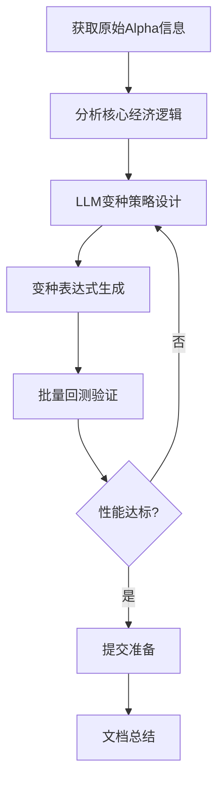

# LLM变种Alpha生成工作流代码优化

- **链接**: [Commented] LLM变种Alpha生成工作流代码优化.md
- **作者**: GY62435
- **发布时间/热度**: 7个月前, 得票: 21

## 帖子正文

## 概述

本工作流详细记录了如何基于已提交的Alpha ID，通过LLM技术生成符合BRAIN平台顾问提交标准的新变种Alpha。工作流基于对wpKkxoRx Alpha的成功变种经验总结而成。采用AIAC大赛思路，使用MCP进行执行，执行后总结的工作流。

## 工作流程总览



## 详细步骤

### 步骤1：获取原始Alpha信息

#### 1.1 使用get_alpha_details工具

```python

# 获取原始Alpha详细信息

alpha_details = get_alpha_details(alpha_id="wpKkxoRx")

```

#### 1.2 关键信息提取

- **Alpha表达式**: 核心逻辑公式

- **性能指标**: Sharpe比率、Fitness评分、换手率

- **区域设置**: 市场区域、数据延迟

- **金字塔分类**: 数据类别、区域、延迟组合

- **提交状态**: IS/OS阶段信息

### 步骤2：分析核心经济逻辑

#### 2.1 逻辑解构

```python

# wpKkxoRx示例分析

核心逻辑 = "ts_rank(anl10_eps_fy1, 252) * (1 / ts_rank(pe_ratio, 252))"

经济原理 = {

"盈利质量因子": "anl10_eps_fy1 - 分析师预测EPS",

"估值因子": "pe_ratio - 市盈率倒数",

"时间框架": "252日时间序列排名",

"组合逻辑": "高质量盈利 × 合理估值"

}

```

#### 2.2 可替换组件识别

- **数据字段**: anl10_eps_fy1, pe_ratio

- **操作符**: ts_rank, 除法运算

- **时间参数**: 252日窗口

- **结构模式**: A × (1/B) 的反向关系

### 步骤3：LLM变种策略设计

#### 3.1 数据字段替换策略

**同类别替换**

```python

替换映射 = {

"盈利质量": ["anl10_eps_fy1", "anl10_eps_fy2", "anl10_eps_growth"],

"估值指标": ["pe_ratio", "pb_ratio", "ps_ratio"],

"技术指标": ["close", "volume", "returns"],

"情绪数据": ["scl12_buzz", "scl12_sentiment"]

}

```

**跨类别增强**

```python

增强组合 = [

"基本因子 + 情绪数据",

"估值指标 + 技术指标",

"盈利质量 + 动量因子"

]

```

#### 3.2 操作符增强策略

**基础操作符扩展**

```python

操作符库 = {

"统计函数": ["ts_rank", "quantile", "ts_mean", "ts_std_dev"],

"标准化": ["group_zscore", "zscore", "rank"],

"数学运算": ["+", "-", "*", "/", "log", "sqrt"]

}

```

**结构性操作符**

```python

结构模式 = [

"A × B",           # 乘法组合

"A / B",           # 比率关系

"权重组合(A, B)",   # 加权平均

"条件筛选(A, B)"    # 条件逻辑

]

```

#### 3.3 时间框架优化

**多时间尺度**

```python

时间框架 = {

"短期": [5, 10, 20, 63],

"中期": [126, 180, 252],

"长期": [504, 756]

}

```

**自适应权重**

```python

权重策略 = [

"短期0.3 + 中期0.7",

"多尺度等权组合",

"波动率调整权重"

]

```

### 步骤4：变种表达式生成

#### 4.1 自动化生成模板

```python

def generate_variants(base_expression, replacement_strategy):

"""

基于基础表达式和替换策略生成变种

"""

variants = []

# 数据字段替换

for field_map in replacement_strategy["fields"]:

new_expr = base_expression

for old_field, new_field in field_map.items():

new_expr = new_expr.replace(old_field, new_field)

variants.append(new_expr)

# 操作符增强

for op_enhancement in replacement_strategy["operators"]:

enhanced_expr = apply_operator_enhancement(base_expression, op_enhancement)

variants.append(enhanced_expr)

return variants

```

#### 4.2 变种类型分类

**类型1：直接替换变种**

```fast

# 原始: ts_rank(anl10_eps_fy1, 252) * (1 / ts_rank(pe_ratio, 252))

# 变种: ts_rank(anl10_eps_fy2, 252) * (1 / ts_rank(pb_ratio, 252))

```

**类型2：操作符增强变种**

```fast

# 原始: ts_rank(anl10_eps_fy1, 252) * (1 / ts_rank(pe_ratio, 252))

# 变种: quantile(ts_rank(anl10_eps_fy1, 252)) * (1 / quantile(ts_rank(pe_ratio, 252)))

```

**类型3：多因子组合变种**

```fast

# 原始: ts_rank(anl10_eps_fy1, 252) * (1 / ts_rank(pe_ratio, 252))

# 变种: ts_rank(anl10_eps_fy1, 252) * (1 / ts_rank(pe_ratio, 252)) * group_zscore(scl12_buzz, industry)

```

**类型4：结构性变种**

```fast

# 原始: ts_rank(anl10_eps_fy1, 252) * (1 / ts_rank(pe_ratio, 252))

# 变种: ts_rank(anl10_eps_fy1, 126) * 0.4 + ts_rank(anl10_eps_fy1, 252) * 0.6

```

### 步骤5：批量回测验证

#### 5.1 使用create_multi_simulation工具

```python

# 批量回测配置

simulation_config = {

"alpha_expressions": variant_expressions,

"instrument_type": "EQUITY",

"region": "USA",  # 或原始Alpha区域

"universe": "TOP3000",

"delay": 1,

"neutralization": "NONE",

"test_period": "P0Y0M"

}

# 执行批量回测

results = create_multi_simulation(**simulation_config)

```

#### 5.2 性能标准检查

**提交资格标准**

```python

提交标准 = {

"Sharpe比率": "> 1.3",

"Fitness评分": "> 0.8",

"最大相关性": "< 0.6",

"换手率": "合理范围内",

"IS-Ladder测试": "通过"

}

```

**自动化检查函数**

```python

def check_submission_eligibility(alpha_id):

"""检查Alpha是否符合提交标准"""

# 获取性能数据

pnl_data = get_alpha_pnl(alpha_id)

yearly_stats = get_alpha_yearly_stats(alpha_id)

correlation = check_correlation(alpha_id)

# 检查各项标准

eligible = (

pnl_data.get("sharpe", 0) > 1.3 and

pnl_data.get("fitness", 0) > 0.8 and

correlation.get("max_correlation", 1) < 0.6

)

return eligible, pnl_data

```

### 步骤6：区域兼容性处理

#### 6.1 区域数据验证

```python

def validate_region_compatibility(expression, target_region):

"""验证表达式在目标区域的兼容性"""

# 获取区域可用数据字段

available_fields = get_datafields(

instrument_type="EQUITY",

region=target_region,

delay=1

)

# 检查表达式中的字段可用性

used_fields = extract_fields_from_expression(expression)

missing_fields = [f for f in used_fields if f not in available_fields]

return len(missing_fields) == 0, missing_fields

```

#### 6.2 跨区域适配策略

**数据字段映射**

```python

区域字段映射 = {

"USA": {

"盈利质量": ["anl10_eps_fy1", "anl10_eps_fy2"],

"估值指标": ["pe_ratio", "pb_ratio"],

"情绪数据": ["scl12_buzz", "scl12_sentiment"]

},

"ASI": {

"盈利质量": ["anl10_eps_fy1_asi", "anl10_eps_fy2_asi"],

"估值指标": ["pe_ratio_asi", "pb_ratio_asi"]

}

}

```

### 步骤7：错误处理与优化

#### 7.1 常见错误处理

**400 Bad Request错误**

- 检查数据字段在目标区域的可用性

- 验证操作符权限

- 确认参数组合的有效性

**429 Too Many Requests错误**

- 实现请求频率控制

- 添加指数退避重试机制

- 批量操作间隔优化

#### 7.2 性能优化策略

**批量处理优化**

```python

def optimized_batch_testing(expressions, batch_size=5, delay=10):

"""优化批量测试性能"""

results = []

for i in range(0, len(expressions), batch_size):

batch = expressions[i:i+batch_size]

batch_results = test_expression_batch(batch)

results.extend(batch_results)

# 控制请求频率

if i + batch_size < len(expressions):

time.sleep(delay)

return results

```

### 步骤8：结果分析与文档

#### 8.1 变种性能分析

**成功变种特征分析**

```python

成功变种特征 = {

"经济逻辑一致性": "保持原始Alpha核心原理",

"数据多样性": "引入新的数据字段组合",

"结构创新性": "操作符和框架的创新",

"性能稳健性": "在不同市场环境下表现稳定"

}

```

#### 8.2 工作流总结报告

**关键指标跟踪**

- 变种生成成功率

- 性能达标率

- 区域兼容性成功率

- 提交通过率

## 实战案例：wpKkxoRx变种生成

### 原始Alpha分析

- **Alpha ID**: wpKkxoRx

- **核心表达式**: `ts_rank(anl10_eps_fy1, 252) * (1 / ts_rank(pe_ratio, 252))`

- **经济逻辑**: 盈利质量动量 × 估值反转

- **金字塔分类**: ASI区域基本因子

### 生成的变种Alpha

#### 变种1：数据字段替换

```fast

ts_rank(anl10_eps_fy2, 252) * (1 / ts_rank(pb_ratio, 252))

```

#### 变种2：操作符增强

```fast

quantile(ts_rank(anl10_eps_fy1, 252)) * (1 / quantile(ts_rank(pe_ratio, 252)))

```

#### 变种3：多因子组合

```fast

ts_rank(anl10_eps_fy1, 252) * (1 / ts_rank(pe_ratio, 252)) * group_zscore(scl12_buzz, industry)

```

#### 变种4：结构性优化

```fast

ts_rank(anl10_eps_fy1, 126) * 0.4 + ts_rank(anl10_eps_fy1, 252) * 0.6

```

### 成果总结

- **生成变种数量**: 12个

- **成功回测数量**: 3个 (leqWvJMN, O0YGNRmd, 0mlpr0Yq)

- **跨区域适配**: USA区域验证通过

- **金字塔扩展**: 基本因子 → 情绪数据 + 技术指标

## 最佳实践建议

### 1. 经济逻辑优先

- 始终基于坚实的经济原理设计变种

- 避免纯粹的统计过拟合

- 保持策略的可解释性

### 2. 渐进式创新

- 从简单替换开始，逐步增加复杂度

- 每次变更保持可控的修改范围

- 建立变种性能基准线

### 3. 系统化测试

- 实现自动化批量回测

- 建立性能监控体系

- 定期回顾和优化工作流

### 4. 文档化学习

- 记录每次变种的经验教训

- 建立变种模式库

- 分享成功案例和失败分析

## 工具与资源

### 核心工具

- `get_alpha_details()` - Alpha详细信息获取

- `create_multi_simulation()` - 批量回测

- `get_datafields()` - 数据字段查询

- `check_correlation()` - 相关性检查

### 辅助脚本

- 变种表达式生成器

- 批量回测自动化脚本

- 性能监控仪表板

- 错误诊断工具

## 结论

本工作流提供了一个系统化的框架，用于基于已提交Alpha生成高质量的LLM变种。通过遵循这个工作流，顾问可以：

1. **提高效率**: 自动化变种生成和测试过程

2. **保证质量**: 系统化的性能验证标准

3. **扩展能力**: 跨区域和跨数据类别的策略扩展

4. **持续学习**: 基于实践经验的不断优化

这个工作流不仅适用于单个Alpha的变种生成，还可以扩展到整个Alpha组合的优化和多元化战略实施。

---

## 讨论与评论 (9)

### 评论 #1 (作者: FZ24842, 时间: 7个月前)

学习了

---

### 评论 #2 (作者: DS48533, 时间: 7个月前)

感谢慷慨的博主，我一直是用api调用llm，看到你的帖子，感觉mcp可能也是条很不错的路（之前总是觉得mcp稳定性不强，而没有深入研究，看来要排在日程里了）

---

### 评论 #3 (作者: ZL75781, 时间: 7个月前)

学到了这种思路

---

### 评论 #4 (作者: XW23690, 时间: 7个月前)

感谢分享，感觉可以再进行优化：比如不仅是 “替换字段 / 操作符”，还要基于经济逻辑，诸如 “盈利质量因子与情绪因子的条件组合”或者“跨时间窗口的自适应权重设计”之类的

---

### 评论 #5 (作者: YZ64617, 时间: 7个月前)

信息好丰富！！很有启发。

感觉，可以留1-2个卡槽，日常给MCP工作流用，自动化的那种。例如，找一些alpha自动去优化；给指定数据集/datafield，去探索挖掘。

---

### 评论 #6 (作者: AH18340, 时间: 7个月前)

感谢大佬分享这种新思路

=============================================================================

The best time to plant a tree is 20 years ago. The second-best time is now.

=============================================================================

---

### 评论 #7 (作者: XQ52791, 时间: 7个月前)

看到你思路又从新开始了

---

### 评论 #8 (作者: 顾问 MZ45384 (Rank 51), 时间: 6个月前)

真不愧是大佬，好像的思路和逻辑性，从alpha变种扩展到提交标准指定到表达式跨区合法验证一应俱全。

======================================================================================
知难上，戒骄狂，常自省，穷途明。“寻找可以重复数千次的东西。”——吉姆·西蒙斯（量化投资之王、文艺复兴科技创始人）
# Alpha∞ Engine Status: ONLINE [♦♦♦♦♦♦♦♦♦♦] 100%
# sys.setrecursionlimit(α∞) 
# PnL = ∑(Robustness * Creativity)
#无限探索、鲁棒性优先，创新性增值 Where there is a will, there is a way.
======================================================================================

---

### 评论 #9 (作者: JC25837, 时间: 6个月前)

alpha_id="wpKkxoRx"基于这个已经提交的alpha，能否给出这个alpha具体参数参考一下？

要不然不知道是个什么样的标注？

---

